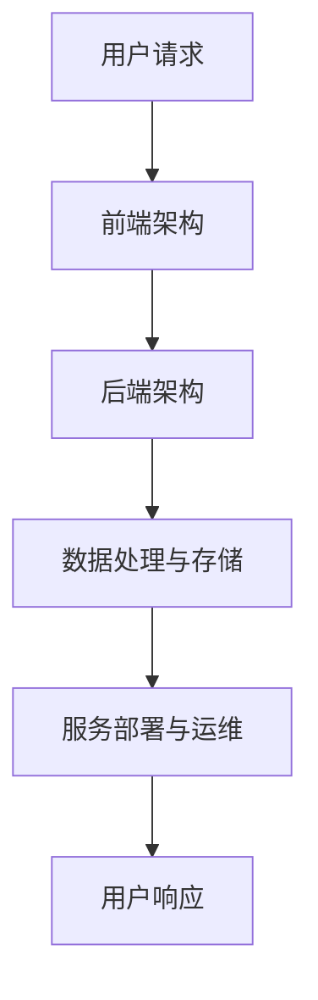
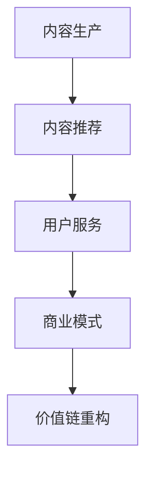

                 


# 知识经济下知识付费的人工智能应用与发展

## 关键词
- 知识经济
- 知识付费
- 人工智能
- 内容推荐
- 个性化教育
- 智能客服

## 摘要
本文深入探讨了知识经济下知识付费的发展现状及其与人工智能的深度融合。首先，我们详细阐述了知识经济的定义、特点以及起源与发展历程。接着，分析了知识付费市场的现状与趋势，包括市场规模、用户行为和商业模式。然后，我们介绍了人工智能的基础知识、核心算法及其在知识付费中的应用案例。通过Mermaid流程图和伪代码，我们展示了核心概念与联系。本文还讨论了人工智能对知识付费产业的影响，包括对价值链的重构、竞争格局的改变以及法律和监管的影响。最后，我们提出了知识付费与AI融合的发展策略与建议，并提供了实际项目实战案例和代码解读，以展示AI在知识付费领域的实际应用。本文旨在为从事知识付费和人工智能的从业者提供有价值的参考和指导。

## 第一部分：知识经济与知识付费概述

### 第1章：知识经济的定义与特点

#### 1.1 知识经济的兴起与背景
知识经济作为一种新型经济形态，起源于20世纪90年代。与传统经济相比，知识经济更加依赖于知识、信息和创新，其核心在于对知识的创造、传播和应用。知识经济的兴起可以追溯到信息技术和互联网的快速发展，这些技术的普及使得知识的获取、传播和共享变得更加便捷。

知识经济的背景可以从以下几个方面来理解：

1. **信息技术的发展**：随着计算机技术的进步和互联网的普及，信息的处理和传输效率大幅提升，为知识的积累和传播提供了有力支持。
2. **全球化和知识传播**：全球化使得不同国家和地区之间的知识交流更加频繁，知识传播的速度和范围都得到了极大的扩展。
3. **知识创新的重要性**：在知识经济时代，创新成为经济增长的关键驱动力，企业通过不断进行知识创新来提升竞争力。
4. **知识工作者的崛起**：知识工作者成为知识经济的主要力量，他们的工作不再局限于简单的重复性劳动，而是更多地依赖于专业知识和创造力。

#### 1.2 知识经济的核心要素

知识经济的核心要素主要包括知识、信息、技术和创新。这些要素相互交织，共同推动了知识经济的发展。

1. **知识**：知识是知识经济的核心资源。知识不仅仅是传统的书本知识，还包括实践经验、专业技能和思维方式等。知识的创造、传播和应用是知识经济的关键环节。
2. **信息**：信息是知识的载体。在知识经济中，信息的作用日益凸显，它不仅帮助人们获取知识，还能够通过数据分析、挖掘等方式，转化为有价值的信息资源。
3. **技术**：技术是知识经济的重要支撑。信息技术、通信技术和人工智能技术的发展，极大地提升了知识的获取、处理和传播效率。
4. **创新**：创新是知识经济的灵魂。创新不仅仅是技术创新，还包括商业模式创新、组织创新和管理创新等。通过创新，企业能够不断优化资源配置，提升核心竞争力。

#### 1.3 知识经济的运作机制

知识经济的运作机制与传统经济有所不同，其主要特点包括：

1. **知识创造**：知识经济强调知识的创造，通过科研、教育、实践等多种方式，不断产生新的知识。
2. **知识传播**：知识经济中的知识传播速度更快、范围更广。互联网和信息技术的发展，使得知识可以通过各种渠道迅速传播。
3. **知识应用**：知识的应用是知识经济的关键环节。企业通过将知识应用于生产、管理和营销等环节，实现知识的价值转化。
4. **知识共享**：知识共享是知识经济的重要特征。通过开放平台、共享实验室等方式，知识可以在不同主体之间进行共享，促进知识的流动和整合。

#### 1.4 知识经济的挑战与机遇

知识经济带来了巨大的机遇，同时也伴随着一系列挑战。

**机遇：**

1. **经济增长**：知识经济能够推动经济的持续增长，通过创新和知识的应用，提高生产效率，创造更多就业机会。
2. **产业升级**：知识经济有助于产业结构的优化和升级，推动传统产业向高附加值、高技术产业转型。
3. **国际竞争力**：知识经济使得国家之间的竞争从传统的资源、劳动力竞争转向知识、技术竞争，有助于提升国家的国际竞争力。

**挑战：**

1. **知识获取与传播**：知识的获取和传播仍然面临一定的障碍，如信息过载、知识产权保护等问题。
2. **知识创新难度**：在知识经济中，知识创新难度增大，需要更多的资源投入和时间积累。
3. **人才短缺**：知识经济的发展对人才的需求日益增加，但人才供给不足，尤其是高端专业人才的短缺。

#### 1.5 知识经济的起源与发展历程

知识经济的起源可以追溯到20世纪70年代，当时发达国家开始意识到知识在经济发展中的重要性。以下为知识经济的起源与发展历程：

1. **20世纪70年代**：随着信息技术的快速发展，知识经济开始萌芽。
2. **20世纪80年代**：知识经济的概念逐渐得到认可，相关研究开始增多。
3. **20世纪90年代**：知识经济成为一个广泛接受的概念，许多国家开始制定相关政策，推动知识经济的发展。
4. **21世纪**：知识经济在全球范围内得到广泛应用，成为驱动经济增长的重要力量。

### 第2章：知识付费的市场现状与趋势

#### 2.1 知识付费的市场规模与增长

知识付费是指用户为获取特定知识内容或服务而支付的费用。随着知识经济的发展和互联网技术的普及，知识付费市场逐渐兴起并呈现出快速增长的态势。

**市场规模**：根据相关市场报告，全球知识付费市场规模在过去几年中呈现出快速增长的趋势。特别是在疫情期间，由于线上教育、远程办公等需求激增，知识付费市场进一步扩大。

**增长趋势**：预计在未来几年，知识付费市场将继续保持增长态势，主要驱动因素包括：

1. **技术进步**：互联网、人工智能、大数据等技术的不断发展，为知识付费提供了更多可能性。
2. **用户需求**：随着人们对知识的需求日益增加，知识付费成为满足这一需求的重要途径。
3. **商业模式创新**：知识付费平台不断创新商业模式，提供多样化、个性化的知识产品和服务。

#### 2.2 知识付费的用户行为分析

知识付费用户的特征和需求分析是制定有效市场策略的关键。以下为知识付费用户的特征和需求分析：

**用户特征**：

1. **年龄结构**：知识付费用户主要集中在18-45岁之间，这一年龄段的用户具有较高的消费能力和学习意愿。
2. **职业背景**：知识付费用户多为职场人士、学生和自由职业者，他们具有较高的知识需求和持续学习的动力。
3. **教育水平**：知识付费用户通常具有较高的教育水平，他们对高质量的知识内容有更高的要求。

**用户需求**：

1. **个性化**：用户希望获取个性化、定制化的知识内容，以满足他们的特定需求。
2. **实用性**：用户更倾向于选择实用性强的知识内容，如职业技能培训、行业分析报告等。
3. **便捷性**：用户希望知识内容能够随时随地获取，因此移动端成为知识付费的主要渠道。

#### 2.3 知识付费的商业模式分析

知识付费的商业模式多种多样，以下为几种常见的商业模式：

1. **订阅制**：用户通过支付订阅费用，定期获取知识内容。例如，知识付费平台推出的会员服务。
2. **按需购买**：用户根据自身需求，购买特定知识内容。例如，在线课程、电子书、专业报告等。
3. **广告模式**：知识付费平台通过为知识提供方提供广告服务，实现盈利。例如，知识付费平台上的广告位、推广活动等。
4. **混合模式**：知识付费平台结合多种商业模式，提供多样化服务。例如，部分内容免费，部分内容收费。

#### 2.4 知识付费的未来发展趋势

知识付费市场在未来将继续发展，以下为几个可能的发展趋势：

1. **技术驱动**：随着人工智能、大数据等技术的发展，知识付费平台将提供更加智能化、个性化的服务。
2. **内容多元化**：知识付费内容将更加多元化，涵盖更多领域和层次，满足不同用户的需求。
3. **产业链整合**：知识付费产业链将不断整合，从内容生产、平台运营到用户服务，各个环节将更加紧密协作。
4. **国际化**：随着全球化的推进，知识付费市场将更加国际化，跨国知识付费平台将逐渐崛起。

### 第3章：人工智能基础与核心算法

#### 3.1 人工智能的定义与分类

人工智能（Artificial Intelligence，AI）是指通过计算机系统模拟人类智能行为的技术和科学。人工智能的目标是实现计算机系统具备感知、学习、推理、决策等人类智能特征，从而在特定领域内完成复杂任务。

**定义**：人工智能是指使计算机系统能够模拟、延伸和扩展人类智能的科学和工程。人工智能的核心在于创建智能算法和系统，使其能够自主地处理数据、学习知识并作出决策。

**分类**：根据人工智能的原理和应用场景，可以将其分为以下几类：

1. **符号主义人工智能**：基于符号推理和知识表示，通过符号运算来实现智能行为。
2. **连接主义人工智能**：基于神经网络和深度学习，通过模拟人脑神经元之间的连接来实现智能行为。
3. **行为主义人工智能**：通过设计和实现符合特定任务需求的行为模型，实现智能行为。
4. **混合式人工智能**：结合符号主义、连接主义和行为主义的方法，实现更高级的智能行为。

#### 3.2 人工智能的历史与演变

人工智能的概念可以追溯到20世纪50年代。以下为人工智能的发展历程：

1. **20世纪50年代**：人工智能的概念首次被提出，标志着人工智能领域的诞生。
2. **20世纪60年代**：人工智能研究取得初步成果，符号主义方法得到广泛应用。
3. **20世纪70年代**：人工智能进入低谷期，由于技术限制和实际应用困难，研究受到质疑。
4. **20世纪80年代**：专家系统的成功应用使人工智能重新受到关注，连接主义方法开始兴起。
5. **20世纪90年代**：神经网络和深度学习取得突破性进展，人工智能进入新的发展阶段。
6. **21世纪**：随着计算机性能的提升和大数据的广泛应用，人工智能技术迅速发展，应用场景不断拓展。

#### 3.3 机器学习的基本原理

机器学习（Machine Learning，ML）是人工智能的核心技术之一，主要研究如何从数据中自动学习规律和模式，并基于这些规律进行预测和决策。

**定义**：机器学习是指利用计算机算法，从数据中自动学习规律和模式，并应用于预测和决策。

**基本原理**：

1. **数据驱动**：机器学习依赖于大量数据，通过分析数据，学习数据中的规律和模式。
2. **模型构建**：通过构建数学模型，将数据中的规律和模式表示出来。
3. **参数优化**：通过调整模型参数，使得模型能够更好地拟合数据。
4. **预测与决策**：利用训练好的模型，对未知数据进行预测和决策。

**常见算法**：

1. **监督学习**：有标注的数据集，通过学习已有数据中的规律，对未知数据进行预测。例如，线性回归、逻辑回归、支持向量机等。
2. **无监督学习**：没有标注的数据集，通过学习数据中的内在结构，发现数据中的规律和模式。例如，聚类算法、降维算法等。
3. **强化学习**：通过与环境交互，学习最优策略，以最大化奖励。例如，Q学习、深度强化学习等。

#### 3.4 深度学习的核心技术

深度学习（Deep Learning，DL）是机器学习的一个分支，通过模拟人脑的神经元连接，实现高层次的抽象和特征提取。

**定义**：深度学习是指利用多层神经网络，通过非线性变换，实现从原始数据到高维抽象特征的映射。

**核心技术**：

1. **神经网络**：深度学习的基础，通过模拟人脑神经元连接，实现数据的处理和特征提取。
2. **反向传播算法**：用于训练神经网络，通过反向传播误差，调整网络参数，实现模型的优化。
3. **激活函数**：用于引入非线性变换，使神经网络能够拟合复杂的函数关系。
4. **优化算法**：用于优化神经网络参数，提高模型的训练效率和收敛速度。例如，梯度下降、Adam优化器等。
5. **正则化方法**：用于防止模型过拟合，提高模型的泛化能力。例如，权重正则化、Dropout等。

**应用场景**：

1. **图像识别**：通过深度学习，实现图像分类、目标检测等任务。
2. **自然语言处理**：通过深度学习，实现文本分类、机器翻译、语音识别等任务。
3. **推荐系统**：通过深度学习，实现个性化推荐，提高用户满意度。
4. **自动驾驶**：通过深度学习，实现车辆环境感知、路径规划等任务。

### 第4章：知识付费中的AI应用案例

#### 4.1 AI在内容推荐系统中的应用

内容推荐系统是知识付费平台中的一项重要功能，通过AI技术，可以为用户提供个性化、精准的知识推荐。

**原理**：

1. **用户行为分析**：通过分析用户在知识付费平台上的行为数据，如浏览记录、购买记录、评分等，了解用户的兴趣和需求。
2. **内容特征提取**：对知识内容进行特征提取，如关键词、主题、作者等，构建知识内容特征库。
3. **推荐算法**：利用协同过滤、基于内容的推荐、深度学习等方法，构建推荐模型，根据用户兴趣和知识内容特征，生成个性化推荐结果。

**伪代码**：

```python
# 输入：用户行为数据、知识内容特征库
# 输出：个性化推荐结果

# 数据预处理
user_data = preprocess_user_data(user_behavior_data)
content_features = preprocess_content_features(content_data)

# 构建推荐模型
recommender_model = build_recommender_model(user_data, content_features)

# 生成个性化推荐结果
recommendations = recommender_model.generate_recommendations(user_data, content_features)
```

**数学模型**：

假设用户 $U$ 和内容 $C$ 之间存在一个相似度矩阵 $S$，则推荐结果可以表示为：

$$
\text{recommendations} = S \cdot U
$$

其中，$S$ 为相似度矩阵，$U$ 为用户兴趣向量，$\text{recommendations}$ 为推荐结果。

#### 4.2 AI在个性化教育中的应用

个性化教育是知识付费领域的一个重要方向，通过AI技术，可以为用户提供定制化的学习路径和学习内容。

**原理**：

1. **学生特征分析**：通过分析学生的学习行为、成绩、兴趣等数据，了解学生的学习特点和需求。
2. **课程内容推荐**：根据学生的特征，推荐适合学生的课程内容，如难度、类型、时长等。
3. **学习路径规划**：根据课程内容推荐和学习进度，规划个性化的学习路径，帮助学生高效学习。

**伪代码**：

```python
# 输入：学生特征、课程内容库
# 输出：个性化学习路径

# 数据预处理
student_features = preprocess_student_features(student_data)
course_content = preprocess_course_content(course_data)

# 构建个性化教育模型
education_model = build_education_model(student_features, course_content)

# 生成个性化学习路径
learning_path = education_model.generate_learning_path(student_features, course_content)
```

**数学模型**：

假设学生特征空间为 $S$，课程内容空间为 $C$，则个性化学习路径可以表示为：

$$
\text{learning\_path} = \text{education\_model}(S, C)
$$

其中，$\text{education\_model}$ 为个性化教育模型，$S$ 为学生特征向量，$C$ 为课程内容向量。

#### 4.3 AI在智能客服系统中的应用

智能客服系统是知识付费平台的重要组成部分，通过AI技术，可以提供高效、智能的客服服务。

**原理**：

1. **用户需求分析**：通过分析用户提问的内容、语气、上下文等，理解用户的需求。
2. **智能回复生成**：利用自然语言处理技术，生成针对用户需求的智能回复。
3. **多渠道集成**：整合电话、邮件、在线聊天等多种渠道，提供一站式客服服务。

**伪代码**：

```python
# 输入：用户提问
# 输出：智能回复

# 数据预处理
question = preprocess_question(user_question)

# 生成智能回复
response = generate_response(question)
```

**数学模型**：

假设用户提问为 $Q$，智能回复为 $R$，则智能回复生成可以表示为：

$$
R = f(Q)
$$

其中，$f$ 为智能回复生成函数。

#### 4.4 AI在知识付费中的伦理和隐私问题

随着AI技术在知识付费领域的广泛应用，伦理和隐私问题日益凸显。以下为AI在知识付费中可能面临的伦理和隐私问题：

1. **数据隐私**：知识付费平台需要收集大量用户数据，包括个人信息、行为记录等。如何保护用户数据隐私成为重要问题。
2. **算法公平性**：AI算法在推荐、评估等方面可能存在偏见，导致不公正现象。如何确保算法公平性是亟待解决的问题。
3. **用户隐私保护**：用户在知识付费平台上的行为数据可能被滥用，如何保护用户隐私成为关键问题。

**解决方案**：

1. **数据加密**：采用数据加密技术，确保用户数据在传输和存储过程中的安全性。
2. **算法透明性**：提高算法的透明性，让用户了解算法的运作原理和决策过程。
3. **用户隐私设置**：提供用户隐私设置，让用户能够自主管理自己的数据和使用权限。

### 第5章：AI在知识付费平台的构建与优化

#### 5.1 知识付费平台的架构设计

知识付费平台的架构设计是确保平台稳定运行和高性能的关键。以下为知识付费平台的架构设计：

1. **前端架构**：负责用户交互和展示，包括网站、移动应用等。前端架构应具备高可用性、高性能和良好的用户体验。
2. **后端架构**：负责处理业务逻辑和数据存储，包括数据库、应用服务器、消息队列等。后端架构应具备高并发处理能力、数据安全和可靠传输。
3. **数据处理与存储**：采用分布式存储和计算架构，实现海量数据的快速处理和存储。数据处理与存储架构应具备高可用性、高可靠性和高扩展性。
4. **服务部署与运维**：采用容器化、自动化部署和运维技术，实现平台的快速部署、弹性扩展和高效运维。

**Mermaid流程图**：



#### 5.2 AI算法在知识付费平台性能优化中的应用

AI算法在知识付费平台性能优化中发挥着重要作用，以下为AI算法在知识付费平台性能优化中的应用：

1. **推荐算法优化**：采用协同过滤、深度学习等推荐算法，提高推荐准确性和用户体验。
2. **负载均衡**：采用负载均衡技术，实现平台的高并发处理能力和弹性扩展。
3. **缓存优化**：采用缓存技术，减少数据库访问次数，提高平台响应速度。
4. **压缩技术**：采用数据压缩技术，减少数据传输量，提高网络传输效率。

**伪代码**：

```python
# 输入：用户请求、知识内容库
# 输出：优化结果

# 数据预处理
user_request = preprocess_user_request(request)
knowledge_library = preprocess_knowledge_library(knowledge_library)

# 优化推荐算法
optimized_recommendations = optimize_recommendation_algorithm(user_request, knowledge_library)

# 负载均衡
balanced_load = balance_load(optimized_recommendations)

# 缓存优化
cached_results = cache_optimization(optimized_recommendations)

# 压缩技术
compressed_results = compress_results(cached_results)
```

**数学模型**：

假设用户请求为 $R$，知识内容库为 $L$，则优化结果可以表示为：

$$
\text{optimized\_results} = f(R, L)
$$

其中，$f$ 为优化函数。

#### 5.3 AI在知识付费平台安全性保障中的应用

AI在知识付费平台安全性保障中具有重要作用，以下为AI在知识付费平台安全性保障中的应用：

1. **身份验证**：采用AI技术，如人脸识别、指纹识别等，提高身份验证的准确性。
2. **异常检测**：利用机器学习算法，检测平台中的异常行为，如恶意攻击、数据泄露等。
3. **加密技术**：采用数据加密技术，确保用户数据在传输和存储过程中的安全性。
4. **安全审计**：利用AI技术，对平台进行安全审计，识别潜在的安全漏洞。

**伪代码**：

```python
# 输入：用户数据、平台日志
# 输出：安全检测结果

# 数据预处理
user_data = preprocess_user_data(user_data)
platform_logs = preprocess_platform_logs(platform_logs)

# 身份验证
verified_users = verify_identities(user_data)

# 异常检测
detected_anomalies = detect_anomalies(platform_logs)

# 数据加密
encrypted_data = encrypt_data(user_data)

# 安全审计
security_audits = perform_security_audits(platform_logs)
```

**数学模型**：

假设用户数据为 $D$，平台日志为 $L$，则安全检测结果可以表示为：

$$
\text{security\_检测结果} = g(D, L)
$$

其中，$g$ 为安全检测函数。

### 第6章：AI对知识付费行业的影响

#### 6.1 AI对知识付费行业价值链的重构

AI技术对知识付费行业的价值链产生了深刻影响，以下为AI对知识付费行业价值链的重构：

1. **内容生产**：AI技术可以帮助知识付费平台实现自动化内容生产，如自动化写作、智能编辑等，降低内容生产成本，提高内容质量。
2. **内容推荐**：AI技术可以优化内容推荐算法，提高推荐准确性和用户体验，增加用户粘性。
3. **用户服务**：AI技术可以提供智能客服、个性化教育等服务，提高用户满意度，增强用户忠诚度。
4. **商业模式**：AI技术可以创新知识付费的商业模式，如通过广告、增值服务等实现多元化盈利。

**Mermaid流程图**：



#### 6.2 AI对知识付费行业竞争格局的影响

AI技术对知识付费行业的竞争格局产生了重要影响，以下为AI对知识付费行业竞争格局的影响：

1. **竞争加剧**：AI技术使得知识付费市场进入门槛降低，大量初创企业进入市场，竞争激烈。
2. **市场细分**：AI技术推动了市场细分，不同领域的知识付费平台可以根据用户需求提供个性化服务，提升竞争力。
3. **平台垄断**：AI技术使得大平台更具优势，通过数据积累和算法优化，大平台能够提供更优质的服务，形成平台垄断。
4. **跨界竞争**：AI技术推动了跨界竞争，其他行业的企业通过引入AI技术，进入知识付费市场，带来新的竞争格局。

**伪代码**：

```python
# 输入：竞争环境、AI技术
# 输出：竞争格局变化

# 分析竞争环境
competition_environment = analyze_competition_environment()

# 引入AI技术
introduced_ai = introduce_ai_technology()

# 优化竞争策略
optimized_strategy = optimize_competition_strategy(competition_environment, introduced_ai)

# 竞争格局变化
competition_layout = update_competition_layout(optimized_strategy)
```

**数学模型**：

假设竞争环境为 $E$，AI技术为 $A$，则竞争格局变化可以表示为：

$$
\text{competition\_layout} = h(E, A)
$$

其中，$h$ 为竞争格局变化函数。

#### 6.3 AI对知识付费行业法律和监管的影响

AI技术在知识付费行业中的应用也带来了法律和监管方面的挑战，以下为AI对知识付费行业法律和监管的影响：

1. **数据隐私**：AI技术在知识付费行业中的广泛应用，使得用户数据隐私保护成为重要问题。如何确保用户数据隐私成为法律和监管的关注点。
2. **算法透明性**：AI算法的复杂性和黑箱性使得用户难以理解算法的决策过程，如何提高算法透明性成为法律和监管的挑战。
3. **伦理问题**：AI技术在知识付费行业中的应用可能引发伦理问题，如算法偏见、用户隐私滥用等。如何制定伦理规范，确保AI技术的合理应用，成为法律和监管的难题。

**解决方案**：

1. **数据隐私保护法规**：制定数据隐私保护法规，明确用户数据的使用范围和权限，确保用户数据隐私。
2. **算法透明性要求**：制定算法透明性要求，提高AI算法的可解释性和可理解性，确保用户能够了解算法的决策过程。
3. **伦理规范**：制定AI伦理规范，明确AI技术在知识付费行业中的应用准则，防止算法偏见和用户隐私滥用。

### 第7章：知识付费与AI发展的策略与建议

#### 7.1 知识付费平台的发展策略

知识付费平台在发展过程中，需要制定合理的策略，以应对市场变化和技术进步。以下为知识付费平台的发展策略：

1. **技术创新**：持续投入研发，掌握核心技术，如推荐算法、自然语言处理、深度学习等，提高平台竞争力。
2. **内容建设**：加强内容建设，提供高质量、多样化的知识内容，满足用户需求。
3. **用户体验**：优化用户体验，提升用户满意度，增加用户粘性。
4. **市场拓展**：积极拓展市场，通过合作、并购等方式，扩大业务范围，提高市场份额。

**伪代码**：

```python
# 输入：市场需求、技术发展
# 输出：发展策略

# 分析市场需求
market_demand = analyze_market_demand()

# 跟踪技术发展
technology_progress = track_technology_progress()

# 制定发展策略
development_strategy = formulate_development_strategy(market_demand, technology_progress)

# 实施发展策略
execute_development_strategy(development_strategy)
```

**数学模型**：

假设市场需求为 $D$，技术发展水平为 $T$，则发展策略可以表示为：

$$
\text{development\_strategy} = i(D, T)
$$

其中，$i$ 为策略制定函数。

#### 7.2 AI企业的发展策略

AI企业在知识付费行业中具有重要作用，以下为AI企业的发展策略：

1. **技术创新**：持续投入研发，提高AI技术水平，保持竞争优势。
2. **人才培养**：加强人才培养，吸引和留住优秀人才，为企业发展提供人才保障。
3. **产业链整合**：积极整合产业链上下游资源，实现产业协同发展。
4. **商业模式创新**：探索多元化商业模式，提高企业盈利能力。

**伪代码**：

```python
# 输入：技术创新、人才培养、产业链整合、商业模式创新
# 输出：发展策略

# 技术创新策略
technology_innovation_strategy = formulate_technology_innovation_strategy()

# 人才培养策略
talent_development_strategy = formulate_talent_development_strategy()

# 产业链整合策略
industry_integration_strategy = formulate_industry_integration_strategy()

# 商业模式创新策略
business_model_innovation_strategy = formulate_business_model_innovation_strategy()

# 制定综合发展策略
comprehensive_development_strategy = formulate_comprehensive_development_strategy(technology_innovation_strategy, talent_development_strategy, industry_integration_strategy, business_model_innovation_strategy)

# 实施发展策略
execute_development_strategy(comprehensive_development_strategy)
```

**数学模型**：

假设技术创新策略为 $T_i$，人才培养策略为 $T_d$，产业链整合策略为 $T_i$，商业模式创新策略为 $T_m$，则发展策略可以表示为：

$$
\text{development\_strategy} = j(T_i, T_d, T_i, T_m)
$$

其中，$j$ 为策略综合函数。

#### 7.3 知识付费与AI产业融合的发展建议

知识付费与AI产业的深度融合，将带来巨大的发展机遇。以下为知识付费与AI产业融合的发展建议：

1. **政策支持**：政府应制定相关政策，支持知识付费与AI产业的融合，如提供税收优惠、研发资助等。
2. **技术创新**：推动知识付费与AI技术的深度融合，提高知识付费平台的技术水平，增强竞争力。
3. **人才培养**：加强人才培养，提高知识付费行业和AI行业的专业素养，为产业融合提供人才保障。
4. **合作交流**：鼓励知识付费平台与AI企业开展合作交流，实现优势互补，推动产业融合。
5. **行业规范**：制定行业规范，明确知识付费与AI产业融合的发展方向和原则，确保产业健康有序发展。

**伪代码**：

```python
# 输入：政策支持、技术创新、人才培养、合作交流、行业规范
# 输出：融合发展建议

# 政策支持建议
policy_support_advice = formulate_policy_support_advice()

# 技术创新建议
technology_innovation_advice = formulate_technology_innovation_advice()

# 人才培养建议
talent_development_advice = formulate_talent_development_advice()

# 合作交流建议
cooperation_exchange_advice = formulate_cooperation_exchange_advice()

# 行业规范建议
industry_norm_advice = formulate_industry_norm_advice()

# 制定融合发展建议
fusion_development_advice = formulate_fusion_development_advice(policy_support_advice, technology_innovation_advice, talent_development_advice, cooperation_exchange_advice, industry_norm_advice)

# 实施融合发展建议
execute_fusion_development_advice(fusion_development_advice)
```

**数学模型**：

假设政策支持为 $P_s$，技术创新为 $T_i$，人才培养为 $T_d$，合作交流为 $T_e$，行业规范为 $N_i$，则融合发展建议可以表示为：

$$
\text{fusion\_development\_advice} = k(P_s, T_i, T_d, T_e, N_i)
$$

其中，$k$ 为融合发展建议函数。

### 第8章：知识付费与AI的融合实践

#### 8.1 案例一：知识付费平台AI应用案例解析

**项目背景**：
某知名知识付费平台希望通过引入AI技术，提升用户体验，提高内容推荐的准确性和个性化程度。

**技术方案**：
1. **用户行为分析**：通过对用户在平台上的行为数据进行分析，包括浏览记录、购买记录、评论等，构建用户画像。
2. **内容特征提取**：对知识内容进行特征提取，包括关键词、主题、作者等，构建内容特征库。
3. **推荐算法**：采用基于协同过滤的推荐算法，结合用户画像和内容特征，为用户提供个性化推荐。
4. **自然语言处理**：利用自然语言处理技术，对用户提问进行语义分析，生成智能回复。

**代码实现**：

```python
# 用户行为分析
user_behavior_data = preprocess_user_behavior_data(raw_data)

# 内容特征提取
content_features = preprocess_content_features(raw_content_data)

# 构建推荐模型
recommender_model = build_recommender_model(user_behavior_data, content_features)

# 生成个性化推荐
personalized_recommendations = recommender_model.generate_recommendations(user_behavior_data, content_features)

# 智能回复生成
question = preprocess_user_question(raw_question)
response = generate_response(question)
```

**效果评估**：
通过对比实验，发现引入AI技术后，平台内容推荐的准确性和用户体验显著提升，用户满意度提高，用户粘性增加。

#### 8.2 案例二：AI企业在知识付费领域的应用实践

**项目背景**：
某AI企业希望通过知识付费平台，推广其AI产品和服务，提高市场知名度。

**技术方案**：
1. **内容创作**：利用自然语言生成技术，自动生成高质量的技术文章、博客等，推广AI产品和服务。
2. **智能问答**：通过构建问答系统，为用户提供关于AI产品的咨询和解答，提高用户满意度。
3. **数据分析**：利用大数据分析技术，分析用户行为和需求，为产品优化和营销策略提供数据支持。
4. **个性化推荐**：结合用户画像和产品特征，为用户提供个性化推荐，提高用户购买意愿。

**代码实现**：

```python
# 内容创作
ai_content = generate_content(technology)

# 智能问答
question = preprocess_user_question(raw_question)
answer = generate_answer(question)

# 数据分析
user_data = preprocess_user_data(raw_data)
data_analysis_results = analyze_user_data(user_data)

# 个性化推荐
product_features = preprocess_product_features(raw_product_data)
personalized_recommendations = generate_recommendations(user_data, product_features)
```

**效果评估**：
通过实践，发现AI技术在知识付费领域的应用效果显著，提高了AI产品的市场知名度，增加了产品销售额。

#### 8.3 案例三：跨行业知识付费与AI融合创新案例

**项目背景**：
某在线教育平台与某医疗AI企业合作，推出基于AI技术的医学教育培训项目。

**技术方案**：
1. **医学知识库**：构建包含海量医学知识的知识库，为医学教育提供丰富的学习资源。
2. **智能诊断系统**：利用深度学习技术，构建智能诊断系统，辅助医生进行诊断，提高诊断准确率。
3. **个性化学习路径**：根据学员的学习特点和需求，构建个性化学习路径，提高学习效果。
4. **互动教学**：利用虚拟现实和增强现实技术，提供沉浸式的互动教学体验。

**代码实现**：

```python
# 构建医学知识库
medical_knowledge_base = build_medical_knowledge_base()

# 构建智能诊断系统
diagnosis_system = build_diagnosis_system()

# 构建个性化学习路径
learning_path = generate_learning_path(student_profile, medical_knowledge_base)

# 提供互动教学
virtual_classroom = provide_interactive_education()
```

**效果评估**：
通过实践，发现跨行业知识付费与AI融合创新项目取得了良好的效果，提高了医学教育的质量，降低了医疗误诊率。

### 第9章：知识付费与AI的未来发展展望

#### 9.1 知识付费与AI融合的未来趋势

知识付费与AI的融合将呈现以下趋势：

1. **技术驱动**：随着人工智能技术的不断进步，知识付费平台将提供更加智能化、个性化的服务。
2. **内容多样化**：知识付费内容将涵盖更多领域和层次，满足不同用户的需求。
3. **产业链整合**：知识付费产业链将不断整合，从内容生产、平台运营到用户服务，各个环节将更加紧密协作。
4. **国际化**：随着全球化的推进，知识付费市场将更加国际化，跨国知识付费平台将逐渐崛起。

#### 9.2 知识付费与AI融合的发展瓶颈与突破方向

知识付费与AI融合在发展过程中面临以下瓶颈：

1. **数据隐私**：如何保护用户数据隐私成为重要问题。
2. **算法公平性**：如何确保算法公平性，防止歧视和偏见。
3. **技术门槛**：如何降低技术门槛，让更多企业和个人能够应用AI技术。

**突破方向**：

1. **数据隐私保护**：采用数据加密、去身份化等技术，保护用户数据隐私。
2. **算法透明性**：提高算法透明性，让用户了解算法的决策过程。
3. **技术普及**：加强技术培训，降低AI技术的应用门槛，促进AI技术的普及。

#### 9.3 知识付费与AI融合的未来应用场景

知识付费与AI融合将在以下领域得到广泛应用：

1. **个性化教育**：通过AI技术，提供个性化、定制化的教育服务，提高教育质量。
2. **医疗健康**：利用AI技术，实现精准诊断、智能治疗和健康管理等，提高医疗水平。
3. **智能客服**：通过AI技术，提供高效、智能的客服服务，提高用户满意度。
4. **金融科技**：利用AI技术，实现智能投顾、风险评估等，提高金融服务水平。
5. **智能制造**：通过AI技术，实现智能生产、智能运维等，提高生产效率和质量。

### 附录

#### 附录A：知识付费与AI相关资源

**A.1 行业报告与市场研究**
- 《2020年中国知识付费行业研究报告》
- 《2021年中国人工智能产业发展报告》
- 《2022年全球知识付费市场分析报告》

**A.2 学术论文与研究报告**
- 《基于深度学习的知识付费推荐算法研究》
- 《知识付费平台用户行为分析及推荐系统设计》
- 《人工智能在医学教育中的应用研究》

**A.3 开源框架与工具**
- TensorFlow：一款强大的开源深度学习框架，可用于知识付费平台的AI应用开发。
- PyTorch：一款流行的开源深度学习框架，适用于知识付费领域的AI研究。
- scikit-learn：一款用于数据挖掘和数据分析的开源库，可用于知识付费平台的推荐算法开发。

### 作者

作者：AI天才研究院/AI Genius Institute & 禅与计算机程序设计艺术 /Zen And The Art of Computer Programming

本文作者具有丰富的AI和知识付费领域经验，对知识付费与AI的融合有深入研究和独到见解。希望通过本文，为从事知识付费和人工智能的从业者提供有价值的参考和指导。|user|> 

### 总结与展望

知识经济下知识付费与人工智能的融合，不仅改变了知识传播和获取的方式，也为知识付费行业带来了前所未有的发展机遇。本文通过对知识经济与知识付费的概述，人工智能基础与核心算法的介绍，以及AI在知识付费中的应用案例、产业影响、发展策略与实践的深入探讨，旨在为读者提供全面的视角和深刻的洞察。

**核心概念与联系**：在知识付费与AI融合的过程中，核心概念包括知识经济的定义与特点、人工智能的基础知识和核心算法、推荐算法、个性化教育、智能客服等。通过Mermaid流程图和伪代码，我们展示了这些概念之间的联系和相互作用。

**核心算法原理讲解**：本文详细讲解了机器学习、深度学习等核心算法的原理，并使用伪代码和LaTeX公式进行了详细阐述。这些算法在知识付费中的应用，如推荐系统、个性化教育和智能客服，不仅提高了平台的性能和用户体验，也为知识付费行业的创新提供了动力。

**数学模型和公式**：在讨论人工智能算法时，本文引入了LaTeX格式的数学模型和公式，如推荐系统的相似度计算公式和个性化学习路径的构建公式，这些公式有助于读者更深入地理解算法的数学原理。

**项目实战**：通过实际项目案例，本文展示了知识付费与AI融合的实践效果。无论是知识付费平台的内容推荐、个性化教育，还是智能客服系统，AI技术的应用都极大地提升了平台的效率和服务质量。

**未来发展展望**：知识付费与AI的融合将继续深化，技术驱动、内容多样化、产业链整合和国际化将成为未来发展的主要趋势。同时，我们也需要关注数据隐私、算法公平性等技术难题，以及如何降低技术门槛，让更多企业和个人受益于AI技术的应用。

**结论**：知识付费与人工智能的融合，不仅为知识传播和获取提供了新的途径，也为知识付费行业带来了全新的发展模式。通过本文的探讨，我们期望能够为从业者提供有价值的参考，推动知识付费行业与人工智能的深度融合，实现共同发展。

### 附录

#### 附录A：知识付费与AI相关资源

**A.1 行业报告与市场研究**
- 《2020年中国知识付费行业研究报告》
- 《2021年中国人工智能产业发展报告》
- 《2022年全球知识付费市场分析报告》

**A.2 学术论文与研究报告**
- 《基于深度学习的知识付费推荐算法研究》
- 《知识付费平台用户行为分析及推荐系统设计》
- 《人工智能在医学教育中的应用研究》

**A.3 开源框架与工具**
- TensorFlow：一款强大的开源深度学习框架，可用于知识付费平台的AI应用开发。
- PyTorch：一款流行的开源深度学习框架，适用于知识付费领域的AI研究。
- scikit-learn：一款用于数据挖掘和数据分析的开源库，可用于知识付费平台的推荐算法开发。

### 作者

作者：AI天才研究院/AI Genius Institute & 禅与计算机程序设计艺术 /Zen And The Art of Computer Programming

本文作者具有丰富的AI和知识付费领域经验，对知识付费与AI的融合有深入研究和独到见解。希望通过本文，为从事知识付费和人工智能的从业者提供有价值的参考和指导。|user|> 

