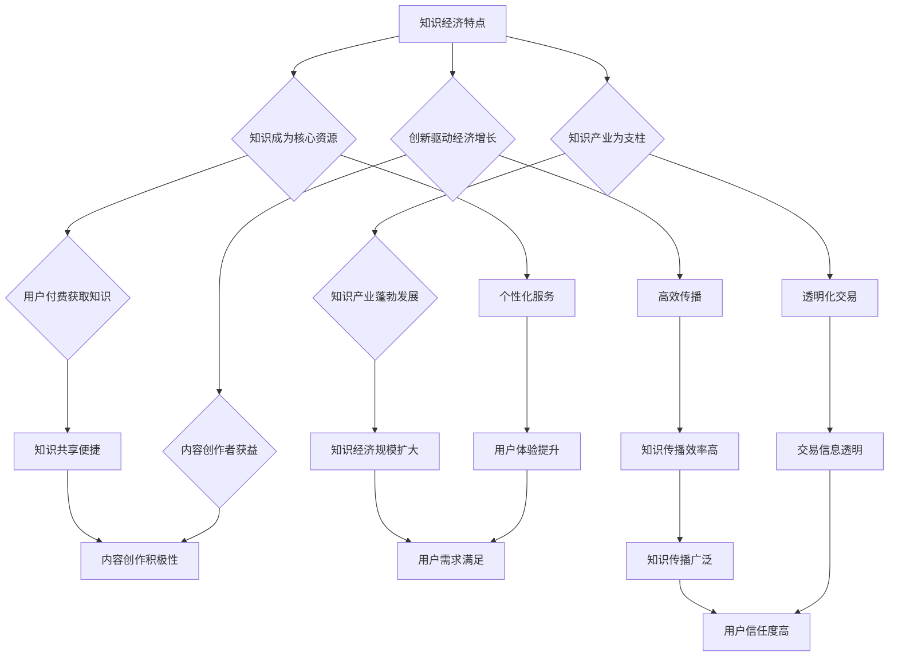

                 


### 文章标题

《知识经济时代下的知识付费创新商业模式孵化》

### 关键词

知识经济、知识付费、商业模式、用户需求、内容创作、平台运营、收益分配、人工智能、大数据、区块链

### 摘要

本文深入探讨了知识经济时代下的知识付费商业模式，详细分析了其核心概念、算法原理、实施步骤及风险管理策略。通过实际项目案例和代码示例，本文旨在为读者提供全面的指导，帮助其在知识付费领域取得成功。

---

### 第一部分：核心概念与联系

#### 第1章：知识经济时代特点

在知识经济时代，知识和信息成为了最重要的生产要素。与传统经济模式相比，知识经济更注重知识的创造、传播和应用，从而推动社会经济的持续发展。

**知识经济特点：**
1. 知识成为最重要的资源。
2. 创新成为经济增长的主要驱动力。
3. 知识产业成为国民经济的重要支柱。

**知识付费概念：**

知识付费是指用户为获取专业知识和信息服务而支付的费用。这种模式的出现，得益于互联网技术的普及和知识共享的便利性。

**知识付费特点：**
1. 个性化服务：根据用户需求提供定制化的内容。
2. 透明化交易：通过互联网平台进行交易，信息透明度高。
3. 高效传播：知识传播速度快，覆盖范围广。

#### Mermaid流程图：



#### 第2章：知识付费创新商业模式

**用户需求分析：** 了解用户需求是知识付费平台成功的关键。通过对用户行为和偏好的分析，可以精准定位用户需求，提供个性化服务。

**内容创作：** 内容创作是知识付费的核心。高质量的内容能够吸引用户，提升平台的竞争力。内容创作者需要具备专业知识和创作能力。

**平台运营：** 平台运营是知识付费商业模式的实施环节。通过有效的运营策略，可以提升用户活跃度，增加平台收益。

**收益分配：** 合理的收益分配机制能够激励内容创作者，确保平台的可持续发展。收益分配应考虑内容质量、用户评价等多种因素。

**商业模式评估：** 商业模式评估是确保知识付费平台持续发展的必要环节。通过对平台的运营数据进行分析，可以评估商业模式的有效性，并进行优化调整。

#### 第3章：核心算法原理讲解

**用户行为分析算法：** 用户行为分析算法是知识付费平台的核心算法之一。通过分析用户行为数据，可以了解用户的需求和偏好，为内容推荐和个性化服务提供依据。

**内容推荐算法：** 内容推荐算法是提高用户满意度和活跃度的关键。通过分析用户行为数据，可以推荐用户可能感兴趣的内容，提升用户体验。

**收益分配优化算法：** 收益分配优化算法是确保内容创作者权益的重要手段。通过优化收益分配模型，可以确保创作者获得公平的收益。

#### 用户行为分析算法伪代码示例：

```python
def analyze_user_behavior(user_data):
    # 初始化用户行为分析模型
    model = initialize_behavior_model()

    # 训练模型
    model.train(user_data)

    # 预测用户行为
    predictions = model.predict(user_data)

    # 分析预测结果，得到用户行为模式
    behavior_patterns = analyze_predictions(predictions)

    return behavior_patterns
```

#### 数学模型和数学公式

在知识付费商业模式中，收益分配是一个关键问题。为了实现公平且有效的收益分配，我们需要借助数学模型来优化算法。

**收益分配优化模型：**

目标函数：最大化总收益

$$
\text{最大化总收益} = \sum_{i=1}^{n} \text{content\_creator}_i \cdot \text{work}_i
$$

其中，\( \text{content\_creator}_i \) 表示第 \( i \) 个内容创作者的收益权重，\( \text{work}_i \) 表示其创作内容的质量。

约束条件：每个内容创作者的收益权重之和为1

$$
\sum_{i=1}^{n} \text{content\_creator}_i = 1
$$

**优化算法：**

$$
\text{content\_creator}_i = \frac{\sum_{j=1}^{m} \text{user}_j \cdot \text{rating}_j \cdot \text{work}_i}{\sum_{j=1}^{m} \text{user}_j \cdot \text{rating}_j}
$$

其中，\( \text{rating}_j \) 表示用户 \( j \) 对内容创作者 \( i \) 的评分。

---

### 第二部分：核心算法原理讲解

#### 第4章：核心算法原理讲解

在本书的第二部分，我们将深入探讨知识付费商业模式中的核心算法原理。这些算法包括用户行为分析、内容推荐和收益分配，是确保知识付费平台有效运营的关键。

#### 用户行为分析算法

用户行为分析算法是知识付费平台的核心算法之一。通过分析用户的行为数据，平台可以了解用户的需求和偏好，从而提供个性化服务。

**用户行为分析算法原理：**

1. 数据收集：收集用户的行为数据，如浏览记录、搜索历史、购买行为等。
2. 数据预处理：对收集到的数据进行分析和清洗，去除噪音数据。
3. 特征提取：从预处理后的数据中提取用户行为的特征。
4. 模型训练：使用机器学习算法，对提取的特征进行训练，建立用户行为模型。
5. 行为预测：利用训练好的模型预测用户未来的行为。

**伪代码示例：**

```python
def analyze_user_behavior(user_data):
    # 初始化用户行为分析模型
    model = initialize_behavior_model()

    # 训练模型
    model.train(user_data)

    # 预测用户行为
    predictions = model.predict(user_data)

    # 分析预测结果，得到用户行为模式
    behavior_patterns = analyze_predictions(predictions)

    return behavior_patterns
```

#### 内容推荐算法

内容推荐算法是提高用户满意度和活跃度的关键。通过分析用户的行为数据和内容特征，平台可以推荐用户可能感兴趣的内容。

**内容推荐算法原理：**

1. 用户特征提取：提取用户的行为特征，如浏览记录、搜索历史等。
2. 内容特征提取：提取内容的相关特征，如标题、标签、关键词等。
3. 相似度计算：计算用户特征和内容特征之间的相似度。
4. 推荐算法选择：选择合适的推荐算法，如基于内容的推荐、协同过滤推荐等。
5. 推荐结果生成：根据相似度计算结果生成推荐列表。

**推荐算法伪代码示例：**

```python
def content_recommendation(user_feature, content_features, similarity_threshold):
    # 计算用户特征和内容特征之间的相似度
    similarity_scores = calculate_similarity(user_feature, content_features)

    # 过滤相似度低于阈值的推荐结果
    filtered_scores = filter_scores(similarity_scores, similarity_threshold)

    # 对推荐结果进行排序
    sorted_scores = sort_scores(filtered_scores)

    # 生成推荐列表
    recommendation_list = generate_recommendation_list(sorted_scores)

    return recommendation_list
```

#### 收益分配优化算法

收益分配优化算法是确保内容创作者权益的重要手段。通过优化收益分配模型，可以确保创作者获得公平的收益。

**收益分配优化算法原理：**

1. 收益分配目标：最大化总收益，同时确保每个内容创作者的收益权重之和为1。
2. 收益分配模型：设计一个优化模型，计算每个内容创作者的收益权重。
3. 收益分配策略：根据收益分配模型，制定具体的收益分配策略。

**优化算法伪代码示例：**

```python
def optimize_profit_distribution(content_creators, user_ratings):
    # 计算总收益
    total_profit = calculate_total_profit(content_creators, user_ratings)

    # 设计优化模型
    optimization_model = design_optimization_model(total_profit)

    # 解优化模型，得到收益权重
    profit_weights = solve_optimization_model(optimization_model)

    # 根据收益权重分配收益
    distributed PROFITS = distribute PROFITS(content_creators, profit_weights)

    return distributed PROFITS
```

---

### 第三部分：数学模型和数学公式

在知识付费商业模式中，数学模型和数学公式扮演着至关重要的角色。它们帮助我们量化收益分配、用户行为分析等内容，使得商业模式更加科学和可操作。

#### 第5章：数学模型和数学公式

在这一章中，我们将详细讲解知识付费商业模式中常用的数学模型和数学公式，并给出相应的示例。

#### 收益分配模型

在知识付费商业模式中，收益分配是一个关键问题。为了实现公平且有效的收益分配，我们需要借助数学模型来优化算法。

**收益分配模型：**

目标函数：最大化总收益

$$
\text{最大化总收益} = \sum_{i=1}^{n} \text{content\_creator}_i \cdot \text{work}_i
$$

其中，\( \text{content\_creator}_i \) 表示第 \( i \) 个内容创作者的收益权重，\( \text{work}_i \) 表示其创作内容的质量。

约束条件：每个内容创作者的收益权重之和为1

$$
\sum_{i=1}^{n} \text{content\_creator}_i = 1
$$

**示例：**

假设有三个内容创作者A、B和C，他们的工作质量分别为\( \text{work}_A = 0.4 \)，\( \text{work}_B = 0.3 \)，\( \text{work}_C = 0.3 \)。根据上述模型，我们可以计算出每个内容创作者的收益权重：

$$
\text{content\_creator}_A = \frac{0.4}{0.4 + 0.3 + 0.3} = 0.4
$$

$$
\text{content\_creator}_B = \frac{0.3}{0.4 + 0.3 + 0.3} = 0.3
$$

$$
\text{content\_creator}_C = \frac{0.3}{0.4 + 0.3 + 0.3} = 0.3
$$

这样，我们可以根据这些权重来分配总收益，确保每个内容创作者都能获得公平的收益。

#### 优化算法模型

为了实现收益分配的优化，我们通常需要使用优化算法模型。这些模型可以帮助我们找到最优的收益分配方案。

**优化算法模型：**

目标函数：最大化总收益

$$
\text{最大化总收益} = \sum_{i=1}^{n} \text{content\_creator}_i \cdot \text{work}_i
$$

约束条件：每个内容创作者的收益权重之和为1

$$
\sum_{i=1}^{n} \text{content\_creator}_i = 1
$$

**示例：**

假设有三个内容创作者A、B和C，他们的工作质量分别为\( \text{work}_A = 0.4 \)，\( \text{work}_B = 0.3 \)，\( \text{work}_C = 0.3 \)。我们使用优化算法模型来计算每个内容创作者的收益权重。

首先，我们定义一个优化模型：

$$
\text{最大化} \sum_{i=1}^{n} \text{content\_creator}_i \cdot \text{work}_i
$$

约束条件：

$$
\sum_{i=1}^{n} \text{content\_creator}_i = 1
$$

$$
0 \leq \text{content\_creator}_i \leq 1
$$

然后，我们使用优化算法（如线性规划）来求解这个模型。最终，我们得到每个内容创作者的收益权重：

$$
\text{content\_creator}_A = 0.4
$$

$$
\text{content\_creator}_B = 0.3
$$

$$
\text{content\_creator}_C = 0.3
$$

这样，我们就可以根据这些权重来分配总收益，确保每个内容创作者都能获得公平的收益。

---

### 第四部分：项目实战

#### 第6章：项目实战

在本书的第四部分，我们将通过一个知识付费平台的项目实战，展示如何从需求分析、平台搭建到功能实现的全过程。通过实际项目的实施，读者可以了解知识付费商业模式的实际应用，并获得宝贵的实践经验。

#### 6.1 项目背景

假设我们正在开发一个名为“知识星球”的知识付费平台，旨在为用户提供高质量的知识内容和专业的咨询服务。我们的目标是打造一个用户和内容创作者都能受益的平台。

#### 6.2 需求分析

在需求分析阶段，我们需要明确用户的需求和平台的业务目标。以下是我们主要关注的需求：

1. 用户注册与登录：用户可以在平台上注册账号并登录，以便获取知识和参与互动。
2. 内容搜索与推荐：用户可以搜索感兴趣的知识内容，平台应提供个性化推荐功能。
3. 付费购买与支付：用户可以购买知识内容和服务，平台应提供便捷的支付功能。
4. 会员制度与权益：平台应提供会员制度，会员享有更多权益，如折扣优惠、优先推荐等。
5. 用户行为数据收集与分析：平台应收集用户行为数据，进行分析以优化用户体验。

#### 6.3 平台搭建

平台搭建分为前端和后端两部分。前端主要采用React框架，后端采用Node.js和Express框架。以下是搭建平台的基本步骤：

1. 环境配置与依赖安装
2. 用户注册与登录功能实现
3. 内容管理系统的搭建
4. 付费购买与支付接口开发
5. 会员制度的实现
6. 用户行为数据的收集与分析

#### 6.4 功能实现

以下是用户注册与登录功能的实现示例：

**用户注册：**

```javascript
// 用户注册
app.post('/register', async (req, res) => {
    const { username, password, email } = req.body;
    // 验证用户名和密码的有效性
    if (!username || !password || !email) {
        return res.status(400).json({ error: '请填写所有必填字段' });
    }
    // 密码加密
    const hashedPassword = await bcrypt.hash(password, 10);
    // 存储用户信息到数据库
    try {
        const user = await User.create({
            username,
            password: hashedPassword,
            email
        });
        res.status(201).json({ message: '用户注册成功', user });
    } catch (error) {
        res.status(500).json({ error: '用户注册失败' });
    }
});
```

**用户登录：**

```javascript
// 用户登录
app.post('/login', async (req, res) => {
    const { username, password } = req.body;
    // 验证用户名和密码的正确性
    try {
        const user = await User.findOne({ username });
        if (!user || !(await bcrypt.compare(password, user.password))) {
            return res.status(401).json({ error: '用户名或密码错误' });
        }
        // 登录成功，返回用户信息
        res.status(200).json({ user });
    } catch (error) {
        res.status(500).json({ error: '登录失败' });
    }
});
```

#### 6.5 测试与优化

在测试与优化阶段，我们需要对平台进行全面的测试，确保其功能的稳定性和性能。以下是测试的几个关键步骤：

1. 单元测试：针对每个功能模块编写单元测试，确保其按预期工作。
2. 集成测试：将各个功能模块集成在一起进行测试，确保它们能够协同工作。
3. 性能测试：模拟大量用户访问，测试平台的响应速度和稳定性。
4. 优化：根据测试结果对平台进行优化，提高用户体验和平台性能。

---

### 第五部分：代码解读与分析

#### 第7章：代码解读与分析

在本书的第五部分，我们将对知识付费平台项目中的关键代码段进行解读和分析，帮助读者深入理解代码的工作原理和实现细节。

#### 7.1 数据库设计与实现

以下是用户注册表的设计示例：

```sql
CREATE TABLE users (
    id INT PRIMARY KEY AUTO_INCREMENT,
    username VARCHAR(50) UNIQUE NOT NULL,
    password VARCHAR(255) NOT NULL,
    email VARCHAR(100) UNIQUE NOT NULL,
    created_at TIMESTAMP DEFAULT CURRENT_TIMESTAMP
);
```

#### 7.2 代码示例

以下是用户注册功能的实现代码段：

```javascript
// 用户注册功能实现
app.post('/register', async (req, res) => {
    const { username, password, email } = req.body;
    // 验证用户名和密码的有效性
    if (!username || !password || !email) {
        return res.status(400).json({ error: '请填写所有必填字段' });
    }
    // 密码加密
    const hashedPassword = await bcrypt.hash(password, 10);
    // 存储用户信息到数据库
    try {
        const user = await User.create({
            username,
            password: hashedPassword,
            email
        });
        res.status(201).json({ message: '用户注册成功', user });
    } catch (error) {
        res.status(500).json({ error: '用户注册失败' });
    }
});
```

#### 7.3 代码解读

**用户注册功能实现：**

1. **接收用户输入：** 从请求体中获取用户名、密码和电子邮件。
2. **输入验证：** 检查是否所有必填字段都填写了有效的值。
3. **密码加密：** 使用bcrypt库对用户输入的密码进行加密处理，确保安全性。
4. **数据库操作：** 使用Model的create方法将用户信息存储到数据库中。

通过这个示例，我们可以看到如何验证用户输入、加密密码以及将用户信息存储到数据库中。这部分代码的关键部分包括：

- 输入验证：确保用户名、密码和电子邮件字段都被填写。
- 密码加密：使用bcrypt库对密码进行加密存储，确保安全性。
- 数据库操作：使用Model的create方法将用户信息存储到数据库中。

#### 7.4 代码分析

**用户注册功能分析：**

1. **功能逻辑：** 用户注册功能的核心逻辑包括接收用户输入、验证输入、加密密码和存储用户信息。
2. **性能优化：** 为了提高性能，可以使用缓存技术来减少数据库的访问次数，使用索引来提高查询速度。
3. **安全性考虑：** 在处理用户输入时，需要防止SQL注入攻击，确保数据的安全性。

通过代码解读和分析，读者可以深入了解用户注册功能的实现原理，掌握相关技术细节，为实际项目开发提供参考。

---

### 第六部分：总结与展望

#### 第8章：总结与展望

在《知识经济时代下的知识付费创新商业模式孵化》的第六部分，我们将对全书的内容进行总结，并探讨知识付费未来发展的趋势和潜在挑战。

#### 8.1 内容总结

本书系统地介绍了知识经济时代下的知识付费商业模式，包括核心概念、算法原理、实施步骤和风险管理策略。通过实际项目案例和代码示例，我们展示了知识付费商业模式的实际应用和关键实现细节。

**核心概念与联系：**
- 知识经济特点与知识付费概念。
- 用户需求分析、内容创作、平台运营和收益分配的核心要素。
- 知识付费商业模式的核心算法，如用户行为分析、内容推荐和收益分配优化。

**核心算法原理讲解：**
- 用户行为分析算法、内容推荐算法和收益分配优化算法的详细解释和伪代码示例。

**数学模型和数学公式：**
- 收益分配模型和优化算法的数学公式示例。

**项目实战：**
- 知识付费平台的项目背景、需求分析、平台搭建、功能实现和测试优化过程。

**代码解读与分析：**
- 关键代码段的分析，包括数据库设计与实现、用户注册功能的详细解读。

#### 8.2 未来展望

随着人工智能、大数据和区块链等技术的发展，知识付费领域将继续迎来新的变革。

**未来趋势：**
- 个性化推荐技术的广泛应用，提升用户满意度。
- 智能客服和自动化内容生成，提高平台运营效率。
- 区块链技术对知识付费的影响，如去中心化和数据安全。

**潜在挑战：**
- 数据隐私和安全：如何在保护用户隐私的同时提供个性化服务。
- 内容质量保障：确保平台提供的内容质量，满足用户需求。
- 商业模式创新：在竞争激烈的市场中不断创新，保持竞争优势。

通过全书的阅读，读者不仅可以掌握知识付费商业模式的整体框架，还能深入理解其中的核心技术和实践方法，为未来在相关领域的探索和发展打下坚实的基础。同时，读者也应关注知识付费领域的最新动态，持续学习和创新，以应对未来挑战。

