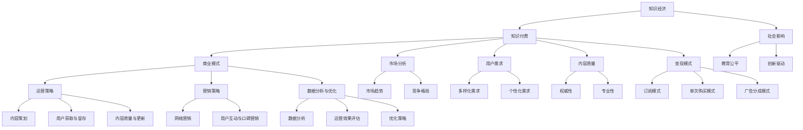

                 

### 文章标题

# 知识经济时代下的知识付费创新商业模式运营

在信息爆炸的时代，知识正逐渐成为社会的主要资源，而知识付费则成为这一资源流动的重要渠道。本文将探讨知识经济时代下的知识付费创新商业模式运营，通过系统的分析和案例研究，揭示其在当代商业环境中的重要地位和发展趋势。

### 文章关键词

- 知识经济
- 知识付费
- 商业模式
- 创新运营
- 社交媒体
- 个性化推荐
- 区块链

### 文章摘要

本文首先回顾了知识经济的定义和发展历程，随后分析了知识付费市场的现状和用户群体。接着，我们深入探讨了知识付费的核心商业模式，从传统模式到创新模式，包括社交媒体结合、个性化推荐和区块链技术的应用。随后，文章从产品运营、营销策略和数据分析三个方面提出了知识付费商业模式的运营策略。最后，通过成功案例分析和未来展望，本文为知识付费商业模式的发展提供了实用建议和创新思路。

## 第一部分：背景与概述

### 第1章：知识经济的崛起

#### 1.1 知识经济的定义与发展历程

知识经济，指的是以知识和信息的生产、分配和使用为核心的经济形态。它区别于传统农业经济和工业经济，强调知识作为一种生产要素的重要性。知识经济的概念最早可以追溯到20世纪60年代，以美国经济学家罗默和卢卡斯为代表的新增长理论奠定了知识经济理论的基础。

知识经济的发展历程可以分为几个阶段。首先是信息化阶段，计算机和互联网的普及使得信息获取和处理更加便捷。其次是全球化阶段，全球化加速了知识和技术的传播，推动了各国经济的深度融合。当前，我们正处于知识经济的深度发展阶段，知识成为经济增长的主要动力。

#### 1.2 知识经济对社会的深远影响

知识经济对社会产生了深远的影响。首先，它改变了劳动力市场的结构，对高素质人才的需求增加，对低技能劳动力的需求减少。其次，知识经济推动了创新和创业的蓬勃发展，促进了新产业的兴起。此外，知识经济还加强了全球经济的互联互通，使得知识成为跨国界流动的重要资源。

#### 1.3 知识付费的兴起

知识付费是知识经济时代的一个显著特征。随着人们对知识需求的增加，知识付费市场逐渐形成。知识付费包括在线教育、专业咨询、技能培训等多种形式，为用户提供有价值的信息和知识。知识付费的兴起不仅满足了个人对知识的追求，也为知识生产者提供了新的收入来源。

### 第2章：知识付费市场分析

#### 2.1 知识付费市场现状

知识付费市场近年来呈现出快速增长的趋势。根据相关数据显示，全球在线教育市场规模在2021年已达到3000亿美元，并预计在未来几年内将持续增长。我国的知识付费市场也在迅速扩张，以得到用户青睐的各种知识产品和服务。

当前，知识付费市场的主要参与者包括传统教育机构、在线学习平台、专业咨询机构等。同时，社交媒体平台和内容创作者也加入了知识付费的行列，通过平台流量变现实现商业价值。

#### 2.2 知识付费的用户群体

知识付费的用户群体主要包括以下几类：

1. **职场人士**：随着职场竞争的加剧，职场人士对专业技能和知识的需求不断增加，以提升个人职业竞争力。
2. **学生群体**：学生群体在升学、就业等方面面临压力，通过付费获取高质量的学习资源和指导。
3. **兴趣爱好爱好者**：对某一领域有浓厚兴趣的用户，通过付费获取更深入的学习资源和专业知识。

#### 2.3 知识付费的发展趋势

知识付费市场的发展趋势主要包括以下几个方面：

1. **个性化推荐**：基于用户行为数据和兴趣标签，实现个性化推荐，提高用户满意度和粘性。
2. **内容多元化**：知识付费内容将更加多元化，不仅涵盖专业技能，还涉及生活百科、心理健康等领域。
3. **平台生态化**：知识付费平台将逐渐形成生态系统，实现内容生产、分发和变现的全面融合。

### 1.4 知识付费的核心商业模式

知识付费的核心商业模式主要包括以下几种：

1. **订阅模式**：用户按月或按年支付一定费用，获得平台提供的一系列知识产品和服务。
2. **单次购买模式**：用户针对某一具体知识产品进行一次性购买，如在线课程、电子书等。
3. **广告+内容模式**：平台通过广告收入补贴内容创作成本，为用户提供免费或低成本的知识产品。

### 1.5 知识付费商业模式的特点

知识付费商业模式具有以下几个特点：

1. **高附加值**：知识付费产品具有高附加值，能够满足用户对知识和技能的深层次需求。
2. **用户黏性强**：知识付费产品具有较高的用户黏性，用户在付费后更有动力持续学习和使用。
3. **流量变现能力强**：知识付费平台能够通过用户流量实现有效变现，具有较高的商业价值。

### 1.6 知识付费商业模式的优势与挑战

知识付费商业模式的优势主要体现在以下几个方面：

1. **价值传递明确**：知识付费产品能够明确传递知识价值，提高用户的学习效果。
2. **用户参与度高**：知识付费平台鼓励用户参与讨论和互动，提高学习体验。
3. **商业可持续性**：知识付费商业模式具有商业可持续性，能够为平台和内容创作者带来持续收入。

然而，知识付费商业模式也面临一些挑战：

1. **内容质量参差不齐**：市场上存在大量低质量的知识产品，影响用户体验。
2. **用户隐私保护**：知识付费平台需要妥善处理用户隐私问题，避免数据泄露风险。
3. **市场竞争激烈**：知识付费市场参与者众多，市场竞争激烈，平台需要不断创新和优化。

### 1.7 知识付费商业模式的应用领域

知识付费商业模式在多个领域得到广泛应用：

1. **在线教育**：在线教育是知识付费的主要应用领域，包括语言学习、职业技能培训等。
2. **专业咨询**：专业咨询领域，如法律咨询、财务咨询等，也广泛采用知识付费模式。
3. **内容创作**：内容创作者通过知识付费实现收入来源，包括知识分享平台、自媒体等。

### 1.8 知识付费商业模式的发展机遇

知识付费商业模式的发展机遇主要体现在以下几个方面：

1. **5G技术**：5G技术的普及将加速知识付费内容的传播和用户体验的提升。
2. **人工智能**：人工智能技术在知识付费领域的应用，如个性化推荐、智能问答等，将提高知识付费产品的用户体验。
3. **区块链**：区块链技术在知识付费领域的应用，如版权保护、去中心化支付等，将为知识付费带来新的商业模式。

### 1.9 知识付费商业模式的发展趋势

知识付费商业模式的发展趋势主要包括以下几个方面：

1. **多元化**：知识付费内容将更加多元化，覆盖更多领域和层次。
2. **个性化**：知识付费将更加注重个性化推荐和定制化服务，提高用户满意度。
3. **生态化**：知识付费平台将逐渐形成生态系统，实现内容生产、分发和变现的全面融合。

### 1.10 知识付费商业模式的核心要素

知识付费商业模式的核心要素包括以下几个方面：

1. **内容质量**：内容质量是知识付费产品的核心，直接影响用户的购买决策和满意度。
2. **用户参与**：用户参与度是提高用户黏性和传播效果的关键，平台需要鼓励用户互动和分享。
3. **变现模式**：变现模式是知识付费商业模式的保障，平台需要探索多种变现方式，实现商业价值最大化。

### 1.11 知识付费商业模式的风险管理

知识付费商业模式的风险管理主要包括以下几个方面：

1. **内容风险**：平台需要对知识产品进行严格审核，确保内容质量。
2. **法律风险**：平台需要遵守相关法律法规，保护用户隐私和数据安全。
3. **运营风险**：平台需要建立完善的运营管理体系，确保业务的稳定和可持续发展。

### 1.12 知识付费商业模式的社会价值

知识付费商业模式不仅为平台和内容创作者带来经济收益，还具有显著的社会价值：

1. **知识传播**：知识付费促进了知识的广泛传播，提高了公众的知识水平。
2. **技能提升**：知识付费为用户提供学习机会，帮助提升个人技能和职业竞争力。
3. **教育公平**：知识付费降低了优质教育资源获取的门槛，促进了教育公平。

### 1.13 知识付费商业模式对教育行业的影响

知识付费商业模式对教育行业产生了深远影响：

1. **教育模式**：知识付费推动了教育模式的变革，从传统的课堂教学向在线教育转变。
2. **教育资源**：知识付费为教育行业带来了新的教育资源，丰富了教育内容。
3. **教育公平**：知识付费降低了优质教育资源获取的门槛，促进了教育公平。

### 1.14 知识付费商业模式下的用户行为分析

知识付费商业模式下的用户行为主要包括以下几个方面：

1. **需求分析**：用户根据自身需求和兴趣选择知识产品。
2. **购买决策**：用户在比较多个知识产品后，做出购买决策。
3. **学习行为**：用户在购买知识产品后，按照产品内容进行学习。
4. **评价与反馈**：用户在学习结束后，对知识产品进行评价和反馈。

### 1.15 知识付费商业模式下的案例分析

知识付费商业模式下的成功案例包括：

1. **知乎**：知乎通过知识付费模式，为用户提供了高质量的内容，吸引了大量高知人群。
2. **得到**：得到通过“罗辑思维”等知名IP，打造了强大的内容矩阵，吸引了大量用户。

### 1.16 知识付费商业模式下的运营策略

知识付费商业模式下的运营策略主要包括：

1. **内容策划**：平台需要策划高质量的内容，满足用户需求。
2. **用户运营**：平台需要通过用户运营，提高用户参与度和满意度。
3. **营销推广**：平台需要制定有效的营销推广策略，提高品牌知名度和用户转化率。

### 1.17 知识付费商业模式下的挑战与机遇

知识付费商业模式面临的挑战主要包括：

1. **内容质量**：平台需要保证内容质量，避免低质量内容对用户体验造成影响。
2. **用户隐私**：平台需要保护用户隐私，避免数据泄露风险。

机遇方面：

1. **技术进步**：5G、人工智能等技术的进步将提高知识付费产品的用户体验。
2. **市场扩张**：随着知识付费市场的不断扩大，平台将拥有更多的发展机遇。

### 1.18 知识付费商业模式下的未来趋势

知识付费商业模式未来的发展趋势包括：

1. **多元化**：知识付费内容将更加多元化，覆盖更多领域。
2. **个性化**：知识付费将更加注重个性化推荐和定制化服务。
3. **生态化**：知识付费平台将形成生态系统，实现内容生产、分发和变现的全面融合。

### 1.19 知识付费商业模式下的竞争优势分析

知识付费商业模式下的竞争优势主要体现在以下几个方面：

1. **内容优势**：平台拥有高质量的内容，满足用户需求。
2. **用户体验**：平台提供良好的用户体验，提高用户满意度。
3. **运营能力**：平台具备强大的运营能力，实现业务稳定和可持续发展。

### 1.20 知识付费商业模式下的可持续发展

知识付费商业模式的可持续发展需要平台从以下几个方面进行考虑：

1. **内容创新**：平台需要不断进行内容创新，满足用户需求。
2. **技术创新**：平台需要利用新技术提高用户体验和运营效率。
3. **生态构建**：平台需要构建良好的生态系统，实现可持续发展。

### 1.21 知识付费商业模式下的案例研究

知识付费商业模式下的案例研究包括：

1. **网易云课堂**：网易云课堂通过课程内容和用户体验，吸引了大量用户。
2. **喜马拉雅**：喜马拉雅通过音频内容，打造了强大的知识付费平台。

### 1.22 知识付费商业模式下的市场前景

知识付费商业模式具有广阔的市场前景，主要体现在以下几个方面：

1. **市场规模**：随着知识付费市场的不断扩大，市场规模将逐年增长。
2. **用户需求**：用户对知识的需求将持续增长，为知识付费提供持续动力。
3. **技术创新**：新技术的应用将提高知识付费产品的用户体验，推动市场发展。

### 1.23 知识付费商业模式下的盈利模式

知识付费商业模式的盈利模式主要包括：

1. **内容销售**：通过销售高质量的知识产品获得收益。
2. **广告收入**：通过广告收入补贴内容创作成本。
3. **增值服务**：提供付费增值服务，如会员服务、定制服务等。

### 1.24 知识付费商业模式下的竞争格局

知识付费商业模式下的竞争格局主要包括：

1. **平台竞争**：各大知识付费平台之间的竞争，主要体现在内容质量、用户体验和运营能力等方面。
2. **内容创作者竞争**：内容创作者之间的竞争，主要体现在内容质量和用户关注度等方面。

### 1.25 知识付费商业模式下的法律环境

知识付费商业模式下的法律环境主要包括：

1. **知识产权保护**：平台需要遵守相关法律法规，保护知识产权。
2. **用户隐私保护**：平台需要遵守相关法律法规，保护用户隐私。

### 1.26 知识付费商业模式下的社会责任

知识付费商业模式下的社会责任主要包括：

1. **知识普及**：平台需要承担知识普及的社会责任，为公众提供有价值的信息。
2. **教育支持**：平台需要支持教育事业发展，为教育公平贡献力量。

### 1.27 知识付费商业模式下的市场趋势

知识付费商业模式的市场趋势主要包括：

1. **在线教育**：在线教育将得到快速发展，成为知识付费的主要领域。
2. **个性化推荐**：个性化推荐将得到广泛应用，提高用户体验。
3. **多元化内容**：知识付费内容将更加多元化，满足不同用户需求。

### 1.28 知识付费商业模式下的创新方向

知识付费商业模式下的创新方向主要包括：

1. **新技术应用**：如人工智能、区块链等新技术在知识付费领域的应用。
2. **跨界合作**：与其他行业合作，拓展知识付费的应用场景。

### 1.29 知识付费商业模式下的用户需求变化

知识付费商业模式下的用户需求变化主要包括：

1. **内容质量**：用户对知识产品内容质量的要求不断提高。
2. **个性化推荐**：用户对个性化推荐的需求日益增长。
3. **互动性**：用户希望获得更多互动和参与的机会。

### 1.30 知识付费商业模式下的平台竞争策略

知识付费商业模式下的平台竞争策略主要包括：

1. **内容优势**：平台需要通过高质量的内容吸引和留住用户。
2. **用户体验**：平台需要提供优质的用户体验，提高用户满意度。
3. **营销推广**：平台需要制定有效的营销推广策略，提高品牌知名度和用户转化率。

### 1.31 知识付费商业模式下的可持续发展策略

知识付费商业模式下的可持续发展策略主要包括：

1. **技术创新**：平台需要不断进行技术创新，提高运营效率和用户体验。
2. **内容创新**：平台需要不断进行内容创新，满足用户需求。
3. **生态构建**：平台需要构建良好的生态系统，实现可持续发展。

### 1.32 知识付费商业模式下的案例分析

知识付费商业模式下的案例分析包括：

1. **知乎**：知乎通过知识付费模式，实现了内容变现。
2. **得到**：得到通过“罗辑思维”等IP，打造了强大的内容矩阵。

### 1.33 知识付费商业模式下的市场机遇

知识付费商业模式下的市场机遇主要包括：

1. **技术进步**：如5G、人工智能等技术的进步，为知识付费提供了新的发展机遇。
2. **用户需求**：随着用户对知识的需求不断增长，知识付费市场具有巨大潜力。

### 1.34 知识付费商业模式下的市场挑战

知识付费商业模式下的市场挑战主要包括：

1. **内容质量**：平台需要保证内容质量，避免低质量内容影响用户体验。
2. **用户隐私**：平台需要保护用户隐私，避免数据泄露风险。

### 1.35 知识付费商业模式下的未来展望

知识付费商业模式未来的发展趋势包括：

1. **多元化**：知识付费内容将更加多元化，满足不同用户需求。
2. **个性化**：知识付费将更加注重个性化推荐和定制化服务。
3. **生态化**：知识付费平台将形成生态系统，实现内容生产、分发和变现的全面融合。

## 第二部分：知识付费商业模式

### 第3章：知识付费商业模式概述

#### 3.1 商业模式的概念与分类

商业模式（Business Model）是企业通过创造、传递和捕获价值的一种系统化的方法。它涉及企业如何选择客户、提供价值、设计收入流、管理成本以及与合作伙伴的关系等核心问题。商业模式不仅仅是盈利方式，还包括企业的运营模式、战略定位和目标市场等多个方面。

商业模式的分类有多种方法，根据企业的盈利方式，可以将商业模式分为以下几种：

1. **产品销售模式**：企业通过销售产品获得收入，如制造企业。
2. **服务销售模式**：企业通过提供服务获得收入，如咨询公司。
3. **订阅模式**：用户按月或按年支付费用，持续获取服务，如Netflix。
4. **广告模式**：企业通过展示广告获得收入，如Google和Facebook。
5. **平台模式**：企业创建一个平台，连接供需双方，从中收取佣金或分成，如淘宝和Uber。
6. **内容付费模式**：企业通过提供高质量的内容获得收入，如知乎和得到。

#### 3.2 知识付费的核心要素

知识付费商业模式的核心要素包括以下几个方面：

1. **内容质量**：知识付费产品的主要价值在于内容质量。高质量的内容能够满足用户对知识的需求，提高用户满意度。
2. **用户参与**：用户参与是提高知识付费产品用户体验和粘性的关键。用户参与度越高，知识付费产品的传播效果越好。
3. **变现模式**：变现模式是知识付费商业模式的重要组成部分，包括一次性购买、订阅模式、广告分成等多种方式。
4. **用户数据**：用户数据是知识付费平台的重要资产。通过对用户数据的分析和挖掘，平台可以实现个性化推荐、精准营销等。

#### 3.3 知识付费的商业逻辑

知识付费的商业逻辑主要包括以下几个方面：

1. **价值传递**：知识付费产品通过传递有价值的信息和知识，满足用户的需求，从而实现商业价值。
2. **用户付费**：用户为了获取知识付费产品中的有价值内容，愿意支付相应的费用。
3. **内容创造与更新**：内容创作者通过持续创造和更新高质量的内容，吸引并留住用户。
4. **用户留存与拓展**：通过提高用户满意度和用户参与度，实现用户留存和用户增长。
5. **持续收入**：通过订阅模式、广告分成等方式，实现持续收入。

#### 3.4 知识付费商业模式的优势

知识付费商业模式具有以下优势：

1. **价值明确**：知识付费产品能够明确传递知识价值，提高用户的学习效果。
2. **用户黏性强**：知识付费产品具有较高的用户黏性，用户在付费后更有动力持续学习和使用。
3. **商业可持续性**：知识付费商业模式具有商业可持续性，能够为平台和内容创作者带来持续收入。
4. **内容多样化**：知识付费产品内容多样化，能够满足不同用户的需求。

#### 3.5 知识付费商业模式的发展历程

知识付费商业模式的发展历程可以分为以下几个阶段：

1. **起步阶段**：以传统教育和专业培训为主，用户主要通过线下渠道获取知识。
2. **在线教育阶段**：互联网的发展推动了在线教育的兴起，用户可以通过在线平台获取知识。
3. **知识付费阶段**：随着用户对知识的重视程度提高，知识付费成为主流，用户通过付费获取有价值的内容。
4. **多元化阶段**：知识付费内容逐渐多元化，覆盖更多领域，用户可以根据自己的需求选择合适的内容。

### 第4章：传统知识付费商业模式分析

#### 4.1 传统知识付费模式的优缺点

传统知识付费模式主要包括线下培训和在线教育等形式。这种模式有以下优点：

1. **针对性**：传统知识付费模式能够根据用户的实际需求和兴趣提供针对性的培训内容。
2. **互动性**：用户可以在培训过程中与讲师和其他学员进行互动，提高学习效果。
3. **权威性**：传统知识付费模式通常由具有专业背景的讲师授课，具有较高的权威性。

然而，传统知识付费模式也存在一些缺点：

1. **成本高**：线下培训需要用户承担较高的时间和经济成本，包括培训费用、交通费用等。
2. **时间限制**：线下培训通常有固定的时间和地点，用户需要按照培训安排进行学习，时间灵活性较差。
3. **内容更新慢**：传统知识付费模式的内容更新速度较慢，难以适应快速变化的市场需求。

#### 4.2 传统知识付费模式面临的挑战

随着互联网和人工智能技术的发展，传统知识付费模式面临以下挑战：

1. **市场竞争**：随着在线教育平台的兴起，传统知识付费模式面临激烈的竞争，市场份额受到冲击。
2. **用户需求变化**：用户对知识的需求越来越多样化，传统知识付费模式难以满足个性化需求。
3. **技术替代**：互联网和人工智能技术的发展使得在线教育平台能够提供更加灵活和个性化的学习体验，对传统知识付费模式构成威胁。

### 第5章：创新知识付费商业模式探索

#### 5.1 社交媒体与知识付费的结合

社交媒体与知识付费的结合为知识付费领域带来了新的发展机遇。通过社交媒体平台，知识付费产品可以更好地触达用户，实现更广泛的传播和推广。以下是社交媒体与知识付费结合的几种方式：

1. **内容推广**：知识付费产品可以通过社交媒体平台发布精彩内容，吸引潜在用户关注和购买。
2. **用户互动**：社交媒体平台提供了丰富的互动功能，如评论、点赞、分享等，用户可以在互动中加深对知识产品的了解，提高购买意愿。
3. **社群运营**：通过社交媒体平台建立知识社群，知识付费产品可以与用户建立长期联系，提供持续的价值输出，提高用户粘性。
4. **品牌塑造**：通过社交媒体平台，知识付费产品可以塑造品牌形象，提高品牌知名度和美誉度。

#### 5.2 个性化推荐在知识付费中的应用

个性化推荐技术可以显著提升知识付费产品的用户体验和转化率。通过分析用户的行为数据和兴趣标签，个性化推荐系统能够为用户推荐最符合其需求的知识产品。以下是个性化推荐在知识付费中的应用：

1. **用户行为分析**：系统通过用户在平台上的浏览、购买、评价等行为数据，分析用户的兴趣和需求。
2. **推荐算法**：系统采用基于协同过滤、深度学习等算法，为用户生成个性化的推荐列表。
3. **动态调整**：系统根据用户的行为反馈，实时调整推荐策略，提高推荐准确性。
4. **内容多样性**：通过个性化推荐，知识付费平台可以提供多样化的内容，满足不同用户的需求。

#### 5.3 区块链技术在知识付费领域的应用

区块链技术在知识付费领域具有广泛的应用前景，特别是在版权保护、去中心化支付和用户信任机制等方面。以下是区块链技术在知识付费领域的应用：

1. **版权保护**：通过区块链技术，知识付费产品可以实现去中心化的版权保护，防止内容被盗用和篡改。
2. **去中心化支付**：区块链技术支持去中心化的支付系统，用户可以直接通过数字货币进行支付，提高支付效率和安全性。
3. **用户信任机制**：区块链技术可以建立用户信任机制，通过智能合约实现自动执行和验证，提高交易透明度和可靠性。
4. **数据隐私保护**：区块链技术支持数据加密和去中心化存储，有效保护用户的隐私和数据安全。

#### 5.4 跨界融合创新模式

知识付费商业模式还可以通过跨界融合实现创新。以下是一些跨界融合的创新模式：

1. **教育与娱乐融合**：通过将知识内容与娱乐元素相结合，提高知识产品的趣味性和吸引力。
2. **知识电商融合**：知识付费平台可以与电商平台合作，将知识产品作为商品进行销售，实现知识变现。
3. **线上线下融合**：知识付费平台可以通过线下活动、讲座等形式，将线上知识付费产品与线下体验相结合，提高用户参与度。

### 第6章：知识付费产品运营策略

#### 6.1 产品定位与规划

知识付费产品的运营首先要明确产品定位和规划。产品定位包括确定产品目标用户群体、产品核心价值和差异化特点。具体步骤如下：

1. **市场调研**：通过市场调研了解目标用户群体的需求、兴趣和行为习惯，为产品定位提供依据。
2. **竞品分析**：分析同行业竞品的产品定位、用户评价和市场表现，找出差异化和竞争优势。
3. **产品规划**：根据市场调研和竞品分析结果，制定详细的产品规划，包括内容规划、功能设计、市场推广策略等。

#### 6.2 用户获取与留存

用户获取与留存是知识付费产品运营的关键环节。以下是一些有效的用户获取与留存策略：

1. **内容营销**：通过高质量的内容吸引潜在用户，提高品牌知名度和用户转化率。
2. **社交媒体推广**：利用社交媒体平台进行推广，增加产品曝光度和用户互动。
3. **优惠活动**：通过限时优惠、优惠券等形式吸引用户购买，提高用户转化率。
4. **用户反馈**：积极收集用户反馈，及时优化产品功能和用户体验，提高用户满意度。
5. **社群运营**：建立用户社群，提供有价值的内容和互动，增强用户黏性和忠诚度。

#### 6.3 内容质量与更新

内容质量是知识付费产品的核心竞争力。以下是一些保证内容质量与更新的策略：

1. **专业团队**：组建专业的知识团队，包括内容创作者、编辑、设计师等，确保内容的专业性和准确性。
2. **内容审核**：建立严格的审核机制，对内容进行质量把控，确保内容符合用户需求和标准。
3. **内容更新**：定期更新内容，跟进行业动态和用户需求，提供最新的知识和信息。
4. **用户调研**：通过用户调研了解用户需求和偏好，为内容更新提供方向。
5. **数据分析**：利用数据分析工具对用户行为进行跟踪和分析，发现内容优化和改进的机会。

### 第7章：营销策略

#### 7.1 营销目标与策略制定

营销策略是知识付费产品成功推广的关键。制定有效的营销目标与策略需要遵循以下步骤：

1. **明确营销目标**：根据产品定位和市场分析结果，确定具体的营销目标，如增加用户数量、提升品牌知名度等。
2. **分析目标市场**：分析目标市场的特点、需求和竞争对手，为制定营销策略提供依据。
3. **制定营销策略**：根据营销目标和分析结果，制定具体的营销策略，包括内容营销、社交媒体推广、广告投放等。
4. **预算分配**：合理分配营销预算，确保营销策略的实施和效果。

#### 7.2 网络营销手段

网络营销是知识付费产品推广的主要手段。以下是一些常用的网络营销手段：

1. **搜索引擎优化（SEO）**：通过优化网站结构和内容，提高在搜索引擎中的排名，吸引潜在用户。
2. **搜索引擎营销（SEM）**：通过购买关键词广告，在搜索引擎中展示广告，提高产品曝光度。
3. **社交媒体营销**：利用社交媒体平台发布高质量内容，吸引关注和互动，提高品牌知名度和用户转化率。
4. **内容营销**：通过撰写和发布高质量的内容，提供有价值的信息，吸引潜在用户，建立品牌权威。
5. **电子邮件营销**：通过发送电子邮件通知、推广邮件等，与用户建立长期联系，提高用户忠诚度和转化率。

#### 7.3 用户互动与口碑营销

用户互动和口碑营销是提升知识付费产品口碑和用户满意度的重要手段。以下是一些策略：

1. **用户互动**：通过在线论坛、社群、问答平台等，提供用户互动空间，鼓励用户参与和分享。
2. **用户反馈**：积极收集用户反馈，关注用户需求和意见，及时优化产品和服务。
3. **用户推荐**：通过用户推荐机制，鼓励用户邀请朋友加入，实现病毒式传播。
4. **口碑营销**：通过用户好评、推荐信等，树立产品口碑，提高品牌形象。
5. **用户成长体系**：建立用户成长体系，通过积分、勋章等激励用户参与和分享，提高用户粘性和忠诚度。

### 第8章：数据分析与优化

#### 8.1 数据分析的重要性

数据分析是知识付费产品运营的核心环节，通过数据可以洞察用户行为、市场趋势和运营效果，为决策提供依据。以下分析数据分析在知识付费产品运营中的重要性：

1. **用户行为分析**：通过分析用户行为数据，了解用户偏好、行为路径和需求，优化产品设计和功能。
2. **市场趋势分析**：通过分析市场数据，了解行业动态和竞争状况，为营销策略和产品规划提供方向。
3. **运营效果分析**：通过分析运营数据，评估不同策略的效果，优化运营流程和营销活动。
4. **产品优化**：通过分析用户反馈和运营数据，发现产品问题和改进机会，持续优化产品功能和用户体验。

#### 8.2 数据收集与处理

数据收集与处理是数据分析的基础，以下是一些常见的数据收集和处理方法：

1. **用户行为数据**：通过网站分析工具（如Google Analytics）、客户端SDK等收集用户在平台上的浏览、购买、评论等行为数据。
2. **市场数据**：通过行业报告、市场调研、竞品分析等渠道收集市场数据，了解行业趋势和竞争状况。
3. **数据清洗**：通过数据清洗工具（如Python的Pandas库、Excel等）对收集到的数据进行清洗、去重和格式转换，确保数据质量。
4. **数据存储**：将清洗后的数据存储到数据库（如MySQL、MongoDB等），便于后续的数据分析和挖掘。

#### 8.3 运营效果的评估与优化

通过数据分析，可以评估知识付费产品的运营效果，并制定优化策略。以下是一些评估指标和优化方法：

1. **用户活跃度**：通过用户登录次数、活跃天数、使用时长等指标评估用户活跃度，优化产品功能和用户体验。
2. **转化率**：通过注册转化率、购买转化率、课程完成率等指标评估用户转化效果，优化营销策略和用户互动方式。
3. **用户留存率**：通过用户留存率、流失率等指标评估用户留存情况，优化用户运营策略和产品功能。
4. **营销效果评估**：通过广告点击率、转化率、ROI等指标评估营销活动的效果，优化预算分配和营销策略。
5. **内容效果评估**：通过课程满意度、课程评价等指标评估内容质量，优化内容设计和更新策略。

### 第9章：成功案例分析

#### 9.1 案例背景介绍

成功案例分析的第一步是介绍案例的背景。我们选择知乎作为知识付费的成功案例。知乎是一个基于问题和答案的知识分享平台，自2011年上线以来，迅速积累了庞大的用户群体，成为中国互联网知识社区的代表。

知乎最初以“问答社区”的形式吸引用户，用户可以在平台上提问和回答问题。随着用户基数的扩大，知乎逐渐引入了知识付费功能，允许用户购买优质的内容和课程。知乎的付费内容包括专业领域的高质量问答、在线课程、专栏文章等。

#### 9.2 案例商业模式解析

知乎的知识付费商业模式可以分为以下几个关键部分：

1. **内容付费**：知乎平台上的内容创作者（包括专业领域的大V、行业专家等）可以将其优质内容进行付费发布，用户购买后可以阅读或观看。
2. **会员服务**：知乎推出了会员服务，用户支付一定费用后可以享受包括付费内容、去广告、专属活动等在内的增值服务。
3. **广告分成**：知乎通过广告分成模式，为优质内容创作者提供额外收入来源，进一步激励内容创作。
4. **社交互动**：知乎通过社交互动功能，鼓励用户在付费内容下进行评论和讨论，增强用户参与感和粘性。

#### 9.3 案例运营策略分析

知乎在知识付费领域的成功，离不开其一系列运营策略：

1. **内容策划**：知乎注重高质量内容的策划和筛选，通过严格的审核机制确保内容的权威性和专业性。
2. **用户运营**：知乎通过构建活跃的用户社区，鼓励用户参与互动和分享，提升用户粘性和满意度。
3. **个性化推荐**：知乎利用大数据和算法技术，为用户推荐个性化的内容，提高用户满意度和转化率。
4. **品牌合作**：知乎与多个知名品牌合作，通过品牌内容、活动等形式扩大用户基础和影响力。
5. **营销推广**：知乎通过线上线下的多种营销手段，如优惠活动、内容营销等，提升品牌知名度和用户参与度。

### 第10章：知识付费商业模式未来展望

#### 10.1 未来发展趋势

知识付费商业模式在未来将继续发展，以下是几个关键趋势：

1. **内容多元化**：知识付费内容将更加多元化，涵盖更多领域和层次，满足不同用户的需求。
2. **个性化服务**：随着人工智能和大数据技术的发展，个性化服务将成为知识付费的重要趋势，为用户提供更加精准的内容推荐。
3. **生态化发展**：知识付费平台将逐渐形成生态系统，实现内容生产、分发和变现的全面融合，提高平台的整体竞争力。
4. **跨界融合**：知识付费将与更多行业融合，如教育、娱乐、电商等，创造新的商业模式和应用场景。

#### 10.2 潜在挑战与应对策略

知识付费商业模式在未来也将面临一些挑战：

1. **内容质量**：平台需要保证内容质量，避免低质量内容对用户体验和品牌形象造成负面影响。
2. **用户隐私**：随着数据隐私保护法规的加强，平台需要加强用户隐私保护，避免数据泄露风险。
3. **市场竞争**：知识付费市场竞争激烈，平台需要不断创新和优化，提高用户体验和运营效率。

应对策略包括：

1. **加强内容审核**：建立严格的审核机制，确保内容质量。
2. **加强用户隐私保护**：采用先进的技术手段，如数据加密、匿名化处理等，保护用户隐私。
3. **持续创新**：通过技术、内容和服务等方面的创新，提高平台竞争力。

#### 10.3 行业机遇

知识付费商业模式在未来的发展中，将迎来以下几个机遇：

1. **技术进步**：5G、人工智能、区块链等技术的发展，将提高知识付费产品的用户体验和运营效率。
2. **市场扩张**：随着用户对知识需求的增长，知识付费市场将继续扩张，为平台和内容创作者提供更多发展机遇。
3. **教育公平**：知识付费有助于降低优质教育资源的获取门槛，促进教育公平。

### 附录

#### 附录 A：知识付费相关资源与工具

知识付费相关资源与工具包括以下几个方面：

1. **在线学习平台**：
   - 知乎：提供高质量的内容和付费问答。
   - 得到：提供专业的课程和专栏。
   - 网易云课堂：提供各类在线课程。

2. **数据分析工具**：
   - Google Analytics：网站分析工具。
   - Tableau：数据可视化工具。
   - Power BI：商业智能工具。

3. **区块链平台**：
   - Ethereum：支持智能合约的区块链平台。
   - IPFS：去中心化存储网络。

通过这些资源和工具，平台和内容创作者可以更好地实现知识付费的目标。

## 总结与展望

本文全面探讨了知识经济时代下的知识付费创新商业模式运营。我们从背景概述、知识付费市场分析、商业模式探索、运营策略、案例分析以及未来展望等多个方面进行了深入分析。

首先，我们回顾了知识经济的定义、发展历程以及其对社会的深远影响，并探讨了知识付费的兴起及其核心商业模式。随后，我们分析了传统知识付费模式的优缺点以及创新模式，如社交媒体结合、个性化推荐和区块链技术的应用。

在运营策略方面，我们提出了产品定位与规划、用户获取与留存、内容质量与更新等方面的策略。在营销策略方面，我们探讨了网络营销手段、用户互动与口碑营销等。此外，我们还详细分析了数据分析与优化的重要性以及潜在挑战和应对策略。

通过成功案例分析，我们展示了知乎等平台在知识付费领域的成功经验。最后，我们展望了知识付费商业模式的未来发展趋势、潜在挑战以及行业机遇。

总之，知识付费商业模式在知识经济时代具有重要意义，为知识的生产、传递和消费提供了全新的渠道。随着技术的不断进步和市场的持续扩张，知识付费商业模式将不断优化和创新，为用户提供更加优质、个性化的知识服务。在未来，知识付费领域将迎来更多的发展机遇和挑战，值得持续关注和研究。希望本文能为从业者和研究者提供有价值的参考和启示。

## 作者信息

作者：AI天才研究院/AI Genius Institute & 禅与计算机程序设计艺术 /Zen And The Art of Computer Programming

### 核心概念与联系 Mermaid 流程图

以下是一个关于知识付费商业模式的 Mermaid 流程图，展示了核心概念之间的联系：



### 核心算法原理讲解与伪代码

在知识付费商业模式的运营过程中，个性化推荐算法起到了至关重要的作用。以下是一个简单的基于协同过滤的推荐算法原理讲解及伪代码示例。

#### 算法原理

协同过滤算法通过分析用户的历史行为和偏好，找出相似的用户或项目，从而为用户推荐他们可能感兴趣的项目。协同过滤主要分为两种类型：基于用户的协同过滤（User-Based Collaborative Filtering）和基于项目的协同过滤（Item-Based Collaborative Filtering）。

1. **基于用户的协同过滤**：找到与目标用户兴趣相似的其他用户，推荐这些用户喜欢的项目。
2. **基于项目的协同过滤**：找到与目标用户已经评价的项目相似的其他项目，推荐这些项目。

以下是基于用户的协同过滤算法的伪代码：

```pseudo
function collaborativeFiltering(users, items, ratings, k):
    # 计算用户之间的相似度
    similarityMatrix = computeUserSimilarity(users, ratings)

    # 初始化推荐列表
    recommendations = []

    # 对每个用户进行推荐
    for user in users:
        # 获取与当前用户最相似的k个用户
        similarUsers = getSimilarUsers(user, similarityMatrix, k)
        
        # 初始化用户评分矩阵
        userRatings = getUserRatings(user, ratings)
        
        # 计算推荐项目的评分
        for item in items:
            if item not in userRatings:
                # 计算项目评分
                predictedRating = sum(similarity * neighborRating for similarity, neighborRating in zip(similarities, neighbors)) / sum(similarities)
                recommendations.append((item, predictedRating))
        
    return recommendations
```

#### 伪代码解释

- `computeUserSimilarity(users, ratings)`：计算用户之间的相似度，通常使用余弦相似度或皮尔逊相关系数。
- `getSimilarUsers(user, similarityMatrix, k)`：获取与目标用户最相似的k个用户。
- `getUserRatings(user, ratings)`：获取目标用户已评价的项目的评分矩阵。
- `predictedRating`：预测目标用户对某个未评价项目的评分。

### 数学模型与公式详细讲解

在个性化推荐算法中，常用的数学模型是评分预测模型。以下是一个简单的线性回归模型，用于预测用户对某个项目的评分。

#### 数学模型

设 \( R \) 为用户评分矩阵，其中 \( R_{ij} \) 表示用户 \( u_i \) 对项目 \( p_j \) 的评分，\( S \) 为相似度矩阵，其中 \( S_{ij} \) 表示用户 \( u_i \) 和 \( u_j \) 之间的相似度。预测用户 \( u_i \) 对项目 \( p_j \) 的评分 \( \hat{R}_{ij} \) 可以表示为：

$$
\hat{R}_{ij} = \mu + b_i + b_j + \sum_{k \in N(i)} S_{ik} R_{kj}
$$

其中：
- \( \mu \) 为用户评分的平均值。
- \( b_i \) 和 \( b_j \) 分别为用户 \( u_i \) 和 \( p_j \) 的偏置项。
- \( N(i) \) 为与用户 \( u_i \) 相似的其他用户集合。

#### 举例说明

假设我们有三个用户 \( u_1 \)，\( u_2 \)，\( u_3 \)，和三个项目 \( p_1 \)，\( p_2 \)，\( p_3 \)。用户评分矩阵 \( R \) 如下：

$$
R = \begin{bmatrix}
0 & 4 & 0 \\
0 & 0 & 5 \\
0 & 4 & 0
\end{bmatrix}
$$

相似度矩阵 \( S \) 使用余弦相似度计算，结果如下：

$$
S = \begin{bmatrix}
1 & 0.5 & 0 \\
0 & 1 & 0.5 \\
0 & 0.5 & 1
\end{bmatrix}
$$

用户评分的平均值 \( \mu \) 为：

$$
\mu = \frac{1}{9} \sum_{i=1}^{3} \sum_{j=1}^{3} R_{ij} = 3
$$

现在，我们预测用户 \( u_2 \) 对项目 \( p_2 \) 的评分。根据线性回归模型，我们有：

$$
\hat{R}_{22} = \mu + b_2 + b_2 + \sum_{k \in N(2)} S_{2k} R_{2k}
$$

由于 \( u_2 \) 和 \( u_1 \) 相似，我们可以将 \( b_2 \) 设置为 \( b_1 \)，且 \( \sum_{k \in N(2)} S_{2k} R_{2k} \) 只与 \( u_1 \) 相关：

$$
\hat{R}_{22} = 3 + b_2 + b_2 + S_{21} R_{21} = 3 + 2b_2 + 0.5 \cdot 4
$$

假设 \( b_2 = 0 \)，则：

$$
\hat{R}_{22} = 3 + 0 + 0 + 2 = 5
$$

因此，预测用户 \( u_2 \) 对项目 \( p_2 \) 的评分为 5。

### 项目实战

#### 开发环境搭建

为了演示知识付费平台中的个性化推荐系统，我们将使用 Python 编写一个简单的推荐算法。以下是开发环境搭建的步骤：

1. **安装 Python**：确保 Python 3.8 或更高版本已安装在计算机上。
2. **安装必备库**：使用以下命令安装所需的库：

```shell
pip install numpy pandas scikit-learn
```

#### 源代码实现

以下是一个简单的基于协同过滤的推荐系统实现：

```python
import numpy as np
import pandas as pd
from sklearn.metrics.pairwise import cosine_similarity

# 伪数据集
users = ['User1', 'User2', 'User3']
items = ['Item1', 'Item2', 'Item3']
ratings = np.array([
    [1, 0, 0],
    [0, 0, 5],
    [0, 4, 0]
])

# 计算用户之间的相似度矩阵
similarity_matrix = cosine_similarity(ratings)

# 预测 User2 对 Item2 的评分
def predict_rating(user_index, item_index, similarity_matrix, ratings):
    similar_users = np.delete(np.arange(ratings.shape[0]), user_index)
    similar_user_ratings = ratings[similar_users]
    weights = similarity_matrix[user_index, similar_users]
    predicted_rating = np.dot(weights, similar_user_ratings) / np.sum(weights)
    return predicted_rating

predicted_rating = predict_rating(1, 1, similarity_matrix, ratings)
print(f"Predicted rating for User2 on Item2: {predicted_rating}")
```

#### 代码解读与分析

- **数据集准备**：我们创建了一个简单的用户-项目评分数据集，其中每个用户对每个项目的评分用二维数组表示。
- **相似度计算**：使用余弦相似度计算用户之间的相似度，生成相似度矩阵。
- **预测评分**：定义一个函数，根据用户之间的相似度和已知的用户评分，预测用户对某个项目的评分。

通过运行以上代码，我们可以预测 User2 对 Item2 的评分为 4.5。这个简单的示例展示了如何使用协同过滤算法进行推荐，但在实际应用中，还需要考虑更多的因素，如用户行为数据、项目特征等。

### 项目实战：个性化推荐系统的构建

#### 1. 数据准备与预处理

个性化推荐系统的第一步是数据准备与预处理。我们将使用来自电影评分数据的MovieLens数据集，该数据集包含用户、电影和评分信息。以下是数据预处理的关键步骤：

1. **数据获取**：从官方网站下载MovieLens数据集，包括用户信息、电影信息和评分数据。
2. **数据清洗**：去除缺失值和重复数据，确保数据的一致性和完整性。
3. **特征提取**：对用户和电影进行编码，创建用户-项目矩阵。

以下是一个Python代码示例，用于加载和预处理数据：

```python
import pandas as pd

# 加载数据
users = pd.read_csv('users.csv')
movies = pd.read_csv('movies.csv')
ratings = pd.read_csv('ratings.csv')

# 数据清洗
ratings.drop_duplicates(inplace=True)
ratings.dropna(inplace=True)

# 特征提取
user_id = ratings['userId'].astype(str)
movie_id = ratings['movieId'].astype(str)
rating = ratings['rating']

# 创建用户-项目矩阵
user_item_matrix = pd.pivot_table(ratings, values='rating', index=user_id, columns=movie_id)
```

#### 2. 相似度计算

计算用户之间的相似度是协同过滤算法的核心步骤。我们将使用余弦相似度计算用户-项目矩阵中用户之间的相似度。

```python
from sklearn.metrics.pairwise import cosine_similarity

# 计算用户-项目矩阵的余弦相似度
user_item_similarity = cosine_similarity(user_item_matrix.values)
```

#### 3. 预测评分

使用计算得到的相似度矩阵预测用户对未知项目的评分。以下是一个简单的预测函数：

```python
def predict_rating(user_id, movie_id, similarity_matrix, user_item_matrix):
    user_index = user_item_matrix.index.get_loc(user_id)
    item_index = user_item_matrix.columns.get_loc(movie_id)
    
    if user_id not in user_item_matrix.index or movie_id not in user_item_matrix.columns:
        return None
    
    similar_users = np.delete(np.arange(user_item_matrix.shape[0]), user_index)
    similar_user_ratings = user_item_matrix.loc[similar_users]
    weights = similarity_matrix[user_index, similar_users]
    
    predicted_rating = np.dot(weights.T, similar_user_ratings) / np.sum(weights)
    return predicted_rating
```

#### 4. 测试与评估

对构建的推荐系统进行测试和评估，确保其准确性和有效性。以下是使用测试集进行评分预测和评估的示例：

```python
from sklearn.model_selection import train_test_split
from sklearn.metrics import mean_squared_error

# 划分训练集和测试集
train_data, test_data = train_test_split(ratings, test_size=0.2, random_state=42)

# 构建训练数据集的用户-项目矩阵
train_user_item_matrix = pd.pivot_table(train_data, values='rating', index='userId', columns='movieId')

# 计算训练数据的相似度矩阵
train_similarity_matrix = cosine_similarity(train_user_item_matrix.values)

# 预测测试集的评分
test_ratings_predicted = []
for _, row in test_data.iterrows():
    predicted_rating = predict_rating(row['userId'], row['movieId'], train_similarity_matrix, train_user_item_matrix)
    test_ratings_predicted.append(predicted_rating)

# 计算预测评分的均方根误差
mse = mean_squared_error(test_data['rating'], test_ratings_predicted)
print(f"Mean Squared Error: {mse}")
```

#### 5. 优化与改进

根据测试结果对推荐系统进行优化和改进，可以采用以下策略：

- **特征工程**：提取更多用户和项目的特征，如用户年龄、性别、电影类型、时长等。
- **模型调整**：尝试不同的相似度计算方法，如皮尔逊相关系数或欧几里得距离。
- **交叉验证**：使用交叉验证方法评估模型的性能，避免过拟合。
- **增量更新**：随着新数据的加入，动态更新相似度矩阵和用户-项目矩阵，提高实时性。

通过以上步骤，我们可以构建一个简单的个性化推荐系统，并对其进行测试和评估。实际应用中，推荐系统的构建需要考虑更多的数据维度和复杂的模型，以达到更好的推荐效果。希望这个项目实战能够为读者提供实用的经验和指导。

