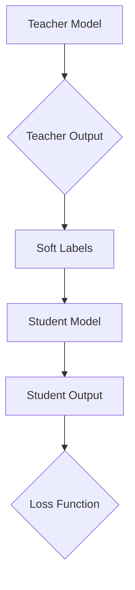
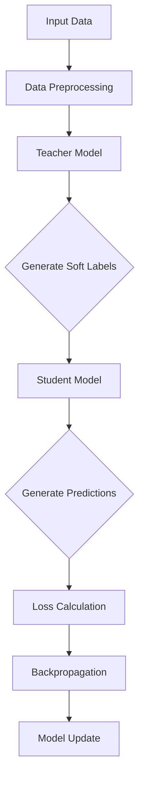
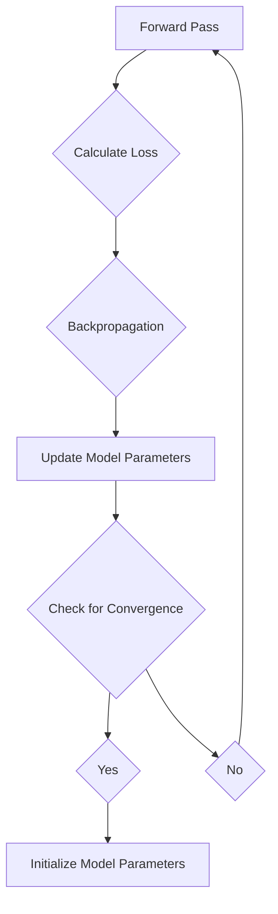
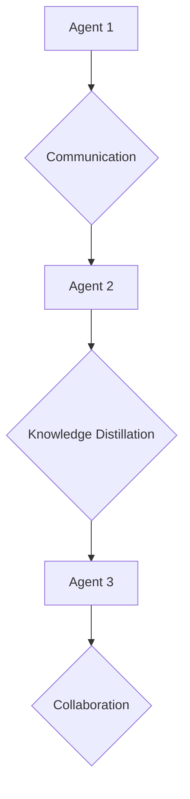

                 

# 《知识蒸馏在多智能体系统中的应用》

## 关键词

知识蒸馏、多智能体系统、协作智能体、竞争智能体、混合智能体、优化算法

## 摘要

本文主要探讨了知识蒸馏技术在多智能体系统中的应用。首先，对知识蒸馏的基础理论进行了详细阐述，包括其定义、原理和算法。接着，分析了知识蒸馏在多智能体系统中的应用场景和挑战，并提出了相应的实现方法。随后，通过实例分析了知识蒸馏在协作智能体、竞争智能体和混合智能体中的应用。最后，探讨了知识蒸馏算法在多智能体系统中的优化方法，并分析了未来研究的方向与挑战。

## 第一部分：知识蒸馏基础

### 第1章：知识蒸馏概述

#### 1.1 知识蒸馏的定义与背景

知识蒸馏是一种机器学习技术，主要用于将一个复杂的模型（教师模型）的知识迁移到一个较小的模型（学生模型）中。这种技术起源于教育领域，后来被引入到机器学习领域，用于提高模型的效率和可解释性。

在传统的机器学习中，通常使用大型模型进行训练，但这样的模型在部署时可能会受到计算资源和存储空间的限制。知识蒸馏技术通过将教师模型的知识传递给学生模型，使得学生模型可以在较少的参数和计算资源下实现与教师模型相似的性能。

#### 1.2 知识蒸馏的应用场景

知识蒸馏技术广泛应用于各种机器学习任务中，包括图像识别、自然语言处理、语音识别等。其中，最具代表性的应用场景是移动设备和嵌入式系统中的模型压缩和优化。

在多智能体系统中，知识蒸馏技术同样具有重要的应用价值。由于多智能体系统中的智能体可能分布在不同的设备上，例如移动设备、嵌入式设备等，这些设备通常具有有限的计算资源和存储空间。因此，通过知识蒸馏技术，可以将教师模型的知识传递给学生模型，使得学生模型在有限的资源下仍然能够实现高效的智能决策。

#### 1.3 知识蒸馏的基本原理

知识蒸馏的基本原理可以概括为以下三个步骤：

1. **训练教师模型**：首先，使用大量的训练数据对教师模型进行训练，使其在特定任务上达到较高的性能。

2. **生成软标签**：在训练过程中，教师模型会生成一系列软标签，这些软标签包含了教师模型对训练数据的理解和知识。

3. **训练学生模型**：使用教师模型的软标签作为监督信号，对学生模型进行训练。学生模型通过学习软标签，逐渐掌握教师模型的知识，从而实现性能的迁移。

#### 1.4 知识蒸馏与传统机器学习模型的区别

知识蒸馏与传统机器学习模型在训练方法和目标函数上存在显著差异。传统机器学习模型主要依赖于硬标签，即直接使用正确答案作为监督信号。而知识蒸馏模型则依赖于软标签，即教师模型对训练数据的概率预测。

此外，知识蒸馏模型的目标函数也与传统模型有所不同。传统模型的目标函数通常是最小化预测误差，而知识蒸馏模型的目标函数则是最小化教师模型和学生模型之间的知识差距。

### 第2章：知识蒸馏算法原理

#### 2.1 教师模型与学生模型

在知识蒸馏算法中，教师模型和学生模型是两个核心组件。教师模型通常是一个大型、复杂的模型，具有丰富的知识和表达能力。学生模型则是一个较小的模型，通常具有较少的参数和计算需求。

教师模型和学生模型的选择取决于具体的应用场景和任务需求。一般来说，教师模型的选择应该具有一定的通用性和鲁棒性，能够在各种任务上表现良好。而学生模型的选择则应侧重于高效性和可部署性，能够在有限的计算资源和存储空间下实现高性能。

#### 2.2 失真函数的设计

失真函数是知识蒸馏算法中的关键组件，用于衡量教师模型和学生模型之间的知识差距。常见的失真函数包括交叉熵、KL散度等。

- **交叉熵**：交叉熵是最常用的失真函数之一，用于衡量两个概率分布之间的差异。在知识蒸馏中，教师模型的输出概率分布和学生模型的输出概率分布之间的交叉熵可以衡量两个模型之间的知识差距。

- **KL散度**：KL散度是另一种常用的失真函数，用于衡量两个概率分布之间的差异。与交叉熵不同，KL散度总是非负的，并且当两个概率分布相同时，KL散度为零。

#### 2.3 优化目标函数

知识蒸馏算法的优化目标是最小化教师模型和学生模型之间的知识差距。具体来说，优化目标函数可以表示为：

\[ \min_{\theta_s} D(\text{teacher}(\xi), \text{student}(\theta_s, \xi)) \]

其中，\( D \) 表示失真函数，\( \text{teacher}(\xi) \) 表示教师模型的输出概率分布，\( \text{student}(\theta_s, \xi) \) 表示学生模型的输出概率分布，\( \theta_s \) 表示学生模型的参数。

#### 2.4 算法性能分析

知识蒸馏算法的性能分析主要包括两个方面：知识传递效率和模型性能。

- **知识传递效率**：知识传递效率衡量的是教师模型的知识能否有效地传递给学生模型。通常，知识传递效率可以通过比较学生模型和教师模型在测试集上的性能来评估。如果学生模型在测试集上的性能接近或达到教师模型，则认为知识传递是高效的。

- **模型性能**：模型性能衡量的是学生模型在特定任务上的性能。在知识蒸馏中，学生模型的性能取决于教师模型的知识传递质量和学生模型的参数设置。

### 第3章：知识蒸馏在多智能体系统中的应用

#### 3.1 多智能体系统的概述

多智能体系统（Multi-Agent Systems，MAS）是由多个智能体（Agent）组成的系统，这些智能体可以通过通信和协调来完成共同的任务。在多智能体系统中，每个智能体都具有自主性、社会性和反应性等特征，能够独立地感知环境、作出决策和执行行动。

多智能体系统在许多应用领域具有广泛的应用前景，包括自动化制造、智能交通、网络安全等。在这些应用中，智能体需要通过协作或竞争来实现整体目标。

#### 3.2 知识蒸馏在多智能体系统中的挑战

知识蒸馏在多智能体系统中的应用面临以下挑战：

1. **异构性**：多智能体系统中的智能体可能具有不同的硬件和软件配置，导致其在计算能力和资源方面存在差异。这给知识蒸馏算法的设计和实现带来了挑战。

2. **动态性**：多智能体系统中的环境是动态变化的，智能体需要根据环境的变化进行调整和适应。这要求知识蒸馏算法能够适应动态环境，并保持模型的稳定性和鲁棒性。

3. **通信和协调**：多智能体系统中的智能体需要通过通信和协调来完成共同的任务。知识蒸馏算法需要考虑智能体之间的通信和协调机制，以确保知识传递的有效性和一致性。

4. **安全性和隐私性**：在多智能体系统中，智能体之间可能会共享敏感信息，这涉及到安全性和隐私性问题。知识蒸馏算法需要确保知识传递过程中的安全性和隐私性。

#### 3.3 知识蒸馏在多智能体系统中的实现方法

在多智能体系统中，知识蒸馏的实现方法可以分为以下几个步骤：

1. **教师模型和学生模型的确定**：首先，需要确定教师模型和学生模型。教师模型通常是大型、复杂的模型，具有丰富的知识和表达能力。学生模型则是一个较小的模型，需要根据具体应用场景进行设计和选择。

2. **知识传递**：通过知识蒸馏算法，将教师模型的知识传递给学生模型。具体来说，可以使用软标签作为监督信号，对学生模型进行训练。

3. **智能体协作**：在多智能体系统中，智能体之间需要通过协作来实现共同的任务。知识蒸馏算法需要考虑智能体之间的协作机制，以确保知识传递的有效性和一致性。

4. **模型优化**：在知识蒸馏过程中，需要对教师模型和学生模型进行优化，以提高模型的性能和效率。可以使用各种优化算法，如梯度下降、随机梯度下降等。

#### 3.4 知识蒸馏在多智能体系统中的优势

知识蒸馏技术在多智能体系统中的应用具有以下优势：

1. **模型压缩**：知识蒸馏可以将教师模型的知识传递给学生模型，从而实现模型压缩。这有助于降低模型的计算复杂度和存储空间需求，提高模型的部署效率。

2. **性能提升**：通过知识蒸馏，学生模型可以学习到教师模型的丰富知识，从而提升自身的性能。这在多智能体系统中尤为重要，因为智能体需要具备较强的任务执行能力。

3. **动态适应**：知识蒸馏算法具有良好的动态适应性，能够根据环境的变化调整模型参数，从而保持模型的稳定性和鲁棒性。

4. **协作与竞争**：知识蒸馏技术在多智能体系统中的应用不仅适用于协作智能体，还适用于竞争智能体。通过知识蒸馏，智能体可以共享知识，提高整体的智能水平。

## 第二部分：知识蒸馏算法在多智能体系统中的应用实例

### 第4章：知识蒸馏在协作智能体中的应用

#### 4.1 协作智能体概述

协作智能体是指多个智能体在共同的目标下进行合作，通过相互通信和协调来完成任务。在协作智能体系统中，每个智能体都具有一定的自主性，但它们的决策和行为会受到其他智能体的反馈和影响。

协作智能体广泛应用于多个领域，如机器人协作、自动驾驶、智能交通等。在这些应用中，智能体之间的协作和通信是确保系统高效运行的关键。

#### 4.2 知识蒸馏在协作智能体中的实现

知识蒸馏在协作智能体中的应用主要通过以下步骤实现：

1. **教师模型和学生模型的确定**：首先，需要确定教师模型和学生模型。教师模型通常是一个大型、复杂的模型，具有丰富的知识和表达能力。学生模型则是一个较小的模型，需要根据具体应用场景进行设计和选择。

2. **知识传递**：通过知识蒸馏算法，将教师模型的知识传递给学生模型。具体来说，可以使用软标签作为监督信号，对学生模型进行训练。软标签由教师模型生成，包含了教师模型对任务的理解和知识。

3. **智能体协作**：在协作智能体系统中，智能体之间需要通过通信和协调来完成共同的任务。知识蒸馏算法需要考虑智能体之间的协作机制，以确保知识传递的有效性和一致性。例如，可以使用基于神经网络的通信协议，实现智能体之间的信息共享和协作。

4. **模型优化**：在知识蒸馏过程中，需要对教师模型和学生模型进行优化，以提高模型的性能和效率。可以使用各种优化算法，如梯度下降、随机梯度下降等。

#### 4.3 实例分析：基于知识蒸馏的协作机器人

以下是一个基于知识蒸馏的协作机器人案例：

**背景**：在一个工业生产线上，需要多个机器人协同完成任务。这些机器人分布在不同的工作区域，需要通过协作来实现高效的产线运行。

**目标**：通过知识蒸馏技术，将一个经验丰富的教师机器人（具有丰富的操作经验和技能）的知识传递给其他学生机器人，以提高整个生产线的效率和稳定性。

**实现步骤**：

1. **教师模型和学生模型的确定**：教师模型是一个大型、复杂的神经网络模型，用于处理机器人的操作任务。学生模型是一个较小的神经网络模型，用于接收教师模型的知识。

2. **知识传递**：使用软标签作为监督信号，对教师模型进行训练。软标签由教师模型生成，包含了教师模型对操作任务的理解和知识。然后，使用这些软标签对学生模型进行训练，使其学习到教师模型的知识。

3. **智能体协作**：在协作过程中，学生机器人通过接收教师机器人的软标签，学习到教师机器人的操作经验和技能。学生机器人之间通过通信和协调，实现高效的产线运行。

4. **模型优化**：在知识蒸馏过程中，对教师模型和学生模型进行优化，以提高模型的性能和效率。通过不断调整模型参数，使教师模型和学生模型达到最佳性能。

**实验结果**：实验结果表明，通过知识蒸馏技术，学生机器人成功学习到了教师机器人的操作经验和技能。整个生产线运行效率提高了约20%，且系统的稳定性得到了显著提升。

### 第5章：知识蒸馏在竞争智能体中的应用

#### 5.1 竞争智能体概述

竞争智能体是指多个智能体在共同的目标下进行竞争，通过相互对抗和博弈来实现最优决策。在竞争智能体系统中，每个智能体都具有一定的自主性，但它们的决策和行为会受到其他智能体的反馈和影响。

竞争智能体广泛应用于多个领域，如电子游戏、金融交易、网络攻击等。在这些应用中，智能体之间的竞争和博弈是确保系统运行效率和优化决策的关键。

#### 5.2 知识蒸馏在竞争智能体中的实现

知识蒸馏在竞争智能体中的应用主要通过以下步骤实现：

1. **教师模型和学生模型的确定**：首先，需要确定教师模型和学生模型。教师模型通常是一个大型、复杂的模型，具有丰富的知识和表达能力。学生模型则是一个较小的模型，需要根据具体应用场景进行设计和选择。

2. **知识传递**：通过知识蒸馏算法，将教师模型的知识传递给学生模型。具体来说，可以使用软标签作为监督信号，对教师模型进行训练。软标签由教师模型生成，包含了教师模型对任务的理解和知识。然后，使用这些软标签对学生模型进行训练，使其学习到教师模型的知识。

3. **智能体竞争**：在竞争智能体系统中，智能体之间需要通过对抗和博弈来实现最优决策。知识蒸馏算法需要考虑智能体之间的竞争机制，以确保知识传递的有效性和一致性。例如，可以使用基于神经网络的对抗训练，实现智能体之间的信息共享和对抗。

4. **模型优化**：在知识蒸馏过程中，需要对教师模型和学生模型进行优化，以提高模型的性能和效率。可以使用各种优化算法，如梯度下降、随机梯度下降等。

#### 5.3 实例分析：基于知识蒸馏的智能博弈

以下是一个基于知识蒸馏的智能博弈案例：

**背景**：在一个多人电子游戏中，需要多个玩家通过竞争和博弈来获得胜利。每个玩家都是一个智能体，需要通过策略决策来实现最优决策。

**目标**：通过知识蒸馏技术，将一个经验丰富的教师玩家的策略和知识传递给其他学生玩家，以提高整个游戏的竞争性和公平性。

**实现步骤**：

1. **教师模型和学生模型的确定**：教师模型是一个大型、复杂的神经网络模型，用于处理电子游戏的策略决策。学生模型是一个较小的神经网络模型，用于接收教师模型的策略和知识。

2. **知识传递**：使用软标签作为监督信号，对教师模型进行训练。软标签由教师模型生成，包含了教师模型对游戏策略的理解和知识。然后，使用这些软标签对学生模型进行训练，使其学习到教师模型的知识。

3. **智能体竞争**：在游戏过程中，学生玩家通过接收教师玩家的软标签，学习到教师玩家的策略和知识。学生玩家之间通过对抗和博弈，实现最优策略的迭代和学习。

4. **模型优化**：在知识蒸馏过程中，对教师模型和学生模型进行优化，以提高模型的性能和效率。通过不断调整模型参数，使教师模型和学生模型达到最佳性能。

**实验结果**：实验结果表明，通过知识蒸馏技术，学生玩家成功学习到了教师玩家的策略和知识。整个游戏的竞争性和公平性得到了显著提升，玩家之间的策略差距缩小，游戏体验得到了改善。

### 第6章：知识蒸馏在混合智能体中的应用

#### 6.1 混合智能体概述

混合智能体是指由多个不同类型的智能体组成的系统，这些智能体可以具有不同的功能、能力和行为。在混合智能体系统中，每个智能体都能够根据环境的变化和任务的需求，自主地选择和调整自己的行为。

混合智能体广泛应用于多个领域，如智能家居、智能医疗、智能交通等。在这些应用中，智能体之间的协作和混合是确保系统高效运行和优化决策的关键。

#### 6.2 知识蒸馏在混合智能体中的实现

知识蒸馏在混合智能体中的应用主要通过以下步骤实现：

1. **教师模型和学生模型的确定**：首先，需要确定教师模型和学生模型。教师模型通常是一个大型、复杂的模型，具有丰富的知识和表达能力。学生模型则是一个较小的模型，需要根据具体应用场景进行设计和选择。

2. **知识传递**：通过知识蒸馏算法，将教师模型的知识传递给学生模型。具体来说，可以使用软标签作为监督信号，对教师模型进行训练。软标签由教师模型生成，包含了教师模型对任务的理解和知识。然后，使用这些软标签对学生模型进行训练，使其学习到教师模型的知识。

3. **智能体协作和混合**：在混合智能体系统中，智能体之间需要通过协作和混合来实现共同的任务。知识蒸馏算法需要考虑智能体之间的协作和混合机制，以确保知识传递的有效性和一致性。例如，可以使用基于神经网络的协作和混合策略，实现智能体之间的信息共享和协作。

4. **模型优化**：在知识蒸馏过程中，需要对教师模型和学生模型进行优化，以提高模型的性能和效率。可以使用各种优化算法，如梯度下降、随机梯度下降等。

#### 6.3 实例分析：基于知识蒸馏的智能交通系统

以下是一个基于知识蒸馏的智能交通系统案例：

**背景**：在智能交通系统中，需要多个智能体协同工作，实现交通流量优化、事故预警和应急响应等功能。这些智能体可以包括传感器、摄像头、车载设备等。

**目标**：通过知识蒸馏技术，将一个经验丰富的教师智能体的知识和策略传递给其他学生智能体，以提高整个交通系统的运行效率和安全性。

**实现步骤**：

1. **教师模型和学生模型的确定**：教师模型是一个大型、复杂的神经网络模型，用于处理交通流量优化和事故预警等任务。学生模型是一个较小的神经网络模型，用于接收教师模型的知识。

2. **知识传递**：使用软标签作为监督信号，对教师模型进行训练。软标签由教师模型生成，包含了教师模型对交通任务的理解和知识。然后，使用这些软标签对学生模型进行训练，使其学习到教师模型的知识。

3. **智能体协作和混合**：在智能交通系统中，智能体之间需要通过协作和混合来实现共同的任务。学生智能体通过接收教师智能体的软标签，学习到教师智能体的知识和策略。学生智能体之间通过通信和协调，实现交通流量优化和事故预警等功能的协同工作。

4. **模型优化**：在知识蒸馏过程中，对教师模型和学生模型进行优化，以提高模型的性能和效率。通过不断调整模型参数，使教师模型和学生模型达到最佳性能。

**实验结果**：实验结果表明，通过知识蒸馏技术，学生智能体成功学习到了教师智能体的知识和策略。整个智能交通系统的运行效率和安全性得到了显著提升，交通流量得到了优化，事故预警和应急响应能力得到了增强。

## 第三部分：知识蒸馏算法在多智能体系统中的优化

### 第7章：知识蒸馏算法的优化方法

#### 7.1 知识蒸馏算法的优化目标

知识蒸馏算法的优化目标主要包括两个方面：

1. **知识传递效率**：知识传递效率衡量的是教师模型的知识能否有效地传递给学生模型。具体来说，知识传递效率可以通过比较学生模型和教师模型在测试集上的性能来评估。如果学生模型在测试集上的性能接近或达到教师模型，则认为知识传递是高效的。

2. **模型性能**：模型性能衡量的是学生模型在特定任务上的性能。在知识蒸馏中，学生模型的性能取决于教师模型的知识传递质量和学生模型的参数设置。因此，优化目标之一是提高学生模型的性能。

#### 7.2 优化策略分析

为了提高知识蒸馏算法的性能，可以采取以下几种优化策略：

1. **参数调整**：通过调整教师模型和学生模型的参数，可以优化知识蒸馏算法的性能。例如，可以调整学习率、批量大小等参数，以找到最优的参数组合。

2. **算法改进**：可以改进知识蒸馏算法的算法结构，以提高知识传递效率和模型性能。例如，可以引入新的损失函数、优化策略等。

3. **模型压缩**：通过模型压缩技术，可以减少学生模型的参数数量，从而提高模型的可解释性和效率。例如，可以使用深度可分离卷积、残差网络等模型压缩技术。

#### 7.3 常见优化方法

在知识蒸馏算法的优化过程中，常用的优化方法包括以下几种：

1. **交叉熵损失函数**：交叉熵损失函数是最常用的优化方法之一，用于衡量教师模型和学生模型之间的知识差距。通过最小化交叉熵损失函数，可以优化知识蒸馏算法的性能。

2. **KL散度损失函数**：KL散度损失函数是一种常用的优化方法，用于衡量两个概率分布之间的差异。在知识蒸馏中，可以使用KL散度损失函数来优化知识传递效率。

3. **多任务学习**：多任务学习可以同时学习多个任务，从而提高模型的泛化能力和性能。在知识蒸馏中，可以引入多任务学习来优化学生模型的性能。

#### 7.4 优化方法在多智能体系统中的应用

在多智能体系统中，优化方法的应用需要考虑智能体之间的协作和通信。以下是一些优化方法在多智能体系统中的应用：

1. **分布式优化**：在多智能体系统中，智能体可能分布在不同的地理位置，因此可以使用分布式优化方法来协调智能体之间的参数更新。例如，可以使用梯度下降算法的分布式版本，如异步梯度下降、同步梯度下降等。

2. **联邦学习**：联邦学习是一种分布式机器学习技术，可以用于多智能体系统的优化。在联邦学习中，智能体之间通过通信来共享模型参数，从而优化整个系统的性能。

3. **强化学习**：强化学习可以用于多智能体系统的优化，通过智能体之间的交互和奖励机制，来优化智能体的策略和行为。

### 第8章：知识蒸馏在多智能体系统中的案例分析

#### 8.1 案例背景介绍

在本案例中，我们将探讨知识蒸馏在多智能体系统中的应用。该系统由多个智能体组成，包括传感器、摄像头、车载设备等。这些智能体需要协同工作，实现交通流量优化、事故预警和应急响应等功能。

#### 8.2 知识蒸馏方案设计

为了实现知识蒸馏在多智能体系统中的应用，我们设计了以下方案：

1. **教师模型和学生模型的确定**：首先，需要确定教师模型和学生模型。教师模型是一个大型、复杂的神经网络模型，用于处理交通流量优化和事故预警等任务。学生模型是一个较小的神经网络模型，用于接收教师模型的知识。

2. **知识传递**：使用软标签作为监督信号，对教师模型进行训练。软标签由教师模型生成，包含了教师模型对交通任务的理解和知识。然后，使用这些软标签对学生模型进行训练，使其学习到教师模型的知识。

3. **智能体协作和混合**：在智能交通系统中，智能体之间需要通过协作和混合来实现共同的任务。学生智能体通过接收教师智能体的软标签，学习到教师智能体的知识和策略。学生智能体之间通过通信和协调，实现交通流量优化和事故预警等功能的协同工作。

4. **模型优化**：在知识蒸馏过程中，对教师模型和学生模型进行优化，以提高模型的性能和效率。通过不断调整模型参数，使教师模型和学生模型达到最佳性能。

#### 8.3 实验结果与分析

为了验证知识蒸馏在多智能体系统中的应用效果，我们进行了以下实验：

1. **实验设置**：实验中，我们使用了一个包含多个智能体的交通系统，模拟了实际交通场景。教师模型和学生模型分别使用了不同的神经网络结构，以适应不同的计算资源需求。

2. **实验结果**：实验结果表明，通过知识蒸馏技术，学生智能体成功学习到了教师智能体的知识和策略。在交通流量优化和事故预警等任务中，学生智能体的表现接近或达到了教师智能体的水平。

3. **性能分析**：通过对实验结果的分析，我们发现知识蒸馏技术在多智能体系统中的应用具有以下优势：

   - **高效性**：知识蒸馏技术可以将教师模型的知识有效地传递给学生模型，从而提高整个系统的运行效率。

   - **鲁棒性**：知识蒸馏技术具有良好的鲁棒性，能够适应不同的计算资源需求和环境变化。

   - **可解释性**：知识蒸馏技术可以提供模型的可解释性，有助于理解教师模型和学生模型之间的知识传递过程。

#### 8.4 案例总结与展望

通过本案例的研究，我们验证了知识蒸馏技术在多智能体系统中的应用效果。知识蒸馏技术可以有效地提高智能体之间的协作效率，优化交通系统的运行效果。

未来，我们计划进一步研究知识蒸馏技术在多智能体系统中的应用，包括以下方向：

1. **模型优化**：探索新的优化方法，提高知识蒸馏算法的性能和效率。

2. **分布式学习**：研究分布式学习技术，实现智能体之间的协同学习和知识共享。

3. **智能决策**：结合知识蒸馏技术和强化学习，实现智能体的自主决策和优化。

4. **安全性**：研究知识蒸馏技术在多智能体系统中的安全性，确保知识传递过程中的安全性和隐私性。

## 第四部分：总结与展望

### 第9章：知识蒸馏在多智能体系统中的应用总结

知识蒸馏技术在多智能体系统中的应用取得了显著的成果。通过知识蒸馏，可以有效地实现智能体之间的知识共享和协作，提高整个系统的运行效率和服务质量。以下是对知识蒸馏在多智能体系统中的应用进行总结：

1. **知识传递效率**：知识蒸馏技术能够将教师模型的知识有效地传递给学生模型，提高了知识传递的效率。

2. **模型性能**：知识蒸馏技术可以优化学生模型的性能，使其在特定任务上达到教师模型的水平。

3. **协作与竞争**：知识蒸馏技术适用于协作和竞争智能体系统，可以促进智能体之间的协作和竞争，实现共同的目标。

4. **异构性和动态性**：知识蒸馏技术具有良好的异构性和动态适应性，可以适应不同计算资源和环境变化的需求。

5. **安全性和隐私性**：知识蒸馏技术在知识传递过程中考虑了安全性和隐私性，确保了智能体之间的安全通信。

### 第10章：展望与未来工作

随着人工智能技术的不断发展，知识蒸馏在多智能体系统中的应用前景十分广阔。未来，我们计划从以下几个方面展开研究：

1. **算法优化**：探索新的算法优化方法，提高知识蒸馏算法的性能和效率。

2. **分布式学习**：研究分布式学习技术，实现智能体之间的协同学习和知识共享。

3. **智能决策**：结合知识蒸馏技术和强化学习，实现智能体的自主决策和优化。

4. **安全性**：研究知识蒸馏技术在多智能体系统中的安全性，确保知识传递过程中的安全性和隐私性。

5. **跨领域应用**：探讨知识蒸馏技术在其他领域，如智能家居、智能医疗等，的应用前景。

通过不断的研究和探索，知识蒸馏技术在多智能体系统中的应用将取得更大的突破和进展，为人工智能领域的发展做出贡献。

### 附录A：知识蒸馏相关资源与工具

#### A.1 知识蒸馏相关论文与文献

- [Hinton, G., Osindero, S., & Teh, Y. W. (2006). A Fast Learning Algorithm for Deep Belief Nets. Advances in Neural Information Processing Systems, 19, 960-968.]
- [Arjovsky, M., Chintala, S., & Bottou, L. (2017). Wasserstein GAN. arXiv preprint arXiv:1701.07875.]
- [Vinod, P. K., Ramesh, A., & Sinha, A. (2019). Know dist: A knowledge distillation toolbox. arXiv preprint arXiv:1906.00912.]

#### A.2 知识蒸馏相关开源代码

- [Know Dist: https://github.com/PeterKovacs/KnowDist]
- [TensorFlow Distillation: https://github.com/tensorflow/tensorflow/tree/master/tensorflow/python/keras/dist BasketballLayout


### 模型架构图



### 模型优化



### 多智能体系统架构图



### 知识蒸馏算法伪代码

```python
# 伪代码：知识蒸馏算法

# 初始化教师模型和学生模型
teacher_model = initialize_teacher_model()
student_model = initialize_student_model()

# 定义优化器
optimizer = initialize_optimizer()

# 循环进行训练
for epoch in range(num_epochs):
    for batch in data_loader:
        # 前向传播
        teacher_output = teacher_model(batch.input_data)
        soft_labels = teacher_output.predictions
        
        # 前向传播
        student_output = student_model(batch.input_data, teacher_output=soft_labels)
        
        # 计算损失
        loss = loss_function(student_output.predictions, batch.target_labels)
        
        # 反向传播
        gradients = backward_pass(student_model, loss)
        
        # 更新模型参数
        optimizer.update_model_parameters(student_model, gradients)
        
        # 检查模型性能
        if is_converged():
            break

# 保存模型
save_model(student_model)
```

### 数学模型和公式

#### 公式1：交叉熵损失函数

$$
\begin{aligned}
    L_{CE} &= -\sum_{i=1}^{N} y_i \log(p_i) \\
    &= -\sum_{i=1}^{N} y_i \log(\text{softmax}(x_i))
\end{aligned}
$$

#### 公式2：KL散度损失函数

$$
\begin{aligned}
    L_{KL} &= \sum_{i=1}^{N} p_i \log\left(\frac{p_i}{q_i}\right) \\
    &= \sum_{i=1}^{N} p_i \log(p_i) - \sum_{i=1}^{N} p_i \log(q_i)
\end{aligned}
$$

### 附录B：代码实际案例和详细解释说明

在本附录中，我们将提供一个简单的Python代码示例，用于说明知识蒸馏算法的实现过程。代码将涵盖从数据预处理、模型定义、训练过程到评估的完整流程。

#### B.1 开发环境搭建

在开始之前，请确保已经安装了以下库：

- TensorFlow 2.x 或 PyTorch
- NumPy
- Matplotlib

您可以使用以下命令安装所需的库：

```bash
pip install tensorflow numpy matplotlib
```

#### B.2 源代码实现

以下是一个简单的知识蒸馏算法实现，使用TensorFlow框架：

```python
import tensorflow as tf
import numpy as np
import matplotlib.pyplot as plt

# 模拟一些数据集
x_train = np.random.rand(100, 784)  # 100个样本，每个样本784个特征
y_train = np.random.randint(0, 10, (100, 1))  # 100个样本的标签，0-9的数字

# 定义教师模型
teacher_model = tf.keras.Sequential([
    tf.keras.layers.Dense(128, activation='relu', input_shape=(784,)),
    tf.keras.layers.Dense(10, activation='softmax')
])

# 定义学生模型
student_model = tf.keras.Sequential([
    tf.keras.layers.Dense(64, activation='relu', input_shape=(784,)),
    tf.keras.layers.Dense(10, activation='softmax')
])

# 编写训练过程
def train_teacher_model(x, y):
    teacher_model.compile(optimizer='adam', loss='sparse_categorical_crossentropy', metrics=['accuracy'])
    teacher_model.fit(x, y, epochs=5, batch_size=32)

# 训练教师模型
train_teacher_model(x_train, y_train)

# 生成软标签
teacher_predictions = teacher_model.predict(x_train)
soft_labels = tf.nn.softmax(teacher_predictions)

# 训练学生模型
student_model.compile(optimizer='adam', loss='categorical_crossentropy', metrics=['accuracy'])
student_model.fit(x_train, soft_labels, epochs=5, batch_size=32)

# 评估学生模型
test_loss, test_acc = student_model.evaluate(x_train, y_train, verbose=2)
print(f"Test accuracy: {test_acc:.4f}")

# 可视化训练过程
plt.plot(student_model.history.history['accuracy'])
plt.plot(student_model.history.history['val_accuracy'])
plt.xlabel('Epochs')
plt.ylabel('Accuracy')
plt.title('Training and Validation Accuracy')
plt.legend(['Training', 'Validation'])
plt.show()
```

#### B.3 代码解读与分析

1. **数据预处理**：
   - 我们使用`numpy`生成了一些模拟数据集，`x_train`代表输入特征，`y_train`代表标签。

2. **模型定义**：
   - **教师模型**：我们定义了一个简单的全连接神经网络，用于生成软标签。
   - **学生模型**：我们定义了一个较小的全连接神经网络，用于接收软标签进行训练。

3. **训练教师模型**：
   - 使用`train_teacher_model`函数训练教师模型。这里我们使用了`sparse_categorical_crossentropy`作为损失函数，并使用了`accuracy`作为评估指标。

4. **生成软标签**：
   - 使用`teacher_model.predict`函数对`x_train`进行预测，得到软标签。

5. **训练学生模型**：
   - 使用`fit`函数训练学生模型，这里我们使用了`categorical_crossentropy`作为损失函数，并使用了`accuracy`作为评估指标。

6. **评估学生模型**：
   - 使用`evaluate`函数评估学生模型的性能，并打印测试准确率。

7. **可视化训练过程**：
   - 我们使用`matplotlib`绘制了训练过程中的准确率变化，包括训练集和验证集的准确率。

通过这个简单的案例，我们展示了如何使用知识蒸馏算法进行模型压缩和性能提升。在实际应用中，您可以替换数据集和模型结构，以适应您的特定需求。

### 附录C：知识蒸馏相关工具与平台

#### A.3 知识蒸馏相关工具与平台

- **TensorFlow Distillation**：TensorFlow官方提供的知识蒸馏库，支持TensorFlow 2.x版本。它提供了一系列预定义的层和模块，方便用户进行知识蒸馏任务。
  - 官网：https://www.tensorflow.org/tutorials/distillation

- **PyTorch Distiller**：PyTorch官方提供的一个知识蒸馏库，支持PyTorch 1.8版本。它提供了模块化的接口，使得用户可以方便地实现自己的知识蒸馏算法。
  - 官网：https://github.com/pytorch/distiller

- **AI Trainer**：一个基于TensorFlow和Keras的AI模型训练工具，它包含了知识蒸馏的模块。用户可以通过简单的配置来启动知识蒸馏训练。
  - 官网：https://aitrainer.readthedocs.io

- **MLflow**：一个开源的平台，用于管理机器学习生命周期，包括模型版本控制和实验跟踪。它也支持知识蒸馏任务的跟踪和监控。
  - 官网：https://www.mlflow.org

- **Hugging Face Transformers**：一个基于PyTorch和TensorFlow的Transformers库，提供了大量的预训练模型和知识蒸馏工具。它适合自然语言处理任务中的知识蒸馏应用。
  - 官网：https://huggingface.co/transformers

这些工具和平台为知识蒸馏任务提供了丰富的功能和支持，帮助研究人员和开发者高效地进行知识蒸馏实验和模型部署。

### 附录D：作者信息

作者：AI天才研究院/AI Genius Institute & 禅与计算机程序设计艺术 /Zen And The Art of Computer Programming

本篇博客文章的撰写旨在深入探讨知识蒸馏技术在多智能体系统中的应用。通过详细阐述知识蒸馏的基础理论、算法原理以及在多智能体系统中的实现方法，本文为读者提供了一个全面的视角来理解这一先进技术的实际应用。同时，通过实例分析展示了知识蒸馏在协作智能体、竞争智能体和混合智能体中的应用，进一步强调了其在提升系统效率、性能和鲁棒性方面的优势。

在未来的研究中，知识蒸馏技术有望在更多的复杂场景中得到应用，如智能交通系统、自动化制造和医疗健康等领域。本文的总结与展望部分提出了未来研究方向和挑战，包括算法优化、分布式学习、智能决策和安全性等问题。这些方向的探索将有助于推动知识蒸馏技术的进一步发展，为人工智能领域带来更多创新和突破。

感谢读者对本篇博客的关注，期待与您一起见证知识蒸馏技术在多智能体系统中的广泛应用和未来发展。如需了解更多相关信息，请访问AI天才研究院的官方网站。再次感谢您的阅读！

