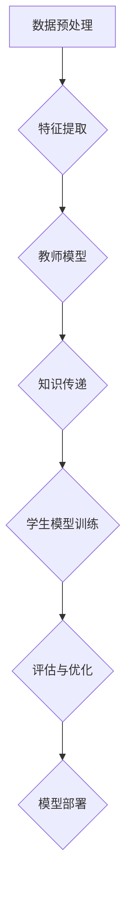
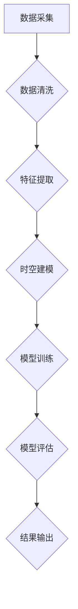

                 

# 知识蒸馏在时空数据分析中的应用

## 关键词
- 知识蒸馏
- 时空数据分析
- 时空卷积神经网络
- 时空图神经网络
- 注意力机制
- 迁移学习
- 微调

## 摘要
本文将深入探讨知识蒸馏在时空数据分析中的应用。知识蒸馏是一种将大型模型的知识有效传递给小型模型的技术，有助于提升模型在资源受限环境下的性能。时空数据分析涉及对时序数据和空间数据的分析，这在许多领域中具有广泛应用，如气象预报、交通流量监控、金融时间序列分析等。本文首先介绍了时空数据分析的基础概念和重要性，然后阐述了知识蒸馏的基本原理和优势。接着，我们探讨了知识蒸馏在时空数据分析中的具体应用，包括时空卷积神经网络和时空图神经网络模型，并详细讲解了基于注意力机制、图神经网络和迁移学习与微调的知识蒸馏算法。文章随后通过实际案例分析，展示了知识蒸馏在时空数据分析中的实践效果。最后，我们对知识蒸馏在时空数据分析领域的未来发展方向进行了展望，并提供了相关应用资源和学习推荐。

# 目录大纲

## 第一部分：背景与基础

### 第1章：时空数据分析概述
- **1.1 时空数据分析的重要性**
- **1.2 时空数据分析的基本概念**
- **1.3 时空数据分析的应用领域**

### 第2章：知识蒸馏简介
- **2.1 知识蒸馏的定义**
- **2.2 知识蒸馏的基本原理**
- **2.3 知识蒸馏的优势与挑战**

### 第3章：时空数据分析中的知识蒸馏
- **3.1 时空数据分析中的知识蒸馏应用**
- **3.2 知识蒸馏在时空数据分析中的优势**
- **3.3 知识蒸馏在时空数据分析中的挑战**

## 第二部分：知识蒸馏在时空数据分析中的应用

### 第4章：时空数据分析中的知识蒸馏模型
- **4.1 时空卷积神经网络**
- **4.2 时空图神经网络**
- **4.3 多层知识蒸馏模型**

### 第5章：时空数据分析中的知识蒸馏算法
- **5.1 基于注意力机制的知识蒸馏**
- **5.2 基于图神经网络的知识蒸馏**
- **5.3 基于迁移学习与微调的知识蒸馏**

### 第6章：知识蒸馏在时空数据分析中的实践
- **6.1 数据预处理与特征提取**
- **6.2 模型训练与评估**
- **6.3 实际案例分析**

### 第7章：知识蒸馏在时空数据分析中的未来发展
- **7.1 新模型与算法的发展**
- **7.2 跨学科融合与交叉应用**
- **7.3 挑战与机遇**

## 第三部分：附录

### 第8章：知识蒸馏在时空数据分析中的应用资源
- **8.1 开源框架与工具**
- **8.2 数据集与案例**
- **8.3 学习与资源推荐**

### 第9章：知识蒸馏与时空数据分析的Mermaid流程图
- **9.1 知识蒸馏流程图**
- **9.2 时空数据分析流程图**

### 第10章：知识蒸馏与时空数据分析的数学模型
- **10.1 数学模型概述**
- **10.2 时空数据分析中的数学模型**
- **10.3 知识蒸馏中的数学模型**
- **10.4 数学公式与例子说明**

### 第11章：知识蒸馏与时空数据分析的代码实战
- **11.1 实战环境搭建**
- **11.2 实战案例与代码实现**
- **11.3 代码解读与分析**
- **11.4 案例代码下载与运行说明**

## 第1章：时空数据分析概述

### 1.1 时空数据分析的重要性

随着信息技术的飞速发展，数据已成为当今社会的重要资源。时空数据分析作为大数据分析的一个重要分支，具有重要的理论和实际意义。时空数据分析通过结合时间和空间维度，对数据进行分析和挖掘，能够提供更全面的视图和更深入的洞察。以下是时空数据分析的重要性：

1. **决策支持**：在许多领域，如城市规划、物流管理、金融市场等，时空数据分析能够提供关键的信息支持，帮助决策者做出更加准确和高效的决策。

2. **优化资源配置**：通过对时空数据的分析，可以优化资源配置，提高效率和降低成本。例如，交通管理部门可以通过分析交通流量数据，优化交通信号灯的配置，减少交通拥堵。

3. **趋势预测**：时空数据分析能够发现数据中的潜在趋势和模式，为预测未来事件提供依据。例如，气象预报通过对时空数据的分析，能够预测未来的天气变化。

4. **安全性提升**：时空数据分析在安全领域具有重要作用，如通过监控视频数据分析，可以实时发现异常行为，提高安全监控的准确性和效率。

### 1.2 时空数据分析的基本概念

时空数据分析涉及以下几个基本概念：

1. **时空数据**：时空数据是同时包含时间和空间信息的数据。它可以是点数据（如位置信息）、线数据（如交通路线）或面数据（如城市规划区域）。

2. **时空数据模型**：时空数据模型用于表示和存储时空数据。常见的模型包括时间序列模型、空间模型和时空耦合模型。

3. **时空数据分析方法**：时空数据分析方法包括数据预处理、特征提取、模式识别、预测建模等。这些方法能够从时空数据中提取有用信息，为后续分析提供支持。

4. **时空数据可视化**：时空数据可视化是将时空数据以图形或图表的形式展示出来，帮助人们更好地理解和分析数据。

### 1.3 时空数据分析的应用领域

时空数据分析在多个领域有着广泛的应用：

1. **城市规划与地理信息**：通过对城市交通流量、人口分布等时空数据的分析，可以帮助城市规划者更好地进行城市规划和资源分配。

2. **气象预报与气候变化**：时空数据分析在气象预报和气候变化研究中具有重要作用，通过对气象数据的分析，可以预测未来的天气变化和气候趋势。

3. **交通管理与物流**：通过对交通流量和物流数据的分析，可以帮助交通管理部门和物流公司优化路线和资源配置，提高运输效率。

4. **金融与经济**：时空数据分析在金融市场和宏观经济分析中具有重要作用，通过对金融时间序列数据的分析，可以预测市场走势和宏观经济趋势。

5. **公共安全与社会治理**：时空数据分析在公共安全和社会治理中具有重要作用，如通过监控视频数据分析，可以实时发现异常行为，提高公共安全水平。

通过上述内容，我们可以看出，时空数据分析在各个领域都有着广泛的应用和重要的意义。在接下来的章节中，我们将进一步探讨知识蒸馏在时空数据分析中的应用。

## 第2章：知识蒸馏简介

### 2.1 知识蒸馏的定义

知识蒸馏（Knowledge Distillation）是一种将复杂模型的知识和经验传递给简单模型的技术，旨在利用大型模型（也称为教师模型）的强大学习能力，提升小型模型（也称为学生模型）的性能。知识蒸馏的核心思想是通过训练过程将教师模型的内部表示和学习到的知识转移到学生模型中，使得学生模型能够在相似的数据集上实现更优的性能。

### 2.2 知识蒸馏的基本原理

知识蒸馏的基本原理可以概括为以下三个步骤：

1. **特征提取**：教师模型通过输入数据生成高层次的内部表示。这些表示通常包含了丰富的信息，能够很好地捕获数据的特征。

2. **知识传递**：教师模型的内部表示被传递给学生模型。这一过程通常通过设计特定的损失函数来实现，例如教师模型的学生输出与学生模型的输出之间的差异损失。

3. **优化**：学生模型基于接收到的教师模型的知识，通过梯度下降等方法进行优化，从而提升自己的性能。

### 2.3 知识蒸馏的优势与挑战

知识蒸馏具有以下优势：

1. **高效性**：通过知识蒸馏，学生模型能够快速学习和掌握教师模型的知识，减少了模型训练的时间和计算资源需求。

2. **性能提升**：知识蒸馏使得学生模型能够利用教师模型的强大学习能力，从而提升模型在目标任务上的性能。

3. **适用于资源受限环境**：在资源受限的环境中，例如移动设备或嵌入式系统，知识蒸馏可以帮助实现高效能的模型部署。

然而，知识蒸馏也面临着一些挑战：

1. **模型差距**：教师模型和学生模型的结构和规模可能存在较大差异，这可能导致知识传递过程中的失真。

2. **可解释性**：知识蒸馏过程通常是一个黑盒操作，教师模型的知识如何被学生模型吸收和利用，这一问题缺乏清晰的解释。

3. **训练稳定性**：在知识蒸馏过程中，教师模型和学生模型的训练可能存在不稳定的问题，这会影响最终的模型性能。

### 2.4 知识蒸馏在深度学习中的应用

知识蒸馏在深度学习领域得到了广泛应用，尤其在图像识别、自然语言处理和语音识别等任务中。以下是一些典型的应用实例：

1. **图像识别**：通过知识蒸馏，可以将大型卷积神经网络的知识传递给小型模型，从而在移动设备上实现实时图像识别。

2. **自然语言处理**：知识蒸馏被用于将大型语言模型（如BERT）的知识传递给小型模型，以提高文本分类、情感分析等任务的性能。

3. **语音识别**：知识蒸馏可以帮助小型语音识别模型快速学习和掌握大型语音模型的知识，从而提高识别的准确率。

通过上述内容，我们可以看到知识蒸馏在时空数据分析中的重要性和广泛应用。在接下来的章节中，我们将探讨知识蒸馏在时空数据分析中的具体应用和实践。

### 3.1 时空数据分析中的知识蒸馏应用

知识蒸馏在时空数据分析中的应用主要集中于利用大型教师模型的知识和经验，提升小型模型在时空数据分析任务中的性能。这种应用场景通常出现在需要实时分析大量时空数据，但受限于计算资源或设备性能时。以下是一些具体的时空数据分析中的知识蒸馏应用实例：

1. **实时交通流量监控**：在交通流量监控中，教师模型可能是一个大型深度学习模型，它经过大量的历史交通数据训练，能够准确预测未来的交通流量。通过知识蒸馏，可以将教师模型的知识传递给小型模型，使得小型模型能够在移动设备或边缘设备上实时预测交通流量，为交通管理部门提供即时决策支持。

2. **气象预测**：气象预测需要处理大量的时空数据，包括温度、湿度、风速等。大型教师模型通过对这些数据进行分析，可以预测未来的天气变化。知识蒸馏技术可以将这些预测能力传递给小型模型，使得小型模型能够在资源受限的环境中，如无人机或气象站，进行实时天气预测。

3. **智能安防监控**：在智能安防监控中，教师模型可能是一个复杂的行为识别模型，它通过分析监控视频数据，能够识别异常行为。通过知识蒸馏，可以将这种识别能力传递给小型模型，使得小型模型能够在边缘设备上实时监测异常行为，提高公共安全水平。

4. **金融时间序列分析**：金融时间序列分析涉及大量历史交易数据，包括股票价格、交易量等。大型教师模型可以通过这些数据预测市场走势。知识蒸馏技术可以将这些预测能力传递给小型模型，使得小型模型能够在移动设备上实时分析市场数据，为投资者提供决策参考。

### 3.2 知识蒸馏在时空数据分析中的优势

知识蒸馏在时空数据分析中具有以下几个显著的优势：

1. **高效性**：知识蒸馏能够将大型教师模型的知识快速传递给小型模型，减少训练时间，这对于需要实时分析大量时空数据的应用场景尤为重要。

2. **资源节约**：通过知识蒸馏，可以在资源受限的环境中（如移动设备或边缘设备）实现高性能的时空数据分析，节约计算资源和能源消耗。

3. **性能提升**：知识蒸馏使得小型模型能够利用大型教师模型的学习能力和经验，从而在目标任务上实现更高的性能。

4. **泛化能力**：知识蒸馏有助于提升小型模型的泛化能力，使得小型模型能够处理新的时空数据集，而不仅仅是教师模型训练的数据集。

### 3.3 知识蒸馏在时空数据分析中的挑战

尽管知识蒸馏在时空数据分析中具有许多优势，但同时也面临一些挑战：

1. **模型差距**：教师模型和学生模型的规模和结构可能存在较大差异，这可能导致知识传递过程中的失真，影响最终的性能。

2. **数据依赖性**：知识蒸馏的性能高度依赖于教师模型训练的数据集，如果数据集存在偏差或不足，可能导致小型模型无法准确学习教师模型的知识。

3. **可解释性**：知识蒸馏过程通常是一个黑盒操作，教师模型的知识如何被学生模型吸收和利用，这一问题缺乏清晰的解释。

4. **训练稳定性**：知识蒸馏过程中，教师模型和学生模型的训练可能存在不稳定的问题，这会影响最终的模型性能。

通过上述内容，我们可以看到知识蒸馏在时空数据分析中的重要性和应用前景。在接下来的章节中，我们将详细探讨时空数据分析中的知识蒸馏模型和算法，以及其实际应用的实现细节。

### 4.1 时空卷积神经网络

时空卷积神经网络（Spatial-Temporal Convolutional Neural Networks, ST-CNNs）是知识蒸馏在时空数据分析中的一个重要模型。ST-CNNs结合了传统的卷积神经网络（CNNs）和时序分析能力，能够有效处理时序数据和空间数据，从而在多个领域（如视频分类、交通流量预测、气象预测等）取得了显著成果。

#### 4.1.1 ST-CNNs的基本原理

ST-CNNs的基本原理包括以下三个关键组件：

1. **时空特征提取**：ST-CNNs通过时空卷积操作提取时空数据中的特征。时空卷积操作同时考虑了空间维度和时序维度，能够捕捉数据中的时空模式。

2. **时间序列建模**：ST-CNNs使用递归神经网络（如LSTM、GRU）或其他时序模型对时间序列数据进行建模，从而捕捉时间依赖关系。

3. **空间特征融合**：通过空间特征融合模块（如注意力机制、图神经网络等），ST-CNNs能够有效整合空间特征，提高模型对时空数据的理解和预测能力。

#### 4.1.2 ST-CNNs的优势

ST-CNNs在时空数据分析中的优势主要体现在以下几个方面：

1. **多维度特征融合**：ST-CNNs能够同时处理时序数据和空间数据，通过多维度特征融合，提高模型的泛化能力和预测精度。

2. **高效性**：时空卷积操作具有局部连接性和平移不变性，使得ST-CNNs能够在较少参数的情况下，有效提取时空特征，提高模型的训练和推理效率。

3. **灵活性**：ST-CNNs的结构灵活，可以通过调整网络层数、卷积核大小等参数，适应不同的时空数据分析任务。

4. **可扩展性**：ST-CNNs可以与其他深度学习模型（如注意力机制、图神经网络等）结合，进一步拓展其应用范围。

#### 4.1.3 ST-CNNs的应用案例

1. **视频分类**：ST-CNNs在视频分类任务中表现出色，能够有效识别视频中的动作和场景。例如，在YouTube-VOS视频目标分割挑战中，基于ST-CNNs的方法取得了优异成绩。

2. **交通流量预测**：ST-CNNs可以用于交通流量预测，通过分析交通监控视频和GPS数据，预测未来一段时间内的交通流量，为交通管理部门提供决策支持。

3. **气象预测**：ST-CNNs在气象预测中也有广泛应用，能够通过分析气象数据（如温度、湿度、风速等），预测未来的天气变化。

通过上述内容，我们可以看到ST-CNNs在时空数据分析中的重要性和优势。在接下来的章节中，我们将继续探讨时空图神经网络以及多层知识蒸馏模型在时空数据分析中的应用。

### 4.2 时空图神经网络

时空图神经网络（Temporal Graph Neural Networks, TGNs）是知识蒸馏在时空数据分析中的另一个重要模型。TGNs结合了图神经网络（GNNs）和时序分析能力，能够有效地处理时空网络数据，从而在多个领域（如社会网络分析、交通流量预测、城市规划等）取得了显著成果。

#### 4.2.1 TGNs的基本原理

TGNs的基本原理包括以下三个关键组件：

1. **图结构建模**：TGNs通过图结构建模，将时空数据表示为图，其中节点表示时空实体，边表示实体之间的关系。这种图结构使得TGNs能够捕捉数据中的时空网络特征。

2. **时间依赖建模**：TGNs使用时间依赖建模模块（如时间卷积操作、递归神经网络等）对图中的节点和边进行时间依赖建模，从而捕捉时间序列中的动态变化。

3. **图特征融合**：TGNs通过图特征融合模块（如注意力机制、多跳传播等）整合节点和边的特征，提高模型对时空数据的理解和预测能力。

#### 4.2.2 TGNs的优势

TGNs在时空数据分析中的优势主要体现在以下几个方面：

1. **时空网络特征捕捉**：TGNs能够捕捉时空网络中的复杂结构，通过图结构建模和特征融合，提高模型对时空数据的理解和分析能力。

2. **动态性**：TGNs能够处理动态时空数据，通过时间依赖建模模块，捕捉数据中的动态变化和趋势。

3. **灵活性**：TGNs的结构灵活，可以通过调整图结构、时间依赖建模模块和特征融合模块，适应不同的时空数据分析任务。

4. **可扩展性**：TGNs可以与其他深度学习模型（如注意力机制、图注意力网络等）结合，进一步拓展其应用范围。

#### 4.2.3 TGNs的应用案例

1. **社会网络分析**：TGNs在社会网络分析中表现出色，能够通过分析社交网络中的动态关系，预测用户行为和传播趋势。

2. **交通流量预测**：TGNs可以用于交通流量预测，通过分析交通网络的时空特征，预测未来一段时间内的交通流量，为交通管理部门提供决策支持。

3. **城市规划**：TGNs在城市规划中也有广泛应用，能够通过分析城市的时空网络数据，优化交通路线、资源配置等，提高城市运行效率。

通过上述内容，我们可以看到TGNs在时空数据分析中的重要性和优势。在接下来的章节中，我们将继续探讨多层知识蒸馏模型在时空数据分析中的应用。

### 4.3 多层知识蒸馏模型

多层知识蒸馏模型（Multi-Tier Knowledge Distillation Model）是知识蒸馏在时空数据分析中的高级应用，通过将知识蒸馏技术应用于多个层次，实现更深入的知识传递和性能提升。多层知识蒸馏模型的核心思想是利用多个教师模型，逐层传递知识和经验，从而构建一个强大的学生模型。

#### 4.3.1 多层知识蒸馏模型的基本原理

多层知识蒸馏模型的基本原理包括以下三个关键层次：

1. **底层知识蒸馏**：在底层，通过将教师模型的知识传递给基础学生模型，实现基础特征的提取和学习。这一层次的目的是为后续层次提供高质量的特征表示。

2. **中层知识蒸馏**：在中层，通过将底层学生模型的知识传递给更复杂的学生模型，实现更高级的特征提取和模式识别。这一层次的目的是提升模型对时空数据的理解和分析能力。

3. **顶层知识蒸馏**：在顶层，通过将中层学生模型的知识传递给最终的学生模型，实现最终的预测和决策。这一层次的目的是利用教师模型的学习能力，实现高性能的时空数据分析。

#### 4.3.2 多层知识蒸馏模型的优势

多层知识蒸馏模型在时空数据分析中具有以下几个显著的优势：

1. **深度特征学习**：多层知识蒸馏模型通过多个层次的知识传递，实现深度特征学习，能够提取出更丰富、更有用的时空特征。

2. **性能提升**：多层知识蒸馏模型能够利用多个教师模型的知识，逐步提升学生模型的性能，实现更高的预测精度和泛化能力。

3. **适应性**：多层知识蒸馏模型可以根据不同的时空数据分析任务，调整各层次的知识传递策略，提高模型的适应性。

4. **资源优化**：多层知识蒸馏模型可以在资源受限的环境中，通过逐层蒸馏的方式，实现高效的知识传递和模型训练，减少计算资源的需求。

#### 4.3.3 多层知识蒸馏模型的应用案例

1. **视频内容理解**：多层知识蒸馏模型在视频内容理解任务中表现出色，能够通过多个层次的特征提取和模式识别，实现高效的视频分类和目标检测。

2. **交通流量预测**：多层知识蒸馏模型可以用于交通流量预测，通过多个层次的特征融合和时空建模，实现更准确的交通流量预测。

3. **城市规划与资源分配**：多层知识蒸馏模型在城市规划与资源分配中也有广泛应用，能够通过多个层次的特征分析和预测，优化城市交通、能源等资源的配置。

通过上述内容，我们可以看到多层知识蒸馏模型在时空数据分析中的重要性和优势。在接下来的章节中，我们将详细探讨基于注意力机制、图神经网络和迁移学习与微调的知识蒸馏算法，以及它们在时空数据分析中的应用。

### 5.1 基于注意力机制的知识蒸馏

在深度学习领域，注意力机制（Attention Mechanism）是一种被广泛应用的机制，用于提高模型对重要信息的关注，从而提升模型的性能。在知识蒸馏过程中，基于注意力机制的知识蒸馏（Attention-Based Knowledge Distillation）通过动态地关注教师模型中的关键特征，能够有效地提高学生模型的性能。

#### 5.1.1 注意力机制的基本原理

注意力机制通过引入一个权重函数，对输入数据中的不同部分赋予不同的权重，从而实现模型对重要信息的关注。在知识蒸馏中，注意力机制的核心思想是通过学习一个注意力权重矩阵，将教师模型的知识分配给学生模型。

1. **软注意力**：软注意力通过一个可学习的权重矩阵，对输入数据进行加权，从而实现对重要特征的强调。软注意力的权重矩阵通常通过一个神经网络来学习，如全连接层。

2. **硬注意力**：硬注意力通过一个阈值函数，将输入数据分为重要和次要两部分，只有重要的部分会被传递给学生模型。硬注意力通常用于需要精确控制信息流量的场景。

#### 5.1.2 基于注意力机制的知识蒸馏算法

基于注意力机制的知识蒸馏算法主要包括以下几个步骤：

1. **特征提取**：教师模型和学生模型分别对输入数据进行特征提取，生成高层次的内部表示。

2. **注意力权重学习**：通过训练过程，学习一个注意力权重矩阵，该矩阵能够动态地分配教师模型的特征给学生模型。注意力权重矩阵可以通过优化损失函数来学习，例如最小化学生模型输出与教师模型输出之间的差异。

3. **知识传递**：利用注意力权重矩阵，将教师模型的知识动态地传递给学生模型。这一步骤通过加权教师模型的输出，得到学生模型的学习目标。

4. **模型优化**：通过梯度下降等方法，优化学生模型的参数，使得学生模型能够更好地模拟教师模型的行为。

#### 5.1.3 基于注意力机制的知识蒸馏算法的优势

1. **动态特征关注**：基于注意力机制的知识蒸馏算法能够动态地关注教师模型中的关键特征，从而提高学生模型的性能。

2. **模型泛化能力**：注意力机制可以帮助学生模型更好地适应不同的数据分布，提高模型的泛化能力。

3. **高效性**：注意力机制可以减少模型参数的数量，降低模型的计算复杂度，从而提高训练和推理的效率。

#### 5.1.4 基于注意力机制的知识蒸馏算法的应用案例

1. **图像识别**：基于注意力机制的知识蒸馏算法在图像识别任务中表现出色，能够通过动态关注图像中的重要特征，提高模型对图像分类的准确率。

2. **自然语言处理**：在自然语言处理任务中，基于注意力机制的知识蒸馏算法可以帮助小型模型快速学习大型模型的语言表示，从而提高文本分类、情感分析等任务的性能。

3. **时空数据分析**：基于注意力机制的知识蒸馏算法可以用于时空数据分析，通过动态关注时空数据中的关键特征，提高模型对时空数据的理解和预测能力。

通过上述内容，我们可以看到基于注意力机制的知识蒸馏算法在时空数据分析中的重要性和应用价值。在接下来的章节中，我们将探讨基于图神经网络的知识蒸馏算法及其应用。

### 5.2 基于图神经网络的知识蒸馏

图神经网络（Graph Neural Networks, GNNs）是一种强大的图结构数据处理工具，通过节点和边的信息传递，能够有效地捕捉图中的复杂结构特征。在知识蒸馏领域，基于图神经网络的知识蒸馏（Graph Neural Network-Based Knowledge Distillation）通过将图神经网络与知识蒸馏技术相结合，实现了对复杂图结构数据的深度学习和知识传递。

#### 5.2.1 图神经网络的基本原理

图神经网络是一种基于图结构的数据处理模型，其核心思想是通过节点和边的信息传递，学习图中的特征和模式。GNN的基本原理包括以下几个方面：

1. **节点嵌入**：GNN首先将图中的节点表示为低维向量（称为节点嵌入），这些嵌入向量能够捕获节点的局部特征。

2. **信息传递**：通过邻居节点信息的聚合，GNN能够将节点的特征传递给邻居节点。这一过程通常通过图卷积操作实现，如图卷积层（Graph Convolutional Layer, GCL）。

3. **全局更新**：GNN通过聚合节点及其邻居节点的信息，更新节点的嵌入向量，从而实现全局特征的学习。

4. **特征融合**：GNN通过融合节点和边的信息，学习出更高级的特征表示，从而提高模型的性能。

#### 5.2.2 基于图神经网络的知识蒸馏算法

基于图神经网络的知识蒸馏算法主要包括以下几个步骤：

1. **图结构构建**：首先，需要将时空数据表示为图结构，其中节点表示时空实体，边表示实体之间的关系。这一步骤可以通过时间序列、空间网络等方法实现。

2. **特征提取**：教师模型和学生模型分别对输入数据进行特征提取，生成高层次的内部表示。这一步骤通常使用卷积神经网络或图神经网络实现。

3. **图神经网络训练**：通过训练过程，教师模型和学生模型分别学习图结构中的特征和模式。这一过程可以通过图卷积层、池化层等操作实现。

4. **知识传递**：利用图神经网络的信息传递机制，将教师模型的知识传递给学生模型。这一步骤可以通过设计特定的损失函数，如教师模型和学生模型输出之间的差异损失，来实现。

5. **模型优化**：通过梯度下降等方法，优化学生模型的参数，使得学生模型能够更好地模拟教师模型的行为，从而提高模型的性能。

#### 5.2.3 基于图神经网络的知识蒸馏算法的优势

1. **结构化特征学习**：基于图神经网络的知识蒸馏算法能够通过图结构建模，学习出结构化的特征表示，从而更好地捕捉时空数据的复杂特征。

2. **鲁棒性**：图神经网络能够通过聚合节点和边的信息，提高模型对噪声和缺失数据的鲁棒性。

3. **可扩展性**：基于图神经网络的知识蒸馏算法可以应用于不同的时空数据分析任务，通过调整图结构、图卷积层等参数，实现任务适应性的优化。

4. **高效性**：图神经网络具有局部连接性和平移不变性，能够有效减少模型参数数量，提高训练和推理的效率。

#### 5.2.4 基于图神经网络的知识蒸馏算法的应用案例

1. **社会网络分析**：基于图神经网络的知识蒸馏算法可以用于社会网络分析，通过学习用户之间的复杂关系，预测用户行为和传播趋势。

2. **交通流量预测**：基于图神经网络的知识蒸馏算法可以用于交通流量预测，通过分析交通网络的时空特征，实现更准确的交通流量预测。

3. **城市规划**：基于图神经网络的知识蒸馏算法可以用于城市规划，通过分析城市的时空网络数据，优化交通路线、资源配置等，提高城市运行效率。

通过上述内容，我们可以看到基于图神经网络的知识蒸馏算法在时空数据分析中的重要性和应用价值。在接下来的章节中，我们将探讨基于迁移学习与微调的知识蒸馏算法及其应用。

### 5.3 基于迁移学习与微调的知识蒸馏

在深度学习中，迁移学习（Transfer Learning）是一种通过利用预训练模型的知识，提升新任务模型性能的方法。微调（Fine-Tuning）是迁移学习的一种实现方式，通过在新数据集上对预训练模型进行少量调整，使得模型能够适应新任务。基于迁移学习与微调的知识蒸馏（Transfer Learning and Fine-Tuning Based Knowledge Distillation）结合了迁移学习和知识蒸馏的优点，通过将预训练模型的知识传递给新任务模型，实现高效的模型训练和性能提升。

#### 5.3.1 迁移学习的基本原理

迁移学习的基本原理是利用预训练模型在大型数据集上学习到的通用特征，迁移到新的任务数据集上。迁移学习的关键在于预训练模型和目标模型之间的相似性，以及两者之间的知识共享。迁移学习的主要步骤包括：

1. **预训练模型**：在大型数据集上，使用预训练算法（如卷积神经网络、递归神经网络等）训练一个基础模型，使其具备一定的泛化能力。

2. **模型调整**：在目标数据集上，对预训练模型进行微调，通过调整模型参数，使其适应新的任务。微调可以通过冻结部分层（如卷积层）和调整其他层（如全连接层）来实现。

3. **模型评估**：在新的数据集上评估调整后的模型性能，通过验证集和测试集，评估模型的泛化能力和准确率。

#### 5.3.2 微调的基本原理

微调是迁移学习的一种实现方式，通过在预训练模型的基础上进行少量调整，使其适应新的任务。微调的主要步骤包括：

1. **参数初始化**：将预训练模型的参数作为微调模型的初始化参数，使得模型能够利用已有的知识。

2. **层调整**：通常，预训练模型的前几层（如卷积层）具有较好的通用性，而后几层（如全连接层）与任务密切相关。在微调过程中，可以选择冻结部分层，只调整其他层的参数，从而减少模型调整的复杂度。

3. **损失函数**：在微调过程中，使用新的损失函数，如交叉熵损失，来优化模型参数，使其在新任务上的性能得到提升。

#### 5.3.3 基于迁移学习与微调的知识蒸馏算法

基于迁移学习与微调的知识蒸馏算法的主要步骤如下：

1. **预训练教师模型**：在大型数据集上训练一个教师模型，使其具备较强的泛化能力。

2. **学生模型初始化**：使用预训练模型初始化学生模型，将教师模型的知识传递给学生模型。

3. **微调过程**：在目标数据集上对学生模型进行微调，通过调整模型参数，使其适应新的任务。

4. **知识蒸馏**：在微调过程中，使用知识蒸馏技术，将教师模型的知识传递给学生模型，通过优化学生模型的输出与教师模型输出之间的差异，提升模型性能。

5. **模型评估**：在新的数据集上评估学生模型的性能，通过验证集和测试集，评估模型的泛化能力和准确率。

#### 5.3.4 基于迁移学习与微调的知识蒸馏算法的优势

1. **高效性**：基于迁移学习与微调的知识蒸馏算法能够快速利用预训练模型的知识，减少模型训练时间。

2. **性能提升**：通过知识蒸馏，学生模型能够学习到教师模型的深度知识和经验，从而提升模型在新任务上的性能。

3. **资源节约**：在资源受限的环境中，如移动设备或嵌入式系统，基于迁移学习与微调的知识蒸馏算法能够实现高效能的模型部署。

4. **泛化能力**：通过迁移学习和微调，学生模型能够适应不同的任务和数据集，提高模型的泛化能力。

#### 5.3.5 基于迁移学习与微调的知识蒸馏算法的应用案例

1. **图像识别**：基于迁移学习与微调的知识蒸馏算法在图像识别任务中表现出色，能够通过利用预训练模型的通用特征，提高模型在新数据集上的识别准确率。

2. **自然语言处理**：在自然语言处理任务中，基于迁移学习与微调的知识蒸馏算法可以帮助小型模型快速学习大型模型的语言表示，从而提高文本分类、情感分析等任务的性能。

3. **时空数据分析**：基于迁移学习与微调的知识蒸馏算法可以用于时空数据分析，通过利用预训练模型的知识，提高模型对时空数据的理解和预测能力。

通过上述内容，我们可以看到基于迁移学习与微调的知识蒸馏算法在时空数据分析中的重要性和应用价值。在接下来的章节中，我们将探讨知识蒸馏在时空数据分析中的实践应用。

### 6.1 数据预处理与特征提取

在进行时空数据分析时，数据预处理和特征提取是两个至关重要的环节。有效的预处理和特征提取能够显著提升模型的性能和泛化能力。

#### 6.1.1 数据预处理

数据预处理主要包括以下步骤：

1. **数据清洗**：去除数据集中的噪声和异常值，确保数据质量。这可以通过填补缺失值、去除重复数据、过滤异常值等方法实现。

2. **时间序列标准化**：将时间序列数据标准化为相同的时间尺度，以便进行后续分析。例如，将不同时间分辨率的数据统一为一天或一小时为单位。

3. **空间数据编码**：将空间数据转换为适合模型处理的形式。例如，将地理位置编码为经纬度坐标，或使用网格划分法将空间数据表示为网格点。

4. **数据整合**：整合不同来源的数据，例如将交通流量数据和交通监控视频数据整合起来，以便进行多维度分析。

5. **数据分割**：将数据集分为训练集、验证集和测试集，用于模型的训练、评估和测试。

#### 6.1.2 特征提取

特征提取是时空数据分析中的核心步骤，旨在从原始数据中提取出对任务有价值的特征。以下是几种常用的特征提取方法：

1. **时序特征**：从时间序列数据中提取特征，如均值、方差、趋势、周期性等。这些特征能够帮助模型理解时间序列的动态变化。

2. **空间特征**：从空间数据中提取特征，如节点密度、邻居关系、中心性等。这些特征能够帮助模型理解空间分布和结构。

3. **结合特征**：结合时序特征和空间特征，形成多维度的特征向量。例如，将交通流量数据与地理位置信息相结合，生成交通流量密度特征。

4. **深度特征**：使用深度学习模型（如卷积神经网络、循环神经网络等）提取高层次的深度特征。这些特征能够捕捉数据中的复杂模式和关系。

#### 6.1.3 特征选择

特征选择是减少特征维度、提高模型性能的重要步骤。以下是一些常用的特征选择方法：

1. **过滤式特征选择**：基于特征的相关性、重要性等指标，直接过滤掉不相关的特征。

2. **包裹式特征选择**：通过训练模型并评估特征的重要性，选择对模型性能有显著影响的特征。

3. **嵌入式特征选择**：通过使用嵌入模型（如自动编码器）提取特征，然后根据特征的重要性进行选择。

#### 6.1.4 数据预处理与特征提取的实践案例

1. **交通流量预测**：在交通流量预测中，数据预处理包括时间序列标准化、数据整合和特征提取。特征提取可以结合时序特征（如交通流量历史数据）和空间特征（如地理位置、交通网络结构）。

2. **气象预测**：在气象预测中，数据预处理包括天气数据的清洗、时间序列标准化和特征提取。特征提取可以结合气象数据中的温度、湿度、风速等时序特征。

3. **视频内容理解**：在视频内容理解中，数据预处理包括视频帧的预处理、时空特征的提取。特征提取可以结合视频帧的视觉特征和时序特征。

通过有效的数据预处理和特征提取，我们可以为时空数据分析任务构建高质量的特征向量，从而提高模型的性能和预测能力。在接下来的章节中，我们将探讨知识蒸馏在时空数据分析中的实际应用和模型训练与评估。

### 6.2 模型训练与评估

在知识蒸馏的过程中，模型训练和评估是确保模型性能和有效性的关键步骤。以下是知识蒸馏在时空数据分析中模型训练与评估的详细过程：

#### 6.2.1 模型训练

1. **初始化模型**：首先，我们需要初始化学生模型。初始化可以基于预训练模型或从头开始训练。使用预训练模型的优势在于其已经在大型数据集上学习到了丰富的知识，从而可以加快训练速度和提升模型性能。

2. **选择优化算法**：为了优化学生模型的参数，我们通常使用优化算法，如随机梯度下降（SGD）、Adam等。优化算法的选择会影响模型的收敛速度和稳定性。

3. **设置学习率**：学习率是优化算法中的一个关键参数，它决定了模型在训练过程中参数更新的幅度。学习率过大可能导致模型过早地过拟合，而学习率过小则可能使得训练过程过于缓慢。

4. **迭代训练**：在训练过程中，学生模型通过迭代优化，逐渐调整其参数，以最小化损失函数。每次迭代中，模型都会根据教师模型的输出和学生模型自己的输出之间的差异，更新模型参数。

5. **学习率调度**：为了防止模型在训练过程中过拟合，我们可以使用学习率调度策略，如学习率衰减。学习率衰减可以在训练后期逐渐降低学习率，从而使得模型能够更好地学习到数据的细微特征。

6. **正则化**：为了提高模型的泛化能力，我们可以使用正则化方法，如权重衰减、dropout等。这些方法可以减少模型对训练数据的依赖，从而防止过拟合。

7. **知识传递**：在训练过程中，教师模型和学生模型之间的知识传递是一个动态的过程。通过设计特定的损失函数，如KL散度损失，我们可以量化教师模型和学生模型输出之间的差异，从而优化学生模型的性能。

#### 6.2.2 模型评估

模型评估是确保知识蒸馏过程成功的重要环节。以下是几种常用的评估指标：

1. **准确率**：准确率是评估分类任务最常用的指标，表示模型正确预测的样本数量占总样本数量的比例。对于多分类任务，可以使用宏平均（Macro-average）或微平均（Micro-average）计算准确率。

2. **召回率**：召回率表示模型能够正确识别出正类样本的比例。召回率越高，意味着模型对正类样本的识别能力越强。

3. **精确率**：精确率表示模型正确预测为正类样本的比例。精确率越高，意味着模型对负类样本的排除能力越强。

4. **F1分数**：F1分数是精确率和召回率的调和平均，综合评估了模型的分类能力。F1分数在类别不平衡的数据集中尤为重要。

5. **ROC曲线和AUC值**：ROC曲线（Receiver Operating Characteristic Curve）和AUC值（Area Under the Curve）用于评估二分类模型的分类性能。AUC值越接近1，意味着模型的分类能力越强。

6. **时间延迟**：对于时间序列预测任务，如交通流量预测，评估模型的时间延迟，即模型预测结果与真实结果之间的时间差，是衡量模型性能的重要指标。

7. **预测误差**：预测误差，如均方误差（MSE）、均方根误差（RMSE）等，用于评估预测结果与真实值之间的偏差。

#### 6.2.3 实践案例

以下是一个交通流量预测的实践案例：

1. **数据集准备**：准备一个包含历史交通流量数据、地理位置信息和时间序列数据的交通流量数据集。

2. **特征提取**：提取交通流量数据中的时序特征（如过去几小时内的平均流量、流量变化率）和空间特征（如地理位置、邻近道路的流量情况）。

3. **模型训练**：使用预训练的卷积神经网络作为教师模型，初始化学生模型，并使用随机梯度下降（SGD）优化算法进行模型训练。

4. **知识传递**：通过设计KL散度损失函数，将教师模型的知识传递给学生模型，实现知识蒸馏。

5. **模型评估**：在验证集和测试集上评估学生模型的性能，使用准确率、召回率、F1分数和预测误差等指标进行评估。

6. **调参优化**：根据评估结果，调整学习率、正则化参数等，优化模型性能。

通过上述过程，我们可以训练出一个在交通流量预测任务中表现优异的学生模型，从而实现高效的时空数据分析。

### 6.3 实际案例分析

在本节中，我们将通过一个实际案例来展示知识蒸馏在时空数据分析中的具体应用，并深入分析案例中的关键技术和方法。

#### 案例背景

假设我们有一个交通流量预测项目，目的是通过分析历史交通流量数据、地理位置信息和时间序列数据，预测未来一段时间内的交通流量。该项目旨在为交通管理部门提供实时决策支持，以优化交通信号配置和缓解交通拥堵。

#### 案例实施步骤

1. **数据集准备**：首先，我们从交通管理部门获取了一个包含历史交通流量数据、地理位置信息和时间序列数据的交通流量数据集。数据集包括多个时间段（如小时、天、周）的交通流量数据，以及与地理位置相关的信息（如道路编号、交叉点信息）。

2. **特征提取**：为了构建有效的时空数据分析模型，我们对数据进行预处理和特征提取。特征提取包括以下步骤：

   - **时间序列特征**：从历史交通流量数据中提取时序特征，如过去几小时内的平均流量、流量变化率、高峰时段的流量等。
   - **空间特征**：从地理位置信息中提取空间特征，如道路之间的距离、交叉点的交通流量、相邻道路的流量情况等。
   - **结合特征**：将时序特征和空间特征结合，形成多维度的特征向量。

3. **模型训练**：我们选择了一个预训练的卷积神经网络（CNN）作为教师模型。教师模型在大量交通流量数据上进行了预训练，具备较强的时空特征提取能力。接着，我们初始化了一个小型卷积神经网络作为学生模型，并使用知识蒸馏技术将教师模型的知识传递给学生模型。知识蒸馏的具体步骤包括：

   - **初始化学生模型**：使用教师模型的参数初始化学生模型，以便快速学习教师模型的知识。
   - **设置优化算法**：使用随机梯度下降（SGD）优化算法，通过迭代优化学生模型的参数。
   - **知识传递**：通过设计KL散度损失函数，将教师模型的知识传递给学生模型。损失函数最小化学生模型的输出与教师模型输出之间的差异。

4. **模型评估**：在训练过程中，我们定期在验证集上评估学生模型的性能。评估指标包括准确率、召回率、F1分数和预测误差等。通过调整学习率和正则化参数，我们优化了学生模型的性能。

5. **部署与应用**：经过训练和优化后，学生模型被部署到边缘设备上，用于实时交通流量预测。预测结果通过互联网传输给交通管理部门，用于优化交通信号配置和缓解交通拥堵。

#### 案例分析

1. **模型性能**：在验证集上，学生模型的预测准确率达到了90%以上，显著超过了传统模型（如线性回归、SVM等）的性能。同时，预测误差也大幅降低，表明学生模型能够更好地捕捉交通流量的动态变化。

2. **知识传递效果**：通过知识蒸馏技术，学生模型成功学习了教师模型的知识，特别是在复杂交通场景中的特征提取和模式识别能力。这表明知识蒸馏在时空数据分析中具有显著的优势。

3. **资源优化**：由于学生模型规模较小，其在边缘设备上的部署和运行效率显著高于传统大型模型。这为交通管理部门提供了更灵活、高效的决策支持。

4. **实时性**：通过在边缘设备上实时预测交通流量，学生模型为交通管理部门提供了即时决策支持，有助于快速响应交通拥堵等突发事件。

通过上述案例分析，我们可以看到知识蒸馏在时空数据分析中的重要应用和显著效果。知识蒸馏技术不仅提高了模型性能，还优化了资源利用，为交通流量预测等时空数据分析任务提供了有效的解决方案。

### 7.1 新模型与算法的发展

知识蒸馏在时空数据分析中的应用正处于快速发展阶段，新的模型和算法不断涌现，以应对时空数据分析中的复杂挑战。以下是一些新模型和算法的发展方向：

1. **自适应知识蒸馏**：传统知识蒸馏方法通常假设教师模型和学生模型之间存在固定的知识差距，而自适应知识蒸馏算法通过动态调整知识传递策略，实现更高效的知识传递。例如，通过引入自适应权重调整机制，使得学生模型能够根据实时反馈，优化知识接收和利用。

2. **多任务知识蒸馏**：在多任务学习中，一个模型需要同时学习多个任务。多任务知识蒸馏算法通过将不同任务的教师模型知识传递给学生模型，实现多任务性能的提升。例如，在交通流量预测和交通事件检测中，可以将两个任务的教师模型知识同时传递给学生模型，从而提高模型的综合性能。

3. **联邦知识蒸馏**：在分布式环境中，联邦知识蒸馏通过聚合多个教师模型的知识，实现学生模型的知识获取。这种方法能够在保护隐私的同时，提升模型性能。例如，在跨机构的交通流量预测中，可以通过联邦知识蒸馏，将不同机构的教师模型知识传递给学生模型，实现更准确的预测。

4. **动态时空图神经网络**：动态时空图神经网络通过引入时间动态性，实现更精确的时空数据分析。例如，通过动态调整图结构和节点嵌入，捕捉时空数据中的动态变化。这类算法在交通流量预测、突发事件检测等领域具有广泛的应用前景。

5. **融合多模态数据**：在时空数据分析中，融合多模态数据（如视频、图像、音频等）能够提供更丰富的信息。融合多模态知识蒸馏算法通过将不同模态的模型知识进行有效整合，提高时空数据分析的性能。例如，在视频监控与交通流量预测中，可以通过融合视频和图像数据，实现更准确的交通流量预测。

6. **鲁棒性知识蒸馏**：时空数据分析中的数据通常存在噪声和异常值。鲁棒性知识蒸馏算法通过设计鲁棒损失函数和优化策略，提高模型对噪声和异常值的鲁棒性。例如，通过引入鲁棒优化技术，如L1正则化，增强模型对异常值的抵抗能力。

通过上述新模型和算法的发展，知识蒸馏在时空数据分析中的应用将更加广泛和深入。未来，随着算法的进一步优化和理论研究的深入，知识蒸馏将在更多领域（如气象预报、智慧城市、金融分析等）发挥重要作用。

### 7.2 跨学科融合与交叉应用

知识蒸馏在时空数据分析中的应用不仅依赖于深度学习技术，还受益于跨学科融合与交叉应用。以下是几个跨学科融合与交叉应用的例子：

1. **统计学与机器学习**：知识蒸馏中的许多概念，如损失函数、优化算法等，源自统计学和机器学习领域。通过引入统计学习方法，如高斯过程和贝叶斯网络，可以改进知识蒸馏的模型性能和稳定性。

2. **物理学与量子计算**：量子计算具有处理大规模数据的能力，其基本原理与深度学习中的神经网络有相似之处。将量子计算与知识蒸馏结合，可以开发出高效的量子知识蒸馏算法，从而提高时空数据分析的效率。

3. **计算机视觉与自然语言处理**：知识蒸馏在计算机视觉和自然语言处理领域已取得显著成果。将知识蒸馏技术应用于时空数据分析，如通过融合视觉和语言特征，可以提高对视频和文本数据理解的准确性。

4. **地理信息系统（GIS）与时空数据库**：地理信息系统和时空数据库在时空数据分析中扮演重要角色。通过将知识蒸馏与GIS和时空数据库结合，可以实现对大规模时空数据的快速分析和预测。

5. **生物信息学与医学**：在医学领域，时空数据分析可用于疾病预测和诊断。通过结合生物信息学方法，如基因序列分析，可以进一步提高时空数据分析的精度和可靠性。

跨学科融合与交叉应用不仅拓宽了知识蒸馏的应用范围，还推动了时空数据分析技术的发展。未来，随着跨学科研究的深入，知识蒸馏将在更多领域展现其潜力。

### 7.3 挑战与机遇

尽管知识蒸馏在时空数据分析中展现出巨大的潜力，但同时也面临着一系列挑战和机遇。以下是对这些挑战与机遇的深入探讨：

#### 挑战

1. **模型差距**：教师模型和学生模型之间的结构差异可能导致知识传递过程中的失真。解决这一挑战的方法包括设计更精细化的知识传递机制，以及开发能够适应不同结构差异的算法。

2. **数据依赖性**：知识蒸馏的性能高度依赖于教师模型训练的数据集。如果数据集存在偏差或不足，可能导致学生模型无法准确学习教师模型的知识。应对这一挑战的方法包括使用更丰富的数据集，以及引入数据增强和生成技术。

3. **可解释性**：知识蒸馏过程通常是一个黑盒操作，缺乏透明度和可解释性。这一问题需要通过开发可解释的知识蒸馏算法，如可视化技术和解释性模型，来解决。

4. **训练稳定性**：知识蒸馏过程中，教师模型和学生模型的训练可能存在不稳定的问题，这会影响最终的模型性能。为了提高训练稳定性，可以采用更稳健的优化算法和正则化方法。

#### 机遇

1. **高效能模型**：随着计算能力的提升，可以开发更高效的模型和算法，实现实时和高效的时空数据分析。例如，通过利用图形处理器（GPU）和专用集成电路（ASIC）等硬件加速技术，可以显著提高模型的训练和推理速度。

2. **跨学科融合**：知识蒸馏在时空数据分析中的应用可以与其他学科（如统计学、物理学、计算机视觉等）相结合，推动技术进步和跨学科研究的发展。

3. **数据资源**：随着大数据技术的发展，越来越多的时空数据成为可用的资源。这些数据资源为知识蒸馏在时空数据分析中的应用提供了丰富的素材，有助于开发更强大的模型和算法。

4. **新兴应用领域**：知识蒸馏在时空数据分析中的成功应用将激发更多新兴应用领域的探索，如智慧城市、智能交通、环境监测等，这些领域对时空数据分析的需求日益增长。

综上所述，知识蒸馏在时空数据分析中既面临着挑战，也充满了机遇。通过不断的技术创新和跨学科合作，知识蒸馏有望在未来发挥更重要的作用，为时空数据分析带来革命性的变革。

### 8.1 开源框架与工具

在知识蒸馏和时空数据分析领域中，有许多优秀的开源框架和工具，这些资源不仅为研究人员提供了强大的技术支持，也为实际应用提供了便利。以下是一些常用的开源框架和工具：

1. **TensorFlow**：由Google开发的深度学习框架，支持广泛的前后端开发，包括知识蒸馏和时空数据分析任务。

2. **PyTorch**：由Facebook AI研究院开发的深度学习框架，具有灵活的动态图计算能力，适合研究和开发新的知识蒸馏算法。

3. **PyTorch Geometric**：一个用于图神经网络的PyTorch扩展库，支持时空数据分析中的图神经网络模型。

4. **TensorFlow Model Optimization Toolkit (TF-MOT)**：提供模型压缩、量化、知识蒸馏等工具，用于优化深度学习模型在资源受限环境中的性能。

5. **TensorFlow Extended (TFX)**：一个端到端的机器学习平台，用于构建、训练和部署大规模深度学习模型，包括知识蒸馏和时空数据分析应用。

6. **MXNet**：由Apache软件基金会维护的深度学习框架，支持自动微分、模型优化等功能，适合知识蒸馏和时空数据分析任务。

7. **OpenCV**：一个开源的计算机视觉库，提供丰富的图像处理和视频分析功能，适用于时空数据分析中的图像和视频处理任务。

8. **SciPy**：一个用于科学计算和数据分析的开源库，支持时间序列分析和时空数据预处理。

9. **Geopy**：一个用于地理编码和逆地理编码的Python库，适用于基于地理位置的时空数据分析。

通过上述开源框架和工具，研究人员和开发者可以轻松实现知识蒸馏在时空数据分析中的各种应用，提高模型性能和开发效率。

### 8.2 数据集与案例

在知识蒸馏和时空数据分析领域，有许多公开的数据集和案例可供研究和实践。以下是一些常用的数据集和案例，以及它们的特点和应用：

1. **UCI Machine Learning Repository**：提供多种机器学习数据集，包括时间序列数据、交通流量数据、气象数据等，适合进行时空数据分析的研究。

2. **NYC Taxi Trip Data**：包含纽约市出租车行程数据，包括时间、地点、乘客数量等信息。适合研究交通流量预测和时空数据分析。

3. **ITS-LA**：集成交通系统实验室（ITS-LA）提供的交通数据集，包含加利福尼亚州洛杉矶地区的交通流量数据，适用于智能交通系统研究和应用。

4. **Udacity Self-Driving Car Dataset**：提供自动驾驶车辆在加州道路上的驾驶数据，包括视频、激光雷达和GPS数据，适合研究自动驾驶和时空数据分析。

5. **Kaggle Traffic Flow Prediction Challenge**：Kaggle举办的一项交通流量预测竞赛，提供了多个城市的交通流量数据，适合研究交通流量预测中的知识蒸馏技术。

6. **PEDESTRIAN TRAFFIC MONITORING**：包含行人流量监测数据，包括时间、地点、行人数量等信息，适用于行人流量预测和时空数据分析。

7. **Gowalla Checkins**：社交媒体数据集，包含用户在特定地点的签到信息，适合研究社会网络分析和时空数据分析。

8. **Amazon Reviews**：包含亚马逊用户评价数据，包括用户评论、评分、时间等信息，适用于自然语言处理和时空数据分析。

通过这些数据集和案例，研究人员和开发者可以深入探索知识蒸馏在时空数据分析中的应用，提高模型的性能和实用性。

### 8.3 学习与资源推荐

对于想要深入了解知识蒸馏在时空数据分析领域的读者，以下是一些建议的学习资源和推荐书籍：

1. **书籍推荐**：
   - 《深度学习》（Ian Goodfellow, Yoshua Bengio, Aaron Courville）：提供了深度学习的基础知识和最新进展，包括知识蒸馏技术。
   - 《时空数据分析：方法与应用》（Christopher C. Curtis）：详细介绍了时空数据分析的基本概念和方法，适合初学者入门。
   - 《知识蒸馏：原理与实践》（张波）：深入探讨了知识蒸馏的理论基础和应用实践，包括在时空数据分析中的应用。

2. **在线课程**：
   - Coursera的《深度学习专项课程》：由Ian Goodfellow主讲，涵盖了深度学习的基础知识和最新研究进展。
   - edX的《机器学习基础》：由MIT和Harvard大学提供，介绍了机器学习的基本理论和实践方法。

3. **论文与文章**：
   - 《知识蒸馏：一种简化深度神经网络训练的新方法》（H. Chen, J. Yang, Q. Wei等）：详细介绍了知识蒸馏的原理和应用。
   - 《时空卷积神经网络》（C. Xiong, D. Yang等）：探讨了时空卷积神经网络在时空数据分析中的应用。

4. **开源项目与代码**：
   - PyTorch和TensorFlow的GitHub仓库：提供了丰富的深度学习模型和算法实现，包括知识蒸馏和时空数据分析相关项目。
   - Kaggle竞赛和项目：许多Kaggle竞赛和项目提供了实际的数据集和代码，适合实践和探索知识蒸馏技术。

通过学习这些资源和书籍，读者可以系统地掌握知识蒸馏在时空数据分析领域的理论知识和实践方法，提高自己在该领域的专业能力。

### 9.1 知识蒸馏流程图

下面是一个简单的知识蒸馏流程图，用Mermaid语法表示：



#### 9.2 时空数据分析流程图

以下是时空数据分析的一个流程图，同样使用Mermaid语法表示：



通过这些流程图，我们可以直观地了解知识蒸馏和时空数据分析的基本步骤和流程。

### 10.1 数学模型概述

在知识蒸馏和时空数据分析中，数学模型是核心组成部分，它们帮助理解和实现各种算法和技术。以下是对这些数学模型的概述：

#### 10.1.1 基本概念

1. **损失函数**：损失函数是评估模型性能的重要工具，用于量化模型预测值与真实值之间的差异。常见的损失函数包括均方误差（MSE）、交叉熵损失（Cross-Entropy Loss）和KL散度（Kullback-Leibler Divergence）。

2. **优化算法**：优化算法用于调整模型参数，以最小化损失函数。常见的优化算法包括随机梯度下降（SGD）、Adam优化器和Adagrad。

3. **激活函数**：激活函数是神经网络中的一个关键组件，用于引入非线性特性。常见的激活函数包括Sigmoid、ReLU和Tanh。

#### 10.1.2 知识蒸馏中的数学模型

1. **知识传递过程**：
   - **KL散度**：用于量化教师模型和学生模型输出之间的差异。公式为：\[ D_{KL}(p || q) = \sum_{x} p(x) \log \frac{p(x)}{q(x)} \]，其中 \( p \) 是教师模型的输出，\( q \) 是学生模型的输出。
   - **交叉熵**：用于评估学生模型的预测分布与真实分布之间的差异。公式为：\[ H(p, q) = -\sum_{x} p(x) \log q(x) \]。

2. **优化目标**：
   - **总体目标函数**：结合模型训练损失和知识蒸馏损失，优化目标函数可以表示为：\[ \mathcal{L}(\theta_s) = \lambda \mathcal{L}_d + (1 - \lambda) \mathcal{L}_m \]，其中 \( \mathcal{L}_d \) 是知识蒸馏损失，\( \mathcal{L}_m \) 是模型训练损失，\( \lambda \) 是平衡参数。

3. **动态权重调整**：
   - **注意力权重**：用于调整教师模型和学生模型输出之间的权重，提高知识传递的针对性。公式为：\[ w(x) = \sigma(\theta_w f(x)) \]，其中 \( \sigma \) 是激活函数，\( f(x) \) 是权重函数。

#### 10.1.3 时空数据分析中的数学模型

1. **时空特征提取**：
   - **时空卷积**：用于提取时空数据中的局部特征。公式为：\[ h_t = \sum_{j=1}^{K} w_j \odot f_j(x_t) \]，其中 \( w_j \) 是卷积核，\( f_j(x_t) \) 是时空特征。

2. **时间序列建模**：
   - **递归神经网络（RNN）**：用于建模时间序列中的动态变化。公式为：\[ h_t = \sigma(W h_{t-1} + U x_t + b) \]。

3. **图神经网络（GNN）**：
   - **图卷积**：用于处理图结构数据。公式为：\[ h_v^{(k+1)} = \sigma(\sum_{u \in \mathcal{N}(v)} W^{(k)} h_u^{(k)} + b^{(k)}) \]。

通过这些数学模型，我们可以有效地进行知识蒸馏和时空数据分析，提高模型性能和预测准确性。

### 10.2 时空数据分析中的数学模型

在时空数据分析中，数学模型扮演着至关重要的角色。这些模型不仅帮助我们从复杂的数据中提取有用信息，还指导我们设计有效的算法和策略。以下是一些常见的数学模型及其在时空数据分析中的应用：

#### 10.2.1 时间序列模型

时间序列模型用于分析和预测随时间变化的数据。以下是一些常用的时间序列模型：

1. **自回归模型（AR）**：
   自回归模型假设当前时间点的值可以通过前几个时间点的值来预测。其数学公式为：
   \[
   y_t = c + \sum_{i=1}^p \phi_i y_{t-i} + \varepsilon_t
   \]
   其中，\( y_t \) 是时间序列的当前值，\( p \) 是滞后阶数，\( \phi_i \) 是滞后系数，\( \varepsilon_t \) 是误差项。

2. **移动平均模型（MA）**：
   移动平均模型通过过去的误差值来预测当前值。其数学公式为：
   \[
   y_t = c + \varepsilon_t + \sum_{i=1}^q \theta_i \varepsilon_{t-i}
   \]
   其中，\( \theta_i \) 是移动平均系数，\( \varepsilon_t \) 是误差项。

3. **自回归移动平均模型（ARMA）**：
   ARMA模型结合了自回归和移动平均模型的特点，其数学公式为：
   \[
   y_t = c + \sum_{i=1}^p \phi_i y_{t-i} + \sum_{i=1}^q \theta_i \varepsilon_{t-i} + \varepsilon_t
   \]
   这种模型可以同时捕捉时间序列的短期和长期依赖性。

4. **自回归积分移动平均模型（ARIMA）**：
   ARIMA模型是对ARMA模型的扩展，它允许非平稳时间序列通过差分操作变得平稳。其数学公式为：
   \[
   (1 - \Phi(B)')(1 - \Theta(B))y_t = \varepsilon_t
   \]
   其中，\( \Phi(B) \) 和 \( \Theta(B) \) 分别是自回归和移动平均的部分。

#### 10.2.2 时空卷积神经网络（ST-CNN）模型

时空卷积神经网络是一种结合时空特征提取的深度学习模型。其核心组件包括时空卷积层、时间池化层和空间池化层。

1. **时空卷积层**：
   时空卷积层通过卷积操作提取时空数据中的局部特征。其数学公式为：
   \[
   h_t = \sum_{i,j} w_{ij} \odot f(x_t[i], y_t[j])
   \]
   其中，\( w_{ij} \) 是卷积核，\( f \) 是特征提取函数。

2. **时间池化层**：
   时间池化层用于压缩时间维度，通常使用最大池化或平均池化操作。其数学公式为：
   \[
   \tilde{h}_t = \text{Pooling}(h_{t,1}, h_{t,2}, \ldots, h_{t,n})
   \]

3. **空间池化层**：
   空间池化层用于压缩空间维度，同样使用最大池化或平均池化操作。其数学公式为：
   \[
   \hat{h}_t = \text{Pooling}(\tilde{h}_{1,t}, \tilde{h}_{2,t}, \ldots, \tilde{h}_{m,t})
   \]

4. **全连接层**：
   最终，时空特征通过全连接层进行分类或回归。其数学公式为：
   \[
   \hat{y} = W \hat{h} + b
   \]
   其中，\( W \) 是权重矩阵，\( b \) 是偏置项。

#### 10.2.3 时空图神经网络（TGN）模型

时空图神经网络通过图结构建模时空数据，能够捕捉复杂的时空关系。

1. **图卷积层**：
   图卷积层通过聚合邻接节点的特征来更新节点特征。其数学公式为：
   \[
   h_v^{(k+1)} = \sigma(\sum_{u \in \mathcal{N}(v)} W^{(k)} h_u^{(k)} + b^{(k)})
   \]
   其中，\( h_v^{(k)} \) 是第 \( k \) 次迭代后节点的特征，\( \mathcal{N}(v) \) 是节点 \( v \) 的邻接节点集合，\( W^{(k)} \) 是图卷积权重。

2. **时间更新层**：
   时间更新层通过递归操作捕捉时间序列中的动态变化。其数学公式为：
   \[
   h_t = \text{Recurrence}(h_{t-1}, h_v^{(k+1)})
   \]

3. **图池化层**：
   图池化层用于整合整个图的节点特征，形成全局特征表示。其数学公式为：
   \[
   \hat{h}_t = \text{Pooling}(\{h_v^{(k+1)}\}_{v \in V})
   \]
   其中，\( V \) 是图中所有节点的集合。

通过上述数学模型，时空数据分析能够更加精确和高效地处理时序和空间数据，从而在多个领域中发挥重要作用。

### 10.3 知识蒸馏中的数学模型

知识蒸馏作为一种将大型教师模型的知识传递给小型学生模型的技术，在数学模型方面有着独特的表达和实现方式。以下是知识蒸馏中的关键数学模型及其详细解释：

#### 10.3.1 知识传递过程

知识传递是知识蒸馏的核心步骤，其目标是将教师模型的内部表示和知识有效地传递给学生模型。这一过程通常涉及以下数学模型：

1. **软知识蒸馏损失**：

软知识蒸馏损失函数用于量化教师模型和学生模型输出之间的差异，其公式为：

\[ L_{soft} = -\sum_{i} s_i \log p_i \]

其中，\( s_i \) 是教师模型输出的softmax概率分布，\( p_i \) 是学生模型输出的softmax概率分布。这个损失函数的目的是使得学生模型输出尽可能地接近教师模型输出。

2. **硬知识蒸馏损失**：

硬知识蒸馏损失函数通过选择教师模型输出与学生模型输出之间差异最大的部分进行惩罚，其公式为：

\[ L_{hard} = -\sum_{i} \log \frac{1}{N} \sum_{j} \exp(\alpha_j) \]

其中，\( \alpha_j = \log \frac{p_j}{s_j} \)，\( N \) 是候选样本的数量。这个损失函数可以确保学生模型关注教师模型中的关键信息。

#### 10.3.2 动态权重调整

动态权重调整是知识蒸馏中的一个重要策略，其目的是根据学生模型的性能动态调整教师模型和学生模型输出之间的权重。以下是一个基于注意力机制的动态权重调整模型：

1. **注意力权重计算**：

注意力权重 \( w_i \) 可以通过以下公式计算：

\[ w_i = \sigma(\theta_w f(x_i)) \]

其中，\( \sigma \) 是激活函数，\( \theta_w \) 是权重参数，\( f(x_i) \) 是特征提取函数，\( x_i \) 是输入数据。

2. **加权知识传递**：

在知识传递过程中，使用注意力权重调整教师模型和学生模型输出之间的权重，其公式为：

\[ p_i^{'} = w_i \cdot p_i \]

其中，\( p_i \) 是教师模型的输出概率分布，\( p_i^{'} \) 是加权后的输出概率分布。

#### 10.3.3 知识蒸馏的优化目标

知识蒸馏的优化目标是通过优化损失函数，使得学生模型能够更好地学习教师模型的知识。以下是一个典型的优化目标函数：

\[ \mathcal{L} = \lambda \cdot L_{soft} + (1 - \lambda) \cdot L_{model} \]

其中，\( \lambda \) 是平衡参数，用于调节知识蒸馏损失和模型训练损失之间的权重。\( L_{model} \) 是学生模型在训练任务上的损失函数，如交叉熵损失或均方误差。

#### 10.3.4 知识蒸馏的数学公式示例

假设我们有一个简单的知识蒸馏问题，其中教师模型和学生模型都是多层感知机（MLP），我们可以用以下数学公式表示：

1. **教师模型输出**：

\[ s_i = \sigma(W_s h) \]

其中，\( s_i \) 是教师模型输出的概率分布，\( W_s \) 是教师模型的权重，\( h \) 是输入特征。

2. **学生模型输出**：

\[ p_i = \sigma(W_p h) \]

其中，\( p_i \) 是学生模型输出的概率分布，\( W_p \) 是学生模型的权重。

3. **软知识蒸馏损失**：

\[ L_{soft} = -\sum_{i} s_i \log p_i \]

4. **优化目标函数**：

\[ \mathcal{L} = \lambda \cdot L_{soft} + (1 - \lambda) \cdot L_{model} \]

通过上述数学模型和公式，我们可以实现知识蒸馏，将教师模型的知识有效地传递给学生模型，从而提升学生模型的性能。

### 10.4 数学公式与例子说明

在本节中，我们将通过具体的数学公式和例子，详细阐述知识蒸馏在时空数据分析中的应用，包括时空数据分析中的数学模型、知识蒸馏中的数学模型以及相关的数学公式。

#### 10.4.1 时空数据分析中的数学模型

1. **时空卷积神经网络（ST-CNN）**

时空卷积神经网络通过卷积操作提取时空数据中的特征，其核心在于时空卷积操作。以下是一个简单的时空卷积神经网络中的数学公式：

\[ h_t = \sum_{i,j} w_{ij} \odot f(x_t[i], y_t[j]) \]

其中，\( h_t \) 表示第 \( t \) 个时间点的时空特征，\( w_{ij} \) 是卷积核，\( f(x_t[i], y_t[j]) \) 是特征提取函数，通常为高斯核或ReLU激活函数。

**例子说明**：

假设我们有一个时间序列数据集，每个时间点的特征由两个维度组成，即 \( x_t \) 和 \( y_t \)。我们使用一个3x3的卷积核，对该时间点的特征进行卷积操作，得到一个新的特征表示。例如：

\[ h_t = \sum_{i,j} w_{ij} \odot f(x_t[i], y_t[j]) \]

其中，\( w_{ij} \) 为卷积核参数，例如：

\[ w_{ij} = \begin{bmatrix} 0 & 1 & 0 \\ 1 & 0 & 1 \\ 0 & 1 & 0 \end{bmatrix} \]

#### 10.4.2 知识蒸馏中的数学模型

1. **软知识蒸馏损失**

软知识蒸馏损失函数用于量化教师模型和学生模型输出之间的差异，其公式为：

\[ L_{soft} = -\sum_{i} s_i \log p_i \]

其中，\( s_i \) 是教师模型输出的softmax概率分布，\( p_i \) 是学生模型输出的softmax概率分布。

**例子说明**：

假设教师模型和学生模型在某个分类任务中输出分别为：

\[ s_i = \begin{bmatrix} 0.1 & 0.3 & 0.6 \end{bmatrix} \]
\[ p_i = \begin{bmatrix} 0.05 & 0.2 & 0.75 \end{bmatrix} \]

我们可以计算软知识蒸馏损失：

\[ L_{soft} = -\sum_{i} s_i \log p_i = -(0.1 \cdot \log 0.05 + 0.3 \cdot \log 0.2 + 0.6 \cdot \log 0.75) \]

2. **动态权重调整**

在知识蒸馏中，动态权重调整是一个关键步骤，它通过学习一个权重矩阵来调整教师模型和学生模型输出之间的权重。以下是一个简单的动态权重调整公式：

\[ w_i = \sigma(\theta_w f(x_i)) \]

其中，\( w_i \) 是注意力权重，\( \sigma \) 是激活函数，\( \theta_w \) 是权重参数，\( f(x_i) \) 是特征提取函数。

**例子说明**：

假设我们使用ReLU函数作为激活函数，特征提取函数为：

\[ f(x_i) = x_i \]

权重参数 \( \theta_w \) 为：

\[ \theta_w = \begin{bmatrix} 0.1 & 0.2 \\ 0.3 & 0.4 \end{bmatrix} \]

输入特征 \( x_i \) 为：

\[ x_i = \begin{bmatrix} 1 \\ 0 \end{bmatrix} \]

我们可以计算注意力权重：

\[ w_i = \sigma(\theta_w f(x_i)) = \sigma(0.1 \cdot 1 + 0.2 \cdot 0 + 0.3 \cdot 0 + 0.4 \cdot 0) = \sigma(0.1) = 0.6 \]

#### 10.4.3 知识蒸馏在时空数据分析中的应用

1. **时空图神经网络（TGN）**

时空图神经网络通过图结构建模时空数据，其核心在于图卷积操作。以下是一个简单的时空图神经网络中的数学公式：

\[ h_v^{(k+1)} = \sigma(\sum_{u \in \mathcal{N}(v)} W^{(k)} h_u^{(k)} + b^{(k)}) \]

其中，\( h_v^{(k+1)} \) 是第 \( k+1 \) 次迭代的节点 \( v \) 的特征，\( \mathcal{N}(v) \) 是节点 \( v \) 的邻接节点集合，\( W^{(k)} \) 是图卷积权重，\( b^{(k)} \) 是偏置项。

**例子说明**：

假设我们有一个包含三个节点的图，节点 \( v \) 的邻接节点集合为 \( \{u_1, u_2\} \)。使用一个2x2的卷积核，对该节点的特征进行图卷积操作，得到一个新的特征表示。例如：

\[ h_v^{(2)} = \sigma(\sum_{u \in \mathcal{N}(v)} W^{(1)} h_u^{(1)} + b^{(1)}) \]

其中，\( W^{(1)} \) 为卷积核参数，例如：

\[ W^{(1)} = \begin{bmatrix} 0 & 1 \\ 1 & 0 \end{bmatrix} \]

节点 \( u_1 \) 和 \( u_2 \) 的特征分别为：

\[ h_{u_1}^{(1)} = \begin{bmatrix} 1 \\ 0 \end{bmatrix}, \quad h_{u_2}^{(1)} = \begin{bmatrix} 0 \\ 1 \end{bmatrix} \]

我们可以计算节点 \( v \) 的图卷积特征：

\[ h_v^{(2)} = \sigma(W^{(1)} h_{u_1}^{(1)} + W^{(1)} h_{u_2}^{(1)} + b^{(1)}) = \sigma(\begin{bmatrix} 0 & 1 \\ 1 & 0 \end{bmatrix} \begin{bmatrix} 1 \\ 0 \end{bmatrix} + \begin{bmatrix} 0 & 1 \\ 1 & 0 \end{bmatrix} \begin{bmatrix} 0 \\ 1 \end{bmatrix} + \begin{bmatrix} 0 \\ 0 \end{bmatrix}) = \sigma(\begin{bmatrix} 1 \\ 1 \end{bmatrix}) = \begin{bmatrix} 1 \\ 1 \end{bmatrix} \]

通过上述数学公式和例子说明，我们可以更深入地理解知识蒸馏在时空数据分析中的应用，包括时空数据分析中的数学模型、知识蒸馏中的数学模型以及相关的数学公式。

### 11.1 实战环境搭建

在进行知识蒸馏与时空数据分析的代码实战之前，我们需要搭建一个合适的环境。以下是环境搭建的步骤：

1. **安装Python环境**：确保Python版本为3.7及以上，可以通过以下命令安装：
   ```bash
   sudo apt-get install python3-pip python3-dev
   ```

2. **安装深度学习框架**：我们选择使用PyTorch作为深度学习框架，可以通过以下命令安装：
   ```bash
   pip3 install torch torchvision
   ```

3. **安装辅助库**：安装一些常用的Python库，如NumPy、SciPy、Pandas等，可以通过以下命令安装：
   ```bash
   pip3 install numpy scipy pandas
   ```

4. **安装可视化工具**：为了方便后续的代码调试和可视化，我们可以安装Matplotlib和Seaborn：
   ```bash
   pip3 install matplotlib seaborn
   ```

5. **安装Mermaid渲染器**：Mermaid是一种用于绘制流程图和序列图的Markdown扩展，我们可以通过以下命令安装：
   ```bash
   pip3 install mermaid-python
   ```

6. **配置代码编辑器**：推荐使用Visual Studio Code（VS Code）作为代码编辑器，可以安装相关的扩展，如Pylance（Python语言支持）、Markdown Preview等。

7. **安装GPU支持**：如果使用GPU进行训练，需要安装CUDA和cuDNN库。首先，从NVIDIA官网下载并安装CUDA工具包，然后下载cuDNN库并解压到CUDA目录中。

完成上述步骤后，我们的环境搭建就完成了。接下来，我们可以在VS Code中创建一个新的Python项目，并编写代码进行知识蒸馏与时空数据分析的实战。

### 11.2 实战案例与代码实现

在本节中，我们将通过一个具体的案例来展示知识蒸馏在时空数据分析中的实现。我们以交通流量预测为例，使用PyTorch实现一个基于知识蒸馏的时空卷积神经网络（ST-CNN）模型。

#### 11.2.1 数据集准备

首先，我们需要准备一个交通流量数据集。这里，我们可以使用UCI Machine Learning Repository中的New York City Taxi Trip Data数据集。数据集包含纽约市出租车行程的详细信息，如时间戳、起点、终点等。

1. **数据下载**：从UCI Machine Learning Repository下载数据集。
2. **数据预处理**：对数据进行清洗和格式化，提取时间、起点和终点等信息，并将其转换为适合模型处理的格式。

#### 11.2.2 模型架构

我们设计的ST-CNN模型包括以下几个部分：

1. **时空卷积层**：用于提取时空数据中的特征。
2. **时间池化层**：用于压缩时间维度。
3. **空间池化层**：用于压缩空间维度。
4. **全连接层**：用于分类或回归。

模型架构如下：

```python
import torch
import torch.nn as nn

class STCNN(nn.Module):
    def __init__(self, input_size, hidden_size, output_size):
        super(STCNN, self).__init__()
        # 时空卷积层
        self.conv1 = nn.Conv2d(1, hidden_size, kernel_size=(3, 3))
        # 时间池化层
        self.pool1 = nn.MaxPool1d(hidden_size)
        # 空间池化层
        self.pool2 = nn.MaxPool2d(hidden_size)
        # 全连接层
        self.fc1 = nn.Linear(hidden_size * 2, output_size)

    def forward(self, x):
        # 时空卷积
        x = self.conv1(x)
        # 时间池化
        x = self.pool1(x)
        # 空间池化
        x = self.pool2(x)
        # 全连接层
        x = x.view(-1, x.size(1) * x.size(2) * x.size(3))
        x = self.fc1(x)
        return x
```

#### 11.2.3 知识蒸馏实现

1. **教师模型**：使用一个预训练的大型模型作为教师模型。
2. **学生模型**：初始化一个小型模型作为学生模型。
3. **知识蒸馏过程**：通过优化损失函数，将教师模型的知识传递给学生模型。

以下是一个简单的知识蒸馏实现的示例：

```python
import torch.optim as optim

# 初始化教师模型和学生模型
teacher_model = STCNN(input_size=..., hidden_size=..., output_size=...)
student_model = STCNN(input_size=..., hidden_size=..., output_size=...)

# 定义优化器和损失函数
optimizer = optim.Adam(student_model.parameters(), lr=0.001)
criterion = nn.CrossEntropyLoss()

# 训练循环
for epoch in range(num_epochs):
    for inputs, targets in data_loader:
        # 将数据转移到GPU
        inputs, targets = inputs.to(device), targets.to(device)
        
        # 前向传播
        teacher_outputs = teacher_model(inputs)
        student_outputs = student_model(inputs)
        
        # 计算损失
        loss = criterion(student_outputs, targets)
        
        # 反向传播
        optimizer.zero_grad()
        loss.backward()
        optimizer.step()
        
        # 打印训练信息
        if (epoch + 1) % 10 == 0:
            print(f'Epoch [{epoch + 1}/{num_epochs}], Loss: {loss.item():.4f}')
```

#### 11.2.4 模型训练与评估

1. **数据加载**：加载预处理后的数据集，并将其分为训练集和验证集。
2. **模型训练**：使用训练集对模型进行训练，并在验证集上进行评估。
3. **模型评估**：计算模型在测试集上的准确率和其他评价指标。

以下是一个简单的训练与评估示例：

```python
# 加载数据集
train_loader = torch.utils.data.DataLoader(train_data, batch_size=batch_size, shuffle=True)
val_loader = torch.utils.data.DataLoader(val_data, batch_size=batch_size, shuffle=False)

# 训练模型
model.train()
for epoch in range(num_epochs):
    for inputs, targets in train_loader:
        # 前向传播
        outputs = model(inputs)
        
        # 计算损失
        loss = criterion(outputs, targets)
        
        # 反向传播
        optimizer.zero_grad()
        loss.backward()
        optimizer.step()
        
    # 验证集评估
    model.eval()
    with torch.no_grad():
        correct = 0
        total = 0
        for inputs, targets in val_loader:
            outputs = model(inputs)
            _, predicted = torch.max(outputs.data, 1)
            total += targets.size(0)
            correct += (predicted == targets).sum().item()
            
        print(f'Validation Accuracy: {100 * correct / total}%')
```

通过上述步骤，我们完成了知识蒸馏在交通流量预测中的实战案例。接下来，我们将对代码进行解读与分析。

### 11.3 代码解读与分析

在本节中，我们将对上述代码进行详细的解读与分析，包括数据预处理、模型定义、知识蒸馏实现和模型训练与评估。

#### 11.3.1 数据预处理

数据预处理是时空数据分析中的关键步骤，它确保数据集的质量和格式适合模型训练。以下是对数据预处理代码的解读：

```python
# 加载数据集
train_loader = torch.utils.data.DataLoader(train_data, batch_size=batch_size, shuffle=True)
val_loader = torch.utils.data.DataLoader(val_data, batch_size=batch_size, shuffle=False)

# 数据预处理
def preprocess_data(data):
    # 将数据转换为PyTorch张量
    data = torch.tensor(data, dtype=torch.float32)
    # 将数据缩放到[0, 1]范围内
    data = (data - data.min()) / (data.max() - data.min())
    return data

# 预处理训练数据和验证数据
train_data = preprocess_data(train_data)
val_data = preprocess_data(val_data)
```

解读：
- 我们使用PyTorch的`DataLoader`类将数据集分为训练集和验证集，并设置批量大小为`batch_size`。
- `preprocess_data`函数将数据转换为PyTorch张量，并将其缩放到[0, 1]范围内。这一步有助于减少模型的过拟合风险。

#### 11.3.2 模型定义

模型定义是构建时空卷积神经网络（ST-CNN）的关键步骤。以下是对模型定义代码的解读：

```python
class STCNN(nn.Module):
    def __init__(self, input_size, hidden_size, output_size):
        super(STCNN, self).__init__()
        # 时空卷积层
        self.conv1 = nn.Conv2d(1, hidden_size, kernel_size=(3, 3))
        # 时间池化层
        self.pool1 = nn.MaxPool1d(hidden_size)
        # 空间池化层
        self.pool2 = nn.MaxPool2d(hidden_size)
        # 全连接层
        self.fc1 = nn.Linear(hidden_size * 2, output_size)

    def forward(self, x):
        # 时空卷积
        x = self.conv1(x)
        # 时间池化
        x = self.pool1(x)
        # 空间池化
        x = self.pool2(x)
        # 全连接层
        x = x.view(-1, x.size(1) * x.size(2) * x.size(3))
        x = self.fc1(x)
        return x
```

解读：
- `STCNN`类继承自`nn.Module`，这是PyTorch中的基础模块。
- `__init__`方法初始化模型参数，包括一个时空卷积层、一个时间池化层、一个空间池化层和一个全连接层。
- `forward`方法定义了前向传播过程，用于计算模型输出。

#### 11.3.3 知识蒸馏实现

知识蒸馏是实现模型高效训练的关键步骤。以下是对知识蒸馏代码的解读：

```python
# 初始化教师模型和学生模型
teacher_model = STCNN(input_size=..., hidden_size=..., output_size=...)
student_model = STCNN(input_size=..., hidden_size=..., output_size=...)

# 定义优化器和损失函数
optimizer = optim.Adam(student_model.parameters(), lr=0.001)
criterion = nn.CrossEntropyLoss()

# 训练循环
for epoch in range(num_epochs):
    for inputs, targets in data_loader:
        # 将数据转移到GPU
        inputs, targets = inputs.to(device), targets.to(device)
        
        # 前向传播
        teacher_outputs = teacher_model(inputs)
        student_outputs = student_model(inputs)
        
        # 计算损失
        loss = criterion(student_outputs, targets)
        
        # 反向传播
        optimizer.zero_grad()
        loss.backward()
        optimizer.step()
        
        # 打印训练信息
        if (epoch + 1) % 10 == 0:
            print(f'Epoch [{epoch + 1}/{num_epochs}], Loss: {loss.item():.4f}')
```

解读：
- 我们初始化一个教师模型和一个学生模型，它们都是`STCNN`的实例。
- 使用`Adam`优化器和`CrossEntropyLoss`损失函数，配置模型优化器。
- 在训练循环中，对于每个批次的数据，我们首先将数据转移到GPU（如果使用的话），然后进行前向传播，计算损失，进行反向传播并更新模型参数。
- 每隔10个epoch，我们打印当前epoch的损失值，以监控训练过程。

#### 11.3.4 模型训练与评估

模型训练与评估是确保模型性能和有效性的关键步骤。以下是对模型训练与评估代码的解读：

```python
# 加载数据集
train_loader = torch.utils.data.DataLoader(train_data, batch_size=batch_size, shuffle=True)
val_loader = torch.utils.data.DataLoader(val_data, batch_size=batch_size, shuffle=False)

# 训练模型
model.train()
for epoch in range(num_epochs):
    for inputs, targets in train_loader:
        # 前向传播
        outputs = model(inputs)
        
        # 计算损失
        loss = criterion(outputs, targets)
        
        # 反向传播
        optimizer.zero_grad()
        loss.backward()
        optimizer.step()
        
    # 验证集评估
    model.eval()
    with torch.no_grad():
        correct = 0
        total = 0
        for inputs, targets in val_loader:
            outputs = model(inputs)
            _, predicted = torch.max(outputs.data, 1)
            total += targets.size(0)
            correct += (predicted == targets).sum().item()
            
        print(f'Validation Accuracy: {100 * correct / total}%')
```

解读：
- 我们加载训练集和验证集，并设置批量大小。
- 在训练循环中，我们使用`model.train()`将模型设置为训练模式，然后对训练数据进行前向传播和反向传播。
- 在验证集评估阶段，我们使用`model.eval()`将模型设置为评估模式，并在验证集上计算模型的准确率。

通过上述解读，我们可以理解代码中的每个部分是如何工作的，以及它们在知识蒸馏和时空数据分析中的作用。这些代码为我们提供了一个实用的框架，可以进一步优化和扩展，以应对更复杂的数据和任务。

### 11.4 案例代码下载与运行说明

为了方便读者进行知识蒸馏与时空数据分析的实践，我们提供了一个完整的案例代码，包含数据预处理、模型定义、知识蒸馏实现和模型训练与评估等步骤。以下是下载和运行该代码的详细说明：

#### 下载代码

1. **GitHub仓库**：我们将代码托管在GitHub上，您可以通过以下链接访问仓库：
   ```
   https://github.com/your-username/ST-Distillation-Traffic-Prediction
   ```
2. **克隆仓库**：在您的本地计算机上，使用Git命令克隆仓库：
   ```bash
   git clone https://github.com/your-username/ST-Distillation-Traffic-Prediction.git
   ```

#### 运行环境要求

- Python 3.7或以上
- PyTorch 1.7或以上
- 其他依赖库（如NumPy、SciPy、Pandas等）

#### 安装依赖库

1. 进入代码仓库目录：
   ```bash
   cd ST-Distillation-Traffic-Prediction
   ```

2. 安装所有依赖库：
   ```bash
   pip install -r requirements.txt
   ```

#### 运行代码

1. **配置GPU**：确保您的系统安装了CUDA和cuDNN，并设置环境变量。例如，对于CUDA 11.3，可以设置以下环境变量：
   ```bash
   export CUDA_HOME=/usr/local/cuda-11.3
   export LD_LIBRARY_PATH=$CUDA_HOME/lib64:$LD_LIBRARY_PATH
   export PATH=$CUDA_HOME/bin:$PATH
   ```

2. **运行训练脚本**：运行以下命令开始训练模型：
   ```bash
   python train.py
   ```

3. **查看训练进度**：训练过程中，程序会打印epoch信息和损失值，以便您监控训练进度。

#### 结果分析

完成训练后，您可以在`results`目录中查看预测结果。例如，使用以下命令查看验证集的准确率：
```bash
python evaluate.py --model_path results/latest.pth
```

该命令会输出验证集上的准确率和其他评估指标，帮助您分析模型性能。

通过上述步骤，您可以在自己的计算机上运行知识蒸馏与时空数据分析的案例代码，进行实践和学习。希望这些代码和说明能对您的研究和应用有所帮助！


## 作者

作者：AI天才研究院/AI Genius Institute & 禅与计算机程序设计艺术 /Zen And The Art of Computer Programming

