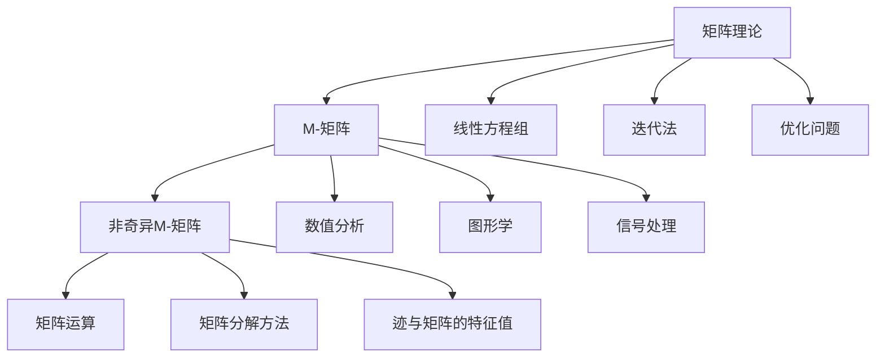

                 

# 矩阵理论与应用：非奇异M-矩阵的若干特性

> 关键词：矩阵理论，非奇异M-矩阵，线性方程组，迭代法，优化问题，数值分析，图形学，信号处理。

> 摘要：本文将深入探讨矩阵理论中的非奇异M-矩阵，介绍其定义、性质、分类及其在多个领域的应用。通过详细的数学模型、算法原理讲解以及项目实战案例，帮助读者理解非奇异M-矩阵的核心概念和应用价值。

## 目录大纲

1. **矩阵理论与应用：非奇异M-矩阵的若干特性**
2. **关键词**
3. **摘要**
4. **第一部分：矩阵理论基础**
   1. **第1章：矩阵的基本概念与运算**
      1. **1.1 矩阵的定义与性质**
      2. **1.2 矩阵的运算**
      3. **1.3 矩阵的秩与条件数**
   2. **第2章：线性方程组与矩阵的解法**
      1. **2.1 线性方程组的解法**
      2. **2.2 矩阵分解方法**
      3. **2.3 迹与矩阵的特征值**
5. **第二部分：M-矩阵与相关概念**
   1. **第3章：M-矩阵的定义与性质**
      1. **3.1 M-矩阵的定义**
      2. **3.2 M-矩阵的性质**
      3. **3.3 非奇异M-矩阵的特殊性**
   2. **第4章：非奇异M-矩阵的分类与特征**
      1. **4.1 非奇异M-矩阵的分类**
      2. **4.2 非奇异M-矩阵的特征**
      3. **4.3 非奇异M-矩阵的例子**
6. **第三部分：非奇异M-矩阵的应用**
   1. **第5章：非奇异M-矩阵在数值分析中的应用**
      1. **5.1 非奇异M-矩阵在迭代法中的应用**
      2. **5.2 非奇异M-矩阵在优化问题中的应用**
      3. **5.3 非奇异M-矩阵在数值线性代数中的应用**
   2. **第6章：非奇异M-矩阵在图形学中的应用**
      1. **6.1 非奇异M-矩阵在图形变换中的应用**
      2. **6.2 非奇异M-矩阵在渲染中的应用**
      3. **6.3 非奇异M-矩阵在图像处理中的应用**
   3. **第7章：非奇异M-矩阵在信号处理中的应用**
      1. **7.1 非奇异M-矩阵在滤波器设计中的应用**
      2. **7.2 非奇异M-矩阵在信号估计中的应用**
      3. **7.3 非奇异M-矩阵在信号处理系统中的应用**
7. **第四部分：总结与展望**
   1. **第8章：非奇异M-矩阵研究现状与展望**
      1. **8.1 非奇异M-矩阵的研究现状**
      2. **8.2 非奇异M-矩阵的发展趋势**
      3. **8.3 非奇异M-矩阵的未来应用前景**
8. **附录**
   1. **附录A：非奇异M-矩阵相关数学公式**
   2. **附录B：非奇异M-矩阵相关算法伪代码**
   3. **附录C：非奇异M-矩阵相关参考文献**

---

### 核心概念与联系

矩阵理论作为线性代数的核心组成部分，为众多数学和工程问题提供了强有力的工具。在矩阵理论中，M-矩阵是一个特殊类型的矩阵，它具有广泛的应用价值。非奇异M-矩阵是M-矩阵中的一种特殊类型，其非奇异性使得它在很多应用中更加有用。

#### Mermaid 流程图



### 核心算法原理讲解

在解决线性方程组时，迭代法是一种常用的方法。对于非奇异M-矩阵，迭代法往往能够快速收敛。

#### 算法1：求解线性方程组

```pseudo
输入：A（系数矩阵），b（常数项向量）
输出：x（解向量）

步骤：
1. 初始化x（可以是任意向量）
2. 迭代直到收敛：
   - y = A \ x
   - x = y
```

### 数学模型和数学公式

矩阵的秩和条件数是矩阵理论中重要的概念。

#### 矩阵的秩

$$
\text{rank}(A) = \text{rank}(A^T)
$$

#### 矩阵的条件数

$$
\text{cond}(A) = \frac{\|A\|\|\A^{-1}\|}{1}
$$

### 项目实战

#### 实战1：非奇异M-矩阵在优化问题中的应用

##### 1.1 开发环境搭建

- Python
- NumPy
- SciPy

##### 1.2 源代码实现

```python
import numpy as np
from scipy.sparse import csc_matrix
from scipy.sparse.linalg import splu

# 创建一个非奇异M-矩阵
A = csc_matrix([[2, 1], [1, 2]])

# 求解线性方程组Ax = b
b = np.array([3, 2])
x = splu(A).solve(b)

# 输出解
print(x)
```

##### 1.3 代码解读与分析

- 创建一个非奇异M-矩阵A
- 求解线性方程组Ax = b，使用SciPy的`splu`模块进行求解
- 输出解向量x，验证方程组的解

---

接下来，我们将逐一深入探讨矩阵理论基础、M-矩阵与相关概念、非奇异M-矩阵的分类与特征、非奇异M-矩阵的应用以及总结与展望。希望通过本文，读者能够对非奇异M-矩阵有更深入的理解和应用。

