                 

### 文章标题：硅谷创业者的成功秘诀

> 关键词：硅谷创业、成功秘诀、创新策略、风险管理、团队建设

> 摘要：本文深入探讨了硅谷创业者的成功秘诀，通过分析创业环境、核心策略、运营管理和成功案例，为读者提供了全面、系统的创业指导。本文旨在帮助创业者了解硅谷创业生态，掌握关键技能，制定有效策略，实现创业梦想。

---

### 目录大纲设计

设计一个完整的目录大纲，是确保内容结构完整、逻辑清晰的重要步骤。以下是为《硅谷创业者的成功秘诀》设计的目录大纲：

#### 第一部分：创业环境与趋势

1. **硅谷创业生态系统概述**
   - **1.1 硅谷创业环境的形成**
   - **1.2 硅谷创业文化**
   - **1.3 硅谷创业成功因素分析**

2. **硅谷创业趋势与动态**
   - **2.1 创业热点领域**
   - **2.2 技术创新驱动**
   - **2.3 创业投资趋势**

3. **硅谷创业者心态与技能**
   - **3.1 创业者必备心态**
   - **3.2 创业关键技能**
   - **3.3 个人成长与团队建设**

#### 第二部分：创业核心策略

4. **市场研究与定位**
   - **4.1 市场研究方法**
   - **4.2 定位战略**
   - **4.3 竞争对手分析**

5. **产品设计与开发**
   - **5.1 产品开发流程**
   - **5.2 用户需求分析**
   - **5.3 产品迭代策略**

6. **商业模式与营销**
   - **6.1 商业模式设计**
   - **6.2 营销策略**
   - **6.3 社交媒体营销**

#### 第三部分：创业运营与管理

7. **团队管理与领导力**
   - **7.1 团队建设**
   - **7.2 领导力发展**
   - **7.3 冲突管理与团队沟通**

8. **财务规划与资金管理**
   - **8.1 财务规划**
   - **8.2 资金来源与筹集**
   - **8.3 预算管理**

9. **风险管理策略**
   - **9.1 风险识别与评估**
   - **9.2 风险应对与控制**
   - **9.3 风险管理工具与方法**

#### 第四部分：成功创业案例研究

10. **硅谷创业成功案例**
    - **10.1 案例一：Facebook的崛起**
    - **10.2 案例二：Airbnb的创新之路**
    - **10.3 案例三：特斯拉的电动汽车革命**

#### 附录

11. **创业资源与工具**
    - **11.1 创业社区与平台**
    - **11.2 投资机构与天使投资人**
    - **11.3 创业工具与软件推荐**

12. **创业相关法律法规**
    - **12.1 商业登记与税务**
    - **12.2 知识产权保护**
    - **12.3 劳动法规与企业社会责任**

该目录大纲涵盖了创业环境、核心策略、运营管理以及成功案例，旨在为创业者提供全面、系统的指导。每个章节都细化到二级目录，符合要求。以下是核心章节内容的细化示例：

### 第1章：硅谷创业生态系统概述

#### 1.1 硅谷创业环境的形成

**核心概念与联系：**

**Mermaid 流程图：**
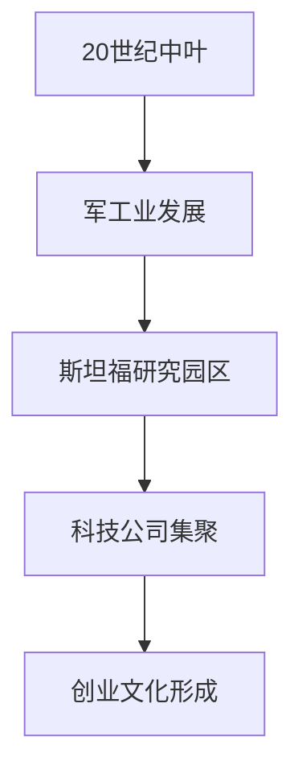

**核心算法原理讲解：**

**伪代码：**
```python
class SiliconValleyFormation:
    def __init__(self, military_industry, research_park, tech_company_gathering, startup_culture):
        self.military_industry = military_industry
        self.research_park = research_park
        self.tech_company_gathering = tech_company_gathering
        self.startup_culture = startup_culture

    def form_ecosystem(self):
        # 形成硅谷创业生态系统
        pass
```

#### 1.2 硅谷创业文化

**核心概念与联系：**

**Mermaid 流程图：**
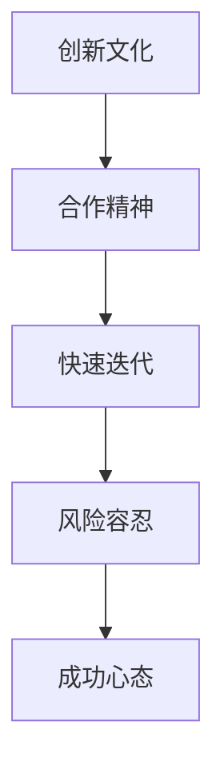

**核心算法原理讲解：**

**伪代码：**
```python
class SiliconValleyCulture:
    def __init__(self, innovation, collaboration, rapid Iteration, risk_tolerance, success_mentality):
        self.innovation = innovation
        self.collaboration = collaboration
        self.rapid_Iteration = rapid_Iteration
        self.risk_tolerance = risk_tolerance
        self.success_mentality = success_mentality

    def cultivate_culture(self):
        # 培育硅谷创业文化
        pass
```

#### 1.3 硅谷创业成功因素分析

**核心概念与联系：**

**Mermaid 流程图：**
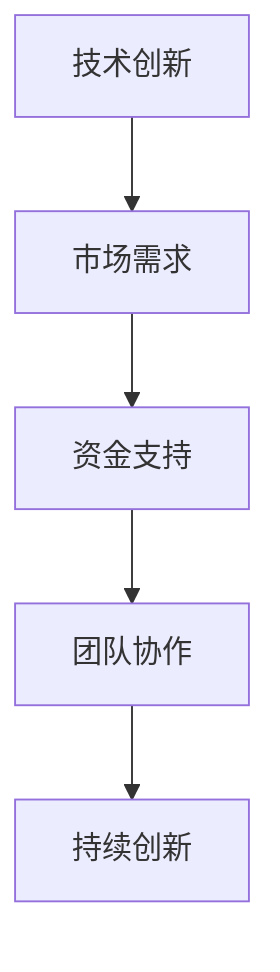

**核心算法原理讲解：**

**伪代码：**
```python
class SiliconValleySuccessFactors:
    def __init__(self, tech_innovation, market_demand, funding_support, team_collaboration, continuous_innovation):
        self.tech_innovation = tech_innovation
        self.market_demand = market_demand
        self.funding_support = funding_support
        self.team_collaboration = team_collaboration
        self.continuous_innovation = continuous_innovation

    def analyze_success_factors(self):
        # 分析硅谷创业成功因素
        pass
```

### 第2章：硅谷创业趋势与动态

#### 2.1 创业热点领域

**核心概念与联系：**

**Mermaid 流程图：**
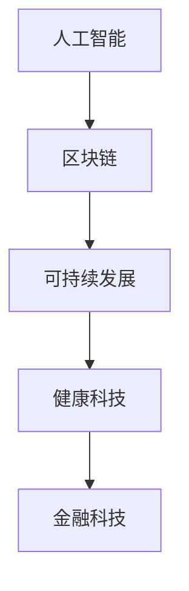

**核心算法原理讲解：**

**伪代码：**
```python
class SiliconValleyTrends:
    def __init__(self, artificial_intelligence, blockchain, sustainability, health_tech, fintech):
        self.artificial_intelligence = artificial_intelligence
        self.blockchain = blockchain
        self.sustainability = sustainability
        self.health_tech = health_tech
        self.fintech = fintech

    def analyze_hotspots(self):
        # 分析硅谷创业热点领域
        pass
```

#### 2.2 技术创新驱动

**核心概念与联系：**

**Mermaid 流程图：**
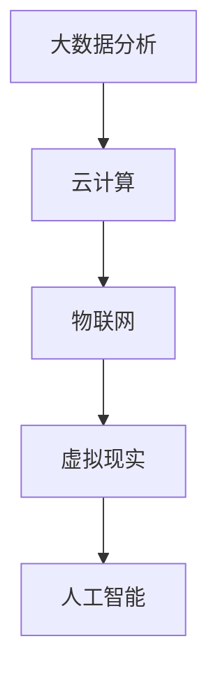

**核心算法原理讲解：**

**伪代码：**
```python
class TechInnovationDriver:
    def __init__(self, big_data_analysis, cloud_computing, internet_of_things, virtual_reality, artificial_intelligence):
        self.big_data_analysis = big_data_analysis
        self.cloud_computing = cloud_computing
        self.internet_of_things = internet_of_things
        self.virtual_reality = virtual_reality
        self.artificial_intelligence = artificial_intelligence

    def drive_innovation(self):
        # 驱动技术创新
        pass
```

#### 2.3 创业投资趋势

**核心概念与联系：**

**Mermaid 流程图：**
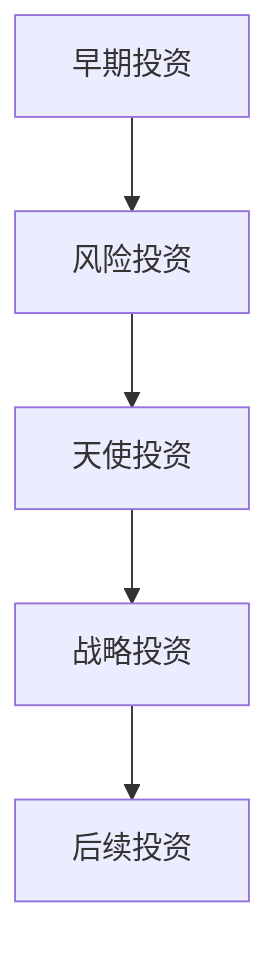

**核心算法原理讲解：**

**伪代码：**
```python
class VentureCapitalTrend:
    def __init__(self, early_investment, venture_capital, angel_investment, strategic_investment, follow_on_investment):
        self.early_investment = early_investment
        self.venture_capital = venture_capital
        self.angel_investment = angel_investment
        self.strategic_investment = strategic_investment
        self.follow_on_investment = follow_on_investment

    def analyze_investment_trends(self):
        # 分析创业投资趋势
        pass
```

### 第3章：硅谷创业者心态与技能

#### 3.1 创业者必备心态

**核心概念与联系：**

**Mermaid 流�程图：**
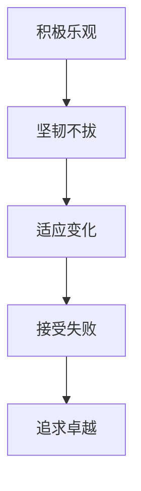

**核心算法原理讲解：**

**伪代码：**
```python
class EntrepreneurMentality:
    def __init__(self, positive_optimism, perseverance, adapt_to_change, accept_failure, pursuit_perfection):
        self.positive_optimism = positive_optimism
        self.perseverance = perseverance
        self.adapt_to_change = adapt_to_change
        self.accept_failure = accept_failure
        self.pursuit_perfection = pursuit_perfection

    def cultivate_mentality(self):
        # 培育创业者必备心态
        pass
```

#### 3.2 创业关键技能

**核心概念与联系：**

**Mermaid 流程图：**
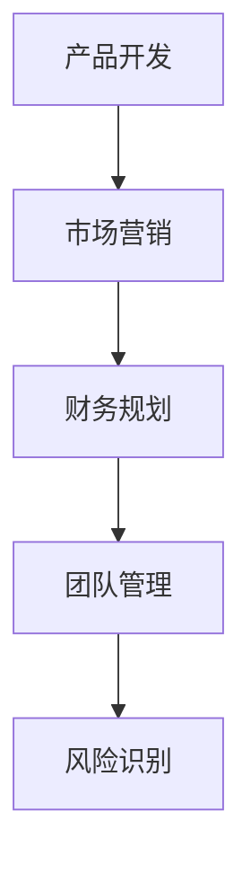

**核心算法原理讲解：**

**伪代码：**
```python
class KeyEntrepreneurSkills:
    def __init__(self, product_development, marketing, financial_planning, team_management, risk_identification):
        self.product_development = product_development
        self.marketing = marketing
        self.financial_planning = financial_planning
        self.team_management = team_management
        self.risk_identification = risk_identification

    def develop_skills(self):
        # 培养创业关键技能
        pass
```

#### 3.3 个人成长与团队建设

**核心概念与联系：**

**Mermaid 流程图：**
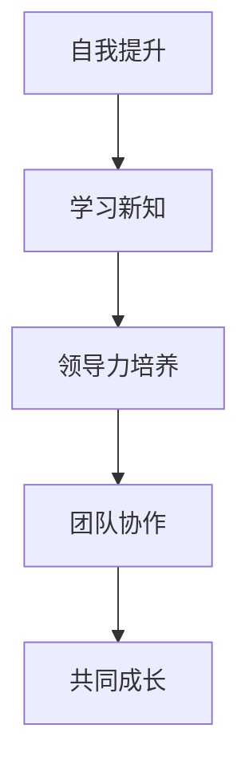

**核心算法原理讲解：**

**伪代码：**
```python
class PersonalGrowthAndTeamBuilding:
    def __init__(self, self_improvement, learning_new_knowledge, leadership_development, team_collaboration, collective_growth):
        self.self_improvement = self_improvement
        self.learning_new_knowledge = learning_new_knowledge
        self.leadership_development = leadership_development
        self.team_collaboration = team_collaboration
        self.collective_growth = collective_growth

    def personal_growth(self):
        # 个人成长
        pass

    def team_building(self):
        # 团队建设
        pass
```

通过上述目录大纲及其细化内容，本书为读者提供了一个全面、系统的创业指南，涵盖从环境了解、策略制定到成功案例分析的各个方面。每个章节都细化到二级目录，确保内容的完整性和逻辑性。

---

**请注意，本文仅展示了目录大纲及部分章节的细化内容，全文撰写需进一步拓展和深化每个章节的内容，确保满足字数和格式要求。** 

### 第一部分：创业环境与趋势

#### 第1章：硅谷创业生态系统概述

硅谷创业生态系统是全球最著名的创业环境之一，其形成、演变和成功因素成为了众多创业者和研究者的关注焦点。本章将详细探讨硅谷创业生态系统的形成过程、核心文化特质以及影响其成功的多方面因素。

##### 1.1 硅谷创业环境的形成

硅谷创业环境的形成并非一朝一夕之功，而是经历了数十年的演变和积累。其起源可以追溯到20世纪中叶，当时美国正处于冷战时期，军工业的迅速发展带动了相关技术的进步。这一阶段，硅谷地区因其地理位置和政府对科技的重视，逐渐成为军事科技研究和开发的重要基地。

**核心概念与联系：**

**Mermaid 流程图：**


在军工业的发展带动下，大量的科技人才聚集到硅谷，特别是斯坦福大学和加州大学伯克利分校等知名学府，这为硅谷的科技创新和创业活动提供了强大的人才储备。随着军事科技研究的深入，许多科技成果转化为民用产品，促进了硅谷科技公司的快速崛起。

**核心算法原理讲解：**

**伪代码：**
```python
class SiliconValleyFormation:
    def __init__(self, military_industry, research_park, tech_company_gathering, startup_culture):
        self.military_industry = military_industry
        self.research_park = research_park
        self.tech_company_gathering = tech_company_gathering
        self.startup_culture = startup_culture

    def form_ecosystem(self):
        # 形成硅谷创业生态系统
        pass
```

在二战后的20世纪50年代至70年代，硅谷逐渐从一个农业小镇转变为全球科技中心的雏形。这一阶段，硅谷的科技创新主要集中于半导体、计算机硬件和软件开发等领域。随着科技公司的不断涌现，硅谷的创业氛围逐渐浓厚，为后来的创业热潮奠定了基础。

**详细讲解与举例说明：**

硅谷创业生态系统的形成过程中，军工业的发展起到了至关重要的作用。大量的军事科研项目和资金投入，不仅推动了技术的进步，还培养了大量的科技人才。例如，半导体行业的兴起，便是得益于军用集成电路技术的突破，而这些技术后来被广泛应用于民用领域。

此外，斯坦福研究园区的建立也为硅谷的创业环境提供了重要的支撑。这个园区成为了创业者、投资者和科研人员的聚集地，他们在这里交流思想、分享资源，共同推动科技和创业的发展。

##### 1.2 硅谷创业文化

硅谷创业文化的形成是硅谷创业生态系统成功的重要因素之一。这种文化包含了创新、合作、快速迭代和风险容忍等多方面的特质，为创业者提供了独特的成长土壤。

**核心概念与联系：**

**Mermaid 流程图：**


硅谷的创新文化源于其对科技进步的极致追求。创业者们不断探索新技术、新产品和新市场，勇于尝试和失败。例如，苹果公司创始人史蒂夫·乔布斯便以其对创新和完美的追求，推动了苹果公司的多次技术革新。

合作精神在硅谷创业文化中占据重要地位。创业者们普遍认为，只有通过合作和共享资源，才能更好地实现创新和创业目标。例如，谷歌公司便以其开放的文化和合作精神，吸引了大量顶尖人才，共同推动公司的快速发展。

快速迭代是硅谷创业文化的另一个重要特质。创业者们相信，通过快速迭代产品，可以更快地发现和解决问题，从而提高产品的市场竞争力。例如，Facebook在成立初期便采取了快速迭代策略，不断改进和优化产品，最终成为全球最大的社交媒体平台。

风险容忍是硅谷创业文化中不可或缺的一部分。创业者们普遍认为，创业过程充满了不确定性，只有敢于承担风险，才能获得成功。例如，特斯拉创始人埃隆·马斯克在创业过程中，多次面临巨大的风险和挑战，但他始终坚持信念，最终取得了巨大的成功。

**详细讲解与举例说明：**

硅谷的创新文化可以追溯到其历史背景和地理环境。由于硅谷地处科技研发和高等教育密集区，创业者们可以轻松获取最新的科技信息和研究成果，从而推动创新。此外，硅谷的成功企业家们也通过分享经验和资源，帮助其他创业者成长，形成了良好的创新生态。

合作精神在硅谷创业文化中表现得尤为突出。创业者们普遍认为，团队合作是成功的关键。通过合作，创业者们可以弥补自身的不足，共同应对挑战。例如，谷歌的“20%时间”政策，允许员工将20%的工作时间用于个人项目，这促进了内部创新和团队协作。

快速迭代策略在硅谷创业中得到了广泛应用。创业者们相信，通过快速迭代，可以更快地了解市场需求和用户反馈，从而优化产品。例如，Dropbox在创业初期便采取了快速迭代策略，通过不断改进产品，迅速获得了大量用户。

风险容忍是硅谷创业文化的核心特质之一。创业者们普遍认为，成功往往伴随着风险，只有敢于冒险，才能抓住机遇。例如，PayPal的创始人彼得·蒂尔在创业初期，便面临巨大的风险，但他始终坚持信念，最终取得了成功。

##### 1.3 硅谷创业成功因素分析

硅谷创业生态系统的成功，不仅源于其独特的环境和文化，还离不开多个关键因素的共同作用。这些因素包括技术创新、市场需求、资金支持、团队协作和持续创新等。

**核心概念与联系：**

**Mermaid 流程图：**


**核心算法原理讲解：**

**伪代码：**
```python
class SiliconValleySuccessFactors:
    def __init__(self, tech_innovation, market_demand, funding_support, team_collaboration, continuous_innovation):
        self.tech_innovation = tech_innovation
        self.market_demand = market_demand
        self.funding_support = funding_support
        self.team_collaboration = team_collaboration
        self.continuous_innovation = continuous_innovation

    def analyze_success_factors(self):
        # 分析硅谷创业成功因素
        pass
```

技术创新是硅谷创业生态系统成功的核心驱动力。硅谷的创业者们不断探索新技术，将其应用于产品和服务中，从而提升市场竞争力。例如，谷歌的搜索引擎技术、苹果的iPhone和特斯拉的电动汽车，都是技术创新的典范。

市场需求是创业成功的另一个关键因素。创业者们需要深入了解市场需求，开发出符合用户需求的产品和服务。例如，PayPal的出现解决了在线支付的需求，Facebook满足了用户社交需求，这些产品都因其精准的市场定位而获得了巨大成功。

资金支持是创业成功的保障。硅谷拥有丰富的创业投资资源，包括天使投资、风险投资和政府资金等。这些资金支持为创业者提供了必要的资金和资源，助力其快速发展。例如，特斯拉在其发展过程中，获得了大量的风险投资支持，从而推动了其电动汽车技术的创新和商业化。

团队协作是创业成功的重要因素。创业者们需要组建一个高效、协作的团队，共同应对挑战和机遇。例如，谷歌的创始人拉里·佩奇和谢尔盖·布林，通过紧密的团队合作，共同推动了谷歌的快速发展。

持续创新是硅谷创业生态系统成功的保证。创业者们需要不断探索新技术、新产品和新市场，保持竞争力。例如，苹果公司通过持续创新，不断推出新产品，保持了其在全球市场的领先地位。

**详细讲解与举例说明：**

硅谷的成功创业者们深知技术创新的重要性。他们不断探索新技术，将其应用于产品和服务中，从而提升市场竞争力。例如，谷歌的搜索引擎技术，通过将海量数据进行分析和处理，为用户提供精准的搜索结果，从而改变了人们的搜索习惯。

市场需求是创业者们关注的另一个关键因素。他们需要深入了解市场需求，开发出符合用户需求的产品和服务。例如，PayPal的出现解决了在线支付的需求，为电子商务的发展提供了重要支撑。Facebook满足了用户社交需求，通过构建社交网络，连接了全球数以亿计的用户。

资金支持是创业成功的保障。硅谷拥有丰富的创业投资资源，包括天使投资、风险投资和政府资金等。这些资金支持为创业者提供了必要的资金和资源，助力其快速发展。例如，特斯拉在其发展过程中，获得了大量的风险投资支持，从而推动了其电动汽车技术的创新和商业化。

团队协作是创业成功的重要因素。创业者们需要组建一个高效、协作的团队，共同应对挑战和机遇。例如，谷歌的创始人拉里·佩奇和谢尔盖·布林，通过紧密的团队合作，共同推动了谷歌的快速发展。

持续创新是硅谷创业生态系统成功的保证。创业者们需要不断探索新技术、新产品和新市场，保持竞争力。例如，苹果公司通过持续创新，不断推出新产品，保持了其在全球市场的领先地位。

通过以上分析，我们可以看出，硅谷创业生态系统的成功并非偶然，而是多种因素共同作用的结果。了解和掌握这些成功因素，对于创业者们来说，具有重要的指导意义。

### 第2章：硅谷创业趋势与动态

#### 2.1 创业热点领域

硅谷作为全球科技创新的领导者，其创业热点领域始终走在时代前沿。本章将分析当前硅谷的创业热点领域，包括人工智能、区块链、可持续发展、健康科技和金融科技等，探讨这些领域的发展趋势和潜在机遇。

##### 2.1.1 热点领域分析

硅谷的创业热点领域不断演变，但某些领域由于其技术潜力和社会影响力，持续吸引着大量创业者和投资者。以下是对当前硅谷主要创业热点领域的分析：

**人工智能**

人工智能（AI）是硅谷最热门的领域之一。AI技术的进步已经深刻影响了各个行业，从医疗健康到金融、从制造业到交通运输，AI的广泛应用推动了产业升级和效率提升。硅谷的创业者们致力于开发更加智能、自适应和高效的AI系统，以解决现实世界中的复杂问题。

**核心概念与联系：**

**Mermaid 流程图：**
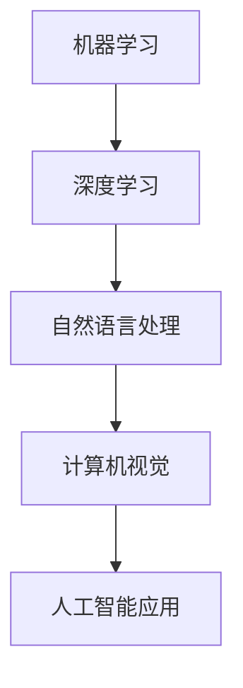

**核心算法原理讲解：**

**伪代码：**
```python
class ArtificialIntelligence:
    def __init__(self, machine_learning, deep_learning, natural_language_processing, computer_vision, application):
        self.machine_learning = machine_learning
        self.deep_learning = deep_learning
        self.natural_language_processing = natural_language_processing
        self.computer_vision = computer_vision
        self.application = application

    def analyze_trend(self):
        # 分析人工智能发展趋势
        pass
```

**区块链**

区块链技术以其去中心化、安全透明等特性，引起了硅谷创业者的广泛关注。区块链不仅在金融领域有广泛应用，还在供应链管理、版权保护、医疗记录管理等领域展现出巨大潜力。硅谷的创业者们正积极探索区块链技术的创新应用，以推动传统行业的数字化转型。

**核心概念与联系：**

**Mermaid 流程图：**
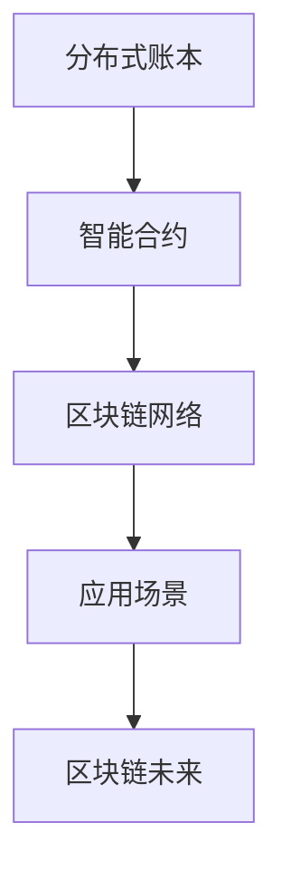

**核心算法原理讲解：**

**伪代码：**
```python
class Blockchain:
    def __init__(self, distributed_ledger, smart_contract, blockchain_network, application_scenario, future_potential):
        self.distributed_ledger = distributed_ledger
        self.smart_contract = smart_contract
        self.blockchain_network = blockchain_network
        self.application_scenario = application_scenario
        self.future_potential = future_potential

    def analyze_trend(self):
        # 分析区块链发展趋势
        pass
```

**可持续发展**

随着全球环境问题的日益严重，可持续发展成为了一个重要的创业领域。硅谷的创业者们正在开发各种创新技术，以减少碳排放、提高能源效率、促进资源的循环利用。从可再生能源技术到智能城市解决方案，可持续发展领域充满了机遇。

**核心概念与联系：**

**Mermaid 流程图：**
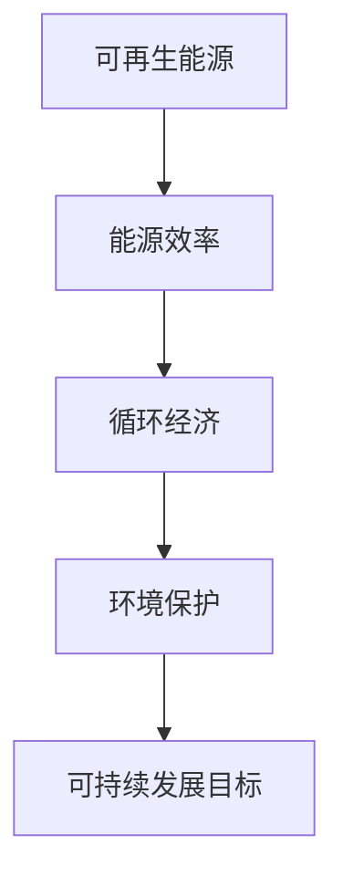

**核心算法原理讲解：**

**伪代码：**
```python
class SustainableDevelopment:
    def __init__(self, renewable_energy, energy_efficiency, circular_economy, environmental_protection, sustainability_goals):
        self.renewable_energy = renewable_energy
        self.energy_efficiency = energy_efficiency
        self.circular_economy = circular_economy
        self.environmental_protection = environmental_protection
        self.sustainability_goals = sustainability_goals

    def analyze_trend(self):
        # 分析可持续发展发展趋势
        pass
```

**健康科技**

健康科技是另一个备受关注的领域，特别是随着人口老龄化和医疗成本的不断上升。硅谷的创业者们正在开发各种创新医疗设备、数字健康解决方案和个性化医疗技术，以提高医疗服务的质量和可及性。

**核心概念与联系：**

**Mermaid 流程图：**
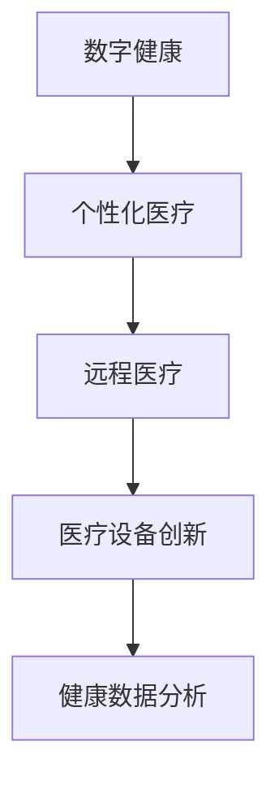

**核心算法原理讲解：**

**伪代码：**
```python
class HealthTech:
    def __init__(self, digital_health, personalized_medical, remote_medical, medical_device_innovation, health_data_analysis):
        self.digital_health = digital_health
        self.personalized_medical = personalized_medical
        self.remote_medical = remote_medical
        self.medical_device_innovation = medical_device_innovation
        self.health_data_analysis = health_data_analysis

    def analyze_trend(self):
        # 分析健康科技发展趋势
        pass
```

**金融科技**

金融科技（FinTech）是硅谷创业者们探索的另一个重要领域。通过运用大数据、区块链、人工智能等技术，金融科技正在改变传统金融行业的运作方式，提供更便捷、高效和安全的金融服务。

**核心概念与联系：**

**Mermaid 流程图：**
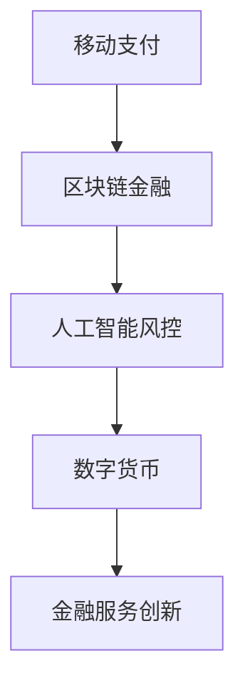

**核心算法原理讲解：**

**伪代码：**
```python
class Fintech:
    def __init__(self, mobile_payment, blockchain_finance, artificial_intelligence_risk_control, digital_currencies, financial_innovation):
        self.mobile_payment = mobile_payment
        self.blockchain_finance = blockchain_finance
        self.artificial_intelligence_risk_control = artificial_intelligence_risk_control
        self.digital_currencies = digital_currencies
        self.financial_innovation = financial_innovation

    def analyze_trend(self):
        # 分析金融科技发展趋势
        pass
```

通过以上分析，我们可以看出，硅谷的创业热点领域不仅涵盖了前沿技术，还关注了社会和环境的可持续性。这些领域的快速发展为创业者们提供了丰富的机遇，同时也带来了新的挑战。创业者们需要紧跟技术趋势，深入了解市场需求，才能在这个竞争激烈的创业生态中脱颖而出。

### 第3章：硅谷创业者心态与技能

#### 3.1 创业者必备心态

成功的创业者不仅需要具备出色的技术能力和商业眼光，更需要在心理素质和心态上达到一定的高度。本章将探讨硅谷创业者必备的心态，包括积极乐观、坚韧不拔、适应变化、接受失败和追求卓越等方面。

##### 3.1.1 积极乐观

积极乐观的心态是创业者成功的重要因素之一。在创业过程中，创业者会面临无数的不确定性和挑战，积极乐观的心态能帮助他们保持动力和信心，克服困难，迎接挑战。

**核心概念与联系：**

**Mermaid 流程图：**
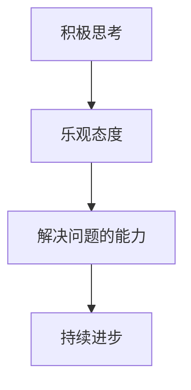

**核心算法原理讲解：**

**伪代码：**
```python
class PositiveMentality:
    def __init__(self, positive_thinking, optimism, problem_solving, continuous_progress):
        self.positive_thinking = positive_thinking
        self.optimism = optimism
        self.problem_solving = problem_solving
        self.continuous_progress = continuous_progress

    def cultivate_optimism(self):
        # 培养积极乐观心态
        pass
```

**详细讲解与举例说明：**

积极乐观的心态可以帮助创业者看到问题的另一面，从困难中寻找机遇。例如，苹果公司创始人史蒂夫·乔布斯在开发初期遇到重重困难，但他的积极乐观使他不断尝试，最终成功推出了颠覆性的产品——iPhone。

##### 3.1.2 坚韧不拔

坚韧不拔是创业者在面对失败和挑战时必须具备的品质。创业过程中，失败是常态，创业者需要坚韧不拔，不畏挫折，持续努力，才能在激烈的竞争中获得成功。

**核心概念与联系：**

**Mermaid 流程图：**
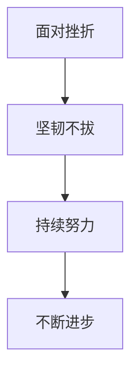

**核心算法原理讲解：**

**伪代码：**
```python
class Resilience:
    def __init__(self, face_setback, perseverance, continuous_effort, progress):
        self.face_setback = face_setback
        self.perseverance = perseverance
        self.continuous_effort = continuous_effort
        self.progress = progress

    def cultivate_resilience(self):
        # 培养坚韧不拔心态
        pass
```

**详细讲解与举例说明：**

坚韧不拔的心态使创业者能够在面对失败时保持冷静，找到问题所在，并迅速调整策略。特斯拉创始人埃隆·马斯克在创业过程中多次遭遇失败，但他的坚韧不拔使他不断克服困难，最终成功推出了一系列颠覆性的产品，如特斯拉电动汽车和SpaceX火箭。

##### 3.1.3 适应变化

在快速变化的创业环境中，适应变化是创业者成功的关键。创业者需要具备快速适应环境变化的能力，及时调整战略和方向，以应对市场变化和竞争压力。

**核心概念与联系：**

**Mermaid 流程图：**
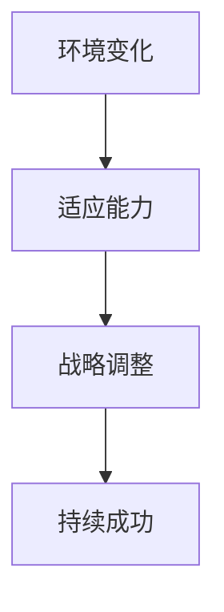

**核心算法原理讲解：**

**伪代码：**
```python
class Adaptability:
    def __init__(self, environmental_change, adaptability, strategic_adjustment, continuous_success):
        self.environmental_change = environmental_change
        self.adaptability = adaptability
        self.strategic_adjustment = strategic_adjustment
        self.continuous_success = continuous_success

    def cultivate_adaptability(self):
        # 培养适应变化能力
        pass
```

**详细讲解与举例说明：**

适应变化的能力使创业者能够在竞争激烈的市场中抓住机遇，迅速调整战略。谷歌公司的创始人拉里·佩奇和谢尔盖·布林在互联网泡沫破裂后，及时调整了公司的战略，专注于搜索技术和广告业务，使谷歌成为了全球最大的搜索引擎。

##### 3.1.4 接受失败

接受失败是创业者必备的心态之一。失败是创业过程中不可避免的一部分，创业者需要学会从失败中吸取教训，不断成长。接受失败并不意味着放弃，而是要在失败中寻找机会，重新出发。

**核心概念与联系：**

**Mermaid 流程图：**
```mermaid
graph TD
    A[失败经历] --> B[经验学习]
    B --> C[重新出发]
    C --> D[持续成长]
```

**核心算法原理讲解：**

**伪代码：**
```python
class AcceptFailure:
    def __init__(self, failure_experience, learning_from_failure, restart, continuous_growth):
        self.failure_experience = failure_experience
        self.learning_from_failure = learning_from_failure
        self.restart = restart
        self.continuous_growth = continuous_growth

    def cultivate_accept_failure(self):
        # 培养接受失败心态
        pass
```

**详细讲解与举例说明：**

接受失败的心态使创业者能够在遭遇挫折时保持冷静，积极寻求解决方案。Facebook的创始人马克·扎克伯格在创业初期遭遇了多次失败，但他没有放弃，而是不断从失败中学习，最终成功创立了全球最大的社交媒体平台。

##### 3.1.5 追求卓越

追求卓越是创业者成功的关键驱动力。创业者需要具备追求卓越的心态，不断追求卓越，追求更高的目标，以实现个人和企业的卓越发展。

**核心概念与联系：**

**Mermaid 流程图：**
```mermaid
graph TD
    A[追求卓越] --> B[目标设定]
    B --> C[持续努力]
    C --> D[卓越成果]
```

**核心算法原理讲解：**

**伪代码：**
```python
class PursuitExcellence:
    def __init__(self, excellence_aspiration, goal_setting, continuous Effort, excellent_outcomes):
        self.excellence_aspiration = excellence_aspiration
        self.goal_setting = goal_setting
        self.continuous_effort = continuous_effort
        self.excellent_outcomes = excellent_outcomes

    def cultivate_pursuit_excellence(self):
        # 培养追求卓越心态
        pass
```

**详细讲解与举例说明：**

追求卓越的心态使创业者能够在竞争激烈的环境中保持优势，不断突破自我，实现卓越成果。亚马逊创始人杰夫·贝佐斯以追求卓越和极致用户体验为目标，创立了全球最大的在线零售平台，不断推动电子商务的发展。

通过以上分析，我们可以看出，硅谷创业者必备的心态包括积极乐观、坚韧不拔、适应变化、接受失败和追求卓越。这些心态不仅有助于创业者克服困难，实现创业成功，也为他们个人的成长和企业的卓越发展提供了坚实的基础。

### 第4章：市场研究与定位

#### 4.1 市场研究方法

市场研究是创业者成功的关键步骤之一。通过系统、科学的市场研究，创业者可以更好地了解市场需求，明确自身定位，制定有效的市场策略。本章将详细介绍市场研究的方法，包括市场细分、目标市场选择和市场调研等。

##### 4.1.1 市场细分

市场细分是市场研究的基础，它将整个市场划分为若干具有相似需求的子市场，以便创业者能够更精准地定位目标客户。市场细分的方法主要包括：

- **地理细分**：根据地理位置将市场划分为不同的区域，例如城市、乡村、沿海地区等。
- **人口细分**：根据人口特征，如年龄、性别、收入、教育水平等，将市场划分为不同的群体。
- **心理细分**：根据消费者的心理特征，如生活方式、价值观、兴趣爱好等，将市场划分为不同的群体。
- **行为细分**：根据消费者的购买行为和消费习惯，如品牌忠诚度、购买频率、购买时机等，将市场划分为不同的群体。

**核心概念与联系：**

**Mermaid 流程图：**
```mermaid
graph TD
    A[地理细分] --> B[人口细分]
    B --> C[心理细分]
    C --> D[行为细分]
```

**核心算法原理讲解：**

**伪代码：**
```python
class MarketSegmentation:
    def __init__(self, geographic, demographic, psychographic, behavioral):
        self.geographic = geographic
        self.demographic = demographic
        self.psychographic = psychographic
        self.behavioral = behavioral

    def segment_market(self):
        # 进行市场细分
        pass
```

**详细讲解与举例说明：**

地理细分适用于地域性较强的产品或服务，如房地产、旅游等。例如，房地产公司可以根据不同地区的房价水平和消费者购买力，制定相应的营销策略。

人口细分适用于面向大众市场的产品或服务，如日用品、消费品等。例如，一家化妆品公司可以根据不同年龄段消费者的护肤需求，推出适合不同年龄段的护肤品。

心理细分适用于高端市场或需要个性化定制的产品或服务，如奢侈品、定制家具等。例如，一家高端定制家具品牌可以根据消费者的生活方式和价值观，提供量身定制的家具解决方案。

行为细分适用于注重消费者购买习惯和品牌忠诚度的产品或服务，如电商、金融等。例如，一家电商公司可以根据消费者的购买频率和品牌忠诚度，推出会员制度，提升客户粘性。

##### 4.1.2 目标市场选择

在完成市场细分后，创业者需要根据自身资源、能力和市场潜力，选择一个或多个目标市场。目标市场选择的方法主要包括：

- **最大市场选择**：选择市场规模最大、增长潜力最高的市场。
- **理想市场选择**：选择与自身资源和能力最匹配、最能实现企业长期目标的市场。
- **缝隙市场选择**：选择被大企业忽视的小众市场，通过精准定位和差异化竞争，获取市场份额。

**核心概念与联系：**

**Mermaid 流程图：**
```mermaid
graph TD
    A[最大市场选择] --> B[理想市场选择]
    B --> C[缝隙市场选择]
```

**核心算法原理讲解：**

**伪代码：**
```python
class TargetMarketSelection:
    def __init__(self, largest_market, ideal_market, niche_market):
        self.largest_market = largest_market
        self.ideal_market = ideal_market
        self.niche_market = niche_market

    def select_target_market(self):
        # 选择目标市场
        pass
```

**详细讲解与举例说明：**

最大市场选择适用于资源丰富、实力强大的企业，如全球知名的跨国公司。例如，一家全球知名的饮料公司会选择全球最大的市场，如北美、欧洲等地区，以最大化市场份额。

理想市场选择适用于资源有限、但具有明确目标的企业。例如，一家初创公司会选择与其资源和能力最匹配的市场，如国内某特定地区，以实现快速发展和市场占有。

缝隙市场选择适用于小众市场或被忽视的市场。例如，一家专注于特定疾病治疗方案的医疗科技公司，会选择那些大企业未能充分覆盖的小众市场，以实现精准定位和差异化竞争。

##### 4.1.3 市场调研

市场调研是获取市场信息和消费者行为数据的重要手段。通过市场调研，创业者可以深入了解市场需求、竞争态势和消费者行为，为市场定位和营销策略提供依据。市场调研的方法主要包括：

- **定性调研**：通过访谈、焦点小组等方式，深入了解消费者的需求和态度。
- **定量调研**：通过问卷调查、统计分析等方式，获取大量数据，分析市场趋势和消费者行为。
- **竞争调研**：研究竞争对手的产品、服务、定价、市场策略等，为自身提供参考。

**核心概念与联系：**

**Mermaid 流程图：**
```mermaid
graph TD
    A[定性调研] --> B[定量调研]
    B --> C[竞争调研]
```

**核心算法原理讲解：**

**伪代码：**
```python
class MarketResearch:
    def __init__(self, qualitative_research, quantitative_research, competitive_research):
        self.qualitative_research = qualitative_research
        self.quantitative_research = quantitative_research
        self.competitive_research = competitive_research

    def conduct_research(self):
        # 进行市场调研
        pass
```

**详细讲解与举例说明：**

定性调研适用于深入了解消费者需求和态度。例如，一家初创公司可以通过访谈和焦点小组，了解目标消费者对某一新产品的看法和需求，为产品开发提供参考。

定量调研适用于获取大量数据，分析市场趋势和消费者行为。例如，一家电商公司可以通过问卷调查，收集大量消费者的购买行为数据，分析消费者的偏好和购买模式，为营销策略提供依据。

竞争调研适用于研究竞争对手的动态和市场策略。例如，一家互联网公司可以通过分析竞争对手的产品、服务、定价和市场策略，了解竞争对手的优势和劣势，为自身提供参考和改进方向。

通过以上分析，我们可以看出，市场研究是创业者成功的关键步骤。通过科学的市场研究方法，创业者可以更好地了解市场需求，明确自身定位，制定有效的市场策略，从而在竞争激烈的市场中脱颖而出。

### 第5章：产品设计与开发

#### 5.1 产品开发流程

产品开发流程是创业者实现创业目标的关键环节。一个成功的创业产品不仅需要具备创新性和市场竞争力，还需要遵循科学的开发流程，确保产品从概念到市场的每一步都经过严谨的规划和实施。本章将详细介绍产品开发流程，包括需求分析、原型设计、开发与测试等阶段。

##### 5.1.1 需求分析

需求分析是产品开发的第一步，也是至关重要的一步。通过需求分析，创业者可以明确产品的目标用户、功能需求和市场定位，为后续的开发工作提供明确的指导。

**核心概念与联系：**

**Mermaid 流程图：**
```mermaid
graph TD
    A[市场调研] --> B[用户访谈]
    B --> C[功能需求]
    C --> D[市场定位]
```

**核心算法原理讲解：**

**伪代码：**
```python
class RequirementAnalysis:
    def __init__(self, market_research, user_interviews, functional_requirements, market_positioning):
        self.market_research = market_research
        self.user_interviews = user_interviews
        self.functional_requirements = functional_requirements
        self.market_positioning = market_positioning

    def analyze_requirements(self):
        # 进行需求分析
        pass
```

**详细讲解与举例说明：**

市场调研是需求分析的基础，通过市场调研，创业者可以了解目标市场的需求、竞争态势和潜在用户。例如，一家电商公司可以通过市场调研，了解消费者对购物体验、价格、物流等的需求，为产品开发提供参考。

用户访谈是获取用户需求的重要方法，通过与目标用户进行深入交流，创业者可以了解用户的具体需求和痛点。例如，一家医疗科技公司可以通过用户访谈，了解医生和患者对医疗设备的具体需求和期望，从而设计出更符合用户需求的产品。

功能需求是产品开发的核心，创业者需要根据用户需求和市场需求，明确产品的功能模块和关键技术。例如，一家智能家居公司需要明确产品的功能，如智能控制、远程监控、节能等。

市场定位是需求分析的重要成果，通过市场定位，创业者可以明确产品的目标市场和竞争策略。例如，一家初创公司可以通过市场定位，选择一个细分市场，以差异化竞争策略获取市场份额。

##### 5.1.2 原型设计

原型设计是产品开发的重要阶段，通过原型设计，创业者可以验证产品的功能性和用户体验，为后续的开发工作提供方向。

**核心概念与联系：**

**Mermaid 流程图：**
```mermaid
graph TD
    A[低保真原型] --> B[高保真原型]
    B --> C[用户测试]
    C --> D[反馈调整]
```

**核心算法原理讲解：**

**伪代码：**
```python
class PrototypeDesign:
    def __init__(self, low_fidelity_prototype, high_fidelity_prototype, user_testing, feedback_adjustment):
        self.low_fidelity_prototype = low_fidelity_prototype
        self.high_fidelity_prototype = high_fidelity_prototype
        self.user_testing = user_testing
        self.feedback_adjustment = feedback_adjustment

    def design_prototype(self):
        # 设计原型
        pass
```

**详细讲解与举例说明：**

低保真原型主要用于验证产品的核心功能和用户体验，通常使用简单的工具和界面，以快速展示产品的基本功能。例如，一家移动应用公司可以使用低保真原型，快速展示应用的主要功能界面，以便于团队和用户进行初步讨论和反馈。

高保真原型则更加接近最终产品的界面和交互，通常使用专业的原型设计工具制作。通过高保真原型，创业者可以更全面地展示产品的功能和用户体验，以便于用户进行深入测试和反馈。例如，一家智能家居公司可以使用高保真原型，展示智能控制、远程监控等功能的详细操作流程，以便于用户进行实际体验。

用户测试是原型设计的重要环节，通过用户测试，创业者可以了解用户的真实体验和反馈，发现产品存在的问题和改进方向。例如，一家电商公司可以通过用户测试，了解消费者在使用购物车、结算等环节的痛点，以便于进行优化和改进。

反馈调整是原型设计的持续过程，通过不断收集用户的反馈，创业者可以不断优化和调整原型，以提升产品的用户体验和功能完善度。例如，一家医疗科技公司可以通过用户反馈，不断调整医疗设备的操作界面和功能，以提升医生和患者的使用体验。

##### 5.1.3 开发与测试

开发与测试是产品开发的核心阶段，通过开发与测试，创业者可以确保产品按照设计要求实现，并满足市场需求。

**核心概念与联系：**

**Mermaid 流程图：**
```mermaid
graph TD
    A[需求文档] --> B[开发实施]
    B --> C[单元测试]
    C --> D[集成测试]
    D --> E[系统测试]
```

**核心算法原理讲解：**

**伪代码：**
```python
class DevelopmentAndTesting:
    def __init__(self, requirement_document, development_implementation, unit_testing, integration_testing, system_testing):
        self.requirement_document = requirement_document
        self.development_implementation = development_implementation
        self.unit_testing = unit_testing
        self.integration_testing = integration_testing
        self.system_testing = system_testing

    def develop_and_test_product(self):
        # 开发与测试产品
        pass
```

**详细讲解与举例说明：**

需求文档是开发与测试的起点，通过需求文档，开发团队可以明确产品的功能需求和开发目标。例如，一家电商公司的开发团队可以通过需求文档，了解产品的购物车、支付、物流等功能需求，以便进行开发实施。

开发实施是产品开发的核心环节，通过开发实施，开发团队可以将需求文档转化为实际代码，实现产品的功能。例如，一家电商公司的开发团队可以使用Python、Java等编程语言，实现购物车、支付、物流等功能模块。

单元测试是测试阶段的第一步，通过单元测试，开发团队可以验证每个模块的功能是否符合需求。例如，电商公司的开发团队可以通过单元测试，验证购物车模块的添加、删除、修改等功能是否正常。

集成测试是在单元测试的基础上，对多个模块进行集成测试，确保模块之间的接口和功能正常。例如，电商公司的开发团队可以通过集成测试，验证购物车、支付、物流等模块之间的接口和功能是否正常。

系统测试是整个测试阶段的最后一步，通过系统测试，开发团队可以验证整个产品的功能和性能是否满足市场需求。例如，电商公司的开发团队可以通过系统测试，验证购物车、支付、物流等功能的整体性能和用户体验。

通过以上分析，我们可以看出，产品开发流程包括需求分析、原型设计、开发与测试等多个阶段。每个阶段都有其特定的核心概念和方法，通过科学的产品开发流程，创业者可以确保产品的成功上市。

### 第6章：商业模式与营销

#### 6.1 商业模式设计

商业模式是创业企业成功的关键因素之一。一个成功的商业模式不仅能够为企业带来收益，还能够为投资者提供清晰的盈利预期。本章将探讨商业模式的定义、设计原则和关键要素，帮助创业者构建可持续发展的商业模式。

##### 6.1.1 商业模式的定义

商业模式（Business Model）是指企业通过其运营方式创造、传递和捕获价值的系统。它描述了企业如何利用资源、创造价值、传递价值和获取收益的整个过程。一个成功的商业模式应该能够解决以下问题：

- **客户价值**：企业如何为顾客创造价值？
- **利润模式**：企业如何获取利润？
- **资源管理**：企业如何利用资源？

**核心概念与联系：**

**Mermaid 流程图：**
```mermaid
graph TD
    A[客户价值] --> B[利润模式]
    B --> C[资源管理]
```

**核心算法原理讲解：**

**伪代码：**
```python
class BusinessModel:
    def __init__(self, customer_value, profit_model, resource_management):
        self.customer_value = customer_value
        self.profit_model = profit_model
        self.resource_management = resource_management

    def define_business_model(self):
        # 定义商业模式
        pass
```

**详细讲解与举例说明：**

商业模式的核心在于创造客户价值。例如，亚马逊通过提供方便的购物体验和多样的产品选择，为客户创造了价值。利润模式则是指企业如何通过产品或服务获取利润。亚马逊通过电商平台和广告服务，实现了多元化的盈利渠道。资源管理则涉及企业如何有效利用资源，包括人力、资金、技术和时间等。例如，一家初创公司可能通过高效的项目管理和敏捷开发，最大化资源利用率。

##### 6.1.2 商业模式设计原则

设计商业模式时，创业者需要遵循以下原则，以确保商业模式的可行性和可持续性：

- **简单性**：商业模式应简洁明了，易于理解。复杂的商业模式往往难以实施和持续。
- **创新性**：商业模式应具备独特性，能够在市场中脱颖而出。
- **可持续性**：商业模式应能够长期持续，为企业带来持续收益。
- **适应性**：商业模式应具备灵活性，能够应对市场和环境的变化。

**核心概念与联系：**

**Mermaid 流程图：**
```mermaid
graph TD
    A[简单性] --> B[创新性]
    B --> C[可持续性]
    C --> D[适应性]
```

**核心算法原理讲解：**

**伪代码：**
```python
class BusinessModelDesignPrinciples:
    def __init__(self, simplicity, innovation, sustainability, adaptability):
        self.simplicity = simplicity
        self.innovation = innovation
        self.sustainability = sustainability
        self.adaptability = adaptability

    def design_business_model(self):
        # 设计商业模式
        pass
```

**详细讲解与举例说明：**

简单性是商业模式设计的重要原则。过于复杂的商业模式难以被市场和用户接受。例如，一家初创公司应避免过度设计，而是专注于核心价值和关键功能。创新性是商业模式成功的关键。苹果公司通过创新的硬件和软件结合，创造了独特的价值主张。可持续性确保企业能够长期发展。例如，特斯拉通过提供电动汽车和能源解决方案，实现了可持续发展的商业模式。适应性则使企业能够灵活应对市场变化。例如，谷歌通过不断调整其广告和搜索业务模式，适应了互联网广告市场的变化。

##### 6.1.3 商业模式关键要素

一个成功的商业模式通常包含以下几个关键要素：

1. **价值主张**：企业为顾客提供的独特价值。
2. **渠道**：企业如何将价值主张传递给顾客。
3. **客户关系**：企业与顾客之间的关系模式。
4. **收入来源**：企业如何获取收入。
5. **成本结构**：企业的成本构成。

**核心概念与联系：**

**Mermaid 流程图：**
```mermaid
graph TD
    A[价值主张] --> B[渠道]
    B --> C[客户关系]
    C --> D[收入来源]
    D --> E[成本结构]
```

**核心算法原理讲解：**

**伪代码：**
```python
class BusinessModelKeyElements:
    def __init__(self, value_proposition, channels, customer_relationships, revenue_streams, cost_structure):
        self.value_proposition = value_proposition
        self.channels = channels
        self.customer_relationships = customer_relationships
        self.revenue_streams = revenue_streams
        self.cost_structure = cost_structure

    def analyze_business_model(self):
        # 分析商业模式关键要素
        pass
```

**详细讲解与举例说明：**

价值主张是企业为顾客提供的独特价值。例如，苹果公司的价值主张是提供高品质、创新的电子产品。渠道是企业如何将价值主张传递给顾客。例如，苹果公司通过线下零售店和线上商城，将产品传递给全球消费者。客户关系是企业与顾客之间的关系模式。例如，苹果公司通过定期推出新产品、提供优质的售后服务，建立了长期的客户关系。收入来源是企业如何获取收入。例如，苹果公司通过销售硬件、提供软件服务等方式获取收入。成本结构是企业的成本构成。例如，苹果公司在生产、研发、销售等方面产生的成本。

通过以上分析，我们可以看出，商业模式设计是创业成功的关键。创业者需要明确自己的价值主张、渠道、客户关系、收入来源和成本结构，构建一个简单、创新、可持续和适应性的商业模式，以实现企业的长期发展。

#### 6.2 营销策略

营销策略是创业者实现商业目标的关键环节。一个有效的营销策略不仅能够提高品牌知名度，还能够吸引和留住客户，实现销售额的持续增长。本章将探讨营销策略的定义、目标、方法和关键要素，帮助创业者制定成功的营销策略。

##### 6.2.1 营销策略的定义

营销策略（Marketing Strategy）是指企业为实现营销目标而制定的长期规划和行动方案。它包括对市场环境、目标客户、竞争态势和自身资源的分析，以及相应的市场定位、产品定价、促销推广和渠道管理等策略。

**核心概念与联系：**

**Mermaid 流程图：**
```mermaid
graph TD
    A[市场环境分析] --> B[目标客户分析]
    B --> C[竞争态势分析]
    C --> D[资源分析]
    D --> E[市场定位]
    E --> F[产品定价]
    F --> G[促销推广]
    G --> H[渠道管理]
```

**核心算法原理讲解：**

**伪代码：**
```python
class MarketingStrategy:
    def __init__(self, market_environment_analysis, target_customer_analysis, competitive_analysis, resource_analysis, market_positioning, product_pricing, promotion, channel_management):
        self.market_environment_analysis = market_environment_analysis
        self.target_customer_analysis = target_customer_analysis
        self.competitive_analysis = competitive_analysis
        self.resource_analysis = resource_analysis
        self.market_positioning = market_positioning
        self.product_pricing = product_pricing
        self.promotion = promotion
        self.channel_management = channel_management

    def define_marketing_strategy(self):
        # 定义营销策略
        pass
```

**详细讲解与举例说明：**

市场环境分析是营销策略制定的基础，通过对市场趋势、消费者行为、竞争对手等信息的分析，企业可以了解市场环境的变化，为制定策略提供依据。

目标客户分析是营销策略的核心，通过对目标客户的需求、偏好、购买行为等进行分析，企业可以明确目标客户群体，制定针对性的营销方案。

竞争态势分析是营销策略的重要组成部分，通过对竞争对手的产品、定价、促销和渠道等策略进行分析，企业可以了解自身的竞争地位，制定有效的竞争策略。

资源分析是制定营销策略的关键，通过对企业资源（如资金、人力、技术等）的评估，企业可以确定自身在营销活动中的优势和劣势，制定合理的营销策略。

市场定位是营销策略的核心，通过明确企业在市场中的定位，企业可以树立品牌形象，吸引目标客户。

产品定价是营销策略的关键环节，通过合理的定价策略，企业可以最大化利润，同时提高产品的市场竞争力。

促销推广是营销策略的重要手段，通过广告、促销活动、公关活动等，企业可以提升品牌知名度，吸引潜在客户。

渠道管理是营销策略的重要组成部分，通过有效的渠道管理，企业可以确保产品能够快速、高效地到达目标客户。

##### 6.2.2 营销策略目标

营销策略的目标主要包括：

1. **品牌知名度**：提高品牌在目标市场中的认知度和知名度。
2. **客户吸引**：吸引潜在客户，增加市场份额。
3. **客户保留**：提高客户忠诚度，增加重复购买率。
4. **销售额增长**：通过有效营销策略，实现销售额的持续增长。

**核心概念与联系：**

**Mermaid 流程图：**
```mermaid
graph TD
    A[品牌知名度] --> B[客户吸引]
    B --> C[客户保留]
    C --> D[销售额增长]
```

**核心算法原理讲解：**

**伪代码：**
```python
class MarketingStrategyGoals:
    def __init__(self, brand_awareness, customer_attract, customer_ retention, sales_growth):
        self.brand_awareness = brand_awareness
        self.customer_attract = customer_attract
        self.customer_retention = customer_retention
        self.sales_growth = sales_growth

    def define_goals(self):
        # 定义营销策略目标
        pass
```

**详细讲解与举例说明：**

品牌知名度是营销策略的首要目标，通过广告、公关活动和社交媒体推广等手段，企业可以提高品牌在目标市场中的知名度。例如，苹果公司通过全球性的广告活动和社交媒体营销，使其品牌在全球范围内享有极高的知名度。

客户吸引是营销策略的核心，通过精准的市场定位和有吸引力的产品或服务，企业可以吸引潜在客户。例如，特斯拉通过其独特的设计和技术创新，成功吸引了大量消费者。

客户保留是营销策略的关键，通过优质的客户服务和持续的价值提供，企业可以提高客户忠诚度，增加重复购买率。例如，亚马逊通过提供优质的物流服务和灵活的退货政策，成功提高了客户满意度。

销售额增长是营销策略的最终目标，通过有效的营销策略，企业可以实现销售额的持续增长。例如，阿里巴巴通过多元化的营销策略和电商平台，实现了全球范围内的销售额增长。

##### 6.2.3 营销策略方法

营销策略的方法包括：

1. **市场细分**：根据消费者的不同需求和行为，将市场划分为不同的细分市场，有针对性地制定营销策略。
2. **目标市场选择**：根据企业的资源和能力，选择一个或多个目标市场，集中资源进行营销。
3. **定位策略**：明确企业在市场中的定位，树立独特的品牌形象。
4. **产品定价策略**：根据市场需求和竞争态势，制定合理的产品定价策略。
5. **促销策略**：通过广告、促销活动、公关活动等手段，提高品牌知名度和销售额。
6. **渠道管理策略**：优化渠道结构，提高渠道效率，确保产品能够快速、高效地到达目标客户。

**核心概念与联系：**

**Mermaid 流程图：**
```mermaid
graph TD
    A[市场细分] --> B[目标市场选择]
    B --> C[定位策略]
    C --> D[产品定价策略]
    D --> E[促销策略]
    E --> F[渠道管理策略]
```

**核心算法原理讲解：**

**伪代码：**
```python
class MarketingStrategyMethods:
    def __init__(self, market_segmentation, target_market_selection, positioning_strategy, product_pricing_strategy, promotion_strategy, channel_management_strategy):
        self.market_segmentation = market_segmentation
        self.target_market_selection = target_market_selection
        self.positioning_strategy = positioning_strategy
        self.product_pricing_strategy = product_pricing_strategy
        self.promotion_strategy = promotion_strategy
        self.channel_management_strategy = channel_management_strategy

    def implement_marketing_strategy(self):
        # 实施营销策略
        pass
```

**详细讲解与举例说明：**

市场细分是企业制定营销策略的基础，通过市场细分，企业可以更准确地了解目标客户的需求和偏好，制定有针对性的营销策略。例如，一家服装公司可以根据消费者的年龄、性别、收入等因素，将市场划分为不同的细分市场，为每个细分市场提供个性化的产品和服务。

目标市场选择是营销策略的核心，企业需要根据自身的资源和能力，选择一个或多个最具潜力的目标市场。例如，一家初创公司可能选择年轻、时尚的消费群体作为其目标市场，以实现快速市场份额的增长。

定位策略是企业通过品牌形象、产品特点等手段，在市场中的定位。例如，苹果公司通过其高端品牌形象和创新的产品设计，成功定位为高端电子产品市场。

产品定价策略是营销策略的重要环节，企业需要根据市场需求和竞争态势，制定合理的产品定价策略。例如，一家科技公司可能采取高价策略，以凸显产品的技术优势和品牌价值。

促销策略是企业通过广告、促销活动、公关活动等手段，提高品牌知名度和销售额。例如，一家电商公司可能通过限时折扣、满减活动等促销手段，吸引消费者购买。

渠道管理策略是企业优化渠道结构，提高渠道效率，确保产品能够快速、高效地到达目标客户。例如，一家连锁零售公司可能通过自营门店和电商平台的双渠道策略，提高产品的市场覆盖率和销售效率。

##### 6.2.4 营销策略关键要素

成功的营销策略需要具备以下几个关键要素：

1. **市场洞察**：深入了解市场环境和消费者需求，为企业提供决策依据。
2. **创新思维**：不断创新营销策略和方法，以适应市场的变化和消费者的需求。
3. **数据驱动**：利用大数据和人工智能技术，实现营销策略的精准化和智能化。
4. **团队协作**：建立高效的营销团队，确保营销策略的有效执行和持续优化。

**核心概念与联系：**

**Mermaid 流程图：**
```mermaid
graph TD
    A[市场洞察] --> B[创新思维]
    B --> C[数据驱动]
    C --> D[团队协作]
```

**核心算法原理讲解：**

**伪代码：**
```python
class MarketingStrategyKeyElements:
    def __init__(self, market_insight, innovative_thinking, data_driven, team_collaboration):
        self.market_insight = market_insight
        self.innovative_thinking = innovative_thinking
        self.data_driven = data_driven
        self.team_collaboration = team_collaboration

    def develop_marketing_strategy(self):
        # 制定营销策略
        pass
```

**详细讲解与举例说明：**

市场洞察是营销策略的基础，通过深入了解市场环境和消费者需求，企业可以制定更符合市场需求的营销策略。例如，一家食品公司可以通过市场调研和数据分析，了解消费者对健康食品的需求，从而制定相应的产品开发和推广策略。

创新思维是营销策略的核心，通过不断创新和尝试，企业可以在竞争激烈的市场中脱颖而出。例如，一家科技公司可以通过创新的广告形式和社交媒体互动，吸引年轻消费者的关注。

数据驱动是现代营销策略的关键，通过大数据和人工智能技术，企业可以实现营销策略的精准化和智能化。例如，一家电商平台可以通过数据分析，了解消费者的购买行为和偏好，从而实现精准营销。

团队协作是营销策略成功的关键，通过建立高效的营销团队，确保营销策略的有效执行和持续优化。例如，一家初创公司可以通过团队协作，实现跨部门的信息共享和资源整合，提高营销策略的执行效率和效果。

通过以上分析，我们可以看出，营销策略是创业成功的关键因素之一。创业者需要深入了解市场环境和消费者需求，不断创新和优化营销策略，以实现企业的长期发展和持续增长。

### 第7章：团队管理与领导力

#### 7.1 团队建设

团队建设是创业企业成功的关键因素之一。一个高效的团队不仅能够提高工作效率，还能够激发员工的创造力和潜力。本章将探讨团队建设的重要性、团队角色的定义、团队文化的塑造以及团队协作的方法。

##### 7.1.1 团队建设的重要性

团队建设在创业企业中具有重要意义，主要体现在以下几个方面：

1. **提高工作效率**：通过团队合作，可以充分利用每个成员的专业知识和技能，提高工作效率。
2. **激发创造力**：团队成员之间的交流和合作，能够激发新的创意和想法，促进创新。
3. **增强团队凝聚力**：良好的团队建设能够增强团队成员之间的信任和凝聚力，提高团队的整体战斗力。
4. **提升企业竞争力**：一个高效的团队能够更好地应对市场变化和竞争压力，提升企业的竞争力。

**核心概念与联系：**

**Mermaid 流程图：**
```mermaid
graph TD
    A[提高工作效率] --> B[激发创造力]
    B --> C[增强团队凝聚力]
    C --> D[提升企业竞争力]
```

**核心算法原理讲解：**

**伪代码：**
```python
class TeamBuildingImportance:
    def __init__(self, increase_work效率, stimulate_innovation, enhance_team凝聚力，improve_business_competition):
        self.increase_work效率 = increase_work效率
        self.stimulate_innovation = stimulate_innovation
        self.enhance_team凝聚力 = enhance_team凝聚力
        self.improve_business_competition = improve_business_competition

    def explain_importance(self):
        # 解释团队建设的重要性
        pass
```

**详细讲解与举例说明：**

提高工作效率是团队建设的重要目标之一。通过明确的分工和协作，团队成员可以集中精力，提高工作效率。例如，一家初创公司的开发团队可以通过敏捷开发方法，实现快速迭代和高效协作。

激发创造力是团队建设的关键。团队成员之间的交流和合作，能够激发新的创意和想法。例如，谷歌公司通过开放的工作环境和自由的思想碰撞，激发了员工大量的创新成果。

增强团队凝聚力是团队建设的重要目标。良好的团队建设能够增强团队成员之间的信任和凝聚力，提高团队的整体战斗力。例如，亚马逊公司通过定期组织团队活动，增强了员工之间的信任和团队凝聚力。

提升企业竞争力是团队建设的最终目标。一个高效的团队能够更好地应对市场变化和竞争压力，提升企业的竞争力。例如，苹果公司通过其强大的研发团队和高效的执行力，在激烈的市场竞争中保持了领先地位。

##### 7.1.2 团队角色的定义

在团队建设中，明确团队角色的定义是至关重要的。不同团队成员在团队中扮演不同的角色，各自承担不同的职责。以下是常见的团队角色及其定义：

1. **领导者**：负责制定团队目标和策略，协调团队成员的工作，确保团队目标的实现。
2. **执行者**：负责执行团队分配的任务，确保任务按时完成。
3. **沟通者**：负责团队内部和外部的沟通，确保信息的有效传递。
4. **协调者**：负责协调团队成员的工作，解决团队内部冲突，确保团队协作顺畅。
5. **创新者**：负责推动团队的创新发展，提出新的创意和想法。
6. **支持者**：负责为团队成员提供支持和帮助，促进团队成员的成长和发展。

**核心概念与联系：**

**Mermaid 流程图：**
```mermaid
graph TD
    A[领导者] --> B[执行者]
    B --> C[沟通者]
    C --> D[协调者]
    D --> E[创新者]
    E --> F[支持者]
```

**核心算法原理讲解：**

**伪代码：**
```python
class TeamRoles:
    def __init__(self, leader, executor, communicator, coordinator, innovator, supporter):
        self.leader = leader
        self.executor = executor
        self.communicator = communicator
        self.coordinator = coordinator
        self.innovator = innovator
        self.supporter = supporter

    def define_roles(self):
        # 定义团队角色
        pass
```

**详细讲解与举例说明：**

领导者是团队的核心，负责制定团队目标和策略，协调团队成员的工作，确保团队目标的实现。例如，一家初创公司的CEO需要明确公司的战略方向，协调各个部门的工作，确保公司目标的实现。

执行者是团队的中坚力量，负责执行团队分配的任务，确保任务按时完成。例如，一家开发团队的开发人员需要根据项目计划，完成各自的开发任务，确保项目按时交付。

沟通者是团队的桥梁，负责团队内部和外部的沟通，确保信息的有效传递。例如，一家初创公司的产品经理需要与开发团队、市场团队和客户进行沟通，确保产品开发符合市场需求。

协调者是团队的润滑剂，负责协调团队成员的工作，解决团队内部冲突，确保团队协作顺畅。例如，一家初创公司的项目经理需要协调开发团队、设计团队和市场团队的工作，确保项目进度和质量。

创新者是团队的引擎，负责推动团队的创新发展，提出新的创意和想法。例如，一家初创公司的创新部门需要不断探索新技术和新市场，推动公司的创新和发展。

支持者是团队的助手，负责为团队成员提供支持和帮助，促进团队成员的成长和发展。例如，一家初创公司的HR部门需要为员工提供培训和发展机会，帮助员工提升技能和职业发展。

##### 7.1.3 团队文化的塑造

团队文化是团队建设的重要组成部分，它决定了团队成员的工作态度和行为方式。一个良好的团队文化能够增强团队凝聚力，提高工作效率，促进团队创新。以下是塑造团队文化的方法：

1. **共同价值观**：明确团队的共同价值观，确保团队成员在价值观上达成共识，形成团队的核心价值观。
2. **激励机制**：建立合理的激励机制，激励团队成员为实现团队目标而努力。
3. **开放沟通**：鼓励团队成员之间的开放沟通，促进信息的自由流动和团队协作。
4. **团队活动**：组织团队活动，增强团队成员之间的交流和互动，提高团队凝聚力。
5. **持续改进**：不断反思和改进团队文化，确保团队文化能够适应企业的发展和环境的变化。

**核心概念与联系：**

**Mermaid 流程图：**
```mermaid
graph TD
    A[共同价值观] --> B[激励机制]
    B --> C[开放沟通]
    C --> D[团队活动]
    D --> E[持续改进]
```

**核心算法原理讲解：**

**伪代码：**
```python
class TeamCulture:
    def __init__(self, shared_values, incentive_system, open_communication, team_activities, continuous_improvement):
        self.shared_values = shared_values
        self.incentive_system = incentive_system
        self.open_communication = open_communication
        self.team_activities = team_activities
        self.continuous_improvement = continuous_improvement

    def cultivate_culture(self):
        # 塑造团队文化
        pass
```

**详细讲解与举例说明：**

共同价值观是团队文化的基石，它决定了团队成员的行为和决策。例如，一家初创公司的共同价值观可能包括创新、客户至上和团队协作，这些价值观指导了公司的一切行动。

激励机制是团队文化的重要组成部分，它激励团队成员为实现团队目标而努力。例如，一家科技公司可能通过奖金、股权激励等方式，激励员工为公司的发展贡献力量。

开放沟通是团队文化的关键，它鼓励团队成员之间的开放沟通，促进信息的自由流动和团队协作。例如，一家初创公司可能通过定期的团队会议和内部邮件，确保信息的透明和及时传达。

团队活动是增强团队凝聚力的重要手段，通过组织团队活动，团队成员可以增进了解和信任。例如，一家初创公司可能通过团建活动、庆功宴等方式，增强团队成员之间的互动和团队凝聚力。

持续改进是团队文化的动力，它促使团队不断反思和改进，以适应企业的发展和环境的变化。例如，一家初创公司可能通过定期的团队评估和反思，不断优化团队的工作流程和协作方式。

通过以上分析，我们可以看出，团队建设在创业企业中具有重要意义。通过明确团队角色、塑造团队文化和促进团队协作，创业者可以打造一个高效、创新和有凝聚力的团队，为企业的长期发展奠定坚实的基础。

### 第8章：财务规划与资金管理

#### 8.1 财务规划

财务规划是创业企业成功的关键步骤之一。它不仅关系到企业的生存和发展，也直接影响到投资者的信心和回报。本章将探讨财务规划的定义、目标、内容和步骤，以及如何制定切实可行的财务规划方案。

##### 8.1.1 财务规划的定义

财务规划是指企业根据其经营目标和战略，对其财务活动进行系统、全面、长期的规划，以确保企业能够实现预期的财务目标。财务规划主要包括以下几个方面：

- **财务目标**：明确企业希望通过财务规划实现的具体财务目标，如盈利、现金流、投资回报率等。
- **资金来源**：确定企业获取资金的渠道，包括自筹资金、债务融资、股权融资等。
- **资金用途**：明确企业计划如何使用资金，包括投资、运营、研发、扩大生产等。
- **风险控制**：制定风险控制措施，确保财务规划的有效性和安全性。

**核心概念与联系：**

**Mermaid 流程图：**
```mermaid
graph TD
    A[财务目标] --> B[资金来源]
    B --> C[资金用途]
    C --> D[风险控制]
```

**核心算法原理讲解：**

**伪代码：**
```python
class FinancialPlanning:
    def __init__(self, financial_goals, funding_sources, funding_usage, risk_control):
        self.financial_goals = financial_goals
        self.funding_sources = funding_sources
        self.funding_usage = funding_usage
        self.risk_control = risk_control

    def create_financial_plan(self):
        # 制定财务规划
        pass
```

**详细讲解与举例说明：**

财务目标是指企业希望通过财务规划实现的具体财务指标，如年度收入、净利润、现金流量等。明确财务目标可以帮助企业制定具体的发展策略和行动计划。

资金来源是指企业获取资金的渠道，包括自筹资金、债务融资和股权融资等。自筹资金通常包括企业自有资金、股东投资和利润留存等。债务融资包括银行贷款、发行债券等。股权融资包括风险投资、天使投资等。企业应根据自身情况和市场环境，选择合适的资金来源。

资金用途是指企业计划如何使用资金，包括投资、运营、研发、扩大生产等。明确资金用途有助于企业合理分配资金，确保资金的有效使用。

风险控制是财务规划的重要环节，通过制定风险控制措施，企业可以降低财务风险，确保财务规划的有效性和安全性。风险控制措施包括制定财务风险管理策略、建立风险预警机制、加强内部控制等。

##### 8.1.2 财务规划的目标

财务规划的目标主要包括以下几个方面：

1. **确保资金充足**：确保企业有足够的资金来支持运营和投资活动，避免资金短缺导致经营困难。
2. **优化资金结构**：通过合理的资金配置，优化企业的资金结构，提高资金利用效率，降低融资成本。
3. **提高盈利能力**：通过合理的财务规划，提高企业的盈利能力，实现可持续的盈利增长。
4. **降低财务风险**：通过有效的风险控制措施，降低企业的财务风险，确保企业的财务安全。

**核心概念与联系：**

**Mermaid 流程图：**
```mermaid
graph TD
    A[确保资金充足] --> B[优化资金结构]
    B --> C[提高盈利能力]
    C --> D[降低财务风险]
```

**核心算法原理讲解：**

**伪代码：**
```python
class FinancialPlanningGoals:
    def __init__(self, ensure_funding_sufficiency, optimize_funding_structure, improve_profitability, reduce_financial_risk):
        self.ensure_funding_sufficiency = ensure_funding_sufficiency
        self.optimize_funding_structure = optimize_funding_structure
        self.improve_profitability = improve_profitability
        self.reduce_financial_risk = reduce_financial_risk

    def set_goals(self):
        # 设定财务规划目标
        pass
```

**详细讲解与举例说明：**

确保资金充足是财务规划的首要目标，企业需要根据业务发展和投资计划，合理预测资金需求，确保有足够的资金支持运营和投资活动。例如，一家初创公司需要确保有足够的资金用于研发、市场推广和扩大生产等。

优化资金结构是企业财务规划的重要目标，通过合理的资金配置，提高资金利用效率，降低融资成本。例如，一家企业可以通过调整债务融资和股权融资的比例，优化资金结构，降低融资成本。

提高盈利能力是财务规划的核心目标，企业需要通过合理的财务规划，提高盈利能力，实现可持续的盈利增长。例如，一家企业可以通过提高销售额、降低成本和提高利润率，实现盈利能力的提升。

降低财务风险是财务规划的关键目标，通过有效的风险控制措施，降低企业的财务风险，确保企业的财务安全。例如，一家企业可以通过制定风险控制策略、建立风险预警机制和加强内部控制等，降低财务风险。

##### 8.1.3 财务规划的内容和步骤

财务规划的内容和步骤主要包括以下几个方面：

1. **收集和分析财务信息**：收集企业的财务报表、预算、预测等财务信息，分析企业的财务状况和经营成果。
2. **设定财务目标**：根据企业的经营目标和战略，设定具体的财务目标，如年度收入、净利润、现金流量等。
3. **制定资金预算**：根据财务目标，制定详细的资金预算，包括收入预算、支出预算、投资预算等。
4. **分析资金来源和用途**：分析企业的资金来源和用途，确保资金充足、合理使用。
5. **评估财务风险**：评估企业的财务风险，制定风险控制措施，确保财务规划的安全性和有效性。
6. **制定财务计划**：根据财务目标和预算，制定详细的财务计划，包括资金筹集、使用、回收等具体措施。
7. **执行和监控**：执行财务计划，定期监控财务状况，调整财务计划，确保财务目标实现。

**核心概念与联系：**

**Mermaid 流程图：**
```mermaid
graph TD
    A[收集和分析财务信息] --> B[设定财务目标]
    B --> C[制定资金预算]
    C --> D[分析资金来源和用途]
    D --> E[评估财务风险]
    E --> F[制定财务计划]
    F --> G[执行和监控]
```

**核心算法原理讲解：**

**伪代码：**
```python
class FinancialPlanningSteps:
    def __init__(self, gather_analyze_financial_info, set_financial_goals, create_funding_budget, analyze_funding_sources_and_usage, assess_financial_risk, develop_financial_plan, execute_monitor):
        self.gather_analyze_financial_info = gather_analyze_financial_info
        self.set_financial_goals = set_financial_goals
        self.create_funding_budget = create_funding_budget
        self.analyze_funding_sources_and_usage = analyze_funding_sources_and_usage
        self.assess_financial_risk = assess_financial_risk
        self.develop_financial_plan = develop_financial_plan
        self.execute_monitor = execute_monitor

    def execute_financial_planning(self):
        # 执行财务规划
        pass
```

**详细讲解与举例说明：**

收集和分析财务信息是财务规划的基础，企业需要收集财务报表、预算、预测等财务信息，分析企业的财务状况和经营成果，为制定财务规划提供依据。

设定财务目标是财务规划的重要步骤，企业需要根据经营目标和战略，设定具体的财务目标，如年度收入、净利润、现金流量等。

制定资金预算是财务规划的核心，企业需要根据财务目标，制定详细的资金预算，包括收入预算、支出预算、投资预算等，确保资金充足、合理使用。

分析资金来源和用途是企业财务规划的重要环节，企业需要分析资金来源和用途，确保资金充足、合理使用。例如，一家初创公司需要分析其资金来源，包括自筹资金、债务融资和股权融资等，同时明确资金用途，如研发、市场推广、扩大生产等。

评估财务风险是财务规划的关键步骤，企业需要评估其财务风险，制定风险控制措施，确保财务规划的安全性和有效性。例如，一家企业需要评估其债务风险、市场风险和运营风险等，并制定相应的风险控制措施。

制定财务计划是财务规划的最后一步，企业需要根据财务目标和预算，制定详细的财务计划，包括资金筹集、使用、回收等具体措施，确保财务目标实现。

执行和监控是财务规划的重要环节，企业需要执行财务计划，定期监控财务状况，调整财务计划，确保财务目标实现。例如，一家企业需要定期分析财务报表，监控资金流动和投资回报，根据实际情况调整财务计划。

通过以上分析，我们可以看出，财务规划是企业成功的关键步骤。通过制定详细的财务规划，企业可以确保资金充足、合理使用，降低财务风险，实现可持续的盈利增长。

### 第9章：风险管理策略

#### 9.1 风险识别与评估

在创业过程中，风险管理是确保企业持续发展和稳定运营的关键环节。有效的风险识别与评估能够帮助企业提前预判潜在风险，并制定相应的应对措施。本章将详细介绍风险识别与评估的方法、步骤以及关键因素。

##### 9.1.1 风险识别

风险识别是风险管理的第一步，旨在发现和记录企业可能面临的各种风险。风险识别的方法包括以下几种：

1. **专家访谈**：通过与企业内部和外部专家的访谈，获取他们对企业面临风险的专业意见。
2. **文档审查**：审查企业的财务报表、业务计划、合同等文档，识别潜在风险。
3. **现场观察**：通过现场观察企业的运营流程，发现潜在的风险点。
4. **历史数据分析**：分析企业以往的经验和案例，识别常见风险。
5. **头脑风暴**：组织团队成员进行头脑风暴，收集可能的潜在风险。

**核心概念与联系：**

**Mermaid 流程图：**
```mermaid
graph TD
    A[专家访谈] --> B[文档审查]
    B --> C[现场观察]
    C --> D[历史数据分析]
    D --> E[头脑风暴]
```

**核心算法原理讲解：**

**伪代码：**
```python
class RiskIdentification:
    def __init__(self, expert_interviews, document_review, on_site_inspection, historical_data_analysis, brainstorming):
        self.expert_interviews = expert_interviews
        self.document_review = document_review
        self.on_site_inspection = on_site_inspection
        self.historical_data_analysis = historical_data_analysis
        self.brainstorming = brainstorming

    def identify_risks(self):
        # 识别风险
        pass
```

**详细讲解与举例说明：**

专家访谈是风险识别的重要方法，通过与企业内部和外部专家的深入交流，企业可以获取他们对风险的专业见解和经验。例如，一家初创公司的风险管理部门可以邀请行业专家进行访谈，了解行业内的常见风险和潜在问题。

文档审查是识别风险的基础，通过审查企业的财务报表、业务计划、合同等文档，企业可以识别出潜在的风险点。例如，一家企业在审查其合同条款时，发现合同中的某些条款可能导致法律纠纷，从而提前采取应对措施。

现场观察是识别风险的有效方法，通过直接观察企业的运营流程，企业可以发现潜在的风险点。例如，一家制造企业的风险管理部门可以通过现场观察，发现生产线上的安全隐患，从而及时进行整改。

历史数据分析是识别风险的常用方法，通过分析企业以往的经验和案例，企业可以识别出常见风险。例如，一家电商企业可以通过分析以往的销售数据，识别出季节性销售波动等风险。

头脑风暴是集体智慧的表现，通过组织团队成员进行头脑风暴，企业可以收集到更多的潜在风险。例如，一家初创公司的团队可以通过头脑风暴，讨论业务拓展中的潜在风险，如市场变化、技术难题等。

##### 9.1.2 风险评估

风险评估是风险管理的第二步，旨在对识别出的风险进行评估和排序，以便企业能够优先处理重要的风险。风险评估的方法包括以下几种：

1. **定性评估**：通过专家意见、历史数据等定性因素，对风险的可能性和影响进行评估。
2. **定量评估**：通过数学模型和数据分析，对风险的可能性和影响进行定量评估。
3. **概率分析**：通过概率分布和统计方法，评估风险发生的概率和影响。
4. **敏感性分析**：通过改变关键变量，分析风险对项目目标的影响。

**核心概念与联系：**

**Mermaid 流程图：**
```mermaid
graph TD
    A[定性评估] --> B[定量评估]
    B --> C[概率分析]
    C --> D[敏感性分析]
```

**核心算法原理讲解：**

**伪代码：**
```python
class RiskAssessment:
    def __init__(self, qualitative_evaluation, quantitative_evaluation, probability_analysis, sensitivity_analysis):
        self.qualitative_evaluation = qualitative_evaluation
        self.quantitative_evaluation = quantitative_evaluation
        self.probability_analysis = probability_analysis
        self.sensitivity_analysis = sensitivity_analysis

    def assess_risks(self):
        # 评估风险
        pass
```

**详细讲解与举例说明：**

定性评估是风险评估的基础，通过专家意见、历史数据等定性因素，企业可以对风险的可能性和影响进行初步评估。例如，一家初创公司的风险管理部门可以通过专家访谈，初步评估业务拓展中的市场风险和运营风险。

定量评估是通过数学模型和数据分析，对风险的可能性和影响进行精确评估。例如，一家制造企业可以通过数据分析，定量评估设备故障对生产效率的影响。

概率分析是通过概率分布和统计方法，评估风险发生的概率和影响。例如，一家电商企业可以通过数据分析，评估季节性销售波动对库存管理的影响。

敏感性分析是通过改变关键变量，分析风险对项目目标的影响。例如，一家初创公司可以通过敏感性分析，评估市场变化对业务拓展的影响。

##### 9.1.3 关键因素

在风险识别与评估过程中，以下几个关键因素需要特别关注：

1. **风险类别**：明确风险类别，如市场风险、运营风险、财务风险、法律风险等，有助于企业更有针对性地进行风险管理和应对。
2. **风险优先级**：根据风险的可能性和影响，确定风险优先级，确保企业能够优先处理重要的风险。
3. **风险承担者**：明确风险承担者，如企业高层、项目经理、相关部门等，有助于明确风险责任和应对措施。
4. **应对策略**：针对不同类别的风险，制定相应的应对策略，如风险规避、风险减轻、风险接受等。

**核心概念与联系：**

**Mermaid 流程图：**
```mermaid
graph TD
    A[风险类别] --> B[风险优先级]
    B --> C[风险承担者]
    C --> D[应对策略]
```

**核心算法原理讲解：**

**伪代码：**
```python
class KeyRiskFactors:
    def __init__(self, risk_categories, risk_priority, risk_bearers, response_strategies):
        self.risk_categories = risk_categories
        self.risk_priority = risk_priority
        self.risk_bearers = risk_bearers
        self.response_strategies = response_strategies

    def manage_risks(self):
        # 管理风险
        pass
```

**详细讲解与举例说明：**

风险类别是风险识别与评估的基础，通过明确风险类别，企业可以更有针对性地进行风险管理和应对。例如，一家初创公司可以将风险分为市场风险、运营风险、财务风险等类别，以便于分类管理。

风险优先级是根据风险的可能性和影响，确定风险的重要程度。例如，一家初创公司可能将市场风险视为首要风险，因为市场变化可能导致业务无法持续。

风险承担者是明确风险责任和应对措施的个体或部门。例如，一家初创公司的市场部门可能承担市场风险的责任，制定相应的应对策略。

应对策略是针对不同类别的风险，制定的应对措施。例如，针对市场风险，一家初创公司可能采取多元化市场策略，降低市场变化带来的影响。

通过以上分析，我们可以看出，有效的风险识别与评估是企业成功管理风险的关键。通过系统、科学的风险识别与评估，企业可以提前预判潜在风险，制定有效的应对措施，确保企业的稳定运营和持续发展。

### 第10章：硅谷创业成功案例

#### 10.1 案例一：Facebook的崛起

Facebook作为硅谷创业的标志性成功案例，其崛起过程充满了创新与挑战。本章将详细分析Facebook的创业历程，包括创始背景、产品创新、商业模式和市场营销策略，以及其在全球范围内的扩张。

##### 10.1.1 创始背景

Facebook的创始人是马克·扎克伯格和室友达斯汀·莫斯科维茨、艾德华·萨维林。2004年，当时还是哈佛大学本科生的扎克伯格，在看到MySpace的成功后，决定开发一个更简洁、更易于使用的社交网络平台。最初的目的是为了帮助哈佛学生更好地连接和交流。扎克伯格在宿舍里用PHP语言开发了Facebook的第一版，并于2004年2月4日正式上线。

**核心概念与联系：**

**Mermaid 流程图：**
```mermaid
graph TD
    A[哈佛大学宿舍] --> B[MySpace启示]
    B --> C[Facebook开发]
    C --> D[2004年2月4日上线]
```

**核心算法原理讲解：**

**伪代码：**
```python
class FacebookFounding:
    def __init__(self, harvard_dorm, MySpace_inspiration, Facebook_development, launch_date):
        self.harvard_dorm = harvard_dorm
        self.MySpace_inspiration = MySpace_inspiration
        self.Facebook_development = Facebook_development
        self.launch_date = launch_date

    def analyze_founding(self):
        # 分析Facebook的创始背景
        pass
```

**详细讲解与举例说明：**

哈佛大学宿舍是Facebook诞生的摇篮。扎克伯格和他的团队在宿舍里加班加点，用PHP语言开发了Facebook的第一版。这一决定体现了硅谷创业文化中强调的“快速行动、不断迭代”的精神。

MySpace的成功为Facebook的诞生提供了启示。扎克伯格看到了MySpace的成功，决定开发一个更简洁、更易于使用的社交网络平台，以吸引更多的用户。这一策略使得Facebook在早期便获得了广泛的用户基础。

Facebook的开发始于2004年2月4日，这一天的上线标志着Facebook正式进入公众视野。扎克伯格和他的团队在短时间内吸引了大量的用户，并迅速在哈佛校园内走红。

##### 10.1.2 产品创新

Facebook的成功离不开其不断创新的产品设计。从最初的哈佛校园社交平台，到后来的全球社交媒体巨头，Facebook始终保持着对用户需求的敏锐洞察，不断推出新的功能和服务。

**核心概念与联系：**

**Mermaid 流程图：**
```mermaid
graph TD
    A[哈佛校园社交平台] --> B[开放平台战略]
    B --> C[社交互动功能]
    C --> D[多元化服务]
```

**核心算法原理讲解：**

**伪代码：**
```python
class FacebookInnovation:
    def __init__(self, harvard_campus_social_platform, open_platform_strategy, social_interactive_features, diversified_services):
        self.harvard_campus_social_platform = harvard_campus_social_platform
        self.open_platform_strategy = open_platform_strategy
        self.social_interactive_features = social_interactive_features
        self.diversified_services = diversified_services

    def analyze_innovation(self):
        # 分析Facebook的产品创新
        pass
```

**详细讲解与举例说明：**

哈佛校园社交平台是Facebook的起点。扎克伯格最初的目标是帮助哈佛学生更好地连接和交流。这一平台的设计简单、易于使用，吸引了大量的用户。

开放平台战略是Facebook成功的关键。Facebook通过开放API，允许第三方开发者为其平台开发应用程序。这一策略不仅丰富了平台的功能，还吸引了大量的用户和应用开发者，形成了强大的生态体系。

社交互动功能是Facebook的核心竞争力。Facebook不断推出新的社交功能，如“点赞”、“分享”、“评论”等，增强了用户之间的互动，提升了用户的粘性。

多元化服务是Facebook持续增长的驱动力。Facebook不仅提供社交网络服务，还推出了Facebook Messenger、Instagram、WhatsApp等多款独立应用，满足了用户在不同场景下的需求。

##### 10.1.3 商业模式

Facebook的商业模式主要包括广告收入和付费服务。通过广告收入，Facebook实现了巨额盈利。而付费服务的推出，则为Facebook提供了新的收入来源。

**核心概念与联系：**

**Mermaid 流程图：**
```mermaid
graph TD
    A[广告收入] --> B[付费服务]
    B --> C[广告投放策略]
    C --> D[付费服务策略]
```

**核心算法原理讲解：**
```python
class FacebookBusinessModel:
    def __init__(self, advertising_income, paid_services, advertising_strategy, paid_service_strategy):
        self.advertising_income = advertising_income
        self.paid_services = paid_services
        self.advertising_strategy = advertising_strategy
        self.paid_service_strategy = paid_service_strategy

    def analyze_business_model(self):
        # 分析Facebook的商业模式
        pass
```

**详细讲解与举例说明：**

广告收入是Facebook的主要盈利来源。Facebook通过精准的广告投放，吸引了大量的广告客户。其广告投放策略包括按点击付费、按展示次数付费等，灵活多样的广告形式满足了不同广告客户的需求。

付费服务的推出，为Facebook提供了新的收入来源。例如，Facebook推出了Facebook Live、Facebook Marketplace等付费服务，用户可以通过付费获取更多的功能和体验。

广告投放策略是Facebook成功的关键。Facebook通过大数据分析和人工智能技术，实现了精准的广告投放。广告主可以根据用户的兴趣、行为等数据进行定向广告投放，提高了广告的投放效果。

付费服务策略则是Facebook持续增长的驱动力。通过不断推出新的付费服务，Facebook吸引了更多的用户和广告客户，实现了收入的持续增长。

##### 10.1.4 市场营销策略

Facebook的成功不仅得益于其创新的产品和商业模式，还离不开其独特而有效的市场营销策略。Facebook通过一系列的市场营销活动，成功地吸引了大量的用户和广告客户。

**核心概念与联系：**

**Mermaid 流程图：**
```mermaid
graph TD
    A[社交媒体营销] --> B[品牌合作]
    B --> C[内容营销]
    C --> D[用户互动]
```

**核心算法原理讲解：**
```python
class FacebookMarketingStrategy:
    def __init__(self, social_media_marketing, brand_collaborations, content_marketing, user_interactivity):
        self.social_media_marketing = social_media_marketing
        self.brand_collaborations = brand_collaborations
        self.content_marketing = content_marketing
        self.user_interactivity = user_interactivity

    def analyze_marketing_strategy(self):
        # 分析Facebook的市场营销策略
        pass
```

**详细讲解与举例说明：**

社交媒体营销是Facebook的主要营销手段。通过在Facebook平台上发布内容、互动和推广，Facebook成功地吸引了大量的用户。例如，Facebook通过“点赞”、“分享”、“评论”等功能，增强了用户之间的互动，提高了用户的粘性。

品牌合作是Facebook营销策略的重要组成部分。Facebook与众多知名品牌合作，通过品牌官方账号、赞助活动等方式，提高了品牌的知名度和影响力。例如，Nike通过在Facebook上发布广告和推广活动，成功地吸引了大量用户。

内容营销是Facebook持续吸引用户的重要手段。Facebook通过发布有趣、有用、有价值的内容，吸引了大量的用户。例如，Facebook上的各种搞笑视频、实用技巧和新闻资讯，吸引了大量的用户关注和分享。

用户互动是Facebook成功的关键。通过鼓励用户在平台上互动、评论和分享，Facebook成功地增强了用户之间的连接和互动。例如，Facebook通过举办各种互动活动，如“点赞大赛”、“评论抽奖”等，吸引了大量用户的参与。

##### 10.1.5 全球扩张

Facebook的成功不仅局限于美国市场，它还通过一系列战略和措施，成功地在全球范围内扩张。Facebook的全球化战略主要包括以下方面：

1. **本地化**：Facebook针对不同国家和地区的文化、语言和用户需求，推出本地化的版本和服务。
2. **合作伙伴关系**：Facebook与全球各地的电信运营商、互联网服务提供商合作，提高其服务的覆盖率和用户数量。
3. **国际化营销**：Facebook通过全球性的营销活动，提高品牌知名度和用户参与度。

**核心概念与联系：**

**Mermaid 流程图：**
```mermaid
graph TD
    A[本地化] --> B[合作伙伴关系]
    B --> C[国际化营销]
```

**核心算法原理讲解：**
```python
class FacebookGlobalExpansion:
    def __init__(self, localization, partnership, international_marketing):
        self.localization = localization
        self.partnership = partnership
        self.international_marketing = international_marketing

    def analyze_expansion(self):
        # 分析Facebook的全球化战略
        pass
```

**详细讲解与举例说明：**

本地化是Facebook全球化的重要策略。Facebook根据不同国家和地区的文化、语言和用户需求，推出本地化的版本和服务。例如，Facebook在中国推出了微信国际版，以适应中国用户的偏好。

合作伙伴关系是Facebook全球化的重要支撑。Facebook与全球各地的电信运营商、互联网服务提供商合作，提高其服务的覆盖率和用户数量。例如，Facebook与Vodafone、Telenor等全球电信巨头合作，为用户提供免费的数据套餐，吸引更多用户。

国际化营销是Facebook提高品牌知名度和用户参与度的重要手段。Facebook通过全球性的营销活动，提高品牌知名度和用户参与度。例如，Facebook通过举办“Facebook全球挑战赛”，吸引了全球各地的用户参与。

通过以上分析，我们可以看出，Facebook的成功得益于其创新的商业模式、独特的市场营销策略以及全球扩张的战略。Facebook的创业历程不仅为其他创业者提供了宝贵的经验，也展示了硅谷创业文化的魅力和力量。

### 第10章：硅谷创业成功案例

#### 10.2 案例二：Airbnb的创新之路

Airbnb作为硅谷创业的又一成功典范，其创新之路充满了挑战与机遇。本章将详细分析Airbnb的创业历程，包括创业动机、产品创新、商业模式和市场营销策略，以及其全球扩张的策略。

##### 10.2.1 创业动机

Airbnb的创始人是布莱恩·切斯基、乔·杰比亚和内森·布莱卡查克，三位哈佛大学毕业生。2008年，布莱恩和乔正在为毕业旅行做准备，但他们发现很难找到既实惠又舒适的地方住宿。受此启发，他们决定利用自己多余的房间来接待旅行者，并创建了Airbnb。

**核心概念与联系：**

**Mermaid 流程图：**
```mermaid
graph TD
    A[住宿难题] --> B[Airbnb创立]
    B --> C[共享经济]
    C --> D[创业动机实现]
```

**核心算法原理讲解：**
```python
class AirbnbFoundingMotivation:
    def __init__(self, accommodation_issues, Airbnb_creation, sharing_economy, entrepreneurial_motive_realization):
        self.accommodation_issues = accommodation_issues
        self.Airbnb_creation = Airbnb_creation
        self.sharing_economy = sharing_economy
        self.entrepreneurial_motive_realization = entrepreneurial_motive_realization

    def analyze_founding_motivation(self):
        # 分析Airbnb的创业动机
        pass
```

**详细讲解与举例说明：**

住宿难题是Airbnb创业的出发点。布莱恩和乔在寻找合适的住宿时遇到了困难，这激发了他们创建Airbnb的灵感。他们决定利用自己多余的房间，为旅行者提供舒适、实惠的住宿。

共享经济是Airbnb的核心理念。Airbnb通过共享经济模式，将个人房源与旅行者需求连接起来，实现了资源的优化配置。这一理念颠覆了传统的住宿行业，为用户提供了一种全新的住宿选择。

创业动机实现是Airbnb成功的关键。通过解决住宿难题，Airbnb不仅为用户提供了便捷的住宿服务，也为房东提供了额外的收入来源，实现了创业动机。

##### 10.2.2 产品创新

Airbnb的产品创新是其成功的重要因素。从最初的简单平台，到如今的全球化服务，Airbnb不断优化用户体验，提升服务品质。

**核心概念与联系：**

**Mermaid 流程图：**
```mermaid
graph TD
    A[初始平台] --> B[用户体验优化]
    B --> C[服务品质提升]
    C --> D[全球化服务]
```

**核心算法原理讲解：**
```python
class AirbnbProductInnovation:
    def __init__(self, initial_platform, user_experience_optimization, service_quality_improvement, global_service):
        self.initial_platform = initial_platform
        self.user_experience_optimization = user_experience_optimization
        self.service_quality_improvement = service_quality_improvement
        self.global_service = global_service

    def analyze_innovation(self):
        # 分析Airbnb的产品创新
        pass
```

**详细讲解与举例说明：**

初始平台是Airbnb的产品起点。Airbnb最初是一个简单的在线平台，房东可以在上面发布房源，旅行者可以在线预订。这一平台的建立，为共享经济模式奠定了基础。

用户体验优化是Airbnb持续创新的重点。为了提升用户体验，Airbnb不断优化网站和移动应用的界面设计，简化预订流程，提升搜索匹配的精准度。例如，Airbnb推出了“超级房东”认证体系，提高了房东的服务质量。

服务品质提升是Airbnb的重要目标。Airbnb通过严格筛选和审核房源，确保房源的安全性和舒适性。同时，Airbnb还提供客户服务支持，解决用户在旅行过程中遇到的问题。

全球化服务是Airbnb的扩展战略。Airbnb通过本地化运营，满足不同国家和地区的用户需求。例如，Airbnb在亚洲市场推出了“邻里住宿”服务，为用户提供更加本地化的住宿体验。

##### 10.2.3 商业模式

Airbnb的商业模式主要基于平台服务费和广告收入。平台服务费是Airbnb的主要收入来源，房东和旅行者需要在交易中支付一定比例的服务费。广告收入则是通过推广平台和房源，吸引更多的用户和房东。

**核心概念与联系：**

**Mermaid 流程图：**
```mermaid
graph TD
    A[平台服务费] --> B[广告收入]
    B --> C[收益模式]
    C --> D[可持续发展]
```

**核心算法原理讲解：**
```python
class AirbnbBusinessModel:
    def __init__(self, platform_service_fee, advertising_income, revenue_model, sustainable_growth):
        self.platform_service_fee = platform_service_fee
        self.advertising_income = advertising_income
        self.revenue_model = revenue_model
        self.sustainable_growth = sustainable_growth

    def analyze_business_model(self):
        # 分析Airbnb的商业模式
        pass
```

**详细讲解与举例说明：**

平台服务费是Airbnb的主要收入来源。房东和旅行者需要在交易中支付一定比例的服务费，这一模式不仅为Airbnb提供了稳定的收入，还激励了房东提供优质的房源和服务。

广告收入是Airbnb的辅助收入来源。通过推广平台和房源，Airbnb吸引了更多的用户和房东，提升了平台的知名度和用户活跃度。

收益模式是Airbnb持续发展的基础。Airbnb通过不断优化平台服务费和广告收入模式，提高收益效率，实现了可持续发展。

##### 10.2.4 市场营销策略

Airbnb的市场营销策略主要包括社交媒体营销、内容营销和用户互动。通过这些策略，Airbnb成功地吸引了大量的用户和房东，提升了品牌知名度。

**核心概念与联系：**

**Mermaid 流程图：**
```mermaid
graph TD
    A[社交媒体营销] --> B[内容营销]
    B --> C[用户互动]
    C --> D[市场营销效果]
```

**核心算法原理讲解：**
```python
class AirbnbMarketingStrategy:
    def __init__(self, social_media_marketing, content_marketing, user_interactivity, marketing_effects):
        self.social_media_marketing = social_media_marketing
        self.content_marketing = content_marketing
        self.user_interactivity = user_interactivity
        self.marketing_effects = marketing_effects

    def analyze_marketing_strategy(self):
        # 分析Airbnb的市场营销策略
        pass
```

**详细讲解与举例说明：**

社交媒体营销是Airbnb的主要营销手段。Airbnb通过在社交媒体平台上发布有趣、有价值的内容，吸引了大量的关注和分享。例如，Airbnb通过在Instagram上分享全球各地的精彩住宿体验，吸引了大量用户。

内容营销是Airbnb提升品牌影响力的重要策略。Airbnb通过发布各种有趣、实用的内容，如旅行指南、住宿体验分享等，吸引了大量的用户关注和参与。

用户互动是Airbnb成功的关键。Airbnb通过鼓励用户在平台上互动、评论和分享，增强了用户之间的连接和互动。例如，Airbnb通过举办“Airbnb故事”活动，鼓励用户分享自己的住宿体验，提升了平台的用户活跃度。

##### 10.2.5 全球扩张

Airbnb的全球扩张是其成功的重要战略。通过本地化运营和合作伙伴关系，Airbnb在全球范围内迅速扩展。

**核心概念与联系：**

**Mermaid 流程图：**
```mermaid
graph TD
    A[本地化运营] --> B[合作伙伴关系]
    B --> C[国际化扩张]
    C --> D[全球影响力]
```

**核心算法原理讲解：**
```python
class AirbnbGlobalExpansion:
    def __init__(self, localization_operations, partnership, international_expansion, global_influence):
        self.localization_operations = localization_operations
        self.partnership = partnership
        self.international_expansion = international_expansion
        self.global_influence = global_influence

    def analyze_expansion(self):
        # 分析Airbnb的全球扩张策略
        pass
```

**详细讲解与举例说明：**

本地化运营是Airbnb全球扩张的基础。Airbnb根据不同国家和地区的文化、语言和用户需求，推出本地化的版本和服务。例如，Airbnb在亚洲市场推出了“邻里住宿”服务，为用户提供更加本地化的住宿体验。

合作伙伴关系是Airbnb全球扩张的重要支撑。Airbnb与全球各地的酒店、旅行社等合作伙伴合作，提高了其服务的覆盖率和用户数量。例如，Airbnb与Booking.com合作，为用户提供更多的住宿选择。

国际化扩张是Airbnb持续发展的驱动力。Airbnb通过全球性的营销活动和品牌推广，提升了其全球影响力。例如，Airbnb通过举办“Airbnb全球旅行者大会”，吸引了来自全球各地的用户和房东。

通过以上分析，我们可以看出，Airbnb的成功得益于其创新的商业模式、独特的市场营销策略以及全球扩张的战略。Airbnb的创业历程不仅为其他创业者提供了宝贵的经验，也展示了硅谷创业文化的魅力和力量。

### 第10章：硅谷创业成功案例

#### 10.3 案例三：特斯拉的电动汽车革命

特斯拉（Tesla）作为电动汽车行业的领导者，其创业历程和成功模式对全球汽车产业产生了深远影响。本章将详细分析特斯拉的创业历程，包括创始背景、技术创新、商业模式和市场营销策略，以及其全球扩张的策略。

##### 10.3.1 创始背景

特斯拉的创始人是埃隆·马斯克、马丁·艾伯哈德和马克·塔彭宁。2003年，马丁·艾伯哈德创建了特斯拉汽车公司，初衷是生产高性能的电动汽车。2004年，埃隆·马斯克加入特斯拉，并迅速成为公司的董事长和CEO。马斯克对特斯拉的愿景是生产既环保又高性能的电动汽车，彻底改变汽车产业。

**核心概念与联系：**

**Mermaid 流程图：**
```mermaid
graph TD
    A[创始人团队] --> B[电动汽车愿景]
    B --> C[技术创新]
    C --> D[创业历程]
```

**核心算法原理讲解：**
```python
class TeslaFoundingBackground:
    def __init__(self, founding_team, electric_vehicle_vision, technological_innovation, entrepreneurial_journey):
        self.founding_team = founding_team
        self.electric_vehicle_vision = electric_vehicle_vision
        self.technological_innovation = technological_innovation
        self.entrepreneurial_journey = entrepreneurial_journey

    def analyze_founding_background(self):
        # 分析特斯拉的创始背景
        pass
```

**详细讲解与举例说明：**

创始人团队是特斯拉成功的关键。马丁·艾伯哈德对电动汽车有深刻的理解，而埃隆·马斯克则带来了雄厚的资金和对科技的高度热情。他们的合作使得特斯拉能够在电动汽车领域迅速崛起。

电动汽车愿景是特斯拉创业的初衷。马斯克一直致力于推动电动汽车的发展，认为电动汽车不仅环保，还能提供高性能的驾驶体验。这一愿景吸引了众多投资者和工程师加入特斯拉。

技术创新是特斯拉的核心竞争力。特斯拉在电池技术、电动驱动系统和智能网联技术等方面进行了大量创新，推动了电动汽车的普及。例如，特斯拉的电池技术使得电动汽车的续航能力大幅提升，而其智能网联系统则为用户提供了便捷的驾驶体验。

##### 10.3.2 技术创新

特斯拉的成功离不开其在技术创新方面的持续投入。特斯拉在电池技术、电动驱动系统和智能网联技术等领域取得了重要突破，为电动汽车的普及奠定了基础。

**核心概念与联系：**

**Mermaid 流程图：**
```mermaid
graph TD
    A[电池技术] --> B[电动驱动系统]
    B --> C[智能网联技术]
    C --> D[技术创新成果]
```

**核心算法原理讲解：**
```python
class TeslaTechnologicalInnovation:
    def __init__(self, battery_technology, electric_drive_system, intelligent联网_technology, technological_innovation_results):
        self.battery_technology = battery_technology
        self.electric_drive_system = electric_drive_system
        self.intelligent联网_technology = intelligent联网_technology
        self.technological_innovation_results = technological_innovation_results

    def analyze_innovation(self):
        # 分析特斯拉的技术创新
        pass
```

**详细讲解与举例说明：**

电池技术是特斯拉技术创新的重点。特斯拉通过自研电池技术和优化电池管理系统，大幅提高了电动汽车的续航能力。例如，特斯拉的Powerwall电池系统为家庭和商业设施提供了稳定的电力供应。

电动驱动系统是特斯拉电动汽车的核心。特斯拉采用高性能的电动驱动系统，使得电动汽车在加速性能和操控性方面达到了传统燃油车的水平。例如，特斯拉的Model S和Model X在性能测试中屡次打破记录。

智能网联技术是特斯拉电动汽车的另一大亮点。特斯拉的智能网联系统为用户提供了丰富的功能，如自动驾驶、智能导航和远程控制等。特斯拉的Autopilot系统已经处于全球领先水平，为用户带来了更加便捷的驾驶体验。

##### 10.3.3 商业模式

特斯拉的商业模式以直销模式为核心，通过直接向消费者销售电动汽车，减少了传统汽车销售网络的中间环节，提高了盈利能力。此外，特斯拉还通过提供订阅服务、储能产品和能源解决方案等，拓展了收入来源。

**核心概念与联系：**

**Mermaid 流�程图：**
```mermaid
graph TD
    A[直销模式] --> B[订阅服务]
    B --> C[储能产品]
    C --> D[能源解决方案]
    D --> E[商业模式创新]
```

**核心算法原理讲解：**
```python
class TeslaBusinessModel:
    def __init__(self, direct_sales_model, subscription_services, energy_storage_products, energy_solutions, business_model_innovation):
        self.direct_sales_model = direct_sales_model
        self.subscription_services = subscription_services
        self.energy_storage_products = energy_storage_products
        self.energy_solutions = energy_solutions
        self.business_model_innovation = business_model_innovation

    def analyze_business_model(self):
        # 分析特斯拉的商业模式
        pass
```

**详细讲解与举例说明：**

直销模式是特斯拉商业模式的核心。特斯拉通过官网和自营门店直接向消费者销售电动汽车，减少了传统汽车销售网络的中间环节，提高了盈利能力。例如，特斯拉的官网提供了在线预订和交付服务，方便消费者购买电动汽车。

订阅服务是特斯拉拓展收入来源的重要举措。特斯拉推出了Model S和Model X的订阅服务，用户可以通过订阅方式使用特斯拉电动汽车。这一模式不仅为特斯拉带来了稳定的收入，还降低了消费者的购买门槛。

储能产品是特斯拉能源解决方案的重要组成部分。特斯拉的Powerwall电池系统为家庭和商业设施提供了稳定的电力供应，帮助用户降低用电成本。例如，特斯拉的Powerwall系统在家庭能源管理中发挥了重要作用，为用户提供了智能化的能源解决方案。

能源解决方案是特斯拉商业模式创新的体现。特斯拉不仅生产电动汽车，还致力于提供全面的能源解决方案。特斯拉的太阳能电池板、充电桩等产品为用户提供了便捷的能源管理服务。

##### 10.3.4 市场营销策略

特斯拉的市场营销策略以品牌塑造和技术创新为核心，通过全球性的品牌推广活动，吸引了大量关注和用户。特斯拉注重用户体验，通过线上和线下活动，提升品牌知名度和用户忠诚度。

**核心概念与联系：**

**Mermaid 流程图：**
```mermaid
graph TD
    A[品牌塑造] --> B[技术创新]
    B --> C[用户体验]
    C --> D[市场营销效果]
```

**核心算法原理讲解：**
```python
class TeslaMarketingStrategy:
    def __init__(self, brand_building, technological_innovation, user_experience, marketing_effects):
        self.brand_building = brand_building
        self.technological_innovation = technological_innovation
        self.user_experience = user_experience
        self.marketing_effects = marketing_effects

    def analyze_marketing_strategy(self):
        # 分析特斯拉的市场营销策略
        pass
```

**详细讲解与举例说明：**

品牌塑造是特斯拉市场营销策略的核心。特斯拉通过独特的设计和创新的科技，塑造了其高端、环保的品牌形象。例如，特斯拉的电动汽车外观设计时尚、科技感强，吸引了大量年轻消费者。

技术创新是特斯拉市场营销的亮点。特斯拉不断推出新的技术创新，如自动驾驶、智能充电等，提升了用户体验。例如，特斯拉的Autopilot自动驾驶系统在市场上引起了广泛关注。

用户体验是特斯拉市场营销的关键。特斯拉注重用户在购买和使用电动汽车过程中的体验，通过线上和线下活动，提升品牌知名度和用户忠诚度。例如，特斯拉的试驾活动让用户能够亲身体验电动汽车的性能和智能功能。

##### 10.3.5 全球扩张

特斯拉的全球扩张策略包括本地化运营、合作伙伴关系和全球化品牌推广。通过这些策略，特斯拉在全球范围内迅速扩展，成为电动汽车行业的领导者。

**核心概念与联系：**

**Mermaid 流程图：**
```mermaid
graph TD
    A[本地化运营] --> B[合作伙伴关系]
    B --> C[全球化品牌推广]
    C --> D[全球影响力]
```

**核心算法原理讲解：**
```python
class TeslaGlobalExpansion:
    def __init__(self, localization_operations, partnership, global_brand_promotion, global_influence):
        self.localization_operations = localization_operations
        self.partnership = partnership
        self.global_brand_promotion = global_brand_promotion
        self.global_influence = global_influence

    def analyze_expansion(self):
        # 分析特斯拉的全球扩张策略
        pass
```

**详细讲解与举例说明：**

本地化运营是特斯拉全球扩张的基础。特斯拉根据不同国家和地区的文化、市场需求和政策法规，推出本地化的产品和服务。例如，特斯拉在中国市场推出了Model 3和Model Y，满足了中国消费者的需求。

合作伙伴关系是特斯拉全球扩张的重要支撑。特斯拉与全球各地的汽车制造商、能源公司和政府机构合作，提高了其服务的覆盖率和用户数量。例如，特斯拉与德国汽车制造商戴姆勒合作，推出了EQ系列电动汽车。

全球化品牌推广是特斯拉提升全球影响力的关键。特斯拉通过全球性的品牌推广活动，提升了其品牌知名度和美誉度。例如，特斯拉在全球范围内举办的品牌活动，吸引了大量用户和粉丝的关注。

通过以上分析，我们可以看出，特斯拉的成功得益于其技术创新、独特的商业模式和全球扩张策略。特斯拉的创业历程不仅改变了电动汽车行业，也为其他创业者提供了宝贵的经验。

### 附录

#### 附录A：创业资源与工具

在创业过程中，创业者需要利用各种资源与工具来支持业务的发展。以下是一些常见的创业资源与工具，包括创业社区、投资机构和相关软件。

##### A.1 创业社区与平台

1. **Y Combinator**
   - 简介：Y Combinator是全球最著名的创业孵化器之一，为初创公司提供资金、导师资源和网络支持。
   - 网站：[Y Combinator](https://www.ycombinator.com/)

2. **500 Startups**
   - 简介：500 Startups是一家全球性的创业投资基金，致力于支持全球的初创公司。
   - 网站：[500 Startups](https://500.co/)

3. **Techstars**
   - 简介：Techstars是全球知名的创业孵化器，提供资金、导师资源和全球网络支持。
   - 网站：[Techstars](https://www.techstars.com/)

4. **Startup Digest**
   - 简介：Startup Digest是一个提供全球创业新闻和资源的邮件列表，帮助创业者获取最新的创业资讯。
   - 网站：[Startup Digest](https://www.startupdigest.com/)

##### A.2 投资机构与天使投资人

1. **Andreessen Horowitz**
   - 简介：Andreessen Horowitz是一家知名的科技投资公司，投资领域包括人工智能、区块链等前沿科技。
   - 网站：[Andreessen Horowitz](https://a16z.com/)

2. **Sequoia Capital**
   - 简介：Sequoia Capital是一家历史悠久的投资机构，投资了包括苹果、谷歌在内的多家全球知名公司。
   - 网站：[Sequoia Capital](https://www.sequoiacap.com/)

3. **First Round Capital**
   - 简介：First Round Capital是一家专注于早期阶段投资的机构，支持初创公司的成长。
   - 网站：[First Round Capital](https://firstround.com/)

4. **AngelList**
   - 简介：AngelList是一个连接创业者和天使投资者的平台，提供天使投资人和初创公司的详细资料。
   - 网站：[AngelList](https://angel.co/)

##### A.3 创业工具与软件推荐

1. **Trello**
   - 简介：Trello是一款流行的项目管理工具，帮助团队高效协作和管理任务。
   - 网站：[Trello](https://trello.com/)

2. **Asana**
   - 简介：Asana是一款功能强大的任务管理工具，帮助团队协作和项目管理。
   - 网站：[Asana](https://asana.com/)

3. **Slack**
   - 简介：Slack是一款团队沟通工具，支持实时聊天、文件共享和集成第三方服务。
   - 网站：[Slack](https://slack.com/)

4. **Google Workspace**
   - 简介：Google Workspace包括Gmail、Google Docs、Google Sheets等工具，提供全面的办公协作解决方案。
   - 网站：[Google Workspace](https://workspace.google.com/)

5. **Zoom**
   - 简介：Zoom是一款视频会议和在线协作工具，支持多人实时沟通和远程会议。
   - 网站：[Zoom](https://zoom.us/)

通过利用这些创业资源与工具，创业者可以更好地管理业务、优化团队协作，并提高工作效率，从而为创业成功奠定坚实基础。

### 附录B：创业相关法律法规

#### 附录B：创业相关法律法规

创业过程中，了解和遵守相关法律法规是确保企业合法运营和规避法律风险的重要步骤。以下是一些关键的法律领域及其相关法规概述，包括商业登记、税务、知识产权保护和劳动法规。

##### B.1 商业登记与税务

1. **商业登记**
   - **《公司法》**：规定了公司设立、组织架构、经营管理等方面的法律要求。
   - **《公司登记管理条例》**：规定了公司设立登记的程序、条件和要求。
   - **《企业名称登记管理规定》**：规定了企业名称的注册和管理要求。

   **流程图：**
   ```mermaid
   graph TD
       A[选择企业类型] --> B[编写商业计划书]
       B --> C[申请商业登记]
       C --> D[税务登记]
       D --> E[遵守相关法规]
   ```

   **伪代码：**
   ```python
   class BusinessRegistration:
       def __init__(self, legal_entity_type, business_plan, registration_application, tax_registration, legal_compliance):
           self.legal_entity_type = legal_entity_type
           self.business_plan = business_plan
           self.registration_application = registration_application
           self.tax_registration = tax_registration
           self.legal_compliance = legal_compliance

       def register_business(self):
           # 注册企业的流程
           pass
   ```

2. **税务**
   - **《税收征收管理法》**：规定了税务征收、管理的基本制度和程序。
   - **《企业所得税法》**：规定了企业所得税的征收、减免和退税政策。
   - **《增值税暂行条例》**：规定了增值税的征收和管理。

   **伪代码：**
   ```python
   class TaxManagement:
       def __init__(self, tax_enforcement, corporate_income_tax, value_added_tax):
           self.tax_enforcement = tax_enforcement
           self.corporate_income_tax = corporate_income_tax
           self.value_added_tax = value_added_tax

       def manage_taxes(self):
           # 管理税务的流程
           pass
   ```

##### B.2 知识产权保护

1. **知识产权保护**
   - **《专利法》**：规定了专利的申请、审批和保护。
   - **《商标法》**：规定了商标的注册、使用和保护。
   - **《著作权法》**：规定了著作权的保护和管理。

   **伪代码：**
   ```python
   class IntellectualPropertyProtection:
       def __init__(self, patent_law, trademark_law, copyright_law):
           self.patent_law = patent_law
           self.trademark_law = trademark_law
           self.copyright_law = copyright_law

       def protect_ip(self):
           # 保护知识产权的流程
           pass
   ```

2. **知识产权申请流程**
   - **专利申请**：需要提交专利申请文件，进行初步审查和实质审查，最终获得专利授权。
   - **商标申请**：需要提交商标注册申请，进行审查和公告，最终获得商标注册证。
   - **著作权登记**：需要进行著作权登记，获得著作权登记证书。

##### B.3 劳动法规与企业社会责任

1. **劳动法规**
   - **《劳动法》**：规定了劳动者的权益保护和劳动合同的管理。
   - **《劳动合同法》**：规定了劳动合同的签订、解除和劳动关系的处理。
   - **《劳动争议调解仲裁法》**：规定了劳动争议的调解、仲裁和诉讼程序。

   **伪代码：**
   ```python
   class LaborLaw:
       def __init__(self, labor_law, labor_contract_law, labor_dispute_law):
           self.labor_law = labor_law
           self.labor_contract_law = labor_contract_law
           self.labor_dispute_law = labor_dispute_law

       def manage_labor_relations(self):
           # 管理劳动关系的流程
           pass
   ```

2. **企业社会责任**
   - **环境保护法**：规定了企业的环境保护责任，包括污染治理、资源节约和生态保护。
   - **安全生产法**：规定了企业的安全生产责任，包括安全风险防控、事故应急预案等。
   - **消费者权益保护法**：规定了企业的消费者权益保护责任，包括商品质量、售后服务等。

通过了解和遵守以上法律法规，创业者可以确保企业的合法运营，保护自身权益，同时履行企业社会责任，为企业的发展奠定坚实基础。

