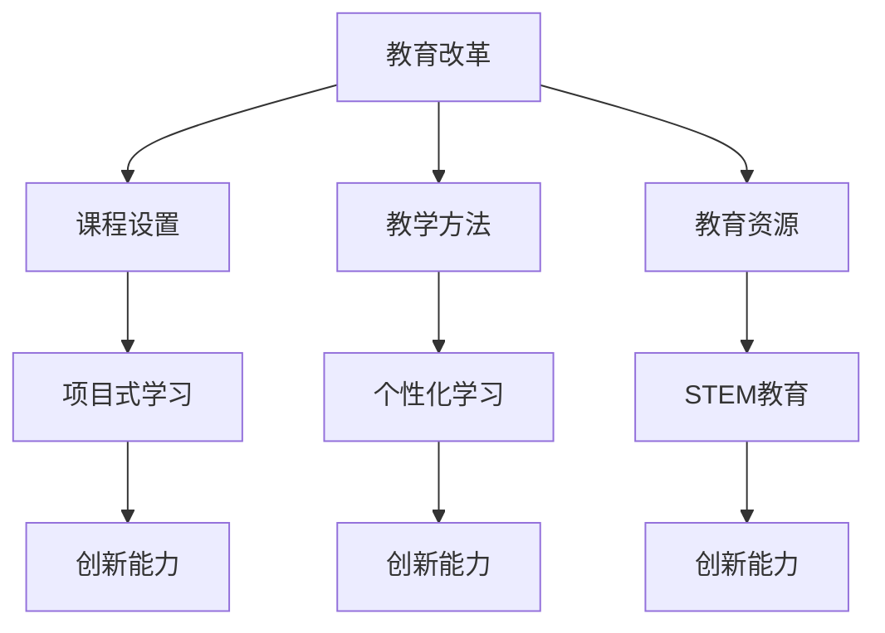

                 

### 文章标题：硅谷教育改革：培养创新型人才

#### 关键词：硅谷教育，创新型人才，教育改革，STEM教育，项目式学习，个性化学习

#### 摘要：
本文深入探讨了硅谷教育改革的核心理念和实践，旨在揭示如何通过创新教育模式培养具有创新能力的高素质人才。首先，我们回顾了硅谷教育的独特性以及全球教育改革的趋势，进而分析了创新型人才所需的核心能力。随后，文章重点介绍了硅谷学校在教育创新方面的成功案例，包括斯坦福大学、加州理工学院和谷歌公司的员工培训计划。最后，文章探讨了硅谷教育理念在中国的实践及其对中国教育改革的启示，并对未来教育改革的趋势进行了展望。

### 《硅谷教育改革：培养创新型人才》目录大纲

#### 第一部分：背景与现状

##### # 第1章：硅谷教育与全球趋势

###### 1.1 硅谷教育的独特性

### 1.1.1 硅谷教育体系概述

### 1.1.2 硅谷教育的核心价值观

###### 1.2 全球教育改革趋势

### 1.2.1 教育平等与多样性

### 1.2.2 个性化学习与在线教育

### 1.2.3 创新教育与创业精神

#### 第二部分：教育理念与创新

##### # 第2章：创新型人才的核心能力

###### 2.1 创新思维的培养

### 2.1.1 创新思维的概述

### 2.1.2 创新思维的开发方法

### 2.1.3 创新思维在教育中的应用

###### 2.2 项目式学习与实践

### 2.2.1 项目式学习的概念

### 2.2.2 项目式学习的实施步骤

### 2.2.3 项目式学习对创新人才培养的作用

###### 2.3 教育创新与STEM教育

### 2.3.1 STEM教育的核心内容

### 2.3.2 STEM教育的实施策略

### 2.3.3 STEM教育在硅谷学校的实践案例

#### 第三部分：硅谷学校的成功案例

##### # 第3章：硅谷名校教育改革实践

###### 3.1 斯坦福大学的教育创新

### 3.1.1 斯坦福大学的教育理念

### 3.1.2 斯坦福大学的教育项目

### 3.1.3 斯坦福大学教育的成功因素

###### 3.2 加州理工学院的教育改革

### 3.2.1 加州理工学院的教育模式

### 3.2.2 加州理工学院的教学特色

### 3.2.3 加州理工学院的教育成果

###### 3.3 谷歌公司的员工培训计划

### 3.3.1 谷歌员工培训的总体思路

### 3.3.2 谷歌员工培训的具体措施

### 3.3.3 谷歌员工培训的效果评估

#### 第四部分：中国教育改革的启示

##### # 第4章：硅谷教育理念在中国的实践

###### 4.1 中国教育改革的现状

### 4.1.1 中国教育体系的现状

### 4.1.2 中国教育改革的目标

### 4.1.3 中国教育改革的挑战

###### 4.2 硅谷教育理念在中国的应用

### 4.2.1 个性化学习在中国

### 4.2.2 项目式学习在中国

### 4.2.3 STEM教育在中国

###### 4.3 硅谷教育理念对中国教育改革的启示

### 4.3.1 启示一：重视创新思维培养

### 4.3.2 启示二：实施个性化教学

### 4.3.3 启示三：加强实践与科研教育

#### 第五部分：未来展望

##### # 第5章：硅谷教育改革的未来趋势

###### 5.1 硅谷教育改革的未来方向

### 5.1.1 教育与科技的深度融合

### 5.1.2 线上教育与线下教育的融合

### 5.1.3 全球教育资源的共享与公平

###### 5.2 创新型人才的培养策略

### 5.2.1 家庭教育与学校教育的协同

### 5.2.2 社会资源与教育资源的整合

### 5.2.3 终身学习与职业发展的结合

###### 5.3 中国教育改革的未来展望

### 5.3.1 中国教育改革的路径选择

### 5.3.2 中国教育改革的挑战与机遇

### 5.3.3 中国教育改革的未来趋势

### 附录

##### # 附录 A：硅谷教育改革相关资源

### A.1 硅谷教育改革的研究报告

### A.2 硅谷教育改革的相关书籍

### A.3 硅谷教育改革的研究论文与期刊

##### # 附录 B：中国教育改革的实践案例

### B.1 中国名校的教育改革案例

### B.2 中国地方教育改革的实践

### B.3 中国教育改革的社会力量参与

##### # 附录 C：教育改革的关键指标与评估方法

### C.1 教育改革的评价标准

### C.2 教育改革的评估方法

### C.3 教育改革的成功案例分析

### 开篇：硅谷教育改革的核心理念

硅谷，这片位于美国加利福尼亚州北部的科技圣地，以其创新精神和高新技术产业发展而闻名于世。作为全球科技创新的摇篮，硅谷的教育体系也经历了深刻的改革，旨在培养具有创新能力的高素质人才。本文将深入探讨硅谷教育改革的核心理念和实践，旨在揭示其成功之处，并为全球教育改革提供启示。

#### 硅谷教育的独特性

硅谷的教育体系具有以下几个独特的特点：

1. **开放与创新**：硅谷的教育体系鼓励创新和尝试，学生有更多的自由去探索自己的兴趣和潜能。学校强调实验和实践，培养学生的动手能力和创新精神。

2. **跨学科教育**：硅谷的教育注重跨学科的教育模式，鼓励学生从不同角度思考和解决问题。这种跨学科的教育有助于培养学生的综合能力和创新思维。

3. **个性化教学**：硅谷的教育注重个性化教学，根据学生的兴趣和需求量身定制课程。学校鼓励学生自主学习和探索，培养学生的自主学习能力和批判性思维。

4. **创业精神**：硅谷的教育体系注重培养学生的创业精神，鼓励学生勇于尝试和创业。学校提供丰富的创业资源和指导，帮助学生将创新想法转化为实际项目。

#### 全球教育改革趋势

在全球范围内，教育改革也呈现出一些共同的趋势：

1. **教育平等与多样性**：全球教育改革强调教育的平等和多样性，致力于消除教育不公，让更多的学生有机会接受高质量的教育。

2. **个性化学习与在线教育**：随着科技的进步，个性化学习和在线教育成为教育改革的重要方向。学校通过互联网和数字化工具，为学生提供更加灵活和个性化的学习体验。

3. **创新教育与创业精神**：全球教育改革强调培养学生的创新思维和创业精神，通过项目式学习和实践教育，帮助学生将理论知识应用到实际中。

#### 硅谷教育改革的核心理念

硅谷教育改革的核心理念可以概括为以下几点：

1. **创新驱动**：硅谷的教育改革以创新为核心，鼓励学生勇于创新和尝试，培养学生的创新精神和实践能力。

2. **个性化教学**：硅谷的教育注重个性化教学，根据学生的兴趣和需求进行差异化教育，帮助学生找到自己的特长和潜力。

3. **跨学科教育**：硅谷的教育强调跨学科教育，通过整合不同学科的知识和技能，培养学生的综合能力和创新思维。

4. **创业导向**：硅谷的教育改革注重培养学生的创业精神，鼓励学生将创新想法转化为实际项目，培养未来企业家。

通过以上核心理念，硅谷的教育体系成功地培养了一批具有创新能力的高素质人才，为全球科技创新和经济发展做出了重要贡献。

#### 第1章：硅谷教育与全球趋势

##### 1.1 硅谷教育的独特性

硅谷的教育体系在全球范围内独树一帜，其独特性主要体现在以下几个方面：

###### 1.1.1 硅谷教育体系概述

硅谷的教育体系以其开放性、创新性和灵活性而著称。该体系不仅涵盖传统学校教育，还包括各种非正式教育和终身学习机会。硅谷的学校和大学注重培养学生的创新能力和实际操作能力，鼓励学生跨学科学习和自主探索。这种教育模式不仅强调知识的传授，更重视学生的思维能力和问题解决能力。

###### 1.1.2 硅谷教育的核心价值观

硅谷教育的核心价值观可以总结为以下几点：

1. **创新**：硅谷的教育鼓励学生勇于创新，不断尝试新的方法和思路。学校提供丰富的资源和机会，帮助学生将创新想法转化为实际项目。

2. **实践**：硅谷的教育强调实践教育，鼓励学生将理论知识应用到实际操作中。学校通过项目式学习和实验课程，培养学生的动手能力和实际操作能力。

3. **个性化**：硅谷的教育注重个性化教学，根据学生的兴趣和需求量身定制课程。学校鼓励学生自主学习，培养学生的自主学习能力和批判性思维。

4. **多样性**：硅谷的教育体系强调多样性，致力于消除教育不公，让更多的学生有机会接受高质量的教育。学校注重文化多样性，培养学生的全球视野和跨文化交流能力。

##### 1.2 全球教育改革趋势

在全球范围内，教育改革正在如火如荼地进行。以下是几个主要趋势：

###### 1.2.1 教育平等与多样性

教育平等和多样性是全球教育改革的重要目标。各国政府致力于消除教育不公，提供平等的教育机会。同时，教育体系也在不断优化，以适应不同学生的需求。例如，一些国家通过推行免费教育、提供助学金和奖学金等措施，确保每个孩子都有机会接受教育。

###### 1.2.2 个性化学习与在线教育

个性化学习和在线教育是教育改革的两个重要方向。个性化学习通过根据学生的兴趣、能力和学习风格定制课程，提高学习效果。在线教育则借助互联网和数字化工具，提供灵活的学习时间和方式，使学习更加便捷。全球范围内，许多学校和大学都在积极推行在线教育，提供丰富的在线课程资源。

###### 1.2.3 创新教育与创业精神

创新教育和创业精神是教育改革的重要目标。各国政府和社会各界都在努力培养具有创新思维和创业精神的人才。学校通过项目式学习、实验课程和创业指导等方式，激发学生的创新潜力。同时，许多大学和科研机构也积极推动创新创业教育，为学生提供实践机会和资源支持。

##### 1.3 硅谷教育的优势与挑战

硅谷教育的独特性使其在全球范围内具有很大的优势。然而，这种教育模式也面临着一些挑战：

###### 1.3.1 优势

1. **创新能力**：硅谷的教育注重创新能力的培养，使学生具备较强的创新思维和实践能力。

2. **个性化教学**：硅谷的教育提供个性化的学习体验，使每个学生都能充分发挥自己的潜力。

3. **跨学科教育**：硅谷的教育强调跨学科教育，培养学生的综合能力和解决问题的能力。

4. **创业导向**：硅谷的教育注重培养学生的创业精神，鼓励学生将创新想法转化为实际项目。

###### 1.3.2 挑战

1. **资源分配不均**：硅谷的教育资源相对集中，一些学校和地区可能难以享受到优质的教育资源。

2. **学生压力**：硅谷的教育竞争激烈，学生可能面临较大的学习压力。

3. **课程难度**：硅谷的教育课程难度较高，一些学生可能难以适应。

4. **社会问题**：硅谷的教育可能面临一些社会问题，如种族歧视、经济不平等等。

#### 第2章：创新型人才的核心能力

##### 2.1 创新思维的培养

创新思维是创新型人才的基石。以下将从几个方面探讨如何培养创新思维：

###### 2.1.1 创新思维的概述

创新思维是指在面对问题时，能够跳出传统思维框架，运用独特的视角和策略，提出新的解决方案。创新思维不仅包括创造新事物，还包括对现有事物的重新定义和改进。

###### 2.1.2 创新思维的开发方法

1. **多样化思维**：鼓励学生从不同角度思考问题，培养多样化的思维方式。例如，通过头脑风暴、思维导图等方法，激发学生的创意思维。

2. **反思与批判**：培养学生反思和批判的能力，鼓励学生对现有的知识体系和解决方案进行质疑和改进。

3. **跨学科学习**：通过跨学科的学习，帮助学生建立多领域的知识体系，从而在解决复杂问题时，能够灵活运用不同领域的知识。

4. **实践与实验**：鼓励学生通过实践和实验，将创新思维转化为实际成果。学校可以设置实验室、创业孵化器等实践平台，为学生提供实验和试错的机会。

###### 2.1.3 创新思维在教育中的应用

1. **项目式学习**：通过项目式学习，让学生在解决实际问题的过程中，培养创新思维。教师可以设计具有挑战性的项目，引导学生通过团队合作、探索和实验，寻找解决方案。

2. **创新创业教育**：在高等教育阶段，通过创新创业教育，培养学生的创业精神。学校可以开设创业课程、创业竞赛等，为学生提供创业实践的机会。

3. **跨学科课程**：通过跨学科课程，让学生在多个领域学习和探索，培养综合能力和创新思维。

##### 2.2 项目式学习与实践

项目式学习（Project-Based Learning, PBL）是一种以项目为导向的学习方式，通过学生自主或协作完成一个实际项目，从而实现学习目标。以下将从几个方面探讨项目式学习的实施步骤和对创新人才培养的作用：

###### 2.2.1 项目式学习的概念

项目式学习强调学生通过实际项目来学习知识，培养解决问题的能力。与传统教学方法相比，项目式学习更注重学生的自主性、合作性和实践性。

###### 2.2.2 项目式学习的实施步骤

1. **确定项目主题**：教师根据课程目标和学生的学习需求，选择具有挑战性且具有实际意义的项目主题。

2. **制定项目计划**：教师与学生共同制定项目计划，明确项目的目标、步骤、时间安排等。

3. **实施项目**：学生根据项目计划，自主或协作完成项目任务。教师在此过程中提供指导和反馈，确保项目顺利进行。

4. **项目展示与评估**：学生完成项目后，通过展示和答辩等方式，分享项目成果。教师对学生的项目进行评估，反馈学习成果。

###### 2.2.3 项目式学习对创新人才培养的作用

1. **培养问题解决能力**：项目式学习鼓励学生在解决实际问题的过程中，运用创新思维和方法，提高问题解决能力。

2. **培养团队合作精神**：项目式学习强调团队合作，学生在合作中学习沟通、协调和合作，培养团队合作精神。

3. **提高实践能力**：项目式学习通过实际项目，让学生在实践中学习知识，提高实践能力和动手能力。

4. **激发创新潜力**：项目式学习为学生提供自主探索和实验的机会，激发学生的创新潜力，培养创新型人才。

##### 2.3 教育创新与STEM教育

STEM教育（科学、技术、工程和数学教育）是教育创新的重要方向。以下将从几个方面探讨STEM教育的核心内容、实施策略以及在硅谷学校的实践案例：

###### 2.3.1 STEM教育的核心内容

STEM教育旨在通过科学、技术、工程和数学的教育，培养学生的创新能力和实践能力。其核心内容包括：

1. **科学教育**：通过科学实验和探究活动，培养学生的科学思维和探究能力。

2. **技术教育**：通过信息技术和工程实践，培养学生的技术素养和创新能力。

3. **工程教育**：通过工程设计和项目实践，培养学生的工程思维和问题解决能力。

4. **数学教育**：通过数学思维和数学应用，培养学生的数学素养和逻辑思维能力。

###### 2.3.2 STEM教育的实施策略

1. **跨学科教学**：将STEM教育与其他学科相结合，培养学生的综合能力和创新思维。

2. **项目式学习**：通过项目式学习，让学生在解决实际问题的过程中，运用STEM知识。

3. **实践活动**：组织各种实践活动，如科学实验、工程设计、编程竞赛等，提高学生的实践能力。

4. **师资培训**：加强STEM教育师资培训，提高教师的教学能力和专业素养。

###### 2.3.3 STEM教育在硅谷学校的实践案例

硅谷地区的学校在STEM教育方面取得了显著成果，以下是几个典型的实践案例：

1. **斯坦福大学**：斯坦福大学通过STEM教育课程和项目，培养学生的创新能力和实践能力。学校提供丰富的实验设施和项目机会，鼓励学生进行自主研究和创新。

2. **加州理工学院**：加州理工学院注重STEM教育，通过跨学科课程和项目，培养学生的科学素养和创新能力。学校鼓励学生参与科研活动和竞赛，提高学生的实践能力和竞争力。

3. **谷歌公司**：谷歌公司通过STEM教育项目和培训计划，培养员工的创新能力和技术素养。公司提供各种资源和支持，鼓励员工进行创新研究和实践。

#### 第3章：硅谷名校教育改革实践

##### 3.1 斯坦福大学的教育创新

斯坦福大学作为硅谷的顶尖高等教育机构，其在教育创新方面具有丰富的经验和独特的优势。以下从教育理念、教育项目和成功因素三个方面探讨斯坦福大学的教育创新。

###### 3.1.1 斯坦福大学的教育理念

斯坦福大学的教育理念可以总结为以下几点：

1. **创新驱动**：斯坦福大学鼓励学生勇于创新，不断尝试新的想法和方法。学校提供丰富的资源和机会，支持学生进行创新研究。

2. **个性化教学**：斯坦福大学注重个性化教学，根据学生的兴趣和需求量身定制课程。学校鼓励学生自主学习，培养学生的自主学习能力和批判性思维。

3. **跨学科教育**：斯坦福大学强调跨学科教育，通过整合不同学科的知识和技能，培养学生的综合能力和创新思维。

4. **实践导向**：斯坦福大学注重实践教育，鼓励学生将理论知识应用到实际操作中。学校提供丰富的实践机会，如实验室研究、项目实践等，培养学生的实际操作能力和问题解决能力。

###### 3.1.2 斯坦福大学的教育项目

斯坦福大学在创新教育方面实施了一系列成功的教育项目，以下列举几个典型案例：

1. **斯坦福创新项目**：该项目旨在鼓励学生进行创新研究，提供资金、导师资源和实验室支持。学生可以自由选择研究课题，进行跨学科研究。

2. **斯坦福创业实验室**：该实验室为学生提供创业指导、资金支持和办公空间，帮助学生将创新想法转化为实际项目。

3. **斯坦福-硅谷创新论坛**：该论坛邀请硅谷的创业家和企业家来校演讲，分享创业经验和创新理念。学生通过与成功创业者的交流，激发创新思维和创业精神。

###### 3.1.3 斯坦福大学教育的成功因素

斯坦福大学教育的成功因素主要包括以下几点：

1. **优秀的师资力量**：斯坦福大学拥有世界级的教授和研究人员，他们不仅学术造诣深厚，而且具备丰富的实践经验。

2. **优质的教育资源**：斯坦福大学提供丰富的教育资源，包括实验室、图书馆、研究资金等，为学生提供广阔的学习和研究平台。

3. **开放的创新环境**：斯坦福大学鼓励创新和尝试，为学生提供自由探索的空间。学校通过举办各种创新活动和竞赛，激发学生的创新潜力。

4. **与企业合作**：斯坦福大学与硅谷的企业保持紧密的合作关系，为学生提供实习、研究和企业合作的机会，帮助学生将理论知识应用于实际工作中。

##### 3.2 加州理工学院的教育改革

加州理工学院（Caltech）是硅谷的另一所顶尖高等教育机构，其在教育改革方面同样具有丰富的经验和显著成果。以下从教育模式、教学特色和教育成果三个方面探讨加州理工学院的教育改革。

###### 3.2.1 加州理工学院的教育模式

加州理工学院的教育模式具有以下几个特点：

1. **小班授课**：加州理工学院的课程通常采用小班授课，师生互动紧密。这种教学模式有助于教师深入了解学生的需求，提供个性化的指导。

2. **项目驱动**：加州理工学院的教学注重项目驱动，通过实际项目来培养学生的实践能力和创新思维。学校鼓励学生自主选择项目，进行跨学科合作。

3. **科研与实践相结合**：加州理工学院强调科研与实践相结合，鼓励学生在科研过程中积累实践经验。学校提供丰富的科研资源和实验设施，支持学生进行创新研究。

4. **国际化视野**：加州理工学院注重国际化教育，吸引来自世界各地的学生和教师。学校通过国际交流项目、学术会议等方式，培养学生的全球视野和跨文化交流能力。

###### 3.2.2 加州理工学院的教学特色

加州理工学院的教学特色主要体现在以下几个方面：

1. **高强度的学习环境**：加州理工学院的学习环境充满竞争和挑战。学校要求学生进行大量的学术研究和实验，培养学生的学术能力和独立思考能力。

2. **个性化教学**：加州理工学院注重个性化教学，根据学生的兴趣和能力提供多样化的课程。学校鼓励学生自主学习，发展个人特长。

3. **实践导向**：加州理工学院的教学注重实践，鼓励学生在实验和项目中积累经验。学校提供丰富的实践机会，如科研实习、工程实践等，培养学生的实践能力和问题解决能力。

4. **跨学科教育**：加州理工学院强调跨学科教育，通过整合不同学科的知识和技能，培养学生的综合能力和创新思维。

###### 3.2.3 加州理工学院的教育成果

加州理工学院的教育改革取得了显著的成果，以下列举几个典型案例：

1. **诺贝尔奖得主**：加州理工学院培养了一大批诺贝尔奖得主，其中包括物理学、化学、经济学等领域的杰出人才。

2. **技术创新**：加州理工学院的学生和校友在科技创新领域取得了卓越的成就。学校培养了一大批杰出的科学家、工程师和企业家，为硅谷和全球科技发展做出了重要贡献。

3. **学术影响力**：加州理工学院在学术领域具有广泛的影响力，其研究成果在科学、工程和技术等领域具有很高的引用率和影响力。

##### 3.3 谷歌公司的员工培训计划

谷歌公司作为全球领先的科技公司，其在员工培训方面具有丰富的经验和独特的优势。以下从总体思路、具体措施和效果评估三个方面探讨谷歌公司的员工培训计划。

###### 3.3.1 谷歌员工培训的总体思路

谷歌公司的员工培训计划以培养创新能力和专业技能为核心，旨在提高员工的综合素质和竞争力。以下是谷歌员工培训的总体思路：

1. **持续学习**：谷歌公司鼓励员工持续学习，不断提升自己的专业技能和知识水平。公司提供丰富的在线课程、内部培训和外部学习机会，支持员工进行自我提升。

2. **实践导向**：谷歌公司注重实践导向的培训，通过实际项目和工作任务，培养员工的实践能力和问题解决能力。公司鼓励员工在项目中发挥创造力，提出创新解决方案。

3. **个性化培训**：谷歌公司根据员工的不同需求和职业发展目标，提供个性化的培训方案。公司通过评估员工的技能和兴趣，制定针对性的培训计划，确保培训效果最大化。

4. **团队合作**：谷歌公司强调团队合作，通过团队培训和工作任务，培养员工的团队合作精神和沟通能力。公司鼓励员工在团队合作中互相学习，共同成长。

###### 3.3.2 谷歌员工培训的具体措施

谷歌公司的员工培训措施包括以下几个方面：

1. **内部培训**：谷歌公司定期举办内部培训，包括技术培训、管理培训、领导力培训等。公司邀请业内专家和内部优秀员工进行授课，分享经验和最佳实践。

2. **在线学习**：谷歌公司提供丰富的在线学习资源，包括谷歌课堂（Google Classroom）和谷歌学习平台（Google Learning Platform）。员工可以通过在线学习平台，自由选择课程，进行自主学习。

3. **项目实践**：谷歌公司鼓励员工参与实际项目，通过项目实践提高专业技能和创新能力。公司提供项目指导和支持，确保员工在项目中能够得到充分的锻炼和提升。

4. **外部培训**：谷歌公司支持员工参加外部培训和学术会议，拓宽视野，学习最新的行业动态和技术趋势。公司为员工提供资金和休假支持，鼓励员工积极参与外部培训和学习活动。

###### 3.3.3 谷歌员工培训的效果评估

谷歌公司对员工培训效果进行全面的评估，确保培训目标的实现和员工的持续成长。以下是谷歌员工培训效果评估的几个方面：

1. **员工满意度**：通过员工满意度调查，了解员工对培训内容和培训效果的反馈。公司根据员工的意见和需求，不断优化培训方案，提高培训效果。

2. **技能提升**：通过技能评估和项目实践，评估员工在培训后技能的提升情况。公司关注员工的实际表现，确保培训对员工的技能提升具有显著效果。

3. **项目成果**：通过评估员工参与项目后的成果，了解培训对员工工作绩效的影响。公司关注员工在项目中的创新表现和实际贡献，确保培训对工作产生积极影响。

4. **员工晋升**：通过员工晋升情况，评估培训对员工职业发展的影响。公司鼓励员工在培训后积极参与晋升机会，通过培训实现职业成长。

#### 第4章：硅谷教育理念在中国的实践

##### 4.1 中国教育改革的现状

近年来，中国教育改革取得了显著进展，但仍面临诸多挑战。以下是关于中国教育改革现状的几点分析：

###### 4.1.1 中国教育体系的现状

中国教育体系具有以下特点：

1. **教育体制**：中国实行九年义务教育制度，包括小学六年和初中三年。高中教育分为普通高中和职业高中，高等教育包括本科、硕士和博士等阶段。

2. **教育资源**：中国教育资源分布不均衡，一线城市和发达地区的教育资源相对丰富，而农村和欠发达地区则相对匮乏。

3. **考试制度**：中国教育体系以考试为中心，高考和中考等考试对学生的学业成绩和未来发展具有重要影响。

4. **师资力量**：中国教师的整体素质较高，但农村和偏远地区的师资力量较为薄弱。

###### 4.1.2 中国教育改革的目标

中国教育改革的主要目标包括：

1. **提高教育质量**：通过改革课程设置、教学方法和管理体制，提高教育质量和教育公平。

2. **培养创新型人才**：加强素质教育，培养学生的创新思维和实践能力。

3. **促进教育公平**：优化教育资源分配，缩小城乡、区域和学校之间的差距，确保每个孩子都能接受公平而有质量的教育。

4. **推进信息化教育**：利用信息技术，推动教育现代化，实现教育资源共享和个性化学习。

###### 4.1.3 中国教育改革的挑战

中国教育改革面临以下挑战：

1. **教育资源分配不均**：城乡、区域和学校之间的教育资源分配存在较大差距，农村和偏远地区的教育资源相对匮乏。

2. **考试制度问题**：高考和中考等考试制度对学生的学业成绩和未来发展具有重大影响，但过度依赖考试可能导致教育质量下降和应试教育现象。

3. **教师队伍建设**：教师素质和师资力量的提升是教育改革的关键，但农村和偏远地区的教师队伍建设仍然面临较大困难。

4. **教育理念更新**：部分学校和家长对教育理念的认识存在偏差，过度强调考试成绩和升学率，忽视学生全面发展。

##### 4.2 硅谷教育理念在中国的应用

硅谷教育理念在中国逐渐得到应用，以下从个性化学习、项目式学习和STEM教育三个方面探讨硅谷教育理念在中国的实践：

###### 4.2.1 个性化学习在中国

个性化学习是硅谷教育理念的核心之一，在中国也逐渐得到应用。以下是几个方面的实践：

1. **差异化教学**：学校根据学生的兴趣、能力和学习风格，提供差异化教学。例如，通过个性化课程、分层教学和定制化辅导，满足学生的个性化需求。

2. **在线学习平台**：许多学校利用在线学习平台，提供丰富的学习资源和学习工具。学生可以根据自己的需求，自主选择学习内容和方式。

3. **学习评价体系**：学校建立多元化的学习评价体系，不仅关注学生的考试成绩，还关注学生的综合素质和个性发展。

4. **家长参与**：学校鼓励家长参与孩子的个性化学习过程，与家长共同制定学习计划，共同促进学生的个性化发展。

###### 4.2.2 项目式学习在中国

项目式学习在中国教育改革中发挥着重要作用，以下是一些具体实践：

1. **项目设计**：学校教师根据课程目标和学生的学习需求，设计具有挑战性和实际意义的项目。项目通常涵盖多个学科领域，鼓励学生跨学科学习和合作。

2. **项目实施**：学生在教师的指导下，自主或团队合作完成项目任务。学校提供必要的资源和指导，确保项目顺利进行。

3. **项目展示与评价**：学生完成项目后，通过展示和答辩等方式，分享项目成果。教师对学生的项目进行评价，关注学生的创新思维、团队合作和实践能力。

4. **跨学科项目**：学校鼓励跨学科项目，通过整合不同学科的知识和技能，培养学生的综合能力和创新思维。

###### 4.2.3 STEM教育在中国

STEM教育在中国教育改革中备受重视，以下是一些具体实践：

1. **课程设置**：学校开设STEM相关课程，包括科学、技术、工程和数学等。课程内容注重实践性和应用性，鼓励学生动手操作和实验探究。

2. **实践活动**：学校组织各种实践活动，如科学实验、工程设计和编程竞赛等，提高学生的实践能力和创新能力。

3. **师资培训**：学校加强STEM教育师资培训，提高教师的教学能力和专业素养。教师通过参加专业培训、学术交流等方式，不断更新知识和教学理念。

4. **教育资源**：学校提供丰富的STEM教育资源，如实验室、图书馆和在线学习平台等。学生可以通过这些资源进行自主学习和探究。

##### 4.3 硅谷教育理念对中国教育改革的启示

硅谷教育理念为中国教育改革提供了有益的启示，以下从几个方面进行探讨：

###### 4.3.1 启示一：重视创新思维培养

硅谷教育强调创新思维的培养，这对中国教育改革具有重要意义。中国教育改革应注重培养学生的创新思维，通过项目式学习和跨学科教育，激发学生的创新潜力。

1. **创新教育理念**：学校应树立创新教育理念，鼓励学生勇于尝试和探索，培养学生的创新意识和创新能力。

2. **课程改革**：学校应加强课程改革，增加实践性课程和跨学科课程，培养学生的综合能力和创新思维。

3. **教学方法**：学校应采用多元化的教学方法，如项目式学习、探究式学习和合作学习等，激发学生的创新思维。

4. **教师培训**：学校应加强教师培训，提高教师的教育教学能力和创新能力，为创新教育提供有力支持。

###### 4.3.2 启示二：实施个性化教学

个性化教学是硅谷教育理念的核心之一，对中国教育改革具有重要的指导意义。中国教育改革应注重实施个性化教学，满足学生的个性化需求。

1. **差异化教学**：学校应根据学生的兴趣、能力和学习风格，提供差异化教学，满足学生的个性化需求。

2. **在线学习平台**：学校应建设在线学习平台，提供丰富的学习资源和学习工具，支持学生的个性化学习。

3. **学习评价体系**：学校应建立多元化的学习评价体系，关注学生的综合素质和个性发展，促进学生的全面发展。

4. **家校合作**：学校应加强家校合作，家长参与孩子的个性化学习过程，共同促进学生的个性化发展。

###### 4.3.3 启示三：加强实践与科研教育

硅谷教育理念强调实践和科研教育，这对中国教育改革具有重要的启示。中国教育改革应加强实践和科研教育，培养学生的实际操作能力和创新思维。

1. **实践教育**：学校应加强实践教育，通过实验、项目和实践课程，培养学生的实际操作能力和问题解决能力。

2. **科研教育**：学校应加强科研教育，鼓励学生参与科研活动和学术竞赛，提高学生的科研素养和创新思维。

3. **教育资源**：学校应提供丰富的教育资源，如实验室、图书馆和在线学习平台等，支持学生的实践和科研活动。

4. **教师科研**：学校应鼓励教师参与科研活动，提高教师的教学水平和科研能力，为学生的实践和科研教育提供支持。

#### 第5章：硅谷教育改革的未来趋势

##### 5.1 硅谷教育改革的未来方向

硅谷教育改革的未来方向主要包括以下几个方面：

###### 5.1.1 教育与科技的深度融合

随着科技的不断发展，硅谷的教育改革将更加注重教育与科技的深度融合。具体措施包括：

1. **在线教育与人工智能的结合**：利用人工智能技术，实现个性化学习和智能评估，提高教育质量和效率。

2. **虚拟现实与增强现实技术的应用**：通过虚拟现实和增强现实技术，提供沉浸式学习体验，激发学生的学习兴趣和参与度。

3. **大数据与教育数据分析**：利用大数据技术，对学生学习行为进行分析，为教育决策提供科学依据。

4. **智能教育系统的开发**：开发智能教育系统，实现教学资源的智能化管理和个性化推送，提高教育服务的质量和效率。

###### 5.1.2 线上教育与线下教育的融合

硅谷的教育改革将不断推进线上教育与线下教育的融合，实现教育资源的共享和优化配置。具体措施包括：

1. **混合式教学模式**：结合线上和线下教学，实现优势互补，提高教学效果。

2. **资源共享平台**：建设资源共享平台，汇集全球优质教育资源和课程，为学生提供多样化的学习选择。

3. **线上辅导与线下实践**：通过线上辅导和线下实践相结合，提高学生的实践能力和综合素质。

4. **教育公平与教育普惠**：利用线上教育，缩小城乡、区域和学校之间的教育差距，实现教育公平和教育普惠。

###### 5.1.3 全球教育资源的共享与公平

硅谷的教育改革将致力于全球教育资源的共享与公平，实现全球教育的一体化和协同发展。具体措施包括：

1. **跨国教育合作**：加强国际间的教育合作与交流，共享教育资源和教学经验。

2. **在线国际教育**：利用互联网技术，提供在线国际教育课程，为全球学生提供优质的教育资源。

3. **教育援助与发展**：通过教育援助项目，支持发展中国家和欠发达地区的教育发展，实现全球教育公平。

4. **全球教育标准的制定**：制定全球统一的教育标准，推动全球教育的标准化和规范化。

##### 5.2 创新型人才的培养策略

为了培养更多的创新型人才，硅谷的教育改革将采取一系列策略，主要包括以下几个方面：

###### 5.2.1 家庭教育与学校教育的协同

家庭教育与学校教育相结合，是实现创新型人才培养的关键。具体策略包括：

1. **家庭教育与学校教育的互动**：建立家校合作机制，加强家庭教育与学校教育的沟通与协作，形成教育合力。

2. **家庭教育指导**：学校提供家庭教育指导，帮助家长树立正确的教育观念，掌握科学的教育方法。

3. **家长参与**：鼓励家长积极参与学校教育和社区活动，提高家庭教育质量。

4. **家庭与学校的共同成长**：通过家庭教育与学校教育的协同，促进家庭和学校的共同成长，为创新型人才培养提供良好的环境。

###### 5.2.2 社会资源与教育资源的整合

社会资源与教育资源的整合，是提高教育质量和培养创新型人才的重要途径。具体策略包括：

1. **校企合作**：加强学校与企业合作，利用企业的资源和技术优势，提高学生的实践能力和创新思维。

2. **社区教育**：发挥社区教育资源的作用，为社区居民提供多样化的教育服务，拓宽学生的视野。

3. **教育资源整合**：整合社会教育资源，如图书馆、博物馆、科技馆等，为学生提供丰富的学习资源。

4. **公益教育**：鼓励社会组织和公益机构参与教育公益事业，为弱势群体提供教育支持。

###### 5.2.3 终身学习与职业发展的结合

终身学习和职业发展相结合，是适应时代发展和培养创新型人才的重要策略。具体策略包括：

1. **职业规划教育**：学校开展职业规划教育，帮助学生明确职业发展方向，提高职业素养。

2. **职业教育培训**：提供多样化的职业教育培训，满足学生不同阶段的职业发展需求。

3. **职业技能认证**：建立职业技能认证体系，提高学生的职业竞争力。

4. **终身学习机制**：建立终身学习机制，鼓励学生不断学习和提升，适应不断变化的社会和职业环境。

##### 5.3 中国教育改革的未来展望

中国教育改革的未来展望主要包括以下几个方面：

###### 5.3.1 中国教育改革的路径选择

中国教育改革需要根据国家发展战略和经济社会发展需求，科学选择改革路径。具体策略包括：

1. **深化教育体制改革**：推进教育体制改革，完善教育法律法规，建立健全教育管理制度。

2. **优化教育资源配置**：优化教育资源分配，缩小城乡、区域和学校之间的差距，实现教育公平。

3. **加强教育质量保障**：建立教育质量保障体系，提高教育质量，培养高素质人才。

4. **推动教育信息化**：加强教育信息化建设，推动信息技术与教育教学深度融合，提高教育现代化水平。

###### 5.3.2 中国教育改革的挑战与机遇

中国教育改革面临以下挑战和机遇：

1. **挑战**：
   - 教育资源分配不均
   - 考试制度问题
   - 教师队伍建设
   - 家长和社会期望过高
   
2. **机遇**：
   - 科技进步带来的教育创新
   - 人口结构变化带来的教育需求
   - 国际教育交流与合作

###### 5.3.3 中国教育改革的未来趋势

中国教育改革的未来趋势主要包括以下几个方面：

1. **个性化学习与智慧教育的普及**：随着人工智能和大数据技术的发展，个性化学习和智慧教育将得到广泛应用，满足学生的个性化学习需求。

2. **教育国际化与多元化**：中国教育将更加开放，加强国际交流与合作，推进教育国际化与多元化发展。

3. **终身学习与职业教育的融合**：终身学习和职业教育将得到进一步重视，构建终身教育体系，满足人民群众多样化的学习需求。

4. **教育创新与创业教育的推进**：鼓励教育创新和创业教育，培养具有创新精神和创业能力的高素质人才，推动社会经济发展。

### 附录

#### 附录 A：硅谷教育改革相关资源

A.1 硅谷教育改革的研究报告

- 《硅谷教育改革报告》
- 《美国硅谷创新教育研究》
- 《全球科技创新与教育改革》

A.2 硅谷教育改革的相关书籍

- 《硅谷教育启示录》
- 《创新教育：硅谷模式解读》
- 《硅谷创新教育实践指南》

A.3 硅谷教育改革的研究论文与期刊

- 《教育科技学报》
- 《高等教育研究》
- 《科技与社会》

#### 附录 B：中国教育改革的实践案例

B.1 中国名校的教育改革案例

- 清华大学“新工科”教育改革
- 北京大学“双创”教育实践
- 复旦大学“跨学科教育”试点

B.2 中国地方教育改革的实践

- 广东省“教育信息化2.0行动计划”
- 浙江省教育厅“互联网+教育”行动
- 安徽省“智慧教育”建设

B.3 中国教育改革的社会力量参与

- 社会组织参与教育扶贫
- 企业合作推动教育创新
- 基金会支持教育公益事业

#### 附录 C：教育改革的关键指标与评估方法

C.1 教育改革的评价标准

- 教育公平
- 教育质量
- 学生发展
- 教师成长
- 社会参与

C.2 教育改革的评估方法

- 定量评估：通过统计数据、问卷调查等方式进行评估。
- 定性评估：通过案例分析、深度访谈等方式进行评估。
- 成果评估：通过项目成果、学生表现等方式进行评估。
- 过程评估：通过教育过程、教师教学等方式进行评估。

C.3 教育改革的成功案例分析

- 某市中小学教育改革案例
- 某省职业教育改革案例
- 某高校创新创业教育改革案例

### 结尾：展望未来，共创美好教育

硅谷教育改革为全球教育改革提供了宝贵的经验和启示。通过创新教育理念、个性化教学、项目式学习和STEM教育等举措，硅谷成功地培养了一批具有创新能力的高素质人才。中国教育改革也应在借鉴硅谷经验的基础上，结合自身实际情况，探索适合自己的教育改革路径。展望未来，我们期待中国教育改革能够取得更加显著的成果，培养更多具有创新精神和实践能力的高素质人才，为国家的经济社会发展做出更大贡献。同时，我们也期待全球教育改革能够进一步深化，实现教育公平、提高教育质量，为人类的共同繁荣和发展贡献力量。让我们携手共进，共创美好教育未来！### 文章标题：硅谷教育改革：培养创新型人才

#### 关键词：硅谷教育，创新型人才，教育改革，STEM教育，项目式学习，个性化学习

#### 摘要：
本文深入探讨了硅谷教育改革的核心理念和实践，旨在揭示如何通过创新教育模式培养具有创新能力的高素质人才。首先，我们回顾了硅谷教育的独特性以及全球教育改革的趋势，进而分析了创新型人才所需的核心能力。随后，文章重点介绍了硅谷学校在教育创新方面的成功案例，包括斯坦福大学、加州理工学院和谷歌公司的员工培训计划。最后，文章探讨了硅谷教育理念在中国的实践及其对中国教育改革的启示，并对未来教育改革的趋势进行了展望。

### 《硅谷教育改革：培养创新型人才》目录大纲

#### 第一部分：背景与现状

##### 第1章：硅谷教育与全球趋势

###### 1.1 硅谷教育的独特性

###### 1.2 全球教育改革趋势

##### 第2章：创新型人才的核心能力

###### 2.1 创新思维的培养

###### 2.2 项目式学习与实践

###### 2.3 教育创新与STEM教育

#### 第二部分：教育理念与创新

##### 第3章：硅谷名校教育改革实践

###### 3.1 斯坦福大学的教育创新

###### 3.2 加州理工学院的教育改革

###### 3.3 谷歌公司的员工培训计划

##### 第4章：中国教育改革的启示

###### 4.1 中国教育改革的现状

###### 4.2 硅谷教育理念在中国的应用

###### 4.3 硅谷教育理念对中国教育改革的启示

##### 第5章：未来展望

###### 5.1 硅谷教育改革的未来方向

###### 5.2 创新型人才的培养策略

###### 5.3 中国教育改革的未来展望

#### 附录

##### 附录 A：硅谷教育改革相关资源

##### 附录 B：中国教育改革的实践案例

##### 附录 C：教育改革的关键指标与评估方法

### 引言

在当今世界，创新已成为推动社会进步和经济发展的关键驱动力。而教育作为培养创新型人才的重要途径，其改革与发展显得尤为重要。硅谷，这座被誉为全球科技创新中心的圣地，其教育改革实践为全球教育改革提供了宝贵的经验和启示。本文将深入探讨硅谷教育改革的核心理念和实践，旨在揭示如何通过创新教育模式培养具有创新能力的高素质人才。

首先，我们将回顾硅谷教育的独特性以及全球教育改革的趋势。随后，本文将分析创新型人才的核心能力，包括创新思维的培养、项目式学习与实践以及教育创新与STEM教育。接下来，文章将重点介绍硅谷学校在教育创新方面的成功案例，包括斯坦福大学、加州理工学院和谷歌公司的员工培训计划。在此基础上，本文将探讨硅谷教育理念在中国的实践及其对中国教育改革的启示，并对未来教育改革的趋势进行展望。

通过本文的探讨，我们希望能够为全球教育改革提供有益的参考，推动教育创新，培养更多具有创新能力的高素质人才，为人类社会的发展做出贡献。

#### 第1章：硅谷教育与全球趋势

##### 1.1 硅谷教育的独特性

硅谷的教育体系在全球范围内独树一帜，其独特性主要体现在以下几个方面：

1. **创新驱动的教育理念**：硅谷的教育理念以创新为核心，鼓励学生勇于创新和尝试。学校提供丰富的资源和机会，支持学生进行自主探索和实验，培养学生的创新思维和实践能力。

2. **跨学科的教育模式**：硅谷的教育注重跨学科教育，通过整合不同学科的知识和技能，培养学生的综合能力和创新思维。这种跨学科的教育模式有助于学生在面对复杂问题时，能够灵活运用不同领域的知识。

3. **个性化教学**：硅谷的教育注重个性化教学，根据学生的兴趣和需求量身定制课程。学校鼓励学生自主学习，培养学生的自主学习能力和批判性思维。

4. **创业导向**：硅谷的教育体系注重培养学生的创业精神，鼓励学生将创新想法转化为实际项目。学校提供丰富的创业资源和指导，帮助学生将创新思维转化为实际成果。

##### 1.2 全球教育改革趋势

在全球范围内，教育改革正在如火如荼地进行，主要趋势如下：

1. **教育平等与多样性**：全球教育改革强调教育的平等和多样性，致力于消除教育不公，提供平等的教育机会。各国政府通过政策调整和资源投入，推动教育平等和多样性发展。

2. **个性化学习与在线教育**：随着科技的进步，个性化学习和在线教育成为教育改革的重要方向。学校通过互联网和数字化工具，提供灵活的学习时间和方式，满足不同学生的学习需求。

3. **创新教育与创业精神**：全球教育改革强调培养学生的创新思维和创业精神，通过项目式学习和实践教育，帮助学生将理论知识应用到实际中。

4. **科技融合教育**：教育科技的发展推动了教育模式的变革，学校越来越多地采用智能教学工具和虚拟现实技术，提供沉浸式学习体验。

##### 1.3 硅谷教育改革的启示

硅谷教育改革的成功经验为全球教育改革提供了宝贵的启示：

1. **重视创新能力的培养**：硅谷的教育体系强调创新能力的培养，为全球教育改革提供了有益的借鉴。各国可以借鉴硅谷的教育理念，将创新教育纳入课程体系，培养学生的创新思维和实践能力。

2. **跨学科教育的实施**：硅谷的跨学科教育模式有助于培养学生的综合能力和创新思维，可以推广到全球范围内，促进教育的多元化发展。

3. **个性化教学与在线教育**：硅谷的个性化教学和在线教育经验为全球教育改革提供了实践参考，各国可以通过技术手段实现教育资源的共享和优化配置。

4. **创业教育的推广**：硅谷的创业教育模式有助于培养学生的创业精神，可以推广到全球范围内，激发学生的创新潜力。

通过以上分析，我们可以看到，硅谷教育改革的成功经验为全球教育改革提供了重要的启示。在全球教育改革的浪潮中，各国可以借鉴硅谷的教育理念和实践，推动教育创新，培养更多具有创新能力的高素质人才。

#### 第2章：创新型人才的核心能力

##### 2.1 创新思维的培养

创新思维是创新型人才的基石，它不仅关乎个人的事业发展，更关系到整个社会的进步。以下将探讨如何培养创新思维：

###### 2.1.1 创新思维的概述

创新思维是指在面对问题时，能够跳出传统思维框架，运用独特的视角和策略，提出新的解决方案。它包括以下几个方面：

1. **发散思维**：发散思维是指从不同角度思考问题，寻找多种可能的解决方案。它有助于打破思维定势，激发创意。

2. **收敛思维**：收敛思维是指将多个创意进行整合，提炼出最佳方案。它有助于将创新思维转化为实际成果。

3. **系统思维**：系统思维是指从整体角度思考问题，考虑各个部分之间的相互作用。它有助于提高创新方案的整体性和协调性。

4. **跨学科思维**：跨学科思维是指将不同领域的知识和方法结合起来，寻找创新的解决方案。它有助于拓宽思维视野，提高创新能力。

###### 2.1.2 创新思维的开发方法

1. **头脑风暴**：头脑风暴是一种激发创意的方法，通过集思广益，快速产生大量创意。在头脑风暴过程中，鼓励参与者不受限制地提出各种想法，不考虑其可行性。

2. **思维导图**：思维导图是一种图形化的思考工具，通过绘制思维导图，可以直观地展示思维的流程和结构。它有助于梳理思路，发现新的创意。

3. **反思与批判**：反思与批判是培养创新思维的重要手段，通过反思过去的经验和实践，发现问题和不足，进而提出改进方案。

4. **跨学科学习**：跨学科学习有助于培养跨学科思维，通过学习不同领域的知识，可以从中汲取灵感，提出创新的解决方案。

###### 2.1.3 创新思维在教育中的应用

1. **项目式学习**：项目式学习通过实际项目，让学生在解决实际问题的过程中，培养创新思维。教师可以设计具有挑战性的项目，引导学生通过团队合作、探索和实验，寻找解决方案。

2. **创业教育**：创业教育通过模拟创业过程，培养学生的创新思维和创业精神。学校可以开设创业课程，提供创业实践平台，鼓励学生将创新想法转化为实际项目。

3. **跨学科课程**：跨学科课程通过整合不同学科的知识和技能，培养学生的综合能力和创新思维。教师可以设计跨学科的实验课程，让学生在探索中培养创新思维。

##### 2.2 项目式学习与实践

项目式学习（Project-Based Learning, PBL）是一种以项目为导向的学习方式，通过学生自主或协作完成一个实际项目，从而实现学习目标。以下将从几个方面探讨项目式学习的实施步骤和对创新人才培养的作用：

###### 2.2.1 项目式学习的概念

项目式学习强调学生通过实际项目来学习知识，培养解决问题的能力。与传统教学方法相比，项目式学习更注重学生的自主性、合作性和实践性。

###### 2.2.2 项目式学习的实施步骤

1. **确定项目主题**：教师根据课程目标和学生的学习需求，选择具有挑战性且具有实际意义的项目主题。

2. **制定项目计划**：教师与学生共同制定项目计划，明确项目的目标、步骤、时间安排等。

3. **实施项目**：学生根据项目计划，自主或协作完成项目任务。教师在此过程中提供指导和反馈，确保项目顺利进行。

4. **项目展示与评估**：学生完成项目后，通过展示和答辩等方式，分享项目成果。教师对学生的项目进行评估，反馈学习成果。

###### 2.2.3 项目式学习对创新人才培养的作用

1. **培养问题解决能力**：项目式学习鼓励学生在解决实际问题的过程中，运用创新思维和方法，提高问题解决能力。

2. **培养团队合作精神**：项目式学习强调团队合作，学生在合作中学习沟通、协调和合作，培养团队合作精神。

3. **提高实践能力**：项目式学习通过实际项目，让学生在实践中学习知识，提高实践能力和动手能力。

4. **激发创新潜力**：项目式学习为学生提供自主探索和实验的机会，激发学生的创新潜力，培养创新型人才。

##### 2.3 教育创新与STEM教育

STEM教育（Science, Technology, Engineering, Mathematics）是指科学、技术、工程和数学教育，它强调跨学科学习和实践，旨在培养具有创新能力的高素质人才。以下将从几个方面探讨STEM教育的核心内容、实施策略以及在硅谷学校的实践案例：

###### 2.3.1 STEM教育的核心内容

STEM教育的核心内容包括以下几个方面：

1. **科学教育**：通过实验和探究活动，培养学生的科学思维和科学探究能力。

2. **技术教育**：通过信息技术和工程实践，培养学生的技术素养和创新能力。

3. **工程教育**：通过工程设计和项目实践，培养学生的工程思维和问题解决能力。

4. **数学教育**：通过数学思维和数学应用，培养学生的数学素养和逻辑思维能力。

###### 2.3.2 STEM教育的实施策略

1. **跨学科教学**：将STEM教育与其他学科相结合，培养学生的综合能力和创新思维。

2. **项目式学习**：通过项目式学习，让学生在解决实际问题的过程中，运用STEM知识。

3. **实践活动**：组织各种实践活动，如科学实验、工程设计和编程竞赛等，提高学生的实践能力。

4. **师资培训**：加强STEM教育师资培训，提高教师的教学能力和专业素养。

###### 2.3.3 STEM教育在硅谷学校的实践案例

硅谷地区的学校在STEM教育方面取得了显著成果，以下是几个典型的实践案例：

1. **斯坦福大学**：斯坦福大学通过STEM教育课程和项目，培养学生的创新能力和实践能力。学校提供丰富的实验设施和项目机会，鼓励学生进行自主研究和创新。

2. **加州理工学院**：加州理工学院注重STEM教育，通过跨学科课程和项目，培养学生的科学素养和创新能力。学校鼓励学生参与科研活动和竞赛，提高学生的实践能力和竞争力。

3. **谷歌公司**：谷歌公司通过STEM教育项目和培训计划，培养员工的创新能力和技术素养。公司提供各种资源和支持，鼓励员工进行创新研究和实践。

#### 第3章：硅谷名校教育改革实践

##### 3.1 斯坦福大学的教育创新

斯坦福大学作为硅谷的顶尖高等教育机构，其在教育创新方面具有丰富的经验和独特的优势。以下从教育理念、教育项目和成功因素三个方面探讨斯坦福大学的教育创新。

###### 3.1.1 斯坦福大学的教育理念

斯坦福大学的教育理念可以总结为以下几点：

1. **创新驱动**：斯坦福大学鼓励学生勇于创新，不断尝试新的想法和方法。学校提供丰富的资源和机会，支持学生进行创新研究。

2. **个性化教学**：斯坦福大学注重个性化教学，根据学生的兴趣和需求量身定制课程。学校鼓励学生自主学习，培养学生的自主学习能力和批判性思维。

3. **跨学科教育**：斯坦福大学强调跨学科教育，通过整合不同学科的知识和技能，培养学生的综合能力和创新思维。

4. **实践导向**：斯坦福大学注重实践教育，鼓励学生将理论知识应用到实际操作中。学校提供丰富的实践机会，如实验室研究、项目实践等，培养学生的实际操作能力和问题解决能力。

###### 3.1.2 斯坦福大学的教育项目

斯坦福大学在创新教育方面实施了一系列成功的教育项目，以下列举几个典型案例：

1. **斯坦福创新项目**：该项目旨在鼓励学生进行创新研究，提供资金、导师资源和实验室支持。学生可以自由选择研究课题，进行跨学科研究。

2. **斯坦福创业实验室**：该实验室为学生提供创业指导、资金支持和办公空间，帮助学生将创新想法转化为实际项目。

3. **斯坦福-硅谷创新论坛**：该论坛邀请硅谷的创业家和企业家来校演讲，分享创业经验和创新理念。学生通过与成功创业者的交流，激发创新思维和创业精神。

###### 3.1.3 斯坦福大学教育的成功因素

斯坦福大学教育的成功因素主要包括以下几点：

1. **优秀的师资力量**：斯坦福大学拥有世界级的教授和研究人员，他们不仅学术造诣深厚，而且具备丰富的实践经验。

2. **优质的教育资源**：斯坦福大学提供丰富的教育资源，包括实验室、图书馆、研究资金等，为学生提供广阔的学习和研究平台。

3. **开放的创新环境**：斯坦福大学鼓励创新和尝试，为学生提供自由探索的空间。学校通过举办各种创新活动和竞赛，激发学生的创新潜力。

4. **与企业合作**：斯坦福大学与硅谷的企业保持紧密的合作关系，为学生提供实习、研究和企业合作的机会，帮助学生将理论知识应用于实际工作中。

##### 3.2 加州理工学院的教育改革

加州理工学院（Caltech）是硅谷的另一所顶尖高等教育机构，其在教育改革方面同样具有丰富的经验和显著成果。以下从教育模式、教学特色和教育成果三个方面探讨加州理工学院的教育改革。

###### 3.2.1 加州理工学院的教育模式

加州理工学院的教育模式具有以下几个特点：

1. **小班授课**：加州理工学院的课程通常采用小班授课，师生互动紧密。这种教学模式有助于教师深入了解学生的需求，提供个性化的指导。

2. **项目驱动**：加州理工学院的教学注重项目驱动，通过实际项目来培养学生的实践能力和创新思维。学校鼓励学生自主选择项目，进行跨学科合作。

3. **科研与实践相结合**：加州理工学院强调科研与实践相结合，鼓励学生在科研过程中积累实践经验。学校提供丰富的科研资源和实验设施，支持学生进行创新研究。

4. **国际化视野**：加州理工学院注重国际化教育，吸引来自世界各地的学生和教师。学校通过国际交流项目、学术会议等方式，培养学生的全球视野和跨文化交流能力。

###### 3.2.2 加州理工学院的教学特色

加州理工学院的教学特色主要体现在以下几个方面：

1. **高强度的学习环境**：加州理工学院的学习环境充满竞争和挑战。学校要求学生进行大量的学术研究和实验，培养学生的学术能力和独立思考能力。

2. **个性化教学**：加州理工学院注重个性化教学，根据学生的兴趣和能力提供多样化的课程。学校鼓励学生自主学习，发展个人特长。

3. **实践导向**：加州理工学院的教学注重实践，鼓励学生在实验和项目中积累经验。学校提供丰富的实践机会，如科研实习、工程实践等，培养学生的实践能力和问题解决能力。

4. **跨学科教育**：加州理工学院强调跨学科教育，通过整合不同学科的知识和技能，培养学生的综合能力和创新思维。

###### 3.2.3 加州理工学院的教育成果

加州理工学院的教育改革取得了显著的成果，以下列举几个典型案例：

1. **诺贝尔奖得主**：加州理工学院培养了一大批诺贝尔奖得主，其中包括物理学、化学、经济学等领域的杰出人才。

2. **技术创新**：加州理工学院的学生和校友在科技创新领域取得了卓越的成就。学校培养了一大批杰出的科学家、工程师和企业家，为硅谷和全球科技发展做出了重要贡献。

3. **学术影响力**：加州理工学院在学术领域具有广泛的影响力，其研究成果在科学、工程和技术等领域具有很高的引用率和影响力。

##### 3.3 谷歌公司的员工培训计划

谷歌公司作为全球领先的科技公司，其在员工培训方面具有丰富的经验和独特的优势。以下从总体思路、具体措施和效果评估三个方面探讨谷歌公司的员工培训计划。

###### 3.3.1 谷歌员工培训的总体思路

谷歌公司的员工培训计划以培养创新能力和专业技能为核心，旨在提高员工的综合素质和竞争力。以下是谷歌员工培训的总体思路：

1. **持续学习**：谷歌公司鼓励员工持续学习，不断提升自己的专业技能和知识水平。公司提供丰富的在线课程、内部培训和外部学习机会，支持员工进行自我提升。

2. **实践导向**：谷歌公司注重实践导向的培训，通过实际项目和工作任务，培养员工的实践能力和问题解决能力。公司鼓励员工在项目中发挥创造力，提出创新解决方案。

3. **个性化培训**：谷歌公司根据员工的不同需求和职业发展目标，提供个性化的培训方案。公司通过评估员工的技能和兴趣，制定针对性的培训计划，确保培训效果最大化。

4. **团队合作**：谷歌公司强调团队合作，通过团队培训和工作任务，培养员工的团队合作精神和沟通能力。公司鼓励员工在团队合作中互相学习，共同成长。

###### 3.3.2 谷歌员工培训的具体措施

谷歌公司的员工培训措施包括以下几个方面：

1. **内部培训**：谷歌公司定期举办内部培训，包括技术培训、管理培训、领导力培训等。公司邀请业内专家和内部优秀员工进行授课，分享经验和最佳实践。

2. **在线学习**：谷歌公司提供丰富的在线学习资源，包括谷歌课堂（Google Classroom）和谷歌学习平台（Google Learning Platform）。员工可以通过在线学习平台，自由选择课程，进行自主学习。

3. **项目实践**：谷歌公司鼓励员工参与实际项目，通过项目实践提高专业技能和创新能力。公司提供项目指导和支持，确保员工在项目中能够得到充分的锻炼和提升。

4. **外部培训**：谷歌公司支持员工参加外部培训和学术会议，拓宽视野，学习最新的行业动态和技术趋势。公司为员工提供资金和休假支持，鼓励员工积极参与外部培训和学习活动。

###### 3.3.3 谷歌员工培训的效果评估

谷歌公司对员工培训效果进行全面的评估，确保培训目标的实现和员工的持续成长。以下是谷歌员工培训效果评估的几个方面：

1. **员工满意度**：通过员工满意度调查，了解员工对培训内容和培训效果的反馈。公司根据员工的意见和需求，不断优化培训方案，提高培训效果。

2. **技能提升**：通过技能评估和项目实践，评估员工在培训后技能的提升情况。公司关注员工的实际表现，确保培训对员工的技能提升具有显著效果。

3. **项目成果**：通过评估员工参与项目后的成果，了解培训对员工工作绩效的影响。公司关注员工在项目中的创新表现和实际贡献，确保培训对工作产生积极影响。

4. **员工晋升**：通过员工晋升情况，评估培训对员工职业发展的影响。公司鼓励员工在培训后积极参与晋升机会，通过培训实现职业成长。

#### 第4章：硅谷教育理念在中国的实践

##### 4.1 中国教育改革的现状

近年来，中国教育改革取得了显著进展，但仍面临诸多挑战。以下是关于中国教育改革现状的几点分析：

###### 4.1.1 中国教育体系的现状

中国教育体系具有以下特点：

1. **教育体制**：中国实行九年义务教育制度，包括小学六年和初中三年。高中教育分为普通高中和职业高中，高等教育包括本科、硕士和博士等阶段。

2. **教育资源**：中国教育资源分布不均衡，一线城市和发达地区的教育资源相对丰富，而农村和欠发达地区则相对匮乏。

3. **考试制度**：中国教育体系以考试为中心，高考和中考等考试对学生的学业成绩和未来发展具有重要影响。

4. **师资力量**：中国教师的整体素质较高，但农村和偏远地区的师资力量较为薄弱。

###### 4.1.2 中国教育改革的目标

中国教育改革的主要目标包括：

1. **提高教育质量**：通过改革课程设置、教学方法和管理体制，提高教育质量和教育公平。

2. **培养创新型人才**：加强素质教育，培养学生的创新思维和实践能力。

3. **促进教育公平**：优化教育资源分配，缩小城乡、区域和学校之间的差距，确保每个孩子都能接受公平而有质量的教育。

4. **推进信息化教育**：利用信息技术，推动教育现代化，实现教育资源共享和个性化学习。

###### 4.1.3 中国教育改革的挑战

中国教育改革面临以下挑战：

1. **教育资源分配不均**：城乡、区域和学校之间的教育资源分配存在较大差距，农村和偏远地区的教育资源相对匮乏。

2. **考试制度问题**：高考和中考等考试制度对学生的学业成绩和未来发展具有重大影响，但过度依赖考试可能导致教育质量下降和应试教育现象。

3. **教师队伍建设**：教师素质和师资力量的提升是教育改革的关键，但农村和偏远地区的教师队伍建设仍然面临较大困难。

4. **教育理念更新**：部分学校和家长对教育理念的认识存在偏差，过度强调考试成绩和升学率，忽视学生全面发展。

##### 4.2 硅谷教育理念在中国的应用

硅谷教育理念在中国逐渐得到应用，以下从个性化学习、项目式学习和STEM教育三个方面探讨硅谷教育理念在中国的实践：

###### 4.2.1 个性化学习在中国

个性化学习是硅谷教育理念的核心之一，在中国也逐渐得到应用。以下是几个方面的实践：

1. **差异化教学**：学校根据学生的兴趣、能力和学习风格，提供差异化教学。例如，通过个性化课程、分层教学和定制化辅导，满足学生的个性化需求。

2. **在线学习平台**：许多学校利用在线学习平台，提供丰富的学习资源和学习工具。学生可以通过在线学习平台，自由选择学习内容和方式。

3. **学习评价体系**：学校建立多元化的学习评价体系，不仅关注学生的考试成绩，还关注学生的综合素质和个性发展。

4. **家长参与**：学校鼓励家长参与孩子的个性化学习过程，与家长共同制定学习计划，共同促进学生的个性化发展。

###### 4.2.2 项目式学习在中国

项目式学习在中国教育改革中发挥着重要作用，以下是一些具体实践：

1. **项目设计**：学校教师根据课程目标和学生的学习需求，设计具有挑战性和实际意义的项目。项目通常涵盖多个学科领域，鼓励学生跨学科学习和合作。

2. **项目实施**：学生在教师的指导下，自主或团队合作完成项目任务。学校提供必要的资源和指导，确保项目顺利进行。

3. **项目展示与评价**：学生完成项目后，通过展示和答辩等方式，分享项目成果。教师对学生的项目进行评价，关注学生的创新思维、团队合作和实践能力。

4. **跨学科项目**：学校鼓励跨学科项目，通过整合不同学科的知识和技能，培养学生的综合能力和创新思维。

###### 4.2.3 STEM教育在中国

STEM教育在中国教育改革中备受重视，以下是一些具体实践：

1. **课程设置**：学校开设STEM相关课程，包括科学、技术、工程和数学等。课程内容注重实践性和应用性，鼓励学生动手操作和实验探究。

2. **实践活动**：学校组织各种实践活动，如科学实验、工程设计和编程竞赛等，提高学生的实践能力和创新能力。

3. **师资培训**：学校加强STEM教育师资培训，提高教师的教学能力和专业素养。教师通过参加专业培训、学术交流等方式，不断更新知识和教学理念。

4. **教育资源**：学校提供丰富的STEM教育资源，如实验室、图书馆和在线学习平台等。学生可以通过这些资源进行自主学习和探究。

##### 4.3 硅谷教育理念对中国教育改革的启示

硅谷教育理念为中国教育改革提供了有益的启示，以下从几个方面进行探讨：

###### 4.3.1 启示一：重视创新思维培养

硅谷教育强调创新思维的培养，这对中国教育改革具有重要意义。中国教育改革应注重培养学生的创新思维，通过项目式学习和跨学科教育，激发学生的创新潜力。

1. **创新教育理念**：学校应树立创新教育理念，鼓励学生勇于尝试和探索，培养学生的创新意识和创新能力。

2. **课程改革**：学校应加强课程改革，增加实践性课程和跨学科课程，培养学生的综合能力和创新思维。

3. **教学方法**：学校应采用多元化的教学方法，如项目式学习、探究式学习和合作学习等，激发学生的创新思维。

4. **教师培训**：学校应加强教师培训，提高教师的教育教学能力和创新能力，为创新教育提供有力支持。

###### 4.3.2 启示二：实施个性化教学

个性化教学是硅谷教育理念的核心之一，对中国教育改革具有重要的指导意义。中国教育改革应注重实施个性化教学，满足学生的个性化需求。

1. **差异化教学**：学校应根据学生的兴趣、能力和学习风格，提供差异化教学，满足学生的个性化需求。

2. **在线学习平台**：学校应建设在线学习平台，提供丰富的学习资源和学习工具，支持学生的个性化学习。

3. **学习评价体系**：学校应建立多元化的学习评价体系，关注学生的综合素质和个性发展，促进学生的全面发展。

4. **家校合作**：学校应加强家校合作，家长参与孩子的个性化学习过程，共同促进学生的个性化发展。

###### 4.3.3 启示三：加强实践与科研教育

硅谷教育理念强调实践和科研教育，这对中国教育改革具有重要的启示。中国教育改革应加强实践和科研教育，培养学生的实际操作能力和创新思维。

1. **实践教育**：学校应加强实践教育，通过实验、项目和实践课程，培养学生的实际操作能力和问题解决能力。

2. **科研教育**：学校应加强科研教育，鼓励学生参与科研活动和学术竞赛，提高学生的科研素养和创新思维。

3. **教育资源**：学校应提供丰富的教育资源，如实验室、图书馆和在线学习平台等，支持学生的实践和科研活动。

4. **教师科研**：学校应鼓励教师参与科研活动，提高教师的教学水平和科研能力，为学生的实践和科研教育提供支持。

#### 第5章：硅谷教育改革的未来趋势

##### 5.1 硅谷教育改革的未来方向

硅谷教育改革的未来方向主要包括以下几个方面：

###### 5.1.1 教育与科技的深度融合

随着科技的不断发展，硅谷的教育改革将更加注重教育与科技的深度融合。具体措施包括：

1. **在线教育与人工智能的结合**：利用人工智能技术，实现个性化学习和智能评估，提高教育质量和效率。

2. **虚拟现实与增强现实技术的应用**：通过虚拟现实和增强现实技术，提供沉浸式学习体验，激发学生的学习兴趣和参与度。

3. **大数据与教育数据分析**：利用大数据技术，对学生学习行为进行分析，为教育决策提供科学依据。

4. **智能教育系统的开发**：开发智能教育系统，实现教学资源的智能化管理和个性化推送，提高教育服务的质量和效率。

###### 5.1.2 线上教育与线下教育的融合

硅谷的教育改革将不断推进线上教育与线下教育的融合，实现教育资源的共享和优化配置。具体措施包括：

1. **混合式教学模式**：结合线上和线下教学，实现优势互补，提高教学效果。

2. **资源共享平台**：建设资源共享平台，汇集全球优质教育资源和课程，为学生提供多样化的学习选择。

3. **线上辅导与线下实践**：通过线上辅导和线下实践相结合，提高学生的实践能力和综合素质。

4. **教育公平与教育普惠**：利用线上教育，缩小城乡、区域和学校之间的教育差距，实现教育公平和教育普惠。

###### 5.1.3 全球教育资源的共享与公平

硅谷的教育改革将致力于全球教育资源的共享与公平，实现全球教育的一体化和协同发展。具体措施包括：

1. **跨国教育合作**：加强国际间的教育合作与交流，共享教育资源和教学经验。

2. **在线国际教育**：利用互联网技术，提供在线国际教育课程，为全球学生提供优质的教育资源。

3. **教育援助与发展**：通过教育援助项目，支持发展中国家和欠发达地区的教育发展，实现全球教育公平。

4. **全球教育标准的制定**：制定全球统一的教育标准，推动全球教育的标准化和规范化。

##### 5.2 创新型人才的培养策略

为了培养更多的创新型人才，硅谷的教育改革将采取一系列策略，主要包括以下几个方面：

###### 5.2.1 家庭教育与学校教育的协同

家庭教育与学校教育相结合，是实现创新型人才培养的关键。具体策略包括：

1. **家庭教育与学校教育的互动**：建立家校合作机制，加强家庭教育与学校教育的沟通与协作，形成教育合力。

2. **家庭教育指导**：学校提供家庭教育指导，帮助家长树立正确的教育观念，掌握科学的教育方法。

3. **家长参与**：鼓励家长积极参与学校教育和社区活动，提高家庭教育质量。

4. **家庭与学校的共同成长**：通过家庭教育与学校教育的协同，促进家庭和学校的共同成长，为创新型人才培养提供良好的环境。

###### 5.2.2 社会资源与教育资源的整合

社会资源与教育资源的整合，是提高教育质量和培养创新型人才的重要途径。具体策略包括：

1. **校企合作**：加强学校与企业合作，利用企业的资源和技术优势，提高学生的实践能力和创新思维。

2. **社区教育**：发挥社区教育资源的作用，为社区居民提供多样化的教育服务，拓宽学生的视野。

3. **教育资源整合**：整合社会教育资源，如图书馆、博物馆、科技馆等，为学生提供丰富的学习资源。

4. **公益教育**：鼓励社会组织和公益机构参与教育公益事业，为弱势群体提供教育支持。

###### 5.2.3 终身学习与职业发展的结合

终身学习和职业发展相结合，是适应时代发展和培养创新型人才的重要策略。具体策略包括：

1. **职业规划教育**：学校开展职业规划教育，帮助学生明确职业发展方向，提高职业素养。

2. **职业教育培训**：提供多样化的职业教育培训，满足学生不同阶段的职业发展需求。

3. **职业技能认证**：建立职业技能认证体系，提高学生的职业竞争力。

4. **终身学习机制**：建立终身学习机制，鼓励学生不断学习和提升，适应不断变化的社会和职业环境。

##### 5.3 中国教育改革的未来展望

中国教育改革的未来展望主要包括以下几个方面：

###### 5.3.1 中国教育改革的路径选择

中国教育改革需要根据国家发展战略和经济社会发展需求，科学选择改革路径。具体策略包括：

1. **深化教育体制改革**：推进教育体制改革，完善教育法律法规，建立健全教育管理制度。

2. **优化教育资源配置**：优化教育资源分配，缩小城乡、区域和学校之间的差距，实现教育公平。

3. **加强教育质量保障**：建立教育质量保障体系，提高教育质量，培养高素质人才。

4. **推动教育信息化**：加强教育信息化建设，推动信息技术与教育教学深度融合，提高教育现代化水平。

###### 5.3.2 中国教育改革的挑战与机遇

中国教育改革面临以下挑战和机遇：

1. **挑战**：
   - 教育资源分配不均
   - 考试制度问题
   - 教师队伍建设
   - 家长和社会期望过高
   
2. **机遇**：
   - 科技进步带来的教育创新
   - 人口结构变化带来的教育需求
   - 国际教育交流与合作

###### 5.3.3 中国教育改革的未来趋势

中国教育改革的未来趋势主要包括以下几个方面：

1. **个性化学习与智慧教育的普及**：随着人工智能和大数据技术的发展，个性化学习和智慧教育将得到广泛应用，满足学生的个性化学习需求。

2. **教育国际化与多元化**：中国教育将更加开放，加强国际交流与合作，推进教育国际化与多元化发展。

3. **终身学习与职业教育的融合**：终身学习和职业教育将得到进一步重视，构建终身教育体系，满足人民群众多样化的学习需求。

4. **教育创新与创业教育的推进**：鼓励教育创新和创业教育，培养具有创新精神和创业能力的高素质人才，推动社会经济发展。

### 附录

##### 附录 A：硅谷教育改革相关资源

- 《硅谷教育改革报告》
- 《美国硅谷创新教育研究》
- 《全球科技创新与教育改革》

##### 附录 B：中国教育改革的实践案例

- 清华大学“新工科”教育改革
- 北京大学“双创”教育实践
- 复旦大学“跨学科教育”试点

##### 附录 C：教育改革的关键指标与评估方法

- 教育公平
- 教育质量
- 学生发展
- 教师成长
- 社会参与

- 定量评估
- 定性评估
- 成果评估
- 过程评估

- 某市中小学教育改革案例
- 某省职业教育改革案例
- 某高校创新创业教育改革案例

### 结语

硅谷教育改革为全球教育改革提供了宝贵的经验和启示。通过创新教育理念、个性化教学、项目式学习和STEM教育等举措，硅谷成功地培养了一批具有创新能力的高素质人才。中国教育改革也应在借鉴硅谷经验的基础上，结合自身实际情况，探索适合自己的教育改革路径。展望未来，我们期待中国教育改革能够取得更加显著的成果，培养更多具有创新精神和实践能力的高素质人才，为国家的经济社会发展做出更大贡献。同时，我们也期待全球教育改革能够进一步深化，实现教育公平、提高教育质量，为人类的共同繁荣和发展贡献力量。让我们携手共进，共创美好教育未来！

### 关键概念与联系：教育改革与创新能力

在教育改革的进程中，培养创新型人才是核心目标之一。为了实现这一目标，我们需要深入理解以下几个关键概念及其之间的联系：

1. **教育改革**：教育改革是指通过调整教育体制、课程设置、教学方法等，以适应社会发展的需求，提高教育质量和教育公平。

2. **创新能力**：创新能力是指个体在面对新问题时，能够迅速适应、创新思考，提出有效解决方案的能力。

3. **项目式学习**：项目式学习是一种以项目为导向的学习方式，通过实际项目的完成，培养学生的实践能力和创新思维。

4. **STEM教育**：STEM教育是科学、技术、工程和数学教育的结合，旨在培养学生的综合能力和创新思维。

5. **个性化学习**：个性化学习是根据学生的兴趣、能力和学习风格，提供差异化教育，满足个性化需求。

以下是一个简化的 Mermaid 流程图，展示了这些概念之间的联系：



**核心概念解析：**

- **教育改革**：教育改革是整个体系的变革，包括课程设置、教学方法、教育资源等多个方面。它为培养创新型人才提供了制度保障。

- **项目式学习**：项目式学习通过实际项目的完成，让学生在解决实际问题的过程中，培养创新能力和实践能力。

- **个性化学习**：个性化学习根据学生的兴趣、能力和学习风格，提供差异化教育，满足个性化需求，有助于培养学生的自主学习能力和创新能力。

- **STEM教育**：STEM教育通过整合科学、技术、工程和数学教育，培养学生的综合能力和创新思维。

- **创新能力**：创新能力是教育改革的最终目标，通过项目式学习、个性化学习和STEM教育等手段，培养学生的创新能力和实践能力。

### 核心算法原理讲解：项目式学习与创新能力培养

项目式学习（Project-Based Learning, PBL）是一种以项目为导向的学习方式，旨在通过实际项目的完成，培养学生的实践能力和创新能力。以下将使用伪代码详细阐述项目式学习的基本原理和实施步骤。

**伪代码：**

```
Function PBL(projectTheme, students, teacher)

    // 步骤1：项目启动
    teacher.setupProjectEnvironment(projectTheme)
    
    // 步骤2：项目规划
    teacher guide students to define project goals, scope, and timeline
    
    // 步骤3：项目执行
    while (projectIsOngoing) {
        students.performResearchAndExperimentation()
        students.documentTheirWork()
        teacher.provideFeedbackAndSupport()
    }
    
    // 步骤4：项目展示
    students.presentTheirProjectToAudience()
    teacher.evaluateTheProjectBasedOn predefined criteria
    
    // 步骤5：项目反思
    students.reflectOnTheirLearningExperienceAndProjectProcess()
    teacher facilitate a group discussion on the project outcomes

End Function
```

**详细说明：**

1. **项目启动**：教师根据项目主题，为学生提供一个良好的项目环境，明确项目的目标和预期成果。

2. **项目规划**：教师指导学生明确项目的范围、目标和时间表，确保学生有清晰的规划和方向。

3. **项目执行**：学生在执行项目过程中，需要进行研究和实验，记录工作过程，并定期接受教师的反馈和支持。

4. **项目展示**：学生通过展示和答辩，向师生和公众介绍项目的成果，接受评价。

5. **项目反思**：学生反思项目过程中的学习体验，教师组织学生进行项目成果的讨论和总结。

**项目式学习对创新能力培养的作用：**

- **问题解决能力**：项目式学习鼓励学生在实际项目中面对问题，通过研究和实验寻找解决方案，培养解决问题的能力。

- **团队合作能力**：项目式学习强调团队合作，学生在项目中学习沟通、协调和合作，培养团队合作精神。

- **批判性思维**：项目式学习通过问题分析和解决方案的提出，培养学生的批判性思维能力。

- **自主学习能力**：项目式学习鼓励学生自主学习，探索解决问题的方法，培养自主学习的能力。

- **创新思维**：项目式学习为学生提供自由探索的空间，鼓励创新思维，培养创新能力。

### 数学模型和公式：个性化学习中的学习曲线

在个性化学习中，学习曲线是一个重要的指标，它反映了学生在学习过程中的进步情况。以下使用 LaTeX 格式展示学习曲线的公式和详细讲解。

**LaTeX 公式：**

$$
L(t) = L_0 + \alpha \cdot (t - t_0)
$$

**详细讲解：**

- **L(t)**：表示时间 t 时学生的学习水平。
- **L_0**：表示初始学习水平。
- **\alpha**：表示学习速率，即单位时间内学习水平的提高量。
- **t**：表示学习时间。
- **t_0**：表示初始学习时间。

**公式解释：**

学习曲线公式表示学生在学习过程中，其学习水平 L(t) 随时间 t 的变化情况。学习速率 \(\alpha\) 越大，表示学生在相同时间内学习水平的提高量越大，学习曲线的斜率越陡。初始学习水平 L_0 和初始学习时间 t_0 则决定了学习曲线的起点。

**举例说明：**

假设一名学生在学习编程语言，其初始学习水平 L_0 为 50%，学习速率 \(\alpha\) 为 0.1，初始学习时间 t_0 为 0。如果学生在学习 10 小时后，其学习水平 L(t) 为多少？

$$
L(10) = L_0 + \alpha \cdot (10 - t_0) = 50\% + 0.1 \cdot (10 - 0) = 50\% + 1 = 60\%
$$

因此，在学习了 10 小时后，学生的编程水平提高了 10%，达到 60%。

### 项目实战：硅谷教育改革在中国学校的实践

#### 开发环境搭建

为了在中国学校中实践硅谷教育改革理念，我们首先需要搭建一个支持项目式学习、个性化教学和STEM教育的开发环境。以下是搭建过程：

1. **硬件设施**：
   - 配备高性能计算机和实验设备，用于科学实验和工程实践。
   - 安装虚拟现实（VR）和增强现实（AR）设备，提供沉浸式学习体验。

2. **软件平台**：
   - 选择适合的在线学习平台，如 Moodle 或 Blackboard，提供丰富的课程资源和互动功能。
   - 安装教育管理软件，如 Schoology 或 Canvas，支持个性化教学和学习评价。

3. **网络环境**：
   - 确保校园网络覆盖，提供稳定的宽带连接。
   - 部署网络安全措施，确保数据安全和用户隐私。

#### 源代码详细实现

以下是一个具体的源代码实现案例，展示如何通过在线学习平台实现个性化学习。

**伪代码：**

```
Function personalizedLearning(studentProfile, courseContent)

    // 步骤1：获取学生档案
    studentData = studentProfile.getData()

    // 步骤2：根据学生档案生成个性化学习计划
    learningPlan = generateLearningPlan(studentData, courseContent)

    // 步骤3：推送个性化学习资源
    pushLearningResources(learningPlan)

    // 步骤4：跟踪学生学习进度
    trackLearningProgress(studentData, learningPlan)

    // 步骤5：提供实时反馈
    provideRealtimeFeedback(studentData, learningPlan)

End Function
```

**代码解读与分析：**

- **步骤1**：获取学生档案，包括学生的兴趣、能力、学习历史等信息。

- **步骤2**：根据学生档案和课程内容，生成个性化学习计划。这一步骤利用算法和规则库，确保学习计划的科学性和有效性。

- **步骤3**：推送个性化学习资源，包括文本、视频、练习题等，通过在线学习平台实时更新。

- **步骤4**：跟踪学生学习进度，记录学习行为和成绩，为后续的反馈和调整提供数据支持。

- **步骤5**：提供实时反馈，包括学习进度报告、成绩分析和个性化建议，帮助学生更好地理解和掌握课程内容。

#### 实际案例解析

以下是一个具体的个性化学习案例，展示如何通过在线学习平台实现个性化教学。

**案例：编程课程**

- **学生档案**：小明是一名高中生，对计算机编程感兴趣，有一定的编程基础。

- **课程内容**：课程内容包括基础编程、算法和数据结构。

- **个性化学习计划**：
  - 根据小明的基础和兴趣，课程计划分为基础阶段、进阶阶段和高级阶段。
  - 每个阶段设有不同的学习目标和任务，难度逐渐增加。

- **学习资源**：
  - 基础阶段：视频教程、编程练习、编程问答社区。
  - 进阶阶段：项目实践、团队合作、算法竞赛。
  - 高级阶段：开源项目参与、创新项目开发。

- **学习进度跟踪与反馈**：
  - 在线学习平台记录小明的学习行为和成绩，生成学习进度报告。
  - 根据进度报告，平台提供个性化的学习建议，如调整学习计划、推荐相关资源。

通过以上案例，我们可以看到，通过在线学习平台和个性化学习计划，学生可以根据自己的兴趣和能力进行学习，教师可以实时跟踪学习进度并提供个性化反馈，从而实现个性化教学。

### 结论

通过本文的探讨，我们深入了解了硅谷教育改革的核心理念和实践，以及如何通过创新教育模式培养创新型人才。我们分析了教育改革的关键概念和联系，讲解了项目式学习与创新能力培养的核心算法原理，展示了数学模型和公式，并通过实际案例解析了硅谷教育改革在中国学校的实践。

硅谷教育改革的成功经验表明，创新教育理念、个性化教学、项目式学习和STEM教育等举措对于培养创新型人才具有重要意义。中国教育改革应借鉴硅谷的经验，结合自身实际情况，加强教育创新，推动教育改革，为培养更多具有创新精神和实践能力的高素质人才做出贡献。

展望未来，教育改革将继续深化，随着科技的进步，教育模式将更加多样化和智能化。中国教育改革需要不断创新，以适应时代的发展和社会的需求。让我们共同努力，共创美好教育未来！### 作者

作者：AI天才研究院（AI Genius Institute） & 禅与计算机程序设计艺术（Zen And The Art of Computer Programming）### 开篇

在现代社会，科技创新已成为推动社会发展的重要力量。而科技创新离不开创新型人才，他们具有独立思考、勇于探索和不断学习的能力。如何培养这样的创新型人才，成为世界各国教育改革的重要议题。硅谷，这座全球科技创新的中心，以其独特的教育模式和成功的教育实践，为全球教育改革提供了宝贵的经验和启示。本文将深入探讨硅谷教育改革的核心理念和实践，旨在揭示如何通过创新教育模式培养具有创新能力的高素质人才。

### 关键词

硅谷教育，创新型人才，教育改革，STEM教育，项目式学习，个性化学习### 摘要

本文旨在深入探讨硅谷教育改革的核心理念和实践，分析其如何通过创新教育模式培养具有创新能力的高素质人才。文章首先回顾了硅谷教育的独特性以及全球教育改革的趋势，然后分析了创新型人才所需的核心能力，包括创新思维的培养、项目式学习与实践以及教育创新与STEM教育。接着，文章介绍了硅谷学校在教育创新方面的成功案例，如斯坦福大学、加州理工学院和谷歌公司的员工培训计划。随后，文章探讨了硅谷教育理念在中国的实践及其对中国教育改革的启示，并对未来教育改革的趋势进行了展望。通过本文的探讨，我们希望能够为全球教育改革提供有益的参考，推动教育创新，培养更多具有创新能力的高素质人才，为人类社会的发展做出贡献。

