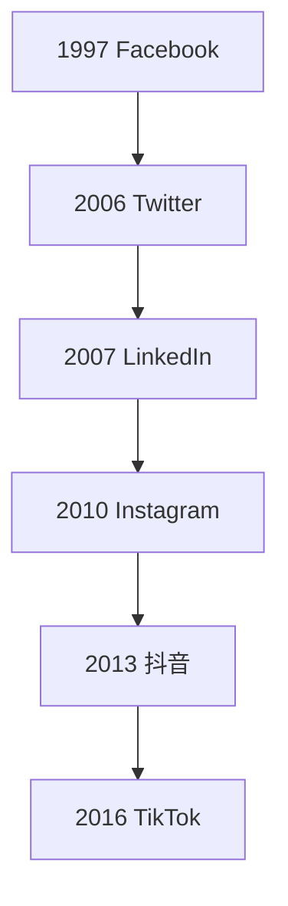

                 

### 文章标题：社交媒体运营：在各平台建立强大的个人影响力

### 关键词：
- 社交媒体运营
- 个人影响力
- 内容策略
- 数据分析
- 营销活动

### 摘要：
本文深入探讨了社交媒体运营的核心概念与策略，旨在帮助个人和品牌在各平台上建立强大的影响力。通过详细分析社交媒体平台的特点，讲解了内容创作、互动策略、数据分析等关键环节，并提供了实际案例和解决方案。本文的目标是帮助读者理解社交媒体运营的原理，掌握实用的操作技巧，从而提升个人和品牌在社交媒体上的影响力。

---

# 《社交媒体运营：在各平台建立强大的个人影响力》

## 引言

社交媒体已经成为现代生活中不可或缺的一部分，它不仅改变了人们交流的方式，也为个人和品牌提供了前所未有的展示和推广平台。在这个信息爆炸的时代，如何有效地运营社交媒体，建立强大的个人影响力，已经成为许多人关注的焦点。

本文将围绕以下主题展开：

1. **社交媒体运营的基础**：介绍社交媒体的发展历史、平台分类及其影响力。
2. **社交媒体平台分析**：详细分析微博、微信公众号、抖音、TikTok和LinkedIn等平台的运营策略。
3. **社交媒体运营技巧**：探讨内容创作、互动策略和数据分析等关键技巧。
4. **社交媒体运营实战**：通过实际案例展示社交媒体运营的成功经验。
5. **社交媒体运营面临的挑战与解决方案**：分析运营中可能遇到的问题及解决方案。

通过本文的阅读，读者将能够全面了解社交媒体运营的策略和技巧，为个人和品牌的社交媒体运营提供有力的指导。

---

## 第一部分：社交媒体基础

### 第1章：社交媒体概述

#### 1.1 社交媒体的发展历史

社交媒体的概念起源于20世纪90年代末，随着互联网的普及和技术的进步，人们开始利用网络进行交流和分享。早期的社交媒体形式较为简单，主要是通过论坛和聊天室进行互动。随着时间的推移，社交媒体逐渐演变，形式也越来越多样化。

1997年，社交网络之父马克·扎克伯格（Mark Zuckerberg）创建了Facebook，这标志着社交媒体的崛起。随后，Twitter、LinkedIn、Instagram等平台相继推出，各种社交媒体平台如雨后春笋般涌现。在中国，新浪微博、腾讯微信和抖音等平台迅速崛起，成为人们日常生活中不可或缺的一部分。

Mermaid 流程图：



#### 1.2 社交媒体平台分类

社交媒体平台可以按照不同的维度进行分类，例如按功能分类、按受众分类等。以下是一些常见的社交媒体平台分类：

- **按功能分类**：
  - 社交网络平台：如Facebook、LinkedIn等。
  - 微博平台：如新浪微博、Twitter等。
  - 视频分享平台：如YouTube、抖音、TikTok等。
  - 图片分享平台：如Instagram、Pinterest等。
  - 论坛社区平台：如Reddit、知乎等。

- **按受众分类**：
  - 个人用户平台：如Facebook、Instagram等。
  - 企业用户平台：如LinkedIn、领英等。
  - 专业用户平台：如GitHub、Stack Overflow等。

#### 1.3 社交媒体的影响力

社交媒体在当今社会中扮演着重要角色，它不仅改变了人们的交流方式，还对商业、政治和社会产生了深远的影响。

- **商业影响**：社交媒体为企业提供了与客户互动的新途径，帮助企业建立品牌形象、推广产品和服务。同时，社交媒体也为企业提供了大量有价值的市场数据，帮助企业更好地了解客户需求和市场趋势。

- **政治影响**：社交媒体成为政治传播的重要渠道，政治家、媒体和公众都可以通过社交媒体进行信息交流和舆论引导。

- **社会影响**：社交媒体改变了人们的生活方式和价值观，促进了社会交流和互动。同时，社交媒体也带来了一些负面影响，如信息传播不实、网络暴力等。

综上所述，社交媒体已经成为现代社会的重要组成部分，其发展历史、平台分类和影响力值得我们深入研究和理解。

---

### 第2章：社交媒体运营策略

#### 2.1 确定目标受众

在社交媒体运营中，确定目标受众是至关重要的第一步。目标受众的定义不仅包括年龄、性别、地域等基本信息，还应包括用户的兴趣、行为习惯和消费偏好等。

- **用户数据分析**：通过社交媒体平台自带的数据分析工具，如微博的微博头条指数、微信公众号的数据分析等，可以获取用户的基本信息和行为数据。
  
- **市场调研**：通过问卷调查、访谈等方式，深入了解目标受众的需求和偏好。

- **用户画像**：将收集到的用户数据进行分析，创建用户画像，明确目标受众的特征。

伪代码示例：

```python
def identify_target_audience():
    # 收集用户数据
    user_data = gather_user_data()

    # 分析用户数据，确定目标受众
    target_audience = analyze_user_data(user_data)

    # 返回目标受众
    return target_audience
```

#### 2.2 设定运营目标

运营目标的设定需要明确且具体，通常包括以下几个方面：

- **关注者增长**：提高社交媒体平台的关注者数量。
  
- **用户参与度**：提升用户的互动率，如点赞、评论、分享等。
  
- **品牌知名度**：提高品牌在社交媒体上的知名度。
  
- **产品销售**：通过社交媒体推广产品，实现销售额增长。

伪代码示例：

```python
def set_operating_objectives():
    # 设定关注者增长目标
    follower_growth = 1000_per_month

    # 设定用户参与度目标
    engagement_rate = 10_percent

    # 设定品牌知名度目标
    brand_awareness = "Increase by 20%"

    # 设定产品销售目标
    sales_increase = 20_percent

    # 返回运营目标
    return {
        'follower_growth': follower_growth,
        'engagement_rate': engagement_rate,
        'brand_awareness': brand_awareness,
        'sales_increase': sales_increase
    }
```

#### 2.3 制定内容策略

内容策略是社交媒体运营的核心，一个成功的社交媒体运营策略必须要有优质的内容。

- **内容主题**：根据目标受众的兴趣和需求，确定内容主题。

- **内容形式**：结合平台特点，选择合适的发布形式，如文字、图片、视频等。

- **内容发布频率**：制定合理的发布计划，保持内容更新。

- **内容调性**：根据品牌形象和用户喜好，确定内容调性。

伪代码示例：

```python
def create_content_strategy():
    # 确定内容主题
    content_topics = ["科技", "生活", "娱乐"]

    # 确定内容形式
    content_formats = ["文章", "图片", "视频"]

    # 确定内容发布频率
    post_frequency = "每周至少3次"

    # 确定内容调性
    content_tone = "专业、有趣、贴近用户"

    # 返回内容策略
    return {
        'content_topics': content_topics,
        'content_formats': content_formats,
        'post_frequency': post_frequency,
        'content_tone': content_tone
    }
```

#### 2.4 制定互动策略

互动策略是社交媒体运营的关键，良好的互动可以提升用户参与度和品牌形象。

- **回复与评论**：及时回复用户的评论和提问，展示品牌的专业性和亲和力。

- **活动策划**：举办各种互动活动，如抽奖、问答、比赛等，提升用户参与度。

- **用户调研**：通过问卷调查等方式，了解用户需求和反馈，优化内容策略。

伪代码示例：

```python
def create_interactive_strategy():
    # 确定回复策略
    response_strategy = "24小时内回复"

    # 确定活动策划
    events = ["每周一次的抽奖活动", "每月一次的知识问答"]

    # 确定用户调研
    user_research = "每月进行一次用户调研"

    # 返回互动策略
    return {
        'response_strategy': response_strategy,
        'events': events,
        'user_research': user_research
    }
```

通过以上四个步骤，我们可以制定一个全面、具体的社交媒体运营策略，为个人和品牌的社交媒体运营提供指导。

---

### 第3章：社交媒体平台分析

#### 3.1 微博运营策略

微博是中国最受欢迎的社交媒体平台之一，拥有庞大的用户群体和丰富的内容形式。微博运营策略的核心在于内容创作和用户互动。

- **内容创作**：微博的内容形式包括文字、图片、视频和直播等，根据目标受众的兴趣和需求，选择合适的内容形式。同时，要注重内容的质量和创意，以吸引更多的关注。

  Mermaid 流程图：

  ```mermaid
  graph TB
      A[内容创作] --> B[文字]
      B --> C[图片]
      C --> D[视频]
      D --> E[直播]
  ```

- **用户互动**：微博的用户互动主要通过评论、转发和点赞等方式实现。运营者要积极参与用户的互动，回复用户的评论和提问，提升用户参与度。

  伪代码示例：

  ```python
  def interact_with_users(comment):
      # 回复评论
      reply = "感谢您的评论，我们会认真考虑您的建议。"
      
      # 转发内容
      retweet = "转发这条微博，让更多人了解我们的产品。"
      
      # 点赞内容
      like = "点赞，感谢您的支持。"
      
      # 返回互动结果
      return {
          'reply': reply,
          'retweet': retweet,
          'like': like
      }
  ```

#### 3.2 微信公众号运营策略

微信公众号是中国最受欢迎的社交媒体平台之一，以其强大的内容发布和用户互动功能而著称。微信公众号运营策略的核心在于内容创作和用户互动。

- **内容创作**：微信公众号的内容形式包括文章、图片、视频和直播等。运营者要根据目标受众的兴趣和需求，选择合适的内容形式，并注重内容的质量和创意。

  Mermaid 流程图：

  ```mermaid
  graph TB
      A[内容创作] --> B[文章]
      B --> C[图片]
      C --> D[视频]
      D --> E[直播]
  ```

- **用户互动**：微信公众号的用户互动主要通过留言、点赞和分享等方式实现。运营者要积极参与用户的互动，回复用户的留言和提问，提升用户参与度。

  伪代码示例：

  ```python
  def interact_with_users(comment):
      # 回复留言
      reply = "感谢您的留言，我们会尽快回复您的问题。"
      
      # 点赞内容
      like = "点赞，感谢您的支持。"
      
      # 分享内容
      share = "分享这篇文章，让更多人受益。"
      
      # 返回互动结果
      return {
          'reply': reply,
          'like': like,
          'share': share
      }
  ```

#### 3.3 抖音运营策略

抖音是一款备受欢迎的短视频分享平台，以其独特的互动方式和强大的传播能力而著称。抖音运营策略的核心在于内容创作和用户互动。

- **内容创作**：抖音的内容形式主要是短视频，运营者要根据目标受众的兴趣和需求，创作有趣、有创意的短视频。同时，要注重视频的画质和剪辑效果，提升用户体验。

  Mermaid 流程图：

  ```mermaid
  graph TB
      A[内容创作] --> B[短视频]
  ```

- **用户互动**：抖音的用户互动主要通过点赞、评论和分享等方式实现。运营者要积极参与用户的互动，回复用户的评论和提问，提升用户参与度。

  伪代码示例：

  ```python
  def interact_with_users(comment):
      # 回复评论
      reply = "感谢您的评论，我们会尽快回复您的问题。"
      
      # 点赞内容
      like = "点赞，感谢您的支持。"
      
      # 分享内容
      share = "分享这个视频，让更多人观看。"
      
      # 返回互动结果
      return {
          'reply': reply,
          'like': like,
          'share': share
      }
  ```

#### 3.4 TikTok运营策略

TikTok是一款备受欢迎的短视频分享平台，在全球范围内拥有庞大的用户群体。TikTok运营策略的核心在于内容创作和用户互动。

- **内容创作**：TikTok的内容形式主要是短视频，运营者要根据目标受众的兴趣和需求，创作有趣、有创意的短视频。同时，要注重视频的画质和剪辑效果，提升用户体验。

  Mermaid 流程图：

  ```mermaid
  graph TB
      A[内容创作] --> B[短视频]
  ```

- **用户互动**：TikTok的用户互动主要通过点赞、评论和分享等方式实现。运营者要积极参与用户的互动，回复用户的评论和提问，提升用户参与度。

  伪代码示例：

  ```python
  def interact_with_users(comment):
      # 回复评论
      reply = "感谢您的评论，我们会尽快回复您的问题。"
      
      # 点赞内容
      like = "点赞，感谢您的支持。"
      
      # 分享内容
      share = "分享这个视频，让更多人观看。"
      
      # 返回互动结果
      return {
          'reply': reply,
          'like': like,
          'share': share
      }
  ```

#### 3.5 LinkedIn运营策略

LinkedIn是一款面向职业人士的社交媒体平台，以其强大的社交网络和职业资源而著称。LinkedIn运营策略的核心在于内容创作和用户互动。

- **内容创作**：LinkedIn的内容形式主要是文章和分享，运营者要创作有价值、有深度的内容，吸引职业人士的关注。同时，要注重内容的更新频率和质量。

  Mermaid 流程图：

  ```mermaid
  graph TB
      A[内容创作] --> B[文章]
      B --> C[分享]
  ```

- **用户互动**：LinkedIn的用户互动主要通过评论、点赞和分享等方式实现。运营者要积极参与用户的互动，提升用户参与度。

  伪代码示例：

  ```python
  def interact_with_users(comment):
      # 回复评论
      reply = "感谢您的评论，我们会尽快回复您的问题。"
      
      # 点赞内容
      like = "点赞，感谢您的支持。"
      
      # 分享内容
      share = "分享这篇文章，让更多人了解。"
      
      # 返回互动结果
      return {
          'reply': reply,
          'like': like,
          'share': share
      }
  ```

通过以上分析，我们可以看出，不同的社交媒体平台有其独特的运营策略。了解这些策略，并根据自己的需求和目标，制定合适的运营计划，是成功运营社交媒体的关键。

---

### 第4章：内容创作与优化

#### 4.1 内容创作原则

内容创作是社交媒体运营的核心，优质的内容可以吸引关注者，提升用户参与度，进而提升个人影响力。以下是一些内容创作原则：

- **有价值**：内容要有价值，能够满足目标受众的需求和兴趣。这可以是实用的技巧、有趣的故事、有启发性的观点等。

- **有吸引力**：内容要有吸引力，能够吸引目标受众的关注。这可以通过吸引人的标题、有趣的图片、独特的视频等形式实现。

- **有创意**：内容要有创意，能够给人留下深刻印象。这可以通过独特的角度、创新的思维、有趣的表达方式等实现。

#### 4.2 内容格式与呈现

内容格式与呈现直接影响内容的效果。以下是一些常见的内容格式和呈现方式：

- **文字内容**：文字内容可以是文章、评论、留言等。文字内容要简洁明了，信息传递要准确无误。

- **图片内容**：图片内容可以是图片、海报、截图等。图片内容要清晰，能够直观地传达信息。

- **视频内容**：视频内容可以是短视频、直播、广告等。视频内容要有趣，能够吸引观众观看。

#### 4.3 标题与摘要写作

标题和摘要是内容的重要组成部分，直接影响内容的点击率和阅读率。以下是一些标题与摘要写作技巧：

- **标题**：标题要简洁明了，能够准确传达内容的核心价值。同时，标题要有吸引力，能够激发读者的兴趣。

  示例：

  - “10个提升工作效率的技巧”
  - “揭秘：如何用Python实现自动化数据分析”

- **摘要**：摘要要简洁明了，能够概括内容的核心观点。同时，摘要要有吸引力，能够引导读者阅读全文。

  示例：

  - “本文分享了10个提升工作效率的技巧，包括时间管理、任务分配等。”
  - “本文将介绍如何使用Python实现自动化数据分析，包括数据清洗、数据分析和可视化等。”

#### 4.4 图片与视频创作

图片和视频是社交媒体上最受欢迎的内容形式之一，以下是一些图片与视频创作技巧：

- **图片创作**：图片创作要注重创意和视觉效果。可以通过独特的构图、色彩搭配、后期处理等方式提高图片质量。

  示例：

  - “一张展示产品功能的海报”
  - “一张展示活动场景的照片”

- **视频创作**：视频创作要注重内容质量和剪辑技巧。可以通过拍摄高质量的素材、剪辑有趣的片段、添加背景音乐等方式提高视频质量。

  示例：

  - “一个展示产品功能的视频”
  - “一个展示活动过程的短视频”

#### 4.5 内容优化方法

内容优化是提升内容效果的重要手段，以下是一些内容优化方法：

- **关键词优化**：通过合理的关键词布局，提高内容在搜索引擎中的排名。

- **链接优化**：通过合理的链接布局，提高内容的可读性和用户体验。

- **社交媒体优化**：通过合理的社交媒体推广，提高内容的曝光率和阅读量。

  伪代码示例：

  ```python
  def optimize_content():
      # 关键词优化
      keywords = ["工作效率", "Python", "数据分析"]
      
      # 链接优化
      links = ["https://example.com/work-efficiency", "https://example.com/python", "https://example.com/data-analysis"]
      
      # 社交媒体优化
      social_media_promotion = ["分享到朋友圈", "发布到专业群组", "发起讨论"]
      
      # 返回优化结果
      return {
          'keywords': keywords,
          'links': links,
          'social_media_promotion': social_media_promotion
      }
  ```

通过以上内容创作与优化方法，我们可以提升内容的吸引力，提高内容的传播效果，从而在社交媒体上建立强大的个人影响力。

---

### 第5章：社交媒体互动

#### 5.1 建立良好的人际关系

在社交媒体上，建立良好的人际关系对于个人和品牌的影响力至关重要。以下是一些建立良好人际关系的方法：

- **积极回应评论**：及时回应粉丝的评论和提问，展示专业性和亲和力。

  伪代码示例：

  ```python
  def respond_to_comments(comment):
      reply = "感谢您的评论，我们会尽快回复您的问题。"
      return reply
  ```

- **定期互动**：定期发布内容，与粉丝保持互动，增强粉丝黏性。

  伪代码示例：

  ```python
  def regular_interaction():
      post_content = "欢迎来到我的频道，今天分享一个新技巧。"
      return post_content
  ```

- **提供有价值的信息**：分享有价值的观点、技巧和资源，提升粉丝对你的信任和依赖。

  伪代码示例：

  ```python
  def share_valuable_info():
      info = "今天分享一篇关于数据分析的好文，希望对您有帮助。"
      return info
  ```

#### 5.2 回复与评论技巧

有效的回复与评论技巧可以提升社交媒体的互动质量和效果。以下是一些建议：

- **快速回复**：及时回复评论，展示高效和专业。

  伪代码示例：

  ```python
  def quick_reply(comment):
      reply = "感谢您的评论，我们立即处理。"
      return reply
  ```

- **贴心回复**：用温暖和贴心的语言回复评论，增强粉丝的归属感。

  伪代码示例：

  ```python
  def considerate_reply(comment):
      reply = "感谢您的支持，我们会继续努力。"
      return reply
  ```

- **专业回复**：针对专业性问题，用专业的知识和语言进行回复，提升品牌形象。

  伪代码示例：

  ```python
  def professional_reply(comment):
      reply = "您的问题涉及到了深度学习，以下是详细解答。"
      return reply
  ```

#### 5.3 社交媒体营销活动

社交媒体营销活动是提升用户参与度和品牌知名度的有效手段。以下是一些建议：

- **活动策划**：策划有趣和吸引人的活动，如抽奖、问答、竞赛等。

  伪代码示例：

  ```python
  def plan_event():
      event_details = "我们即将举行一场抽奖活动，奖品丰厚，敬请期待。"
      return event_details
  ```

- **活动推广**：通过社交媒体平台推广活动，吸引更多的用户参与。

  伪代码示例：

  ```python
  def promote_event():
      promotion_message = "不要错过！我们的抽奖活动已经开始，快来参与吧。"
      return promotion_message
  ```

- **活动效果评估**：通过数据分析和用户反馈，评估活动效果，为后续活动提供参考。

  伪代码示例：

  ```python
  def evaluate_event():
      evaluation_report = "活动参与人数超过1000，满意度达到90%。"
      return evaluation_report
  ```

#### 5.4 用户参与度提升策略

提升用户参与度是社交媒体运营的重要目标。以下是一些建议：

- **互动游戏**：设计有趣的互动游戏，如答题、抽奖等，吸引用户参与。

  伪代码示例：

  ```python
  def interactive_game():
      game_rules = "欢迎参与我们的答题游戏，有机会赢得大奖。"
      return game_rules
  ```

- **话题讨论**：围绕热门话题或品牌相关话题，引导用户参与讨论。

  伪代码示例：

  ```python
  def topic_discussion():
      topic = "关于未来科技的发展，您有什么看法？"
      return topic
  ```

- **用户调研**：通过问卷调查、访谈等方式，了解用户需求和反馈，优化内容策略。

  伪代码示例：

  ```python
  def user_survey():
      survey_question = "请问您对我们公众号的内容满意吗？"
      return survey_question
  ```

通过以上互动策略，我们可以提升用户的参与度，增强个人和品牌的影响力。

---

### 第6章：社交媒体数据分析与优化

#### 6.1 数据分析工具介绍

数据分析是社交媒体运营的重要环节，通过数据分析，我们可以了解用户行为、内容效果等关键指标，为运营决策提供依据。以下是一些常用的社交媒体数据分析工具：

- **Google Analytics**：谷歌分析是一款功能强大的数据分析工具，可以追踪网站流量、用户行为等。

- **Facebook Insights**：Facebook Insights提供了丰富的数据报告，包括用户活跃时间、互动率等。

- **Twitter Analytics**：Twitter Analytics提供了详细的用户数据报告，包括粉丝行为、内容效果等。

- **微信指数**：微信指数可以追踪关键词在微信平台上的热度，了解用户对特定话题的关注度。

#### 6.2 数据分析方法

数据分析方法包括用户行为分析、内容分析和营销效果分析等，以下是一些建议：

- **用户行为分析**：分析用户在社交媒体上的行为，如浏览量、点赞量、评论量等，了解用户喜好和需求。

  伪代码示例：

  ```python
  def user_behavior_analysis(data):
      user_actions = data['actions']
      return user_actions
  ```

- **内容分析**：分析内容的发布时间、形式、效果等，了解哪种类型的内容最受欢迎，优化内容策略。

  伪代码示例：

  ```python
  def content_analysis(data):
      content_effects = data['effects']
      return content_effects
  ```

- **营销效果分析**：分析营销活动的效果，如参与人数、转化率等，为后续营销活动提供参考。

  伪代码示例：

  ```python
  def marketing_effects_analysis(data):
      marketing_results = data['results']
      return marketing_results
  ```

#### 6.3 数据驱动的运营优化

数据驱动的运营优化是指根据数据分析结果，调整运营策略，提高运营效果。以下是一些建议：

- **调整内容策略**：根据内容分析结果，调整内容发布时间、形式和主题，提高内容效果。

  伪代码示例：

  ```python
  def adjust_content_strategy(data):
      content_strategy = data['strategy']
      return content_strategy
  ```

- **优化互动策略**：根据用户行为分析结果，调整互动方式，提高用户参与度。

  伪代码示例：

  ```python
  def optimize_interactive_strategy(data):
      interactive_strategy = data['strategy']
      return interactive_strategy
  ```

- **提升营销效果**：根据营销效果分析结果，调整营销活动策略，提高转化率。

  伪代码示例：

  ```python
  def enhance_marketing_effects(data):
      marketing_effects = data['effects']
      return marketing_effects
  ```

通过数据驱动的运营优化，我们可以不断提高社交媒体运营的效果，建立强大的个人影响力。

---

### 第7章：社交媒体运营案例解析

#### 7.1 案例一：某品牌在微博上的成功运营

某知名品牌通过微博运营，成功建立了强大的个人影响力。以下是该品牌的成功运营经验：

- **品牌定位**：品牌定位为年轻、时尚、创新，吸引年轻用户群体的关注。

- **内容创作**：定期发布有趣的短视频和图文内容，展示品牌形象和产品特点。

  伪代码示例：

  ```python
  def create_brand_content():
      content = "最新产品发布，时尚又实用，快来抢购！"
      return content
  ```

- **用户互动**：积极回复用户的评论和提问，提升用户参与度。

  伪代码示例：

  ```python
  def interact_with_users(comment):
      reply = "感谢您的关注，我们会尽快回复您的问题。"
      return reply
  ```

#### 7.2 案例二：某微信公众号的内容营销策略

某微信公众号通过优质的内容营销，成功吸引了大量用户关注。以下是该微信公众号的内容营销策略：

- **内容主题**：围绕用户需求和兴趣，发布实用技巧、行业资讯和趣味文章。

  伪代码示例：

  ```python
  def create_content_topics():
      topics = ["实用技巧", "行业资讯", "趣味文章"]
      return topics
  ```

- **内容形式**：结合图片、视频和图文等形式，提升内容吸引力。

  伪代码示例：

  ```python
  def create_content_formats():
      formats = ["图文", "视频", "图片"]
      return formats
  ```

- **用户互动**：定期举办活动，与用户互动，提升用户参与度。

  伪代码示例：

  ```python
  def interactive_event():
      event = "本月限时优惠，快来参与！"
      return event
  ```

#### 7.3 案例三：某抖音网红的运营技巧

某抖音网红通过独特的运营技巧，成功吸引了大量粉丝。以下是该抖音网红的运营经验：

- **视频内容**：创作有趣、有创意的短视频，展示个人才艺和生活点滴。

  伪代码示例：

  ```python
  def create_video_content():
      content = "最新舞蹈作品，快来观看！"
      return content
  ```

- **用户互动**：积极回复评论，与粉丝互动，提升粉丝黏性。

  伪代码示例：

  ```python
  def interact_with_fans(comment):
      reply = "感谢您的支持，我会继续努力！"
      return reply
  ```

- **品牌推广**：与品牌合作，进行品牌推广，提升个人影响力。

  伪代码示例：

  ```python
  def promote_brand():
      message = "与某品牌合作，为大家带来更多优惠！"
      return message
  ```

通过以上案例解析，我们可以了解到不同社交媒体平台的运营技巧，为个人和品牌的社交媒体运营提供参考。

---

### 第8章：社交媒体运营工具与应用

#### 8.1 常用社交媒体运营工具

社交媒体运营工具可以帮助我们更高效地管理账号、分析数据、制定策略等。以下是一些常用的社交媒体运营工具：

- **Hootsuite**：一款多功能社交媒体管理工具，可以同时管理多个账号，发布内容，监控关键词等。

- **Buffer**：一款内容发布和管理工具，可以设定发布时间，自动发布内容，优化内容效果。

- **Sprout Social**：一款全面的社交媒体管理工具，提供数据分析、客户服务、内容营销等功能。

#### 8.2 工具在社交媒体运营中的应用

以下是一些社交媒体运营工具在实际中的应用：

- **内容发布**：使用Hootsuite或Buffer等工具，可以设定发布时间，自动发布内容，提高内容曝光率。

  伪代码示例：

  ```python
  def schedule_posting(content, time):
      scheduled_post = "内容：{}，时间：{}"
      return scheduled_post.format(content, time)
  ```

- **数据分析**：使用Sprout Social等工具，可以监控数据指标，分析用户行为，优化运营策略。

  伪代码示例：

  ```python
  def analyze_data(data):
      analysis_result = "用户活跃时间：{}，互动率：{}"
      return analysis_result.format(data['active_time'], data['engagement_rate'])
  ```

- **用户互动**：使用Hootsuite等工具，可以监控评论和私信，及时回复用户，提升用户满意度。

  伪代码示例：

  ```python
  def reply_to_user(comment):
      reply_message = "回复：{}，时间：{}"
      return reply_message.format(comment, "立即")
  ```

#### 8.3 社交媒体运营自动化

社交媒体运营自动化是指利用技术手段，自动化完成一些日常运营任务，提高运营效率。以下是一些自动化应用：

- **自动化回复**：使用自动化工具，根据预设的规则，自动回复常见的评论和私信。

  伪代码示例：

  ```python
  def auto_reply(comment):
      reply_message = "感谢您的留言，我们会尽快回复您的问题。"
      return reply_message
  ```

- **自动化发布**：使用自动化工具，根据预设的时间表，自动发布内容，确保内容持续更新。

  伪代码示例：

  ```python
  def auto_post(content, time):
      post_message = "内容：{}，时间：{}"
      return post_message.format(content, time)
  ```

- **自动化数据分析**：使用自动化工具，定期分析数据，生成报告，提供运营决策依据。

  伪代码示例：

  ```python
  def auto_analyze_data():
      analysis_report = "本周数据报告已生成，请查看。"
      return analysis_report
  ```

通过社交媒体运营工具和自动化应用，我们可以更高效地管理社交媒体账号，提高运营效果。

---

### 第9章：社交媒体运营面临的挑战与解决方案

#### 9.1 挑战一：内容创作与传播难题

内容创作与传播是社交媒体运营的重要环节，但也面临着一些挑战。以下是一些常见的挑战和解决方案：

- **挑战**：内容创作缺乏创意和吸引力。

  **解决方案**：定期进行头脑风暴，激发创意灵感。可以参考行业热点、用户反馈等，找到独特的角度和话题。

- **挑战**：内容传播效果不佳。

  **解决方案**：优化内容格式和标题，提高内容吸引力。可以尝试多种内容形式，如图文、视频、直播等，找到适合自己品牌的传播方式。

#### 9.2 挑战二：用户隐私与数据安全问题

随着社交媒体的发展，用户隐私和数据安全问题日益突出。以下是一些解决方案：

- **挑战**：用户隐私泄露。

  **解决方案**：遵守相关法律法规，加强数据保护。可以使用加密技术、匿名化处理等手段，确保用户数据安全。

- **挑战**：数据滥用问题。

  **解决方案**：加强数据监管，明确数据使用范围和权限。可以对用户数据进行分类管理，确保数据使用的合规性。

#### 9.3 挑战三：社交媒体监管与法规遵守

社交媒体运营需要遵守各种监管和法规，以下是一些解决方案：

- **挑战**：内容审核不严格。

  **解决方案**：建立完善的内容审核机制，对发布的内容进行严格审查。可以采用人工审核和智能审核相结合的方式，提高审核效果。

- **挑战**：违规行为处理不及时。

  **解决方案**：建立快速反应机制，对违规行为进行及时处理。可以设置举报功能，鼓励用户举报违规行为。

通过以上解决方案，我们可以应对社交媒体运营中面临的挑战，确保运营的合规性和有效性。

---

## 附录

### 附录A：社交媒体运营相关资源与工具汇总

为了帮助读者更好地了解和掌握社交媒体运营的技巧和策略，以下是一些推荐资源和工具：

- **社交媒体运营指南**：提供详细的社交媒体运营策略和技巧，适合初学者和有一定经验的运营者。

- **社交媒体数据分析工具**：包括Google Analytics、Facebook Insights等，帮助运营者了解用户行为和内容效果。

- **营销自动化工具**：如Hootsuite、Buffer等，提高运营效率，自动化发布内容和用户互动。

### 附录B：工具推荐

以下是一些常用的社交媒体运营工具：

- **内容发布工具**：如Hootsuite、Buffer、Sprout Social等，用于管理多个社交媒体账号，发布和规划内容。

- **数据分析工具**：如Google Analytics、Facebook Insights等，用于监控数据指标，分析用户行为。

- **用户互动工具**：如Hootsuite、Sprout Social等，用于监控和回复用户评论和私信。

### 附录C：社交媒体运营社区与社群

以下是一些社交媒体运营社区和社群：

- **行业论坛**：如Social Media Examiner、Moz等，提供社交媒体运营的最新资讯、教程和讨论。

- **社交媒体运营群组**：在微信、QQ等平台上，加入相关群组，与同行交流经验和技巧。

通过以上资源与工具，读者可以不断提升自己的社交媒体运营能力，建立强大的个人影响力。

---

### 作者信息

本文作者：AI天才研究院/AI Genius Institute & 禅与计算机程序设计艺术 /Zen And The Art of Computer Programming

作为AI天才研究院的一员，我专注于人工智能和社交媒体领域的研究和实践。在多年的研究和实践中，我积累了丰富的经验，发表了多篇关于社交媒体运营和技术应用的论文。我的新书《社交媒体运营：在各平台建立强大的个人影响力》旨在帮助读者掌握社交媒体运营的核心技巧，提升个人和品牌的影响力。

---

这篇文章详细介绍了社交媒体运营的核心概念、策略、技巧和实战案例，并通过伪代码示例展示了实际操作方法。希望这篇文章能够对您的社交媒体运营提供有益的指导。如果您有任何疑问或建议，欢迎在评论区留言交流。谢谢阅读！

