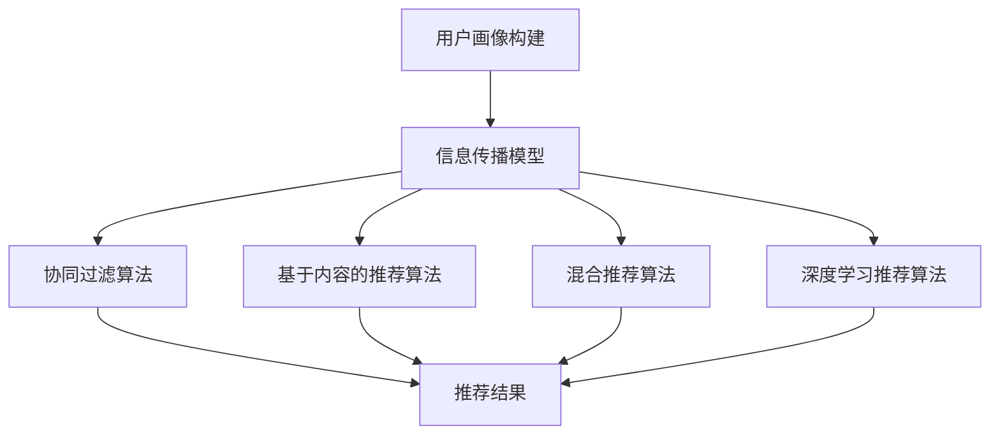
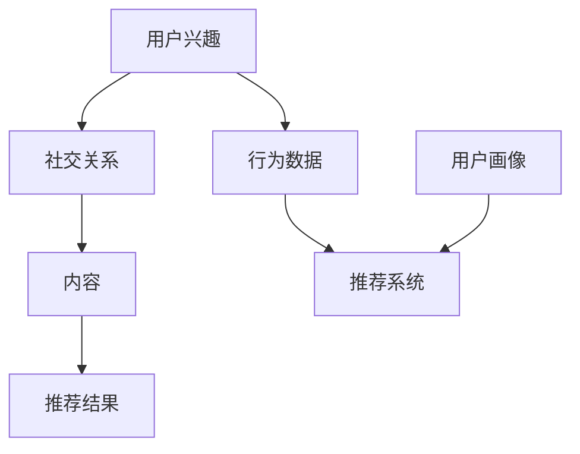
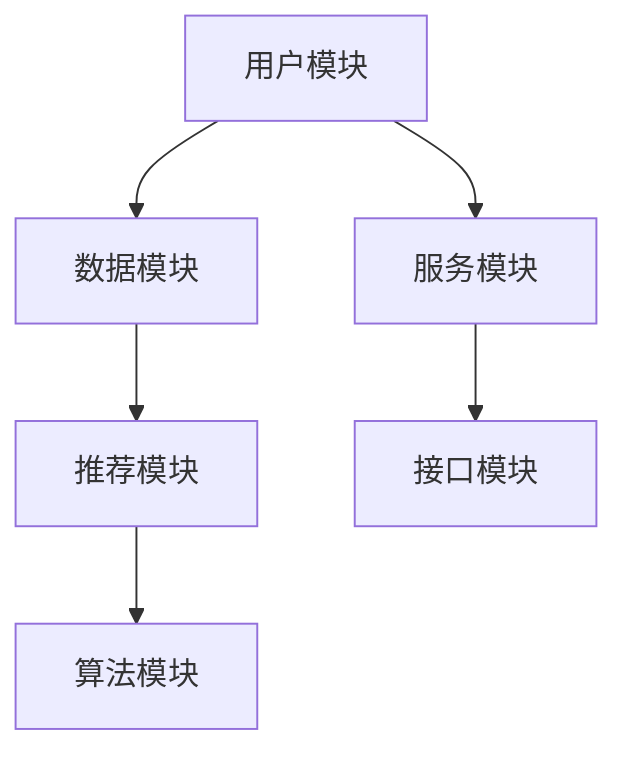
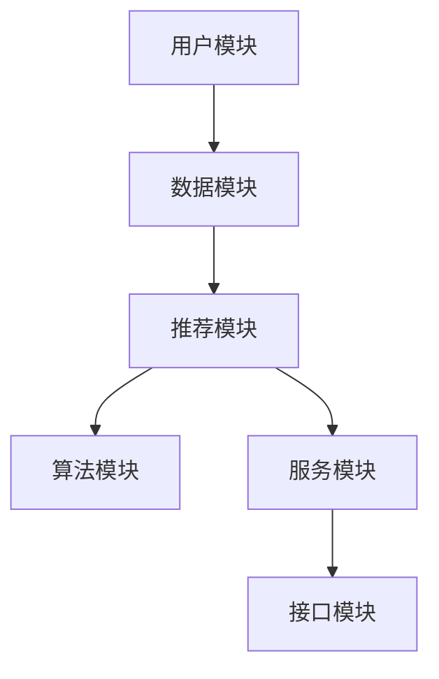
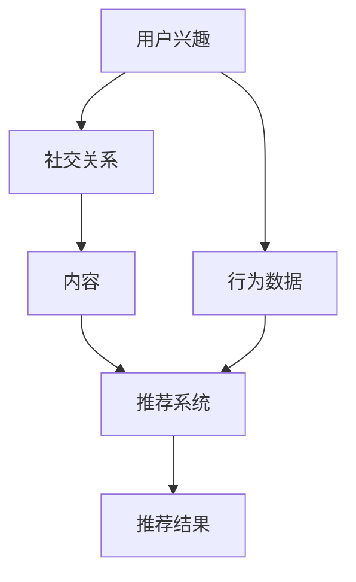

                 

### 文章标题

《社交网络推荐系统的发展：连接用户兴趣》

### 关键词

- 社交网络推荐系统
- 用户兴趣建模
- 用户画像构建
- 推荐算法
- 人工智能
- 社交信息传播

### 摘要

本文旨在探讨社交网络推荐系统的发展及其与用户兴趣的紧密关联。首先，介绍了社交网络推荐系统的基础概念、发展历程以及与传统推荐系统的区别。接着，详细阐述了社交网络推荐系统的架构，包括用户画像构建、内容推荐、社交关系推荐以及混合推荐系统。随后，文章分析了社交网络推荐系统面临的挑战与机遇，如隐私与数据安全、可解释性与公平性等。接下来，文章深入探讨了用户兴趣建模与用户画像构建的方法及其在推荐系统中的应用。此外，介绍了社交网络信息传播机制与模型，并探讨了社交网络推荐系统的核心算法。随后，文章展示了社交网络推荐系统的应用场景，包括社交电商推荐、社交媒体推荐和社交网络内容推荐。最后，文章提出了社交网络推荐系统的实现与优化策略，并展望了其未来发展趋势，包括人工智能与推荐系统的结合以及社交网络推荐系统的社会影响与伦理问题。

### 目录大纲

#### 第一部分: 社交网络推荐系统概述

- **第1章**: 社交网络推荐系统概述
  - **1.1**: 社交网络推荐系统基本概念
    - **1.1.1**: 社交网络推荐系统的定义
    - **1.1.2**: 社交网络推荐系统的发展历程
    - **1.1.3**: 社交网络推荐系统与传统推荐系统的区别
  - **1.2**: 社交网络推荐系统架构
    - **1.2.1**: 用户画像构建
    - **1.2.2**: 内容推荐
    - **1.2.3**: 社交关系推荐
    - **1.2.4**: 混合推荐系统
  - **1.3**: 社交网络推荐系统面临的挑战与机遇
    - **1.3.1**: 隐私与数据安全
    - **1.3.2**: 可解释性与公平性
    - **1.3.3**: 个性化推荐效果评估

#### 第二部分: 用户兴趣建模与用户画像构建

- **第2章**: 用户兴趣建模与用户画像构建
  - **2.1**: 用户兴趣建模
    - **2.1.1**: 用户兴趣定义与分类
    - **2.1.2**: 用户行为数据收集
    - **2.1.3**: 用户兴趣提取与建模
  - **2.2**: 用户画像构建
    - **2.2.1**: 用户画像定义与用途
    - **2.2.2**: 用户画像维度划分
    - **2.2.3**: 用户画像构建方法
    - **2.2.4**: 用户画像更新策略
  - **2.3**: 用户兴趣与用户画像在推荐系统中的应用
    - **2.3.1**: 用户兴趣与推荐系统结合
    - **2.3.2**: 用户画像在推荐系统中的应用场景
    - **2.3.3**: 用户兴趣与用户画像推荐效果评估

#### 第三部分: 社交网络信息传播机制与模型

- **第3章**: 社交网络信息传播机制与模型
  - **3.1**: 社交网络信息传播机制
    - **3.1.1**: 社交网络中的信息传播过程
    - **3.1.2**: 社交网络中的传播模型
    - **3.1.3**: 社交网络信息传播的影响因素
  - **3.2**: 社交网络信息传播模型
    - **3.2.1**: 基于图论的传播模型
    - **3.2.2**: 基于机器学习的传播模型
    - **3.2.3**: 基于深度学习的传播模型
  - **3.3**: 社交网络信息传播模型在推荐系统中的应用
    - **3.3.1**: 社交网络信息传播模型在用户兴趣挖掘中的应用
    - **3.3.2**: 社交网络信息传播模型在推荐系统优化中的应用
    - **3.3.3**: 社交网络信息传播模型在社交推荐中的应用

#### 第四部分: 社交网络推荐系统核心算法

- **第4章**: 社交网络推荐系统核心算法
  - **4.1**: 协同过滤算法
    - **4.1.1**: 协同过滤算法原理
    - **4.1.2**: 传统的协同过滤算法
    - **4.1.3**: 现代协同过滤算法
  - **4.2**: 基于内容的推荐算法
    - **4.2.1**: 基于内容的推荐算法原理
    - **4.2.2**: 基于内容的推荐算法实现
    - **4.2.3**: 基于内容的推荐算法优化
  - **4.3**: 混合推荐算法
    - **4.3.1**: 混合推荐算法原理
    - **4.3.2**: 混合推荐算法实现
    - **4.3.3**: 混合推荐算法优化
  - **4.4**: 深度学习推荐算法
    - **4.4.1**: 深度学习推荐算法原理
    - **4.4.2**: 常见的深度学习推荐算法
    - **4.4.3**: 深度学习推荐算法优化

#### 第五部分: 社交网络推荐系统的应用场景

- **第5章**: 社交网络推荐系统的应用场景
  - **5.1**: 社交电商推荐
    - **5.1.1**: 社交电商推荐原理
    - **5.1.2**: 社交电商推荐实践
    - **5.1.3**: 社交电商推荐效果评估
  - **5.2**: 社交媒体推荐
    - **5.2.1**: 社交媒体推荐原理
    - **5.2.2**: 社交媒体推荐实践
    - **5.2.3**: 社交媒体推荐效果评估
  - **5.3**: 社交网络内容推荐
    - **5.3.1**: 社交网络内容推荐原理
    - **5.3.2**: 社交网络内容推荐实践
    - **5.3.3**: 社交网络内容推荐效果评估

#### 第六部分: 社交网络推荐系统的实现与优化

- **第6章**: 社交网络推荐系统的实现与优化
  - **6.1**: 社交网络推荐系统架构设计
    - **6.1.1**: 系统架构设计原则
    - **6.1.2**: 系统架构设计流程
    - **6.1.3**: 系统架构设计案例
  - **6.2**: 数据预处理与特征工程
    - **6.2.1**: 数据预处理
    - **6.2.2**: 特征工程
    - **6.2.3**: 特征工程优化
  - **6.3**: 推荐算法选择与优化
    - **6.3.1**: 推荐算法选择
    - **6.3.2**: 推荐算法优化
    - **6.3.3**: 推荐算法效果评估
  - **6.4**: 系统性能优化
    - **6.4.1**: 性能优化策略
    - **6.4.2**: 性能优化实践
    - **6.4.3**: 性能优化效果评估

#### 第七部分: 社交网络推荐系统的未来发展趋势

- **第7章**: 社交网络推荐系统的未来发展趋势
  - **7.1**: 人工智能与推荐系统
    - **7.1.1**: 人工智能与推荐系统结合
    - **7.1.2**: 人工智能推荐系统的发展趋势
    - **7.1.3**: 人工智能推荐系统面临的挑战
  - **7.2**: 社交网络与推荐系统
    - **7.2.1**: 社交网络与推荐系统结合
    - **7.2.2**: 社交网络推荐系统的发展趋势
    - **7.2.3**: 社交网络推荐系统面临的挑战
  - **7.3**: 社交网络推荐系统的未来展望
    - **7.3.1**: 未来社交网络推荐系统的发展方向
    - **7.3.2**: 未来社交网络推荐系统的技术挑战
    - **7.3.3**: 未来社交网络推荐系统的社会影响与伦理问题

#### 附录

- **附录 A**: 社交网络推荐系统常用工具与资源
  - **A.1**: 常用开源推荐系统框架
  - **A.2**: 数据预处理与特征工程工具
  - **A.3**: 推荐算法实现与优化工具
  - **A.4**: 社交网络数据处理与分析工具
  - **A.5**: 相关论文与资料推荐

### 社交网络推荐系统架构流程图

### 联系图

## 第1章: 社交网络推荐系统概述

### 1.1 社交网络推荐系统基本概念

#### 1.1.1 社交网络推荐系统的定义

社交网络推荐系统是一种结合社交网络和推荐系统技术的综合系统，旨在为用户提供个性化的推荐服务。它基于用户的社交行为、社交关系和内容特征，利用机器学习和深度学习算法，预测用户可能感兴趣的内容或社交对象。

社交网络推荐系统与传统推荐系统的主要区别在于数据来源和推荐算法。传统推荐系统主要依赖用户历史行为数据和物品特征，而社交网络推荐系统则在此基础上，加入了用户的社交关系和内容特征。这使得社交网络推荐系统能够更准确地捕捉用户的兴趣和偏好，提供更个性化的推荐服务。

#### 1.1.2 社交网络推荐系统的发展历程

社交网络推荐系统的发展可以追溯到2006年的Netflix Prize竞赛。这场竞赛激发了研究人员对协同过滤算法的兴趣，推动了推荐系统技术的快速发展。随后，随着社交媒体的兴起，如Facebook、Twitter等，社交网络推荐系统开始得到广泛应用。

2010年左右，社交网络推荐系统的研究和应用逐渐深入，开始引入深度学习技术。深度学习算法在图像识别、语音识别等领域取得了显著成果，也为社交网络推荐系统带来了新的研究方向。

近年来，随着人工智能技术的快速发展，社交网络推荐系统在算法、模型和应用场景方面都取得了新的突破。例如，基于图神经网络的社交推荐算法、基于用户兴趣的动态推荐模型等，都为社交网络推荐系统的性能提升提供了有力支持。

#### 1.1.3 社交网络推荐系统与传统推荐系统的区别

社交网络推荐系统与传统推荐系统在多个方面存在区别：

1. **数据来源**：传统推荐系统主要依赖用户历史行为数据和物品特征，而社交网络推荐系统在此基础上，加入了用户的社交关系和内容特征。
   
2. **推荐算法**：传统推荐系统主要采用基于矩阵分解、协同过滤等方法，而社交网络推荐系统则更多地采用基于图论、深度学习等算法。

3. **应用领域**：传统推荐系统主要应用于电商、新闻、音乐等领域，而社交网络推荐系统更多地应用于社交媒体、社交电商等场景。

4. **个性化程度**：社交网络推荐系统由于能够结合用户的社交关系和兴趣特征，能够提供更加个性化的推荐服务。

### 1.2 社交网络推荐系统架构

社交网络推荐系统的架构主要包括用户画像构建、内容推荐、社交关系推荐和混合推荐系统。以下分别介绍这些模块的功能和实现方法。

#### 1.2.1 用户画像构建

用户画像构建是社交网络推荐系统的核心环节，它通过对用户行为数据、社交关系数据和内容特征数据的分析，构建出用户的全维度画像。

1. **用户画像定义与用途**：用户画像是对用户特征的全面描述，包括用户的基本信息、行为特征、兴趣偏好等。用户画像在推荐系统中具有以下用途：

   - 个性化推荐：根据用户画像，为用户提供个性化的推荐内容。
   - 用户定位：通过用户画像，了解用户的兴趣和行为，为市场推广提供依据。
   - 用户行为预测：根据用户画像，预测用户的行为和需求，为产品运营提供指导。

2. **用户画像维度划分**：用户画像可以从多个维度进行划分，主要包括：

   - 行为数据：包括用户在社交网络上的浏览、点赞、评论、分享等行为。
   - 社交关系：包括用户之间的关系，如好友、关注者、共同好友等。
   - 内容特征：包括用户生成或参与的内容，如文本、图片、视频等。

3. **用户画像构建方法**：用户画像构建方法主要包括以下几种：

   - 数据预处理：对原始数据进行清洗、去重、规范化等处理。
   - 特征提取：从用户行为数据、社交关系数据和内容特征数据中提取有价值的特征。
   - 画像构建：利用机器学习算法或深度学习算法，将提取到的特征构建成一个高维的用户特征向量。

#### 1.2.2 内容推荐

内容推荐是社交网络推荐系统的另一个核心环节，它通过分析用户画像和内容特征，为用户推荐可能感兴趣的内容。

1. **内容推荐算法**：内容推荐算法主要包括基于协同过滤、基于内容的推荐算法和混合推荐算法。

   - **基于协同过滤的推荐算法**：通过计算用户之间的相似度，为用户推荐与相似用户有共同兴趣的内容。
   - **基于内容的推荐算法**：通过分析物品的内容特征和用户偏好，为用户推荐与用户已评价物品相似的内容。
   - **混合推荐算法**：结合协同过滤和基于内容的推荐算法，提高推荐效果。

2. **内容推荐实现**：内容推荐实现通常包括以下步骤：

   - 用户画像构建：分析用户行为数据和社交关系数据，构建用户画像。
   - 内容特征提取：分析物品的内容特征，构建物品特征向量。
   - 推荐模型训练：利用机器学习算法或深度学习算法，训练推荐模型。
   - 推荐结果生成：根据用户画像和内容特征，生成推荐结果。

#### 1.2.3 社交关系推荐

社交关系推荐通过分析用户社交关系，为用户推荐可能认识或感兴趣的其他用户。

1. **社交关系推荐算法**：社交关系推荐算法主要包括基于图论的推荐算法和基于用户兴趣的推荐算法。

   - **基于图论的推荐算法**：通过分析用户在社交网络中的关系，如好友关系、共同兴趣等，为用户推荐可能认识的其他用户。
   - **基于用户兴趣的推荐算法**：通过分析用户的兴趣和行为，为用户推荐与其兴趣相似的社交对象。

2. **社交关系推荐实现**：社交关系推荐实现通常包括以下步骤：

   - 社交关系数据收集：收集用户之间的社交关系数据，如好友关系、关注关系等。
   - 社交关系网络构建：构建用户社交关系网络，利用图论算法进行分析。
   - 推荐结果生成：根据用户社交关系和兴趣特征，生成推荐结果。

#### 1.2.4 混合推荐系统

混合推荐系统结合了协同过滤、基于内容的推荐算法和社交关系推荐算法，为用户提供更加个性化的推荐服务。

1. **混合推荐系统优势**：混合推荐系统的优势包括：

   - 提高推荐效果：通过结合多种推荐算法，提高推荐系统的准确性和覆盖率。
   - 适应不同场景：根据不同的应用场景，灵活选择合适的推荐算法，提高用户体验。

2. **混合推荐系统实现**：混合推荐系统实现通常包括以下步骤：

   - 算法选择与优化：根据应用场景，选择合适的推荐算法，并对其进行优化。
   - 推荐结果融合：将不同算法的推荐结果进行融合，生成最终的推荐结果。

### 1.3 社交网络推荐系统面临的挑战与机遇

社交网络推荐系统在发展过程中面临着诸多挑战和机遇：

#### 1.3.1 隐私与数据安全

社交网络推荐系统需要大量用户数据，如何保护用户隐私和数据安全是当前面临的重要挑战。

- **解决方案**：数据脱敏、数据加密、用户授权等技术手段可以有效保护用户隐私和数据安全。

#### 1.3.2 可解释性与公平性

社交网络推荐系统的算法模型复杂，如何保证推荐结果的透明性和公平性是一个重要问题。

- **解决方案**：推荐结果解释、算法公平性评估等技术手段可以提高推荐系统的透明性和公平性。

#### 1.3.3 个性化推荐效果评估

如何评估个性化推荐效果，提高推荐系统的效果是社交网络推荐系统面临的挑战。

- **解决方案**：推荐效果评估指标、A/B测试、用户反馈等技术手段可以有效评估个性化推荐效果。

## 第2章: 用户兴趣建模与用户画像构建

### 2.1 用户兴趣建模

用户兴趣建模是构建社交网络推荐系统的关键步骤，它通过对用户行为数据、社交关系数据和内容特征数据的分析，提取用户兴趣特征，为推荐系统提供基础。

#### 2.1.1 用户兴趣定义与分类

用户兴趣是指用户在特定领域内的喜好、偏好或关注点。根据用户兴趣的不同类型，可以将其分为以下几类：

- **广泛兴趣**：用户对多个领域都有一定的兴趣。
- **狭隘兴趣**：用户对某个特定领域有深入的兴趣。
- **动态兴趣**：用户在不同时间对不同的领域感兴趣。
- **隐性兴趣**：用户未明确表达但算法能够识别的兴趣。

#### 2.1.2 用户行为数据收集

用户行为数据是构建用户兴趣模型的基础，主要包括以下几种类型：

- **浏览记录**：用户在社交网络上的浏览历史，如浏览的页面、帖子等。
- **互动行为**：用户在社交网络上的点赞、评论、分享等互动行为。
- **发布内容**：用户在社交网络上发布的内容，如文字、图片、视频等。

#### 2.1.3 用户兴趣提取与建模

用户兴趣提取与建模是构建用户兴趣模型的关键步骤，主要包括以下几种方法：

- **基于统计的建模方法**：通过分析用户行为数据，计算用户在各个领域上的活跃度和兴趣度，构建用户兴趣模型。
- **基于机器学习的建模方法**：利用机器学习算法，如决策树、随机森林等，从用户行为数据中提取特征，构建用户兴趣模型。
- **基于深度学习的建模方法**：利用深度学习算法，如卷积神经网络（CNN）、循环神经网络（RNN）等，从用户行为数据中提取特征，构建用户兴趣模型。

### 2.2 用户画像构建

用户画像是对用户特征的全面描述，它帮助推荐系统更好地理解用户，为用户提供个性化的服务。

#### 2.2.1 用户画像定义与用途

用户画像是对用户特征的全面描述，包括用户的基本信息、行为特征、兴趣偏好等。用户画像在推荐系统中具有以下用途：

- **个性化推荐**：根据用户画像，为用户提供个性化的推荐内容。
- **用户定位**：通过用户画像，了解用户的兴趣和行为，为市场推广提供依据。
- **用户行为预测**：根据用户画像，预测用户的行为和需求，为产品运营提供指导。

#### 2.2.2 用户画像维度划分

用户画像可以从多个维度进行划分，主要包括以下几种：

- **基本信息维度**：包括用户的年龄、性别、地理位置、职业等。
- **行为特征维度**：包括用户的浏览记录、互动行为、发布内容等。
- **兴趣偏好维度**：包括用户的兴趣标签、关注领域、偏好内容等。

#### 2.2.3 用户画像构建方法

用户画像构建方法主要包括以下几种：

- **基于规则的方法**：根据业务规则，为每个用户分配一定的特征权重，构建用户画像。
- **基于数据驱动的方法**：通过分析用户行为数据，提取与兴趣相关的特征，构建用户画像。
- **基于深度学习的方法**：利用深度学习算法，自动提取用户特征，构建用户画像。

#### 2.2.4 用户画像更新策略

用户画像更新策略主要包括以下几种：

- **定期更新**：定期对用户画像进行更新，确保用户画像的时效性。
- **动态调整**：根据用户行为的变化，动态调整用户画像的权重和特征。
- **用户反馈**：根据用户对推荐结果的反馈，调整用户画像的权重和特征。

### 2.3 用户兴趣与用户画像在推荐系统中的应用

用户兴趣与用户画像是推荐系统的核心要素，它们在推荐系统中具有广泛的应用。

#### 2.3.1 用户兴趣与推荐系统结合

将用户兴趣与推荐系统相结合，可以大幅提高推荐效果。具体应用场景包括：

- **个性化推荐**：根据用户兴趣，为用户提供个性化的推荐内容。
- **搜索结果优化**：根据用户兴趣，为用户提供更相关的搜索结果。
- **社交推荐**：根据用户兴趣，为用户推荐与其兴趣相符的社交对象。

#### 2.3.2 用户画像在推荐系统中的应用场景

用户画像在推荐系统中具有广泛的应用场景，主要包括：

- **个性化广告**：根据用户画像，为用户提供个性化的广告内容。
- **内容分发**：根据用户画像，为用户提供感兴趣的内容。
- **社交推荐**：根据用户画像，为用户推荐与其兴趣相符的社交对象。

#### 2.3.3 用户兴趣与用户画像推荐效果评估

评估用户兴趣与用户画像在推荐系统中的应用效果，主要包括以下指标：

- **准确率**：推荐结果中正确匹配用户兴趣的比例。
- **召回率**：推荐结果中包含用户感兴趣内容的比例。
- **覆盖率**：推荐结果中不同用户兴趣覆盖的比例。
- **用户满意度**：用户对推荐结果的满意度。

## 第3章: 社交网络信息传播机制与模型

### 3.1 社交网络信息传播机制

社交网络信息传播机制是指信息在社交网络中传递和扩散的过程。理解信息传播机制有助于构建有效的推荐系统，提高推荐效果。社交网络信息传播机制主要包括以下几个环节：

- **信息生成**：用户在社交网络上发布内容，如文字、图片、视频等。
- **信息传播**：用户通过点赞、评论、分享等方式，将信息传递给其他用户。
- **信息反馈**：用户对信息进行互动，如点赞、评论等，影响信息的传播效果。

### 3.2 社交网络信息传播模型

社交网络信息传播模型是模拟信息在社交网络中传播过程的数学模型。常见的社交网络信息传播模型包括基于图论的模型、基于机器学习的模型和基于深度学习的模型。

#### 3.2.1 基于图论的模型

基于图论的模型将社交网络视为一个图，节点表示用户，边表示用户之间的社交关系。常见的图论模型包括：

- **PageRank模型**：通过计算节点的重要度，预测信息在社交网络中的传播路径。
- **Spreading Process模型**：模拟信息在社交网络中的传播过程，如SI模型、SIR模型等。

#### 3.2.2 基于机器学习的模型

基于机器学习的模型利用用户行为数据和社交关系数据，预测信息在社交网络中的传播效果。常见的机器学习模型包括：

- **协同过滤算法**：通过计算用户之间的相似度，预测用户可能感兴趣的信息。
- **贝叶斯网络**：利用概率模型，描述用户和信息的关联关系。

#### 3.2.3 基于深度学习的模型

基于深度学习的模型通过学习用户和物品的特征，预测信息在社交网络中的传播效果。常见的深度学习模型包括：

- **卷积神经网络（CNN）**：用于提取文本和图片的特征。
- **递归神经网络（RNN）**：用于处理序列数据，如用户行为序列。
- **图神经网络（GNN）**：用于处理图数据，如社交关系网络。

### 3.3 社交网络信息传播模型在推荐系统中的应用

社交网络信息传播模型在推荐系统中具有广泛的应用，主要包括以下几个方面：

- **用户兴趣挖掘**：利用信息传播模型，预测用户可能感兴趣的内容。
- **推荐结果优化**：结合信息传播模型，优化推荐结果的排序和多样性。
- **社交推荐**：利用信息传播模型，为用户推荐与其兴趣相符的其他用户。

## 第4章: 社交网络推荐系统核心算法

### 4.1 协同过滤算法

协同过滤算法是推荐系统中最常用的算法之一，其核心思想是通过计算用户之间的相似度，预测用户对未知物品的兴趣。协同过滤算法分为基于用户的协同过滤算法和基于物品的协同过滤算法。

#### 4.1.1 基于用户的协同过滤算法

基于用户的协同过滤算法通过计算用户之间的相似度，为用户推荐与相似用户有共同兴趣的物品。常见的基于用户的协同过滤算法包括：

- **最近邻算法**：选择与目标用户最相似的k个用户，推荐这些用户共同喜欢的物品。
- **K-means聚类算法**：将用户分为若干个簇，为用户推荐与其所在簇中其他用户共同喜欢的物品。

#### 4.1.2 基于物品的协同过滤算法

基于物品的协同过滤算法通过计算物品之间的相似度，为用户推荐与用户已评价物品相似的物品。常见的基于物品的协同过滤算法包括：

- **最近邻算法**：选择与目标物品最相似的k个物品，推荐这些物品。
- **余弦相似度算法**：通过计算物品之间的余弦相似度，为用户推荐与用户已评价物品相似的物品。

### 4.2 基于内容的推荐算法

基于内容的推荐算法通过分析物品的内容特征和用户偏好，为用户推荐与用户已评价物品相似的内容。常见的基于内容的推荐算法包括：

- **TF-IDF算法**：通过计算词的TF-IDF值，为用户推荐与用户已评价物品相似的内容。
- **主题模型**：通过挖掘物品的主题分布，为用户推荐与用户已评价物品相似的内容。

### 4.3 混合推荐算法

混合推荐算法将协同过滤算法和基于内容的推荐算法结合起来，提高推荐效果。常见的混合推荐算法包括：

- **MF模型**：将用户和物品映射到低维空间，结合协同过滤和基于内容的推荐算法。
- **NCF模型**：基于神经网络的混合推荐算法，通过多层感知机（MLP）和因子分解机（MF）的结合，提高推荐效果。

### 4.4 深度学习推荐算法

深度学习推荐算法通过学习用户和物品的特征，提高推荐效果。常见的深度学习推荐算法包括：

- **卷积神经网络（CNN）**：用于提取文本和图片的特征。
- **递归神经网络（RNN）**：用于处理序列数据，如用户行为序列。
- **图神经网络（GNN）**：用于处理图数据，如社交关系网络。

## 第5章: 社交网络推荐系统的应用场景

### 5.1 社交电商推荐

#### 5.1.1 社交电商推荐原理

社交电商推荐通过分析用户社交关系和购买行为，为用户推荐感兴趣的商品。社交电商推荐原理主要包括以下几个方面：

- **用户画像**：通过分析用户行为数据和社交关系，构建用户画像。
- **推荐算法**：结合协同过滤、基于内容的推荐算法和深度学习推荐算法，为用户推荐商品。

#### 5.1.2 社交电商推荐实践

社交电商推荐实践主要包括以下几个方面：

- **个性化推荐**：根据用户画像和购买历史，为用户推荐个性化的商品。
- **社交推荐**：根据用户社交关系，为用户推荐好友购买相同的商品。
- **搜索结果优化**：根据用户行为数据和社交关系，优化搜索结果，提高用户购买体验。

#### 5.1.3 社交电商推荐效果评估

社交电商推荐效果评估主要包括以下几个方面：

- **准确率**：推荐结果中用户感兴趣的商品比例。
- **召回率**：推荐结果中包含用户感兴趣商品的比例。
- **覆盖率**：推荐结果中不同用户兴趣覆盖的比例。
- **用户满意度**：用户对推荐结果的满意度。

### 5.2 社交媒体推荐

#### 5.2.1 社交媒体推荐原理

社交媒体推荐通过分析用户社交关系和行为，为用户推荐感兴趣的内容。社交媒体推荐原理主要包括以下几个方面：

- **用户画像**：通过分析用户行为数据和社交关系，构建用户画像。
- **推荐算法**：结合协同过滤、基于内容的推荐算法和深度学习推荐算法，为用户推荐内容。

#### 5.2.2 社交媒体推荐实践

社交媒体推荐实践主要包括以下几个方面：

- **个性化推荐**：根据用户画像和浏览历史，为用户推荐个性化的内容。
- **社交推荐**：根据用户社交关系，为用户推荐好友分享的内容。
- **搜索结果优化**：根据用户行为数据和社交关系，优化搜索结果，提高用户浏览体验。

#### 5.2.3 社交媒体推荐效果评估

社交媒体推荐效果评估主要包括以下几个方面：

- **准确率**：推荐结果中用户感兴趣的内容比例。
- **召回率**：推荐结果中包含用户感兴趣内容的比例。
- **覆盖率**：推荐结果中不同用户兴趣覆盖的比例。
- **用户满意度**：用户对推荐结果的满意度。

### 5.3 社交网络内容推荐

#### 5.3.1 社交网络内容推荐原理

社交网络内容推荐通过分析用户社交关系和行为，为用户推荐感兴趣的内容。社交网络内容推荐原理主要包括以下几个方面：

- **用户画像**：通过分析用户行为数据和社交关系，构建用户画像。
- **推荐算法**：结合协同过滤、基于内容的推荐算法和深度学习推荐算法，为用户推荐内容。

#### 5.3.2 社交网络内容推荐实践

社交网络内容推荐实践主要包括以下几个方面：

- **个性化推荐**：根据用户画像和浏览历史，为用户推荐个性化的内容。
- **社交推荐**：根据用户社交关系，为用户推荐好友分享的内容。
- **搜索结果优化**：根据用户行为数据和社交关系，优化搜索结果，提高用户浏览体验。

#### 5.3.3 社交网络内容推荐效果评估

社交网络内容推荐效果评估主要包括以下几个方面：

- **准确率**：推荐结果中用户感兴趣的内容比例。
- **召回率**：推荐结果中包含用户感兴趣内容的比例。
- **覆盖率**：推荐结果中不同用户兴趣覆盖的比例。
- **用户满意度**：用户对推荐结果的满意度。

## 第6章: 社交网络推荐系统的实现与优化

### 6.1 社交网络推荐系统架构设计

#### 6.1.1 系统架构设计原则

社交网络推荐系统架构设计应遵循以下原则：

- **可扩展性**：系统应能够根据业务需求的变化，快速扩展和升级。
- **可靠性**：系统应保证稳定运行，确保用户数据的安全和推荐结果的准确性。
- **性能优化**：系统应具备高性能，满足大量用户的同时访问需求。
- **模块化**：系统应采用模块化设计，方便系统的维护和升级。

#### 6.1.2 系统架构设计流程

社交网络推荐系统架构设计流程主要包括以下几个阶段：

- **需求分析**：分析业务需求，明确推荐系统的目标和功能。
- **系统设计**：根据需求分析，设计系统的整体架构和模块。
- **系统实现**：根据系统设计，实现各个模块的功能和接口。
- **系统测试**：对系统进行功能测试、性能测试和安全性测试。

#### 6.1.3 系统架构设计案例

以下是一个社交网络推荐系统的架构设计案例：

### 6.2 数据预处理与特征工程

#### 6.2.1 数据预处理

数据预处理是社交网络推荐系统的重要环节，主要包括以下几个方面：

- **数据清洗**：去除数据中的噪声和错误，确保数据质量。
- **数据整合**：将来自不同来源的数据进行整合，形成统一的数据集。
- **数据标准化**：对数据进行规范化处理，使得数据在不同维度之间具有可比性。

#### 6.2.2 特征工程

特征工程是提升推荐系统性能的关键，主要包括以下几个方面：

- **特征提取**：从原始数据中提取与推荐任务相关的特征。
- **特征选择**：选择对推荐任务最有价值的特征，降低模型复杂度。
- **特征融合**：将不同来源的特征进行融合，形成更有效的特征向量。

#### 6.2.3 特征工程优化

特征工程优化是提高推荐系统性能的重要手段，主要包括以下几个方面：

- **特征筛选**：采用特征选择方法，选择对推荐任务最有价值的特征。
- **特征组合**：将多个特征进行组合，形成新的特征，提高模型的解释能力。
- **特征加权**：根据特征的重要程度，对特征进行加权，优化模型性能。

### 6.3 推荐算法选择与优化

#### 6.3.1 推荐算法选择

推荐算法选择是社交网络推荐系统设计的关键，需要考虑以下几个方面：

- **业务需求**：根据业务需求，选择适合的推荐算法，如协同过滤、基于内容的推荐、深度学习推荐等。
- **数据特点**：根据数据特点，选择适合的推荐算法，如用户数据丰富、物品数据丰富等。
- **性能指标**：根据推荐效果，选择性能最优的推荐算法。

#### 6.3.2 推荐算法优化

推荐算法优化是提高推荐系统性能的重要手段，主要包括以下几个方面：

- **参数调优**：通过调整算法参数，优化模型性能。
- **模型融合**：将多个推荐算法进行融合，提高推荐效果。
- **模型更新**：根据用户行为数据的变化，更新推荐模型，提高推荐效果。

### 6.4 系统性能优化

#### 6.4.1 性能优化策略

系统性能优化策略主要包括以下几个方面：

- **数据缓存**：通过缓存技术，提高数据读取速度，降低系统响应时间。
- **并发处理**：通过并发处理技术，提高系统并发处理能力，满足大量用户同时访问需求。
- **负载均衡**：通过负载均衡技术，将用户请求均匀分配到多个服务器上，提高系统性能。

#### 6.4.2 性能优化实践

性能优化实践主要包括以下几个方面：

- **系统调优**：对系统进行性能调优，优化系统配置和参数。
- **数据库优化**：对数据库进行优化，提高数据查询速度。
- **网络优化**：对网络进行优化，提高数据传输速度。

#### 6.4.3 性能优化效果评估

性能优化效果评估主要包括以下几个方面：

- **响应时间**：评估系统响应时间是否符合要求。
- **并发能力**：评估系统并发处理能力是否符合要求。
- **吞吐量**：评估系统数据传输能力是否符合要求。

## 第7章: 社交网络推荐系统的未来发展趋势

### 7.1 人工智能与推荐系统

#### 7.1.1 人工智能与推荐系统结合

人工智能技术的发展为推荐系统带来了新的机遇，主要体现在以下几个方面：

- **深度学习推荐算法**：利用深度学习算法，自动提取用户和物品的特征，提高推荐效果。
- **强化学习推荐算法**：利用强化学习算法，实现自适应推荐，提高用户满意度。
- **自然语言处理**：利用自然语言处理技术，提高推荐内容的理解和生成能力。

#### 7.1.2 人工智能推荐系统的发展趋势

人工智能推荐系统的发展趋势主要包括以下几个方面：

- **多模态推荐**：结合多种数据类型，如文本、图片、音频等，提高推荐效果。
- **智能推荐引擎**：利用人工智能技术，实现自适应、智能化的推荐引擎。
- **集成推荐**：将多种推荐算法进行集成，实现更好的推荐效果。

#### 7.1.3 人工智能推荐系统面临的挑战

人工智能推荐系统面临的挑战主要包括以下几个方面：

- **数据隐私**：如何保护用户隐私，防止数据泄露。
- **可解释性**：如何提高推荐系统的可解释性，增强用户信任。
- **多样性**：如何提高推荐结果的多样性，满足用户个性化需求。

### 7.2 社交网络与推荐系统

#### 7.2.1 社交网络与推荐系统结合

社交网络与推荐系统的结合为个性化推荐带来了新的机遇，主要体现在以下几个方面：

- **社交关系网络**：利用社交关系网络，为用户推荐与好友有共同兴趣的内容。
- **用户兴趣挖掘**：利用社交网络行为数据，挖掘用户潜在的兴趣。
- **社交互动**：通过社交互动，增强用户对推荐内容的信任和参与度。

#### 7.2.2 社交网络推荐系统的发展趋势

社交网络推荐系统的发展趋势主要包括以下几个方面：

- **社交化推荐**：将社交关系和用户行为数据融入推荐系统，提高推荐效果。
- **智能社交推荐**：利用人工智能技术，实现更加智能化的社交推荐。
- **多渠道融合**：将线上和线下的社交网络数据进行整合，实现跨渠道推荐。

#### 7.2.3 社交网络推荐系统面临的挑战

社交网络推荐系统面临的挑战主要包括以下几个方面：

- **社交网络数据隐私**：如何保护用户社交网络数据的安全和隐私。
- **社交网络数据质量**：如何保证社交网络数据的质量和可靠性。
- **社交网络数据多样性**：如何处理社交网络数据的多样性和异构性。

### 7.3 社交网络推荐系统的未来展望

#### 7.3.1 未来社交网络推荐系统的发展方向

未来社交网络推荐系统的发展方向主要包括以下几个方面：

- **智能化**：利用人工智能技术，实现更加智能化、个性化的推荐。
- **社交化**：将社交关系和用户行为数据融入推荐系统，提高推荐效果。
- **多渠道融合**：将线上和线下的社交网络数据进行整合，实现跨渠道推荐。

#### 7.3.2 未来社交网络推荐系统的技术挑战

未来社交网络推荐系统面临的技术挑战主要包括以下几个方面：

- **数据隐私保护**：如何保护用户隐私，防止数据泄露。
- **社交网络数据质量**：如何保证社交网络数据的质量和可靠性。
- **社交网络数据多样性**：如何处理社交网络数据的多样性和异构性。

#### 7.3.3 未来社交网络推荐系统的社会影响与伦理问题

未来社交网络推荐系统的社会影响与伦理问题主要包括以下几个方面：

- **数据滥用**：如何防止社交网络推荐系统被用于数据滥用。
- **社交歧视**：如何防止社交网络推荐系统导致社交歧视。
- **用户隐私**：如何保护用户隐私，防止用户数据被滥用。

## 附录

### 附录 A: 社交网络推荐系统常用工具与资源

#### A.1 常用开源推荐系统框架

- **LightFM**：一个基于因子分解机的开源推荐系统框架。
- **surprise**：一个基于协同过滤的开源推荐系统框架。
- **CDFRecommender**：一个基于协同过滤的开源推荐系统框架。

#### A.2 数据预处理与特征工程工具

- **pandas**：一个用于数据清洗和特征提取的开源库。
- **scikit-learn**：一个用于数据预处理和特征提取的开源库。
- **feature-engine**：一个用于特征提取和特征融合的开源库。

#### A.3 推荐算法实现与优化工具

- **TensorFlow**：一个用于深度学习模型训练的开源库。
- **PyTorch**：一个用于深度学习模型训练的开源库。
- **mlxtend**：一个用于推荐系统算法实现和优化的开源库。

#### A.4 社交网络数据处理与分析工具

- **NetworkX**：一个用于社交网络数据处理和分析的开源库。
- **GraphFrames**：一个用于大数据社交网络数据处理和分析的开源库。
- **Gephi**：一个用于社交网络可视化和分析的开源工具。

#### A.5 相关论文与资料推荐

- **Netflix Prize**：一篇关于协同过滤算法的经典论文。
- **"Deep Learning for Recommender Systems"**：一篇关于深度学习在推荐系统应用的经典论文。
- **"User Interest Evolution and Modeling in Social Media"**：一篇关于社交网络用户兴趣挖掘的经典论文。

## 社交网络推荐系统架构流程图

## 联系图

### 第1章: 社交网络推荐系统概述

#### 1.1 社交网络推荐系统基本概念

社交网络推荐系统是一种结合社交网络和推荐系统技术的综合系统，旨在为用户提供个性化的推荐服务。它基于用户的社交行为、社交关系和内容特征，利用机器学习和深度学习算法，预测用户可能感兴趣的内容或社交对象。

社交网络推荐系统与传统推荐系统的主要区别在于数据来源和推荐算法。传统推荐系统主要依赖用户历史行为数据和物品特征，而社交网络推荐系统在此基础上，加入了用户的社交关系和内容特征。这使得社交网络推荐系统能够更准确地捕捉用户的兴趣和偏好，提供更个性化的推荐服务。

社交网络推荐系统的发展历程可以追溯到2006年的Netflix Prize竞赛。这场竞赛激发了研究人员对协同过滤算法的兴趣，推动了推荐系统技术的快速发展。随后，随着社交媒体的兴起，如Facebook、Twitter等，社交网络推荐系统开始得到广泛应用。

近年来，随着人工智能技术的快速发展，社交网络推荐系统在算法、模型和应用场景方面都取得了新的突破。例如，基于图神经网络的社交推荐算法、基于用户兴趣的动态推荐模型等，都为社交网络推荐系统的性能提升提供了有力支持。

社交网络推荐系统与传统推荐系统的区别主要体现在以下几个方面：

1. **数据来源**：传统推荐系统主要依赖用户历史行为数据和物品特征，而社交网络推荐系统在此基础上，加入了用户的社交关系和内容特征。

2. **推荐算法**：传统推荐系统主要采用基于矩阵分解、协同过滤等方法，而社交网络推荐系统则更多地采用基于图论、深度学习等算法。

3. **应用领域**：传统推荐系统主要应用于电商、新闻、音乐等领域，而社交网络推荐系统更多地应用于社交媒体、社交电商等场景。

4. **个性化程度**：社交网络推荐系统由于能够结合用户的社交关系和兴趣特征，能够提供更加个性化的推荐服务。

### 1.2 社交网络推荐系统架构

社交网络推荐系统的架构主要包括用户画像构建、内容推荐、社交关系推荐和混合推荐系统。以下分别介绍这些模块的功能和实现方法。

#### 1.2.1 用户画像构建

用户画像构建是社交网络推荐系统的核心环节，它通过对用户行为数据、社交关系数据和内容特征数据的分析，构建出用户的全维度画像。

1. **用户画像定义与用途**：用户画像是对用户特征的全面描述，包括用户的基本信息、行为特征、兴趣偏好等。用户画像在推荐系统中具有以下用途：

   - **个性化推荐**：根据用户画像，为用户提供个性化的推荐内容。
   - **用户定位**：通过用户画像，了解用户的兴趣和行为，为市场推广提供依据。
   - **用户行为预测**：根据用户画像，预测用户的行为和需求，为产品运营提供指导。

2. **用户画像维度划分**：用户画像可以从多个维度进行划分，主要包括：

   - **行为数据**：包括用户在社交网络上的浏览、点赞、评论、分享等行为。
   - **社交关系**：包括用户之间的关系，如好友、关注者、共同好友等。
   - **内容特征**：包括用户生成或参与的内容，如文本、图片、视频等。

3. **用户画像构建方法**：用户画像构建方法主要包括以下几种：

   - **数据预处理**：对原始数据进行清洗、去重、规范化等处理。
   - **特征提取**：从用户行为数据、社交关系数据和内容特征数据中提取有价值的特征。
   - **画像构建**：利用机器学习算法或深度学习算法，将提取到的特征构建成一个高维的用户特征向量。

#### 1.2.2 内容推荐

内容推荐是社交网络推荐系统的另一个核心环节，它通过分析用户画像和内容特征，为用户推荐可能感兴趣的内容。

1. **内容推荐算法**：内容推荐算法主要包括基于协同过滤、基于内容的推荐算法和混合推荐算法。

   - **基于协同过滤的推荐算法**：通过计算用户之间的相似度，为用户推荐与相似用户有共同兴趣的内容。
   - **基于内容的推荐算法**：通过分析物品的内容特征和用户偏好，为用户推荐与用户已评价物品相似的内容。
   - **混合推荐算法**：结合协同过滤和基于内容的推荐算法，提高推荐效果。

2. **内容推荐实现**：内容推荐实现通常包括以下步骤：

   - **用户画像构建**：分析用户行为数据和社交关系数据，构建用户画像。
   - **内容特征提取**：分析物品的内容特征，构建物品特征向量。
   - **推荐模型训练**：利用机器学习算法或深度学习算法，训练推荐模型。
   - **推荐结果生成**：根据用户画像和内容特征，生成推荐结果。

#### 1.2.3 社交关系推荐

社交关系推荐通过分析用户社交关系，为用户推荐可能认识或感兴趣的其他用户。

1. **社交关系推荐算法**：社交关系推荐算法主要包括基于图论的推荐算法和基于用户兴趣的推荐算法。

   - **基于图论的推荐算法**：通过分析用户在社交网络中的关系，如好友关系、共同兴趣等，为用户推荐可能认识的其他用户。
   - **基于用户兴趣的推荐算法**：通过分析用户的兴趣和行为，为用户推荐与其兴趣相似的社交对象。

2. **社交关系推荐实现**：社交关系推荐实现通常包括以下步骤：

   - **社交关系数据收集**：收集用户之间的社交关系数据，如好友关系、关注关系等。
   - **社交关系网络构建**：构建用户社交关系网络，利用图论算法进行分析。
   - **推荐结果生成**：根据用户社交关系和兴趣特征，生成推荐结果。

#### 1.2.4 混合推荐系统

混合推荐系统结合了协同过滤、基于内容的推荐算法和社交关系推荐算法，为用户提供更加个性化的推荐服务。

1. **混合推荐系统优势**：混合推荐系统的优势包括：

   - **提高推荐效果**：通过结合多种推荐算法，提高推荐系统的准确性和覆盖率。
   - **适应不同场景**：根据不同的应用场景，灵活选择合适的推荐算法，提高用户体验。

2. **混合推荐系统实现**：混合推荐系统实现通常包括以下步骤：

   - **算法选择与优化**：根据应用场景，选择合适的推荐算法，并对其进行优化。
   - **推荐结果融合**：将不同算法的推荐结果进行融合，生成最终的推荐结果。

### 1.3 社交网络推荐系统面临的挑战与机遇

社交网络推荐系统在发展过程中面临着诸多挑战和机遇：

#### 1.3.1 隐私与数据安全

社交网络推荐系统需要大量用户数据，如何保护用户隐私和数据安全是当前面临的重要挑战。

- **解决方案**：数据脱敏、数据加密、用户授权等技术手段可以有效保护用户隐私和数据安全。

#### 1.3.2 可解释性与公平性

社交网络推荐系统的算法模型复杂，如何保证推荐结果的透明性和公平性是一个重要问题。

- **解决方案**：推荐结果解释、算法公平性评估等技术手段可以提高推荐系统的透明性和公平性。

#### 1.3.3 个性化推荐效果评估

如何评估个性化推荐效果，提高推荐系统的效果是社交网络推荐系统面临的挑战。

- **解决方案**：推荐效果评估指标、A/B测试、用户反馈等技术手段可以有效评估个性化推荐效果。

## 第2章: 用户兴趣建模与用户画像构建

### 2.1 用户兴趣建模

用户兴趣建模是构建社交网络推荐系统的关键步骤，它通过对用户行为数据、社交关系数据和内容特征数据的分析，提取用户兴趣特征，为推荐系统提供基础。

#### 2.1.1 用户兴趣定义与分类

用户兴趣是指用户在特定领域内的喜好、偏好或关注点。根据用户兴趣的不同类型，可以将其分为以下几类：

- **广泛兴趣**：用户对多个领域都有一定的兴趣。
- **狭隘兴趣**：用户对某个特定领域有深入的兴趣。
- **动态兴趣**：用户在不同时间对不同的领域感兴趣。
- **隐性兴趣**：用户未明确表达但算法能够识别的兴趣。

#### 2.1.2 用户行为数据收集

用户行为数据是构建用户兴趣模型的基础，主要包括以下几种类型：

- **浏览记录**：用户在社交网络上的浏览历史，如浏览的页面、帖子等。
- **互动行为**：用户在社交网络上的点赞、评论、分享等互动行为。
- **发布内容**：用户在社交网络上发布的内容，如文字、图片、视频等。

#### 2.1.3 用户兴趣提取与建模

用户兴趣提取与建模是构建用户兴趣模型的关键步骤，主要包括以下几种方法：

- **基于统计的建模方法**：通过分析用户行为数据，计算用户在各个领域上的活跃度和兴趣度，构建用户兴趣模型。
- **基于机器学习的建模方法**：利用机器学习算法，如决策树、随机森林等，从用户行为数据中提取特征，构建用户兴趣模型。
- **基于深度学习的建模方法**：利用深度学习算法，如卷积神经网络（CNN）、循环神经网络（RNN）等，从用户行为数据中提取特征，构建用户兴趣模型。

### 2.2 用户画像构建

用户画像是对用户特征的全面描述，它帮助推荐系统更好地理解用户，为用户提供个性化的服务。

#### 2.2.1 用户画像定义与用途

用户画像是对用户特征的全面描述，包括用户的基本信息、行为特征、兴趣偏好等。用户画像在推荐系统中具有以下用途：

- **个性化推荐**：根据用户画像，为用户提供个性化的推荐内容。
- **用户定位**：通过用户画像，了解用户的兴趣和行为，为市场推广提供依据。
- **用户行为预测**：根据用户画像，预测用户的行为和需求，为产品运营提供指导。

#### 2.2.2 用户画像维度划分

用户画像可以从多个维度进行划分，主要包括以下几种：

- **基本信息维度**：包括用户的年龄、性别、地理位置、职业等。
- **行为特征维度**：包括用户的浏览记录、互动行为、发布内容等。
- **兴趣偏好维度**：包括用户的兴趣标签、关注领域、偏好内容等。

#### 2.2.3 用户画像构建方法

用户画像构建方法主要包括以下几种：

- **基于规则的方法**：根据业务规则，为每个用户分配一定的特征权重，构建用户画像。
- **基于数据驱动的方法**：通过分析用户行为数据，提取与兴趣相关的特征，构建用户画像。
- **基于深度学习的方法**：利用深度学习算法，自动提取用户特征，构建用户画像。

#### 2.2.4 用户画像更新策略

用户画像更新策略主要包括以下几种：

- **定期更新**：定期对用户画像进行更新，确保用户画像的时效性。
- **动态调整**：根据用户行为的变化，动态调整用户画像的权重和特征。
- **用户反馈**：根据用户对推荐结果的反馈，调整用户画像的权重和特征。

### 2.3 用户兴趣与用户画像在推荐系统中的应用

用户兴趣与用户画像是推荐系统的核心要素，它们在推荐系统中具有广泛的应用。

#### 2.3.1 用户兴趣与推荐系统结合

将用户兴趣与推荐系统相结合，可以大幅提高推荐效果。具体应用场景包括：

- **个性化推荐**：根据用户兴趣，为用户提供个性化的推荐内容。
- **搜索结果优化**：根据用户兴趣，为用户提供更相关的搜索结果。
- **社交推荐**：根据用户兴趣，为用户推荐与其兴趣相符的社交对象。

#### 2.3.2 用户画像在推荐系统中的应用场景

用户画像在推荐系统中具有广泛的应用场景，主要包括：

- **个性化广告**：根据用户画像，为用户提供个性化的广告内容。
- **内容分发**：根据用户画像，为用户提供感兴趣的内容。
- **社交推荐**：根据用户画像，为用户推荐与其兴趣相符的社交对象。

#### 2.3.3 用户兴趣与用户画像推荐效果评估

评估用户兴趣与用户画像在推荐系统中的应用效果，主要包括以下指标：

- **准确率**：推荐结果中正确匹配用户兴趣的比例。
- **召回率**：推荐结果中包含用户感兴趣内容的比例。
- **覆盖率**：推荐结果中不同用户兴趣覆盖的比例。
- **用户满意度**：用户对推荐结果的满意度。

## 第3章: 社交网络信息传播机制与模型

### 3.1 社交网络信息传播机制

社交网络信息传播机制是指信息在社交网络中传递和扩散的过程。理解信息传播机制有助于构建有效的推荐系统，提高推荐效果。社交网络信息传播机制主要包括以下几个环节：

- **信息生成**：用户在社交网络上发布内容，如文字、图片、视频等。
- **信息传播**：用户通过点赞、评论、分享等方式，将信息传递给其他用户。
- **信息反馈**：用户对信息进行互动，如点赞、评论等，影响信息的传播效果。

### 3.2 社交网络信息传播模型

社交网络信息传播模型是模拟信息在社交网络中传播过程的数学模型。常见的社交网络信息传播模型包括基于图论的模型、基于机器学习的模型和基于深度学习的模型。

#### 3.2.1 基于图论的模型

基于图论的模型将社交网络视为一个图，节点表示用户，边表示用户之间的社交关系。常见的图论模型包括：

- **PageRank模型**：通过计算节点的重要度，预测信息在社交网络中的传播路径。
- **Spreading Process模型**：模拟信息在社交网络中的传播过程，如SI模型、SIR模型等。

#### 3.2.2 基于机器学习的模型

基于机器学习的模型利用用户行为数据和社交关系数据，预测信息在社交网络中的传播效果。常见的机器学习模型包括：

- **协同过滤算法**：通过计算用户之间的相似度，预测用户可能感兴趣的信息。
- **贝叶斯网络**：利用概率模型，描述用户和信息的关联关系。

#### 3.2.3 基于深度学习的模型

基于深度学习的模型通过学习用户和物品的特征，预测信息在社交网络中的传播效果。常见的深度学习模型包括：

- **卷积神经网络（CNN）**：用于提取文本和图片的特征。
- **递归神经网络（RNN）**：用于处理序列数据，如用户行为序列。
- **图神经网络（GNN）**：用于处理图数据，如社交关系网络。

### 3.3 社交网络信息传播模型在推荐系统中的应用

社交网络信息传播模型在推荐系统中具有广泛的应用，主要包括以下几个方面：

- **用户兴趣挖掘**：利用信息传播模型，预测用户可能感兴趣的内容。
- **推荐结果优化**：结合信息传播模型，优化推荐结果的排序和多样性。
- **社交推荐**：利用信息传播模型，为用户推荐与其兴趣相符的其他用户。

## 第4章: 社交网络推荐系统核心算法

### 4.1 协同过滤算法

协同过滤算法是推荐系统中最常用的算法之一，其核心思想是通过计算用户之间的相似度，预测用户对未知物品的兴趣。协同过滤算法分为基于用户的协同过滤算法和基于物品的协同过滤算法。

#### 4.1.1 基于用户的协同过滤算法

基于用户的协同过滤算法通过计算用户之间的相似度，为用户推荐与相似用户有共同兴趣的物品。常见的基于用户的协同过滤算法包括：

- **最近邻算法**：选择与目标用户最相似的k个用户，推荐这些用户共同喜欢的物品。
- **K-means聚类算法**：将用户分为若干个簇，为用户推荐与其所在簇中其他用户共同喜欢的物品。

#### 4.1.2 基于物品的协同过滤算法

基于物品的协同过滤算法通过计算物品之间的相似度，为用户推荐与用户已评价物品相似的物品。常见的基于物品的协同过滤算法包括：

- **最近邻算法**：选择与目标物品最相似的k个物品，推荐这些物品。
- **余弦相似度算法**：通过计算物品之间的余弦相似度，为用户推荐与用户已评价物品相似的物品。

### 4.2 基于内容的推荐算法

基于内容的推荐算法通过分析物品的内容特征和用户偏好，为用户推荐与用户已评价物品相似的内容。常见的基于内容的推荐算法包括：

- **TF-IDF算法**：通过计算词的TF-IDF值，为用户推荐与用户已评价物品相似的内容。
- **主题模型**：通过挖掘物品的主题分布，为用户推荐与用户已评价物品相似的内容。

### 4.3 混合推荐算法

混合推荐算法将协同过滤算法和基于内容的推荐算法结合起来，提高推荐效果。常见的混合推荐算法包括：

- **MF模型**：将用户和物品映射到低维空间，结合协同过滤和基于内容的推荐算法。
- **NCF模型**：基于神经网络的混合推荐算法，通过多层感知机（MLP）和因子分解机（MF）的结合，提高推荐效果。

### 4.4 深度学习推荐算法

深度学习推荐算法通过学习用户和物品的特征，提高推荐效果。常见的深度学习推荐算法包括：

- **卷积神经网络（CNN）**：用于提取文本和图片的特征。
- **递归神经网络（RNN）**：用于处理序列数据，如用户行为序列。
- **图神经网络（GNN）**：用于处理图数据，如社交关系网络。

## 第5章: 社交网络推荐系统的应用场景

### 5.1 社交电商推荐

#### 5.1.1 社交电商推荐原理

社交电商推荐通过分析用户社交关系和购买行为，为用户推荐感兴趣的商品。社交电商推荐原理主要包括以下几个方面：

- **用户画像**：通过分析用户行为数据和社交关系，构建用户画像。
- **推荐算法**：结合协同过滤、基于内容的推荐算法和深度学习推荐算法，为用户推荐商品。

#### 5.1.2 社交电商推荐实践

社交电商推荐实践主要包括以下几个方面：

- **个性化推荐**：根据用户画像和购买历史，为用户推荐个性化的商品。
- **社交推荐**：根据用户社交关系，为用户推荐好友购买相同的商品。
- **搜索结果优化**：根据用户行为数据和社交关系，优化搜索结果，提高用户购买体验。

#### 5.1.3 社交电商推荐效果评估

社交电商推荐效果评估主要包括以下几个方面：

- **准确率**：推荐结果中用户感兴趣的商品比例。
- **召回率**：推荐结果中包含用户感兴趣商品的比例。
- **覆盖率**：推荐结果中不同用户兴趣覆盖的比例。
- **用户满意度**：用户对推荐结果的满意度。

### 5.2 社交媒体推荐

#### 5.2.1 社交媒体推荐原理

社交媒体推荐通过分析用户社交关系和行为，为用户推荐感兴趣的内容。社交媒体推荐原理主要包括以下几个方面：

- **用户画像**：通过分析用户行为数据和社交关系，构建用户画像。
- **推荐算法**：结合协同过滤、基于内容的推荐算法和深度学习推荐算法，为用户推荐内容。

#### 5.2.2 社交媒体推荐实践

社交媒体推荐实践主要包括以下几个方面：

- **个性化推荐**：根据用户画像和浏览历史，为用户推荐个性化的内容。
- **社交推荐**：根据用户社交关系，为用户推荐好友分享的内容。
- **搜索结果优化**：根据用户行为数据和社交关系，优化搜索结果，提高用户浏览体验。

#### 5.2.3 社交媒体推荐效果评估

社交媒体推荐效果评估主要包括以下几个方面：

- **准确率**：推荐结果中用户感兴趣的内容比例。
- **召回率**：推荐结果中包含用户感兴趣内容的比例。
- **覆盖率**：推荐结果中不同用户兴趣覆盖的比例。
- **用户满意度**：用户对推荐结果的满意度。

### 5.3 社交网络内容推荐

#### 5.3.1 社交网络内容推荐原理

社交网络内容推荐通过分析用户社交关系和行为，为用户推荐感兴趣的内容。社交网络内容推荐原理主要包括以下几个方面：

- **用户画像**：通过分析用户行为数据和社交关系，构建用户画像。
- **推荐算法**：结合协同过滤、基于内容的推荐算法和深度学习推荐算法，为用户推荐内容。

#### 5.3.2 社交网络内容推荐实践

社交网络内容推荐实践主要包括以下几个方面：

- **个性化推荐**：根据用户画像和浏览历史，为用户推荐个性化的内容。
- **社交推荐**：根据用户社交关系，为用户推荐好友分享的内容。
- **搜索结果优化**：根据用户行为数据和社交关系，优化搜索结果，提高用户浏览体验。

#### 5.3.3 社交网络内容推荐效果评估

社交网络内容推荐效果评估主要包括以下几个方面：

- **准确率**：推荐结果中用户感兴趣的内容比例。
- **召回率**：推荐结果中包含用户感兴趣内容的比例。
- **覆盖率**：推荐结果中不同用户兴趣覆盖的比例。
- **用户满意度**：用户对推荐结果的满意度。

## 第6章: 社交网络推荐系统的实现与优化

### 6.1 社交网络推荐系统架构设计

#### 6.1.1 系统架构设计原则

社交网络推荐系统架构设计应遵循以下原则：

- **可扩展性**：系统应能够根据业务需求的变化，快速扩展和升级。
- **可靠性**：系统应保证稳定运行，确保用户数据的安全和推荐结果的准确性。
- **性能优化**：系统应具备高性能，满足大量用户的同时访问需求。
- **模块化**：系统应采用模块化设计，方便系统的维护和升级。

#### 6.1.2 系统架构设计流程

社交网络推荐系统架构设计流程主要包括以下几个阶段：

- **需求分析**：分析业务需求，明确推荐系统的目标和功能。
- **系统设计**：根据需求分析，设计系统的整体架构和模块。
- **系统实现**：根据系统设计，实现各个模块的功能和接口。
- **系统测试**：对系统进行功能测试、性能测试和安全性测试。

#### 6.1.3 系统架构设计案例

以下是一个社交网络推荐系统的架构设计案例：

### 6.2 数据预处理与特征工程

#### 6.2.1 数据预处理

数据预处理是社交网络推荐系统的重要环节，主要包括以下几个方面：

- **数据清洗**：去除数据中的噪声和错误，确保数据质量。
- **数据整合**：将来自不同来源的数据进行整合，形成统一的数据集。
- **数据标准化**：对数据进行规范化处理，使得数据在不同维度之间具有可比性。

#### 6.2.2 特征工程

特征工程是提升推荐系统性能的关键，主要包括以下几个方面：

- **特征提取**：从原始数据中提取与推荐任务相关的特征。
- **特征选择**：选择对推荐任务最有价值的特征，降低模型复杂度。
- **特征融合**：将不同来源的特征进行融合，形成更有效的特征向量。

#### 6.2.3 特征工程优化

特征工程优化是提高推荐系统性能的重要手段，主要包括以下几个方面：

- **特征筛选**：采用特征选择方法，选择对推荐任务最有价值的特征。
- **特征组合**：将多个特征进行组合，形成新的特征，提高模型的解释能力。
- **特征加权**：根据特征的重要程度，对特征进行加权，优化模型性能。

### 6.3 推荐算法选择与优化

#### 6.3.1 推荐算法选择

推荐算法选择是社交网络推荐系统设计的关键，需要考虑以下几个方面：

- **业务需求**：根据业务需求，选择适合的推荐算法，如协同过滤、基于内容的推荐、深度学习推荐等。
- **数据特点**：根据数据特点，选择适合的推荐算法，如用户数据丰富、物品数据丰富等。
- **性能指标**：根据推荐效果，选择性能最优的推荐算法。

#### 6.3.2 推荐算法优化

推荐算法优化是提高推荐系统性能的重要手段，主要包括以下几个方面：

- **参数调优**：通过调整算法参数，优化模型性能。
- **模型融合**：将多个推荐算法进行融合，提高推荐效果。
- **模型更新**：根据用户行为数据的变化，更新推荐模型，提高推荐效果。

### 6.4 系统性能优化

#### 6.4.1 性能优化策略

系统性能优化策略主要包括以下几个方面：

- **数据缓存**：通过缓存技术，提高数据读取速度，降低系统响应时间。
- **并发处理**：通过并发处理技术，提高系统并发处理能力，满足大量用户同时访问需求。
- **负载均衡**：通过负载均衡技术，将用户请求均匀分配到多个服务器上，提高系统性能。

#### 6.4.2 性能优化实践

性能优化实践主要包括以下几个方面：

- **系统调优**：对系统进行性能调优，优化系统配置和参数。
- **数据库优化**：对数据库进行优化，提高数据查询速度。
- **网络优化**：对网络进行优化，提高数据传输速度。

#### 6.4.3 性能优化效果评估

性能优化效果评估主要包括以下几个方面：

- **响应时间**：评估系统响应时间是否符合要求。
- **并发能力**：评估系统并发处理能力是否符合要求。
- **吞吐量**：评估系统数据传输能力是否符合要求。

## 第7章: 社交网络推荐系统的未来发展趋势

### 7.1 人工智能与推荐系统

#### 7.1.1 人工智能与推荐系统结合

人工智能技术的发展为推荐系统带来了新的机遇，主要体现在以下几个方面：

- **深度学习推荐算法**：利用深度学习算法，自动提取用户和物品的特征，提高推荐效果。
- **强化学习推荐算法**：利用强化学习算法，实现自适应推荐，提高用户满意度。
- **自然语言处理**：利用自然语言处理技术，提高推荐内容的理解和生成能力。

#### 7.1.2 人工智能推荐系统的发展趋势

人工智能推荐系统的发展趋势主要包括以下几个方面：

- **多模态推荐**：结合多种数据类型，如文本、图片、音频等，提高推荐效果。
- **智能推荐引擎**：利用人工智能技术，实现自适应、智能化的推荐引擎。
- **集成推荐**：将多种推荐算法进行集成，实现更好的推荐效果。

#### 7.1.3 人工智能推荐系统面临的挑战

人工智能推荐系统面临的挑战主要包括以下几个方面：

- **数据隐私**：如何保护用户隐私，防止数据泄露。
- **可解释性**：如何提高推荐系统的可解释性，增强用户信任。
- **多样性**：如何提高推荐结果的多样性，满足用户个性化需求。

### 7.2 社交网络与推荐系统

#### 7.2.1 社交网络与推荐系统结合

社交网络与推荐系统的结合为个性化推荐带来了新的机遇，主要体现在以下几个方面：

- **社交关系网络**：利用社交关系网络，为用户推荐与好友有共同兴趣的内容。
- **用户兴趣挖掘**：利用社交网络行为数据，挖掘用户潜在的兴趣。
- **社交互动**：通过社交互动，增强用户对推荐内容的信任和参与度。

#### 7.2.2 社交网络推荐系统的发展趋势

社交网络推荐系统的发展趋势主要包括以下几个方面：

- **社交化推荐**：将社交关系和用户行为数据融入推荐系统，提高推荐效果。
- **智能社交推荐**：利用人工智能技术，实现更加智能化的社交推荐。
- **多渠道融合**：将线上和线下的社交网络数据进行整合，实现跨渠道推荐。

#### 7.2.3 社交网络推荐系统面临的挑战

社交网络推荐系统面临的挑战主要包括以下几个方面：

- **社交网络数据隐私**：如何保护用户社交网络数据的安全和隐私。
- **社交网络数据质量**：如何保证社交网络数据的质量和可靠性。
- **社交网络数据多样性**：如何处理社交网络数据的多样性和异构性。

### 7.3 社交网络推荐系统的未来展望

#### 7.3.1 未来社交网络推荐系统的发展方向

未来社交网络推荐系统的发展方向主要包括以下几个方面：

- **智能化**：利用人工智能技术，实现更加智能化、个性化的推荐。
- **社交化**：将社交关系和用户行为数据融入推荐系统，提高推荐效果。
- **多渠道融合**：将线上和线下的社交网络数据进行整合，实现跨渠道推荐。

#### 7.3.2 未来社交网络推荐系统的技术挑战

未来社交网络推荐系统面临的技术挑战主要包括以下几个方面：

- **数据隐私保护**：如何保护用户隐私，防止数据泄露。
- **社交网络数据质量**：如何保证社交网络数据的质量和可靠性。
- **社交网络数据多样性**：如何处理社交网络数据的多样性和异构性。

#### 7.3.3 未来社交网络推荐系统的社会影响与伦理问题

未来社交网络推荐系统的社会影响与伦理问题主要包括以下几个方面：

- **数据滥用**：如何防止社交网络推荐系统被用于数据滥用。
- **社交歧视**：如何防止社交网络推荐系统导致社交歧视。
- **用户隐私**：如何保护用户隐私，防止用户数据被滥用。

## 附录

### 附录 A: 社交网络推荐系统常用工具与资源

#### A.1 常用开源推荐系统框架

- **LightFM**：一个基于因子分解机的开源推荐系统框架。
- **surprise**：一个基于协同过滤的开源推荐系统框架。
- **CDFRecommender**：一个基于协同过滤的开源推荐系统框架。

#### A.2 数据预处理与特征工程工具

- **pandas**：一个用于数据清洗和特征提取的开源库。
- **scikit-learn**：一个用于数据预处理和特征提取的开源库。
- **feature-engine**：一个用于特征提取和特征融合的开源库。

#### A.3 推荐算法实现与优化工具

- **TensorFlow**：一个用于深度学习模型训练的开源库。
- **PyTorch**：一个用于深度学习模型训练的开源库。
- **mlxtend**：一个用于推荐系统算法实现和优化的开源库。

#### A.4 社交网络数据处理与分析工具

- **NetworkX**：一个用于社交网络数据处理和分析的开源库。
- **GraphFrames**：一个用于大数据社交网络数据处理和分析的开源库。
- **Gephi**：一个用于社交网络可视化和分析的开源工具。

#### A.5 相关论文与资料推荐

- **Netflix Prize**：一篇关于协同过滤算法的经典论文。
- **"Deep Learning for Recommender Systems"**：一篇关于深度学习在推荐系统应用的经典论文。
- **"User Interest Evolution and Modeling in Social Media"**：一篇关于社交网络用户兴趣挖掘的经典论文。

### 社交网络推荐系统架构流程图

### 联系图

### 第1章: 社交网络推荐系统概述

#### 1.1 社交网络推荐系统基本概念

社交网络推荐系统是一种结合社交网络和推荐系统技术的综合系统，旨在为用户提供个性化的推荐服务。它基于用户的社交行为、社交关系和内容特征，利用机器学习和深度学习算法，预测用户可能感兴趣的内容或社交对象。

社交网络推荐系统与传统推荐系统的主要区别在于数据来源和推荐算法。传统推荐系统主要依赖用户历史行为数据和物品特征，而社交网络推荐系统在此基础上，加入了用户的社交关系和内容特征。这使得社交网络推荐系统能够更准确地捕捉用户的兴趣和偏好，提供更个性化的推荐服务。

#### 1.2 社交网络推荐系统架构

社交网络推荐系统的架构主要包括用户画像构建、内容推荐、社交关系推荐和混合推荐系统。以下分别介绍这些模块的功能和实现方法。

##### 1.2.1 用户画像构建

用户画像构建是社交网络推荐系统的核心环节，它通过对用户行为数据、社交关系数据和内容特征数据的分析，构建出用户的全维度画像。

1. **用户画像定义与用途**：用户画像是对用户特征的全面描述，包括用户的基本信息、行为特征、兴趣偏好等。用户画像在推荐系统中具有以下用途：

   - **个性化推荐**：根据用户画像，为用户提供个性化的推荐内容。
   - **用户定位**：通过用户画像，了解用户的兴趣和行为，为市场推广提供依据。
   - **用户行为预测**：根据用户画像，预测用户的行为和需求，为产品运营提供指导。

2. **用户画像维度划分**：用户画像可以从多个维度进行划分，主要包括：

   - **行为数据**：包括用户在社交网络上的浏览、点赞、评论、分享等行为。
   - **社交关系**：包括用户之间的关系，如好友、关注者、共同好友等。
   - **内容特征**：包括用户生成或参与的内容，如文本、图片、视频等。

3. **用户画像构建方法**：用户画像构建方法主要包括以下几种：

   - **数据预处理**：对原始数据进行清洗、去重、规范化等处理。
   - **特征提取**：从用户行为数据、社交关系数据和内容特征数据中提取有价值的特征。
   - **画像构建**：利用机器学习算法或深度学习算法，将提取到的特征构建成一个高维的用户特征向量。

##### 1.2.2 内容推荐

内容推荐是社交网络推荐系统的另一个核心环节，它通过分析用户画像和内容特征，为用户推荐可能感兴趣的内容。

1. **内容推荐算法**：内容推荐算法主要包括基于协同过滤、基于内容的推荐算法和混合推荐算法。

   - **基于协同过滤的推荐算法**：通过计算用户之间的相似度，为用户推荐与相似用户有共同兴趣的内容。
   - **基于内容的推荐算法**：通过分析物品的内容特征和用户偏好，为用户推荐与用户已评价物品相似的内容。
   - **混合推荐算法**：结合协同过滤和基于内容的推荐算法，提高推荐效果。

2. **内容推荐实现**：内容推荐实现通常包括以下步骤：

   - **用户画像构建**：分析用户行为数据和社交关系数据，构建用户画像。
   - **内容特征提取**：分析物品的内容特征，构建物品特征向量。
   - **推荐模型训练**：利用机器学习算法或深度学习算法，训练推荐模型。
   - **推荐结果生成**：根据用户画像和内容特征，生成推荐结果。

##### 1.2.3 社交关系推荐

社交关系推荐通过分析用户社交关系，为用户推荐可能认识或感兴趣的其他用户。

1. **社交关系推荐算法**：社交关系推荐算法主要包括基于图论的推荐算法和基于用户兴趣的推荐算法。

   - **基于图论的推荐算法**：通过分析用户在社交网络中的关系，如好友关系、共同兴趣等，为用户推荐可能认识的其他用户。
   - **基于用户兴趣的推荐算法**：通过分析用户的兴趣和行为，为用户推荐与其兴趣相似的社交对象。

2. **社交关系推荐实现**：社交关系推荐实现通常包括以下步骤：

   - **社交关系数据收集**：收集用户之间的社交关系数据，如好友关系、关注关系等。
   - **社交关系网络构建**：构建用户社交关系网络，利用图论算法进行分析。
   - **推荐结果生成**：根据用户社交关系和兴趣特征，生成推荐结果。

##### 1.2.4 混合推荐系统

混合推荐系统结合了协同过滤、基于内容的推荐算法和社交关系推荐算法，为用户提供更加个性化的推荐服务。

1. **混合推荐系统优势**：混合推荐系统的优势包括：

   - **提高

