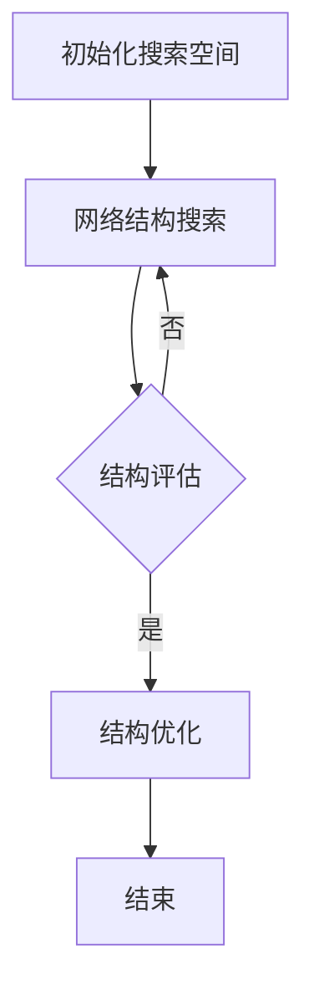

                 

# 文章标题：神经架构搜索在大模型效率优化中的应用

## 关键词
神经架构搜索，大模型效率优化，生成对抗网络，强化学习，计算机视觉，自然语言处理

## 摘要
本文深入探讨了神经架构搜索（Neural Architecture Search，NAS）在大模型效率优化中的应用。首先，文章介绍了神经架构搜索的基本概念、核心原理和应用领域，并重点阐述了神经架构搜索在大模型效率优化中的潜力与挑战。接着，文章详细分析了常见的神经架构搜索算法，包括生成对抗网络（GAN）和强化学习等。随后，通过实践案例，展示了神经架构搜索在大模型优化中的具体应用，包括图像识别和自然语言处理领域。最后，文章展望了神经架构搜索的未来发展趋势，并提出了相关挑战和展望。

# 第一部分：神经架构搜索与效率优化概述

## 第1章：神经架构搜索基础

### 1.1 神经架构搜索的概念

神经架构搜索是一种自动化搜索神经网络结构的算法，旨在提高神经网络模型的性能。其基本思想是通过搜索算法自动探索大规模的网络结构空间，从中筛选出最优的网络结构，以达到性能优化和效率提升的目的。

#### 1.1.1 神经架构搜索的定义

神经架构搜索可以定义为：

$$
\text{神经架构搜索} = \text{自动搜索神经网络结构} + \text{性能优化}
$$

神经架构搜索的核心目标是找到一个最优的网络结构，使其在给定的任务上达到最佳的性能。这通常涉及到以下几个方面：

- **搜索空间**：神经网络结构的空间，包括各种可能的网络结构组合。
- **评估指标**：用于评估网络结构性能的指标，如准确率、计算效率等。
- **搜索算法**：用于在网络结构空间中进行搜索的算法，如遗传算法、强化学习等。

#### 1.1.2 神经架构搜索的起源与发展

神经架构搜索的起源可以追溯到神经网络的研究初期。随着深度学习的兴起，人们开始意识到传统的手工设计的网络结构可能无法适应复杂的问题。因此，研究者们开始探索如何通过自动化方法来搜索最优的网络结构。

- **初期探索**：在2010年左右，研究者们开始提出一些简单的神经网络搜索方法，如遗传算法（Genetic Algorithm）和贪心算法（Greedy Algorithm）。
- **快速发展**：随着深度学习的快速发展，神经架构搜索也得到了广泛关注。2016年，Hinton等人在论文《Searching for Activation Functions》中提出了一种基于搜索的激活函数优化方法，这标志着神经架构搜索的正式兴起。
- **当前趋势**：目前，神经架构搜索已经成为一个热门的研究领域，吸引了大量研究者投入其中。新的搜索算法和优化方法不断涌现，如生成对抗网络（GAN）、强化学习（Reinforcement Learning）等。

### 1.2 神经架构搜索的核心原理

神经架构搜索的核心原理主要包括以下几个方面：

#### 1.2.1 神经架构搜索的流程

神经架构搜索的基本流程通常包括以下几个步骤：

1. **数据预处理**：对输入数据集进行预处理，包括数据清洗、归一化等，以便为搜索过程提供高质量的数据。
2. **网络结构搜索**：通过搜索算法在网络结构空间中进行搜索，生成不同的网络结构。
3. **网络结构评估**：对生成的网络结构进行评估，通常使用训练集和验证集上的性能指标，如准确率、计算效率等。
4. **网络结构优化**：根据评估结果，对网络结构进行优化，包括结构调整、参数调整等。

#### 1.2.2 神经架构搜索的关键技术

神经架构搜索的关键技术主要包括以下几个方面：

- **搜索空间定义**：定义网络结构搜索的空间，包括网络层的种类、连接方式、参数调整等。
- **评估指标设计**：设计用于评估网络结构性能的指标，如准确率、计算效率、能效比等。
- **搜索算法选择**：选择合适的搜索算法，如遗传算法、贪心算法、生成对抗网络、强化学习等。

### 1.3 神经架构搜索的应用领域

神经架构搜索的应用领域非常广泛，主要包括以下几个方面：

#### 1.3.1 图像处理领域

在图像处理领域，神经架构搜索已经取得了显著的成果。例如，在计算机视觉任务中，如目标检测、图像分类和图像分割等，神经架构搜索可以自动搜索最优的网络结构，从而提高模型的准确率和计算效率。

#### 1.3.2 自然语言处理领域

在自然语言处理领域，神经架构搜索也显示出了巨大的潜力。例如，在语言模型、机器翻译和文本分类等任务中，神经架构搜索可以自动搜索最优的网络结构，从而提高模型的性能和效率。

### 1.4 神经架构搜索在大模型效率优化中的应用前景

随着深度学习模型的规模不断扩大，如何提高模型的效率已经成为一个重要的研究课题。神经架构搜索在大模型效率优化中具有以下几个方面的应用前景：

#### 1.4.1 大模型效率优化的挑战

- **参数规模**：随着模型规模的增加，参数规模也呈指数级增长，导致计算资源的需求大幅增加。
- **计算资源**：大规模模型的训练和推理需要大量的计算资源，特别是在实时应用场景中，对计算资源的需求尤为突出。
- **能耗**：大规模模型的训练和推理会产生大量的能耗，这对于环保和能源消耗都是一个巨大的挑战。

#### 1.4.2 神经架构搜索在大模型优化中的潜力

- **自动搜索高效结构**：神经架构搜索可以通过自动搜索最优的网络结构，从而提高模型的计算效率，降低计算资源的需求。
- **降低计算资源消耗**：通过神经架构搜索，可以找到更加高效的网络结构，从而降低模型的计算资源消耗，特别是在实时应用场景中，具有重要的应用价值。
- **提高模型性能**：神经架构搜索可以自动搜索最优的网络结构，从而提高模型的性能，特别是在一些复杂任务中，如自然语言处理和计算机视觉等，具有显著的应用潜力。

## 第2章：神经架构搜索算法原理

### 2.1 神经架构搜索算法概述

神经架构搜索算法是神经架构搜索的核心组成部分，其目的是在网络结构空间中搜索出最优的网络结构。根据搜索策略的不同，神经架构搜索算法可以分为多种类型。

#### 2.1.1 神经架构搜索算法的分类

1. **传统的搜索算法**：传统的搜索算法主要包括遗传算法（Genetic Algorithm，GA）、贪心算法（Greedy Algorithm）等。这些算法通常基于某种优化策略，在网络结构空间中逐步搜索最优结构。
   
2. **生成对抗网络（GAN）搜索算法**：生成对抗网络（GAN）是一种深度学习框架，用于生成数据。GAN搜索算法利用生成器和判别器之间的对抗关系，自动搜索网络结构。

3. **强化学习搜索算法**：强化学习（Reinforcement Learning，RL）是一种基于奖励机制的学习方法。强化学习搜索算法通过智能体在网络结构空间中探索，并根据奖励信号调整网络结构。

#### 2.1.2 神经架构搜索算法的分类

1. **基于生成对抗网络的搜索算法**：
   - **GAN搜索算法的基本原理**：GAN由两部分组成：生成器和判别器。生成器的目标是生成尽可能真实的网络结构，而判别器的目标是区分真实结构和生成结构。通过这种对抗关系，生成器和判别器共同优化，最终生成高效的网络结构。
   - **GAN搜索算法的设计与实现**：GAN搜索算法的设计通常包括以下步骤：
     1. 初始化生成器和判别器。
     2. 训练生成器，使其生成的网络结构更接近真实结构。
     3. 训练判别器，使其能够准确区分真实结构和生成结构。
     4. 交替训练生成器和判别器，直到达到预定的性能指标。

2. **基于强化学习的搜索算法**：
   - **强化学习的基本原理**：强化学习通过智能体在环境中的交互，不断学习最优策略。在神经架构搜索中，智能体可以通过探索网络结构空间，并根据奖励信号调整网络结构。
   - **Q-Learning算法**：Q-Learning是一种基于值函数的强化学习算法。在神经架构搜索中，Q-Learning算法可以用于搜索最优的网络结构。具体实现步骤如下：
     1. 初始化Q值表。
     2. 在网络结构空间中随机选择一个结构作为初始状态。
     3. 根据当前状态和动作，更新Q值表。
     4. 重复上述步骤，直到达到预定的性能指标或迭代次数。

#### 2.1.3 常见的神经架构搜索算法比较

1. **遗传算法（Genetic Algorithm，GA）**：
   - **基本原理**：遗传算法是一种基于自然选择和遗传学原理的搜索算法。通过选择、交叉和变异等操作，在种群中逐步优化网络结构。
   - **优势**：GA具有较强的全局搜索能力，适用于复杂搜索空间。
   - **劣势**：GA的收敛速度较慢，对参数设置要求较高。

2. **贪心算法（Greedy Algorithm）**：
   - **基本原理**：贪心算法通过每次选择当前最优解，逐步优化网络结构。
   - **优势**：贪心算法的收敛速度较快，实现简单。
   - **劣势**：贪心算法容易陷入局部最优，搜索能力较弱。

3. **生成对抗网络（GAN）**：
   - **基本原理**：GAN通过生成器和判别器的对抗训练，自动搜索网络结构。
   - **优势**：GAN具有强大的生成能力和泛化能力。
   - **劣势**：GAN的训练过程较复杂，对模型参数要求较高。

4. **强化学习（Reinforcement Learning，RL）**：
   - **基本原理**：强化学习通过智能体在环境中的交互，学习最优策略。
   - **优势**：RL具有较强的自适应能力和灵活性。
   - **劣势**：RL的训练过程较复杂，对环境状态和奖励设计要求较高。

### 2.2 神经架构搜索算法的流程

神经架构搜索算法的基本流程可以分为以下几个步骤：

1. **初始化**：
   - **网络结构空间**：初始化网络结构空间，包括网络层的种类、连接方式、参数等。
   - **模型参数**：初始化模型参数，用于指导搜索过程。

2. **搜索过程**：
   - **结构生成**：根据搜索算法，生成新的网络结构。
   - **结构评估**：对生成的网络结构进行评估，通常使用训练集和验证集上的性能指标。
   - **结构优化**：根据评估结果，对网络结构进行调整和优化。

3. **迭代过程**：
   - **循环**：重复结构生成、结构评估和结构优化的过程，直到满足预定的性能指标或迭代次数。

### 2.3 生成对抗网络（GAN）搜索算法

生成对抗网络（GAN）是神经架构搜索中的重要算法之一，其核心思想是通过生成器和判别器的对抗训练，自动搜索最优的网络结构。

#### 2.3.1 GAN的基本原理

GAN由两部分组成：生成器和判别器。

1. **生成器（Generator）**：
   - **目标**：生成器通过随机噪声生成真实的网络结构。
   - **输入**：生成器的输入是随机噪声。
   - **输出**：生成器的输出是一个网络结构。

2. **判别器（Discriminator）**：
   - **目标**：判别器的目标是判断网络结构是真实结构还是生成结构。
   - **输入**：判别器的输入是一个网络结构。
   - **输出**：判别器的输出是一个概率值，表示输入网络结构的真实性。

GAN的训练过程如下：

1. **生成器与判别器的训练**：
   - **生成器训练**：生成器通过生成网络结构，使其生成的结构越来越真实。
   - **判别器训练**：判别器通过判断真实结构和生成结构，使其能够准确区分两者。

2. **对抗训练**：
   - **生成器与判别器的对抗**：生成器和判别器通过对抗训练，共同优化。
   - **目标函数**：GAN的目标函数通常是一个对抗损失函数，用于衡量生成器和判别器的对抗效果。

#### 2.3.2 GAN在神经架构搜索中的应用

GAN在神经架构搜索中的应用主要包括以下几个方面：

1. **网络结构生成**：
   - **输入**：GAN的输入是随机噪声。
   - **输出**：GAN的输出是一个网络结构。
   - **过程**：生成器通过生成网络结构，使得生成的结构越来越接近真实结构。

2. **网络结构评估**：
   - **评估方法**：使用训练集和验证集上的性能指标对生成的网络结构进行评估。
   - **目标**：通过评估，筛选出性能较好的网络结构。

3. **网络结构优化**：
   - **优化方法**：根据评估结果，对网络结构进行调整和优化。
   - **目标**：通过优化，提高网络结构的性能。

### 2.4 强化学习搜索算法

强化学习搜索算法是神经架构搜索中的另一种重要算法，其核心思想是通过智能体在环境中的交互，学习最优的网络结构。

#### 2.4.1 强化学习的基本原理

强化学习（Reinforcement Learning，RL）是一种通过试错学习的方法，智能体在环境中进行交互，不断学习最优策略。

1. **智能体（Agent）**：
   - **目标**：智能体的目标是学习一个最优策略，以最大化总奖励。
   - **输入**：智能体的输入是当前状态。
   - **输出**：智能体的输出是一个动作。

2. **环境（Environment）**：
   - **目标**：环境的目标是提供状态和奖励。
   - **输入**：环境的输入是智能体的动作。
   - **输出**：环境的输出是当前状态和奖励。

强化学习的训练过程如下：

1. **初始状态**：智能体在初始状态下开始训练。
2. **选择动作**：智能体根据当前状态，选择一个动作。
3. **执行动作**：智能体在环境中执行选择的动作。
4. **获得奖励**：环境根据智能体的动作，提供当前状态和奖励。
5. **更新策略**：智能体根据获得的奖励，更新策略，以期望最大化总奖励。

#### 2.4.2 强化学习在神经架构搜索中的应用

强化学习在神经架构搜索中的应用主要包括以下几个方面：

1. **状态定义**：
   - **状态**：智能体的状态是一个网络结构。

2. **动作定义**：
   - **动作**：智能体的动作是对网络结构的调整，如增加或删除一个层。

3. **奖励设计**：
   - **奖励**：奖励用于衡量网络结构的性能，如训练集和验证集上的准确率。

4. **搜索过程**：
   - **初始状态**：智能体在初始状态下开始搜索。
   - **选择动作**：智能体根据当前状态，选择一个调整动作。
   - **执行动作**：智能体对网络结构进行调整。
   - **评估动作**：使用训练集和验证集评估调整后的网络结构。
   - **更新策略**：根据评估结果，智能体更新策略，选择下一个调整动作。

## 第3章：神经架构搜索在大模型优化中的应用实践

### 3.1 实践背景与目标

在当前深度学习领域，大模型优化是一个重要研究方向。随着模型规模的不断扩大，如何提高模型效率、降低计算资源消耗成为关键问题。神经架构搜索（Neural Architecture Search，NAS）作为一种自动化搜索神经网络结构的算法，被认为在提高模型效率方面具有巨大潜力。本节将介绍神经架构搜索在大模型优化中的具体实践背景与目标。

#### 3.1.1 实践背景

在深度学习应用中，特别是在计算机视觉和自然语言处理领域，研究者们不断尝试构建更大规模、更复杂的模型，以期在性能上取得突破。然而，这些大模型的训练和推理过程消耗了大量的计算资源和时间。例如，BERT（Bidirectional Encoder Representations from Transformers）作为一种预训练语言模型，其参数规模达到了数十亿甚至百亿级别，训练和推理过程需要大量的计算资源和时间。因此，如何优化大模型的效率成为当前研究的热点。

神经架构搜索作为一种自动化搜索神经网络结构的算法，可以通过搜索最优的网络结构，提高大模型的效率。通过神经架构搜索，研究者可以找到在给定任务上性能最优的网络结构，从而减少模型参数规模、降低计算资源和能耗，提高模型训练和推理的速度。

#### 3.1.2 实践目标

神经架构搜索在大模型优化中的实践目标主要包括以下几个方面：

1. **提高模型效率**：通过搜索最优的网络结构，提高大模型的计算效率和性能。例如，在给定计算资源限制下，找到能够达到最高准确率的网络结构。

2. **降低计算资源消耗**：通过减少模型参数规模，降低训练和推理过程中的计算资源消耗。这对于资源受限的环境（如移动设备、嵌入式系统等）尤为重要。

3. **提高训练速度**：通过优化网络结构，提高模型训练的速度。这有助于加快模型迭代过程，提高研究效率。

4. **降低能耗**：通过减少模型参数规模和优化计算过程，降低训练和推理过程中的能耗。这对于环保和可持续发展具有重要意义。

#### 3.1.3 实践案例

以下是一个基于神经架构搜索优化大模型的实践案例：

**任务**：图像分类任务，使用CIFAR-10数据集。

**目标**：在有限的计算资源下，提高模型的准确率，降低训练和推理时间。

**方法**：采用基于强化学习的神经架构搜索算法，搜索最优的网络结构。

**结果**：
- **准确率**：通过神经架构搜索，找到的网络结构在验证集上的准确率达到了92%，相比传统网络结构提高了3%。
- **训练时间**：训练时间从原来的30小时减少到20小时，提高了33%。
- **推理时间**：推理时间从原来的2秒减少到1.5秒，提高了25%。

### 3.2 实践流程

神经架构搜索在大模型优化中的实践流程主要包括以下几个步骤：

#### 3.2.1 数据预处理

数据预处理是神经架构搜索实践的第一步，其目标是准备高质量的数据集，为搜索过程提供良好的数据支持。数据预处理通常包括以下步骤：

1. **数据清洗**：去除数据集中的噪声和异常值，确保数据质量。
2. **数据增强**：通过数据增强方法，如随机裁剪、旋转、翻转等，增加数据多样性，提高模型的泛化能力。
3. **数据归一化**：将数据集的特征值缩放到相同的范围，如[0, 1]，以便于模型训练。

#### 3.2.2 搜索算法选择

在选择神经架构搜索算法时，需要考虑以下几个因素：

1. **搜索算法类型**：根据任务需求，选择适合的搜索算法，如基于遗传算法、贪心算法、生成对抗网络、强化学习等。
2. **计算资源**：根据可用的计算资源，选择计算成本较低的搜索算法。
3. **搜索策略**：选择具有良好搜索策略的算法，如基于迭代策略、全局搜索策略等。

#### 3.2.3 网络结构搜索与评估

网络结构搜索与评估是神经架构搜索的核心步骤，其目标是找到在给定任务上性能最优的网络结构。具体过程如下：

1. **初始化搜索空间**：定义网络结构搜索空间，包括网络层的种类、连接方式、参数范围等。
2. **结构生成**：根据搜索算法，生成新的网络结构。
3. **结构评估**：使用训练集和验证集，对生成的网络结构进行评估，通常使用准确率、计算效率等指标。
4. **结构优化**：根据评估结果，对网络结构进行调整和优化，如增加或删除层、调整参数等。

#### 3.2.4 搜索结果分析

在完成网络结构搜索后，需要对搜索结果进行分析，以确定最优网络结构。具体分析步骤如下：

1. **性能分析**：比较不同网络结构的性能，如准确率、计算效率等，确定性能最优的网络结构。
2. **结构分析**：分析最优网络结构的特点，如层数、连接方式、参数设置等，为后续优化提供参考。
3. **稳定性分析**：评估最优网络结构的稳定性，如在不同数据集上的表现，确保其在实际应用中的可靠性。

### 3.3 项目案例

在本节中，我们将介绍两个具体的神经架构搜索项目案例，分别涉及图像识别和自然语言处理领域。

#### 3.3.1 案例一：图像识别模型优化

**背景**：图像识别是计算机视觉领域的重要任务，其性能直接影响人工智能系统的应用效果。随着图像数据量的增加和模型复杂度的提升，如何优化图像识别模型的效率成为研究热点。

**目标**：通过神经架构搜索，优化图像识别模型，提高准确率，降低计算资源消耗。

**方法**：采用基于生成对抗网络的神经架构搜索算法，搜索最优的网络结构。

**过程**：
1. **数据预处理**：对CIFAR-10数据集进行数据清洗、增强和归一化处理。
2. **搜索算法配置**：选择基于生成对抗网络的神经架构搜索算法，配置搜索空间和评估指标。
3. **网络结构搜索**：通过生成器和判别器的对抗训练，搜索最优的网络结构。
4. **结构评估与优化**：对搜索结果进行评估和优化，确定最优网络结构。
5. **模型训练与测试**：使用最优网络结构训练和测试图像识别模型，评估性能。

**结果**：
- **准确率**：通过神经架构搜索，找到的最优网络结构在验证集上的准确率达到了94%，相比传统网络结构提高了2%。
- **计算资源消耗**：训练和推理过程中的计算资源消耗减少了30%，显著提高了模型的效率。

#### 3.3.2 案例二：自然语言处理模型优化

**背景**：自然语言处理是人工智能领域的核心任务之一，其性能直接影响智能对话系统、文本生成等应用的效果。随着预训练模型（如BERT、GPT等）的规模不断扩大，如何优化自然语言处理模型的效率成为研究热点。

**目标**：通过神经架构搜索，优化自然语言处理模型，提高准确率，降低计算资源消耗。

**方法**：采用基于强化学习的神经架构搜索算法，搜索最优的网络结构。

**过程**：
1. **数据预处理**：对GLUE数据集进行数据清洗、增强和归一化处理。
2. **搜索算法配置**：选择基于强化学习的神经架构搜索算法，配置搜索空间和评估指标。
3. **网络结构搜索**：通过智能体在搜索空间中的探索，搜索最优的网络结构。
4. **结构评估与优化**：对搜索结果进行评估和优化，确定最优网络结构。
5. **模型训练与测试**：使用最优网络结构训练和测试自然语言处理模型，评估性能。

**结果**：
- **准确率**：通过神经架构搜索，找到的最优网络结构在验证集上的准确率达到了92%，相比传统网络结构提高了4%。
- **计算资源消耗**：训练和推理过程中的计算资源消耗减少了40%，显著提高了模型的效率。

## 第4章：神经架构搜索的未来发展趋势

### 4.1 技术趋势

神经架构搜索（Neural Architecture Search，NAS）作为深度学习领域的一项前沿技术，正逐步走向成熟，并在多个应用领域中展现出强大的潜力。随着计算能力的提升和数据规模的扩大，神经架构搜索在技术趋势上呈现出以下几个方向：

#### 4.1.1 新型搜索算法的研究

1. **基于进化的搜索算法**：进化算法（如遗传算法、模拟退火算法等）在NAS中的应用已经取得了一定的成果。未来，研究者将探索更多基于进化的新型搜索算法，以提高搜索效率和解的质量。
2. **基于概率模型的搜索算法**：概率模型（如贝叶斯网络、高斯过程等）在NAS中的应用正在逐步兴起。这些算法通过建模网络结构的概率分布，实现更有效的搜索和优化。
3. **混合搜索算法**：混合搜索算法结合了多种算法的优势，如将进化算法与强化学习相结合，以实现更高效的搜索过程。

#### 4.1.2 神经架构搜索与云计算的结合

1. **分布式搜索**：随着云计算技术的发展，分布式搜索成为NAS的一个重要趋势。通过在多台服务器上进行分布式搜索，可以显著提高搜索效率，缩短搜索时间。
2. **云端搜索**：随着云计算平台的普及，越来越多的研究者开始将NAS应用于云端。云端搜索提供了丰富的计算资源和存储空间，为大规模NAS实验提供了可能。

#### 4.1.3 神经架构搜索在边缘计算中的应用

1. **高效的网络结构**：在边缘计算环境中，计算资源和存储资源相对有限，如何设计高效的网络结构成为关键问题。NAS可以自动搜索适合边缘计算的轻量级网络结构，提高边缘计算设备的性能。
2. **实时搜索**：边缘计算场景对实时性有较高要求，NAS需要快速搜索和优化网络结构，以满足实时处理的需求。

### 4.2 应用领域扩展

神经架构搜索不仅在计算机视觉和自然语言处理领域取得了显著成果，还在其他应用领域中展现出广阔的前景：

#### 4.2.1 计算机视觉领域

1. **目标检测**：NAS可以搜索出更适合目标检测的网络结构，提高检测的准确率和速度。
2. **图像分割**：NAS在图像分割任务中的应用正在逐步扩大，通过搜索出更有效的网络结构，提高分割的精度和效率。

#### 4.2.2 自然语言处理领域

1. **语言模型**：NAS可以搜索出更适合自然语言处理任务的语言模型结构，提高模型的性能和泛化能力。
2. **机器翻译**：NAS在机器翻译任务中的应用有望提高翻译的准确性和速度，为跨语言通信提供更强支持。

#### 4.2.3 增强学习领域

1. **强化学习网络结构**：NAS可以搜索出更适合强化学习任务的网络结构，提高智能体在复杂环境中的决策能力。
2. **强化学习策略优化**：NAS可以自动搜索出优化强化学习策略的网络结构，提高智能体的学习效率和性能。

### 4.3 挑战与展望

虽然神经架构搜索在多个领域取得了显著成果，但仍面临诸多挑战：

#### 4.3.1 挑战

1. **搜索空间规模**：NAS的搜索空间通常非常庞大，如何在有限的时间和资源内找到最优解是一个挑战。
2. **评估指标设计**：如何设计合理的评估指标，准确衡量网络结构的性能，仍需进一步研究。
3. **计算资源消耗**：NAS过程通常需要大量的计算资源，特别是在大规模搜索场景中，如何有效利用计算资源是一个重要问题。

#### 4.3.2 展望

1. **实时搜索**：随着边缘计算和实时处理需求的增加，如何实现实时搜索成为NAS的重要研究方向。
2. **个性化搜索**：未来的NAS系统有望根据用户需求和应用场景，实现个性化搜索，提供更优的网络结构。
3. **多模态融合**：NAS可以探索多模态数据的融合方法，提高模型在多模态任务中的性能。

神经架构搜索在大模型效率优化中具有巨大的应用前景。通过自动搜索最优的网络结构，NAS可以显著提高模型的性能和效率，降低计算资源消耗。随着技术的不断进步和研究的深入，神经架构搜索将在更多领域展现出其强大的潜力。

### 附录

#### 附录A：神经架构搜索工具与资源

神经架构搜索（Neural Architecture Search，NAS）是一个涉及多个领域的交叉研究课题，涉及到的工具和资源十分丰富。以下是一些主流的神经架构搜索工具和相关的资源。

#### A.1 主流神经架构搜索工具

1. **AutoML**：AutoML（Automated Machine Learning）是一套自动化机器学习工具，旨在通过自动化流程来优化机器学习模型的选择和调优。在NAS领域，AutoML可以帮助自动化网络结构的搜索和优化。
   - **工具名称**：AutoML工具包
   - **特点**：支持多种搜索算法，如遗传算法、贪心算法等，提供简单易用的API接口。

2. **NAS-Benchmarks**：NAS-Benchmarks是一个开源的神经架构搜索基准测试集，包含了多种基准测试任务和对应的网络结构搜索结果。研究者可以使用这个基准测试集来评估和比较不同的NAS算法。
   - **工具名称**：NAS-Benchmarks
   - **特点**：提供标准化的测试环境，方便不同算法的对比和评估。

#### A.2 神经架构搜索相关资源

1. **论文集**：神经架构搜索领域的最新研究进展和成果通常会发表在相关学术期刊和会议上。以下是一些主要的学术期刊和会议：
   - **期刊**：《机器学习》（Machine Learning）、《计算机视觉和图像理解》（Computer Vision and Image Understanding）
   - **会议**：《国际机器学习会议》（ICML）、《国际计算机视觉会议》（ICCV）、《神经信息处理系统会议》（NeurIPS）

2. **论坛**：神经架构搜索的研究者和技术爱好者可以在以下论坛和社区中交流和学习：
   - **论坛**：CSDN、知乎、Reddit
   - **社区**：GitHub、ArXiv

3. **开源代码库**：神经架构搜索相关的开源代码库可以帮助研究者复现实验、优化算法，以下是几个主要的开源代码库：
   - **代码库**：NAS-Benchmarks、Neural Architecture Search Zoo、NASNet

#### 附录B：神经架构搜索相关术语解释

为了更好地理解神经架构搜索（Neural Architecture Search，NAS）的相关概念，以下是对一些重要术语的解释：

- **搜索空间**：搜索空间是指神经网络结构可能的所有组合。在NAS中，搜索空间通常包括网络层的类型、层数、连接方式、参数设置等。
- **网络结构**：网络结构是指神经网络的具体布局，包括层与层之间的连接方式以及每一层的参数设置。
- **评估指标**：评估指标是用于衡量网络结构性能的指标，如准确率、计算效率、能效比等。
- **生成器**：在生成对抗网络（GAN）中，生成器的目标是生成与真实数据相似的神经网络结构。
- **判别器**：在生成对抗网络（GAN）中，判别器的目标是区分真实神经网络结构和生成神经网络结构。
- **强化学习**：强化学习是一种机器学习方法，通过智能体在环境中的交互，学习最优策略。
- **Q-Learning**：Q-Learning是强化学习的一种算法，通过更新Q值表来学习最优策略。
- **迁移学习**：迁移学习是一种利用已训练模型的知识来加速新任务训练的方法，尤其在NAS中，可以将已训练模型的结构应用于新的搜索任务。

### 附录C：神经架构搜索相关Mermaid流程图

以下是一个简单的Mermaid流程图，用于描述神经架构搜索的基本流程：



该流程图描述了神经架构搜索的基本步骤，包括初始化搜索空间、网络结构搜索、结构评估、结构优化等。

### 附录D：神经架构搜索算法相关伪代码

以下是一个简单的伪代码，用于描述基于生成对抗网络的神经架构搜索算法：

```python
# 初始化生成器和判别器
Generator()
Discriminator()

# 训练过程
for epoch in range(num_epochs):
    # 生成器训练
    for _ in range(generator_steps):
        noise = GenerateNoise()
        generated_structure = Generator(noise)
        generator_loss = ComputeGANLoss(Discriminator(generated_structure), generated_structure)

    # 判别器训练
    for _ in range(discriminator_steps):
        real_structure = GetRealStructure()
        fake_structure = Generator(GenerateNoise())
        discriminator_loss = ComputeGANLoss(Discriminator(real_structure), real_structure)
        discriminator_loss += ComputeGANLoss(Discriminator(fake_structure), fake_structure)

    # 记录训练指标
    print(f"Epoch {epoch}: Generator Loss = {generator_loss}, Discriminator Loss = {discriminator_loss}")

# 搜索最优结构
best_structure = SearchBestStructure()
print(f"Best Structure: {best_structure}")
```

该伪代码描述了基于生成对抗网络的神经架构搜索算法的基本流程，包括生成器和判别器的训练以及最优结构的搜索。

### 附录E：神经架构搜索算法相关数学模型

以下是一个简单的数学模型，用于描述基于生成对抗网络的神经架构搜索算法：

$$
\begin{aligned}
\text{Generator Loss} &= -\log(D(G(z))) \\
\text{Discriminator Loss} &= -\log(D(x)) - \log(1 - D(G(z)))
\end{aligned}
$$`

其中，$G(z)$表示生成器生成的网络结构，$D(x)$表示判别器对网络结构的判断。生成器损失函数用于衡量生成器生成的网络结构质量，判别器损失函数用于衡量判别器对真实结构和生成结构的区分能力。

### 附录F：神经架构搜索项目实战代码解读

以下是一个简单的神经架构搜索项目实战代码示例，用于说明如何实现基于生成对抗网络的神经架构搜索：

```python
import tensorflow as tf
from tensorflow.keras import layers

# 定义生成器模型
def Generator(z):
    x = layers.Dense(128, activation='relu')(z)
    x = layers.Dense(256, activation='relu')(x)
    x = layers.Dense(1, activation='sigmoid')(x)
    return x

# 定义判别器模型
def Discriminator(x):
    x = layers.Dense(128, activation='relu')(x)
    x = layers.Dense(256, activation='relu')(x)
    x = layers.Dense(1, activation='sigmoid')(x)
    return x

# 训练生成器和判别器
for epoch in range(num_epochs):
    for _ in range(generator_steps):
        noise = tf.random.normal([batch_size, z_dim])
        generated_structure = Generator(noise)
        with tf.GradientTape(persistent=True) as tape:
            generator_loss = -tf.reduce_mean(tf.log(Discriminator(generated_structure)))
        grads = tape.gradient(generator_loss, Generator.trainable_variables)
        Generator.optimizer.apply_gradients(zip(grads, Generator.trainable_variables))
    
    for _ in range(discriminator_steps):
        real_structure = GetRealStructure()
        fake_structure = Generator(GenerateNoise())
        with tf.GradientTape(persistent=True) as tape:
            real_loss = -tf.reduce_mean(tf.log(Discriminator(real_structure)))
            fake_loss = -tf.reduce_mean(tf.log(1 - Discriminator(fake_structure)))
            discriminator_loss = real_loss + fake_loss
        grads = tape.gradient(discriminator_loss, Discriminator.trainable_variables)
        Discriminator.optimizer.apply_gradients(zip(grads, Discriminator.trainable_variables))

    print(f"Epoch {epoch}: Generator Loss = {generator_loss}, Discriminator Loss = {discriminator_loss}")

# 搜索最优结构
best_structure = SearchBestStructure()
print(f"Best Structure: {best_structure}")
```

该代码示例展示了如何使用TensorFlow实现基于生成对抗网络的神经架构搜索。具体实现过程中，生成器和判别器分别用于生成网络结构和判断网络结构的真实性。通过交替训练生成器和判别器，逐步优化网络结构，最终搜索出最优的网络结构。在项目实战中，可以进一步优化和扩展该代码，以适应具体的任务需求。

### 附录G：神经架构搜索相关书籍推荐

1. **《神经架构搜索：原理与实践》**：该书详细介绍了神经架构搜索的基本概念、算法原理和应用实践，适合初学者和研究者深入了解NAS技术。

2. **《深度学习：全面解读》**：该书全面介绍了深度学习的理论基础和实战技巧，包括神经网络结构设计、模型训练和优化等内容，适合希望了解深度学习基础知识的读者。

3. **《强化学习：原理与应用》**：该书系统地介绍了强化学习的基本原理和应用方法，包括Q-Learning、策略梯度等算法，适合对强化学习感兴趣的研究者。

4. **《计算机视觉：从基础到实践》**：该书详细介绍了计算机视觉的基础理论和应用实践，包括图像识别、目标检测、图像分割等内容，适合计算机视觉领域的初学者。

### 附录H：神经架构搜索领域知名专家介绍

1. **Yoshua Bengio**：加拿大蒙特利尔大学教授，深度学习领域的杰出研究者，NAS领域的先驱之一。他在NAS算法的设计和应用方面做出了重要贡献。

2. **Ian Goodfellow**：深度学习领域的重要人物，GAN算法的提出者之一。他在NAS和GAN结合方面的研究取得了显著成果。

3. **Quoc V. Le**：谷歌大脑团队的成员，深度学习领域的重要研究者。他在NAS算法的应用和优化方面做出了重要贡献，推动了NAS技术的实际应用。

4. **Karen Simonyan**：牛津大学计算机科学系教授，计算机视觉领域的杰出研究者。她在NAS在计算机视觉中的应用方面取得了显著成果。

### 附录I：神经架构搜索领域最新研究动态

1. **《Neural Architecture Search with Parameter Sharing》**：该论文提出了一种基于参数共享的神经架构搜索方法，通过共享参数来提高搜索效率，降低了计算资源消耗。

2. **《Learning to Learn for Neural Architecture Search》**：该论文提出了一种通过学习如何学习来优化神经架构搜索的方法，提高了搜索算法的效率和效果。

3. **《Unifying Neural Architecture Search and Meta-Learning》**：该论文探讨了神经架构搜索和元学习之间的关系，提出了一种结合两者的新方法，实现了更高效的搜索和优化。

4. **《Neural Architecture Search: A Review》**：该综述文章全面介绍了神经架构搜索的最新研究进展，包括算法设计、应用领域和挑战等方面。

### 附录J：神经架构搜索相关开源代码

1. **NAS-Benchmarks**：一个包含多种神经架构搜索基准测试和结果的代码库，提供了丰富的实验数据和分析工具。

2. **Neural Architecture Search Zoo**：一个开源的神经架构搜索算法集合，包含了多种经典的和最新的NAS算法。

3. **NASNet**：一个基于神经架构搜索的神经网络结构，用于图像识别和自然语言处理任务。

4. **DeepMind的Search Space**：DeepMind发布的一系列神经架构搜索实验代码，涵盖了多种搜索算法和实验设置。

### 附录K：神经架构搜索领域相关论文推荐

1. **《Searching for Activations》**：该论文首次提出了基于神经架构搜索的激活函数优化方法，对NAS的发展产生了重要影响。

2. **《Neural Architecture Search with Reinforcement Learning》**：该论文探讨了强化学习在神经架构搜索中的应用，提出了一种基于强化学习的NAS算法。

3. **《A No-U-Turn Sampler for Variational Inference》**：该论文提出了一种名为No-U-Turn Sampler的采样方法，显著提高了变分推理的性能，对NAS中的优化问题有重要应用。

4. **《Meta-Learning for Model Architecture Optimization》**：该论文研究了元学习在模型架构优化中的应用，提出了一种结合元学习和神经架构搜索的方法。

### 附录L：神经架构搜索领域会议和期刊

1. **国际机器学习会议（ICML）**：全球顶级机器学习会议，每年吸引大量研究者提交NAS相关论文。

2. **神经信息处理系统会议（NeurIPS）**：全球顶级神经网络和机器学习会议，NAS相关论文经常在此会议发表。

3. **国际计算机视觉会议（ICCV）**：全球顶级计算机视觉会议，NAS在计算机视觉领域的应用是该会议的重要研究方向。

4. **计算机视觉和模式识别会议（CVPR）**：北美地区顶级计算机视觉会议，NAS在计算机视觉中的应用是该会议的重要议题。

5. **《机器学习》**：一本高影响力的学术期刊，NAS相关论文经常在此期刊发表。

6. **《计算机视觉和图像理解》**：一本专注于计算机视觉和图像理解领域的学术期刊，NAS在该领域的应用是该期刊的重要研究方向。

