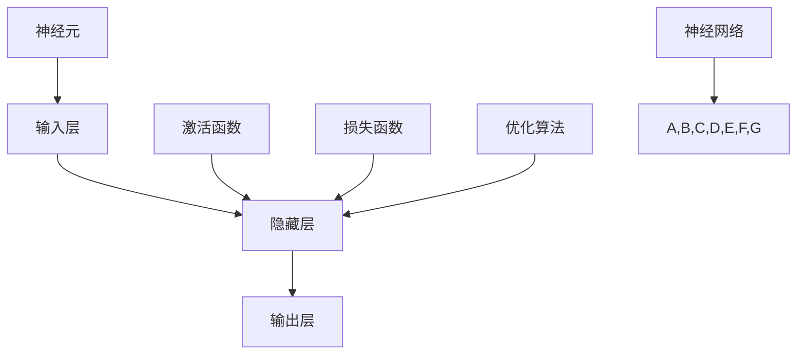

                 

# 神经网络(Neural Networks) - 原理与代码实例讲解

> 关键词：神经网络、前馈神经网络、卷积神经网络、循环神经网络、激活函数、损失函数、优化算法

> 摘要：本文将深入探讨神经网络的基本原理、结构以及应用。通过逐步分析，我们将了解神经网络的发展历程、数学基础、各种类型以及它们的代码实现。文章将涵盖前馈神经网络、卷积神经网络和循环神经网络，并包含实际代码示例，帮助读者更好地理解这一强大的人工智能技术。

### 《神经网络(Neural Networks) - 原理与代码实例讲解》目录大纲

#### 第一部分：神经网络基础知识

##### 第1章：神经网络概述
- **1.1 神经网络的历史与发展**
  - 神经网络的发展历程
  - 神经网络在现代计算中的地位
- **1.2 神经网络的基本组成**
  - 神经元
  - 输入层、隐藏层和输出层
- **1.3 神经网络的分类**
  - 前馈神经网络
  - 卷积神经网络
  - 循环神经网络
  - 混合神经网络

##### 第2章：神经网络数学基础
- **2.1 神经元的数学模型**
  - 激活函数
  - 神经元模型伪代码
- **2.2 神经网络损失函数与优化算法**
  - 常见损失函数
  - 常见优化算法
- **2.3 数学公式与公式推导**
  - 激活函数的导数计算
  - 误差反向传播算法的推导

##### 第3章：前馈神经网络
- **3.1 前馈神经网络的构建**
  - 层与节点的定义
  - 权值和偏置的初始化
- **3.2 前馈神经网络的训练**
  - 训练过程
  - 过拟合与欠拟合
- **3.3 前馈神经网络的代码实现**
  - Python代码示例
  - 伪代码展示

##### 第4章：卷积神经网络
- **4.1 卷积神经网络的基本原理**
  - 卷积操作
  - 池化操作
- **4.2 卷积神经网络的层次结构**
  - 卷积层
  - 池化层
  - 全连接层
- **4.3 卷积神经网络的代码实现**
  - Python代码示例

##### 第5章：循环神经网络
- **5.1 循环神经网络的基本原理**
  - RNN的概念
  - LSTM和GRU的架构
- **5.2 循环神经网络的训练与预测**
  - 序列建模
  - 语言模型训练
- **5.3 循环神经网络的代码实现**
  - Python代码示例

##### 第6章：神经网络的应用
- **6.1 语音识别**
  - 语音信号的预处理
  - RNN在语音识别中的应用
- **6.2 图像识别**
  - 卷积神经网络在图像识别中的应用
  - 代码示例
- **6.3 自然语言处理**
  - RNN在自然语言处理中的应用
  - 代码示例

##### 第7章：神经网络的优化与改进
- **7.1 神经网络的正则化**
  - L1正则化
  - L2正则化
- **7.2 神经网络的改进方法**
  - 网络结构优化
  - 损失函数改进
- **7.3 神经网络在现实世界中的应用案例分析**
  - 案例一：手写数字识别
  - 案例二：语音合成

#### 附录
- **附录A：常用神经网络库与框架**
  - TensorFlow
  - PyTorch
  - Keras
- **附录B：神经网络学习资源推荐**
  - 书籍推荐
  - 在线课程推荐
  - 论坛和社区推荐

---

### 核心概念与联系 Mermaid 流程图



---

### 核心算法原理讲解

#### 神经元模型伪代码

```python
# 伪代码：神经元模型
def neuron(input, weights, bias, activation_function):
    z = sum(input * weights) + bias
    output = activation_function(z)
    return output
```

#### 数学公式和解释

$$
y = \sigma(z) = \frac{1}{1 + e^{-z}}
$$

其中，\( \sigma \) 是 sigmoid 函数，\( z \) 是神经元的净输入，\( y \) 是神经元的输出。

---

#### 项目实战

##### 代码实际案例和详细解释说明

**案例一：手写数字识别（MNIST数据集）**

1. **数据集加载与预处理**
   - 使用 TensorFlow 或 PyTorch 加载 MNIST 数据集。
   - 对数据进行归一化处理。

2. **构建模型**
   - 定义输入层、隐藏层和输出层。
   - 设置合适的激活函数、损失函数和优化器。

3. **训练模型**
   - 使用训练数据训练模型。
   - 记录训练过程中的损失值和准确率。

4. **评估模型**
   - 使用测试数据评估模型的性能。
   - 输出准确率、混淆矩阵等指标。

##### 开发环境搭建

1. **安装 Python 和相关依赖库**
   - 安装 TensorFlow 或 PyTorch。
   - 安装 NumPy、Pandas 等常用库。

2. **创建 Python 脚本**
   - 编写代码实现神经网络模型。

3. **运行代码**
   - 在终端或 IDE 中运行脚本。

##### 源代码详细实现和代码解读

**TensorFlow 版本代码示例**

```python
import tensorflow as tf

# 定义模型
model = tf.keras.Sequential([
    tf.keras.layers.Dense(128, activation='relu', input_shape=(784,)),
    tf.keras.layers.Dense(10, activation='softmax')
])

# 编译模型
model.compile(optimizer='adam',
              loss='categorical_crossentropy',
              metrics=['accuracy'])

# 训练模型
model.fit(x_train, y_train, epochs=5, batch_size=32)

# 评估模型
test_loss, test_acc = model.evaluate(x_test, y_test)
print('Test accuracy:', test_acc)
```

**代码解读与分析：**
- **模型定义：** 使用 `tf.keras.Sequential` 模式堆叠层。
- **编译模型：** 设置优化器、损失函数和评估指标。
- **训练模型：** 使用 `fit` 方法进行训练。
- **评估模型：** 使用 `evaluate` 方法评估模型在测试集上的性能。

**PyTorch 版本代码示例**

```python
import torch
import torch.nn as nn
import torch.optim as optim

# 定义模型
class NeuralNetwork(nn.Module):
    def __init__(self):
        super(NeuralNetwork, self).__init__()
        self.layer1 = nn.Linear(784, 128)
        self.layer2 = nn.Linear(128, 10)
    
    def forward(self, x):
        x = torch.relu(self.layer1(x))
        x = self.layer2(x)
        return x

# 实例化模型
model = NeuralNetwork()

# 定义损失函数和优化器
criterion = nn.CrossEntropyLoss()
optimizer = optim.Adam(model.parameters(), lr=0.001)

# 训练模型
for epoch in range(5):
    for inputs, targets in data_loader:
        optimizer.zero_grad()
        outputs = model(inputs)
        loss = criterion(outputs, targets)
        loss.backward()
        optimizer.step()

# 评估模型
with torch.no_grad():
    outputs = model(x_test)
    _, predicted = torch.max(outputs, 1)
    correct = (predicted == y_test).sum().item()
    print('Test accuracy:', correct / len(y_test))
```

**代码解读与分析：**
- **模型定义：** 继承 `nn.Module` 类，定义 `__init__` 和 `forward` 方法。
- **定义损失函数和优化器：** 使用 `nn.CrossEntropyLoss` 和 `optim.Adam`。
- **训练模型：** 使用 `optimizer.zero_grad`、`loss.backward` 和 `optimizer.step` 进行反向传播和优化。
- **评估模型：** 使用 `torch.no_grad()` 减少内存占用，计算准确率。

---

通过上述目录大纲、算法讲解、数学公式、代码示例以及实战案例，本书将帮助读者全面掌握神经网络的基本原理及其在现实世界中的应用。

#### 作者

作者：AI天才研究院/AI Genius Institute & 禅与计算机程序设计艺术 /Zen And The Art of Computer Programming

---

接下来的章节将逐步深入探讨神经网络的历史、数学基础、各种类型以及它们的应用。让我们一步步分析推理（LET'S THINK STEP BY STEP），深入了解这一激动人心的人工智能领域。

