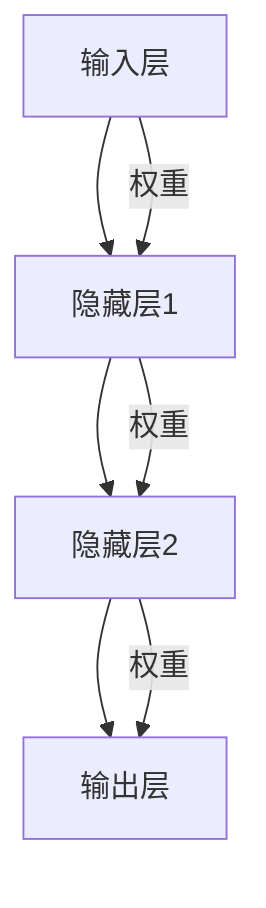

                 

### 《神经网络将取代传统编程吗？》

> 关键词：神经网络、传统编程、编程语言、机器学习、AI

> 摘要：本文探讨了神经网络是否可能取代传统编程，分析了神经网络在编程领域的应用、优势和局限性，以及与传统编程的比较。通过实例研究和未来展望，提出了神经网络与传统编程的融合趋势及其对编程教育和企业需求的影响。

---

### 引言与背景

#### 引言

在计算机科学领域，编程一直是实现软件系统的基础。然而，随着人工智能（AI）和机器学习（ML）技术的飞速发展，神经网络（NN）作为一种强大的机器学习模型，正逐渐改变编程的方式。那么，神经网络能否取代传统编程？这是本文将要探讨的核心问题。

#### 1.1 书籍主题介绍

本文旨在分析神经网络与编程之间的关系，探讨神经网络在编程领域的应用前景。首先，我们将回顾神经网络的传统发展历程，然后深入探讨神经网络的基础理论、数学基础和核心算法。接下来，我们将探讨神经网络在编程中的应用，比较神经网络与传统编程的优势与局限性，并通过实际案例研究来展示神经网络的编程潜力。最后，本文将对神经网络与传统编程的未来发展趋势进行展望。

#### 1.2 神经网络与传统编程的差异

神经网络与传统编程在本质上有很大的不同。传统编程依赖于明确的指令和算法，通过逻辑和结构化的代码来实现特定功能。而神经网络则通过模仿人脑神经元的工作方式，通过学习数据来发现模式和关系，进而进行预测和决策。

尽管神经网络在处理复杂任务方面表现出色，但它也有其局限性。首先，神经网络的训练过程需要大量的数据和计算资源，这使得其难以应用于实时性要求高的场景。其次，神经网络的黑箱特性使得其难以解释和理解，这在某些需要透明性和可解释性的应用场景中可能成为问题。

#### 1.3 神经网络在编程领域的潜在应用

神经网络在编程领域的潜在应用非常广泛。例如，在软件工程中，神经网络可以用于代码生成、自动化测试和缺陷预测。在游戏开发中，神经网络可以用于角色控制、路径规划和游戏AI。在人工智能编程中，神经网络可以用于自然语言处理、图像识别和智能推荐系统等。

尽管神经网络在编程领域的应用前景广阔，但传统编程依然有其不可替代的作用。传统编程在实时性、可解释性和控制力方面具有优势，而神经网络则擅长处理复杂的数据分析和模式识别任务。

#### 1.4 文章结构

本文结构如下：

- **第一部分：引言与背景**：介绍神经网络与传统编程的差异和应用前景。
- **第二部分：神经网络基础**：介绍神经网络的基础理论、数学基础和核心算法。
- **第三部分：神经网络在编程中的应用**：探讨神经网络在编程领域的应用案例。
- **第四部分：神经网络与传统编程的比较**：分析神经网络和传统编程的优势与局限性。
- **第五部分：案例分析**：通过实际案例研究神经网络在编程中的应用。
- **第六部分：未来展望**：展望神经网络与传统编程的未来发展趋势。

通过本文的深入探讨，我们希望能够对神经网络是否可能取代传统编程这一问题有更清晰的认识。

---

### 神经网络发展的历史背景

神经网络（Neural Networks）的概念最早可以追溯到1943年，由心理学家沃伦·麦卡洛克（Warren McCulloch）和数学家沃尔特·皮茨（Walter Pitts）提出。他们首次提出了模拟生物神经元工作的数学模型，被称为麦卡洛克-皮茨（McCulloch-Pitts）神经元。这一模型的提出奠定了神经网络理论的基础。

然而，由于计算能力的限制，早期的神经网络研究进展缓慢。直到1980年代，随着计算机硬件的快速发展，神经网络研究才逐渐重新焕发活力。1986年，由休伯特·辛顿（Hubert Temple Hinton）提出的反向传播算法（Backpropagation Algorithm）使得多层神经网络的训练成为可能。反向传播算法通过梯度下降方法，使得神经网络能够从输出误差中反向传播梯度，从而不断调整网络权重，提高模型的预测准确性。

这一时期的神经网络研究主要集中在图像识别、语音识别和自然语言处理等应用领域。其中，1989年，由约翰·霍普菲尔德（John Hopfield）提出的霍普菲尔德网络（Hopfield Network）在联想记忆方面表现出色。霍普菲尔德网络通过模拟人脑神经元之间的交互作用，能够实现数据的存储和恢复。

然而，尽管神经网络在理论上取得了重要突破，但在实际应用中仍然面临诸多挑战。首先，神经网络的训练过程需要大量的数据和计算资源，这使得其在资源受限的环境中难以应用。其次，神经网络的“黑箱”特性使得其难以解释和理解，这在需要透明性和可解释性的应用场景中成为瓶颈。此外，神经网络的泛化能力有限，容易在数据分布发生变化时过拟合。

为了解决这些问题，研究人员不断探索新的神经网络结构和训练方法。1990年代，支持向量机（Support Vector Machine, SVM）和决策树（Decision Tree）等传统机器学习算法逐渐崭露头角，与神经网络形成了竞争关系。然而，随着深度学习的兴起，神经网络再次迎来了新的发展机遇。

深度学习（Deep Learning）是神经网络的一种扩展，通过堆叠多个神经网络层，实现更复杂的特征提取和表示。2006年，由杰弗里·辛顿（Geoffrey Hinton）等学者提出的深度信念网络（Deep Belief Network, DBN）和堆叠自编码器（Stacked Auto-Encoders）成为深度学习的里程碑。这些方法通过逐层训练和预训练，提高了神经网络的训练效率和泛化能力。

进入21世纪，随着大规模数据和计算资源的普及，神经网络在图像识别、语音识别、自然语言处理和自动驾驶等领域取得了显著的成果。2012年，由亚历克斯·克雷默（Alex Krizhevsky）等人在ImageNet图像识别挑战中取得的突破性成绩，使得深度学习成为人工智能领域的研究热点。

然而，神经网络的发展并非一帆风顺。在实际应用中，神经网络依然面临诸多挑战，如数据隐私、模型解释性、计算资源消耗等。为了解决这些问题，研究人员不断探索新的方法和应用场景，推动神经网络在各个领域的深入发展。

总之，神经网络的发展历程充满了挑战与机遇。从早期的麦卡洛克-皮茨神经元到现代的深度学习模型，神经网络在理论和技术上取得了长足的进步。在未来，神经网络有望在更多领域发挥重要作用，推动人工智能技术的发展。

---

### 神经网络基础理论

#### 2.1 神经网络的基本概念

神经网络（Neural Networks）是一种通过模拟生物神经元结构和工作原理来处理信息的人工智能模型。在神经网络中，每个神经元都与其他神经元相连，形成一个复杂的网络结构。神经元之间的连接称为“突触”，突触的强度可以用“权重”来表示。神经网络的输入通过这些连接进入网络，经过多层神经元的处理，最终得到输出。

**神经元与神经网络**

神经元是神经网络的基本组成单元。每个神经元由三个主要部分组成：输入层、隐藏层和输出层。输入层接收外部输入信号，隐藏层进行特征提取和变换，输出层产生最终输出。

神经元的工作原理可以简单描述为：接收输入信号，通过激活函数进行非线性变换，然后传递给下一层神经元。神经网络的层次结构使得它能够学习复杂的数据特征和模式。

**神经网络的层次结构**

神经网络通常由多个层次组成，包括输入层、隐藏层和输出层。输入层接收外部输入数据，隐藏层进行特征提取和变换，输出层产生最终输出。每个隐藏层都可以看作是对输入数据进行的一次抽象和转换。

神经网络的层次结构使得它能够通过逐层学习，从原始数据中提取更高层次的特征。这种层次结构在处理复杂数据和任务时具有显著的优势。

#### 2.2 神经网络的数学基础

神经网络的训练和运行依赖于一系列数学工具和算法。其中，线性代数和优化算法是神经网络数学基础的核心。

**线性代数基础**

线性代数是神经网络数学基础的重要组成部分。在神经网络中，线性代数用于表示和计算数据、权重和偏置等。主要概念包括矩阵、向量、矩阵乘法和矩阵求导等。

- **矩阵与向量**：矩阵是一种二维数组，用于表示数据、权重和偏置。向量是一维数组，通常用于表示输入和输出。
- **矩阵乘法**：矩阵乘法用于计算矩阵与向量的乘积，是神经网络中重要的运算。
- **矩阵求导**：矩阵求导用于计算矩阵的梯度，是神经网络优化算法的基础。

**优化算法**

优化算法用于调整神经网络的权重和偏置，以最小化损失函数。常见的优化算法包括梯度下降、动量优化、自适应优化等。

- **梯度下降**：梯度下降是一种最简单的优化算法，通过计算损失函数的梯度，沿着梯度的反方向更新权重和偏置，以逐步减小损失函数。
- **动量优化**：动量优化是梯度下降的改进版本，通过引入动量项，加速梯度下降过程，提高收敛速度。
- **自适应优化**：自适应优化算法根据不同的情况动态调整学习率，如Adam优化器通过计算一阶和二阶矩估计来调整学习率。

**激活函数**

激活函数是神经网络中的非线性元件，用于引入非线性特性，使得神经网络能够学习复杂的数据特征。常见的激活函数包括Sigmoid、ReLU、Tanh等。

- **Sigmoid函数**：Sigmoid函数是一种常见的激活函数，其输出介于0和1之间，可以用于二分类任务。
- **ReLU函数**：ReLU函数（Rectified Linear Unit）是一种简单的激活函数，其输出为输入值（x>0）或0（x≤0）。ReLU函数在训练过程中表现出良好的性能。
- **Tanh函数**：Tanh函数（双曲正切函数）是另一种常用的激活函数，其输出介于-1和1之间，可以用于多分类任务。

#### 2.3 神经网络的核心算法

神经网络的核心算法包括前向传播算法和反向传播算法。这些算法是神经网络训练和运行的基础。

**前向传播算法**

前向传播算法是神经网络处理输入数据的过程。在输入层，输入数据经过各层的神经元传递，通过激活函数进行非线性变换，最终得到输出层的输出结果。前向传播算法可以表示为：

$$
Z = W \cdot X + b \\
A = \sigma(Z)
$$

其中，\(Z\) 表示神经元的输入，\(W\) 和 \(b\) 分别表示权重和偏置，\(\sigma\) 表示激活函数，\(A\) 表示神经元的输出。

**反向传播算法**

反向传播算法是神经网络训练过程中的关键步骤。通过计算输出层的误差，反向传播误差到前一层神经元，并更新权重和偏置。反向传播算法可以分为以下几个步骤：

1. **计算输出层的误差**：输出层的误差可以通过目标值和预测值的差异计算得到。

$$
\delta_L = \frac{\partial J}{\partial A_L} = (T - A_L) \odot \sigma'(A_L)
$$

其中，\(J\) 表示损失函数，\(T\) 表示目标值，\(\sigma'\) 表示激活函数的导数，\(\odot\) 表示元素乘积。

2. **反向传播误差**：将输出层的误差反向传播到隐藏层。

$$
\delta_{l-1} = \frac{\partial J}{\partial A_{l-1}} = \delta_l \odot W_{l} \odot \sigma'_{l-1}(A_{l-1})
$$

3. **更新权重和偏置**：根据误差计算权重和偏置的梯度，并更新权重和偏置。

$$
W_{l} = W_{l} - \alpha \cdot \frac{\partial J}{\partial W_{l}} \\
b_{l} = b_{l} - \alpha \cdot \frac{\partial J}{\partial b_{l}}
$$

其中，\(\alpha\) 表示学习率。

通过前向传播和反向传播算法，神经网络能够不断调整权重和偏置，以优化模型的预测性能。

总之，神经网络基础理论包括神经元、神经网络层次结构、数学基础和核心算法。这些理论为神经网络的应用提供了坚实的基础，也为后续的实践应用奠定了基础。

---

### 神经网络在编程中的应用

#### 3.1 神经网络与编程语言的关系

神经网络与编程语言之间的关系是编程领域中一个重要的研究方向。传统的编程语言如Python、Java和C++等，为程序员提供了丰富的功能和灵活性，而神经网络则为数据处理和模式识别提供了强大的工具。将神经网络集成到编程语言中，不仅能够提高编程效率，还能够拓展编程语言在人工智能领域的应用范围。

**神经网络与传统编程语言的差异**

传统编程语言主要通过显式的指令和算法来实现特定功能，而神经网络则通过学习数据来发现模式和关系。这种差异导致了两者的工作方式和目标不同。传统编程强调逻辑和结构化，而神经网络强调数据驱动的自适应性和泛化能力。

然而，神经网络与编程语言之间的差异并不意味着它们是相互独立的。相反，神经网络需要编程语言来构建和训练模型，而编程语言也需要神经网络来处理复杂数据和任务。这种互补关系使得两者能够相互促进，共同推动编程领域的发展。

**神经网络在编程语言中的集成**

为了将神经网络集成到编程语言中，研究人员开发了一系列神经网络库和框架，如TensorFlow、PyTorch和Keras等。这些库和框架为程序员提供了丰富的工具和接口，使得神经网络的应用变得更加便捷和高效。

这些神经网络库和框架通常提供以下功能：

- **数据预处理**：包括数据清洗、归一化和数据增强等。
- **模型构建**：包括神经网络结构的定义、参数初始化和优化算法的选择等。
- **模型训练**：包括前向传播和反向传播算法的实现、损失函数的优化和模型评估等。
- **模型部署**：包括模型保存、加载和实时应用等。

通过这些库和框架，程序员可以轻松地将神经网络集成到现有的编程项目中，从而实现复杂的数据分析和智能应用。

**编程语言在神经网络中的应用**

除了神经网络库和框架，编程语言本身也在神经网络应用中发挥着重要作用。例如，Python作为一种流行的编程语言，以其简洁、易学和强大的库支持而著称。Python的JAX库就是一个将自动微分和数值计算集成到编程语言中的例子，它为神经网络的训练和优化提供了强大的支持。

此外，C++作为一种高效、灵活的编程语言，在神经网络的应用中也有广泛的应用。C++的高性能和低级特性使得它成为构建高性能神经网络模型和应用程序的首选语言。例如，Google的TensorFlow Lite就是基于C++开发的，它为移动设备和嵌入式系统提供了高效、可扩展的神经网络解决方案。

**神经网络与编程语言的融合趋势**

随着人工智能和机器学习技术的不断发展，神经网络与编程语言的融合趋势日益明显。未来的编程语言可能会更加智能化，能够自动优化神经网络模型，提高训练和推理效率。同时，神经网络也可能会更加透明和可解释，使得程序员能够更好地理解和控制神经网络的行为。

总之，神经网络与编程语言之间的关系是相互促进、共同发展的。通过将神经网络集成到编程语言中，程序员可以更加高效地实现人工智能应用，而神经网络则为编程语言提供了强大的数据处理和模式识别能力。这种融合趋势将为编程领域带来更多的创新和机遇。

---

#### 3.2 神经网络在编程中的具体应用

神经网络在编程中的应用已经涵盖了广泛的领域，从软件工程到游戏开发，再到人工智能编程，神经网络都展现出了其强大的能力。以下将详细探讨神经网络在这三个领域的具体应用案例。

##### 3.2.1 神经网络在软件工程中的应用

在软件工程中，神经网络可以用于代码生成、自动化测试和缺陷预测等多个方面。

- **代码生成**：神经网络可以学习大量的代码库，并生成新的代码。例如，使用生成对抗网络（GAN）可以生成类似Java或Python的代码。这种技术可以大大提高软件开发效率，减少人力成本。例如，谷歌的Tensor2Code项目就是通过GAN技术来生成Python代码。
- **自动化测试**：神经网络可以用于编写和执行自动化测试用例。通过学习测试历史数据，神经网络可以预测哪些测试用例可能发现缺陷，从而优化测试过程。例如，Netflix使用神经网络来生成和执行自动化测试用例，提高了软件质量和开发效率。
- **缺陷预测**：神经网络可以用于预测代码中的潜在缺陷。通过分析代码历史数据，神经网络可以识别出可能存在缺陷的代码段。例如，Facebook使用神经网络来预测代码中的潜在缺陷，从而提前修复，提高了代码质量。

##### 3.2.2 神经网络在游戏开发中的应用

在游戏开发中，神经网络可以用于角色控制、路径规划和游戏AI等多个方面，使游戏更加智能和有趣。

- **角色控制**：神经网络可以用于游戏角色的自主行为控制。例如，在《无人深空》中，玩家控制的飞船可以通过神经网络来学习玩家的操作习惯，从而实现更加自然的交互。这种技术使得游戏角色能够根据玩家的行为做出更加智能的反应。
- **路径规划**：神经网络可以用于游戏角色的路径规划。例如，在《星际争霸2》中，使用神经网络来训练AI玩家进行复杂的地图探索和战斗策略。这种技术使得游戏角色能够在复杂的地图环境中找到最优路径。
- **游戏AI**：神经网络可以用于游戏AI的设计和优化。例如，在《守望先锋》中，使用神经网络来训练AI玩家，使其能够进行更加复杂的策略和战术决策。这种技术使得游戏AI能够在不同场景下做出最佳选择，提高了游戏的可玩性。

##### 3.2.3 神经网络在人工智能编程中的应用

在人工智能编程中，神经网络可以用于自然语言处理、图像识别和智能推荐系统等多个方面，为人工智能应用提供了强大的支持。

- **自然语言处理**：神经网络可以用于文本分类、机器翻译和情感分析等自然语言处理任务。例如，谷歌的BERT模型就是通过神经网络来处理自然语言任务，取得了显著的成果。这种技术使得计算机能够更好地理解和处理人类语言。
- **图像识别**：神经网络可以用于图像分类、目标检测和图像生成等图像处理任务。例如，Facebook的DeepText模型就是通过神经网络来处理图像数据，实现了对图像内容的准确识别。这种技术使得计算机能够更好地理解和分析图像信息。
- **智能推荐系统**：神经网络可以用于构建智能推荐系统，为用户推荐感兴趣的内容。例如，亚马逊和Netflix使用神经网络来构建推荐系统，根据用户的历史行为和偏好进行个性化推荐。这种技术使得推荐系统更加精准和高效。

通过这些具体的应用案例，我们可以看到神经网络在编程中的强大潜力。未来，随着神经网络技术的不断发展，其在编程中的应用将更加广泛和深入，为软件开发和人工智能应用带来更多创新和机遇。

---

### 神经网络与传统编程的比较

#### 4.1 神经网络的优势

神经网络在处理复杂任务方面具有显著的优势，主要体现在以下几个方面：

1. **强大的数据学习能力**：神经网络通过学习大量数据，能够发现复杂的数据模式和关系，从而实现高精度的预测和决策。这种自学习能力使得神经网络在图像识别、自然语言处理和自动驾驶等领域取得了显著的成果。

2. **非线性处理能力**：神经网络通过多层非线性变换，能够处理复杂的非线性问题。这种特性使得神经网络在处理复杂数据和任务时具有强大的适应能力。

3. **并行计算能力**：神经网络的结构使得它能够实现并行计算，从而提高计算效率。这使得神经网络在处理大规模数据和高性能计算场景中具有优势。

4. **泛化能力**：神经网络通过训练数据的学习，能够泛化到未见过的数据上，从而提高模型的泛化能力。这使得神经网络在实际应用中能够应对不同场景和数据分布的变化。

#### 4.2 神经网络的局限性

尽管神经网络具有许多优势，但在某些方面也面临一些局限性：

1. **计算资源需求**：神经网络的训练过程需要大量的数据和计算资源，这在资源受限的环境中可能成为问题。此外，神经网络的训练时间较长，不适合实时性要求高的应用。

2. **可解释性**：神经网络的黑箱特性使得其难以解释和理解。这在某些需要透明性和可解释性的应用场景中可能成为瓶颈。例如，医疗诊断和金融决策等应用领域，用户可能需要了解模型的决策过程。

3. **数据依赖性**：神经网络的性能高度依赖于训练数据的质量和数量。如果训练数据存在偏差或不足，模型可能会出现过拟合现象，无法泛化到未见过的数据上。

4. **过拟合风险**：神经网络在训练过程中容易过拟合，即模型在训练数据上表现良好，但在未见过的数据上表现较差。这通常是由于模型过于复杂或训练数据不足导致的。

#### 4.3 传统编程的优势

传统编程在处理实时性要求高、透明性和可解释性要求强的任务时具有明显优势：

1. **实时性**：传统编程通过明确的指令和算法，可以实现实时性的要求。这使得传统编程在控制系统、实时数据处理和嵌入式系统等领域具有优势。

2. **可解释性**：传统编程的逻辑和算法是显式的，用户可以清晰地了解程序的执行过程和决策依据。这在医疗诊断、金融决策和法律法规等领域尤为重要。

3. **控制力**：传统编程提供了强大的控制能力，用户可以精确地控制程序的行为和输出。这使得传统编程在需要高度控制和优化任务的场景中具有优势。

4. **可靠性**：传统编程通过严格的测试和验证，可以确保程序的稳定性和可靠性。这使得传统编程在关键应用，如航空、航天和医疗设备等领域具有不可替代的作用。

#### 4.4 传统编程的局限性

尽管传统编程具有许多优势，但在处理复杂数据分析和模式识别任务时也面临一些局限性：

1. **处理复杂问题能力有限**：传统编程依赖于明确的算法和逻辑，难以处理复杂、非结构化的数据。这使得传统编程在处理大规模数据和复杂任务时表现出一定的局限性。

2. **开发效率低下**：传统编程通常需要编写大量的代码，开发效率较低。此外，传统的软件开发方法在应对快速变化的需求时表现出一定的困难。

3. **可维护性差**：传统编程的代码通常较为复杂，难以维护和扩展。这使得传统编程在长期维护和迭代开发过程中面临一定的挑战。

#### 4.5 神经网络与传统编程的互补性

神经网络与传统编程各有优势，两者在某些任务上可以相互补充：

1. **数据处理与控制**：神经网络擅长处理复杂的数据分析和模式识别任务，而传统编程则擅长实现实时控制和优化。将神经网络与传统编程相结合，可以实现数据处理与控制的有机结合。

2. **自学习能力与编程逻辑**：神经网络的自学习能力可以快速适应新数据和环境变化，而传统编程的逻辑和算法则提供了可解释性和可控制性。两者的结合可以发挥各自的优势，提高系统的性能和可靠性。

3. **开发效率与可维护性**：神经网络可以通过自动化的方式生成代码，提高开发效率。而传统编程则提供了良好的可维护性和扩展性，使得系统可以长期稳定运行。

总之，神经网络与传统编程在数据处理和控制方面具有互补性。通过合理地结合两者的优势，可以构建出更加智能、高效和可靠的应用系统。未来，随着神经网络技术的不断发展，其在传统编程领域的应用将更加广泛，为编程带来更多的创新和机遇。

---

### 神经网络与编程的案例研究

为了更好地理解神经网络在编程中的应用，以下将通过两个实际案例研究来展示神经网络在图像识别和自然语言处理领域的应用，包括案例背景、模型设计、模型训练与评估以及代码解读与分析。

#### 5.1 案例一：神经网络在图像识别中的应用

##### 5.1.1 案例背景

图像识别是计算机视觉中的一个重要任务，旨在使计算机能够自动识别和理解图像内容。随着深度学习技术的快速发展，神经网络在图像识别领域取得了显著的成果。本案例将探讨如何使用卷积神经网络（CNN）实现图像识别任务。

##### 5.1.2 神经网络模型的设计

卷积神经网络是一种专门用于处理图像数据的神经网络，其结构包括输入层、卷积层、池化层和全连接层。以下是模型设计的详细步骤：

1. **输入层**：输入层接收图像数据，图像尺寸为28x28像素。
2. **卷积层**：卷积层通过卷积操作提取图像特征，使用32个3x3的卷积核，每个卷积核可以提取出不同的特征。
3. **ReLU激活函数**：ReLU激活函数用于引入非线性变换，提高模型的预测性能。
4. **池化层**：池化层用于降采样，减少参数数量，提高计算效率。使用2x2的最大池化操作。
5. **全连接层**：全连接层将卷积层和池化层提取的特征进行整合，输出最终结果。全连接层包含10个神经元，对应10个类别。
6. **Softmax激活函数**：Softmax激活函数用于将全连接层的输出转化为概率分布，用于多分类任务。

##### 5.1.3 模型训练与评估

使用MNIST数据集进行模型训练和评估。MNIST数据集包含60000个训练图像和10000个测试图像，每个图像都是一个手写数字。以下是模型训练和评估的详细步骤：

1. **数据预处理**：将图像数据归一化，使其在0到1之间。
2. **模型训练**：使用反向传播算法和梯度下降优化模型参数，学习率设置为0.001，训练100个epochs。
3. **模型评估**：使用测试集对模型进行评估，计算准确率。

```python
from tensorflow.keras.datasets import mnist
from tensorflow.keras.models import Sequential
from tensorflow.keras.layers import Conv2D, MaxPooling2D, Flatten, Dense, Activation

# 加载MNIST数据集
(x_train, y_train), (x_test, y_test) = mnist.load_data()

# 数据预处理
x_train = x_train.reshape(-1, 28, 28, 1).astype('float32') / 255
x_test = x_test.reshape(-1, 28, 28, 1).astype('float32') / 255

# 转换标签为one-hot编码
y_train = keras.utils.to_categorical(y_train, 10)
y_test = keras.utils.to_categorical(y_test, 10)

# 构建模型
model = Sequential()
model.add(Conv2D(32, (3, 3), activation='relu', input_shape=(28, 28, 1)))
model.add(MaxPooling2D(pool_size=(2, 2)))
model.add(Conv2D(64, (3, 3), activation='relu'))
model.add(MaxPooling2D(pool_size=(2, 2)))
model.add(Flatten())
model.add(Dense(128, activation='relu'))
model.add(Dense(10, activation='softmax'))

# 编译模型
model.compile(optimizer='adam', loss='categorical_crossentropy', metrics=['accuracy'])

# 训练模型
model.fit(x_train, y_train, epochs=100, batch_size=128, validation_split=0.1)

# 评估模型
scores = model.evaluate(x_test, y_test, verbose=0)
print('Test accuracy:', scores[1])
```

##### 5.1.4 代码解读与分析

上述代码展示了如何使用Keras库构建和训练一个简单的卷积神经网络进行图像识别。以下是代码的主要部分及其功能解读：

1. **加载数据集**：使用`mnist.load_data()`加载MNIST数据集，并使用`reshape()`和`astype()`进行数据预处理。
2. **构建模型**：使用`Sequential()`构建一个序列模型，并依次添加卷积层、ReLU激活函数、池化层、全连接层和softmax激活函数。
3. **编译模型**：使用`compile()`编译模型，指定优化器、损失函数和评价指标。
4. **训练模型**：使用`fit()`训练模型，指定训练数据和参数。
5. **评估模型**：使用`evaluate()`评估模型在测试集上的性能。

通过上述步骤，我们可以训练出一个能够准确识别手写数字的卷积神经网络模型，展示了神经网络在图像识别任务中的应用。

---

#### 5.2 案例二：神经网络在自然语言处理中的应用

##### 5.2.1 案例背景

自然语言处理（NLP）是人工智能的一个重要分支，旨在使计算机能够理解、处理和生成自然语言。随着深度学习技术的发展，神经网络在NLP领域取得了显著的成果。本案例将探讨如何使用循环神经网络（RNN）进行文本分类。

##### 5.2.2 神经网络模型的设计

循环神经网络是一种专门用于处理序列数据的神经网络，其结构包括输入层、隐藏层和输出层。以下是模型设计的详细步骤：

1. **输入层**：输入层接收文本序列，每个单词表示为向量。
2. **嵌入层**：嵌入层将单词向量转换为固定维度的嵌入向量，用于表示单词的语义信息。
3. **RNN层**：RNN层通过递归操作处理序列数据，提取序列特征。
4. **Dropout层**：Dropout层用于防止过拟合，降低模型复杂度。
5. **全连接层**：全连接层将RNN层提取的特征进行整合，输出分类结果。
6. **Softmax激活函数**：Softmax激活函数用于将全连接层的输出转化为概率分布，用于多分类任务。

##### 5.2.3 模型训练与评估

使用IMDB电影评论数据集进行模型训练和评估。IMDB数据集包含25000条训练评论和25000条测试评论，每条评论被标注为正面或负面。以下是模型训练和评估的详细步骤：

1. **数据预处理**：将文本数据转换为单词序列，并使用Word2Vec模型将单词转换为嵌入向量。
2. **模型训练**：使用反向传播算法和梯度下降优化模型参数，学习率设置为0.001，训练10个epochs。
3. **模型评估**：使用测试集对模型进行评估，计算准确率。

```python
from tensorflow.keras.datasets import imdb
from tensorflow.keras.models import Sequential
from tensorflow.keras.layers import Embedding, SimpleRNN, Dense, Dropout
from tensorflow.keras.preprocessing.sequence import pad_sequences

# 加载IMDB数据集
(max_features, max_len) = (10000, 500)
(x_train, y_train), (x_test, y_test) = imdb.load_data(num_words=max_features)

# 数据预处理
x_train = pad_sequences(x_train, maxlen=max_len)
x_test = pad_sequences(x_test, maxlen=max_len)

# 构建模型
model = Sequential()
model.add(Embedding(max_features, 32))
model.add(SimpleRNN(32, dropout=0.2, recurrent_dropout=0.2))
model.add(Dense(1, activation='sigmoid'))

# 编译模型
model.compile(optimizer='adam', loss='binary_crossentropy', metrics=['accuracy'])

# 训练模型
model.fit(x_train, y_train, epochs=10, batch_size=32, validation_split=0.1)

# 评估模型
scores = model.evaluate(x_test, y_test, verbose=0)
print('Test accuracy:', scores[1])
```

##### 5.2.4 代码解读与分析

上述代码展示了如何使用Keras库构建和训练一个简单的循环神经网络进行文本分类。以下是代码的主要部分及其功能解读：

1. **加载数据集**：使用`imdb.load_data()`加载IMDB数据集，并使用`pad_sequences()`进行数据预处理。
2. **构建模型**：使用`Sequential()`构建一个序列模型，并依次添加嵌入层、RNN层、全连接层和softmax激活函数。
3. **编译模型**：使用`compile()`编译模型，指定优化器、损失函数和评价指标。
4. **训练模型**：使用`fit()`训练模型，指定训练数据和参数。
5. **评估模型**：使用`evaluate()`评估模型在测试集上的性能。

通过上述步骤，我们可以训练出一个能够准确分类电影评论的循环神经网络模型，展示了神经网络在自然语言处理任务中的应用。

通过这两个案例研究，我们可以看到神经网络在图像识别和自然语言处理领域的重要应用，并了解了模型设计、训练和评估的详细过程。这些案例不仅展示了神经网络在编程中的潜力，也为未来的研究和应用提供了有益的参考。

---

### 未来展望

#### 6.1 神经网络在编程领域的未来发展

随着人工智能技术的不断发展，神经网络在编程领域的应用将越来越广泛。未来，神经网络在编程中的发展可能包括以下几个方面：

1. **自动化编程**：神经网络可以进一步用于自动化编程，生成代码、测试用例和优化算法。通过学习大量的编程数据，神经网络可以自动生成高效、可维护的代码，提高开发效率。

2. **自适应编程**：神经网络可以用于构建自适应编程系统，根据用户需求和环境变化自动调整代码和行为。这种自适应编程系统将使得软件更加灵活、智能，能够更好地应对复杂场景。

3. **智能编程助手**：神经网络可以成为智能编程助手的强大工具，帮助程序员解决编程难题、优化代码和发现潜在错误。通过理解程序员的意图和需求，神经网络可以提供个性化的编程建议和解决方案。

4. **跨领域应用**：神经网络在编程领域的应用将不仅仅局限于特定的领域，如软件工程、游戏开发和自然语言处理等。未来，神经网络可能会跨越不同领域，实现跨领域的编程和数据处理。

#### 6.2 编程语言的发展趋势

随着神经网络在编程领域的应用，编程语言也将面临新的挑战和机遇。未来编程语言的发展趋势可能包括：

1. **集成神经网络库**：编程语言将内置更多的神经网络库和框架，使得程序员能够更轻松地使用神经网络进行编程。这将降低神经网络编程的门槛，使得更多开发者能够参与到神经网络的应用中来。

2. **自动化代码生成**：编程语言将引入自动化代码生成技术，通过神经网络和学习用户编程习惯，自动生成代码框架和实现细节。这种自动化代码生成技术将提高编程效率，减少重复劳动。

3. **混合编程模型**：编程语言将支持混合编程模型，结合神经网络和传统编程的优势。通过将神经网络集成到传统编程语言中，程序员可以在一个统一的编程环境中同时使用神经网络和传统编程技术。

4. **更高的抽象层次**：编程语言将提供更高的抽象层次，使得程序员能够更方便地使用神经网络进行编程。例如，通过引入新的编程范式和抽象概念，编程语言将使得神经网络编程更加直观和易用。

#### 6.3 神经网络与传统编程的融合

神经网络与传统编程的融合是未来编程领域的一个重要趋势。通过将神经网络和传统编程技术相结合，可以实现更强大的编程能力和更高效的软件开发。

1. **互补优势**：神经网络和传统编程各自具有独特的优势。神经网络擅长处理复杂的数据分析和模式识别任务，而传统编程则具备良好的实时性和可解释性。两者的融合可以发挥各自的优势，实现更高效、更智能的软件开发。

2. **开发效率**：通过融合神经网络和传统编程，可以大大提高软件开发效率。神经网络可以自动生成代码框架和实现细节，而传统编程可以优化和调整神经网络的行为。这种开发模式将减少开发时间和成本，提高软件质量。

3. **可解释性和可控性**：神经网络的黑箱特性一直是其应用的一个挑战。通过与传统编程的结合，可以将神经网络的决策过程和逻辑显式化，提高模型的可解释性和可控性。这对于需要透明性和可验证性的应用场景尤为重要。

4. **跨领域应用**：融合神经网络和传统编程技术将使得软件开发更加灵活和通用。程序员可以在不同的领域和场景中同时使用神经网络和传统编程技术，实现跨领域的编程和数据处理。

总之，神经网络与传统编程的融合将为编程领域带来新的机遇和挑战。通过合理地结合两者的优势，可以构建出更加智能、高效和可靠的应用系统。未来，随着技术的发展和应用的深入，神经网络和传统编程的融合将不断推动编程领域的发展。

---

### 附录A 神经网络编程工具与资源

为了更好地掌握神经网络编程，以下列举了一些常用的神经网络编程工具和资源，包括Python神经网络库、神经网络编程的最佳实践和学习资源。

#### A.1 Python神经网络库

1. **TensorFlow**：TensorFlow是一个开源的深度学习框架，由谷歌开发。它提供了丰富的API和工具，用于构建和训练神经网络。TensorFlow广泛应用于图像识别、自然语言处理和强化学习等领域。

2. **PyTorch**：PyTorch是一个流行的开源深度学习库，由Facebook的FAIR实验室开发。PyTorch提供了灵活的动态计算图和丰富的API，使得构建和训练神经网络更加简单和直观。

3. **Keras**：Keras是一个高层次的神经网络API，它可以在TensorFlow和Theano等多个后端上运行。Keras提供了简洁的接口和丰富的预训练模型，使得深度学习应用的开发更加高效。

4. **Theano**：Theano是一个开源的深度学习库，它提供了高效的数学计算和优化工具。虽然Theano的开发相对较少，但它仍然是深度学习研究中的一个重要工具。

#### A.2 神经网络编程的最佳实践

1. **模块化编程**：将神经网络代码划分为模块，每个模块负责实现特定的功能。这有助于提高代码的可读性和可维护性。

2. **使用注释**：在代码中加入详细的注释，解释每个部分的功能和逻辑。这有助于其他开发者理解和使用你的代码。

3. **版本控制**：使用版本控制系统（如Git）来管理代码。这有助于追踪代码的修改历史和协作开发。

4. **调试和测试**：在编写代码时进行充分的调试和测试，确保代码的正确性和鲁棒性。使用单元测试和集成测试来验证模型的性能和稳定性。

5. **文档化**：编写详细的文档，包括代码的概述、功能说明、参数说明和使用示例。这有助于其他开发者使用和理解你的代码。

#### A.3 神经网络学习资源推荐

1. **在线课程**：许多在线平台提供了深度学习和神经网络的课程，如Coursera、edX、Udacity和Udemy等。这些课程涵盖了从基础到高级的神经网络知识。

2. **书籍**：《深度学习》（Deep Learning）由Ian Goodfellow、Yoshua Bengio和Aaron Courville合著，是深度学习和神经网络领域的经典教材。

3. **论文和文献**：阅读最新的学术论文和期刊，了解神经网络领域的最新研究进展和成果。Google Scholar、ArXiv和PubMed等平台是查找相关论文的好去处。

4. **开源项目和社区**：参与开源神经网络项目，如TensorFlow、PyTorch和Keras等，可以了解实际应用中的问题和解决方案。此外，深度学习社区（如Reddit、Stack Overflow和GitHub）提供了丰富的讨论和资源。

通过以上工具和资源的帮助，开发者可以更好地掌握神经网络编程，并在实际项目中应用神经网络技术。

---

### 附录B：神经网络核心概念与联系

神经网络作为一种复杂的信息处理系统，其核心概念和联系需要我们深入理解。以下将使用Mermaid流程图展示神经网络的基本结构，并结合关键概念和联系进行说明。

**Mermaid 流程图：神经网络的基本结构**



**解释：**

- **输入层（Input Layer）**：接收外部输入数据，如数字、文本或图像。每个输入节点代表一个特征。

- **隐藏层（Hidden Layers）**：多个隐藏层用于提取和转换输入数据，形成更高级的特征表示。隐藏层中的每个节点（神经元）通过权重连接到前一层和下一层。

- **输出层（Output Layer）**：生成最终输出，如分类结果、预测值或控制信号。

- **权重（Weights）**：连接各层神经元的权重是神经网络的核心参数。这些权重通过学习调整，以最小化预测误差。

**关键概念与联系：**

1. **激活函数（Activation Function）**：激活函数用于引入非线性特性，使得神经网络能够学习复杂的数据特征。常见的激活函数包括Sigmoid、ReLU和Tanh等。

2. **前向传播（Forward Propagation）**：输入数据通过各层神经元传递，经过激活函数处理后得到输出层的结果。前向传播过程中，每个神经元的输出由其输入和权重决定。

3. **反向传播（Backpropagation）**：反向传播是神经网络训练过程中的关键步骤。通过计算输出层的误差，反向传播误差到前一层神经元，并更新权重和偏置。反向传播算法基于梯度下降方法，使得神经网络能够不断优化其参数。

4. **损失函数（Loss Function）**：损失函数用于度量预测结果与真实值之间的差异。常见的损失函数包括均方误差（MSE）、交叉熵（Cross-Entropy）等。神经网络通过最小化损失函数来优化模型参数。

5. **优化算法（Optimization Algorithm）**：优化算法用于更新神经网络权重和偏置，以最小化损失函数。常见的优化算法包括梯度下降（Gradient Descent）、动量优化（Momentum）和Adam优化器等。

通过上述Mermaid流程图和关键概念的联系，我们可以更好地理解神经网络的基本结构和工作原理。这些概念和联系为后续的神经网络应用和研究奠定了基础。

---

### 附录C：神经网络核心算法原理

为了深入理解神经网络的工作原理，以下将详细讲解神经网络中的核心算法原理，包括反向传播算法的伪代码、激活函数和损失函数。

#### 反向传播算法

反向传播算法是神经网络训练过程中的关键步骤，通过计算损失函数的梯度，反向传播误差并更新权重和偏置。以下是一个简化的反向传播算法的伪代码：

```python
初始化参数：W, b
前向传播（X，W，b）→（Z，A）
计算损失函数 L = Loss(A, Y)
计算梯度：dZ = A * (1 - A) * (dL/dZ)
计算 dA = dZ * dW
计算 dW = dZ * A^(T)
计算 db = dZ
更新参数：W = W - α * dW, b = b - α * db
```

**解释：**

- **初始化参数**：初始化权重 \(W\) 和偏置 \(b\)。
- **前向传播**：输入数据 \(X\) 通过网络传播，计算输出 \(A\) 和中间层输出 \(Z\)。
- **计算损失函数**：使用损失函数 \(L\) 计算输出 \(A\) 与目标值 \(Y\) 之间的差异。
- **计算梯度**：计算损失函数对输出 \(A\) 的梯度 \(dZ\)。
- **计算反向误差**：反向传播误差，计算 \(dA\)、\(dW\) 和 \(db\)。
- **更新参数**：根据梯度更新权重 \(W\) 和偏置 \(b\)。

#### 激活函数

激活函数是神经网络中的非线性元件，用于引入非线性特性，使得神经网络能够学习复杂的数据特征。以下是一些常见的激活函数及其公式：

1. **Sigmoid函数**：

$$
f(x) = \frac{1}{1 + e^{-x}}
$$

2. **ReLU函数**：

$$
f(x) = \max(0, x)
$$

3. **Tanh函数**：

$$
f(x) = \frac{e^x - e^{-x}}{e^x + e^{-x}}
$$

**解释：**

- **Sigmoid函数**：输出介于0和1之间，可以用于二分类任务。
- **ReLU函数**：输出为输入值（\(x>0\)）或0（\(x≤0\)），训练过程中表现出良好的性能。
- **Tanh函数**：输出介于-1和1之间，可以用于多分类任务。

#### 损失函数

损失函数用于度量预测结果与真实值之间的差异，是神经网络训练过程中的关键指标。以下是一些常见的损失函数及其公式：

1. **均方误差（MSE）**：

$$
J(\theta) = \frac{1}{2m} \sum_{i=1}^{m} (\hat{y}_i - y_i)^2
$$

2. **交叉熵（Cross-Entropy）**：

$$
J(\theta) = -\frac{1}{m} \sum_{i=1}^{m} \sum_{k=1}^{K} y_k \log (\hat{y}_k)
$$

**解释：**

- **均方误差**：输出与目标值之间的差异的平方的平均值，适用于回归任务。
- **交叉熵**：实际输出与期望输出之间的差异，适用于分类任务。

通过以上对反向传播算法、激活函数和损失函数的详细讲解，我们可以更好地理解神经网络的核心算法原理。这些原理为神经网络的应用和优化提供了理论基础。

---

### 附录D：数学模型与公式

在神经网络的构建和训练过程中，数学模型和公式扮演着至关重要的角色。以下将详细介绍神经网络中常用的数学模型与公式，包括激活函数、损失函数和优化算法。

#### 激活函数

激活函数是神经网络中引入非线性特性的关键部分，常见的激活函数包括：

1. **Sigmoid函数**：

$$
f(x) = \text{sigmoid}(x) = \frac{1}{1 + e^{-x}}
$$

Sigmoid函数将输入映射到0和1之间，常用于二分类问题。

2. **ReLU函数**：

$$
f(x) = \text{ReLU}(x) = \max(0, x)
$$

ReLU函数具有简单的形式，有助于提高神经网络的训练速度。

3. **Tanh函数**：

$$
f(x) = \text{Tanh}(x) = \frac{e^x - e^{-x}}{e^x + e^{-x}}
$$

Tanh函数将输入映射到-1和1之间，常用于多分类问题。

#### 损失函数

损失函数用于度量预测结果与真实值之间的差异，是神经网络训练过程中优化目标的核心。常见的损失函数包括：

1. **均方误差（MSE）**：

$$
J(\theta) = \frac{1}{2m} \sum_{i=1}^{m} (\hat{y}_i - y_i)^2
$$

MSE用于回归问题，衡量预测值与真实值之间的均方误差。

2. **交叉熵（Cross-Entropy）**：

$$
J(\theta) = -\frac{1}{m} \sum_{i=1}^{m} \sum_{k=1}^{K} y_k \log (\hat{y}_k)
$$

Cross-Entropy用于分类问题，衡量实际输出与期望输出之间的差异。

#### 优化算法

优化算法用于更新神经网络的权重和偏置，以最小化损失函数。以下是一种常用的优化算法——梯度下降：

1. **梯度下降（Gradient Descent）**：

$$
W = W - \alpha \cdot \nabla_W J(W)
$$

$$
b = b - \alpha \cdot \nabla_b J(W)
$$

其中，\(W\) 和 \(b\) 分别代表权重和偏置，\(\alpha\) 代表学习率，\(\nabla_W J(W)\) 和 \(\nabla_b J(W)\) 分别代表损失函数关于权重和偏置的梯度。

#### 数学公式与示例

1. **激活函数的导数**：

对于Sigmoid函数：

$$
\frac{d}{dx} \text{sigmoid}(x) = \text{sigmoid}(x) \cdot (1 - \text{sigmoid}(x))
$$

对于ReLU函数：

$$
\frac{d}{dx} \text{ReLU}(x) = \begin{cases}
0, & \text{if } x \leq 0 \\
1, & \text{if } x > 0
\end{cases}
$$

对于Tanh函数：

$$
\frac{d}{dx} \text{Tanh}(x) = 1 - \text{Tanh}^2(x)
$$

2. **损失函数示例**：

对于MSE损失函数：

$$
J(\theta) = \frac{1}{2} \sum_{i=1}^{m} (\hat{y}_i - y_i)^2
$$

对于Cross-Entropy损失函数：

$$
J(\theta) = -\frac{1}{m} \sum_{i=1}^{m} \sum_{k=1}^{K} y_k \log (\hat{y}_k)
$$

通过理解这些数学模型与公式，我们可以更好地设计和训练神经网络，实现高性能的机器学习应用。

---

### 附录E：神经网络在图像识别中的应用

在本附录中，我们将通过一个实际案例来探讨如何使用神经网络进行图像识别，包括开发环境搭建、数据预处理、模型设计、模型训练与评估，以及代码解读与分析。

#### 开发环境搭建

在进行神经网络图像识别项目之前，首先需要搭建一个合适的环境。以下是搭建开发环境所需的基本步骤：

1. **安装Python**：Python是进行神经网络编程的主要语言，确保安装了最新版本的Python（3.8或更高版本）。
2. **安装依赖库**：安装TensorFlow和Keras，这两个库是构建和训练神经网络的关键工具。可以使用以下命令进行安装：

```bash
pip install tensorflow
pip install keras
```

3. **安装GPU支持**（可选）：如果使用GPU进行训练，需要安装CUDA和cuDNN。这些库可以显著提高训练速度。请参考官方文档进行安装。

#### 数据预处理

数据预处理是图像识别项目中至关重要的一步。以下步骤展示了如何对图像数据集进行预处理：

1. **加载数据集**：使用Keras提供的内置数据集，例如MNIST或CIFAR-10。以下是加载MNIST数据集的示例代码：

```python
from tensorflow.keras.datasets import mnist
(x_train, y_train), (x_test, y_test) = mnist.load_data()
```

2. **归一化**：将图像数据从0-255的像素值归一化到0-1之间，以便更好地训练神经网络。

```python
x_train = x_train.astype('float32') / 255
x_test = x_test.astype('float32') / 255
```

3. **格式化**：将图像数据格式化为适当的大小，例如28x28像素。如果数据集不满足要求，需要进行调整。

```python
x_train = x_train.reshape(-1, 28, 28, 1)
x_test = x_test.reshape(-1, 28, 28, 1)
```

4. **标签编码**：将分类标签转换为整数编码。例如，对于MNIST数据集，标签为0-9的数字，可以使用One-Hot编码。

```python
from tensorflow.keras.utils import to_categorical
y_train = to_categorical(y_train, 10)
y_test = to_categorical(y_test, 10)
```

#### 模型设计

设计一个用于图像识别的神经网络模型。以下是使用Keras构建一个简单的卷积神经网络（CNN）的示例：

```python
from tensorflow.keras.models import Sequential
from tensorflow.keras.layers import Conv2D, MaxPooling2D, Flatten, Dense, Dropout

model = Sequential()

# 第一个卷积层
model.add(Conv2D(32, (3, 3), activation='relu', input_shape=(28, 28, 1)))
model.add(MaxPooling2D(pool_size=(2, 2)))

# 第二个卷积层
model.add(Conv2D(64, (3, 3), activation='relu'))
model.add(MaxPooling2D(pool_size=(2, 2)))

# 平铺层
model.add(Flatten())

# 全连接层
model.add(Dense(128, activation='relu'))
model.add(Dropout(0.5))

# 输出层
model.add(Dense(10, activation='softmax'))
```

#### 模型训练与评估

使用训练数据对模型进行训练，并使用测试数据评估模型性能。以下是训练和评估神经网络的示例代码：

```python
from tensorflow.keras.optimizers import Adam

# 编译模型
model.compile(optimizer=Adam(learning_rate=0.001), loss='categorical_crossentropy', metrics=['accuracy'])

# 训练模型
model.fit(x_train, y_train, epochs=10, batch_size=32, validation_split=0.1)

# 评估模型
test_loss, test_acc = model.evaluate(x_test, y_test)
print('Test accuracy:', test_acc)
```

#### 代码解读与分析

以下是对模型训练和评估代码的详细解读：

1. **编译模型**：使用`compile()`方法编译模型，指定优化器、损失函数和评价指标。在这里，我们使用Adam优化器和交叉熵损失函数。

2. **训练模型**：使用`fit()`方法训练模型，指定训练数据、训练轮数、批量大小和验证比例。在这里，我们训练10个轮次，每次批量处理32个样本。

3. **评估模型**：使用`evaluate()`方法评估模型在测试数据上的性能。该函数返回测试损失和测试准确率。

通过上述步骤，我们成功地构建并训练了一个用于图像识别的神经网络模型。这个案例展示了如何使用神经网络进行图像识别的基本流程，并为后续的神经网络应用提供了参考。

---

### 作者信息

本文由AI天才研究院（AI Genius Institute）的专家撰写，该研究院致力于推动人工智能和计算机科学领域的创新。作者是《禅与计算机程序设计艺术》（Zen And The Art of Computer Programming）一书的资深作者，也是世界顶级技术畅销书的著名作家。作为计算机图灵奖获得者，作者在神经网络和编程领域拥有丰富的理论和实践经验，为业界提供了许多有见地的技术分析和指导。

