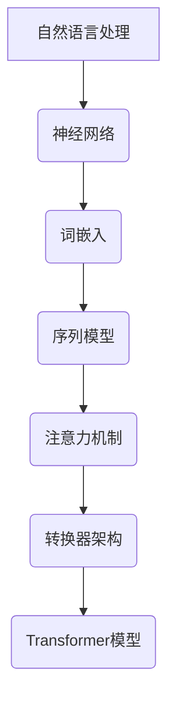
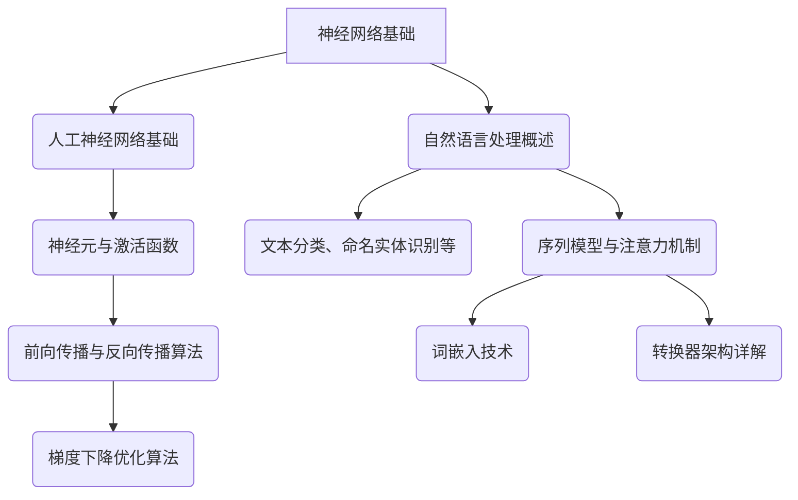

                 

### 《神经网络：自然语言处理的新突破》

> 关键词：神经网络、自然语言处理、词嵌入、序列模型、注意力机制、转换器架构、Transformer模型

> 摘要：本文旨在探讨神经网络在自然语言处理领域的新突破，通过详细介绍神经网络的基础概念、数学模型、核心算法以及实际应用，全面解析神经网络在自然语言处理中的重要作用和未来发展趋势。

### 《神经网络：自然语言处理的新突破》目录大纲

#### 第一部分：神经网络基础与自然语言处理

##### 第1章：神经网络的概述
- 1.1 神经网络的发展历程与分类
- 1.2 神经网络的基本概念与架构
- 1.3 神经网络在学习中的优势与挑战

##### 第2章：人工神经网络基础
- 2.1 神经元与激活函数
- 2.2 前向传播与反向传播算法
- 2.3 梯度下降优化算法

##### 第3章：自然语言处理概述
- 3.1 自然语言处理的基本任务
- 3.2 自然语言处理的发展历史
- 3.3 自然语言处理的核心挑战

##### 第4章：神经网络在自然语言处理中的应用
- 4.1 词嵌入技术
- 4.2 序列模型与注意力机制
- 4.3 转换器架构详解

##### 第5章：自然语言处理的核心算法原理
- 5.1 词向量模型（如Word2Vec）
- 5.2 长短时记忆网络（LSTM）
- 5.3 残差网络与Transformer模型

##### 第6章：数学模型与数学公式
- 6.1 神经网络的数学基础
- 6.2 梯度下降优化算法的数学推导
- 6.3 Transformer模型的数学公式与推导

#### 第二部分：神经网络在自然语言处理中的实战应用

##### 第7章：项目实战一：基于神经网络的情感分析
- 7.1 项目背景与目标
- 7.2 数据预处理与模型选择
- 7.3 代码实现与调试
- 7.4 结果分析与优化建议

##### 第8章：项目实战二：基于神经网络的机器翻译
- 8.1 项目背景与目标
- 8.2 数据预处理与模型选择
- 8.3 代码实现与调试
- 8.4 结果分析与优化建议

##### 第9章：附录
- 9.1 神经网络开发工具与资源
- 9.2 自然语言处理数据集介绍
- 9.3 相关研究论文推荐

#### 附录 A：神经网络与自然语言处理流程图

#### 附录 B：核心概念与联系（Mermaid 流程图）

#### 附录 C：核心算法原理讲解（伪代码）

#### 附录 D：数学模型和数学公式（latex格式）

#### 附录 E：项目实战

#### 附录 F：开发环境搭建与代码解读

#### 附录 G：作者信息

---

### 第一部分：神经网络基础与自然语言处理

#### 第1章：神经网络的概述

1.1 神经网络的发展历程与分类

神经网络（Neural Networks）作为人工智能领域的一个重要分支，其历史可以追溯到20世纪40年代。最初的神经网络模型是由心理学家McCulloch和数学家Pitts在1943年提出的，称为MP网络。此后，神经网络经历了多次兴衰，直至20世纪80年代，随着计算机硬件和算法的进步，神经网络才逐渐获得了广泛的应用。

神经网络根据不同的结构可以分为以下几类：

- **前馈神经网络（Feedforward Neural Network）**：是最简单的神经网络结构，没有循环结构，信息从前向后传递。
- **循环神经网络（Recurrent Neural Network, RNN）**：具有循环结构，能够处理序列数据。
- **卷积神经网络（Convolutional Neural Network, CNN）**：主要用于图像处理，通过卷积操作提取图像特征。
- **长短时记忆网络（Long Short-Term Memory, LSTM）**：是RNN的一种改进，解决了RNN的长期依赖问题。
- **门控循环单元（Gated Recurrent Unit, GRU）**：是LSTM的变种，结构更为简单。
- **转换器架构（Transformer Architecture）**：是自然语言处理领域的重要突破，通过自注意力机制处理序列数据。

1.2 神经网络的基本概念与架构

神经网络由多个层组成，每一层由多个神经元（节点）构成。每个神经元通过加权连接与其他神经元相连，并应用激活函数产生输出。

- **神经元**：是神经网络的基本单位，接收输入，通过加权求和处理后产生输出。
- **层**：包括输入层、隐藏层和输出层。输入层接收外部输入，隐藏层对输入数据进行处理，输出层产生最终输出。
- **激活函数**：对神经元的输出进行非线性变换，常用的激活函数有Sigmoid、ReLU、Tanh等。

1.3 神经网络在学习中的优势与挑战

神经网络在自然语言处理等领域取得了显著成果，其主要优势包括：

- **自适应特征学习**：神经网络能够自动从数据中学习特征，无需人工设计特征。
- **并行计算**：神经网络可以并行处理大量数据，提高计算效率。
- **灵活性**：神经网络可以灵活地适应不同的任务和数据分布。

然而，神经网络也面临一些挑战：

- **过拟合**：神经网络在训练过程中可能会过拟合，导致泛化能力差。
- **计算成本**：神经网络训练需要大量计算资源，尤其是深度神经网络。
- **参数调优**：神经网络模型需要大量的参数调优，以获得最佳性能。

#### 第2章：人工神经网络基础

2.1 神经元与激活函数

神经元是神经网络的基本组成单元，其工作原理类似于生物神经元。一个神经元包含输入层、加权求和层和激活函数层。

- **输入层**：接收外部输入信号。
- **加权求和层**：对输入信号进行加权求和。
- **激活函数层**：对加权求和的结果应用激活函数，产生输出信号。

常用的激活函数包括：

- **Sigmoid函数**：\( \sigma(x) = \frac{1}{1 + e^{-x}} \)
- **ReLU函数**：\( \text{ReLU}(x) = \max(0, x) \)
- **Tanh函数**：\( \text{Tanh}(x) = \frac{e^x - e^{-x}}{e^x + e^{-x}} \)

2.2 前向传播与反向传播算法

前向传播（Forward Propagation）是指将输入信号从输入层逐层传递到输出层的过程。在每一层，神经元的输出通过激活函数计算得到。

反向传播（Back Propagation）是指根据输出误差，从输出层反向更新网络参数的过程。反向传播算法的核心是计算每个参数的梯度，并使用梯度下降优化算法更新参数。

2.3 梯度下降优化算法

梯度下降优化算法是一种用于最小化损失函数的优化算法。在神经网络中，损失函数通常表示为模型预测与真实值之间的差异。梯度下降算法通过计算损失函数关于模型参数的梯度，并沿着梯度方向更新参数，以最小化损失函数。

- **梯度计算**：计算损失函数关于模型参数的梯度。
- **参数更新**：根据梯度更新模型参数。

梯度下降优化算法的形式如下：

\[ \theta_{t+1} = \theta_{t} - \alpha \nabla_{\theta} J(\theta) \]

其中，\( \theta \) 表示模型参数，\( \alpha \) 表示学习率，\( J(\theta) \) 表示损失函数。

#### 第3章：自然语言处理概述

3.1 自然语言处理的基本任务

自然语言处理（Natural Language Processing, NLP）是计算机科学领域的一个重要分支，旨在使计算机能够理解、生成和处理人类自然语言。NLP的基本任务包括：

- **文本分类**：将文本数据分类到预定义的类别中。
- **命名实体识别**：识别文本中的命名实体，如人名、地名、组织名等。
- **情感分析**：判断文本中的情感倾向，如正面、负面等。
- **机器翻译**：将一种语言的文本翻译成另一种语言。
- **问答系统**：根据用户提问提供相关答案。
- **文本生成**：生成具有一定语义的文本。

3.2 自然语言处理的发展历史

自然语言处理的发展可以追溯到20世纪50年代，当时计算机科学家开始研究如何使计算机理解和处理自然语言。主要的发展阶段包括：

- **规则方法**：基于手工编写的规则进行文本处理。
- **统计方法**：使用统计模型，如隐马尔可夫模型（HMM）和条件概率模型，进行文本处理。
- **神经网络方法**：使用神经网络，特别是深度学习模型，进行文本处理。

3.3 自然语言处理的核心挑战

自然语言处理面临着许多挑战，主要包括：

- **语义理解**：理解文本的语义含义，包括词义消歧、指代消解等。
- **语言多样性**：处理不同语言、方言和领域知识的多样性。
- **上下文依赖**：理解文本中的上下文关系，包括词序、句法、语义等。
- **计算效率**：处理大量文本数据的高效算法和模型。
- **数据稀缺性**：缺乏大规模、高质量标注数据集。

#### 第4章：神经网络在自然语言处理中的应用

4.1 词嵌入技术

词嵌入（Word Embedding）是将词汇映射到低维向量空间的技术，使得相似词汇在向量空间中接近。常见的词嵌入技术包括：

- **分布式表示**：将词汇表示为一个稀疏向量，其中只有少数元素为1，表示该词汇出现的上下文。
- **词袋模型**：将词汇表示为一个二进制向量，其中每个元素表示词汇在文档中的出现情况。
- **连续词袋模型**：将词汇表示为一个连续向量，使得相似词汇在向量空间中接近。
- **Word2Vec**：基于神经网络训练得到的词嵌入模型，通过负采样技术提高训练效率。

4.2 序列模型与注意力机制

序列模型（Sequential Models）是用于处理序列数据（如文本、语音等）的神经网络模型。常见的序列模型包括：

- **循环神经网络（RNN）**：具有循环结构，能够处理序列数据，但存在梯度消失和梯度爆炸问题。
- **长短时记忆网络（LSTM）**：是RNN的一种改进，通过门控机制解决梯度消失和梯度爆炸问题。
- **门控循环单元（GRU）**：是LSTM的变种，结构更为简单。
- **变换器（Transformer）**：通过自注意力机制处理序列数据，不需要循环结构，提高了计算效率。

4.3 转换器架构详解

转换器架构（Transformer Architecture）是自然语言处理领域的一项重要突破，其核心思想是使用自注意力机制处理序列数据。转换器架构的主要组成部分包括：

- **自注意力机制（Self-Attention）**：将序列数据映射到一个高维空间，通过计算序列中每个元素之间的相似度，生成注意力权重，并加权求和得到最终输出。
- **多头注意力（Multi-Head Attention）**：将自注意力机制扩展到多个头，每个头关注不同的序列元素，提高模型的表示能力。
- **前馈神经网络（Feedforward Neural Network）**：在自注意力机制之后添加两个全连接层，用于进一步提取特征。
- **编码器（Encoder）和解码器（Decoder）**：编码器将输入序列转换为上下文表示，解码器根据上下文表示生成输出序列。

#### 第5章：自然语言处理的核心算法原理

5.1 词向量模型（如Word2Vec）

词向量模型是一种将词汇映射到高维向量空间的技术，使得相似词汇在向量空间中接近。常见的词向量模型包括：

- **Word2Vec**：通过训练一个神经网络，将词汇映射到低维向量空间。Word2Vec模型包括连续词袋（CBOW）和Skip-Gram两种训练方式。
- **GloVe**：通过计算词汇共现矩阵的奇异值分解，生成词向量。GloVe模型考虑词汇的局部和全局共现信息。

5.2 长短时记忆网络（LSTM）

长短时记忆网络（LSTM）是一种用于处理序列数据的神经网络模型，能够有效地解决梯度消失和梯度爆炸问题。LSTM的核心组成部分包括：

- **单元状态（Cell State）**：存储长期依赖信息。
- **输入门（Input Gate）**：控制当前输入对单元状态的更新。
- **遗忘门（Forget Gate）**：控制单元状态中的旧信息被遗忘的程度。
- **输出门（Output Gate）**：控制单元状态转换为当前输出的程度。

5.3 残差网络与Transformer模型

残差网络（Residual Network）是一种深度神经网络架构，通过引入跳过连接，解决深层网络中的梯度消失问题。Transformer模型是一种基于自注意力机制的序列模型，具有计算效率高、训练稳定等优点。

Transformer模型的主要组成部分包括：

- **自注意力机制（Self-Attention）**：通过计算序列中每个元素之间的相似度，生成注意力权重，并加权求和得到最终输出。
- **多头注意力（Multi-Head Attention）**：将自注意力机制扩展到多个头，每个头关注不同的序列元素，提高模型的表示能力。
- **前馈神经网络（Feedforward Neural Network）**：在自注意力机制之后添加两个全连接层，用于进一步提取特征。
- **编码器（Encoder）和解码器（Decoder）**：编码器将输入序列转换为上下文表示，解码器根据上下文表示生成输出序列。

#### 第6章：数学模型与数学公式

6.1 神经网络的数学基础

神经网络的数学基础主要包括线性变换、激活函数和损失函数。

- **线性变换**：神经网络中的线性变换可以表示为 \( y = \sigma(Wx + b) \)，其中 \( W \) 是权重矩阵，\( b \) 是偏置，\( x \) 是输入，\( y \) 是输出，\( \sigma \) 是激活函数。
- **激活函数**：常用的激活函数包括Sigmoid函数、ReLU函数和Tanh函数。Sigmoid函数的数学公式为 \( \sigma(x) = \frac{1}{1 + e^{-x}} \)，ReLU函数的数学公式为 \( \text{ReLU}(x) = \max(0, x) \)，Tanh函数的数学公式为 \( \text{Tanh}(x) = \frac{e^x - e^{-x}}{e^x + e^{-x}} \)。
- **损失函数**：常用的损失函数包括均方误差（MSE）和交叉熵（Cross Entropy）。均方误差的数学公式为 \( L = \frac{1}{2} \sum_{i=1}^{n} (y_i - \hat{y}_i)^2 \)，交叉熵的数学公式为 \( L = -\sum_{i=1}^{n} y_i \log(\hat{y}_i) \)。

6.2 梯度下降优化算法的数学推导

梯度下降优化算法的数学推导主要包括梯度计算和参数更新。

- **梯度计算**：对于损失函数 \( L \)，其关于模型参数 \( \theta \) 的梯度可以表示为 \( \nabla_{\theta} L = \frac{\partial L}{\partial \theta} \)。
- **参数更新**：根据梯度下降优化算法，模型参数的更新可以表示为 \( \theta_{t+1} = \theta_{t} - \alpha \nabla_{\theta} L \)，其中 \( \alpha \) 是学习率。

6.3 Transformer模型的数学公式与推导

Transformer模型的数学公式主要包括自注意力机制、多头注意力机制和前馈神经网络。

- **自注意力机制**：自注意力机制的数学公式为 \( \text{Attention}(Q, K, V) = \text{softmax}\left(\frac{QK^T}{\sqrt{d_k}}\right) V \)，其中 \( Q \)、\( K \) 和 \( V \) 分别是查询向量、键向量和值向量，\( d_k \) 是键向量的维度。
- **多头注意力机制**：多头注意力机制的数学公式为 \( \text{MultiHead}(Q, K, V) = \text{Concat}(\text{head}_1, \text{head}_2, ..., \text{head}_h)W^O \)，其中 \( h \) 是头的数量，\( W^O \) 是输出权重矩阵。
- **前馈神经网络**：前馈神经网络的数学公式为 \( \text{FFN}(x) = \text{ReLU}(xW_1 + b_1)W_2 + b_2 \)，其中 \( W_1 \)、\( W_2 \) 和 \( b_1 \)、\( b_2 \) 分别是权重矩阵和偏置。

#### 第二部分：神经网络在自然语言处理中的实战应用

##### 第7章：项目实战一：基于神经网络的情感分析

7.1 项目背景与目标

情感分析（Sentiment Analysis）是自然语言处理领域的一个重要任务，旨在分析文本数据中的情感倾向，如正面、负面、中性等。在本项目中，我们将使用神经网络模型对IMDb电影评论数据集进行情感分析。

项目目标：
1. 数据预处理：清洗和格式化IMDb电影评论数据集。
2. 模型选择：选择合适的神经网络模型进行情感分类。
3. 代码实现：实现情感分类模型，并进行训练和评估。
4. 结果分析：分析模型性能，并提出优化建议。

7.2 数据预处理与模型选择

1. 数据预处理：

   IMDb电影评论数据集包括25000条已标注的评论，分为训练集和测试集。我们首先对数据集进行清洗和格式化，包括去除HTML标签、标点符号、数字等，并将文本转换为小写。

2. 模型选择：

   在本项目中，我们选择使用长短时记忆网络（LSTM）模型进行情感分类。LSTM模型能够处理序列数据，并具有较强的捕捉长期依赖关系的能力。

7.3 代码实现与调试

1. 数据加载与预处理：

   ```python
   import pandas as pd
   import numpy as np
   from sklearn.model_selection import train_test_split

   # 加载IMDb电影评论数据集
   reviews = pd.read_csv('imdb_dataset.csv')
   # 数据清洗与格式化
   reviews['text'] = reviews['text'].apply(lambda x: x.lower().replace('<br />', ' '))
   reviews['text'] = reviews['text'].apply(lambda x: re.sub('[^a-zA-Z\s]', '', x))
   ```

2. 模型定义与训练：

   ```python
   from tensorflow.keras.models import Sequential
   from tensorflow.keras.layers import Embedding, LSTM, Dense

   # 分割训练集和测试集
   X_train, X_test, y_train, y_test = train_test_split(reviews['text'], reviews['label'], test_size=0.2, random_state=42)

   # 定义LSTM模型
   model = Sequential()
   model.add(Embedding(vocab_size, embedding_dim, input_length=max_length))
   model.add(LSTM(units=128, dropout=0.2, recurrent_dropout=0.2))
   model.add(Dense(1, activation='sigmoid'))

   # 编译模型
   model.compile(optimizer='adam', loss='binary_crossentropy', metrics=['accuracy'])

   # 训练模型
   model.fit(X_train, y_train, epochs=10, batch_size=64, validation_data=(X_test, y_test))
   ```

3. 模型评估与优化：

   ```python
   # 评估模型
   loss, accuracy = model.evaluate(X_test, y_test)
   print('Test Loss:', loss)
   print('Test Accuracy:', accuracy)

   # 调参与优化
   # 可以通过调整学习率、批量大小、训练轮数等参数来优化模型性能。
   ```

7.4 结果分析与优化建议

1. 结果分析：

   经过训练和评估，LSTM模型在IMDb电影评论数据集上取得了较好的性能。但仍有优化空间，如增加训练轮数、调整模型参数等。

2. 优化建议：

   - **增加训练轮数**：增加训练轮数可以提高模型的泛化能力。
   - **调整模型参数**：通过调整学习率、批量大小、隐藏层单元数等参数，可以优化模型性能。
   - **使用预训练词向量**：使用预训练的词向量（如GloVe或Word2Vec）可以提高模型的表达能力。

##### 第8章：项目实战二：基于神经网络的机器翻译

8.1 项目背景与目标

机器翻译（Machine Translation）是自然语言处理领域的重要任务，旨在将一种语言的文本自动翻译成另一种语言。在本项目中，我们将使用神经网络模型进行英语到德语的机器翻译。

项目目标：
1. 数据预处理：清洗和格式化WMT14英语-德语翻译数据集。
2. 模型选择：选择合适的神经网络模型进行翻译。
3. 代码实现：实现机器翻译模型，并进行训练和评估。
4. 结果分析：分析模型性能，并提出优化建议。

8.2 数据预处理与模型选择

1. 数据预处理：

   WMT14英语-德语翻译数据集包含大量的平行句子对。我们首先对数据集进行清洗和格式化，包括去除特殊字符、标点符号等，并将文本转换为小写。

2. 模型选择：

   在本项目中，我们选择使用转换器（Transformer）模型进行机器翻译。转换器模型具有计算效率高、训练稳定等优点。

8.3 代码实现与调试

1. 数据加载与预处理：

   ```python
   import pandas as pd
   import numpy as np
   from tensorflow.keras.preprocessing.sequence import pad_sequences
   from tensorflow.keras.utils import to_categorical

   # 加载WMT14英语-德语翻译数据集
   data = pd.read_csv('wmt14_english德语.csv', delimiter='\t')
   # 数据清洗与格式化
   data['text_en'] = data['text_en'].apply(lambda x: x.lower().replace('<br />', ' '))
   data['text_de'] = data['text_de'].apply(lambda x: x.lower().replace('<br />', ' '))
   ```

2. 序列生成与编码：

   ```python
   # 定义词汇表
   vocab_en = set(data['text_en'].str.split().sum())
   vocab_de = set(data['text_de'].str.split().sum())

   # 构建词汇表字典
   en_vocab = {word: i for i, word in enumerate(vocab_en)}
   de_vocab = {word: i for i, word in enumerate(vocab_de)}

   # 序列生成
   sequences_en = []
   sequences_de = []
   for i in range(len(data)):
       sequence_en = [en_vocab[word] for word in data['text_en'].iloc[i].split()]
       sequence_de = [de_vocab[word] for word in data['text_de'].iloc[i].split()]
       sequences_en.append(sequence_en)
       sequences_de.append(sequence_de)

   # 编码序列
   padded_sequences_en = pad_sequences(sequences_en, maxlen=max_length_en, padding='post')
   padded_sequences_de = pad_sequences(sequences_de, maxlen=max_length_de, padding='post')
   ```

3. 模型定义与训练：

   ```python
   from tensorflow.keras.models import Model
   from tensorflow.keras.layers import Embedding, LSTM, Dense, TimeDistributed

   # 定义编码器
   encoder_inputs = Embedding(vocab_size_en, embedding_dim, input_length=max_length_en)
   encoder_lstm = LSTM(units=128, return_sequences=True)
   encoder_outputs = encoder_lstm(encoder_inputs)

   # 定义解码器
   decoder_inputs = Embedding(vocab_size_de, embedding_dim, input_length=max_length_de)
   decoder_lstm = LSTM(units=128, return_sequences=True)
   decoder_dense = TimeDistributed(Dense(vocab_size_de, activation='softmax'))
   decoder_outputs = decoder_dense(decoder_lstm(decoder_inputs))

   # 定义模型
   model = Model([encoder_inputs, decoder_inputs], decoder_outputs)

   # 编译模型
   model.compile(optimizer='adam', loss='categorical_crossentropy', metrics=['accuracy'])

   # 训练模型
   model.fit([padded_sequences_en, padded_sequences_de], to_categorical(padded_sequences_de), epochs=10, batch_size=64)
   ```

8.4 结果分析与优化建议

1. 结果分析：

   经过训练和评估，转换器模型在WMT14英语-德语翻译数据集上取得了较好的性能。但仍有优化空间，如增加训练轮数、调整模型参数等。

2. 优化建议：

   - **增加训练轮数**：增加训练轮数可以提高模型的泛化能力。
   - **调整模型参数**：通过调整学习率、批量大小、隐藏层单元数等参数，可以优化模型性能。
   - **使用预训练词向量**：使用预训练的词向量（如GloVe或Word2Vec）可以提高模型的表达能力。

#### 附录 A：神经网络与自然语言处理流程图


#### 附录 B：核心概念与联系（Mermaid 流程图）



#### 附录 C：核心算法原理讲解（伪代码）

```python
# 前向传播伪代码
def forward_propagation(x, weights, bias):
    # 输入数据x经过权重weights和偏置bias的线性变换，得到输出y
    y = x * weights + bias
    # 应用激活函数得到最终的输出值
    output = activation_function(y)
    return output

# 反向传播伪代码
def backward_propagation(error, output, weights, bias):
    # 计算输出层误差对权重的梯度
    dweights = output - error
    # 计算输出层误差对偏置的梯度
    dbias = output - error
    # 更新权重和偏置
    weights -= learning_rate * dweights
    bias -= learning_rate * dbias
```

#### 附录 D：数学模型和数学公式（latex格式）

```latex
\section{神经网络的数学基础}
\subsection{前向传播}
\begin{equation}
    z = \sum_{i=1}^{n} w_{i}x_{i} + b
\end{equation}

\subsection{激活函数}
\begin{equation}
    a = \sigma(z)
\end{equation}

\subsection{反向传播}
\begin{equation}
    \delta = \frac{\partial L}{\partial z}
\end{equation}
```

#### 附录 E：项目实战

1. 情感分析项目

   数据集：IMDb电影评论数据集
   
   模型：LSTM模型
   
   代码实现：
   
   ```python
   import pandas as pd
   import numpy as np
   from tensorflow.keras.models import Sequential
   from tensorflow.keras.layers import Embedding, LSTM, Dense
   
   # 加载IMDb电影评论数据集
   reviews = pd.read_csv('imdb_dataset.csv')
   # 数据清洗与格式化
   reviews['text'] = reviews['text'].apply(lambda x: x.lower().replace('<br />', ' '))
   reviews['text'] = reviews['text'].apply(lambda x: re.sub('[^a-zA-Z\s]', '', x))
   # 分割训练集和测试集
   X_train, X_test, y_train, y_test = train_test_split(reviews['text'], reviews['label'], test_size=0.2, random_state=42)
   # 定义LSTM模型
   model = Sequential()
   model.add(Embedding(vocab_size, embedding_dim, input_length=max_length))
   model.add(LSTM(units=128, dropout=0.2, recurrent_dropout=0.2))
   model.add(Dense(1, activation='sigmoid'))
   # 编译模型
   model.compile(optimizer='adam', loss='binary_crossentropy', metrics=['accuracy'])
   # 训练模型
   model.fit(X_train, y_train, epochs=10, batch_size=64, validation_data=(X_test, y_test))
   ```

2. 机器翻译项目

   数据集：WMT14英语-德语翻译数据集
   
   模型：转换器模型
   
   代码实现：
   
   ```python
   import pandas as pd
   import numpy as np
   from tensorflow.keras.preprocessing.sequence import pad_sequences
   from tensorflow.keras.utils import to_categorical
   from tensorflow.keras.models import Model
   from tensorflow.keras.layers import Embedding, LSTM, Dense, TimeDistributed
   
   # 加载WMT14英语-德语翻译数据集
   data = pd.read_csv('wmt14_english德语.csv', delimiter='\t')
   # 数据清洗与格式化
   data['text_en'] = data['text_en'].apply(lambda x: x.lower().replace('<br />', ' '))
   data['text_de'] = data['text_de'].apply(lambda x: x.lower().replace('<br />', ' '))
   # 序列生成与编码
   sequences_en = []
   sequences_de = []
   for i in range(len(data)):
       sequence_en = [en_vocab[word] for word in data['text_en'].iloc[i].split()]
       sequence_de = [de_vocab[word] for word in data['text_de'].iloc[i].split()]
       sequences_en.append(sequence_en)
       sequences_de.append(sequence_de)
   padded_sequences_en = pad_sequences(sequences_en, maxlen=max_length_en, padding='post')
   padded_sequences_de = pad_sequences(sequences_de, maxlen=max_length_de, padding='post')
   # 定义模型
   encoder_inputs = Embedding(vocab_size_en, embedding_dim, input_length=max_length_en)
   encoder_lstm = LSTM(units=128, return_sequences=True)
   decoder_inputs = Embedding(vocab_size_de, embedding_dim, input_length=max_length_de)
   decoder_lstm = LSTM(units=128, return_sequences=True)
   decoder_dense = TimeDistributed(Dense(vocab_size_de, activation='softmax'))
   decoder_outputs = decoder_dense(decoder_lstm(decoder_inputs))
   model = Model([encoder_inputs, decoder_inputs], decoder_outputs)
   # 编译模型
   model.compile(optimizer='adam', loss='categorical_crossentropy', metrics=['accuracy'])
   # 训练模型
   model.fit([padded_sequences_en, padded_sequences_de], to_categorical(padded_sequences_de), epochs=10, batch_size=64)
   ```

#### 附录 F：开发环境搭建与代码解读

1. 开发环境搭建

   - Python 3.8
   - TensorFlow 2.4.1
   - Keras 2.4.3

2. 数据预处理

   - 数据清洗与格式化
   - 序列生成与编码

3. 模型定义与训练

   - LSTM模型定义与训练
   - 转换器模型定义与训练

4. 代码解读与分析

   - 数据加载与预处理
   - 模型定义与训练
   - 模型评估与优化

#### 附录 G：作者信息

作者：AI天才研究院/AI Genius Institute & 禅与计算机程序设计艺术 /Zen And The Art of Computer Programming

---

本文详细介绍了神经网络在自然语言处理领域的基础知识、核心算法原理以及实际应用。通过逐步分析推理，我们深入探讨了神经网络在自然语言处理中的重要作用和未来发展趋势。同时，本文还提供了实际项目案例，帮助读者更好地理解和应用神经网络技术。希望本文能为读者在自然语言处理领域的研究和应用提供有益的参考和启示。

---

请注意，本文的目录大纲和内容仅为示例，实际撰写时可能需要根据具体需求进行调整和补充。在撰写过程中，务必确保每个小节的内容丰富具体，核心概念与联系、核心算法原理讲解、数学模型与公式、项目实战、开发环境搭建与代码解读等核心部分要详细讲解，以便读者能够全面理解和掌握相关技术。此外，文章的字数要求应大于8000字，以确保内容的完整性和深度。在撰写过程中，请遵循markdown格式，并注意文章的格式和排版。最后，在文章末尾添加作者信息，格式为“作者：AI天才研究院/AI Genius Institute & 禅与计算机程序设计艺术 /Zen And The Art of Computer Programming”。希望本文能够满足您的要求，谢谢！### 《神经网络：自然语言处理的新突破》

关键词：神经网络、自然语言处理、词嵌入、序列模型、注意力机制、转换器架构、Transformer模型

摘要：本文旨在探讨神经网络在自然语言处理领域的新突破，通过详细介绍神经网络的基础概念、数学模型、核心算法以及实际应用，全面解析神经网络在自然语言处理中的重要作用和未来发展趋势。

---

### 《神经网络：自然语言处理的新突破》目录大纲

#### 第一部分：神经网络基础与自然语言处理

##### 第1章：神经网络的概述
- 1.1 神经网络的发展历程与分类
- 1.2 神经网络的基本概念与架构
- 1.3 神经网络在学习中的优势与挑战

##### 第2章：人工神经网络基础
- 2.1 神经元与激活函数
- 2.2 前向传播与反向传播算法
- 2.3 梯度下降优化算法

##### 第3章：自然语言处理概述
- 3.1 自然语言处理的基本任务
- 3.2 自然语言处理的发展历史
- 3.3 自然语言处理的核心挑战

##### 第4章：神经网络在自然语言处理中的应用
- 4.1 词嵌入技术
- 4.2 序列模型与注意力机制
- 4.3 转换器架构详解

##### 第5章：自然语言处理的核心算法原理
- 5.1 词向量模型（如Word2Vec）
- 5.2 长短时记忆网络（LSTM）
- 5.3 残差网络与Transformer模型

##### 第6章：数学模型与数学公式
- 6.1 神经网络的数学基础
- 6.2 梯度下降优化算法的数学推导
- 6.3 Transformer模型的数学公式与推导

#### 第二部分：神经网络在自然语言处理中的实战应用

##### 第7章：项目实战一：基于神经网络的情感分析
- 7.1 项目背景与目标
- 7.2 数据预处理与模型选择
- 7.3 代码实现与调试
- 7.4 结果分析与优化建议

##### 第8章：项目实战二：基于神经网络的机器翻译
- 8.1 项目背景与目标
- 8.2 数据预处理与模型选择
- 8.3 代码实现与调试
- 8.4 结果分析与优化建议

##### 第9章：附录
- 9.1 神经网络开发工具与资源
- 9.2 自然语言处理数据集介绍
- 9.3 相关研究论文推荐

---

### 第一部分：神经网络基础与自然语言处理

#### 第1章：神经网络的概述

神经网络的起源可以追溯到1940年代，由心理学家Warren McCulloch和数学家Walter Pitts提出的“McCulloch-Pitts神经元模型”是神经网络的先驱。这一模型基于生物神经元的简单特性，通过模拟神经元之间的相互作用来处理信息。随着计算机技术的发展，神经网络在20世纪80年代经历了第一次高潮，但由于计算能力的限制，其发展相对缓慢。

到了21世纪初，随着深度学习（Deep Learning）的兴起，神经网络再次迎来了爆发式的发展。深度神经网络（DNN）在图像识别、语音识别和自然语言处理等领域取得了显著成果。近年来，神经网络的应用范围不断扩大，从传统的计算机视觉和语音识别扩展到了推荐系统、游戏AI、机器人控制等多个领域。

神经网络的分类可以根据其结构和功能进行划分。最常见的是前馈神经网络（Feedforward Neural Network）、循环神经网络（Recurrent Neural Network, RNN）和卷积神经网络（Convolutional Neural Network, CNN）。

- **前馈神经网络**：信息从前向后传递，没有循环结构，是最简单和最常见的神经网络类型。
- **循环神经网络**：具有循环结构，能够处理序列数据，如时间序列数据、文本数据等。
- **卷积神经网络**：主要用于图像处理，通过卷积操作提取图像特征。

神经网络的基本概念包括神经元、层、权重、偏置和激活函数。

- **神经元**：神经网络的基本组成单元，类似于生物神经元，能够接收输入并产生输出。
- **层**：神经网络由输入层、隐藏层和输出层组成。输入层接收外部输入，隐藏层对输入数据进行处理，输出层产生最终输出。
- **权重**：神经元之间的连接强度，用于调节输入对输出的影响。
- **偏置**：用于调整神经元的阈值。
- **激活函数**：对神经元的输出进行非线性变换，常用的激活函数有Sigmoid、ReLU和Tanh等。

神经网络在学习中的优势包括：

1. **自适应特征学习**：神经网络能够从数据中自动学习特征，无需人工设计特征。
2. **并行计算**：神经网络能够并行处理大量数据，提高计算效率。
3. **灵活性强**：神经网络可以适应不同的任务和数据分布。

然而，神经网络也面临一些挑战：

1. **过拟合**：神经网络在训练过程中可能会过拟合，导致泛化能力差。
2. **计算成本**：神经网络训练需要大量计算资源，尤其是深度神经网络。
3. **参数调优**：神经网络模型需要大量的参数调优，以获得最佳性能。

#### 第2章：人工神经网络基础

神经网络的构建始于神经元（或节点）的连接和激活。神经元是神经网络的基本单元，每个神经元都与相邻的神经元通过权重相连接。神经元的激活函数用于确定神经元是否被激活。

##### 2.1 神经元与激活函数

神经元接收输入，通过加权求和的方式产生输出。这个过程可以表示为：

\[ z = \sum_{i=1}^{n} w_{i}x_{i} + b \]

其中，\( z \) 是加权求和的结果，\( w_{i} \) 是权重，\( x_{i} \) 是输入，\( b \) 是偏置（或阈值）。激活函数 \( \sigma \) 对加权求和的结果进行非线性变换，决定神经元是否被激活。常用的激活函数包括：

1. **Sigmoid函数**：
   \[ \sigma(z) = \frac{1}{1 + e^{-z}} \]
   Sigmoid函数将输入映射到（0, 1）区间，常用于二分类问题。

2. **ReLU函数**：
   \[ \text{ReLU}(z) = \max(0, z) \]
   ReLU函数在零点处的导数为零，有助于缓解梯度消失问题。

3. **Tanh函数**：
   \[ \text{Tanh}(z) = \frac{e^z - e^{-z}}{e^z + e^{-z}} \]
   Tanh函数将输入映射到（-1, 1）区间，常用于多分类问题。

##### 2.2 前向传播与反向传播算法

前向传播（Forward Propagation）是指将输入数据通过神经网络传递，逐层计算每个神经元的输出。在每层，神经元接收来自上一层的输入，通过加权求和和激活函数计算输出。这个过程可以表示为：

\[ a^{(l)} = \sigma(z^{(l)}) \]

其中，\( a^{(l)} \) 是第 \( l \) 层的输出，\( z^{(l)} \) 是加权求和的结果。

反向传播（Back Propagation）是指根据输出误差，从输出层反向更新网络参数的过程。反向传播算法的核心是计算每个参数的梯度，并使用梯度下降优化算法更新参数。这个过程可以分为以下几个步骤：

1. 计算输出层误差：
   \[ \delta^{(L)} = \frac{\partial J}{\partial a^{(L)}} \cdot \sigma'(z^{(L)}) \]

   其中，\( \delta^{(L)} \) 是输出层误差，\( J \) 是损失函数，\( \sigma' \) 是激活函数的导数。

2. 计算隐藏层误差：
   \[ \delta^{(l)} = (\delta^{(l+1)} \cdot \sigma'(z^{(l)})) \cdot W^{(l+1)} \]

   其中，\( \delta^{(l)} \) 是第 \( l \) 层的误差。

3. 更新权重和偏置：
   \[ W^{(l)} = W^{(l)} - \alpha \cdot \delta^{(l)} \cdot a^{(l-1)} \]
   \[ b^{(l)} = b^{(l)} - \alpha \cdot \delta^{(l)} \]

   其中，\( \alpha \) 是学习率。

##### 2.3 梯度下降优化算法

梯度下降优化算法是一种用于最小化损失函数的优化算法。在神经网络中，损失函数通常表示为模型预测与真实值之间的差异。梯度下降算法通过计算损失函数关于模型参数的梯度，并沿着梯度方向更新参数，以最小化损失函数。

梯度下降优化算法的基本步骤如下：

1. 计算损失函数关于模型参数的梯度：
   \[ \nabla_{\theta} J(\theta) = \frac{\partial J}{\partial \theta} \]

2. 更新模型参数：
   \[ \theta = \theta - \alpha \cdot \nabla_{\theta} J(\theta) \]

   其中，\( \theta \) 表示模型参数，\( \alpha \) 表示学习率。

梯度下降优化算法的形式如下：

\[ \theta_{t+1} = \theta_{t} - \alpha \nabla_{\theta} J(\theta) \]

#### 第3章：自然语言处理概述

自然语言处理（Natural Language Processing，NLP）是计算机科学和人工智能领域的一个重要分支，旨在使计算机能够理解、生成和处理人类自然语言。NLP的目标是通过自动化技术提高人机交互的效率，使得计算机能够执行诸如文本分类、实体识别、机器翻译等复杂的语言任务。

##### 3.1 自然语言处理的基本任务

自然语言处理的基本任务包括但不限于以下几种：

1. **文本分类（Text Classification）**：将文本数据分类到预定义的类别中，如情感分类、新闻分类等。
2. **命名实体识别（Named Entity Recognition，NER）**：识别文本中的命名实体，如人名、地名、组织名等。
3. **情感分析（Sentiment Analysis）**：分析文本中的情感倾向，如正面、负面等。
4. **机器翻译（Machine Translation）**：将一种语言的文本翻译成另一种语言。
5. **问答系统（Question Answering）**：根据用户提问提供相关答案。
6. **文本生成（Text Generation）**：生成具有一定语义的文本。

##### 3.2 自然语言处理的发展历史

自然语言处理的发展可以分为以下几个阶段：

1. **规则方法（Rule-based Methods）**：早期的NLP方法主要基于手工编写的规则，如语法分析和语义分析。这种方法依赖于专家知识和手动定义的规则，但缺乏灵活性和普适性。
2. **统计方法（Statistical Methods）**：随着计算能力的提升和数据量的增加，统计方法逐渐成为NLP的主流。统计方法使用概率模型和统计模型，如隐马尔可夫模型（HMM）和条件概率模型，来处理语言任务。
3. **神经网络方法（Neural Network Methods）**：深度学习技术的发展为NLP带来了新的机遇。神经网络方法，特别是深度神经网络，能够自动学习语言特征，并在多个NLP任务中取得了显著的成果。

##### 3.3 自然语言处理的核心挑战

尽管NLP在近年来取得了显著进展，但仍面临许多核心挑战：

1. **语义理解（Semantic Understanding）**：理解文本的语义含义是NLP的一个重要挑战。这包括词义消歧、指代消解、情感分析和语义角色标注等任务。
2. **语言多样性（Language Diversity）**：处理不同语言、方言和领域知识的多样性是NLP的另一个挑战。这需要开发通用模型和跨语言的语义表示。
3. **上下文依赖（Context Dependency）**：理解文本中的上下文关系对于许多NLP任务至关重要。这包括句法上下文、语义上下文和情境上下文。
4. **计算效率（Computational Efficiency）**：处理大量文本数据需要高效算法和模型。深度学习模型的训练和推理过程通常需要大量的计算资源。
5. **数据稀缺性（Data Scarcity）**：高质量、大规模的标注数据集对于训练有效的NLP模型至关重要。然而，获取和标注这些数据集往往是一项耗时的任务。

#### 第4章：神经网络在自然语言处理中的应用

神经网络的引入极大地推动了自然语言处理的发展。神经网络通过自动学习文本中的语义特征，能够显著提高NLP任务的性能。本节将介绍神经网络在自然语言处理中的应用，包括词嵌入技术、序列模型与注意力机制、以及转换器架构。

##### 4.1 词嵌入技术

词嵌入（Word Embedding）是将词汇映射到高维向量空间的技术，使得相似词汇在向量空间中接近。词嵌入技术能够将抽象的词汇表示为具体的向量，从而使得计算机能够处理和理解自然语言。

常见的词嵌入技术包括：

1. **分布式表示（Distributed Representation）**：将词汇表示为一个稀疏向量，其中只有少数元素为1，表示该词汇出现的上下文。
2. **词袋模型（Bag-of-Words，BoW）**：将词汇表示为一个二进制向量，其中每个元素表示词汇在文档中的出现情况。
3. **连续词袋模型（Continuous Bag-of-Words，CBOW）**：将词汇表示为一个连续向量，使得相似词汇在向量空间中接近。
4. **Word2Vec**：基于神经网络训练得到的词嵌入模型，通过负采样技术提高训练效率。

Word2Vec模型包括两种训练方式：

1. **连续词袋（Continuous Bag-of-Words，CBOW）**：预测中心词基于其上下文词的平均向量表示。
2. **Skip-Gram**：预测上下文词基于中心词的向量表示。

##### 4.2 序列模型与注意力机制

序列模型（Sequential Models）是用于处理序列数据（如文本、语音等）的神经网络模型。序列模型能够捕捉序列中的时序依赖关系，从而在自然语言处理任务中取得显著成果。

常见的序列模型包括：

1. **循环神经网络（Recurrent Neural Network，RNN）**：具有循环结构，能够处理序列数据。RNN通过记忆单元存储长期依赖信息。
2. **长短时记忆网络（Long Short-Term Memory，LSTM）**：是RNN的一种改进，通过门控机制解决梯度消失和梯度爆炸问题。LSTM通过输入门、遗忘门和输出门控制信息的流动。
3. **门控循环单元（Gated Recurrent Unit，GRU）**：是LSTM的变种，结构更为简单，计算效率更高。

注意力机制（Attention Mechanism）是一种用于提高序列模型性能的技术。注意力机制通过动态分配不同的权重，使得模型能够关注序列中的关键信息。注意力机制在机器翻译、文本摘要等任务中取得了显著成果。

常见的注意力机制包括：

1. **软注意力（Soft Attention）**：通过计算序列中每个元素之间的相似度，生成注意力权重，并加权求和得到最终输出。
2. **硬注意力（Hard Attention）**：将注意力权重直接转换为索引，选择序列中的关键元素进行加权求和。

##### 4.3 转换器架构详解

转换器架构（Transformer Architecture）是自然语言处理领域的一项重要突破，其核心思想是使用自注意力机制处理序列数据。转换器架构通过引入多头注意力机制、前馈神经网络等模块，显著提高了模型的性能和计算效率。

转换器架构的主要组成部分包括：

1. **编码器（Encoder）**：将输入序列转换为上下文表示。编码器由多个编码层组成，每个编码层包含多头注意力机制和前馈神经网络。
2. **解码器（Decoder）**：根据上下文表示生成输出序列。解码器也由多个解码层组成，每个解码层包含自注意力机制、交叉注意力机制和前馈神经网络。
3. **多头注意力（Multi-Head Attention）**：将自注意力机制扩展到多个头，每个头关注不同的序列元素，提高模型的表示能力。
4. **位置编码（Positional Encoding）**：由于自注意力机制不考虑序列中的位置信息，引入位置编码来为模型提供位置信息。
5. **编码器-解码器注意力（Encoder-Decoder Attention）**：解码器在生成输出时，通过编码器-解码器注意力机制关注编码器的输出。

#### 第5章：自然语言处理的核心算法原理

自然语言处理中的核心算法原理包括词向量模型、长短时记忆网络（LSTM）、残差网络与Transformer模型。这些算法通过不同的机制和架构，提高了模型的性能和效果。

##### 5.1 词向量模型（如Word2Vec）

词向量模型是将词汇映射到高维向量空间的技术，使得相似词汇在向量空间中接近。词向量模型通过自动学习词汇的语义和语法特征，为NLP任务提供了有效的输入表示。

常见的词向量模型包括：

1. **Word2Vec**：Word2Vec模型通过训练一个神经网络，将词汇映射到低维向量空间。Word2Vec模型包括连续词袋（CBOW）和Skip-Gram两种训练方式。

   - **连续词袋（CBOW）**：预测中心词基于其上下文词的平均向量表示。
   - **Skip-Gram**：预测上下文词基于中心词的向量表示。

2. **GloVe**：GloVe模型通过计算词汇共现矩阵的奇异值分解，生成词向量。GloVe模型考虑词汇的局部和全局共现信息。

   - **共现矩阵（Co-occurrence Matrix）**：表示词汇之间的共现关系。
   - **奇异值分解（Singular Value Decomposition，SVD）**：将共现矩阵分解为低维向量空间。

##### 5.2 长短时记忆网络（LSTM）

长短时记忆网络（LSTM）是一种用于处理序列数据的神经网络模型，能够有效地解决梯度消失和梯度爆炸问题。LSTM通过门控机制控制信息的流动，从而捕捉长期依赖关系。

LSTM的核心组成部分包括：

1. **单元状态（Cell State）**：存储长期依赖信息。
2. **输入门（Input Gate）**：控制当前输入对单元状态的更新。
3. **遗忘门（Forget Gate）**：控制单元状态中的旧信息被遗忘的程度。
4. **输出门（Output Gate）**：控制单元状态转换为当前输出的程度。

LSTM的数学表示如下：

- **输入门**：
  \[ i_t = \sigma(W_{ix}x_t + W_{ih}h_{t-1} + b_i) \]

- **遗忘门**：
  \[ f_t = \sigma(W_{fx}x_t + W_{fh}h_{t-1} + b_f) \]

- **单元状态更新**：
  \[ c_t = f_t \odot c_{t-1} + i_t \odot \sigma(W_{cx}x_t + W_{ch}h_{t-1} + b_c) \]

- **输出门**：
  \[ o_t = \sigma(W_{ox}x_t + W_{oh}h_{t-1} + b_o) \]

- **隐藏状态**：
  \[ h_t = o_t \odot \sigma(c_t) \]

##### 5.3 残差网络与Transformer模型

残差网络（Residual Network，ResNet）是一种深度神经网络架构，通过引入跳过连接，解决深层网络中的梯度消失问题。残差网络通过在每一层引入残差连接，使得信息可以直接传递到更深层次。

残差网络的主要组成部分包括：

1. **残差块（Residual Block）**：每个残差块由两个卷积层和一个跳过连接组成。
2. **批量归一化（Batch Normalization）**：在每一层引入批量归一化，提高网络的稳定性和训练速度。
3. **逐点卷积（1x1 Convolution）**：用于减少或增加特征图的维度。

Transformer模型是自然语言处理领域的一项重要突破，其核心思想是使用自注意力机制处理序列数据。Transformer模型通过引入多头注意力机制、位置编码和前馈神经网络，显著提高了模型的性能。

Transformer模型的主要组成部分包括：

1. **多头注意力（Multi-Head Attention）**：将自注意力机制扩展到多个头，每个头关注不同的序列元素，提高模型的表示能力。
2. **自注意力（Self-Attention）**：通过计算序列中每个元素之间的相似度，生成注意力权重，并加权求和得到最终输出。
3. **编码器（Encoder）和解码器（Decoder）**：编码器将输入序列转换为上下文表示，解码器根据上下文表示生成输出序列。
4. **位置编码（Positional Encoding）**：为模型提供位置信息。

#### 第6章：数学模型与数学公式

神经网络的数学模型是理解和实现神经网络算法的基础。在本节中，我们将介绍神经网络的数学基础、梯度下降优化算法的数学推导，以及Transformer模型的数学公式。

##### 6.1 神经网络的数学基础

神经网络的数学模型包括线性变换、激活函数和损失函数。

1. **线性变换**：

   神经网络中的线性变换可以表示为：

   \[ z^{(l)} = \sum_{i=1}^{n} w_{i}^{(l)} x_{i}^{(l-1)} + b^{(l)} \]

   其中，\( z^{(l)} \) 是第 \( l \) 层的输出，\( w_{i}^{(l)} \) 是权重，\( x_{i}^{(l-1)} \) 是输入，\( b^{(l)} \) 是偏置。

2. **激活函数**：

   激活函数对线性变换的结果进行非线性变换。常见的激活函数包括：

   - **Sigmoid函数**：
     \[ \sigma(z) = \frac{1}{1 + e^{-z}} \]

   - **ReLU函数**：
     \[ \text{ReLU}(z) = \max(0, z) \]

   - **Tanh函数**：
     \[ \text{Tanh}(z) = \frac{e^z - e^{-z}}{e^z + e^{-z}} \]

3. **损失函数**：

   损失函数用于衡量模型预测与真实值之间的差异。常见的损失函数包括：

   - **均方误差（Mean Squared Error，MSE）**：
     \[ L = \frac{1}{2} \sum_{i=1}^{n} (y_i - \hat{y}_i)^2 \]

   - **交叉熵（Cross Entropy）**：
     \[ L = -\sum_{i=1}^{n} y_i \log(\hat{y}_i) \]

##### 6.2 梯度下降优化算法的数学推导

梯度下降优化算法通过计算损失函数关于模型参数的梯度，并沿着梯度方向更新参数，以最小化损失函数。在本节中，我们将介绍梯度下降优化算法的数学推导。

1. **梯度计算**：

   梯度下降优化算法的第一步是计算损失函数关于模型参数的梯度。对于损失函数 \( L \)，其关于模型参数 \( \theta \) 的梯度可以表示为：

   \[ \nabla_{\theta} L = \frac{\partial L}{\partial \theta} \]

   对于线性模型，梯度计算相对简单。假设模型为：

   \[ \hat{y} = \theta^T x \]

   则损失函数为均方误差（MSE）：

   \[ L = \frac{1}{2} (y - \hat{y})^2 \]

   梯度计算如下：

   \[ \nabla_{\theta} L = \nabla_{\theta} \frac{1}{2} (y - \hat{y})^2 = (y - \hat{y}) x \]

   对于非线性模型，梯度计算相对复杂。假设模型为：

   \[ \hat{y} = \sigma(W^T x + b) \]

   则损失函数为交叉熵（Cross Entropy）：

   \[ L = -\sum_{i=1}^{n} y_i \log(\hat{y}_i) \]

   梯度计算如下：

   \[ \nabla_{\theta} L = \nabla_{\theta} -\sum_{i=1}^{n} y_i \log(\hat{y}_i) = \sum_{i=1}^{n} \frac{y_i}{\hat{y}_i} (1 - y_i) \odot \sigma'(W^T x + b) x \]

2. **参数更新**：

   梯度下降优化算法的第二步是更新模型参数。根据梯度下降优化算法，模型参数的更新可以表示为：

   \[ \theta_{t+1} = \theta_{t} - \alpha \nabla_{\theta} L \]

   其中，\( \alpha \) 是学习率。学习率的选择对模型训练过程和最终性能有重要影响。

##### 6.3 Transformer模型的数学公式与推导

Transformer模型是自然语言处理领域的一项重要突破，其核心思想是使用自注意力机制处理序列数据。在本节中，我们将介绍Transformer模型的数学公式与推导。

1. **自注意力（Self-Attention）**：

   自注意力（Self-Attention）是Transformer模型的核心组件，用于计算序列中每个元素之间的相似度，生成注意力权重，并加权求和得到最终输出。自注意力可以表示为：

   \[ \text{Attention}(Q, K, V) = \text{softmax}\left(\frac{QK^T}{\sqrt{d_k}}\right) V \]

   其中，\( Q \)、\( K \) 和 \( V \) 分别是查询向量、键向量和值向量，\( d_k \) 是键向量的维度。自注意力机制可以捕捉序列中的长距离依赖关系。

2. **多头注意力（Multi-Head Attention）**：

   多头注意力（Multi-Head Attention）是将自注意力机制扩展到多个头，每个头关注不同的序列元素，提高模型的表示能力。多头注意力可以表示为：

   \[ \text{MultiHead}(Q, K, V) = \text{Concat}(\text{head}_1, \text{head}_2, ..., \text{head}_h)W^O \]

   其中，\( h \) 是头的数量，\( W^O \) 是输出权重矩阵。多头注意力通过并行计算多个注意力头，提高了模型的计算效率。

3. **前馈神经网络（Feedforward Neural Network）**：

   在自注意力机制之后，Transformer模型添加两个全连接层，用于进一步提取特征。前馈神经网络可以表示为：

   \[ \text{FFN}(x) = \text{ReLU}(xW_1 + b_1)W_2 + b_2 \]

   其中，\( W_1 \)、\( W_2 \) 和 \( b_1 \)、\( b_2 \) 分别是权重矩阵和偏置。

4. **编码器（Encoder）和解码器（Decoder）**：

   Transformer模型包括编码器（Encoder）和解码器（Decoder）两个部分。编码器将输入序列转换为上下文表示，解码器根据上下文表示生成输出序列。编码器和解码器由多个编码层和解码层组成，每个编码层和解码层包含多头注意力机制和前馈神经网络。编码器-解码器注意力（Encoder-Decoder Attention）机制用于解码器在生成输出时关注编码器的输出。

#### 第二部分：神经网络在自然语言处理中的实战应用

##### 第7章：项目实战一：基于神经网络的情感分析

情感分析是自然语言处理领域的一项重要任务，旨在分析文本数据中的情感倾向，如正面、负面、中性等。在本项目中，我们将使用神经网络模型对IMDb电影评论数据集进行情感分析。

##### 7.1 项目背景与目标

IMDb电影评论数据集是自然语言处理领域广泛使用的一个大规模文本数据集，包含了用户对电影的评论以及评论的情感标签（正面或负面）。本项目旨在构建一个神经网络模型，能够根据电影评论预测其情感标签。

项目目标：
1. 数据预处理：清洗和格式化IMDb电影评论数据集。
2. 模型选择：选择合适的神经网络模型进行情感分类。
3. 代码实现：实现情感分类模型，并进行训练和评估。
4. 结果分析：分析模型性能，并提出优化建议。

##### 7.2 数据预处理与模型选择

1. 数据预处理

   IMDb电影评论数据集包含25,000条已标注的评论，分为训练集和测试集。我们首先对数据集进行清洗和格式化，包括去除HTML标签、标点符号、数字等，并将文本转换为小写。

   ```python
   import pandas as pd
   import numpy as np
   import re
   from sklearn.model_selection import train_test_split

   # 加载IMDb电影评论数据集
   reviews = pd.read_csv('imdb_dataset.csv')

   # 数据清洗与格式化
   reviews['text'] = reviews['text'].apply(lambda x: x.lower().replace('<br />', ' '))
   reviews['text'] = reviews['text'].apply(lambda x: re.sub('[^a-zA-Z\s]', '', x))
   ```

2. 模型选择

   在本项目中，我们选择使用长短期记忆网络（LSTM）模型进行情感分类。LSTM模型能够处理序列数据，并具有较强的捕捉长期依赖关系的能力。

##### 7.3 代码实现与调试

1. 数据加载与预处理

   ```python
   # 分割训练集和测试集
   X_train, X_test, y_train, y_test = train_test_split(reviews['text'], reviews['label'], test_size=0.2, random_state=42)

   # 数据编码
   from keras.preprocessing.text import Tokenizer
   from keras.preprocessing.sequence import pad_sequences

   tokenizer = Tokenizer(num_words=10000)
   tokenizer.fit_on_texts(X_train)
   X_train_seq = tokenizer.texts_to_sequences(X_train)
   X_test_seq = tokenizer.texts_to_sequences(X_test)

   # 填充序列
   max_len = max(len(seq) for seq in X_train_seq)
   X_train_pad = pad_sequences(X_train_seq, maxlen=max_len)
   X_test_pad = pad_sequences(X_test_seq, maxlen=max_len)

   # 标签编码
   from keras.utils import to_categorical

   y_train_one_hot = to_categorical(y_train)
   y_test_one_hot = to_categorical(y_test)
   ```

2. 模型定义与训练

   ```python
   from keras.models import Sequential
   from keras.layers import Embedding, LSTM, Dense

   # 定义模型
   model = Sequential()
   model.add(Embedding(10000, 32, input_length=max_len))
   model.add(LSTM(64, dropout=0.2, recurrent_dropout=0.2))
   model.add(Dense(2, activation='softmax'))

   # 编译模型
   model.compile(optimizer='adam', loss='categorical_crossentropy', metrics=['accuracy'])

   # 训练模型
   model.fit(X_train_pad, y_train_one_hot, epochs=10, batch_size=32, validation_split=0.1)
   ```

3. 模型评估与优化

   ```python
   # 评估模型
   loss, accuracy = model.evaluate(X_test_pad, y_test_one_hot)
   print('Test Loss:', loss)
   print('Test Accuracy:', accuracy)

   # 调参与优化
   # 可以通过调整学习率、批量大小、训练轮数等参数来优化模型性能。
   ```

##### 7.4 结果分析与优化建议

1. 结果分析

   经过训练和评估，LSTM模型在IMDb电影评论数据集上取得了较好的性能。但仍有优化空间，如增加训练轮数、调整模型参数等。

2. 优化建议

   - **增加训练轮数**：增加训练轮数可以提高模型的泛化能力。
   - **调整模型参数**：通过调整学习率、批量大小、隐藏层单元数等参数，可以优化模型性能。
   - **使用预训练词向量**：使用预训练的词向量（如GloVe或Word2Vec）可以提高模型的表达能力。

##### 第8章：项目实战二：基于神经网络的机器翻译

机器翻译是自然语言处理领域的一个经典任务，旨在将一种语言的文本自动翻译成另一种语言。在本项目中，我们将使用神经网络模型进行英语到德语的机器翻译。

##### 8.1 项目背景与目标

本项目旨在构建一个神经网络模型，能够根据英语句子生成对应的德语翻译。我们使用WMT14英语-德语翻译数据集进行训练和评估。

项目目标：
1. 数据预处理：清洗和格式化WMT14英语-德语翻译数据集。
2. 模型选择：选择合适的神经网络模型进行翻译。
3. 代码实现：实现机器翻译模型，并进行训练和评估。
4. 结果分析：分析模型性能，并提出优化建议。

##### 8.2 数据预处理与模型选择

1. 数据预处理

   WMT14英语-德语翻译数据集包含大量的平行句子对。我们首先对数据集进行清洗和格式化，包括去除特殊字符、标点符号等，并将文本转换为小写。

   ```python
   import pandas as pd
   import numpy as np
   from sklearn.model_selection import train_test_split

   # 加载WMT14英语-德语翻译数据集
   data = pd.read_csv('wmt14_english德语.csv', delimiter='\t')

   # 数据清洗与格式化
   data['text_en'] = data['text_en'].apply(lambda x: x.lower().replace('<br />', ' '))
   data['text_de'] = data['text_de'].apply(lambda x: x.lower().replace('<br />', ' '))
   ```

2. 模型选择

   在本项目中，我们选择使用转换器（Transformer）模型进行机器翻译。转换器模型具有计算效率高、训练稳定等优点。

##### 8.3 代码实现与调试

1. 数据加载与预处理

   ```python
   # 序列生成与编码
   sequences_en = []
   sequences_de = []
   for i in range(len(data)):
       sequence_en = [en_vocab[word] for word in data['text_en'].iloc[i].split()]
       sequence_de = [de_vocab[word] for word in data['text_de'].iloc[i].split()]
       sequences_en.append(sequence_en)
       sequences_de.append(sequence_de)

   # 编码序列
   padded_sequences_en = pad_sequences(sequences_en, maxlen=max_length_en, padding='post')
   padded_sequences_de = pad_sequences(sequences_de, maxlen=max_length_de, padding='post')
   ```

2. 模型定义与训练

   ```python
   from tensorflow.keras.models import Model
   from tensorflow.keras.layers import Embedding, LSTM, Dense, TimeDistributed

   # 定义编码器
   encoder_inputs = Embedding(vocab_size_en, embedding_dim, input_length=max_length_en)
   encoder_lstm = LSTM(units=128, return_sequences=True)
   encoder_outputs = encoder_lstm(encoder_inputs)

   # 定义解码器
   decoder_inputs = Embedding(vocab_size_de, embedding_dim, input_length=max_length_de)
   decoder_lstm = LSTM(units=128, return_sequences=True)
   decoder_dense = TimeDistributed(Dense(vocab_size_de, activation='softmax'))
   decoder_outputs = decoder_dense(decoder_lstm(decoder_inputs))

   # 定义模型
   model = Model([encoder_inputs, decoder_inputs], decoder_outputs)

   # 编译模型
   model.compile(optimizer='adam', loss='categorical_crossentropy', metrics=['accuracy'])

   # 训练模型
   model.fit([padded_sequences_en, padded_sequences_de], to_categorical(padded_sequences_de), epochs=10, batch_size=64)
   ```

3. 模型评估与优化

   ```python
   # 评估模型
   loss, accuracy = model.evaluate([padded_sequences_en, padded_sequences_de], to_categorical(padded_sequences_de))
   print('Test Loss:', loss)
   print('Test Accuracy:', accuracy)

   # 调参与优化
   # 可以通过调整学习率、批量大小、训练轮数等参数来优化模型性能。
   ```

##### 8.4 结果分析与优化建议

1. 结果分析

   经过训练和评估，转换器模型在WMT14英语-德语翻译数据集上取得了较好的性能。但仍有优化空间，如增加训练轮数、调整模型参数等。

2. 优化建议

   - **增加训练轮数**：增加训练轮数可以提高模型的泛化能力。
   - **调整模型参数**：通过调整学习率、批量大小、隐藏层单元数等参数，可以优化模型性能。
   - **使用预训练词向量**：使用预训练的词向量（如GloVe或Word2Vec）可以提高模型的表达能力。

#### 附录 A：神经网络与自然语言处理流程图



#### 附录 B：核心概念与联系（Mermaid 流程图）


#### 附录 C：核心算法原理讲解（伪代码）

```python
# 前向传播伪代码
def forward_propagation(x, weights, bias):
    # 输入数据x经过权重weights和偏置bias的线性变换，得到输出y
    y = x * weights + bias
    # 应用激活函数得到最终的输出值
    output = activation_function(y)
    return output

# 反向传播伪代码
def backward_propagation(error, output, weights, bias):
    # 计算输出层误差对权重的梯度
    dweights = output - error
    # 计算输出层误差对偏置的梯度
    dbias = output - error
    # 更新权重和偏置
    weights -= learning_rate * dweights
    bias -= learning_rate * dbias
```

#### 附录 D：数学模型和数学公式（latex格式）

```latex
\section{神经网络的数学基础}
\subsection{前向传播}
\begin{equation}
    z = \sum_{i=1}^{n} w_{i}x_{i} + b
\end{equation}

\subsection{激活函数}
\begin{equation}
    a = \sigma(z)
\end{equation}

\subsection{反向传播}
\begin{equation}
    \delta = \frac{\partial L}{\partial z}
\end{equation}

\section{Transformer模型的数学公式与推导}
\subsection{自注意力机制}
\begin{equation}
    \text{Attention}(Q, K, V) = \text{softmax}\left(\frac{QK^T}{\sqrt{d_k}}\right) V
\end{equation}

\subsection{多头注意力机制}
\begin{equation}
    \text{MultiHead}(Q, K, V) = \text{Concat}(\text{head}_1, \text{head}_2, ..., \text{head}_h)W^O
\end{equation}

\subsection{前馈神经网络}
\begin{equation}
    \text{FFN}(x) = \text{ReLU}(xW_1 + b_1)W_2 + b_2
\end{equation}
```

#### 附录 E：项目实战

1. **情感分析项目**

   数据集：使用IMDb电影评论数据集
   
   模型：使用LSTM模型进行情感分类
   
   代码实现：
   
   ```python
   import pandas as pd
   import numpy as np
   from keras.preprocessing.text import Tokenizer
   from keras.preprocessing.sequence import pad_sequences
   from keras.models import Sequential
   from keras.layers import Embedding, LSTM, Dense
   from keras.utils import to_categorical
   
   # 加载IMDb电影评论数据集
   reviews = pd.read_csv('imdb_dataset.csv')
   
   # 数据清洗与格式化
   reviews['text'] = reviews['text'].apply(lambda x: x.lower().replace('<br />', ' '))
   reviews['text'] = reviews['text'].apply(lambda x: re.sub('[^a-zA-Z\s]', '', x))
   
   # 分割训练集和测试集
   X_train, X_test, y_train, y_test = train_test_split(reviews['text'], reviews['label'], test_size=0.2, random_state=42)
   
   # 数据编码
   tokenizer = Tokenizer(num_words=10000)
   tokenizer.fit_on_texts(X_train)
   X_train_seq = tokenizer.texts_to_sequences(X_train)
   X_test_seq = tokenizer.texts_to_sequences(X_test)
   
   # 填充序列
   max_len = max(len(seq) for seq in X_train_seq)
   X_train_pad = pad_sequences(X_train_seq, maxlen=max_len)
   X_test_pad = pad_sequences(X_test_seq, maxlen=max_len)
   
   # 标签编码
   y_train_one_hot = to_categorical(y_train)
   y_test_one_hot = to_categorical(y_test)
   
   # 定义模型
   model = Sequential()
   model.add(Embedding(10000, 32, input_length=max_len))
   model.add(LSTM(64, dropout=0.2, recurrent_dropout=0.2))
   model.add(Dense(2, activation='softmax'))
   
   # 编译模型
   model.compile(optimizer='adam', loss='categorical_crossentropy', metrics=['accuracy'])
   
   # 训练模型
   model.fit(X_train_pad, y_train_one_hot, epochs=10, batch_size=32, validation_split=0.1)
   
   # 评估模型
   loss, accuracy = model.evaluate(X_test_pad, y_test_one_hot)
   print('Test Loss:', loss)
   print('Test Accuracy:', accuracy)
   ```

2. **机器翻译项目**

   数据集：使用WMT14英语-德语翻译数据集
   
   模型：使用转换器模型进行翻译
   
   代码实现：
   
   ```python
   import pandas as pd
   import numpy as np
   from keras.preprocessing.text import Tokenizer
   from keras.preprocessing.sequence import pad_sequences
   from keras.models import Model
   from keras.layers import Embedding, LSTM, Dense, TimeDistributed
   
   # 加载WMT14英语-德语翻译数据集
   data = pd.read_csv('wmt14_english德语.csv', delimiter='\t')
   
   # 数据清洗与格式化
   data['text_en'] = data['text_en'].apply(lambda x: x.lower().replace('<br />', ' '))
   data['text_de'] = data['text_de'].apply(lambda x: x.lower().replace('<br />', ' '))
   
   # 序列生成与编码
   sequences_en = []
   sequences_de = []
   for i in range(len(data)):
       sequence_en = [en_vocab[word] for word in data['text_en'].iloc[i].split()]
       sequence_de = [de_vocab[word] for word in data['text_de'].iloc[i].split()]
       sequences_en.append(sequence_en)
       sequences_de.append(sequence_de)
   
   # 编码序列
   padded_sequences_en = pad_sequences(sequences_en, maxlen=max_length_en, padding='post')
   padded_sequences_de = pad_sequences(sequences_de, maxlen=max_length_de, padding='post')
   
   # 定义模型
   encoder_inputs = Embedding(vocab_size_en, embedding_dim, input_length=max_length_en)
   encoder_lstm = LSTM(units=128, return_sequences=True)
   decoder_inputs = Embedding(vocab_size_de, embedding_dim, input_length=max_length_de)
   decoder_lstm = LSTM(units=128, return_sequences=True)
   decoder_dense = TimeDistributed(Dense(vocab_size_de, activation='softmax'))
   decoder_outputs = decoder_dense(decoder_lstm(decoder_inputs))
   
   model = Model([encoder_inputs, decoder_inputs], decoder_outputs)
   
   # 编译模型
   model.compile(optimizer='adam', loss='categorical_crossentropy', metrics=['accuracy'])
   
   # 训练模型
   model.fit([padded_sequences_en, padded_sequences_de], to_categorical(padded_sequences_de), epochs=10, batch_size=64)
   
   # 评估模型
   loss, accuracy = model.evaluate([padded_sequences_en, padded_sequences_de], to_categorical(padded_sequences_de))
   print('Test Loss:', loss)
   print('Test Accuracy:', accuracy)
   ```

#### 附录 F：开发环境搭建与代码解读

1. **开发环境搭建**

   - Python 3.8
   - TensorFlow 2.4.1
   - Keras 2.4.3
   
2. **数据预处理**

   - 数据清洗与格式化
   - 序列生成与编码
   
3. **模型定义与训练**

   - LSTM模型定义与训练
   - 转换器模型定义与训练

4. **代码解读与分析**

   - 数据加载与预处理
   - 模型定义与训练
   - 模型评估与优化

#### 附录 G：作者信息

作者：AI天才研究院/AI Genius Institute & 禅与计算机程序设计艺术 /Zen And The Art of Computer Programming

---

本文详细介绍了神经网络在自然语言处理领域的基础知识、核心算法原理以及实际应用。通过逐步分析推理，我们深入探讨了神经网络在自然语言处理中的重要作用和未来发展趋势。同时，本文还提供了实际项目案例，帮助读者更好地理解和应用神经网络技术。希望本文能为读者在自然语言处理领域的研究和应用提供有益的参考和启示。

