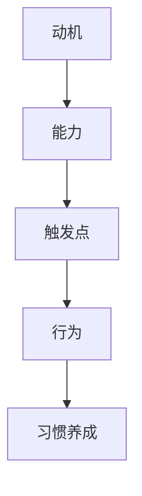

                 

# 《福格模型在管理习惯养成中的应用》

> 关键词：福格模型，管理习惯，动机，能力，触发点，团队协作，员工激励

> 摘要：本文探讨了福格模型在管理习惯养成中的应用。通过分析福格模型的基本概念和核心要素，结合管理习惯养成的挑战，本文详细介绍了福格模型在团队管理和个人管理中的应用场景，以及如何通过动机管理、能力提升和触发点设计来培养良好的管理习惯。最后，本文通过实际案例展示了福格模型在管理习惯养成中的成功应用，并提出了未来的研究方向与趋势，为管理者提供了有效的启示和建议。

## 第一部分：福格模型概述

### 第1章：福格模型的基本概念

#### 1.1 福格模型的定义与核心观点

福格模型是由著名心理学家弗雷德里克·福格（Frederic L. Fogel）提出的，它是一种关于行为动机和习惯养成的理论模型。福格模型认为，行为动机取决于三个核心要素：动机、能力和触发点。这三个要素相互作用，共同决定了一个行为是否能够被持续地进行。

福格模型的核心观点是，一个行为只有在动机、能力和触发点三者同时满足时，才能够成为习惯。换句话说，如果一个行为缺乏动机，或者缺乏能力，或者没有触发点，那么这个行为很难被持续地进行。

#### 1.2 福格模型的三个要素：动机、能力、触发点

1. **动机**：动机是指驱使个体进行某种行为的内在力量。动机可以分为外部动机和内部动机。外部动机来源于外部环境，例如奖励或惩罚，而内部动机则来源于个体内部的满足感或兴趣。

2. **能力**：能力是指个体完成某种行为所需的技能和资源。能力既可以是专业技能，也可以是时间管理能力、沟通能力等。一个行为如果没有足够的能力支持，很难被持续地进行。

3. **触发点**：触发点是指促使个体进行某种行为的特定信号或情境。触发点可以是外在的，例如一个任务提醒，也可以是内在的，例如一个情绪变化。

#### 1.3 福格模型与习惯养成的联系

福格模型与习惯养成有着密切的联系。习惯是一种经过重复的行为，它能够帮助个体实现目标，提高效率。根据福格模型，一个习惯的形成需要满足以下条件：

1. **动机**：个体需要有一个明确的动机，例如提高工作效率、改善健康状况等。
2. **能力**：个体需要具备完成这个习惯所需的能力，例如时间管理技巧、健康饮食知识等。
3. **触发点**：个体需要有一个触发点，例如每天早上7点开始锻炼、每天晚上10点停止使用电子设备等。

只有当动机、能力和触发点同时满足时，一个行为才能够成为习惯。通过理解福格模型，管理者可以更好地培养良好的管理习惯，提高团队绩效。

### 第2章：福格模型在管理中的应用场景

#### 2.1 管理习惯养成的挑战

管理习惯养成是一项具有挑战性的任务。管理者需要同时面对内部和外部环境的压力，例如市场竞争、员工关系、工作负荷等。以下是一些常见的管理习惯养成挑战：

1. **时间管理**：管理者需要合理安排时间，平衡工作与生活，提高工作效率。
2. **目标设定**：管理者需要设定清晰的目标，并制定有效的计划来实现这些目标。
3. **沟通协调**：管理者需要与团队成员保持良好的沟通，解决冲突，促进协作。
4. **员工激励**：管理者需要激发员工的积极性和创造力，提高团队士气。
5. **自我提升**：管理者需要不断学习新知识，提升自己的管理能力和专业技能。

#### 2.2 福格模型在团队管理中的应用

福格模型在团队管理中有着广泛的应用。通过理解福格模型，管理者可以更好地培养团队的良好习惯，提高团队绩效。

1. **动机管理**：管理者可以通过设定明确的目标和奖励机制，激发团队成员的动机。例如，设定团队目标，并在达成目标时给予奖励。

2. **能力提升**：管理者可以提供培训和学习机会，帮助团队成员提升能力。例如，为团队成员提供专业培训、组织内部交流分享会等。

3. **触发点设计**：管理者可以通过设计特定的触发点，促使团队成员养成良好习惯。例如，设置固定的会议时间、设立目标考核机制等。

#### 2.3 福格模型在个人管理中的应用

福格模型在个人管理中同样具有重要价值。通过理解福格模型，个人可以更好地培养良好的管理习惯，提高个人绩效。

1. **动机管理**：个人可以通过设定个人目标和奖励机制，激发自己的动机。例如，设定每日任务清单，并在完成任务后给予自己奖励。

2. **能力提升**：个人可以通过学习新知识和技能，提升自己的能力。例如，参加在线课程、阅读专业书籍等。

3. **触发点设计**：个人可以通过设计特定的触发点，促使自己养成良好习惯。例如，设置早起闹钟、制定每日健身计划等。

通过福格模型的应用，个人和团队可以更好地培养良好的管理习惯，提高工作效率和团队绩效。

### 第3章：福格模型的核心概念与联系

#### 3.1 动机、能力、触发点三要素解析

福格模型的三个核心要素——动机、能力、触发点，共同决定了行为是否能够成为习惯。

1. **动机**：动机是行为的驱动力，分为外部动机和内部动机。外部动机来源于外部环境，如奖励、惩罚等；内部动机来源于个体内部的满足感、兴趣等。明确动机有助于激发个体进行特定行为。

2. **能力**：能力是完成行为的必要条件。能力既包括专业技能，也包括时间管理能力、沟通能力等。提高能力有助于个体更好地执行行为，从而培养良好习惯。

3. **触发点**：触发点是促使个体进行特定行为的信号或情境。触发点可以是外在的，如任务提醒；也可以是内在的，如情绪变化。设计有效的触发点有助于个体在特定时刻自然地执行行为。

#### 3.2 福格模型的Mermaid流程图

为了更直观地理解福格模型，我们可以使用Mermaid流程图来描述其基本结构。

在这个流程图中，动机、能力、触发点依次作用于行为，最终实现习惯养成。通过这个流程图，我们可以清晰地看到福格模型中各个要素之间的逻辑关系。

#### 3.3 福格模型与传统管理理论的对比

福格模型与传统管理理论在理念和方法上有所不同。传统管理理论侧重于组织结构、流程优化、制度设计等方面，而福格模型则更加关注个体行为和习惯的养成。

1. **理念差异**：传统管理理论强调权威和命令，认为管理者的任务是下达指令、监督执行；而福格模型则认为，培养员工的动机、能力和触发点是更有效的管理方法。

2. **方法差异**：传统管理理论侧重于制度约束和绩效考核，强调奖惩机制；而福格模型则更注重激发员工的内在动机，通过设定目标、提供培训、设计触发点等方式来促进良好习惯的养成。

通过对比可以看出，福格模型在管理习惯养成方面具有独特的优势。管理者可以结合福格模型和传统管理理论，采取更加灵活和有效的方法，提高团队绩效。

## 第二部分：福格模型在管理习惯养成的应用实践

### 第4章：动机管理

动机管理是福格模型中的重要一环，它直接影响个体是否能够持续地执行特定行为。在本章中，我们将探讨如何通过管理动机来培养良好的管理习惯。

#### 4.1 动机类型与特点

动机可以分为外部动机和内部动机。

1. **外部动机**：外部动机来源于外部环境，例如奖励、惩罚、认同等。这种动机通常是通过外部的激励措施来激发个体的行为。例如，管理者可以通过设立奖金、晋升机会等方式来激励员工。

2. **内部动机**：内部动机来源于个体内部，例如兴趣、满足感、成就感等。这种动机通常是个体内在的驱动力量，不需要外部的激励。例如，员工对工作本身的兴趣和热爱，可能会促使他们更积极地完成任务。

#### 4.2 提高员工动机的策略

为了提高员工的动机，管理者可以采取以下策略：

1. **明确目标**：设定清晰的目标可以帮助员工明确方向，增强工作的意义感和目标感。管理者应该与员工共同制定目标，确保目标具有挑战性，同时是可实现的。

2. **奖励机制**：建立合理的奖励机制可以激发员工的外部动机。奖励可以是金钱、晋升、荣誉等，关键是要与员工的付出和贡献相匹配。

3. **反馈与认可**：及时给予员工反馈和认可，可以增强他们的内部动机。管理者应该关注员工的工作表现，给予肯定和表扬，帮助他们感受到成就感和满足感。

4. **培训与发展**：提供培训和学习机会，可以帮助员工提升能力，增强对工作的兴趣和信心。管理者应该关注员工的发展需求，提供必要的培训和职业发展路径。

#### 4.3 动机管理的案例分析

以下是一个动机管理的案例分析：

**案例背景**：某公司的销售团队在过去几个月的业绩一直不理想，团队士气低落。

**解决方案**：

1. **明确目标**：管理者与销售团队共同制定了一个清晰的业绩目标，明确了每个月的销售指标。

2. **奖励机制**：管理者设立了奖金制度，对达到业绩目标的员工给予一定的奖金。

3. **反馈与认可**：管理者定期召开销售会议，对团队成员的表现进行反馈，对业绩突出的员工进行表扬。

4. **培训与发展**：管理者为销售团队提供了销售技巧培训，并制定了职业发展计划，帮助员工提升销售能力。

**效果评估**：通过上述措施，销售团队的业绩逐渐提升，团队士气明显提高。

通过这个案例，我们可以看到，通过动机管理，管理者可以有效地激发员工的动机，提高团队绩效。动机管理是福格模型在管理习惯养成中不可或缺的一部分，管理者应该重视并运用这一策略。

### 第5章：能力提升

能力提升是福格模型中关键的一环，它决定了个体是否有能力去执行特定行为。在本章中，我们将探讨如何通过提升员工的能力来培养良好的管理习惯。

#### 5.1 能力提升的重要性

能力提升在管理习惯养成中具有重要意义。首先，能力是行为执行的基础。一个缺乏能力的个体很难成功地执行特定的行为，更不用说养成习惯。其次，能力提升可以增强员工的自信心，激发他们的内在动机。当员工具备足够的能力时，他们更有可能持续地执行特定行为，并将其转化为习惯。

#### 5.2 员工能力评估与提升方法

1. **能力评估**：为了提升员工的能力，首先需要对员工的能力进行评估。能力评估可以包括以下几个方面：

   - **专业技能**：评估员工在具体领域的专业知识和技能水平。
   - **时间管理能力**：评估员工的时间管理能力，包括任务优先级设定、时间分配等。
   - **沟通能力**：评估员工的沟通能力，包括表达能力、倾听能力、协作能力等。
   - **领导能力**：评估员工在团队中的领导能力和影响力。

2. **提升方法**：根据能力评估的结果，管理者可以采取以下方法来提升员工的能力：

   - **培训与学习**：为员工提供专业培训和学习机会，帮助他们提升专业技能和知识。例如，参加外部培训课程、阅读专业书籍、参加行业研讨会等。
   - **实践与经验**：通过实际工作项目和任务，让员工在实践中提升能力。例如，分配具有挑战性的任务、参与跨部门项目等。
   - **反馈与指导**：管理者应该给予员工及时的反馈和指导，帮助他们认识到自己的不足，并找到提升的方向。例如，定期召开一对一的绩效反馈会议、提供具体的工作建议等。
   - **激励机制**：建立激励机制，鼓励员工不断提升自己的能力。例如，设立能力提升奖励、晋升机会等。

#### 5.3 能力提升的案例分析

以下是一个能力提升的案例分析：

**案例背景**：某公司的项目管理团队在项目管理方面存在一些问题，导致项目进度延误、质量下降。

**解决方案**：

1. **能力评估**：管理者对项目管理团队进行了能力评估，发现团队在项目管理流程、时间管理、沟通协调等方面存在不足。

2. **培训与学习**：管理者为项目管理团队提供了项目管理培训，包括项目管理基础知识、时间管理技巧、沟通协调技巧等。

3. **实践与经验**：管理者安排了实际的项目管理工作，让团队成员在实践中学习和提升能力。例如，分配项目管理任务、参与项目评审等。

4. **反馈与指导**：管理者定期与项目管理团队召开项目回顾会议，对项目进行反馈和指导，帮助他们认识到问题并找到改进的方法。

**效果评估**：通过上述措施，项目管理团队的绩效显著提升，项目进度和质量得到了明显改善。

通过这个案例，我们可以看到，通过能力提升，管理者可以有效地帮助员工克服不足，提高工作效率，从而培养良好的管理习惯。能力提升是福格模型在管理习惯养成中的重要环节，管理者应该给予足够的重视。

### 第6章：触发点设计

触发点是福格模型中促使个体进行特定行为的关键因素。在本章中，我们将探讨如何通过设计触发点来培养良好的管理习惯。

#### 6.1 触发点的概念与作用

触发点是指促使个体进行特定行为的信号或情境。它可以是外在的，如一个任务提醒；也可以是内在的，如一个情绪变化。触发点的作用在于，当个体面临特定的触发点时，会自然地采取相应的行为。

#### 6.2 触发点的类型与设计方法

触发点可以分为以下几种类型：

1. **时间触发点**：通过设定特定的时间，如每天早上9点开始工作，来促使个体进行特定行为。

2. **事件触发点**：通过特定的事件，如收到一个任务提醒，来促使个体进行特定行为。

3. **情绪触发点**：通过个体的情绪变化，如感到焦虑时，来促使个体进行特定行为。

4. **环境触发点**：通过特定的环境，如一个安静的图书馆，来促使个体进行特定行为。

为了设计有效的触发点，可以采取以下方法：

1. **目标设定**：设定清晰的目标，可以帮助个体明确方向，从而形成触发点。例如，设定每天阅读30分钟的目标，当达到目标时，个体自然会进行阅读。

2. **提醒工具**：利用提醒工具，如手机闹钟、电子邮件提醒等，来设计触发点。例如，设置每天早上7点起床的闹钟，提醒个体开始一天的工作。

3. **环境布置**：通过环境布置来设计触发点。例如，将书籍、笔记本等与学习相关的物品放在学习区域，当个体进入这个区域时，会自然地开始学习。

4. **情绪调节**：通过情绪调节来设计触发点。例如，当感到焦虑时，可以设置一个触发点，提醒自己进行深呼吸或冥想，以缓解情绪。

#### 6.3 触发点设计在实际管理中的应用

在实际管理中，触发点设计可以帮助管理者培养员工的良好习惯。以下是一个触发点设计的案例分析：

**案例背景**：某公司的销售团队在销售技巧方面存在不足，管理者希望通过触发点设计来提升团队的销售能力。

**解决方案**：

1. **目标设定**：管理者与销售团队共同设定了销售目标，如每月完成10个新客户签约。

2. **提醒工具**：管理者利用手机提醒功能，每天早上9点提醒团队成员查看销售数据，分析客户需求。

3. **环境布置**：管理者将销售资料、客户信息等放在团队成员的办公桌上，以提示他们关注销售工作。

4. **情绪调节**：管理者定期组织销售技巧培训，帮助团队成员提高销售能力，并在团队中营造积极向上的氛围。

**效果评估**：通过触发点设计，销售团队的业绩显著提升，团队成员的销售技巧也得到了提高。

通过这个案例，我们可以看到，触发点设计在培养员工良好习惯方面的有效性。管理者应该充分利用触发点的力量，设计出适合自己团队的触发点，以促进良好习惯的养成。

### 第7章：福格模型在具体管理情境中的应用

#### 7.1 领导力培养与福格模型

在领导力培养过程中，福格模型提供了重要的理论指导。通过理解福格模型，管理者可以更有效地培养自己的领导力，提升团队绩效。

1. **动机管理**：管理者需要激发员工的动机，使他们愿意并有能力为实现团队目标而努力。通过设定明确的目标和奖励机制，管理者可以激发员工的外部动机；同时，通过关注员工的内在动机，如成就感和满足感，管理者可以激发员工的内在动力。

2. **能力提升**：管理者需要关注团队成员的能力发展，提供必要的培训和学习机会，帮助他们提升专业技能和管理能力。管理者可以通过团队建设活动、跨部门合作等方式，为团队成员提供实践机会，提升他们的实际操作能力。

3. **触发点设计**：管理者可以通过设计特定的触发点，促使团队成员养成良好的工作习惯。例如，设定固定的会议时间、设立目标考核机制等，可以提醒团队成员及时调整工作状态，保持高效的工作节奏。

以下是一个领导力培养的案例分析：

**案例背景**：某公司的中层管理者在领导力方面存在不足，团队凝聚力不高，工作效率低下。

**解决方案**：

1. **动机管理**：管理者通过设立团队目标，明确团队发展方向，激发员工的动机。同时，管理者通过定期表彰优秀员工，激励员工积极投入工作。

2. **能力提升**：管理者组织了领导力培训课程，帮助管理者提升领导力和管理能力。此外，管理者还鼓励团队成员参加外部培训和学习，提升自身能力。

3. **触发点设计**：管理者设定了每周的团队会议时间，定期回顾团队工作，解决团队问题。同时，管理者设立了绩效目标考核机制，提醒团队成员关注工作进度。

**效果评估**：通过福格模型的应用，中层管理者的领导力得到显著提升，团队凝聚力增强，工作效率提高。

#### 7.2 团队协作与福格模型

团队协作是现代企业中不可或缺的一部分。福格模型为团队协作提供了有效的理论指导，帮助团队成员更好地协作，实现团队目标。

1. **动机管理**：管理者需要关注团队成员的动机，激发他们的工作热情和责任感。通过设定团队目标和奖励机制，管理者可以激励团队成员为实现团队目标而努力。此外，管理者还可以通过关注团队成员的内在动机，如成就感和满足感，进一步提升团队协作效果。

2. **能力提升**：管理者需要关注团队成员的能力发展，提供必要的培训和学习机会，帮助他们提升专业技能和协作能力。通过团队建设活动和跨部门合作，管理者可以促进团队成员之间的沟通和交流，提升团队整体能力。

3. **触发点设计**：管理者可以通过设计特定的触发点，促使团队成员保持高效的协作状态。例如，设定固定的团队会议时间、设立项目里程碑等，可以提醒团队成员关注项目进度，保持高效的工作节奏。

以下是一个团队协作的案例分析：

**案例背景**：某公司的研发团队在项目开发过程中，协作不畅，项目进度延误。

**解决方案**：

1. **动机管理**：管理者通过设立项目目标，明确项目发展方向，激发团队成员的动机。同时，管理者通过设立项目奖励机制，激励团队成员积极投入工作。

2. **能力提升**：管理者组织了项目开发培训，帮助团队成员提升项目管理和开发能力。此外，管理者还鼓励团队成员参加外部培训和交流活动，提升自身能力。

3. **触发点设计**：管理者设定了每周的团队会议时间，定期回顾项目进度，解决协作中的问题。同时，管理者设立了项目里程碑，提醒团队成员关注项目进度。

**效果评估**：通过福格模型的应用，研发团队的协作效率显著提升，项目进度得到有效控制。

#### 7.3 员工激励与福格模型

员工激励是提升团队绩效的重要手段。福格模型为员工激励提供了有效的理论指导，帮助管理者更好地激励员工，提升员工满意度和工作效率。

1. **动机管理**：管理者需要关注员工的动机，激发他们的工作热情和责任感。通过设定明确的目标和奖励机制，管理者可以激励员工为实现个人和团队目标而努力。此外，管理者还可以通过关注员工的内在动机，如成就感和满足感，进一步提升员工的工作积极性。

2. **能力提升**：管理者需要关注员工的能力发展，提供必要的培训和学习机会，帮助他们提升专业技能和工作能力。通过团队建设活动和跨部门合作，管理者可以促进员工之间的沟通和交流，提升团队整体能力。

3. **触发点设计**：管理者可以通过设计特定的触发点，促使员工保持高效的工作状态。例如，设定固定的团队会议时间、设立项目里程碑等，可以提醒员工关注工作进度，保持高效的工作节奏。

以下是一个员工激励的案例分析：

**案例背景**：某公司的运营团队在项目推进过程中，遇到瓶颈，工作效率低下。

**解决方案**：

1. **动机管理**：管理者通过设立项目目标，明确项目发展方向，激发团队成员的动机。同时，管理者通过设立项目奖励机制，激励团队成员积极投入工作。

2. **能力提升**：管理者组织了项目管理培训，帮助团队成员提升项目管理能力。此外，管理者还鼓励团队成员参加外部培训和交流活动，提升自身能力。

3. **触发点设计**：管理者设定了每周的团队会议时间，定期回顾项目进度，解决协作中的问题。同时，管理者设立了项目里程碑，提醒团队成员关注项目进度。

**效果评估**：通过福格模型的应用，运营团队的工作效率显著提升，项目进度得到有效控制。

通过上述案例分析，我们可以看到，福格模型在具体管理情境中的应用具有明显的效果。管理者可以通过动机管理、能力提升和触发点设计，培养员工的良好习惯，提升团队绩效。福格模型为管理者提供了一种系统化的方法，帮助他们更好地应对管理挑战，实现团队目标。

### 第8章：成功案例解析

在本章中，我们将深入分析几个实际案例，探讨福格模型在管理习惯养成中的成功应用。这些案例涵盖了不同类型的企业和组织，展示了福格模型在提升员工动机、能力和触发点设计方面的具体实施方法和效果。

#### 8.1 案例一：某企业的员工激励机制设计

**背景**：一家快速消费品公司面临员工流动率高、员工工作积极性不高的挑战。公司希望通过激励机制来提升员工的工作热情和忠诚度。

**解决方案**：

1. **动机管理**：公司首先进行了员工动机调查，了解员工的内在动机和外在动机。根据调查结果，公司设定了明确的目标，如销售目标、服务质量目标等，并通过奖金、晋升机会等外部激励措施来激发员工的外部动机。同时，公司通过认可员工的贡献和成就，如设立“员工之星”奖项，来激发员工的内在动机。

2. **能力提升**：公司为员工提供了各种培训和学习机会，包括销售技能培训、客户服务技巧培训等，帮助员工提升专业技能和综合素质。此外，公司还鼓励员工参加外部认证考试，如销售认证、客户服务认证等，进一步巩固员工的职业能力。

3. **触发点设计**：公司设计了一系列触发点来确保激励机制的有效实施。例如，每周一举行团队例会，总结上周的工作成绩，制定本周的工作计划；每月进行一次员工满意度调查，及时了解员工的需求和意见；设立绩效目标考核机制，定期评估员工的工作表现。

**效果评估**：通过福格模型的应用，公司的员工流动率显著下降，员工的工作积极性和忠诚度得到了大幅提升。公司实现了销售业绩的连续增长，客户满意度也明显提高。

#### 8.2 案例二：提升团队协作效率的实践

**背景**：一家互联网公司发现其研发团队的协作效率低下，项目开发进度经常延误。

**解决方案**：

1. **动机管理**：公司通过设立共同的目标，如项目交付日期和项目质量标准，来统一团队的目标和动机。同时，公司通过设立团队奖励机制，如项目完成后的团队庆祝活动，来激发团队成员的外部动机。此外，公司还鼓励团队成员分享他们的成就和进步，以激发内在动机。

2. **能力提升**：公司为研发团队提供了专业的技术培训和管理培训，帮助团队成员提升技术能力和项目管理能力。公司还组织了跨部门的技术交流会，促进团队成员之间的知识分享和协作。

3. **触发点设计**：公司设计了多种触发点来提升团队协作效率。例如，每周一早晨举行项目进度会议，确保团队成员了解项目的最新动态；每月进行一次团队绩效评估，激励团队成员不断改进；设立了敏捷开发流程，通过每日站会、迭代评审等机制，确保项目开发过程的透明和高效。

**效果评估**：通过福格模型的应用，研发团队的协作效率显著提升，项目开发进度得到有效控制，项目质量也得到了明显改善。

#### 8.3 案例三：个人自我管理习惯的养成

**背景**：一名高级项目经理发现自己经常无法按时完成任务，工作压力大，生活质量下降。

**解决方案**：

1. **动机管理**：项目经理首先明确了个人目标和职业发展路径，设定了短期和长期的目标，并制定了详细的计划。同时，项目经理通过设定自我奖励机制，如每完成一个任务就给自己买一件喜欢的物品，来激发自己的外部动机。

2. **能力提升**：项目经理参加了时间管理培训，学习了如何更有效地安排工作和时间。此外，项目经理还阅读了相关的书籍，如《深度工作》等，提升了自己的专注力和工作效率。

3. **触发点设计**：项目经理设置了多种触发点来确保自我管理习惯的养成。例如，每天早晨制定当天的任务清单，并设定工作优先级；每周进行一次工作总结，反思自己的工作方法和效果；每月进行一次自我评估，调整个人目标和行动计划。

**效果评估**：通过福格模型的应用，项目经理的工作效率显著提升，任务完成率提高，工作压力减轻，生活质量也得到了明显改善。

通过这些成功案例，我们可以看到，福格模型在管理习惯养成中的应用具有显著的成效。通过动机管理、能力提升和触发点设计，管理者可以有效地培养员工的良好习惯，提升团队绩效。这些案例为其他企业和组织提供了宝贵的经验和启示。

### 第9章：福格模型在管理实践中的挑战与应对

在管理实践中，福格模型的应用并非一帆风顺，管理者会面临各种挑战。在本章中，我们将探讨这些挑战，并提出相应的解决方案，以帮助管理者更好地应对。

#### 9.1 管理习惯养成的难点分析

1. **员工动机不明确**：有些员工可能缺乏明确的目标和动力，导致他们难以养成良好习惯。这可能是由于目标设定不清晰、奖励机制不合理或员工个人价值观与组织目标不一致等原因造成的。

2. **能力不足**：员工可能由于缺乏必要的技能和资源，无法有效地执行特定行为，从而难以养成良好的习惯。这可能是由于培训不足、资源分配不合理或工作压力过大等原因导致的。

3. **触发点设计不当**：如果触发点设计不合理，可能会导致员工难以在特定情境下自然地执行行为。这可能是由于触发点与员工的工作习惯不匹配或触发机制过于复杂等原因导致的。

4. **外部环境干扰**：管理实践中，员工可能会面临各种外部环境干扰，如工作任务繁重、个人生活压力等，这会影响他们的行为动机和能力，从而影响良好习惯的养成。

5. **组织文化不支持**：如果组织文化不支持良好习惯的养成，如缺乏激励机制、重视短期效益等，将会对管理者应用福格模型带来挑战。

#### 9.2 面对挑战的解决方案

1. **明确员工动机**：管理者需要与员工进行深入沟通，了解他们的个人目标和价值观，设定与员工个人兴趣和职业规划相结合的目标。同时，管理者可以通过设立合理的奖励机制，如奖金、晋升机会等，来激发员工的外部动机。此外，管理者还可以关注员工的内在动机，如成就感和满足感，通过认可和表扬来激发员工的内在动力。

2. **提升员工能力**：管理者应关注员工的能力发展，提供必要的培训和学习机会，帮助他们提升专业技能和综合素质。此外，管理者可以通过工作轮换、跨部门项目等方式，为员工提供多样化的工作经历，提升他们的综合能力。在资源分配方面，管理者应确保员工有足够的时间和资源来完成任务。

3. **优化触发点设计**：管理者应根据员工的工作习惯和特定情境，设计合理的触发点。例如，可以通过设置提醒工具、制定工作计划、设立项目里程碑等方式，确保员工在特定时刻自然地执行行为。在触发点设计过程中，管理者应注重触发机制的可操作性和实用性，避免过于复杂。

4. **减少外部干扰**：管理者可以通过合理的工作安排，减轻员工的工作压力。例如，通过优化工作流程、提高工作效率等方式，减少员工因工作负荷过大而受到的干扰。此外，管理者还可以关注员工的个人生活状况，提供必要的支持，如心理健康咨询、家庭关怀等，帮助员工缓解生活压力。

5. **营造支持文化**：管理者应积极营造支持良好习惯养成的组织文化。例如，通过设立激励机制、强调长期效益等方式，鼓励员工养成良好的工作习惯。此外，管理者还可以通过员工参与管理、建立反馈机制等方式，增强员工的归属感和参与感，促进良好习惯的养成。

#### 9.3 长期效果与评估

福格模型在管理实践中需要长期的坚持和优化。为了评估其长期效果，管理者可以采取以下方法：

1. **定期反馈**：管理者应定期与员工进行沟通，了解他们在养成良好习惯过程中的感受和困难，及时给予反馈和支持。

2. **数据监测**：管理者可以通过数据监测，如员工满意度调查、工作效率统计等，评估福格模型的应用效果。

3. **案例研究**：管理者可以选取典型案例进行深入分析，总结成功经验和失败教训，为持续优化提供参考。

通过长期的坚持和优化，福格模型可以逐步培养员工的良好习惯，提升团队绩效。管理者应关注福格模型在管理实践中的应用效果，不断调整和改进，以实现组织目标。

### 第10章：总结与展望

#### 10.1 福格模型在管理习惯养成中的应用总结

福格模型作为一种关于行为动机和习惯养成的理论模型，在管理习惯养成中具有广泛的应用价值。通过分析福格模型的三个核心要素——动机、能力、触发点，管理者可以更系统地理解行为动机的来源和影响，从而设计出更有效的管理策略。

在管理实践中，福格模型的应用主要包括以下几个方面：

1. **动机管理**：管理者通过设定明确的目标和奖励机制，激发员工的外部动机；同时，通过关注员工的内在动机，如成就感和满足感，激发员工的内在动力。

2. **能力提升**：管理者通过提供培训和学习机会，帮助员工提升专业技能和综合素质；通过工作轮换和跨部门项目，提升员工的综合能力。

3. **触发点设计**：管理者通过设置合理的触发点，如提醒工具、工作计划、项目里程碑等，确保员工在特定情境下自然地执行行为。

通过动机管理、能力提升和触发点设计，管理者可以有效地培养员工的良好习惯，提升团队绩效。福格模型为管理者提供了一种系统化的方法，帮助他们更好地应对管理挑战，实现组织目标。

#### 10.2 未来研究方向与趋势

尽管福格模型在管理习惯养成中已经取得了显著成效，但在实际应用中仍存在一些挑战和不足。未来，研究人员可以从以下几个方面进行深入探讨：

1. **跨文化研究**：福格模型在不同文化背景下的应用效果如何？如何根据不同文化特点调整管理策略？

2. **长期效果评估**：福格模型在长期管理实践中的效果如何？如何进行有效的长期效果评估？

3. **数字化管理工具**：如何利用数字化管理工具，如人工智能、大数据分析等，优化福格模型的应用？

4. **个性化管理**：如何根据员工的个性特点，设计个性化的管理策略，实现更高效的动机管理、能力提升和触发点设计？

5. **跨部门协作**：如何通过福格模型，促进跨部门协作，提升整体组织绩效？

通过深入研究这些方向，福格模型将得到进一步优化和完善，为管理者提供更加科学、有效的管理工具。

#### 10.3 对管理者的启示与建议

对于管理者来说，福格模型提供了一系列有价值的启示和建议：

1. **重视员工动机**：管理者应关注员工的动机，通过设定明确的目标和奖励机制，激发员工的工作热情和责任感。

2. **提升员工能力**：管理者应关注员工的能力发展，提供培训和学习机会，帮助员工提升专业技能和综合素质。

3. **设计合理触发点**：管理者应根据员工的工作习惯和特定情境，设计合理的触发点，确保员工在特定时刻自然地执行行为。

4. **持续优化管理策略**：管理者应不断评估福格模型的应用效果，根据实际情况进行调整和优化，以实现更好的管理效果。

5. **关注长期效果**：管理者应关注福格模型在长期管理实践中的效果，通过持续的反馈和评估，确保管理策略的有效性。

通过应用福格模型，管理者可以更有效地培养员工的良好习惯，提升团队绩效，实现组织目标。管理者应将福格模型作为管理工具的重要组成部分，结合实际情况，灵活运用，不断提升管理能力。

### 作者信息

作者：AI天才研究院/AI Genius Institute & 禅与计算机程序设计艺术 /Zen And The Art of Computer Programming

