                 

### 文章标题: 科技与伦理的平衡点：人类计算的伦理

> 关键词：科技伦理，计算伦理学，人工智能，数据隐私，伦理决策框架，国际政策

> 摘要：本文旨在探讨科技与伦理之间的平衡点，深入分析计算伦理学的基本概念、原则及其在现实世界中的应用。通过逐步推理和案例分析，本文将阐述伦理在计算技术发展中的作用，并提出应对科技伦理挑战的策略。文章结构包括引论、计算伦理学原理、计算伦理学应用、未来展望与策略及附录。

---

### 目录大纲

- **第一部分：引论**
  - 1.1 书籍背景与目标
  - 1.2 计算伦理学的概念
  - 1.3 科技伦理的现状与挑战
  - 1.4 伦理在计算技术发展中的作用
  - 1.5 读者指南

- **第二部分：计算伦理学原理**
  - 2.1 伦理学基础
  - 2.2 伦理学原则与计算技术
  - 2.3 计算伦理学案例研究
  - 2.4 伦理决策框架
  - 2.5 道德责任与计算

- **第三部分：计算伦理学的应用**
  - 3.1 数据伦理
  - 3.2 人工智能伦理
  - 3.3 生物信息学伦理
  - 3.4 网络空间伦理
  - 3.5 计算伦理教育

- **第四部分：未来展望与策略**
  - 4.1 计算伦理学的未来趋势
  - 4.2 国际合作与政策制定
  - 4.3 企业在计算伦理中的角色
  - 4.4 公众参与与意识提升
  - 4.5 结论与展望

- **附录**
  - 附录 A：计算伦理学相关资源
  - 附录 B：伦理决策案例解析

---

### 1.1 书籍背景与目标

随着科技的迅猛发展，计算技术已成为现代社会不可或缺的一部分。然而，科技带来的便利与进步也引发了诸多伦理问题，如数据隐私、算法歧视、人工智能安全等。为了在追求技术进步的同时维护伦理底线，计算伦理学应运而生。

本书的目标是深入探讨科技与伦理之间的平衡点，系统介绍计算伦理学的基本概念、原理及其在现实世界中的应用。通过逐步推理和案例分析，本文旨在帮助读者理解伦理在计算技术发展中的重要性，并提出应对科技伦理挑战的策略。

本书的核心概念与联系可以用以下 Mermaid 流程图来表示：

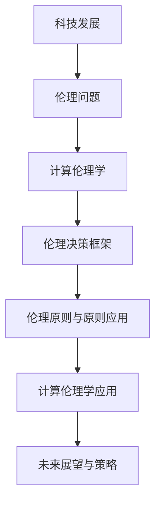

科技发展引发了伦理问题，而计算伦理学提供了一套框架和原则来应对这些问题。通过伦理决策框架，我们可以在实际应用中确保技术发展与伦理要求相协调。

本书的主要贡献在于：

1. **系统阐述计算伦理学的核心概念与原则**：帮助读者建立对计算伦理学的全面理解。
2. **提供丰富的案例研究**：通过具体案例，让读者更直观地了解伦理问题在实际计算技术中的应用。
3. **提出应对科技伦理挑战的策略**：结合国际政策和公众参与，为计算伦理学的发展提供方向。

通过本书的阅读，读者可以：

- 理解计算伦理学的基本概念和原则。
- 掌握伦理决策框架及其应用。
- 深入了解科技伦理的现状与挑战。
- 学会运用伦理原则来指导计算技术的实际应用。
- 提高对科技伦理问题的敏感性和责任感。

---

### 1.2 计算伦理学的概念

计算伦理学是一门研究计算技术在道德、法律和社会背景下如何应用和影响的学科。它涉及计算机科学、伦理学、法律和社会学等多个领域，旨在确保计算技术的研发和应用符合伦理标准，保护个人隐私和促进社会公正。

#### 核心概念与联系

为了更好地理解计算伦理学的核心概念，我们可以使用 Mermaid 流程图来展示它们之间的联系：

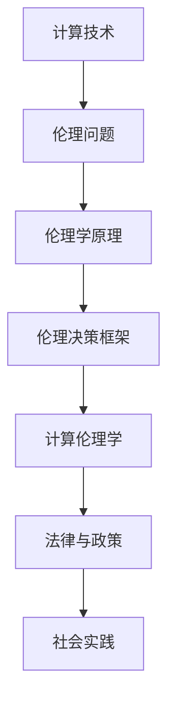

1. **计算技术**：计算技术包括计算机硬件、软件、网络等，它们在现代社会中扮演着重要角色。
2. **伦理问题**：计算技术在带来便利的同时，也引发了诸如数据隐私、算法歧视、人工智能安全等伦理问题。
3. **伦理学原理**：伦理学原理是指导计算技术应用的道德准则，如公正、尊重、责任等。
4. **伦理决策框架**：伦理决策框架是一套系统化的方法和工具，用于在计算技术应用中做出符合伦理要求的决策。
5. **计算伦理学**：计算伦理学是应用伦理学原理来解决计算技术中的伦理问题，确保技术的研发和应用符合道德标准。
6. **法律与政策**：法律和政策为计算伦理学提供了法律依据和制度保障。
7. **社会实践**：社会实践是计算伦理学原则和决策框架的实际应用场景。

#### 计算伦理学的定义

计算伦理学可以定义为“研究计算技术在道德、法律和社会背景下如何应用和影响的学科”。具体来说，计算伦理学涉及以下方面：

- **伦理问题识别**：识别计算技术可能引发的伦理问题，如隐私侵犯、歧视、安全风险等。
- **伦理原则应用**：将伦理学原则应用于计算技术的研发和应用过程，确保技术符合道德标准。
- **伦理决策支持**：提供系统化的方法和工具，帮助决策者在计算技术应用中做出符合伦理要求的决策。
- **法律和政策研究**：研究法律和政策对计算伦理学的影响，为计算技术的伦理应用提供法律依据。
- **社会实践分析**：分析计算技术在现实社会中的应用效果，评估其对伦理原则的遵守情况。

#### 计算伦理学的基本原则

计算伦理学的基本原则包括公正、尊重、责任、透明和包容等。以下是对这些原则的详细解释：

1. **公正**：确保计算技术对所有用户公平对待，不因性别、种族、年龄等因素产生歧视。
2. **尊重**：尊重用户的隐私和数据权利，确保计算技术不会侵犯用户的基本权利。
3. **责任**：计算技术的开发者、使用者和监管者应对技术应用可能产生的后果负责。
4. **透明**：确保计算技术的决策过程和结果对用户透明，用户可以理解计算技术的行为和影响。
5. **包容**：确保计算技术能够适应不同用户的需求和背景，促进社会包容性发展。

这些原则为计算技术的研发和应用提供了道德准则，有助于我们在追求技术进步的同时，维护伦理底线。

#### 计算伦理学在科技与伦理关系中的重要性

计算伦理学在科技与伦理关系中扮演着关键角色。随着科技的发展，伦理问题日益凸显，计算伦理学为解决这些问题提供了一套系统化的方法和工具。以下是从几个方面阐述计算伦理学在科技与伦理关系中的重要性：

1. **伦理指导**：计算伦理学为科技研发和应用提供了伦理指导，确保技术在研发和应用过程中符合道德标准，减少潜在的风险和负面影响。
2. **风险识别**：计算伦理学可以帮助我们识别和评估计算技术可能引发的伦理风险，提前采取预防措施，降低伦理问题的发生概率。
3. **决策支持**：计算伦理学提供了一套系统化的决策框架，帮助决策者在计算技术应用中做出符合伦理要求的决策，提高决策的科学性和公正性。
4. **政策制定**：计算伦理学为政策制定者提供了理论依据和实践经验，有助于制定更加科学合理的政策和法规，保障计算技术的合法合规应用。
5. **社会监督**：计算伦理学促进了公众对计算技术的监督和参与，提高了社会的伦理意识，有助于构建更加公正、透明和包容的科技环境。

通过计算伦理学的引导，我们可以更好地在科技与伦理之间取得平衡，确保计算技术的发展不仅能够带来便利和进步，还能够维护社会的伦理底线和公共利益。

### 1.3 科技伦理的现状与挑战

随着科技的迅猛发展，伦理问题日益成为计算技术领域的重要议题。当前，科技伦理的现状复杂多样，面临着诸多挑战。本节将探讨科技伦理的现状，分析其中的主要挑战，并借助实际案例来加深理解。

#### 核心概念与联系

我们可以通过以下 Mermaid 流程图来展示科技伦理的现状与挑战：

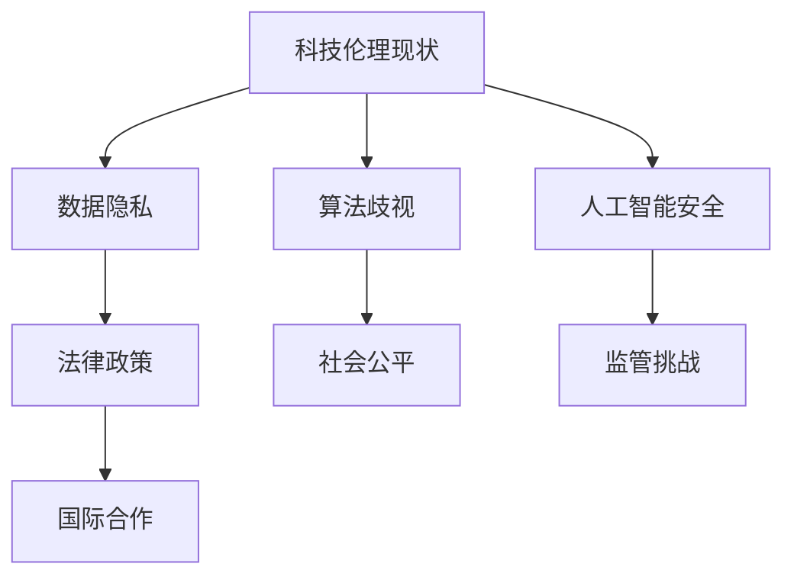

1. **科技伦理现状**：科技伦理的现状反映了当前计算技术带来的伦理问题和社会影响。
2. **数据隐私**：数据隐私是科技伦理中的一个核心问题，涉及到用户的个人信息保护和数据安全。
3. **算法歧视**：算法歧视是指计算技术在决策过程中可能因为编程或数据偏差而歧视某些群体，影响社会公平。
4. **人工智能安全**：人工智能安全涉及人工智能系统的可靠性、可解释性和安全性，防止恶意使用和误用。
5. **法律政策**：法律政策为解决科技伦理问题提供了法律依据和监管框架。
6. **社会公平**：社会公平是科技伦理的目标之一，要求科技应用能够公平对待所有用户，不加剧社会不平等。
7. **监管挑战**：监管挑战是指面对科技伦理问题，现有的监管机制可能存在不足，难以有效应对。
8. **国际合作**：国际合作是解决全球科技伦理问题的必要途径，需要各国共同参与和合作。

#### 科技伦理的主要挑战

当前，科技伦理面临着以下主要挑战：

1. **数据隐私问题**：随着大数据和人工智能技术的发展，个人数据的收集、存储和使用变得日益普遍。然而，这也带来了数据隐私问题。例如，用户在社交媒体上的数据可能被滥用，导致隐私泄露。根据一项研究，2019年全球共有超过5000起数据泄露事件，影响了超过30亿用户的数据。

2. **算法歧视**：算法歧视是另一个严峻的挑战。算法在决策过程中可能因为编程或数据偏差而歧视某些群体。例如，一些招聘系统可能对女性或少数族裔存在偏见，导致不公平的招聘结果。一项关于美国招聘市场的研究发现，具有相似背景的男性比女性更有可能获得面试机会。

3. **人工智能安全**：人工智能安全是科技伦理中的一个重要议题。人工智能系统的复杂性和不确定性使得它们可能成为恶意攻击的目标。例如，恶意软件可以通过人工智能系统进行自动化攻击，造成严重的安全风险。据估计，到2025年，全球因网络攻击导致的损失将超过10万亿美元。

4. **法律和政策不足**：现有的法律和政策在应对科技伦理问题时可能存在不足。例如，数据隐私法规在不同国家和地区之间存在差异，导致跨国数据传输和处理的复杂性。此外，法律和政策可能无法及时适应新兴的科技发展，导致监管空白。

5. **社会公平问题**：科技应用在某种程度上可能加剧社会不平等。例如，自动化和人工智能可能导致某些工作岗位的失业，影响低收入群体的生活。一项关于自动化对劳动力市场影响的研究表明，到2030年，全球可能有多达8亿人因为自动化技术而失业。

6. **监管挑战**：监管挑战是指现有的监管机制可能存在不足，难以有效应对科技伦理问题。例如，人工智能系统的复杂性和不确定性使得监管者难以对其进行全面评估和监管。此外，跨国监管合作可能存在困难，导致监管不一致。

7. **国际合作**：国际合作是解决全球科技伦理问题的必要途径。然而，国际合作在实践过程中可能面临诸多挑战，如各国利益冲突、技术标准和数据保护法规的差异等。

#### 案例分析

为了更直观地了解科技伦理的现状与挑战，我们可以通过以下案例分析：

**案例 1：剑桥分析公司数据泄露事件**

2018年，剑桥分析公司因数据泄露事件引起了全球关注。该公司未经用户同意，收集了8700万用户的个人信息，并利用这些数据来影响选举和政治宣传。这一事件暴露了数据隐私问题，引发了公众对科技伦理的担忧。

**案例 2：亚马逊招聘系统性别歧视问题**

亚马逊在2018年被曝其招聘系统存在性别歧视问题。该系统在评估简历时对女性简历给予了较低的评分，导致女性求职者获得面试的机会较少。这一事件揭示了算法歧视的严重性，引发了社会对科技伦理的反思。

**案例 3：自动驾驶汽车伦理困境**

自动驾驶汽车在现实应用中面临着伦理困境。例如，当自动驾驶汽车遇到紧急情况时，系统需要做出快速决策，可能涉及到生命安全的权衡。如何确保自动驾驶汽车在道德上做出正确的决策，是当前科技伦理研究的一个重要议题。

**案例 4：人工智能武器化**

人工智能武器化是科技伦理领域的一个严峻挑战。人工智能系统可以被用于自动化武器，如无人机和自主火炮。这些武器可能因缺乏人类的道德判断而造成不可预测的后果。如何确保人工智能武器的道德使用，是国际社会面临的一个重要问题。

通过以上案例分析，我们可以看到科技伦理的现状与挑战是复杂多样的。面对这些挑战，我们需要在法律、政策、技术和社会层面采取综合措施，确保科技发展既能带来便利和进步，又能维护社会的伦理底线和公共利益。

#### 伦理在计算技术发展中的作用

伦理在计算技术发展中扮演着至关重要的角色，它是确保技术进步符合人类价值观和社会需求的基石。以下将从几个方面阐述伦理在计算技术发展中的作用：

1. **道德指导**：伦理为计算技术发展提供了道德指导，确保技术的研发和应用遵循道德原则，避免造成负面影响。例如，在人工智能领域，伦理原则如公正、透明和责任被用来指导算法的设计和实现，以确保它们不会加剧社会不平等或侵犯用户隐私。

2. **决策框架**：伦理提供了决策框架，帮助计算技术的开发者、使用者和监管者在面临伦理问题时做出明智的决策。这些框架包括伦理原则、决策工具和评估标准，帮助决策者在技术发展中考虑伦理因素，确保技术符合社会价值观和道德标准。

3. **风险识别**：伦理在计算技术发展中起到风险识别的作用，帮助识别和评估技术可能引发的伦理风险。通过伦理审查和风险评估，我们可以提前发现潜在的问题，并采取预防措施，降低伦理问题的发生概率。

4. **社会监督**：伦理促进了公众对计算技术的监督和参与，提高了社会的伦理意识。公众参与伦理讨论和监督，有助于发现和纠正技术发展中的不道德行为，推动科技领域的伦理改革。

5. **法律和政策支持**：伦理为法律和政策制定提供了理论依据和实践经验，有助于制定更加科学合理的法律和政策，保障计算技术的合法合规应用。例如，数据隐私保护法规和人工智能伦理规范都是基于伦理原则制定的，为计算技术的应用提供了法律依据和监管框架。

#### 伦理在计算技术中的实际应用

伦理在计算技术中的实际应用体现在多个方面，以下是一些具体的实例：

1. **数据隐私保护**：数据隐私是计算技术中一个重要的伦理问题。为了保护用户隐私，开发者需要在数据收集、存储和处理过程中采取一系列措施，如数据加密、匿名化处理和隐私保护算法。例如，Facebook在2018年数据泄露事件后，采取了更严格的数据隐私保护措施，包括用户权限管理和数据匿名化处理。

2. **算法公平性**：算法公平性是另一个关键伦理问题。为了确保算法不会因为编程或数据偏差而产生歧视，开发者需要设计公平的算法，并对其进行透明性和公平性的评估。例如，谷歌在其招聘算法中采取了多种措施，以减少性别、种族和其他因素的偏见。

3. **人工智能伦理审查**：人工智能伦理审查是一种确保人工智能系统符合伦理要求的方法。开发者需要对人工智能系统的设计、实现和应用过程进行全面的伦理审查，确保其不会造成负面影响。例如，欧盟在2021年发布了《人工智能法案》，要求对高风险人工智能系统进行强制审查。

4. **社会责任**：计算技术在发展过程中，需要承担社会责任，确保技术进步惠及全社会。例如，科技巨头如微软、谷歌和亚马逊都制定了社会责任计划，包括投资教育、环境保护和公益事业等，以实现技术发展的社会价值。

5. **透明性和可解释性**：计算技术的透明性和可解释性是伦理的一个重要方面。开发者需要确保用户可以理解计算技术的决策过程和结果，提高技术的透明度。例如，人工智能系统的透明性要求开发者公开算法的详细实现过程和决策逻辑。

通过以上实际应用，我们可以看到伦理在计算技术发展中起到了重要的指导和支持作用。它不仅有助于解决技术发展中的伦理问题，还能够推动计算技术的可持续发展和广泛应用。

#### 1.5 读者指南

为了更好地理解计算伦理学的核心内容，本部分将为读者提供一些建议和指导，帮助大家有效阅读本书，并从中获得最大收益。

##### 阅读预期成果

通过阅读本书，读者可以：

1. **掌握计算伦理学的基本概念和原则**：了解伦理在计算技术发展中的重要性，掌握伦理学原理及其在科技领域的应用。
2. **理解科技伦理的挑战和解决方案**：分析当前科技伦理的现状，掌握应对数据隐私、算法歧视、人工智能安全等问题的方法。
3. **学会运用伦理原则指导实践**：运用伦理决策框架和伦理原则，在实际计算技术应用中做出符合道德标准的决策。
4. **提高伦理意识和社会责任感**：增强对科技伦理问题的敏感性和责任感，促进个人和社会的可持续发展。

##### 如何使用本书

本书结构清晰，内容系统，以下是一些建议帮助读者更好地使用本书：

1. **按章节逐步阅读**：本书分为四个主要部分，每个部分都有明确的目标和内容。建议读者按章节顺序阅读，逐步深入理解计算伦理学的核心概念和应用。
2. **重点阅读案例研究**：本书包含多个案例研究，这些案例旨在通过具体实例展示计算伦理学的实际应用。读者应重点关注这些案例，并结合实际情境进行分析。
3. **互动式学习**：本书中穿插了 Mermaid 流程图、数学模型和项目实战等互动元素。读者可以通过绘制流程图、解决数学模型和实际编程操作，加深对计算伦理学概念的理解。
4. **结合实际情境**：在阅读过程中，读者可以尝试将所学概念应用于实际情境，思考如何在实际项目中应用伦理原则，解决潜在的伦理问题。

##### 思考与讨论问题

为了增强读者的理解和思考能力，本书在每个章节末尾提供了一些思考与讨论问题。以下是一些示例问题：

1. **科技与伦理的平衡点**：你认为科技与伦理的平衡点在哪里？如何在实际计算技术应用中实现这一平衡？
2. **数据隐私保护**：请讨论数据隐私保护的重要性，并举例说明在实际项目中如何实施有效的数据隐私保护措施。
3. **算法歧视**：算法歧视是如何产生的？你认为有哪些方法可以减少或消除算法歧视？
4. **人工智能伦理审查**：人工智能伦理审查的目的是什么？请设计一个简单的伦理审查流程。
5. **社会责任**：作为计算技术的开发者，你如何承担社会责任？请举例说明。

通过思考和讨论这些问题，读者可以更深入地理解计算伦理学的核心概念，并培养解决实际问题的能力。

##### 总结

本书旨在为读者提供全面、系统的计算伦理学知识，帮助大家理解伦理在计算技术发展中的重要性，掌握应对科技伦理挑战的方法。通过按章节逐步阅读、互动式学习和思考与讨论问题，读者可以全面掌握计算伦理学的核心内容，提高伦理意识和社会责任感。希望读者能够通过本书的学习，为计算技术的可持续发展和广泛应用做出积极贡献。

---

## 第二部分：计算伦理学原理

### 2.1 伦理学基础

伦理学是研究道德行为和道德原则的学科，它在计算技术领域中的应用被称为计算伦理学。为了深入理解计算伦理学的原理，我们首先需要了解伦理学的基础理论，包括道德哲学的基本理论和伦理学在科技领域的应用。

#### 核心概念与联系

我们可以使用以下 Mermaid 流程图来展示伦理学基础与计算技术的联系：

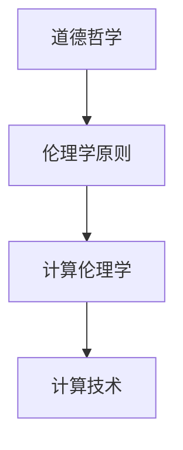

1. **道德哲学**：道德哲学是研究道德行为和道德原则的学科，包括伦理学、道德心理学和道德逻辑等分支。
2. **伦理学原则**：伦理学原则是指导道德行为的基本准则，如公正、尊重、责任等。
3. **计算伦理学**：计算伦理学是应用伦理学原则来解决计算技术中的伦理问题，确保技术的研发和应用符合道德标准。
4. **计算技术**：计算技术包括计算机硬件、软件、网络等，它们在现代社会中扮演着重要角色。

#### 道德哲学的基本理论

道德哲学的基本理论主要包括：

1. **功利主义**：功利主义主张以最大化幸福为道德判断标准，认为行为是否道德取决于其带来的后果。在计算技术领域，功利主义可以指导我们评估技术对用户和社会的整体福祉影响。
2. **康德伦理学**：康德伦理学强调道德行为的义务性，主张以普遍伦理原则为指导。在计算技术中，康德伦理学可以帮助我们确定技术行为是否遵循普遍伦理原则，如尊重用户隐私和公正对待所有用户。
3. **义务论**：义务论认为道德行为必须基于道德义务，而不是仅仅追求结果。在计算技术中，义务论可以帮助我们确保技术开发和应用过程中遵循道德义务，如保护用户隐私和确保算法公平。
4. **社会契约论**：社会契约论主张道德原则是通过社会契约达成的共识。在计算技术中，社会契约论可以指导我们制定道德规范和法规，确保技术符合社会共识和伦理要求。

#### 伦理学在科技领域的应用

伦理学在科技领域的应用主要体现在以下几个方面：

1. **技术评估**：通过伦理学原则对技术进行评估，确保技术符合道德标准，不造成负面影响。例如，在人工智能系统中，我们需要评估算法的公平性、透明性和安全性，确保它们不会歧视用户或侵犯隐私。
2. **决策支持**：伦理学提供了一套系统化的决策框架，帮助决策者在技术发展中考虑伦理因素。例如，在制定数据隐私保护政策时，我们需要考虑伦理原则，如尊重用户隐私和公正对待用户。
3. **道德指导**：伦理学为科技研发和应用提供了道德指导，确保技术发展符合社会价值观和道德标准。例如，在开发医疗设备时，我们需要遵循伦理原则，确保设备不会对用户造成伤害或歧视。
4. **道德责任**：伦理学强调技术开发者和使用者的道德责任，要求他们为技术行为的后果负责。例如，在开发生物信息学技术时，我们需要确保技术不会侵犯用户隐私或违反伦理规范。

通过理解道德哲学的基本理论和伦理学在科技领域的应用，我们可以更好地掌握计算伦理学的原理，为计算技术的发展和应用提供道德指导和支持。

### 2.2 伦理学原则与计算技术

在计算伦理学中，伦理学原则是指导计算技术研发和应用的基本准则。这些原则旨在确保技术行为符合道德标准，维护用户权益和社会利益。本节将详细探讨计算伦理学中的几个核心原则，并分析它们在计算技术中的应用。

#### 核心概念与联系

我们可以通过以下 Mermaid 流程图来展示伦理学原则与计算技术的联系：

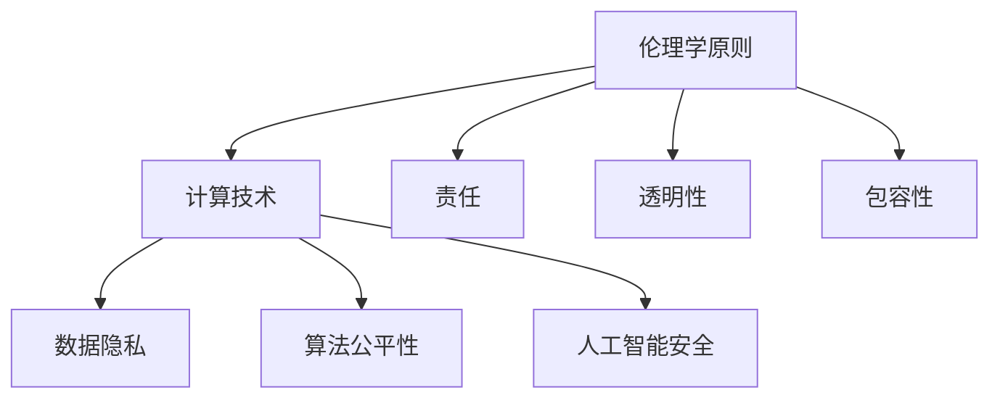

1. **伦理学原则**：伦理学原则包括公正、尊重、责任、透明和包容等，是指导计算技术研发和应用的基本准则。
2. **计算技术**：计算技术包括计算机硬件、软件、网络等，它们在现代社会中扮演着重要角色。
3. **数据隐私**：数据隐私是计算技术中的一个重要方面，涉及到用户的个人信息保护和数据安全。
4. **算法公平性**：算法公平性是指计算技术中的算法不会因为编程或数据偏差而产生歧视，确保对所有用户公平对待。
5. **人工智能安全**：人工智能安全涉及人工智能系统的可靠性、可解释性和安全性，防止恶意使用和误用。
6. **责任**：责任是指计算技术的开发者、使用者和监管者应对技术应用可能产生的后果负责。
7. **透明性**：透明性是指计算技术的决策过程和结果对用户透明，用户可以理解计算技术的行为和影响。
8. **包容性**：包容性是指计算技术能够适应不同用户的需求和背景，促进社会包容性发展。

#### 公正

公正原则要求计算技术在研发和应用过程中对所有用户公平对待，不因性别、种族、年龄等因素产生歧视。在计算技术中，公正原则主要体现在以下几个方面：

1. **算法公平性**：算法设计应避免编程偏差，确保算法在处理不同用户数据时不会产生歧视。例如，招聘系统中应避免对性别、种族等特征的偏见。
2. **数据分配**：计算技术中的资源分配应公平，确保所有用户都能平等地享受技术带来的便利。例如，云计算服务应确保所有用户都能获得足够的计算资源。
3. **法律和政策**：法律和政策应确保计算技术公平对待所有用户，防止因技术歧视导致的社会不平等。例如，数据隐私法规应保护所有用户的隐私权。

#### 尊重

尊重原则要求计算技术尊重用户的隐私和数据权利，确保技术不会侵犯用户的基本权利。在计算技术中，尊重原则主要体现在以下几个方面：

1. **数据隐私保护**：计算技术在收集、存储和处理用户数据时，应采取严格的数据隐私保护措施，确保数据不会被未经授权的人员访问或滥用。例如，加密技术可用于保护用户数据的隐私。
2. **用户同意**：计算技术在收集和使用用户数据时，应事先获得用户的明确同意，确保用户对自己的数据拥有控制权。例如，社交媒体平台在收集用户数据时，应提供清晰的隐私政策，让用户了解数据的使用方式。
3. **透明性**：计算技术应向用户透明其数据收集、存储和处理的方式，让用户了解自己的数据如何被使用。例如，搜索引擎应向用户披露其如何处理用户搜索历史数据。

#### 责任

责任原则要求计算技术的开发者、使用者和监管者对技术应用可能产生的后果负责。在计算技术中，责任原则主要体现在以下几个方面：

1. **开发者责任**：计算技术的开发者应确保技术符合伦理要求，不会侵犯用户隐私或造成其他负面影响。例如，在开发医疗设备时，开发者应确保设备不会对用户造成伤害。
2. **使用者责任**：计算技术的使用者应遵守技术使用规范，确保技术不会被滥用。例如，用户在使用社交媒体平台时，应遵守平台的使用规则，不发布违法违规内容。
3. **监管者责任**：计算技术的监管者应制定相关法规和政策，确保计算技术的合法合规应用，并对违规行为进行处罚。例如，政府应制定数据隐私保护法规，保护用户隐私。

#### 透明性

透明性原则要求计算技术的决策过程和结果对用户透明，用户可以理解计算技术的行为和影响。在计算技术中，透明性原则主要体现在以下几个方面：

1. **算法透明性**：计算技术中的算法应向用户透明，用户可以了解算法的决策过程和结果。例如，金融机构应向客户解释其信用评分算法。
2. **数据处理透明性**：计算技术在处理用户数据时，应向用户透明数据的使用方式和目的。例如，电商平台应向用户披露其如何使用用户数据进行个性化推荐。
3. **技术报告透明性**：计算技术的开发者和使用者应定期发布技术报告，向公众披露技术的使用情况和潜在风险。例如，人工智能系统的开发者应发布年度技术报告，评估算法的公平性和安全性。

#### 包容性

包容性原则要求计算技术能够适应不同用户的需求和背景，促进社会包容性发展。在计算技术中，包容性原则主要体现在以下几个方面：

1. **多语言支持**：计算技术应提供多语言支持，确保所有用户都能使用母语进行交互。例如，搜索引擎应支持多种语言搜索。
2. **无障碍设计**：计算技术应考虑无障碍设计，确保残障用户也能轻松使用。例如，网页应遵循无障碍设计标准，方便视力障碍用户访问。
3. **社会包容性**：计算技术应促进社会包容性发展，确保技术进步惠及全社会。例如，教育技术应致力于提高教育公平，缩小教育差距。

通过深入探讨伦理学原则与计算技术的联系，我们可以更好地理解计算伦理学的核心内容，为计算技术的研发和应用提供道德指导和支持。

### 2.3 计算伦理学案例研究

为了深入理解计算伦理学的实际应用，本节将介绍几个具有代表性的计算伦理学案例研究。通过分析这些案例，我们将展示计算伦理学原则在解决具体问题中的应用，以及伦理决策框架如何指导实践。

#### 核心概念与联系

以下是计算伦理学案例研究的 Mermaid 流程图：

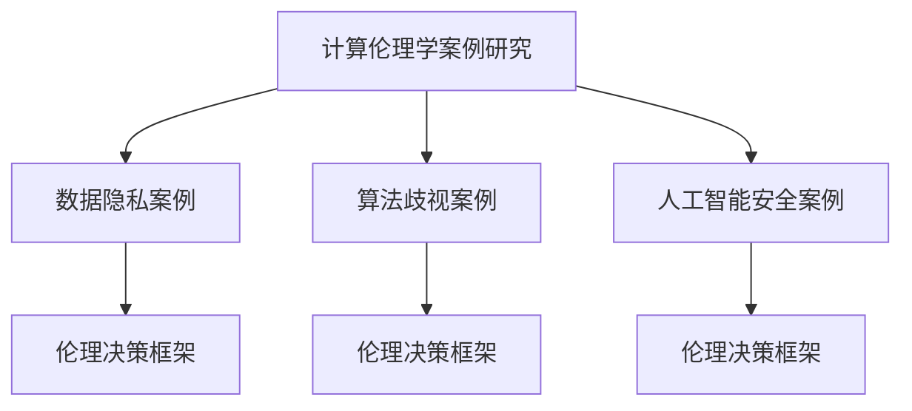

1. **计算伦理学案例研究**：通过具体实例展示计算伦理学原则在实际应用中的挑战和解决方案。
2. **数据隐私案例**：涉及数据收集、存储和处理的伦理问题。
3. **算法歧视案例**：探讨算法在决策过程中可能产生的歧视问题。
4. **人工智能安全案例**：分析人工智能系统的可靠性和安全性问题。
5. **伦理决策框架**：提供系统化的方法和工具，帮助决策者在计算技术应用中做出符合伦理要求的决策。

#### 案例一：数据隐私案例

**案例描述**：某互联网公司通过其应用程序收集了大量用户数据，包括个人信息、行为数据和位置信息。然而，该公司在数据处理过程中未能采取充分的数据隐私保护措施，导致用户数据泄露。

**伦理问题**：用户数据隐私受到侵犯，用户隐私权和数据安全受到威胁。

**伦理决策框架**：在处理用户数据隐私问题时，可以采用以下伦理决策框架：

1. **识别伦理问题**：明确数据隐私问题，如数据泄露的风险和潜在后果。
2. **评估伦理原则**：考虑伦理原则，如尊重用户隐私和责任原则，评估现行数据处理流程是否符合这些原则。
3. **制定解决方案**：提出具体解决方案，如加强数据加密、实施用户数据匿名化处理、制定数据使用政策等。
4. **实施和监控**：将解决方案付诸实践，并持续监控数据隐私保护措施的执行效果。

**解决方案**：该公司采取了一系列措施，包括加强数据加密、实施用户数据匿名化处理，并制定详细的数据使用政策。此外，公司还建立了数据隐私保护团队，定期评估和改进数据隐私保护措施。

#### 案例二：算法歧视案例

**案例描述**：某金融机构开发了一套信用评分算法，用于评估用户的信用等级。然而，该算法在评估过程中存在性别和种族偏见，导致女性和少数族裔用户的信用评分较低。

**伦理问题**：算法歧视问题可能导致社会不公平，加剧性别和种族不平等。

**伦理决策框架**：在处理算法歧视问题时，可以采用以下伦理决策框架：

1. **识别伦理问题**：明确算法歧视问题，如编程偏差和数据偏差。
2. **评估伦理原则**：考虑伦理原则，如公正和尊重，评估算法设计是否符合这些原则。
3. **改进算法设计**：提出改进方案，如增加数据多样性、优化算法模型等。
4. **持续监测和改进**：持续监控算法的公平性，并根据反馈进行改进。

**解决方案**：该金融机构采取了多种措施，包括增加数据多样性，引入更多类型的用户数据，优化算法模型，以减少性别和种族偏见。此外，公司还建立了算法审查委员会，定期评估和改进信用评分算法。

#### 案例三：人工智能安全案例

**案例描述**：某公司开发了一款智能助手，用于提供客户服务。然而，该智能助手在处理客户咨询时，由于编程缺陷，导致了一系列错误回答和误导性信息。

**伦理问题**：人工智能安全问题是智能助手可能对用户造成误导和伤害。

**伦理决策框架**：在处理人工智能安全问题时，可以采用以下伦理决策框架：

1. **识别伦理问题**：明确人工智能安全问题，如可靠性和可解释性。
2. **评估伦理原则**：考虑伦理原则，如责任和透明，评估智能助手的设计是否符合这些原则。
3. **改进技术设计**：提出改进方案，如增加智能助手的可靠性测试、提高算法的可解释性等。
4. **用户告知和监控**：告知用户智能助手的限制和潜在风险，并持续监控智能助手的表现。

**解决方案**：该公司采取了多项措施，包括增加智能助手的可靠性测试，提高算法的可解释性，并向用户告知智能助手的限制和潜在风险。此外，公司还建立了用户反馈机制，及时收集用户意见，并根据反馈进行持续改进。

通过以上案例研究，我们可以看到计算伦理学原则在实际应用中的重要作用。通过伦理决策框架，我们可以系统化地解决计算技术中的伦理问题，确保技术发展符合道德标准，维护用户权益和社会利益。

### 2.4 伦理决策框架

在计算伦理学中，伦理决策框架是指导技术开发和应用过程中做出符合伦理要求的决策的重要工具。伦理决策框架提供了一套系统化的方法和步骤，帮助决策者在面对伦理问题时进行评估和选择。以下将详细介绍伦理决策框架的构成、过程和工具。

#### 核心概念与联系

以下是伦理决策框架的 Mermaid 流程图：

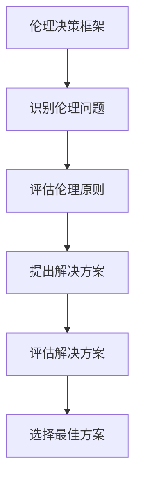

1. **伦理决策框架**：提供系统化的方法和步骤，帮助决策者在面对伦理问题时进行评估和选择。
2. **识别伦理问题**：明确计算技术中存在的伦理问题，如数据隐私、算法歧视、人工智能安全等。
3. **评估伦理原则**：考虑伦理原则，如公正、尊重、责任、透明和包容，评估技术行为是否符合这些原则。
4. **提出解决方案**：提出具体的解决方案，确保技术行为符合伦理要求。
5. **评估解决方案**：对提出的解决方案进行评估，确定其有效性、可行性和道德合理性。
6. **选择最佳方案**：从评估结果中选择最佳方案，并实施决策。

#### 伦理决策框架的构成

伦理决策框架通常包括以下步骤：

1. **识别伦理问题**：首先，需要识别计算技术中存在的伦理问题。这可以通过观察技术行为、收集用户反馈、进行伦理审查等方式实现。例如，在开发一款社交媒体应用时，可能需要识别数据隐私、算法公平性、用户数据滥用等问题。

2. **评估伦理原则**：在识别伦理问题后，需要评估技术行为是否符合伦理原则。伦理原则如公正、尊重、责任、透明和包容等，为决策提供了道德准则。例如，在评估数据隐私问题时，可以参考尊重原则，确保用户数据不被滥用。

3. **提出解决方案**：基于评估结果，提出具体的解决方案。解决方案可以是技术性的，如改进算法设计、增强数据加密等；也可以是管理性的，如制定数据使用政策、建立伦理审查委员会等。

4. **评估解决方案**：对提出的解决方案进行评估，确定其有效性、可行性和道德合理性。评估可以通过伦理分析、成本效益分析、风险评估等方式进行。例如，在评估改进算法设计时，可以分析其是否能有效减少算法歧视，以及实现成本等。

5. **选择最佳方案**：从评估结果中选择最佳方案，并实施决策。最佳方案应具备以下特点：符合伦理要求、实现成本低、风险可控等。

#### 伦理决策框架的过程

伦理决策框架的过程可以概括为以下步骤：

1. **确定决策目标**：明确决策的目标和要求，如确保技术行为符合伦理原则、最大化用户利益等。

2. **识别伦理问题**：通过观察、反馈和审查等方式，识别计算技术中存在的伦理问题。

3. **评估伦理原则**：根据伦理原则，评估技术行为是否符合道德要求。

4. **提出解决方案**：根据评估结果，提出具体的解决方案。

5. **评估解决方案**：对提出的解决方案进行评估，确定其有效性、可行性和道德合理性。

6. **选择最佳方案**：从评估结果中选择最佳方案，并实施决策。

7. **监控和改进**：在决策实施后，持续监控技术行为的伦理表现，并根据反馈进行改进。

#### 伦理决策框架的工具

伦理决策框架中，常用的工具和方法包括：

1. **伦理分析**：通过分析伦理原则和伦理问题，评估技术行为的道德合理性。

2. **成本效益分析**：评估不同解决方案的成本和效益，选择最佳方案。

3. **风险评估**：识别和评估技术行为可能带来的风险，制定风险控制措施。

4. **利益相关者分析**：分析不同利益相关者（如用户、开发者、监管者等）的需求和利益，确保技术行为符合多方利益。

5. **决策树**：使用决策树等方法，系统化地列出不同决策路径和结果，帮助决策者选择最佳方案。

通过使用伦理决策框架，决策者可以在计算技术发展中，系统化地考虑伦理问题，确保技术行为符合道德要求，维护用户权益和社会利益。

### 2.5 道德责任与计算

在计算技术迅猛发展的背景下，道德责任成为了一个备受关注的话题。道德责任不仅关系到计算技术的合法性、合规性和安全性，还影响到技术的实际应用效果和社会影响。本节将探讨道德责任在计算技术中的本质、特点及其在计算技术中的应用。

#### 核心概念与联系

以下是道德责任与计算技术的 Mermaid 流程图：

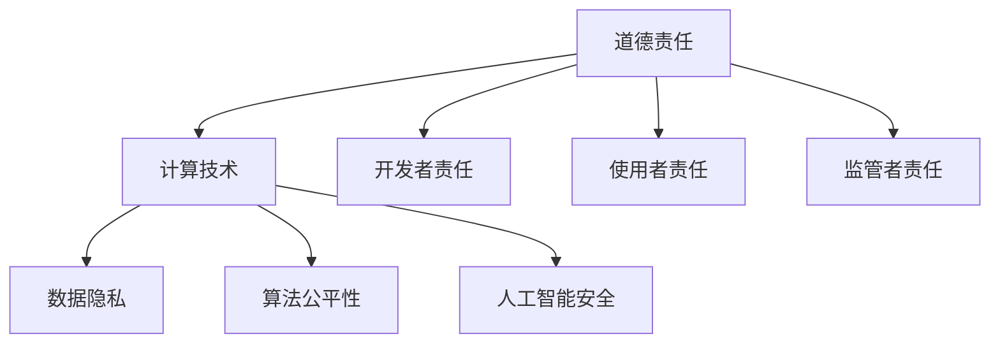

1. **道德责任**：道德责任是指个体或组织在行为中应当承担的道德义务和责任。
2. **计算技术**：计算技术包括计算机硬件、软件、网络等，广泛应用于社会各个领域。
3. **数据隐私**：数据隐私涉及到用户信息的收集、存储和处理，是计算技术中的一个关键问题。
4. **算法公平性**：算法公平性涉及到算法在决策过程中是否公平对待所有用户，避免歧视和偏见。
5. **人工智能安全**：人工智能安全涉及到人工智能系统的可靠性和安全性，防止恶意攻击和误用。
6. **开发者责任**：开发者负责计算技术的研发和设计，需承担道德责任。
7. **使用者责任**：使用者负责计算技术的使用和管理，需承担道德责任。
8. **监管者责任**：监管者负责制定和执行相关法规政策，需承担道德责任。

#### 道德责任的本质与特点

道德责任本质上是基于道德原则和行为准则的责任，它涉及个体或组织在行为中应当承担的道德义务和后果。道德责任具有以下特点：

1. **义务性**：道德责任是一种义务，个体或组织在行为中应当遵守道德原则，履行道德义务。
2. **规范性**：道德责任是一种规范性要求，它规定了行为应当遵循的道德标准，如公正、尊重、责任等。
3. **后果性**：道德责任与行为的后果相关，个体或组织需为其行为后果负责，包括积极后果和消极后果。
4. **伦理性**：道德责任是一种伦理要求，它关注行为是否符合道德伦理标准，是否对他人和社会造成负面影响。

#### 道德责任在计算技术中的应用

道德责任在计算技术中的应用体现在以下几个方面：

1. **开发者责任**：计算技术的开发者需承担道德责任，确保技术符合伦理要求。开发者需在技术设计、开发和维护过程中，遵守伦理原则，如保护用户隐私、确保算法公平性、提高人工智能安全性等。例如，开发者需在设计算法时考虑算法的公平性，避免因编程偏差导致算法歧视。

2. **使用者责任**：计算技术的使用者需承担道德责任，确保技术合理、合法使用。使用者需遵守技术使用规范，不滥用技术，不违反法律法规。例如，企业使用人工智能系统进行招聘时，需确保算法公平，不因性别、种族等因素歧视用户。

3. **监管者责任**：计算技术的监管者需承担道德责任，制定和执行相关法规政策，保障计算技术的合法合规应用。监管者需在制定法规政策时，考虑技术对用户和社会的影响，确保技术符合伦理要求。例如，政府制定数据隐私保护法规，确保用户数据不被滥用。

#### 实际应用案例分析

以下是一个道德责任在计算技术中的实际应用案例：

**案例：人工智能医疗诊断系统**

某医院引进了一款人工智能医疗诊断系统，用于辅助医生进行疾病诊断。然而，该系统在训练数据集上存在性别和种族偏差，导致对女性和少数族裔患者的诊断准确率较低。

**伦理问题**：系统在诊断过程中存在算法歧视，可能对女性和少数族裔患者造成不公平对待。

**道德责任**：在此案例中，道德责任涉及以下几个方面：

1. **开发者责任**：开发者需在系统设计过程中，考虑数据多样性，确保训练数据集的代表性，避免算法歧视。开发者还需在系统发布前，进行全面的伦理审查，确保系统符合伦理要求。

2. **使用者责任**：医院在引入系统时，需确保系统符合伦理要求，不因算法歧视导致对患者的不公平对待。医院需定期评估系统的性能和公平性，并根据评估结果进行改进。

3. **监管者责任**：政府需制定相关法规政策，确保人工智能医疗诊断系统的合法合规应用。政府还需加强对人工智能技术的监管，推动技术发展符合伦理要求。

通过以上案例分析，我们可以看到道德责任在计算技术中的重要性。只有通过开发者、使用者和监管者的共同努力，才能确保计算技术的合法合规应用，维护用户权益和社会利益。

### 3.1 数据伦理

数据伦理是计算伦理学中的一个核心议题，涉及到数据收集、存储、处理和使用过程中所涉及的道德问题和伦理挑战。随着大数据和人工智能技术的快速发展，数据伦理问题日益突出，对个人隐私、社会公平和公共利益产生深远影响。本节将探讨数据伦理的核心概念、挑战和解决方案。

#### 核心概念与联系

以下是数据伦理的 Mermaid 流程图：

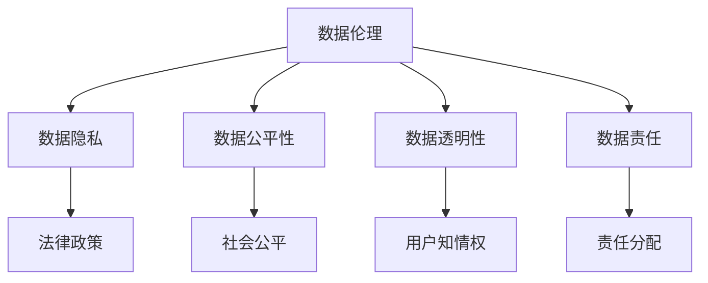

1. **数据伦理**：数据伦理是研究数据收集、存储、处理和使用过程中所涉及的道德问题和伦理挑战的学科。
2. **数据隐私**：数据隐私涉及个人数据的保护，防止数据泄露、滥用和未经授权的访问。
3. **数据公平性**：数据公平性涉及数据在收集、处理和使用过程中是否公平对待所有用户，避免歧视和偏见。
4. **数据透明性**：数据透明性涉及数据收集、处理和使用过程的透明度，确保用户了解其数据如何被使用。
5. **数据责任**：数据责任涉及数据收集、处理和使用过程中各方应承担的道德责任。
6. **法律政策**：法律政策为数据伦理提供了法律依据和监管框架。
7. **社会公平**：社会公平涉及数据伦理如何促进社会公平，减少不平等。
8. **用户知情权**：用户知情权涉及用户对其数据的知情权和控制权。
9. **责任分配**：责任分配涉及在数据伦理问题中各方责任的界定和分配。

#### 数据隐私保护

数据隐私是数据伦理中的一个核心问题，涉及到用户个人信息的保护和隐私权的维护。以下从几个方面探讨数据隐私保护的挑战和解决方案：

1. **数据收集**：在数据收集过程中，应确保收集的数据最小化原则，仅收集实现特定目的所必需的数据。同时，应明确告知用户数据收集的目的、范围和用途，获得用户的明确同意。

2. **数据存储**：在数据存储过程中，应采取严格的数据加密和访问控制措施，确保数据的安全性和隐私性。例如，使用SSL/TLS加密技术保护数据在传输过程中的安全，使用数据库访问控制机制限制对敏感数据的访问。

3. **数据处理**：在数据处理过程中，应确保数据处理过程的透明性和合规性，避免数据被滥用或未经授权的访问。例如，在数据分析过程中，应使用去识别化技术，如匿名化、伪名化等，确保数据不再能够追溯到特定个人。

4. **数据共享**：在数据共享过程中，应确保数据共享的合法性和合规性，避免数据泄露和滥用。例如，在数据共享前，应与数据接收方签订保密协议，明确数据使用的目的和范围。

5. **数据销毁**：在数据不再需要时，应及时销毁数据，防止数据泄露和滥用。例如，在数据销毁前，应使用数据擦除技术，确保数据无法恢复。

#### 数据公平性

数据公平性是数据伦理中的另一个重要议题，涉及到数据在收集、处理和使用过程中是否公平对待所有用户，避免歧视和偏见。以下从几个方面探讨数据公平性的挑战和解决方案：

1. **数据偏差**：数据偏差是指数据在收集、处理和使用过程中可能存在的偏差，导致算法和模型对某些群体产生不公平对待。为了减少数据偏差，应在数据收集和处理过程中采用多样性原则，确保数据的代表性。

2. **算法公平性**：算法公平性是指算法在决策过程中是否公平对待所有用户，避免歧视和偏见。为了提高算法公平性，应在算法设计和实现过程中采用公平性评估方法，如公平性测试、偏差校正等。

3. **透明性**：数据透明性是指数据收集、处理和使用过程的透明度，确保用户了解其数据如何被使用。为了提高数据透明性，应在数据收集和使用过程中，明确告知用户数据的使用目的、范围和影响。

4. **用户参与**：用户参与是指用户在数据收集和使用过程中的参与和决策权。为了提高用户参与度，应建立用户反馈机制，允许用户对数据收集和使用提出意见和建议。

5. **法律政策**：法律政策为数据公平性提供了法律依据和监管框架。例如，数据隐私保护法规和算法公平性规范，可以规范数据收集和使用行为，保障用户的权益。

#### 数据透明性

数据透明性是数据伦理中的一个重要方面，涉及到数据收集、处理和使用过程的透明度和用户知情权。以下从几个方面探讨数据透明性的挑战和解决方案：

1. **数据隐私政策**：数据隐私政策是指企业在数据收集和使用过程中，公开告知用户数据收集、存储、处理和使用的政策和规则。为了提高数据透明性，企业应制定清晰、易懂的数据隐私政策，并确保用户可以方便地获取和了解。

2. **用户知情权**：用户知情权是指用户对其数据的知情权和控制权。为了保障用户知情权，企业应提供用户访问、修改和删除其数据的途径，确保用户可以控制自己的数据。

3. **数据使用监控**：数据使用监控是指对数据收集、处理和使用过程的监控和记录，确保数据的合规使用。为了提高数据透明性，企业应建立数据监控机制，记录数据的使用情况和访问记录。

4. **用户反馈机制**：用户反馈机制是指用户对企业数据收集和使用行为的反馈和投诉渠道。为了提高数据透明性，企业应建立用户反馈机制，及时回应用户的意见和建议，改进数据收集和使用行为。

#### 数据责任

数据责任是数据伦理中的一个关键议题，涉及到数据收集、处理和使用过程中各方应承担的道德责任。以下从几个方面探讨数据责任的挑战和解决方案：

1. **开发者责任**：开发者负责计算技术的研发和设计，需承担数据隐私保护和算法公平性的道德责任。开发者应在设计算法时，充分考虑数据隐私保护和公平性原则，避免算法歧视和数据滥用。

2. **使用者责任**：使用者负责计算技术的使用和管理，需承担数据隐私保护和合规使用的道德责任。使用者应在使用数据时，遵守数据隐私保护法规和政策，确保数据不被滥用。

3. **监管者责任**：监管者负责制定和执行相关法规政策，需承担保障数据隐私保护和公平使用的道德责任。监管者应加强对数据收集、处理和使用的监管，确保数据隐私保护和公平使用。

4. **责任分配**：在数据伦理问题中，责任分配是一个复杂的问题。为了明确责任分配，应在数据收集、处理和使用过程中，明确各方的责任和权限，确保各方在数据隐私保护和公平使用中承担相应的责任。

通过深入探讨数据伦理的核心概念、挑战和解决方案，我们可以更好地理解数据伦理在计算技术中的重要性，为数据隐私保护和公平使用提供指导。

### 3.2 人工智能伦理

人工智能（AI）技术作为计算技术的核心组成部分，已经在许多领域取得了显著的应用成果。然而，随着人工智能技术的普及，其伦理问题也日益凸显。本节将探讨人工智能伦理的核心概念、挑战和解决方案，以及伦理决策框架在人工智能应用中的具体应用。

#### 核心概念与联系

以下是人工智能伦理的 Mermaid 流程图：

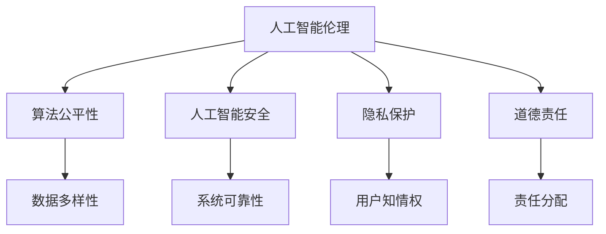

1. **人工智能伦理**：人工智能伦理涉及人工智能技术在实际应用中所面临的伦理问题，如算法公平性、安全性、隐私保护和道德责任等。
2. **算法公平性**：算法公平性涉及人工智能算法在决策过程中是否公平对待所有用户，避免歧视和偏见。
3. **人工智能安全**：人工智能安全涉及人工智能系统的可靠性、可解释性和安全性，防止恶意使用和误用。
4. **隐私保护**：隐私保护涉及用户个人信息的保护，防止数据泄露和滥用。
5. **道德责任**：道德责任涉及人工智能技术开发者、使用者和监管者在技术应用中所承担的道德责任。
6. **数据多样性**：数据多样性涉及在人工智能算法训练过程中，使用多样性的数据，以确保算法的公平性和有效性。
7. **系统可靠性**：系统可靠性涉及人工智能系统的稳定性和准确性，确保系统能够正常运行并产生可靠的结果。
8. **用户知情权**：用户知情权涉及用户对其数据的知情权和控制权。
9. **责任分配**：责任分配涉及在人工智能伦理问题中，各方责任的界定和分配。

#### 人工智能伦理的核心挑战

1. **算法公平性**：算法公平性是人工智能伦理中的一个核心问题。人工智能算法在决策过程中可能会因为数据偏差、编程缺陷等原因产生歧视性结果。例如，招聘算法可能对女性或少数族裔产生歧视，导致不公平的招聘结果。为了解决算法公平性问题，需要在算法设计、数据收集和处理过程中考虑公平性原则，确保算法能够公平对待所有用户。

2. **人工智能安全**：人工智能安全是另一个重要的伦理挑战。随着人工智能技术的普及，其安全性和可靠性问题日益凸显。例如，自动驾驶汽车可能因为系统故障或恶意攻击而导致交通事故。为了确保人工智能安全，需要在人工智能系统的研发、测试和应用过程中，采用严格的安全措施，提高系统的可靠性、可解释性和安全性。

3. **隐私保护**：随着人工智能技术的应用，个人数据的收集、存储和处理变得更加普遍。然而，这也带来了隐私保护的问题。人工智能系统在训练过程中可能会收集大量的个人数据，这些数据如果被滥用或泄露，可能会对用户造成严重的隐私侵犯。为了保护用户隐私，需要在数据收集、存储和处理过程中采取严格的数据隐私保护措施，确保用户数据的安全和隐私。

4. **道德责任**：道德责任是人工智能伦理中的一个重要方面。人工智能技术开发者、使用者和监管者在技术应用中承担着不同的道德责任。开发者需要确保技术符合伦理要求，使用者需要确保技术的合法合规应用，监管者需要制定和执行相关法规政策，确保人工智能技术的合法合规应用。为了明确道德责任，需要在人工智能技术发展中建立明确的责任分配机制。

#### 人工智能伦理的解决方案

1. **算法公平性解决方案**：为了解决算法公平性问题，需要在算法设计、数据收集和处理过程中考虑公平性原则。具体措施包括：
   - 使用多样性的数据进行训练，确保算法的公平性和有效性；
   - 评估和改进算法的公平性，采用公平性评估指标和工具；
   - 建立公平性审查委员会，对算法进行独立审查和评估。

2. **人工智能安全解决方案**：为了确保人工智能安全，需要在系统的研发、测试和应用过程中采取严格的安全措施。具体措施包括：
   - 对人工智能系统进行安全性测试和评估，确保系统的可靠性和安全性；
   - 建立人工智能安全标准和规范，指导人工智能系统的开发和部署；
   - 加强人工智能安全研究和教育，提高公众的安全意识和能力。

3. **隐私保护解决方案**：为了保护用户隐私，需要在数据收集、存储和处理过程中采取严格的数据隐私保护措施。具体措施包括：
   - 明确告知用户数据收集的目的、范围和用途，获得用户的明确同意；
   - 使用数据加密和匿名化技术，确保用户数据的安全和隐私；
   - 建立用户数据访问和管理的权限控制机制，确保数据不被滥用。

4. **道德责任解决方案**：为了明确道德责任，需要在人工智能技术发展中建立明确的责任分配机制。具体措施包括：
   - 制定和执行相关法律法规，明确各方在人工智能技术应用中的责任和义务；
   - 建立人工智能伦理委员会，负责监督和评估人工智能技术的伦理应用；
   - 加强人工智能伦理教育和培训，提高技术开发者、使用者和监管者的伦理意识和责任感。

#### 伦理决策框架在人工智能应用中的具体应用

伦理决策框架是指导人工智能技术应用过程中做出符合伦理要求的决策的重要工具。在人工智能应用中，可以采用以下伦理决策框架：

1. **识别伦理问题**：在人工智能应用过程中，首先需要识别可能存在的伦理问题，如算法公平性、安全性、隐私保护等。

2. **评估伦理原则**：根据伦理原则，如公正、尊重、责任、透明和包容等，评估人工智能技术应用是否符合这些原则。

3. **提出解决方案**：基于评估结果，提出具体的解决方案，确保人工智能技术应用符合伦理要求。解决方案可以是技术性的，如改进算法设计、增强数据隐私保护等；也可以是管理性的，如制定伦理使用指南、建立伦理审查委员会等。

4. **评估解决方案**：对提出的解决方案进行评估，确定其有效性、可行性和道德合理性。评估可以通过伦理分析、成本效益分析、风险评估等方式进行。

5. **选择最佳方案**：从评估结果中选择最佳方案，并实施决策。

通过采用伦理决策框架，人工智能技术开发者、使用者和监管者可以在应用过程中系统化地考虑伦理问题，确保技术应用符合伦理要求，维护用户权益和社会利益。

### 3.3 生物信息学伦理

生物信息学作为一门结合生物学、计算机科学和信息学的跨学科领域，已经在基因测序、疾病诊断、个性化医疗等方面取得了重要进展。然而，生物信息学的快速发展也引发了一系列伦理问题，涉及到隐私、基因编辑、数据共享等方面。本节将探讨生物信息学伦理的核心概念、挑战和解决方案。

#### 核心概念与联系

以下是生物信息学伦理的 Mermaid 流程图：

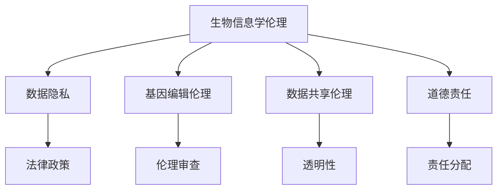

1. **生物信息学伦理**：生物信息学伦理涉及生物信息学研究中可能遇到的道德问题和伦理挑战。
2. **数据隐私**：数据隐私是指个人生物信息的保护，防止未经授权的访问和使用。
3. **基因编辑伦理**：基因编辑伦理涉及基因编辑技术的道德问题和伦理挑战，如基因改造、基因歧视等。
4. **数据共享伦理**：数据共享伦理涉及生物信息数据的共享、合作和伦理问题。
5. **道德责任**：道德责任是指生物信息学研究者和从业者在研究过程中应承担的道德义务和责任。
6. **法律政策**：法律政策为生物信息学伦理提供了法律依据和监管框架。
7. **伦理审查**：伦理审查是指对生物信息学研究项目的伦理评估和监督。
8. **透明性**：透明性是指生物信息学研究过程和结果对参与者和社会的透明度。
9. **责任分配**：责任分配是指生物信息学研究中各方责任的界定和分配。

#### 生物信息学伦理的核心挑战

1. **数据隐私**：随着基因测序技术的普及，个人生物信息的收集和存储变得更加普遍。然而，这也带来了隐私保护的问题。个人生物信息的泄露或滥用可能对个人隐私造成严重侵犯，影响个人生活和家庭。为了保护数据隐私，需要在数据收集、存储和处理过程中采取严格的数据隐私保护措施。

2. **基因编辑伦理**：基因编辑技术，如CRISPR-Cas9，为医学和生物学研究提供了新的可能性。然而，基因编辑技术也引发了一系列伦理问题，如基因改造、基因歧视等。基因编辑可能导致遗传信息的改变，对人类基因组造成永久性影响。如何确保基因编辑技术的安全性和道德性，避免滥用和误用，是当前生物信息学伦理研究的重要议题。

3. **数据共享伦理**：生物信息学研究的成功离不开数据共享和合作。然而，数据共享也引发了一系列伦理问题，如数据所有权、知识产权、数据透明性等。如何平衡数据共享与合作与数据隐私保护之间的关系，确保数据的合法合规使用，是生物信息学伦理研究的重要挑战。

4. **道德责任**：生物信息学研究者和从业者在研究过程中应承担道德责任，确保研究符合伦理要求。道德责任包括对研究对象的尊重、保护研究对象的权益、确保数据的合法合规使用等。如何明确道德责任，建立责任分配机制，是生物信息学伦理研究的重要内容。

#### 生物信息学伦理的解决方案

1. **数据隐私保护**：为了保护数据隐私，需要在数据收集、存储和处理过程中采取严格的数据隐私保护措施。具体措施包括：
   - 明确告知数据提供者数据收集的目的、范围和用途，获得数据提供者的明确同意；
   - 使用数据加密和匿名化技术，确保数据的安全性和隐私性；
   - 建立数据访问和管理的权限控制机制，确保数据不被滥用。

2. **基因编辑伦理**：为了确保基因编辑技术的安全性和道德性，需要在基因编辑研究中采取严格的伦理审查和监管措施。具体措施包括：
   - 建立基因编辑伦理审查委员会，负责对基因编辑研究项目的伦理评估和监督；
   - 制定基因编辑伦理规范和指南，明确基因编辑技术的道德要求和限制；
   - 加强基因编辑技术的研究和宣传教育，提高公众对基因编辑伦理问题的认识和意识。

3. **数据共享伦理**：为了平衡数据共享与合作与数据隐私保护之间的关系，需要在数据共享过程中采取透明的数据共享机制和责任分配机制。具体措施包括：
   - 明确数据共享的目的、范围和条件，确保数据共享的合法合规；
   - 制定数据共享协议，明确各方的权利和义务，确保数据共享的透明性；
   - 建立数据共享平台，提供数据共享的技术支持和监管。

4. **道德责任**：为了明确生物信息学研究者和从业者的道德责任，需要建立责任分配机制和责任追究机制。具体措施包括：
   - 制定生物信息学伦理规范和法律法规，明确研究者和从业者的道德责任和义务；
   - 建立伦理责任追究机制，对违反伦理规范的行为进行惩罚和制裁；
   - 加强生物信息学伦理教育和培训，提高研究者和从业者的伦理意识和责任感。

通过深入探讨生物信息学伦理的核心概念、挑战和解决方案，我们可以更好地理解生物信息学伦理在研究过程中的重要性，为生物信息学技术的安全、合法和道德应用提供指导。

### 3.4 网络空间伦理

网络空间作为现代社会的重要组成部分，已经成为人们生活、工作和交流的重要平台。然而，网络空间的快速发展也带来了一系列伦理问题，如网络安全、网络隐私、网络暴力和网络欺诈等。本节将探讨网络空间伦理的核心概念、挑战和解决方案，以及伦理决策框架在网络空间中的应用。

#### 核心概念与联系

以下是网络空间伦理的 Mermaid 流程图：

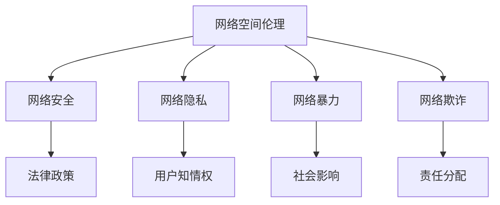

1. **网络空间伦理**：网络空间伦理涉及网络空间中可能遇到的道德问题和伦理挑战。
2. **网络安全**：网络安全涉及保护网络系统、数据和用户免受攻击、破坏和未授权访问的措施。
3. **网络隐私**：网络隐私涉及用户在网络空间中个人信息的安全和隐私保护。
4. **网络暴力**：网络暴力涉及网络空间中发生的针对个人的恶意行为和攻击。
5. **网络欺诈**：网络欺诈涉及利用网络进行欺诈活动，如网络钓鱼、诈骗等。
6. **法律政策**：法律政策为网络空间伦理提供了法律依据和监管框架。
7. **用户知情权**：用户知情权涉及用户对其数据的知情权和控制权。
8. **社会影响**：社会影响涉及网络空间行为对社会产生的正面和负面影响。
9. **责任分配**：责任分配涉及网络空间中各方责任的界定和分配。

#### 网络空间伦理的核心挑战

1. **网络安全**：网络安全是网络空间伦理中的一个核心问题。随着网络技术的普及，网络攻击、网络病毒和网络安全漏洞等问题日益突出。网络安全问题不仅可能导致个人隐私泄露，还可能对企业和国家造成严重损失。如何确保网络安全，防止网络攻击和数据泄露，是网络空间伦理研究的重要议题。

2. **网络隐私**：网络隐私是网络空间伦理中的另一个重要问题。随着互联网的发展，个人数据在网络空间中被广泛收集、存储和处理。然而，这也带来了网络隐私问题。如何保护用户在网络空间中的个人信息，防止数据泄露和滥用，是网络空间伦理研究的重要挑战。

3. **网络暴力**：网络暴力是网络空间中的一个严重问题，涉及网络空间中针对个人的恶意行为和攻击。网络暴力可能导致受害者心理创伤，影响社会和谐。如何应对网络暴力，保护网络空间中的弱势群体，是网络空间伦理研究的重要议题。

4. **网络欺诈**：网络欺诈是网络空间中的另一个重要问题，涉及利用网络进行欺诈活动，如网络钓鱼、诈骗等。网络欺诈活动不仅给用户造成经济损失，还破坏了网络空间的诚信和公平性。如何防范网络欺诈，提高网络空间的安全性和可信度，是网络空间伦理研究的重要议题。

5. **责任分配**：在网络安全、网络隐私、网络暴力和网络欺诈等问题中，责任分配是一个复杂的问题。如何明确各方在网络空间中的责任，确保各方承担相应的责任，是网络空间伦理研究的重要议题。

#### 网络空间伦理的解决方案

1. **网络安全解决方案**：为了确保网络安全，需要在网络空间中采取一系列措施：
   - 加强网络基础设施建设，提高网络系统的安全性和稳定性；
   - 采用先进的安全技术和工具，如防火墙、加密技术、入侵检测系统等，保护网络系统和数据的安全；
   - 制定网络安全法规和政策，明确网络空间中各方责任和义务，加强网络安全监管；
   - 提高公众的网络安全意识和技能，增强网络安全防范能力。

2. **网络隐私保护解决方案**：为了保护网络隐私，需要在网络空间中采取一系列措施：
   - 明确告知用户个人信息收集、存储和使用的目的和范围，获得用户的明确同意；
   - 采用数据加密和匿名化技术，确保用户数据的安全和隐私；
   - 制定网络隐私保护法规和政策，明确网络空间中各方责任和义务，加强网络隐私监管；
   - 提高公众的网络隐私意识和技能，增强网络隐私保护能力。

3. **网络暴力应对解决方案**：为了应对网络暴力，需要在网络空间中采取一系列措施：
   - 加强网络暴力监测和举报机制，及时发现和处置网络暴力行为；
   - 制定网络暴力法规和政策，明确网络空间中各方责任和义务，加强网络暴力监管；
   - 加强网络暴力宣传教育，提高公众对网络暴力的认识和处理能力；
   - 建立网络暴力受害者救助机制，提供心理支持和法律援助。

4. **网络欺诈防范解决方案**：为了防范网络欺诈，需要在网络空间中采取一系列措施：
   - 加强网络欺诈监测和举报机制，及时发现和处置网络欺诈行为；
   - 制定网络欺诈法规和政策，明确网络空间中各方责任和义务，加强网络欺诈监管；
   - 加强网络欺诈宣传教育，提高公众对网络欺诈的认识和防范能力；
   - 建立网络欺诈受害者救助机制，提供经济和法律援助。

5. **责任分配解决方案**：为了明确网络空间中各方责任，需要在网络空间中采取一系列措施：
   - 制定网络空间责任分配规则，明确各方在网络空间中的责任和义务；
   - 加强网络空间监管，确保各方遵守责任分配规则；
   - 建立责任追究机制，对违反责任分配规则的行为进行惩罚和制裁；
   - 加强网络空间责任教育和培训，提高各方责任意识和责任感。

通过深入探讨网络空间伦理的核心概念、挑战和解决方案，我们可以更好地理解网络空间伦理在现代社会中的重要性，为网络空间的安全、合法和道德应用提供指导。

### 3.5 计算伦理教育

计算伦理教育是培养计算技术领域从业者伦理意识和道德责任的关键环节。随着计算技术的快速发展，伦理问题日益凸显，计算伦理教育的重要性也愈发突出。本节将探讨计算伦理教育的重要性、教育内容和实践方法。

#### 核心概念与联系

以下是计算伦理教育的 Mermaid 流程图：

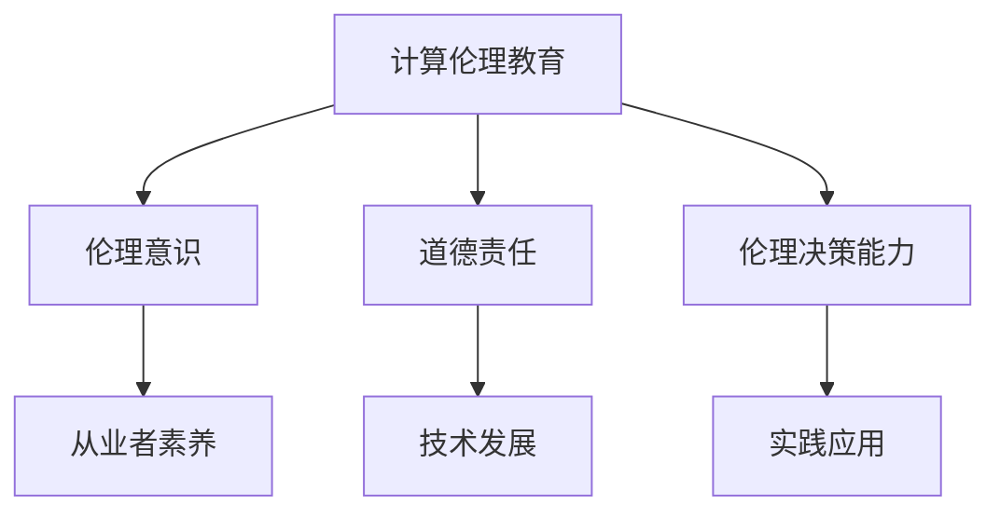

1. **计算伦理教育**：计算伦理教育是培养计算技术领域从业者的伦理意识和道德责任的教育过程。
2. **伦理意识**：伦理意识是指计算技术从业者对伦理问题的认识和敏感性。
3. **道德责任**：道德责任是指计算技术从业者在技术行为中应当承担的道德义务和责任。
4. **伦理决策能力**：伦理决策能力是指计算技术从业者在面对伦理问题时，能够做出符合伦理要求的决策的能力。
5. **从业者素养**：从业者素养是指计算技术从业者在伦理意识、道德责任和伦理决策能力等方面的综合素养。
6. **技术发展**：技术发展是指计算技术领域的新技术和新应用的发展。
7. **实践应用**：实践应用是指计算技术从业者在实际工作中应用伦理原则和伦理决策框架的能力。

#### 计算伦理教育的重要性

1. **培养伦理意识**：计算伦理教育能够培养计算技术从业者的伦理意识，使他们认识到伦理问题在技术发展中的重要性，从而在技术设计和应用中更加关注伦理问题。
2. **提高道德责任**：计算伦理教育能够提高计算技术从业者的道德责任，使他们意识到自己在技术行为中的道德义务和责任，从而更加负责任地进行技术行为。
3. **增强伦理决策能力**：计算伦理教育能够培养计算技术从业者的伦理决策能力，使他们能够在面对伦理问题时，做出符合伦理要求的决策，避免因道德失误而导致的技术问题。
4. **促进技术发展**：计算伦理教育能够促进技术的健康发展，通过培养具有良好伦理意识的从业者，减少技术发展中的伦理风险，提高技术的可信度和合法性。
5. **提升从业者素养**：计算伦理教育能够提升计算技术从业者的综合素养，使他们在技术行为中不仅具备技术能力，还具备伦理意识和道德责任，成为更全面的技术人才。

#### 计算伦理教育的内容

1. **伦理学基础**：计算伦理教育应涵盖伦理学的基本理论，如道德哲学、伦理学原则等，使从业者了解伦理学的基本概念和原则，为后续的伦理决策提供理论基础。
2. **计算伦理学原则**：计算伦理教育应详细介绍计算伦理学的基本原则，如公正、尊重、责任、透明和包容等，使从业者了解在技术行为中应当遵循的伦理准则。
3. **伦理决策框架**：计算伦理教育应教授伦理决策框架，如识别伦理问题、评估伦理原则、提出解决方案和评估解决方案等，使从业者能够在面对伦理问题时，系统化地做出符合伦理要求的决策。
4. **伦理案例分析**：计算伦理教育应通过实际案例的分析，使从业者了解伦理问题在现实中的应用，掌握应对伦理问题的方法。
5. **法律法规与政策**：计算伦理教育应介绍与计算技术相关的法律法规和政策，使从业者了解在技术行为中应当遵守的法律规定和政策要求。

#### 计算伦理教育的实践方法

1. **课堂教育**：通过课堂教学，讲授伦理学基础、计算伦理学原则、伦理决策框架等内容，使从业者系统学习计算伦理学知识。
2. **案例教学**：通过案例分析，使从业者了解伦理问题在现实中的应用，掌握应对伦理问题的方法。
3. **实验与实训**：通过实验和实训，使从业者能够在实际情境中应用伦理原则和伦理决策框架，提高其实际工作能力。
4. **研讨会和讲座**：通过研讨会和讲座，邀请伦理学专家和行业从业者分享经验，使从业者了解计算伦理学的前沿动态和实际应用。
5. **网络课程与资源**：通过网络课程和资源，使从业者能够随时学习和了解计算伦理学知识，提高自主学习能力。

通过计算伦理教育，我们可以培养出具有良好伦理意识和道德责任的计算技术从业者，推动计算技术的健康发展，促进社会的可持续发展。

### 4.1 计算伦理学的未来趋势

计算伦理学作为一门研究计算技术道德问题的学科，随着科技的发展和社会的进步，其研究内容和应用场景也在不断拓展。本节将探讨计算伦理学的未来趋势，包括新兴伦理问题、计算伦理学的发展方向以及伦理决策框架的进一步优化。

#### 核心概念与联系

以下是计算伦理学未来趋势的 Mermaid 流程图：

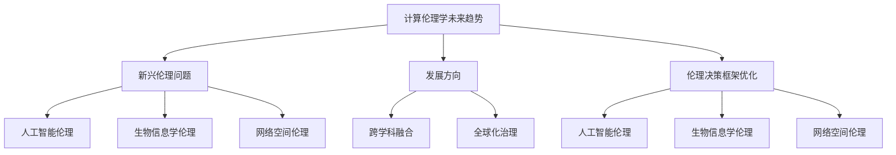

1. **计算伦理学未来趋势**：计算伦理学的未来趋势涉及新兴伦理问题的出现、计算伦理学的发展方向以及伦理决策框架的优化。
2. **新兴伦理问题**：新兴伦理问题是随着科技发展而出现的新伦理挑战，如自动化伦理、量子计算伦理等。
3. **发展方向**：计算伦理学的发展方向包括跨学科融合、全球化治理等。
4. **伦理决策框架优化**：伦理决策框架优化旨在提高伦理决策的效率和效果，适应不断变化的技术环境。

#### 新兴伦理问题

1. **自动化伦理**：随着自动化技术的发展，自动化系统在决策和执行中扮演越来越重要的角色。自动化伦理问题包括自动化系统的责任归属、道德决策能力以及可能带来的失业和社会不平等。为了应对这些挑战，需要在自动化系统的设计和应用中引入伦理考量，确保系统的决策符合道德要求。

2. **量子计算伦理**：量子计算作为下一代计算技术，其强大的计算能力可能引发新的伦理问题，如数据安全和隐私保护。量子计算可能被用于破解传统加密算法，导致数据泄露和网络安全问题。为了应对这些挑战，需要研究量子计算的伦理问题，制定相应的伦理准则和安全措施。

3. **人工智能伦理**：随着人工智能技术的不断发展，人工智能伦理问题变得尤为重要。人工智能伦理问题包括算法公平性、透明性、可解释性和道德责任。为了解决这些问题，需要建立人工智能伦理决策框架，确保人工智能系统的研发和应用符合道德要求。

4. **生物信息学伦理**：生物信息学技术的进步带来了新的伦理挑战，如基因编辑、基因隐私和数据共享。基因编辑可能导致人类基因的改变，引发道德和伦理争议。生物信息学伦理问题需要跨学科合作，制定全面的伦理规范和法律法规。

5. **网络空间伦理**：随着网络技术的普及，网络空间成为一个新的社会领域，网络空间伦理问题日益突出。网络空间伦理问题包括网络安全、网络隐私、网络暴力和网络欺诈等。为了应对这些挑战，需要建立网络空间伦理决策框架，确保网络空间的合法、安全和道德应用。

#### 计算伦理学的发展方向

1. **跨学科融合**：计算伦理学的发展需要跨学科融合，结合伦理学、计算机科学、法律、社会学等多个领域的知识。通过跨学科合作，可以更全面地理解和解决计算技术中的伦理问题。

2. **全球化治理**：随着计算技术的全球化发展，计算伦理学也需要全球化治理。各国需要在伦理标准、法律法规和政策制定方面加强国际合作，共同应对全球性的计算伦理问题。

3. **伦理决策框架优化**：随着技术的不断进步和社会环境的变化，伦理决策框架需要不断优化和更新。通过研究和实践，可以不断改进伦理决策框架，提高其效率和效果。

#### 伦理决策框架的优化

1. **人工智能伦理决策框架**：针对人工智能技术的伦理问题，需要建立专门的人工智能伦理决策框架。这个框架应包括算法公平性评估、透明性保障、道德责任界定等方面。

2. **生物信息学伦理决策框架**：针对生物信息学技术的伦理问题，需要建立专门的生物信息学伦理决策框架。这个框架应包括基因编辑伦理、数据隐私保护、伦理审查等方面。

3. **网络空间伦理决策框架**：针对网络空间中的伦理问题，需要建立网络空间伦理决策框架。这个框架应包括网络安全、网络隐私、网络暴力和网络欺诈等方面。

4. **综合伦理决策框架**：为了应对多种计算技术中的伦理问题，需要建立综合伦理决策框架。这个框架应能够整合不同领域的伦理决策框架，提供全面、系统的伦理决策支持。

通过探讨计算伦理学的未来趋势，我们可以更好地理解计算伦理学的发展方向和挑战，为计算技术的健康发展提供道德指导和保障。

### 4.2 国际合作与政策制定

在计算伦理学领域，国际合作与政策制定具有至关重要的意义。随着计算技术的全球化发展，各国之间的技术竞争和合作日益紧密，计算伦理问题也呈现出跨国界的复杂性。为了有效应对这些挑战，国际社会需要在政策制定和合作方面采取一致行动。以下将从国际合作的重要性、政策制定的原则与框架、以及国际合作的挑战和机遇等方面进行探讨。

#### 核心概念与联系

以下是国际合作与政策制定的 Mermaid 流程图：

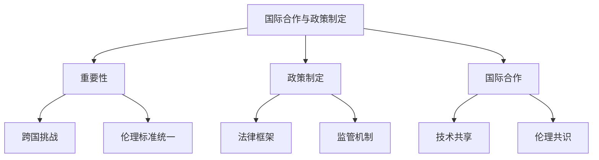

1. **国际合作与政策制定**：国际合作与政策制定涉及各国在计算伦理领域的合作与政策制定过程。
2. **重要性**：重要性讨论国际合作与政策制定对解决跨国计算伦理问题的影响。
3. **政策制定**：政策制定包括法律框架和监管机制，用于规范计算技术的研发和应用。
4. **国际合作**：国际合作涉及各国在技术共享、伦理共识等方面的合作。
5. **跨国挑战**：跨国挑战包括数据隐私、算法歧视、网络安全等全球性问题。
6. **伦理标准统一**：伦理标准统一是国际合作的目标之一，旨在确保各国在计算伦理问题上的统一标准。
7. **法律框架**：法律框架是政策制定的基础，为计算技术的合法合规应用提供依据。
8. **监管机制**：监管机制是政策实施的重要手段，用于监督和评估计算技术的伦理应用。
9. **技术共享**：技术共享是国际合作的重要内容，通过共享技术知识和资源，推动全球计算技术的发展。
10. **伦理共识**：伦理共识是国际合作的目标之一，旨在通过共识建立全球性的计算伦理准则。

#### 国际合作的重要性

1. **应对跨国挑战**：跨国计算伦理问题如数据隐私、算法歧视和网络安全等具有全球性影响。国际社会需要通过合作制定统一的政策和标准，共同应对这些挑战。

2. **促进技术发展**：国际合作有助于促进技术知识和技术资源的共享，推动全球计算技术的创新和发展。

3. **提升全球伦理意识**：国际合作可以促进各国在计算伦理问题上的共识和合作，提升全球公众对计算伦理问题的关注和意识。

4. **增强政策效力**：通过国际合作，各国可以共同制定和实施政策，提高政策的执行力和效力，确保计算技术的合法合规应用。

#### 政策制定的原则与框架

1. **法律框架**：政策制定需要建立全面的法律法规框架，为计算技术的研发和应用提供法律依据。法律框架应包括数据隐私保护法、算法公平性法规和网络安全法等。

2. **监管机制**：政策制定需要建立有效的监管机制，用于监督和评估计算技术的伦理应用。监管机制应包括独立监管机构、定期审查和违规处罚等。

3. **伦理准则**：政策制定需要制定全球性的伦理准则，确保计算技术的研发和应用符合道德要求。伦理准则应包括数据隐私保护、算法公平性和社会责任等方面。

4. **透明性和公众参与**：政策制定应具备透明性和公众参与，确保政策制定过程公开透明，充分考虑各方利益和意见。

#### 国际合作的挑战与机遇

1. **挑战**：
   - **利益冲突**：各国在计算伦理问题上的利益冲突可能导致国际合作受阻。
   - **技术标准差异**：各国在技术标准上的差异可能导致政策制定和执行的困难。
   - **政治和经济因素**：政治和经济因素可能影响国际合作，导致政策制定的协调困难。

2. **机遇**：
   - **技术共享**：通过国际合作，各国可以共享技术知识和资源，推动全球计算技术的发展。
   - **共识建立**：通过国际合作，各国可以建立伦理共识，推动全球性的计算伦理准则的制定。
   - **经验借鉴**：各国可以借鉴彼此在计算伦理问题上的成功经验，提高自身的政策制定和执行能力。

通过国际合作与政策制定，国际社会可以共同应对计算伦理领域的挑战，促进计算技术的健康发展，维护全球公共利益。

### 4.3 企业在计算伦理中的角色

企业在计算伦理中扮演着至关重要的角色，既是技术创新的推动者，也是伦理责任的承担者。随着计算技术的不断进步，企业需要在技术创新的同时，严格遵守伦理规范，确保技术的合法合规应用。以下将从企业社会责任、伦理实践和案例分析三个方面探讨企业在计算伦理中的角色。

#### 核心概念与联系

以下是企业在计算伦理中的角色的 Mermaid 流程图：

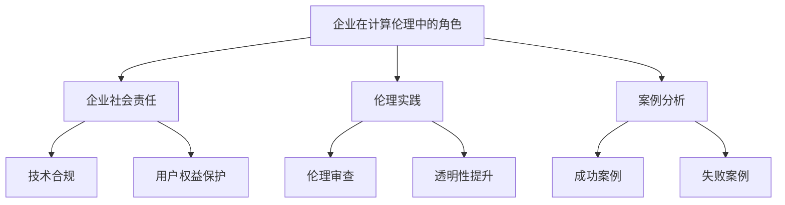

1. **企业在计算伦理中的角色**：企业作为计算技术的开发者和使用者，在伦理问题中扮演着重要的角色。
2. **企业社会责任**：企业社会责任涉及企业对社会的责任和义务，包括技术合规和用户权益保护。
3. **伦理实践**：伦理实践是指企业在技术设计和应用过程中，遵循伦理规范和标准的行为。
4. **案例分析**：案例分析涉及企业在计算伦理问题中的成功和失败案例，用于指导企业的伦理实践。

#### 企业社会责任

1. **技术合规**：企业在计算技术发展中，需要遵守相关法律法规和伦理规范，确保技术的合法合规应用。例如，企业在开发人工智能算法时，需要遵守算法公平性、透明性和可解释性的要求。

2. **用户权益保护**：企业需要保护用户的隐私权和数据安全，确保用户数据不被滥用或泄露。例如，企业需要采取严格的数据加密和访问控制措施，确保用户数据的安全。

#### 伦理实践

1. **伦理审查**：企业需要在技术设计和应用过程中，进行全面的伦理审查，确保技术符合伦理要求。例如，在开发自动驾驶汽车时，企业需要评估技术对用户安全和社会影响，确保技术的道德合理性。

2. **透明性提升**：企业需要提高技术决策的透明度，确保用户和利益相关者能够理解技术的行为和影响。例如，企业可以公开算法模型和决策过程，提高算法的可解释性。

#### 案例分析

1. **成功案例**：

   - **谷歌的AI伦理团队**：谷歌成立了AI伦理团队，负责评估和监督公司的人工智能项目，确保技术符合伦理要求。该团队通过定期审查和评估，确保人工智能技术不会造成歧视、侵犯隐私等问题。

   - **苹果的隐私保护政策**：苹果公司在计算技术中注重用户隐私保护，采取了严格的数据加密和访问控制措施。此外，苹果公司还建立了隐私保护团队，负责评估和改进隐私保护措施，确保用户隐私不受侵犯。

2. **失败案例**：

   - **Facebook的数据泄露事件**：2018年，Facebook因数据泄露事件受到广泛批评。事件中，Facebook未能有效保护用户数据，导致大量用户数据被第三方公司滥用。这一事件暴露了企业在计算伦理中的不足，引发了对企业社会责任和伦理实践的广泛关注。

   - **亚马逊的招聘算法歧视**：亚马逊公司在招聘过程中使用的人工智能算法被发现存在性别歧视问题，导致女性求职者的简历被自动淘汰。这一事件揭示了企业在计算技术中可能存在的伦理风险，提醒企业需在算法公平性方面加强审查和改进。

通过企业社会责任、伦理实践和案例分析，我们可以看到企业在计算伦理中的重要作用。企业需要在技术创新的同时，严格遵守伦理规范，确保技术的合法合规应用，维护用户权益和社会利益。

### 4.4 公众参与与意识提升

在计算伦理学领域，公众参与和意识提升是确保科技发展符合社会价值观和伦理要求的关键环节。随着计算技术的普及，公众对计算伦理问题的关注度逐渐提高，积极参与到伦理讨论和决策中，有助于形成广泛的伦理共识，推动计算技术的健康发展。以下将从公众参与的重要性、意识提升的方法、以及公众参与的实际效果三个方面进行探讨。

#### 核心概念与联系

以下是公众参与与意识提升的 Mermaid 流程图：

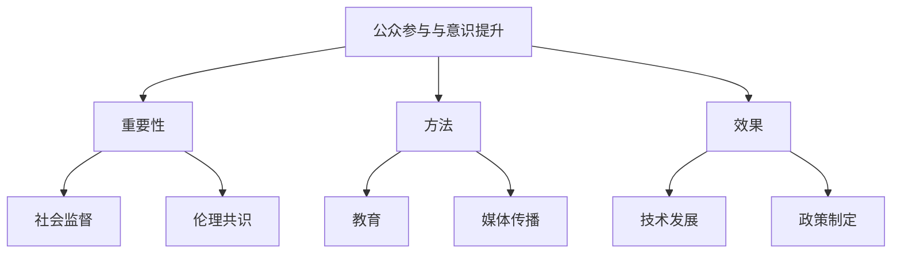

1. **公众参与与意识提升**：公众参与与意识提升涉及公众在计算伦理问题中的参与和伦理意识的培养。
2. **重要性**：重要性讨论公众参与和意识提升在计算伦理学中的作用。
3. **方法**：方法包括教育、媒体传播等提升公众意识的方法。
4. **效果**：效果讨论公众参与和意识提升的实际成果。
5. **社会监督**：社会监督是指公众对计算技术应用的监督和评估，确保技术符合伦理要求。
6. **伦理共识**：伦理共识是指公众在计算伦理问题上的共识和认同。
7. **教育**：教育是指通过教育手段提升公众的伦理意识和计算技术知识。
8. **媒体传播**：媒体传播是指通过媒体渠道传播计算伦理信息，提高公众对伦理问题的关注度。
9. **技术发展**：技术发展是指通过公众参与和意识提升，促进计算技术的健康发展。
10. **政策制定**：政策制定是指公众参与和政策制定过程中的相互作用。

#### 公众参与的重要性

1. **社会监督**：公众参与有助于形成对计算技术应用的监督力量，确保技术符合伦理要求。通过公众监督，可以发现和纠正计算技术中的伦理问题，如数据隐私侵犯、算法歧视等。

2. **伦理共识**：公众参与可以促进社会对计算伦理问题的共识和认同，形成共同的伦理价值观。通过广泛的社会讨论和辩论，可以形成具有共识性的伦理规范，为计算技术的研发和应用提供指导。

3. **技术发展**：公众参与有助于推动计算技术的创新和改进，确保技术发展符合社会需求和伦理要求。公众的反馈和建议可以为技术开发者提供宝贵的参考，促进技术的优化和升级。

4. **政策制定**：公众参与可以影响政策制定过程，确保政策制定更加科学合理，符合公众利益。公众的参与可以提供多样化的观点和意见，帮助政策制定者更好地理解社会需求和伦理挑战，制定更有效的政策。

#### 意识提升的方法

1. **教育**：教育是提升公众计算伦理意识的重要手段。通过学校教育、社会教育等方式，可以普及计算伦理知识，培养公众的伦理意识和责任感。例如，在学校课程中引入计算伦理内容，提高学生的计算伦理素养。

2. **媒体传播**：媒体传播是提升公众计算伦理意识的重要渠道。通过新闻媒体、社交媒体等渠道，可以广泛传播计算伦理信息，提高公众对伦理问题的关注和认识。例如，报道计算伦理事件、案例分析等，引发公众讨论和思考。

3. **公众讨论**：公众讨论是促进公众参与和意识提升的有效方法。通过组织研讨会、论坛等活动，可以邀请专家、学者和公众参与讨论，分享计算伦理知识和经验，形成共识和认同。

4. **技术普及**：技术普及是提升公众计算伦理意识的基础。通过推广计算技术的应用和普及，让公众了解计算技术的优势和局限，提高公众对伦理问题的敏感度和参与度。

#### 公众参与的实际效果

1. **技术改进**：通过公众参与和意识提升，技术开发者可以更全面地了解公众需求和伦理要求，改进技术设计和应用，提高技术的公平性、透明性和安全性。

2. **政策优化**：公众参与可以影响政策制定过程，确保政策制定更加科学合理，符合公众利益。例如，公众的反馈和建议可以帮助政策制定者更好地理解社会需求和伦理挑战，制定更有效的政策。

3. **社会共识**：通过公众参与和意识提升，可以促进社会对计算伦理问题的共识和认同，形成共同的伦理价值观。通过广泛的社会讨论和辩论，可以形成具有共识性的伦理规范，为计算技术的研发和应用提供指导。

4. **技术监督**：公众参与有助于形成对计算技术应用的监督力量，确保技术符合伦理要求。通过公众监督，可以发现和纠正计算技术中的伦理问题，如数据隐私侵犯、算法歧视等。

通过公众参与和意识提升，我们可以推动计算技术的健康发展，确保科技发展符合社会价值观和伦理要求，为构建更加公正、透明和包容的科技环境做出贡献。

### 4.5 结论与展望

本文通过系统性地探讨计算伦理学的核心概念、原则、应用及未来趋势，全面揭示了科技与伦理之间的平衡点。以下是对文章内容的总结和展望。

#### 总结

1. **核心概念与联系**：计算伦理学是一门研究计算技术道德问题的学科，涉及数据隐私、算法公平性、人工智能安全、生物信息学伦理和网络空间伦理等方面。通过引入 Mermaid 流程图，我们明确了计算伦理学中的核心概念与联系。

2. **伦理学基础**：伦理学基础包括道德哲学的基本理论，如功利主义、康德伦理学和社会契约论。这些理论为计算伦理学提供了理论基础，指导计算技术在道德原则下发展。

3. **伦理学原则与计算技术**：伦理学原则如公正、尊重、责任、透明和包容，是计算技术发展的重要准则。通过详细分析这些原则，我们了解了它们在计算技术中的具体应用。

4. **伦理决策框架**：伦理决策框架是计算技术发展中的重要工具，帮助决策者在面对伦理问题时做出符合道德要求的决策。本文介绍了伦理决策框架的构成和过程。

5. **道德责任与计算**：道德责任在计算技术中涉及开发者、使用者和监管者的责任。通过实际案例，我们展示了道德责任在计算技术中的应用和重要性。

6. **数据伦理**：数据伦理是计算伦理学中的一个重要议题，涉及到数据隐私保护、数据公平性和数据透明性。本文探讨了数据伦理的核心挑战和解决方案。

7. **人工智能伦理**：人工智能伦理是计算伦理学的重点领域，涉及算法公平性、人工智能安全和隐私保护。通过案例分析和伦理决策框架，我们了解了人工智能伦理的实际应用。

8. **生物信息学伦理**：生物信息学伦理涉及基因编辑、数据共享和隐私保护等问题。本文介绍了生物信息学伦理的核心挑战和解决方案。

9. **网络空间伦理**：网络空间伦理涉及网络安全、网络隐私、网络暴力和网络欺诈等问题。通过探讨网络空间伦理，我们了解了其在计算伦理学中的重要性。

10. **计算伦理教育**：计算伦理教育是培养计算技术领域从业者伦理意识和道德责任的关键环节。本文提出了计算伦理教育的重要性、内容和实践方法。

#### 展望

1. **未来趋势**：计算伦理学将继续面对新的伦理挑战，如自动化伦理和量子计算伦理。本文探讨了计算伦理学的未来趋势，包括新兴伦理问题和伦理决策框架的优化。

2. **国际合作**：国际合作与政策制定在计算伦理学中至关重要。未来，各国需要在伦理标准、法律法规和政策制定方面加强国际合作，共同应对全球性的计算伦理问题。

3. **企业角色**：企业作为计算技术的主要开发者和使用者，将在计算伦理中扮演重要角色。未来，企业需要加强社会责任，严格遵守伦理规范，推动计算技术的合法合规应用。

4. **公众参与**：公众参与和意识提升是计算伦理学发展的重要驱动力。未来，需要进一步鼓励公众参与计算伦理讨论，提升公众的伦理意识，共同推动计算技术的健康发展。

5. **研究进展**：未来研究应重点关注计算伦理学的新领域，如区块链伦理、物联网伦理和数字身份管理等。通过深入研究和实践，我们可以为计算伦理学的发展提供更多理论支持和实践指导。

通过总结和展望，我们希望本文能够为计算伦理学的研究和实践提供有益的参考，推动科技与伦理的平衡发展，为构建更加公正、透明和包容的科技环境做出贡献。

### 附录

#### 附录 A：计算伦理学相关资源

以下是计算伦理学领域的一些重要资源，包括伦理学资源网站与数据库、学术期刊与书籍推荐，以及计算伦理学相关会议与活动。

1. **伦理学资源网站与数据库**：
   - [计算伦理学协会（ACM SIGCAS）](https://www.sigcas.org/)
   - [伦理与技术在线图书馆（Ethics and Information Technology）](http://www.springer.com/series/10508)
   - [国际计算伦理学协会（International Association for Computing and Philosophy）](https://iacap.org/)

2. **学术期刊与书籍推荐**：
   - 《计算伦理学杂志》（Journal of Computer-Mediated Communication）
   - 《人工智能与伦理学》（Artificial Intelligence and Law）
   - 《计算机伦理与社会》（Computers and Society）
   - 《哲学与技术》（Philosophy and Technology）
   - 《计算伦理学基础》（Foundations of Computer Ethics），作者：Michael R.滑轮

3. **计算伦理学相关会议与活动**：
   - 国际计算伦理学会议（International Conference on Computing and Philosophy）
   - 国际人工智能与法律会议（International Conference on Artificial Intelligence and Law）
   - 计算伦理学研讨会（Workshop on Ethics in AI and Computer Science）
   - 伦理与技术会议（Technology and Ethics Conference）

这些资源为计算伦理学的研究和实践提供了丰富的信息和交流平台，有助于学者和从业者深入理解计算伦理学的理论和应用。

#### 附录 B：伦理决策案例解析

以下是三个伦理决策案例，包括案例 A：算法歧视、案例 B：人工智能伦理审查、案例 C：数据隐私保护策略。

**案例 A：算法歧视**

**案例描述**：某公司开发了一款招聘算法，用于筛选简历。然而，该算法在评估简历时，对女性和少数族裔的简历给予了较低的评分，导致他们在面试机会上受到歧视。

**伦理问题**：算法歧视问题可能加剧性别和种族不平等，违背公平和尊重原则。

**决策过程**：
1. **识别伦理问题**：通过数据分析和用户反馈，识别出算法歧视问题。
2. **评估伦理原则**：考虑公正和尊重原则，评估算法设计是否符合伦理要求。
3. **提出解决方案**：
   - 增加数据多样性，引入更多类型的简历数据。
   - 优化算法模型，减少编程偏差。
   - 建立算法公平性评估机制，定期审查和改进算法。
4. **评估解决方案**：通过测试和用户反馈，评估解决方案的有效性和可行性。
5. **选择最佳方案**：选择最佳方案并实施。

**决策结果**：通过改进算法模型和增加数据多样性，该公司的招聘算法逐渐消除了歧视，提高了招聘过程的公平性。

**案例 B：人工智能伦理审查**

**案例描述**：某公司在开发一款自动驾驶汽车时，需要进行伦理审查，确保技术符合道德要求。

**伦理问题**：自动驾驶汽车在面临紧急情况时，需要做出道德决策，可能涉及生命安全的权衡。

**决策过程**：
1. **识别伦理问题**：识别自动驾驶汽车在道德决策中可能遇到的问题。
2. **评估伦理原则**：考虑责任、透明性和公正性原则，评估技术设计是否符合伦理要求。
3. **提出解决方案**：
   - 制定详细的伦理审查流程，确保技术设计符合伦理标准。
   - 建立伦理审查委员会，负责评估和监督技术设计。
   - 开发透明的决策框架，确保用户可以理解自动驾驶汽车的决策过程。
4. **评估解决方案**：通过专家评审和用户测试，评估解决方案的有效性和可行性。
5. **选择最佳方案**：选择最佳方案并实施。

**决策结果**：通过严格的伦理审查和透明的决策框架，该公司的自动驾驶汽车在道德决策中表现出更高的公正性和透明性，赢得了公众的信任。

**案例 C：数据隐私保护策略**

**案例描述**：某互联网公司因数据泄露事件受到广泛批评，需要进行数据隐私保护策略的改进。

**伦理问题**：数据隐私保护问题可能侵犯用户隐私，违反尊重和责任原则。

**决策过程**：
1. **识别伦理问题**：通过用户反馈和数据分析，识别数据隐私保护问题。
2. **评估伦理原则**：考虑尊重和责任原则，评估现有的数据隐私保护措施是否符合伦理要求。
3. **提出解决方案**：
   - 加强数据加密和访问控制，提高数据安全性。
   - 制定详细的数据使用政策，明确用户数据的收集、存储和处理方式。
   - 建立用户数据访问和管理的权限控制机制。
4. **评估解决方案**：通过安全性测试和用户反馈，评估解决方案的有效性和可行性。
5. **选择最佳方案**：选择最佳方案并实施。

**决策结果**：通过加强数据加密和透明的数据使用政策，该公司的数据隐私保护措施得到显著改进，赢得了用户的信任。

通过这三个案例，我们可以看到伦理决策在实际应用中的重要性。通过系统化的伦理决策框架，企业可以更好地应对计算技术中的伦理问题，确保技术的合法合规应用，维护用户权益和社会利益。

