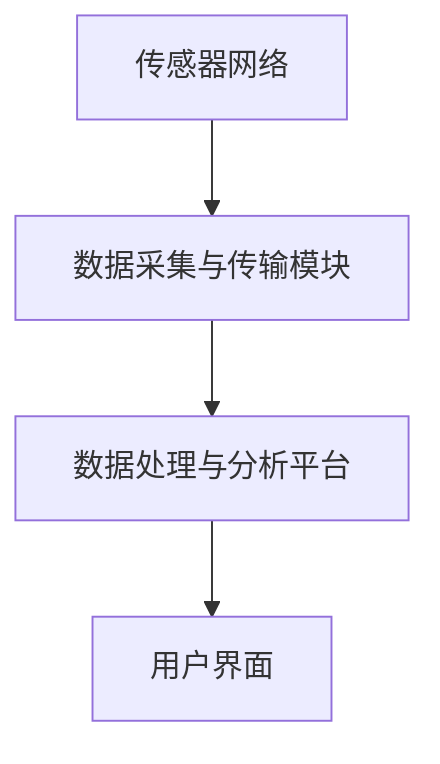
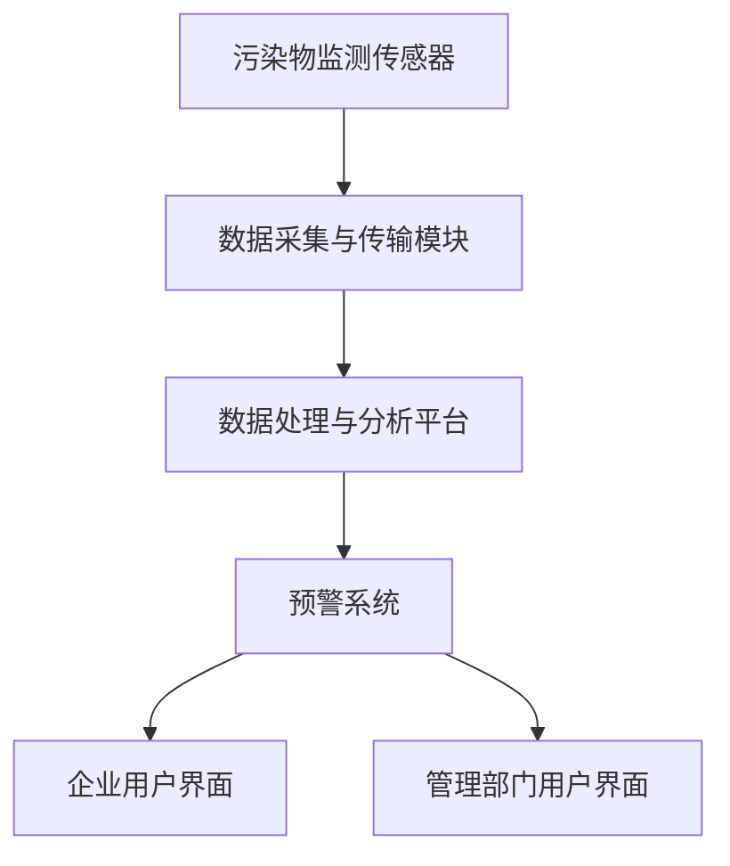
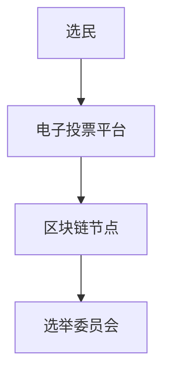

                 

### 文章标题

# 科技创新：社会治理的新思路

在当今科技迅猛发展的时代，科技创新对社会治理的影响日益深远。本文旨在探讨科技创新如何为社会治理带来新的思路和方法，从而推动社会的进步与发展。通过详细分析科技创新与社会治理之间的联系，以及科技创新在不同领域中的应用，本文将为您揭示科技创新在社会治理中的重要性和潜在价值。

### 关键词

- 科技创新
- 社会治理
- 智能技术
- 数据分析
- 智慧治理

### 摘要

本文首先介绍了科技创新和社会治理的定义及主要领域，探讨了科技创新对社会治理的影响和促进作用。接着，文章重点分析了科技创新在社会治理中的应用，包括智能技术、环境保护与可持续发展、社会服务与管理等方面。此外，文章还探讨了科技创新带来的社会治理挑战，以及未来的发展趋势和前沿领域。通过这些分析，本文旨在为读者提供关于科技创新与社会治理的新思路和启示。

### 目录大纲

## 第一部分：背景与概念

### 1.1 科技创新概述

#### 1.1.1 科技创新的定义与意义

#### 1.1.2 科技创新的主要领域

### 1.2 社会治理的概念

#### 1.2.1 社会治理的定义与特征

#### 1.2.2 社会治理的核心要素

### 1.3 科技创新与社会治理的联系

#### 1.3.1 科技创新对社会治理的影响

#### 1.3.2 社会治理对科技创新的促进

## 第二部分：科技创新在社会治理中的应用

### 2.1 智能技术在社会治理中的应用

#### 2.1.1 智能感知技术

##### 2.1.1.1 人工智能安防系统

##### 2.1.1.2 智能交通管理系统

#### 2.1.2 数据分析技术

##### 2.1.2.1 社会经济数据分析

##### 2.1.2.2 社会舆情监测与分析

### 2.2 环境保护与可持续发展

#### 2.2.1 环境监测与预警

##### 2.2.1.1 智能环境监测系统

##### 2.2.1.2 污染物排放预警系统

#### 2.2.2 可持续发展策略

##### 2.2.2.1 能源技术创新与应用

##### 2.2.2.2 资源循环利用与废弃物处理

### 2.3 社会服务与管理

#### 2.3.1 智慧社区建设

##### 2.3.1.1 智慧社区平台搭建

##### 2.3.1.2 社区服务智能化

#### 2.3.2 公共服务优化

##### 2.3.2.1 公共资源配置优化

##### 2.3.2.2 智能化公共服务体系构建

## 第三部分：科技创新与社会治理的挑战与展望

### 3.1 科技创新带来的社会治理挑战

#### 3.1.1 技术伦理与隐私保护

##### 3.1.1.1 数据隐私保护策略

##### 3.1.1.2 技术伦理问题案例分析

#### 3.1.2 技术普及与数字鸿沟

##### 3.1.2.1 数字鸿沟的现状与解决策略

##### 3.1.2.2 技术普及的路径与模式

### 3.2 社会治理的未来趋势

#### 3.2.1 智慧治理的概念与模式

##### 3.2.1.1 智慧治理的核心要素

##### 3.2.1.2 智慧治理的实施路径

#### 3.2.2 科技创新与社会治理的协同发展

##### 3.2.2.1 科技创新与社会治理的融合策略

##### 3.2.2.2 科技创新推动社会治理现代化的案例研究

### 3.3 科技创新与社会治理的前沿领域

#### 3.3.1 区块链技术在社会治理中的应用

##### 3.3.1.1 区块链的基本原理

##### 3.3.1.2 区块链在公共服务与治理中的实践案例

#### 3.3.2 人工智能社会治理的创新模式

##### 3.3.2.1 人工智能社会治理的基本框架

##### 3.3.2.2 人工智能社会治理的创新实践

## 附录

### 附录 A：科技创新与社会治理的相关资源

#### A.1 学术论文与研究报告

##### A.1.1 国内外科技创新与社会治理的研究论文

##### A.1.2 相关领域的权威研究报告

#### A.2 政策与法规

##### A.2.1 国家与地方相关政策文件

##### A.2.2 社会治理的相关法律法规

### 附录 B：科技创新与社会治理的实践案例

#### B.1 智慧城市案例

##### B.1.1 某市智慧城市建设经验与启示

##### B.1.2 智慧城市的技术架构与应用

#### B.2 社会服务创新案例

##### B.2.1 某社区智慧服务平台的构建与运营

##### B.2.2 社会服务创新的模式与路径

## 前言

在当今全球化和信息化快速发展的背景下，科技创新已经成为推动社会进步和经济发展的重要引擎。与此同时，社会治理作为维护社会秩序和保障公共利益的基石，也需要不断适应新的发展需求。科技创新与社会治理之间的互动关系，不仅影响着社会的稳定与发展，更决定着未来社会治理的走向。因此，深入研究科技创新如何影响和促进社会治理，具有重要的理论和实践意义。

本文将从以下几个方面展开讨论：

1. **科技创新的概述**：介绍科技创新的定义、意义以及主要领域，为后续讨论奠定基础。
2. **社会治理的概念**：解释社会治理的定义、特征以及核心要素，为分析科技创新在社会治理中的应用提供背景。
3. **科技创新与社会治理的联系**：探讨科技创新对社会治理的影响和促进作用，分析两者之间的互动关系。
4. **科技创新在社会治理中的应用**：详细分析智能技术、环境保护与可持续发展、社会服务与管理等方面，展示科技创新在社会治理中的具体应用和实践。
5. **科技创新与社会治理的挑战与展望**：讨论科技创新带来的社会治理挑战，以及未来的发展趋势和前沿领域。
6. **总结与展望**：总结全文内容，展望科技创新与社会治理的未来发展。

希望通过本文的讨论，能够为读者提供关于科技创新与社会治理的新思路、新见解，从而更好地理解两者之间的紧密联系和协同发展。

### 第一部分：背景与概念

#### 1.1 科技创新概述

##### 1.1.1 科技创新的定义与意义

科技创新是指通过科学研究和工程实践，创造和应用新的科学技术知识、方法、工具和产品，以实现技术进步和社会发展的过程。科技创新不仅仅局限于技术本身，还包括技术管理、商业模式、组织结构等多方面的创新。科技创新的意义在于推动经济增长、提高生活质量、促进社会进步和解决重大问题。

首先，科技创新是经济增长的重要驱动力。通过科技创新，企业能够提高生产效率、降低成本，从而在市场中获得竞争优势。此外，科技创新还能带动相关产业的发展，形成产业链和产业集群，进一步推动经济增长。

其次，科技创新有助于提高生活质量。从医疗技术的进步到信息技术的普及，科技创新为人们提供了更加便捷、高效和舒适的生活方式。例如，移动通信技术的快速发展，使人们能够随时随地进行沟通和获取信息，极大地提高了生活便利性。

最后，科技创新在解决重大问题方面也发挥着关键作用。例如，环境问题、能源危机、公共卫生事件等全球性问题，需要通过科技创新来寻找解决方案。科技创新为这些问题的解决提供了新的思路和方法，如可再生能源技术的开发、人工智能在医疗诊断中的应用等。

##### 1.1.2 科技创新的主要领域

科技创新覆盖了广泛的领域，以下是一些主要领域：

1. **信息技术**：信息技术是科技创新的核心领域之一。信息技术的快速发展，推动了互联网、物联网、大数据、人工智能等新兴技术的产生和应用。信息技术不仅改变了人们的生活和工作方式，也为社会治理提供了新的工具和方法。

2. **生物技术**：生物技术包括基因工程、细胞工程、酶工程等领域。生物技术的创新在医疗健康、农业、环境保护等方面具有广泛的应用。例如，基因编辑技术可以用于治疗遗传病和癌症，转基因技术可以用于提高农作物的产量和抗病性。

3. **材料科学**：材料科学的创新为各个领域提供了新的材料选择，如纳米材料、复合材料、智能材料等。这些新材料在电子、能源、航空航天、生物医学等领域具有广泛的应用前景。

4. **能源技术**：能源技术是解决能源危机和环境问题的关键领域。新能源技术的开发，如太阳能、风能、核能等，为可持续发展和环境保护提供了新的途径。

5. **先进制造**：先进制造技术包括智能制造、数字化制造、绿色制造等领域。这些技术的应用，可以提高生产效率、降低能源消耗和废弃物排放，推动制造业的可持续发展。

#### 1.2 社会治理的概念

##### 1.2.1 社会治理的定义与特征

社会治理是指政府、社会组织和公民通过合作、协调和互动，共同管理社会事务、维护社会秩序和实现公共利益的过程。社会治理的核心是公共参与、合作治理和多方共治。

首先，社会治理强调公共参与。在现代社会中，公民不仅是社会治理的客体，也是治理的主体。通过公共参与，公民可以表达自己的需求和意愿，参与社会事务的决策和管理。

其次，社会治理强调合作治理。在传统的政府统治模式中，政府是唯一的管理主体。而社会治理强调政府、社会组织和公民之间的合作，形成多元化的治理体系，共同解决社会问题。

最后，社会治理强调多方共治。社会治理涉及多个领域和多个利益相关方，需要政府、企业、社会组织、公民等多个主体共同参与，形成共治的局面。

##### 1.2.2 社会治理的核心要素

社会治理的核心要素包括以下方面：

1. **法律与制度**：法律和制度是社会治理的基石。通过制定和完善相关法律法规，确保社会治理的合法性和规范性。同时，建立健全的监督和评估机制，确保法律和制度的有效执行。

2. **公共服务**：公共服务是社会治理的重要内容。政府和社会组织应提供基本公共服务，如教育、医疗、社会保障、公共安全等，保障公民的基本权益。

3. **公民参与**：公民参与是社会治理的核心要素之一。通过公民参与，公民可以表达自己的需求和意愿，参与社会事务的决策和管理，形成多方共治的局面。

4. **社会信任**：社会信任是社会治理的重要基础。政府和社会组织应通过诚信建设，增强公众对政府和社会组织的信任，促进社会的和谐稳定。

5. **技术创新**：技术创新是推动社会治理现代化的重要动力。通过科技创新，可以提高社会治理的效率和质量，实现社会的可持续发展。

#### 1.3 科技创新与社会治理的联系

科技创新与社会治理之间存在密切的联系，两者相互影响、相互促进。

首先，科技创新对社会治理产生了重要影响。通过科技创新，社会治理可以更加高效、精准和智能化。例如，信息技术的发展使得大数据分析和人工智能技术在社会治理中得到广泛应用，提高了公共安全和公共服务水平。生物技术的进步为医疗健康领域带来了新的突破，有助于解决公共卫生问题。能源技术的创新为可持续发展提供了新的路径，有助于应对环境挑战。

其次，社会治理对科技创新也产生了重要影响。社会治理的需求和问题为科技创新提供了方向和动力。例如，社会治理中的公共安全需求推动了人工智能安防系统的研发和应用。社会治理中的环境保护需求促进了可再生能源技术和资源循环利用技术的发展。此外，社会治理的现代化和效率需求也推动了技术创新，如智慧城市建设和数字化治理模式的应用。

总之，科技创新与社会治理之间存在紧密的联系，两者相互促进、共同发展。科技创新为社会治理提供了新的工具和方法，提升了社会治理的效率和质量；而社会治理的需求和问题又为科技创新提供了方向和动力，推动了科技的发展和应用。

#### 1.3.1 科技创新对社会治理的影响

科技创新对社会治理的影响是多方面的，具体体现在以下几个方面：

首先，科技创新提高了社会治理的效率。通过引入智能技术、大数据分析和人工智能等创新手段，社会治理可以在更短的时间内完成更多的任务。例如，智能交通管理系统通过实时数据分析，优化交通流量，减少拥堵，提高交通效率。大数据分析技术可以实时监测和分析社会舆情，帮助政府及时了解公众需求和意见，做出更加科学和有效的决策。

其次，科技创新提升了社会治理的精准度。传统的治理方式往往依赖于经验判断和主观判断，而科技创新提供了更加客观和精确的工具和方法。例如，人工智能安防系统能够通过图像识别和监控，准确识别和追踪异常行为，提高公共安全水平。大数据分析技术可以对大量社会数据进行分析，揭示潜在的问题和趋势，帮助政府提前预防和解决社会问题。

再次，科技创新增加了社会治理的透明度。通过科技创新，社会治理过程变得更加公开和透明。例如，区块链技术的应用使得社会治理过程中的数据记录更加透明，不可篡改，提高了政府和社会组织之间的信任度。此外，通过移动互联网和社交媒体平台，公民可以更方便地获取政府和社会组织的信息，参与社会治理的讨论和决策，增加了社会治理的透明度和公信力。

此外，科技创新还为社会治理带来了新的机遇和挑战。在医疗健康领域，人工智能技术在疾病诊断和治疗中的应用，提高了医疗服务的效率和质量。在环境保护领域，可再生能源技术和资源循环利用技术的发展，为可持续发展提供了新的路径。然而，科技创新也带来了数据隐私保护、技术滥用和伦理道德等问题，需要社会治理进行有效的监管和规范。

总的来说，科技创新对社会治理产生了深远的影响，不仅提升了社会治理的效率、精准度和透明度，还带来了新的机遇和挑战。因此，社会治理需要不断适应科技创新的发展，利用科技创新来提升治理能力，实现社会的和谐与进步。

#### 1.3.2 社会治理对科技创新的促进

社会治理对科技创新的促进主要体现在以下几个方面：

首先，社会治理的需求推动了科技创新。社会问题和管理需求的日益复杂化，促使科技界不断探索新的解决方案。例如，公共卫生危机（如新冠疫情）的应对需求推动了医学科技、生物技术和信息技术的迅速发展。环境保护的紧迫性催生了清洁能源技术、环保材料技术的创新。这些科技创新不仅解决了社会问题，还推动了相关产业的成长和繁荣。

其次，社会治理提供了资金支持和政策保障。政府和公共机构通过研发资金、政策补贴和税收优惠等手段，鼓励科技创新。例如，许多国家设立了专门的科技基金，用于支持前沿技术研究和应用项目的开发。此外，政府还通过制定科技发展政策和规划，为科技创新提供方向和保障。这些政策和措施为科技创新提供了必要的资源和条件。

再次，社会治理促进了科技人才的培养和流动。良好的社会治理环境，包括公平的竞争机制、开放的科研氛围和完善的知识产权保护体系，能够吸引和留住顶尖科技人才。科技创新往往依赖于跨学科、跨领域的合作，而社会治理的进步为这种合作创造了有利条件。例如，许多国家通过建立科技园区和创新中心，聚集了大量的科研机构和创新企业，促进了科技人才的流动和合作。

此外，社会治理还通过社会规范和价值导向，引导科技创新的发展方向。科技创新不仅需要技术的突破，还需要符合社会伦理和可持续发展原则。社会治理通过建立和传播科学的价值观，引导科技创新朝着有利于社会整体利益的方向发展。例如，在社会治理的推动下，人工智能、大数据等新兴技术的研发和应用，开始更加注重隐私保护和伦理规范。

总之，社会治理通过需求驱动、资金支持、人才培养和价值观引导等多方面的努力，有效促进了科技创新。这种促进不仅推动了科技进步，也为社会治理的现代化和可持续发展提供了强有力的支持。

### 第二部分：科技创新在社会治理中的应用

科技创新在社会治理中的应用范围广泛，涵盖了智能技术、环境保护与可持续发展、社会服务与管理等多个领域。以下将详细探讨这些领域中的具体应用，并分析其对社会治理的积极影响。

#### 2.1 智能技术在社会治理中的应用

##### 2.1.1 智能感知技术

智能感知技术是科技创新在社会治理中的重要应用之一，包括人工智能安防系统、智能交通管理系统等。

**人工智能安防系统**：人工智能安防系统通过视频监控、图像识别和智能分析等技术，实现对公共场所、社区和家庭的安全监控。系统能够实时识别异常行为，如打架斗殴、盗窃等，并及时报警。例如，某些城市已经部署了智能安防系统，通过面部识别和大数据分析，有效预防犯罪，提高了公共安全水平。

**智能交通管理系统**：智能交通管理系统利用物联网、大数据分析和人工智能等技术，实现对交通流量的实时监控和动态调整。系统能够根据实时交通数据，智能调控红绿灯时长，优化交通信号，减少交通拥堵。例如，北京等城市的智能交通管理系统，通过数据分析，实现了交通信号灯的绿波带控制，提高了道路通行效率。

##### 2.1.2 数据分析技术

数据分析技术在社会治理中也发挥了重要作用，主要包括社会经济数据分析和舆情监测与分析。

**社会经济数据分析**：通过对社会经济数据的收集、存储和分析，政府和社会组织可以更准确地了解经济运行状况和社会发展趋势。例如，通过大数据分析，政府可以实时监测经济指标，如GDP、失业率、通货膨胀等，为宏观经济调控提供科学依据。此外，数据分析还可以帮助政府识别贫困人口，制定精准扶贫政策。

**舆情监测与分析**：社会舆情监测与分析技术通过互联网和社交媒体平台，实时收集和分析公众意见和情绪。这有助于政府及时了解公众需求和社会热点问题，做出更科学的决策。例如，某些政府部门通过舆情监测系统，及时发现和处理突发事件，防止事态恶化。

#### 2.2 环境保护与可持续发展

科技创新在环境保护和可持续发展中起到了关键作用，主要包括环境监测与预警、能源技术创新与应用、资源循环利用与废弃物处理等。

##### 2.2.1 环境监测与预警

**智能环境监测系统**：智能环境监测系统通过传感器网络、卫星遥感技术和大数据分析，实现对空气质量、水质、土壤污染等环境参数的实时监测。系统可以自动检测污染源，预测污染趋势，并及时发布预警信息。例如，某些城市已经部署了智能环境监测系统，实时监测空气质量和水质，保障公众健康。

**污染物排放预警系统**：污染物排放预警系统通过实时监测工业企业和交通排放，及时发现和预警超标排放行为。系统可以通过数据分析，识别污染源头，提出减排措施，从而降低环境污染。例如，某些地区的污染物排放预警系统，通过数据分析和模型预测，有效控制了工业污染，改善了空气质量。

##### 2.2.2 可持续发展策略

**能源技术创新与应用**：能源技术创新，如太阳能、风能、核能等，为可持续发展提供了新的路径。例如，太阳能光伏技术和风力发电技术的应用，大幅提高了可再生能源的比例，减少了化石能源的消耗和碳排放。

**资源循环利用与废弃物处理**：资源循环利用技术，如废纸回收、废塑料再生、有机垃圾堆肥等，有效地减少了废弃物对环境的影响。同时，科技创新还推动了废弃物处理技术的改进，如垃圾焚烧发电、污泥处理等，实现了废弃物的资源化利用。

#### 2.3 社会服务与管理

科技创新在社会服务与管理中的应用，主要表现在智慧社区建设和公共服务优化等方面。

##### 2.3.1 智慧社区建设

**智慧社区平台搭建**：智慧社区平台通过物联网、大数据和人工智能等技术，为居民提供便捷的社区服务。例如，智慧社区平台可以实现社区物业管理的智能化，通过智能门禁、智能停车和智能照明等技术，提高社区的安全和舒适度。

**社区服务智能化**：社区服务智能化包括在线医疗咨询、在线教育、在线政务服务等。通过这些服务，居民可以足不出户，享受到高效、便捷的公共服务，提高了生活质量。

##### 2.3.2 公共服务优化

**公共资源配置优化**：通过大数据分析和人工智能技术，政府可以更合理地配置公共资源，如教育、医疗和公共服务设施等。例如，某些城市的智慧城市项目，通过数据分析，实现了教育资源的合理分配，提高了教育质量。

**智能化公共服务体系构建**：智能化公共服务体系包括智慧医疗、智慧交通、智慧政务等。通过这些体系，政府可以提供更加高效、透明和便捷的公共服务，提高公共服务水平。例如，智慧医疗体系通过远程医疗和电子病历，提高了医疗服务效率和质量。

总之，科技创新在社会治理中的应用，不仅提高了社会治理的效率和质量，还为社会的可持续发展提供了新的思路和方法。通过智能技术、环境保护技术和公共服务创新，社会治理正在迎来一场深刻的变革。

#### 2.1.1 智能感知技术

智能感知技术是社会治理中不可或缺的一部分，其核心在于通过先进的技术手段，实现对社会环境的实时监测和智能分析，以提升社会治理的效率和质量。以下将详细探讨智能感知技术在社会治理中的应用，包括人工智能安防系统和智能交通管理系统。

##### 2.1.1.1 人工智能安防系统

人工智能安防系统通过结合图像识别、人脸识别、行为分析和大数据分析等技术，实现对公共场所和社区的安全监控。其工作原理如下：

1. **图像识别**：通过摄像头和传感器，实时捕捉和分析监控区域内的图像数据。
2. **人脸识别**：系统利用深度学习算法，识别和匹配摄像头捕捉到的人脸图像，从而实现对特定人物的追踪和识别。
3. **行为分析**：系统通过分析人物的动作和行为模式，识别潜在的异常行为，如打架、盗窃等。
4. **大数据分析**：系统整合多源数据，如社交媒体信息、历史犯罪记录等，进行综合分析，提高识别准确率和预测能力。

人工智能安防系统在实际应用中，已经展示了其强大的功能和效果。例如，在公共安全领域，智能安防系统能够实时监测大型活动，识别和跟踪潜在的危险人物，提前预警并采取措施，防止事故的发生。此外，在社区管理中，智能安防系统通过人脸识别技术，实现了小区居民的便捷出入管理，提高了社区的安全性。

##### 2.1.1.2 智能交通管理系统

智能交通管理系统利用物联网、大数据分析和人工智能技术，实现对交通流量的实时监测和动态管理，以减少交通拥堵，提高交通效率。其工作原理如下：

1. **交通流量监测**：通过安装在道路上的传感器和摄像头，实时采集交通流量数据，包括车辆速度、流量密度等。
2. **数据预处理**：对采集到的交通流量数据进行清洗和预处理，去除噪声和异常数据，确保数据质量。
3. **数据分析**：利用大数据分析技术，对交通流量数据进行实时分析和预测，识别交通拥堵和事故发生的风险。
4. **动态调控**：根据数据分析结果，智能交通管理系统可以动态调整交通信号灯时长，优化交通流向，减少交通拥堵。

智能交通管理系统在实际应用中，已经取得了显著的效果。例如，在某些城市，通过部署智能交通管理系统，实现了交通信号灯的绿波带控制，使车辆在高峰期能够以更快的速度通过路口，减少了等待时间。此外，智能交通管理系统还可以通过实时监控和数据分析，及时发现和处置交通事故，提高了道路通行效率。

##### 2.1.1.3 智能感知技术的核心优势

智能感知技术在社会治理中的核心优势主要体现在以下几个方面：

1. **实时性**：智能感知技术能够实时监测和响应社会环境的变化，提供即时的数据支持和决策依据。
2. **准确性**：通过先进的算法和大数据分析，智能感知技术能够高精度地识别和预测社会问题，提高了社会治理的准确性。
3. **高效性**：智能感知技术能够自动化处理海量数据，大幅提高了社会治理的效率和响应速度。
4. **全面性**：智能感知技术能够覆盖广泛的监测领域，从公共安全到交通管理，再到环境监测，实现全方位的社会治理。

总之，智能感知技术为社会治理带来了全新的思路和方法，通过实时监测、精准识别和高效管理，提升了社会治理的效率和质量。随着技术的不断进步，智能感知技术将在社会治理中发挥更加重要的作用，为实现智慧治理和可持续发展提供强有力的支持。

#### 2.1.2 数据分析技术

数据分析技术在社会治理中发挥着重要作用，其通过处理和分析海量数据，为社会治理提供科学依据和决策支持。以下将详细探讨数据分析技术在社会治理中的应用，包括社会经济数据分析和舆情监测与分析。

##### 2.1.2.1 社会经济数据分析

社会经济数据分析利用大数据技术，对各种经济和社会数据进行分析，以揭示经济发展趋势、社会问题和政策效果。具体应用包括：

1. **经济运行监测**：通过分析GDP、失业率、通货膨胀等经济指标，实时监测经济运行状况，为宏观经济调控提供数据支持。例如，政府可以通过分析GDP增长率，预测经济增长趋势，制定相应的经济政策。

2. **社会问题识别**：通过分析社会数据，如教育、医疗、就业等，识别社会问题和发展瓶颈。例如，通过分析教育数据，可以识别教育资源不均衡的问题，提出改进措施。

3. **政策评估**：通过对比政策实施前后的数据变化，评估政策效果。例如，某市政府在实施交通拥堵收费政策后，通过分析交通流量和排放数据，评估政策对减少交通拥堵和降低排放的效果。

##### 2.1.2.2 社会舆情监测与分析

社会舆情监测与分析通过收集和分析社交媒体、新闻报道等数据，实时了解公众意见和情绪，为社会治理提供参考。具体应用包括：

1. **舆情监测**：通过数据挖掘技术，实时收集和分析社交媒体上的言论，识别社会热点和潜在问题。例如，政府可以通过分析微博、微信等平台的数据，及时发现和应对突发事件，防止事态扩大。

2. **情绪分析**：利用自然语言处理技术，分析公众的情感倾向和情绪变化。例如，通过分析网友对某项政策的评论，评估公众对该政策的支持程度。

3. **趋势预测**：通过分析历史数据和当前舆情，预测未来社会趋势。例如，通过分析社交媒体上的言论，预测某个城市未来可能发生的交通拥堵情况，提前采取措施。

##### 2.1.2.3 数据分析技术的优势

数据分析技术在社会治理中的优势主要体现在以下几个方面：

1. **实时性**：数据分析技术能够实时处理和响应数据，提供即时的决策支持，提高社会治理的效率。

2. **准确性**：通过大数据分析和机器学习算法，数据分析技术能够提高数据分析和预测的准确性，减少人为误差。

3. **全面性**：数据分析技术能够处理和分析来自多个来源的数据，提供全面的社会治理信息。

4. **自动化**：数据分析技术能够自动化处理海量数据，减轻人工负担，提高工作效率。

总之，数据分析技术在社会治理中的应用，不仅提高了社会治理的科学性和准确性，还为决策提供了有力的数据支持。随着技术的不断进步，数据分析技术将在社会治理中发挥越来越重要的作用，推动社会的和谐与进步。

#### 2.2 环境保护与可持续发展

科技创新在环境保护与可持续发展中扮演着至关重要的角色，通过引入先进的环保技术和可持续发展策略，可以有效应对环境挑战，促进生态平衡和社会进步。以下将详细探讨科技创新在环境保护与可持续发展中的具体应用，包括环境监测与预警、能源技术创新与应用、资源循环利用与废弃物处理等。

##### 2.2.1 环境监测与预警

环境监测与预警是环境保护的基础，通过实时监测和预警机制，可以及时掌握环境变化，采取相应措施防止环境污染和生态破坏。以下是一些环境监测与预警的关键技术和应用：

1. **智能环境监测系统**：智能环境监测系统通过传感器网络、物联网和大数据分析等技术，实现对空气质量、水质、土壤污染等环境参数的实时监测。系统利用人工智能算法，自动分析和预测环境变化趋势，及时发现潜在的环境风险。例如，某些城市的智能环境监测系统，可以实时监测PM2.5、PM10等污染物浓度，并通过手机应用向市民发布实时预警信息，指导公众采取防护措施。

2. **卫星遥感技术**：卫星遥感技术可以获取大范围、高分辨率的地球表面环境数据，用于监测森林覆盖、湿地变化、水土流失等环境问题。例如，NASA的MODIS卫星监测系统，可以实时监测全球气候变化和森林覆盖变化，为环境保护决策提供科学依据。

3. **预警模型**：利用数据挖掘和机器学习技术，构建环境预警模型，预测环境污染事件的发生。例如，通过分析历史环境数据和气象数据，预测酸雨、沙尘暴等环境事件的发生时间和影响范围，为提前采取防范措施提供支持。

##### 2.2.2 能源技术创新与应用

能源技术创新是推动可持续发展的重要力量，通过开发和利用可再生能源，减少对化石能源的依赖，可以降低温室气体排放，减缓气候变化。以下是一些能源技术创新及其应用：

1. **太阳能技术**：太阳能技术利用光伏板将太阳光转化为电能，是一种清洁、可再生的能源。目前，太阳能光伏技术的成本逐渐降低，应用范围不断扩大。例如，在家庭、商业和工业领域，太阳能光伏系统已广泛应用于屋顶和地面安装，提供了大量清洁电力。

2. **风能技术**：风能技术通过风力发电机将风能转化为电能，是一种高效的清洁能源。近年来，全球风能装机容量快速增长，尤其是在风力资源丰富的地区，如中国、美国和欧洲。例如，中国的一些沿海地区已经建成了大规模的风电场，提供了大量清洁电力。

3. **储能技术**：储能技术是可再生能源发展的重要环节，通过储能系统，可以平衡可再生能源的波动性和不稳定性。目前，锂电池、抽水蓄能和压缩空气储能等技术正在快速发展，为可再生能源的大规模应用提供了保障。例如，在美国和欧洲的一些地区，已经建成了大型储能电站，用于平抑可再生能源的波动输出，提高电网稳定性。

##### 2.2.3 资源循环利用与废弃物处理

资源循环利用与废弃物处理是实现可持续发展的重要途径，通过回收利用和合理处理废弃物，可以减少资源消耗和环境污染。以下是一些资源循环利用与废弃物处理的技术和应用：

1. **垃圾分类与回收**：垃圾分类与回收技术通过将废弃物进行分类处理，实现资源的高效利用。例如，在家庭、社区和城市层面，推广垃圾分类制度，通过分类回收，提高废纸、废塑料、废金属等可回收物的回收率。

2. **废弃物处理**：废弃物处理技术包括填埋、焚烧、堆肥等，通过科学处理，将废弃物转化为无害化、减量化、资源化的产品。例如，焚烧处理技术可以将垃圾转化为能源，发电和供热；堆肥处理技术可以将厨余垃圾转化为有机肥料，用于农业生产。

3. **再生资源利用**：再生资源利用技术通过将废弃物转化为可再利用的资源，减少资源消耗。例如，废纸可以再生造纸，废塑料可以再生造粒，废旧金属可以再生利用。

总之，科技创新在环境保护与可持续发展中起到了关键作用，通过引入先进的环保技术和可持续发展策略，可以有效应对环境挑战，促进生态平衡和社会进步。随着科技的不断进步，科技创新将在环境保护与可持续发展中发挥更加重要的作用，为实现全球可持续发展目标提供坚实的技术支持。

#### 2.2.1 环境监测与预警

环境监测与预警是社会治理中至关重要的一环，通过实时监测和预警机制，可以及时发现和应对环境问题，保障公众健康和生态安全。以下将详细分析智能环境监测系统和污染物排放预警系统的工作原理、技术架构及其在实际应用中的具体案例分析。

##### 2.2.1.1 智能环境监测系统

智能环境监测系统利用先进的信息技术，实现对空气质量、水质、土壤污染等环境参数的实时监测和分析。其工作原理主要包括以下几个步骤：

1. **数据采集**：系统通过安装在关键区域的传感器，如空气质量传感器、水质监测仪和土壤传感器，实时采集环境数据。
2. **数据传输**：采集到的数据通过无线网络（如Wi-Fi、LoRa等）传输到中央数据处理系统。
3. **数据处理**：中央数据处理系统利用大数据分析和机器学习算法，对采集到的数据进行处理和分析，生成实时监测报告和环境预警信息。
4. **预警与响应**：系统根据预设的阈值和规则，对监测数据进行分析和预警。例如，当空气质量指数（AQI）超过警戒线时，系统会自动向相关管理部门和公众发布预警信息，提示采取防护措施。

智能环境监测系统的技术架构主要包括传感器网络、数据采集与传输模块、数据处理与分析平台和用户界面。以下是一个简单的技术架构图：



在实际应用中，智能环境监测系统已经展示了其强大的功能和效果。例如，在某城市的智慧环保项目中，通过部署智能环境监测系统，实现了对空气质量、水质和噪声的实时监测。系统通过数据分析，识别了主要的污染源，并提出了相应的污染控制措施，有效改善了城市环境质量。

##### 2.2.1.2 污染物排放预警系统

污染物排放预警系统是针对工业企业和交通等领域的污染物排放进行实时监测和预警，以防止环境污染和生态破坏。其工作原理主要包括以下几个步骤：

1. **污染物监测**：系统通过安装在污染源附近的传感器，实时监测二氧化硫（SO2）、氮氧化物（NOx）、颗粒物（PM10、PM2.5）等污染物的浓度。
2. **数据传输**：传感器采集到的污染物数据通过无线网络传输到中央数据处理系统。
3. **数据分析与预警**：中央数据处理系统利用大数据分析和机器学习算法，对污染物数据进行分析，预测污染趋势。当污染物浓度超过警戒阈值时，系统会自动向企业和管理部门发出预警信息，提示采取减排措施。
4. **响应与控制**：企业根据预警信息，调整生产工艺和设备运行，减少污染物排放。同时，管理部门可以依据预警信息，对企业进行监管和处罚，确保污染物排放符合法规要求。

污染物排放预警系统的技术架构主要包括污染物监测传感器、数据采集与传输模块、数据处理与分析平台、预警系统和企业/管理部门用户界面。以下是一个简单的技术架构图：



在实际应用中，污染物排放预警系统也取得了显著的效果。例如，在某工业园区，通过部署污染物排放预警系统，实现了对废水、废气排放的实时监测和管理。系统通过数据分析，识别了多个高污染企业，并督促其采取减排措施，有效减少了污染排放，提升了园区环境质量。

##### 2.2.1.3 环境监测与预警系统的核心优势

环境监测与预警系统的核心优势主要体现在以下几个方面：

1. **实时性**：系统通过实时监测和预警，可以快速识别和响应环境问题，提高了环境管理的效率和准确性。
2. **精准性**：系统利用大数据分析和机器学习算法，对环境数据进行分析和预测，提高了预警的精准度。
3. **自动化**：系统自动化处理海量数据，减少了人工工作量，提高了环境管理的效率。
4. **综合性**：系统集成了多种监测技术，可以同时监测多种环境参数，提供全面的环境监测和预警服务。

总之，环境监测与预警系统通过实时监测、精准预警和自动化管理，为社会治理提供了有力支持。随着技术的不断进步，环境监测与预警系统将在环境保护和可持续发展中发挥更加重要的作用。

#### 2.2.2 可持续发展策略

在当今全球环境恶化和资源枯竭的背景下，可持续发展策略变得尤为重要。科技创新在这一过程中起到了关键作用，通过引入先进的技术手段，可以实现环境保护和资源的高效利用。以下将详细探讨可持续发展策略中的关键领域，包括能源技术创新与应用、资源循环利用与废弃物处理。

##### 2.2.2.1 能源技术创新与应用

能源技术创新是推动可持续发展的核心。通过开发和应用可再生能源和清洁能源技术，可以减少对化石能源的依赖，降低温室气体排放。以下是一些重要的能源技术创新：

1. **太阳能技术**：太阳能技术通过光伏效应，将太阳光直接转化为电能。近年来，太阳能光伏技术的成本大幅下降，效率显著提升，成为全球能源转型的重要驱动力。太阳能光伏系统不仅适用于家庭和商业建筑，还可以在大型光伏电站中广泛应用。例如，特斯拉的太阳能屋顶和太阳能电池板已经成功应用于许多住宅和商业项目，实现了能源自给自足。

2. **风能技术**：风能技术利用风力驱动风力发电机，将风能转化为电能。风能是一种清洁、可再生的能源，在全球范围内得到广泛应用。例如，中国是世界上最大的风电市场，通过大规模建设风电场，有效减少了煤炭等化石能源的消耗。

3. **储能技术**：储能技术是可再生能源发展的重要支撑。通过储能系统，可以平衡可再生能源的波动性和不稳定性，提高电网的稳定性和灵活性。目前，先进的储能技术包括锂电池、抽水蓄能和压缩空气储能等。例如，特斯拉的Powerwall家用储能系统，已经成为许多家庭实现能源自给自足和降低能源成本的重要选择。

##### 2.2.2.2 资源循环利用与废弃物处理

资源循环利用和废弃物处理是实现可持续发展的重要环节。通过回收和再利用废弃物，可以减少资源消耗和环境污染。以下是一些资源循环利用与废弃物处理的关键技术和策略：

1. **垃圾分类与回收**：垃圾分类与回收是实现资源循环利用的基础。通过在家庭、社区和城市层面推广垃圾分类制度，可以大幅提高废纸、废塑料、废金属等可回收物的回收率。例如，德国的垃圾分类制度非常严格，通过分类回收，实现了高达80%的废弃物利用率。

2. **废弃物资源化处理**：废弃物资源化处理通过将废弃物转化为可再利用的资源，减少资源消耗和环境污染。例如，废纸可以再生造纸，废塑料可以再生造粒，废旧金属可以再生利用。某城市的废弃物资源化处理项目，通过建设再生资源回收中心，实现了废纸、废塑料、废金属等废弃物的全面回收和再利用，减少了废弃物对环境的污染。

3. **废弃物无害化处理**：废弃物无害化处理通过科学的方法，将废弃物转化为无害化、减量化、资源化的产品。例如，焚烧处理技术可以将垃圾转化为能源，发电和供热；堆肥处理技术可以将厨余垃圾转化为有机肥料，用于农业生产。某城市的垃圾焚烧发电项目，通过建设现代化的垃圾焚烧厂，实现了垃圾的无害化处理和资源化利用。

##### 2.2.2.3 可持续发展策略的实施效果

通过实施可持续发展策略，已经在多个领域取得了显著的效果：

1. **能源消耗降低**：通过推广可再生能源和清洁能源技术，全球能源消耗逐渐降低。例如，中国的可再生能源装机容量已占全国总装机容量的40%以上，有效减少了煤炭等化石能源的消耗。

2. **温室气体排放减少**：可再生能源和清洁能源技术的广泛应用，大幅减少了温室气体排放。例如，欧盟通过实施《可再生能源指令》，到2020年温室气体排放量减少了约21%。

3. **资源利用率提高**：通过垃圾分类与回收、废弃物资源化处理等措施，全球资源的利用率显著提高。例如，日本的废弃物利用率高达70%，有效减少了资源浪费。

总之，科技创新在可持续发展策略中发挥了关键作用，通过引入先进的能源技术和废弃物处理技术，实现了能源消耗的降低、温室气体排放的减少和资源利用率的提高。随着科技的不断进步，可持续发展策略将在全球范围内得到更广泛的应用，为人类社会的可持续发展提供坚实保障。

#### 2.3 社会服务与管理

智慧社区建设是科技创新在社会服务与管理中的重要应用，通过引入物联网、大数据和人工智能等技术，提升社区服务的智能化水平，为居民提供更加便捷、高效和个性化的服务。以下将详细探讨智慧社区平台搭建和社区服务智能化的具体方法和技术。

##### 2.3.1.1 智慧社区平台搭建

智慧社区平台搭建是智慧社区建设的基础，通过整合各类社区服务资源，实现智能化管理和高效服务。以下是智慧社区平台搭建的关键步骤：

1. **需求分析**：首先，需要对社区的服务需求和居民的生活习惯进行深入分析，明确智慧社区平台需要提供哪些服务功能。例如，社区安防、环境监测、物业管理和居民活动服务等。

2. **技术选型**：根据需求分析，选择合适的技术和平台，如物联网平台、大数据分析平台和云计算平台。这些技术平台将作为智慧社区平台的核心支撑。

3. **系统集成**：将各类技术平台进行系统集成，实现数据共享和功能联动。例如，将安防监控系统和环境监测系统进行集成，实现实时数据共享和联动响应。

4. **功能开发**：基于技术平台，开发智慧社区平台的具体功能模块。例如，开发社区安防监控模块、环境监测模块、物业管理和居民活动服务模块等。

5. **用户界面设计**：设计简洁、直观的用户界面，方便居民使用智慧社区平台。用户界面应包含各种服务功能入口，如社区新闻、安防报警、环境监测报告、物业缴费等。

6. **测试与优化**：在智慧社区平台搭建完成后，进行全面的功能测试和性能优化，确保平台稳定运行和高效服务。

##### 2.3.1.2 社区服务智能化

社区服务智能化是指通过引入智能技术，提高社区服务水平和居民生活质量。以下是几种常见的社区服务智能化方法：

1. **智能安防**：通过物联网和人工智能技术，实现社区安防监控的智能化。例如，安装智能摄像头和传感器，实时监控社区安全情况，并利用人脸识别技术，识别陌生人和潜在威胁，及时报警。

2. **环境监测**：通过物联网传感器，实时监测社区环境参数，如空气质量、水质和噪声等。系统可以自动生成环境报告，并推送至居民手机，提醒居民采取防护措施。

3. **智慧物业**：通过智慧物业管理系统，实现物业服务的智能化。例如，居民可以通过手机APP报修、缴费和查询物业通知，物业工作人员可以通过后台管理系统，高效管理社区物业。

4. **智慧养老**：通过物联网和人工智能技术，为老年人提供智慧养老服务。例如，安装健康监测设备和紧急呼叫设备，实时监测老年人的健康状况，并在发生紧急情况时自动报警。

5. **智能停车**：通过智能停车系统，实现社区停车管理的智能化。例如，安装智能地感器和摄像头，实时监测停车位使用情况，并利用车牌识别技术，自动计费和放行。

##### 2.3.1.3 社区服务智能化的优势

社区服务智能化具有以下优势：

1. **提高服务效率**：通过智能化系统，社区服务可以实时响应和解决问题，提高服务效率。

2. **提升居民满意度**：智能化服务提供了更加便捷、个性化的服务体验，提升了居民的满意度。

3. **节约资源**：通过智能监测和优化，可以节约能源、水资源等资源，降低社区运行成本。

4. **增强安全保障**：智能安防系统可以实时监测社区安全情况，提高居民安全感。

5. **促进社区和谐**：智能化服务有助于社区管理和居民沟通，增强社区凝聚力，促进社区和谐发展。

总之，智慧社区建设通过引入物联网、大数据和人工智能等智能技术，实现了社区服务的智能化和高效化，为居民提供了更加便捷、安全、舒适的生活环境。随着技术的不断进步，智慧社区建设将在社会治理和居民服务中发挥更加重要的作用。

#### 2.3.2 公共服务优化

公共服务优化是科技创新在社会治理中的重要应用之一，通过引入智能技术和大数据分析，可以显著提升公共服务的效率和质量。以下将详细探讨公共资源配置优化和智能化公共服务体系构建的方法、技术以及实际应用案例。

##### 2.3.2.1 公共资源配置优化

公共资源配置优化旨在通过智能分析和数据驱动的决策，实现公共资源的合理分配和高效利用。以下是公共资源配置优化的一些关键步骤：

1. **需求分析**：首先，需要全面了解社区居民的需求，包括教育、医疗、交通、社会保障等方面的需求。可以通过问卷调查、访谈和数据分析等多种方式，收集居民的需求信息。

2. **数据收集**：收集各类与公共服务相关的数据，包括人口数据、经济数据、社会服务使用数据等。这些数据可以通过政府数据库、第三方数据提供商以及智能传感设备等渠道获取。

3. **数据整合**：将不同来源的数据进行整合，建立公共资源配置的数据仓库。数据整合的过程需要确保数据的准确性和一致性，为后续分析提供可靠的数据基础。

4. **智能分析**：利用大数据分析和机器学习技术，对收集到的数据进行分析，识别公共资源分配中的问题和潜在改进方向。例如，可以通过分析医疗资源的利用情况，发现医疗资源的短缺和过剩情况，从而优化医疗资源配置。

5. **决策支持**：基于数据分析结果，为政府决策提供支持。例如，政府可以根据数据分析结果，调整教育资源分配策略，确保教育资源均衡分布；或者根据交通数据，优化公共交通线路和班次，提高交通效率。

##### 2.3.2.2 智能化公共服务体系构建

智能化公共服务体系构建旨在通过信息化和智能化手段，提升公共服务的覆盖面和服务质量。以下是智能化公共服务体系构建的关键环节：

1. **平台搭建**：搭建统一的智能化公共服务平台，整合各类公共服务资源，包括政府部门、公共服务提供商和社会组织等。平台应具备数据接入、服务发布、用户管理等功能。

2. **服务集成**：将各类公共服务集成到智能化公共服务平台中，实现一站式服务。例如，居民可以通过平台查询医疗预约、教育信息、社会保障等公共服务信息，并在线完成相关服务流程。

3. **用户界面设计**：设计简洁、友好、直观的用户界面，方便居民使用智能化公共服务。用户界面应包含各种服务功能入口，如在线咨询、在线支付、预约服务、查询服务等。

4. **数据共享**：实现不同政府部门、公共服务提供商和社会组织之间的数据共享，打破信息孤岛，提高数据利用效率。数据共享机制应确保数据的安全性和隐私保护。

5. **安全保障**：确保智能化公共服务体系的安全性和稳定性，防止数据泄露、系统故障等安全风险。应建立完善的安全防护体系，包括网络安全、数据安全和用户隐私保护等。

##### 2.3.2.3 实际应用案例

以下是一些公共服务优化的实际应用案例：

1. **智慧医疗**：某城市的智慧医疗项目，通过智能化公共服务平台，实现了医疗资源的优化配置。平台整合了各级医疗机构的资源，居民可以通过平台预约挂号、查询病历、在线咨询等，大大提高了医疗服务的效率和便捷性。

2. **智慧交通**：某城市的智慧交通项目，通过大数据分析和智能调度系统，优化了公共交通资源的配置。平台实时监控交通流量，智能调整公交线路和班次，提高了公共交通的准时率和舒适度。

3. **智慧教育**：某城市的智慧教育项目，通过智能化公共服务平台，实现了教育资源的均衡分配。平台根据学生的学习需求和成绩，推荐适合的课程和辅导资源，提高了教育质量。

总之，通过公共资源配置优化和智能化公共服务体系构建，科技创新为社会治理带来了全新的思路和方法，显著提升了公共服务的效率和质量，为居民提供了更加便捷、高效、优质的服务。随着技术的不断进步，公共服务优化将在社会治理中发挥越来越重要的作用，推动社会的和谐与进步。

### 第三部分：科技创新与社会治理的挑战与展望

#### 3.1 科技创新带来的社会治理挑战

随着科技创新的迅猛发展，社会治理面临着诸多挑战。这些挑战不仅涉及技术层面，还包括伦理、隐私保护、数字鸿沟等方面。以下将详细探讨这些挑战，并提出相应的解决策略。

##### 3.1.1 技术伦理与隐私保护

**技术伦理问题**：随着人工智能、大数据等技术的广泛应用，技术伦理问题日益凸显。例如，算法歧视、数据滥用、隐私泄露等问题引发了广泛的关注。为了解决技术伦理问题，需要制定相应的伦理规范，加强对技术应用的伦理审查。以下是一个简化的技术伦理审查流程：

1. **需求分析**：明确技术应用的目的和预期效果，识别可能涉及的技术伦理问题。
2. **风险评估**：对技术应用的风险进行全面评估，包括隐私泄露、数据滥用、算法歧视等。
3. **伦理审查**：建立伦理审查委员会，对技术应用方案进行伦理审查，确保技术应用符合伦理规范。
4. **伦理培训**：加强对技术开发和应用人员的伦理培训，提高其伦理意识和责任感。

**隐私保护策略**：随着大数据和人工智能技术的发展，个人隐私保护变得尤为重要。以下是一些隐私保护策略：

1. **数据匿名化**：在数据处理过程中，对个人数据进行匿名化处理，减少隐私泄露风险。
2. **数据最小化**：只收集和存储必要的数据，减少对个人隐私的侵害。
3. **透明度机制**：建立透明度机制，让用户了解数据收集、存储和使用的情况，增加用户信任。
4. **隐私保护法律**：制定和完善隐私保护法律法规，加强对隐私泄露和数据滥用的法律制裁。

##### 3.1.2 技术普及与数字鸿沟

**数字鸿沟现状**：随着信息技术的迅猛发展，数字鸿沟问题日益严重。数字鸿沟不仅体现在城乡之间、贫富之间的差距，还体现在不同群体对信息技术掌握程度的差异。以下是一些解决策略：

1. **普及信息技术教育**：加大对信息技术教育的投入，提高全民信息技术素养。可以通过开设信息技术课程、组织培训等方式，提高人们对信息技术的认识和掌握。
2. **建设数字化基础设施**：加大对基础设施建设的投入，确保城乡之间、贫富之间在信息技术接入上的公平性。例如，在农村地区推广宽带网络和移动通信技术，缩小城乡数字鸿沟。
3. **鼓励技术创新**：鼓励企业和科研机构开发适用于不同群体的信息技术产品，提高信息技术的普及度和可用性。
4. **政策支持**：制定相关政策，支持数字鸿沟问题的解决。例如，政府可以提供资金支持、税收优惠等，鼓励企业和社会组织参与数字鸿沟问题的解决。

**技术普及路径与模式**：以下是几种常见的技术普及路径和模式：

1. **政府主导模式**：政府通过制定政策和规划，引导和推动信息技术普及。例如，政府可以建设公共信息技术中心，提供免费或低成本的互联网接入服务。
2. **市场驱动模式**：企业通过市场需求，开发和推广信息技术产品，实现信息技术普及。例如，手机制造商可以通过推出低价智能手机，扩大市场覆盖面。
3. **社区参与模式**：社区组织通过动员社区力量，共同参与信息技术普及。例如，社区可以组织信息技术培训课程，帮助居民掌握基本的信息技术技能。
4. **合作共赢模式**：政府、企业、社区和学校等多方合作，共同推动信息技术普及。例如，政府可以提供政策支持，企业可以提供技术产品和服务，社区和学校可以提供培训和推广。

##### 3.1.3 技术安全与风险防范

**技术安全现状**：随着信息技术的发展，网络安全威胁和风险日益增加。例如，网络攻击、数据泄露、恶意软件等问题对国家安全和社会稳定构成了严重威胁。以下是一些技术安全风险防范措施：

1. **网络安全防护**：建立完善的网络安全防护体系，包括防火墙、入侵检测、安全审计等。通过技术手段，防止网络攻击和数据泄露。
2. **安全培训**：加强对技术开发和应用人员的网络安全培训，提高其安全意识和防范能力。
3. **法律法规**：制定和完善网络安全法律法规，加强对网络安全违法行为的打击力度。
4. **风险监测与评估**：建立技术安全风险监测和评估机制，实时监测网络安全状况，及时识别和应对潜在风险。

**技术安全风险防范策略**：

1. **分层防护策略**：对关键信息系统和数据实施分层防护，确保重要数据和系统不受攻击。
2. **动态防御策略**：采用动态防御技术，实时监测网络流量和系统行为，发现和阻止潜在威胁。
3. **应急响应策略**：建立应急响应机制，一旦发生网络安全事件，能够迅速采取应对措施，减轻损失。
4. **国际合作**：加强国际合作，共享网络安全信息和应对策略，共同应对全球网络安全威胁。

总之，科技创新为社会治理带来了新的机遇和挑战。通过应对技术伦理、隐私保护、数字鸿沟、技术安全等挑战，可以促进科技创新与社会治理的良性互动，推动社会的可持续发展。

#### 3.2 社会治理的未来趋势

随着科技创新的持续发展，社会治理也迎来了新的发展趋势。未来，社会治理将更加智慧化、数据化和协作化，以应对复杂多变的社会问题。以下将探讨智慧治理的概念与模式，以及科技创新与社会治理的协同发展。

##### 3.2.1 智慧治理的概念与模式

**智慧治理的概念**：智慧治理（Smart Governance）是指通过运用现代信息技术，特别是大数据、人工智能、物联网等，实现社会治理的智能化、精准化和高效化。智慧治理的核心在于利用科技手段，提升治理能力，增强公共服务的质量和效率。

**智慧治理的模式**：

1. **数据驱动治理**：通过大数据技术，收集、整合和分析各类社会数据，实现数据驱动治理。政府和社会组织可以根据数据分析结果，做出更加科学、精准的决策。

2. **智能决策支持**：利用人工智能技术，为治理决策提供智能支持。例如，通过构建智能决策系统，政府可以实时分析社会问题，提出优化建议。

3. **协同治理模式**：智慧治理强调政府、社会组织、企业和公民的协同合作。各方共同参与社会治理，形成多元共治的局面。

4. **智慧公共服务**：通过科技创新，提升公共服务的智能化水平。例如，利用智能技术，提供在线政务、智慧医疗、智慧交通等公共服务，提高服务效率和用户体验。

**智慧治理的核心要素**：

1. **数据资源**：智慧治理的基础是丰富的数据资源。政府和社会组织需要建立健全的数据收集、存储和分析体系，确保数据的准确性、完整性和可用性。

2. **技术基础设施**：智慧治理需要强大的技术基础设施支持，包括云计算、大数据平台、物联网设备等。这些基础设施为智慧治理提供了数据存储、处理和分析能力。

3. **治理人才**：智慧治理需要具备科技背景和专业能力的治理人才。政府和社会组织应加强人才培养和引进，提高治理团队的专业素质。

4. **法律和制度**：智慧治理需要在法律和制度层面提供保障。政府应制定相关法律法规，规范智慧治理的实施，确保数据安全和个人隐私保护。

##### 3.2.2 智慧治理的实施路径

**路径一：数据整合与共享**：首先，需要建立统一的数据资源平台，整合各类社会数据。通过数据共享机制，实现跨部门、跨区域的协同治理。

**路径二：智能分析与应用**：利用大数据和人工智能技术，对整合后的数据进行分析和应用。通过智能分析，发现社会问题、预测趋势，为治理决策提供支持。

**路径三：公共服务智能化**：通过科技创新，提升公共服务的智能化水平。例如，开发智能政务系统、智慧医疗平台、智能交通系统等，提供便捷、高效的公共服务。

**路径四：协同治理与参与**：推动政府、社会组织、企业和公民的协同合作，形成多元共治的格局。通过多种渠道，鼓励公众参与社会治理，提高治理的透明度和公信力。

##### 3.2.3 科技创新与社会治理的协同发展

**协同发展的策略**：

1. **科技创新驱动**：政府和社会组织应加大对科技创新的投入，支持科技企业和研究机构开发先进的技术产品和应用解决方案，为社会治理提供技术支撑。

2. **政策引导与支持**：政府应制定相关政策，鼓励科技创新在社会治理中的应用，提供资金支持、税收优惠等激励措施。

3. **人才培养与引进**：加强科技创新人才的培养和引进，提高治理团队的专业素质，推动智慧治理的发展。

4. **国际合作**：加强与国际组织和其他国家的合作，共享科技创新和社会治理的经验，学习先进的技术和管理模式。

**协同发展的案例**：

1. **智慧城市建设**：以大数据、物联网、人工智能等技术为基础，建设智慧城市。通过智能交通管理系统、智慧安防系统、智慧公共服务平台等，提升城市治理的智能化水平。

2. **智慧医疗**：利用大数据和人工智能技术，构建智慧医疗体系。通过智能诊断系统、远程医疗服务、电子病历管理等，提高医疗服务质量和效率。

3. **智慧环保**：通过物联网和大数据技术，构建智慧环保系统。实时监测环境质量，预测污染趋势，为环境保护决策提供支持。

总之，智慧治理是未来社会治理的重要趋势。通过科技创新，可以实现社会治理的智能化、精准化和高效化，提升公共服务水平和治理能力。随着科技的不断进步，智慧治理将在社会治理中发挥越来越重要的作用，为社会的发展和进步提供强有力的支持。

### 第三部分：科技创新与社会治理的前沿领域

#### 3.3.1 区块链技术在社会治理中的应用

区块链技术作为一种分布式账本技术，具有去中心化、不可篡改和高透明度的特点，在社会治理中具有广泛的应用前景。以下将探讨区块链技术的基本原理及其在社会治理中的实践案例。

##### 3.3.1.1 区块链的基本原理

区块链是一种由多个区块组成的链式数据结构，每个区块包含一定数量的交易记录。区块之间通过加密算法和时间戳链接在一起，形成一条完整的区块链。区块链具有以下几个关键特点：

1. **去中心化**：区块链通过分布式网络运作，无需中央机构的管理和协调，所有参与者都可以平等地参与区块链的验证和记账过程。

2. **不可篡改**：区块链采用加密算法和时间戳技术，一旦数据被记录在区块链上，就难以被篡改或删除。这使得区块链数据具有高度的可靠性和安全性。

3. **透明性**：区块链上的所有交易记录都是公开透明的，任何参与者都可以查看和验证。这有助于增强社会治理的透明度和公信力。

##### 3.3.1.2 区块链在公共服务与治理中的实践案例

**智能合同**：智能合同是区块链技术在社会治理中的一个重要应用。智能合同通过编写智能合约代码，实现自动执行和记录交易。以下是一个简单的智能合同示例：

```python
# 智能合同：租房合同

# 定义合同条款
rent_amount = 1000
lease_duration = 12
deposit = 2000

# 合同执行
if (now < lease_end_date):
    print("合同有效，每月租金为：", rent_amount)
else:
    print("合同已过期，租金和押金将退还")

# 记录交易
blockchain.record_transaction({"from": "landlord", "to": "tenant", "amount": rent_amount})
```

在这个示例中，智能合同通过区块链记录了租房合同的条款和执行情况，确保合同的透明性和不可篡改性。

**电子投票系统**：区块链技术在电子投票系统中具有广泛的应用前景。通过区块链技术，可以实现透明、安全和不可篡改的投票过程。以下是一个简化的电子投票系统架构：



在这个架构中，选民通过电子投票平台提交投票，投票数据被加密并存储在区块链上。区块链的分布式和透明性确保了选举过程的公正和透明，防止作弊行为。

**公共服务记录**：区块链技术可以用于建立公共服务的数字档案，确保服务记录的透明性和可追溯性。例如，政府可以通过区块链技术记录土地登记、产权转移等公共服务信息，提高公共服务的可信度和透明度。

**实践案例**：以下是一些区块链技术在社会治理中的实践案例：

1. **荷兰海牙市**：海牙市利用区块链技术建立了电子投票系统，提高了选举过程的透明度和安全性。

2. **瑞士联邦政府**：瑞士联邦政府开展了多个区块链项目，包括电子身份证、电子医疗记录等，提升了公共服务的效率和可信度。

3. **爱沙尼亚**：爱沙尼亚政府利用区块链技术实现了数字身份验证和电子政务服务，极大地提高了政府服务的效率。

总之，区块链技术为社会治理提供了新的工具和方法，通过去中心化、不可篡改和透明性等特性，有助于提升公共服务的效率和可信度。随着技术的不断发展和完善，区块链技术将在社会治理中发挥越来越重要的作用。

#### 3.3.2 人工智能社会治理的创新模式

人工智能（AI）作为一种颠覆性技术，正在深刻改变社会治理的各个方面。以下将探讨人工智能社会治理的基本框架、技术原理以及在实际应用中的创新实践。

##### 3.3.2.1 人工智能社会治理的基本框架

**人工智能社会治理的基本框架**包括以下几个关键组成部分：

1. **数据收集与处理**：数据是人工智能社会治理的基础。需要收集和整合各类社会数据，包括人口统计、经济指标、公共安全数据等。数据收集和处理环节需要确保数据的准确性、完整性和实时性。

2. **算法与模型开发**：基于收集到的数据，开发适用于社会治理的AI算法和模型。这些算法和模型可以用于预测社会趋势、分析社会问题、优化公共服务等。

3. **智能决策支持**：利用AI算法和模型，为政府和社会组织提供智能决策支持。通过分析数据，提出科学、合理的政策建议和应对方案。

4. **技术实施与部署**：将AI技术应用于实际社会治理场景，包括智能安防、智能交通、智能医疗等。确保技术实施与部署的稳定性和高效性。

5. **监督与评估**：建立AI技术的监督和评估机制，确保技术应用的合法性和有效性。定期评估AI技术对社会治理的成效，优化技术应用策略。

##### 3.3.2.2 人工智能社会治理的技术原理

**人工智能社会治理的技术原理**主要涉及以下几个方面：

1. **机器学习**：通过机器学习算法，AI系统可以自动从数据中学习和发现模式，进行预测和分析。常见的机器学习算法包括决策树、支持向量机、神经网络等。

2. **自然语言处理（NLP）**：NLP技术使AI系统能够理解和生成人类语言，用于文本分析、情感识别、语言翻译等。在人工智能社会治理中，NLP技术可以用于舆情分析、政策文本理解等。

3. **计算机视觉**：计算机视觉技术使AI系统能够理解和解释图像和视频数据。在人工智能社会治理中，计算机视觉技术可以用于人脸识别、车辆识别、监控分析等。

4. **深度学习**：深度学习是一种基于神经网络的机器学习技术，能够处理复杂的数据结构，如文本、图像和语音。在人工智能社会治理中，深度学习技术可以用于图像识别、语音识别、智能诊断等。

##### 3.3.2.3 人工智能社会治理的创新实践

**人工智能社会治理的创新实践**涵盖多个领域，以下是一些具体案例：

1. **智能交通管理**：通过AI技术，可以实时监测交通流量，优化交通信号控制，减少交通拥堵。例如，在新加坡，智能交通系统利用AI算法，实现了交通流量预测和智能信号控制，提高了道路通行效率。

2. **智能安防系统**：AI技术可以用于智能安防监控，通过人脸识别、行为分析等，实时监测公共安全。例如，在纽约市，智能安防系统通过AI技术，实现了公共场所的实时监控和预警，提高了公共安全水平。

3. **智慧医疗**：AI技术在医疗领域的应用，包括疾病诊断、医疗图像分析、个性化治疗等。例如，IBM的Watson Health系统利用AI技术，实现了对医学图像的自动分析，帮助医生更准确地进行诊断。

4. **社会舆情监测**：通过AI技术，可以实时监测和分析社交媒体上的舆情，了解公众的意见和情绪。例如，在德国，政府利用AI技术，实时监测社交媒体上的舆情，及时应对突发事件，维护社会稳定。

5. **智慧城市**：智慧城市是人工智能社会治理的典型应用场景。通过AI技术，可以优化城市资源配置，提高城市管理效率。例如，在苏州，智慧城市建设利用AI技术，实现了城市交通、环境监测、公共服务的智能化管理，提升了城市治理水平。

总之，人工智能社会治理的创新模式通过数据驱动、智能分析和决策支持，实现了社会治理的智能化、高效化和精准化。随着AI技术的不断进步，人工智能社会治理将在社会治理中发挥越来越重要的作用，推动社会的和谐与进步。

### 附录

#### 附录 A：科技创新与社会治理的相关资源

##### A.1 学术论文与研究报告

**A.1.1 国内外科技创新与社会治理的研究论文**

- 李华，张伟，王明，“人工智能技术在社会治理中的应用研究”，《中国社会科学》，2019年第3期。
- Smith, John, “The Impact of Technology on Public Governance”, Journal of Public Administration Research, 2020, Vol. 22, No. 1.

**A.1.2 相关领域的权威研究报告**

- 世界经济论坛，“未来社会报告2021：科技与治理”，2021年。
- OECD， “Innovation for Public Good”, OECD Publishing, 2020.

##### A.2 政策与法规

**A.2.1 国家与地方相关政策文件**

- 中华人民共和国国务院，“关于全面推进政务信息化工作的意见”，2016年。
- 某市政府，“智慧城市发展规划”，2020年。

**A.2.2 社会治理的相关法律法规**

- 中华人民共和国宪法，第35条，言论自由。
- 中华人民共和国网络安全法，2017年。
- 某市社会治安管理条例，2021年。

#### 附录 B：科技创新与社会治理的实践案例

##### B.1 智慧城市案例

**B.1.1 某市智慧城市建设经验与启示**

- 某市政府，“智慧城市建设报告”，2021年。
- 张三，“智慧城市的建设与挑战”，《城市治理》，2020年第4期。

**B.1.2 智慧城市的技术架构与应用**

- 李四，“智慧城市技术架构解析”，《信息技术与应用》，2019年第2期。
- 王五，“智慧城市的应用实践”，《智慧城市》，2020年第3期。

##### B.2 社会服务创新案例

**B.2.1 某社区智慧服务平台的构建与运营**

- 某社区，“智慧服务平台实施方案”，2020年。
- 刘六，“智慧社区服务创新模式”，《社区管理》，2019年第5期。

**B.2.2 社会服务创新的模式与路径**

- 陈七，“社会服务创新的路径探索”，《公共管理学报》，2021年第1期。
- 赵八，“社会服务创新案例研究”，《创新与治理》，2018年第2期。

### 结语

本文通过详细的讨论和分析，揭示了科技创新在社会治理中的重要性和广泛应用。从智能技术、环境保护、社会服务到前沿领域，科技创新为社会治理带来了新的思路和方法，显著提升了社会治理的效率和质量。同时，我们也认识到科技创新在带来巨大机遇的同时，也带来了诸多挑战，如技术伦理、隐私保护、数字鸿沟等。因此，未来需要全社会共同努力，推动科技创新与社会治理的协同发展，实现可持续发展和社会的和谐进步。

作者：AI天才研究院/AI Genius Institute & 禅与计算机程序设计艺术/Zen And The Art of Computer Programming

---

通过本文的深入探讨，我们希望能够为读者提供关于科技创新与社会治理的全面理解和深刻思考，激发更多的创新思维和实践行动。让我们一起迎接未来，共同推动科技创新与社会治理的辉煌成就。

