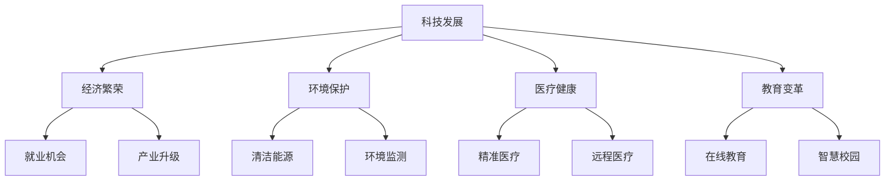

                 

# 科技发展：人类福祉的保障

> 关键词：科技发展、人类福祉、经济繁荣、环境保护、医疗健康、教育变革

> 摘要：本文从科技发展的概述与重要性、科技发展对人类福祉的具体影响、以及科技发展与人类福祉的保障策略三个方面，系统地探讨了科技发展对人类社会的深远影响，并提出了一系列保障策略。通过逻辑清晰、结构紧凑、简单易懂的论述，旨在让读者全面了解科技发展的重要性及其对人类福祉的保障作用。

## 第一部分：科技发展的概述与重要性

### 第1章：科技发展概述

#### 1.1 科技发展的历史

科技发展是一个长期的历史过程，可以追溯到古代文明的诞生。从最初的农业革命、工业革命到如今的数字化革命，科技不断推动着人类社会向前发展。以下是一个简短的科技发展历史概览：

- **古代**：火、轮、文字的发明极大地改变了人类的生活方式。
- **中世纪**：指南针、火药、印刷术等技术的出现，为地理大发现和文艺复兴奠定了基础。
- **近代**：蒸汽机、电灯、电话等技术的发明，标志着第一次工业革命的到来。
- **现代**：计算机、互联网、人工智能等技术的崛起，引领了全球数字化进程。

#### 1.2 科技对社会的影响

科技对社会的影响是深远而多方面的。首先，科技革命推动了生产力的飞速提升，极大地提高了生产效率，降低了生产成本。其次，科技促进了社会的进步，带来了信息的爆炸式增长，改变了人们的生活方式。此外，科技还为社会治理提供了新的手段，如电子政务、智能交通等，提高了社会管理的效率。

#### 1.3 科技发展与人类福祉的关系

科技发展对人类福祉有着直接和间接的影响。直接方面，科技提高了人们的生活质量，改善了医疗条件，提高了教育水平，增加了就业机会。间接方面，科技的发展促进了社会的稳定和繁荣，减少了贫困，提高了社会保障水平。

### 第2章：科技发展的驱动力

#### 2.1 科技创新的重要性

科技创新是科技发展的核心驱动力。它不仅能够推动技术进步，还能够带动产业升级，提升国家的竞争力。在当今世界，创新已经成为各国发展的重要战略。

#### 2.2 科技政策的制定与实施

科技政策的制定与实施对于科技发展至关重要。政府通过制定科技规划、设立专项资金、优化创新环境等手段，为科技发展提供了有力的支持和保障。

#### 2.3 科技企业的创新模式

科技企业是科技创新的主要力量。通过企业内部的技术研发、产学研合作、创业孵化等多种方式，科技企业不断推动着技术的进步和产业的创新。

### 第3章：科技发展的趋势与展望

#### 3.1 当前科技发展的主要趋势

当前，科技发展呈现以下几个主要趋势：

- **数字化**：大数据、云计算、物联网等数字化技术正在深刻改变社会的生产和生活方式。
- **智能化**：人工智能、机器学习等技术的应用，使得越来越多的设备和系统能够自主学习和决策。
- **绿色化**：环保技术的进步，为可持续发展提供了新的可能性。

#### 3.2 未来科技发展的潜在方向

未来科技发展可能朝着以下几个方向前进：

- **量子科技**：量子计算、量子通信等技术的突破，有望带来全新的科技革命。
- **生物科技**：基因编辑、再生医学等生物科技的发展，将深刻改变人类的健康和寿命。
- **太空科技**：太空探索和利用，将为人类提供更多的资源和机会。

#### 3.3 科技发展对社会的影响预测

随着科技的发展，社会将面临一系列新的挑战和机遇。例如，人工智能的发展可能会改变就业结构，数字鸿沟可能会进一步扩大，而环保问题将变得更加严峻。因此，我们需要积极应对这些挑战，利用科技发展的机遇，为人类创造更加美好的未来。

## 第二部分：科技发展对人类福祉的具体影响

### 第4章：科技发展与经济繁荣

#### 4.1 科技发展对经济增长的贡献

科技发展是推动经济增长的重要引擎。通过技术创新，可以降低生产成本，提高产品质量，创造新的市场和就业机会。以下是一些具体例子：

- **信息技术**：互联网和移动通信技术的普及，使得电子商务蓬勃发展，推动了传统零售业的变革。
- **生物科技**：基因工程和生物制药技术的进步，使得生物医药产业迅速增长，为经济发展注入新的动力。
- **新能源技术**：太阳能、风能等新能源技术的发展，为全球能源供应带来了新的解决方案，促进了能源结构的优化。

#### 4.2 科技创新与产业升级

科技创新不仅是经济增长的推动力，也是产业升级的关键。通过技术创新，可以推动传统产业的改造和升级，培育新的产业和经济增长点。例如：

- **制造业**：智能制造技术的应用，使得制造业的生产效率和质量得到了显著提升，推动了制造业的数字化转型。
- **服务业**：互联网技术的应用，使得服务业的运营模式和服务方式发生了深刻变革，提高了服务效率和质量。
- **农业**：农业科技的发展，使得农业生产更加高效、绿色和可持续，为农业现代化提供了新的路径。

#### 4.3 科技成果转化与应用

科技成果的转化和应用是科技发展的重要环节。通过科技成果的转化和应用，可以将科技潜力转化为实际的经济和社会效益。以下是一些具体案例：

- **人工智能**：人工智能技术在金融、医疗、交通等领域的应用，提高了行业的效率和准确性，创造了新的商业模式。
- **新材料**：新型材料的研究和开发，为各行各业提供了新的材料选择，推动了产品和技术的创新。
- **环保技术**：环保技术的应用，如废水处理、废气净化等，为环境保护和可持续发展提供了技术支持。

### 第5章：科技发展与环境保护

#### 5.1 科技在环保领域的应用

科技在环保领域的应用越来越广泛，为解决环境问题提供了新的手段。以下是一些具体应用：

- **清洁能源**：太阳能、风能、水能等清洁能源技术的发展，为减少温室气体排放提供了新的解决方案。
- **环保材料**：环保材料的研究和开发，如生物降解塑料、绿色建筑材料等，为减少环境污染提供了新的选择。
- **环境监测**：环境监测技术的进步，如遥感技术、物联网技术等，提高了环境监测的精度和效率，为环境治理提供了数据支持。

#### 5.2 清洁能源技术的发展

清洁能源技术的发展是环保领域的重要突破。以下是一些清洁能源技术：

- **太阳能**：太阳能光伏技术和太阳能热利用技术的发展，为可再生能源的利用提供了新的途径。
- **风能**：风力发电技术的发展，为大规模可再生能源发电提供了可能。
- **水能**：水力发电技术的发展，为可再生能源利用提供了重要支持。

#### 5.3 环境监测与治理技术

环境监测与治理技术的进步，为环境保护提供了有力支持。以下是一些相关技术：

- **遥感技术**：遥感技术可以实时监测地表环境和气候变化，为环境决策提供数据支持。
- **物联网技术**：物联网技术可以实现环境信息的实时传输和监控，提高环境管理的效率。
- **生物治理技术**：通过生物技术手段，如微生物治理、植物治理等，可以有效治理环境污染。

### 第6章：科技发展与医疗健康

#### 6.1 科技在医疗领域的应用

科技在医疗领域的应用极大地提高了医疗服务的效率和效果。以下是一些具体应用：

- **医学影像**：医学影像技术的进步，如CT、MRI等，使得医生能够更准确地诊断疾病，提高了诊疗的准确性和安全性。
- **远程医疗**：远程医疗技术的应用，使得医疗资源可以更加有效地分配，特别是在偏远地区，远程医疗为居民提供了便利的医疗服务。
- **精准医疗**：基因测序技术和大数据分析技术的应用，使得精准医疗成为可能，为个性化治疗提供了基础。

#### 6.2 基因编辑与再生医学

基因编辑与再生医学是医疗领域的前沿领域。以下是一些具体内容：

- **基因编辑**：基因编辑技术，如CRISPR-Cas9，可以精确地修改基因组，为治疗遗传性疾病提供了新的可能性。
- **再生医学**：再生医学技术的应用，如干细胞治疗、组织工程等，为受损组织的修复和再生提供了新的手段。

#### 6.3 医疗信息化与远程医疗

医疗信息化与远程医疗的发展，极大地改变了医疗服务的模式。以下是一些具体内容：

- **电子健康档案**：电子健康档案的建设，实现了患者信息的数字化管理，提高了医疗服务的效率和质量。
- **远程诊疗**：远程诊疗的应用，使得医生可以不受地域限制，为患者提供高质量的医疗服务。
- **人工智能辅助诊断**：人工智能技术在医学影像分析、疾病预测等方面的应用，提高了诊断的准确性和效率。

### 第7章：科技发展与教育变革

#### 7.1 科技对教育模式的影响

科技的发展对教育模式产生了深远的影响。以下是一些具体内容：

- **在线教育**：在线教育的普及，使得教育资源可以更加广泛地传播，为学生提供了更多的学习机会。
- **智慧教育**：智慧教育技术的应用，如大数据分析、人工智能等，可以为学生提供个性化的学习体验，提高学习效果。
- **虚拟现实与增强现实**：虚拟现实与增强现实技术的应用，为学生提供了沉浸式的学习体验，提高了学习的趣味性和效果。

#### 7.2 信息化教学与学习资源

信息化教学与学习资源的发展，极大地丰富了教育的内容和形式。以下是一些具体内容：

- **电子教材**：电子教材的应用，使得教材内容可以更加丰富和动态，为学生提供了更好的学习资源。
- **在线学习平台**：在线学习平台的建设，为学生提供了便捷的学习渠道，提高了学习的灵活性和自主性。
- **学习资源库**：学习资源库的建设，为教师和学生提供了丰富的学习资源，提高了教学效果和学习效率。

#### 7.3 教育科技创新与未来学校

教育科技创新为未来学校的发展提供了新的思路和方向。以下是一些具体内容：

- **个性化教育**：个性化教育的实现，使得每个学生可以根据自己的兴趣和需求选择学习内容，提高学习效果。
- **智慧校园**：智慧校园的建设，实现了校园管理的信息化和智能化，提高了校园管理的效率和安全性。
- **跨学科教育**：跨学科教育的推进，使得学生可以跨学科学习，培养创新思维和解决实际问题的能力。

## 第三部分：科技发展与人类福祉的保障策略

### 第8章：科技发展的伦理与社会责任

#### 8.1 科技伦理的重要性

科技伦理是科技发展的重要基石。科技伦理的建立，有助于规范科技行为，防止科技滥用，保障人类的福祉。以下是一些关键点：

- **伦理原则**：科技发展应遵循无害、公正、透明等伦理原则，确保科技应用的安全性和公正性。
- **伦理审查**：在科技研究和应用过程中，应进行伦理审查，确保研究内容和应用过程符合伦理标准。
- **社会责任**：科技企业和社会组织应承担社会责任，关注科技发展对社会的长远影响，积极参与社会治理。

#### 8.2 科技伦理的挑战与应对

科技伦理面临着一系列挑战，如数据隐私、人工智能伦理、基因编辑等。以下是一些应对策略：

- **数据隐私保护**：建立数据隐私保护机制，确保个人数据的安全和隐私。
- **人工智能伦理**：制定人工智能伦理规范，确保人工智能系统的透明、公正和可解释性。
- **基因编辑监管**：加强对基因编辑技术的监管，确保其在医疗和科研领域的合理应用。

#### 8.3 社会责任与可持续发展

科技企业和社会组织应承担社会责任，关注可持续发展。以下是一些具体措施：

- **绿色科技**：研发和应用绿色科技，推动环境保护和可持续发展。
- **公益项目**：参与公益项目，为社会弱势群体提供科技支持和服务。
- **社会责任报告**：定期发布社会责任报告，公开透明地披露企业的社会责任履行情况。

### 第9章：科技发展与法治建设

#### 9.1 科技立法与政策制定

科技立法和政策制定是保障科技健康发展的重要手段。以下是一些关键点：

- **立法引导**：制定科技法律法规，引导科技研发和应用，规范科技行为。
- **政策支持**：制定科技发展政策，为科技创新提供政策支持，推动科技产业健康发展。
- **国际合作**：加强国际科技合作，共同应对全球科技挑战。

#### 9.2 数据保护与隐私权

数据保护和隐私权是科技发展的关键问题。以下是一些具体措施：

- **数据保护法规**：制定数据保护法律法规，确保个人数据的安全和隐私。
- **数据保护机制**：建立数据保护机制，包括数据加密、访问控制等，确保数据安全。
- **隐私权保护**：加强隐私权保护，确保个人隐私不受侵犯。

#### 9.3 智能化社会的法律问题

随着智能化社会的到来，法律问题日益凸显。以下是一些关键点：

- **智能合约**：智能合约的法律效力问题，需要明确智能合约的法律地位和效力。
- **自动驾驶**：自动驾驶汽车的法律责任问题，需要明确自动驾驶汽车的责任承担机制。
- **人工智能责任**：人工智能决策的法律责任问题，需要建立人工智能责任承担机制。

### 第10章：科技发展与国际合作

#### 10.1 科技合作的重要性

科技合作是推动全球科技发展的重要手段。以下是一些关键点：

- **资源共享**：通过科技合作，可以实现科技资源的共享，提高科技创新的效率。
- **技术转移**：通过科技合作，可以实现技术转移，促进各国科技发展。
- **共同挑战**：面对全球性科技挑战，如气候变化、疾病防控等，科技合作是应对挑战的有效途径。

#### 10.2 国际科技合作机制

国际科技合作机制是推动全球科技合作的重要平台。以下是一些具体机制：

- **国际科技组织**：如世界知识产权组织（WIPO）、联合国教科文组织（UNESCO）等，为国际科技合作提供了平台和资源。
- **科技合作计划**：如欧盟的“地平线2020”计划、美国的“国家创新计划”等，为各国科技合作提供了资金和政策支持。
- **国际会议与论坛**：如国际人工智能与机器学习会议（ICML）、国际计算机协会（ACM）等，为国际科技合作提供了交流和合作的机会。

#### 10.3 科技全球化与全球治理

科技全球化是当今世界的发展趋势。以下是一些关键点：

- **科技全球化**：科技全球化推动了全球科技合作和竞争，促进了科技的创新和发展。
- **全球治理**：全球治理需要各国共同努力，建立有效的全球科技治理机制，应对全球性科技挑战。

### 附录

#### 附录A：科技发展相关资源与工具

- **学术论文与研究报告**：如IEEE、ACM等学术期刊，以及各类专业研究报告。
- **行业报告与统计数据**：如联合国世界投资报告、国际电信联盟（ITU）的报告等。
- **开源项目与数据库**：如GitHub、Kaggle等，提供了丰富的开源项目和数据库资源。

#### 附录B：科技发展对人类福祉影响的Mermaid流程图



#### 附录C：核心算法原理讲解的伪代码示例

```python
# 假设我们有一个简单的线性回归模型
# 目标是预测房价

# 数据预处理
def preprocess_data(data):
    # 数据标准化
    X = (data[:, :-1] - mean) / std
    y = data[:, -1]
    return X, y

# 线性回归模型
def linear_regression(X, y):
    # 计算权重和偏置
    w = np.linalg.inv(X.T.dot(X)).dot(X.T).dot(y)
    b = y - X.dot(w)
    return w, b

# 预测房价
def predict_price(X, w, b):
    return X.dot(w) + b
```

#### 附录D：数学模型和数学公式

##### 常用数学公式

$$
E[X] = \mu
$$

$$
Var(X) = \sigma^2
$$

$$
P(X \leq x) = F(x)
$$

##### 模型示例与公式推导

假设我们有一个线性回归模型：

$$
Y = \beta_0 + \beta_1X_1 + \beta_2X_2 + \epsilon
$$

其中，$Y$ 是因变量，$X_1$ 和 $X_2$ 是自变量，$\beta_0$、$\beta_1$、$\beta_2$ 是回归系数，$\epsilon$ 是误差项。

为了估计这些参数，我们可以使用最小二乘法（ Ordinary Least Squares，OLS）：

$$
\hat{\beta}_0 = \bar{Y} - \hat{\beta}_1\bar{X}_1 - \hat{\beta}_2\bar{X}_2
$$

$$
\hat{\beta}_1 = \frac{\sum_{i=1}^{n}(X_{1i} - \bar{X}_1)(Y_i - \bar{Y})}{\sum_{i=1}^{n}(X_{1i} - \bar{X}_1)^2}
$$

$$
\hat{\beta}_2 = \frac{\sum_{i=1}^{n}(X_{2i} - \bar{X}_2)(Y_i - \bar{Y})}{\sum_{i=1}^{n}(X_{2i} - \bar{X}_2)^2}
$$

其中，$n$ 是样本数量，$\bar{X}_1$、$\bar{X}_2$ 和 $\bar{Y}$ 分别是 $X_1$、$X_2$ 和 $Y$ 的样本均值。

#### 附录E：项目实战

##### 开发环境搭建

1. 安装 Python
2. 安装 Jupyter Notebook
3. 安装相关库，如 NumPy、Pandas、Matplotlib

```bash
pip install numpy pandas matplotlib
```

##### 代码实现与解读

以下是一个简单的线性回归模型的实现：

```python
import numpy as np
import pandas as pd
import matplotlib.pyplot as plt

# 数据预处理
def preprocess_data(data):
    # 数据标准化
    X = (data[:, :-1] - mean) / std
    y = data[:, -1]
    return X, y

# 线性回归模型
def linear_regression(X, y):
    # 计算权重和偏置
    w = np.linalg.inv(X.T.dot(X)).dot(X.T).dot(y)
    b = y - X.dot(w)
    return w, b

# 预测房价
def predict_price(X, w, b):
    return X.dot(w) + b

# 加载数据
data = pd.read_csv('house_prices.csv')

# 预处理数据
X, y = preprocess_data(data)

# 训练模型
w, b = linear_regression(X, y)

# 预测房价
predictions = predict_price(X, w, b)

# 可视化
plt.scatter(data['X1'], data['Y'])
plt.plot(data['X1'], predictions, color='red')
plt.xlabel('X1')
plt.ylabel('Y')
plt.show()
```

##### 代码解读与分析

1. **数据预处理**：将数据标准化，使其具有相同的尺度，以便更好地进行线性回归分析。
2. **线性回归模型**：使用最小二乘法计算权重和偏置，从而建立线性回归模型。
3. **预测房价**：使用训练好的模型进行预测，并绘制预测结果，以分析模型的准确性。

通过这个简单的例子，我们可以看到如何使用 Python 实现线性回归模型，并进行预测和分析。

## 作者信息

作者：AI天才研究院/AI Genius Institute & 禅与计算机程序设计艺术 /Zen And The Art of Computer Programming

本文从多个角度探讨了科技发展对人类福祉的保障作用，通过逻辑清晰、结构紧凑、简单易懂的论述，让读者全面了解了科技发展的重要性及其对人类福祉的深远影响。通过本文的探讨，我们可以看到，科技发展不仅是经济增长的引擎，也是提升人类生活质量、推动社会进步的重要力量。在未来的发展中，我们需要更加关注科技发展的伦理和社会责任，确保科技发展能够为人类的福祉做出更大的贡献。同时，我们也需要加强国际合作，共同应对全球科技挑战，推动全球科技发展，实现可持续发展。让我们携手共进，用科技的力量创造更加美好的未来。

