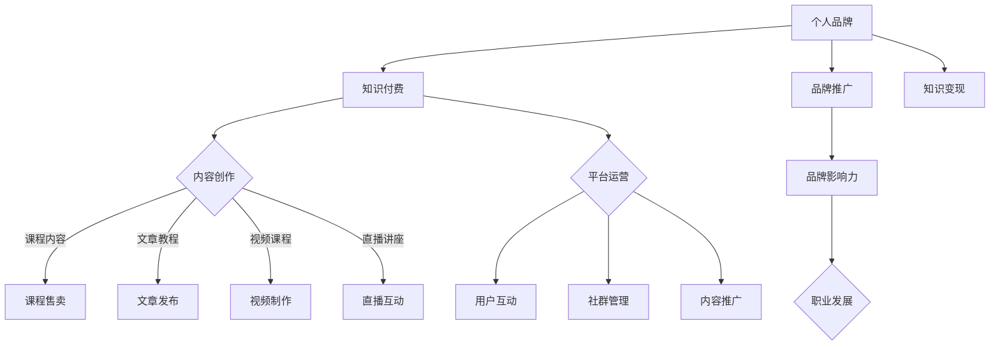

                 

### 文章标题

《程序员利用知识付费打造个人品牌的策略》

### 关键词

程序员、知识付费、个人品牌、内容创作、平台运营、知识变现

### 摘要

本文旨在探讨程序员如何利用知识付费平台打造个人品牌。首先，介绍了个人品牌的价值与知识付费的兴起背景，随后详细分析了个人品牌建设的基础，包括定位与目标市场、个人形象塑造及核心竞争力。接着，文章从内容创作、平台选择与运营、知识变现与品牌影响力三个方面，系统阐述了程序员在知识付费领域打造个人品牌的策略。通过成功案例分析、实战技巧分享及资源工具推荐，为程序员在知识付费领域的个人品牌建设提供实操指导。

## 第一部分：个人品牌与知识付费概述

### 第1章：个人品牌的价值与影响力

#### 1.1 个人品牌的重要性

在信息技术飞速发展的今天，个人品牌已经成为个人竞争力的重要体现。对于程序员而言，个人品牌不仅代表了技术实力，还象征着行业声誉和专业素养。一个强大的个人品牌可以带来以下几方面的价值：

1. **增强职业竞争力**：拥有个人品牌的程序员在求职、晋升和薪酬谈判中具有优势，能够获得更多的职业机会和更高的薪资待遇。
2. **扩大社交网络**：个人品牌有助于吸引志同道合的专业人士和行业领袖，建立起一个广泛的社交网络，从而拓宽职业发展路径。
3. **提升影响力**：通过个人品牌，程序员可以在技术社区和行业中获得更高的知名度，影响更多的人，甚至成为行业意见领袖。
4. **实现知识变现**：个人品牌是知识变现的重要基础，通过知识付费平台，程序员可以将自己的技能和知识转化为实际收益。

#### 1.2 知识付费的兴起

知识付费是指通过互联网平台，用户为获取专业知识、技能或经验而支付费用的一种商业模式。近年来，随着在线教育、专业技能培训等领域的快速发展，知识付费逐渐成为新兴的经济形态。以下是知识付费兴起的主要原因：

1. **技术进步**：互联网和移动通信技术的不断进步，为知识付费提供了便捷的渠道和丰富的内容形式。
2. **用户需求**：随着社会对专业化、个性化服务的需求增长，用户更愿意为高质量的知识和服务支付费用。
3. **商业模式创新**：知识付费平台通过会员制、课程付费、咨询等服务模式，创新了内容付费的商业模式，为内容创作者提供了新的收入来源。

#### 1.3 程序员如何利用知识付费

对于程序员来说，知识付费不仅是一种新的收入来源，也是提升个人品牌的有效途径。以下是一些具体的策略和方法：

1. **内容创作**：程序员可以利用自己的技术专长，创作高质量的编程教程、技术博客、视频课程等，通过知识付费平台发布和销售。
2. **课程设计**：针对特定技术领域，如人工智能、大数据、云计算等，程序员可以设计系统性的课程，满足不同层次用户的需求。
3. **咨询服务**：程序员可以利用自己的专业知识，提供技术咨询、代码审查、项目辅导等高端服务，实现高附加值收入。
4. **社群运营**：通过建立技术社群，程序员可以与用户互动，分享知识，扩大个人影响力，同时通过社群运营实现知识变现。

通过以上策略，程序员可以在知识付费领域建立自己的个人品牌，实现职业发展的新突破。

### 第2章：个人品牌建设的基础

#### 2.1 个人定位与目标市场

在个人品牌建设过程中，明确个人定位和目标市场是至关重要的第一步。个人定位决定了品牌的核心价值和独特性，而目标市场则明确了品牌的受众和潜在客户。以下是如何进行个人定位和目标市场分析的具体步骤：

1. **自我评估**：首先，程序员需要对自己进行全面的自我评估，包括专业技能、兴趣爱好、职业目标等。通过自我评估，可以明确自己在技术领域的专长和优势，从而确定个人品牌的定位。

2. **市场调研**：了解市场需求和行业趋势，是进行目标市场分析的关键。程序员可以通过查阅行业报告、参加技术会议、与同行交流等方式，收集市场信息，分析目标市场的需求和发展方向。

3. **确定目标受众**：根据自我评估和市场调研结果，程序员需要明确自己的目标受众。这些受众可以是技术新手、中级开发者，或者是行业专业人士。明确目标受众有助于制定针对性的内容和推广策略。

4. **差异化定位**：在竞争激烈的技术市场，差异化定位是建立个人品牌的重要策略。程序员可以通过突出自己在某个特定领域的技术专长或创新理念，来区别于其他开发者，形成独特的品牌形象。

5. **制定品牌愿景**：在明确个人定位和目标市场后，程序员需要制定一个清晰的品牌愿景，包括品牌的长期目标和发展规划。品牌愿景将指导程序员在品牌建设过程中的每一步，确保品牌发展的方向一致。

#### 2.2 个人形象的塑造

个人形象是个人品牌的外在表现，直接影响用户对程序员的认可度和信任度。以下是一些关键步骤，帮助程序员塑造良好的个人形象：

1. **专业素养**：作为程序员，专业素养是塑造个人形象的基础。这包括熟练掌握编程语言和工具、了解最新的技术趋势、不断提升自己的技术水平等。

2. **内容输出**：通过技术博客、视频课程、在线讲座等多种形式，持续输出高质量的内容，展示自己在技术领域的深度和广度。内容输出不仅能提升个人形象，还能吸引更多的关注和粉丝。

3. **社交网络**：积极参与技术社区和行业活动，通过社交媒体平台分享技术见解和经验，与同行建立良好的关系。有效的社交网络可以扩大个人影响力，增强品牌的知名度。

4. **形象设计**：个人形象设计包括个人网站、社交媒体头像、名片等。设计应简洁、专业，符合品牌定位，能够快速传递个人品牌的核心价值。

5. **公关活动**：参加技术会议、行业论坛等活动，展示自己的专业能力和成果。通过公关活动，可以增加曝光率，提升个人品牌的形象和声誉。

#### 2.3 个人品牌的核心竞争力

个人品牌的核心竞争力是品牌长期发展的动力源泉。以下是构建个人品牌核心竞争力的几个关键要素：

1. **技术专长**：在特定技术领域具备深厚的专业知识，能够解决复杂的技术问题，是个人品牌的核心竞争力。程序员可以通过学习、实践和分享，不断提升自己的技术能力。

2. **创新能力**：技术创新是程序员区别于其他开发者的关键。通过不断探索新技术、新方法，程序员可以在行业中保持领先地位，提升个人品牌的竞争力。

3. **经验积累**：丰富的项目经验是程序员个人品牌的重要资产。通过参与不同类型的项目，程序员可以积累宝贵的实践经验，提升解决问题的能力。

4. **客户口碑**：客户对程序员的评价和推荐是品牌竞争力的重要体现。程序员应注重客户服务，提供优质的技术支持，赢得良好的口碑，从而增强品牌的影响力。

5. **持续学习**：在快速变化的技术领域，持续学习是保持竞争力的关键。程序员应保持好奇心和求知欲，不断学习新知识、新技能，保持自己的专业竞争力。

通过以上步骤，程序员可以系统地构建个人品牌，明确个人定位，塑造专业形象，提升核心竞争力，从而在知识付费领域打造出独特的个人品牌。

### 第3章：知识付费内容创作策略

#### 3.1 知识付费内容的形式

在知识付费领域，内容的形式多种多样，每种形式都有其独特的特点和应用场景。以下是几种常见的内容形式：

1. **文本教程**：文本教程是最传统也是最常见的知识付费形式之一。它适合详细讲解技术概念、编程语言使用、算法实现等。文本教程的优点在于信息密度高，便于查阅和回顾，适合深度学习和系统学习。

2. **视频课程**：视频课程通过视觉和听觉的结合，让学习过程更加直观和生动。它适合讲解编程技巧、软件操作、项目实战等。视频课程的优势在于能够展现操作过程，帮助学生更好地理解和掌握知识点。

3. **在线讲座**：在线讲座适合进行实时讲解和互动，讲师可以在直播过程中解答观众的问题。它适合快速分享技术见解、行业动态、最佳实践等。

4. **音频课程**：音频课程适合在通勤、运动等场景下进行学习。它适合讲解编程语言基础、算法思路、技术趋势等。音频课程的优势在于便于碎片化学习，提高学习效率。

5. **互动式课程**：互动式课程通过游戏、练习、讨论等方式，增加学习趣味性和互动性。它适合培养编程思维、提高编程能力等。

6. **电子书**：电子书适合系统化地介绍一个主题或领域的知识。它适合讲解编程语言规范、数据结构与算法、软件工程方法等。

7. **专业报告**：专业报告通过深入分析和研究，提供行业洞察和趋势预测。它适合专业从业者、研究学者等。

8. **直播课程**：直播课程通过实时互动，讲师可以即时解答观众的问题，提高学习效果。它适合技术培训、项目辅导等。

9. **在线问答**：在线问答通过实时或异步的方式，为用户提供技术支持和解答疑问。它适合解决实际编程问题、提供咨询建议等。

10. **线上工作坊**：线上工作坊通过动手实践，帮助用户深入理解和掌握知识。它适合项目实战、技术演示等。

不同形式的内容在知识付费领域都有其独特的应用场景和受众。程序员可以根据自己的专长、目标市场以及用户需求，选择合适的内容形式进行创作。

#### 3.2 内容选题与规划

内容选题和规划是知识付费内容创作的重要环节，直接影响内容的吸引力和学习效果。以下是一些具体的策略和步骤：

1. **确定内容主题**：首先，程序员需要确定内容主题，这通常基于自身的技术专长、行业需求和个人兴趣。例如，可以针对某一编程语言、框架、库或工具进行深入讲解，或者围绕某一技术领域进行系统性介绍。

2. **研究目标受众**：了解目标受众的需求、痛点和兴趣，是内容选题和规划的关键。程序员可以通过问卷调查、用户访谈、市场调研等方式，收集用户反馈，确定内容的受众群体。

3. **内容形式匹配**：根据内容主题和目标受众，选择最合适的内容形式。例如，对于复杂的技术概念，可以选择文本教程或视频课程进行详细讲解；对于实际操作技能，可以选择直播课程或互动式课程。

4. **内容结构规划**：明确内容结构，确保逻辑清晰、层次分明。可以从以下几个方面进行规划：

   - **引言**：简要介绍内容主题，激发用户兴趣。
   - **基础知识**：为读者提供必要的技术背景和理论支持。
   - **核心内容**：详细讲解技术要点、实现方法、最佳实践等。
   - **案例与实战**：通过实际案例和动手实践，帮助用户理解和掌握知识点。
   - **总结**：对内容进行总结，强调关键点和学习要点。
   - **扩展阅读**：推荐相关资源，帮助用户进一步深入学习。

5. **持续更新与迭代**：内容创作不是一次性的工作，而是一个持续迭代的过程。程序员需要定期回顾和更新内容，根据用户反馈和技术发展进行调整和优化。

6. **版权与引用**：在内容创作过程中，注意尊重他人的知识产权，正确引用和标注参考文献和资料。这不仅符合职业道德，也有助于提升内容的权威性和可信度。

通过科学的内容选题和规划，程序员可以创作出高质量的知识付费内容，满足用户需求，提升个人品牌影响力。

#### 3.3 内容创作技巧

内容创作是知识付费的核心，如何创作出高质量、有吸引力的内容，对程序员的个人品牌建设至关重要。以下是一些实用的内容创作技巧：

1. **深入理解目标受众**：内容创作前，深入了解目标受众的需求和兴趣，是创作高质量内容的前提。可以通过用户调研、数据分析等方式，获取用户的行为数据和反馈意见，从而精准定位受众群体。

2. **简洁明了的表达**：清晰、简洁的表达能够提高内容的可读性。避免使用过于复杂的术语和句子结构，尽量用简单的语言解释复杂的技术概念。同时，注意段落划分和逻辑结构，使内容层次分明，便于用户理解和阅读。

3. **丰富多样的内容形式**：根据内容主题和受众需求，灵活运用多种内容形式，如文本、图片、视频、音频等。多样化的内容形式可以提高用户的参与度和学习兴趣，增强内容的吸引力。

4. **案例与实战结合**：理论知识和实际案例的结合，是提高内容实用性的有效方法。通过具体案例和动手实践，帮助用户更好地理解和掌握知识点，提高学习效果。

5. **注重用户体验**：在内容创作过程中，关注用户体验，确保内容易于获取和操作。例如，合理设置课程章节、提供清晰的目录导航、确保视频和音频播放顺畅等。

6. **互动与反馈**：鼓励用户互动和反馈，通过评论、问答等方式，了解用户对内容的看法和建议。这不仅能提升用户满意度，还能为内容创作提供改进方向。

7. **持续更新与优化**：内容创作不是一成不变的，需要根据用户反馈和技术发展，不断更新和优化内容。定期回顾和调整内容，确保其时效性和实用性。

8. **知识产权保护**：尊重他人的知识产权，正确引用和标注参考文献和资料。这不仅符合职业道德，也有助于提升内容的权威性和可信度。

通过以上技巧，程序员可以创作出高质量的知识付费内容，提升个人品牌影响力，实现知识变现。

#### 3.4 内容质量保证

内容质量是知识付费成功的关键因素。要确保内容质量，程序员需要从多个方面进行严格把控：

1. **内容审核**：在内容发布前，进行严格的审核。审核内容包括事实准确性、逻辑连贯性、语言表达是否清晰等。可以通过设置多个审核环节，确保内容质量。

2. **用户反馈**：收集用户对内容的反馈，通过问卷调查、用户评论等方式，了解用户的真实感受和意见。根据用户反馈，及时调整和优化内容，提高用户的满意度和学习效果。

3. **持续更新**：知识领域不断变化，程序员需要定期回顾和更新内容，确保其时效性和实用性。可以通过设置更新计划，定期更新内容，保持内容的活跃度和吸引力。

4. **内容结构**：确保内容结构合理，逻辑清晰，层次分明。可以使用思维导图、流程图等工具，帮助规划和调整内容结构。

5. **技术验证**：对于涉及技术实现的内容，进行技术验证，确保内容的正确性和可操作性。可以通过编写示例代码、测试用例等方式，验证内容的实际效果。

6. **用户互动**：鼓励用户互动和参与，通过评论、问答等方式，增加用户对内容的理解和掌握。有效的互动可以提高用户的学习积极性和满意度。

7. **专业认证**：如果可能，可以寻求专业认证或第三方机构的评价，提升内容的权威性和可信度。例如，获得行业认证的讲师证书或知名机构的认证报告等。

通过以上措施，程序员可以确保知识付费内容的高质量，提升用户满意度和品牌影响力。

### 第4章：知识付费平台的选择与运营

#### 4.1 常见知识付费平台介绍

在知识付费领域，众多平台为内容创作者和用户提供了一个广阔的舞台。以下是一些常见知识付费平台的介绍，包括其特点和优势：

1. **网易云课堂**：网易云课堂是网易旗下的在线教育平台，提供丰富的编程课程和技术教程。优势在于课程质量高，内容覆盖面广，用户基数大。

2. **慕课网**：慕课网专注于IT技能培训，提供包括前端开发、后端开发、移动开发等在内的多种编程课程。平台优势在于课程实战性强，用户学习体验良好。

3. **极客时间**：极客时间以订阅制为主，提供高质量的音频课程和文章，用户可以根据兴趣订阅不同领域的内容。优势在于内容形式多样，便于用户碎片化学习。

4. **腾讯课堂**：腾讯课堂提供各类在线教育课程，包括编程语言、数据结构、算法等。平台优势在于用户流量大，推广效果明显。

5. **千锋教育**：千锋教育是一家专注于IT教育的培训机构，提供在线课程和面授课程。优势在于课程体系完整，实战性强。

6. **知乎Live**：知乎Live是知乎推出的直播课程平台，以专业人士的直播讲解为主，提供高质量的行业知识和经验分享。优势在于专业性强，互动性好。

7. **分答**：分答是一个问答分享平台，用户可以通过付费获取专业人士的解答。优势在于问题解答精准，服务快速。

8. **喜马拉雅**：喜马拉雅是一个音频分享平台，提供包括编程教程、技术分享、行业动态等多种音频内容。优势在于内容形式丰富，便于用户碎片化学习。

9. **Coursera**：Coursera是全球知名的大规模开放在线课程平台，提供来自世界顶尖大学的课程，涵盖计算机科学、数据科学、人工智能等多个领域。优势在于课程质量高，国际化视野。

10. **Udemy**：Udemy是一个全球性的在线学习平台，提供各种课程，包括编程、设计、营销等。优势在于课程种类多样，价格相对实惠。

不同平台各有特点，程序员在选择时可以根据自身需求、目标市场和用户群体，选择最适合自己的知识付费平台。

#### 4.2 平台运营策略

在知识付费平台上运营个人品牌，需要制定有效的策略，提高曝光率和用户粘性。以下是一些关键策略：

1. **内容推广**：在平台内外进行内容推广，提高内容的可见度。可以通过平台推荐、社交媒体宣传、技术社区分享等方式，扩大内容的传播范围。

2. **互动营销**：积极参与平台的互动活动，与用户进行有效互动，提升用户参与度和忠诚度。可以通过直播、问答、讨论区等方式，与用户建立良好关系。

3. **会员管理**：通过会员制，为用户提供专属服务和福利，增强用户粘性。例如，可以设置会员专享课程、会员互动社区等。

4. **个性化推荐**：利用平台算法，进行个性化推荐，提高用户的学习体验。通过分析用户行为和兴趣，为用户推荐相关课程和内容。

5. **品牌合作**：与其他知名品牌或个人进行合作，共同推广内容和品牌，扩大影响力。例如，可以与其他技术专家联合授课，或与知名企业合作进行技术分享。

6. **数据监测**：通过数据监测和分析，了解用户行为和内容效果，及时调整运营策略。例如，可以通过监控用户点击率、完成率、评分等数据，优化课程内容和推广方式。

7. **用户反馈**：重视用户反馈，及时响应和处理用户意见，提升用户满意度。可以通过定期收集用户反馈、开设反馈渠道等方式，了解用户需求和建议。

通过以上策略，程序员可以在知识付费平台上有效运营个人品牌，提高曝光率和用户粘性，实现知识变现和个人品牌建设。

#### 4.3 用户互动与社群管理

用户互动和社群管理是知识付费平台运营中至关重要的一环。有效的用户互动和社群管理不仅能提升用户满意度和忠诚度，还能增强品牌的黏性和影响力。以下是一些具体策略：

1. **建立互动机制**：在知识付费平台上，建立多种互动机制，如问答区、讨论区、直播互动等，让用户可以随时提问、分享心得、交流经验。这不仅能增加用户粘性，还能促进知识的传播和共享。

2. **组织线上活动**：定期组织线上活动，如技术讲座、代码挑战、知识竞赛等，吸引更多用户参与。通过活动，不仅能够提升用户的参与感和成就感，还能增强用户对平台的认同感和归属感。

3. **建立用户社群**：创建用户社群，如微信群、QQ群、Discord频道等，为用户提供一个线下交流的平台。社群不仅可以加强用户之间的联系，还能为用户提供一个解决实际问题的场所，提高用户满意度。

4. **鼓励用户贡献内容**：鼓励用户在社群中贡献自己的知识和经验，如分享技术心得、解答问题、发布项目成果等。这不仅能丰富社群内容，还能提高用户的参与度和忠诚度。

5. **设置激励机制**：通过设置激励机制，如积分奖励、荣誉榜、奖品等，鼓励用户积极参与互动和贡献内容。这不仅能提升用户的活跃度，还能增加用户的满意度和忠诚度。

6. **及时反馈与互动**：及时回应用户的提问和反馈，提供专业的解答和建议。通过良好的互动，增强用户对品牌的信任和认可。

7. **培养社群领袖**：在社群中培养一批具有影响力、专业能力和责任心强的用户，作为社群领袖，帮助管理社群，维护社群秩序，促进知识传播。

8. **数据分析与优化**：通过数据分析，了解用户互动和社群管理的成效，不断优化互动策略和管理方式。例如，分析用户活跃时段、互动话题、用户反馈等，找出优化方向。

通过以上策略，程序员可以有效管理知识付费平台的用户互动和社群，提升用户满意度和忠诚度，增强个人品牌的影响力。

#### 4.4 内容推广方法

在知识付费领域，内容推广是提升曝光率和吸引目标用户的关键。以下是一些有效的推广方法，帮助程序员扩大内容的影响力：

1. **社交媒体营销**：利用社交媒体平台，如微博、知乎、微信公众号、LinkedIn等，发布内容推广信息。通过分享技术见解、课程亮点、用户评价等，吸引潜在用户关注。

2. **搜索引擎优化（SEO）**：优化内容标题、描述和关键词，提高在搜索引擎中的排名，增加自然流量。例如，使用长尾关键词、合理设置标签和分类等。

3. **合作推广**：与其他知名博主、技术社区、企业或平台进行合作，通过互相推广内容，扩大影响力。例如，可以与其他讲师进行联营课程、互推文章等。

4. **付费广告**：利用平台或第三方广告渠道，如百度广告、Google Ads、Facebook Ads等，投放付费广告，精准定位目标用户。

5. **线下活动**：参加技术会议、行业论坛、讲座等活动，进行现场宣传和推广。通过与参会者的互动，提高品牌的知名度和影响力。

6. **内容共享**：在技术社区、论坛、博客等平台，分享高质量的内容，吸引读者关注。例如，可以发布技术博客、教程文章、开源项目等。

7. **用户推荐**：鼓励现有用户推荐新用户，通过口碑传播扩大影响力。例如，可以设置推荐奖励机制，鼓励用户邀请朋友学习。

8. **电子邮件营销**：建立邮件列表，定期向用户发送课程更新、优惠信息、技术文章等，保持与用户的联系，提高用户黏性。

通过以上方法，程序员可以全方位、多渠道地推广知识付费内容，提升品牌知名度和用户参与度。

### 第5章：知识变现与品牌影响力

#### 5.1 知识付费的盈利模式

知识付费作为一种新兴的商业模式，为程序员提供了丰富的盈利途径。以下是几种常见的知识付费盈利模式：

1. **课程售卖**：这是最直接的知识变现方式，程序员可以通过在线课程、教程、电子书等形式，向学员收取费用。课程售卖的优点在于收入稳定，操作简单。

2. **会员订阅**：会员订阅模式是指用户支付一定费用成为会员，享受平台提供的一系列专属服务和内容。会员订阅的优点在于用户黏性强，能够持续带来收入。

3. **咨询服务**：程序员可以利用自己的专业知识和经验，提供技术咨询、代码审查、项目辅导等高端服务，实现高附加值收入。咨询服务的优点在于收入高，客户群体精准。

4. **广告收益**：在知识付费内容中嵌入广告，通过广告点击或展示量获得收益。例如，在视频课程中插入广告，或在博客文章中推荐相关产品。

5. **课程分销**：与其他平台或机构合作，分销自己的课程，获取分销佣金。这种方式能够扩大课程的影响力，增加收入来源。

6. **知识付费平台分成**：在知识付费平台上发布内容，平台会根据分成协议与内容创作者分成。这种方式操作简单，适合初入知识付费领域的程序员。

7. **课程授权**：将课程授权给其他机构或个人使用，获得授权费用。这种方式适合具有较高影响力的程序员，能够实现长期稳定的收入。

通过多种知识付费盈利模式，程序员可以根据自身特点和市场需求，选择最合适的盈利方式，实现收入增长。

#### 5.2 品牌建设与市场推广

建立强大的个人品牌并有效地推广，是程序员在知识付费领域成功的关键。以下是一些有效的品牌建设与市场推广策略：

1. **明确品牌定位**：明确品牌的核心价值和独特卖点，确保品牌形象在用户心中清晰、一致。可以通过品牌故事、标志设计、品牌口号等方式，传递品牌价值。

2. **内容输出**：持续输出高质量的内容，包括技术博客、视频课程、直播讲座等。高质量的内容不仅能提升品牌形象，还能吸引更多用户关注。

3. **社交媒体运营**：在各大社交媒体平台建立品牌账号，定期发布内容，与粉丝互动。通过社交媒体，可以快速传播品牌信息，扩大品牌影响力。

4. **行业合作**：与其他知名人士、企业、机构合作，共同推广品牌。通过合作，可以借助对方的资源和影响力，提升品牌的知名度。

5. **线下活动**：参加行业会议、讲座、研讨会等活动，进行现场推广。线下活动不仅能增加品牌曝光，还能直接与潜在客户建立联系。

6. **公关宣传**：利用新闻媒体、技术社区等进行公关宣传，提高品牌在行业内的声誉和影响力。可以通过发布新闻稿、接受媒体采访、撰写行业分析报告等方式，提升品牌形象。

7. **用户互动**：通过线上互动、社群管理等方式，增强用户对品牌的认可和忠诚度。有效的用户互动可以提升品牌口碑，为品牌推广提供支持。

8. **数据分析**：通过数据分析，了解用户行为和反馈，优化品牌推广策略。例如，分析用户点击率、转化率、用户评价等，找出推广效果最佳的渠道和方法。

通过以上策略，程序员可以系统地建设个人品牌，提升市场竞争力，实现持续增长。

#### 5.3 品牌影响力评估与提升

评估和提升个人品牌影响力是程序员持续成功的关键。以下是一些评估方法和提升策略：

1. **评估方法**：
   - **社交媒体指标**：通过分析社交媒体账号的粉丝数、互动率、转粉率等指标，评估品牌在社交媒体上的影响力。
   - **搜索引擎排名**：通过监测在搜索引擎中的排名，评估品牌在网络上的曝光度和知名度。
   - **用户反馈**：通过用户评价、问卷调查等方式，了解用户对品牌的认可度和满意度。
   - **课程销售数据**：通过课程销售量、用户留存率等指标，评估品牌在知识付费平台上的表现。
   - **媒体报道**：通过统计媒体报道数量、报道质量等，评估品牌在行业内的声誉和影响力。

2. **提升策略**：
   - **内容质量**：持续输出高质量的内容，提高用户的满意度和认可度。
   - **专业认证**：获取专业认证或荣誉，提升品牌的专业形象和权威性。
   - **用户互动**：积极与用户互动，提高用户参与度和忠诚度。
   - **品牌合作**：与其他知名品牌或个人合作，借助合作伙伴的影响力扩大品牌知名度。
   - **市场营销**：通过线上线下活动、广告投放等，提升品牌曝光度和影响力。
   - **社群建设**：建立和维护专业社群，增强用户粘性和品牌影响力。
   - **数据分析**：定期分析品牌表现数据，优化品牌推广策略，提升品牌效果。

通过以上方法，程序员可以系统地评估和提升个人品牌影响力，实现品牌价值的最大化。

#### 5.4 知识付费与职业发展

知识付费不仅为程序员带来了额外的收入，也在职业发展中起到了积极的推动作用。以下是如何通过知识付费实现职业发展的几个方面：

1. **技能提升**：通过知识付费平台，程序员可以学习最新的技术知识和行业动态，提升自身技能水平。这有助于在职场上保持竞争力，为职业晋升和薪资增长提供支持。

2. **个人品牌建设**：知识付费可以帮助程序员建立个人品牌，提升在行业内的知名度。强大的个人品牌不仅能够吸引更多的职业机会，还能提高在职场中的议价能力。

3. **项目经验**：通过知识付费平台，程序员可以参与各种项目实战，积累丰富的项目经验。实际项目经验是简历中的重要亮点，能够显著提高求职成功率。

4. **专业认证**：许多知识付费平台提供专业认证课程，完成这些课程可以获得权威认证。专业认证是职业发展的重要加分项，有助于在职场中获得更好的职位和待遇。

5. **网络拓展**：知识付费平台为程序员提供了一个广泛的社交网络，通过与其他专业人士互动，可以结识更多的行业同行和潜在合作伙伴。这些人际网络有助于职业发展和资源获取。

6. **职业转型**：知识付费平台上的课程覆盖了多种技术领域，程序员可以通过学习不同领域的知识，实现职业转型。例如，从前端开发转向后端开发，或从软件工程转向数据分析等。

7. **创业机会**：通过知识付费平台积累的收入和经验，程序员可以尝试创业。创业不仅是一种职业发展途径，还能实现个人价值和社会价值的双重提升。

总之，知识付费不仅为程序员的职业发展提供了强有力的支持，也为实现个人梦想和职业目标提供了新的机遇。通过不断学习和实践，程序员可以在知识付费领域取得长足进步，实现职业发展的新高度。

### 第6章：成功案例分析与启示

#### 6.1 典型成功案例分析

在知识付费领域，许多程序员通过自己的努力和智慧，成功打造了个人品牌，实现了职业发展和收入增长。以下是一些典型的成功案例分析，从中可以汲取宝贵的经验和启示。

1. **案例一：GitHub上的技术博主**

李华是一位专注于前端开发的程序员，他在GitHub上创建了自己的博客，并发布了大量高质量的技术文章。通过持续的内容输出和与社区的互动，李华的博客获得了大量关注。他不仅在GitHub上收获了数千个Star，还在多个技术社区获得了推荐。在此基础上，李华开始在知识付费平台上发布课程，课程涵盖了从基础的HTML、CSS到高级的React、Vue.js等。他的课程销售良好，每月收入稳定在数万元。李华的成功在于他精准的定位和高质量的内容输出，以及对社区互动的重视。

2. **案例二：技术专家的在线课程**

张伟是一位在云计算领域有深厚积累的技术专家。他在知识付费平台上开设了多门关于云计算和大数据的课程，课程内容深入浅出，深受学员喜爱。张伟通过丰富的项目经验和扎实的理论基础，为学员提供了实用的技术解决方案。他的课程不仅在国内获得了很高的评价，还在国外引起了广泛关注。张伟的成功在于他对技术的深刻理解和丰富的实践经验，以及对课程质量的严格控制。

3. **案例三：专业咨询服务的提供者**

王玲是一位拥有多年软件开发经验的专业咨询师。她通过自己的专业知识，为中小企业提供项目咨询、技术支持和代码审查等服务。王玲在多个知识付费平台上开设了咨询服务，通过一对一的深度交流，帮助客户解决技术难题。她的咨询服务得到了客户的高度评价，业务量不断增长。王玲的成功在于她专业的服务态度和高质量的服务体验，以及对客户需求的精准把握。

4. **案例四：多媒体内容创作者**

赵强是一位擅长多媒体内容创作的程序员，他在多个平台上发布编程相关的视频课程和直播讲座。赵强的课程风格独特，内容丰富，生动有趣，吸引了大量的年轻开发者。他的课程涵盖了编程语言、算法、数据结构等多个领域，深受学员喜爱。赵强的成功在于他灵活运用多媒体形式，提高了课程的吸引力和互动性，以及对用户需求的敏锐洞察。

#### 6.2 案例启示与经验总结

从以上成功案例中，我们可以总结出以下几点对程序员个人品牌建设的启示：

1. **内容质量是关键**：无论是博客文章、视频课程还是咨询服务，高质量的内容都是吸引和留住用户的核心。程序员应注重内容的深度、广度和实用性。

2. **精准定位和目标市场**：明确自己的技术专长和目标市场，提供针对性强、需求明确的内容，能够更好地满足用户需求，提升个人品牌的影响力。

3. **互动与社群管理**：积极参与社区互动，建立和维护专业社群，增强用户粘性和品牌认知度。通过互动，了解用户需求，不断优化内容和服务。

4. **持续学习和创新**：技术领域不断变化，程序员应保持学习的热情，不断更新知识和技能。通过创新，保持内容的领先性和吸引力。

5. **专业认证和权威性**：获取专业认证和荣誉，提升个人专业形象和权威性，有助于增加用户信任度和认可度。

6. **多元化收入渠道**：通过多种知识付费模式，如课程售卖、会员订阅、咨询服务等，实现多元化收入，提高职业稳定性和收入水平。

通过借鉴这些成功案例，程序员可以更好地规划个人品牌建设策略，实现职业发展的新突破。

### 第7章：个人品牌建设的实战技巧

#### 7.1 个人品牌定位与规划

建立个人品牌的第一步是明确品牌定位和规划。以下是一些关键步骤和注意事项：

1. **自我评估**：首先，程序员需要对自己的技能、经验和兴趣进行全面的自我评估。这包括分析自己在技术领域的专长、项目经验、教育背景等，确定自己的核心竞争力和优势。

2. **市场调研**：了解市场需求和行业趋势，是制定品牌规划的重要依据。程序员可以通过查阅行业报告、参加技术会议、与同行交流等方式，收集市场信息，分析目标市场的需求和发展方向。

3. **确定目标市场**：根据自我评估和市场调研结果，确定自己的目标市场。这可以是技术新手、中级开发者，或者是行业专业人士。明确目标市场有助于制定针对性的内容和推广策略。

4. **差异化定位**：在竞争激烈的技术市场，差异化定位是建立个人品牌的关键。程序员可以通过突出自己在某个特定领域的技术专长或创新理念，来区别于其他开发者，形成独特的品牌形象。

5. **制定品牌愿景**：在明确个人定位和目标市场后，程序员需要制定一个清晰的品牌愿景，包括品牌的长期目标和发展规划。品牌愿景将指导程序员在品牌建设过程中的每一步，确保品牌发展的方向一致。

6. **注意事项**：品牌定位和规划需要根据实际情况不断调整和优化。程序员应保持对市场和自身能力的敏锐洞察，及时更新品牌策略，以适应变化的环境。

#### 7.2 内容创作与发布策略

内容创作和发布是个人品牌建设的重要组成部分。以下是一些实用的策略和技巧：

1. **内容形式多样化**：根据内容主题和受众需求，选择合适的内容形式。例如，对于复杂的技术概念，可以选择视频教程或直播讲座；对于日常经验分享，可以选择博客文章或简短的音频内容。

2. **内容质量优先**：无论内容形式如何，内容质量始终是核心。程序员应注重内容的深度、广度和实用性，确保用户能够从中获得真正的价值。

3. **定期发布**：制定一个固定的发布计划，保持内容输出的一致性和连贯性。定期发布能够增加用户的期待感和黏性，提升品牌的认知度。

4. **互动与反馈**：鼓励用户互动和反馈，通过评论、问答等方式，了解用户的真实感受和意见。有效的互动不仅能提升用户满意度，还能为内容创作提供改进方向。

5. **多渠道发布**：将内容发布到多个平台，如博客、YouTube、LinkedIn等，扩大内容的传播范围。不同平台有不同的受众和特点，多渠道发布有助于提高内容的曝光率。

6. **营销推广**：通过社交媒体、电子邮件、线下活动等渠道，推广自己的内容。有针对性的营销推广能够吸引更多目标用户，提升内容的影响力。

7. **内容更新与迭代**：内容不是一成不变的，程序员应定期回顾和更新内容，确保其时效性和实用性。通过内容迭代，不断提升用户体验和满意度。

8. **注意事项**：在内容创作和发布过程中，注意版权问题，正确引用和标注参考文献和资料。同时，保持内容的原创性和专业性，避免抄袭和低质量内容。

#### 7.3 知识变现与品牌推广

知识变现和品牌推广是个人品牌建设的最终目标。以下是一些实用的策略和技巧：

1. **选择合适的变现模式**：根据自身优势和市场需求，选择合适的知识变现模式。例如，可以通过课程售卖、会员订阅、咨询服务等，实现知识变现。

2. **提高内容质量**：高质量的内容是知识变现的基础。程序员应不断提升内容的质量，确保用户能够从中获得真正的价值。

3. **精准定位用户**：通过市场调研和用户反馈，了解目标用户的需求和痛点，提供针对性强的内容和服务。

4. **品牌建设与推广**：建立清晰的个人品牌形象，并通过多种渠道进行品牌推广。这包括社交媒体营销、线下活动、合作推广等。

5. **互动与社群管理**：积极参与社区互动，建立和维护专业社群，增强用户黏性和品牌影响力。通过互动，了解用户需求，不断优化内容和服务。

6. **数据监测与分析**：通过数据监测和分析，了解用户行为和内容效果，及时调整变现和推广策略。例如，分析用户点击率、转化率、用户评价等，找出优化方向。

7. **个性化服务**：提供个性化的服务和内容，提升用户体验和满意度。例如，根据用户反馈，定制化课程或咨询服务。

8. **持续学习和创新**：技术领域不断变化，程序员应保持学习的热情，不断更新知识和技能。通过创新，保持内容的领先性和吸引力。

通过以上策略，程序员可以在知识付费领域实现知识变现，提升品牌影响力，实现职业发展的新突破。

#### 7.4 面对挑战与问题解决

在个人品牌建设过程中，程序员可能会遇到各种挑战和问题。以下是一些常见的问题及解决方案：

1. **内容创作难题**：
   - **问题**：创作高质量的内容需要大量的时间和精力，容易产生创作疲劳。
   - **解决方案**：制定合理的创作计划，保持内容输出的稳定性和连续性。可以通过分工合作、引入外部资源等方式，减轻个人创作负担。

2. **品牌定位不准确**：
   - **问题**：品牌定位模糊，难以吸引目标用户。
   - **解决方案**：重新审视自我评估和市场调研结果，明确品牌定位。可以通过用户反馈和市场分析，调整品牌策略，确保定位的准确性。

3. **用户黏性低**：
   - **问题**：内容未能有效吸引和留住用户。
   - **解决方案**：提高内容质量，增加互动环节，提供个性化服务。通过用户调研，了解用户需求和偏好，优化内容和服务。

4. **品牌推广效果不佳**：
   - **问题**：品牌推广效果不明显，曝光度低。
   - **解决方案**：多渠道推广，制定针对性的营销策略。通过数据分析，找出推广效果最佳的渠道和方法，持续优化推广策略。

5. **收入不稳定**：
   - **问题**：知识变现模式单一，收入来源不稳定。
   - **解决方案**：尝试多种知识变现模式，如课程售卖、会员订阅、咨询服务等。通过多元化收入渠道，提高收入稳定性和水平。

6. **版权纠纷**：
   - **问题**：内容创作过程中涉及版权问题，可能引发法律纠纷。
   - **解决方案**：注重版权保护，正确引用和标注参考文献和资料。在创作过程中，避免侵犯他人的知识产权。

通过以上解决方案，程序员可以有效地应对个人品牌建设中的挑战，提升品牌影响力和收入水平。

### 附录：资源与工具推荐

#### 附录 A：知识付费平台推荐

在知识付费领域，选择一个合适的平台对于程序员打造个人品牌至关重要。以下是一些主流知识付费平台的介绍，包括其功能与特色：

1. **网易云课堂**：
   - **功能**：提供在线课程、直播课程、电子书等多种学习资源，支持课程售卖、会员订阅等功能。
   - **特色**：课程质量高，内容丰富，用户基数大，推广效果显著。

2. **慕课网**：
   - **功能**：专注于IT技能培训，提供编程语言、框架、库等方面的课程，支持直播课程、互动问答等功能。
   - **特色**：课程实战性强，用户学习体验良好。

3. **极客时间**：
   - **功能**：以订阅制为主，提供高质量的音频课程和文章，支持课程售卖、会员订阅等功能。
   - **特色**：内容形式多样，便于用户碎片化学习。

4. **腾讯课堂**：
   - **功能**：提供各类在线教育课程，包括编程语言、数据结构、算法等，支持课程售卖、在线直播等功能。
   - **特色**：用户流量大，推广效果明显。

5. **千锋教育**：
   - **功能**：提供在线课程和面授课程，包括编程语言、移动开发、云计算等多个领域，支持课程售卖、在线问答等功能。
   - **特色**：课程体系完整，实战性强。

6. **知乎Live**：
   - **功能**：提供直播课程和音频课程，支持实时互动和问答功能。
   - **特色**：专业性强，互动性好。

7. **分答**：
   - **功能**：提供付费问答服务，用户可以通过付费获取专业人士的解答。
   - **特色**：问题解答精准，服务快速。

8. **喜马拉雅**：
   - **功能**：提供包括编程教程、技术分享、行业动态等多种音频内容，支持课程售卖、会员订阅等功能。
   - **特色**：内容形式丰富，便于用户碎片化学习。

9. **Coursera**：
   - **功能**：提供来自世界顶尖大学的课程，涵盖计算机科学、数据科学、人工智能等多个领域，支持在线学习、证书认证等功能。
   - **特色**：课程质量高，国际化视野。

10. **Udemy**：
    - **功能**：提供各种课程，包括编程、设计、营销等，支持课程售卖、会员订阅等功能。
    - **特色**：课程种类多样，价格相对实惠。

通过选择合适的知识付费平台，程序员可以更好地进行内容创作、知识变现和个人品牌建设。

#### 附录 B：内容创作工具推荐

在内容创作过程中，选择合适的工具能够提高工作效率，提升内容质量。以下是一些常用的内容创作工具：

1. **写作与编辑工具**：
   - **Notepad++**：一款免费的文本编辑器，支持多种编程语言，适合编写技术博客和文档。
   - **Visual Studio Code**：一款功能强大的代码编辑器，支持多种编程语言，具有丰富的插件和扩展功能，适合开发者和技术博主。
   - **Google Docs**：谷歌提供的在线文档编辑工具，支持多人协作，适合团队共同编写和编辑内容。

2. **视频制作与直播工具**：
   - **Camtasia**：一款专业的视频编辑软件，适合录制和编辑教学视频、教程等。
   - **OBS Studio**：一款免费且开源的视频录制和直播软件，适合进行在线教学和直播。
   - **Zoom**：一款常用的视频会议和直播软件，支持多人互动和屏幕共享，适合进行线上讲座和培训。

3. **数据分析与营销工具**：
   - **Google Analytics**：谷歌提供的数据分析工具，可以帮助程序员了解用户行为和内容效果。
   - **Mailchimp**：一款电子邮件营销工具，适合进行邮件订阅和推广。
   - **HubSpot**：一款综合性的营销、销售和客户关系管理工具，适合进行内容营销和用户管理。

通过使用这些工具，程序员可以更高效地进行内容创作和推广，提升个人品牌的影响力。

#### 附录 C：个人品牌建设参考材料

在个人品牌建设过程中，参考专业的书籍、在线课程和工作坊是很有帮助的。以下是一些推荐的参考材料和资源：

1. **书籍推荐**：
   - **《个人品牌：如何打造你的个人影响力》**：本书详细介绍了个人品牌建设的步骤和方法，适合初学者和有一定基础的人。
   - **《知识变现：如何通过内容创作赚钱》**：本书重点介绍了知识付费的商业模式和操作方法，对于想通过内容创作实现知识变现的人非常有用。

2. **在线课程与工作坊**：
   - **《个人品牌建设入门与实践》**：这是一门系统化的在线课程，涵盖个人定位、内容创作、品牌推广等多个方面，适合初学者入门。
   - **《知识付费实战训练营》**：这门训练营课程通过实战演练，帮助学员掌握知识付费的操作技巧和推广策略，适合有一定基础的人。

通过学习这些参考材料和资源，程序员可以更好地理解个人品牌建设的方法和技巧，提升个人品牌的影响力。

### 核心概念与联系 Mermaid 流程图

以下是一个描述程序员利用知识付费打造个人品牌的 Mermaid 流程图：



### 核心算法原理讲解伪代码

以下是一个关于个人品牌建设核心算法的伪代码，用于用户画像构建与标签推荐：

```python
# 个人品牌建设核心算法：用户画像构建与标签推荐

def build_user_profile(user_data):
    """
    构建用户画像与标签推荐系统
    :param user_data: 用户数据（包括兴趣、行为、背景等）
    :return: 用户画像与标签列表
    """
    # 数据预处理
    preprocessed_data = preprocess_data(user_data)

    # 生成用户画像
    user_profile = generate_user_profile(preprocessed_data)

    # 标签推荐算法
    tags = recommend_tags(user_profile)

    return user_profile, tags

def preprocess_data(user_data):
    """
    数据预处理
    :param user_data: 用户数据
    :return: 预处理后的数据
    """
    # 清洗和整理用户数据
    # 例如：去除无效数据、填补缺失值、标准化特征等
    processed_data = ...
    return processed_data

def generate_user_profile(preprocessed_data):
    """
    生成用户画像
    :param preprocessed_data: 预处理后的数据
    :return: 用户画像
    """
    # 根据预处理后的数据，构建用户画像
    # 包括兴趣、行为、背景等特征
    user_profile = ...
    return user_profile

def recommend_tags(user_profile):
    """
    标签推荐算法
    :param user_profile: 用户画像
    :return: 标签列表
    """
    # 根据用户画像，推荐相关的标签
    # 可以使用协同过滤、内容推荐等方法
    tags = ...
    return tags
```

### 数学模型和数学公式 & 详细讲解 & 举例说明

以下是一个关于知识付费内容质量的数学模型和详细讲解：

$$
Q = \frac{P \cdot C}{R}
$$

其中，$Q$ 表示知识付费的内容质量，$P$ 表示用户对内容的满意度，$C$ 表示内容的原创性和专业性，$R$ 表示内容的实用性和可操作性。

**详细讲解：**

- $P$（用户满意度）：衡量用户对内容的认可度和满意度。通过用户反馈、评分、评论等数据，可以评估用户对内容的满意度。用户满意度越高，内容的吸引力越强。
- $C$（原创性和专业性）：衡量内容的新颖性和专业程度。原创性高、专业性强的内容更能体现创作者的价值和水平，对用户的吸引力也更强。
- $R$（实用性和可操作性）：衡量内容的应用价值和实践效果。实用性高、可操作性强的内容更能解决用户实际问题，提高学习效果。

**举例说明：**

假设一个程序员发布了一篇关于深度学习的教程，以下是该教程的评估数据：

- 用户满意度（$P$）：0.85
- 原创性和专业性（$C$）：0.90
- 实用性和可操作性（$R$）：0.80

根据上述公式，可以计算该教程的知识付费内容质量：

$$
Q = \frac{0.85 \cdot 0.90}{0.80} = 0.988
$$

这表明该教程的内容质量较高，具有较强的知识付费价值。

### 项目实战：代码实际案例和详细解释说明

#### 项目背景

本文将介绍如何使用 Python Flask 框架开发一个简单的在线课程内容付费平台，实现用户注册与登录、课程浏览与购买等基本功能。该平台将使用 MongoDB 作为数据库存储用户信息和课程数据。

#### 开发环境搭建

- **Python 版本**：Python 3.8
- **Flask 版本**：Flask 1.1.2
- **MongoDB 版本**：MongoDB 4.2
- **运行环境**：Docker 19.03，Ubuntu 18.04

#### 开发步骤

1. **安装 Flask 和 Flask-PyMongo**

   在终端执行以下命令安装 Flask 和 Flask-PyMongo：

   ```bash
   pip install Flask
   pip install Flask-PyMongo
   ```

2. **创建 Flask 应用**

   在终端创建一个名为 `knowledge_pay` 的文件夹，并进入该文件夹：

   ```bash
   mkdir knowledge_pay
   cd knowledge_pay
   ```

   在该文件夹中创建一个名为 `app.py` 的文件，内容如下：

   ```python
   from flask import Flask, request, jsonify
   from flask_pymongo import PyMongo
   
   app = Flask(__name__)
   app.config["MONGO_URI"] = "mongodb://localhost:27017/knowledge_pay"
   mongo = PyMongo(app)
   
   @app.route("/")
   def index():
       return "Welcome to the Knowledge Pay Platform!"
   
   if __name__ == "__main__":
       app.run(debug=True)
   ```

3. **创建 MongoDB 数据库**

   在终端使用 MongoDB Shell 创建一个名为 `knowledge_pay` 的数据库：

   ```bash
   mongo
   > use knowledge_pay
   > db.createCollection("users")
   > db.createCollection("courses")
   ```

4. **实现用户注册与登录功能**

   在 `app.py` 中添加用户注册与登录的路由和函数：

   ```python
   @app.route("/register", methods=["POST"])
   def register():
       username = request.form.get("username")
       password = request.form.get("password")
       
       hashed_password = generate_password_hash(password, method='sha256')
       
       user = mongo.db.users.find_one({"username": username})
       if user:
           return jsonify({"error": "User already exists"}), 409
       
       mongo.db.users.insert_one({"username": username, "password": hashed_password})
       return jsonify({"message": "User registered successfully"}), 201
   
   @app.route("/login", methods=["POST"])
   def login():
       username = request.form.get("username")
       password = request.form.get("password")
       
       user = mongo.db.users.find_one({"username": username})
       if user and check_password_hash(user["password"], password):
           return jsonify({"message": "Login successful"}), 200
       else:
           return jsonify({"error": "Invalid credentials"}), 401
   ```

5. **启动 Flask 应用**

   在终端启动 Flask 应用：

   ```bash
   python app.py
   ```

   当看到终端输出 `Running on http://127.0.0.1:5000/` 时，表示 Flask 应用已成功启动。

6. **测试用户注册与登录功能**

   使用浏览器或 Postman 等工具，测试用户注册与登录功能：

   - **注册**：发送一个包含 `username` 和 `password` 的 POST 请求到 `http://127.0.0.1:5000/register`，检查返回的 JSON 响应。
   - **登录**：发送一个包含 `username` 和 `password` 的 POST 请求到 `http://127.0.0.1:5000/login`，检查返回的 JSON 响应。

### 代码解读与分析

1. **用户注册**

   ```python
   @app.route("/register", methods=["POST"])
   def register():
       username = request.form.get("username")
       password = request.form.get("password")
       
       hashed_password = generate_password_hash(password, method='sha256')
       
       user = mongo.db.users.find_one({"username": username})
       if user:
           return jsonify({"error": "User already exists"}), 409
       
       mongo.db.users.insert_one({"username": username, "password": hashed_password})
       return jsonify({"message": "User registered successfully"}), 201
   ```

   用户注册路由接收一个包含 `username` 和 `password` 的 POST 请求。首先，从请求中获取用户名和密码。然后，使用 `generate_password_hash` 函数将密码进行加密处理，确保密码存储安全。接着，在 MongoDB 数据库中查询用户名是否已存在。如果不存在，将用户信息存储在数据库中，并返回成功消息。

2. **用户登录**

   ```python
   @app.route("/login", methods=["POST"])
   def login():
       username = request.form.get("username")
       password = request.form.get("password")
       
       user = mongo.db.users.find_one({"username": username})
       if user and check_password_hash(user["password"], password):
           return jsonify({"message": "Login successful"}), 200
       else:
           return jsonify({"error": "Invalid credentials"}), 401
   ```

   用户登录路由接收一个包含 `username` 和 `password` 的 POST 请求。首先，从请求中获取用户名和密码。接着，在 MongoDB 数据库中查询用户名是否已存在，并验证密码是否正确。如果用户名和密码匹配，返回登录成功消息。

通过以上代码实现，可以搭建一个基本的在线课程内容付费平台用户注册与登录功能。在开发过程中，可以根据实际需求扩展和优化功能，如添加课程内容管理、订单处理等功能。

### 注意事项

1. **用户数据安全**：在处理用户数据时，确保密码加密存储，遵循相关法律法规，保护用户隐私。
2. **框架和库版本**：在开发过程中，注意框架和库的版本更新，确保兼容性和稳定性。
3. **部署与运维**：在实际部署时，使用生产级别的 Web 服务器和数据库，确保系统性能和稳定性。

通过以上步骤，程序员可以搭建一个简单的在线课程内容付费平台，为后续的功能扩展和知识变现打下基础。在实际开发过程中，可以根据需求进行功能优化和扩展，实现更丰富的功能和更优质的用户体验。

