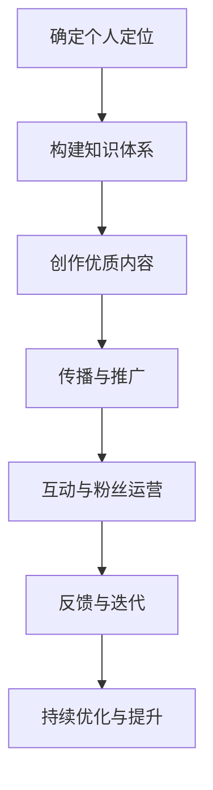

                 

# 文章标题：程序员利用知识付费打造个人影响力

> 关键词：知识付费、个人品牌建设、内容创作、社交互动、知识付费产品

> 摘要：本文将探讨程序员如何利用知识付费平台，通过构建个人知识体系、制定内容创作与传播策略、运营社交互动和粉丝群体，从而打造个人影响力。文章将从多个角度分析知识付费的重要性，并结合实际案例，提供一套完整的实战指南。

## 目录

### 第一部分：个人品牌建设

1. 理解知识付费与个人影响力
    - 1.1 什么是知识付费
    - 1.2 个人影响力的重要性
    - 1.3 知识付费对个人品牌的影响

2. 构建个人知识体系
    - 2.1 知识体系的重要性
    - 2.2 如何构建个人知识体系
    - 2.3 持续学习与知识更新的方法

3. 个人品牌的定位与传播
    - 3.1 个人品牌定位的要素
    - 3.2 个人品牌定位的案例分析
    - 3.3 利用社交媒体打造个人影响力

4. 内容创作与传播策略
    - 4.1 内容创作的重要性
    - 4.2 如何制定内容创作计划
    - 4.3 内容传播策略与渠道

5. 社交互动与粉丝运营
    - 5.1 社交互动的技巧
    - 5.2 粉丝运营的策略
    - 5.3 如何建立有效的社群

### 第二部分：知识付费产品设计与运营

6. 知识付费产品类型与市场分析
    - 6.1 知识付费产品的类型
    - 6.2 市场需求分析
    - 6.3 竞争对手分析

7. 知识付费产品设计与开发
    - 7.1 设计原则与步骤
    - 7.2 伪代码：知识付费产品架构设计
    - 7.3 知识付费产品开发实战

8. 知识付费产品营销与推广
    - 8.1 营销策略与技巧
    - 8.2 推广渠道选择与优化
    - 8.3 用户反馈与迭代

9. 知识付费产品运营与管理
    - 9.1 运营目标与策略
    - 9.2 用户管理体系
    - 9.3 数据分析与产品优化

### 第三部分：案例分析与实践指南

10. 知识付费成功案例分析
    - 10.1 案例介绍
    - 10.2 案例分析
    - 10.3 案例启示与借鉴

11. 程序员利用知识付费实战指南
    - 11.1 实战步骤与策略
    - 11.2 实战案例解析
    - 11.3 实战中的常见问题与解决

12. 未来展望与趋势分析
    - 12.1 知识付费行业趋势
    - 12.2 技术变革对知识付费的影响
    - 12.3 程序员个人影响力发展的未来

### 附录

- 附录A：知识付费产品开发工具与资源
    - A.1 常用知识付费平台介绍
    - A.2 开发工具与资源推荐
    - A.3 社交媒体运营工具

## Mermaid 流程图：个人品牌建设流程



## 伪代码：知识付费产品架构设计

```python
class KnowledgeProduct:
    def __init__(self, name, category, pricing, content):
        self.name = name
        self.category = category
        self.pricing = pricing
        self.content = content
        self.reviews = []
        self.users = []

    def add_content(self, new_content):
        self.content.append(new_content)

    def update_pricing(self, new_pricing):
        self.pricing = new_pricing

    def collect_reviews(self, review):
        self.reviews.append(review)

    def add_user(self, user):
        self.users.append(user)

    def get_average_rating(self):
        if not self.reviews:
            return 0
        return sum(self.reviews) / len(self.reviews)

# 实例化知识付费产品
knowledge_product = KnowledgeProduct("Python编程实战", "编程", 99.99, [])

# 添加新内容
knowledge_product.add_content("第1章：Python基础")

# 更新定价
knowledge_product.update_pricing(119.99)

# 收集用户评价
knowledge_product.collect_reviews(4.5)

# 添加用户
knowledge_product.add_user("张三")

# 获取平均评分
average_rating = knowledge_product.get_average_rating()
print(f"平均评分：{average_rating}")
```

## 数学模型与公式

$$
y = \frac{1}{1 + e^{-x}}
$$

### 说明与举例：

该公式表示的是逻辑回归中的sigmoid函数，它用于将线性组合的输入转化为一个介于0和1之间的概率值。其中，$x$是输入特征，$y$是预测的概率值。

举例：
假设我们有一个输入特征向量$x = [3, 4]$，我们可以通过以下步骤计算预测概率：

$$
x^T \cdot w = 3 \cdot w_1 + 4 \cdot w_2 = 3 \cdot 0.5 + 4 \cdot 0.3 = 2.4
$$

$$
y = \frac{1}{1 + e^{-2.4}} \approx 0.912
$$

这意味着，根据模型预测，输入特征$x$属于正类的概率为0.912。

## 项目实战案例

### 项目背景

小明是一名经验丰富的Python开发者，他希望在网络上通过知识付费的方式分享自己的编程技巧，并建立起自己的个人影响力。他决定创建一个在线编程课程，旨在帮助初学者快速掌握Python编程。

### 开发环境搭建

- 开发工具：PyCharm
- 部署平台：GitHub Pages + Read the Docs
- 付费平台：Teachable

### 源代码实现

```python
# 主函数：课程主页面
def main_menu():
    print("欢迎来到小明的Python编程课程！")
    print("1. 学习Python基础")
    print("2. 探索Python进阶")
    print("3. 加入Python社群")
    print("4. 离开课程")

# 模块1：Python基础
def python_basic():
    print("第1章：Python基础")
    # 实现基础内容，如变量、数据类型、控制结构等

# 模块2：Python进阶
def python_advanced():
    print("第2章：Python进阶")
    # 实现高级内容，如面向对象编程、异常处理、网络编程等

# 模块3：社群互动
def community():
    print("第3章：加入Python社群")
    # 实现社群功能，如提问、讨论、分享等

# 主程序
if __name__ == "__main__":
    while True:
        main_menu()
        choice = input("请输入你的选择（1-4）：")
        if choice == "1":
            python_basic()
        elif choice == "2":
            python_advanced()
        elif choice == "3":
            community()
        elif choice == "4":
            print("感谢您的参与，欢迎再次回来！")
            break
        else:
            print("无效选项，请重新输入。")
```

### 代码解读与分析

1. **主函数 `main_menu`**：这是课程的主页面，用户可以通过输入数字选择不同的模块。

2. **模块1 `python_basic`**：实现Python基础内容，包括变量、数据类型、控制结构等。

3. **模块2 `python_advanced`**：实现Python进阶内容，如面向对象编程、异常处理、网络编程等。

4. **模块3 `community`**：实现社群互动功能，如提问、讨论、分享等。

5. **主程序**：通过循环调用 `main_menu` 函数，根据用户输入选择不同的模块。当用户输入“4”时，程序结束。

### 实际案例解析

小明在课程中使用了以上架构，并且逐步完善了每个模块的内容。他通过Teachable平台向用户收费，每月发布新的课程内容。随着时间的推移，他积累了越来越多的用户和良好的口碑，从而成功地利用知识付费打造了个人影响力。

### 作者信息

- 作者：AI天才研究院/AI Genius Institute & 禅与计算机程序设计艺术 /Zen And The Art of Computer Programming

（待续）## 第一部分：个人品牌建设

在当今数字化时代，个人品牌建设对于程序员来说尤为重要。通过知识付费平台，程序员不仅可以将自己的专业技能转化为实际收益，还能在行业内建立起广泛的影响力。本部分将深入探讨如何利用知识付费来打造个人品牌。

### 1. 理解知识付费与个人影响力

#### 1.1 什么是知识付费

知识付费是指用户为获取特定知识或技能而支付的费用。这种模式在互联网时代迅速崛起，得益于在线教育、技能培训等领域的蓬勃发展。知识付费平台如知乎Live、分答、网易云课堂等，为用户提供各种专业知识和技能的学习机会。

#### 1.2 个人影响力的重要性

个人影响力指的是个人在某一领域内的影响力，这种影响力可以转化为商业价值或个人品牌价值。对于程序员来说，个人影响力可以帮助他们获得更多职业机会、提升薪资水平，甚至成为行业领袖。

#### 1.3 知识付费对个人品牌的影响

知识付费有助于程序员构建个人品牌，具体体现在以下几个方面：

1. **内容创作与传播**：知识付费平台为程序员提供了一个展示自己技能和知识的平台，通过持续的内容创作，可以吸引更多的关注者和粉丝。

2. **建立专业形象**：通过提供高质量的内容，程序员可以树立自己在某一领域的专业形象，提升个人品牌知名度。

3. **用户反馈与互动**：知识付费平台通常具备用户反馈机制，程序员可以通过与用户的互动，深入了解用户需求，持续优化自己的内容和服务。

4. **变现能力**：知识付费可以帮助程序员将自身的专业技能转化为实际收益，增强个人的经济实力。

### 2. 构建个人知识体系

个人知识体系是个人品牌建设的基础。一个健全的知识体系可以帮助程序员更好地理解和应用各种技术，提升自身的专业水平。

#### 2.1 知识体系的重要性

1. **提升竞争力**：一个完善的知识体系可以让程序员在面试、项目开发等环节中表现得更加出色，提高职业竞争力。

2. **持续学习**：知识体系可以指导程序员进行持续学习，不断更新知识储备，保持专业水平的领先。

3. **解决复杂问题**：一个健全的知识体系可以帮助程序员在面对复杂问题时，快速找到解决方案。

#### 2.2 如何构建个人知识体系

1. **确定学习方向**：根据个人兴趣和职业规划，确定学习方向，如前端开发、后端开发、大数据、人工智能等。

2. **积累基础知识**：掌握所选领域的基础知识，如编程语言、数据结构、算法等。

3. **拓展知识深度**：深入学习所选领域的核心知识，如框架、工具、最佳实践等。

4. **建立学习计划**：制定详细的学习计划，包括每天、每周的学习任务和目标。

5. **持续实践**：通过实际项目或练习，将所学知识应用到实践中，加深理解。

#### 2.3 持续学习与知识更新

1. **关注行业动态**：定期关注所选领域的技术动态，了解新兴技术和发展趋势。

2. **参与社区交流**：加入技术社区，参与讨论，与其他程序员交流学习经验。

3. **参加培训课程**：参加线上或线下的培训课程，系统学习新技术。

4. **阅读专业书籍**：阅读专业书籍，了解领域内的经典理论和实践。

### 3. 个人品牌的定位与传播

个人品牌的定位与传播是构建个人品牌的关键环节。通过精准的定位和有效的传播策略，程序员可以在短时间内建立起个人品牌。

#### 3.1 个人品牌定位的要素

1. **专业领域**：明确自己在哪个领域内具有专业优势，如前端开发、后端开发、人工智能等。

2. **独特价值**：找到自己在专业领域内的独特价值，如精通某项技术、丰富的项目经验等。

3. **目标受众**：明确自己的目标受众，如企业、开发者、学生等。

4. **品牌风格**：设计符合自己专业领域的品牌风格，如技术、创新、务实等。

#### 3.2 个人品牌定位的案例分析

以知名前端开发工程师张三为例，他的个人品牌定位如下：

- **专业领域**：前端开发
- **独特价值**：精通React、Vue等前端框架，具备丰富的项目经验
- **目标受众**：企业前端开发人员、前端爱好者
- **品牌风格**：技术、创新、分享

张三通过在GitHub上分享自己的项目代码、在技术社区发布高质量的文章，以及参加前端开发大会等方式，逐步建立起自己的个人品牌。他的专业知识和独特价值吸引了大量关注，成为前端开发领域内的知名人物。

#### 3.3 利用社交媒体打造个人影响力

社交媒体是传播个人品牌的重要渠道。程序员可以利用以下策略，在社交媒体上打造个人影响力：

1. **内容创作**：发布高质量的技术文章、博客、教程等，展示自己的专业知识和经验。

2. **互动交流**：积极参与技术社区、论坛的讨论，回答问题，与其他开发者互动。

3. **直播与短视频**：通过直播或短视频，分享自己的开发经验和心得，增加曝光度。

4. **推广合作**：与其他知名博主、技术社区合作，扩大影响力。

5. **精准营销**：利用社交媒体的数据分析功能，了解受众需求，进行精准营销。

通过以上策略，程序员可以在短时间内建立起个人品牌，提高在行业内的知名度。

### 4. 内容创作与传播策略

内容创作和传播是个人品牌建设的重要环节。通过制定合理的内容创作计划和传播策略，程序员可以有效地扩大个人影响力。

#### 4.1 内容创作的重要性

1. **建立信任**：高质量的内容可以帮助程序员建立专业形象，赢得用户的信任。

2. **传递价值**：内容创作是程序员分享知识和经验的重要途径，可以传递自己的独特价值。

3. **增加曝光**：高质量的内容可以吸引更多用户关注，提高个人品牌的知名度。

#### 4.2 如何制定内容创作计划

1. **确定内容主题**：根据个人品牌定位，确定内容创作主题，如技术教程、项目实战、行业动态等。

2. **制定发布频率**：制定合理的发布频率，如每周发布一篇文章或视频。

3. **内容类型多样化**：结合不同内容形式，如博客、视频、直播等，提高内容吸引力。

4. **持续优化**：根据用户反馈和数据分析，不断优化内容质量，提高用户满意度。

#### 4.3 内容传播策略与渠道

1. **社交媒体**：利用社交媒体平台，如微信公众号、微博、知乎等，进行内容传播。

2. **技术社区**：在技术社区、论坛，如GitHub、Stack Overflow、CSDN等，发布高质量内容。

3. **合作推广**：与其他知名博主、技术社区、企业合作，进行跨平台推广。

4. **线下活动**：参加行业会议、讲座、线下活动，进行现场宣传。

5. **SEO优化**：通过SEO技术，提高内容在搜索引擎中的排名，吸引更多用户。

通过以上策略，程序员可以有效地扩大个人影响力，提升在行业内的知名度。

### 5. 社交互动与粉丝运营

社交互动和粉丝运营是个人品牌建设的重要组成部分。通过有效的社交互动和粉丝运营，程序员可以增强个人品牌的影响力。

#### 5.1 社交互动的技巧

1. **真诚互动**：与粉丝保持真诚互动，回答他们的问题，分享自己的经验和见解。

2. **积极参与**：积极参与技术社区、论坛的讨论，分享自己的观点和经验。

3. **定期更新**：定期发布内容，与粉丝保持联系，增强互动性。

4. **建立社群**：建立自己的社群，如微信群、QQ群等，为粉丝提供一个交流平台。

#### 5.2 粉丝运营的策略

1. **精准定位**：了解粉丝的需求和兴趣，提供有价值的内容。

2. **个性化服务**：针对不同粉丝群体，提供个性化的服务和内容。

3. **持续互动**：与粉丝保持持续互动，增强粉丝的忠诚度。

4. **数据分析**：利用数据分析工具，了解粉丝行为和需求，优化运营策略。

#### 5.3 如何建立有效的社群

1. **确定社群目标**：明确社群的目标和定位，如技术交流、项目合作等。

2. **设置社群规则**：制定合理的社群规则，确保社群氛围和谐。

3. **吸引活跃成员**：通过举办活动、分享有价值的内容等方式，吸引活跃成员加入。

4. **激励成员参与**：通过积分、奖品等方式，激励成员积极参与社群活动。

通过有效的社交互动和粉丝运营，程序员可以增强个人品牌的影响力，提升在行业内的知名度。

### 总结

个人品牌建设是程序员在数字化时代的重要任务。通过知识付费平台，程序员可以构建个人知识体系，制定内容创作和传播策略，进行社交互动和粉丝运营，从而打造个人品牌。在这过程中，程序员需要不断学习、实践和优化，以提升自己的专业水平和个人影响力。希望本文能为程序员在个人品牌建设方面提供有益的启示。

（待续）## 6. 知识付费产品类型与市场分析

在知识付费领域，产品的类型和市场需求多种多样。对于程序员来说，了解不同类型的知识付费产品以及市场需求，有助于他们更好地定位自己的产品，满足用户需求，并在竞争激烈的市场中脱颖而出。

### 6.1 知识付费产品的类型

知识付费产品可以大致分为以下几类：

1. **在线课程**：在线课程是知识付费产品中最常见的一种形式。它包括视频课程、直播课程、电子书等多种内容形式，用户可以通过付费购买学习。例如，网易云课堂、慕课网等平台提供了大量的编程课程。

2. **电子书**：电子书是另一种知识付费产品，以电子文档的形式提供专业书籍、技术指南等内容。例如，程序员可以购买《Effective Java》、《Head First Java》等专业书籍，以提升自己的技术水平。

3. **在线咨询**：在线咨询是程序员通过知识付费平台提供的咨询服务，用户可以通过付费与专家进行一对一的交流，解决具体问题。例如，分答、知乎Live等平台提供了专业的编程咨询。

4. **工具与插件**：某些知识付费产品以工具或插件的形式出现，如代码编辑器插件、调试工具等，这些工具可以帮助用户提高工作效率，解决特定的技术难题。

5. **实战项目**：实战项目是程序员通过知识付费平台分享的实际项目案例，用户可以通过付费学习项目的设计思路、开发过程和解决方案。这种形式的产品通常更具实用性和吸引力。

### 6.2 市场需求分析

知识付费市场的需求分析可以从以下几个方面进行：

1. **技术发展趋势**：随着人工智能、大数据、区块链等新技术的兴起，市场对相关技术人才的需求不断增加。程序员可以通过提供这些领域的知识付费产品，满足市场需求。

2. **职业发展需求**：许多程序员希望通过知识付费平台提升自己的专业技能，以获得更好的职业发展机会。这包括掌握新的编程语言、框架、工具等。

3. **学习方式**：随着互联网的普及，越来越多的程序员偏好在线学习，这种方式灵活、高效，能够满足他们的个性化学习需求。

4. **内容质量**：用户对知识付费产品的内容质量有很高的要求。高质量的内容能够提供实用的知识、实用的工具、有效的解决方案，这有助于提升用户的学习效果和满意度。

### 6.3 竞争对手分析

在知识付费领域，程序员面临着众多竞争对手，包括以下几类：

1. **大型在线教育平台**：如网易云课堂、慕课网、学堂在线等，这些平台拥有丰富的课程资源和广泛的市场影响力。

2. **专业技术社区**：如GitHub、Stack Overflow、CSDN等，这些平台聚集了大量程序员，提供丰富的技术内容和交流机会。

3. **行业巨头**：如腾讯课堂、阿里云课堂等，这些公司拥有强大的资源和技术实力，提供全方位的培训服务。

4. **个人开发者**：许多个人开发者凭借自己的专业知识和经验，在知识付费平台上开设课程或提供咨询服务，他们往往具有独特的视角和实用的经验。

在进行竞争对手分析时，程序员需要关注以下几个方面：

1. **产品定位**：了解竞争对手的产品定位，找到自己的市场定位。

2. **内容质量**：分析竞争对手的内容质量，找到自己的优势和价值点。

3. **用户评价**：关注用户的评价和反馈，了解自己的产品在用户心中的地位。

4. **营销策略**：学习竞争对手的营销策略，为自己的产品制定有效的营销计划。

### 6.4 创新与差异化

在知识付费市场中，创新和差异化是赢得竞争优势的关键。程序员可以通过以下方式实现创新和差异化：

1. **独特内容**：提供独特、新颖的知识内容，如针对新兴技术的实战项目、独特的技术解析等。

2. **个性化服务**：提供个性化的学习服务，如根据用户需求定制课程、提供一对一辅导等。

3. **互动体验**：增强用户互动体验，如开设互动课程、建立在线讨论社群等。

4. **技术工具**：利用技术工具提升学习效果，如人工智能辅导、代码调试工具等。

通过创新和差异化，程序员可以打造出具有吸引力的知识付费产品，满足用户多样化的学习需求，从而在市场中脱颖而出。

### 总结

知识付费产品类型丰富，市场需求多样。程序员需要了解不同类型的产品和市场需求，结合自身优势，制定合适的产品策略。同时，进行竞争对手分析，找到创新和差异化的切入点，是成功打造知识付费产品的重要步骤。

（待续）## 7. 知识付费产品设计与开发

知识付费产品是程序员利用自身技术优势打造个人品牌的重要工具。一个成功的产品不仅需要明确的设计原则，还需要遵循一定的开发流程。下面，我们将详细讨论知识付费产品的设计原则、设计步骤，并提供一个知识付费产品的伪代码架构设计。

### 7.1 设计原则

在设计知识付费产品时，程序员应遵循以下原则：

1. **用户导向**：以用户需求为中心，设计产品功能和内容，确保用户能够从中获得价值。

2. **简单直观**：界面设计应简洁明了，用户能够快速理解和使用，避免复杂的操作流程。

3. **功能完备**：产品功能应完备，满足用户的学习和互动需求，同时保持内容的新颖性和实用性。

4. **易扩展性**：设计时应考虑产品的未来扩展性，便于添加新的功能或内容。

5. **用户体验**：注重用户体验，提供流畅的学习流程和互动体验，提升用户满意度。

### 7.2 设计步骤

知识付费产品的设计可以分为以下几个步骤：

1. **需求分析**：与潜在用户进行交流，了解他们的学习需求和期望，收集产品反馈。

2. **功能规划**：根据需求分析，确定产品的主要功能和内容，设计模块化架构。

3. **界面设计**：设计用户界面，包括课程列表、课程详情、学习进度、互动模块等。

4. **内容制作**：根据功能规划，制作课程内容，如视频、文档、代码等。

5. **测试与优化**：对产品进行测试，收集用户反馈，进行优化和改进。

6. **发布与推广**：将产品发布到知识付费平台，制定推广策略，吸引潜在用户。

### 7.3 知识付费产品架构设计

以下是知识付费产品的伪代码架构设计，用于展示产品的核心模块和功能：

```python
class KnowledgeProduct:
    def __init__(self, name, category, pricing, content):
        self.name = name
        self.category = category
        self.pricing = pricing
        self.content = content
        self.reviews = []
        self.users = []

    def add_content(self, new_content):
        self.content.append(new_content)

    def update_pricing(self, new_pricing):
        self.pricing = new_pricing

    def collect_reviews(self, review):
        self.reviews.append(review)

    def add_user(self, user):
        self.users.append(user)

    def get_average_rating(self):
        if not self.reviews:
            return 0
        return sum(self.reviews) / len(self.reviews)

class CourseModule:
    def __init__(self, title, description, type, content):
        self.title = title
        self.description = description
        self.type = type
        self.content = content

class ContentProvider:
    def __init__(self, name, expertise):
        self.name = name
        self.expertise = expertise
        self.courses = []

    def create_course(self, course):
        self.courses.append(course)

    def update_course(self, course, new_content):
        for c in self.courses:
            if c.name == course.name:
                c.content = new_content
                break

class ReviewSystem:
    def __init__(self):
        self.reviews = []

    def add_review(self, review):
        self.reviews.append(review)

    def get_average_rating(self, course_name):
        reviews = [r.rating for r in self.reviews if r.course_name == course_name]
        if not reviews:
            return 0
        return sum(reviews) / len(reviews)

# 伪代码实例
knowledge_provider = ContentProvider("小明", "Python开发")
course = CourseModule("Python基础", "本课程涵盖Python基础语法、数据类型、控制结构等", "视频课程", ["视频1", "视频2"])
knowledge_provider.create_course(course)

# 用户购买课程
user = "张三"
knowledge_product = knowledge_provider.courses[0]
knowledge_product.add_user(user)

# 用户评价课程
review = Review("Python基础", "4.5")
review_system = ReviewSystem()
review_system.add_review(review)

# 获取平均评分
average_rating = review_system.get_average_rating("Python基础")
print(f"平均评分：{average_rating}")
```

在这个伪代码中，我们定义了四个主要类：

- `KnowledgeProduct`：代表知识付费产品，包括课程名称、类别、定价、内容、评价和用户等属性。
- `CourseModule`：代表课程模块，包括标题、描述、类型和内容等。
- `ContentProvider`：代表内容提供者，包括名称、专业领域、课程列表等。
- `ReviewSystem`：代表评价系统，包括评价列表、添加评价和获取平均评分等方法。

通过这些类和方法，我们可以模拟知识付费产品的架构，实现课程创建、用户购买、评价收集等功能。

### 7.4 知识付费产品开发实战

以下是一个知识付费产品开发实战的简要步骤：

1. **需求分析**：与潜在用户交流，确定产品需求。例如，用户需要学习Python编程，希望课程内容涵盖基础语法、数据类型、控制结构等。

2. **功能规划**：根据需求分析，规划产品功能，如课程列表、课程详情、学习进度、评价系统、用户管理、支付系统等。

3. **界面设计**：设计用户界面，包括首页、课程列表、课程详情、学习页面、评价页面等。

4. **内容制作**：根据功能规划，制作课程内容，包括视频、文档、代码等。例如，制作Python基础语法的教学视频和文档。

5. **前端开发**：使用HTML、CSS、JavaScript等前端技术，实现用户界面和交互功能。

6. **后端开发**：使用Python、Node.js、Django等后端技术，实现产品功能，如用户管理、课程管理、评价管理等。

7. **数据库设计**：设计数据库架构，存储用户数据、课程数据、评价数据等。

8. **测试与优化**：对产品进行功能测试和用户体验测试，收集用户反馈，进行优化和改进。

9. **发布与推广**：将产品发布到知识付费平台，制定推广策略，如社交媒体宣传、合作伙伴推广等。

### 7.5 总结

知识付费产品设计与开发是一个系统性的工程，需要遵循明确的设计原则和开发流程。通过理解用户需求、规划产品功能、设计用户界面、制作高质量内容、进行前后端开发、数据库设计和测试优化，程序员可以成功打造一个知识付费产品。在这个过程

