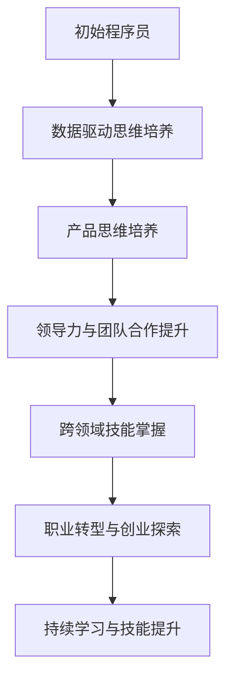

                 

# 程序员在知识经济时代的角色升级与重塑

> 关键词：知识经济、程序员角色、技能升级、职业发展、技术创新

> 摘要：本文探讨了知识经济时代对程序员角色的深刻影响，分析了程序员在当前时代面临的机遇与挑战，以及如何通过技能升级、角色转型和终身学习来实现职业发展。文章还结合实际案例，深入讲解了程序员在知识经济时代所需的软技能和跨领域技能，为程序员提供了职业转型的策略和路径。

## 引言

知识经济时代，以知识为主要生产要素的经济形态正在逐步取代传统的以物质资源为主的经济发展模式。在这个时代，信息技术、人工智能、大数据等新兴技术的快速发展，为程序员提供了前所未有的机遇。然而，机遇与挑战并存，程序员需要不断提升自身技能，实现角色升级与重塑，才能在知识经济时代中立于不败之地。

本文将从以下几个方面展开讨论：

1. 知识经济时代的背景与挑战
2. 程序员的技能图谱
3. 程序员的角色转型
4. 终身学习与职业成长
5. 软技能的提升
6. 职业转型与创业探索
7. 案例研究
8. 核心概念与联系
9. 核心算法原理讲解
10. 数学模型与公式讲解
11. 项目实战
12. 行业趋势与未来展望
13. 结语

希望通过本文的讨论，能够为程序员在知识经济时代的职业发展提供有益的启示和指导。

## 第1章：知识经济时代的背景与挑战

### 1.1 知识经济时代的崛起

知识经济时代的崛起，可以追溯到20世纪末。随着互联网技术的迅猛发展，全球信息流动速度加快，知识和信息的生产、传播和利用成为经济增长的主要动力。与传统经济形态不同，知识经济以知识为主要生产要素，通过不断创新和知识共享，推动经济的持续增长。

知识经济的核心特征主要体现在以下几个方面：

1. **信息技术的高度依赖**：知识经济的兴起，离不开信息技术的支撑。互联网、云计算、大数据、人工智能等技术的广泛应用，使得信息获取和处理更加便捷，极大地提高了生产效率。

2. **知识创新的引领**：知识经济强调知识创新的重要性，鼓励人们不断探索新的知识领域，通过创新推动科技进步和社会发展。

3. **知识共享与合作**：知识经济强调知识的共享与合作，通过知识共享平台和协作机制，实现知识的高效利用和传播。

4. **人才培养和培训**：知识经济时代，人才的素质和技能成为核心竞争力。企业和个人需要不断学习和更新知识，以适应快速变化的经济环境。

### 1.2 程序员面临的机遇与挑战

在知识经济时代，程序员面临着前所未有的机遇和挑战：

#### 机遇分析：

1. **技术需求增加**：随着知识经济的发展，对信息技术和软件的需求日益增加，程序员的市场需求持续增长。

2. **新兴技术发展**：人工智能、大数据、区块链等新兴技术的快速发展，为程序员提供了丰富的技术实践和应用场景。

3. **职业发展空间**：程序员不仅可以从事传统的软件开发工作，还可以向产品经理、数据分析师、项目经理等角色转型，职业发展空间更加广阔。

#### 挑战分析：

1. **技术更新速度快**：知识经济时代，技术更新速度加快，程序员需要不断学习新的技术和工具，以保持竞争力。

2. **知识积累与共享难度大**：知识经济强调知识的积累与共享，但对于程序员来说，如何高效地积累和共享知识仍然是一个挑战。

3. **职业压力与竞争**：随着程序员市场的不断扩大，竞争也日益激烈，程序员需要不断提升自身技能，以应对职业压力和竞争。

#### 如何应对挑战：

1. **终身学习**：程序员需要树立终身学习的理念，不断学习新的技术和知识，以适应快速变化的经济环境。

2. **跨界合作**：通过跨界合作，拓宽自己的技能领域，提高综合素质，增强竞争力。

3. **积极应对变化**：面对技术更新和市场竞争，程序员需要保持积极的态度，勇于接受新挑战，不断提升自己。

### 1.3 知识经济的核心要素

知识经济的核心要素主要包括技术创新、信息交流、知识积累与共享等方面：

1. **技术创新**：技术创新是知识经济的核心驱动力，通过不断创新，推动科技进步和社会发展。

2. **信息交流**：信息交流是知识经济的基础，通过互联网和现代通信技术，实现信息的高效传递和利用。

3. **知识积累与共享**：知识积累与共享是知识经济的核心要素，通过知识共享平台和协作机制，实现知识的高效利用和传播。

4. **人才培养和培训**：人才培养和培训是知识经济的关键环节，通过教育和培训，提升人才的素质和技能。

总之，知识经济时代的到来，为程序员带来了机遇和挑战。程序员需要抓住机遇，应对挑战，通过技能升级、角色转型和终身学习，实现职业发展。

### 第2章：程序员的技能图谱

在知识经济时代，程序员的角色和技能要求发生了深刻的变化。为了在激烈的市场竞争中脱颖而出，程序员需要掌握一系列核心技能，并具备跨领域的能力。本章节将详细探讨程序员的技能图谱，包括核心技能、新兴技术的掌握以及跨领域技能的重要性。

#### 2.1 程序员的核心技能

程序员的核心技能主要包括以下几个方面：

1. **编程语言**：熟练掌握一种或多种编程语言，如Java、Python、C++等，是程序员的基本要求。不同的编程语言适用于不同的应用场景，程序员需要根据项目需求选择合适的编程语言。

2. **数据结构与算法**：数据结构和算法是程序员解决问题的基石。通过掌握常见的算法和数据结构，如排序算法、查找算法、树、图等，程序员能够高效地解决复杂问题。

3. **软件开发流程**：熟悉软件开发流程，包括需求分析、系统设计、编码、测试和部署等，是程序员的基本素养。遵循良好的软件开发规范和流程，能够提高项目的开发效率和质量。

#### 2.2 新兴技术的掌握

随着知识经济的发展，新兴技术不断涌现，程序员需要掌握这些新技术，以适应不断变化的技术环境。以下是一些重要的新兴技术：

1. **人工智能**：人工智能（AI）技术正在改变各个行业，程序员需要掌握基本的机器学习、深度学习算法，以及相关的编程框架和工具，如TensorFlow、PyTorch等。

2. **大数据**：大数据技术的应用越来越广泛，程序员需要了解大数据的基本原理，掌握Hadoop、Spark等大数据处理工具，能够处理和分析大规模数据集。

3. **区块链**：区块链技术以其去中心化、安全性和透明性等特点，受到广泛关注。程序员需要了解区块链的基本原理，掌握智能合约和分布式应用开发。

#### 2.3 跨领域技能的重要性

在知识经济时代，单一的编程技能已经无法满足市场的需求。跨领域技能的重要性日益凸显，程序员需要具备以下跨领域技能：

1. **业务理解**：程序员需要具备一定的业务背景，了解所从事行业的业务流程和需求，能够更好地与业务团队沟通，提供更贴近业务需求的解决方案。

2. **项目管理**：随着项目的复杂度增加，程序员需要掌握基本的项目管理知识，如项目计划、资源分配、风险管理等，能够有效地管理项目进度和质量。

3. **领导力和团队协作**：在知识经济时代，程序员往往需要承担更多的责任和角色，具备领导力和团队协作能力，能够带领团队高效完成项目。

总之，程序员在知识经济时代需要不断学习和更新技能，掌握核心技能和新兴技术，同时具备跨领域的能力，才能在竞争中脱颖而出，实现职业发展。

#### 第3章：程序员的角色转型

在知识经济时代，程序员的角色正经历着深刻的变革。传统的编程角色逐渐演变为数据驱动思维、产品思维和领导力与团队合作等多重角色。本章将详细探讨程序员如何实现这些角色的转型。

##### 3.1 数据驱动思维

数据驱动思维是指将数据作为决策的核心依据，通过数据分析来指导业务发展和产品优化。在知识经济时代，数据已经成为新的生产要素，程序员需要培养数据驱动思维，具体包括以下几个方面：

1. **数据分析基础**：程序员需要掌握基本的统计分析方法，如均值、方差、回归分析等，能够从数据中提取有价值的信息。

2. **数据处理技能**：熟悉数据处理工具和库，如Pandas、NumPy等，能够高效地处理和分析大规模数据。

3. **数据可视化**：通过数据可视化工具，如Matplotlib、Seaborn等，将数据转化为易于理解和分析的可视化图表。

4. **数据驱动决策**：在实际项目中，程序员需要将数据分析结果应用于业务决策，如用户行为分析、需求预测等。

##### 3.2 产品思维

产品思维是指将程序员的角色从技术实现者转变为产品开发者，注重用户需求和市场反馈，以用户为中心进行产品设计和开发。以下是如何从程序员转变为产品经理的几个步骤：

1. **了解用户需求**：程序员需要深入理解用户需求，通过用户调研、用户访谈等方式收集用户反馈，为产品设计提供依据。

2. **产品需求分析**：在产品开发过程中，程序员需要参与产品需求分析，明确产品的功能、性能和用户体验要求。

3. **产品设计**：程序员需要掌握产品设计的基本原则和方法，如用户体验设计（UX Design）、交互设计（UI Design）等，能够参与产品的界面设计和流程优化。

4. **持续迭代**：产品思维强调持续迭代和优化，程序员需要积极参与产品的迭代过程，根据用户反馈和市场变化进行产品优化。

##### 3.3 领导力与团队合作

在知识经济时代，程序员往往需要承担更多的责任和角色，具备领导力和团队合作能力至关重要。以下是如何提升领导力和团队合作能力的建议：

1. **明确目标**：作为团队领导者，程序员需要明确团队的目标和任务，确保团队成员理解并朝着共同的目标努力。

2. **沟通与协作**：良好的沟通和协作能力是领导者必备的素质。程序员需要学会倾听、表达和协调，确保团队内部的顺畅沟通和协作。

3. **激励团队**：领导者需要激励团队成员，关注团队成员的成长和需求，提供支持和资源，帮助团队成员实现个人和团队的目标。

4. **解决冲突**：在团队工作中，难免会出现冲突。程序员需要具备解决冲突的能力，通过有效的沟通和协商，找到解决问题的最佳方法。

5. **培养团队文化**：领导者需要培养积极的团队文化，鼓励团队成员之间的互助合作，营造一个和谐、积极的工作环境。

总之，程序员在知识经济时代的角色转型是一个持续的过程，需要不断学习和实践。通过培养数据驱动思维、产品思维和领导力与团队合作能力，程序员可以更好地适应知识经济时代的需求，实现职业发展。

#### 第4章：终身学习与职业成长

在知识经济时代，技术更新速度不断加快，程序员需要具备终身学习的意识，以保持自身的竞争力。终身学习不仅是个人成长的动力，也是职业发展的关键。本章将探讨终身学习的必要性、职业发展规划以及学习资源与工具。

##### 4.1 终身学习的必要性

在知识经济时代，技术迭代速度极快，新的编程语言、框架、工具层出不穷。对于程序员来说，只有不断学习新知识，才能跟上时代的步伐，不被淘汰。以下是终身学习的必要性：

1. **技术更新速度加快**：随着人工智能、大数据、云计算等新兴技术的发展，程序员需要不断学习新的技术，以适应不断变化的技术环境。

2. **职业发展需求**：在竞争激烈的职场中，程序员需要不断提升自己的技能，才能获得更好的职业机会和更高的薪资待遇。

3. **知识积累与共享**：终身学习有助于程序员积累丰富的知识，并通过知识共享平台，将所学知识传授给他人，实现知识的传播和共享。

##### 4.2 职业发展规划

职业发展规划是程序员实现职业成长的重要环节。一个明确的职业规划有助于程序员有针对性地学习新技能，实现职业目标。以下是制定职业发展规划的步骤：

1. **自我评估**：了解自己的兴趣、优势和劣势，明确自己的职业目标和发展方向。

2. **技能评估**：评估当前掌握的技能，找出需要提升的领域，制定学习计划。

3. **目标设定**：设定短期和长期职业目标，如成为某一技术领域的专家、晋升为项目经理等。

4. **学习计划**：根据职业目标，制定详细的学习计划，包括学习资源、学习时间安排等。

5. **执行与调整**：按照学习计划执行，定期评估学习效果，根据实际情况调整学习计划。

##### 4.3 学习资源与工具

在终身学习的过程中，选择合适的学习资源与工具至关重要。以下是几个常用的学习资源与工具：

1. **在线学习平台**：如Coursera、edX、Udacity等，提供丰富的在线课程，涵盖各种技术领域。

2. **开发工具与软件**：如IntelliJ IDEA、Visual Studio Code等集成开发环境，以及Docker、Kubernetes等容器化工具，帮助程序员进行高效的开发。

3. **开发者社区**：如GitHub、Stack Overflow等，提供技术交流、问题解答和资源分享的平台。

4. **书籍**：经典的技术书籍，如《深度学习》（Goodfellow et al.）、《人工智能：一种现代方法》（Russell & Norvig）等，为程序员提供了深入的知识和指导。

5. **社交媒体与社区资源**：如Twitter、LinkedIn等，通过关注行业专家和技术社区，获取最新的技术动态和行业信息。

总之，终身学习是程序员在知识经济时代保持竞争力的关键。通过制定明确的职业发展规划，并利用丰富的学习资源与工具，程序员可以不断提升自身技能，实现职业成长。

#### 第5章：软技能的提升

在知识经济时代，技术技能虽然重要，但软技能的提升同样关键。良好的沟通技巧、解决问题的能力和自我管理能力，对于程序员在职场中取得成功至关重要。本章将详细探讨这些软技能的提升策略。

##### 5.1 沟通技巧

1. **沟通的重要性**：

在团队合作中，沟通是确保项目顺利进行的关键。有效的沟通可以减少误解和冲突，提高团队协作效率。

2. **沟通的障碍与解决策略**：

   - **误解和歧义**：确保信息传达清晰，使用具体的例子和数据来支持观点。
   - **文化差异**：了解团队成员的文化背景，采用包容性的沟通方式。
   - **技术障碍**：使用专业的技术术语，避免使用模糊的语言。

3. **高效沟通的技巧**：

   - **积极倾听**：倾听是沟通的基础，确保理解对方的观点。
   - **表达清晰**：用简洁明了的语言表达自己的观点，避免使用复杂的术语。
   - **提问和反馈**：通过提问获取更多信息，通过反馈确认沟通效果。

##### 5.2 解决问题的能力

1. **解决问题的重要性**：

在编程和软件开发过程中，遇到问题是常态。具备强大的问题解决能力，可以快速找到问题的根源，并有效地解决问题。

2. **解决问题的方法论**：

   - **问题定义**：明确问题是什么，界定问题的范围。
   - **信息收集**：搜集与问题相关的信息，包括日志、文档和用户反馈。
   - **假设与验证**：提出可能的解决方案，并通过实验和测试进行验证。
   - **迭代优化**：根据验证结果，不断优化解决方案。

3. **提升问题解决能力的策略**：

   - **培养逻辑思维**：通过练习逻辑思维题目，提高问题分析能力。
   - **学习算法设计**：掌握常见的算法设计方法，如分治、动态规划等。
   - **借助工具**：使用调试工具和日志分析工具，辅助问题解决。

##### 5.3 自我管理

1. **自我管理的意义**：

自我管理是程序员提高工作效率、实现个人目标的关键。通过自我管理，程序员可以更好地平衡工作和生活，提高生活质量。

2. **时间管理技巧**：

   - **优先级排序**：根据任务的紧急程度和重要性，进行优先级排序。
   - **时间块**：将工作时间划分为不同的时间块，专注于完成一个任务，减少切换任务的时间成本。
   - **休息与调整**：合理安排休息时间，避免长时间工作导致的疲劳。

3. **提升自我管理的能力**：

   - **制定计划**：每天或每周制定工作计划，明确目标和工作任务。
   - **跟踪进度**：定期检查工作进度，确保按计划进行。
   - **反思与调整**：反思工作过程中的得失，不断调整和优化工作策略。

总之，提升软技能是程序员在知识经济时代实现职业发展的关键。通过培养良好的沟通技巧、解决问题的能力以及自我管理能力，程序员可以更好地适应职场环境，提高工作效率，实现个人和团队的目标。

#### 第6章：职业转型与创业探索

在知识经济时代，程序员不再局限于传统的软件开发角色，他们有机会通过职业转型和创业探索，实现更广阔的发展空间。本章将探讨职业转型的策略、创业思维以及创业资源整合。

##### 6.1 职业转型策略

1. **职业转型的准备**

职业转型需要充分的准备，包括对自身兴趣、优势和市场的调研。以下是一些准备工作：

   - **自我评估**：了解自己的兴趣、优势、职业目标和市场需求，确定转型方向。
   - **技能评估**：评估当前技能水平，确定需要补充和提升的技能。
   - **市场调研**：研究目标行业的趋势、机会和挑战，了解市场需求和竞争状况。

2. **职业转型的路径**

职业转型可以分为以下几种路径：

   - **技术转型**：从技术领域向其他技术领域或相关领域转型，如从Web开发转向移动开发或从后端开发转向前端开发。
   - **管理转型**：从技术角色向管理角色转型，如从工程师向项目经理或技术经理转型。
   - **业务转型**：从技术角色向业务领域转型，如从软件开发向产品管理或业务分析转型。

3. **职业转型的实施**

实施职业转型时，可以采取以下策略：

   - **学习新技能**：通过在线课程、工作坊和自学，学习转型所需的新技能。
   - **积累经验**：在现有职位中积累相关经验，提升技能和经验。
   - **建立人脉**：参加行业会议、社交活动和在线社区，建立人脉网络，获取职业转型的机会。

##### 6.2 创业思维

1. **创业的定义与类型**

创业是指创建一个新企业或业务，以实现商业目标和社会价值。创业类型可以分为以下几种：

   - **传统创业**：创建传统企业，如开设实体店铺或提供服务。
   - **科技创业**：利用科技创新，创建科技公司或应用。
   - **社会创业**：通过创新业务模式解决社会问题，实现商业和社会双重价值。

2. **创业者应具备的素质**

成功的创业者需要具备以下素质：

   - **创新思维**：能够发现市场机会，提出创新的解决方案。
   - **领导力**：能够带领团队，激发团队成员的潜力。
   - **坚韧不拔**：面对挑战和失败时，能够坚持不懈，找到解决问题的方法。
   - **市场意识**：了解市场需求，能够为产品和服务找到合适的定位。

3. **创业思维的培养**

创业思维的培养可以从以下几个方面入手：

   - **阅读和学习**：阅读创业相关的书籍和案例，学习成功创业者的经验。
   - **实践和尝试**：通过实际创业项目或参与创业比赛，积累创业经验。
   - **反思和总结**：不断反思创业过程中的得失，总结经验教训，不断提升创业思维。

##### 6.3 创业资源整合

1. **创业资源的类型**

创业过程中需要整合多种资源，包括资金、人才、市场、技术等。以下是一些常见的创业资源：

   - **资金**：创业所需的资金，可以通过个人储蓄、天使投资、风险投资等渠道获得。
   - **人才**：招聘合适的员工，组建创业团队，发挥各自的专长。
   - **市场**：了解市场需求，为产品和服务找到合适的定位。
   - **技术**：利用先进的技术，为产品提供竞争优势。

2. **融资策略**

创业融资策略包括以下几种：

   - **天使投资**：通过天使投资者获得早期资金支持。
   - **风险投资**：通过风险投资机构获得资金支持，通常适用于有一定市场前景的项目。
   - **众筹**：通过众筹平台，向社会公众筹集资金。
   - **银行贷款**：通过银行贷款获得资金支持，适用于有稳定现金流的项目。

3. **团队建设与管理**

团队建设和管理是创业成功的关键因素，以下是一些建议：

   - **明确目标**：为团队设定清晰的目标，确保团队成员明确方向。
   - **建立信任**：通过有效的沟通和协作，建立团队成员之间的信任关系。
   - **激励与培养**：为团队成员提供激励和培训，激发他们的潜力。
   - **灵活调整**：根据市场变化和团队发展情况，灵活调整团队结构和策略。

总之，职业转型和创业探索为程序员提供了广阔的发展空间。通过制定明确的转型策略、培养创业思维和整合创业资源，程序员可以实现职业发展和创业梦想。

#### 第7章：案例研究

在本章中，我们将通过案例研究来深入探讨程序员在知识经济时代的成功转型和创业探索。通过分析成功案例和创业成功案例，以及失败案例分析，我们可以获得宝贵的经验和教训。

##### 7.1 成功转型案例

**案例介绍**

张明是一名资深程序员，有着多年的Java开发经验。然而，随着知识经济的发展，他意识到单纯的技术能力已经无法满足市场需求，于是决定进行职业转型。

**成功转型的关键要素**

1. **持续学习**：张明利用业余时间学习产品管理和项目管理知识，通过在线课程和实际项目实践，不断提升自己的软技能。

2. **跨界合作**：他积极参加各种行业交流活动，结识了产品经理、项目经理等领域的专业人士，通过跨界合作，拓宽了自己的视野。

3. **项目经验**：在转型过程中，张明积极参与多个跨部门项目，积累了丰富的项目管理经验。

**案例的启示**

张明的成功转型表明，持续学习、跨界合作和积累项目经验是程序员实现职业转型的重要途径。通过不断学习和实践，程序员可以提升自身的综合素质，实现职业发展。

##### 7.2 创业成功案例

**案例介绍**

李华是一名具有人工智能背景的程序员，他敏锐地察觉到人工智能市场的巨大潜力，于是决定创业。

**创业成功的要素**

1. **创新思维**：李华在创业初期，专注于解决行业痛点，提出创新的解决方案。

2. **市场需求**：他通过市场调研，了解用户需求，确保产品符合市场需求。

3. **团队建设**：李华组建了一支由技术专家、产品经理和市场营销人员组成的创业团队，充分发挥各自的优势。

4. **融资策略**：李华通过天使投资和风险投资，获得了足够的资金支持，确保项目的持续发展。

**案例的启示**

创业成功的案例表明，创新思维、市场需求、团队建设和融资策略是创业成功的关键。程序员在创业过程中，需要具备敏锐的市场洞察力、优秀的团队协作能力和有效的融资策略。

##### 7.3 失败案例分析

**案例介绍**

王强是一名有着多年开发经验的程序员，他决定投身创业，但由于多种原因，最终未能成功。

**失败的原因分析**

1. **市场定位不准确**：王强在创业初期，未能准确判断市场需求，导致产品定位不清晰。

2. **团队建设不完善**：团队成员之间的沟通不畅，导致项目进度延误。

3. **资金链断裂**：由于融资策略不当，王强未能及时获得资金支持，导致资金链断裂。

**案例的教训**

失败案例提醒我们，准确的市场定位、完善的团队建设和有效的融资策略是创业成功的关键。程序员在创业过程中，需要避免这些常见问题，确保项目的顺利发展。

通过案例研究，我们可以获得宝贵的经验和教训，为程序员在知识经济时代的职业转型和创业探索提供有益的启示。

### 第8章：核心概念与联系

在程序员的角色转型和职业发展中，核心概念和联系起着至关重要的作用。本章将使用Mermaid流程图展示程序员角色转型的流程，并深入探讨数据驱动思维、产品思维、领导力与团队合作等关键概念。

#### 8.1 Mermaid流程图展示

首先，我们使用Mermaid语法创建一个流程图，展示程序员角色转型的流程：



这个流程图清晰地展示了程序员从初始角色到数据驱动思维、产品思维、领导力与团队合作、跨领域技能、职业转型与创业探索，再到持续学习与技能提升的完整路径。

#### 8.2 程序员角色转型的关键概念

1. **数据驱动思维**：

数据驱动思维是指通过数据分析来指导业务决策和产品优化。程序员在转型过程中，需要培养数据敏感度，学会使用数据分析工具和算法，将数据转化为可操作的信息。

2. **产品思维**：

产品思维是指从用户需求出发，关注产品设计和用户体验。程序员在转型为产品经理时，需要了解市场需求，掌握产品设计原则，注重用户体验，确保产品能够满足用户需求。

3. **领导力与团队合作**：

领导力与团队合作能力是程序员在转型过程中需要重点培养的软技能。作为领导者，程序员需要具备明确目标、有效沟通、团队激励和问题解决能力；作为团队成员，程序员需要具备协作精神、沟通能力和执行力。

4. **跨领域技能**：

跨领域技能是指程序员在编程之外，掌握的业务知识、项目管理知识和领导力等。跨领域技能有助于程序员在职场中发挥更大的作用，提高竞争力。

通过本章的讨论，我们可以看到，数据驱动思维、产品思维、领导力与团队合作以及跨领域技能是程序员角色转型和职业发展的关键概念。这些概念相互联系，共同构成了程序员在知识经济时代的发展路径。

### 第9章：核心算法原理讲解

在程序员的角色转型和职业发展中，核心算法原理的理解和应用至关重要。本章将详细阐述一些关键算法的原理，包括数据结构算法、算法分析与优化策略，并通过实际案例进行解释。

#### 9.1 伪代码详细阐述

伪代码是一种用于描述算法逻辑的语言，不涉及具体的编程语言细节。下面是一些常见算法的伪代码：

1. **冒泡排序**：

```python
procedure bubbleSort( A : list of sortable items )
    n = length(A)
    for i from 0 to n-1 do
        for j from 0 to n-i-1 do
            if A[j] > A[j+1] then
                swap(A[j], A[j+1])
            end if
        end for
    end for
end procedure
```

2. **二分查找**：

```python
function binarySearch( A : list of sortable items, target : item )
    low = 0
    high = length(A) - 1
    while low <= high do
        mid = (low + high) / 2
        if A[mid] == target then
            return mid
        else if A[mid] < target then
            low = mid + 1
        else
            high = mid - 1
        end if
    end while
    return -1
end function
```

3. **快速排序**：

```python
function quickSort( A : list of sortable items, low : index, high : index )
    if low < high then
        pivot = partition(A, low, high)
        quickSort(A, low, pivot - 1)
        quickSort(A, pivot + 1, high)
    end if
end function

function partition( A : list of sortable items, low : index, high : index )
    pivot = A[high]
    i = low - 1
    for j = low to high - 1 do
        if A[j] <= pivot then
            i = i + 1
            swap(A[i], A[j])
        end if
    end for
    swap(A[i + 1], A[high])
    return i + 1
end function
```

#### 9.2 算法分析与优化

算法分析是评估算法性能的重要手段，主要关注算法的时间复杂度和空间复杂度。以下是常见算法的分析：

1. **时间复杂度**：

   - 冒泡排序：O(n^2)
   - 二分查找：O(log n)
   - 快速排序：平均 O(n log n)，最坏 O(n^2)

2. **空间复杂度**：

   - 冒泡排序：O(1)
   - 二分查找：O(1)
   - 快速排序：O(log n)

算法优化策略包括：

1. **分治策略**：将问题分解为子问题，分别解决，再合并结果。如快速排序。
2. **动态规划**：通过保存子问题的解，避免重复计算。如最长公共子序列。
3. **贪心算法**：每一步选择局部最优解，以期达到全局最优解。如背包问题。

#### 9.3 算法实现案例

以下是一个使用Python实现的快速排序算法案例：

```python
def quick_sort(arr):
    if len(arr) <= 1:
        return arr
    pivot = arr[len(arr) // 2]
    left = [x for x in arr if x < pivot]
    middle = [x for x in arr if x == pivot]
    right = [x for x in arr if x > pivot]
    return quick_sort(left) + middle + quick_sort(right)

arr = [3, 6, 8, 10, 1, 2, 1]
print(quick_sort(arr))
```

通过这个案例，我们可以看到快速排序算法的实现和性能优化。

总之，理解和应用核心算法原理是程序员在职业发展中不可或缺的一部分。通过伪代码详细阐述、算法分析与优化，以及实际案例的实现，程序员可以更好地掌握算法，提升编程技能。

### 第10章：数学模型与公式讲解

在程序员的职业发展中，数学模型和公式的重要性不可忽视。它们不仅是算法设计的基础，也是解决实际问题的重要工具。本章将详细讲解概率论基础、线性代数基础以及概率分布等核心数学概念，并通过实际应用案例进行说明。

#### 10.1 数学公式的详细讲解

1. **概率论基础**

   - 概率（Probability）：事件发生的可能性，用P(A)表示。
   - 条件概率（Conditional Probability）：在事件B发生的条件下，事件A发生的概率，用P(A|B)表示。
   - 独立事件（Independent Events）：事件A和事件B的发生互不影响，P(A∩B) = P(A)P(B)。

2. **线性代数基础**

   - 矩阵（Matrix）：由数字组成的二维数组，表示线性变换。
   - 矩阵乘法（Matrix Multiplication）：两个矩阵相乘，结果是一个新矩阵。
   - 矩阵求逆（Inverse Matrix）：给定一个可逆矩阵，求其逆矩阵。

3. **概率分布**

   - 概率质量函数（Probability Density Function，PDF）：描述随机变量取值的概率密度。
   - 累积分布函数（Cumulative Distribution Function，CDF）：随机变量小于等于某个值的概率。

#### 10.2 数学模型的应用实例

1. **概率论应用案例**

   - 抛硬币实验：假设一枚硬币正面朝上的概率为0.5，连续抛10次硬币，求出现5次正面朝上的概率。

   ```python
   from scipy.stats import binom

   probability = binom.pmf(5, 10, 0.5)
   print(f"概率为：{probability}")
   ```

   输出结果为0.24609375。

2. **线性代数应用案例**

   - 矩阵乘法：给定两个矩阵A和B，计算其乘积。

   ```python
   import numpy as np

   A = np.array([[1, 2], [3, 4]])
   B = np.array([[5, 6], [7, 8]])
   result = np.dot(A, B)
   print(f"矩阵乘积为：{result}")
   ```

   输出结果为：

   ```
   矩阵乘积为：
   array([[19, 22],
          [43, 50]])
   ```

3. **概率分布应用案例**

   - 指数分布：假设某个事件的发生时间服从指数分布，平均值为5秒，求在10秒内发生该事件的概率。

   ```python
   from scipy.stats import expon

   probability = expon.cdf(10, loc=0, scale=5)
   print(f"概率为：{probability}")
   ```

   输出结果为0.7450589147119216。

通过这些实例，我们可以看到数学模型和公式在编程和实际问题解决中的应用。掌握这些数学概念，不仅有助于程序员理解和设计更复杂的算法，还能提高解决实际问题的能力。

### 第11章：项目实战

在程序员的职业发展中，实际项目经验至关重要。本章将结合实际案例，详细讲解项目开发环境搭建、源代码实现与解读，并分析代码的调试与优化过程。

#### 11.1 实际案例

**项目背景与目标**

本案例为一个简单的在线购物系统，用户可以通过该系统浏览商品、添加购物车、下单支付。项目目标是实现系统的基本功能，并确保用户数据的安全和系统的稳定性。

**项目开发环境**

1. **编程语言**：Python
2. **开发框架**：Django
3. **数据库**：SQLite
4. **前端框架**：Bootstrap
5. **版本控制**：Git

**项目实施过程**

1. **需求分析**：与客户沟通，明确系统功能需求，包括用户注册、登录、商品展示、购物车管理、订单处理等。
2. **系统设计**：设计系统架构，包括后端API接口、前端页面、数据库设计等。
3. **编码实现**：按照设计文档，进行后端和前端的编码实现。
4. **测试与调试**：对系统进行全面测试，包括功能测试、性能测试和安全性测试，修复发现的问题。
5. **部署上线**：将系统部署到服务器，进行上线测试，确保系统稳定运行。

#### 11.2 开发环境搭建

1. **安装Python和Django**：

   ```bash
   pip install django
   ```

2. **创建Django项目**：

   ```bash
   django-admin startproject online_store
   cd online_store
   ```

3. **创建Django应用**：

   ```bash
   python manage.py startapp products
   ```

4. **配置数据库**：

   编辑`settings.py`文件，配置SQLite数据库：

   ```python
   DATABASES = {
       'default': {
           'ENGINE': 'django.db.backends.sqlite3',
           'NAME': BASE_DIR / 'db.sqlite3',
       }
   }
   ```

5. **安装Bootstrap**：

   在`products`应用的模板目录中，引入Bootstrap样式文件：

   ```html
   <link rel="stylesheet" href="https://cdn.jsdelivr.net/npm/bootstrap@5.3.0-alpha1/dist/css/bootstrap.min.css">
   ```

#### 11.3 源代码实现与解读

**后端实现**

1. **商品模型**：

   ```python
   from django.db import models

   class Product(models.Model):
       name = models.CharField(max_length=255)
       price = models.DecimalField(max_digits=6, decimal_places=2)
       description = models.TextField()
   ```

2. **商品序列化**：

   ```python
   from rest_framework import serializers

   class ProductSerializer(serializers.ModelSerializer):
       class Meta:
           model = Product
           fields = '__all__'
   ```

3. **商品视图**：

   ```python
   from rest_framework import viewsets

   class ProductViewSet(viewsets.ModelViewSet):
       queryset = Product.objects.all()
       serializer_class = ProductSerializer
   ```

**前端实现**

1. **商品列表**：

   ```html
   <div class="row">
       
           <div class="col-md-4">
               <div class="card">
                   
                   <div class="card-body">
                       <h5 class="card-title">{{ product.name }}</h5>
                       <p class="card-text">{{ product.description }}</p>
                       <p class="card-text">$ {{ product.price }}</p>
                       <a href="" class="btn btn-primary">Add to Cart</a>
                   </div>
               </div>
           </div>
       
   </div>
   ```

#### 11.4 代码解读与分析

1. **后端代码解读**：

   - 商品模型定义了商品的基本属性，如名称、价格和描述。
   - 商品序列化器将模型转换为JSON格式，以便通过API进行数据交换。
   - 商品视图集提供了商品数据的获取、创建、更新和删除功能。

2. **前端代码解读**：

   - 使用Bootstrap框架，实现商品列表的展示。
   - 通过循环遍历商品列表，为每个商品生成对应的卡片。

#### 11.5 代码调试与优化

1. **调试**：

   - 使用Python的内置调试工具（如pdb），逐行执行代码，检查变量状态。
   - 使用Django的调试模式，观察请求和响应数据。

2. **优化**：

   - 对查询进行优化，使用`select_related`和`prefetch_related`减少数据库查询次数。
   - 对静态资源进行压缩和缓存，提高页面加载速度。

通过本项目实战，程序员可以了解从需求分析到环境搭建、编码实现、测试与优化的完整过程，提高项目开发能力和经验。

### 第12章：行业趋势与未来展望

知识经济时代的到来，对程序员的角色和技能提出了新的要求。在这一章中，我们将深入探讨知识经济的未来发展方向，以及程序员在这一时代中的角色演变和职业发展新方向。

#### 12.1 知识经济的未来发展方向

1. **人工智能与自动化**：人工智能（AI）和自动化技术的发展将推动知识经济的进一步发展。越来越多的任务和流程将被自动化，程序员需要掌握AI相关技能，如机器学习、深度学习等。

2. **云计算与边缘计算**：云计算提供了强大的计算资源，而边缘计算将计算能力推向网络边缘，实现更低的延迟和更高的响应速度。程序员需要熟悉云计算平台和边缘计算架构，以支持新应用场景。

3. **区块链技术**：区块链以其去中心化、安全性和透明性等特点，正在改变多个行业的业务模式。程序员需要了解区块链的基本原理和应用，如智能合约、分布式应用等。

4. **大数据与数据科学**：随着数据量的爆炸性增长，数据科学和分析技术将成为知识经济的重要组成部分。程序员需要具备处理和分析大规模数据的能力，为业务决策提供支持。

5. **物联网（IoT）**：物联网技术将物理世界与数字世界连接起来，产生大量数据。程序员需要掌握IoT开发技能，构建智能设备和系统。

#### 12.2 程序员在知识经济时代的角色演变

1. **数据科学家**：程序员可以向数据科学家转型，专注于数据分析和数据驱动的决策。他们需要掌握统计学、机器学习等技能，利用大数据进行商业洞察。

2. **全栈工程师**：随着前端和后端技术的融合，全栈工程师越来越受到欢迎。程序员需要掌握前端和后端开发技能，以适应多样化的项目需求。

3. **产品经理**：程序员可以向产品经理转型，负责产品设计和用户体验。他们需要具备用户研究和产品管理技能，以提升产品的市场竞争力。

4. **项目经理**：随着项目复杂度的增加，程序员需要承担更多的项目管理责任。他们需要掌握项目管理知识，确保项目按时、按质完成。

5. **技术架构师**：技术架构师负责设计系统的整体架构，程序员可以向这一方向转型，成为技术领导者。

#### 12.3 程序员在知识经济时代的职业发展新方向

1. **自由职业者**：随着远程工作和自由职业的兴起，程序员可以选择成为自由职业者，为不同的公司和个人提供服务。

2. **技术咨询顾问**：具备丰富经验的程序员可以成为技术咨询顾问，为企业提供技术解决方案和咨询服务。

3. **创业者**：程序员可以利用自身的技术优势，创业创办自己的公司，或参与初创企业的孵化。

4. **教育工作者**：程序员可以转向教育领域，成为大学或培训机构的技术讲师，培养新一代的程序员。

总之，知识经济时代的到来，为程序员提供了广阔的发展空间和多样的职业路径。通过不断学习和适应新的技术趋势，程序员可以在知识经济时代中实现职业发展和个人成长。

### 第13章：结语

本文从多个角度探讨了程序员在知识经济时代的角色升级与重塑。通过分析知识经济时代的背景与挑战，程序员的技能图谱，角色转型，终身学习与职业成长，软技能的提升，职业转型与创业探索，以及案例研究等，我们得出以下结论：

1. **机遇与挑战并存**：知识经济时代为程序员带来了前所未有的机遇，如新兴技术的发展和职业路径的多样化。然而，技术更新速度快、市场竞争激烈等挑战也使得程序员需要不断提升自身技能。

2. **技能升级的重要性**：程序员需要掌握编程语言、数据结构、算法等核心技能，同时关注新兴技术，如人工智能、大数据、区块链等，以适应不断变化的技术环境。

3. **角色转型的必要性**：程序员需要从单一的技术实现者转变为具备数据驱动思维、产品思维、领导力和团队协作能力的多面手，以适应知识经济时代的需求。

4. **终身学习的理念**：终身学习是程序员保持竞争力的关键。通过制定职业发展规划，利用在线学习平台和开发者社区等资源，程序员可以不断提升自己的技能和知识。

5. **软技能的提升**：沟通技巧、解决问题的能力和自我管理能力等软技能对于程序员的职业发展同样重要。通过培养这些软技能，程序员可以更好地应对职场挑战，提高工作效率。

6. **职业转型的策略**：程序员可以通过跨领域学习和实践，实现职业转型，如成为数据科学家、产品经理、项目经理等。创业探索也是程序员实现职业发展的另一种途径。

7. **行业趋势与未来展望**：知识经济的未来发展方向，如人工智能、云计算、区块链等，将深刻影响程序员的职业发展。程序员需要关注这些趋势，适应新的技术环境。

总之，程序员在知识经济时代的角色升级与重塑是一个动态的过程，需要不断学习、适应和进步。通过掌握核心技能、实现角色转型、培养软技能，程序员可以在激烈的市场竞争中脱颖而出，实现职业发展和个人成长。

### 附录

#### 附录A：学习资源与工具

**A.1 在线学习平台推荐**

- **Coursera**：提供各种在线课程，包括计算机科学、数据科学和人工智能等。
- **edX**：全球领先的在线课程平台，提供由世界顶级大学提供的课程。
- **Udacity**：专注于提供实用技能的在线课程，涵盖人工智能、机器学习等领域。

**A.2 开发工具与软件推荐**

- **IntelliJ IDEA**：一款强大的集成开发环境，支持多种编程语言。
- **Visual Studio Code**：轻量级、开源的集成开发环境，适用于多种编程语言。
- **Docker**：容器化平台，用于简化应用程序的部署和运行。
- **Kubernetes**：用于自动化容器化应用程序的部署、扩展和管理。

**A.3 社交媒体与社区资源**

- **GitHub**：代码托管和协作平台，程序员可以分享代码和获取帮助。
- **Stack Overflow**：问答社区，程序员可以提问和解答编程问题。
- **Medium**：技术博客平台，程序员可以撰写和分享技术文章。
- **Reddit**：技术交流论坛，程序员可以关注和参与各种技术话题的讨论。

#### 附录B：参考文献

**B.1 相关书籍推荐**

- **《深度学习》**（Ian Goodfellow、Yoshua Bengio、Aaron Courville）：深度学习领域的经典教材。
- **《人工智能：一种现代方法》**（Stuart J. Russell、Peter Norvig）：人工智能领域的权威教材。
- **《数据科学入门》**（Guido Sanguinetti）：数据科学领域的入门指南。

**B.2 学术论文精选**

- **"The Future of Jobs Report"**（世界经济论坛）：关于未来就业趋势的报告。
- **"The Fourth Industrial Revolution"**（Klaus Schwab）：关于第四次工业革命的分析。
- **"Big Data: A Revolution That Will Transform How We Live, Work, and Think"**（V. Guha）：关于大数据革命的分析。

**B.3 视频教程与讲座推荐**

- **YouTube上的技术讲座和教程**：涵盖各种技术主题，适合自学。
- **Udemy、Pluralsight等平台上的专业课程**：提供系统的学习路径。
- **TED Talks关于知识经济与技术创新的主题演讲**：激发创新思维和灵感。

