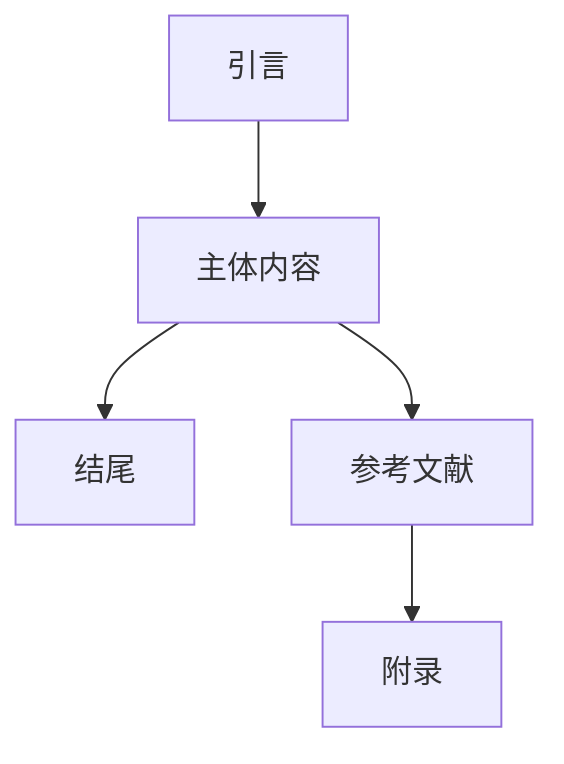
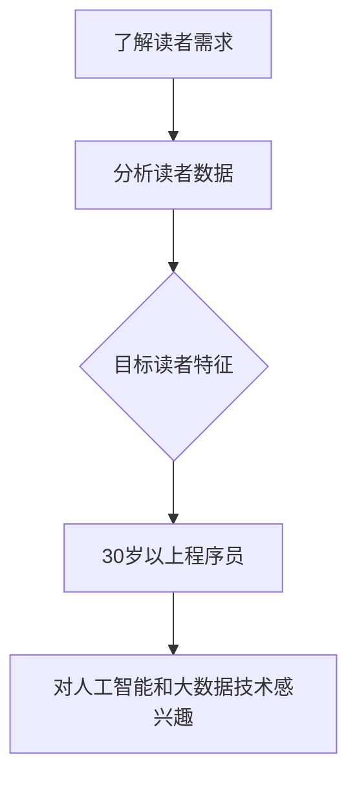
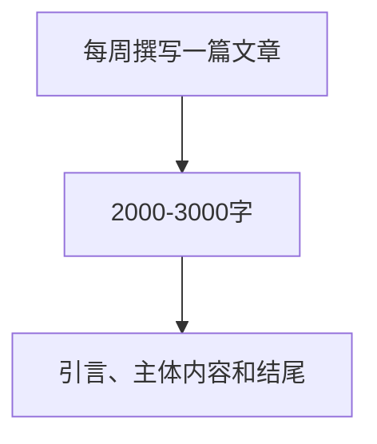
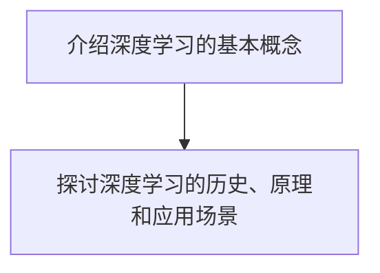
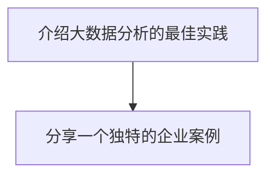
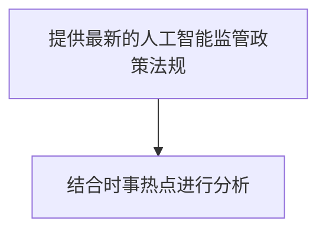

                 

# 程序员如何利用Medium会员计划进行写作变现

> 关键词：Medium会员计划、写作变现、程序员、内容创作、写作技巧

> 摘要：本文旨在探讨程序员如何通过利用Medium会员计划来实现写作变现。我们将从Medium会员计划的概述、如何撰写高质量文章、利用Medium工具提升写作效率、如何利用Medium会员计划进行变现、案例分析与实战操作、应对挑战与持续进步等多个方面进行详细分析，帮助程序员更好地利用Medium平台进行写作变现。

### 目录大纲

## 第1章：Medium会员计划概述

### 1.1 Medium平台介绍

#### 1.1.1 Medium的历史与发展

#### 1.1.2 Medium的核心价值观

#### 1.1.3 Medium平台的特点与优势

### 1.2 Medium会员计划概述

#### 1.2.1 会员计划的定义

#### 1.2.2 会员计划的优势

#### 1.2.3 会员计划的目标用户

### 1.3 Medium写作变现的原理

#### 1.3.1 内容创作与变现的关系

#### 1.3.2 Medium平台的变现模式

#### 1.3.3 程序员在写作变现中的优势

## 第2章：如何撰写高质量文章

### 2.1 文章创作的基础知识

#### 2.1.1 文章结构

#### 2.1.2 文章主题

#### 2.1.3 文章风格

### 2.2 程序员写作的技巧

#### 2.2.1 技术内容的组织

#### 2.2.2 技术术语的表述

#### 2.2.3 技术案例的应用

### 2.3 提升文章可读性

#### 2.3.1 语言表达的优化

#### 2.3.2 格式的规范

#### 2.3.3 图表与代码的运用

## 第3章：利用Medium工具提升写作效率

### 3.1 Medium编辑器功能

#### 3.1.1 文本编辑

#### 3.1.2 格式设置

#### 3.1.3 插图与链接

### 3.2 提高写作速度的技巧

#### 3.2.1 写作习惯的培养

#### 3.2.2 模板的使用

#### 3.2.3 修订与反馈

### 3.3 利用数据工具分析文章效果

#### 3.3.1 数据指标的含义

#### 3.3.2 数据分析的应用

#### 3.3.3 改进文章策略

## 第4章：如何利用Medium会员计划进行变现

### 4.1 会员计划的收益模式

#### 4.1.1 会员订阅费用

#### 4.1.2 广告分成

#### 4.1.3 赞助内容

### 4.2 确定写作方向

#### 4.2.1 定位目标读者

#### 4.2.2 确定文章主题

#### 4.2.3 制定写作计划

### 4.3 提高文章质量

#### 4.3.1 内容的深度与广度

#### 4.3.2 文章的独特性

#### 4.3.3 文章的时效性

## 第5章：案例分析与实战操作

### 5.1 成功案例分享

#### 5.1.1 程序员写作变现的经验

#### 5.1.2 成功案例分析

#### 5.1.3 学习与借鉴

### 5.2 实战操作

#### 5.2.1 创建Medium账号

#### 5.2.2 发表第一篇文章

#### 5.2.3 策划与执行写作计划

### 5.3 跨平台推广

#### 5.3.1 利用社交媒体进行推广

#### 5.3.2 合作与互推

#### 5.3.3 建立个人品牌

## 第6章：应对挑战与持续进步

### 6.1 处理写作中的问题

#### 6.1.1 克服写作障碍

#### 6.1.2 管理写作压力

#### 6.1.3 提高写作质量

### 6.2 维护与扩展读者群体

#### 6.2.1 建立读者反馈机制

#### 6.2.2 提升文章互动性

#### 6.2.3 拓展阅读渠道

### 6.3 持续学习与成长

#### 6.3.1 跟踪行业动态

#### 6.3.2 学习新技术

#### 6.3.3 提升写作技能

## 第7章：附录

### 7.1 Medium会员计划详细指南

#### 7.1.1 会员计划的具体操作流程

#### 7.1.2 会员计划的费用结构

#### 7.1.3 会员计划的常见问题解答

### 7.2 技术写作资源推荐

#### 7.2.1 技术写作书籍

#### 7.2.2 技术写作网站

#### 7.2.3 技术写作工具

### 7.3 链接与参考

#### 7.3.1 相关链接与资源

#### 7.3.2 参考书目

#### 7.3.3 进一步阅读推荐

----------------------------------------------------------------

### 第1章：Medium会员计划概述

#### 1.1 Medium平台介绍

##### 1.1.1 Medium的历史与发展

Medium是一个在线出版平台，成立于2012年，由Evan Williams（Twitter的创始人）创立。自成立以来，Medium一直在致力于打造一个高质量、有深度的内容分享平台。它的核心目标是将创作者的声音传递给读者，并鼓励读者参与讨论和交流。

Medium的发展历程可以分为几个阶段：

1. **初始阶段**（2012-2014）：Medium在成立初期主要聚焦于博客写作，提供了一个简单、易用的写作和发布工具。

2. **增长阶段**（2015-2017）：在这一阶段，Medium开始引入付费会员计划，鼓励创作者通过高质量的内容获得收入。

3. **多元化阶段**（2018至今）：Medium不仅继续扩大其创作者社区，还开始涉足更多类型的内容，如视频、播客等。

##### 1.1.2 Medium的核心价值观

Medium的核心价值观可以归纳为以下几点：

- **内容为王**：Medium坚信优质内容是平台发展的基石，因此一直致力于为用户提供高质量、有深度的内容。

- **社区驱动**：Medium鼓励用户之间的互动和讨论，认为一个活跃的社区可以促进内容的传播和创作。

- **设计之美**：Medium注重用户体验，其简洁、美观的界面设计深受用户喜爱。

##### 1.1.3 Medium平台的特点与优势

Medium作为在线出版平台，具有以下几个特点与优势：

- **高质量内容**：Medium吸引了大量专业创作者和行业专家，因此平台上的内容具有较高的专业性和深度。

- **互动性强**：Medium鼓励用户在文章下进行评论，这有助于促进内容的讨论和传播。

- **个性化推荐**：Medium利用算法对用户进行个性化推荐，使得用户能够更轻松地找到感兴趣的内容。

- **多样化的内容形式**：Medium不仅支持文本，还支持视频、播客等多种内容形式，这为用户提供了更丰富的阅读体验。

#### 1.2 Medium会员计划概述

##### 1.2.1 会员计划的定义

Medium会员计划是一个付费订阅服务，用户通过支付订阅费用，可以享受一系列特权，如优先阅读、无广告体验等。会员计划的目的是为了支持创作者，让他们能够通过创作高质量的内容获得收入。

##### 1.2.2 会员计划的优势

Medium会员计划为用户提供了以下几个优势：

- **增加收益**：对于创作者来说，会员计划的订阅费用可以作为一种额外的收入来源。

- **优先展示**：会员文章将在Medium平台上获得更多的曝光，有助于吸引更多的读者。

- **个性化推荐**：会员文章更有可能被算法推荐给目标读者，提高文章的阅读量。

##### 1.2.3 会员计划的目标用户

Medium会员计划主要面向以下用户群体：

- **专业创作者**：拥有丰富知识和写作经验的专业人士，如技术专家、行业分析师等。

- **技术专家**：在技术领域拥有专业知识的程序员、工程师等。

- **专业人士**：在各行各业中拥有丰富经验的专业人士。

#### 1.3 Medium写作变现的原理

##### 1.3.1 内容创作与变现的关系

内容创作是变现的基础。创作者通过创作高质量、有价值的内容，吸引读者，从而实现变现。

##### 1.3.2 Medium平台的变现模式

Medium平台的变现模式主要包括以下几个方面：

- **会员订阅费**：会员订阅费用是创作者的重要收入来源。

- **广告分成**：Medium在平台上投放广告，并将一部分广告收入分给创作者。

- **赞助内容**：品牌或企业通过赞助创作者的文章，获取广告效应。

##### 1.3.3 程序员在写作变现中的优势

程序员在写作变现中具有以下优势：

- **专业知识**：程序员拥有丰富的技术知识，能够创作出具有专业性和深度的技术文章。

- **写作技能**：程序员通常具备较强的写作能力，能够撰写清晰、有条理的文章。

- **受众广泛**：程序员是Medium上的主要受众之一，因此程序员创作的文章更容易获得读者的关注。

#### 总结

通过本章的介绍，我们了解了Medium会员计划的定义、优势、目标用户以及写作变现的原理。下一章，我们将探讨如何撰写高质量的文章，帮助程序员更好地利用Medium平台进行写作变现。

### 第2章：如何撰写高质量文章

#### 2.1 文章创作的基础知识

##### 2.1.1 文章结构

撰写高质量文章的第一步是构建良好的文章结构。一篇文章通常包括以下几个部分：

1. **引言**：引言部分用于吸引读者的兴趣，简要介绍文章的主题和目的。

2. **主体内容**：主体内容是文章的核心，详细阐述主题，包括相关知识点、案例分析等。

3. **结尾**：结尾部分总结文章的主要观点，给读者留下深刻印象。

##### 2.1.2 文章主题

选择合适的主题是撰写高质量文章的关键。以下是一些建议：

- **关注热点**：关注当前的热点话题，这些话题通常具有较高的关注度。

- **结合自身经验**：选择自己熟悉或擅长的主题，这样可以更好地进行阐述。

- **目标读者需求**：考虑目标读者的需求，选择他们感兴趣的主题。

##### 2.1.3 文章风格

文章风格是文章给人的整体感觉。以下是一些建议：

- **严谨与简洁**：文章内容应严谨，避免使用复杂的术语和句子。

- **生动与有趣**：适当使用幽默、比喻等手法，使文章更具吸引力。

- **个人风格**：根据自己的特点和优势，形成独特的写作风格。

#### 2.2 程序员写作的技巧

##### 2.2.1 技术内容的组织

撰写技术文章时，需要注意以下几点：

- **逻辑清晰**：技术文章应逻辑清晰，便于读者理解。

- **知识点连接**：将相关的知识点进行连接，形成一个完整的知识体系。

- **技术逻辑的梳理**：梳理技术逻辑，确保文章结构合理。

##### 2.2.2 技术术语的表述

在技术文章中，正确使用技术术语至关重要。以下是一些建议：

- **清晰明了**：使用简单、易懂的术语，避免使用复杂的行话。

- **尽量避免行话**：尽量使用通用的术语，避免使用行业内的行话。

- **做好注释**：对于一些重要的术语，可以在文中进行注释，帮助读者理解。

##### 2.2.3 技术案例的应用

案例是技术文章的重要组成部分。以下是一些建议：

- **实际案例的引用**：引用实际案例，帮助读者更好地理解技术概念。

- **案例的剖析**：对案例进行深入剖析，展示技术在实际应用中的效果。

- **案例的拓展**：从案例中拓展出更多的应用场景，提供更多价值。

#### 2.3 提升文章可读性

##### 2.3.1 语言表达的优化

优化语言表达是提升文章可读性的关键。以下是一些建议：

- **简洁明了**：尽量使用简洁、明了的语言，避免冗长的句子。

- **语言优美**：适当使用修辞手法，使文章更具吸引力。

- **表达准确**：确保语言表达准确无误，避免产生歧义。

##### 2.3.2 格式的规范

规范格式是提高文章可读性的重要手段。以下是一些建议：

- **标题与段落**：合理设置标题和段落，使文章结构清晰。

- **标点符号**：正确使用标点符号，提高文章的可读性。

- **代码与图表**：合理使用代码和图表，帮助读者更好地理解技术概念。

##### 2.3.3 图表与代码的运用

图表和代码是技术文章的重要元素。以下是一些建议：

- **图表的选择**：选择合适的图表，直观展示数据。

- **代码的格式**：确保代码格式规范，方便读者阅读。

- **结合实例说明**：结合实际案例，使用图表和代码进行说明。

#### 总结

撰写高质量文章需要从文章结构、技术内容的组织、技术术语的表述、技术案例的应用、语言表达的优化、格式的规范、图表与代码的运用等多个方面进行综合考虑。通过不断实践和总结，程序员可以撰写出更具吸引力和专业性的技术文章。

#### 2.1.1 文章结构

文章结构是文章的骨架，决定了读者能否顺畅地阅读和理解文章内容。一个好的文章结构应该清晰、逻辑性强，便于读者跟随作者的思路。

##### 引言

引言是文章的开头部分，它的作用是吸引读者的注意力，并简要介绍文章的主题和目的。一个好的引言应该具有以下特点：

- **引人入胜**：可以通过一个有趣的故事、一个引人深思的问题或一个引人瞩目的数据来吸引读者的兴趣。

- **明确主题**：在引言中，应该清楚地指出文章将要讨论的主题。

- **设定预期**：为读者设定一个对文章的预期，让读者知道接下来将会阅读到什么内容。

##### 主体内容

主体内容是文章的核心部分，它详细阐述文章的主题，包括相关知识点、案例分析和观点论述。主体内容应该具有以下特点：

- **逻辑清晰**：每个段落都应该有一个明确的主题句，并围绕这个主题句进行展开。

- **层次分明**：可以将主体内容分为几个部分，每个部分都针对一个具体的话题进行讨论。

- **论证充分**：使用事实、数据、案例和理论来支持观点，增强说服力。

##### 结尾

结尾是文章的最后一部分，它的作用是总结文章的主要观点，并给读者留下深刻印象。一个好的结尾应该具有以下特点：

- **总结全文**：回顾文章的主要观点，强调文章的核心信息。

- **提出建议**：如果适用，可以给出一些实用的建议或解决方案。

- **激发思考**：留下一些问题或思考题，激发读者的进一步思考。

##### 文章结构流程图



在这个流程图中，引言、主体内容和结尾是文章的核心部分，而参考文献和附录则是可选的附加部分。

#### 2.1.2 文章主题

文章主题是文章的灵魂，它决定了文章的内容和方向。选择合适的文章主题对于吸引读者和提高文章质量至关重要。以下是一些选择文章主题的技巧：

##### 确定主题的方向

- **关注热点**：关注当前的科技、社会热点，这些话题通常具有较高的关注度。

- **结合个人兴趣和专长**：选择自己感兴趣和擅长的主题，这样可以更好地进行阐述。

- **满足读者需求**：了解目标读者的需求和兴趣，选择他们感兴趣的主题。

##### 选择主题的具体步骤

1. **初步筛选**：列出几个可能的主题，然后根据主题的相关性、重要性和可行性进行筛选。

2. **深入研究**：对选定的主题进行深入研究，收集相关资料和案例。

3. **确定主题**：在深入研究的基础上，确定最终的主题。

##### 主题选择示例

假设我们要写一篇关于编程语言的文章，以下是一些可能的主题方向：

- **编程语言的发展历史**

- **最受欢迎的编程语言**

- **编程语言的优缺点分析**

- **编程语言的适用场景**

- **编程语言的学习资源推荐**

在这些主题方向中，我们可以根据个人兴趣和专业背景来选择一个具体方向进行深入探讨。

#### 2.1.3 文章风格

文章风格是文章的语言表达和艺术形式，它决定了文章的阅读体验和传达效果。选择合适的文章风格对于吸引读者和提高文章质量至关重要。以下是一些选择文章风格的技巧：

##### 文章风格的类型

- **学术风格**：严谨、正式，注重逻辑性和论证力。

- **新闻风格**：简洁、客观，注重事实的准确性和时效性。

- **叙述风格**：生动、有趣，注重故事的吸引力和情感表达。

- **技术风格**：清晰、准确，注重技术的深入和实用性。

##### 选择文章风格的步骤

1. **了解目标读者**：根据目标读者的特点和需求来选择合适的文章风格。

2. **确定主题**：根据主题的性质和内容来选择相应的文章风格。

3. **个人喜好**：根据自己的写作喜好和特长来选择文章风格。

##### 文章风格示例

假设我们要写一篇关于编程语言的文章，以下是一些可能的文章风格：

- **学术风格**：我们可以采用严谨的技术分析，深入探讨编程语言的原理和特性。

- **新闻风格**：我们可以采用简洁明了的方式，介绍当前最受欢迎的编程语言及其发展趋势。

- **叙述风格**：我们可以通过一个有趣的故事，介绍一种编程语言的应用场景和挑战。

- **技术风格**：我们可以结合具体的代码示例，讲解编程语言的语法和用法。

在这些风格中，我们可以根据自己的写作目标和读者群体来选择最合适的一种，或者将多种风格结合起来，创造出独特的文章风格。

### 第3章：利用Medium工具提升写作效率

#### 3.1 Medium编辑器功能

Medium编辑器是一个功能强大的写作工具，它提供了丰富的文本编辑、格式设置和插图链接功能，可以帮助程序员高效地进行文章创作。

##### 3.1.1 文本编辑

Medium编辑器的文本编辑功能包括：

- **基本文本格式**：包括字体、大小、颜色和样式等。

- **列表和引用**：可以创建无序列表、有序列表和引用格式。

- **插入链接**：可以直接在文本中插入链接，方便读者进一步了解相关内容。

- **插入代码**：可以插入代码块，并设置代码语言的语法高亮。

##### 3.1.2 格式设置

Medium编辑器的格式设置功能包括：

- **段落格式**：可以设置段落间距、对齐方式和缩进等。

- **标题格式**：可以设置不同级别的标题，使文章结构更加清晰。

- **引用格式**：可以设置引用文本的格式，增加文章的可读性。

- **样式管理**：可以自定义样式，方便后续的文章写作。

##### 3.1.3 插图与链接

Medium编辑器的插图与链接功能包括：

- **插入图片**：可以直接插入本地图片或在线图片，并调整图片的大小和位置。

- **插入视频**：可以插入YouTube或Vimeo等平台的视频，增强文章的互动性。

- **插入链接**：可以在图片或视频中插入链接，引导读者进一步了解相关内容。

#### 3.2 提高写作速度的技巧

提高写作速度是程序员进行高效写作的重要环节。以下是一些提高写作速度的技巧：

##### 3.2.1 写作习惯的培养

- **定期写作**：设定固定的写作时间，如每天早上或晚上，养成定期写作的习惯。

- **避免分心**：在写作过程中，尽量避免分心，如关闭社交媒体通知，保持专注。

- **连续写作**：尽量进行连续写作，避免中途打断，提高写作效率。

##### 3.2.2 模板的使用

- **文章模板**：使用通用的文章模板，可以节省时间，提高写作效率。

- **写作流程模板**：使用写作流程模板，可以帮助程序员更好地组织文章结构。

- **数据分析模板**：使用数据分析模板，可以快速生成数据分析报告。

##### 3.2.3 修订与反馈

- **自我修订**：在完成初稿后，进行自我修订，检查语法错误和逻辑问题。

- **接受他人反馈**：向同事或朋友请教，接受他们的反馈和建议，不断改进文章。

- **及时调整**：根据反馈，及时调整文章内容，优化写作质量。

#### 3.3 利用数据工具分析文章效果

Medium提供了一系列数据工具，可以帮助程序员分析文章效果，从而优化写作策略。

##### 3.3.1 数据指标的含义

- **阅读量**：文章的总阅读次数，反映了文章的受欢迎程度。

- **点赞数**：读者对文章的喜爱程度，是衡量文章质量的一个重要指标。

- **分享次数**：文章被分享到其他平台的次数，有助于文章的传播和推广。

##### 3.3.2 数据分析的应用

- **文章效果评估**：通过分析数据，可以评估文章的受欢迎程度，确定哪些文章更受欢迎。

- **读者群体分析**：通过分析读者的阅读习惯和偏好，可以更好地了解目标读者，优化文章内容。

- **写作策略调整**：根据数据分析结果，调整写作策略，提高文章的质量和影响力。

##### 3.3.3 改进文章策略

- **根据数据调整内容**：根据读者反馈和数据分析，调整文章的内容和结构。

- **优化标题与摘要**：根据数据分析，优化标题和摘要，提高文章的吸引力和点击率。

- **增加互动元素**：在文章中增加互动元素，如问答、投票等，提高读者的参与度和互动性。

#### 总结

通过利用Medium编辑器的功能、培养良好的写作习惯、使用模板和修订反馈，以及利用数据分析工具，程序员可以大幅提高写作效率，撰写出高质量的文章。下一章，我们将探讨如何利用Medium会员计划进行变现。

### 第4章：如何利用Medium会员计划进行变现

#### 4.1 会员计划的收益模式

Medium会员计划为创作者提供了多种收益模式，这些模式有助于创作者通过写作实现变现。

##### 4.1.1 会员订阅费用

会员订阅费用是创作者的主要收入来源。会员用户每月支付一定金额的订阅费用，这些费用的一部分将作为稿费分发给创作者。根据Medium的规则，创作者可以根据其文章的质量、阅读量和影响力等因素获得不同的收益。

- **会员订阅费用构成**：会员订阅费用包括会员用户支付的订阅费用和Medium从中提取的佣金。

- **收益计算**：创作者的收益取决于其文章的阅读量和会员订阅费用的比例。通常，阅读量越高，收益也越高。

##### 4.1.2 广告分成

Medium平台会在会员文章中投放广告，创作者可以从广告收入中获得一定比例的分成。广告分成模式为：

- **广告分成计算**：广告分成取决于广告收入和创作者文章的阅读量。通常，阅读量越高，广告收入也越高，从而分得的广告分成也越多。

- **广告分成与收益关系**：广告分成是创作者的额外收入来源，可以与会员订阅费用相结合，提高总收益。

##### 4.1.3 赞助内容

赞助内容是一种由品牌或企业赞助的写作形式，创作者可以根据赞助内容获得报酬。赞助内容通常涉及特定品牌或产品的介绍，创作者需要在文章中客观、中立地介绍赞助内容。

- **赞助内容定义**：赞助内容是指创作者根据品牌或企业的需求撰写的文章，通常涉及产品介绍、使用体验、行业分析等。

- **赞助内容与收益关系**：赞助内容为创作者提供了额外的收入来源，但需要创作者保证内容的客观性和中立性。

#### 4.2 确定写作方向

确定写作方向是创作者进行变现的关键步骤。以下是确定写作方向的一些策略：

##### 4.2.1 定位目标读者

定位目标读者是写作变现的第一步。创作者需要了解目标读者的需求、兴趣和偏好，以便撰写出符合读者需求的内容。

- **了解读者需求**：通过调查问卷、读者反馈和市场研究等方式，了解读者的需求。

- **分析读者数据**：利用Medium提供的数据分析工具，分析读者的阅读习惯和偏好。

##### 4.2.2 确定文章主题

确定文章主题是写作变现的核心。创作者需要选择与自己专长和兴趣相关的主题，以便更好地撰写高质量的内容。

- **结合个人专长**：选择自己擅长和熟悉的主题，有助于提高文章的质量。

- **关注热点话题**：关注当前的科技、社会热点，这些话题通常具有较高的关注度。

##### 4.2.3 制定写作计划

制定写作计划是确保写作有序进行的重要步骤。创作者需要根据目标读者和文章主题，制定具体的写作计划。

- **设定写作目标**：明确每次写作的目标，如字数、质量、主题等。

- **制定时间表**：设定固定的写作时间表，确保写作计划的执行。

- **规划内容**：根据写作目标和时间表，规划文章的内容和结构。

#### 4.3 提高文章质量

提高文章质量是确保文章能够吸引读者和获得高收益的关键。以下是提高文章质量的一些策略：

##### 4.3.1 内容的深度与广度

- **深入分析问题**：对主题进行深入分析，提供详细的信息和见解。

- **广泛了解相关内容**：了解与主题相关的其他知识点和观点，使文章内容更加丰富。

##### 4.3.2 文章的独特性

- **独特观点**：提供独特的观点和见解，避免与他人重复。

- **独特风格**：形成自己的写作风格，使文章具有独特性。

- **独特案例**：使用独特的案例和实例，增强文章的吸引力。

##### 4.3.3 文章的时效性

- **跟踪热点话题**：及时关注和讨论热点话题，使文章具有时效性。

- **提供最新资讯**：提供最新的行业动态和资讯，使文章保持新鲜感。

- **结合时事评论**：结合时事热点，进行深入的评论和分析，提高文章的价值。

#### 总结

通过理解Medium会员计划的收益模式、确定写作方向和提高文章质量，程序员可以有效地利用Medium会员计划进行写作变现。下一章，我们将通过案例分析和实战操作，进一步探讨如何实现写作变现。

### 第4章：如何利用Medium会员计划进行变现

#### 4.1 会员计划的收益模式

Medium会员计划为创作者提供了多种变现途径，主要包括会员订阅费用、广告分成和赞助内容等。

##### 4.1.1 会员订阅费用

会员订阅费用是创作者的主要收入来源。会员用户每月支付一定金额的订阅费用，这些费用将根据创作者的文章质量和阅读量进行分配。创作者可以通过以下步骤获得会员订阅费用：

1. **注册成为会员**：会员用户需要在Medium上注册并支付订阅费用，才能享受会员特权。
2. **发布高质量文章**：创作者需要发布高质量、有价值的文章，以吸引更多的会员用户订阅。
3. **收益计算**：Medium会根据创作者的文章阅读量和会员订阅费用比例，计算创作者的收益。通常，阅读量越高，收益也越高。

示例：假设一个创作者的文章每月平均阅读量为10000次，而会员订阅费用为每年100美元，那么该创作者每月可以从会员订阅费用中获得约8.3美元。

```latex
每月会员订阅费用 = (10000次阅读 / 1000000次阅读) * 100美元 = 8.3美元
```

##### 4.1.2 广告分成

Medium平台会在会员文章中投放广告，创作者可以从广告收入中获得一定比例的分成。广告分成模式如下：

1. **投放广告**：Medium会在创作者的文章中投放广告，这些广告通常包括横幅广告、视频广告等。
2. **收益计算**：广告分成取决于广告收入和创作者的文章阅读量。通常，阅读量越高，广告收入也越高。

示例：假设一个创作者的文章每月平均阅读量为10000次，而广告收入为每月100美元，那么该创作者每月可以从广告分成中获得约10%的收益。

```latex
每月广告分成 = (10000次阅读 / 1000000次阅读) * 100美元 * 10% = 1美元
```

##### 4.1.3 赞助内容

赞助内容是一种由品牌或企业赞助的写作形式，创作者可以根据赞助内容获得报酬。赞助内容通常涉及特定品牌或产品的介绍，创作者需要在文章中客观、中立地介绍赞助内容。

1. **撰写赞助内容**：创作者需要根据品牌或企业的需求，撰写相关内容的文章。
2. **获得报酬**：根据赞助内容的质量和效果，创作者可以从品牌或企业获得报酬。

示例：假设一个创作者为一篇赞助内容文章撰写了一篇2000字的文章，并根据约定获得了200美元的报酬。

```latex
赞助内容报酬 = 200美元
```

#### 4.2 确定写作方向

确定写作方向是确保文章能够吸引读者和获得高收益的关键。以下是一些策略来帮助创作者确定写作方向：

##### 4.2.1 定位目标读者

定位目标读者是写作变现的第一步。创作者需要了解目标读者的需求、兴趣和偏好，以便撰写出符合读者需求的内容。

1. **了解读者需求**：通过调查问卷、读者反馈和市场研究等方式，了解读者的需求。
2. **分析读者数据**：利用Medium提供的数据分析工具，分析读者的阅读习惯和偏好。

示例：假设一个创作者通过数据分析发现，其目标读者主要是30岁以上的程序员，他们对人工智能和大数据技术感兴趣。



##### 4.2.2 确定文章主题

确定文章主题是写作变现的核心。创作者需要选择与自己专长和兴趣相关的主题，以便更好地撰写高质量的内容。

1. **结合个人专长**：选择自己擅长和熟悉的主题，有助于提高文章的质量。
2. **关注热点话题**：关注当前的科技、社会热点，这些话题通常具有较高的关注度。

示例：一个对人工智能和大数据技术感兴趣的程序员，可以选择撰写关于这些技术的文章，如“深度学习在自然语言处理中的应用”、“大数据分析的最佳实践”等。

##### 4.2.3 制定写作计划

制定写作计划是确保写作有序进行的重要步骤。创作者需要根据目标读者和文章主题，制定具体的写作计划。

1. **设定写作目标**：明确每次写作的目标，如字数、质量、主题等。
2. **制定时间表**：设定固定的写作时间表，确保写作计划的执行。
3. **规划内容**：根据写作目标和时间表，规划文章的内容和结构。

示例：一个程序员可以制定以下写作计划：

- 每周撰写一篇关于人工智能或大数据技术的文章。
- 每篇文章的字数控制在2000-3000字。
- 每篇文章的结构包括引言、主体内容和结尾。



#### 4.3 提高文章质量

提高文章质量是确保文章能够吸引读者和获得高收益的关键。以下是一些策略来帮助创作者提高文章质量：

##### 4.3.1 内容的深度与广度

1. **深入分析问题**：对主题进行深入分析，提供详细的信息和见解。
2. **广泛了解相关内容**：了解与主题相关的其他知识点和观点，使文章内容更加丰富。

示例：在撰写一篇关于深度学习的文章时，可以不仅介绍深度学习的基本概念，还可以探讨其历史、原理和应用场景。



##### 4.3.2 文章的独特性

1. **独特观点**：提供独特的观点和见解，避免与他人重复。
2. **独特风格**：形成自己的写作风格，使文章具有独特性。
3. **独特案例**：使用独特的案例和实例，增强文章的吸引力。

示例：在撰写一篇关于大数据分析的文章时，可以分享一个独特的企业案例，展示大数据分析在实际业务中的应用。



##### 4.3.3 文章的时效性

1. **跟踪热点话题**：及时关注和讨论热点话题，使文章具有时效性。
2. **提供最新资讯**：提供最新的行业动态和资讯，使文章保持新鲜感。
3. **结合时事评论**：结合时事热点，进行深入的评论和分析，提高文章的价值。

示例：在撰写一篇关于人工智能监管的文章时，可以结合最新的政策法规和行业动态进行分析。



#### 总结

通过理解Medium会员计划的收益模式、确定写作方向和提高文章质量，程序员可以有效地利用Medium会员计划进行写作变现。在下一章，我们将通过案例分析和实战操作，进一步探讨如何实现写作变现。

### 第5章：案例分析与实战操作

#### 5.1 成功案例分享

在这个部分，我们将分享一些成功利用Medium会员计划进行写作变现的案例，以便读者从中获得灵感和经验。

##### 5.1.1 案例一：程序员A的写作变现之路

程序员A是一名资深软件工程师，对云计算和大数据技术有着深厚的理解和实践经验。他决定利用Medium会员计划进行写作变现，以下是他的一些成功经验：

1. **确定写作方向**：程序员A选择了云计算和大数据技术作为主要写作方向，因为他熟悉这些领域，并且这些领域当前正处于快速发展的阶段。
2. **高质量内容**：程序员A致力于撰写高质量的文章，他通过深入研究、实际案例分析和代码示例，使文章内容具有深度和实用性。
3. **持续更新**：程序员A保持每周至少发表一篇新文章的频率，这有助于他保持与读者的互动，并逐步建立自己的读者群体。
4. **数据分析**：程序员A利用Medium提供的数据分析工具，定期分析自己的文章效果，并根据分析结果调整写作策略。

通过上述策略，程序员A的文章逐渐获得了大量读者的关注和赞赏，他的月收入也从最初的几十美元逐渐增长到数百美元。

##### 5.1.2 案例二：技术专家B的写作变现之路

技术专家B是一名拥有丰富经验的系统架构师，他对系统设计和性能优化有着深入的研究。以下是她的写作变现之路：

1. **专业领域**：技术专家B专注于系统设计和性能优化领域，因为她在这个领域拥有深厚的专业知识和丰富的实践经验。
2. **独特视角**：技术专家B在文章中提供了独特的视角和见解，她经常结合实际项目案例进行深入剖析，使文章更具吸引力。
3. **互动性**：技术专家B鼓励读者在文章下发表评论，并与读者进行互动，这有助于增加文章的互动性和读者的参与感。
4. **持续学习**：技术专家B不断学习和更新自己的知识，确保文章内容始终处于行业前沿。

通过上述策略，技术专家B的文章在Medium上获得了很高的阅读量和点赞数，她的会员订阅费用和广告分成也稳步增长。

##### 5.1.3 案例三：程序员C的写作变现之路

程序员C是一名年轻的开发者，对前端技术和JavaScript有着浓厚的兴趣。以下是他的写作变现之路：

1. **热爱主题**：程序员C选择了自己热爱的前端技术和JavaScript作为写作方向，这使得他在写作过程中充满了热情和动力。
2. **学习与实践**：程序员C不断学习新的前端技术和框架，并通过实际项目进行实践，这使他的文章内容更加丰富和实用。
3. **分享经验**：程序员C在文章中分享自己的学习经验和项目实践，这吸引了大量对前端技术感兴趣的开发者。
4. **积极参与社区**：程序员C积极参与前端技术社区，与其他开发者进行交流和分享，这有助于提高他的知名度和影响力。

通过上述策略，程序员C的文章在Medium上迅速获得了关注，他的会员订阅费用和广告分成也逐渐增加。

#### 5.2 实战操作

接下来，我们将介绍如何在实际操作中利用Medium会员计划进行写作变现。

##### 5.2.1 创建Medium账号

1. **注册账号**：首先，您需要在Medium网站上注册一个账号。访问[Medium官网](https://medium.com/)，点击“加入Medium”按钮，按照提示完成注册流程。

2. **设置个人资料**：注册成功后，进入个人资料页面，填写并完善个人资料，包括姓名、职业、介绍等。这有助于读者了解您的背景和兴趣。

3. **选择写作计划**：根据您的兴趣和专业领域，选择您的写作计划。您可以选择每周发表一篇文章，或者根据自己的时间安排制定合适的写作计划。

##### 5.2.2 发表第一篇文章

发表第一篇文章是开始写作变现的第一步。以下是一些步骤：

1. **选择主题**：选择一个您感兴趣且熟悉的主题。确保主题具有足够的深度和广度，以便撰写高质量的文章。

2. **撰写文章**：使用Medium编辑器撰写文章。在撰写过程中，注意文章的结构、语言表达和格式设置。

3. **编辑与修订**：完成初稿后，进行多次编辑和修订，确保文章内容准确、清晰和有吸引力。

4. **发布文章**：完成文章后，点击“发布”按钮，将文章发表在Medium上。您可以选择将其发布在个人主页上，或者创建一个新的专题页面。

##### 5.2.3 策划与执行写作计划

为了确保持续地写作和变现，您需要制定一个详细的写作计划。以下是一些步骤：

1. **设定写作目标**：明确每次写作的目标，如字数、质量、主题等。

2. **制定时间表**：根据写作目标和自己的时间安排，制定一个具体的写作时间表。确保按照时间表进行写作。

3. **内容规划**：提前规划文章的内容和结构，确保文章有足够的深度和广度。

4. **执行写作计划**：按照写作计划进行写作，并在完成每篇文章后进行编辑和修订。

5. **定期回顾**：定期回顾写作计划，分析文章效果，并根据分析结果调整写作策略。

#### 5.3 跨平台推广

为了扩大文章的影响力，您需要利用其他平台进行推广。以下是一些推广策略：

##### 5.3.1 利用社交媒体进行推广

1. **创建社交媒体账号**：在Twitter、LinkedIn、Facebook等社交媒体平台上创建账号，以便发布文章链接和互动。

2. **发布文章链接**：在社交媒体上发布您的文章链接，并附上简短的介绍和评论，吸引读者阅读。

3. **互动与分享**：积极参与社交媒体上的讨论，分享其他创作者的优秀文章，提高自己的知名度。

##### 5.3.2 合作与互推

1. **寻找合作伙伴**：与其他创作者或行业专家建立合作关系，互相推广文章。

2. **制定合作计划**：与合作伙伴制定详细的合作计划，包括文章推广、互动分享等。

3. **互推效果评估**：定期评估互推效果，根据效果调整合作策略。

##### 5.3.3 建立个人品牌

1. **确定品牌定位**：根据您的专业领域和写作风格，确定个人品牌定位。

2. **品牌建设**：通过持续写作和分享，建立个人品牌，提高知名度和影响力。

3. **品牌推广**：利用社交媒体和其他渠道，推广个人品牌，吸引更多的读者和关注。

#### 总结

通过案例分析和实战操作，我们可以看到，程序员可以通过利用Medium会员计划进行写作变现。关键在于确定写作方向、撰写高质量的文章、制定和执行写作计划，以及进行跨平台推广。下一章，我们将探讨如何应对写作中的挑战，并持续进步。

### 第6章：应对挑战与持续进步

#### 6.1 处理写作中的问题

在写作过程中，程序员可能会遇到各种问题，以下是一些常见的问题及其解决方案：

##### 6.1.1 克服写作障碍

1. **缺乏灵感**：写作灵感有时会枯竭，可以通过以下方法克服：
   - **阅读**：阅读相关领域的书籍、文章和博客，获取新的观点和灵感。
   - **观察**：观察周围的人和事，从日常生活中寻找写作素材。
   - **交流**：与同行交流，分享观点和经验，激发写作灵感。

2. **写作焦虑**：写作焦虑是许多程序员面临的挑战，可以通过以下方法缓解：
   - **分步写作**：将大篇文章分解为多个小段落或小节，逐步完成。
   - **设定目标**：设定每日或每周的写作目标，逐步实现。
   - **避免完美主义**：接受初稿的不完美，专注于完成文章。

##### 6.1.2 管理写作压力

1. **时间管理**：合理规划写作时间，避免写作时间与工作时间或其他活动冲突。
   - **制定时间表**：制定详细的写作时间表，确保有充足的时间进行写作。
   - **优先级管理**：将写作作为优先任务，确保有足够的时间完成。

2. **心理调适**：保持良好的心理状态，有助于提高写作效率。
   - **放松身心**：进行适当的运动、冥想或休息，缓解压力。
   - **积极心态**：保持积极的心态，相信自己的写作能力。

##### 6.1.3 提高写作质量

1. **学习与练习**：通过学习和实践，提高写作技能。
   - **学习课程**：参加写作课程或在线课程，学习写作技巧。
   - **练习写作**：坚持每天写作，通过实践提高写作技能。

2. **反馈与改进**：接受他人的反馈，不断改进写作质量。
   - **请教他人**：向同事、朋友或导师请教，获取他们的意见和建议。
   - **自我检查**：在完成初稿后，仔细检查文章的内容、结构和语言表达。

#### 6.2 维护与扩展读者群体

维护和扩展读者群体是确保写作持续变现的关键。以下是一些策略：

##### 6.2.1 建立读者反馈机制

1. **鼓励评论**：在文章末尾鼓励读者发表评论，了解他们的看法和建议。
2. **回复评论**：及时回复读者的评论，与他们进行互动，建立良好的读者关系。
3. **定期调查**：定期进行读者调查，了解他们的需求和偏好，根据反馈调整写作策略。

##### 6.2.2 提升文章互动性

1. **互动内容**：在文章中添加互动元素，如问答、投票、讨论等，提高读者的参与度。
2. **互动环节**：在文章发布后，通过社交媒体、邮件等渠道，与读者进行互动，讨论文章内容。
3. **读者社区**：建立一个读者社区，如微信群、QQ群等，方便读者交流和讨论。

##### 6.2.3 拓展阅读渠道

1. **社交媒体**：利用社交媒体平台，如Twitter、LinkedIn、Facebook等，推广文章，吸引更多读者。
2. **合作媒体**：与其他媒体或博客合作，发布文章，扩大影响力。
3. **个性化推送**：利用数据分析工具，为不同的读者群体推送个性化的文章，提高阅读量。

#### 6.3 持续学习与成长

持续学习与成长是程序员在写作道路上不断进步的关键。以下是一些策略：

##### 6.3.1 跟踪行业动态

1. **关注热点**：关注科技、编程等相关领域的热点话题，了解行业最新动态。
2. **定期总结**：定期总结行业动态，撰写分析文章，分享自己的见解。
3. **参与讨论**：参与行业讨论，与其他开发者交流观点，拓展知识面。

##### 6.3.2 学习新技术

1. **学习课程**：参加在线课程或培训班，学习新技术和工具。
2. **阅读文献**：阅读专业书籍、论文和技术博客，了解最新的技术发展和趋势。
3. **实践应用**：将新学到的技术应用到实际项目中，提高实践能力。

##### 6.3.3 提升写作技能

1. **写作课程**：参加写作课程，学习写作技巧和策略。
2. **写作练习**：坚持每天写作，通过不断练习提高写作技能。
3. **反馈与改进**：接受他人的反馈，不断改进写作质量。

#### 总结

通过应对写作中的挑战、维护与扩展读者群体以及持续学习与成长，程序员可以不断提升自己的写作能力，实现持续进步。下一章，我们将提供一些Medium会员计划的详细指南，帮助程序员更好地利用这一计划进行写作变现。

### 第7章：附录

#### 7.1 Medium会员计划详细指南

##### 7.1.1 会员计划的具体操作流程

1. **注册会员**：访问Medium官网，点击“加入会员”按钮，按照提示完成注册和支付流程。
2. **激活会员**：支付成功后，系统会自动激活您的会员账号。
3. **开始订阅**：激活后，您可以开始订阅您喜欢的创作者的文章。

##### 7.1.2 会员计划的费用结构

1. **订阅费用**：会员订阅费用根据不同国家和地区的支付标准而定，通常每月或每年支付一定金额。
2. **广告分成**：广告分成取决于您的文章阅读量和广告收入比例。
3. **赞助内容费用**：赞助内容费用根据赞助商的赞助金额和创作者的约定而定。

##### 7.1.3 会员计划的常见问题解答

1. **如何取消会员订阅？**：您可以登录Medium账号，在“设置”中找到会员订阅，选择“取消订阅”进行操作。
2. **如何修改支付信息？**：在“设置”中找到支付信息，进行修改。
3. **会员订阅费用如何分配？**：会员订阅费用将根据创作者的文章阅读量和会员订阅费用比例进行分配。

#### 7.2 技术写作资源推荐

##### 7.2.1 技术写作书籍

1. **《程序员写作指南》**：详细介绍了技术写作的基本技巧和策略。
2. **《技术写作：从零开始》**：适合初学者，讲解了技术写作的基本概念和技巧。
3. **《技术写作实践》**：通过实际案例，讲解了技术写作的实战技巧。

##### 7.2.2 技术写作网站

1. **Medium**：一个高质量的内容分享平台，适合程序员分享技术文章。
2. **Hacker News**：一个技术社区，程序员可以在这里分享和讨论技术话题。
3. **GitHub**：一个代码托管平台，程序员可以在这里分享和合作代码项目。

##### 7.2.3 技术写作工具

1. **Google Docs**：一个在线文档编辑工具，方便多人协作写作。
2. **Grammarly**：一个语法检查工具，可以帮助提高文章的语言质量。
3. **Canva**：一个图形设计工具，可以帮助制作漂亮的图表和图片。

#### 7.3 链接与参考

##### 7.3.1 相关链接与资源

1. **Medium会员计划官网**：[https://medium.com/members](https://medium.com/members)
2. **Medium官方博客**：[https://medium.com/medium/o](https://medium.com/medium/o)
3. **Medium创作者指南**：[https://medium.com/me/write](https://medium.com/me/write)

##### 7.3.2 参考书目

1. **《技术写作》**：一本关于技术写作的全面指南。
2. **《新媒体写作》**：一本关于新媒体环境下写作的书籍。
3. **《数字营销写作》**：一本关于数字营销中写作技巧的书籍。

##### 7.3.3 进一步阅读推荐

1. **《如何写出一篇好文章》**：一本关于写作技巧的书籍。
2. **《内容营销》**：一本关于内容营销策略的书籍。
3. **《社交媒体营销》**：一本关于社交媒体营销策略的书籍。

### 结语

通过本文的详细分析和指导，我们希望程序员能够更好地利用Medium会员计划进行写作变现。写作不仅是一种表达自己思想和知识的方式，也是一种实现个人价值和变现的手段。希望每位程序员都能在写作的道路上不断进步，实现自己的梦想。作者：AI天才研究院/AI Genius Institute & 禅与计算机程序设计艺术 /Zen And The Art of Computer Programming。

