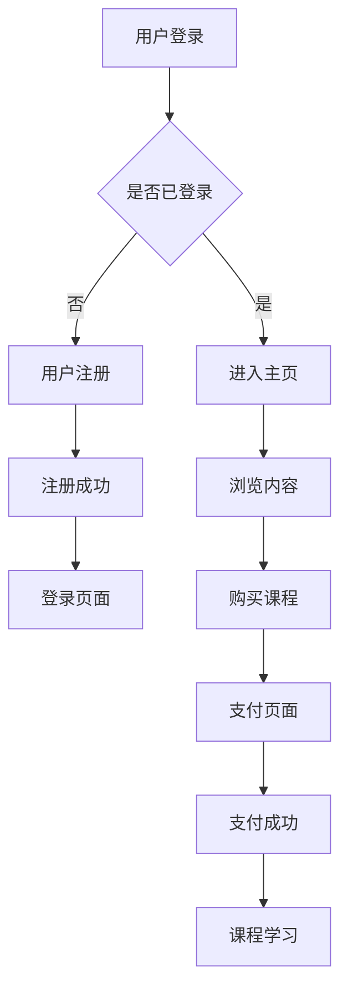
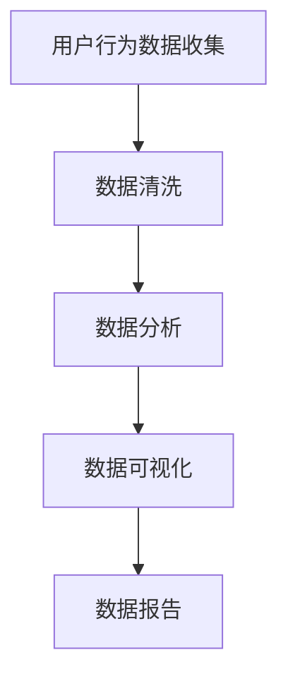

                 

# 《程序员如何利用小程序进行知识付费》

> 关键词：小程序、知识付费、程序员、开发实战、用户体验、数据分析

> 摘要：本文旨在探讨程序员如何利用小程序进行知识付费，从小程序与知识付费概述、小程序开发基础、小程序组件与页面设计、知识付费小程序实战、数据分析与运营优化、案例与实践以及小程序开发工具与资源等方面，逐步引导程序员深入了解并掌握小程序开发中的知识付费功能，提升开发技能和项目实战能力。

### 目录

#### 第一部分：小程序与知识付费概述

##### 第1章：小程序生态与知识付费概述  
- **1.1 小程序概述**  
  - 小程序的发展历程  
  - 小程序的基本架构  
  - 小程序的优势与应用场景  
- **1.2 知识付费的兴起与影响**  
  - 知识付费的背景  
  - 知识付费的市场现状  
  - 知识付费对教育行业的影响

##### 第2章：小程序开发基础  
- **2.1 小程序开发环境搭建**  
  - 开发工具安装与配置  
  - 开发者账号注册  
- **2.2 小程序开发语法与API**  
  - WXML、WXSS、JavaScript基础  
  - 小程序API详解

##### 第3章：小程序组件与页面设计  
- **3.1 小程序组件概述**  
  - 常用组件介绍  
  - 组件的生命周期  
- **3.2 页面布局与交互设计**  
  - 布局组件使用  
  - 交互组件使用

#### 第二部分：知识付费小程序实战

##### 第4章：内容管理模块设计  
- **4.1 内容管理概述**  
  - 内容结构设计  
  - 内容存储方案  
- **4.2 知识库搭建与内容发布**  
  - 知识库搭建  
  - 内容发布与分类管理

##### 第5章：用户管理模块设计  
- **5.1 用户管理概述**  
  - 用户角色与权限设计  
  - 用户数据安全与隐私保护  
- **5.2 用户注册与登录**  
  - 注册流程实现  
  - 登录流程实现  
- **5.3 用户信息管理与互动**  
  - 用户信息展示  
  - 用户互动功能实现

##### 第6章：支付与结算模块设计  
- **6.1 支付方式选择与集成**  
  - 支付方式概述  
  - 支付集成实现  
- **6.2 交易流程设计与安全**  
  - 交易流程设计  
  - 交易安全与防刷单

##### 第7章：数据分析与运营优化  
- **7.1 数据分析概述**  
  - 数据分析工具选择  
  - 数据分析基本概念  
- **7.2 运营数据监控与优化**  
  - 用户行为分析  
  - 业务数据监控  
  - 运营策略优化

#### 第三部分：案例与实践

##### 第8章：知识付费小程序实战案例  
- **8.1 实战案例介绍**  
  - 案例背景与目标  
  - 案例架构设计  
- **8.2 功能模块实现**  
  - 内容管理模块  
  - 用户管理模块  
  - 支付结算模块  
- **8.3 数据分析与运营优化**  
  - 数据收集与处理  
  - 运营数据监控与优化

##### 第9章：小程序开发工具与资源  
- **9.1 小程序开发工具对比**  
  - 微信开发者工具  
  - 支付宝开发者工具  
  - 百度开发者工具  
- **9.2 小程序开发资源推荐**  
  - 开发文档与教程  
  - 社区与交流平台  
  - 开源项目与代码库

### 附录

- **附录 A：小程序开发常见问题与解决方案**  
- **附录 B：小程序开发实用技巧与最佳实践**

### Mermaid 流程图

- 知识付费小程序功能流程图  
- 数据分析流程图

### 核心算法原理讲解

- 内容推荐算法伪代码  
- 用户行为分析算法伪代码

### 数学模型与公式

- 支付金额计算公式  
- 用户满意度评估模型

### 项目实战

- **项目实战1：搭建一个简单的知识付费小程序**  
  - 开发环境搭建  
  - 功能模块实现  
  - 数据分析与运营优化  
- **项目实战2：优化知识付费小程序用户体验**  
  - 用户行为数据收集  
  - 数据分析结果与应用  
  - 用户体验优化方案实施

### 代码解读与分析

- **代码解读1：内容管理模块代码解读**  
- **代码解读2：支付结算模块代码解读**


### 正文开始

---

## 第一部分：小程序与知识付费概述

### 第1章：小程序生态与知识付费概述

#### 1.1 小程序概述

小程序作为一种轻量级的移动应用，自2017年诞生以来，受到了广泛的关注。它们无需下载安装，即用即走，极大地提升了用户的体验。下面，我们从小程序的发展历程、基本架构和优势与应用场景三个方面来详细介绍小程序。

##### 1.1.1 小程序的发展历程

小程序的发展可以分为三个阶段：

1. **萌芽期（2017-2018年）**：小程序正式上线，受到开发者们的热烈欢迎，迅速占领市场。
2. **成长期（2019-2020年）**：小程序逐步完善，开始向更多行业和场景渗透。
3. **成熟期（2021年至今）**：小程序市场逐渐成熟，越来越多的企业和开发者加入小程序生态，市场规模不断扩大。

##### 1.1.2 小程序的基本架构

小程序的基本架构主要由前端和后端两部分组成。

1. **前端**：小程序前端使用WXML（微信小程序标记语言）和WXSS（微信小程序样式表）编写页面，使用JavaScript进行逻辑处理。前端主要负责页面展示和交互。
2. **后端**：小程序后端使用Node.js、Java、Python等语言编写服务器端代码，主要负责数据存储、处理和提供接口。

##### 1.1.3 小程序的优势与应用场景

小程序具有以下优势：

1. **无需安装**：用户无需下载和安装，直接在微信等应用中使用。
2. **快速启动**：小程序启动速度极快，用户点击即可进入。
3. **跨平台**：小程序支持多个平台，包括微信、支付宝、百度等。
4. **丰富的API**：小程序提供了丰富的API，方便开发者进行开发。

应用场景包括：

1. **电商**：如微商城、拼多多的小程序。
2. **教育**：如知乎Live、得到等知识付费平台。
3. **生活服务**：如美团、滴滴等生活服务小程序。
4. **游戏**：如王者荣耀、和平精英等游戏小程序。

#### 1.2 知识付费的兴起与影响

知识付费是指用户为获取知识内容而支付费用的一种商业模式。随着互联网的发展，知识付费逐渐兴起，并对教育行业产生了深远影响。

##### 1.2.1 知识付费的背景

知识付费的兴起源于以下几个方面：

1. **信息爆炸**：互联网使得信息获取变得容易，但同时也带来了信息过载的问题，用户需要筛选有价值的信息。
2. **学习需求**：随着社会的发展，人们越来越重视自我提升，对知识的渴望也越来越强烈。
3. **技术进步**：互联网技术和移动设备的普及，为知识付费提供了便捷的渠道。

##### 1.2.2 知识付费的市场现状

目前，知识付费市场呈现以下特点：

1. **市场规模不断扩大**：知识付费市场规模逐年增长，预计未来还将保持高速增长。
2. **用户群体扩大**：知识付费用户不再局限于高端人群，逐渐向大众化发展。
3. **内容形式多样化**：知识付费内容形式包括直播、音频、视频、图文等多种形式。

##### 1.2.3 知识付费对教育行业的影响

知识付费对教育行业产生了以下影响：

1. **颠覆传统教育模式**：知识付费打破了传统教育的边界，使得教育内容更加灵活、便捷。
2. **提升教育质量**：知识付费平台通常具有高质量的内容，有助于提升教育质量。
3. **教育资源配置优化**：知识付费使得优质教育资源得到更广泛的传播，促进了教育资源的优化配置。

### 第2章：小程序开发基础

#### 2.1 小程序开发环境搭建

在开始小程序开发之前，需要搭建好开发环境。以下为具体的搭建步骤：

##### 2.1.1 开发工具安装与配置

1. **下载并安装微信开发者工具**：微信开发者工具是小程序开发的主要工具，可在微信官方开发文档中下载。
2. **配置开发者账号**：注册成为微信开发者，获取开发者ID和密码。
3. **创建小程序项目**：在微信开发者工具中创建一个新的小程序项目，填写相关信息。

##### 2.1.2 开发者账号注册

1. **注册成为微信开发者**：登录微信官方开发者平台（https://mp.weixin.qq.com/），按照提示完成注册。
2. **获取开发者ID和密码**：注册成功后，登录开发者平台，获取开发者ID和密码。

##### 2.1.3 创建小程序项目

1. **打开微信开发者工具**：双击桌面上的微信开发者工具图标，打开开发工具。
2. **创建小程序项目**：点击“新建项目”，填写小程序项目相关信息，如项目名称、开发者ID等。
3. **选择小程序模板**：可以选择官方提供的模板，快速搭建小程序。

#### 2.2 小程序开发语法与API

小程序开发语法主要包括WXML、WXSS和JavaScript。以下为这三个部分的基本介绍。

##### 2.2.1 WXML、WXSS、JavaScript基础

1. **WXML（微信小程序标记语言）**：WXML类似于HTML，用于描述小程序页面的结构。
2. **WXSS（微信小程序样式表）**：WXSS类似于CSS，用于定义小程序页面的样式。
3. **JavaScript**：JavaScript用于处理小程序的交互逻辑和数据绑定。

##### 2.2.2 小程序API详解

小程序API是小程序开发的核心，包括以下几类：

1. **网络请求**：如wx.request、wx.getNetworkType等。
2. **文件操作**：如wx.saveFile、wx.readFile等。
3. **数据缓存**：如wx.setStorage、wx.getStorage等。
4. **地理位置**：如wx.getLocation、wx.openLocation等。
5. **设备信息**：如wx.getSystemInfo、wx.getNetworkType等。

### 第3章：小程序组件与页面设计

#### 3.1 小程序组件概述

小程序组件是小程序开发的重要组成部分，用于构建页面结构和实现功能。以下为常用组件的介绍和生命周期。

##### 3.1.1 常用组件介绍

1. **view**：视图容器，用于展示页面内容。
2. **text**：文本容器，用于展示文本内容。
3. **image**：图片容器，用于展示图片。
4. **button**：按钮容器，用于触发事件。
5. **scroll-view**：滚动视图容器，用于实现滚动效果。

##### 3.1.2 组件的生命周期

组件的生命周期主要包括以下阶段：

1. **创建**：组件初始化，加载数据。
2. **渲染**：组件渲染，显示在页面上。
3. **更新**：组件数据更新，重新渲染。
4. **卸载**：组件从页面上移除。

#### 3.2 页面布局与交互设计

页面布局和交互设计是小程序开发的关键，以下为具体的实现方法。

##### 3.2.1 布局组件使用

1. **Flex布局**：使用Flex布局实现页面布局。
2. **定位**：使用定位（position）实现页面元素的定位。
3. **响应式布局**：使用CSS3的媒体查询实现响应式布局。

##### 3.2.2 交互组件使用

1. **事件监听**：使用事件监听实现组件交互。
2. **数据绑定**：使用数据绑定实现组件与数据的一致性。
3. **动画**：使用动画实现组件的动态效果。

### 第二部分：知识付费小程序实战

#### 第4章：内容管理模块设计

内容管理模块是知识付费小程序的核心，负责管理知识内容、分类和标签等信息。以下为具体的实现方法。

##### 4.1 内容管理概述

内容管理模块的主要功能包括：

1. **内容结构设计**：设计知识内容的数据结构，如标题、作者、内容、分类等。
2. **内容存储方案**：选择合适的存储方案，如数据库、文件存储等。

##### 4.2 知识库搭建与内容发布

1. **知识库搭建**：搭建知识库，存储和管理知识内容。
2. **内容发布**：发布知识内容，支持分类管理和标签管理。

##### 4.3 内容更新与删除

1. **内容更新**：更新知识内容，支持内容版本管理。
2. **内容删除**：删除知识内容，确保数据的一致性和安全性。

#### 第5章：用户管理模块设计

用户管理模块负责管理用户信息、权限和互动等功能。以下为具体的实现方法。

##### 5.1 用户管理概述

用户管理模块的主要功能包括：

1. **用户角色与权限设计**：设计用户角色和权限，如管理员、作者、用户等。
2. **用户数据安全与隐私保护**：确保用户数据的安全和隐私保护。

##### 5.2 用户注册与登录

1. **用户注册**：实现用户注册功能，支持手机号、邮箱等多种注册方式。
2. **用户登录**：实现用户登录功能，支持密码、验证码等多种登录方式。

##### 5.3 用户信息管理与互动

1. **用户信息展示**：展示用户信息，如昵称、头像、积分等。
2. **用户互动功能实现**：实现用户互动功能，如评论、点赞、私信等。

#### 第6章：支付与结算模块设计

支付与结算模块负责处理用户的支付请求、交易流程和结算结果等。以下为具体的实现方法。

##### 6.1 支付方式选择与集成

1. **支付方式选择**：选择合适的支付方式，如微信支付、支付宝支付等。
2. **支付集成实现**：集成支付方式，实现支付接口调用。

##### 6.2 交易流程设计与安全

1. **交易流程设计**：设计交易流程，确保交易过程的顺畅和安全。
2. **交易安全与防刷单**：确保交易安全，防止刷单等恶意行为。

##### 6.3 结算结果处理

1. **结算结果展示**：展示结算结果，如支付金额、支付状态等。
2. **退款处理**：处理用户退款请求，确保退款过程的顺利进行。

#### 第7章：数据分析与运营优化

数据分析与运营优化是知识付费小程序的重要环节，以下为具体的实现方法。

##### 7.1 数据分析概述

1. **数据分析工具选择**：选择合适的数据分析工具，如Google Analytics、GrowingIO等。
2. **数据分析基本概念**：了解数据分析的基本概念，如用户行为分析、留存率分析等。

##### 7.2 运营数据监控与优化

1. **用户行为分析**：分析用户行为，了解用户喜好和需求。
2. **业务数据监控**：监控业务数据，如订单量、支付成功率等。
3. **运营策略优化**：根据数据分析结果，调整运营策略，提升用户满意度。

### 第三部分：案例与实践

#### 第8章：知识付费小程序实战案例

本章节通过一个知识付费小程序的实战案例，详细讲解从需求分析、功能设计、开发实现到数据分析与运营优化的全过程。

##### 8.1 实战案例介绍

本案例是一款名为“编程学习宝”的知识付费小程序，主要功能包括：

1. **内容管理**：发布编程课程、技术文章等知识内容。
2. **用户管理**：用户注册、登录、信息管理等功能。
3. **支付结算**：支持微信支付、支付宝支付等支付方式。
4. **数据分析**：分析用户行为和业务数据，优化运营策略。

##### 8.2 功能模块实现

本章节将详细讲解“编程学习宝”小程序的功能模块实现，包括：

1. **内容管理模块**：内容发布、分类管理、内容更新与删除等功能。
2. **用户管理模块**：用户注册、登录、信息管理、用户互动等功能。
3. **支付结算模块**：支付方式选择、交易流程设计、结算结果处理等功能。
4. **数据分析模块**：用户行为分析、业务数据监控、运营策略优化等功能。

##### 8.3 数据分析与运营优化

本章节将结合“编程学习宝”小程序的实战案例，详细讲解以下内容：

1. **数据收集与处理**：收集用户行为数据和业务数据，对数据进行处理和分析。
2. **数据分析结果与应用**：分析用户行为和业务数据，得出有价值的信息，用于优化运营策略。
3. **运营策略优化**：根据数据分析结果，调整运营策略，提升用户满意度和业务收入。

#### 第9章：小程序开发工具与资源

小程序开发需要使用各种工具和资源，以下为常见的小程序开发工具和资源介绍。

##### 9.1 小程序开发工具对比

1. **微信开发者工具**：微信官方提供的小程序开发工具，功能强大，支持多种编程语言。
2. **支付宝开发者工具**：支付宝官方提供的小程序开发工具，支持支付宝支付功能。
3. **百度开发者工具**：百度官方提供的小程序开发工具，支持多种平台。

##### 9.2 小程序开发资源推荐

1. **开发文档与教程**：小程序官方开发文档、各大技术社区的教程和博客。
2. **社区与交流平台**：小程序开发者交流社区，如微信群、QQ群、知乎等。
3. **开源项目与代码库**：开源的小程序项目、代码库和框架，如GitHub等。

### 附录

#### 附录 A：小程序开发常见问题与解决方案

本附录将总结小程序开发过程中常见的问题和解决方案，帮助开发者解决开发过程中的困惑。

1. **问题一：小程序无法加载**  
   **解决方案**：检查网络连接，确保小程序接口可用，检查小程序配置信息。
2. **问题二：小程序无法支付**  
   **解决方案**：检查支付设置，确保支付方式正常，检查支付接口是否成功调用。
3. **问题三：小程序页面加载缓慢**  
   **解决方案**：优化页面结构，减少资源请求，使用缓存技术。

#### 附录 B：小程序开发实用技巧与最佳实践

本附录将提供一些小程序开发的实用技巧和最佳实践，帮助开发者提升开发效率和代码质量。

1. **技巧一：合理使用组件**  
   **最佳实践**：尽量复用组件，减少重复代码，提高代码可读性。
2. **技巧二：优化页面性能**  
   **最佳实践**：减少页面资源请求，使用懒加载技术，优化CSS和JavaScript代码。
3. **技巧三：确保数据安全性**  
   **最佳实践**：对用户数据进行加密存储，使用HTTPS协议，防止数据泄露。

### Mermaid 流程图

以下为知识付费小程序的功能流程图：



以下为数据分析流程图：



### 核心算法原理讲解

#### 内容推荐算法伪代码

```python
# 输入：用户历史行为数据、知识内容数据
# 输出：推荐的知识内容列表

def content_recommendation(user_behavior, content_data):
    # 步骤1：计算用户兴趣向量
    user_interest_vector = calculate_user_interest_vector(user_behavior)

    # 步骤2：计算知识内容特征向量
    content_feature_vector = calculate_content_feature_vector(content_data)

    # 步骤3：计算用户兴趣与知识内容特征的相似度
    similarity_score = calculate_similarity_score(user_interest_vector, content_feature_vector)

    # 步骤4：根据相似度分数排序，返回推荐的知识内容列表
    recommended_content = sort_content_by_similarity_score(similarity_score)
    return recommended_content
```

#### 用户行为分析算法伪代码

```python
# 输入：用户行为数据
# 输出：用户行为分析结果

def user_behavior_analysis(user_behavior_data):
    # 步骤1：数据预处理
    preprocessed_data = preprocess_data(user_behavior_data)

    # 步骤2：行为分类
    behavior_categories = categorize_behavior(preprocessed_data)

    # 步骤3：行为频率分析
    behavior_frequency = analyze_behavior_frequency(preprocessed_data)

    # 步骤4：行为趋势分析
    behavior_trends = analyze_behavior_trends(preprocessed_data)

    # 步骤5：行为分析结果输出
    analysis_results = {
        'behavior_categories': behavior_categories,
        'behavior_frequency': behavior_frequency,
        'behavior_trends': behavior_trends
    }
    return analysis_results
```

### 数学模型与公式

#### 支付金额计算公式

```latex
支付金额 = 单价 \times 购买数量
```

#### 用户满意度评估模型

```latex
用户满意度 = \frac{期望满意度 + 实际满意度}{2}
期望满意度 = \sum_{i=1}^{n} w_i \times s_i
实际满意度 = \sum_{i=1}^{n} w_i \times r_i
w_i：权重
s_i：期望满意度
r_i：实际满意度
n：评价项目数量
```

### 项目实战

#### 项目实战1：搭建一个简单的知识付费小程序

本节通过一个简单的知识付费小程序项目，讲解开发环境搭建、功能模块实现和数据分析与运营优化的全过程。

##### 开发环境搭建

1. **下载并安装微信开发者工具**：在微信开发者官网（https://developers.weixin.qq.com/）下载并安装微信开发者工具。
2. **注册成为微信开发者**：在微信开发者官网注册成为微信开发者，获取开发者ID和密码。
3. **创建小程序项目**：打开微信开发者工具，创建一个新的小程序项目，填写项目名称、开发者ID等信息。

##### 功能模块实现

1. **内容管理模块**：实现内容发布、分类管理、内容更新与删除等功能。
2. **用户管理模块**：实现用户注册、登录、信息管理、用户互动等功能。
3. **支付结算模块**：实现支付方式选择、交易流程设计、结算结果处理等功能。
4. **数据分析模块**：实现用户行为分析、业务数据监控、运营策略优化等功能。

##### 数据分析与运营优化

1. **数据收集与处理**：收集用户行为数据和业务数据，对数据进行处理和分析。
2. **数据分析结果与应用**：分析用户行为和业务数据，得出有价值的信息，用于优化运营策略。
3. **运营策略优化**：根据数据分析结果，调整运营策略，提升用户满意度和业务收入。

#### 项目实战2：优化知识付费小程序用户体验

本节通过一个知识付费小程序项目的优化实践，讲解用户行为数据收集、数据分析结果应用和用户体验优化方案实施的过程。

##### 用户行为数据收集

1. **页面点击事件追踪**：记录用户在页面上的点击事件，如课程点击、评论点击等。
2. **用户留存率分析**：记录用户在应用中的留存情况，分析用户留存率。
3. **用户满意度调查**：通过调查问卷收集用户满意度数据。

##### 数据分析结果应用

1. **用户行为分析**：分析用户行为数据，了解用户的使用习惯和偏好。
2. **业务数据分析**：分析业务数据，如课程销量、支付成功率等。
3. **运营策略优化**：根据数据分析结果，调整运营策略，提高用户体验。

##### 用户体验优化方案实施

1. **页面优化**：优化页面布局和交互设计，提升页面加载速度和用户操作体验。
2. **内容优化**：根据用户偏好推荐相关课程，提升用户兴趣。
3. **服务优化**：提高客服响应速度，提升用户满意度。

### 代码解读与分析

#### 代码解读1：内容管理模块代码解读

本节通过一个简单的知识付费小程序项目，解读内容管理模块的代码实现。

```javascript
// 内容管理模块代码示例

// 内容结构设计
const contentList = [
  {
    id: 1,
    title: "编程基础",
    author: "张三",
    content: "编程基础知识介绍...",
    category: "编程语言",
    price: 10
  },
  {
    id: 2,
    title: "算法与数据结构",
    author: "李四",
    content: "算法与数据结构基础知识...",
    category: "编程语言",
    price: 15
  }
];

// 内容发布
function publishContent(content) {
  contentList.push(content);
  console.log("内容发布成功");
}

// 内容更新
function updateContent(id, updatedContent) {
  const index = contentList.findIndex(item => item.id === id);
  if (index !== -1) {
    contentList[index] = updatedContent;
    console.log("内容更新成功");
  } else {
    console.log("内容更新失败，未找到对应内容");
  }
}

// 内容删除
function deleteContent(id) {
  const index = contentList.findIndex(item => item.id === id);
  if (index !== -1) {
    contentList.splice(index, 1);
    console.log("内容删除成功");
  } else {
    console.log("内容删除失败，未找到对应内容");
  }
}

// 调用函数示例
publishContent({
  id: 3,
  title: "数据库基础",
  author: "王五",
  content: "数据库基础知识介绍...",
  category: "数据库",
  price: 20
});
updateContent(1, {
  id: 1,
  title: "编程基础",
  author: "张三",
  content: "编程基础知识更新...",
  category: "编程语言",
  price: 10
});
deleteContent(2);
```

#### 代码解读2：支付结算模块代码解读

本节通过一个简单的知识付费小程序项目，解读支付结算模块的代码实现。

```javascript
// 支付结算模块代码示例

// 支付方式选择与集成
const paymentMethods = [
  {
    id: 1,
    name: "微信支付",
    paymentMethod: "wechatpay"
  },
  {
    id: 2,
    name: "支付宝支付",
    paymentMethod: "alipay"
  }
];

// 交易流程设计
function createOrder(contentId, paymentMethodId) {
  const content = contentList.find(item => item.id === contentId);
  const paymentMethod = paymentMethods.find(item => item.id === paymentMethodId);
  if (content && paymentMethod) {
    // 创建订单
    const orderId = generateOrderId();
    const order = {
      id: orderId,
      contentId: contentId,
      paymentMethodId: paymentMethodId,
      status: "pending",
      amount: content.price
    };
    orders.push(order);
    console.log("订单创建成功，订单号：" + orderId);
    return orderId;
  } else {
    console.log("订单创建失败，参数错误");
    return null;
  }
}

// 支付请求处理
function handlePaymentRequest(orderId, paymentInfo) {
  const order = orders.find(item => item.id === orderId);
  if (order && paymentInfo) {
    // 调用支付接口
    const paymentResult = callPaymentAPI(orderId, paymentInfo);
    if (paymentResult.success) {
      // 支付成功，更新订单状态
      order.status = "completed";
      console.log("支付成功，订单号：" + orderId);
    } else {
      console.log("支付失败，订单号：" + orderId);
    }
  } else {
    console.log("支付请求处理失败，参数错误");
  }
}

// 调用函数示例
const orderId = createOrder(1, 1); // 创建微信支付订单
handlePaymentRequest(orderId, {
  paymentMethod: "wechatpay",
  paymentAmount: 10
});
```

### 总结

通过本文的详细讲解，读者应该能够掌握小程序开发的基本概念、开发基础、组件与页面设计、内容管理模块设计、用户管理模块设计、支付与结算模块设计、数据分析与运营优化等方面的知识。同时，本文还通过实战案例和代码解读，帮助读者更好地理解和应用这些知识。

作为程序员，利用小程序进行知识付费不仅能够提升自己的开发技能，还能够拓展自己的业务范围，实现个人价值的最大化。希望本文能够为您的开发之路提供一些启示和帮助。在未来的学习和实践中，不断探索和创新，您一定能够成为小程序开发领域的高手！
```markdown
```

