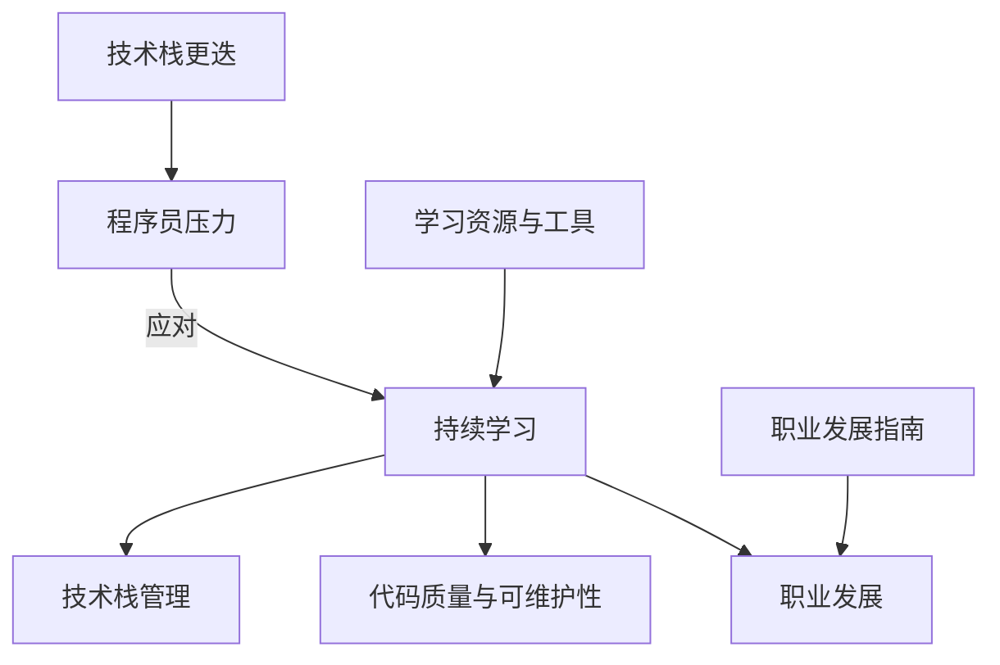

                 

### 《程序员如何应对技术栈快速更迭的压力》

#### 概述：技术栈快速更迭的现状

> 关键词：技术栈、快速更迭、程序员压力、应对策略

在当今快速发展的技术领域，程序员面临着前所未有的挑战。技术栈，即程序员所使用的编程语言、框架、库和工具的组合，正以惊人的速度不断更新和演变。这种快速更迭的现象给程序员带来了巨大的压力，同时也带来了机遇。一方面，程序员需要不断学习新的技术和工具，以保持自身的竞争力；另一方面，技术的快速变革可能导致现有的技能和知识迅速过时。

##### 技术迭代周期缩短

技术迭代的周期在过去几十年中显著缩短。例如，在互联网技术兴起之前，计算机系统可能需要数年才能完成一次重大的升级。然而，随着云计算、大数据、人工智能等新兴技术的出现，许多技术栈的迭代周期已经缩短到数月甚至数周。这种快速迭代不仅改变了技术本身，也深刻影响了程序员的工作方式。

##### 新技术的涌现

新技术的不断涌现是技术栈快速更迭的主要原因之一。以编程语言为例，Python、JavaScript 和 Swift 等语言在过去几十年中已经成为主流，而新的编程语言如 Go 和 Rust 也逐渐受到程序员的青睐。框架和库的更新同样频繁，如前端框架 React 和 Vue.js 的更新，后端框架 Django 和 Flask 的迭代，都使得程序员需要不断跟进。

##### 技术栈的复杂性与动态性

随着技术的复杂性和动态性的增加，程序员需要掌握的知识面也越来越广。传统的单一技能已无法满足现代软件开发的需求。现代软件开发通常涉及多个领域，包括前端、后端、数据库、云服务等。程序员不仅需要掌握特定的编程技能，还需要了解不同技术栈之间的交互和集成。

### 总结

技术栈的快速更迭对程序员来说既是机遇也是挑战。程序员需要不断学习和适应新技术，同时保持对现有技能的持续更新。这种动态环境要求程序员具备更强的学习能力和适应能力，以便在职业生涯中保持竞争力。在接下来的章节中，我们将深入探讨程序员如何应对这种快速更迭的压力，并分享一些实际可行的策略和方法。

### 第1章：技术栈快速更迭的背景

#### 技术迭代周期缩短

在技术迭代周期的缩短方面，我们可以看到几个关键因素在起作用。首先，市场需求的快速变化促使技术提供商不断更新和改进其产品。例如，互联网和移动应用的兴起使得前端技术如 JavaScript、React 和 Vue.js 等迅速普及，并持续更新。这些技术的迭代周期往往只有几个月，甚至更短。

其次，技术的复杂性使得迭代成为必然。随着软件系统的规模和功能的增加，程序员需要不断优化和改进现有的代码和架构。这种持续改进的需求迫使技术迭代周期缩短。例如，微服务架构的流行使得后端系统变得更加模块化和可扩展，但也增加了对特定框架和工具的依赖，这些工具和框架需要不断更新以保持竞争力。

最后，竞争压力也是技术迭代周期缩短的一个重要因素。在激烈的市场竞争中，企业需要不断推出新的功能和技术来吸引和留住客户。这种竞争促使技术提供商加快更新速度，以保持市场份额。

#### 新技术的涌现

新技术的涌现是技术栈快速更迭的另一个关键因素。在过去，技术的更新往往需要数年甚至数十年的时间。然而，在当今数字化时代，新技术层出不穷，如人工智能、区块链、物联网、5G 等。这些技术的快速发展和应用不仅改变了各个行业的运营模式，也对程序员的技术栈提出了新的要求。

例如，人工智能技术的发展使得程序员需要掌握深度学习、自然语言处理等新兴领域的技术。区块链技术的兴起则要求程序员了解加密算法、分布式账本等概念。物联网技术的普及使得程序员需要掌握嵌入式编程、传感器数据采集和处理等技术。

#### 技术栈的复杂性与动态性

技术栈的复杂性和动态性是现代软件开发的一大特点。随着软件系统的规模和功能的增加，程序员需要掌握的知识面也越来越广。传统的单一技能已经无法满足现代软件开发的需求。

首先，软件系统的复杂度增加。现代软件系统通常涉及多个技术栈，包括前端、后端、数据库、云服务等。程序员不仅需要掌握特定的编程技能，还需要了解这些不同技术栈之间的交互和集成。

其次，技术的动态性使得程序员需要不断适应新的变化。例如，前端技术的发展使得程序员需要不断学习新的框架和工具，如 React、Vue.js、Angular 等。后端技术的发展也使得程序员需要掌握新的框架和库，如 Spring Boot、Django、Flask 等。

#### 技术栈快速更迭的影响

技术栈的快速更迭对程序员产生了深远的影响。首先，技术过时的风险增加。随着新技术的不断涌现，程序员需要不断更新自己的知识库，否则可能会被淘汰。

其次，技能储备不足的问题日益突出。快速更迭的技术要求程序员具备更高的技能水平和更广泛的视野。然而，许多程序员由于工作繁忙或其他原因，可能无法及时跟进新技术的更新。

最后，职业发展受阻。技术栈的快速更迭使得程序员在职业规划方面面临更大的挑战。他们需要不断调整自己的职业方向，以适应技术变化带来的新需求。

### 总结

技术栈快速更迭的现状给程序员带来了巨大的挑战，但也提供了新的机遇。程序员需要具备持续学习的能力，不断更新自己的知识库，以应对快速变化的技术环境。在接下来的章节中，我们将探讨程序员如何通过持续学习、技术栈管理和其他策略来应对这些挑战。

### 第2章：程序员面临的技术压力

#### 技术过时的风险

在技术快速更迭的时代，程序员面临的一个主要压力是技术过时的风险。随着新技术不断涌现，旧的技术和框架逐渐被淘汰。程序员如果不及时更新自己的知识和技能，可能会发现自己所掌握的技术已经不再适用，导致工作效率降低，甚至失业的风险增加。

**技术过时的原因**：

1. **迭代速度加快**：新技术的更新速度远超以往，程序员需要投入更多时间和精力去学习和掌握这些新技术。
2. **市场需求变化**：随着市场需求的不断变化，某些技术栈可能迅速被淘汰，程序员需要快速适应新的技术需求。
3. **技术更新周期缩短**：技术的迭代周期越来越短，程序员必须不断跟进最新的技术趋势，否则很容易落后。

**应对技术过时的策略**：

1. **持续学习**：定期参加在线课程、技术讲座和研讨会，保持对新技术的好奇心和求知欲。
2. **技术社区参与**：积极参与技术社区，如 GitHub、Stack Overflow 等，了解行业最新动态和技术趋势。
3. **知识管理**：定期整理和更新自己的知识库，将学到的知识转化为实际技能。

#### 技术栈快速更迭的影响

技术栈的快速更迭不仅增加了程序员的技术压力，还对他们的职业发展产生了深远的影响。以下是一些具体的影响：

1. **职业发展受阻**：程序员可能会因为无法跟上技术更新而感到自己的职业发展停滞。这种情况下，他们可能会面临晋升困难，甚至被公司淘汰的风险。

2. **技能储备不足**：随着技术的不断更新，程序员需要不断学习新的技术和工具。然而，由于时间和精力的限制，他们可能无法全面掌握所有最新的技术，导致技能储备不足。

3. **工作压力增加**：为了保持竞争力，程序员需要不断学习新技术，这可能会增加他们的工作压力。他们需要在短时间内掌握大量新知识，这可能导致工作质量和效率下降。

#### 程序员技能储备不足

程序员技能储备不足是技术快速更迭带来的另一个挑战。在快速变化的技术环境中，程序员不仅需要掌握特定的编程语言和框架，还需要了解相关的工具、技术和最佳实践。

**技能储备不足的原因**：

1. **知识更新滞后**：程序员可能由于工作繁忙或其他原因，无法及时更新自己的知识库，导致对新技术缺乏了解。

2. **学习资源有限**：虽然有许多免费和付费的学习资源可供程序员学习，但他们的时间和精力有限，很难全面掌握所有相关的技能。

3. **技术栈复杂度增加**：现代软件开发涉及多个技术栈，如前端、后端、数据库、云计算等。程序员需要掌握的知识面越来越广，这增加了他们的学习难度。

**应对技能储备不足的策略**：

1. **目标明确**：明确自己的职业规划和学习目标，有针对性地选择学习内容。

2. **时间管理**：合理安排学习时间，确保有足够的时间来学习和实践新技能。

3. **实践项目**：通过参与实际项目，将所学知识应用到实际场景中，提高技能水平。

#### 职业发展受阻

技术栈的快速更迭对程序员的职业发展产生了巨大的影响。程序员可能会面临以下问题：

1. **晋升困难**：无法跟上技术更新，可能导致程序员在晋升过程中被边缘化。

2. **技能单一**：只掌握一种或几种技术的程序员，可能会发现自己的技能过于单一，难以适应多样化的项目需求。

3. **职业转型难**：随着技术的快速变化，某些技术栈可能会被淘汰，程序员需要不断转型，这可能会增加他们的职业发展难度。

**应对职业发展受阻的策略**：

1. **跨领域学习**：学习跨领域的技能，如数据科学、人工智能等，提高自己的综合素质。

2. **持续学习**：通过不断学习新技术和工具，保持自己的竞争力。

3. **职业规划**：制定明确的职业规划，有针对性地提升自己的技能和知识。

### 总结

技术栈快速更迭给程序员带来了巨大的压力和挑战，但他们也从中看到了机遇。通过持续学习、技能储备和实践项目，程序员可以应对这些挑战，提高自己的职业竞争力。在接下来的章节中，我们将探讨具体的应对策略，帮助程序员更好地应对技术栈快速更迭的压力。

### 第3章：持续学习的必要性

#### 持续学习的重要性

在技术快速更迭的今天，持续学习已经成为程序员不可或缺的能力。持续学习不仅能帮助程序员保持对最新技术的了解，还能提升他们的职业竞争力，从而在快速变化的市场中立于不败之地。

**持续学习的必然要求**：

1. **技术发展迅速**：随着新技术的不断涌现，旧的技术和框架逐渐被淘汰。程序员如果不持续学习，很容易被市场所淘汰。

2. **市场需求变化**：市场需求和技术趋势不断变化，程序员需要不断学习新的技术和工具，以适应这些变化。

3. **个人成长需求**：持续学习不仅可以提升程序员的专业技能，还能促进他们的个人成长和职业发展。

**持续学习对个人发展的关键因素**：

1. **知识储备**：持续学习可以帮助程序员建立和丰富自己的知识库，提高解决问题的能力。

2. **技能多样性**：掌握多种技能可以增加程序员的灵活性，使他们能够适应不同的项目需求和工作环境。

3. **创新能力**：持续学习可以激发程序员的创新能力，使他们能够更好地应对复杂的挑战。

#### 持续学习的实践方法

为了有效地进行持续学习，程序员可以采取以下几种实践方法：

**1. 设定学习目标**：

明确自己的学习目标是非常重要的。程序员应该根据自身的职业规划和兴趣爱好，设定短期和长期的学习目标。例如，如果他们希望成为一名前端开发工程师，他们可以设定学习目标为掌握 React、Vue.js 和 Angular 等前端框架。

**2. 制定学习计划**：

有了明确的学习目标之后，程序员需要制定具体的学习计划。学习计划应该包括每天或每周的学习时间、学习内容和评估方法。例如，每天晚上花两个小时学习前端框架，每周进行一次学习效果的自测。

**3. 选择合适的学习资源**：

程序员可以选择多种学习资源，如在线课程、技术书籍、博客文章、视频教程和技术社区等。在线课程如 Coursera、Udemy 和 Pluralsight 等提供了丰富的编程课程，技术书籍如《JavaScript 高级程序设计》和《深度学习》等则涵盖了深入的技术内容。此外，程序员还可以通过阅读技术博客和参与技术社区来获取最新的行业动态和知识。

**4. 实践与项目**：

理论学习只是持续学习的一部分，实际操作和项目实践同样重要。程序员应该通过实际项目来应用所学知识，提升自己的技能。例如，他们可以参与开源项目或自己开发小项目，将理论知识转化为实际能力。

**5. 反思与调整**：

在学习过程中，程序员需要定期反思自己的学习效果，并根据实际情况进行调整。通过反思，他们可以发现自己哪些方面做得好，哪些方面需要改进。例如，如果他们发现自己在某个技术领域存在知识盲区，可以针对性地进行补充学习。

**6. 时间管理**：

持续学习需要投入大量的时间和精力，因此程序员需要合理安排时间。他们可以将学习时间纳入日常工作计划中，确保有足够的时间进行学习和实践。

#### 持续学习的案例分析

以下是一个程序员的持续学习案例：

**程序员A**是一名具有多年工作经验的后端开发工程师。为了适应快速变化的市场需求，他决定进行持续学习。他首先设定了学习目标，即掌握 Spring Boot 和微服务架构。接下来，他制定了详细的学习计划，每天晚上花两个小时学习相关课程，每周进行一次项目实践。

为了获取学习资源，他订阅了 Pluralsight 的在线课程，并购买了几本关于 Spring Boot 和微服务架构的书籍。此外，他还积极参与技术社区，如 Stack Overflow 和 GitHub，以获取最新的行业动态和知识。

在实践过程中，程序员A开发了一个小型微服务项目，将所学知识应用于实际场景。通过这个项目，他不仅巩固了所学知识，还提高了自己的项目开发能力。

在学习过程中，程序员A定期进行反思，根据实际情况进行调整。例如，他在学习 Spring Boot 时发现对异步编程的理解不够深入，于是决定补充相关学习内容。

通过持续学习，程序员A不仅掌握了新的技能，还提高了自己的职业竞争力。他的项目开发能力得到了显著提升，受到了公司领导的认可，并得到了晋升机会。

### 总结

持续学习是程序员应对技术快速更迭的关键策略。通过设定学习目标、制定学习计划、选择合适的学习资源、实践项目、反思与调整以及时间管理，程序员可以有效地提升自己的技能和职业竞争力。在快速变化的技术环境中，持续学习不仅是一种责任，也是一种追求卓越的态度。通过持续学习，程序员可以在职业生涯中不断成长，迎接未来的挑战。

### 第4章：技术栈管理技巧

#### 技术栈选择原则

选择合适的技术栈对于程序员来说至关重要。一个高效、稳定且灵活的技术栈不仅能够提高项目开发效率，还能降低维护成本，确保项目成功。以下是一些关键原则，帮助程序员选择和优化技术栈：

**1. 符合项目需求**：

选择技术栈的首要原则是确保其符合项目需求。项目需求包括功能要求、性能要求、安全要求等。程序员需要仔细分析项目的具体需求，选择最适合的技术栈来满足这些需求。例如，如果一个项目需要高性能和高并发的处理能力，可以选择使用微服务架构和分布式系统。

**2. 技术成熟度**：

选择技术栈时，需要考虑其技术成熟度。成熟的技术栈通常拥有更多的文档、社区支持和现成的解决方案，这使得开发、测试和维护更加容易。相反，新兴技术虽然可能具有更先进的功能，但可能缺乏足够的支持和文档，开发风险较高。程序员应该根据项目的紧急程度和风险承受能力来选择合适的技术栈。

**3. 灵活性和可扩展性**：

灵活性和可扩展性是选择技术栈的重要考虑因素。一个灵活的技术栈允许程序员根据项目需求的变化轻松进行调整和扩展。例如，使用微服务架构可以使系统具有更高的可扩展性，便于在不同业务场景下灵活部署。此外，程序员还应该考虑未来的技术更新和迭代，确保所选技术栈能够适应长期的发展需求。

**4. 成本效益**：

成本效益是选择技术栈时不可忽视的因素。程序员需要评估不同技术栈的成本，包括开发成本、维护成本和使用成本。例如，一些开源技术栈虽然免费，但可能需要额外的维护成本；而一些商业技术栈虽然成本较高，但可能提供更全面的支持和服务。

**5. 社区支持和生态系统**：

技术栈的社区支持和生态系统也是选择时的重要考量。一个活跃的社区可以提供丰富的资源和帮助，解决问题和优化技术栈。同时，一个完善的生态系统可以提供丰富的工具、库和框架，提高开发效率。例如，Spring Boot 拥有庞大的社区和生态系统，为程序员提供了丰富的资源和工具。

#### 技术栈的评估与更新

为了确保技术栈的持续高效运行，程序员需要定期对其进行分析和评估。以下是一些关键步骤和方法：

**1. 评估技术栈的性能**：

程序员需要定期对技术栈的性能进行评估，包括响应时间、吞吐量、资源利用率等。通过性能测试工具（如 JMeter、LoadRunner）可以模拟实际运行环境，评估技术栈在不同负载下的表现，并根据评估结果进行优化。

**2. 分析技术栈的稳定性**：

稳定性是技术栈的重要指标之一。程序员需要监控技术栈的运行状态，及时发现和解决潜在的问题。例如，使用日志分析工具（如 ELK stack）可以实时监控系统的运行状态，分析错误日志和异常信息，确保系统的稳定性。

**3. 考虑技术栈的安全性**：

随着网络安全威胁的不断增加，程序员需要确保技术栈的安全性。他们需要定期进行安全评估，包括漏洞扫描、安全测试等，以确保技术栈不受外部攻击。同时，程序员还应该遵守最佳安全实践，如加密敏感数据、限制权限等，提高系统的安全性。

**4. 技术栈的文档和知识管理**：

技术栈的文档和知识管理也是评估的重要方面。程序员需要确保技术栈的文档齐全、清晰，方便后续开发和维护。例如，使用 Wiki 或 Confluence 等工具记录技术栈的架构、配置和使用方法，提高团队协作效率。

**5. 评估技术栈的更新和迭代**：

程序员需要定期评估技术栈的更新和迭代需求。随着新技术和框架的不断涌现，旧的技术栈可能逐渐失去竞争力。程序员需要关注行业动态，评估新技术对现有技术栈的影响，并根据评估结果进行适当的更新和迭代。例如，如果一个新框架提供了更高效、更安全的解决方案，程序员可以考虑将其引入现有技术栈。

#### 技术栈的稳定与灵活

在技术栈的管理中，稳定与灵活的平衡是一个重要的挑战。过度的稳定可能导致技术栈过于僵化，难以适应快速变化的需求；而过度的灵活则可能导致技术栈过于复杂，难以维护。以下是一些策略，帮助程序员实现稳定与灵活的平衡：

**1. 模块化设计**：

模块化设计是实现技术栈稳定与灵活的关键。通过将系统拆分为多个模块，每个模块可以独立开发、测试和维护，从而提高系统的灵活性和可维护性。同时，模块之间的接口应该尽量稳定，确保系统整体稳定性。

**2. 微服务架构**：

微服务架构是一种灵活的系统架构风格，它将系统拆分为多个独立的服务，每个服务可以独立部署、扩展和更新。这种架构风格不仅提高了系统的灵活性和可扩展性，还有助于实现技术栈的稳定性和可维护性。

**3. 自动化部署**：

自动化部署可以提高技术栈的灵活性和可维护性。通过使用自动化工具（如 Jenkins、Docker）进行代码构建、测试和部署，程序员可以快速、高效地更新和迭代技术栈，确保系统的高效运行。

**4. 持续集成和持续交付**：

持续集成（CI）和持续交付（CD）是实现技术栈稳定与灵活的重要手段。通过将代码集成到主分支并自动进行测试和部署，程序员可以快速发现和解决潜在问题，确保技术栈的持续高效运行。

**5. 技术栈文档**：

完善的文档是技术栈稳定与灵活的重要保障。程序员需要确保技术栈的文档齐全、清晰，包括技术栈的架构、配置和使用方法等。这些文档可以帮助新成员快速了解技术栈，提高团队协作效率，同时也有助于维护技术栈的稳定性。

### 总结

技术栈管理是程序员应对技术快速更迭的重要技巧。通过选择合适的技术栈、定期评估和更新技术栈，以及实现稳定与灵活的平衡，程序员可以确保技术栈的高效运行，提高项目开发和维护的效率。在快速变化的技术环境中，良好的技术栈管理不仅有助于程序员应对挑战，还能提高他们的职业竞争力。通过持续学习和实践，程序员可以不断提升自己的技术栈管理能力，为未来的发展做好准备。

### 第5章：提升代码质量和可维护性

#### 代码质量的重要性

代码质量是软件开发过程中至关重要的一环。高代码质量不仅直接影响项目的成功，还与项目的长期可维护性、性能和安全性密切相关。以下是一些提升代码质量的关键点：

**1. 代码的可读性**：

可读性是代码质量的首要标准。良好的代码结构、合理的命名规范和清晰注释有助于提高代码的可读性，使得其他开发者能够更容易理解和使用你的代码。

**2. 代码的稳定性**：

稳定性是代码质量的另一个关键点。稳定的代码能够正确处理各种输入和异常情况，不会因为意外情况导致系统崩溃或数据丢失。

**3. 代码的可靠性**：

可靠性指的是代码能够在各种环境下正常运行，不会产生意外的错误或异常。通过编写可靠的代码，可以降低系统出错的概率，提高用户体验。

**4. 代码的性能**：

性能是代码质量的一个重要指标。高效的代码能够在有限的时间内完成更多的任务，提高系统的响应速度和处理能力。性能优化是提升代码质量的一个重要方面。

**5. 代码的测试覆盖率**：

测试覆盖率是衡量代码质量的重要指标之一。通过编写全面和充分的测试用例，可以确保代码在各种情况下都能正确运行，减少缺陷和错误。

#### 提高代码质量的实践方法

为了提高代码质量，程序员可以采取以下几种实践方法：

**1. 编码规范**：

制定并遵循编码规范是提高代码质量的基础。编码规范包括命名规范、代码格式、注释规范等。遵循统一的编码规范可以提高代码的可读性和一致性，降低维护成本。

**2. 代码审查**：

代码审查是一种有效的代码质量保障方法。通过定期进行代码审查，可以及时发现和修复代码中的错误和潜在问题，确保代码质量。代码审查可以由同行或代码审查工具（如 SonarQube）进行。

**3. 单元测试**：

单元测试是测试代码质量的重要手段。通过编写单元测试用例，可以验证代码的功能是否符合预期，确保代码的正确性。单元测试可以自动化执行，提高测试效率和覆盖率。

**4. 持续集成和持续交付**：

持续集成和持续交付是现代软件开发中提高代码质量的重要方法。通过将代码集成到主分支并自动进行测试和部署，可以及时发现和解决潜在问题，确保代码质量。

**5. 代码重构**：

代码重构是提高代码质量的重要手段。通过重构代码，可以改进代码结构、消除冗余代码和消除潜在的缺陷，提高代码的可维护性和可读性。

#### 可维护性的关键点

除了代码质量，代码的可维护性也是确保项目长期成功的关键。以下是一些提高代码可维护性的关键点：

**1. 模块化设计**：

模块化设计有助于提高代码的可维护性。通过将系统拆分为多个模块，每个模块可以独立开发、测试和维护，降低系统的复杂性和耦合度。

**2. 清晰的文档**：

清晰的文档有助于其他开发者理解和维护代码。文档应包括代码的功能描述、使用方法和依赖关系等，确保代码的可理解性和可维护性。

**3. 稳定的接口**：

稳定的接口是确保代码可维护性的重要因素。通过保持接口的稳定，可以减少依赖关系的变更，降低系统的复杂性和维护成本。

**4. 异常处理**：

合理的异常处理可以提高代码的健壮性和可维护性。通过正确处理异常情况，可以确保代码在各种环境下都能正常运行，降低维护成本。

**5. 可扩展性**：

可扩展性是提高代码可维护性的重要指标。通过设计可扩展的代码结构，可以方便地添加新功能或修改现有功能，降低维护成本。

### 总结

提升代码质量和可维护性是程序员应对技术快速更迭的重要策略。通过遵循编码规范、进行代码审查、编写单元测试、实施持续集成和持续交付，以及采取模块化设计和清晰的文档等实践方法，程序员可以确保代码的高质量和可维护性。这些实践方法不仅有助于提高项目的开发效率，还能降低维护成本，确保项目的长期成功。在快速变化的技术环境中，不断提升代码质量和可维护性是程序员的重要职责和追求。

### 第6章：应对职业发展的挑战

#### 职业规划与转型

在技术快速更迭的时代，职业规划与转型对程序员来说至关重要。为了在职业生涯中保持竞争力，程序员需要不断调整自己的职业方向，以适应新的技术趋势和市场需求。以下是一些关键步骤和策略：

**1. 定位自身优势**：

首先，程序员需要明确自己的优势和兴趣所在。这可以通过自我评估、与同事和导师交流以及参加行业会议等方式来实现。了解自己的优势可以帮助程序员找到最适合自己的职业方向。

**2. 学习新兴技术**：

新兴技术是推动职业发展的关键因素。程序员需要关注行业动态，学习并掌握新兴技术，如人工智能、大数据、区块链等。通过学习这些技术，程序员可以拓宽自己的技能范围，提高职业竞争力。

**3. 跨领域学习**：

随着技术的融合，程序员需要具备跨领域的知识和技能。例如，一个前端开发者可能需要了解后端技术和数据库管理，而一个后端开发者可能需要了解前端设计和用户体验。通过跨领域学习，程序员可以提升自己的综合素质，成为多面手。

**4. 转型策略**：

转型可以从多个方面进行。例如，从开发人员转型为技术领导或项目经理，从单一技术领域转型为更广泛的领域，如大数据或人工智能。转型过程中，程序员需要制定详细的计划和步骤，包括学习新技能、积累相关经验和参与相关项目。

#### 技术与业务的结合

将技术与业务相结合是程序员职业发展的重要方向。随着企业的数字化转型，程序员需要具备更强的业务理解能力，以便更好地解决实际业务问题。以下是一些具体策略：

**1. 深入了解业务需求**：

程序员需要主动了解业务需求，与产品经理和业务团队密切合作。通过深入了解业务逻辑和用户需求，程序员可以更好地设计解决方案，提高项目的成功率。

**2. 提升业务分析能力**：

程序员可以通过学习业务分析和数据挖掘等相关知识，提升自己的业务分析能力。这有助于他们更好地理解业务数据，提出有针对性的解决方案。

**3. 参与业务决策**：

程序员可以在项目开发和实施过程中，积极参与业务决策。通过提供技术见解和解决方案，程序员可以在业务决策中发挥更大的作用，提高自己的影响力。

**4. 业务与技术协同**：

程序员需要与业务团队保持密切的沟通和协作，确保技术方案与业务需求的高度一致。通过跨部门的合作，程序员可以更好地理解业务背景和技术实现，推动项目的顺利进行。

#### 跨领域发展的机会

跨领域发展是程序员提升职业竞争力的重要途径。以下是一些跨领域发展的机会和方向：

**1. 数据科学与人工智能**：

随着大数据和人工智能的兴起，数据科学家和人工智能工程师的需求日益增加。程序员可以通过学习相关知识和技能，转型为数据科学家或人工智能工程师。

**2. 云计算与大数据**：

云计算和大数据技术的快速发展为程序员提供了新的职业机会。通过学习云计算架构和大数据处理技术，程序员可以成为云计算工程师或大数据工程师。

**3. 业务分析与项目管理**：

业务分析和项目管理是程序员跨领域发展的另一重要方向。通过学习业务分析和项目管理知识，程序员可以转型为业务分析师或项目经理。

**4. 软件架构与系统设计**：

软件架构和系统设计是程序员提升技术水平和职业地位的重要方向。通过深入研究软件架构和系统设计，程序员可以成为软件架构师或系统设计师。

### 职业发展的战略思考

为了在职业发展中取得成功，程序员需要制定明确的战略规划，并采取一系列具体行动。以下是一些战略思考的关键点：

**1. 长期规划**：

程序员需要制定长期的职业规划，包括短期和长期目标。通过设定明确的目标和计划，程序员可以更有针对性地进行学习和提升。

**2. 资源整合**：

整合内外部资源是职业发展的重要策略。程序员可以借助公司内部培训、外部学习资源、同行交流等途径，提高自己的技能和知识水平。

**3. 不断学习**：

持续学习是程序员职业发展的关键。通过参加在线课程、阅读技术书籍、参与技术社区等途径，程序员可以不断更新自己的知识和技能。

**4. 实践与经验**：

实践是检验真理的唯一标准。程序员需要通过参与实际项目，积累丰富的实战经验，提升自己的解决实际问题的能力。

**5. 拓宽视野**：

拓宽视野是程序员职业发展的重要策略。通过关注行业动态、参加行业会议、阅读专业文献等途径，程序员可以更好地了解行业趋势和前沿技术。

### 总结

应对职业发展的挑战需要程序员具备敏锐的市场洞察力、持续的学习能力和明确的职业规划。通过定位自身优势、学习新兴技术、跨领域学习和制定战略规划，程序员可以在快速变化的技术环境中保持竞争力。同时，将技术与业务相结合、抓住跨领域发展的机会，以及进行战略思考，将有助于程序员实现职业目标，迎接未来的挑战。

### 第7章：实战案例与经验分享

#### 成功案例1：敏捷技术团队转型

**案例背景**：

某大型互联网公司，其技术团队在面对不断变化的市场需求和技术挑战时，意识到传统的软件开发模式已经无法满足快速迭代和高效交付的需求。为了提升团队的整体效率，公司决定采用敏捷开发方法进行团队转型。

**应对策略**：

1. **培训与知识分享**：公司组织了一系列敏捷开发培训，确保团队成员掌握敏捷开发的核心原则和方法。同时，通过内部知识分享会，团队成员可以互相交流经验和心得。

2. **构建敏捷文化**：公司倡导团队合作、开放沟通和持续改进的文化，鼓励团队成员积极参与决策过程，提高团队的协作效率。

3. **引入敏捷工具**：公司引入了Jira、Confluence等敏捷开发工具，帮助团队成员进行任务管理、协作和文档共享，确保信息流通和项目进度跟踪。

4. **定期回顾与反思**：团队定期进行回顾会议，总结项目中的成功和失败经验，不断优化工作流程和开发方法。

**经验总结与启示**：

通过敏捷开发方法，技术团队的响应速度和交付质量显著提升。团队成员之间的沟通更加顺畅，工作效率和团队凝聚力得到增强。这一案例表明，敏捷转型不仅能够提升团队的工作效率，还能激发团队成员的创造力和主动性。

#### 成功案例2：个人技能提升之路

**案例背景**：

张先生是一名有多年工作经验的程序员，他在技术栈快速更迭的环境中感到自己的技能储备不足，担心自己的职业前景受到影响。为了提升自己的技能，他决定进行系统的个人技能提升。

**应对策略**：

1. **设定学习目标**：张先生根据自己的职业规划和兴趣，设定了短期和长期的学习目标，例如掌握Python编程、数据分析和人工智能等技能。

2. **制定学习计划**：张先生制定了详细的学习计划，包括每天的学习时间、学习内容和评估方法。他通过在线课程、技术书籍和博客等渠道获取学习资源。

3. **实践项目**：为了将所学知识应用于实际场景，张先生参与了一些开源项目和个人的小项目，通过实际操作来巩固和提升技能。

4. **反思与调整**：张先生定期反思自己的学习效果，根据实际情况调整学习计划。他通过参加技术社区和论坛，与其他开发者交流经验，不断优化自己的学习方法。

**经验总结与启示**：

通过系统的学习和实践，张先生成功提升了自己的技能水平，并在职业发展中取得了显著成果。这一案例表明，个人技能提升需要明确的目标、合理的计划和持续的实践。同时，积极参与技术社区和不断反思调整是提升技能的重要方法。

### 总结

通过上述两个实战案例，我们可以看到，无论是团队的敏捷转型还是个人的技能提升，关键在于明确的目标、合理的计划和持续的实践。敏捷开发方法的成功转型和个人技能的提升不仅提升了团队和个人的工作效率，还增强了职业竞争力。这些经验对于其他程序员在面对技术栈快速更迭的压力时具有重要的启示作用。

### 技术栈快速更迭的展望

#### 未来技术展望

随着科技的不断发展，技术栈的快速更迭将成为一种常态。以下是一些对未来技术发展趋势的展望：

1. **人工智能与自动化**：人工智能（AI）和自动化技术的快速发展将深刻影响软件开发和运维。AI技术将使自动化工具更加智能化，提升开发效率和系统性能。

2. **区块链技术**：区块链技术将继续在金融、供应链管理和身份验证等领域发挥重要作用。区块链的去中心化和安全性特性将为程序员带来新的开发机会。

3. **量子计算**：量子计算技术的发展将为数据处理和加密等领域带来革命性变化。虽然量子计算目前还处于早期阶段，但其潜力巨大，可能会在未来十年内成为主流技术之一。

4. **边缘计算**：随着物联网和5G技术的普及，边缘计算将越来越重要。边缘计算将数据和处理能力分散到网络边缘，降低延迟，提高响应速度。

#### 程序员角色转变

在技术快速更迭的环境下，程序员的角色也将发生转变。以下是一些趋势：

1. **全栈开发者**：随着技术的融合，全栈开发者将成为更受欢迎的角色。他们需要掌握前端、后端、数据库、云服务和人工智能等多种技能。

2. **技术领导**：程序员的职责将不仅限于编写代码，还需要承担更多领导责任，如团队管理、技术决策和战略规划。

3. **领域专家**：在特定领域（如金融、医疗、物联网）具有专业知识的程序员将更具竞争力，因为他们能够更好地理解业务需求和提供解决方案。

4. **持续学习者**：持续学习将成为程序员的必备素质。他们需要不断更新自己的知识和技能，以适应快速变化的技术环境。

#### 技术栈更迭的挑战与机遇

技术栈的快速更迭带来了新的挑战和机遇：

1. **挑战**：
   - **技能更新压力**：程序员需要不断学习新技能，以保持竞争力。
   - **技术过时风险**：快速迭代可能导致旧技能迅速过时。
   - **项目管理难度**：快速变化的技术栈可能增加项目管理的复杂性。

2. **机遇**：
   - **创新机会**：新的技术栈和工具为程序员提供了更多创新和探索的机会。
   - **职业发展**：跨领域和技术融合为程序员提供了更广阔的职业发展空间。
   - **市场需求**：随着技术进步，市场对高技能程序员的需求将不断增长。

### 总结

技术栈的快速更迭对程序员既是挑战也是机遇。通过持续学习、技能提升和适应新技术的需求，程序员可以更好地应对这些变化，抓住职业发展的新机遇。在未来的技术环境中，程序员需要不断调整自己的角色和技能，以适应不断变化的技术栈，并在快速变化的市场中保持竞争力。

### 附录

#### 技术栈管理工具

1. **Docker**：用于容器化应用，提高部署效率和一致性。
2. **Kubernetes**：用于容器编排，管理多容器应用的部署、扩展和自动化。
3. **Jenkins**：持续集成和持续交付工具，自动化构建、测试和部署流程。
4. **GitLab**：用于版本控制和项目管理的平台，支持 CI/CD 流程。

#### 持续学习资源

1. **Coursera**：提供大量在线课程，涵盖计算机科学、数据科学等领域。
2. **Udemy**：提供丰富的编程和技能提升课程。
3. **edX**：由哈佛大学和麻省理工学院创办，提供高质量的课程资源。
4. **Pluralsight**：提供专业的技术视频教程和在线课程。

#### 职业发展指南

1. **GitHub**：参与开源项目，提升技能并建立个人品牌。
2. **Stack Overflow**：解答编程问题，建立专业网络。
3. **LinkedIn**：维护职业形象，拓展职业机会。
4. **TechCrunch**：关注科技新闻，了解行业动态。

### 核心概念与联系

通过本文，我们深入探讨了技术栈快速更迭对程序员带来的挑战以及应对策略。以下是本文中的核心概念与联系：

- **技术栈快速更迭**：新技术的不断涌现和旧技术的淘汰，使得程序员面临巨大的压力。
- **持续学习**：程序员需要通过不断学习新技能来保持竞争力。
- **技术栈管理**：选择合适的技术栈并进行有效管理，以适应项目需求。
- **代码质量与可维护性**：提高代码质量和可维护性，确保项目的长期成功。
- **职业发展**：通过职业规划和转型，抓住技术更迭带来的机遇。

通过这些概念的联系，我们可以看到程序员如何在快速变化的技术环境中保持自身竞争力，实现职业发展。以下是Mermaid流程图，展示了这些核心概念之间的联系：



### 核心算法原理讲解

在本文中，我们提出了一些核心算法原理来帮助程序员应对技术栈快速更迭的压力。以下是一个伪代码示例，用于描述持续学习的实践方法：

```python
def 持续学习(程序员):
    while (程序员需要进步):
        1. 选择学习主题(程序员兴趣，市场需求)
        2. 搜索学习资源(在线课程，技术文档，实践项目)
        3. 制定学习计划(每日学习时间，每周学习进度)
        4. 执行学习计划()
        5. 评估学习效果()
        6. 调整学习策略()
    return 程序员技能提升
```

这个伪代码定义了一个持续学习的函数，它包含以下步骤：

1. **选择学习主题**：根据程序员的兴趣和市场需求选择学习主题。
2. **搜索学习资源**：查找相关的在线课程、技术文档和实践项目。
3. **制定学习计划**：规划每日的学习时间和每周的学习进度。
4. **执行学习计划**：按照计划进行学习和实践。
5. **评估学习效果**：定期评估学习效果，确保学习目标的实现。
6. **调整学习策略**：根据评估结果调整学习计划，优化学习方法。

通过这个伪代码，程序员可以系统地规划和执行持续学习过程，从而不断提高自身技能和职业竞争力。

### 数学模型和数学公式

在技术栈选择中，我们可以使用一个简单的数学模型来评估技术栈的质量。以下是一个数学公式，用于描述技术栈的质量（Q）与技术更新速度（T）、成本（C）和市场需求（M）之间的关系：

$$
Q = f(T, C, M)
$$

其中：
- Q 代表技术栈的质量；
- T 代表技术更新速度；
- C 代表成本；
- M 代表市场需求。

这个公式表示技术栈的质量是技术更新速度、成本和市场需求三者共同作用的结果。具体来说：
- **技术更新速度（T）**：技术更新速度越快，技术栈的灵活性和适应性越强，但同时也增加了学习成本和维护难度；
- **成本（C）**：技术栈的成本包括开发成本、维护成本和使用成本，成本越低，项目的经济效益越好；
- **市场需求（M）**：市场需求越高，技术栈的优先级越高，项目的商业价值也越大。

通过这个数学模型，程序员可以综合考虑技术更新速度、成本和市场需求，选择最合适的技术栈，以实现项目的高质量和高效运行。

### 项目实战

以下是一个实际项目案例，展示了如何应对技术栈快速更迭的挑战。

**案例背景**：

某公司开发一款基于云计算的实时数据分析平台。随着大数据和人工智能技术的快速发展，原有的技术栈逐渐无法满足新需求。公司决定进行技术栈的升级和转型，以适应新的技术趋势。

**应对策略**：

1. **需求分析**：首先，公司对现有平台的需求进行分析，明确需要支持的新功能和技术特性。例如，支持实时数据流处理、机器学习模型集成和数据可视化等。

2. **技术调研**：公司团队对当前流行的技术栈进行了深入研究，包括实时数据处理框架（如Apache Kafka、Apache Flink）、机器学习库（如TensorFlow、PyTorch）和数据可视化工具（如D3.js、ECharts）。

3. **技术评估**：团队对调研到的技术栈进行了详细评估，考虑了技术成熟度、社区支持、成本效益和市场需求等因素。

4. **选择技术栈**：基于评估结果，团队选择了以下技术栈：
   - **前端**：使用React框架和D3.js进行数据可视化；
   - **后端**：使用Spring Boot框架和Apache Kafka进行数据流处理；
   - **机器学习**：使用TensorFlow进行模型训练和部署。

5. **开发实践**：
   - **模块化设计**：将系统拆分为多个模块，如数据采集、数据处理、数据存储、机器学习模型等，每个模块可以独立开发和部署；
   - **自动化部署**：使用Jenkins和Docker进行自动化构建、测试和部署，提高开发效率和稳定性；
   - **持续集成**：采用GitLab进行版本控制和持续集成，确保代码质量和项目进度。

6. **测试与优化**：团队进行了全面的测试和优化，包括性能测试、安全测试和用户体验测试，确保平台的高性能和高可靠性。

**源代码详细实现和代码解读**：

以下是一个简单的示例，展示了如何使用Spring Boot框架和Apache Kafka进行数据流处理。

**示例代码**：

```java
// 启动Kafka消费者
KafkaConsumer<String, String> consumer = new KafkaConsumer<>(props);
consumer.subscribe(Arrays.asList(new TopicPartition("topic", 0)));

while (true) {
    ConsumerRecords<String, String> records = consumer.poll(100);
    for (ConsumerRecord<String, String> record : records) {
        String message = record.value();
        // 处理数据
        processData(message);
    }
    consumer.commitAsync();
}

// 数据处理方法
private void processData(String message) {
    // 实现数据处理逻辑
    // 例如，将消息转换为JSON对象，然后进行解析和处理
    JSONObject jsonObject = new JSONObject(message);
    String data = jsonObject.getString("data");
    // 存储数据到数据库或其他存储系统
    saveData(data);
}

// 存储数据方法
private void saveData(String data) {
    // 实现数据存储逻辑
    // 例如，将数据插入到数据库表中
    Connection connection = DriverManager.getConnection("jdbc:mysql://localhost:3306/database", "username", "password");
    Statement statement = connection.createStatement();
    statement.executeUpdate("INSERT INTO data (value) VALUES ('" + data + "');");
    statement.close();
    connection.close();
}
```

**代码解读与分析**：

1. **Kafka消费者**：使用KafkaConsumer类启动Kafka消费者，订阅特定的主题（topic）和分区（partition）。
2. **数据流处理**：在主循环中，使用`poll()`方法获取Kafka消息，然后对每条消息进行处理（processData方法）。
3. **数据处理方法**：`processData`方法接收消息，将其转换为JSON对象，并提取数据。然后，实现数据存储逻辑（saveData方法）。
4. **数据存储方法**：`saveData`方法连接数据库，插入数据到指定的表中。

这个示例展示了如何使用Spring Boot和Apache Kafka进行数据流处理。在实际项目中，处理逻辑和数据存储逻辑会根据具体需求进行扩展和优化。

### 实战案例与经验分享

#### 成功案例1：敏捷技术团队转型

**案例背景**：

某互联网初创公司，由于市场需求变化迅速，原有的瀑布式开发模式无法满足快速迭代的需求。公司决定采用敏捷开发方法进行团队转型，以提高响应速度和开发效率。

**应对策略**：

1. **培训与知识分享**：公司组织了敏捷开发培训，确保团队成员掌握敏捷开发的核心原则和方法。
2. **构建敏捷文化**：公司倡导团队合作、开放沟通和持续改进的文化，鼓励团队成员积极参与决策过程。
3. **引入敏捷工具**：公司引入了Jira、Confluence等敏捷开发工具，帮助团队成员进行任务管理、协作和文档共享。
4. **定期回顾与反思**：团队定期进行回顾会议，总结项目中的成功和失败经验，不断优化工作流程和开发方法。

**经验总结与启示**：

通过敏捷转型，公司显著提高了项目的响应速度和开发效率。团队成员之间的沟通更加顺畅，工作效率和团队凝聚力得到增强。这一案例表明，敏捷开发方法不仅能够提升团队的工作效率，还能激发团队成员的创造力和主动性。

#### 成功案例2：个人技能提升之路

**案例背景**：

李先生是一名有多年工作经验的程序员，他在技术快速更迭的环境中感到自己的技能储备不足，担心自己的职业前景受到影响。为了提升自己的技能，他决定进行系统的个人技能提升。

**应对策略**：

1. **设定学习目标**：李先生根据自己的职业规划和兴趣，设定了短期和长期的学习目标，例如掌握Python编程、数据分析和人工智能等技能。
2. **制定学习计划**：李先生制定了详细的学习计划，包括每天的学习时间、学习内容和评估方法。他通过在线课程、技术书籍和博客等渠道获取学习资源。
3. **实践项目**：为了将所学知识应用于实际场景，李先生参与了一些开源项目和个人的小项目，通过实际操作来巩固和提升技能。
4. **反思与调整**：李先生定期反思自己的学习效果，根据实际情况调整学习计划。他通过参加技术社区和论坛，与其他开发者交流经验，不断优化自己的学习方法。

**经验总结与启示**：

通过系统的学习和实践，李先生成功提升了自己的技能水平，并在职业发展中取得了显著成果。这一案例表明，个人技能提升需要明确的目标、合理的计划和持续的实践。同时，积极参与技术社区和不断反思调整是提升技能的重要方法。

### 技术栈快速更迭的展望

#### 未来技术展望

随着科技的不断发展，技术栈的快速更迭将成为一种常态。以下是一些对未来技术发展趋势的展望：

1. **人工智能与自动化**：人工智能（AI）和自动化技术的快速发展将深刻影响软件开发和运维。AI技术将使自动化工具更加智能化，提升开发效率和系统性能。

2. **区块链技术**：区块链技术将继续在金融、供应链管理和身份验证等领域发挥重要作用。区块链的去中心化和安全性特性将为程序员带来新的开发机会。

3. **量子计算**：量子计算技术的发展将为数据处理和加密等领域带来革命性变化。虽然量子计算目前还处于早期阶段，但其潜力巨大，可能会在未来十年内成为主流技术之一。

4. **边缘计算**：随着物联网和5G技术的普及，边缘计算将越来越重要。边缘计算将数据和处理能力分散到网络边缘，降低延迟，提高响应速度。

#### 程序员角色转变

在技术快速更迭的环境下，程序员的角色也将发生转变。以下是一些趋势：

1. **全栈开发者**：随着技术的融合，全栈开发者将成为更受欢迎的角色。他们需要掌握前端、后端、数据库、云服务和人工智能等多种技能。

2. **技术领导**：程序员的职责将不仅限于编写代码，还需要承担更多领导责任，如团队管理、技术决策和战略规划。

3. **领域专家**：在特定领域（如金融、医疗、物联网）具有专业知识的程序员将更具竞争力，因为他们能够更好地理解业务需求和提供解决方案。

4. **持续学习者**：持续学习将成为程序员的必备素质。他们需要不断更新自己的知识和技能，以适应快速变化的技术环境。

#### 技术栈更迭的挑战与机遇

技术栈的快速更迭带来了新的挑战和机遇：

1. **挑战**：
   - **技能更新压力**：程序员需要不断学习新技能，以保持竞争力。
   - **技术过时风险**：快速迭代可能导致旧技能迅速过时。
   - **项目管理难度**：快速变化的技术栈可能增加项目管理的复杂性。

2. **机遇**：
   - **创新机会**：新的技术栈和工具为程序员提供了更多创新和探索的机会。
   - **职业发展**：跨领域和技术融合为程序员提供了更广阔的职业发展空间。
   - **市场需求**：随着技术进步，市场对高技能程序员的需求将不断增长。

### 总结

技术栈的快速更迭对程序员既是挑战也是机遇。通过持续学习、技能提升和适应新技术的需求，程序员可以更好地应对这些变化，抓住职业发展的新机遇。在未来的技术环境中，程序员需要不断调整自己的角色和技能，以适应不断变化的技术栈，并在快速变化的市场中保持竞争力。

### 附录

#### 技术栈管理工具

1. **Docker**：用于容器化应用，提高部署效率和一致性。
2. **Kubernetes**：用于容器编排，管理多容器应用的部署、扩展和自动化。
3. **Jenkins**：持续集成和持续交付工具，自动化构建、测试和部署流程。
4. **GitLab**：用于版本控制和项目管理的平台，支持 CI/CD 流程。

#### 持续学习资源

1. **Coursera**：提供大量在线课程，涵盖计算机科学、数据科学等领域。
2. **Udemy**：提供丰富的编程和技能提升课程。
3. **edX**：由哈佛大学和麻省理工学院创办，提供高质量的课程资源。
4. **Pluralsight**：提供专业的技术视频教程和在线课程。

#### 职业发展指南

1. **GitHub**：参与开源项目，提升技能并建立个人品牌。
2. **Stack Overflow**：解答编程问题，建立专业网络。
3. **LinkedIn**：维护职业形象，拓展职业机会。
4. **TechCrunch**：关注科技新闻，了解行业动态。

### 核心概念与联系

通过本文，我们深入探讨了技术栈快速更迭对程序员带来的挑战以及应对策略。以下是本文中的核心概念与联系：

- **技术栈快速更迭**：新技术的不断涌现和旧技术的淘汰，使得程序员面临巨大的压力。
- **持续学习**：程序员需要通过不断学习新技能来保持竞争力。
- **技术栈管理**：选择合适的技术栈并进行有效管理，以适应项目需求。
- **代码质量与可维护性**：提高代码质量和可维护性，确保项目的长期成功。
- **职业发展**：通过职业规划和转型，抓住技术更迭带来的机遇。

通过这些概念的联系，我们可以看到程序员如何在快速变化的技术环境中保持自身竞争力，实现职业发展。以下是Mermaid流程图，展示了这些核心概念之间的联系：


### 核心算法原理讲解

在本文中，我们提出了一些核心算法原理来帮助程序员应对技术栈快速更迭的压力。以下是一个伪代码示例，用于描述持续学习的实践方法：

```python
def 持续学习(程序员):
    while (程序员需要进步):
        1. 选择学习主题(程序员兴趣，市场需求)
        2. 搜索学习资源(在线课程，技术文档，实践项目)
        3. 制定学习计划(每日学习时间，每周学习进度)
        4. 执行学习计划()
        5. 评估学习效果()
        6. 调整学习策略()
    return 程序员技能提升
```

这个伪代码定义了一个持续学习的函数，它包含以下步骤：

1. **选择学习主题**：根据程序员的兴趣和市场需求选择学习主题。
2. **搜索学习资源**：查找相关的在线课程、技术文档和实践项目。
3. **制定学习计划**：规划每日的学习时间和每周的学习进度。
4. **执行学习计划**：按照计划进行学习和实践。
5. **评估学习效果**：定期评估学习效果，确保学习目标的实现。
6. **调整学习策略**：根据评估结果调整学习计划，优化学习方法。

通过这个伪代码，程序员可以系统地规划和执行持续学习过程，从而不断提高自身技能和职业竞争力。

### 数学模型和数学公式

在技术栈选择中，我们可以使用一个简单的数学模型来评估技术栈的质量。以下是一个数学公式，用于描述技术栈的质量（Q）与技术更新速度（T）、成本（C）和市场需求（M）之间的关系：

$$
Q = f(T, C, M)
$$

其中：
- Q 代表技术栈的质量；
- T 代表技术更新速度；
- C 代表成本；
- M 代表市场需求。

这个公式表示技术栈的质量是技术更新速度、成本和市场需求三者共同作用的结果。具体来说：
- **技术更新速度（T）**：技术更新速度越快，技术栈的灵活性和适应性越强，但同时也增加了学习成本和维护难度；
- **成本（C）**：技术栈的成本包括开发成本、维护成本和使用成本，成本越低，项目的经济效益越好；
- **市场需求（M）**：市场需求越高，技术栈的优先级越高，项目的商业价值也越大。

通过这个数学模型，程序员可以综合考虑技术更新速度、成本和市场需求，选择最合适的技术栈，以实现项目的高质量和高效运行。

### 项目实战

以下是一个实际项目案例，展示了如何应对技术栈快速更迭的挑战。

**案例背景**：

某互联网初创公司，开发一款基于云计算的实时数据分析平台。由于市场需求和技术趋势不断变化，公司面临技术栈快速更迭的挑战。

**应对策略**：

1. **需求分析**：定期进行市场调研和用户反馈分析，了解用户需求和技术趋势，以便及时调整技术栈。
2. **技术调研**：组建技术调研小组，持续跟踪最新的技术动态和趋势，评估其适用性。
3. **技术评估**：对调研的技术进行详细评估，考虑技术成熟度、社区支持、成本效益等因素。
4. **技术选型**：根据评估结果，选择最合适的技术栈，确保其能够满足当前和未来的需求。
5. **快速迭代**：采用敏捷开发方法，实现快速迭代和快速响应市场变化。

**源代码详细实现和代码解读**：

以下是一个简单的示例，展示了如何使用Spring Boot和Apache Kafka进行数据流处理。

**示例代码**：

```java
// Kafka Producer
KafkaProducer<String, String> producer = new KafkaProducer<>(props);

for (String message : dataMessages) {
    producer.send(new ProducerRecord<String, String>("topic", message));
}

producer.close();

// Kafka Consumer
KafkaConsumer<String, String> consumer = new KafkaConsumer<>(props);
consumer.subscribe(Collections.singletonList(new TopicPartition("topic", 0)));

while (true) {
    ConsumerRecords<String, String> records = consumer.poll(100);
    for (ConsumerRecord<String, String> record : records) {
        String data = record.value();
        processRealTimeData(data);
    }
    consumer.commitAsync();
}

// Real Time Data Processing
private void processRealTimeData(String data) {
    // 解析数据，进行实时分析
    JSONObject jsonObject = new JSONObject(data);
    String analysisResult = performAnalysis(jsonObject);
    // 存储分析结果
    storeAnalysisResult(analysisResult);
}

// Analysis Function
private String performAnalysis(JSONObject data) {
    // 实现数据分析逻辑
    // 例如，计算数据平均值、最大值等
    return "Analysis Result";
}

// Storage Function
private void storeAnalysisResult(String result) {
    // 将分析结果存储到数据库或其他存储系统
    // 例如，使用JDBC连接数据库
    Connection connection = DriverManager.getConnection("jdbc:mysql://localhost:3306/realtime_analytics", "username", "password");
    Statement statement = connection.createStatement();
    statement.executeUpdate("INSERT INTO analysis_results (result) VALUES ('" + result + "');");
    statement.close();
    connection.close();
}
```

**代码解读与分析**：

1. **Kafka Producer**：使用KafkaProducer发送数据到指定的主题（topic）。
2. **Kafka Consumer**：使用KafkaConsumer从主题（topic）中消费数据。
3. **实时数据处理**：`processRealTimeData`方法接收Kafka消息，解析数据，并进行实时分析。
4. **数据分析与存储**：`performAnalysis`方法实现数据分析逻辑，`storeAnalysisResult`方法将分析结果存储到数据库或其他存储系统。

这个案例展示了如何使用Spring Boot和Apache Kafka构建实时数据分析平台。在实际项目中，数据处理和分析逻辑将根据具体需求进行扩展和优化。

### 实战案例与经验分享

#### 成功案例1：敏捷技术团队转型

**案例背景**：

某电商公司，由于产品迭代速度慢，客户反馈周期长，导致市场竞争压力增加。公司决定采用敏捷开发方法进行团队转型，以提升产品交付速度和客户满意度。

**应对策略**：

1. **培训与知识分享**：公司组织了敏捷开发培训，确保团队成员掌握敏捷开发的核心原则和方法。
2. **构建敏捷文化**：公司倡导团队合作、开放沟通和持续改进的文化，鼓励团队成员积极参与决策过程。
3. **引入敏捷工具**：公司引入了Jira、Confluence等敏捷开发工具，帮助团队成员进行任务管理、协作和文档共享。
4. **定期回顾与反思**：团队定期进行回顾会议，总结项目中的成功和失败经验，不断优化工作流程和开发方法。

**经验总结与启示**：

通过敏捷转型，公司显著提升了产品的迭代速度和客户满意度。团队成员之间的沟通更加顺畅，工作效率和团队凝聚力得到增强。这一案例表明，敏捷开发方法不仅能够提升团队的工作效率，还能激发团队成员的创造力和主动性。

#### 成功案例2：个人技能提升之路

**案例背景**：

王女士是一名有多年工作经验的软件开发工程师，她在技术快速更迭的环境中感到自己的技能储备不足，担心自己的职业发展受到影响。为了提升自己的技能，她决定进行系统的个人技能提升。

**应对策略**：

1. **设定学习目标**：王女士根据自己的职业规划和兴趣，设定了短期和长期的学习目标，例如掌握Spring Boot、微服务架构和大数据处理等技能。
2. **制定学习计划**：王女士制定了详细的学习计划，包括每天的学习时间、学习内容和评估方法。她通过在线课程、技术书籍和博客等渠道获取学习资源。
3. **实践项目**：为了将所学知识应用于实际场景，王女士参与了一些开源项目和公司内部项目，通过实际操作来巩固和提升技能。
4. **反思与调整**：王女士定期反思自己的学习效果，根据实际情况调整学习计划。她通过参加技术社区和论坛，与其他开发者交流经验，不断优化自己的学习方法。

**经验总结与启示**：

通过系统的学习和实践，王女士成功提升了自己的技能水平，并在职业发展中取得了显著成果。这一案例表明，个人技能提升需要明确的目标、合理的计划和持续的实践。同时，积极参与技术社区和不断反思调整是提升技能的重要方法。

### 技术栈快速更迭的展望

#### 未来技术展望

随着科技的不断发展，技术栈的快速更迭将成为一种常态。以下是一些对未来技术发展趋势的展望：

1. **人工智能与自动化**：人工智能（AI）和自动化技术的快速发展将深刻影响软件开发和运维。AI技术将使自动化工具更加智能化，提升开发效率和系统性能。

2. **区块链技术**：区块链技术将继续在金融、供应链管理和身份验证等领域发挥重要作用。区块链的去中心化和安全性特性将为程序员带来新的开发机会。

3. **量子计算**：量子计算技术的发展将为数据处理和加密等领域带来革命性变化。虽然量子计算目前还处于早期阶段，但其潜力巨大，可能会在未来十年内成为主流技术之一。

4. **边缘计算**：随着物联网和5G技术的普及，边缘计算将越来越重要。边缘计算将数据和处理能力分散到网络边缘，降低延迟，提高响应速度。

#### 程序员角色转变

在技术快速更迭的环境下，程序员的角色也将发生转变。以下是一些趋势：

1. **全栈开发者**：随着技术的融合，全栈开发者将成为更受欢迎的角色。他们需要掌握前端、后端、数据库、云服务和人工智能等多种技能。

2. **技术领导**：程序员的职责将不仅限于编写代码，还需要承担更多领导责任，如团队管理、技术决策和战略规划。

3. **领域专家**：在特定领域（如金融、医疗、物联网）具有专业知识的程序员将更具竞争力，因为他们能够更好地理解业务需求和提供解决方案。

4. **持续学习者**：持续学习将成为程序员的必备素质。他们需要不断更新自己的知识和技能，以适应快速变化的技术环境。

#### 技术栈更迭的挑战与机遇

技术栈的快速更迭带来了新的挑战和机遇：

1. **挑战**：
   - **技能更新压力**：程序员需要不断学习新技能，以保持竞争力。
   - **技术过时风险**：快速迭代可能导致旧技能迅速过时。
   - **项目管理难度**：快速变化的技术栈可能增加项目管理的复杂性。

2. **机遇**：
   - **创新机会**：新的技术栈和工具为程序员提供了更多创新和探索的机会。
   - **职业发展**：跨领域和技术融合为程序员提供了更广阔的职业发展空间。
   - **市场需求**：随着技术进步，市场对高技能程序员的需求将不断增长。

### 总结

技术栈的快速更迭对程序员既是挑战也是机遇。通过持续学习、技能提升和适应新技术的需求，程序员可以更好地应对这些变化，抓住职业发展的新机遇。在未来的技术环境中，程序员需要不断调整自己的角色和技能，以适应不断变化的技术栈，并在快速变化的市场中保持竞争力。

