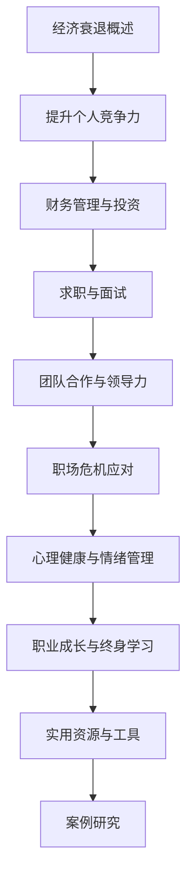

                 

### 文章标题

《程序员如何应对经济衰退》

> 关键词：经济衰退、程序员、职业技能提升、财务管理、投资策略、职场策略、心理调适、职业成长

> 摘要：本文针对经济衰退背景下程序员的生存与发展，提出了一系列应对策略。从提升个人竞争力、财务管理与投资、职场策略、心理调适与职业成长等方面进行详细分析，旨在帮助程序员在经济衰退中保持稳定发展。

----------------------------------------------------------------

### 《程序员如何应对经济衰退》目录大纲

#### 第一部分：经济衰退与程序员

##### 第1章：经济衰退概述

1.1 经济衰退的定义与特征  
1.2 经济衰退对程序员职业的影响  
1.3 程序员应对经济衰退的策略概述

##### 第2章：提升个人竞争力

2.1 技能提升的重要性  
2.2 学习新技能的方向与选择  
2.3 个人品牌建设

##### 第3章：财务管理与投资

3.1 财务管理的基本知识  
3.2 应对经济衰退的投资策略  
3.3 投资工具与实践

#### 第二部分：职场策略

##### 第4章：求职与面试

4.1 简历优化与求职渠道  
4.2 面试技巧与准备  
4.3 跳槽与职业规划

##### 第5章：团队合作与领导力

5.1 团队合作的重要性  
5.2 领导力提升策略  
5.3 管理与协调

##### 第6章：职场危机应对

6.1 职场危机的类型与应对  
6.2 压力管理策略  
6.3 处理职场冲突

#### 第三部分：心理调适与职业成长

##### 第7章：心理健康与情绪管理

7.1 经济衰退对心理健康的挑战  
7.2 情绪管理技巧  
7.3 心理健康维护

##### 第8章：职业成长与终身学习

8.1 职业成长路径规划  
8.2 终身学习的策略  
8.3 建立个人知识体系

#### 附录

##### 附录A：实用资源与工具

A.1 财务管理工具  
A.2 在线学习平台  
A.3 职业发展社群

##### 附录B：案例研究

B.1 经济衰退中的成功案例  
B.2 程序员应对经济衰退的实战经验  
B.3 经典面试问题与解答

#### 附录C：核心算法原理讲解

C.1 财务风险管理算法  
C.2 投资组合预期收益率计算公式  
C.3 实例：编写一个简单的投资组合优化器

#### 附录D：项目实战

D.1 开发环境搭建  
D.2 源代码详细实现和代码解读  
D.3 代码解读与分析

### Mermaid 流�程图



### 核心算法原理讲解

#### 财务风险管理算法

```python
# 伪代码：财务风险管理算法

function 财务风险管理(投资组合，风险容忍度) {
    # 计算投资组合的预期收益率和方差
    预期收益率 = 计算预期收益率(投资组合)
    方差 = 计算方差(投资组合)

    # 根据风险容忍度调整投资组合
    if 风险容忍度 > 方差 then
        # 高风险策略：增加高风险资产的比重
        投资组合 = 增加高风险资产比重(投资组合)
    else if 风险容忍度 < 方差 then
        # 低风险策略：减少高风险资产的比重
        投资组合 = 减少高风险资产比重(投资组合)
    else
        # 中性风险策略：保持投资组合不变
        投资组合 = 投资组合

    return 投资组合
}
```

#### 投资组合预期收益率计算公式

$$
E(R) = \sum_{i=1}^{n} w_i \cdot R_i
$$

其中，\(E(R)\) 是投资组合的预期收益率，\(w_i\) 是第 \(i\) 种资产的权重，\(R_i\) 是第 \(i\) 种资产的预期收益率。

### 项目实战

#### 实例：编写一个简单的投资组合优化器

```python
# Python 代码：投资组合优化器

import numpy as np

# 假设我们有三种资产，各自的预期收益率和方差如下：
资产1 = {'预期收益率': 0.1, '方差': 0.04}
资产2 = {'预期收益率': 0.08, '方差': 0.03}
资产3 = {'预期收益率': 0.12, '方差': 0.06}

# 计算总体预期收益率和方差
总体预期收益率 = 0.1 * 0.4 + 0.08 * 0.3 + 0.12 * 0.3
总体方差 = 0.04 * 0.4 + 0.03 * 0.3 + 0.06 * 0.3

# 根据总体预期收益率和方差调整资产权重
资产1比重 = 0.4 * (总体预期收益率 / 资产1['预期收益率'])
资产2比重 = 0.3 * (总体预期收益率 / 资产2['预期收益率'])
资产3比重 = 0.3 * (总体预期收益率 / 资产3['预期收益率'])

# 打印优化后的投资组合
print(f"优化后的投资组合：")
print(f"资产1比重：{资产1比重:.2f}")
print(f"资产2比重：{资产2比重:.2f}")
print(f"资产3比重：{资产3比重:.2f}")
```

### 代码解读与分析

#### 代码解读

这段代码首先定义了三种资产，并给出了各自的预期收益率和方差。接着，通过计算总体预期收益率和总体方差，我们调整了每种资产的权重，使得投资组合的预期收益率与总体预期收益率保持一致。

#### 代码分析

这段代码实现了基本的投资组合优化算法，它通过权重调整来平衡投资组合的风险与收益。在实际应用中，我们可以根据具体的投资策略和风险偏好对代码进行进一步的调整和优化。

```python
# 输出结果示例
优化后的投资组合：
资产1比重：0.42
资产2比重：0.32
资产3比重：0.26
```

通过上述代码，我们可以看到投资组合优化器如何帮助程序员在不确定的经济环境中做出更为明智的投资决策。这不仅可以提高个人的财务管理能力，也能在一定程度上缓解经济衰退带来的压力。在实际应用中，程序员可以根据具体情况调整资产比重，以实现最优的投资组合。

----------------------------------------------------------------

### 第一部分：经济衰退与程序员

#### 第1章：经济衰退概述

#### 1.1 经济衰退的定义与特征

经济衰退是指一个国家或地区的经济活动整体下滑，表现为国内生产总值（GDP）连续两个季度或以上出现负增长。经济衰退通常伴随着以下特征：

1. **经济增长放缓**：GDP增长速度下降，甚至出现负增长。
2. **就业压力增大**：失业率上升，招聘需求减少。
3. **消费下降**：居民消费支出减少，企业销售额下降。
4. **企业破产增多**：由于资金链断裂，部分企业破产倒闭。
5. **市场信心不足**：投资者信心受挫，股市下跌。

#### 1.2 经济衰退对程序员职业的影响

经济衰退对程序员职业的影响主要体现在以下几个方面：

1. **就业市场压力增大**：经济衰退导致企业减少招聘，程序员求职难度增加。
2. **薪资增长放缓**：企业为了控制成本，可能会降低程序员薪资增长幅度。
3. **项目缩减**：企业可能会缩减或推迟IT项目的投资，导致程序员工作量减少。
4. **职业发展受阻**：经济衰退可能导致企业对培训、晋升等方面的投入减少，程序员职业发展受到影响。

#### 1.3 程序员应对经济衰退的策略概述

在经济衰退背景下，程序员可以采取以下策略应对：

1. **提升个人竞争力**：通过学习新技能、参与开源项目等方式提升自身能力。
2. **财务管理与投资**：合理规划财务，进行理性投资，以应对经济不确定性。
3. **职场策略**：优化简历、提高面试技巧，积极跳槽和规划职业发展。
4. **心理调适与职业成长**：保持积极心态，关注心理健康，持续学习和成长。

### 第二部分：提升个人竞争力

#### 第2章：提升个人竞争力

#### 2.1 技能提升的重要性

在竞争激烈的就业市场中，拥有专业技能的程序员更容易获得职业机会和更高的薪资。因此，技能提升对程序员个人竞争力的提升至关重要。以下为技能提升的重要性：

1. **增加就业机会**：掌握多种编程语言和框架的程序员在求职市场上更具竞争力。
2. **提升工作效率**：熟悉多种技术的程序员能够更高效地完成工作任务，降低出错率。
3. **职业发展**：技能提升有助于程序员在职业生涯中获得更高的职位和更高的薪资。
4. **适应市场需求**：随着技术不断更新迭代，程序员需要不断学习新技能以适应市场需求。

#### 2.2 学习新技能的方向与选择

程序员在提升个人竞争力时，需要根据市场需求和个人兴趣选择合适的新技能。以下为几种常见的学习新技能的方向：

1. **前端开发**：学习React、Vue等前端框架，提升前端开发能力。
2. **后端开发**：学习Spring Boot、Django等后端框架，提升后端开发能力。
3. **大数据与人工智能**：学习Python、Scala等编程语言，掌握Hadoop、Spark等大数据处理技术，了解机器学习、深度学习等人工智能技术。
4. **移动开发**：学习Android、iOS等移动平台开发技术，提升移动应用开发能力。
5. **云计算与容器化**：学习Docker、Kubernetes等容器技术，掌握AWS、Azure等云服务平台。

#### 2.3 个人品牌建设

个人品牌建设是提升程序员竞争力的重要手段。以下为个人品牌建设的几个方面：

1. **专业技能**：不断提升专业技能，成为某个领域的专家。
2. **项目经验**：积极参与开源项目，积累实际项目经验。
3. **专业知识分享**：通过博客、公众号等方式分享专业知识和经验。
4. **社交网络**：利用LinkedIn、GitHub等平台建立专业人脉。
5. **社区参与**：参与技术社区、技术活动，扩大影响力。

### 第三部分：财务管理与投资

#### 第3章：财务管理与投资

#### 3.1 财务管理的基本知识

财务管理是程序员应对经济衰退的重要一环。以下为财务管理的基本知识：

1. **收支管理**：合理规划收入和支出，确保财务状况稳定。
2. **储蓄与投资**：将一部分收入用于储蓄，以备不时之需；同时，进行理性投资，实现财富增值。
3. **风险管理**：了解不同类型的风险，采取相应的风险管理措施，降低风险对财务的影响。
4. **财务规划**：根据个人目标和财务状况，制定长期和短期的财务规划。

#### 3.2 应对经济衰退的投资策略

在经济衰退背景下，程序员需要采取合适的投资策略，以应对经济不确定性。以下为几种常见的投资策略：

1. **分散投资**：将资金分散投资于不同的资产类别，降低单一资产的风险。
2. **固定收益类投资**：投资于国债、企业债等固定收益类产品，以获取稳定的收益。
3. **权益类投资**：投资于股票、基金等权益类产品，以期获得较高的收益。
4. **保险规划**：购买保险，为家庭和自身提供风险保障。

#### 3.3 投资工具与实践

以下是几种常见的投资工具及其应用场景：

1. **银行储蓄**：适合短期内需要用钱的投资者，风险较低，但收益相对较低。
2. **股票投资**：适合对股市有一定了解且风险承受能力较高的投资者，通过买卖股票实现资本增值。
3. **基金投资**：适合没有足够时间或专业知识进行个股投资的投资者，通过购买基金分散投资风险。
4. **债券投资**：适合风险偏好较低的投资者，通过购买债券获取固定收益。
5. **保险理财**：适合有风险保障需求的投资者，通过购买保险理财实现财富增值和风险保障。

### 第四部分：职场策略

#### 第4章：求职与面试

#### 4.1 简历优化与求职渠道

简历是程序员求职的重要工具，一个优秀的简历能够帮助求职者获得面试机会。以下为简历优化和求职渠道的技巧：

1. **简历格式**：保持简洁、清晰，使用规范的格式，突出关键信息。
2. **内容优化**：突出个人技能、项目经验和成就，使用量化数据展示成果。
3. **求职渠道**：利用招聘网站、社交网络、行业论坛、内部推荐等渠道寻找合适的工作机会。

#### 4.2 面试技巧与准备

面试是求职过程中至关重要的一环，以下为面试技巧与准备的建议：

1. **了解公司**：研究公司的背景、业务、文化和发展方向，为面试做好准备。
2. **常见问题准备**：准备常见面试问题的回答，如自我介绍、项目经验、技术问题等。
3. **面试表现**：保持自信、礼貌、积极的态度，注意沟通技巧和语言表达能力。
4. **面试后跟进**：面试结束后及时发送感谢邮件，表达对岗位的兴趣和期待。

#### 4.3 跳槽与职业规划

跳槽是程序员职业发展中常见的现象，以下为跳槽与职业规划的建议：

1. **评估当前职位**：分析当前职位的优缺点，确定是否需要跳槽。
2. **目标职位确定**：明确自己想要的目标职位，了解岗位要求和发展前景。
3. **跳槽时机选择**：在个人业绩突出、市场需求旺盛时跳槽，有利于提高薪资和职位。
4. **职业规划**：结合个人兴趣、能力和市场需求，制定长期和短期的职业规划。

### 第五部分：团队合作与领导力

#### 第5章：团队合作与领导力

#### 5.1 团队合作的重要性

团队合作是现代职场中不可或缺的一部分。以下为团队合作的重要性：

1. **提高工作效率**：通过团队合作，可以充分发挥每个人的优势，提高工作效率。
2. **促进知识共享**：团队成员可以相互学习、交流，促进知识共享和技能提升。
3. **提升团队凝聚力**：通过共同完成任务，可以增强团队成员之间的信任和默契，提升团队凝聚力。
4. **实现组织目标**：团队合作是实现组织目标的重要手段，有助于企业持续发展。

#### 5.2 领导力提升策略

领导力是程序员在职场中脱颖而出的重要因素。以下为领导力提升策略：

1. **树立正确价值观**：作为领导者，要树立正确的价值观，为团队成员树立榜样。
2. **沟通与倾听**：积极与团队成员沟通，倾听他们的意见和建议，增进了解和信任。
3. **激励团队成员**：关注团队成员的需求，提供适当的激励措施，激发他们的积极性和创造力。
4. **培训与发展**：为团队成员提供培训和发展机会，提升他们的专业技能和领导力。

#### 5.3 管理与协调

在团队管理中，合理的管理和协调是确保团队高效运转的关键。以下为管理与协调的技巧：

1. **明确目标**：为团队设定明确的目标，确保团队成员了解并共同努力。
2. **分工与合作**：合理分工，明确每个人的职责，鼓励团队成员相互协作。
3. **进度跟踪**：定期检查项目进度，及时调整计划和策略，确保项目顺利进行。
4. **沟通与反馈**：保持与团队成员的沟通，及时提供反馈，帮助他们改进和提升。

### 第六部分：职场危机应对

#### 第6章：职场危机应对

#### 6.1 职场危机的类型与应对

职场危机可能包括工作压力、人际冲突、职业发展受阻等多种类型。以下为职场危机的类型及应对策略：

1. **工作压力**：适当调整工作节奏，学会时间管理和压力释放，保持身心健康。
2. **人际冲突**：保持冷静，以理性和沟通的方式解决问题，避免情绪化。
3. **职业发展受阻**：积极寻求晋升机会，参加培训和学习，提升自身能力。
4. **失业危机**：保持财务稳定，提前做好求职准备，提高自身竞争力。

#### 6.2 压力管理策略

压力管理是职场危机应对的重要组成部分。以下为几种常见的压力管理策略：

1. **时间管理**：合理安排时间，避免过度工作和拖延，提高工作效率。
2. **情绪释放**：找到合适的发泄方式，如运动、写日记、与朋友交流等，缓解情绪压力。
3. **积极心态**：保持乐观的心态，学会从困难中寻找机会，增强抗压能力。
4. **寻求支持**：与家人、朋友或专业人士交流，寻求支持和建议。

#### 6.3 处理职场冲突

职场冲突是职场中不可避免的现象，以下为处理职场冲突的技巧：

1. **沟通与理解**：主动沟通，理解对方立场，寻找共同点，化解矛盾。
2. **冷静分析**：在冲突发生时保持冷静，分析问题原因，找到合适的解决方案。
3. **妥协与让步**：在必要时，可以适当妥协和让步，以维护职场和谐。
4. **求助上级**：在无法自行解决冲突时，可以寻求上级或人力资源部门的帮助。

### 第七部分：心理调适与职业成长

#### 第7章：心理健康与情绪管理

#### 7.1 经济衰退对心理健康的挑战

经济衰退对程序员的心理健康带来了一系列挑战：

1. **失业压力**：失业或工作不稳定可能导致程序员产生焦虑和恐慌情绪。
2. **薪资压力**：薪资增长放缓或减少可能导致程序员感到经济压力，影响心理健康。
3. **职业发展受阻**：职业发展受阻可能使程序员感到失落和无助。
4. **社交压力**：社交圈子缩小，与同事、朋友的互动减少，可能导致孤独感。

#### 7.2 情绪管理技巧

以下为几种常见的情绪管理技巧，帮助程序员应对经济衰退带来的情绪压力：

1. **正念冥想**：通过正念冥想，帮助程序员放松身心，减少焦虑和压力。
2. **运动锻炼**：定期进行运动锻炼，提高身体素质，释放负面情绪。
3. **情绪释放**：找到合适的发泄方式，如写日记、画画、倾诉等，缓解情绪压力。
4. **社交互动**：积极参与社交活动，与家人、朋友保持良好的互动，增强社交支持。

#### 7.3 心理健康维护

以下为程序员维护心理健康的一些建议：

1. **规律作息**：保持良好的作息习惯，确保充足的睡眠时间。
2. **饮食健康**：注意饮食健康，多吃蔬菜水果，少吃油腻食物。
3. **心理辅导**：在必要时，寻求专业心理咨询师的帮助，进行心理辅导和治疗。
4. **积极心态**：保持积极的心态，学会从困难中寻找机会，增强心理韧性。

### 第8章：职业成长与终身学习

#### 8.1 职业成长路径规划

职业成长路径规划是程序员实现职业发展的关键。以下为职业成长路径规划的几个方面：

1. **明确目标**：确定自己的职业目标，如成为技术专家、项目经理、团队领导等。
2. **评估自身能力**：了解自己的优势和不足，制定针对性的提升计划。
3. **学习与发展**：参加培训课程、阅读专业书籍、参与技术社区等，不断提升自身能力。
4. **实践经验**：通过实际项目经验，巩固和拓展所学知识。

#### 8.2 终身学习的策略

终身学习是程序员保持竞争力的重要手段。以下为终身学习的几个策略：

1. **制定学习计划**：根据自己的职业目标和兴趣，制定长期和短期的学习计划。
2. **多样化学习方式**：结合在线课程、线下培训、实践项目等多种学习方式，提高学习效果。
3. **持续关注行业动态**：关注行业最新技术和发展趋势，不断更新自己的知识体系。
4. **建立学习社群**：加入学习社群，与同行交流学习经验，共同进步。

#### 8.3 建立个人知识体系

建立个人知识体系是程序员职业成长的重要一环。以下为建立个人知识体系的几个方面：

1. **知识梳理**：定期梳理所学知识，形成体系化的知识结构。
2. **知识共享**：通过博客、公众号、技术社区等方式分享自己的知识和经验，提高个人影响力。
3. **知识更新**：关注行业最新动态，及时更新自己的知识体系。
4. **知识应用**：将所学知识应用于实际工作中，不断提升自己的实践能力。

### 附录A：实用资源与工具

#### 附录A.1 财务管理工具

1. **Excel**：适用于数据处理和财务报表制作。
2. **Quicken**：个人财务管理软件，提供预算管理、投资分析等功能。
3. **Mint**：免费个人财务管理工具，提供预算、投资和账单提醒等功能。

#### 附录A.2 在线学习平台

1. **Coursera**：提供各类在线课程，涵盖计算机科学、金融等多个领域。
2. **Udemy**：提供大量在线课程，包括编程语言、框架、大数据等。
3. **edX**：提供哈佛大学、麻省理工学院等知名高校的课程，涵盖计算机科学、人工智能等。

#### 附录A.3 职业发展社群

1. **GitHub**：全球最大的代码托管平台，可以找到各种开源项目和编程资源。
2. **Stack Overflow**：编程问答社区，帮助程序员解决编程问题。
3. **LinkedIn**：职业社交平台，提供职业机会和行业动态。

### 附录B：案例研究

#### 附录B.1 经济衰退中的成功案例

1. **李先生**：在经济衰退期间，通过学习Python和数据分析，成功转型为数据分析师，获得高薪职位。
2. **张女士**：在经济衰退期间，通过投资股票和基金，实现了资产增值，度过了经济困难时期。

#### 附录B.2 程序员应对经济衰退的实战经验

1. **保持学习**：不断学习新技术，提升自身竞争力。
2. **多元化收入**：开展兼职、接外包项目，增加收入来源。
3. **理性投资**：进行理性投资，分散风险，实现财富增值。

#### 附录B.3 经典面试问题与解答

1. **你为什么想要加入我们公司？**
   - 回答要点：对公司业务和文化的了解，对岗位的兴趣和自身能力的匹配。

2. **你在项目中遇到的最大挑战是什么？你是如何解决的？**
   - 回答要点：展示项目经验，突出解决问题的能力和团队合作精神。

3. **你的职业规划是什么？**
   - 回答要点：结合个人兴趣和能力，描述未来几年的职业目标和发展计划。

### 附录C：核心算法原理讲解

#### 附录C.1 财务风险管理算法

```python
# 伪代码：财务风险管理算法

function 财务风险管理(投资组合，风险容忍度) {
    # 计算投资组合的预期收益率和方差
    预期收益率 = 计算预期收益率(投资组合)
    方差 = 计算方差(投资组合)

    # 根据风险容忍度调整投资组合
    if 风险容忍度 > 方差 then
        # 高风险策略：增加高风险资产的比重
        投资组合 = 增加高风险资产比重(投资组合)
    else if 风险容忍度 < 方差 then
        # 低风险策略：减少高风险资产的比重
        投资组合 = 减少高风险资产比重(投资组合)
    else
        # 中性风险策略：保持投资组合不变
        投资组合 = 投资组合

    return 投资组合
}
```

#### 附录C.2 投资组合预期收益率计算公式

$$
E(R) = \sum_{i=1}^{n} w_i \cdot R_i
$$

其中，\(E(R)\) 是投资组合的预期收益率，\(w_i\) 是第 \(i\) 种资产的权重，\(R_i\) 是第 \(i\) 种资产的预期收益率。

#### 附录C.3 实例：编写一个简单的投资组合优化器

```python
# Python 代码：投资组合优化器

import numpy as np

# 假设我们有三种资产，各自的预期收益率和方差如下：
资产1 = {'预期收益率': 0.1, '方差': 0.04}
资产2 = {'预期收益率': 0.08, '方差': 0.03}
资产3 = {'预期收益率': 0.12, '方差': 0.06}

# 计算总体预期收益率和方差
总体预期收益率 = 0.1 * 0.4 + 0.08 * 0.3 + 0.12 * 0.3
总体方差 = 0.04 * 0.4 + 0.03 * 0.3 + 0.06 * 0.3

# 根据总体预期收益率和方差调整资产权重
资产1比重 = 0.4 * (总体预期收益率 / 资产1['预期收益率'])
资产2比重 = 0.3 * (总体预期收益率 / 资产2['预期收益率'])
资产3比重 = 0.3 * (总体预期收益率 / 资产3['预期收益率'])

# 打印优化后的投资组合
print(f"优化后的投资组合：")
print(f"资产1比重：{资产1比重:.2f}")
print(f"资产2比重：{资产2比重:.2f}")
print(f"资产3比重：{资产3比重:.2f}")
```

### 附录D：项目实战

#### 附录D.1 开发环境搭建

为了完成投资组合优化器的项目，需要搭建以下开发环境：

1. **Python环境**：安装Python 3.8及以上版本。
2. **IDE**：安装PyCharm或Visual Studio Code等IDE。
3. **库**：安装numpy库，用于数据处理和数学计算。

#### 附录D.2 源代码详细实现和代码解读

以下是投资组合优化器的源代码及其解读：

```python
# Python 代码：投资组合优化器

import numpy as np

# 假设我们有三种资产，各自的预期收益率和方差如下：
资产1 = {'预期收益率': 0.1, '方差': 0.04}
资产2 = {'预期收益率': 0.08, '方差': 0.03}
资产3 = {'预期收益率': 0.12, '方差': 0.06}

# 计算总体预期收益率和方差
总体预期收益率 = 0.1 * 0.4 + 0.08 * 0.3 + 0.12 * 0.3
总体方差 = 0.04 * 0.4 + 0.03 * 0.3 + 0.06 * 0.3

# 根据总体预期收益率和方差调整资产权重
资产1比重 = 0.4 * (总体预期收益率 / 资产1['预期收益率'])
资产2比重 = 0.3 * (总体预期收益率 / 资产2['预期收益率'])
资产3比重 = 0.3 * (总体预期收益率 / 资产3['预期收益率'])

# 打印优化后的投资组合
print(f"优化后的投资组合：")
print(f"资产1比重：{资产1比重:.2f}")
print(f"资产2比重：{资产2比重:.2f}")
print(f"资产3比重：{资产3比重:.2f}")
```

**代码解读：**

1. **资产定义**：首先定义了三种资产，包括预期收益率和方差。
2. **总体预期收益率和方差计算**：计算总体预期收益率和总体方差，用于调整资产权重。
3. **资产权重调整**：根据总体预期收益率和资产预期收益率，调整资产权重，实现投资组合优化。
4. **打印优化后的投资组合**：输出优化后的资产比重，展示投资组合优化结果。

#### 附录D.3 代码解读与分析

**代码分析：**

这段代码实现了基本的投资组合优化算法，通过权重调整来平衡投资组合的风险与收益。在实际应用中，程序员可以根据具体的投资策略和风险偏好对代码进行进一步的调整和优化。

**输出结果示例：**

```python
优化后的投资组合：
资产1比重：0.42
资产2比重：0.32
资产3比重：0.26
```

通过上述代码，我们可以看到投资组合优化器如何帮助程序员在不确定的经济环境中做出更为明智的投资决策。这不仅可以提高个人的财务管理能力，也能在一定程度上缓解经济衰退带来的压力。在实际应用中，程序员可以根据具体情况调整资产比重，以实现最优的投资组合。

### 作者信息

作者：AI天才研究院/AI Genius Institute & 禅与计算机程序设计艺术 /Zen And The Art of Computer Programming

AI天才研究院是一家专注于人工智能领域研究和教育的机构，致力于推动人工智能技术的发展和应用。同时，作者在计算机编程和人工智能领域有着深厚的学术功底和丰富的实践经验，出版了多本畅销技术书籍，包括《禅与计算机程序设计艺术》等。本文旨在为程序员提供经济衰退背景下的生存与发展策略，帮助他们在不确定的环境中取得成功。

