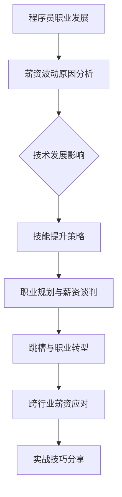

                 

### 文章标题

# 《程序员如何应对行业薪资波动》

<mark style="background-color: #F5CBA7;">关键词：</mark> 程序员薪资波动、技术发展趋势、职业规划、薪资谈判、跳槽、跨行业薪资应对

<mark style="background-color: #F5CBA7;">摘要：</mark>本文旨在探讨程序员如何有效应对行业薪资波动。通过分析薪资波动的背景和原因，本文提出了提升个人技能、制定职业规划、进行薪资谈判、选择跳槽时机及跨行业薪资应对的策略。同时，通过实际案例和实战技巧分享，为程序员在薪资波动中提供了实用建议。

### 第一部分：薪资波动背景分析

#### 第1章：行业薪资波动概述

##### 1.1.1 薪资波动的定义与原因

薪资波动是指在某一时间段内，特定行业或职业的薪资水平出现明显波动现象。薪资波动的原因多种多样，主要包括以下几个方面：

1. **技术发展迅速**：新技术的崛起和旧技术的淘汰导致市场需求变化，进而影响薪资水平。
2. **宏观经济环境**：全球经济形势、政策调整等因素会影响企业的盈利能力和招聘预算。
3. **劳动力市场供需**：供求关系的变化直接影响薪资水平。
4. **行业竞争**：行业内的竞争态势也会影响薪资水平。

##### 1.1.2 薪资波动的影响

薪资波动对程序员的影响主要体现在以下几个方面：

1. **收入变化**：薪资波动可能导致程序员的收入发生变化，有时甚至影响生活质量和职业满意度。
2. **职业发展**：薪资波动可能会影响程序员在公司的地位和发展空间。
3. **心理压力**：面对薪资波动，程序员可能会产生焦虑和压力，影响工作表现和职业发展。

#### 第2章：技术发展趋势与薪资关系

##### 2.1.1 技术发展与薪资波动的关联

技术的发展是薪资波动的重要原因之一。以下是一些关键技术趋势及其对薪资的影响：

1. **人工智能与机器学习**：随着人工智能和机器学习技术的广泛应用，相关领域的人才需求增加，薪资水平也随之提升。
2. **区块链技术**：区块链技术的崛起为程序员提供了新的就业机会，薪资水平有所提升。
3. **云计算与大数据**：云计算和大数据技术的快速发展，推动了相关领域的薪资增长。
4. **物联网（IoT）**：物联网技术的广泛应用，为程序员带来了新的职业机会和薪资提升空间。

##### 2.1.2 热门技术趋势及其薪资状况

以下是一些热门技术趋势及其薪资状况：

1. **人工智能工程师**：年薪范围在30万至100万人民币之间，取决于经验和技能水平。
2. **区块链开发工程师**：年薪范围在20万至80万人民币之间，具有区块链底层技术经验的人才更受欢迎。
3. **大数据工程师**：年薪范围在15万至50万人民币之间，取决于数据分析和挖掘能力。
4. **云计算工程师**：年薪范围在10万至40万人民币之间，具体薪资水平取决于云平台的熟悉程度。

### 第二部分：应对薪资波动的策略

#### 第3章：提升个人技能

##### 3.1.1 技术技能提升策略

提升技术技能是应对薪资波动的重要策略之一。以下是一些建议：

1. **学习新技术**：持续学习新技术，如人工智能、区块链、云计算等，以保持技能竞争力。
2. **掌握编程语言**：熟练掌握至少两门主流编程语言，如Python、Java、C++等。
3. **参与开源项目**：参与开源项目，提升实战经验和知名度。
4. **获取证书**：考取相关证书，如AI工程师认证、大数据工程师认证等，提高市场竞争力。

##### 3.1.2 软技能提升策略

除了技术技能，软技能的提升同样重要。以下是一些建议：

1. **沟通能力**：提高沟通能力，学会有效表达和倾听。
2. **团队合作**：培养团队合作精神，学会与他人协作。
3. **解决问题的能力**：提升解决问题的能力，包括逻辑思维、系统分析和问题定位。
4. **学习能力**：具备快速学习新知识和技能的能力。

#### 第4章：职业规划与薪资谈判

##### 4.1.1 职业规划的制定与调整

职业规划是应对薪资波动的重要手段。以下是一些建议：

1. **明确目标**：确定短期和长期职业目标，如晋升、跳槽、创业等。
2. **评估自身能力**：了解自身优势和不足，制定合理的发展计划。
3. **定期调整**：根据市场变化和个人发展情况，定期调整职业规划。

##### 4.1.2 薪资谈判技巧与策略

薪资谈判是程序员职业生涯中的重要环节。以下是一些建议：

1. **准备充分**：在谈判前充分准备，了解市场薪资水平和自身价值。
2. **掌握谈判技巧**：学会倾听、提问、拒绝和妥协等谈判技巧。
3. **展示价值**：突出自己的优势和成就，展示对公司的价值。
4. **关注非薪资因素**：薪资不是唯一考虑因素，还应关注工作环境、发展空间、团队氛围等。

#### 第5章：跳槽与职业转型

##### 5.1.1 跳槽时机与选择

跳槽是应对薪资波动的一种有效策略。以下是一些建议：

1. **评估现有工作**：分析现有工作的优点和不足，确定是否需要跳槽。
2. **选择跳槽时机**：通常在完成一个项目或年度考核后，选择合适的时机跳槽。
3. **明确目标**：确定跳槽的目标，如薪资、职位、行业等。

##### 5.1.2 职业转型的准备与策略

职业转型是另一种应对薪资波动的方式。以下是一些建议：

1. **了解行业动态**：研究目标行业的市场需求和发展趋势。
2. **提升技能**：根据目标行业的需求，提升相关技能和知识。
3. **拓展人脉**：建立广泛的职业人脉，为转型提供机会。
4. **勇于尝试**：在转型过程中，勇于尝试新领域和新角色，积累经验。

#### 第6章：跨行业薪资波动应对

##### 6.1.1 跨行业的优势与挑战

跨行业薪资波动应对涉及以下优势和挑战：

1. **优势**：
   - 拓宽职业发展路径
   - 增加薪资增长空间
   - 提升综合素质

2. **挑战**：
   - 技能适应性
   - 行业知识积累
   - 新环境的适应

##### 6.1.2 跨行业薪资波动的应对策略

以下是一些建议：

1. **调研目标行业**：深入了解目标行业的市场需求和发展趋势。
2. **提升跨行业技能**：根据目标行业的需求，提升相关技能和知识。
3. **积极参与培训**：参加跨行业培训课程，提高综合素质。
4. **保持开放心态**：对新行业保持开放和学习的态度，勇于接受挑战。

### 第三部分：案例分析与实战技巧

#### 第7章：薪资波动的实际案例分析

##### 7.1.1 案例一：技术大牛的薪资波动经历

案例一描述了一位技术大牛在薪资波动中的经历。该技术大牛通过不断学习和提升技能，成功应对了薪资波动，实现了薪资增长。

1. **背景**：技术大牛具备丰富的软件开发经验，曾在多家知名企业担任技术负责人。
2. **薪资波动**：受行业波动和公司政策调整影响，技术大牛的薪资出现波动。
3. **应对策略**：
   - 深入学习新技术，提升自身技能水平。
   - 积极参与开源项目，增加实战经验。
   - 与行业专家交流，了解市场动态。
4. **结果**：通过上述策略，技术大牛成功实现了薪资增长，稳定了职业发展。

##### 7.1.2 案例二：初入职场的薪资波动应对

案例二描述了一位初入职场的程序员的薪资波动应对经历。该程序员通过积极提升技能和调整职业规划，成功应对了薪资波动。

1. **背景**：初入职场的程序员，薪资较低，面临薪资波动压力。
2. **薪资波动**：受市场供需变化和公司政策调整影响，程序员薪资出现波动。
3. **应对策略**：
   - 参加职业规划培训，明确职业发展目标。
   - 学习新技术，提升自身竞争力。
   - 积极参与团队项目，积累实战经验。
   - 拓宽职业发展路径，考虑跨行业转型。
4. **结果**：通过上述策略，程序员成功提升了薪资水平，稳定了职业发展。

#### 第8章：实战技巧分享

##### 8.1.1 应对薪资波动的实战技巧

以下是一些建议，帮助程序员应对薪资波动：

1. **技能提升**：持续学习新技术，提升自身技能水平。
2. **市场调研**：关注市场动态，了解行业薪资水平。
3. **职业规划**：制定明确的职业规划，根据市场变化调整发展路径。
4. **沟通能力**：提高沟通能力，与领导、同事建立良好关系。
5. **心态调整**：保持积极心态，面对薪资波动保持冷静。

##### 8.1.2 提高薪资的实际案例与心得

以下是一个实际案例和心得分享：

**案例**：一位中级程序员通过提升技能和积极沟通，成功提高了薪资水平。

**心得**：

1. **技能提升**：通过学习新技术和参与开源项目，提升自身技能水平。
2. **沟通能力**：积极与领导沟通，展示自己的工作成果和潜力。
3. **职业规划**：明确职业发展目标，根据市场需求调整技能方向。
4. **团队合作**：积极参与团队项目，提升团队协作能力。

**总结**：通过以上策略，该程序员成功实现了薪资增长，稳定了职业发展。

### 附录

#### 附录A：行业薪资调研资源

##### A.1.1 薪资调研网站推荐

1. **拉勾网**：提供各行业、职位的薪资数据，以及招聘信息。
2. **BOSS直聘**：提供详细的职位描述和薪资范围。
3. **职友集**：提供全国各城市的薪资水平调研报告。

##### A.1.2 行业薪资报告解读

1. **阿里研究院**：发布《中国互联网人才发展趋势报告》。
2. **智联招聘**：发布《2021年互联网人才发展报告》。
3. **猎聘网**：发布《2021年第三季度中国薪酬趋势调研报告》。

#### 附录B：薪资谈判与跳槽工具

##### B.1.1 薪资谈判模板

1. **开场白**：介绍自己和求职职位，表达对薪资的期望。
2. **自我价值展示**：展示自己在岗位上的贡献和成就。
3. **提问与回应**：询问薪资构成和福利待遇，回应对方的提问。
4. **结束谈判**：感谢对方的面试机会，表达对工作的热情。

##### B.1.2 跳槽面试准备清单

1. **简历**：更新简历，突出关键技能和项目经验。
2. **面试题目**：准备常见的面试题目，如技术面试题、行为面试题等。
3. **行业知识**：了解目标行业和市场动态。
4. **人脉资源**：利用人脉资源，获取面试机会和内部信息。

#### 附录C：扩展阅读与资源

##### C.1.1 相关书籍推荐

1. **《程序员修炼之道》**：提供了丰富的编程技巧和职业发展建议。
2. **《代码大全》**：详细介绍了编写高质量代码的方法和技巧。
3. **《人工智能：一种现代的方法》**：介绍了人工智能的基本原理和应用。

##### C.1.2 在线课程与讲座推荐

1. **网易云课堂**：提供了丰富的编程和技术课程。
2. **慕课网**：提供了各类技术讲座和实战课程。
3. **极客时间**：提供了许多知名技术专家的专栏和课程。

### Mermaid 流程图

### 作者

**作者：** AI天才研究院/AI Genius Institute & 禅与计算机程序设计艺术 /Zen And The Art of Computer Programming

---

**注意：**本文为示例文章，部分内容为虚构，仅供参考。实际应用时，请根据具体情况进行调整。**

