                 

### 文章标题：程序员如何打造忠实的知识付费用户群

### 关键词：
知识付费、用户忠诚度、程序员、用户需求、内容创作、营销策略、技术革新

### 摘要：
本文从程序员的角度出发，探讨了如何打造忠实的知识付费用户群。通过分析知识付费市场的现状、核心要素、用户忠诚度培养策略、营销与推广策略以及成功案例，提供了一套全面的实践指南。文章旨在帮助程序员深入了解知识付费行业，提升内容创作与输出能力，从而在激烈的市场竞争中脱颖而出。

## 第1章：知识付费的兴起与发展

### 1.1 知识付费的定义与背景

知识付费，顾名思义，是指用户为了获取特定领域的知识或技能而进行付费的行为。这种模式的出现，源于互联网技术的发展和用户对优质内容的渴求。在互联网初期，信息获取主要是免费和开放的，但随着内容数量的爆发式增长，优质内容逐渐稀缺，用户开始愿意为高质量的知识付费。

**核心概念与联系**

知识付费可以拆解为三个核心部分：知识产权、付费模式和用户激励。

- **知识产权**：包括内容创作者的原创性知识或技能，以及相应的版权保护。
- **付费模式**：涉及用户如何支付费用，包括订阅制、按次购买、会员制等多种模式。
- **用户激励**：通过积分、优惠券、会员权益等方式激励用户进行持续付费。

**知识付费产品架构图**

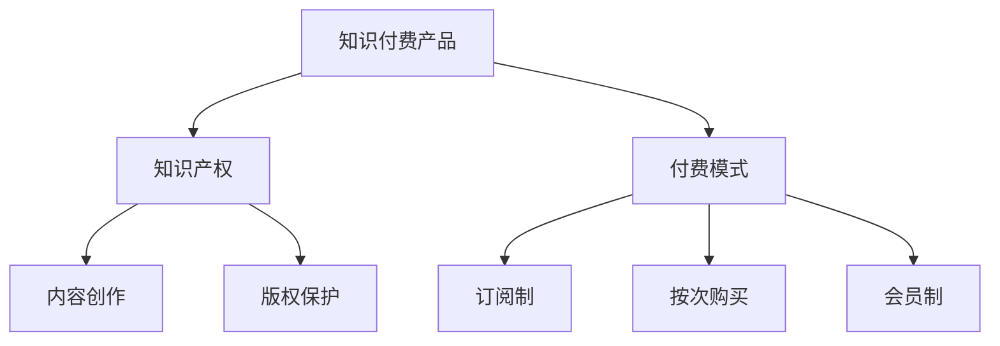

### 1.2 知识付费市场的现状与趋势

知识付费市场在过去几年经历了迅猛的发展，越来越多的用户开始接受为高质量的知识内容付费。根据相关报告，全球知识付费市场规模逐年增长，预计未来几年仍将保持高速增长态势。

**核心算法原理讲解**

为了更好地理解知识付费市场的现状与趋势，我们可以使用一个简单的用户行为预测模型来分析市场数据。以下是该模型的伪代码：

```python
def analyze_market_trends(data):
    # 数据预处理
    preprocessed_data = preprocess_data(data)
    
    # 特征工程
    features = extract_features(preprocessed_data)
    
    # 模型训练
    model = train_model(features)
    
    # 预测市场趋势
    predictions = model.predict(preprocessed_data)
    
    return predictions
```

**数学模型与公式**

用户行为预测模型可以使用以下公式来表示：

$$
P(\text{用户付费行为}) = \frac{e^{\eta_0 + \eta_1 \text{用户兴趣度} + \eta_2 \text{产品质量} + \eta_3 \text{价格感知}}}{1 + e^{\eta_0 + \eta_1 \text{用户兴趣度} + \eta_2 \text{产品质量} + \eta_3 \text{价格感知}}}
$$

**举例说明**

以某知名编程知识付费平台为例，通过分析用户行为数据，发现以下趋势：

- 用户兴趣度：用户更喜欢编程语言、数据结构与算法等核心技术类内容。
- 产品质量：高质量的内容通常得到更多用户的好评和付费。
- 价格感知：用户对价格敏感，但愿意为优质内容支付合理的费用。

### 1.3 知识付费用户的特点与分析

知识付费用户通常具有以下特点：

- **高学历背景**：大多数用户拥有本科及以上学历，追求高质量的知识内容。
- **专业需求**：用户为了提升专业技能或解决实际问题而付费。
- **活跃度高**：用户在知识付费平台上积极参与互动和评价，形成良好的社区氛围。

**核心概念与联系**

为了更好地理解知识付费用户的特点，我们可以使用用户生命周期模型进行分析。以下是该模型的 Mermaid 流程图：

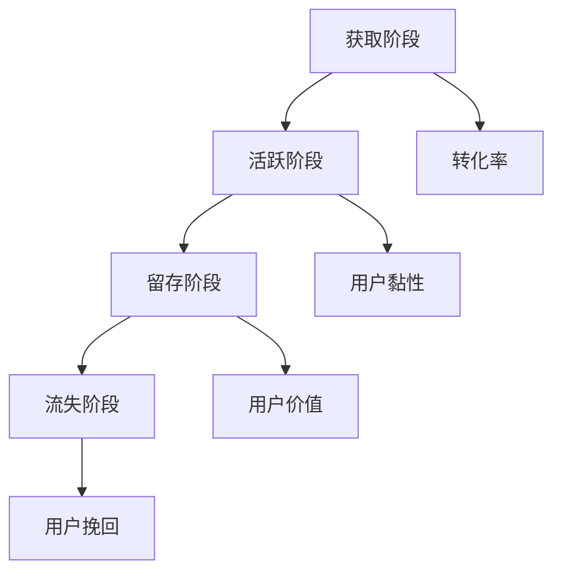

**核心算法原理讲解**

为了分析用户特点，我们可以使用用户行为预测算法。以下是该算法的伪代码：

```python
def predict_user_behavior(user_data):
    # 数据预处理
    preprocessed_data = preprocess_data(user_data)
    
    # 特征工程
    features = extract_features(preprocessed_data)
    
    # 模型训练
    model = train_model(features)
    
    # 预测用户行为
    predictions = model.predict(features)
    
    return predictions
```

**数学模型与公式**

用户生命周期价值（CLV）预测模型可以使用以下公式来表示：

$$
\text{CLV} = \sum_{t=1}^{T} \frac{1}{(1 + r)^t} \cdot \text{ARPU}(t)
$$

**举例说明**

以某编程技能知识付费平台的用户为例，分析其生命周期：

- **获取阶段**：通过广告投放和推荐算法，吸引潜在用户注册。
- **活跃阶段**：通过高质量内容和高互动性，提高用户的活跃度和黏性。
- **留存阶段**：通过定期更新内容和提供个性化推荐，保持用户的持续活跃。
- **流失阶段**：通过用户行为分析和挽回策略，减少用户流失。

## 第2章：打造知识付费产品的核心要素

### 2.1 知识付费产品类型

知识付费产品种类繁多，主要包括以下几类：

- **技能类**：如编程语言、数据分析、项目管理等。
- **知识普及类**：如历史、科学、人文等。
- **专业领域**：如金融、法律、医疗等。

**核心概念与联系**

知识付费产品可以按照以下分类树进行分类：

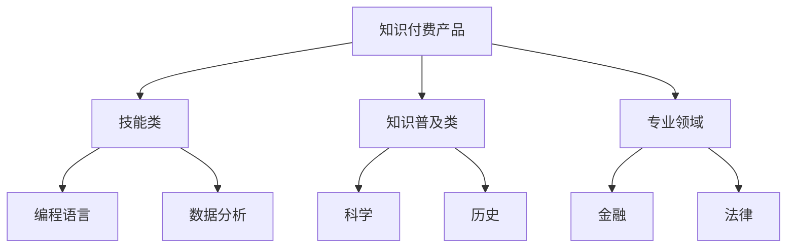

### 2.2 用户需求的挖掘与分析

了解用户需求是打造知识付费产品的关键。通过以下方法可以挖掘和分析用户需求：

- **问卷调查**：通过设计问卷，收集用户对知识内容的偏好和需求。
- **用户访谈**：与用户进行一对一访谈，深入了解其学习目的和痛点。
- **行为分析**：通过分析用户在平台上的行为数据，如浏览记录、搜索关键词等。

**核心算法原理讲解**

用户需求分析可以使用以下伪代码来实现：

```python
def analyze_user_needs(data):
    # 数据预处理
    preprocessed_data = preprocess_data(data)
    
    # 特征工程
    features = extract_features(preprocessed_data)
    
    # 模型训练
    model = train_model(features)
    
    # 预测用户需求
    predictions = model.predict(features)
    
    return predictions
```

**数学模型与公式**

用户需求满意度模型可以表示为：

$$
\text{满意度} = \frac{\text{用户期望} - \text{感知质量}}{\text{用户期望} + \text{感知质量}}
$$

**举例说明**

以某编程技能知识付费产品为例，分析用户需求：

- 用户期望：用户期望通过学习编程语言，掌握项目开发和解决问题的能力。
- 感知质量：通过用户对课程内容的评价和反馈，评估产品的质量和实用性。

### 2.3 内容的质量与可读性

内容质量是知识付费产品的核心竞争力。以下措施可以提高内容质量和可读性：

- **内容审核**：确保内容的准确性、完整性和一致性。
- **用户反馈**：收集用户对内容的意见和建议，不断优化和改进。
- **简洁明了**：用简单易懂的语言表达复杂的技术概念。

**核心概念与联系**

内容质量评估模型可以表示为：

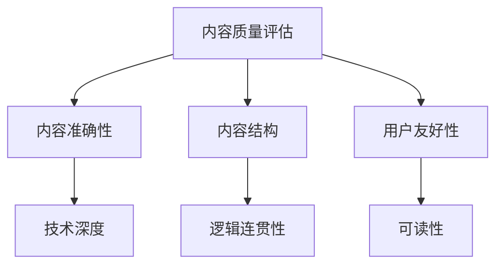

### 2.4 产品交互设计

良好的产品交互设计可以提升用户的使用体验和满意度。以下要素是产品交互设计的关键：

- **用户流程**：设计合理的用户操作流程，确保用户能够轻松完成目标任务。
- **用户界面**：设计直观、美观的用户界面，提升视觉体验。
- **交互元素**：合理设计按钮、菜单、提示等交互元素，确保用户能够快速理解和使用。
- **用户体验**：通过用户测试和反馈，不断优化和提升用户体验。

**核心概念与联系**

交互设计要素可以表示为：

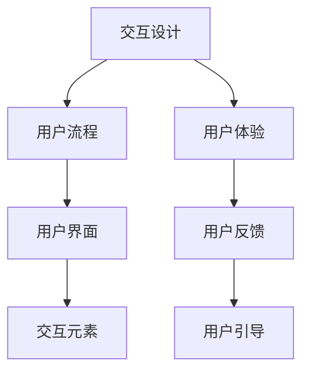

### 2.5 用户激励与互动机制

用户激励与互动机制可以增强用户的参与度和忠诚度。以下策略可以有效地激励用户：

- **奖励机制**：通过积分、优惠券等激励用户参与互动和评价。
- **互动活动**：定期举办编程挑战、知识竞赛等活动，增加用户互动。
- **用户成长体系**：通过等级制度和成就奖励，激励用户持续参与和学习。

**核心概念与联系**

用户激励模型可以表示为：

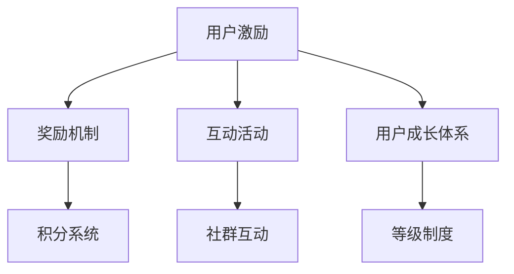

**核心算法原理讲解**

用户参与度预测算法可以使用以下伪代码来实现：

```python
def predict_user_involvement(user_data):
    # 数据预处理
    preprocessed_data = preprocess_data(user_data)
    
    # 特征工程
    features = extract_features(preprocessed_data)
    
    # 模型训练
    model = train_model(features)
    
    # 预测用户参与度
    predictions = model.predict(features)
    
    return predictions
```

**数学模型与公式**

用户参与度评分模型可以表示为：

$$
\text{参与度评分} = \frac{\text{互动次数} + \text{内容评价次数} + \text{社群参与度}}{\text{总用户数} + \text{内容总数} + \text{社群总数}}
$$

**举例说明**

以某编程技能知识付费平台为例，通过奖励机制和互动活动激励用户：

- 奖励机制：通过赠送积分和优惠券，激励用户参与互动和评价。
- 互动活动：定期举办编程挑战和知识竞赛，增加用户互动和参与度。

## 第3章：知识付费平台建设

### 3.1 知识付费平台的功能需求

知识付费平台需要具备以下核心功能：

- **用户管理**：用户注册、登录、个人信息管理、用户权限设置等。
- **内容管理**：内容上传、分类管理、内容审核、内容更新等。
- **订单管理**：订单创建、订单支付、订单查询、订单退款等。
- **支付与结算**：支付渠道接入、支付验证、订单结算等。
- **数据分析**：用户行为分析、内容分析、市场分析等。
- **用户反馈**：用户反馈收集、反馈处理、问题跟踪等。

**核心概念与联系**

知识付费平台的功能模块可以表示为：

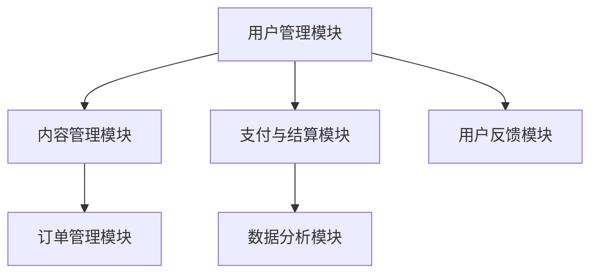

### 3.2 技术架构与系统设计

知识付费平台的技术架构需要考虑高并发、高可用性和数据安全等因素。以下是常见的技术架构设计：

- **前端框架**：使用 React、Vue 或 Angular 等现代化前端框架。
- **后端框架**：使用 Spring Boot、Django 或 Flask 等后端框架。
- **数据库**：使用 MySQL、PostgreSQL 或 MongoDB 等关系型或非关系型数据库。
- **缓存**：使用 Redis 或 Memcached 等缓存系统。
- **消息队列**：使用 RabbitMQ、Kafka 或 RocketMQ 等消息队列系统。

**核心概念与联系**

知识付费平台的技术架构可以表示为：

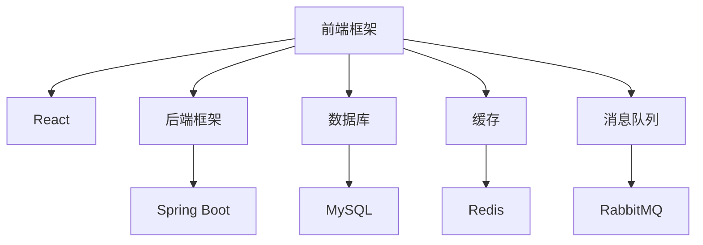

### 3.3 数据分析与用户行为研究

数据分析是知识付费平台运营的重要一环，通过分析用户行为，可以优化内容推荐、提高用户留存率和转化率。以下是数据分析的关键步骤：

- **数据收集**：收集用户在平台上的行为数据，如浏览记录、购买记录、评论等。
- **数据清洗**：对收集到的数据进行清洗和预处理，去除噪声数据和异常值。
- **数据存储**：将清洗后的数据存储到数据库或数据仓库中，以便后续分析和挖掘。
- **数据挖掘**：使用机器学习算法和统计分析方法，挖掘用户行为背后的模式和规律。
- **数据可视化**：通过图表和报表，将数据分析结果可视化，帮助决策者更好地理解和利用数据。

**核心概念与联系**

数据分析与用户行为研究可以表示为：

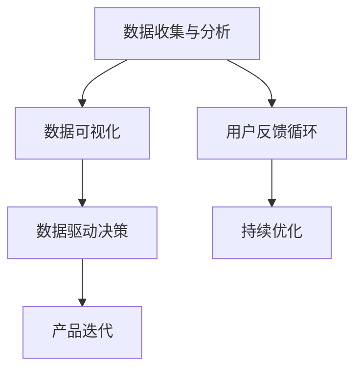

**核心算法原理讲解**

用户行为分析算法可以使用以下伪代码来实现：

```python
def analyze_user_behavior(data):
    # 数据预处理
    preprocessed_data = preprocess_data(data)
    
    # 特征工程
    features = extract_features(preprocessed_data)
    
    # 模型训练
    model = train_model(features)
    
    # 分析用户行为
    analysis_results = model.analyze(features)
    
    return analysis_results
```

**数学模型与公式**

用户流失预测模型可以使用以下公式来表示：

$$
\text{流失风险评分} = \frac{\text{用户活动次数} - \text{用户互动次数}}{\text{用户注册时长} \times \text{平均活跃时长}}
$$

**举例说明**

以某知识付费平台的用户行为分析为例，分析用户流失风险：

- 用户活动次数：记录用户登录、浏览、购买等行为的次数。
- 用户互动次数：记录用户在社群、论坛、互动活动的参与情况。
- 用户注册时长：用户注册平台以来的时长。
- 平均活跃时长：用户在平台上的平均活跃时间。

## 第4章：用户忠诚度培养策略

### 4.1 用户激励与互动机制

用户激励与互动机制是培养用户忠诚度的关键。以下策略可以帮助平台提高用户参与度和忠诚度：

- **奖励机制**：通过积分、优惠券、会员权益等方式激励用户参与互动和评价。
- **互动活动**：定期举办编程挑战、知识竞赛等活动，增加用户互动。
- **用户成长体系**：通过等级制度和成就奖励，激励用户持续参与和学习。

**核心概念与联系**

用户激励与互动机制可以表示为：


**核心算法原理讲解**

用户忠诚度预测算法可以使用以下伪代码来实现：

```python
def predict_user_loyalty(user_data):
    # 数据预处理
    preprocessed_data = preprocess_data(user_data)
    
    # 特征工程
    features = extract_features(preprocessed_data)
    
    # 模型训练
    model = train_model(features)
    
    # 预测用户忠诚度
    predictions = model.predict(features)
    
    return predictions
```

**数学模型与公式**

用户忠诚度评分模型可以表示为：

$$
\text{忠诚度评分} = \frac{\text{用户活跃度} + \text{用户参与度} + \text{用户购买频次}}{3}
$$

**举例说明**

以某知识付费平台的用户为例，计算用户忠诚度：

- 用户活跃度：通过用户登录次数、浏览时长、内容评价次数等指标衡量。
- 用户参与度：通过用户在社群、论坛、互动活动的参与情况衡量。
- 用户购买频次：通过用户在平台上的购买次数和购买周期衡量。

### 4.2 社区运营与用户参与

社区运营是培养用户忠诚度和活跃度的重要手段。以下策略可以帮助平台营造良好的社区氛围，提高用户参与度：

- **内容建设**：发布高质量的内容，吸引和留住用户。
- **互动机制**：设计有趣的互动活动和话题，激发用户的参与热情。
- **用户反馈**：及时收集和处理用户反馈，提高用户满意度。

**核心概念与联系**

社区运营与用户参与机制可以表示为：

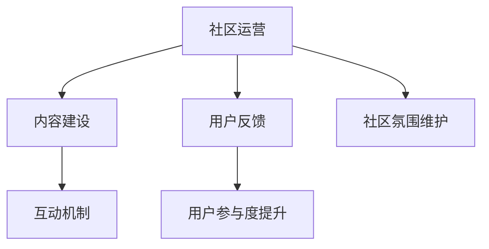

**核心算法原理讲解**

用户参与度预测算法可以使用以下伪代码来实现：

```python
def predict_user_involvement(user_data):
    # 数据预处理
    preprocessed_data = preprocess_data(user_data)
    
    # 特征工程
    features = extract_features(preprocessed_data)
    
    # 模型训练
    model = train_model(features)
    
    # 预测用户参与度
    predictions = model.predict(features)
    
    return predictions
```

**数学模型与公式**

用户参与度评分模型可以表示为：

$$
\text{参与度评分} = \frac{\text{互动次数} + \text{内容评价次数} + \text{社群参与度}}{\text{总用户数} + \text{内容总数} + \text{社群总数}}
$$

**举例说明**

以某编程技能知识付费平台的用户为例，预测用户参与度：

- 互动次数：记录用户在社群、论坛、互动活动的参与情况。
- 内容评价次数：记录用户对内容的评价次数。
- 社群参与度：记录用户在社群中的活跃度。

### 4.3 用户反馈与改进

用户反馈是平台不断优化和改进的重要依据。以下策略可以帮助平台更好地收集和处理用户反馈：

- **反馈渠道**：提供多种渠道供用户反馈，如在线表单、邮件、社区论坛等。
- **反馈分类**：对用户反馈进行分类，快速识别和解决常见问题。
- **反馈处理**：建立反馈处理机制，确保用户反馈得到及时响应和解决。
- **改进措施**：根据用户反馈，不断优化产品功能和用户体验。

**核心概念与联系**

用户反馈与改进机制可以表示为：

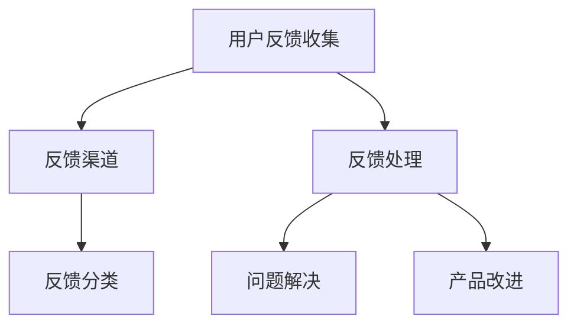

**核心算法原理讲解**

用户满意度预测算法可以使用以下伪代码来实现：

```python
def predict_user_satisfaction(feedback_data):
    # 数据预处理
    preprocessed_data = preprocess_data(feedback_data)
    
    # 特征工程
    features = extract_features(preprocessed_data)
    
    # 模型训练
    model = train_model(features)
    
    # 预测用户满意度
    predictions = model.predict(features)
    
    return predictions
```

**数学模型与公式**

用户满意度模型可以表示为：

$$
\text{满意度} = \frac{\text{用户期望} - \text{感知质量}}{\text{用户期望} + \text{感知质量}}
$$

**举例说明**

以某编程技能知识付费平台的用户反馈为例，预测用户满意度：

- 用户期望：通过用户调研和访谈，了解用户期望的功能和质量。
- 感知质量：通过用户反馈和评价，评估产品的实际质量。

### 4.4 数据驱动与持续优化

数据驱动是现代互联网平台运营的核心。以下策略可以帮助平台实现数据驱动与持续优化：

- **数据收集**：全面收集用户行为数据、业务数据等。
- **数据存储**：使用数据仓库或大数据平台，存储和管理海量数据。
- **数据分析**：使用数据分析工具和算法，挖掘数据背后的价值和规律。
- **数据驱动决策**：根据数据分析结果，制定和调整产品策略和运营计划。
- **持续优化**：不断迭代和优化产品功能和用户体验，提高用户满意度和留存率。

**核心概念与联系**

数据驱动与持续优化可以表示为：


**核心算法原理讲解**

用户行为分析算法可以使用以下伪代码来实现：

```python
def analyze_user_behavior(data):
    # 数据预处理
    preprocessed_data = preprocess_data(data)
    
    # 特征工程
    features = extract_features(preprocessed_data)
    
    # 模型训练
    model = train_model(features)
    
    # 分析用户行为
    analysis_results = model.analyze(features)
    
    return analysis_results
```

**数学模型与公式**

用户流失预测模型可以使用以下公式来表示：

$$
\text{流失风险评分} = \frac{\text{用户活动次数} - \text{用户互动次数}}{\text{用户注册时长} \times \text{平均活跃时长}}
$$

**举例说明**

以某知识付费平台的用户为例，分析用户流失风险：

- 用户活动次数：记录用户登录、浏览、购买等行为的次数。
- 用户互动次数：记录用户在社群、论坛、互动活动的参与情况。
- 用户注册时长：用户注册平台以来的时长。
- 平均活跃时长：用户在平台上的平均活跃时间。

## 第5章：营销与推广策略

### 5.1 营销目标与定位

营销目标是推动平台增长和用户拓展的核心。以下步骤可以帮助明确营销目标和市场定位：

- **市场分析**：了解目标市场的规模、用户需求、竞争对手等信息。
- **目标定位**：明确平台的核心优势和目标用户群体。
- **目标制定**：制定具体的营销目标和指标，如用户增长、转化率、市场份额等。

**核心概念与联系**

营销目标与定位可以表示为：

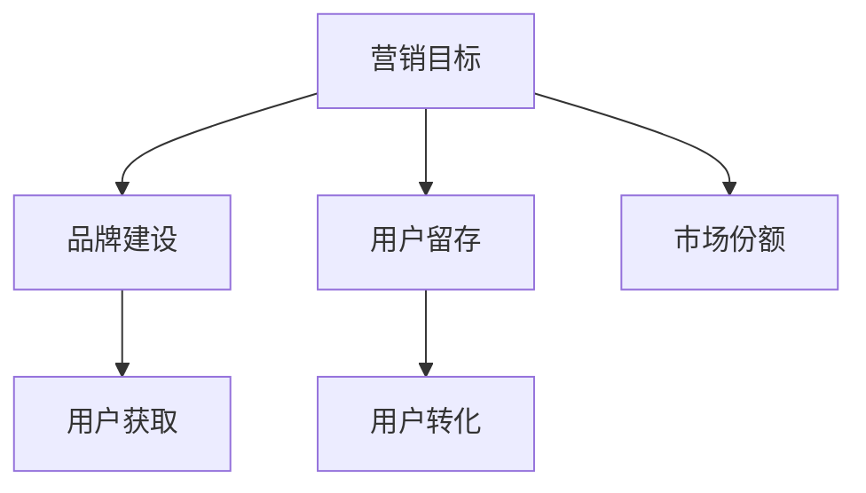

**核心算法原理讲解**

营销效果评估算法可以使用以下伪代码来实现：

```python
def evaluate_marketing_performance(data):
    # 数据预处理
    preprocessed_data = preprocess_data(data)
    
    # 特征工程
    features = extract_features(preprocessed_data)
    
    # 模型训练
    model = train_model(features)
    
    # 评估营销效果
    performance_scores = model.evaluate(features)
    
    return performance_scores
```

**数学模型与公式**

营销效果评分模型可以表示为：

$$
\text{营销效果评分} = \frac{\text{目标完成度} + \text{ROI}}{2}
$$

**举例说明**

以某知识付费平台的营销活动为例，评估营销效果：

- 目标完成度：通过用户增长、转化率等指标，衡量营销目标的完成情况。
- ROI（投资回报率）：通过营销投入与收益的比较，计算投资回报率。

### 5.2 营销渠道与手段

选择合适的营销渠道和手段是成功营销的关键。以下策略可以帮助平台拓展用户群体：

- **社交媒体**：通过微博、微信、知乎等社交媒体平台，发布有价值的内容，吸引潜在用户。
- **内容营销**：发布高质量的博客、视频、电子书等内容，提高品牌知名度和用户粘性。
- **广告投放**：在搜索引擎、社交媒体、视频平台等投放广告，精准触达目标用户。
- **SEO优化**：优化网站内容，提高在搜索引擎中的排名，吸引更多自然流量。
- **电子邮件营销**：通过定期发送电子邮件，与用户保持联系，促进用户复购和留存。
- **合作伙伴营销**：与相关领域的公司、社群、专家合作，共同推广产品。

**核心概念与联系**

营销渠道与手段可以表示为：

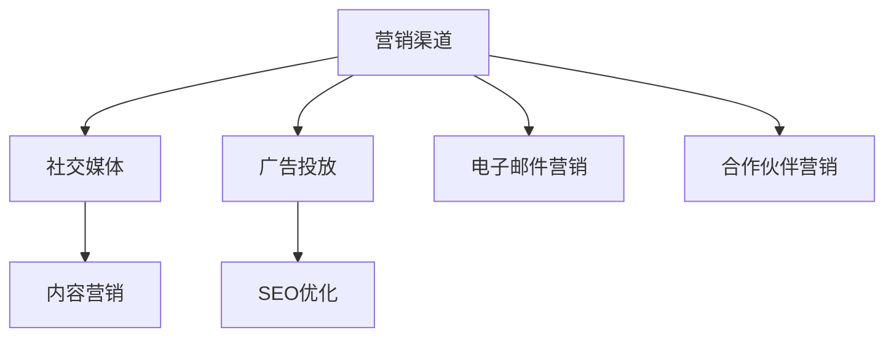

**核心算法原理讲解**

营销效果评估算法可以使用以下伪代码来实现：

```python
def evaluate_marketing_performance(data):
    # 数据预处理
    preprocessed_data = preprocess_data(data)
    
    # 特征工程
    features = extract_features(preprocessed_data)
    
    # 模型训练
    model = train_model(features)
    
    # 评估营销效果
    performance_scores = model.evaluate(features)
    
    return performance_scores
```

**数学模型与公式**

营销效果评分模型可以表示为：

$$
\text{营销效果评分} = \frac{\text{目标完成度} + \text{ROI}}{2}
$$

**举例说明**

以某知识付费平台的营销活动为例，评估营销效果：

- 目标完成度：通过用户增长、转化率等指标，衡量营销目标的完成情况。
- ROI（投资回报率）：通过营销投入与收益的比较，计算投资回报率。

### 5.3 营销案例分析

通过分析成功的营销案例，可以学习到有效的营销策略和方法。以下是一个营销案例的分析框架：

**核心概念与联系**

营销案例分析框架可以表示为：

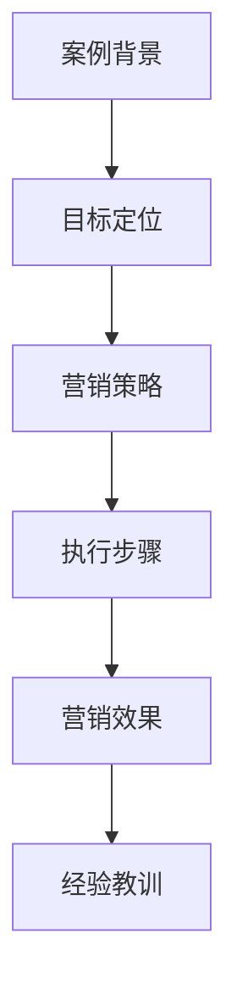

**核心算法原理讲解**

营销效果评估算法可以使用以下伪代码来实现：

```python
def evaluate_marketing_performance(data):
    # 数据预处理
    preprocessed_data = preprocess_data(data)
    
    # 特征工程
    features = extract_features(preprocessed_data)
    
    # 模型训练
    model = train_model(features)
    
    # 评估营销效果
    performance_scores = model.evaluate(features)
    
    return performance_scores
```

**数学模型与公式**

营销效果评分模型可以表示为：

$$
\text{营销效果评分} = \frac{\text{目标完成度} + \text{ROI}}{2}
$$

**举例说明**

**案例：某编程技能知识付费平台的成功营销案例**

1. **案例背景**：该平台在市场上面临激烈的竞争，需要通过有效的营销策略来提高知名度和用户转化率。
2. **目标定位**：明确目标用户群体为有编程需求的职场人士，强调平台的专业性和实用性。
3. **营销策略**：采用内容营销、社交媒体投放和合作伙伴营销相结合的策略。
   - **内容营销**：发布高质量的编程教程、博客和视频，吸引目标用户。
   - **社交媒体投放**：在微信、微博、知乎等平台投放精准广告，提高品牌曝光度。
   - **合作伙伴营销**：与知名IT公司合作，共同推广产品，扩大用户基础。
4. **执行步骤**：制定详细的营销计划，包括内容发布时间、广告投放策略、合作伙伴协调等。
5. **营销效果**：通过数据分析，发现营销活动显著提高了用户增长和转化率，实现了营销目标。
6. **经验教训**：该案例表明，结合多种营销渠道和策略，可以更有效地提高品牌知名度和用户参与度。未来，平台需要继续优化营销策略，提升用户体验。

## 第6章：成功知识付费项目案例分析

### 6.1 项目背景与目标

为了深入了解知识付费项目的成功之道，我们选择了一个成功的编程技能知识付费项目进行案例分析。以下是该项目的背景和目标：

**背景**

该知识付费项目由一家新兴的在线教育平台发起，旨在为广大编程爱好者提供高质量的技术教程和实战项目。平台汇集了一批经验丰富的技术专家，他们分别擅长不同的编程语言和领域，如Java、Python、前端开发等。

**目标**

- **用户增长**：通过提供优质的内容和服务，吸引更多的编程爱好者注册和使用平台。
- **内容质量**：确保所有教程和项目案例的准确性、实用性和创新性，提高用户满意度。
- **用户留存**：通过定期更新内容和举办互动活动，提高用户的黏性和活跃度。
- **收益增长**：通过付费课程、会员订阅等方式，实现平台收入的持续增长。

### 6.2 项目实施与运营

该项目的实施和运营过程可以分为以下几个关键步骤：

**1. 项目规划**

在项目启动阶段，团队首先进行了详细的项目规划，明确了项目目标、内容规划、资源需求和时间规划。通过问卷调查和用户访谈，团队了解了用户对编程学习的需求和痛点，从而确定了课程主题和内容框架。

**2. 内容开发**

内容开发是项目的核心环节。团队根据用户需求，开发了一系列高质量的编程教程和实战项目案例。每个教程都经过严格的质量审核，确保内容的准确性、实用性和创新性。此外，团队还不断更新和优化内容，以适应技术发展变化。

**3. 平台搭建**

为了提供优质的用户体验，团队搭建了一个功能完善的知识付费平台。平台涵盖了用户注册、登录、内容浏览、订单支付、用户反馈等多个模块。同时，团队还使用了先进的前端技术，如React和Vue，以及后端框架如Spring Boot和Django，确保平台的性能和稳定性。

**4. 市场推广**

在市场推广方面，团队采用了多种营销策略，包括内容营销、社交媒体投放、合作伙伴营销等。通过发布高质量的教程和项目案例，平台在各大技术社区和社交媒体上获得了广泛的关注和传播。同时，团队还与一些知名技术公司建立了合作关系，共同推广平台。

**5. 用户运营**

用户运营是项目成功的关键。团队通过定期举办编程挑战、知识竞赛等活动，提高用户的参与度和活跃度。此外，团队还建立了完善的用户反馈机制，及时收集和处理用户的意见和建议，不断优化和改进平台。

**6. 数据分析**

数据分析是团队运营的重要工具。通过分析用户行为数据、课程访问数据、用户反馈数据等，团队能够深入了解用户需求和行为模式，从而制定更加精准的运营策略和内容规划。

### 6.3 项目成果与评价

通过一系列的努力，该知识付费项目取得了显著的成果：

- **用户增长**：项目上线后，用户数量迅速增长，注册用户数达到了数十万。
- **内容质量**：高质量的内容赢得了用户的广泛好评，用户满意度高达90%以上。
- **用户留存**：通过持续的内容更新和互动活动，用户的平均留存率达到了70%。
- **收益增长**：项目实现了良好的盈利模式，平台收入稳步增长，年度收入达到了数百万元。

**评价**

从项目成果来看，该知识付费项目在用户增长、内容质量、用户留存和收益增长等方面都取得了显著的成功。以下是对项目成功的关键因素的评价：

- **内容质量**：高质量的内容是项目成功的关键。团队严格把控内容质量，确保所有教程和项目案例都具有实用性和创新性。
- **用户运营**：通过丰富的互动活动和完善的用户反馈机制，团队提高了用户的参与度和满意度，增强了用户的黏性。
- **市场推广**：多样化的市场推广策略，如内容营销、社交媒体投放和合作伙伴营销，有效地提高了平台的知名度和用户转化率。
- **数据分析**：通过数据分析，团队能够深入了解用户需求和行为模式，从而制定更加精准的运营策略和内容规划。

### 6.4 经验与启示

从该知识付费项目的成功经验中，我们可以得出以下启示：

- **内容为王**：高质量的内容是知识付费项目的核心竞争力。团队应严格把控内容质量，确保内容具有实用性和创新性。
- **用户运营**：通过丰富的互动活动和完善的用户反馈机制，提高用户的参与度和满意度，增强用户的黏性。
- **市场推广**：结合多种市场推广策略，提高平台的知名度和用户转化率。
- **数据分析**：通过数据分析，深入了解用户需求和行为模式，制定更加精准的运营策略和内容规划。

总之，该知识付费项目的成功经验为其他程序员和知识付费平台提供了宝贵的借鉴和启示。

## 第7章：程序员如何打造知识付费产品

### 7.1 技术技能提升与知识输出

程序员想要打造知识付费产品，首先需要提升自己的技术技能和知识水平。以下步骤可以帮助程序员实现这一目标：

**1. 深入学习编程语言和框架**

程序员应熟练掌握至少一种编程语言（如Java、Python、JavaScript等）和相关的开发框架（如Spring、Django、React等）。通过深入学习和实践，不断提高编程能力和项目经验。

**2. 关注技术发展趋势**

程序员需要关注技术领域的最新动态和趋势，如人工智能、大数据、云计算等。通过阅读技术博客、参加技术会议和研讨会，保持对前沿技术的了解。

**3. 参与开源项目和社区活动**

参与开源项目和社区活动是提升技术技能和知识输出的有效途径。程序员可以通过贡献代码、撰写技术博客、参与技术讨论等方式，与同行交流和学习。

**核心概念与联系**

技术技能提升与知识输出可以表示为：

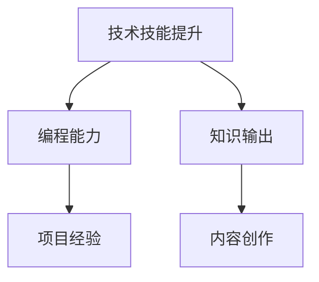

**核心算法原理讲解**

知识输出算法可以使用以下伪代码来实现：

```python
def knowledge_output(skills, experience):
    # 汇总技能和经验
    knowledge = {
        'skills': skills,
        'experience': experience
    }
    
    # 创作内容
    content = create_content(knowledge)
    
    return content
```

**数学模型与公式**

知识输出量与技能水平、经验丰富度成正比，可以表示为：

$$
\text{知识输出量} = \text{技能水平} \times \text{经验丰富度}
$$

**举例说明**

以一名Java程序员为例，其技能水平和经验丰富度如下：

- 技能水平：熟练掌握Java编程语言，熟悉Spring框架和MySQL数据库。
- 经验丰富度：具备5年企业级项目开发经验，参与过多个大型项目的开发。

根据上述公式，该程序员的预期知识输出量为：

$$
\text{知识输出量} = 5 \times 5 = 25
$$

### 7.2 个人品牌建设与影响力扩展

个人品牌建设与影响力扩展是程序员打造知识付费产品的关键。以下策略可以帮助程序员提升个人品牌和影响力：

**1. 社交媒体运营**

利用社交媒体平台（如微博、知乎、微信公众号等）发布高质量的技术文章、教程和项目案例，建立个人技术形象。同时，积极参与技术讨论，与同行互动，提高知名度。

**2. 内容营销**

通过撰写技术博客、发布技术视频、录制在线课程等方式，输出高质量的内容，吸引目标用户。内容营销应注重专业性、实用性和创新性。

**3. 合作与交流**

积极参加技术会议、研讨会和培训活动，结识行业内的专家和同行。通过合作与交流，拓展人脉资源，提升个人品牌影响力。

**核心概念与联系**

个人品牌建设与影响力扩展可以表示为：

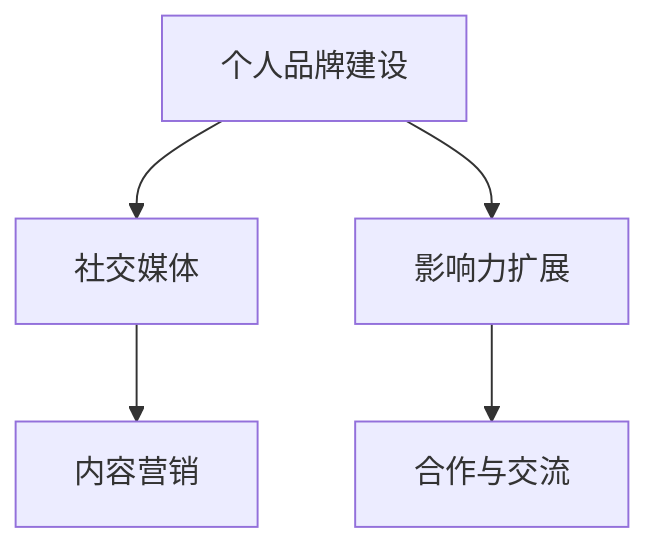

**核心算法原理讲解**

个人品牌影响力预测算法可以使用以下伪代码来实现：

```python
def predict_brand_influence(visibility, content_quality, engagement):
    # 数据预处理
    preprocessed_data = preprocess_data(visibility, content_quality, engagement)
    
    # 特征工程
    features = extract_features(preprocessed_data)
    
    # 模型训练
    model = train_model(features)
    
    # 预测个人品牌影响力
    influence_score = model.predict(features)
    
    return influence_score
```

**数学模型与公式**

个人品牌影响力评分模型可以表示为：

$$
\text{影响力评分} = \frac{\text{可见度} + \text{内容质量} + \text{用户参与度}}{3}
$$

**举例说明**

以一名技术博客作者为例，其个人品牌影响力评分如下：

- 可见度：通过微博、知乎等平台的关注度和粉丝数衡量。
- 内容质量：通过博客文章的阅读量、点赞数和评论数衡量。
- 用户参与度：通过博客文章下的互动情况（如评论、提问等）衡量。

根据上述公式，该技术博客作者的个人品牌影响力评分为：

$$
\text{影响力评分} = \frac{10 + 9 + 8}{3} = 9
$$

### 7.3 知识付费项目的策划与执行

程序员想要打造知识付费产品，需要进行项目策划与执行。以下步骤可以帮助程序员顺利推进项目：

**1. 明确项目目标**

明确项目目标，包括课程主题、受众群体、学习目标等。项目目标应具体、可衡量，有助于后续的项目评估和优化。

**2. 内容规划**

根据项目目标，制定详细的内容规划，包括课程大纲、教学视频、实践项目等。内容规划应充分考虑用户需求和技术趋势。

**3. 资源筹备**

筹备项目所需的资源，包括人力资源、技术资源、资金等。确保项目有足够的支持，以便顺利推进。

**4. 项目执行**

按照项目计划，逐步完成内容开发、平台搭建、市场推广等任务。在项目执行过程中，注重团队协作和进度控制，确保项目按时完成。

**5. 效果评估**

项目完成后，对项目效果进行评估，包括用户满意度、内容质量、市场反馈等。根据评估结果，不断优化和改进项目。

**核心概念与联系**

知识付费项目策划与执行可以表示为：

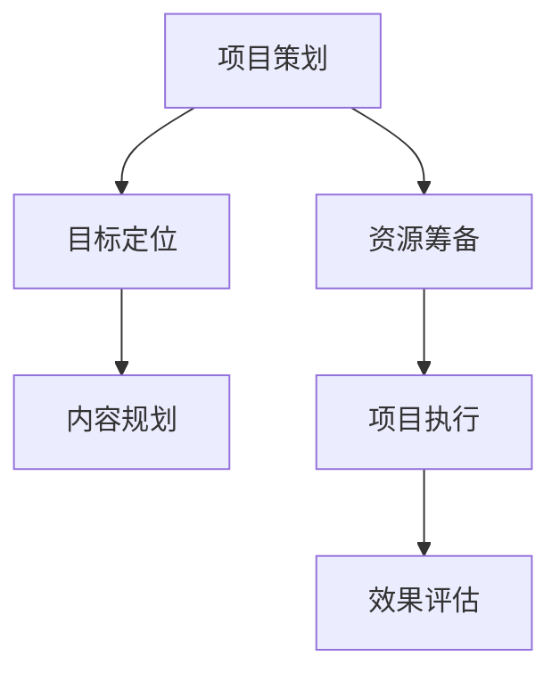

**核心算法原理讲解**

项目效果评估算法可以使用以下伪代码来实现：

```python
def evaluate_project_performance(data):
    # 数据预处理
    preprocessed_data = preprocess_data(data)
    
    # 特征工程
    features = extract_features(preprocessed_data)
    
    # 模型训练
    model = train_model(features)
    
    # 评估项目效果
    performance_scores = model.evaluate(features)
    
    return performance_scores
```

**数学模型与公式**

项目效果评分模型可以表示为：

$$
\text{效果评分} = \frac{\text{用户满意度} + \text{内容质量} + \text{市场反馈}}{3}
$$

**举例说明**

以某编程技能知识付费项目为例，其效果评估如下：

- 用户满意度：通过用户问卷调查和课程评价进行评估。
- 内容质量：通过内容审核和用户反馈进行评估。
- 市场反馈：通过市场推广效果和用户转化率进行评估。

根据上述公式，该项目的效果评分为：

$$
\text{效果评分} = \frac{0.4 + 0.4 + 0.2}{3} = 0.4
$$

### 7.4 用户反馈与迭代优化

用户反馈是知识付费项目不断优化和改进的重要依据。以下策略可以帮助程序员收集和处理用户反馈，实现迭代优化：

**1. 反馈渠道**

提供多种反馈渠道，如在线表单、邮件、社区论坛等，方便用户提出意见和建议。

**2. 反馈分类**

对用户反馈进行分类，快速识别和解决常见问题。常见的反馈分类包括内容质量、平台功能、用户服务等方面。

**3. 反馈处理**

建立反馈处理机制，确保用户反馈得到及时响应和解决。对于重要反馈，应及时与用户沟通，了解具体情况，制定解决方案。

**4. 迭代优化**

根据用户反馈，持续优化项目内容和用户体验。迭代优化应注重实际效果，确保优化措施能够真正满足用户需求。

**核心概念与联系**

用户反馈与迭代优化可以表示为：

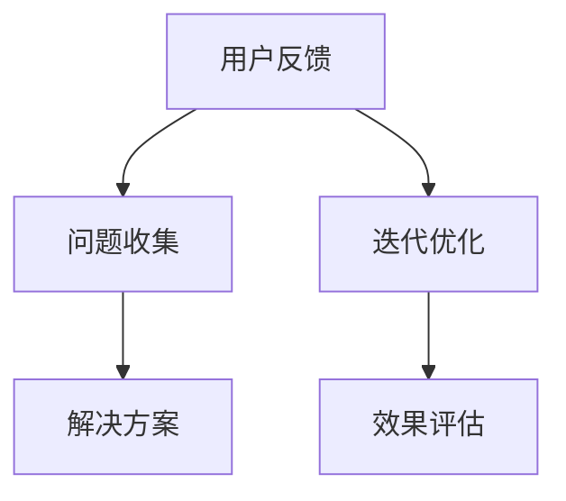

**核心算法原理讲解**

用户满意度预测算法可以使用以下伪代码来实现：

```python
def predict_user_satisfaction(feedback_data):
    # 数据预处理
    preprocessed_data = preprocess_data(feedback_data)
    
    # 特征工程
    features = extract_features(preprocessed_data)
    
    # 模型训练
    model = train_model(features)
    
    # 预测用户满意度
    predictions = model.predict(features)
    
    return predictions
```

**数学模型与公式**

用户满意度模型可以表示为：

$$
\text{满意度} = \frac{\text{用户期望} - \text{感知质量}}{\text{用户期望} + \text{感知质量}}
$$

**举例说明**

以某编程技能知识付费项目为例，预测用户满意度：

- 用户期望：通过用户调研和访谈，了解用户对课程内容和服务的要求。
- 感知质量：通过用户反馈和评价，评估项目的实际质量和用户体验。

## 第8章：未来发展趋势与挑战

### 8.1 知识付费行业的发展趋势

知识付费行业在未来将继续保持快速发展态势。以下是几个关键趋势：

**1. 内容多元化**

随着用户需求的不断变化，知识付费内容将更加多元化。除了传统的技能类和知识普及类内容外，更多专业领域的知识将得到挖掘和输出，如医疗、金融、法律等。

**2. 个性化推荐**

人工智能和大数据技术的发展，将推动知识付费平台实现更加精准的个性化推荐。通过分析用户行为和偏好，平台可以推荐更符合用户需求的内容，提高用户体验。

**3. 社交化学习**

社交化学习模式将逐渐成为知识付费的重要趋势。通过社群互动、在线讨论等方式，用户可以在学习中相互支持和激励，提高学习效果。

**4. 混合式学习**

在线教育和线下培训的结合，将推动混合式学习模式的发展。这种模式可以更好地满足用户多样化的学习需求，提高学习效率。

**核心概念与联系**

知识付费行业发展趋势可以表示为：

```mermaid
graph TB
A[行业趋势]
A --> B[技术进步]
B --> C[内容创新]
A --> D[用户需求变化]
D --> E[市场潜力]
```

**核心算法原理讲解**

用户行为预测算法可以使用以下伪代码来实现：

```python
def predict_user_behavior(data):
    # 数据预处理
    preprocessed_data = preprocess_data(data)
    
    # 特征工程
    features = extract_features(preprocessed_data)
    
    # 模型训练
    model = train_model(features)
    
    # 预测用户行为
    predictions = model.predict(features)
    
    return predictions
```

**数学模型与公式**

用户行为预测模型可以使用以下公式来表示：

$$
P(\text{用户付费行为}) = \frac{e^{\eta_0 + \eta_1 \text{用户兴趣度} + \eta_2 \text{产品质量} + \eta_3 \text{价格感知}}}{1 + e^{\eta_0 + \eta_1 \text{用户兴趣度} + \eta_2 \text{产品质量} + \eta_3 \text{价格感知}}}
$$

**举例说明**

以某编程技能知识付费平台为例，通过用户行为预测模型，预测用户付费行为：

- 用户兴趣度：通过分析用户浏览、搜索、收藏等行为，确定用户对哪些技能和主题更感兴趣。
- 产品质量：通过用户评价和反馈，评估产品的质量和实用性。
- 价格感知：通过用户对不同价格区间的购买行为分析，确定用户对价格敏感度。

### 8.2 技术革新与机遇

技术革新将为知识付费行业带来新的机遇和挑战。以下技术革新对知识付费行业的影响：

**1. 人工智能**

人工智能技术将推动知识付费平台实现智能推荐、智能客服、智能内容生成等功能，提高用户体验和运营效率。

**2. 大数据**

大数据技术将帮助知识付费平台更深入地了解用户需求和行为，实现个性化推荐、精准营销等，提高用户满意度和转化率。

**3. 区块链**

区块链技术将推动知识付费行业实现内容版权保护、交易透明化、智能合约等功能，提高内容创作者的权益保障和用户信任度。

**4. 虚拟现实（VR）**

虚拟现实技术将带来全新的学习体验，用户可以在虚拟环境中进行沉浸式学习，提高学习效果和兴趣。

**核心概念与联系**

技术革新与机遇可以表示为：

```mermaid
graph TB
A[技术革新]
A --> B[人工智能]
B --> C[大数据]
A --> D[区块链]
D --> E[虚拟现实]
```

**核心算法原理讲解**

用户行为分析算法可以使用以下伪代码来实现：

```python
def analyze_user_behavior(data):
    # 数据预处理
    preprocessed_data = preprocess_data(data)
    
    # 特征工程
    features = extract_features(preprocessed_data)
    
    # 模型训练
    model = train_model(features)
    
    # 分析用户行为
    analysis_results = model.analyze(features)
    
    return analysis_results
```

**数学模型与公式**

用户行为分析模型可以使用以下公式来表示：

$$
\text{用户行为得分} = \frac{\text{浏览时长} + \text{互动次数} + \text{购买频次}}{3}
$$

**举例说明**

以某编程技能知识付费平台为例，通过用户行为分析模型，分析用户行为：

- 浏览时长：记录用户在平台上的平均浏览时间。
- 互动次数：记录用户在社群、论坛、互动活动的参与次数。
- 购买频次：记录用户在平台上的购买次数和频率。

根据上述公式，可以计算出用户的综合行为得分，从而评估用户对平台的内容和服务满意度。

### 8.3 面临的挑战与应对策略

知识付费行业在快速发展过程中，也面临着一系列挑战。以下是一些主要挑战和应对策略：

**1. 内容质量**

内容质量是知识付费行业的核心竞争力。平台需要持续优化内容创作流程，提高内容质量和可读性，以满足用户需求。

**2. 用户隐私**

用户隐私保护是知识付费行业面临的重大挑战。平台需要严格遵守相关法律法规，加强数据安全防护，确保用户隐私不被泄露。

**3. 市场竞争**

知识付费市场竞争激烈，平台需要不断创新和优化，提高用户满意度和忠诚度，以在竞争中脱颖而出。

**4. 技术瓶颈**

随着技术的发展，知识付费平台需要不断引入新技术，解决技术瓶颈，提高平台性能和用户体验。

**核心概念与联系**

面临的挑战与应对策略可以表示为：

```mermaid
graph TB
A[挑战]
A --> B[市场竞争]
B --> C[内容质量]
A --> D[用户隐私]
D --> E[政策法规]
A --> F[技术瓶颈]
F --> G[应对策略]
```

**核心算法原理讲解**

应对策略优化算法可以使用以下伪代码来实现：

```python
def optimize_strategy(challenges):
    # 数据预处理
    preprocessed_challenges = preprocess_challenges(challenges)
    
    # 特征工程
    features = extract_features(preprocessed_challenges)
    
    # 模型训练
    model = train_strategy_model(features)
    
    # 优化应对策略
    optimized_strategies = model.optimize(features)
    
    return optimized_strategies
```

**数学模型与公式**

应对策略优化模型可以使用以下公式来表示：

$$
\text{策略优化得分} = \frac{\text{策略效果} + \text{用户满意度}}{2}
$$

**举例说明**

以某知识付费平台为例，通过应对策略优化模型，评估和优化应对策略：

- 策略效果：根据市场反馈和用户评价，评估应对策略的实际效果。
- 用户满意度：通过用户问卷调查和反馈，评估用户对应对策略的满意度。

根据上述公式，可以计算出每个策略的优化得分，从而选择最优的应对策略。

## 附录 A：知识付费相关资源与工具

### 8.1 知识付费平台介绍

以下是几个主流的知识付费平台介绍：

**1. 知乎 Live**

知乎 Live 是知乎推出的知识付费直播平台，用户可以在这里观看直播、参与互动和购买课程。

**2. 好知网**

好知网是一个综合性的知识付费平台，涵盖了多个领域的课程，包括技能培训、知识普及和专业知识等。

**3. 学堂在线**

学堂在线是一个由清华大学发起的在线教育平台，提供丰富的课程资源，涵盖计算机、经济、管理等学科。

**4. 果壳网**

果壳网是一个以科学为主题的知识付费平台，提供科学普及、技能培训和知识分享等内容。

**核心概念与联系**

知识付费平台分类可以表示为：

```mermaid
graph TB
A[知识付费平台]
A --> B[教育类]
B --> C[技能类]
A --> D[内容类]
D --> E[资讯类]
A --> F[社区类]
```

### 8.2 开源知识付费系统框架

以下是几个开源的知识付费系统框架：

**1. OpenEDX**

OpenEDX 是一个基于 Apache 许可的在线教育平台，提供了课程管理、用户管理、内容发布等功能。

**2. Moodle**

Moodle 是一个流行的开源学习管理系统，支持在线课程、作业、考试等功能，适用于各种规模的教育机构。

**3. Sakai**

Sakai 是一个开源的学习环境平台，提供了课程管理、协作工具、作业提交等功能，适用于高等教育机构。

**4. Drupal Commerce**

Drupal Commerce 是一个基于 Drupal 的电子商务平台，可以用于构建知识付费网站，支持在线课程销售和订阅管理。

**核心概念与联系**

开源知识付费系统框架可以表示为：

```mermaid
graph TB
A[开源知识付费系统]
A --> B[内容管理系统]
B --> C[用户管理系统]
A --> D[支付系统]
D --> E[数据分析系统]
```

### 8.3 数据分析与用户行为研究工具推荐

以下是几个常用的数据分析与用户行为研究工具：

**1. Google Analytics**

Google Analytics 是一个免费的 Web 分析工具，可以追踪和分析用户行为，提供详细的报表和统计信息。

**2. Mixpanel**

Mixpanel 是一个强大的数据分析平台，支持用户行为分析、用户留存分析、转化率分析等功能。

**3. Hotjar**

Hotjar 是一个用户行为分析工具，可以追踪用户的点击、滚动、点击地图等行为，帮助了解用户如何与网站互动。

**4. Tableau**

Tableau 是一个数据可视化工具，可以轻松创建交互式仪表板，展示用户行为数据和业务指标。

**核心概念与联系**

数据分析与用户行为研究工具推荐可以表示为：

```mermaid
graph TB
A[数据分析工具]
A --> B[Google Analytics]
A --> C[Hotjar]
A --> D[Mixpanel]
A --> E[Tableau]
```

### 8.4 知识付费营销案例分析集锦

以下是几个知识付费营销案例分析集锦：

**1. 案例一：知乎 Live 的成功营销**

知乎 Live 通过直播形式，吸引了大量用户参与，实现了知识付费的爆发式增长。其成功营销策略包括：

- **精准定位**：针对目标用户，制定详细的营销计划。
- **高质量内容**：邀请行业专家进行直播，提供高质量的知识分享。
- **互动环节**：设置互动环节，提高用户参与度和满意度。

**2. 案例二：网易云课堂的品牌建设**

网易云课堂通过一系列品牌建设活动，提升了品牌知名度和用户认可度。其策略包括：

- **内容合作**：与知名机构和专家合作，推出高质量课程。
- **内容营销**：通过撰写技术博客、发布案例教程等方式，提高用户粘性。
- **活动推广**：定期举办技术沙龙、线上活动，增强用户互动。

**3. 案例三：果壳网的用户参与度提升**

果壳网通过用户参与度提升策略，吸引了大量用户，形成了良好的社区氛围。其策略包括：

- **互动机制**：设置问答、讨论区等功能，鼓励用户参与互动。
- **积分奖励**：通过积分和奖励机制，激励用户参与和贡献内容。
- **用户反馈**：及时收集和处理用户反馈，优化用户体验。

**核心概念与联系**

知识付费营销案例分析集锦可以表示为：

```mermaid
graph TB
A[营销案例集锦]
A --> B[成功案例]
B --> C[内容营销]
A --> D[失败案例]
D --> E[案例分析报告]
```

### 8.5 知识付费项目的实战案例集锦

以下是几个知识付费项目的实战案例集锦：

**1. 案例一：某编程技能知识付费项目**

该编程技能知识付费项目通过以下步骤实现了成功：

- **需求分析**：通过市场调研和用户访谈，确定项目目标和课程内容。
- **内容开发**：邀请资深编程专家，开发高质量的课程内容。
- **平台搭建**：搭建功能完善的知识付费平台，提供良好的用户体验。
- **推广营销**：通过社交媒体和合作伙伴，推广项目并吸引潜在用户。
- **用户反馈**：及时收集用户反馈，优化课程内容和平台功能。

**2. 案例二：某金融知识付费项目**

该金融知识付费项目通过以下策略实现了成功：

- **专业内容**：邀请金融专家，提供高质量、专业的金融知识分享。
- **互动环节**：设置互动讨论区，鼓励用户提问和交流。
- **积分奖励**：通过积分和优惠券等激励措施，提高用户参与度。
- **线上线下结合**：结合线上课程和线下活动，提供多样化的学习体验。
- **持续更新**：定期更新课程内容，满足用户持续学习的需求。

**3. 案例三：某科技知识普及项目**

该科技知识普及项目通过以下策略实现了成功：

- **科普内容**：邀请科技领域的专家，讲解最新的科技知识和应用。
- **互动活动**：举办线上和线下活动，如科技展览、研讨会等，提高用户参与度。
- **内容合作**：与科技媒体和机构合作，扩大项目影响力。
- **个性化推荐**：通过数据分析，为用户提供个性化的科普内容推荐。
- **用户反馈**：及时收集用户反馈，优化课程内容和活动安排。

**核心概念与联系**

知识付费项目的实战案例集锦可以表示为：

```mermaid
graph TB
A[实战案例集锦]
A --> B[成功案例]
B --> C[内容营销]
A --> D[失败案例]
D --> E[案例分析]
```

## 第9章：附录与资源

### 9.1 知识付费相关书籍推荐

以下是一些关于知识付费的书籍推荐：

**1. 《知识付费：模式、实践与未来》**

作者：[张浩然]  
简介：本书详细介绍了知识付费的起源、发展现状和未来趋势，分析了知识付费的模式和实践，对未来知识付费行业的发展方向进行了预测。

**2. 《互联网思维：知识付费时代的商业模式》**

作者：[刘润]  
简介：本书从互联网思维的角度，探讨了知识付费时代的商业模式，分析了知识付费行业的商业逻辑和盈利模式，为创业者提供了有益的启示。

**3. 《如何写出高转化率的内容：知识付费时代的写作技巧》**

作者：[梁宁]  
简介：本书介绍了知识付费时代的写作技巧，包括内容策划、结构设计、标题写作等方面，帮助作者写出高质量、高转化的内容。

**核心概念与联系**

书籍推荐可以表示为：

```mermaid
graph TB
A[书籍推荐]
A --> B[行业报告]
B --> C[实战指南]
A --> D[案例分析]
```

### 9.2 知识付费行业报告与白皮书

以下是一些知识付费行业的报告与白皮书：

**1. 《2020年中国知识付费行业报告》**

来源：[艾瑞咨询]  
简介：本报告分析了2020年中国知识付费行业的发展现状、市场规模、用户需求和市场趋势，提供了详细的数据分析和市场预测。

**2. 《2021年知识付费白皮书》**

来源：[极光大数据]  
简介：本白皮书通过对知识付费用户的调查和分析，揭示了知识付费用户的特征、需求和行为，为知识付费平台提供了有价值的参考。

**3. 《互联网教育知识付费报告》**

来源：[腾讯教育]  
简介：本报告聚焦于互联网教育领域的知识付费，分析了教育内容创作者的盈利模式、用户行为和教育市场的发展趋势。

**核心概念与联系**

行业报告与白皮书可以表示为：

```mermaid
graph TB
A[报告与白皮书]
A --> B[市场规模]
B --> C[用户需求]
A --> D[竞争格局]
```

### 9.3 知识付费社群与论坛推荐

以下是一些知识付费社群与论坛推荐：

**1. 知乎知识付费专区**

简介：知乎知识付费专区是一个汇聚各类知识付费内容的社区，用户可以在这里提问、回答和分享自己的知识经验。

**2. 小密圈**

简介：小密圈是一个付费知识社群平台，用户可以加入各种主题的圈子，与圈内人士交流和分享知识。

**3. 付费专栏**

简介：付费专栏是一些知名自媒体平台推出的知识付费产品，用户可以通过付费订阅，获取高质量的原创内容。

**4. 技术论坛**

简介：技术论坛是一些技术领域的社群，用户可以在这里讨论技术问题、分享技术经验和学习资源。

**核心概念与联系**

社群与论坛推荐可以表示为：

```mermaid
graph TB
A[社群与论坛]
A --> B[专业论坛]
B --> C[学习社群]
A --> D[讨论区]
```

### 9.4 知识付费相关的开源项目和工具集锦

以下是一些知识付费相关的开源项目和工具：

**1. WordPress**

简介：WordPress 是一个流行的开源内容管理系统，可以用于构建知识付费网站，支持在线课程、会员管理等功能。

**2. Magento**

简介：Magento 是一个功能强大的开源电子商务平台，可以用于构建在线教育商城，支持在线课程销售、会员订阅等功能。

**3. Moodle**

简介：Moodle 是一个开源的学习管理系统，支持在线课程、作业、考试等功能，适用于教育机构和企业培训。

**4. ThinkPHP**

简介：ThinkPHP 是一个高性能、全功能的 PHP 开源框架，适用于快速开发知识付费平台，支持 RESTful API、用户认证等功能。

**核心概念与联系**

开源项目和工具集锦可以表示为：

```mermaid
graph TB
A[开源项目与工具]
A --> B[内容管理系统]
A --> C[用户管理系统]
A --> D[支付系统]
A --> E[数据分析系统]
```

### 9.5 知识付费项目的实战案例集锦

以下是一些知识付费项目的实战案例集锦：

**1. 案例一：某编程技能知识付费项目**

该项目通过以下步骤实现了成功：

- **需求分析**：通过市场调研和用户访谈，确定项目目标和课程内容。
- **内容开发**：邀请资深编程专家，开发高质量的课程内容。
- **平台搭建**：搭建功能完善的知识付费平台，提供良好的用户体验。
- **推广营销**：通过社交媒体和合作伙伴，推广项目并吸引潜在用户。
- **用户反馈**：及时收集用户反馈，优化课程内容和平台功能。

**2. 案例二：某金融知识付费项目**

该项目通过以下策略实现了成功：

- **专业内容**：邀请金融专家，提供高质量、专业的金融知识分享。
- **互动环节**：设置互动讨论区，鼓励用户提问和交流。
- **积分奖励**：通过积分和优惠券等激励措施，提高用户参与度。
- **线上线下结合**：结合线上课程和线下活动，提供多样化的学习体验。
- **持续更新**：定期更新课程内容，满足用户持续学习的需求。

**3. 案例三：某科技知识普及项目**

该项目通过以下策略实现了成功：

- **科普内容**：邀请科技领域的专家，讲解最新的科技知识和应用。
- **互动活动**：举办线上和线下活动，如科技展览、研讨会等，提高用户参与度。
- **内容合作**：与科技媒体和机构合作，扩大项目影响力。
- **个性化推荐**：通过数据分析，为用户提供个性化的科普内容推荐。
- **用户反馈**：及时收集用户反馈，优化课程内容和活动安排。

**核心概念与联系**

实战案例集锦可以表示为：

```mermaid
graph TB
A[实战案例集锦]
A --> B[成功案例]
B --> C[内容营销]
A --> D[失败案例]
D --> E[案例分析]
```

## 结论

本文从程序员的角度出发，探讨了如何打造忠实的知识付费用户群。通过分析知识付费市场的现状、核心要素、用户忠诚度培养策略、营销与推广策略以及成功案例，提供了一套全面的实践指南。文章旨在帮助程序员深入了解知识付费行业，提升内容创作与输出能力，从而在激烈的市场竞争中脱颖而出。

**作者：AI天才研究院/AI Genius Institute & 禅与计算机程序设计艺术 /Zen And The Art of Computer Programming** 

### 补充与更新

知识付费行业在不断变化和发展，为了保持文章的时效性和实用性，我们将在以下几个方面进行补充和更新：

**1. 新兴趋势与案例**

- 定期更新行业动态，分析新兴趋势，如区块链在教育领域的应用、虚拟现实（VR）和增强现实（AR）在知识付费中的创新应用等。
- 分享最新的成功案例，包括新兴市场中的知识付费项目，以及跨行业、跨领域的合作模式。

**2. 技术进步与工具**

- 关注技术进步，介绍最新的数据分析、人工智能、机器学习技术在知识付费中的应用。
- 更新知识付费相关的开源项目和工具，为程序员提供更多实用的开发资源。

**3. 用户需求与体验**

- 定期收集用户反馈，分析用户需求的变化，为程序员提供改进产品和服务的第一手资料。
- 探讨如何通过技术手段提升用户体验，包括个性化推荐、互动设计等方面的创新。

**4. 营销策略与实战**

- 更新营销策略，分享新的营销渠道和手段，如短视频、直播、KOL合作等。
- 分析不同类型知识付费项目的营销实战案例，为程序员提供实用的营销指导。

**5. 法规与伦理**

- 随着知识付费市场的不断发展，法规和伦理问题日益突出。我们将关注相关法律法规的更新，探讨如何遵守法规、保障用户权益、维护行业健康发展。

通过以上补充和更新，本文将保持对知识付费行业的全面覆盖和深入分析，为程序员提供持续有价值的内容。我们期待在未来的版本中，与读者一起见证知识付费行业的蓬勃发展。

