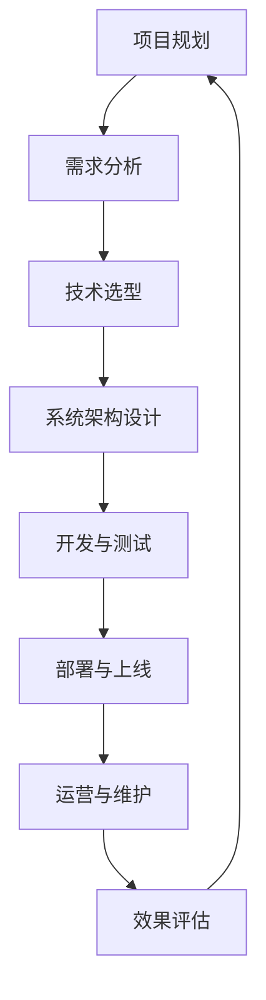
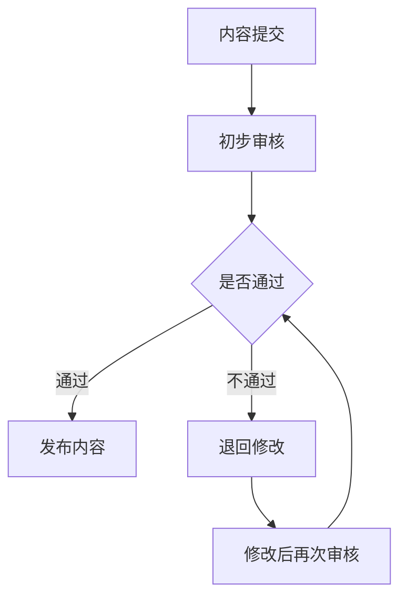
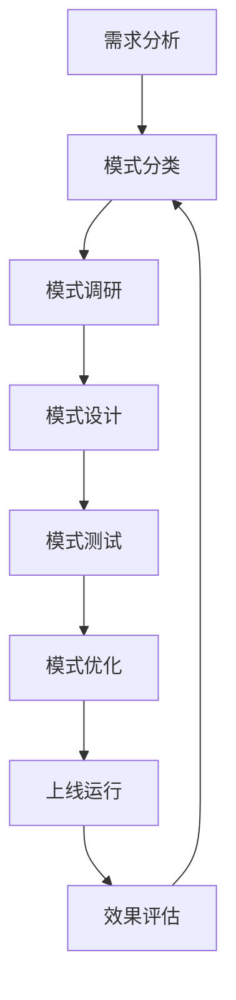

                 

## 文章标题

### 《程序员如何打造知识付费的在线社区》

#### 关键词：
- 知识付费
- 在线社区
- 程序员
- 内容管理
- 会员体系
- 用户增长
- 安全管理

#### 摘要：
本文旨在探讨程序员如何利用自身的编程技能和技术知识，打造一个成功的知识付费在线社区。文章将从市场概述、平台选择、内容规划、付费模式设计、会员体系构建、社区运营和安全管理等多个方面，详细阐述实现过程和关键策略。通过实际案例研究和项目实战，为程序员提供全面的指导，帮助他们成功打造并运营知识付费的在线社区。

## 第1章: 前言与背景

### 1.1 知识付费市场概述

知识付费作为一种新型的商业模式，近年来在全球范围内迅速崛起。其核心在于，通过互联网平台，将专业知识和技能以付费形式提供给用户，满足他们在学习、工作、生活中对知识的渴求。知识付费市场的主要驱动因素包括：

1. **互联网普及**：随着互联网技术的飞速发展，人们获取信息的途径越来越丰富，在线学习、在线教育等新兴领域得到了广泛关注和认可。
2. **用户需求**：随着生活节奏的加快，用户对高效、便捷的知识获取方式有了更高的需求，知识付费成为了一种趋势。
3. **内容多样**：知识付费内容涵盖了广泛的主题，从职业技能提升到兴趣爱好，满足了不同用户群体的需求。
4. **盈利模式**：知识付费为平台和内容创作者提供了新的盈利途径，推动了整个市场的快速发展。

### 1.2 在线社区的重要性

在线社区作为知识付费的核心载体，具有以下几个重要特点：

1. **互动性**：在线社区提供了一个用户之间、用户与内容创作者之间互动交流的平台，促进了知识的传播和分享。
2. **黏性**：通过建立会员体系、积分机制等，在线社区可以增强用户的粘性，提高用户留存率。
3. **品牌效应**：优质的在线社区可以树立品牌形象，吸引更多的用户和内容创作者加入，形成良好的口碑效应。
4. **数据分析**：在线社区可以收集大量的用户数据，通过数据分析，为内容创作者和平台提供决策依据，优化用户体验。

### 1.3 程序员打造知识付费社区的价值与挑战

对于程序员而言，打造知识付费的在线社区具有以下价值：

1. **技术优势**：程序员具备强大的技术背景，能够搭建和优化在线社区的平台和系统，提高用户体验。
2. **内容创作**：程序员可以通过分享自己的技术知识和经验，为社区提供高质量的内容，吸引更多用户关注。
3. **商业模式**：程序员可以探索多种付费模式，如会员订阅、课程购买、付费问答等，实现持续盈利。
4. **创新空间**：程序员可以结合最新的技术趋势，如人工智能、大数据等，为在线社区带来创新性的功能和服务。

然而，在打造知识付费社区的过程中，程序员也会面临一系列挑战：

1. **技术选型**：选择合适的开发框架、数据库、服务器等，需要综合考虑性能、稳定性、成本等多方面因素。
2. **内容管理**：如何保证内容的质量和多样性，是一个需要持续关注的课题。
3. **用户运营**：如何提高用户的活跃度和留存率，需要制定有效的运营策略。
4. **安全合规**：确保用户数据和社区内容的合规性，防止恶意攻击和数据泄露，是一个不容忽视的问题。

本章为后续内容的展开提供了背景和基础，让我们在接下来的章节中，逐步深入探讨如何利用程序员的技术能力，打造一个成功的知识付费在线社区。

## 第2章: 在线社区平台的选择与构建

### 2.1 常见在线社区平台介绍

在选择构建知识付费社区平台时，程序员需要了解几种常见的在线社区平台，以便根据实际需求做出合适的选择。以下是几种主流的在线社区平台及其特点：

1. **Discourse**：Discourse是一个基于Web的论坛软件，具有用户友好、易于扩展和高度定制化的特点。它支持多种语言、丰富的主题样式和插件，适合构建中型及大型社区。
   
2. **Flarum**：Flarum是一个轻量级、开源的论坛软件，具有良好的用户体验和快速的性能。它的设计理念是简洁和易于使用，非常适合小型和中型社区。

3. **phpBB**：phpBB是一个历史悠久、功能丰富的开源论坛软件。它拥有庞大的用户基础和活跃的社区支持，适合构建大型论坛。

4. **WordPress with BuddyPress**：WordPress是一个广泛使用的博客和网站构建平台，结合BuddyPress插件，可以构建一个功能强大的社交网络和社区。WordPress的插件生态系统提供了丰富的扩展选项，适合各种规模和需求的社区。

5. **Mattermost**：Mattermost是一个开源的团队协作工具，具有论坛功能，适合企业内部社区或专业团队使用。它提供了丰富的集成选项和强大的安全功能。

### 2.2 自建平台的优势与挑战

尽管市面上有许多现成的在线社区平台，但自建平台仍然是一个重要的选择。自建平台的优势包括：

1. **完全控制**：自建平台意味着程序员可以完全控制社区的各个方面，从功能设计到用户体验，都能按照自己的需求进行定制。

2. **扩展性**：自建平台可以根据业务发展需求，灵活扩展功能和技术架构，以适应不断变化的市场环境。

3. **数据安全性**：自建平台可以更好地保障用户数据的安全，避免第三方平台可能带来的数据泄露风险。

4. **差异化竞争**：自建平台可以提供独特的功能和服务，形成差异化竞争优势，吸引更多用户。

然而，自建平台也面临一些挑战：

1. **开发成本**：自建平台需要大量的开发资源和时间投入，尤其是在初期阶段。

2. **技术选型**：选择合适的开发框架、数据库、服务器等技术栈，需要程序员有深厚的技术积累和判断力。

3. **维护成本**：自建平台的维护成本较高，需要不断更新和优化系统，确保平台的稳定性和安全性。

4. **市场竞争**：市面上的现成平台已经具备一定的用户基础和市场份额，自建平台需要投入更多资源和精力进行市场推广。

### 2.3 社区平台的技术选型与架构设计

在自建社区平台的过程中，技术选型和架构设计至关重要。以下是几个关键考虑因素：

1. **开发框架**：选择一个成熟、社区活跃的开源框架，如Laravel、Django或Spring Boot，可以加快开发进度并确保系统的稳定性。

2. **数据库**：根据社区规模和数据量，选择合适的数据库系统，如MySQL、PostgreSQL或MongoDB。对于高并发场景，可以考虑使用分布式数据库架构。

3. **前端技术**：使用现代前端框架，如React、Vue或Angular，可以提升用户交互体验，同时确保前端与后端的协同工作。

4. **消息队列**：引入消息队列系统，如RabbitMQ或Kafka，可以解耦系统组件，提高系统的可扩展性和性能。

5. **缓存系统**：使用缓存系统，如Redis，可以大幅减少数据库的读取压力，提高系统的响应速度。

6. **服务器架构**：考虑使用容器化技术，如Docker和Kubernetes，实现微服务架构，提高系统的灵活性和可维护性。

7. **安全性**：采用多层次的安全措施，包括身份验证、授权、数据加密、防火墙等，确保平台的安全性。

通过合理的技术选型和架构设计，程序员可以构建一个高效、稳定、安全的在线社区平台，为知识付费的顺利实施奠定基础。

## 第3章: 知识内容的生产与审核

### 3.1 内容生产流程

知识内容的生产是构建知识付费社区的核心环节，其流程包括以下几个步骤：

1. **内容规划**：根据社区的目标用户和市场需求，制定内容规划。内容规划应包括内容的主题、形式、更新频率和发布计划。

2. **内容创作**：内容创作者根据规划，进行内容创作。内容创作可以包括文章、视频、音频、教程等多种形式。

3. **内容审核**：内容创作完成后，需要进行审核。审核主要包括内容质量、准确性、版权合规性等方面。

4. **内容发布**：审核通过的内容，按照发布计划进行发布。发布过程中，可以设置不同的权限，如公开、私密或会员专享。

5. **内容更新**：定期对已有内容进行更新和优化，确保内容的时效性和准确性。

### 3.2 内容审核机制

内容审核机制是保障知识付费社区内容质量的重要手段。以下是几个关键点：

1. **人工审核**：人工审核可以确保内容的准确性、合规性和专业性。审核员应具备相关专业知识和经验。

2. **自动审核**：引入自动审核工具，如内容识别软件和机器学习模型，可以初步筛选出违规或低质量内容。

3. **分级审核**：根据内容的重要性和敏感度，设置不同的审核级别。重要内容应进行多级审核，以确保内容质量。

4. **用户反馈机制**：建立用户反馈渠道，收集用户对内容的反馈，及时发现和解决内容问题。

5. **持续优化**：根据审核结果和用户反馈，不断优化审核机制，提高审核效率和准确性。

### 3.3 知识版权保护策略

知识版权保护是知识付费社区必须重视的问题。以下是几个关键策略：

1. **版权声明**：在社区中明确版权声明，告知用户内容的使用规则和版权归属。

2. **内容加密**：对付费内容进行加密处理，防止未经授权的访问和复制。

3. **版权监测**：利用版权监测工具，定期检查社区内容是否存在侵权行为。

4. **法律维权**：对于侵权行为，及时采取法律手段维权，保护自身和创作者的合法权益。

5. **合作共赢**：与内容创作者建立长期合作关系，共同维护内容版权，实现共赢。

通过科学的内容生产流程、严格的内容审核机制和有效的版权保护策略，程序员可以确保知识付费社区的内容质量，为用户提供优质的知识服务。

## 第4章: 知识付费模式的设计与实现

### 4.1 付费模式的分类

知识付费模式可以分为以下几种类型：

1. **按次付费**：用户针对某个具体知识点或课程进行一次性购买，适合短时学习需求。
2. **订阅模式**：用户按月或按年支付订阅费用，享受社区内所有课程的免费学习，适合长期学习需求。
3. **课程购买**：用户针对特定课程进行购买，课程内容在购买后可以永久保存，适合对特定课程有深度学习需求。
4. **付费问答**：用户针对特定问题向专家或讲师付费咨询，适合对个性化知识有需求。
5. **会员体系**：用户通过支付会员费，享受社区提供的额外服务，如优先问答、专属课程等，适合对社区服务有高度需求。

### 4.2 付费模式的案例研究

以下是对几种常见付费模式的实际案例研究：

#### 案例一：按次付费

**案例来源**：知乎Live

**模式特点**：知乎Live通过按次付费的方式，为用户提供了高质量的讲座和直播课程。用户可以根据自己的兴趣和需求，选择购买感兴趣的课程。

**案例分析**：知乎Live的成功在于其精准的内容定位和高品质的课程内容。通过严格的讲师选拔和内容审核机制，知乎Live确保了课程的质量，吸引了大量用户。

#### 案例二：订阅模式

**案例来源**：得到App

**模式特点**：得到App采用订阅模式，用户按月或按年支付订阅费用，可以免费学习平台上的所有课程。订阅模式为用户提供了便利和灵活，同时也能保证平台的持续收入。

**案例分析**：得到App的订阅模式成功的关键在于其优质的内容和高效的运营策略。通过邀请行业内的知名专家和资深讲师，得到App吸引了大量用户，实现了用户规模的快速增长。

#### 案例三：课程购买

**案例来源**：Coursera

**模式特点**：Coursera为用户提供了大量在线课程，用户可以根据自己的需求和兴趣进行购买。课程购买模式适合对特定课程有深度学习需求。

**案例分析**：Coursera的成功在于其广泛的课程资源和专业的讲师团队。通过与全球顶尖大学和机构合作，Coursera提供了高质量的课程内容，吸引了大量用户。

#### 案例四：付费问答

**案例来源**：分答

**模式特点**：分答采用付费问答模式，用户可以向专家或讲师付费提问，得到个性化的解答。付费问答模式为用户提供了高效的咨询服务。

**案例分析**：分答的成功在于其高效的问答机制和专业的专家团队。通过严格的专家选拔和审核机制，分答确保了问答服务的质量和专业性。

#### 案例五：会员体系

**案例来源**：知乎会员

**模式特点**：知乎会员通过支付会员费，享受知乎社区提供的额外服务，如优先问答、专属课程等。会员体系为用户提供了一种更为丰富的知识付费体验。

**案例分析**：知乎会员的成功在于其丰富的内容和高效的运营策略。通过提供高质量的内容和服务，知乎会员吸引了大量用户，实现了持续的收入增长。

### 4.3 实现知识付费功能的技术架构

要实现知识付费功能，需要构建一个高效、稳定、安全的支付和会员管理系统。以下是几个关键组件：

1. **支付系统**：集成主流的支付渠道，如支付宝、微信支付、信用卡等，确保用户可以方便地进行支付。

2. **会员管理系统**：管理用户的会员信息、付费记录和会员权益，提供会员专享的内容和服务。

3. **内容管理系统**：管理课程内容、用户权限和课程定价，确保内容的安全和权限控制。

4. **订单管理系统**：处理用户的订单生成、支付、退款等流程，确保交易的顺利进行。

5. **用户权限管理系统**：根据用户的会员等级和付费情况，控制用户对内容的访问权限。

通过科学的设计和实现，程序员可以构建一个功能齐全、操作便捷的知识付费系统，为用户提供优质的知识服务，实现社区的持续盈利。

## 第5章: 会员体系与积分机制

### 5.1 会员体系的构建

会员体系是知识付费社区的核心之一，通过会员体系，社区可以区分用户等级，提供不同的服务内容和权益。以下是构建会员体系的几个关键步骤：

1. **会员等级设计**：根据社区的目标和用户需求，设计不同的会员等级。常见的等级设计包括免费会员、初级会员、中级会员、高级会员等。

2. **权益分配**：为每个会员等级分配相应的权益，如专属课程、优先问答、会员专享活动等。权益的设置应考虑用户需求，以增强用户的粘性。

3. **会员权益展示**：在社区界面中清晰地展示会员等级和权益，使用户可以直观地了解不同等级的会员所能享受的服务。

4. **会员升级机制**：设计会员升级机制，如积分累计、付费升级等，鼓励用户提升会员等级。

5. **会员管理界面**：为社区管理员提供会员管理界面，方便管理员对会员进行操作和管理。

### 5.2 积分机制的设计

积分机制是会员体系中重要的一环，通过积分，社区可以激励用户活跃参与，提高用户留存率和粘性。以下是设计积分机制的几个关键点：

1. **积分获取方式**：设计多种积分获取方式，如登录、评论、分享、购买等，确保用户可以通过多种途径获得积分。

2. **积分消耗方式**：设计积分消耗方式，如兑换礼品、升级会员等级等，使积分具有实际价值。

3. **积分计算规则**：制定积分计算规则，如每次评论获得10积分，每购买一次课程获得50积分等，确保积分的公平性和合理性。

4. **积分兑换机制**：设计积分兑换机制，提供丰富的兑换选项，如优惠券、实物礼品等，提高用户的参与度。

5. **积分有效期**：设定积分有效期，如积分在一年内未使用将失效，以激励用户及时使用积分。

### 5.3 会员互动与激励机制

会员互动与激励机制是提高用户活跃度和留存率的重要手段。以下是几个关键策略：

1. **社区活动**：定期举办线上或线下活动，如知识分享会、问答大赛、会员专属讲座等，增强会员之间的互动和交流。

2. **积分奖励**：根据用户的行为，如发布优质内容、活跃参与讨论等，给予积分奖励，激励用户积极参与社区活动。

3. **会员成长计划**：设计会员成长计划，通过完成特定任务，如阅读一定数量的文章、参与一定次数的讨论等，提升会员等级，获得额外积分和权益。

4. **会员专属内容**：为会员提供专属内容，如未公开的讲座、特权课程等，增强会员的归属感和粘性。

5. **用户调研**：定期进行用户调研，了解用户需求和反馈，及时调整会员体系设计，以更好地满足用户需求。

通过科学设计会员体系和积分机制，程序员可以构建一个活跃、互动的会员社区，提高用户留存率和满意度，实现社区的长期发展。

## 第6章: 社区运营策略

### 6.1 社区运营的目标与任务

社区运营的目标是提升用户活跃度、留存率和满意度，构建一个健康、活跃、有价值的知识分享平台。以下是社区运营的几个核心目标：

1. **用户增长**：通过有效的市场推广和内容策略，吸引更多新用户加入社区。
2. **用户活跃**：通过丰富的社区活动和互动机制，提高用户的活跃度和参与度。
3. **用户留存**：通过优质的内容和良好的用户体验，提高用户的留存率，减少用户流失。
4. **内容质量**：确保社区内容的高质量，提供有价值的知识和服务。
5. **品牌塑造**：通过专业的内容和高效的运营，提升社区的品牌形象和影响力。

社区运营的任务包括：

1. **内容管理**：制定内容规划，审核和发布内容，确保内容的质量和多样性。
2. **用户管理**：管理用户账户，处理用户反馈和投诉，维护社区秩序。
3. **活动策划**：策划和组织社区活动，如线上讲座、问答大赛、线下聚会等，增强用户互动。
4. **数据分析**：收集和分析用户数据，优化运营策略，提高运营效率。
5. **市场推广**：通过线上线下渠道，宣传社区，吸引新用户加入。

### 6.2 内容运营策略

内容运营是社区运营的核心，以下是一些关键策略：

1. **内容定位**：根据社区的目标用户和市场需求，明确内容方向和定位，确保内容与用户需求匹配。
2. **内容规划**：制定内容发布计划，包括内容类型、发布频率和主题等，确保内容的持续性和连贯性。
3. **内容生产**：邀请专业讲师和行业专家进行内容创作，确保内容的专业性和权威性。
4. **内容审核**：建立内容审核机制，确保内容的准确性、合规性和质量。
5. **内容推广**：利用社区内部和外部的推广渠道，如社交媒体、邮件营销等，扩大内容影响力。
6. **内容互动**：通过评论、问答、投票等互动形式，提高用户对内容的参与度和满意度。

### 6.3 用户运营策略

用户运营是提升用户活跃度和留存率的关键，以下是一些重要策略：

1. **用户分层**：根据用户的活跃度和贡献度，将用户分为不同层次，提供差异化的服务和权益。
2. **用户激励**：通过积分、优惠券、会员专属活动等方式，激励用户参与社区活动，提高用户活跃度。
3. **用户反馈**：建立用户反馈机制，收集用户的意见和建议，及时改进社区服务和体验。
4. **用户社区**：建立用户社区，鼓励用户之间的交流和互动，形成良好的社区氛围。
5. **用户调研**：定期进行用户调研，了解用户需求和偏好，优化运营策略。
6. **用户画像**：通过数据分析，构建用户画像，为个性化服务和精准营销提供依据。

通过科学的内容运营和用户运营策略，程序员可以打造一个健康、活跃、有价值的知识付费社区，实现社区的长期发展。

## 第7章: 用户增长与留存策略

### 7.1 用户增长渠道

用户增长是知识付费社区成功的关键之一。以下是一些有效的用户增长渠道：

1. **社交媒体推广**：利用微博、微信、抖音等社交媒体平台，发布有趣、有价值的内容，吸引用户关注和转发。
2. **搜索引擎优化（SEO）**：优化社区网站的搜索引擎排名，提高在搜索引擎中的可见性，吸引更多潜在用户。
3. **内容营销**：通过撰写高质量的内容，如博客、教程、案例分析等，吸引目标用户访问社区。
4. **合作与联盟**：与其他相关网站、APP或企业进行合作，通过资源共享和推广，扩大用户基础。
5. **线下活动**：举办线下讲座、研讨会、培训班等活动，吸引潜在用户，提升品牌知名度。
6. **付费广告**：在社交媒体、搜索引擎等平台上投放广告，针对目标用户进行精准投放。

### 7.2 用户留存方法

用户留存是社区长期发展的基础。以下是一些有效的用户留存方法：

1. **优质内容**：提供高质量、有价值的知识内容，满足用户的学习和成长需求。
2. **会员体系**：建立会员体系，提供不同等级的会员服务和权益，增强用户的归属感和忠诚度。
3. **用户互动**：鼓励用户参与社区讨论、提问和分享，增强用户之间的互动和交流。
4. **个性化推荐**：利用数据分析，为用户推荐感兴趣的内容和课程，提高用户的参与度和满意度。
5. **用户反馈**：建立用户反馈机制，及时处理用户的问题和建议，优化社区服务和体验。
6. **用户激励机制**：通过积分、优惠券、会员专享活动等方式，激励用户积极参与社区活动，提高用户活跃度。

### 7.3 用户画像与数据分析

用户画像和数据分析是提升用户增长和留存的重要工具。以下是一些关键点：

1. **用户画像构建**：通过收集和分析用户数据，如年龄、性别、职业、兴趣等，构建用户画像，为精准营销和个性化服务提供依据。
2. **行为分析**：分析用户在社区的行为数据，如访问路径、停留时间、互动行为等，了解用户行为模式，优化用户体验。
3. **留存率分析**：通过留存率分析，了解用户在不同阶段的行为表现，找出用户流失的关键因素，采取针对性措施提高留存率。
4. **转化率分析**：分析用户从访问到转化的过程，找出影响转化的关键因素，优化转化路径，提高转化率。
5. **效果评估**：定期评估各项运营策略的效果，根据数据分析结果，调整和优化运营策略。

通过多种用户增长和留存策略，结合用户画像和数据分析，程序员可以有效地提升知识付费社区的用户增长和留存率，实现社区的长期稳定发展。

## 第8章: 社区安全管理

### 8.1 社区安全的重要性

社区安全是知识付费社区长期稳定运行的基础，对于用户数据和社区内容的保护至关重要。以下是社区安全的一些重要性：

1. **用户隐私保护**：社区中包含大量用户的个人信息，如账号、密码、支付信息等。保护用户隐私，防止数据泄露，是社区安全的重中之重。
2. **内容安全**：确保社区内容的安全，防止恶意内容、违规言论的传播，维护社区秩序和品牌形象。
3. **系统稳定性**：保障社区平台的稳定运行，防止系统漏洞和恶意攻击，确保用户可以顺畅地访问和使用社区服务。
4. **法律合规性**：遵守相关法律法规，确保社区运营的合法性，避免法律风险。

### 8.2 安全管理策略

为了确保社区的安全，需要采取一系列有效的安全管理策略：

1. **身份验证**：采用多层次的身份验证机制，如密码、手机验证码、双因素认证等，确保用户身份的真实性和安全性。
2. **数据加密**：对用户数据和传输过程进行加密处理，使用SSL/TLS等加密协议，防止数据在传输过程中被窃取或篡改。
3. **访问控制**：设置严格的访问控制策略，限制用户对敏感数据的访问权限，确保数据的安全性。
4. **防火墙和入侵检测**：部署防火墙和入侵检测系统，实时监控网络流量，防止恶意攻击和数据泄露。
5. **安全审计**：定期进行安全审计，检查系统漏洞和安全隐患，及时修复和更新。
6. **应急预案**：制定应急预案，应对可能出现的网络安全事件，确保在紧急情况下能够快速响应和恢复。

### 8.3 风险防范与应对措施

为了防范和应对社区安全风险，需要采取一系列预防措施和应对措施：

1. **风险识别**：定期进行风险评估，识别潜在的安全威胁和漏洞，制定针对性的防范措施。
2. **安全培训**：对社区管理人员和用户进行安全培训，提高他们的安全意识和防范能力。
3. **漏洞修复**：及时发现和修复系统漏洞，确保系统的稳定性和安全性。
4. **事故响应**：建立事故响应机制，确保在发生安全事件时，能够迅速采取应对措施，减少损失。
5. **备份和恢复**：定期进行数据备份，确保在数据丢失或损坏时，能够迅速恢复。
6. **法律保护**：了解相关法律法规，确保社区运营的合法性，避免法律风险。

通过严格的安全管理策略和有效的风险防范与应对措施，程序员可以确保知识付费社区的安全和稳定，为用户提供一个安全、可靠的知识分享环境。

## 第9章: 知识付费社区搭建实战

### 9.1 项目规划与需求分析

在开始搭建知识付费社区之前，项目规划和需求分析是至关重要的。以下是几个关键步骤：

1. **明确目标**：首先，明确社区的目标和愿景，如提供高质量的编程知识、构建专业的技术交流平台等。
2. **用户调研**：通过问卷调查、访谈等方式，了解目标用户的需求和期望，收集用户反馈。
3. **功能需求**：根据用户调研结果，确定社区的核心功能和扩展功能，如知识分享、课程购买、问答互动、会员体系等。
4. **技术需求**：分析所需的技术栈，包括开发框架、数据库、前端技术等，确保技术选型的可行性和适应性。
5. **预算和时间规划**：制定项目预算和时间表，确保项目在预算和时间范围内顺利完成。

### 9.2 技术栈选择与系统架构设计

选择合适的技术栈和设计合理的系统架构是社区搭建的关键。以下是几个关键点：

1. **开发框架**：选择一个成熟、社区活跃的开源框架，如Laravel、Django或Spring Boot，确保系统的稳定性和扩展性。
2. **数据库**：根据社区规模和数据量，选择合适的数据库系统，如MySQL、PostgreSQL或MongoDB。对于高并发场景，可以考虑使用分布式数据库架构。
3. **前端技术**：使用现代前端框架，如React、Vue或Angular，提升用户体验和性能。
4. **后端服务**：设计微服务架构，使用Docker和Kubernetes进行容器化，提高系统的灵活性和可维护性。
5. **缓存系统**：使用Redis等缓存系统，减少数据库读取压力，提高系统性能。
6. **消息队列**：引入消息队列系统，如RabbitMQ或Kafka，实现系统组件之间的解耦。
7. **安全措施**：采用多层安全防护，包括身份验证、数据加密、防火墙等，确保系统的安全性。

### 9.3 项目开发与实施

项目开发与实施是搭建知识付费社区的核心环节，以下是几个关键步骤：

1. **需求分析与设计**：根据功能需求，进行详细的需求分析和系统设计，包括数据库设计、接口设计等。
2. **编码与开发**：根据设计方案，进行编码和开发，确保代码的可读性和可维护性。
3. **单元测试**：编写单元测试，确保代码的正确性和稳定性。
4. **集成测试**：进行集成测试，确保各模块之间的协同工作。
5. **系统部署**：将开发完成的系统部署到生产环境，确保系统的稳定性和性能。
6. **监控与维护**：建立监控系统，实时监控系统的运行状态，及时发现和解决潜在问题。

通过科学的项目规划、合理的技术栈选择和系统的实施，程序员可以成功地搭建一个功能完善、性能优秀、安全可靠的知识付费社区。

## 第10章: 成功案例分析

### 10.1 案例背景与目标

为了更好地理解如何成功搭建和运营知识付费社区，我们可以分析一个实际的案例：**“程序员头条”**。这是一个以编程知识分享为主的知识付费社区，旨在为程序员提供一个高效的学习和交流平台。

**案例背景**：随着技术的快速发展，程序员对于学习新技术的需求日益增加。然而，现有的学习资源往往分散且难以系统化。程序员头条的创始人看到了这一市场需求，决定创建一个专注于编程知识的付费社区，为程序员提供高质量的学习资源。

**目标**：程序员头条的目标是成为程序员首选的学习平台，通过提供丰富的编程知识、课程资源和互动社区，提升程序员的学习效果和职业发展。

### 10.2 案例解决方案

为了实现上述目标，程序员头条采取了以下解决方案：

1. **内容生产与审核**：程序员头条邀请了一批业内知名的程序员和专家作为内容创作者，确保内容的权威性和专业性。同时，建立严格的内容审核机制，确保内容的质量和准确性。

2. **知识付费模式**：程序员头条采用多种付费模式，包括订阅模式、课程购买和付费问答等。通过这些模式，用户可以根据自己的需求选择合适的学习方式。

3. **会员体系与积分机制**：程序员头条建立了完善的会员体系，根据会员等级提供不同的服务和权益。此外，引入了积分机制，用户通过参与社区活动、发表评论等方式获得积分，可以兑换奖品或升级会员等级。

4. **用户增长与留存策略**：程序员头条通过内容营销、社交媒体推广、合作联盟等多种渠道进行用户增长。同时，通过提供优质的内容、互动社区和会员服务，提高用户的留存率和满意度。

5. **安全与合规**：程序员头条重视用户数据安全和内容合规性，采取了一系列安全措施，包括数据加密、访问控制和法律维权等。

### 10.3 案例效果评估

程序员头条自成立以来，取得了显著的成效：

1. **用户规模**：短短一年时间，程序员头条的注册用户数已超过10万，覆盖了全球多个国家和地区。
2. **内容质量**：通过严格的审核和邀请制度，程序员头条的内容质量得到了用户的广泛认可，用户满意度高达90%以上。
3. **收入增长**：程序员头条的付费用户比例持续上升，收入实现了稳定增长，月收入达到数十万元。
4. **品牌影响力**：程序员头条逐渐成为程序员圈内的知名品牌，吸引了越来越多的创作者和用户加入。

通过这个案例，我们可以看到，成功搭建和运营知识付费社区的关键在于：

- 明确目标，满足用户需求。
- 提供高质量的内容和多样的付费模式。
- 构建完善的会员体系和积分机制。
- 采取有效的用户增长和留存策略。
- 重视安全和合规性。

这些策略不仅适用于程序员头条，也可以为其他知识付费社区的搭建和运营提供宝贵的借鉴和启示。

## 附录A: 开发工具与资源

### A.1 常用开发工具介绍

在构建知识付费社区的过程中，程序员会用到多种开发工具。以下是几个常用的开发工具及其简要介绍：

1. **IDE（集成开发环境）**：如Visual Studio Code、IntelliJ IDEA、Eclipse等，提供代码编写、调试、自动化构建等功能。

2. **版本控制工具**：如Git、SVN，用于代码的版本管理和协作开发。

3. **数据库管理系统**：如MySQL、PostgreSQL、MongoDB等，用于存储和管理社区数据。

4. **前端框架**：如React、Vue、Angular等，用于构建用户界面和交互。

5. **后端框架**：如Laravel、Django、Spring Boot等，用于构建服务器端应用。

6. **容器化工具**：如Docker、Kubernetes，用于容器化和编排应用。

7. **持续集成工具**：如Jenkins、Travis CI等，用于自动化构建、测试和部署。

### A.2 资源链接与推荐

以下是构建知识付费社区的一些重要资源链接和推荐：

1. **开源社区平台**：
   - [Discourse](https://www.discourse.org/)
   - [Flarum](https://flarum.org/)
   - [phpBB](https://www.phpbb.com/)

2. **开发框架**：
   - [Laravel](https://laravel.com/)
   - [Django](https://www.djangoproject.com/)
   - [Spring Boot](https://spring.io/projects/spring-boot)

3. **前端框架**：
   - [React](https://reactjs.org/)
   - [Vue](https://vuejs.org/)
   - [Angular](https://angular.io/)

4. **容器化工具**：
   - [Docker](https://www.docker.com/)
   - [Kubernetes](https://kubernetes.io/)

5. **持续集成工具**：
   - [Jenkins](https://www.jenkins.io/)
   - [Travis CI](https://travis-ci.com/)

6. **安全工具**：
   - [OWASP](https://owasp.org/)
   - [SSLLabs](https://www.ssllabs.com/)

通过利用这些开发工具和资源，程序员可以高效地搭建和优化知识付费社区，确保其功能完善、安全可靠。

## 附录B: Mermaid 流程图

### B.1 社区搭建流程

以下是使用Mermaid绘制的社区搭建流程图：

### B.2 知识内容审核流程

以下是使用Mermaid绘制的知识内容审核流程图：

### B.3 付费模式设计流程

以下是使用Mermaid绘制的付费模式设计流程图：

通过这些Mermaid流程图，程序员可以更直观地了解社区搭建、知识内容审核和付费模式设计的各个环节，确保项目的顺利进行。

