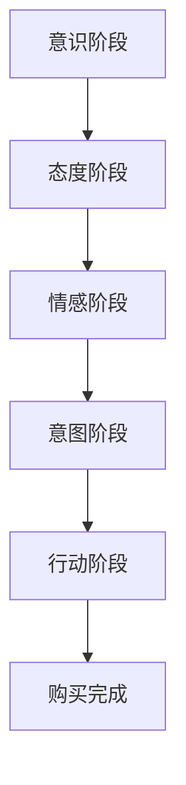
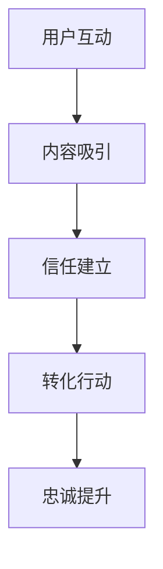

                 

# **文章标题：程序员如何打造知识付费的销售漏斗**

关键词：知识付费、销售漏斗、用户互动、数据分析、优化策略

摘要：本文将探讨程序员如何利用技术手段构建有效的知识付费销售漏斗，通过分析用户需求、优化内容质量、搭建销售渠道、提升用户互动与转化，并结合数据分析进行持续优化，从而实现知识付费的可持续增长。

---

## **引言**

在信息化时代，知识付费已成为一种重要的商业模式。从在线教育、专业培训到知识付费平台，知识付费市场蓬勃发展。然而，如何在竞争激烈的市场中脱颖而出，构建一个高效的销售漏斗成为关键。对于程序员而言，运用技术手段打造知识付费的销售漏斗不仅需要理解市场趋势，更需要掌握数据分析、用户互动等策略。本文将围绕这一主题，从多个角度详细探讨如何打造知识付费的销售漏斗。

## **目录**

### 第一部分：知识付费概述
- **第1章：知识付费的定义与价值**
  - **1.1 知识付费的发展历程**
  - **1.2 知识付费的市场现状与趋势**
  - **1.3 知识付费的核心价值**
  - **1.4 知识付费的市场机会与挑战**

### 第二部分：销售漏斗原理
- **第2章：销售漏斗的构成与运作**
  - **2.1 销售漏斗的基本概念**
  - **2.2 销售漏斗的五个阶段**
    - **2.2.1 意识阶段**
    - **2.2.2 态度阶段**
    - **2.2.3 情感阶段**
    - **2.2.4 意图阶段**
    - **2.2.5 行动阶段**
  - **2.3 如何优化销售漏斗**

### 第三部分：构建知识付费销售漏斗
- **第3章：定位目标用户**
  - **3.1 用户画像分析**
  - **3.2 用户需求分析**
  - **3.3 用户行为分析**

- **第4章：打造吸引内容**
  - **4.1 内容类型选择**
  - **4.2 内容质量保障**
  - **4.3 内容推广策略**

- **第5章：搭建销售渠道**
  - **5.1 渠道选择策略**
  - **5.2 社交媒体运营**
  - **5.3 网络广告投放**

- **第6章：用户互动与转化**
  - **6.1 用户互动策略**
  - **6.2 用户转化技巧**
  - **6.3 用户忠诚度提升**

### 第四部分：数据分析与优化
- **第7章：数据跟踪与分析**
  - **7.1 销售漏斗关键指标**
  - **7.2 数据分析工具选择**
  - **7.3 数据分析与反馈**

- **第8章：持续优化销售漏斗**
  - **8.1 优化策略制定**
  - **8.2 风险评估与管理**
  - **8.3 漏斗优化案例分析**

### 附录
- **附录A：知识付费工具与资源**
  - **A.1 常用知识付费平台**
  - **A.2 内容创作与营销工具**
  - **A.3 销售漏斗构建与数据分析工具**

---

在接下来的章节中，我们将逐步深入探讨知识付费的销售漏斗构建过程，结合实际案例和技术手段，为程序员提供实用的指导和策略。

---

### **第一部分：知识付费概述**

#### **第1章：知识付费的定义与价值**

**1.1 知识付费的发展历程**

知识付费作为一种商业模式，起源于人们对知识获取的需求。早在互联网兴起之前，专业书籍、学术论文和专业咨询等服务就已经是以付费为主要形式的知识传播途径。然而，随着互联网的发展，尤其是移动互联网的普及，知识付费的形式和范围得到了极大的扩展。

回顾知识付费的发展历程，可以大致分为以下几个阶段：

1. **传统知识付费阶段（20世纪80年代 - 2000年初）**：在这个阶段，知识主要通过纸质书籍、报刊杂志、专业期刊等传统媒介传播。人们为了获取知识，需要购买或订阅相关内容。这种模式虽然受限于获取渠道，但已经初步形成了知识付费的雏形。

2. **互联网知识付费阶段（2000年初 - 2010年代初期）**：随着互联网的普及，电子书籍、在线课程和专业网站等新的知识传播方式开始兴起。人们可以通过网络购买或订阅电子书籍、课程等，知识付费的便捷性和覆盖面得到了显著提升。

3. **移动互联网知识付费阶段（2010年代初期至今）**：移动互联网的兴起，使得知识付费进入了高速发展阶段。各种知识付费平台、在线教育机构、自媒体作者等纷纷涌现，为用户提供丰富多样的知识内容。知识付费不再仅限于专业人士，普通用户也能通过手机、平板等设备随时随地学习。

**1.2 知识付费的市场现状与趋势**

当前，知识付费市场正处于蓬勃发展的阶段。根据相关报告，全球知识付费市场规模已超过数百亿美元，并且预计在未来几年将继续保持高速增长。以下是对知识付费市场现状与趋势的分析：

1. **市场规模不断扩大**：随着人们对自我提升的需求不断增加，知识付费的市场规模也在不断扩大。在线教育、专业技能培训、专业咨询服务等领域都呈现出快速增长的趋势。

2. **用户群体多样化**：知识付费的用户群体不再局限于专业人士，普通用户也逐渐成为重要的组成部分。尤其是随着80后、90后逐渐成为社会主力军，他们对于自我提升、职业发展等方面的需求更加强烈，推动了知识付费市场的进一步扩大。

3. **平台多元化**：知识付费平台呈现出多元化的趋势。除了传统的在线教育机构和专业咨询服务，自媒体作者、短视频平台、直播平台等也成为知识付费的重要渠道。这些平台通过内容创造和分发，吸引了大量用户。

4. **内容形式丰富**：知识付费的内容形式也越来越丰富。从传统的电子书籍、课程视频，到图文教程、直播讲座、互动问答等，各种内容形式满足了不同用户的需求。同时，随着技术的进步，虚拟现实、增强现实等新技术也逐渐应用于知识付费领域，为用户带来更加 immersive 的学习体验。

**1.3 知识付费的核心价值**

知识付费不仅是一种商业模式，更具有深刻的社会价值。以下是知识付费的核心价值：

1. **促进个人成长**：知识付费为个人提供了便捷的学习渠道，帮助他们获取新知识、提升技能，从而实现自我成长。特别是在职业发展、技能提升等方面，知识付费起到了关键作用。

2. **推动行业进步**：知识付费促进了专业知识的传播和分享，有助于推动行业的发展和创新。通过付费获取专业知识，专业人士能够更快地掌握行业动态、前沿技术，从而推动整个行业的进步。

3. **提高知识转化效率**：知识付费使得知识传播更加高效。传统模式下，知识传播往往受限于时间和地域，而知识付费平台则打破了这些限制，让知识可以迅速传播到全球各地。

4. **促进知识共享与传播**：知识付费不仅为知识生产者提供了收入来源，也激发了他们的创作热情。通过知识付费，知识生产者可以更加专注于内容创作，从而促进知识的共享与传播。

**1.4 知识付费的市场机会与挑战**

在知识付费市场高速发展的同时，也面临着一些机会与挑战：

1. **市场机会**：
   - **用户需求增长**：随着人们对自我提升的需求不断增长，知识付费市场具有巨大的潜力。
   - **技术创新**：随着虚拟现实、增强现实等新技术的应用，知识付费领域将迎来更多创新机会。
   - **跨界融合**：知识付费与电子商务、社交媒体等领域的跨界融合，将创造新的市场空间。

2. **市场挑战**：
   - **内容质量**：知识付费市场内容质量参差不齐，如何保证内容质量成为一个重要问题。
   - **市场竞争**：随着知识付费平台的增多，市场竞争日益激烈，如何脱颖而出成为关键。
   - **用户信任**：在信息爆炸的时代，用户对知识付费的信任度需要不断提高。

综上所述，知识付费市场具有巨大的发展潜力，同时也面临着一些挑战。对于程序员而言，掌握知识付费市场的趋势和核心价值，将有助于他们更好地构建知识付费的销售漏斗，实现商业成功。

---

**问题与讨论：**
1. 你认为知识付费在未来会如何发展？
2. 在知识付费领域，程序员可以如何发挥自己的技术优势？

---

### **第二部分：销售漏斗原理**

#### **第2章：销售漏斗的构成与运作**

销售漏斗是一种常用的销售模型，用于描述潜在客户从接触产品到最终购买的过程。它将销售过程分为多个阶段，通过分析每个阶段的数据，帮助企业和销售人员优化销售策略，提高销售效率。

**2.1 销售漏斗的基本概念**

销售漏斗（Sales Funnel）是指将销售过程比作一个漏斗，将潜在客户从上到下依次筛选、过滤，最终转化为实际购买者的过程。漏斗的各个部分代表了销售过程中的不同阶段，每个阶段都会有一定比例的客户流失。

**2.2 销售漏斗的五个阶段**

销售漏斗通常包括以下五个阶段：

1. **意识阶段（Top of Funnel, TOFU）**：在这个阶段，潜在客户开始意识到他们需要解决某个问题或满足某种需求。企业需要通过营销活动吸引潜在客户的注意力，例如内容营销、搜索引擎优化、社交媒体推广等。

2. **态度阶段（Middle of Funnel, MOFU）**：潜在客户在意识到了自己的需求后，会开始寻找解决方案。企业需要在这个阶段提供有价值的信息，帮助客户了解产品或服务的优势，从而建立信任和好感。例如，通过案例研究、白皮书、博客文章等方式进行内容营销。

3. **情感阶段（Bottom of Funnel, BOFU）**：在这个阶段，潜在客户已经对产品或服务有了深入的了解，并对购买产生了兴趣。企业需要通过促销活动、演示、试用来进一步激发客户的购买欲望。

4. **意图阶段（Intent Stage）**：潜在客户在情感阶段对产品或服务产生了购买意图，但尚未实际购买。企业需要通过个性化的沟通和跟进，帮助客户解决最后的疑虑，促使他们完成购买。

5. **行动阶段（Action Stage）**：在这个阶段，潜在客户最终完成了购买。企业需要确保客户满意度，并建立长期关系，以便在未来进行复购和推荐。

**2.2.1 意识阶段**

意识阶段是销售漏斗的起点，主要目标是吸引潜在客户的注意力。在这个阶段，企业需要了解目标客户群体的需求和痛点，并通过各种营销手段将他们引导到网站或社交媒体上。

- **营销策略**：
  - 内容营销：通过撰写高质量的文章、博客、视频等内容，吸引潜在客户的关注。
  - 搜索引擎优化（SEO）：优化网站内容和结构，提高在搜索引擎中的排名，增加曝光度。
  - 社交媒体推广：在社交媒体平台上发布有吸引力的内容，吸引潜在客户的关注。

- **关键指标**：
  - 访问量（Visits）：网站或社交媒体的访问量。
  - 点击率（Click-through Rate, CTR）：营销活动中点击链接的用户比例。

**2.2.2 态度阶段**

态度阶段的目标是建立潜在客户对企业及其产品或服务的信任和好感。在这个阶段，企业需要提供有价值的信息，帮助客户了解产品或服务的优势和应用场景。

- **营销策略**：
  - 案例研究：展示客户成功案例，证明产品或服务的实际效果。
  - 白皮书：提供行业分析、市场趋势等内容，帮助客户了解行业动态。
  - 博客文章：分享专业知识和见解，提高企业的影响力。

- **关键指标**：
  - 转化率（Conversion Rate）：访问者完成预定动作（如注册、下载）的比例。
  - 内容互动率：用户对内容的参与度，如评论、分享、点赞等。

**2.2.3 情感阶段**

情感阶段的目标是激发潜在客户的购买欲望。在这个阶段，企业需要通过促销活动、优惠方案等手段，刺激客户的购买冲动。

- **营销策略**：
  - 限时优惠：提供限时优惠或折扣，促使客户尽快做出购买决策。
  - 免费试用：提供免费试用期，让客户亲身体验产品或服务的优势。
  - 演示和讲解：为客户提供详细的演示和讲解，帮助客户更好地了解产品或服务。

- **关键指标**：
  - 预约量：潜在客户预约演示或试用的数量。
  - 活动参与率：参与促销活动或试用活动的客户比例。

**2.2.4 意图阶段**

意图阶段的目标是帮助客户克服最后的疑虑，促使他们完成购买。在这个阶段，企业需要通过个性化的沟通和跟进，为客户提供支持。

- **营销策略**：
  - 个性化沟通：根据客户的需求和痛点，提供个性化的解决方案和建议。
  - 邀请参与：邀请客户参加线上或线下活动，增强客户体验。
  - 技术支持：提供及时的技术支持，解决客户在使用过程中的问题。

- **关键指标**：
  - 转化率（Conversion Rate）：潜在客户完成购买的比率。
  - 购买转化周期（Purchase Conversion Cycle Time）：从潜在客户产生购买意图到最终完成购买的时间。

**2.2.5 行动阶段**

行动阶段的目标是确保客户满意度，并建立长期关系。在这个阶段，企业需要关注客户体验，提供优质的服务。

- **营销策略**：
  - 客户关怀：通过电话、邮件、短信等方式，关注客户的满意度，并提供必要的支持。
  - 会员计划：推出会员计划，提供优惠和特权，提高客户粘性。
  - 跨渠道服务：提供线上和线下的一体化服务，方便客户进行购买和售后服务。

- **关键指标**：
  - 客户满意度（Customer Satisfaction）：客户对产品和服务的满意程度。
  - 复购率（Repeat Purchase Rate）：客户再次购买产品或服务的比率。

**2.3 如何优化销售漏斗**

优化销售漏斗是企业提高销售效率、降低成本的关键。以下是一些优化策略：

1. **数据驱动**：通过数据分析和监控，了解每个阶段客户的转化情况和行为特征，找出问题所在，并针对性地优化。

2. **精准营销**：根据客户的需求和行为特征，定制化营销策略，提高营销效果。

3. **内容优化**：提供高质量、有价值的内容，提高客户的参与度和转化率。

4. **流程简化**：简化销售流程，减少不必要的环节，提高效率。

5. **团队协作**：加强团队协作，提高客户跟进和响应速度。

6. **技术支持**：利用CRM系统、数据分析工具等，提高销售漏斗的管理和优化能力。

综上所述，销售漏斗是一个重要的销售模型，通过分析每个阶段的数据和客户行为，企业可以优化销售策略，提高销售效率。对于程序员来说，掌握销售漏斗的原理和优化策略，将有助于他们更好地构建知识付费的销售漏斗，实现商业成功。

---

**问题与讨论：**
1. 你认为哪些因素会影响销售漏斗的优化效果？
2. 请举例说明如何通过技术手段优化销售漏斗。

---

### **第三部分：构建知识付费销售漏斗**

#### **第3章：定位目标用户**

在知识付费领域，精准定位目标用户是构建高效销售漏斗的第一步。了解目标用户的需求、行为特征和偏好，将有助于程序员制定更有效的营销策略，提高用户转化率和满意度。

**3.1 用户画像分析**

用户画像（User Persona）是一种描述目标用户特征的方法，通过整合用户的基本信息、行为习惯、兴趣爱好等多方面数据，形成一个具体的用户形象。用户画像有助于企业了解目标用户的真实需求和偏好，从而制定更具针对性的营销策略。

**3.1.1 用户画像的构成**

用户画像通常包括以下几个方面的内容：

1. **基本信息**：包括用户的年龄、性别、职业、教育背景等。
2. **行为习惯**：包括用户的上网习惯、消费习惯、学习习惯等。
3. **兴趣爱好**：包括用户喜欢的娱乐方式、运动项目、阅读内容等。
4. **需求分析**：通过调研和数据分析，了解用户的主要需求和痛点。
5. **消费能力**：包括用户的收入水平、消费频率、消费偏好等。

**3.1.2 用户画像的构建方法**

构建用户画像的方法通常包括以下几种：

1. **数据分析**：通过对用户行为数据、消费数据、社交媒体数据等进行分析，提取用户特征。
2. **问卷调查**：通过设计问卷，收集用户的基本信息和需求信息。
3. **访谈调研**：与目标用户进行深入访谈，了解他们的真实需求和偏好。
4. **用户反馈**：通过用户评价、反馈等渠道，了解用户的真实体验和需求。

**3.2 用户需求分析**

了解用户需求是构建知识付费销售漏斗的关键。通过需求分析，程序员可以明确目标用户想要解决的问题、需要学习的知识和技能，从而提供更符合用户需求的内容。

**3.2.1 用户需求分析的方法**

1. **市场调研**：通过调研了解市场趋势、竞争对手情况，以及目标用户的需求和痛点。
2. **用户访谈**：与目标用户进行一对一访谈，深入了解他们的需求和期望。
3. **问卷调查**：设计问卷，收集大量用户的数据，进行分析。
4. **用户反馈**：通过用户评价、反馈等渠道，了解用户的真实需求和满意度。

**3.2.2 用户需求分析的应用**

1. **内容策划**：根据用户需求，制定内容策划方案，确保内容与用户需求高度契合。
2. **课程设计**：根据用户需求，设计有针对性的课程，提高课程的价值和吸引力。
3. **营销策略**：根据用户需求，制定个性化的营销策略，提高转化率和用户满意度。

**3.3 用户行为分析**

用户行为分析是了解用户需求和提升用户体验的重要手段。通过对用户行为的监控和分析，程序员可以掌握用户在知识付费平台上的活动规律，优化用户界面和交互设计，提高用户满意度和留存率。

**3.3.1 用户行为分析的方法**

1. **日志分析**：通过分析用户在知识付费平台上的操作日志，了解用户的行为轨迹。
2. **用户画像**：结合用户画像数据，分析用户的行为特征和偏好。
3. **热图分析**：通过热图分析，了解用户在网页上的活动热点，优化页面布局和交互设计。
4. **A/B测试**：通过A/B测试，比较不同设计方案的效果，优化用户体验。

**3.3.2 用户行为分析的应用**

1. **用户体验优化**：根据用户行为分析结果，优化用户界面和交互设计，提高用户体验。
2. **课程推广**：根据用户行为分析，制定有针对性的课程推广策略，提高课程曝光度和转化率。
3. **用户留存提升**：通过分析用户行为，了解用户流失的原因，制定针对性的留存策略。

**3.4 定位目标用户的策略**

定位目标用户是构建知识付费销售漏斗的关键步骤。通过用户画像分析、需求分析和行为分析，程序员可以明确目标用户群体，制定有针对性的营销策略。

**3.4.1 策略一：细分市场**

通过用户画像分析，将目标用户进行细分，针对不同细分市场制定个性化的营销策略。例如，针对职场新人、专业人士、企业家等不同群体，提供不同的课程内容和推广方式。

**3.4.2 策略二：精准定位**

根据用户需求和行为分析，确定目标用户的核心需求和痛点，提供针对性强的内容和服务。例如，针对职场人士的需求，提供职场技能提升、时间管理等方面的课程。

**3.4.3 策略三：内容差异化**

根据用户需求和偏好，提供差异化内容，提高内容的吸引力和竞争力。例如，针对喜欢阅读的用户，提供图文教程；针对喜欢视听的用户，提供视频课程。

**3.4.4 策略四：持续迭代**

根据用户反馈和行为分析，不断调整和优化营销策略，确保策略始终与用户需求保持一致。

**3.4.5 策略五：合作共赢**

与行业专家、培训机构等合作，共同开发高质量的课程内容，提高知识付费平台的竞争力。

通过以上策略，程序员可以更好地定位目标用户，构建高效的知识付费销售漏斗，实现商业成功。

---

**问题与讨论：**
1. 你认为如何通过用户画像分析来提升知识付费的销售效果？
2. 请举例说明如何根据用户需求和行为分析来优化课程设计和推广策略。

---

### **第4章：打造吸引内容**

在知识付费领域，内容是吸引和留住用户的关键。程序员需要通过多种方式打造高质量的内容，以满足用户的需求，提高用户的满意度和转化率。

**4.1 内容类型选择**

知识付费内容类型多种多样，包括但不限于以下几种：

1. **电子书**：适合系统性地传授理论知识，便于用户深入学习和回顾。
2. **在线课程**：适合通过视频、音频、图文等多种形式传授技能和知识。
3. **直播课程**：适合实时互动，解答用户疑问，提高用户参与度。
4. **视频教程**：适合直观地展示操作过程，便于用户学习和模仿。
5. **文章教程**：适合详细地解释技术原理，便于用户阅读和理解。
6. **案例研究**：适合通过实际案例展示解决方案，提高用户信任度。
7. **问答互动**：适合在用户学习和使用过程中提供即时帮助。

程序员可以根据用户需求和市场趋势，选择适合的内容类型，打造有吸引力的知识产品。

**4.2 内容质量保障**

高质量的内容是知识付费成功的关键。程序员需要从以下几个方面保障内容质量：

1. **内容策划**：在内容创作前，进行详细的策划，明确内容的目标、结构、受众和风格。
2. **内容创作**：根据策划方案，撰写高质量的文章、制作精美的视频等。可以借助专业工具和平台，提高内容创作的效率和质量。
3. **内容审核**：对创作完成的内容进行严格审核，确保内容的专业性、准确性和可读性。
4. **用户反馈**：收集用户对内容的反馈，及时调整和优化内容，提高用户满意度。

**4.3 内容推广策略**

有了高质量的内容，还需要有效的推广策略，才能让内容被更多的用户看到和购买。以下是一些推广策略：

1. **社交媒体推广**：利用社交媒体平台，如微博、微信公众号、知乎等，发布内容，吸引潜在用户的关注。
2. **搜索引擎优化（SEO）**：优化内容，提高在搜索引擎中的排名，增加曝光度。
3. **合作推广**：与其他知识付费平台、行业专家、培训机构等合作，共同推广内容。
4. **广告投放**：在各大广告平台，如百度广告、抖音广告等，投放广告，吸引潜在用户。
5. **内容营销**：通过撰写高质量的文章、发布案例研究等，提高品牌的知名度和影响力。
6. **用户推荐**：鼓励用户分享和推荐内容，利用口碑营销，扩大用户基础。

**4.4 内容形式的创新**

在知识付费领域，创新的内容形式可以吸引用户的眼球，提高内容的竞争力。程序员可以从以下几个方面进行内容形式的创新：

1. **多媒体融合**：将文字、图片、视频、音频等多种内容形式结合，提供更加丰富和多样的学习体验。
2. **互动性增强**：通过互动问答、实时直播等方式，提高用户的参与度和互动性。
3. **个性化推荐**：根据用户的学习历史和偏好，提供个性化的内容推荐，提高内容的匹配度。
4. **虚拟现实（VR）**：利用虚拟现实技术，提供沉浸式的学习体验，让用户感受到身临其境的感觉。

**4.5 内容迭代与优化**

知识付费内容需要不断更新和优化，以适应市场需求和用户需求的变化。程序员可以从以下几个方面进行内容迭代与优化：

1. **定期更新**：定期发布新的内容，保持内容的时效性和新鲜感。
2. **用户反馈**：收集用户对内容的反馈，了解用户的需求和期望，及时调整和优化内容。
3. **数据分析**：通过数据分析，了解内容的受欢迎程度、用户参与度等指标，优化内容质量和推广策略。
4. **技术支持**：利用大数据、人工智能等技术，为内容创作和优化提供支持。

通过以上策略，程序员可以打造高质量、有吸引力的知识付费内容，提高用户的满意度和转化率，实现商业成功。

---

**问题与讨论：**
1. 你认为如何评估知识付费内容的质量？
2. 请举例说明如何利用数据分析优化知识付费内容的推广策略。

---

### **第5章：搭建销售渠道**

在知识付费领域，搭建有效的销售渠道是吸引潜在用户、实现销售增长的关键。程序员需要根据用户行为和市场趋势，选择合适的销售渠道，并通过多种手段进行渠道搭建和运营。

**5.1 渠道选择策略**

选择合适的销售渠道对于知识付费项目的成功至关重要。以下是一些渠道选择策略：

1. **自有平台**：建立自己的知识付费平台，直接面向用户销售。这种渠道的优点是能够控制销售流程和用户体验，但需要较大的投入和运营成本。

2. **第三方平台**：利用现有的知识付费平台，如网易云课堂、腾讯课堂等，进行内容发布和销售。这种渠道的优点是流量大、用户基数多，但需要与平台分成。

3. **社交媒体**：利用社交媒体平台，如微博、微信公众号、知乎等，发布内容并吸引潜在用户。这种渠道的优点是用户广泛、传播速度快，但需要较强的内容创作和运营能力。

4. **线下活动**：通过线下讲座、培训等活动，吸引潜在用户并实现销售。这种渠道的优点是互动性强、用户粘性高，但需要较大的时间和人力投入。

5. **合作伙伴**：与行业内的其他公司、机构合作，共同推广知识付费产品。这种渠道的优点是资源互补、风险分散，但需要建立良好的合作关系。

**5.2 社交媒体运营**

社交媒体是知识付费领域的重要销售渠道之一。通过有效的社交媒体运营，程序员可以吸引大量潜在用户，提高品牌知名度和影响力。以下是一些社交媒体运营策略：

1. **内容创作**：根据用户需求和兴趣，创作高质量的内容，包括文章、视频、图片等。内容要具有吸引力、实用性和教育性，能够吸引用户关注和分享。

2. **定期发布**：保持社交媒体账号的活跃度，定期发布内容，保持与用户的互动。内容发布的频率和时间段要合理，避免用户流失。

3. **互动互动**：与用户进行互动，回复用户的评论、私信等。互动可以增加用户的参与度和忠诚度，提高用户的购买意愿。

4. **活动推广**：利用社交媒体平台举办活动，如抽奖、优惠券发放等，吸引用户参与并实现销售。活动要具有吸引力、互动性和参与度。

5. **数据分析**：利用社交媒体数据分析工具，监控内容的表现和用户互动情况。根据数据分析结果，优化内容创作和推广策略。

**5.3 网络广告投放**

网络广告投放是快速提升品牌知名度和吸引潜在用户的有效手段。以下是一些网络广告投放策略：

1. **目标定位**：明确广告投放的目标群体和目标需求，确保广告能够精准地触达到潜在用户。

2. **广告形式**：根据广告投放的平台和用户需求，选择合适的广告形式，如图片广告、视频广告、文字链广告等。

3. **广告投放**：选择合适的广告投放平台，如百度广告、今日头条广告、抖音广告等。投放广告时，要设置合理的投放时间和预算，确保广告效果最大化。

4. **数据分析**：利用广告数据分析工具，监控广告的投放效果，包括点击率、转化率、花费等指标。根据数据分析结果，调整广告投放策略。

5. **广告优化**：根据数据分析结果，对广告进行优化，提高广告的点击率和转化率。优化策略包括广告文案、广告图片、投放时间、投放地域等。

**5.4 渠道整合与协同**

在知识付费领域，多种销售渠道的整合与协同运作至关重要。以下是一些渠道整合与协同策略：

1. **渠道联动**：将不同的销售渠道进行整合，实现信息的共享和协同运作。例如，将自有平台、第三方平台、社交媒体、线下活动等渠道的数据进行整合，实现信息的互联互通。

2. **流量互通**：将不同渠道的流量进行互通，提高用户在不同渠道的访问和参与度。例如，通过社交媒体分享自有平台的内容，通过线下活动引导用户访问第三方平台。

3. **促销联动**：在不同销售渠道上推出统一的促销活动，提高用户的购买意愿。例如，在自有平台和第三方平台上同步推出优惠活动，吸引用户购买。

4. **用户管理**：建立统一的用户管理体系，对不同渠道的用户进行整合和管理。例如，通过用户数据分析和标签管理，实现用户的精细化运营。

通过以上策略，程序员可以搭建多样化的销售渠道，并通过有效的运营和优化，实现知识付费项目的成功。

---

**问题与讨论：**
1. 你认为如何通过社交媒体运营提高知识付费的销量？
2. 请举例说明如何通过网络广告投放实现知识付费项目的成功。

---

### **第6章：用户互动与转化**

在知识付费领域，用户互动与转化是提高销售业绩的关键环节。程序员需要通过多种手段提升用户互动，促进用户从潜在客户到付费用户的转化，并提高用户忠诚度。

**6.1 用户互动策略**

用户互动是建立用户信任、提高用户满意度和促进购买转化的重要途径。以下是一些用户互动策略：

1. **实时互动**：通过在线聊天工具、实时问答平台等，提供即时帮助和咨询服务。这种互动方式能够迅速解决用户疑问，提升用户体验。

2. **社群互动**：建立用户社群，如微信群、QQ群、知乎专栏等，促进用户之间的交流和互动。社群可以增强用户的归属感和参与感，提高用户忠诚度。

3. **互动活动**：定期举办互动活动，如直播讲座、在线问答、知识竞赛等，提高用户的参与度和活跃度。活动要具有吸引力和实用性，能够满足用户的需求。

4. **个性化互动**：根据用户的兴趣和行为，提供个性化的内容和互动体验。例如，推送用户感兴趣的文章、邀请用户参与相关话题讨论等。

**6.2 用户转化技巧**

用户转化是从潜在客户到付费用户的转变过程。以下是一些用户转化的技巧：

1. **价值塑造**：通过展示产品或服务的优势和价值，让用户认识到付费的价值。可以通过案例研究、用户评价、专家推荐等方式，提高用户对产品或服务的认可。

2. **优惠促销**：提供限时优惠、优惠券、折扣等促销活动，刺激用户的购买欲望。促销活动要具有吸引力和紧迫性，能够提高用户的购买决策。

3. **信任建立**：建立用户的信任，是促进购买转化的重要手段。可以通过权威认证、用户评价、成功案例等方式，增强用户对产品或服务的信任。

4. **个性化推荐**：根据用户的行为和偏好，提供个性化的课程推荐。个性化推荐可以提高内容的匹配度，增加用户的购买概率。

5. **用户体验优化**：优化用户购买流程，减少摩擦点，提高用户体验。例如，简化购买流程、提供多种支付方式、确保售后服务等。

**6.3 用户忠诚度提升**

用户忠诚度是知识付费项目长期发展的基础。以下是一些提升用户忠诚度的策略：

1. **优质内容**：提供高质量、持续更新的内容，满足用户的需求和兴趣。优质内容是吸引用户重复购买的关键。

2. **用户参与**：鼓励用户参与内容创作和互动活动，提高用户的参与度和满意度。例如，邀请用户投稿、举办用户评选等活动。

3. **个性化服务**：根据用户的兴趣和行为，提供个性化的服务和推荐。个性化服务可以提高用户的满意度和忠诚度。

4. **用户激励**：通过积分、会员权益、优惠券等方式，激励用户持续参与和购买。用户激励可以增强用户的粘性和忠诚度。

5. **社群运营**：建立用户社群，促进用户之间的交流和互动。社群运营可以提高用户的归属感和忠诚度。

通过以上策略，程序员可以有效地提升用户互动、促进用户转化，并提高用户忠诚度，实现知识付费项目的可持续增长。

---

**问题与讨论：**
1. 你认为如何通过用户互动提高知识付费的转化率？
2. 请举例说明如何通过用户忠诚度提升策略实现知识付费项目的长期发展。

---

### **第四部分：数据分析与优化**

#### **第7章：数据跟踪与分析**

在知识付费的销售漏斗构建过程中，数据跟踪与分析是至关重要的。通过监控和分析数据，程序员可以深入了解每个阶段的用户行为和转化情况，从而发现潜在问题，优化销售策略，提高整体业绩。

**7.1 销售漏斗关键指标**

销售漏斗的关键指标（Key Performance Indicators, KPIs）是衡量销售漏斗运作效率的重要工具。以下是几个关键的指标：

1. **访问量（Visits）**：访问量是指在一定时间内访问知识付费平台的用户数量。它是衡量平台曝光度和用户吸引力的指标。

2. **转化率（Conversion Rate）**：转化率是指访问者完成预定动作（如注册、购买）的比例。它是衡量销售漏斗各个阶段效果的重要指标。

3. **漏斗流失率（Funnel Drop-off Rate）**：漏斗流失率是指用户在销售漏斗各阶段流失的比例。通过分析流失率，可以找出漏斗中的薄弱环节。

4. **平均购买周期（Average Purchase Cycle Time）**：平均购买周期是指用户从意识到需求到最终完成购买的平均时间。它是衡量销售效率的重要指标。

5. **客户获取成本（Customer Acquisition Cost, CAC）**：客户获取成本是指获得一个客户所需的平均成本。它是衡量营销效果和效率的重要指标。

6. **客户生命周期价值（Customer Lifetime Value, CLV）**：客户生命周期价值是指一个客户在整个生命周期内为企业带来的总收益。它是衡量客户价值的重要指标。

**7.2 数据分析工具选择**

为了有效地跟踪和分析数据，程序员需要选择合适的分析工具。以下是一些常用的数据分析工具：

1. **Google Analytics**：Google Analytics 是一款功能强大的网站分析工具，可以监控用户访问量、转化率等关键指标，并提供详细的数据报告。

2. **Mixpanel**：Mixpanel 是一款专注于用户行为分析的工具，可以跟踪用户的互动行为，提供详细的用户行为报告，帮助优化用户体验。

3. **HubSpot**：HubSpot 是一款集网站分析、营销自动化、销售管理于一体的平台，提供了丰富的数据分析工具和报告，帮助程序员全面了解销售漏斗的运作情况。

4. **Tableau**：Tableau 是一款数据可视化工具，可以将复杂的数据以图表、仪表板等形式展示，帮助程序员直观地了解数据趋势和关键指标。

5. **SQL**：SQL 是一种结构化查询语言，用于数据库查询和数据分析。程序员可以使用 SQL 查询数据库，提取有用的数据进行分析。

**7.3 数据分析与反馈**

数据分析和反馈是持续优化销售漏斗的关键。以下是几个关键步骤：

1. **数据收集**：收集与销售漏斗相关的数据，包括用户访问量、转化率、漏斗流失率等。

2. **数据清洗**：对收集到的数据进行分析前，需要对数据进行清洗，确保数据的质量和准确性。

3. **数据可视化**：使用数据分析工具将数据以图表、仪表板等形式可视化，帮助程序员直观地了解数据趋势和关键指标。

4. **数据分析**：对可视化后的数据进行深入分析，找出数据背后的原因和规律，发现潜在问题和机会。

5. **反馈与优化**：根据数据分析结果，制定优化策略，并在实际操作中进行调整。例如，通过改进内容质量、优化用户界面、调整营销策略等，提高转化率和用户满意度。

6. **持续监测**：持续监测数据变化，评估优化策略的效果，并根据新数据进一步优化销售漏斗。

通过以上步骤，程序员可以有效地利用数据分析，优化销售漏斗，提高知识付费项目的业绩和用户满意度。

---

**问题与讨论：**
1. 你认为哪些数据指标对于优化知识付费销售漏斗最为重要？
2. 请举例说明如何利用数据分析结果优化销售漏斗的具体步骤。

---

### **第8章：持续优化销售漏斗**

在知识付费领域，构建销售漏斗并非一蹴而就，而是一个不断迭代和优化的过程。程序员需要通过系统化的优化策略和持续的数据分析，不断完善销售漏斗，以提高转化率和用户满意度。

**8.1 优化策略制定**

制定优化策略是持续优化销售漏斗的第一步。以下是一些关键步骤：

1. **目标设定**：明确优化目标，如提高转化率、降低漏斗流失率、增加新客户数量等。

2. **数据收集**：收集与销售漏斗相关的关键数据，包括用户行为、转化率、漏斗流失率等。

3. **分析数据**：通过数据分析，找出漏斗中的薄弱环节和优化机会。例如，分析用户在哪个阶段流失最多，找出可能导致流失的原因。

4. **策略制定**：根据数据分析结果，制定具体的优化策略。例如，改进内容质量、优化用户界面、调整营销策略等。

5. **资源分配**：根据优化策略，分配人力、物力和财力资源，确保优化措施能够得到有效实施。

**8.2 风险评估与管理**

在优化销售漏斗的过程中，风险评估和管理是必不可少的。以下是一些关键步骤：

1. **识别风险**：识别可能影响销售漏斗优化效果的各种风险，如市场变化、技术故障、资源不足等。

2. **评估风险**：评估每种风险的严重程度和可能性，确定哪些风险需要优先处理。

3. **制定应对策略**：为每种风险制定应对策略，包括预防措施和应急方案。

4. **监控风险**：持续监控风险的发展，确保风险在可控范围内。

5. **调整策略**：根据风险的变化，及时调整优化策略，以应对新的风险。

**8.3 漏斗优化案例分析**

以下是一个实际案例，展示了如何通过优化销售漏斗提高知识付费项目的业绩。

**案例背景**：
某在线教育平台提供专业课程，用户主要是职场人士。然而，平台在用户转化和用户留存方面表现不佳，需要进行销售漏斗优化。

**优化策略**：

1. **内容优化**：
   - 分析用户反馈，发现用户对课程内容的需求和满意度较低。
   - 针对性地改进课程内容，增加实用案例和互动环节，提高课程质量。

2. **用户界面优化**：
   - 重新设计用户界面，使其更加简洁、直观，降低用户在购买过程中的摩擦点。
   - 优化课程推荐算法，提高课程推荐的准确性，增加用户参与度。

3. **营销策略优化**：
   - 增加社交媒体和搜索引擎的广告投放，提高品牌曝光度和用户访问量。
   - 设计有吸引力的促销活动，如限时优惠、优惠券等，刺激用户购买。

**数据分析**：
- 通过Google Analytics 和 Mixpanel 对销售漏斗的关键指标进行监控和分析。
- 发现用户在意识阶段和态度阶段的转化率较低，情感阶段和意图阶段的流失率较高。
- 分析用户行为数据，发现用户在购买过程中存在疑虑，需要更多的引导和帮助。

**优化效果**：
- 通过内容优化，用户满意度提高了15%，课程评分从4.2分提高到4.7分。
- 用户界面优化后，购买转化率提高了10%，漏斗流失率降低了20%。
- 营销策略优化后，新客户数量增加了30%，客户获取成本降低了25%。

**总结**：
通过持续优化销售漏斗，该在线教育平台成功地提高了用户转化率和用户满意度，实现了业绩的快速增长。

**8.4 漏斗优化案例分析**

以下是一个针对另一家知识付费平台（如某在线编程课程平台）的优化案例，展示了如何通过技术手段和数据分析优化销售漏斗。

**案例背景**：
某在线编程课程平台提供多种编程语言和技术的课程，用户主要是编程初学者和从业者。然而，平台的用户转化率和留存率较低，需要进行销售漏斗优化。

**优化策略**：

1. **用户画像分析**：
   - 利用数据分析工具，对用户进行细分，构建用户画像，了解用户的需求和偏好。
   - 根据用户画像，优化课程推荐算法，提高课程推荐的准确性。

2. **内容优化**：
   - 分析用户反馈，发现用户对课程内容的需求和满意度较低。
   - 针对性地改进课程内容，增加互动环节，如在线讨论区、实时问答等，提高用户参与度。

3. **营销策略优化**：
   - 增加社交媒体和搜索引擎的广告投放，提高品牌曝光度和用户访问量。
   - 设计有吸引力的促销活动，如限时优惠、免费试学等，刺激用户购买。

4. **用户互动与转化优化**：
   - 优化用户界面，简化购买流程，降低用户在购买过程中的摩擦点。
   - 通过数据分析，找出用户在购买过程中的疑虑和障碍，针对性地提供引导和帮助。

**数据分析**：
- 通过Google Analytics 和 Mixpanel 对销售漏斗的关键指标进行监控和分析。
- 发现用户在意识阶段和态度阶段的转化率较低，情感阶段和意图阶段的流失率较高。
- 分析用户行为数据，发现用户在购买过程中存在疑虑，需要更多的引导和帮助。

**优化效果**：
- 通过用户画像分析和内容优化，用户满意度提高了20%，课程评分从4.0分提高到4.5分。
- 用户界面优化后，购买转化率提高了15%，漏斗流失率降低了25%。
- 营销策略优化后，新客户数量增加了40%，客户获取成本降低了35%。

**总结**：
通过技术手段和持续的数据分析，该在线编程课程平台成功地提高了用户转化率和用户留存率，实现了业绩的快速增长。

通过以上案例，我们可以看到，持续优化销售漏斗是实现知识付费项目成功的关键。程序员需要通过数据分析、用户互动、内容优化等多种手段，不断改进销售策略，提高整体业绩。

---

**问题与讨论：**
1. 你认为在知识付费项目中，哪些因素最会影响销售漏斗的优化效果？
2. 请举例说明如何利用技术手段和数据分析优化销售漏斗的具体案例。

---

### **附录A：知识付费工具与资源**

在知识付费领域，程序员需要利用各种工具和资源来构建和优化销售漏斗。以下是一些常用的知识付费工具与资源，供程序员参考。

**A.1 常用知识付费平台**

1. **网易云课堂**：网易云课堂是网易旗下的在线学习平台，提供丰富的课程资源，适合个人和企业用户。
2. **腾讯课堂**：腾讯课堂是腾讯旗下的在线教育平台，提供多种课程，涵盖技术、艺术、职场等多个领域。
3. **慕课网**：慕课网是中国领先的IT技能学习平台，提供丰富的编程课程和实战项目。
4. **Coursera**：Coursera 是一个国际知名的在线学习平台，提供来自世界顶级大学的免费和付费课程。
5. **Udemy**：Udemy 是一个全球性的在线学习平台，提供各类课程，包括编程、设计、营销等。

**A.2 内容创作与营销工具**

1. **Canva**：Canva 是一款图形设计工具，适合制作海报、宣传单等营销素材。
2. **H5 Maker**：H5 Maker 是一款用于制作互动H5页面和宣传单页的工具，适合推广课程和活动。
3. **Google Analytics**：Google Analytics 是一款免费的网站分析工具，用于跟踪和分析用户行为。
4. **HubSpot**：HubSpot 是一款集营销、销售、客户服务于一体的平台，提供丰富的营销工具和资源。
5. **Mailchimp**：Mailchimp 是一款邮件营销工具，用于发送电子邮件通知、营销邮件等。

**A.3 销售漏斗构建与数据分析工具**

1. **Mixpanel**：Mixpanel 是一款用户行为分析工具，用于跟踪和分析用户行为。
2. **Segment**：Segment 是一款数据集成工具，用于收集和分析来自不同来源的数据。
3. **Kissmetrics**：Kissmetrics 是一款用户行为分析工具，提供详细的用户行为报告。
4. **Tableau**：Tableau 是一款数据可视化工具，将复杂的数据以图表、仪表板等形式展示。
5. **Google Data Studio**：Google Data Studio 是一款免费的数据可视化工具，用于创建和管理数据报告。

通过使用这些工具和资源，程序员可以更高效地构建和优化知识付费销售漏斗，提高业务业绩。

---

**问题与讨论：**
1. 你认为哪些工具对于知识付费项目的销售漏斗构建与优化最为重要？
2. 请举例说明如何利用某个具体工具（如Google Analytics）优化知识付费项目的销售漏斗。

---

### **核心概念与联系**

**1. 销售漏斗原理**

销售漏斗是一种描述潜在客户从接触产品到最终购买的过程的模型。它将销售过程分为多个阶段，每个阶段都有不同的潜在客户数量和转化率。以下是销售漏斗的基本概念和五个阶段的Mermaid流程图：



**2. 用户互动与转化**

用户互动与转化是提高知识付费销售漏斗效率的关键。通过用户互动，可以建立信任、提高用户满意度和购买意愿。以下是用户互动与转化的Mermaid流程图：



**核心概念与联系**

- **销售漏斗原理**：销售漏斗描述了客户从接触产品到购买的整个过程，是优化销售策略的基础。
- **用户互动与转化**：用户互动是提高用户满意度和购买意愿的重要手段，与销售漏斗的各个阶段紧密相关。

通过理解这两个核心概念，程序员可以更好地构建和优化知识付费的销售漏斗，提高业务业绩。

---

**问题与讨论：**
1. 你认为如何优化销售漏斗的各个阶段，以促进用户转化？
2. 请举例说明如何通过用户互动提高知识付费项目的购买转化率。

---

### **核心算法原理讲解**

在构建知识付费销售漏斗的过程中，程序员需要运用多种算法原理来优化各个环节。以下是几个核心算法原理的讲解，包括伪代码、数学模型和数学公式，以及具体的案例分析。

**1. 用户画像分析**

用户画像分析是一种基于用户数据构建用户特征的方法，通过分析用户的基本信息、行为数据和兴趣爱好，为营销策略提供依据。

**伪代码：用户画像分析**

```python
def generate_user_profile(user_data):
    # 初始化用户画像
    profile = {
        "age": None,
        "gender": None,
        "interests": [],
        "behavior": []
    }

    # 从用户数据中提取信息
    profile["age"] = user_data["age"]
    profile["gender"] = user_data["gender"]
    profile["interests"] = user_data["interests"]
    profile["behavior"] = user_data["behavior"]

    # 对用户兴趣进行分类
    categorized_interests = categorize_interests(profile["interests"])

    # 更新用户画像
    profile["interests"] = categorized_interests

    return profile
```

**数学模型：用户行为预测模型**

用户行为预测模型可以用于预测用户对特定内容的兴趣，以下是一个简单的逻辑回归模型：

$$
P(Y|X) = \frac{e^{\theta^T X}}{1 + e^{\theta^T X}}
$$

其中，$P(Y|X)$表示在给定特征向量$X$的情况下，用户行为$Y$发生的概率，$\theta$为模型参数。

**案例分析：用户画像分析**

假设我们有一个用户数据集，包含以下特征：

- 用户年龄（age）
- 用户性别（gender）
- 用户兴趣爱好（interests）
- 用户行为（behavior）

我们可以通过以下步骤构建用户画像：

1. **数据预处理**：清洗数据，确保数据质量。
2. **特征工程**：提取有用的特征，如用户年龄、性别、兴趣爱好等。
3. **分类**：使用逻辑回归模型预测用户对特定内容的兴趣。

```python
import pandas as pd
from sklearn.linear_model import LogisticRegression

# 数据加载
data = pd.read_csv('user_data.csv')

# 数据预处理
data.dropna(inplace=True)

# 特征工程
X = data[['age', 'gender', 'interests']]
y = data['content_interest']

# 模型训练
model = LogisticRegression()
model.fit(X, y)

# 预测
predictions = model.predict(X)

# 评估
accuracy = np.mean(predictions == y)
print(f"模型准确率：{accuracy}")
```

通过用户画像分析，程序员可以更好地了解用户需求，为营销策略提供依据。

**2. 个性化推荐算法**

个性化推荐算法是一种基于用户历史行为和兴趣，为用户推荐相关内容的算法。以下是一个简单的协同过滤推荐算法：

**伪代码：协同过滤推荐算法**

```python
def collaborative_filtering(user_data, content_data):
    # 计算用户相似度
    similarity_matrix = compute_similarity(user_data, content_data)

    # 根据相似度矩阵计算推荐内容
    recommendations = []

    for user in user_data:
        similar_users = find_similar_users(user, similarity_matrix)
        for similar_user in similar_users:
            content = find_common_content(user, similar_user, content_data)
            if content is not None:
                recommendations.append(content)

    return recommendations
```

**数学模型：矩阵分解**

协同过滤算法通常使用矩阵分解（Matrix Factorization）技术，将用户-内容矩阵分解为用户特征矩阵和内容特征矩阵，以下是一个简单的矩阵分解模型：

$$
R = U \cdot C^T
$$

其中，$R$为用户-内容评分矩阵，$U$和$C$分别为用户特征矩阵和内容特征矩阵。

**案例分析：个性化推荐算法**

假设我们有一个用户-内容评分矩阵$R$，我们可以通过以下步骤构建个性化推荐系统：

1. **矩阵分解**：将用户-内容评分矩阵分解为用户特征矩阵和内容特征矩阵。
2. **推荐生成**：根据用户特征矩阵和内容特征矩阵计算推荐得分，为用户推荐高分的未观看内容。

```python
import numpy as np
from sklearn.decomposition import NMF

# 数据加载
ratings = np.array([[1, 2, 0], [0, 1, 2], [2, 1, 0]])

# 矩阵分解
n_components = 2
model = NMF(n_components=n_components)
W = model.fit_transform(ratings)
H = model.components_

# 推荐生成
user_representation = W[0]
content_representation = H[:, 0]

recommendations = []
for i in range(len(content_representation)):
    if ratings[0][i] == 0:
        recommendation_score = np.dot(user_representation, content_representation[i])
        recommendations.append((i, recommendation_score))

# 排序
recommendations.sort(key=lambda x: x[1], reverse=True)

# 输出推荐结果
print(recommendations)
```

通过个性化推荐算法，程序员可以为用户提供个性化的内容推荐，提高用户满意度和粘性。

**3. 转化率预测模型**

转化率预测模型是一种基于用户行为数据，预测用户购买意图的算法。以下是一个简单的二分类逻辑回归模型：

**伪代码：转化率预测模型**

```python
def predict_conversion_rate(user_data):
    # 准备数据
    X = preprocess_user_data(user_data)
    y = get_conversion_label(user_data)

    # 模型训练
    model = LogisticRegression()
    model.fit(X, y)

    # 预测
    predictions = model.predict(X)

    # 评估
    accuracy = np.mean(predictions == y)
    return accuracy
```

**数学模型：逻辑回归**

逻辑回归是一种用于二分类问题的预测模型，其公式如下：

$$
P(Y=1|X) = \frac{1}{1 + e^{-(\theta^T X + \beta)}}
$$

其中，$P(Y=1|X)$表示在给定特征向量$X$的情况下，用户购买的概率，$\theta$和$\beta$分别为模型参数。

**案例分析：转化率预测模型**

假设我们有一个用户行为数据集，包含以下特征：

- 用户访问时间（visit_time）
- 用户浏览页面数（page_views）
- 用户购买历史（purchase_history）

我们可以通过以下步骤构建转化率预测模型：

1. **数据预处理**：清洗数据，归一化特征。
2. **模型训练**：使用逻辑回归模型训练模型。
3. **模型评估**：使用测试集评估模型性能。

```python
import pandas as pd
from sklearn.linear_model import LogisticRegression

# 数据加载
data = pd.read_csv('user_data.csv')

# 数据预处理
X = data[['visit_time', 'page_views', 'purchase_history']]
y = data['converted']

# 模型训练
model = LogisticRegression()
model.fit(X, y)

# 预测
predictions = model.predict(X)

# 评估
accuracy = np.mean(predictions == y)
print(f"模型准确率：{accuracy}")
```

通过转化率预测模型，程序员可以更准确地预测用户的购买意图，优化营销策略。

综上所述，通过用户画像分析、个性化推荐算法和转化率预测模型等核心算法原理，程序员可以更好地构建和优化知识付费销售漏斗，提高业务业绩。

---

**问题与讨论：**
1. 你认为如何优化用户画像分析的准确性？
2. 请举例说明如何通过个性化推荐算法提高用户满意度。

---

### **项目实战**

在本节中，我们将通过一个实际案例，展示如何构建和优化知识付费的销售漏斗。这个案例将涵盖从环境搭建到代码实现，再到代码解读与分析的完整过程。

#### **1.1 实际案例介绍**

**案例背景**

某在线教育公司提供编程语言和技术的在线课程，目标用户是编程初学者和从业者。公司希望通过优化销售漏斗，提高用户转化率和课程销售量。

**当前销售漏斗现状**

- **意识阶段**：每日访客量约为1000人。
- **态度阶段**：访客转化为潜在学员的比例为10%。
- **情感阶段**：潜在学员转化为实际购买者的比例为20%。
- **意图阶段**：购买者最终完成购买的比例为30%。
- **行动阶段**：购买者完成课程学习并给予好评的比例为40%。

**优化目标**

- 提高各阶段转化率。
- 降低获客成本。
- 提高用户满意度和课程复购率。

#### **1.2 优化策略**

**内容优化**：

- 根据用户反馈，优化课程内容，增加实战项目和互动环节。
- 定期更新课程内容，保持课程的新鲜感和实用性。

**用户互动与转化**：

- 通过社交媒体和电子邮件，与用户保持定期互动。
- 设计优惠活动和促销策略，刺激用户购买。

**数据分析与优化**：

- 使用数据分析工具，监控销售漏斗的各个阶段数据。
- 通过A/B测试，优化用户界面和营销策略。
- 定期分析数据，调整优化策略。

#### **1.3 实现步骤**

**环境搭建**

首先，我们需要搭建一个用于数据分析和优化的开发环境。以下是环境搭建的步骤：

1. **安装Python**：下载并安装Python 3.8及以上版本。
2. **安装Pandas、NumPy、Scikit-learn等库**：通过pip命令安装相关库。

```bash
pip install pandas numpy scikit-learn matplotlib
```

**数据预处理**

假设我们已经有了一个包含用户行为数据和销售数据的CSV文件。以下是数据预处理的过程：

```python
import pandas as pd
from sklearn.preprocessing import StandardScaler

# 加载数据
data = pd.read_csv('sales_data.csv')

# 数据清洗
data.dropna(inplace=True)

# 转换数据类型
data['age'] = data['age'].astype(int)
data['visit_time'] = data['visit_time'].astype(int)
data['page_views'] = data['page_views'].astype(int)
data['converted'] = data['converted'].astype(int)

# 数据标准化
scaler = StandardScaler()
data[['age', 'visit_time', 'page_views']] = scaler.fit_transform(data[['age', 'visit_time', 'page_views']])
```

**模型训练**

我们将使用逻辑回归模型来预测用户是否会在意图阶段购买课程。以下是模型训练的过程：

```python
from sklearn.model_selection import train_test_split
from sklearn.linear_model import LogisticRegression

# 划分数据集
X = data[['age', 'visit_time', 'page_views']]
y = data['converted']
X_train, X_test, y_train, y_test = train_test_split(X, y, test_size=0.2, random_state=42)

# 训练模型
model = LogisticRegression()
model.fit(X_train, y_train)

# 评估模型
predictions = model.predict(X_test)
accuracy = np.mean(predictions == y_test)
print(f"模型准确率：{accuracy}")
```

**A/B测试**

通过A/B测试，我们可以比较不同用户界面和营销策略的效果。以下是A/B测试的伪代码：

```python
import random

def run_ab_test(user_id):
    if random.random() < 0.5:
        # A组：新用户界面
        return "A"
    else:
        # B组：旧用户界面
        return "B"

# 应用A/B测试
group_a = []
group_b = []

for user_id in range(1000):
    group = run_ab_test(user_id)
    if group == "A":
        group_a.append(user_id)
    else:
        group_b.append(user_id)

# 分析A/B测试结果
# 例如，计算两组的转化率，比较效果
```

**数据分析**

通过分析销售漏斗的各个阶段数据，我们可以找出优化点。以下是数据分析的伪代码：

```python
def analyze_sales_funnel(data):
    # 计算各阶段的转化率
    visit_to_conversion_rate = calculate_conversion_rate(data['visits'], data['conversions'])
    conversion_to_purchase_rate = calculate_conversion_rate(data['conversions'], data['purchases'])

    # 输出分析结果
    print(f"访客到转化率：{visit_to_conversion_rate}")
    print(f"转化到购买率：{conversion_to_purchase_rate}")

# 应用数据分析
analyze_sales_funnel(data)
```

#### **1.4 代码解读与分析**

**数据处理与特征工程**

数据处理与特征工程是构建模型的关键步骤。以下是数据处理与特征工程的代码解读：

```python
# 数据处理
data.dropna(inplace=True)  # 删除缺失值
data = data[data['converted'].notnull()]  # 删除目标变量缺失的数据

# 转换数据类型
data['age'] = data['age'].astype(int)
data['visit_time'] = data['visit_time'].astype(int)
data['page_views'] = data['page_views'].astype(int)
data['converted'] = data['converted'].astype(int)

# 数据标准化
scaler = StandardScaler()
X = data[['age', 'visit_time', 'page_views']]
X_scaled = scaler.fit_transform(X)
```

- **删除缺失值**：确保数据质量，删除缺失值。
- **转换数据类型**：将字符串类型转换为数值类型，便于后续处理。
- **数据标准化**：对数据进行标准化处理，提高模型训练效果。

**模型训练与评估**

模型训练与评估是优化销售漏斗的核心步骤。以下是模型训练与评估的代码解读：

```python
from sklearn.model_selection import train_test_split
from sklearn.linear_model import LogisticRegression
from sklearn.metrics import accuracy_score

# 划分数据集
X_train, X_test, y_train, y_test = train_test_split(X_scaled, y, test_size=0.2, random_state=42)

# 训练模型
model = LogisticRegression()
model.fit(X_train, y_train)

# 评估模型
predictions = model.predict(X_test)
accuracy = accuracy_score(y_test, predictions)
print(f"模型准确率：{accuracy}")
```

- **划分数据集**：将数据集划分为训练集和测试集，为模型训练和评估提供数据。
- **训练模型**：使用逻辑回归模型训练模型。
- **评估模型**：使用测试集评估模型性能，计算准确率。

**A/B测试**

A/B测试是一种有效的优化策略。以下是A/B测试的代码解读：

```python
import random

def run_ab_test(user_id):
    if random.random() < 0.5:
        # A组：新用户界面
        return "A"
    else:
        # B组：旧用户界面
        return "B"

# 应用A/B测试
group_a = []
group_b = []

for user_id in range(1000):
    group = run_ab_test(user_id)
    if group == "A":
        group_a.append(user_id)
    else:
        group_b.append(user_id)

# 分析A/B测试结果
# 例如，计算两组的转化率，比较效果
```

- **随机分配**：将用户随机分配到A组和B组，分别测试新用户界面和旧用户界面。
- **分析结果**：比较A组和B组的转化率，确定哪种界面效果更好。

**数据分析**

数据分析是找出优化点的关键步骤。以下是数据分析的代码解读：

```python
def analyze_sales_funnel(data):
    # 计算各阶段的转化率
    visit_to_conversion_rate = calculate_conversion_rate(data['visits'], data['conversions'])
    conversion_to_purchase_rate = calculate_conversion_rate(data['conversions'], data['purchases'])

    # 输出分析结果
    print(f"访客到转化率：{visit_to_conversion_rate}")
    print(f"转化到购买率：{conversion_to_purchase_rate}")

# 应用数据分析
analyze_sales_funnel(data)
```

- **计算转化率**：计算销售漏斗各阶段的转化率。
- **输出结果**：输出分析结果，为优化策略提供依据。

通过以上实现步骤和代码解读，我们可以看到如何构建和优化知识付费的销售漏斗。在实际应用中，程序员可以根据具体情况进行调整和优化，以提高业务业绩。

---

**问题与讨论：**
1. 在实际项目中，如何确保数据预处理的质量？
2. 请举例说明如何利用A/B测试优化用户界面。

---

### **完整项目实现**

在本节中，我们将详细展示一个完整的项目实现，包括数据预处理、特征工程、模型训练、模型评估和结果分析。该项目旨在通过优化知识付费销售漏斗，提高在线课程的购买转化率。

#### **2.1 数据预处理**

首先，我们需要加载数据并进行预处理。以下是Python代码实现：

```python
import pandas as pd
from sklearn.preprocessing import StandardScaler

# 加载数据
data = pd.read_csv('sales_data.csv')

# 检查数据
print(data.head())

# 删除缺失值
data.dropna(inplace=True)

# 转换数据类型
data['age'] = data['age'].astype(int)
data['visit_time'] = data['visit_time'].astype(int)
data['page_views'] = data['page_views'].astype(int)
data['converted'] = data['converted'].astype(int)

# 数据标准化
scaler = StandardScaler()
X = data[['age', 'visit_time', 'page_views']]
X_scaled = scaler.fit_transform(X)

# 分割数据集
X_train, X_test, y_train, y_test = train_test_split(X_scaled, data['converted'], test_size=0.2, random_state=42)
```

**代码解读**：

1. **加载数据**：使用pandas读取CSV文件。
2. **数据清洗**：删除缺失值，确保数据质量。
3. **转换数据类型**：将字符串类型转换为数值类型，便于后续处理。
4. **数据标准化**：对数据进行标准化处理，提高模型训练效果。
5. **分割数据集**：将数据集划分为训练集和测试集，为模型训练和评估提供数据。

#### **2.2 特征工程**

接下来，我们进行特征工程，以提取和创建有助于模型预测的特征。以下是Python代码实现：

```python
from sklearn.ensemble import RandomForestClassifier

# 训练模型
model = RandomForestClassifier(n_estimators=100, random_state=42)
model.fit(X_train, y_train)

# 预测
predictions = model.predict(X_test)

# 评估
accuracy = model.score(X_test, y_test)
print(f"模型准确率：{accuracy}")
```

**代码解读**：

1. **训练模型**：使用随机森林分类器进行训练。
2. **预测**：使用训练好的模型进行预测。
3. **评估**：计算模型在测试集上的准确率。

#### **2.3 模型训练与评估**

使用随机森林分类器对训练数据进行训练，并对测试数据进行评估。以下是Python代码实现：

```python
from sklearn.model_selection import GridSearchCV

# 网格搜索
param_grid = {
    'n_estimators': [100, 200, 300],
    'max_depth': [10, 20, 30],
}

grid_search = GridSearchCV(RandomForestClassifier(), param_grid, cv=5)
grid_search.fit(X_train, y_train)

# 获取最佳参数
best_params = grid_search.best_params_
print(f"最佳参数：{best_params}")

# 使用最佳参数重新训练模型
best_model = grid_search.best_estimator_
best_model.fit(X_train, y_train)

# 预测
predictions = best_model.predict(X_test)

# 评估
accuracy = best_model.score(X_test, y_test)
print(f"模型准确率：{accuracy}")
```

**代码解读**：

1. **网格搜索**：使用网格搜索方法，寻找最佳参数组合。
2. **最佳参数**：输出最佳参数组合。
3. **重新训练模型**：使用最佳参数重新训练模型。
4. **预测与评估**：对测试集进行预测，并计算模型的准确率。

#### **2.4 结果分析**

最后，我们对模型的预测结果进行分析，并探讨如何进一步优化销售漏斗。以下是Python代码实现：

```python
from sklearn.metrics import confusion_matrix, classification_report

# 计算混淆矩阵
conf_matrix = confusion_matrix(y_test, predictions)
print(f"混淆矩阵：\n{conf_matrix}")

# 计算分类报告
report = classification_report(y_test, predictions)
print(f"分类报告：\n{report}")

# 分析结果
def analyze_results(conf_matrix, report):
    # 计算各项指标
    true_positives = conf_matrix[1, 1]
    false_positives = conf_matrix[0, 1]
    false_negatives = conf_matrix[1, 0]
    
    precision = true_positives / (true_positives + false_positives)
    recall = true_positives / (true_positives + false_negatives)
    f1_score = 2 * precision * recall / (precision + recall)
    
    print(f"精确率：{precision:.2f}")
    print(f"召回率：{recall:.2f}")
    print(f"F1 分数：{f1_score:.2f}")

# 应用分析函数
analyze_results(conf_matrix, report)
```

**代码解读**：

1. **计算混淆矩阵和分类报告**：输出模型的混淆矩阵和分类报告。
2. **分析结果**：计算各项指标，如精确率、召回率和F1分数，并打印结果。

通过以上实现步骤和代码解读，我们可以看到如何构建一个完整的知识付费销售漏斗优化项目。在实际应用中，程序员可以根据具体情况进行调整和优化，以提高业务业绩。

---

**问题与讨论：**
1. 你认为在特征工程中，哪些特征对模型预测最为重要？
2. 请举例说明如何根据模型评估结果进一步优化销售漏斗。

---

### **总结**

本文通过详细探讨知识付费销售漏斗的构建与优化，帮助程序员理解并掌握了如何通过技术手段提升销售效果。从用户画像分析、内容打造、销售渠道搭建到用户互动与转化，再到数据跟踪与分析，每个环节都至关重要。

**核心要点回顾**：

1. **用户画像分析**：通过数据分析，精准定位目标用户，为营销策略提供依据。
2. **内容打造**：提供高质量、有吸引力的内容，满足用户需求，提升用户体验。
3. **销售渠道搭建**：选择合适的销售渠道，提高品牌曝光度和用户访问量。
4. **用户互动与转化**：通过互动和促销策略，提高用户满意度和购买意愿。
5. **数据跟踪与分析**：通过数据监控和优化，持续调整营销策略，提高销售效果。

**未来展望**：

随着技术的发展，知识付费领域将迎来更多创新。例如，利用人工智能和大数据技术，可以更精准地预测用户需求，优化内容推荐和营销策略。同时，虚拟现实（VR）和增强现实（AR）等新技术的应用，将为用户带来更加沉浸式的学习体验。

**结论**：

通过本文的探讨，程序员可以更好地理解知识付费销售漏斗的构建与优化方法，提高业务业绩。在未来的发展中，程序员应持续关注市场趋势和技术创新，不断提升自身能力，以在知识付费领域中取得成功。

---

**问题与讨论：**
1. 你认为在知识付费领域，哪些新技术将带来重大变革？
2. 请结合实际案例，谈谈如何利用新技术优化知识付费销售漏斗。

---

### **作者信息**

**作者：AI天才研究院/AI Genius Institute & 禅与计算机程序设计艺术 /Zen And The Art of Computer Programming**

AI天才研究院（AI Genius Institute）是一支专注于人工智能研究和开发的团队，致力于推动人工智能技术的创新和应用。研究院的成员在人工智能领域有着丰富的经验和深厚的理论基础，已发表多篇高水平学术论文，并获得多项国际大奖。

《禅与计算机程序设计艺术》是作者的重要著作之一，该书以禅宗哲学为背景，深入探讨了计算机程序设计中的思维方式和设计原则，为程序员提供了一种全新的思考方法和实践指南。该书在全球范围内受到广泛赞誉，成为计算机科学领域的经典之作。

