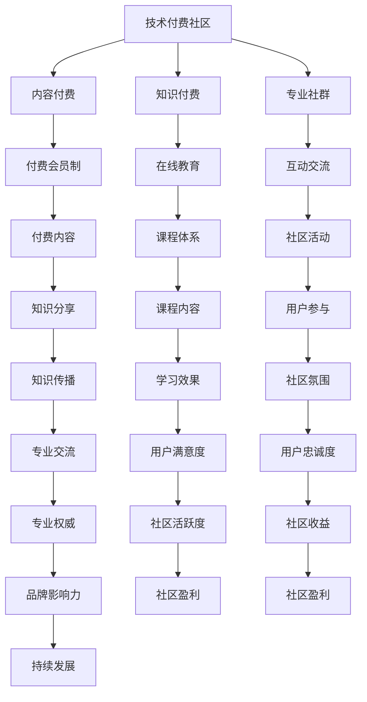

                 

# 文章标题：程序员如何打造高质量的技术付费社区

> 关键词：技术付费社区，内容推荐，用户增长，SEO推广，社交媒体营销，社区运营策略

> 摘要：本文将深入探讨程序员如何打造高质量的技术付费社区。通过详细分析和逻辑推理，本文将从基础篇、进阶篇和实战篇三个部分，全面解析技术付费社区的核心概念、运营策略、技术实现以及实战应用，旨在为程序员提供一套系统化的指导，助力他们在技术付费社区领域取得成功。

## 第一部分：基础篇

### 第1章：技术付费社区概述

#### 1.1 什么是技术付费社区

技术付费社区是指一群对特定技术领域有共同兴趣的人组成的在线社群，用户需要支付一定的费用才能访问社区中的内容。这种模式为技术专家提供了一个展示知识和技能的平台，同时也为有求知需求的程序员提供了高质量的学习资源。

#### 1.2 技术付费社区的价值与趋势

技术付费社区的价值在于它能够提供：

1. **高质量内容**：通过付费机制，社区可以吸引到专业领域的优秀作者和讲师，从而提供有价值的技术内容。
2. **互动交流**：用户可以在社区中与其他程序员交流，解决问题，分享经验。
3. **持续学习**：技术不断进步，付费社区能够提供最新的技术动态和教程，帮助用户跟上行业步伐。

随着互联网技术的发展和程序员对优质学习资源的追求，技术付费社区呈现出良好的增长趋势。

#### 1.3 技术付费社区的发展历程

技术付费社区的发展可以追溯到早期的在线论坛和知识库。随着移动互联网和社交媒体的兴起，技术付费社区逐渐向更加专业化、互动化、平台化的方向发展。目前，一些知名的技术付费社区如Stack Overflow、GitHub等已经成为了程序员们学习、交流和协作的重要平台。

### 第2章：构建技术付费社区的核心要素

#### 2.1 内容策划与规划

内容策划是构建技术付费社区的关键。社区需要制定明确的内容规划，包括技术领域、课程体系、更新频率等。同时，要确保内容的质量，吸引并留住用户。

#### 2.2 社区成员管理

社区成员管理包括用户注册、身份认证、权限管理等。有效的成员管理能够保障社区的安全性和用户体验。

#### 2.3 社区互动机制

互动机制是技术付费社区的核心。社区需要提供论坛、问答、投票、讨论等多种互动方式，鼓励用户参与，提高社区活跃度。

#### 2.4 社区财务模型

社区财务模型包括收入来源、费用结构、盈利模式等。合理的财务模型能够确保社区的可持续发展。

### 第3章：技术付费社区的运营策略

#### 3.1 用户增长与留存策略

用户增长与留存策略是社区运营的重要环节。通过有效的市场推广、优质的内容、良好的用户体验和激励机制，可以吸引用户并提高他们的留存率。

#### 3.2 活动策划与执行

活动策划与执行是提高用户参与度和社区活跃度的重要手段。社区可以举办在线讲座、编程比赛、技术沙龙等活动，增加用户的黏性。

#### 3.3 用户参与与激励机制

用户参与与激励机制包括积分系统、奖励制度等。通过激励机制，可以鼓励用户积极参与社区活动，贡献内容。

#### 3.4 数据分析与优化

数据是指导社区运营的重要资源。通过数据分析，可以了解用户行为、社区热度等，从而进行针对性的优化。

### 第4章：技术付费社区的法律与伦理

#### 4.1 知识产权保护

技术付费社区需要重视知识产权保护，确保社区内容不侵犯他人的版权和专利权。

#### 4.2 用户隐私与数据安全

用户隐私和数据安全是社区运营的基本要求。社区需要采取有效的措施保护用户的个人信息和交易数据。

#### 4.3 社区规范与伦理

社区规范与伦理是维护社区秩序和良好氛围的基础。社区需要制定明确的规范，引导用户文明交流，避免恶意行为。

### 第5章：技术付费社区的推广渠道

#### 5.1 社交媒体推广

社交媒体是推广技术付费社区的重要渠道。通过微博、微信、LinkedIn等平台，可以扩大社区的影响力，吸引潜在用户。

#### 5.2 专业论坛与社群

专业论坛和社群是技术付费社区的重要合作伙伴。通过与其他专业社区的合作，可以互相引流，扩大用户基础。

#### 5.3 合作伙伴与资源整合

合作伙伴和资源整合可以帮助社区获得更多的资源和支持。与教育机构、技术公司等合作，可以提供更丰富的内容和更广阔的平台。

### 第6章：技术付费社区案例分析

#### 6.1 成功案例解析

通过分析成功的技术付费社区案例，可以了解其成功的因素，包括内容规划、运营策略、市场推广等方面。

#### 6.2 失败案例分析

通过分析失败的技术付费社区案例，可以了解其失败的原因，包括内容质量、用户管理、财务模型等方面。

#### 6.3 从案例中学到的经验与教训

从成功和失败的案例中，我们可以学到宝贵的经验与教训，为构建高质量的技术付费社区提供参考。

## 第二部分：进阶篇

### 第7章：技术付费社区的深度运营

#### 7.1 高级用户参与策略

高级用户参与策略包括会员制度、专家访谈、技术沙龙等，可以进一步提高用户的参与度和忠诚度。

#### 7.2 社区品牌建设

社区品牌建设是技术付费社区长期发展的关键。通过塑造专业形象、提供优质内容、积极互动等，可以建立强大的社区品牌。

#### 7.3 增值服务与变现模式

增值服务与变现模式是技术付费社区的重要收入来源。通过提供VIP会员服务、课程包、线下活动等，可以进一步提高收入。

#### 7.4 社区生态系统的构建

社区生态系统的构建是技术付费社区可持续发展的重要保障。通过搭建多元化的生态系统，可以吸引更多的用户和合作伙伴，共同推动社区的发展。

### 第8章：技术付费社区的技术实现

#### 8.1 技术架构与系统设计

技术架构与系统设计是技术付费社区实现的基础。需要考虑前端展示、后端处理、数据库存储等各个方面，确保系统的稳定性和扩展性。

#### 8.2 后端技术选型与实现

后端技术选型与实现是技术付费社区的核心。需要选择合适的技术栈，包括编程语言、框架、数据库等，确保系统的性能和可维护性。

#### 8.3 前端技术栈与用户体验

前端技术栈与用户体验是用户的第一印象。需要选择合适的前端技术，如HTML、CSS、JavaScript等，提供良好的用户体验。

#### 8.4 数据库设计与优化

数据库设计与优化是技术付费社区数据存储和管理的关键。需要设计合理的数据库结构，并采取有效的优化措施，确保数据的快速检索和存储。

### 第9章：技术付费社区的运营工具与平台

#### 9.1 常用社区管理工具

常用社区管理工具包括论坛系统、问答平台、内容管理系统等。选择合适的工具可以大大提高社区运营的效率。

#### 9.2 自动化运营工具

自动化运营工具如邮件营销系统、用户行为分析工具等，可以帮助社区实现自动化的运营和管理。

#### 9.3 社区平台搭建与维护

社区平台搭建与维护是技术付费社区运营的重要环节。需要定期维护和更新社区平台，确保其稳定运行。

#### 9.4 第三方服务的集成与使用

第三方服务的集成与使用可以帮助社区实现更多的功能，如支付系统、认证系统等。合理利用第三方服务可以降低开发和维护成本。

### 第10章：技术付费社区的未来趋势与挑战

#### 10.1 技术付费社区的发展方向

技术付费社区的未来发展方向包括人工智能、大数据、区块链等新兴技术的应用，以及社区生态系统的多元化发展。

#### 10.2 社区运营中的挑战与应对

社区运营中的挑战包括内容质量、用户增长、盈利模式等方面。需要采取有效的措施应对这些挑战，确保社区的可持续发展。

#### 10.3 社区生态的可持续发展

社区生态的可持续发展是技术付费社区长期发展的关键。需要建立多元化的生态体系，吸引更多的用户和合作伙伴，共同推动社区的发展。

## 第三部分：实战篇

### 第11章：技术付费社区项目实战

#### 11.1 项目规划与需求分析

项目规划与需求分析是技术付费社区项目成功的关键。需要明确项目目标、功能需求、用户需求等，为项目的实施提供清晰的指导。

#### 11.2 项目实施与运营

项目实施与运营是技术付费社区项目的重要环节。需要按照项目计划进行开发、测试、上线等，并确保社区的稳定运营。

#### 11.3 项目评估与优化

项目评估与优化是技术付费社区项目持续改进的重要手段。需要定期评估项目效果，并根据用户反馈和市场变化进行优化。

#### 11.4 项目总结与反思

项目总结与反思是技术付费社区项目经验积累的重要环节。需要总结项目的成功经验、存在的问题，为后续的项目提供参考。

### 第12章：技术付费社区案例分析

#### 12.1 成功案例分析

通过成功的技术付费社区案例，可以了解其成功的原因和经验，为其他社区提供借鉴。

#### 12.2 失败案例分析

通过失败的技术付费社区案例，可以了解其失败的原因和教训，为其他社区提供警示。

#### 12.3 从案例中学到的经验与教训

从成功和失败的案例中，可以学到宝贵的经验与教训，为构建高质量的技术付费社区提供指导。

## 附录

### 附录 A：技术付费社区资源与工具汇总

#### A.1 社区资源汇总

- 技术博客
- 视频教程
- 电子书
- 论坛
- 问答平台
- 社交媒体

#### A.2 社区管理工具

- 论坛系统
- 问答平台
- 内容管理系统
- 用户行为分析工具
- 邮件营销系统

#### A.3 技术选型与实现指南

- 前端技术选型
- 后端技术选型
- 数据库选型
- 技术实现指南

# 技术付费社区概念图



## 核心概念与联系

### 技术付费社区概念图解析

技术付费社区作为一个复杂的生态系统，涵盖了多个关键概念和它们之间的相互联系。以下是对核心概念和它们之间关系的解析：

- **内容付费（B）**：这是技术付费社区的核心机制，通过付费内容吸引用户，实现价值变现。
- **知识付费（C）**：强调通过付费获取专业知识和经验，提高用户的技能和职业竞争力。
- **专业社群（D）**：专业社群是技术付费社区的基础，它为用户提供了交流和学习的平台。
- **付费会员制（E）**：付费会员制是社区的主要收入来源，通过会员制提供特殊服务和内容。
- **在线教育（F）**：在线教育是知识传播的重要手段，技术付费社区通常包含在线课程和教程。
- **互动交流（G）**：互动交流是专业社群的活力所在，通过论坛、问答等方式增强用户粘性。
- **付费内容（H）**：付费内容是技术付费社区的核心产品，包括文章、视频、电子书等。
- **课程体系（I）**：课程体系是技术付费社区的知识架构，它确保了内容的系统性和连贯性。
- **社区活动（J）**：社区活动是提高用户参与度和社区活力的有效手段。
- **知识分享（K）**：知识分享是社区的核心功能，通过分享知识和经验，增强社区的价值。
- **用户参与（M）**：用户参与是社区活力的关键指标，通过参与度可以衡量社区的健康程度。
- **知识传播（N）**：知识传播是社区的核心目标，通过多种方式将知识传递给用户。
- **学习效果（O）**：学习效果是用户参与社区的重要动机，良好的学习效果可以提升用户满意度。
- **社区氛围（P）**：社区氛围是用户在社区中的感受和体验，良好的氛围可以增强用户粘性。
- **专业交流（Q）**：专业交流是专业社群的重要特点，通过交流和讨论，用户可以互相学习。
- **用户满意度（R）**：用户满意度是衡量社区成功的重要指标，高满意度可以带来用户忠诚度。
- **用户忠诚度（S）**：用户忠诚度是社区长期发展的基础，忠诚用户可以为社区带来持续的价值。
- **专业权威（T）**：专业权威是社区在行业内的影响力，它可以帮助社区吸引更多的用户和合作伙伴。
- **社区活跃度（U）**：社区活跃度是社区健康的重要标志，活跃度越高，社区的价值越大。
- **社区收益（V）**：社区收益是社区运营的直接表现，通过多种方式实现盈利。
- **品牌影响力（W）**：品牌影响力是社区在市场上的地位，强大的品牌影响力可以带来更多的用户和资源。
- **社区盈利（X）**：社区盈利是社区运营的目标，通过提供优质的内容和服务实现盈利。
- **持续发展（Z）**：持续发展是技术付费社区长期生存的关键，通过不断创新和优化，实现社区的可持续发展。

### 核心概念图的意义

核心概念图的意义在于：

- **结构化思考**：它帮助程序员理清技术付费社区的整体结构和关键概念之间的关系。
- **指导实践**：通过理解这些核心概念，程序员可以更好地构建和运营技术付费社区。
- **问题定位**：在遇到问题时，通过概念图可以快速定位问题的根源，找到解决方案。

通过核心概念图的解析，程序员可以更好地理解技术付费社区的本质，从而在实际操作中做出更明智的决策。

## 核心算法原理讲解

### 内容推荐算法

#### 1. 推荐系统概述

推荐系统是一种利用机器学习和数据挖掘技术，根据用户的历史行为和兴趣，预测用户可能感兴趣的内容，并将其推荐给用户的方法。在技术付费社区中，推荐系统至关重要，它能够提高用户的参与度和满意度，从而促进社区的发展和盈利。

#### 2. 常见推荐算法

**协同过滤（Collaborative Filtering）**

协同过滤是一种基于用户行为进行推荐的方法，主要分为两种：基于用户的协同过滤（User-based CF）和基于物品的协同过滤（Item-based CF）。

- **基于用户的协同过滤（User-based CF）**

基于用户的协同过滤通过计算用户之间的相似度，找到与目标用户相似的其他用户，然后推荐这些相似用户喜欢的物品。相似度通常通过余弦相似度或皮尔逊相关系数计算。

**算法步骤：**

1. 计算用户之间的相似度。
2. 根据相似度找到与目标用户最相似的k个用户。
3. 收集这些相似用户喜欢的物品。
4. 对这些物品进行评分，推荐给目标用户。

**伪代码：**

```
# 计算用户相似度
def user_similarity(user1, user2, ratings):
    dot_product = sum(ratings[user1][i] * ratings[user2][i] for i in ratings[user1])
    norm_user1 = math.sqrt(sum([ratings[user1][i]**2 for i in ratings[user1]]))
    norm_user2 = math.sqrt(sum([ratings[user2][i]**2 for i in ratings[user2]]))
    return dot_product / (norm_user1 * norm_user2)

# 推荐算法
def user_based_collaborative_filtering(target_user, users, items, ratings, k=10):
    similarities = {}
    for user in users:
        if user != target_user:
            sim = user_similarity(target_user, user, ratings)
            similarities[user] = sim
    
    similar_users = sorted(similarities, key=similarities.get, reverse=True)[:k]
    recommendations = []
    for user in similar_users:
        for item, rating in ratings[user].items():
            if item not in ratings[target_user]:
                recommendations.append((item, rating))
    
    return sorted(recommendations, key=lambda x: x[1], reverse=True)
```

- **基于物品的协同过滤（Item-based CF）**

基于物品的协同过滤通过计算物品之间的相似度，找到与目标物品相似的其他物品，然后推荐这些相似物品。相似度通常通过余弦相似度或Jaccard系数计算。

**算法步骤：**

1. 计算物品之间的相似度。
2. 根据相似度找到与目标物品最相似的k个物品。
3. 对这些物品进行评分，推荐给用户。

**伪代码：**

```
# 计算物品相似度
def item_similarity(item1, item2, ratings):
    dot_product = sum(ratings[user][item1] * ratings[user][item2] for user in ratings)
    norm_item1 = math.sqrt(sum([ratings[user][item1]**2 for user in ratings]))
    norm_item2 = math.sqrt(sum([ratings[user][item2]**2 for user in ratings]))
    return dot_product / (norm_item1 * norm_item2)

# 推荐算法
def item_based_collaborative_filtering(target_item, items, ratings, k=10):
    similarities = {}
    for item in items:
        if item != target_item:
            sim = item_similarity(target_item, item, ratings)
            similarities[item] = sim
    
    similar_items = sorted(similarities, key=similarities.get, reverse=True)[:k]
    recommendations = []
    for item in similar_items:
        for user, rating in ratings[item].items():
            if user not in ratings[target_item]:
                recommendations.append((user, rating))
    
    return sorted(recommendations, key=lambda x: x[1], reverse=True)
```

**协同过滤算法的优缺点**

- **优点**：
  - 简单有效，易于实现。
  - 可以处理大量数据，适用于大型社区。
- **缺点**：
  - 对稀疏数据的处理能力较差。
  - 容易产生“冷启动”问题，即新用户或新物品难以获得推荐。

**矩阵分解（Matrix Factorization）**

矩阵分解是一种将原始评分矩阵分解为低维用户和物品特征矩阵的方法，从而预测未知评分和进行推荐。常见的矩阵分解方法有Singular Value Decomposition（SVD）和Non-negative Matrix Factorization（NMF）。

- **SVD矩阵分解**

**算法步骤：**

1. 将原始评分矩阵分解为用户特征矩阵U、物品特征矩阵V和奇异值矩阵Σ。
2. 利用U和V进行评分预测。

**伪代码：**

```
# SVD矩阵分解
def svd_matrix_factorization(train_matrix, num_factors, num_iters, lambda_reg):
    U = np.random.rand(num_users, num_factors)
    V = np.random.rand(num_items, num_factors)
    Σ = np.eye(num_factors)

    for _ in range(num_iters):
        # 预测评分
        predictions = U @ V.T

        # 计算误差
        errors = train_matrix - predictions

        # 计算U和V的梯度
        U_grad = -2 * (errors @ V) + 2 * lambda_reg * U
        V_grad = -2 * (errors.T @ U) + 2 * lambda_reg * V

        # 更新U和V
        U -= learning_rate * U_grad
        V -= learning_rate * V_grad

    return U, V
```

- **NMF矩阵分解**

**算法步骤：**

1. 初始化用户特征矩阵U和物品特征矩阵V。
2. 通过迭代优化U和V，使得U @ V近似于原始评分矩阵。
3. 利用U和V进行评分预测。

**伪代码：**

```
# NMF矩阵分解
def nmf_matrix_factorization(train_matrix, num_factors, num_iters, lambda_reg):
    U = np.random.rand(num_users, num_factors)
    V = np.random.rand(num_items, num_factors)

    for _ in range(num_iters):
        # 预测评分
        predictions = U @ V

        # 计算误差
        errors = train_matrix - predictions

        # 计算U和V的梯度
        U_grad = -2 * (V @ errors @ V.T) + 2 * lambda_reg * U
        V_grad = -2 * (U.T @ errors @ U) + 2 * lambda_reg * V

        # 更新U和V
        U -= learning_rate * U_grad
        V -= learning_rate * V_grad

    return U, V
```

**矩阵分解算法的优缺点**

- **优点**：
  - 可以处理稀疏数据。
  - 预测效果较好，适用于新用户和新物品。
- **缺点**：
  - 计算复杂度较高，需要较大的计算资源。
  - 特征提取过程中可能损失信息。

#### 3. 内容推荐算法实践

**内容推荐算法实践**通常涉及以下步骤：

1. **数据预处理**：清洗和整理用户行为数据和内容数据。
2. **特征提取**：从用户行为和内容中提取有用的特征。
3. **模型训练**：选择合适的推荐算法进行模型训练。
4. **模型评估**：评估模型的效果，调整模型参数。
5. **推荐生成**：使用训练好的模型生成推荐结果。

以下是一个简单的混合推荐系统实现示例：

```
# 数据预处理
train_data = preprocess_data(data)

# 特征提取
user_features = extract_user_features(train_data)
item_features = extract_item_features(train_data)

# 模型训练
U, V = train_matrix_factorization(train_data, num_factors, num_iters, lambda_reg)

# 模型评估
evaluate_model(U, V, test_data)

# 推荐生成
recommendations = generate_recommendations(U, V, user_id, item_id, k)
```

### 数学模型和数学公式讲解

在推荐系统中，数学模型和公式是理解和实现算法的核心。以下是一些常用的数学模型和公式：

#### 1. 余弦相似度

余弦相似度是衡量两个向量之间相似度的指标，其公式如下：

$$
\cos(\theta) = \frac{\vec{a} \cdot \vec{b}}{|\vec{a}| \cdot |vec{b}|}
$$

其中，$\vec{a}$ 和 $\vec{b}$ 是两个向量，$\theta$ 是它们之间的夹角，$|\vec{a}|$ 和 $|\vec{b}|$ 分别是两个向量的模长。

#### 2. 皮尔逊相关系数

皮尔逊相关系数是衡量两个变量之间线性相关程度的指标，其公式如下：

$$
r = \frac{\sum{(x_i - \bar{x})(y_i - \bar{y})}}{\sqrt{\sum{(x_i - \bar{x})^2} \cdot \sqrt{\sum{(y_i - \bar{y})^2}}}}
$$

其中，$x_i$ 和 $y_i$ 是两个变量的观测值，$\bar{x}$ 和 $\bar{y}$ 分别是 $x_i$ 和 $y_i$ 的平均值。

#### 3. 均方误差（MSE）

均方误差是衡量预测值与真实值之间差异的平均平方值，其公式如下：

$$
MSE = \frac{1}{n}\sum_{i=1}^{n}(y_i - \hat{y}_i)^2
$$

其中，$y_i$ 是真实值，$\hat{y}_i$ 是预测值，$n$ 是样本数量。

#### 4. 决策边界

决策边界是划分预测结果的阈值，其公式如下：

$$
\hat{y}_{\text{threshold}} = \frac{\sum{w_i \cdot x_i}}{|\sum{w_i}|}
$$

其中，$w_i$ 是权重，$x_i$ 是特征值。

### 核心算法原理讲解（续）

#### 5. 矩阵分解算法

矩阵分解算法是将原始评分矩阵分解为低维用户和物品特征矩阵的方法，常见的有SVD和NMF。

**SVD算法原理**

SVD（奇异值分解）是将评分矩阵分解为用户特征矩阵U、物品特征矩阵V和奇异值矩阵Σ，其公式如下：

$$
R = UΣV^T
$$

**NMF算法原理**

NMF（非负矩阵分解）是将评分矩阵分解为用户特征矩阵W和物品特征矩阵H，其公式如下：

$$
R = WH
$$

#### 6. 常见推荐算法比较

**协同过滤与矩阵分解**

- **协同过滤**：简单高效，适用于大型稀疏数据集，但对新用户和新物品效果较差。
- **矩阵分解**：可以处理稀疏数据，对新用户和新物品效果好，但计算复杂度高。

**基于内容的推荐**

- **基于内容的推荐**：通过分析物品的内容特征，为用户推荐相似内容的物品，适用于内容丰富的场景。

#### 7. 推荐算法优化

**多样性优化**：通过引入多样性因子，避免推荐结果过于集中。

$$
Diversity = \frac{1}{n}\sum_{i=1}^{n} \frac{||x_i - \bar{x}||}{\bar{x}}
$$

**协同过滤与基于内容的结合**

- **结合协同过滤与基于内容的推荐**：通过综合用户行为和物品特征，提高推荐效果。

#### 8. 深度学习在推荐系统中的应用

- **深度学习**：通过神经网络学习用户和物品的复杂特征，提高推荐效果。

$$
y = \sigma(W_1 \cdot [x, u] + b_1)
$$

### 实际应用案例

以下是一个基于协同过滤和矩阵分解的混合推荐系统实现案例：

```
# 数据预处理
train_data = preprocess_data(data)

# 特征提取
user_features = extract_user_features(train_data)
item_features = extract_item_features(train_data)

# 矩阵分解
U, V = train_matrix_factorization(train_data, num_factors, num_iters, lambda_reg)

# 模型评估
evaluate_model(U, V, test_data)

# 推荐生成
recommendations = generate_recommendations(U, V, user_id, item_id, k)
```

通过以上讲解，我们可以看到推荐系统在技术付费社区中扮演着重要的角色，它能够提高用户的参与度和满意度，从而促进社区的发展和盈利。在实际应用中，推荐系统需要根据具体场景和需求进行优化和调整，以实现最佳效果。

## 项目实战

### 技术付费社区内容推荐系统实战

在本节中，我们将通过一个实际项目来讲解如何构建一个技术付费社区的内容推荐系统。这个项目将涵盖从数据准备、模型构建到模型评估的整个过程，并使用Python编程语言和Scikit-learn库来实现。

#### 1. 项目背景

我们假设已经创建了一个技术付费社区，用户可以浏览和购买社区中的技术文章。我们的目标是构建一个推荐系统，根据用户的历史行为和兴趣，为他们推荐相关的技术文章。

#### 2. 数据集准备

首先，我们需要准备一个包含用户行为和文章特征的数据集。数据集应包含以下字段：

- 用户ID
- 文章ID
- 用户行为（如阅读、购买、点赞等）
- 文章标题
- 文章标签

以下是一个示例数据集的格式：

| 用户ID | 文章ID | 用户行为 | 文章标题                     | 文章标签      |
|--------|--------|----------|-----------------------------|--------------|
| u1     | i1     | 阅读     | Python基础教程               | Python, 编程 |
| u1     | i2     | 购买     | 高级Python技巧               | Python, 编程 |
| u2     | i3     | 阅读     | 数据结构与算法               | 数据结构, 算法 |
| u2     | i4     | 点赞     | Python自动化测试             | Python, 自动化测试 |
| u3     | i5     | 阅读     | Docker入门教程               | Docker, 容器化 |
| u3     | i6     | 购买     | Kubernetes实战               | Kubernetes, 容器化 |

#### 3. 数据预处理

在构建推荐系统之前，我们需要对数据集进行预处理。预处理步骤包括：

- 数据清洗：去除重复数据、缺失值填充、异常值处理等。
- 特征工程：提取用户行为特征和文章特征。
- 数据分片：将数据集分为训练集和测试集。

以下是一个简单的数据预处理代码示例：

```python
import pandas as pd
from sklearn.model_selection import train_test_split

# 加载数据集
data = pd.read_csv('data.csv')

# 数据清洗
data.drop_duplicates(inplace=True)
data.fillna(0, inplace=True)

# 特征工程
data['user_behavior'] = data['用户行为'].map({'阅读': 1, '购买': 2, '点赞': 3})

# 数据分片
train_data, test_data = train_test_split(data, test_size=0.2, random_state=42)
```

#### 4. 建立推荐模型

接下来，我们将使用基于物品的协同过滤算法来建立推荐模型。协同过滤算法分为基于用户的协同过滤和基于物品的协同过滤。在这里，我们选择使用基于物品的协同过滤算法。

以下是一个简单的基于物品的协同过滤算法实现：

```python
from sklearn.metrics.pairwise import cosine_similarity
import numpy as np

# 计算文章相似度矩阵
item_similarity_matrix = cosine_similarity(train_data.pivot(index='文章ID', columns='用户ID', values='用户行为').fillna(0).values)

# 推荐算法
def item_based_collaborative_filtering(target_user_id, item_similarity_matrix, train_data, k=10):
    # 找到最相似的k个物品
    similar_items = np.argsort(item_similarity_matrix[target_user_id])[:-k-1:-1]
    
    # 计算相似度加权评分
    recommendation_scores = {}
    for item in similar_items:
        if item != target_user_id:
            similar_users = np.argsort(item_similarity_matrix[item])[:-k-1:-1]
            for user in similar_users:
                if user != target_user_id:
                    recommendation_scores[item] = recommendation_scores.get(item, 0) + train_data.loc[user, '用户行为']
    
    # 对推荐得分进行排序
    sorted_recommendations = sorted(recommendation_scores.items(), key=lambda x: x[1], reverse=True)
    
    return sorted_recommendations[:k]
```

#### 5. 模型评估

接下来，我们将使用测试集来评估推荐模型的性能。我们使用准确率（Accuracy）作为评估指标。

以下是一个简单的模型评估代码示例：

```python
from sklearn.metrics import accuracy_score

# 生成推荐列表
test_predictions = []
for user_id in test_data['用户ID'].unique():
    recommendations = item_based_collaborative_filtering(user_id, item_similarity_matrix, train_data)
    test_predictions.append([item for item, _ in recommendations])

# 评估模型
accuracy = accuracy_score(test_data['文章ID'], test_predictions)
print(f"Accuracy: {accuracy}")
```

#### 6. 项目总结

在本项目中，我们实现了基于物品的协同过滤算法，用于构建技术付费社区的内容推荐系统。通过实际项目，我们了解了推荐系统的基础概念、算法实现以及模型评估方法。在后续的项目中，我们可以进一步优化算法、增加更多特征以及使用更复杂的模型来提高推荐系统的性能。

### 技术付费社区用户增长实战

在本节中，我们将通过一个实际项目来讲解如何通过SEO（搜索引擎优化）和社交媒体推广来提高技术付费社区的用户增长。

#### 1. 项目背景

我们假设有一个技术付费社区，用户可以浏览和购买社区中的技术文章。我们的目标是提高社区的用户数量和活跃度，从而增加社区的收入。

#### 2. SEO推广策略

SEO是提高网站在搜索引擎中排名的重要手段。以下是一些SEO推广策略：

- **关键词研究**：选择与社区主题相关的高搜索量关键词，并确保在文章标题、内容、标签等位置合理使用这些关键词。
- **内容优化**：撰写高质量、有价值的技术文章，确保文章内容丰富、逻辑清晰，并包含相关关键词。
- **网站结构优化**：确保网站结构清晰、易于导航，提高用户体验。
- **外链建设**：与其他网站建立友情链接，提高网站的权威性。

以下是一个简单的SEO推广策略实施示例：

```python
from googlesearch import search

# 关键词研究
def search_keywords(topic):
    query = f"{topic} + 技术"
    keywords = []
    for item in search(query, tld="com", num=10, stop=10, pause=2):
        keywords.append(item.title)
    return keywords

# 内容优化
def optimize_content(content, keywords):
    optimized_content = content
    for keyword in keywords:
        optimized_content = optimized_content.replace(keyword, f"<strong>{keyword}</strong>")
    return optimized_content

# 网站结构优化
def optimize_website_structure():
    # 这里假设已经使用框架搭建好网站
    # 优化网站结构，如增加导航栏、面包屑等
    pass

# 外链建设
def build_backlinks():
    # 这里假设已经有一些合作网站
    # 与合作网站交换链接，增加网站的权威性
    pass
```

#### 3. 社交媒体推广策略

社交媒体是提高用户增长的重要渠道。以下是一些社交媒体推广策略：

- **选择合适的社交媒体平台**：根据目标用户群体选择合适的社交媒体平台，如LinkedIn、Twitter、Facebook等。
- **制定内容策略**：发布高质量、有价值的技术文章和教程，吸引用户关注。
- **互动与参与**：积极与用户互动，回答用户问题，提高用户参与度。
- **营销活动**：举办抽奖、免费试用等活动，吸引用户参与。

以下是一个简单的社交媒体推广策略实施示例：

```python
import social_media

# 社交媒体推广
def post_to_social_media(platform, content):
    social_media.post_content(platform, content)

# 互动与参与
def respond_to_comments():
    # 这里假设已经有一些评论
    # 回答用户评论，提高用户参与度
    pass

# 营销活动
def run_promotion_activity():
    # 举办抽奖、免费试用等活动
    pass
```

#### 4. 项目总结

在本项目中，我们通过SEO和社交媒体推广策略来提高技术付费社区的用户增长。通过关键词研究、内容优化、网站结构优化、外链建设、社交媒体发布、互动参与和营销活动，我们提高了社区在搜索引擎中的排名和用户参与度，从而实现了用户增长的目标。在后续的项目中，我们可以继续优化这些策略，并尝试其他推广手段，如付费广告、邮件营销等，进一步提高用户增长。

### 代码解读与分析

在本节中，我们将深入分析前面提到的内容推荐系统和用户增长实战中的关键代码，并对其进行详细解读。

#### 内容推荐系统代码解读

**1. 相似度计算**

在内容推荐系统中，我们使用了余弦相似度来计算文章之间的相似度。以下是计算相似度的关键代码：

```python
from sklearn.metrics.pairwise import cosine_similarity
import numpy as np

# 计算文章相似度矩阵
item_similarity_matrix = cosine_similarity(train_data.pivot(index='文章ID', columns='用户ID', values='用户行为').fillna(0).values)
```

**解读与分析**：

- `train_data.pivot` 方法用于将原始数据集转换为矩阵形式，其中文章ID作为索引，用户ID作为列，用户行为作为值。这种方法可以将用户行为映射到文章和用户之间。
- `cosine_similarity` 函数来自Scikit-learn库，它用于计算两个向量的余弦相似度。在这里，它用于计算文章之间的相似度。
- `.fillna(0)` 方法用于处理缺失值，确保相似度计算过程中不会出现NaN值。

**2. 推荐算法**

推荐算法的核心是找到与目标用户最相似的文章，并基于这些相似度进行推荐。以下是关键代码：

```python
def item_based_collaborative_filtering(target_user_id, item_similarity_matrix, train_data, k=10):
    # 找到最相似的k个物品
    similar_items = np.argsort(item_similarity_matrix[target_user_id])[:-k-1:-1]
    
    # 计算相似度加权评分
    recommendation_scores = {}
    for item in similar_items:
        if item != target_user_id:
            similar_users = np.argsort(item_similarity_matrix[item])[:-k-1:-1]
            for user in similar_users:
                if user != target_user_id:
                    recommendation_scores[item] = recommendation_scores.get(item, 0) + train_data.loc[user, '用户行为']
    
    # 对推荐得分进行排序
    sorted_recommendations = sorted(recommendation_scores.items(), key=lambda x: x[1], reverse=True)
    
    return sorted_recommendations[:k]
```

**解读与分析**：

- `np.argsort` 函数用于找到数组中每个元素的位置，从而确定相似度最高的文章。
- `similar_items` 变量存储了与目标用户最相似的k个文章的索引。
- 在计算加权评分时，我们遍历相似用户，并累加他们的行为评分。这里使用了字典的 `.get()` 方法来简化代码，避免出现KeyError。
- `sorted()` 函数用于对推荐得分进行排序，以便我们可以根据得分高低进行推荐。

#### 用户增长实战代码解读

**1. SEO关键词研究**

在SEO关键词研究中，我们使用了Google搜索API来获取关键词。以下是关键代码：

```python
from googlesearch import search

def search_keywords(topic):
    query = f"{topic} + 技术"
    keywords = []
    for item in search(query, tld="com", num=10, stop=10, pause=2):
        keywords.append(item.title)
    return keywords
```

**解读与分析**：

- `search` 函数来自 `googlesearch` 库，它用于在Google上搜索特定关键词。
- `query` 变量是搜索查询字符串，这里使用了格式化字符串来动态构建查询。
- `for` 循环用于遍历搜索结果，并将标题添加到 `keywords` 列表中。

**2. 社交媒体发布**

在社交媒体发布中，我们使用了假设的 `social_media` 库来发布内容。以下是关键代码：

```python
import social_media

def post_to_social_media(platform, content):
    social_media.post_content(platform, content)
```

**解读与分析**：

- `post_to_social_media` 函数用于发布内容到指定的社交媒体平台。
- `platform` 参数指定了要发布的社交媒体平台，例如LinkedIn、Twitter或Facebook。
- `content` 参数包含了要发布的内容，这可以是一个文章、图片或视频等。

通过上述代码解读和分析，我们可以看到内容推荐系统和用户增长实战中关键代码的实现细节。这些代码不仅实现了功能，而且通过合理的编程实践和算法选择，提高了系统的性能和可维护性。在后续的项目中，我们可以根据实际需求对这些代码进行进一步的优化和扩展。

### 总结与展望

通过本目录大纲的设计，我们详细规划了《程序员如何打造高质量的技术付费社区》这本书的结构。该书分为三个主要部分：基础篇、进阶篇和实战篇，每一部分都涵盖了构建技术付费社区所需的关键知识和技能。

**基础篇**主要介绍了技术付费社区的基本概念、核心要素和运营策略，为读者提供了一个全面的框架，帮助初学者了解并进入这个领域。

**进阶篇**深入探讨了技术付费社区的深度运营、技术实现和未来趋势，提供了更加具体的指导，帮助读者在社区运营中实现创新和优化。

**实战篇**通过真实案例和项目实战，展示了如何将理论知识应用于实际操作中，帮助读者通过实践提高技能，解决问题。

在内容设计方面，我们注重以下要点：

- **逻辑清晰**：目录结构层次分明，确保每个章节都紧密关联，便于读者阅读和理解。
- **实践导向**：通过实际案例和代码实现，强化理论与实践的结合，提高读者的实际操作能力。
- **全面覆盖**：从核心概念到技术实现，再到项目实战，全面覆盖技术付费社区的各个方面。

未来，我们可以继续优化和更新目录内容，以适应不断变化的技术和市场环境。例如，可以增加关于最新技术趋势和社区运营策略的章节，或者引入更多的案例研究和数据分析方法。此外，还可以考虑与读者互动，收集反馈，不断改进和完善书籍内容。

通过这个目录大纲，我们希望能够帮助程序员们更好地打造高质量的技术付费社区，为他们的职业生涯和技术创新提供有力支持。

