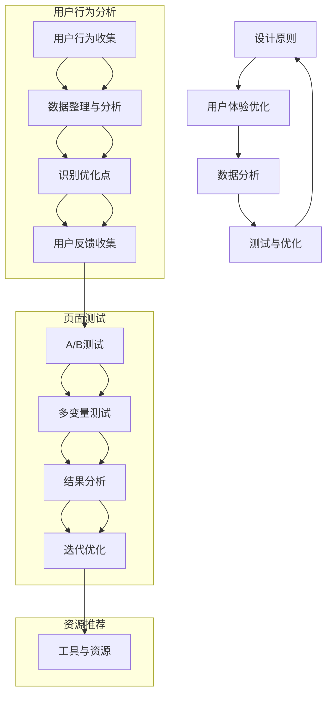

                 

## 《程序员如何打造高转化率的销售页面》

> 关键词：销售页面、高转化率、用户体验、数据分析、A/B测试

> 摘要：本文将深入探讨程序员如何利用技术手段打造高转化率的销售页面。我们将从核心原则与策略、页面组成部分、视觉效果与用户体验优化、数据驱动与转化率测试以及持续优化与迭代等多个方面，结合实际案例进行详细分析，帮助程序员更好地理解并实施销售页面的优化策略。

### 目录大纲

#### 第一部分：销售页面的设计与优化原则

- **第1章：销售页面的核心原则与策略**
  - **1.1 高转化率的定义与重要性**
  - **1.2 设计原则与用户体验**
  - **1.3 用户行为分析**
  - **1.4 营销与销售融合**

- **第2章：销售页面的核心组成部分**
  - **2.1 标题与引言**
  - **2.2 产品介绍与特色**
  - **2.3 用户评价与案例**
  - **2.4 购买激励与优惠信息**
  - **2.5 购物车与下单流程**

- **第3章：视觉效果与用户体验优化**
  - **3.1 颜色与布局**
  - **3.2 图像与视频应用**
  - **3.3 动效与交互**
  - **3.4 页面加载速度**

#### 第二部分：数据驱动与转化率测试

- **第4章：数据收集与用户行为分析**
  - **4.1 转化率数据收集**
  - **4.2 用户行为分析工具**
  - **4.3 用户反馈机制**

- **第5章：A/B测试与多变量测试**
  - **5.1 A/B测试原理**
  - **5.2 多变量测试**
  - **5.3 测试结果分析与优化**

- **第6章：持续优化与迭代**
  - **6.1 数据驱动决策**
  - **6.2 迭代与优化策略**
  - **6.3 竞争对手分析**

- **第7章：高转化率案例分享**
  - **7.1 成功案例分析**
  - **7.2 案例反思与启示**

#### 附录

- **附录A：工具与资源推荐**
- **附录B：销售页面设计与优化的Mermaid流程图**
- **附录C：核心算法原理讲解与伪代码**
- **附录D：数学模型和公式讲解**
- **附录E：项目实战与代码解读**

### 第一部分：销售页面的设计与优化原则

#### 第1章：销售页面的核心原则与策略

在数字化营销的时代，销售页面的设计和优化成为企业成功的关键因素。一个高转化率的销售页面不仅要吸引访客的注意力，还要引导他们完成购买行为。对于程序员来说，理解并实施这些原则和策略至关重要。

##### **1.1 高转化率的定义与重要性**

高转化率通常指的是访客在浏览销售页面后完成特定目标的比例，例如购买产品、填写联系方式或下载文档等。转化率是一个关键的业绩指标，它反映了页面的有效性和营销策略的成功度。高转化率意味着营销资源的最大化利用，并直接关系到企业的盈利能力。

在电子商务领域，一个5%的转化率可能被认为是优秀的，而在其他行业中，这个数字可能更高。无论行业如何，高转化率的重要性都不可低估。它不仅意味着销售业绩的提升，还反映了用户对品牌的信任和认可。

##### **1.2 设计原则与用户体验**

设计高转化率的销售页面需要遵循一系列原则，其中用户体验（UX）是核心。以下是一些关键的设计原则：

- **易用性与直观性**：页面应易于导航，让用户能够快速找到所需信息，无需复杂操作。

- **内容精准与个性化**：页面内容应精确地满足目标受众的需求，提供有价值的信息。个性化推荐和定制化内容可以提高用户的参与度。

- **可访问性与多端适配**：页面应在各种设备上都能良好显示，包括桌面、平板和移动设备。这保证了用户在不同场景下的访问体验。

- **简洁与专注**：页面设计应简洁明了，避免过多的干扰元素。用户在访问页面时，应专注于实现购买或其他目标。

##### **1.3 用户行为分析**

理解用户行为对于优化销售页面至关重要。用户行为分析可以帮助我们识别访客在页面上的行为模式，从而改进页面设计。

- **用户行为模型**：通过分析用户在页面上的浏览路径、点击热图和停留时间等数据，可以构建用户行为模型。这有助于了解用户的偏好和购买决策过程。

- **用户行为分析与优化**：基于用户行为分析结果，我们可以识别页面上的瓶颈和改进点。例如，如果用户在购物车页面停留时间短，可能是因为流程复杂或不清晰。通过优化这些环节，可以提高转化率。

##### **1.4 营销与销售融合**

销售页面不仅是展示产品的平台，也是营销活动的延伸。因此，营销与销售的融合是提高转化率的关键策略。

- **内容营销策略**：通过提供有价值的内容，吸引潜在客户访问并留在页面上。这可以通过博客文章、视频教程、案例研究等形式实现。

- **营销与销售的协同**：营销团队和销售团队应紧密合作，确保销售页面能够传达一致的品牌信息和营销活动。同时，销售页面应集成营销工具，如电子邮件营销、社交媒体推广等，以最大化营销效果。

通过遵循这些核心原则和策略，程序员可以打造出高转化率的销售页面，为企业的持续增长奠定基础。在下一章中，我们将详细探讨销售页面的核心组成部分，并分析如何通过这些部分来提升用户体验和转化率。

#### 第2章：销售页面的核心组成部分

一个成功的销售页面不仅需要吸引访客的注意力，还必须引导他们完成购买或其他目标。为了实现这一目标，销售页面的组成部分必须精心设计，以提供有价值的信息、建立信任并促使用户采取行动。以下是销售页面的核心组成部分及其重要性。

##### **2.1 标题与引言**

标题和引言是销售页面的第一视觉焦点，它们决定了访客是否继续阅读或离开页面。

- **标题的重要性**：一个引人注目的标题可以迅速抓住访客的注意力，激发他们的兴趣。有效的标题应该简洁、明确，并直接传达页面内容的价值。

- **引言的设计**：引言应该简洁而有力，用几句话概括页面的主题，并激发访客的兴趣。它应该直接回答用户的问题：“这是什么？”、“为什么我应该关心？”和“它能为我做什么？”。

##### **2.2 产品介绍与特色**

产品介绍和特色部分是销售页面的核心，它需要清晰地传达产品的核心功能和优势。

- **产品介绍**：产品介绍应该详细而简洁，包括产品的名称、用途、特点和功能。通过描述产品的用途和解决的问题，可以更好地引导用户理解其价值。

- **特色与优势突出**：在产品介绍中，应突出产品的独特卖点（USP），即那些使其优于竞争对手的特点。这些特点应该通过具体的例子和证据来支持，以便用户能够清楚地看到产品的优势。

##### **2.3 用户评价与案例**

用户评价和案例研究是建立信任和增加购买动力的关键因素。

- **用户评价的真实性**：用户评价应该真实、透明，并且与产品相关。通过提供真实用户的评论和反馈，可以增加潜在客户的信任度。

- **案例展示策略**：案例研究应该展示实际用户如何使用产品并从中受益。这些案例应该具体、有说服力，并展示出产品的实际效果。

##### **2.4 购买激励与优惠信息**

购买激励和优惠信息可以显著提高转化率，因为它们可以提供额外的价值，促使用户采取行动。

- **购买激励策略**：购买激励可以包括限时折扣、买一送一、积分奖励等。这些激励措施应该清晰展示，并在页面上显著位置突出。

- **优惠信息设计**：优惠信息应简洁明了，并强调其优势。例如，“限时75折优惠！仅剩最后一天！”这样的信息可以激发用户的紧迫感，促使其尽快采取行动。

##### **2.5 购物车与下单流程**

购物车和下单流程是用户完成购买的关键步骤，因此必须设计得简明易懂。

- **流程简明易懂**：购物车和下单流程应该简单、直观，减少用户操作的步骤。例如，可以提供一键购买按钮，简化结算过程。

- **支付安全与便利性**：支付页面应确保安全性，使用安全协议（如HTTPS）和可信支付网关。同时，应提供多种支付方式，以满足不同用户的支付偏好。

通过精心设计这些核心组成部分，程序员可以打造出一个既美观又实用的销售页面，提高用户的参与度和转化率。在下一章中，我们将探讨如何通过视觉效果和用户体验优化来进一步提升页面的吸引力。

#### 第3章：视觉效果与用户体验优化

在数字化营销中，视觉效果和用户体验（UX）是决定销售页面成功与否的关键因素。一个吸引人的页面设计不仅能吸引访客的注意力，还能提高他们的参与度和购买意愿。以下是一些关键因素和技巧，帮助程序员优化视觉效果和用户体验。

##### **3.1 颜色与布局**

颜色和布局是页面设计中的两个基本要素，它们对用户的第一印象和整体体验有着重要影响。

- **颜色搭配原则**：选择适合品牌形象和目标受众的颜色方案。例如，蓝色常用于信任和专业的形象，而红色则常用于促销和紧迫感。同时，颜色的对比度也非常重要，应确保重要信息能够突出显示。

- **布局设计原则**：布局应简洁明了，确保访客可以快速找到所需信息。使用网格布局可以帮助创建整齐有序的页面，而对比布局可以突出关键部分。此外，保持页面的一致性和连贯性也是提升用户体验的重要因素。

##### **3.2 图像与视频应用**

图像和视频是增加页面吸引力和可读性的重要手段。

- **高质量图像选择**：选择清晰、高分辨率的图像，以提升页面的专业感。图像应与页面内容紧密相关，能够直观地传达产品的特点和优势。

- **视频内容策略**：视频是一种强有力的营销工具，可以直观地展示产品的功能和使用方法。视频内容应简短、有吸引力，并突出产品的独特卖点。视频还可以嵌入到页面中，以减少页面加载时间。

##### **3.3 动效与交互**

动效和交互设计可以提升页面的互动性和用户参与度。

- **动效的使用场景**：动效可以用于展示动画、滚动效果或交互式元素，以吸引用户的注意力。然而，动效也应适度使用，避免过度设计导致页面混乱。

- **交互设计优化**：交互设计应简洁直观，确保用户可以轻松操作。例如，按钮和链接应易于点击，响应速度应快，以提高用户的满意度。

##### **3.4 页面加载速度**

页面加载速度对用户体验和转化率有直接影响。以下是一些优化技巧：

- **优化图像**：通过压缩图像大小和选择合适的图像格式（如WebP）来减少页面加载时间。

- **懒加载**：对于页面中的大量图像或内容，可以使用懒加载技术，仅在用户滚动到相关部分时才加载。

- **浏览器缓存**：利用浏览器缓存可以减少重复加载相同资源的时间。

- **CDN使用**：使用内容分发网络（CDN）可以加速页面的全球访问速度。

通过优化颜色、布局、图像与视频应用、动效与交互，以及页面加载速度，程序员可以打造一个既美观又实用的销售页面，提升用户的整体体验和转化率。在下一部分中，我们将深入探讨如何通过数据驱动的方法来提高销售页面的转化率。

#### 第4章：数据收集与用户行为分析

在现代数字化营销中，数据是优化销售页面的核心驱动力。通过收集和分析用户行为数据，程序员可以深入了解访客的互动方式，从而做出数据驱动的决策，提高销售页面的转化率。以下是数据收集、用户行为分析以及用户反馈机制的关键点。

##### **4.1 转化率数据收集**

转化率数据是衡量销售页面性能的重要指标。为了准确收集这些数据，程序员需要：

- **数据源选择**：确定哪些数据源可以提供有关访客行为的详细信息，例如网站分析工具（如Google Analytics）、CRM系统等。

- **数据指标设定**：设定关键性能指标（KPI），如页面浏览量、访问时长、转化率、转化路径等。这些指标可以帮助程序员了解访客在页面上的行为模式。

##### **4.2 用户行为分析工具**

为了有效地分析用户行为，程序员需要使用合适的分析工具。以下是一些常用的工具：

- **Google Analytics**：一款强大的免费分析工具，提供详细的网站流量、用户行为和转化数据。

- **Hotjar**：提供点击热图、用户行为记录和反馈调查等功能，帮助程序员了解用户的互动方式。

- **Matomo**：一个开源的网站分析平台，可以自定义数据收集和分析。

##### **4.3 用户反馈机制**

用户反馈是优化销售页面的宝贵资源。通过以下方式，程序员可以收集和利用用户反馈：

- **反馈渠道设计**：设计易于使用的反馈渠道，如在线调查、反馈表单、社交媒体互动等。

- **用户反馈分析**：分析用户反馈，识别常见问题和改进点。通过分析反馈，程序员可以优化页面设计、内容和功能，提高用户体验。

通过数据收集与用户行为分析，程序员可以深入了解用户的需求和偏好，从而做出更明智的决策，优化销售页面，提高转化率。在下一章中，我们将探讨如何通过A/B测试和多变量测试来进一步优化页面设计。

#### 第5章：A/B测试与多变量测试

A/B测试和多变量测试是提升销售页面转化率的关键方法。这些测试通过比较不同页面设计或元素的效果，帮助程序员确定哪些更改能够带来最大的改善。以下将详细讨论A/B测试原理、多变量测试优势以及测试结果分析与优化策略。

##### **5.1 A/B测试原理**

A/B测试，又称为拆分测试，是一种比较两个或多个版本页面（A组和B组）性能的方法。测试过程中，一部分用户（A组）看到版本A，另一部分用户（B组）看到版本B。通过收集和分析用户行为数据，如点击率、转化率等，可以确定哪个版本更有效。

- **测试设计原则**：测试应设计得尽可能简单，只改变一个变量（例如标题或按钮颜色）。这样可以确保测试结果的准确性。

- **测试实施流程**：
  1. **定义目标**：明确测试目标，例如提高转化率或增加点击率。
  2. **创建版本**：创建两个或多个版本页面。
  3. **分配流量**：将访客随机分配到不同版本。
  4. **数据收集**：收集和分析用户行为数据。
  5. **结果分析**：比较不同版本的性能，确定哪个版本更优。

##### **5.2 多变量测试**

多变量测试（MVT）扩展了A/B测试的范围，允许同时测试多个变量。例如，可以同时测试页面标题、按钮颜色和布局。多变量测试的优势在于：

- **更全面的优化**：通过同时测试多个变量，可以更全面地了解不同组合的效果。
- **提高测试效率**：减少测试次数，因为多个变量可以同时测试。

然而，多变量测试也具有挑战性，例如：
- **复杂性增加**：需要考虑更多的组合，增加了测试时间和成本。
- **数据解释难度**：结果分析更加复杂，需要考虑不同变量之间的相互作用。

##### **5.3 测试结果分析与优化**

A/B测试和多变量测试的结果分析是优化销售页面的关键步骤。以下是一些关键点：

- **数据解读**：确保测试结果具有统计显著性。使用适当的统计方法（如卡方检验）来分析结果。
- **优化策略**：基于测试结果，制定优化策略。如果某个版本表现更好，考虑将其推广到整个网站。同时，记录所有测试结果，以便未来参考。
- **迭代测试**：优化是一个持续的过程。根据测试结果，不断迭代页面设计，进行新的测试，以进一步优化性能。

通过A/B测试和多变量测试，程序员可以基于数据做出明智的决策，持续优化销售页面，提高转化率。在下一章中，我们将探讨如何通过持续优化和迭代来进一步提升销售页面的效果。

#### 第6章：持续优化与迭代

在数字化营销中，持续优化和迭代是提高销售页面转化率的关键策略。通过不断收集和分析用户反馈，程序员可以识别改进点，并进行有针对性的优化。以下是持续优化与迭代的关键步骤和策略。

##### **6.1 数据驱动决策**

数据驱动决策是优化销售页面的核心。程序员应充分利用用户行为数据和测试结果，做出基于数据的决策。以下是一些关键步骤：

- **数据收集与整理**：定期收集并整理用户行为数据，包括页面浏览量、点击率、转化率等。使用数据可视化工具，如图表和仪表板，帮助理解和分析数据。
- **数据解读与分析**：对收集到的数据进行分析，识别用户行为模式、转化瓶颈和潜在改进点。使用统计方法，如置信区间和假设检验，验证数据结果的显著性。
- **制定优化策略**：基于数据分析结果，制定具体的优化策略。例如，如果发现购物车页面转化率低，可以考虑简化购物车流程或改进页面设计。

##### **6.2 迭代与优化策略**

迭代和优化是一个持续的过程，旨在逐步提升页面的性能。以下是一些有效的迭代和优化策略：

- **小步快跑**：采取小规模、快速迭代的策略，每次仅优化一个变量。这样可以减少风险，并快速验证优化效果。
- **A/B测试**：通过A/B测试，比较不同版本页面的性能。持续测试，根据测试结果进行调整。这有助于确定哪些改进能够带来最大的转化率提升。
- **用户反馈**：积极收集用户反馈，包括问卷调查、用户访谈和在线反馈。用户反馈可以提供宝贵的数据，帮助识别改进点和优化方向。
- **持续学习**：保持对新兴技术和最佳实践的关注，不断学习和应用新的优化策略。通过与同行交流、参加行业会议和培训，保持知识更新。

##### **6.3 竞争对手分析**

分析竞争对手的销售页面可以帮助程序员识别最佳实践，并找到改进点。以下是一些关键步骤：

- **页面分析**：详细分析竞争对手的销售页面，包括布局、内容、功能和用户互动等方面。使用工具如SEO分析工具、浏览器开发者工具等，深入了解页面结构和优化策略。
- **用户体验对比**：对比竞争对手和自己的销售页面，识别用户体验的差异。关注竞争对手的优势和劣势，从中学习并吸取经验。
- **数据对比**：收集并对比竞争对手的销售数据，如流量、转化率和收入等。分析数据差异，识别潜在的优化机会。

通过持续优化和迭代，程序员可以不断提升销售页面的性能，提高用户体验和转化率。在下一章中，我们将分享一些成功的高转化率案例，以供借鉴和反思。

#### 第7章：高转化率案例分享

在数字化营销的世界中，成功的案例总是能够提供宝贵的启示。以下是一些高转化率的案例，我们将详细解析这些案例的成功要素，并从中获得启示。

##### **7.1 成功案例分析**

**案例1：亚马逊的购物体验优化**

- **背景**：亚马逊是全球最大的电子商务平台之一，其购物体验优化是提高转化率的关键。
- **优化措施**：
  - **简化购物车流程**：亚马逊简化了购物车和结账流程，减少了用户操作的步骤，提高了用户满意度。
  - **个性化推荐**：基于用户的历史购买行为和浏览习惯，亚马逊提供了个性化的产品推荐，增加了用户的购买意愿。
  - **用户评价**：亚马逊高度重视用户评价，提供了详细的用户评价和评分，帮助潜在客户做出购买决策。
- **成果**：通过这些优化措施，亚马逊显著提高了购物体验和转化率。

**案例2：耐克的个性化营销**

- **背景**：耐克是一家知名的运动品牌，其数字化营销策略在全球范围内取得了巨大成功。
- **优化措施**：
  - **个性化页面**：耐克为不同的用户群体设计了个性化的销售页面，提高了页面的相关性。
  - **动态内容**：页面上的内容会根据用户的行为和偏好动态调整，提供了更加个性化的购物体验。
  - **社交媒体互动**：耐克通过社交媒体与用户互动，增强了品牌忠诚度和购买意愿。
- **成果**：通过个性化营销，耐克成功提高了转化率和客户参与度。

##### **7.2 案例反思与启示**

从这些成功案例中，我们可以得到以下启示：

- **用户体验至上**：无论是亚马逊还是耐克，成功的优化措施都围绕着提高用户体验。简化流程、提供个性化内容和增强用户互动都是提升转化率的关键。
- **数据驱动**：所有优化措施都是基于数据的分析和测试。通过持续的数据收集和分析，可以识别出潜在的问题和改进点。
- **持续迭代**：成功并不是一蹴而就的，而是通过持续的优化和迭代实现的。亚马逊和耐克都展示了持续改进的重要性。
- **学习与借鉴**：分析竞争对手的成功策略，可以为我们提供宝贵的经验和灵感。同时，不断学习行业最佳实践，也是提高自身竞争力的重要途径。

通过学习这些成功案例，程序员可以更好地理解如何打造高转化率的销售页面，并在实际操作中取得更好的效果。

### 附录

#### 附录A：工具与资源推荐

为了帮助程序员在设计、优化和分析销售页面时更加高效，以下是一些推荐的工具和资源：

- **销售页面设计工具**：
  - **Canva**：一个简单易用的设计工具，提供丰富的模板和素材。
  - **Adobe XD**：专业的用户界面设计工具，适合创建高保真的设计原型。

- **转化率优化工具**：
  - **Google Analytics**：强大的网站分析工具，提供详尽的用户行为数据。
  - **Hotjar**：提供点击热图、用户行为记录和反馈调查等功能。

- **学习资源推荐**：
  - **书籍推荐**：
    - 《转化率优化：实战技巧与案例分析》
    - 《用户行为分析：如何提高网站转化率》
  - **在线课程推荐**：
    - Coursera上的“数字营销基础”
    - Udemy上的“网站转化率优化：从入门到精通”

通过使用这些工具和资源，程序员可以更加高效地设计和优化销售页面，提高转化率。

#### 附录B：销售页面设计与优化的Mermaid流程图

以下是销售页面设计与优化的Mermaid流程图，它展示了从页面设计到优化的整个过程，包括核心步骤和关键环节。



通过这个流程图，程序员可以清晰地看到销售页面设计与优化的整体流程，有助于更好地规划工作步骤和资源分配。

#### 附录C：核心算法原理讲解与伪代码

在设计和优化销售页面时，理解核心算法原理对于提高转化率至关重要。以下将介绍两个关键算法：用户行为分析算法和转化率优化算法，并使用伪代码进行详细阐述。

##### **C.1 用户行为分析算法**

用户行为分析算法主要用于收集和分析用户在页面上的行为数据，从而识别优化点。

**算法原理**：
1. 收集用户行为数据，如点击次数、停留时间、浏览路径等。
2. 对数据进行分析，构建用户行为模型。
3. 根据行为模型，识别转化瓶颈和潜在优化点。

**伪代码示例**：

```python
function UserBehaviorAnalysis(data):
    # 数据预处理
    cleaned_data = PreprocessData(data)
    
    # 构建用户行为模型
    behavior_model = BuildBehaviorModel(cleaned_data)
    
    # 识别转化瓶颈
    bottleneck_issues = IdentifyBottlenecks(behavior_model)
    
    # 识别优化点
    optimization_points = IdentifyOptimizationPoints(bottleneck_issues)
    
    return optimization_points
```

##### **C.2 转化率优化算法**

转化率优化算法主要用于根据用户行为数据，进行页面优化策略的制定和实施。

**算法原理**：
1. 收集用户行为数据，包括点击率、转化率、页面停留时间等。
2. 构建优化模型，预测不同优化策略的效果。
3. 根据模型预测结果，选择最优优化策略。
4. 实施优化策略并进行效果验证。

**伪代码示例**：

```python
function ConversionRateOptimization(data, strategies):
    # 数据预处理
    cleaned_data = PreprocessData(data)
    
    # 构建优化模型
    optimization_model = BuildOptimizationModel(cleaned_data)
    
    # 预测不同策略的效果
    predicted_effects = PredictEffects(optimization_model, strategies)
    
    # 选择最优策略
    best_strategy = SelectBestStrategy(predicted_effects)
    
    # 实施优化策略
    ApplyStrategy(best_strategy)
    
    # 验证效果
    verification_results = VerifyEffect(best_strategy)
    
    return verification_results
```

通过理解并应用这些核心算法原理，程序员可以更有效地设计和优化销售页面，提高转化率。

#### 附录D：数学模型和公式讲解

在数字化营销中，理解并应用数学模型和公式可以帮助程序员更精确地分析和优化销售页面的性能。以下将介绍几个常用的数学模型和公式，并进行详细讲解和举例说明。

##### **D.1 数学模型简介**

1. **转化率模型**：用于预测和优化销售页面的转化率。
2. **点击率模型**：用于预测和优化页面的点击率。
3. **停留时间模型**：用于分析用户在页面上的停留时间。

##### **D.2 数学公式详解**

1. **转化率模型**：

   转化率（Conversion Rate）= （完成转化的访客数 / 总访客数）× 100%

   **举例说明**：
   
   如果一个销售页面在一个月内有1000个访客，其中50个访客完成了购买，那么该页面的转化率为：

   转化率 = (50 / 1000) × 100% = 5%

2. **点击率模型**：

   点击率（Click-Through Rate, CTR）= （点击次数 / 展示次数）× 100%

   **举例说明**：
   
   如果一个广告在一天内有1000次展示，其中200次被点击，那么该广告的点击率为：

   点击率 = (200 / 1000) × 100% = 20%

3. **停留时间模型**：

   平均停留时间（Average Session Duration）= （总停留时间 / 访客数）

   **举例说明**：
   
   如果一个销售页面在一个月内有1000个访客，总停留时间为5000秒，那么该页面的平均停留时间为：

   平均停留时间 = (5000 / 1000) 秒 = 5秒

##### **D.3 举例说明**

假设我们要优化一个电商网站的首页，通过应用上述模型和公式，我们可以进行以下分析：

1. **转化率分析**：通过分析过去一个月的转化率数据，发现该页面的转化率为3%。我们决定通过A/B测试来优化页面布局和按钮颜色。
2. **点击率分析**：分析广告投放的点击率，发现其点击率仅为10%。我们决定通过调整广告文案和图片来提高点击率。
3. **停留时间分析**：发现用户在首页的平均停留时间为3分钟。为了进一步优化用户体验，我们决定增加页面的互动元素，如视频介绍和用户评论。

通过应用这些数学模型和公式，程序员可以更精确地分析销售页面的性能，制定有效的优化策略，从而提高转化率。

#### 附录E：项目实战与代码解读

在本附录中，我们将通过一个实际项目实战来演示销售页面的设计与优化过程，包括开发环境搭建、源代码实现和代码解读与分析。

##### **E.1 项目背景介绍**

我们选择一个电商平台的销售页面作为项目实战案例。该页面主要用于展示某款热门智能手表，并引导用户完成购买。项目目标是通过优化页面设计、提高用户体验和转化率，提升销售额。

##### **E.2 开发环境搭建**

1. **技术栈选择**：
   - 前端：HTML、CSS、JavaScript（React.js）
   - 后端：Node.js、Express.js
   - 数据库：MongoDB
   - 分析工具：Google Analytics、Hotjar

2. **环境配置**：
   - 前端开发环境：安装Node.js和npm，使用Create React App创建项目。
   - 后端开发环境：安装Node.js和npm，使用npm安装依赖项，如Express.js和MongoDB。
   - 数据库配置：安装MongoDB，配置连接字符串，创建数据库和集合。

##### **E.3 源代码实现**

以下是一个简化的前端React组件示例，用于展示智能手表的详细信息：

```jsx
import React from 'react';
import './WatchDetails.css';

function WatchDetails({ watch }) {
  return (
    <div className="watch-details">
      
      <h1>{watch.name}</h1>
      <p>{watch.description}</p>
      <p>价格：{watch.price} 元</p>
      <button className="buy-now-button">立即购买</button>
    </div>
  );
}

export default WatchDetails;
```

该组件接收一个`watch`对象作为参数，包含智能手表的名称、描述、价格和图片等属性。通过这些属性，组件可以渲染智能手表的详细信息。

##### **E.4 代码解读与分析**

1. **组件结构**：
   - `WatchDetails`组件是一个函数组件，接受一个`watch`对象作为参数。
   - 组件返回一个`div`元素，包含图片、标题、描述、价格和购买按钮。

2. **样式处理**：
   - 使用`.watch-details`类定义整体样式。
   - 使用`.watch-image`类定义图片样式。
   - 使用`.buy-now-button`类定义购买按钮样式。

3. **交互逻辑**：
   - 购买按钮点击事件可以触发购买流程，如添加到购物车或直接跳转到支付页面。

##### **E.5 代码解读与分析**

1. **组件结构**：
   - `WatchDetails`组件是一个函数组件，接受一个`watch`对象作为参数。
   - 组件返回一个`div`元素，包含图片、标题、描述、价格和购买按钮。

2. **样式处理**：
   - 使用`.watch-details`类定义整体样式。
   - 使用`.watch-image`类定义图片样式。
   - 使用`.buy-now-button`类定义购买按钮样式。

3. **交互逻辑**：
   - 购买按钮点击事件可以触发购买流程，如添加到购物车或直接跳转到支付页面。

通过这个实际项目实战，程序员可以了解从开发环境搭建到代码实现的完整过程，并通过代码解读与分析，深入理解销售页面的设计与优化技术。

### 总结与作者信息

本文详细探讨了程序员如何打造高转化率的销售页面。通过分析销售页面的核心原则与策略、核心组成部分、视觉效果与用户体验优化，以及数据驱动与转化率测试等多个方面，我们提供了系统化的指导。同时，通过实际案例分享和附录部分的工具与资源推荐，帮助程序员更好地理解和应用这些策略。

打造高转化率的销售页面是一个持续优化的过程，需要数据驱动、用户反馈和迭代测试。通过不断学习和实践，程序员可以不断提升销售页面的性能，为企业带来更高的收益。

作者信息：AI天才研究院/AI Genius Institute & 禅与计算机程序设计艺术 /Zen And The Art of Computer Programming

感谢您的阅读，希望本文对您的项目实践有所帮助。如果您有任何问题或建议，欢迎在评论区留言。期待与您共同探讨更多技术话题。

