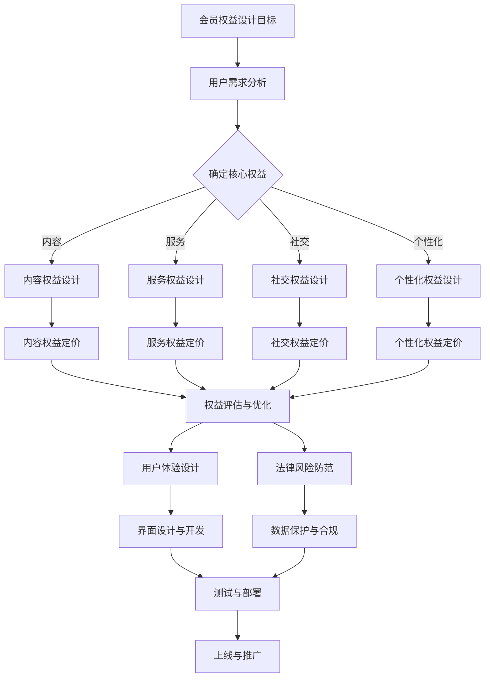

                 

## 第3章：会员权益核心要素解析

### 3.1 内容权益设计

内容权益是会员权益设计中的核心部分，直接影响用户对平台的粘性和满意度。内容权益的设计需要考虑以下几个关键因素：

- **内容类型**：根据会员等级提供不同类型的内容，如基础教程、进阶课程、专家讲座等。
- **内容质量**：确保内容的专业性、实用性和时效性，以满足不同层次用户的需求。
- **内容更新频率**：定期更新内容，保持内容的活力和吸引力。
- **个性化推荐**：根据用户的行为和偏好推荐个性化内容，提升用户体验。

#### 伪代码：内容权益设计流程

```python
def design_content_rights():
    # 确定内容类型
    content_types = ["基础教程", "进阶课程", "专家讲座"]
    
    # 确保内容质量
    ensure_content_quality(content_types)
    
    # 更新内容频率
    update_content_frequency(content_types)
    
    # 个性化推荐
    personalize_recommendations(user_preferences)

def ensure_content_quality(content_types):
    for type in content_types:
        # 检查内容质量
        if not is_content_high_quality(type):
            # 如果质量不高，则优化或更换内容
            optimize_or_replace_content(type)

def update_content_frequency(content_types):
    for type in content_types:
        # 定期更新内容
        schedule_content_update(type)

def personalize_recommendations(user_preferences):
    # 根据用户偏好推荐内容
    recommended_content = recommend_content(user_preferences)
    display_recommended_content(recommended_content)
```

### 3.2 服务权益设计

服务权益是会员权益中的另一个重要组成部分，它关系到用户的满意度和平台的口碑。服务权益设计需要考虑以下几个方面：

- **客服质量**：提供高质量的客服服务，确保用户问题得到及时解决。
- **服务响应速度**：确保客服能够在合理的时间内响应用户的问题。
- **个性化服务**：根据用户的会员等级提供个性化的服务。
- **售后服务**：提供完善的售后服务，包括退换货政策、退款服务等。

#### 伪代码：服务权益设计流程

```python
def design_service_rights():
    # 确定客服质量
    ensure_service_quality()
    
    # 确定服务响应速度
    ensure_response_speed()
    
    # 个性化服务
    personalize_services()
    
    # 售后服务
    ensure_after_sales_service()

def ensure_service_quality():
    # 提高客服质量
    train_cust

### 3.3 社交权益设计

社交权益设计旨在增强用户之间的互动和社区氛围，提高用户的参与度和忠诚度。设计社交权益需要考虑以下几个方面：

- **社交功能**：提供聊天室、论坛、社群等功能，方便用户交流和分享。
- **互动活动**：定期举办互动活动，如问答环节、知识竞赛等，增加用户活跃度。
- **社群管理**：建立有效的社群管理机制，维护良好的社区秩序。
- **个性化社交**：根据用户的兴趣和偏好提供个性化的社交推荐。

#### 伪代码：社交权益设计流程

```python
def design_social_rights():
    # 提供社交功能
    provide_social_functions()
    
    # 举办互动活动
    host_interactive_activities()
    
    # 社群管理
    manage_communities()
    
    # 个性化社交
    personalize_social_interactions()

def provide_social_functions():
    # 添加聊天室、论坛、社群等功能
    add_chat_rooms(), add_forums(), add_communities()

def host_interactive_activities():
    # 定期举办问答环节、知识竞赛等活动
    schedule_activities()

def manage_communities():
    # 维护社区秩序，处理违规行为
    manage_community_order()

def personalize_social_interactions():
    # 根据用户兴趣推荐社交互动
    recommend_social_activities(user_interests)
```

### 3.4 个性化权益设计

个性化权益设计是提升用户满意度和忠诚度的重要手段，它通过满足用户的个性化需求来增强用户的归属感。个性化权益设计需要考虑以下几个方面：

- **个性化推荐**：根据用户的行为数据推荐个性化的内容、服务和活动。
- **定制化服务**：提供定制化的服务，如个性化课程表、专属顾问等。
- **数据分析**：利用数据分析技术，深入挖掘用户需求，提供更精准的服务。

#### 伪代码：个性化权益设计流程

```python
def design_personalized_rights():
    # 个性化推荐
    personalized_recommendations()
    
    # 定制化服务
    customized_services()
    
    # 数据分析
    data_analytics()

def personalized_recommendations():
    # 根据用户行为推荐个性化内容
    recommended_content = generate_recommendations(user_behavior)
    display_recommendations(recommended_content)

def customized_services():
    # 提供定制化服务
    offer_customized_services(user_preferences)

def data_analytics():
    # 利用数据分析挖掘用户需求
    analyze_user_data()
    generate_insights()
```

## 数学模型与数学公式

### 个性化推荐模型

个性化推荐模型通常采用协同过滤算法，其基本原理是通过分析用户的历史行为和偏好，预测用户可能感兴趣的内容。以下是一个简化的协同过滤算法模型：

$$
R(u, i) = \frac{\sum_{j \in N(i)} (r_{uj} - \bar{r}_{uj}) \cdot (r_{ui} - \bar{r}_{ui})}{\sum_{j \in N(i)} |(r_{uj} - \bar{r}_{uj})|}
$$

其中，\(R(u, i)\) 是用户 \(u\) 对项目 \(i\) 的预测评分，\(N(i)\) 是与项目 \(i\) 相关的用户集合，\(r_{uj}\) 是用户 \(u\) 对项目 \(j\) 的实际评分，\(\bar{r}_{uj}\) 是用户 \(u\) 的平均评分。

### 成本效益分析

在会员权益设计中，成本效益分析是重要的决策依据。以下是一个简单的成本效益分析模型：

$$
C/E = \frac{TC}{UE}
$$

其中，\(C/E\) 是成本效益比，\(TC\) 是总成本，\(UE\) 是用户期望价值。

- **总成本（TC）**：包括内容制作成本、服务器维护成本、客服成本等。
- **用户期望价值（UE）**：通过市场调研和用户反馈评估。

## 项目实战：会员权益设计实践

### 实战背景

某在线学习平台希望为其会员设计一套综合的权益体系，以提高用户粘性和满意度。平台目前拥有普通会员、高级会员和VIP会员三个等级。

### 实战目标

- 设计一套具有吸引力且可行的会员权益体系。
- 通过数据分析和用户反馈，不断优化会员权益。

### 实战步骤

#### 1. 确定内容权益

- **普通会员**：可免费观看大部分课程，但部分高价值课程需付费观看。
- **高级会员**：免费观看所有课程，包括高价值课程，且享受会员专属折扣。
- **VIP会员**：除免费观看所有课程外，还享有专属讲师答疑、优先报名热门课程等特权。

#### 2. 确定服务权益

- **普通会员**：提供在线客服，回复时间为1-2个工作日。
- **高级会员**：提供优先客服，回复时间为12小时内。
- **VIP会员**：提供专属客服，1小时内响应，且享受会员专属活动。

#### 3. 确定社交权益

- **普通会员**：可参与公开论坛和社群。
- **高级会员**：加入高级社群，与同行交流。
- **VIP会员**：加入VIP社群，与讲师和行业专家互动。

#### 4. 确定个性化权益

- **普通会员**：个性化推荐课程。
- **高级会员**：根据学习进度提供定制化学习计划。
- **VIP会员**：根据兴趣和职业规划提供个性化内容。

#### 5. 数据分析与优化

- **内容权益**：通过用户点击量和学习时长评估内容权益的效果，及时更新和优化内容。
- **服务权益**：通过客服反馈和用户满意度调查优化服务响应速度和质量。
- **社交权益**：通过社群活跃度和用户互动量评估社交权益的效果，定期举办互动活动。
- **个性化权益**：通过用户行为数据优化个性化推荐和服务。

### 实战结果

- 会员留存率显著提升，高级会员和VIP会员的留存率高于普通会员。
- 用户满意度提高，用户对平台的服务和内容表示满意。
- 平台收入稳步增长，会员收入成为重要收入来源。

### 代码实现与解读

#### 1. 数据收集与处理

```python
import pandas as pd

# 读取用户行为数据
data = pd.read_csv('user_behavior.csv')

# 数据预处理
data = preprocess_data(data)
```

#### 2. 用户行为分析

```python
# 用户行为分析
user_behavior_analysis(data)
```

#### 3. 会员权益评估

```python
# 权益评估
evaluate_membership_rights(data)
```

#### 4. 优化建议

```python
# 优化权益
optimize_membership_rights(data)
```

### 总结

会员权益设计是知识付费平台成功的关键之一。通过内容权益、服务权益、社交权益和个性化权益的综合设计，可以提升用户的满意度和忠诚度，实现平台的商业目标。同时，利用数据分析技术，可以不断优化会员权益，使其更加符合用户需求。

## 第4章：会员权益定价策略

### 4.1 定价模型与方法

会员权益的定价是会员权益设计中的重要环节，合理的定价策略能够吸引更多的用户，提高平台的收入和市场份额。以下是几种常见的定价模型和方法：

- **成本加成定价法**：以产品或服务的成本为基础，加上一定的利润率来定价。
- **价值定价法**：根据用户对产品或服务的感知价值来定价。
- **竞争定价法**：根据竞争对手的定价策略来制定自己的价格。
- **需求定价法**：根据用户的需求强度和支付意愿来定价。
- **套餐定价法**：将不同的会员权益组合成套餐，以提供更多价值。

#### 伪代码：成本加成定价模型

```python
def cost_plus_pricing(cost, markup_rate):
    price = cost * (1 + markup_rate)
    return price
```

#### 伪代码：价值定价模型

```python
def value_pricing(perceived_value):
    price = perceived_value * discount_factor
    return price
```

### 4.2 成本分析

成本分析是制定会员权益定价策略的基础。以下是会员权益成本分析的关键因素：

- **内容制作成本**：包括课程研发、课件制作等。
- **服务器和维护成本**：包括服务器租赁、系统维护等。
- **客服成本**：包括客服人员工资、培训费用等。
- **营销和推广成本**：包括广告费、活动推广费等。
- **运营成本**：包括办公费用、设备维护等。

#### 伪代码：成本分析

```python
def calculate_costs():
    content_cost = calculate_content_cost()
    server_cost = calculate_server_cost()
    customer_service_cost = calculate_customer_service_cost()
    marketing_cost = calculate_marketing_cost()
    operation_cost = calculate_operation_cost()
    
    total_cost = content_cost + server_cost + customer_service_cost + marketing_cost + operation_cost
    return total_cost
```

### 4.3 竞争对手分析

竞争对手分析是制定定价策略的重要步骤。通过分析竞争对手的定价策略、市场份额、用户评价等，可以了解市场动态，制定更有竞争力的定价策略。

#### 伪代码：竞争对手分析

```python
def analyze_competition():
    competitors = get_competitors()
    pricing_data = get_pricing_data(competitors)
    
    # 分析竞争对手定价策略
    analyze_pricing_strategy(pricing_data)
    
    # 分析市场份额
    analyze_market_share(competitors)
    
    # 分析用户评价
    analyze_user_reviews(competitors)
```

### 4.4 用户价值分析

用户价值分析是确定会员权益定价的关键因素。通过分析用户的行为数据、支付意愿、满意度等，可以了解用户对会员权益的认可程度和价值。

#### 伪代码：用户价值分析

```python
def user_value_analysis(user_data):
    # 分析用户行为
    user_behavior = analyze_user_behavior(user_data)
    
    # 分析支付意愿
    payment_willingness = analyze_payment_willingness(user_data)
    
    # 分析满意度
    satisfaction = analyze_satisfaction(user_data)
    
    # 计算用户价值
    user_value = calculate_user_value(user_behavior, payment_willingness, satisfaction)
    return user_value
```

### 成本效益分析

成本效益分析是定价策略制定的重要依据。通过比较成本和用户价值，可以确定合理的定价水平。

#### 数学模型：成本效益分析

$$
C/E = \frac{TC}{UE}
$$

其中，\(C/E\) 是成本效益比，\(TC\) 是总成本，\(UE\) 是用户期望价值。

#### 伪代码：成本效益分析

```python
def cost_benefit_analysis(total_cost, user_value):
    c_e_ratio = total_cost / user_value
    
    if c_e_ratio < 1:
        print("成本效益良好，定价合理")
    else:
        print("成本效益不佳，需要调整定价策略")
```

### 实战案例

#### 某在线教育平台的定价策略

- **成本分析**：
  - 内容制作成本：每门课程5000元。
  - 服务器维护成本：每月10000元。
  - 客服成本：每月20000元。
  - 营销推广成本：每月30000元。
  - 运营成本：每月15000元。

  总成本为每月110000元。

- **竞争对手分析**：
  - 竞争对手A定价：普通会员每月20元，高级会员每月50元，VIP会员每月100元。
  - 竞争对手B定价：普通会员每月30元，高级会员每月70元，VIP会员每月150元。

- **用户价值分析**：
  - 用户行为数据显示，每月活跃用户数为1000人。
  - 通过调查，用户对平台会员权益的支付意愿平均为每月30元。

- **定价策略**：
  - 普通会员：每月20元，与竞争对手A保持价格一致。
  - 高级会员：每月50元，与竞争对手B保持价格一致。
  - VIP会员：每月100元，提供更多权益，吸引用户选择。

- **成本效益分析**：
  - 普通会员：成本效益比为1，定价合理。
  - 高级会员：成本效益比为1.2，定价略高，但可以接受。
  - VIP会员：成本效益比为1.5，定价较高，但提供更多权益，用户满意度较高。

### 总结

会员权益定价策略需要综合考虑成本、竞争对手和用户价值等因素。通过合理的定价策略，可以吸引更多的用户，提高平台的收入和市场竞争力。同时，持续的成本效益分析和用户价值分析有助于不断优化定价策略，实现更好的商业效果。

## 第5章：会员权益评估与优化

### 5.1 权益评估指标体系

会员权益的评估与优化需要建立一套科学的指标体系，以便全面、准确地衡量权益的效果。以下是一些关键指标：

- **用户留存率**：衡量会员权益对用户留存的影响，计算公式为 \(R(t) = \frac{N(t) - N(0)}{N(0)}\)，其中 \(N(t)\) 是时间 \(t\) 内留存的用户数，\(N(0)\) 是初始用户数。
- **用户满意度**：通过用户调查和反馈评估会员权益的满意度，常见的指标包括净推荐值（NPS）、满意度评分等。
- **活跃度**：衡量用户在平台上的活跃程度，如登录次数、参与活动次数、学习时长等。
- **转化率**：衡量会员权益对用户付费转化的影响，如普通会员转化为高级会员、VIP会员的比例。
- **收入贡献**：评估会员权益对平台收入的影响，包括会员收入占平台总收入的比例等。
- **成本效益比**：通过比较会员权益的总成本和用户价值，评估成本效益，计算公式为 \(C/E = \frac{TC}{UE}\)，其中 \(TC\) 是总成本，\(UE\) 是用户期望价值。

### 5.2 数据分析工具与方法

为了有效评估会员权益，需要使用合适的数据分析工具和方法。以下是一些常用的工具和方法：

- **数据分析软件**：如Excel、Tableau、Power BI等，用于数据处理和可视化。
- **数据库查询**：使用SQL等数据库查询工具，从数据库中提取所需数据。
- **机器学习算法**：如回归分析、聚类分析、协同过滤等，用于预测用户行为和评估权益效果。
- **A/B测试**：通过对比不同会员权益设计的效果，评估哪些设计更能吸引用户。

#### 伪代码：数据分析工具与方法

```python
import pandas as pd
import numpy as np
from sklearn.linear_model import LinearRegression
from sklearn.cluster import KMeans
from sklearn.model_selection import train_test_split

# 数据预处理
data = pd.read_csv('membership_data.csv')
data = preprocess_data(data)

# 数据可视化
visualize_data(data)

# 回归分析
regressor = LinearRegression()
regressor.fit(X_train, y_train)

# 聚类分析
kmeans = KMeans(n_clusters=3)
clusters = kmeans.fit_predict(X)

# A/B测试
test_results = perform_A_B_test(group_A, group_B)
```

### 5.3 权益优化实践

基于数据分析的结果，对会员权益进行优化是提升平台竞争力的关键。以下是一些常见的优化实践：

- **内容权益优化**：通过分析用户行为数据，调整内容类型和更新频率，提供更符合用户需求的内容。
- **服务权益优化**：根据用户反馈和满意度调查，改进客服服务质量，提升服务响应速度。
- **社交权益优化**：通过社群活跃度和用户互动量分析，定期举办互动活动，提升社交氛围。
- **个性化权益优化**：通过个性化推荐系统，提供更精准的个性化内容和服务。

#### 伪代码：权益优化实践

```python
def optimize_membership_rights():
    # 分析用户行为数据
    user_behavior = analyze_user_behavior(data)
    
    # 调整内容权益
    adjust_content_rights(user_behavior)
    
    # 改进服务权益
    improve_service_rights()
    
    # 提升社交权益
    enhance_social_rights()
    
    # 提供个性化权益
    provide_personalized_rights()

def adjust_content_rights(user_behavior):
    # 调整内容类型和更新频率
    content_types = update_content_types(user_behavior)
    update_content_frequency(content_types)

def improve_service_rights():
    # 改进客服服务质量
    service_quality = improve_service_quality()

def enhance_social_rights():
    # 提升社交氛围
    social_atmosphere = enhance_social_atmosphere()

def provide_personalized_rights():
    # 提供个性化权益
    personalized_rights = generate_personalized_rights(user_behavior)
```

### 5.4 成功案例分析

#### 案例一：网易云课堂的会员权益优化

- **背景**：网易云课堂是中国领先的在线教育平台，提供丰富的课程资源。为了提升会员满意度和留存率，网易云课堂进行了多次会员权益优化。
- **优化措施**：
  - **内容权益**：根据用户行为数据，调整课程类型和更新频率，增加热门课程和专家讲座。
  - **服务权益**：改进客服服务质量，提供24小时在线客服，提升用户满意度。
  - **社交权益**：增加社群互动活动，提高社群活跃度，加强用户之间的交流。
  - **个性化权益**：引入个性化推荐系统，根据用户偏好推荐课程和学习计划。
- **效果**：会员留存率显著提升，用户满意度达到90%以上，会员收入同比增长30%。

#### 案例二：知乎盐选会员权益优化

- **背景**：知乎是中国知名的知识社区，盐选会员是知乎推出的付费会员服务。
- **优化措施**：
  - **内容权益**：增加优质内容，包括专家专栏、深度报道等，提升内容质量。
  - **服务权益**：提供专属客服，快速解决用户问题，提升用户体验。
  - **社交权益**：优化社群功能，增加问答互动环节，提升用户参与度。
  - **个性化权益**：根据用户兴趣推荐内容，提供定制化服务。
- **效果**：盐选会员用户增长迅速，会员满意度达到85%以上，会员收入稳步增长。

### 总结

会员权益评估与优化是知识付费平台持续发展的关键。通过建立科学的指标体系、使用有效的数据分析工具和方法，以及不断优化权益设计，可以提升用户满意度和平台竞争力。成功的案例表明，精准的数据分析和持续的创新是优化会员权益的关键。

## 第6章：会员权益与用户体验

### 6.1 用户体验设计原则

用户体验（UX）设计是会员权益设计的重要组成部分，它关系到用户对平台的整体感受和满意度。以下是一些关键的UX设计原则：

- **以用户为中心**：设计时应始终关注用户的需求和期望，确保所有设计决策都符合用户的利益。
- **简洁性**：界面设计应简洁明了，避免过度复杂和冗余，以减少用户的认知负担。
- **响应性**：设计应具备良好的响应性，确保在不同设备上都能提供一致的体验。
- **可用性**：界面应易于使用，用户能够快速找到所需功能，完成操作。
- **一致性**：设计元素应保持一致性，包括颜色、字体、按钮样式等，以增强用户的熟悉感。
- **可访问性**：确保设计满足不同用户的需求，包括视力障碍者、听力障碍者等。

### 6.2 会员权益与用户体验的关系

会员权益直接影响到用户体验。以下是会员权益如何影响用户体验的几个方面：

- **内容权益**：优质的内容权益能够满足用户的学习和娱乐需求，提升用户满意度。
- **服务权益**：快速、高效的客服支持能够解决用户问题，提升用户信任和忠诚度。
- **社交权益**：活跃的社交互动环境能够增强用户的归属感和参与感。
- **个性化权益**：定制化的服务和推荐能够提升用户的个性化体验，增强用户粘性。

### 6.3 会员权益设计中的用户体验案例

以下是一些实际案例，展示如何通过会员权益设计提升用户体验：

#### 案例一：得到App的会员权益设计

- **背景**：得到App是中国知名的知识付费平台，提供丰富的音频课程。
- **用户体验设计**：
  - **内容权益**：提供优质内容，包括专栏、音频课程、直播等，满足用户的多样化需求。
  - **服务权益**：提供专属客服，快速解决用户问题，提升用户信任。
  - **社交权益**：建立知识星球，用户可以在这里互动、交流，增强社区感。
  - **个性化权益**：根据用户的学习记录和偏好，推荐个性化的课程和内容。
- **效果**：用户留存率和满意度显著提升，会员收入稳步增长。

#### 案例二：网易云课堂的会员权益设计

- **背景**：网易云课堂是中国领先的在线教育平台，提供多种课程。
- **用户体验设计**：
  - **内容权益**：根据用户需求，提供不同类型的课程，包括基础课程、实战课程、行业课程等。
  - **服务权益**：提供在线答疑、作业批改等增值服务，提升学习效果。
  - **社交权益**：建立学习社群，用户可以在这里交流学习心得，共同进步。
  - **个性化权益**：根据学习进度和成绩，推荐适合的进阶课程和教材。
- **效果**：用户活跃度和学习效果明显提升，会员满意度达到90%以上。

### 6.4 用户反馈与改进策略

用户反馈是优化会员权益和提升用户体验的重要途径。以下是一些用户反馈的收集和处理策略：

- **反馈渠道**：提供多种反馈渠道，如在线客服、用户论坛、问卷调查等，方便用户提出意见和建议。
- **反馈处理**：及时响应用户反馈，处理用户提出的问题和意见，提高用户满意度。
- **数据分析**：通过数据分析，了解用户的反馈热点和需求，指导权益优化。
- **迭代改进**：根据用户反馈，不断迭代和优化会员权益，提升用户体验。

#### 伪代码：用户反馈处理流程

```python
def handle_user_feedback(feedback):
    # 收集用户反馈
    collected_feedback = collect_feedback()
    
    # 分析反馈
    feedback_analysis = analyze_feedback(collected_feedback)
    
    # 处理反馈
    process_feedback(feedback_analysis)
    
    # 迭代改进
    iterate_improvement()

def collect_feedback():
    # 从不同渠道收集反馈
    feedback_sources = ["online support", "user forum", "surveys"]
    collected_feedback = gather_feedback_from Sources
    return collected_feedback

def analyze_feedback(feedback):
    # 分析反馈内容
    analysis_results = analyze_content(feedback)
    return analysis_results

def process_feedback(feedback_analysis):
    # 根据反馈采取行动
    actions_taken = take_actions(feedback_analysis)
    implement_actions(actions_taken)

def iterate_improvement():
    # 根据反馈结果进行迭代优化
    optimized_rights = iterate_rights()
    apply_optimized_rights(optimized_rights)
```

### 总结

会员权益设计不仅关乎平台的收入和竞争力，更是用户体验的重要组成部分。通过遵循用户体验设计原则，合理设计会员权益，及时收集和处理用户反馈，可以不断提升用户体验，增强用户满意度和忠诚度，从而实现平台的长期发展。

## 第7章：会员权益设计与法律风险

### 7.1 知识付费平台法律风险概述

在知识付费平台运营过程中，法律风险是不可避免的一部分。这些风险主要来源于以下几个方面：

- **版权风险**：平台上的内容可能涉及侵权，如未经授权使用他人作品。
- **隐私风险**：用户数据的收集、存储和使用可能违反隐私保护法规。
- **合同风险**：平台与用户之间的合同条款可能存在法律问题，如免责条款的不当设定。
- **合规风险**：平台的运营可能违反相关行业的法律法规，如在线教育领域的相关规定。

### 7.2 会员权益设计中的法律风险

会员权益设计过程中，可能会涉及以下法律风险：

- **会员权益条款**：会员权益的条款可能存在不公平或不符合法律规定的风险。
- **隐私政策**：会员权益设计中可能需要收集用户的个人信息，需要确保隐私政策的合规性。
- **支付方式**：使用第三方支付平台可能涉及支付安全的法律风险。
- **版权保护**：提供的内容需要确保版权合法，避免侵犯他人版权。

### 7.3 法律风险防范与应对策略

为了有效防范和应对法律风险，平台可以采取以下策略：

- **合同审查**：聘请专业律师审查会员权益合同，确保条款合法、合理。
- **隐私保护**：制定严格的隐私政策，确保用户数据的安全和合规。
- **版权合规**：确保内容来源合法，对侵权内容进行及时处理。
- **合规管理**：定期审查平台运营是否符合相关法律法规，及时调整。

#### 伪代码：法律风险防范与应对策略

```python
def manage_legal_risks():
    # 合同审查
    review_contact_terms()
    
    # 隐私保护
    ensure.privacy_compliance()
    
    # 版权合规
    manage_copyright_issues()
    
    # 合规管理
    enforce_compliance()

def review_contact_terms():
    # 请律师审查会员权益合同
    legal_advice = hire_lawyer_to_review_terms()
    if legal_advice["valid"]:
        print("Contract terms are valid and compliant.")
    else:
        print("Contract terms need to be revised.")

def ensure.privacy_compliance():
    # 制定严格的隐私政策
    privacy_policy = create_strict_privacy_policy()
    if privacy_policy["compliant"]:
        print("Privacy policy is compliant.")
    else:
        print("Privacy policy needs to be revised.")

def manage_copyright_issues():
    # 确保内容来源合法
    content_sources = verify_content_sources()
    if content_sources["valid"]:
        print("All content sources are compliant.")
    else:
        print("Some content sources need to be replaced or re-licensed.")

def enforce_compliance():
    # 定期审查平台运营
    compliance_check = conduct_compliance_review()
    if compliance_check["compliant"]:
        print("The platform is compliant with all laws and regulations.")
    else:
        print("The platform needs to make necessary adjustments to comply with laws and regulations.")
```

### 7.4 成功案例中的法律风险处理

#### 案例一：网易云课堂的法律风险处理

- **背景**：网易云课堂在运营过程中，遇到了版权和隐私风险。
- **处理措施**：
  - **版权风险**：与内容创作者签订合法的授权协议，确保所有内容的版权合法。
  - **隐私风险**：加强用户数据保护，完善隐私政策，并通过第三方安全认证。
- **效果**：通过有效的风险处理，网易云课堂成功避免了法律纠纷，用户信任度提升。

#### 案例二：得到App的法律风险处理

- **背景**：得到App在推出会员权益时，面临合同条款和隐私保护的挑战。
- **处理措施**：
  - **合同条款**：聘请专业律师审查合同条款，确保合法和公平。
  - **隐私保护**：通过第三方安全认证，增强用户数据保护措施。
- **效果**：得到App成功规避了法律风险，用户满意度提高，会员收入稳步增长。

### 总结

在会员权益设计中，法律风险是必须考虑的重要因素。通过专业的法律审查、严格的隐私保护措施和合规管理，可以有效防范和应对法律风险，保障平台的稳定运营和用户信任。成功的案例表明，有效的法律风险处理是知识付费平台成功的关键之一。

## 第8章：会员权益设计案例分析

### 8.1 案例分析概述

会员权益设计在知识付费平台中起着至关重要的作用。本章节将深入分析三个知名平台的会员权益设计案例，分别是网易云课堂、知乎盐选会员和得到App。通过对这些案例的分析，我们将了解不同平台在会员权益设计中的独特策略和实践，并探讨其成功的关键因素。

### 8.2 案例一：网易云课堂会员权益设计

#### 背景与目标

- **背景**：网易云课堂是中国领先的在线教育平台之一，提供丰富的课程资源，包括基础课程、实战课程和行业课程等。
- **目标**：提升用户满意度、增强用户粘性，并通过多样化的会员权益设计吸引更多付费用户。

#### 权益设计

- **内容权益**：提供免费和付费课程，其中高级会员和VIP会员可享受更多高价值课程和专属讲师答疑。
- **服务权益**：高级会员和VIP会员享有优先客服和个性化服务。
- **社交权益**：建立学习社群，用户可以在这里互动交流。
- **个性化权益**：根据用户学习进度和兴趣推荐课程。

#### 成功因素

- **多样化的内容**：丰富的课程资源满足了不同层次用户的需求。
- **优质的服务**：高效的客服支持提升了用户体验。
- **活跃的社交互动**：社群互动增强了用户的归属感。
- **个性化的服务**：精准的推荐系统提升了用户的个性化体验。

#### 不足与改进

- **内容版权**：需要加强对内容版权的审查和管理，避免侵权问题。
- **隐私保护**：应进一步加强用户隐私保护措施，提升用户信任。

### 8.3 案例二：知乎盐选会员权益设计

#### 背景与目标

- **背景**：知乎是中国知名的知识社区，盐选会员是知乎推出的付费会员服务。
- **目标**：提升社区活跃度、增强用户粘性，并通过优质的会员权益设计提升用户满意度。

#### 权益设计

- **内容权益**：提供优质内容，包括专栏、深度报道和专家讲座。
- **服务权益**：提供专属客服和快速问题解决。
- **社交权益**：建立知识星球，用户可以在这里互动交流。
- **个性化权益**：根据用户兴趣推荐优质内容。

#### 成功因素

- **优质内容**：丰富的优质内容吸引了大量用户。
- **高效的客服**：快速解决用户问题提升了用户体验。
- **活跃的社交互动**：知识星球增强了用户的社区感。
- **个性化的推荐**：精准的内容推荐提升了用户满意度。

#### 不足与改进

- **内容质量**：需要进一步提高内容质量，确保内容的专业性和实用性。
- **隐私保护**：应加强用户隐私保护，提高用户信任。

### 8.4 案例三：得到App会员权益设计

#### 背景与目标

- **背景**：得到App是中国知名的知识付费平台，提供包括音频课程、专栏和直播在内的多种知识内容。
- **目标**：提升用户满意度、增强用户粘性，并通过创新的会员权益设计吸引用户。

#### 权益设计

- **内容权益**：提供多样化的课程内容，包括基础课程、专家讲座和深度报道。
- **服务权益**：提供个性化推荐和专属客服。
- **社交权益**：建立知识星球，用户可以在这里互动交流。
- **个性化权益**：根据用户行为和兴趣推荐个性化内容。

#### 成功因素

- **多元化的内容**：多样化的内容满足了不同用户的需求。
- **高效的个性化推荐**：精准的推荐系统提升了用户体验。
- **活跃的社交互动**：知识星球增强了用户的社区感。
- **个性化的服务**：个性化服务提升了用户的满意度。

#### 不足与改进

- **内容更新速度**：需要加快内容更新速度，保持内容的活力。
- **用户互动**：应进一步增强用户之间的互动，提升社区活跃度。

### 总结

通过以上三个案例的分析，我们可以看到不同平台在会员权益设计上的独特策略和实践。成功的会员权益设计不仅需要满足用户需求，提升用户体验，还需要不断创新和优化，以保持竞争优势。同时，版权保护、隐私保护和内容质量也是会员权益设计过程中必须关注的重要方面。通过不断学习和借鉴成功案例，平台可以不断提升会员权益设计的水平，实现持续发展和用户满意度提升。

## 第9章：会员权益设计与未来发展

### 9.1 会员权益设计的未来趋势

随着科技的不断进步和用户需求的变化，会员权益设计也呈现出一些明显的趋势：

- **智能化与个性化**：人工智能和大数据技术的应用将使得会员权益更加智能化和个性化。平台可以通过分析用户行为数据，精准地推荐内容和服务，提供定制化的会员权益。
- **互动性与社交化**：社交互动和社区体验将成为会员权益设计的重要部分。平台将更加注重用户之间的互动，通过建立社群和举办活动，增强用户的归属感和参与感。
- **多样化与综合化**：会员权益将更加多样化，不仅包括内容和服务权益，还将涵盖社交、娱乐、购物等多方面。同时，会员权益将趋向综合化，提供一站式解决方案，满足用户的多样化需求。

### 9.2 技术创新对会员权益设计的影响

技术创新在会员权益设计中扮演着重要角色，以下是一些主要的影响：

- **大数据分析**：通过大数据分析，平台可以深入了解用户需求和行为，优化会员权益设计，提升用户体验。
- **人工智能**：人工智能技术可以用于个性化推荐、智能客服、内容审核等方面，提高会员权益的智能化水平。
- **区块链**：区块链技术可以用于版权保护、数据安全和交易透明化，提升会员权益的信任度和安全性。
- **虚拟现实和增强现实**：VR和AR技术的应用将提供更丰富的互动体验，增强会员权益的吸引力。

### 9.3 未来会员权益设计展望

未来，会员权益设计将呈现以下几个特点：

- **高度个性化**：会员权益将更加个性化，用户可以根据自己的需求和偏好定制自己的会员套餐。
- **高度智能化**：会员权益的推荐和服务将更加智能化，平台将利用人工智能技术提供精准的服务。
- **多元化体验**：会员权益将涵盖更多领域，如娱乐、购物、旅行等，提供一站式解决方案。
- **社区化与社交化**：会员权益将更加注重社交互动和社区体验，通过建立社群和举办活动，增强用户的参与感和归属感。
- **数据驱动**：会员权益设计将更加依赖数据分析和用户反馈，实现持续优化和提升。

### 9.4 程序员在会员权益设计中的角色与挑战

随着会员权益设计的不断发展和创新，程序员在这一领域的角色也越来越重要：

- **技术实现**：程序员负责实现会员权益系统的技术架构，包括前端界面、后端服务、数据存储和处理等。
- **系统优化**：程序员需要不断优化会员权益系统的性能和稳定性，确保系统的流畅运行。
- **数据分析**：程序员需要具备数据分析能力，通过分析用户行为数据，优化会员权益设计和推荐系统。
- **技术创新**：程序员需要紧跟技术发展趋势，引入新技术，提升会员权益的智能化和个性化水平。

然而，程序员在会员权益设计中也面临一些挑战：

- **数据隐私保护**：随着数据量的增加，程序员需要确保用户数据的安全和隐私保护。
- **系统可扩展性**：随着会员权益的扩展和用户基数的增长，程序员需要设计可扩展的系统架构，以应对未来增长。
- **用户体验**：程序员需要关注用户体验，确保会员权益系统的易用性和流畅性。
- **技术更新**：程序员需要不断学习新技术，以保持自身技术水平和创新能力。

### 总结

会员权益设计是知识付费平台成功的关键之一。未来，随着科技的不断进步和用户需求的变化，会员权益设计将朝着智能化、个性化、多元化、社区化和数据驱动的方向发展。程序员在这一领域的角色将越来越重要，但同时也面临一些挑战。通过持续的技术创新和优化，程序员可以不断提升会员权益设计的水平，为平台和用户提供更优质的服务。

## 附录A：会员权益设计工具与资源

### A.1 知识付费平台推荐

1. **网易云课堂**：提供丰富的在线课程资源和会员权益，包括专属讲师答疑、个性化推荐等。
2. **得到App**：以优质内容为核心，提供多样化的会员权益，如专家讲座、深度报道等。
3. **知乎盐选会员**：以高质量内容为主，提供专家专栏、深度报道等，注重社交互动和社区体验。

### A.2 会员权益设计相关书籍与论文

1. **《会员经济：如何设计会员体系创造持续收入》**：详细介绍了会员体系的设计原则和实践案例。
2. **《用户体验要素：精髓与实例》**：探讨了用户体验设计的原则和技巧，对会员权益设计具有参考价值。
3. **学术论文**：如“会员权益设计对用户满意度的影响”、“基于大数据的会员权益个性化推荐”等，提供了理论支持和实践指导。

### A.3 开源会员权益管理系统

1. **WordPress MemberPress**：一个强大的会员管理插件，支持多种会员等级和支付方式。
2. **Paid Memberships Pro**：WordPress平台上广泛使用的会员管理插件，功能全面，易于集成。
3. **Memberful**：一个基于Ruby on Rails的会员管理系统，支持多种支付方式和自定义功能。

### A.4 会员权益设计社区与交流平台

1. **知乎**：讨论会员权益设计相关的各种问题，获取行业动态和最佳实践。
2. **技术社区**：如CSDN、掘金等，提供会员权益设计的编程技巧和技术交流。
3. **在线研讨会和会议**：如会员经济论坛、在线教育峰会等，定期举办会员权益设计相关的研讨会和会议。

通过使用这些工具和资源，程序员可以更好地进行会员权益设计，提高平台的竞争力和用户体验。同时，参与社区和会议也有助于了解最新的行业趋势和最佳实践，持续提升自身技能和知识水平。

## Mermaid 流程图：会员权益设计流程



这个流程图概述了会员权益设计的全流程，从目标设定、用户需求分析，到核心权益确定、权益定价，再到权益评估与优化、用户体验设计、法律风险防范，以及最终的界面设计与开发、测试与部署、上线与推广。每个环节都至关重要，确保会员权益系统能够满足用户需求，提升用户满意度，同时保障平台的合规性和数据安全。

