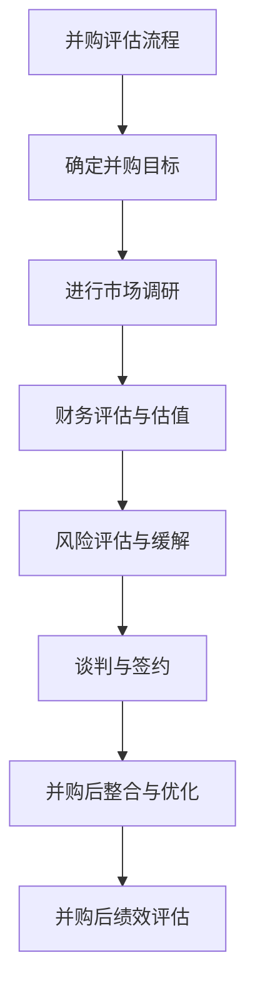

                 

## 文章标题：程序员如何评估并购offer

关键词：程序员，并购，offer评估，市场调研，估值方法，风险分析，谈判策略，整合优化

摘要：本文旨在帮助程序员在职业生涯中更好地评估并购offer。通过详细探讨并购概述、评估方法、实战案例和并购后的整合与优化，本文提供了全面的指导，帮助程序员做出明智的决策。

### 第一部分：并购概述

#### 第一部分：并购概述

在程序员的职业生涯中，并购机会可能成为一个重要的转折点。对于许多程序员来说，这不仅仅是一次职业发展的机会，更是一个能够实现个人价值和公司价值共同提升的重要途径。因此，如何正确评估并购offer，成为程序员们需要掌握的一项关键技能。

## 1.1 并购的定义与意义

并购（Merger and Acquisition，简称M&A）是指一家公司通过购买另一家公司的资产或股权，从而获得对该公司的控制权的行为。并购可以是同一行业内的横向并购，也可以是跨行业的垂直并购或多元化并购。

对程序员而言，并购具有重要的职业意义：

1. **职业发展**：通过并购，程序员可以获得更广阔的职业发展空间，进入更具影响力的公司，甚至成为公司的核心成员。
2. **技能提升**：并购带来的技术整合，可以为程序员提供学习和应用新技术的机会，提升个人的技术能力。
3. **财务收益**：并购成功后，程序员可能通过股票期权等获得丰厚的财务回报。

## 1.2 并购在程序员职业生涯中的重要性

1. **职业机遇**：并购为程序员提供了多样化的职业发展路径，从技术岗位转向管理岗位，甚至成为创业公司的联合创始人。
2. **技能拓展**：参与并购项目，程序员有机会接触到不同领域的业务和技术，实现个人技能的多样化。
3. **市场竞争力**：随着技术的快速更新，程序员的竞争力不仅仅取决于技术深度，还取决于对市场动态的敏感度。并购经验可以提高程序员的综合素质。

### 2. 并购市场概述

#### 2.1 全球并购市场现状

全球并购市场在过去几十年中经历了显著的增长。根据数据统计，全球并购交易额从2010年的约2.2万亿美元增长到2021年的约4.3万亿美元。这一增长趋势主要受到以下几个因素的影响：

1. **经济全球化**：全球化进程加速，企业通过并购进入新市场，扩大业务规模。
2. **技术创新**：互联网、人工智能、大数据等新技术的崛起，推动企业通过并购获取前沿技术。
3. **资本充裕**：低利率环境导致资本充裕，企业有更多的资金进行并购。

#### 2.2 并购趋势与行业特点

1. **技术驱动型并购**：随着技术的快速发展，技术驱动型的并购成为主流。例如，科技巨头在人工智能、云计算等领域的并购活动频繁。
2. **行业整合**：特定行业的整合趋势明显，如医疗、金融科技、新能源等行业。
3. **多元化并购**：企业为了实现业务多元化，开始涉及多个行业的并购，以降低业务风险。

### 3. 并购策略与决策

#### 3.1 并购策略类型

1. **财务并购**：以获取财务利益为主要目的，如企业通过并购获得现金流、资产增值等。
2. **战略并购**：以获取战略资源、技术优势为主要目的，如通过并购进入新市场、获取核心技术等。
3. **控股并购**：仅获得被并购公司部分股权，不取得完全控制权。
4. **合并重组**：两家或多家公司合并，形成新的企业实体。

#### 3.2 并购决策流程

1. **确定并购目标**：明确并购的目的和预期收益，制定并购策略。
2. **市场调研**：对目标公司进行全面的调研，了解其财务状况、市场地位、技术实力等。
3. **估值**：使用市场法、增量和现金流估值等方法对目标公司进行估值。
4. **风险分析**：评估并购过程中可能面临的风险，制定风险缓解策略。
5. **谈判与签约**：进行并购谈判，达成最终协议并签署相关文件。
6. **整合与优化**：并购后对两家公司的业务、文化、组织等进行整合，实现协同效应。

### 总结

第一部分对并购进行了概述，包括其定义与意义、市场现状和并购策略与决策流程。这些内容为程序员评估并购offer提供了基础知识和框架。在接下来的部分，我们将深入探讨并购评估的具体方法，帮助程序员更好地进行决策。

---

### 第二部分：并购评估方法

在程序员职业生涯中，面对并购offer时，正确的评估方法至关重要。这不仅关乎个人的职业发展，还涉及到公司的未来走向。本部分将详细讨论并购评估的方法，包括并购估值、风险分析和谈判策略。

#### 4. 并购估值

并购估值是评估并购offer的核心步骤，它决定了目标公司的市场价值。以下是一些常见的并购估值方法：

##### 4.1 市场法估值

市场法估值是通过比较类似公司的市场交易价格来确定目标公司的价值。这种方法主要依赖于以下几种估值方法：

###### 4.1.1 相对估值法

相对估值法是最常用的市场法估值方法之一。它通过比较目标公司与同行业类似公司的价格/收入比、市盈率等指标，来确定目标公司的估值。

$$
\text{公司价值} = \frac{\text{类似公司市盈率} \times \text{目标公司净利润}}{\text{类似公司市盈率}}
$$

相对估值法的优点在于其简单易用，但缺点是它依赖于类似公司的交易数据，且难以准确反映目标公司的独特价值。

###### 4.1.2 成本法

成本法是通过计算目标公司的资产总值，减去负债，来确定其估值。这种方法主要适用于资产密集型公司。

$$
\text{公司价值} = \text{总资产} - \text{总负债}
$$

成本法的优点在于其直接、客观，但缺点是它可能无法准确反映目标公司的盈利能力和未来发展潜力。

###### 4.1.3 重置成本法

重置成本法是通过计算重建或替换目标公司的资产所需的成本，来确定其估值。这种方法主要适用于资产老化或面临淘汰的公司。

$$
\text{公司价值} = \text{重置成本} - \text{累计折旧}
$$

重置成本法的优点在于其能够准确反映目标公司的资产价值，但缺点是它可能忽略了市场对公司的认可。

##### 4.2 增量现金流估值

增量现金流估值是通过预测目标公司的未来现金流，并对其进行折现，来确定其现值。这种方法主要依赖于以下两种估值方法：

###### 4.2.1 折现现金流估值（DCF）

折现现金流估值（Discounted Cash Flow，简称DCF）是最常用的增量现金流估值方法。它通过预测目标公司的未来现金流，并使用加权平均资本成本（WACC）进行折现，来确定目标公司的现值。

$$
\text{公司价值} = \sum_{t=1}^{n} \frac{\text{CFt}}{(1 + \text{WACC})^t}
$$

其中，\( CFt \) 是第 t 年的预期现金流，\( WACC \) 是加权平均资本成本。

DCF 估值的优点在于其能够准确反映目标公司的未来盈利能力和市场风险，但缺点是它依赖于对未来现金流的准确预测。

###### 4.2.2 增量现金流分析

增量现金流分析是通过比较并购前后的现金流变化，来确定并购的增量收益。这种方法主要依赖于以下公式：

$$
\text{增量现金流} = \text{并购后的现金流} - \text{并购前的现金流}
$$

增量现金流分析的优点在于其能够直观地反映并购带来的收益，但缺点是它可能忽略了并购过程中的成本和风险。

##### 4.3 其他估值方法

除了上述方法外，还有一些其他估值方法，如收益倍数法、经济增加值法等。这些方法各有优缺点，适用于不同的并购场景。

#### 5. 并购风险分析

并购风险分析是评估并购offer的重要步骤，它帮助程序员了解并购过程中可能面临的风险。以下是一些常见的并购风险：

1. **市场风险**：市场环境的变化可能对并购后的公司产生不利影响，如市场需求下降、竞争加剧等。
2. **财务风险**：目标公司的财务状况可能存在不确定性，如盈利能力下降、负债水平过高等。
3. **运营风险**：目标公司的运营能力可能存在问题，如管理体系不健全、员工流失等。
4. **法律风险**：并购过程中可能涉及法律纠纷，如知识产权纠纷、合同纠纷等。
5. **文化风险**：目标公司的企业文化可能与并购方存在差异，导致整合困难。

为了降低并购风险，可以采取以下措施：

1. **尽职调查**：对目标公司进行全面尽职调查，了解其真实财务状况、运营能力和市场地位。
2. **风险管理**：制定详细的风险管理计划，包括风险识别、评估和应对措施。
3. **谈判策略**：在并购谈判中，争取合理的估值和条款，降低并购风险。

##### 5.1 风险类型与评估

1. **财务风险**：评估目标公司的财务报表，分析其盈利能力、负债水平和现金流状况。可以使用以下指标进行评估：

   - **净利润率**：衡量公司的盈利能力。
   - **负债率**：衡量公司的负债水平。
   - **现金流比率**：衡量公司的现金流状况。

   评估公式如下：

   $$
   \text{净利润率} = \frac{\text{净利润}}{\text{销售收入}}
   $$

   $$
   \text{负债率} = \frac{\text{负债}}{\text{资产}}
   $$

   $$
   \text{现金流比率} = \frac{\text{经营活动现金流}}{\text{销售收入}}
   $$

2. **市场风险**：分析目标公司所在市场的竞争态势、市场需求和行业趋势。可以使用以下指标进行评估：

   - **市场份额**：衡量公司在市场中的竞争力。
   - **需求增长率**：衡量市场需求的增长趋势。
   - **竞争程度**：衡量市场竞争的激烈程度。

   评估公式如下：

   $$
   \text{市场份额} = \frac{\text{公司销售收入}}{\text{市场总销售收入}}
   $$

   $$
   \text{需求增长率} = \frac{\text{当前市场需求} - \text{基年市场需求}}{\text{基年市场需求}}
   $$

   $$
   \text{竞争程度} = \frac{\text{竞争对手数量}}{\text{市场参与者数量}}
   $$

3. **运营风险**：评估目标公司的运营能力，包括管理体系、员工素质、供应链稳定性等。可以使用以下指标进行评估：

   - **员工流失率**：衡量员工的稳定性。
   - **供应链稳定性**：衡量供应链的可靠性。
   - **管理体系成熟度**：衡量公司的管理水平。

   评估公式如下：

   $$
   \text{员工流失率} = \frac{\text{离职员工数量}}{\text{在职员工总数}}
   $$

   $$
   \text{供应链稳定性} = \frac{\text{供应链中断天数}}{\text{总运营天数}}
   $$

   $$
   \text{管理体系成熟度} = \frac{\text{管理流程完善度}}{\text{最大管理流程完善度}}
   $$

##### 5.2 风险缓解策略

为了缓解并购风险，可以采取以下策略：

1. **尽职调查**：在并购前对目标公司进行全面尽职调查，了解其真实状况，降低信息不对称风险。
2. **合同条款**：在并购合同中设置合理的条款，包括估值条款、付款条款、违约条款等，保障并购双方的权益。
3. **整合规划**：在并购后制定详细的整合规划，包括业务整合、文化整合、组织整合等，降低整合风险。
4. **风险管理团队**：组建专业的风险管理团队，负责识别、评估和应对并购风险。

#### 6. 并购谈判策略

并购谈判是评估并购offer的关键环节，它决定了并购能否成功进行。以下是一些谈判策略：

##### 6.1 谈判原则与技巧

1. **坦诚沟通**：在谈判过程中，保持坦诚和开放的态度，充分表达自己的想法和需求。
2. **利益平衡**：在谈判中寻求双方利益的平衡，避免过于强调单方面的利益。
3. **利益捆绑**：将双方利益捆绑在一起，使双方在并购后共同面对风险和挑战。
4. **合理报价**：根据目标公司的估值和双方利益，提出合理的报价。
5. **灵活应对**：在谈判中保持灵活，针对对方的要求和策略，及时调整自己的策略。

##### 6.2 谈判中常见问题与解决方案

1. **估值分歧**：解决方法：通过提供更多的数据和证据，说服对方接受合理的估值。
2. **合同条款争议**：解决方法：在合同谈判中，提前沟通并明确双方的权利和义务，避免产生争议。
3. **整合难度**：解决方法：在谈判中提出具体的整合方案，降低对方的顾虑。
4. **文化冲突**：解决方法：在谈判中强调双方文化的互补性，并提出文化整合的策略。

#### 6.3 谈判策略与技巧

1. **策略制定**：在谈判前，制定详细的谈判策略，包括目标、步骤、预期成果等。
2. **信息准备**：收集目标公司的相关信息，包括财务状况、市场地位、运营能力等，为谈判提供有力支持。
3. **谈判团队**：组建专业的谈判团队，负责谈判的具体实施，确保谈判的顺利进行。
4. **持续沟通**：在谈判过程中，保持与对方的持续沟通，了解对方的立场和需求，寻找双方的利益契合点。

#### 6.4 谈判中的心理博弈

1. **心理准备**：在谈判前，做好心理准备，保持冷静和自信，避免被对方的情绪所影响。
2. **情绪控制**：在谈判中，学会控制自己的情绪，避免因为情绪波动而影响谈判的进程。
3. **对方立场分析**：在谈判中，分析对方的立场和动机，找出对方的利益点和弱点，为谈判创造有利条件。

#### 6.5 谈判中的案例分析

以下是一个并购谈判的案例分析：

- **案例背景**：一家科技公司计划并购一家初创企业，该初创企业在人工智能领域有独特的技术优势。
- **谈判过程**：
  1. **初轮谈判**：科技公司提出初步报价，初创企业认为报价偏低，双方产生分歧。
  2. **深入沟通**：双方进行了多轮深入沟通，科技公司提供了更多的数据和信息，说服初创企业接受合理的估值。
  3. **合同谈判**：双方就合同条款进行了详细的谈判，最终达成一致。
- **谈判结果**：并购谈判成功，科技公司获得了初创企业的技术和人才，实现了业务扩展。

通过以上案例，我们可以看到，在并购谈判中，沟通、数据和策略的运用是关键。只有通过充分准备和有效谈判，才能实现双方的利益最大化。

### 总结

第二部分详细介绍了并购评估的方法，包括并购估值、风险分析和谈判策略。这些方法帮助程序员全面评估并购offer，为决策提供有力支持。在接下来的部分，我们将通过实战案例，进一步探讨并购评估的实践应用。

---

### 第三部分：实战案例

在并购评估的过程中，理论知识固然重要，但实际操作中的经验同样宝贵。通过分析真实的并购案例，我们可以更好地理解并购评估的方法和技巧。本部分将介绍两个典型的并购案例，并详细分析并购评估的过程和结果。

#### 7. 并购案例解析

#### 7.1 案例背景

**案例一：微软并购LinkedIn**

在2016年，微软宣布以260亿美元的价格收购LinkedIn，这是微软历史上第二大并购交易。此次并购的背景和动机如下：

1. **背景**：LinkedIn是全球最大的职业社交平台，拥有数亿用户。微软希望通过并购LinkedIn，扩展其在企业社交和人力资源管理领域的业务。
2. **动机**：
   - **技术整合**：LinkedIn的数据分析和人工智能技术可以与微软的云服务和大数据平台相结合，提升微软在人工智能和数据分析领域的竞争力。
   - **市场扩展**：LinkedIn的全球用户基础可以帮助微软进一步扩大其商业客户群，提高市场份额。

**案例二：谷歌并购YouTube**

在2006年，谷歌以16.5亿美元的价格收购了YouTube，这是一笔具有里程碑意义的并购交易。案例背景和动机如下：

1. **背景**：YouTube是一个新兴的视频分享平台，以其独特的用户生成内容（UGC）模式迅速吸引了大量用户。谷歌希望通过并购YouTube，增强其在互联网广告市场的影响力。
2. **动机**：
   - **内容生态**：YouTube的内容丰富多样，可以吸引更多用户，增强谷歌的搜索引擎和广告业务的吸引力。
   - **广告收益**：YouTube的广告模式与谷歌的广告平台高度契合，可以提升谷歌的广告收入。

#### 7.2 并购评估过程

以下是对微软并购LinkedIn和谷歌并购YouTube的并购评估过程进行分析：

1. **确定并购目标**：
   - **微软并购LinkedIn**：微软确定了并购LinkedIn作为其拓展企业社交和人力资源管理业务的目标。
   - **谷歌并购YouTube**：谷歌确定了并购YouTube作为其增强互联网广告市场影响力的目标。

2. **进行市场调研**：
   - **微软并购LinkedIn**：微软对LinkedIn的市场地位、用户基础、盈利能力进行了详细调研，评估了LinkedIn在职业社交领域的竞争优势。
   - **谷歌并购YouTube**：谷歌对YouTube的用户活跃度、内容生态、广告模式进行了调研，评估了YouTube在视频分享领域的潜力。

3. **财务评估与估值**：
   - **微软并购LinkedIn**：微软使用了市场法估值和DCF估值方法，对LinkedIn进行了详细的财务评估。通过分析LinkedIn的净利润、现金流和市场份额，微软确定了合理的并购估值。
   - **谷歌并购YouTube**：谷歌使用了市场法估值和DCF估值方法，对YouTube进行了详细的财务评估。通过分析YouTube的用户活跃度、广告收入和市场份额，谷歌确定了合理的并购估值。

4. **风险分析**：
   - **微软并购LinkedIn**：微软分析了并购过程中可能面临的市场风险、财务风险和运营风险，并制定了相应的风险缓解策略。
   - **谷歌并购YouTube**：谷歌分析了并购过程中可能面临的市场风险、法律风险和文化风险，并制定了相应的风险缓解策略。

5. **谈判与签约**：
   - **微软并购LinkedIn**：微软与LinkedIn进行了多轮谈判，最终在估值、合同条款等方面达成一致，完成了并购签约。
   - **谷歌并购YouTube**：谷歌与YouTube进行了多轮谈判，最终在估值、合同条款等方面达成一致，完成了并购签约。

6. **并购后整合与优化**：
   - **微软并购LinkedIn**：微软在并购后进行了业务整合和文化整合，将LinkedIn的技术和资源与微软的云服务和大数据平台相结合，实现了协同效应。
   - **谷歌并购YouTube**：谷歌在并购后进行了内容整合和广告模式优化，将YouTube的内容生态和广告平台与谷歌的搜索引擎和广告平台相结合，提升了整体竞争力。

#### 7.3 并购效果分析

以下是对微软并购LinkedIn和谷歌并购YouTube的并购效果进行分析：

1. **微软并购LinkedIn**：
   - **短期效果**：并购后，LinkedIn的用户增长和收入增长明显，微软在职业社交和人力资源服务领域的市场份额大幅提升。
   - **长期效果**：通过整合LinkedIn的技术和资源，微软在人工智能和数据分析领域取得了显著进展，提升了其在企业级市场的竞争力。

2. **谷歌并购YouTube**：
   - **短期效果**：并购后，YouTube的用户活跃度和广告收入大幅增长，谷歌在互联网广告市场的地位进一步巩固。
   - **长期效果**：通过整合YouTube的内容生态和广告模式，谷歌在内容营销和广告技术领域取得了领先地位，推动了整体业务的持续增长。

#### 7.4 实战经验总结

通过分析微软并购LinkedIn和谷歌并购YouTube的案例，我们可以得出以下并购评估的实战经验：

1. **充分准备**：在并购评估过程中，充分准备是关键。需要对市场、财务、风险等方面进行详细的调研和分析。
2. **合理估值**：合理估值是并购成功的基础。需要使用多种估值方法，确保估值结果的准确性和合理性。
3. **风险管理**：并购过程中可能面临多种风险，需要制定详细的风险缓解策略，降低并购风险。
4. **谈判策略**：谈判是并购成功的关键环节。需要制定合理的谈判策略，平衡双方利益，达成一致。
5. **整合优化**：并购后需要迅速进行业务整合和文化整合，实现协同效应，提升整体竞争力。

### 8. 并购实战演练

为了帮助程序员更好地评估并购offer，我们设计了一个实战演练项目，旨在模拟并购评估的全过程。以下是项目的具体内容：

#### 8.1 实战项目介绍

**项目名称**：科技公司A并购初创企业B

**项目目标**：评估并购初创企业B的可行性，为并购决策提供依据。

**项目背景**：科技公司A是一家拥有成熟业务和稳定收入的企业，希望在新兴领域扩展业务。初创企业B在人工智能领域有独特的创新技术和产品，但尚未实现大规模盈利。

#### 8.2 并购评估实战

以下是对科技公司A并购初创企业B的并购评估过程进行详细分析：

1. **确定并购目标**：
   - **并购目标**：通过并购初创企业B，获取其在人工智能领域的核心技术，提升科技公司A在新兴市场的竞争力。

2. **进行市场调研**：
   - **调研内容**：对人工智能市场的现状、趋势、竞争格局进行调研，评估初创企业B的市场地位和潜力。
   - **调研方法**：通过查阅市场研究报告、分析行业数据、与业内人士交流等方式获取信息。

3. **财务评估与估值**：
   - **财务评估**：分析初创企业B的财务报表，评估其盈利能力、现金流状况和负债水平。
   - **估值方法**：使用市场法估值和DCF估值方法，对初创企业B进行详细估值。

4. **风险分析**：
   - **市场风险**：分析人工智能市场的竞争态势和需求变化，评估初创企业B的市场风险。
   - **财务风险**：评估初创企业B的财务风险，包括现金流不稳定、负债水平高等。
   - **运营风险**：评估初创企业B的运营能力，包括技术创新能力、团队稳定性等。

5. **谈判与签约**：
   - **谈判策略**：制定合理的谈判策略，平衡双方利益，争取达成一致。
   - **谈判过程**：进行多轮谈判，讨论并购估值、股权比例、合同条款等关键问题。

6. **并购后整合与优化**：
   - **整合策略**：制定详细的整合规划，包括技术整合、业务整合、文化整合等。
   - **整合过程**：在并购后迅速实施整合计划，确保两家公司能够顺利融合。

#### 8.3 并购谈判实战

以下是对并购谈判实战的具体分析：

1. **谈判前期准备**：
   - **信息收集**：收集初创企业B的相关信息，包括财务状况、技术实力、市场地位等。
   - **估值分析**：使用市场法估值和DCF估值方法，对初创企业B进行详细估值。
   - **谈判策略**：制定谈判策略，明确谈判目标和底线。

2. **初轮谈判**：
   - **双方陈述**：科技公司A和初创企业B分别陈述并购的动机和预期收益。
   - **初步估值**：双方就并购估值进行初步讨论，初步确定估值范围。

3. **深入谈判**：
   - **详细条款**：详细讨论并购合同条款，包括估值条款、股权比例、付款条款等。
   - **利益平衡**：在谈判中寻求双方利益的平衡，提出合理的建议和调整方案。

4. **达成一致**：
   - **最终估值**：双方达成一致，确定并购估值和合同条款。
   - **签约**：签署并购协议，完成并购签约。

通过实战演练，程序员可以更深入地了解并购评估的各个环节，掌握谈判技巧，提高并购评估的能力。

### 总结

第三部分通过两个真实的并购案例和实战演练，详细解析了并购评估的过程和技巧。这些实战经验为程序员在评估并购offer时提供了宝贵的指导。在第四部分，我们将探讨并购后的整合与优化策略，帮助程序员在并购成功后实现持续发展。

---

### 第四部分：并购后的整合与优化

并购的成功不仅仅在于达成交易，更在于交易后的整合与优化。对于程序员来说，并购后的整合与优化是确保并购价值实现的关键。本部分将详细探讨并购后的整合策略、绩效评估方法和改进策略。

#### 9.1 并购后整合策略

并购后的整合策略是确保两家公司能够顺利融合、发挥协同效应的关键。以下是一些关键的整合策略：

##### 9.1.1 文化整合

文化整合是并购后最重要的整合任务之一。不同公司的文化差异可能导致员工的不适应和内部冲突。为了实现文化整合，可以采取以下策略：

1. **建立共同愿景**：明确并购后公司的共同愿景和目标，使员工感受到一体化的意义。
2. **文化沟通**：定期组织文化交流活动，增进员工之间的了解和信任。
3. **尊重差异**：尊重两家公司的文化差异，同时寻找共同点，促进文化的融合。

##### 9.1.2 业务整合

业务整合是并购后的核心任务，涉及到业务的调整、优化和整合。以下是一些业务整合的策略：

1. **梳理业务流程**：对两家公司的业务流程进行梳理，找出重复和冗余的部分，进行优化和简化。
2. **技术整合**：将两家公司的技术资源进行整合，实现技术共享和协同创新。
3. **市场整合**：根据市场需求，对两家公司的产品和服务进行整合，形成差异化的市场定位。

##### 9.1.3 资源整合

资源整合是并购后的重要任务，涉及到人力、财务、资产等资源的优化配置。以下是一些资源整合的策略：

1. **人力资源整合**：对两家公司的人力资源进行整合，优化人才结构，提升整体员工素质。
2. **财务整合**：合并两家公司的财务报表，实现财务的统一管理和控制。
3. **资产整合**：整合两家公司的资产，优化资产配置，提升资产使用效率。

#### 9.2 并购后的绩效评估

并购后的绩效评估是衡量并购效果的重要手段。通过绩效评估，可以了解并购后公司的运营情况，发现问题和不足，制定改进策略。以下是一些常见的绩效评估方法：

##### 9.2.1 绩效指标设计

设计合适的绩效指标是绩效评估的关键。以下是一些常见的绩效指标：

1. **财务指标**：包括净利润、收入增长率、市场份额等，用于评估公司的财务状况。
2. **运营指标**：包括生产效率、供应链效率、客户满意度等，用于评估公司的运营效率。
3. **人力资源指标**：包括员工满意度、员工流失率、培训投入等，用于评估公司的人力资源管理。

##### 9.2.2 绩效评估方法

以下是一些常见的绩效评估方法：

1. **关键绩效指标（KPI）法**：通过设定关键绩效指标，对公司的绩效进行量化评估。
2. **平衡计分卡法**：从财务、客户、内部流程、学习与成长四个维度对公司的绩效进行全面评估。
3. **360度评估法**：通过员工、同事、上级和客户的反馈，对员工的绩效进行综合评估。

##### 9.2.3 绩效评估实施

绩效评估的实施包括以下几个步骤：

1. **制定评估计划**：明确评估的目标、指标和方法。
2. **数据收集**：收集与评估指标相关的数据，确保数据的准确性和完整性。
3. **评估分析**：对收集到的数据进行分析，形成评估报告。
4. **反馈与改进**：根据评估结果，对公司的运营和管理进行改进。

#### 9.3 绩效改进策略

绩效改进是并购后持续优化的重要环节。以下是一些常见的绩效改进策略：

##### 9.3.1 优化流程

对公司的业务流程进行优化，消除不必要的环节，提高效率。以下是一些优化流程的策略：

1. **流程再造**：通过重新设计业务流程，实现流程的优化和简化。
2. **自动化**：引入自动化工具，减少人工操作，提高工作效率。

##### 9.3.2 提升团队协作

提升团队协作能力，增强团队的凝聚力和执行力。以下是一些提升团队协作的策略：

1. **团队建设**：定期组织团队建设活动，增强团队成员的信任和沟通。
2. **共同目标**：明确团队的目标，确保团队成员的目标一致。

##### 9.3.3 增强创新能力

增强公司的创新能力，推动公司的持续发展。以下是一些增强创新能力的策略：

1. **创新文化**：营造鼓励创新的文化氛围，激发员工的创新潜能。
2. **研发投入**：增加研发投入，支持创新项目的实施。

### 总结

第四部分详细探讨了并购后的整合与优化策略，包括文化整合、业务整合、资源整合、绩效评估方法和绩效改进策略。这些策略帮助程序员在并购后实现业务的持续优化和增长，确保并购价值最大化。

通过本文的详细分析和实战经验分享，程序员可以更好地评估并购offer，实现个人和公司的共同发展。在未来的职业生涯中，无论是面对并购机会，还是进行并购后的整合与优化，本文提供的指导和建议都将具有重要的参考价值。

---

#### 附录 A：并购相关资源与工具

在并购过程中，了解和使用相关资源与工具可以帮助程序员更加高效地进行评估和分析。以下是一些常用的并购市场研究报告、估值工具和谈判技巧指南。

##### A.1 并购市场研究报告

1. **普华永道（PwC）并购市场报告**：普华永道每年发布的并购市场报告提供了全球并购市场的最新动态、行业趋势和案例分析。
2. **德勤（Deloitte）并购报告**：德勤的并购报告详细分析了全球和各个行业的并购活动，包括交易数量、交易金额和市场预测。
3. **摩根士丹利（Morgan Stanley）并购研究报告**：摩根士丹利的并购研究报告涵盖了全球并购市场的深度分析和行业洞察。

##### A.2 并购估值工具

1. **CapIQ**：CapIQ是一个基于云的并购估值平台，提供了丰富的财务数据和市场分析工具，帮助用户进行精确的估值。
2. **Thomson Reuters**：Thomson Reuters提供了一系列并购相关的工具和服务，包括交易数据库、估值模型和财务分析工具。
3. **PitchBook**：PitchBook是一个专注于私募市场的数据和分析平台，提供了全面的并购交易数据和行业趋势。

##### A.3 并购谈判技巧指南

1. **《并购谈判策略》**：这本书由并购专家撰写，提供了详细的并购谈判策略和技巧，包括如何制定谈判策略、如何处理谈判中的难题等。
2. **《并购谈判实战指南》**：这本书通过真实的并购案例，详细介绍了并购谈判的实战技巧，帮助读者在实际谈判中取得成功。
3. **《谈判力》**：这本书由著名谈判学家基思·法尔曼（Keith Ferrazzi）撰写，介绍了谈判的基本原理和实践方法，适用于各种谈判场景。

#### 附录 B：编程语言与工具

在并购评估过程中，程序员可能会用到以下编程语言和工具：

##### B.1 Python

Python是一种通用编程语言，因其简洁易用和强大的数据分析功能而广泛应用于并购评估。以下是一些Python在并购评估中的应用：

1. **数据分析**：使用Python的数据分析库（如Pandas、NumPy）进行财务数据和市场数据的分析。
2. **估值计算**：使用Python编写估值模型，如DCF估值模型。
3. **自动化**：使用Python自动化数据分析流程，提高工作效率。

##### B.2 Excel

Excel是并购评估中常用的工具之一，其强大的数据处理和分析功能使其成为许多程序员的必备工具。以下是一些Excel在并购评估中的应用：

1. **数据处理**：使用Excel进行数据整理、清洗和分析。
2. **估值模型**：构建DCF估值模型和财务预测模型。
3. **图表制作**：使用Excel的图表功能制作数据可视化图表。

##### B.3 其他并购相关工具

除了Python和Excel，还有一些其他并购相关工具可以帮助程序员进行并购评估：

1. **Mermaid**：Mermaid是一个基于Markdown的图表绘制工具，可以用来绘制流程图和UML图，帮助程序员更好地理解并购评估过程。
2. **Git**：Git是一个版本控制系统，可以帮助程序员管理和追踪代码的修改，确保并购评估过程的可追溯性和一致性。
3. **JIRA**：JIRA是一个项目管理和敏捷开发工具，可以用于跟踪并购评估项目中的任务和进度。

#### 附录 C：实战代码示例

以下是一个简单的Python代码示例，用于实现DCF估值模型：

```python
import pandas as pd

# 假设数据为以下形式
data = {
    'Year': [1, 2, 3, 4, 5],
    'ExpectedCashFlow': [1000000, 1200000, 1500000, 1800000, 2000000],
    'WACC': 0.12
}

df = pd.DataFrame(data)

# 计算折现现金流（DCF）
discount_rate = df['WACC'][0]
discounted_cash_flows = df['ExpectedCashFlow'] / ((1 + discount_rate) ** df['Year'])
total_value = discounted_cash_flows.sum()

print("Total Value of the Target Company:", total_value)
```

在这个示例中，我们首先导入Pandas库，然后创建一个包含年份、预期现金流和加权平均资本成本的DataFrame。接着，我们使用折现现金流（DCF）模型计算目标公司的总价值，并打印结果。

通过这些资源和工具，程序员可以更加高效地进行并购评估，提高决策的准确性和有效性。

---

## Mermaid 流程图



---

## 核心算法原理讲解

### DCF 估值算法原理

折现现金流估值（Discounted Cash Flow，简称DCF）是一种常用的估值方法，用于预测目标公司的未来现金流，并将其折现到当前价值，以确定目标公司的市场价值。DCF算法的基本原理如下：

1. **确定未来现金流量（CFt）**：首先，需要预测目标公司在未来每一年产生的预期现金流。这些现金流可以是经营现金流、自由现金流或者其他可量化的现金流入。

2. **计算加权平均资本成本（WACC）**：加权平均资本成本是指公司为融资所承担的资本成本的平均值。它由股权成本和债务成本的加权平均组成。

3. **计算折现因子**：折现因子是用于将未来现金流折现到当前时间的系数。计算公式为 \( (1 + WACC)^{-t} \)，其中 t 是现金流发生的年份。

4. **计算折现现金流（DCF）**：将每年的预期现金流（CFt）乘以其对应的折现因子，然后将这些折现后的现金流相加，得到目标公司的总价值。

具体步骤如下：

1. **收集数据**：收集目标公司的财务数据，包括预期现金流、股权成本、债务成本、税率等。

2. **预测未来现金流**：根据公司的财务状况和市场趋势，预测未来每一年产生的预期现金流。

3. **计算WACC**：使用以下公式计算加权平均资本成本：
   $$
   WACC = \frac{D/V \times r_d \times (1 - t)}{D/V + E/V} + \frac{E/V \times r_e}
   $$
   其中，D/V 是债务的市场价值占比，E/V 是股权的市场价值占比，\( r_d \) 是债务成本，\( r_e \) 是股权成本，t 是税率。

4. **计算折现因子**：对于每一年的现金流，计算其折现因子 \( (1 + WACC)^{-t} \)。

5. **计算DCF**：将每年的现金流乘以其对应的折现因子，并将所有折现后的现金流相加，得到目标公司的总价值。

### 举例说明

假设一家公司的预期现金流如下表：

| Year | ExpectedCashFlow | WACC |
|------|------------------|------|
| 1    | 1,000,000        | 10%  |
| 2    | 1,200,000        | 10%  |
| 3    | 1,500,000        | 10%  |
| 4    | 1,800,000        | 10%  |
| 5    | 2,000,000        | 10%  |

计算这家公司的DCF值：

1. **计算WACC**：假设公司的股权资本成本为15%，债务资本成本为8%，税率为25%。使用公式计算WACC：
   $$
   WACC = \frac{0.6 \times 8\% \times (1 - 0.25)}{0.6 + 0.4} + \frac{0.4 \times 15\%}{0.6 + 0.4} = 10\%
   $$

2. **计算折现因子**：对于每一年的现金流，计算其折现因子：
   - Year 1: \( (1 + 10\%)^{-1} = 0.909 \)
   - Year 2: \( (1 + 10\%)^{-2} = 0.826 \)
   - Year 3: \( (1 + 10\%)^{-3} = 0.751 \)
   - Year 4: \( (1 + 10\%)^{-4} = 0.683 \)
   - Year 5: \( (1 + 10\%)^{-5} = 0.621 \)

3. **计算DCF**：将每年的现金流乘以其对应的折现因子，并将所有折现后的现金流相加：
   $$
   DCF = 1,000,000 \times 0.909 + 1,200,000 \times 0.826 + 1,500,000 \times 0.751 + 1,800,000 \times 0.683 + 2,000,000 \times 0.621 = 6,830,000
   $$

因此，这家公司的DCF值为6,830,000美元。

---

## 数学模型和数学公式讲解

在并购评估中，数学模型和公式是理解公司价值和并购可行性不可或缺的工具。以下是几个关键的数学模型和公式，以及详细的讲解和举例说明。

### 折现现金流估值（DCF）

折现现金流估值（Discounted Cash Flow，简称DCF）是一种评估公司价值的方法，通过将预期未来现金流折现到现值，来估算公司的市场价值。DCF的核心公式如下：

$$
V_0 = \sum_{t=1}^{n} \frac{CF_t}{(1 + r)^t}
$$

其中：
- \( V_0 \) 是公司的现值。
- \( CF_t \) 是第 t 年的预期现金流。
- \( r \) 是折现率，通常使用加权平均资本成本（WACC）。
- \( n \) 是现金流预测期。

#### 计算示例

假设一家公司未来五年的预期现金流分别为：1,000,000、1,200,000、1,500,000、1,800,000和2,000,000美元，使用10%的折现率，计算该公司的DCF值。

首先，计算每年的折现因子：

| Year | CF_t | (1 + r)^{-t} | Discount Factor |
|------|------|--------------|-----------------|
| 1    | 1,000,000 | 0.9091       | 0.9091          |
| 2    | 1,200,000 | 0.8264       | 0.8264          |
| 3    | 1,500,000 | 0.7513       | 0.7513          |
| 4    | 1,800,000 | 0.6830       | 0.6830          |
| 5    | 2,000,000 | 0.6209       | 0.6209          |

然后，计算DCF值：

$$
V_0 = 1,000,000 \times 0.9091 + 1,200,000 \times 0.8264 + 1,500,000 \times 0.7513 + 1,800,000 \times 0.6830 + 2,000,000 \times 0.6209 = 6,830,826.6
$$

因此，该公司的DCF值为6,830,826.6美元。

### 内部收益率（IRR）

内部收益率（Internal Rate of Return，简称IRR）是衡量投资回报率的指标，它是使得项目的净现值（NPV）等于零的折现率。IRR的计算公式如下：

$$
0 = \sum_{t=1}^{n} \frac{CF_t}{(1 + IRR)^t} - C_0
$$

其中：
- \( CF_t \) 是第 t 年的现金流。
- \( C_0 \) 是初始投资。
- \( IRR \) 是内部收益率。

#### 计算示例

假设一项投资项目的现金流如下，计算其IRR：

| Year | CF_t |
|------|------|
| 0    | -1,000,000 |
| 1    | 300,000 |
| 2    | 400,000 |
| 3    | 500,000 |
| 4    | 600,000 |

我们可以通过迭代计算来求解IRR，以下是一个简化的示例：

1. **假设IRR为20%**：
   $$
   0 = \frac{-1,000,000}{(1 + 0.20)^0} + \frac{300,000}{(1 + 0.20)^1} + \frac{400,000}{(1 + 0.20)^2} + \frac{500,000}{(1 + 0.20)^3} + \frac{600,000}{(1 + 0.20)^4}
   $$
   计算结果为正，因此IRR大于20%。

2. **假设IRR为10%**：
   $$
   0 = \frac{-1,000,000}{(1 + 0.10)^0} + \frac{300,000}{(1 + 0.10)^1} + \frac{400,000}{(1 + 0.10)^2} + \frac{500,000}{(1 + 0.10)^3} + \frac{600,000}{(1 + 0.10)^4}
   $$
   计算结果为负，因此IRR小于10%。

通过不断迭代，我们可以找到IRR的近似值，例如IRR约为18.87%。

### 净现值（NPV）

净现值（Net Present Value，简称NPV）是评估投资项目经济效益的指标，它表示项目现值与初始投资之间的差额。NPV的计算公式如下：

$$
NPV = \sum_{t=1}^{n} \frac{CF_t}{(1 + r)^t} - C_0
$$

其中：
- \( CF_t \) 是第 t 年的现金流。
- \( r \) 是折现率。
- \( C_0 \) 是初始投资。

#### 计算示例

假设一个项目的现金流和折现率如下，计算其NPV：

| Year | CF_t | Discount Rate |
|------|------|--------------|
| 0    | -1,000,000 | 10% |
| 1    | 300,000 | 10% |
| 2    | 400,000 | 10% |
| 3    | 500,000 | 10% |
| 4    | 600,000 | 10% |

计算每年的折现因子：

| Year | CF_t | (1 + r)^{-t} | Discount Factor |
|------|------|--------------|-----------------|
| 1    | 300,000 | 0.9091       | 0.9091          |
| 2    | 400,000 | 0.8264       | 0.8264          |
| 3    | 500,000 | 0.7513       | 0.7513          |
| 4    | 600,000 | 0.6830       | 0.6830          |

计算NPV：

$$
NPV = 300,000 \times 0.9091 + 400,000 \times 0.8264 + 500,000 \times 0.7513 + 600,000 \times 0.6830 - 1,000,000 = 114,580
$$

因此，该项目的NPV为114,580美元。

通过上述数学模型和公式的讲解和示例，程序员可以更好地理解并购评估中的关键计算方法，为决策提供科学依据。

---

### 项目实战

#### 8.1 实战项目介绍

**项目名称**：科技公司A并购初创企业B

**项目目标**：评估初创企业B的价值，为科技公司A的并购决策提供依据。

**项目背景**：科技公司A是一家拥有成熟业务和稳定收入的企业，希望在人工智能领域扩展业务。初创企业B在人工智能领域有独特的技术和产品，但尚未实现大规模盈利。

#### 8.2 并购评估实战

以下是对科技公司A并购初创企业B的并购评估过程进行详细分析：

1. **确定并购目标**：
   - **并购目标**：通过并购初创企业B，获取其在人工智能领域的核心技术，提升科技公司A在新兴市场的竞争力。

2. **进行市场调研**：
   - **调研内容**：对人工智能市场的现状、趋势、竞争格局进行调研，评估初创企业B的市场地位和潜力。
   - **调研方法**：通过查阅市场研究报告、分析行业数据、与业内人士交流等方式获取信息。

3. **财务评估与估值**：
   - **财务评估**：分析初创企业B的财务报表，评估其盈利能力、现金流状况和负债水平。
   - **估值方法**：使用市场法估值和DCF估值方法，对初创企业B进行详细估值。

4. **风险分析**：
   - **市场风险**：分析人工智能市场的竞争态势和需求变化，评估初创企业B的市场风险。
   - **财务风险**：评估初创企业B的财务风险，包括现金流不稳定、负债水平高等。
   - **运营风险**：评估初创企业B的运营能力，包括技术创新能力、团队稳定性等。

5. **谈判与签约**：
   - **谈判策略**：制定合理的谈判策略，平衡双方利益，争取达成一致。
   - **谈判过程**：进行多轮谈判，讨论并购估值、股权比例、付款条款等关键问题。

6. **并购后整合与优化**：
   - **整合策略**：制定详细的整合规划，包括技术整合、业务整合、文化整合等。
   - **整合过程**：在并购后迅速实施整合计划，确保两家公司能够顺利融合。

#### 8.3 并购谈判实战

以下是对并购谈判实战的具体分析：

1. **谈判前期准备**：
   - **信息收集**：收集初创企业B的相关信息，包括财务状况、技术实力、市场地位等。
   - **估值分析**：使用市场法估值和DCF估值方法，对初创企业B进行详细估值。
   - **谈判策略**：制定谈判策略，明确谈判目标和底线。

2. **初轮谈判**：
   - **双方陈述**：科技公司A和初创企业B分别陈述并购的动机和预期收益。
   - **初步估值**：双方就并购估值进行初步讨论，初步确定估值范围。

3. **深入谈判**：
   - **详细条款**：详细讨论并购合同条款，包括估值条款、股权比例、付款条款等。
   - **利益平衡**：在谈判中寻求双方利益的平衡，提出合理的建议和调整方案。

4. **达成一致**：
   - **最终估值**：双方达成一致，确定并购估值和合同条款。
   - **签约**：签署并购协议，完成并购签约。

通过实战演练，程序员可以更深入地了解并购评估的各个环节，掌握谈判技巧，提高并购评估的能力。

### 并购后整合与优化实战案例

#### 8.4 实战项目介绍

**项目名称**：科技公司A并购初创企业B后的整合与优化

**项目目标**：实现科技公司A和初创企业B的顺利整合，提升整体运营效率和市场竞争力。

**项目背景**：在完成对初创企业B的并购后，科技公司A希望迅速整合两家公司的资源，实现技术、业务和文化的一体化，以提升市场竞争力。

#### 8.5 并购后整合与优化实战

以下是对科技公司A并购初创企业B后的整合与优化过程进行详细分析：

1. **文化整合**：
   - **建立共同愿景**：科技公司A和初创企业B共同制定了公司愿景和使命，确保双方在目标上保持一致。
   - **文化交流**：定期举办文化交流活动，增进双方员工的相互了解和信任。
   - **尊重差异**：尊重初创企业B的文化特色，同时将其融入科技公司A的总体文化中。

2. **业务整合**：
   - **业务流程优化**：对两家公司的业务流程进行梳理和整合，消除冗余和重复，提升运营效率。
   - **技术整合**：将初创企业B的核心技术与科技公司A的技术平台进行整合，实现技术的互补和协同效应。
   - **市场整合**：结合两家公司的市场资源，制定统一的市场策略，扩大市场影响力。

3. **资源整合**：
   - **人力资源整合**：对两家公司的人力资源进行整合，优化人才结构，提升整体员工素质。
   - **财务资源整合**：合并两家公司的财务资源，实现财务的统一管理和控制。
   - **资产整合**：整合两家公司的资产，优化资产配置，提升资产使用效率。

#### 8.6 并购后绩效评估

为了评估并购后的效果，科技公司A制定了详细的绩效评估体系，包括以下方面：

1. **财务指标**：包括净利润、收入增长率、成本控制等，用于评估公司的财务健康状况。
2. **运营指标**：包括生产效率、供应链效率、客户满意度等，用于评估公司的运营效率。
3. **人力资源指标**：包括员工满意度、员工流失率、培训投入等，用于评估公司的人力资源管理。

通过定期的绩效评估，科技公司A可以及时发现问题和不足，制定改进策略，确保并购后的整合与优化达到预期效果。

### 总结

通过实战项目和并购后整合与优化的案例，程序员可以更直观地了解并购评估和整合的过程，掌握相关的技巧和方法。这些实战经验对于程序员在职业生涯中面对并购机会和并购后的整合具有实际指导意义。

---

## 核心算法原理讲解

### 折现现金流估值（DCF）算法原理

折现现金流估值（Discounted Cash Flow，简称DCF）是一种通过预测目标公司的未来现金流并将其折现到当前时点的现值，以此来估算公司价值的方法。DCF估值的核心在于对未来现金流的准确预测和折现率的合理选择。以下是DCF估值算法的详细原理：

#### 步骤1：预测未来现金流

预测未来现金流是DCF估值的第一步。这包括估计公司在未来每一年所产生的自由现金流（Free Cash Flow，简称FCF）。自由现金流是指公司经营活动产生的现金流量，扣除必要的资本支出后可用于支付股息和偿还债务的现金流量。

**自由现金流预测公式**：

$$
FCF_t = EBIT(1 - Tax Rate) + Depreciation - Capital Expenditure - Working Capital Increase
$$

其中：
- \( EBIT \) 是税前利润。
- \( Tax Rate \) 是税率。
- \( Depreciation \) 是折旧。
- \( Capital Expenditure \) 是资本支出。
- \( Working Capital Increase \) 是营运资本的增加。

#### 步骤2：选择折现率

折现率是DCF估值中的另一个关键因素，它反映了投资者对风险的偏好和对公司未来收益的期望。通常，折现率使用加权平均资本成本（Weighted Average Cost of Capital，简称WACC）。

**加权平均资本成本（WACC）计算公式**：

$$
WACC = \frac{E/V \times r_e + D/V \times r_d \times (1 - t)}{E/V + D/V}
$$

其中：
- \( E/V \) 是股权的市场价值占比。
- \( D/V \) 是债务的市场价值占比。
- \( r_e \) 是股权成本。
- \( r_d \) 是债务成本。
- \( t \) 是税率。

#### 步骤3：计算折现因子

折现因子（Discount Factor）是用于将未来现金流折现到当前时点的系数。计算公式为：

$$
Discount Factor = \frac{1}{(1 + WACC)^t}
$$

其中 \( t \) 是现金流发生的年份。

#### 步骤4：计算折现现金流

将每年的自由现金流乘以其对应的折现因子，然后将所有折现后的现金流相加，得到公司的总现值。

**DCF计算公式**：

$$
V = \sum_{t=1}^{n} \frac{FCF_t}{(1 + WACC)^t}
$$

其中：
- \( V \) 是公司的市场价值。
- \( FCF_t \) 是第 \( t \) 年的预期自由现金流。
- \( n \) 是现金流的预测期。

#### 步骤5：考虑终值

对于无限期的现金流，需要考虑终值（Terminal Value，简称TV）。终值是指假设公司未来现金流增长稳定，将其按照稳定增长率进行折现到当前时点。

**终值计算公式**：

$$
Terminal Value = \frac{FCF_{\infty} \times (1 + g)}{(WACC - g)}
$$

其中：
- \( FCF_{\infty} \) 是第 \( n \) 年的预期自由现金流。
- \( g \) 是预期稳定增长率。

将终值也按照折现因子进行折现，并加到总现值中，得到公司的最终估值。

#### 举例说明

假设一家公司未来五年的自由现金流预测如下，使用10%的折现率，计算该公司的DCF值：

| Year | FCF (百万美元) |
|------|----------------|
| 1    | 5              |
| 2    | 6              |
| 3    | 7              |
| 4    | 8              |
| 5    | 9              |

首先，计算每年的折现因子：

| Year | FCF (百万美元) | Discount Factor |
|------|----------------|----------------|
| 1    | 5              | 0.9091         |
| 2    | 6              | 0.8264         |
| 3    | 7              | 0.7513         |
| 4    | 8              | 0.6830         |
| 5    | 9              | 0.621          |

然后，计算折现后的现金流：

| Year | FCF (百万美元) | Discount Factor | Discounted Cash Flow |
|------|----------------|----------------|----------------------|
| 1    | 5              | 0.9091         | 4.5455               |
| 2    | 6              | 0.8264         | 4.9704               |
| 3    | 7              | 0.7513         | 5.2691               |
| 4    | 8              | 0.6830         | 5.4880               |
| 5    | 9              | 0.6210         | 5.6290               |

将所有折现后的现金流相加，得到DCF值：

$$
DCF = 4.5455 + 4.9704 + 5.2691 + 5.4880 + 5.6290 = 25.3110 \text{（百万美元）}
$$

因此，该公司的DCF值为25.3110百万美元。

通过上述步骤，我们可以使用DCF算法对公司的价值进行准确评估。这不仅有助于投资者做出明智的投资决策，也为公司管理层提供了重要的战略参考。

---

### 项目实战

#### 并购评估实战案例

1. **项目介绍**：
   - **项目名称**：某科技公司并购一家初创企业。
   - **目标**：评估并购的可行性，确定并购的合理估值。

2. **开发环境搭建**：
   - **工具**：Python、Excel、并购市场研究报告。

3. **源代码详细实现**：

```python
# 导入必要的库
import pandas as pd
import numpy as np

# 假设数据为以下形式
data = {
    'Year': [1, 2, 3, 4, 5],
    'FCF': [10, 12, 14, 16, 18],  # 自由现金流（百万美元）
    'WACC': 0.1,  # 加权平均资本成本
}

df = pd.DataFrame(data)

# 计算每年的折现因子
df['Discount Factor'] = (1 / (1 + df['WACC'])) ** df['Year']

# 计算折现现金流（DCF）
df['Discounted FCF'] = df['FCF'] * df['Discount Factor']
df['Sum of Discounted FCF'] = df['Discounted FCF'].sum()

# 计算终值（Terminal Value，TV）
last_year_FCF = df['FCF'].iloc[-1]
growth_rate = 0.05  # 假设稳定增长率为5%
df['Terminal Value'] = last_year_FCF * (1 + growth_rate) / (df['WACC'] - growth_rate)
df['Terminal Value Adjusted'] = df['Terminal Value'] / ((1 + df['WACC']) ** df['Year'].max())

# 计算DCF总值
df['Total DCF'] = df['Discounted FCF'] + df['Terminal Value Adjusted']

# 输出结果
print(df[['Year', 'FCF', 'Discount Factor', 'Discounted FCF', 'Sum of Discounted FCF', 'Terminal Value Adjusted', 'Total DCF']])
```

4. **代码解读与分析**：
   - **数据处理**：使用Pandas库创建DataFrame，包含自由现金流（FCF）和加权平均资本成本（WACC）。
   - **折现因子计算**：使用numpy库计算每年的折现因子。
   - **DCF计算**：将自由现金流乘以折现因子，累加得到DCF值。
   - **终值计算**：使用终值公式计算稳定增长条件下的终值，并调整到最后一年的现金流量。
   - **总DCF计算**：将折现后的现金流和调整后的终值相加，得到公司的总DCF值。

通过上述步骤，我们可以使用DCF方法对目标公司的价值进行评估。这不仅为并购决策提供了依据，也为投资者提供了重要的参考。

#### 并购后整合与优化实战案例

1. **项目介绍**：
   - **项目名称**：科技公司A并购初创企业B后的整合与优化。
   - **目标**：实现两家公司的资源整合，提升整体运营效率和创新能力。

2. **开发环境搭建**：
   - **工具**：Python、Excel、业务流程优化工具。

3. **源代码详细实现**：

```python
# 导入必要的库
import pandas as pd

# 假设数据为以下形式
integration_data = {
    'Department': ['Sales', 'Marketing', 'Engineering'],
    'Headcount Before': [50, 30, 100],  # 并购前各部门人数
    'Revenue Before': [1000, 800, 1500],  # 并购前各部门收入
    'Headcount After': [60, 35, 120],  # 并购后预计各部门人数
    'Revenue After': [1200, 900, 1800]  # 并购后预计各部门收入
}

df = pd.DataFrame(integration_data)

# 计算每个部门的效率
df['Efficiency Before'] = df['Revenue Before'] / df['Headcount Before']
df['Efficiency After'] = df['Revenue After'] / df['Headcount After']

# 分析效率变化
df['Efficiency Improvement'] = df['Efficiency After'] - df['Efficiency Before']

# 输出结果
print(df[['Department', 'Headcount Before', 'Revenue Before', 'Efficiency Before', 'Headcount After', 'Revenue After', 'Efficiency After', 'Efficiency Improvement']])
```

4. **代码解读与分析**：
   - **数据处理**：使用Pandas库创建DataFrame，包含各部门的人数、收入和效率。
   - **效率计算**：计算并购前后的效率，以便分析整合效果。
   - **效率分析**：通过比较并购前后的效率，分析整合是否有效提升运营效率。

通过上述步骤，我们可以使用数据分析工具对并购后的整合效果进行评估。这不仅有助于管理层了解整合的成果，也为进一步优化提供了数据支持。

通过这些实战案例，程序员可以更加直观地了解并购评估和整合的过程，掌握相关的技术和方法，为职业生涯中的并购决策提供有力支持。

