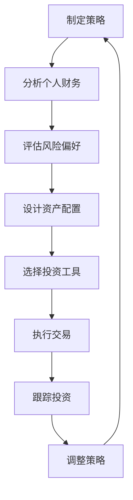
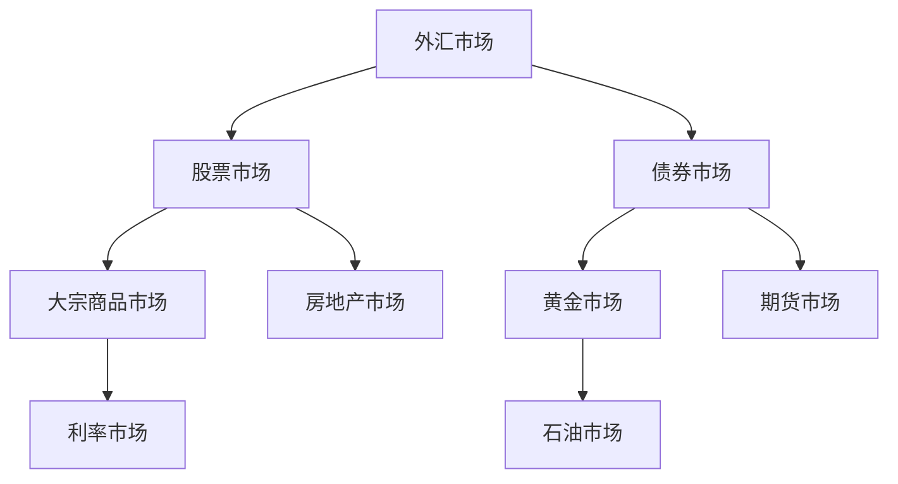

                 

### 文章标题

《程序员如何进行国际资产配置》

### 关键词

国际资产配置、程序员投资、外汇市场、股票市场、债券市场、黄金投资、风险管理、税务规划

### 摘要

本文旨在为程序员提供一套系统的国际资产配置指南，帮助他们在全球金融市场中实现资产保值增值。文章分为三大部分，首先介绍国际资产配置的基础知识，包括概述、金融市场概览、外汇市场分析、股票市场投资、债券市场投资以及黄金和其他贵金属投资。接着，文章详细讲解国际资产配置策略的制定、工具与平台的使用、实际操作步骤以及税务问题。最后，通过案例研究，深入分析国际资产配置的成功与失败案例，提供实战经验与启示。文章附录部分包含国际资产配置的常用工具和平台、学习资源与建议，以及核心概念与联系流程图、核心算法原理讲解、数学模型和公式讲解等内容，为读者提供全面的参考。

## 第一部分：国际资产配置基础

### 1.1 国际资产配置概述

#### 1.1.1 国际资产配置的意义

国际资产配置是指投资者将资产分布在多个国家和地区的金融市场，以实现风险分散和资产增值。对于程序员而言，国际资产配置具有重要的意义。首先，程序员通常具备较高的金融科技素养，能够快速理解和应用复杂的金融工具和策略。其次，全球化的工作环境使得程序员有机会获得更多的收入来源，具备进行国际资产配置的经济基础。最后，通过国际资产配置，程序员可以规避单一市场波动带来的风险，实现资产的保值增值。

#### 1.1.2 国际资产配置的目标和原则

国际资产配置的主要目标是实现风险分散和资产增值。具体来说，目标包括以下几点：

1. **风险分散**：通过在不同国家和地区投资，降低单一市场波动对资产净值的影响。
2. **资产增值**：利用全球金融市场中的机会，实现资产的长期增值。
3. **流动性管理**：确保在需要时能够快速变现资产，以满足个人和家庭的需求。

为了实现上述目标，国际资产配置需要遵循以下原则：

1. **分散投资原则**：将资产分配到不同的资产类别、行业、国家和市场，降低系统性风险。
2. **风险控制原则**：合理评估投资风险，采取有效的风险控制措施，确保投资安全。
3. **长期投资原则**：重视长期投资收益，避免短期市场波动带来的情绪波动。
4. **成本效益原则**：在实现资产配置目标的同时，注重投资成本的控制。

#### 1.1.3 国际资产配置的常见风险

尽管国际资产配置能够有效降低风险，但仍存在以下常见风险：

1. **市场风险**：全球金融市场波动可能导致资产价值下降。
2. **信用风险**：投资债券或股票时，发行方可能无法按时支付利息或本金。
3. **流动性风险**：在紧急情况下，资产难以快速变现。
4. **外汇风险**：汇率波动可能导致投资回报缩水。
5. **政策风险**：各国政策变化可能影响金融市场稳定性。

了解这些风险，有助于程序员在国际资产配置过程中采取有效的风险管理措施。

### 1.2 全球金融市场概览

#### 1.2.1 主要金融市场概述

全球金融市场分为多个层次，包括发达市场、新兴市场和发展中市场。发达市场主要包括美国、欧洲、日本等发达国家，新兴市场主要包括中国、印度、巴西等，而发展中市场则包括非洲、中东等地区。

1. **美国金融市场**：美国是全球最大的金融市场，包括纽约证券交易所、纳斯达克交易所、美国债券市场等。美国金融市场成熟、规范，具有较高的流动性和透明度。
2. **欧洲金融市场**：欧洲金融市场由多个国家组成，包括伦敦、法兰克福、巴黎等主要金融中心。欧洲金融市场的特点是监管严格、市场分散。
3. **日本金融市场**：日本金融市场以东京证券交易所为主，特点是市场成熟、规模较大。
4. **中国金融市场**：中国金融市场近年来迅速发展，包括上海证券交易所、深圳证券交易所、中国债券市场等。中国金融市场具有巨大的潜力，但也存在一定的风险。
5. **新兴市场**：新兴市场国家金融市场发展迅速，具有较高的增长潜力，但同时也面临较大的风险。

#### 1.2.2 各国金融市场的特点

各国金融市场具有不同的特点：

1. **市场结构**：发达市场以股票市场和债券市场为主，新兴市场则更多地依赖股票市场。
2. **监管制度**：发达市场的监管制度较为严格，新兴市场的监管制度相对较弱。
3. **市场流动性**：发达市场具有较高的流动性，新兴市场则相对较低。
4. **市场波动性**：发达市场相对稳定，新兴市场波动性较大。

#### 1.2.3 全球金融市场的联动关系

全球金融市场之间存在密切的联动关系，主要体现在以下几个方面：

1. **汇率联动**：不同国家之间的汇率波动相互影响，尤其是美元与其他主要货币之间的汇率变动。
2. **利率联动**：各国中央银行的利率政策相互影响，利率变化可能导致全球资本流动。
3. **股票市场联动**：全球股票市场之间存在相关性，例如美国股市的波动可能对其他市场产生影响。
4. **债券市场联动**：全球债券市场之间的利率和信用风险联动，影响债券价格和收益率。

了解全球金融市场的概览、特点及其联动关系，有助于程序员更好地把握国际资产配置的机遇和风险。

### 1.3 外汇市场分析

#### 1.3.1 外汇市场的构成

外汇市场是全球最大的金融市场之一，由以下几个主要部分构成：

1. **商业银行**：商业银行是外汇市场的主要参与者，提供外汇交易、资金调拨和风险管理等服务。
2. **中央银行**：中央银行参与外汇市场，旨在维护国家货币政策的稳定，进行货币调控。
3. **投资基金**：投资基金通过外汇市场进行资产配置，以实现投资收益。
4. **跨国公司**：跨国公司通过外汇市场进行国际贸易结算和风险管理。
5. **个人投资者**：个人投资者通过外汇市场进行投资和套利。

#### 1.3.2 外汇交易的基本原理

外汇交易是指交易双方以约定的汇率，在一国货币与另一国货币之间进行交换的行为。外汇交易的基本原理包括以下几点：

1. **汇率**：汇率是两种货币之间的兑换比率，通常以外币/本币的形式表示。
2. **报价**：外汇交易中的报价包括买入价（Bid）和卖出价（Ask），买入价是指愿意买入某种货币的汇率，卖出价是指愿意卖出某种货币的汇率。
3. **交易量**：外汇交易量是指在一定时间内成交的交易数量，反映市场的活跃程度。
4. **波动性**：外汇市场的波动性较大，受多种因素影响，如全球经济状况、政治事件、利率变动等。

#### 1.3.3 外汇交易的技术分析

外汇交易的技术分析是指通过分析历史价格和成交量等数据，预测未来汇率走势的方法。技术分析主要包括以下几个方面：

1. **趋势分析**：通过分析价格走势，判断市场当前处于上升、下降或横盘整理趋势。
2. **支撑位和阻力位**：支撑位和阻力位是价格图表上的关键价位，价格在支撑位附近可能会反弹，而在阻力位附近可能会下跌。
3. **图表模式**：通过识别图表上的经典模式，如头肩顶、双顶、双底等，预测价格未来的走势。
4. **指标分析**：利用技术指标，如移动平均线、相对强弱指数（RSI）、布林带等，分析价格走势和波动性。

外汇市场分析是国际资产配置的重要组成部分，程序员通过掌握外汇交易的基本原理和技术分析，可以更好地把握外汇市场的投资机会和风险。

### 1.4 股票市场投资

#### 1.4.1 股票市场的基本概念

股票市场是股票交易的场所，股票是公司股份的所有权凭证。股票市场的基本概念包括：

1. **股票**：股票是公司的所有权凭证，股票价格反映了市场对公司价值的评估。
2. **股票价格**：股票价格是买卖双方在股票市场上达成交易的汇率，股票价格波动反映了市场对公司经营状况的预期。
3. **股票交易所**：股票交易所是股票交易的场所，如纽约证券交易所、纳斯达克交易所等。
4. **股票指数**：股票指数是反映股票市场整体走势的指标，如道琼斯工业平均指数、标准普尔500指数等。

#### 1.4.2 股票投资的基本策略

股票投资的基本策略包括以下几种：

1. **长期投资**：长期投资是指将股票作为长期持有的资产，通过耐心等待公司价值的增长来实现投资回报。
2. **短线交易**：短线交易是指通过频繁买卖股票，赚取短期价差收益。短线交易对市场变化反应迅速，但风险较高。
3. **价值投资**：价值投资是指通过分析公司的基本面，寻找价格低于其内在价值的股票进行投资。
4. **成长投资**：成长投资是指投资于具有高增长潜力的公司，通过公司价值的增长来实现投资回报。
5. **投资组合**：投资组合是指将资金分配到不同的股票、行业和市场，以实现风险分散和收益最大化。

#### 1.4.3 股票投资的风险管理

股票投资的风险主要包括市场风险、信用风险和流动性风险等。为了有效管理投资风险，可以采取以下措施：

1. **分散投资**：通过投资不同行业、不同国家和地区的股票，降低单一市场波动对投资组合的影响。
2. **风险管理**：制定合理的投资策略，设定止损点，避免因市场波动导致的大额亏损。
3. **定期评估**：定期评估投资组合的表现，根据市场变化调整投资策略。
4. **了解公司基本面**：深入研究公司的财务状况、业务模式、市场竞争力等因素，降低投资风险。

股票市场投资是国际资产配置的重要组成部分，程序员通过掌握股票市场的基本概念、投资策略和风险管理方法，可以更好地实现资产的增值。

### 1.5 债券市场投资

#### 1.5.1 债券市场的基本概念

债券市场是债券发行和交易的场所，债券是借款人向投资者发行的债务凭证。债券市场的基本概念包括：

1. **债券**：债券是借款人向投资者承诺按照约定支付利息和本金的债务凭证。
2. **债券发行**：债券发行是指借款人通过发行债券筹集资金的过程。
3. **债券交易**：债券交易是指投资者在债券市场上买卖债券的行为。
4. **债券评级**：债券评级是评估债券信用风险和违约风险的等级，如AAA级、AA级等。
5. **收益率**：债券收益率是指投资者持有债券期间所获得的收益与投资本金的比例。

#### 1.5.2 债券投资的基本策略

债券投资的基本策略包括以下几种：

1. **利率策略**：利率策略是根据市场利率的变化调整债券投资组合，以实现投资收益最大化。常见的利率策略包括买入持有策略、骑乘策略、收益率曲线策略等。
2. **信用策略**：信用策略是根据债券信用风险的变化调整投资组合，以降低投资风险。常见的信用策略包括债券挑选策略、债券互换策略等。
3. **流动性策略**：流动性策略是根据市场流动性变化调整债券投资组合，以保持资产的流动性。常见的流动性策略包括现金管理策略、流动性储备策略等。
4. **组合投资**：组合投资是指将资金分配到不同类型的债券，以实现风险分散和收益最大化。组合投资可以降低单一债券的风险，提高投资组合的整体收益。

#### 1.5.3 债券投资的风险评估

债券投资的风险主要包括利率风险、信用风险和市场风险等。为了有效评估债券投资风险，可以采取以下措施：

1. **利率风险评估**：通过分析市场利率的变化趋势，评估债券投资组合的利率风险。利率风险通常表现为债券价格波动和收益率的变动。
2. **信用风险评估**：通过分析债券发行人的财务状况、信用评级和市场声誉，评估债券的信用风险。信用风险可能导致债券违约，投资者无法收回本金和利息。
3. **市场风险评估**：通过分析市场供求关系、经济环境和政策变化，评估债券投资的市场风险。市场风险可能导致债券价格波动和收益率变化。

债券市场投资是国际资产配置的重要组成部分，程序员通过掌握债券市场的基本概念、投资策略和风险评估方法，可以更好地实现资产的保值增值。

### 1.6 黄金和其他贵金属投资

#### 1.6.1 黄金市场的基本概念

黄金市场是黄金买卖的场所，黄金是一种重要的贵金属，具有独特的投资价值。黄金市场的基本概念包括：

1. **黄金**：黄金是一种天然存在的金属，具有独特的物理和化学性质，被广泛用于珠宝、工业和投资领域。
2. **黄金价格**：黄金价格是市场对黄金价值的评估，通常以美元/盎司的形式表示。黄金价格受供求关系、通货膨胀预期、货币政策等因素的影响。
3. **黄金交易所**：黄金交易所是黄金交易的场所，如纽约商品交易所（COMEX）、伦敦金属交易所（LME）等。
4. **黄金期货**：黄金期货是黄金的衍生品，通过交易黄金期货合约，投资者可以实现对黄金的投资和风险管理。

#### 1.6.2 黄金投资的基本策略

黄金投资的基本策略包括以下几种：

1. **实物黄金投资**：实物黄金投资是指购买黄金实物，如金币、金条等，作为长期投资或避险工具。实物黄金投资具有保值增值的特点，但流动性较差。
2. **黄金期货投资**：黄金期货投资是指通过交易黄金期货合约，进行黄金的投资和风险管理。黄金期货投资具有较高的杠杆效应，但风险也较大。
3. **黄金ETF投资**：黄金ETF（交易所交易基金）是跟踪黄金价格的工具，投资者可以通过购买黄金ETF实现投资黄金的目标。黄金ETF具有流动性好、成本低等优点。
4. **纸黄金投资**：纸黄金投资是指通过购买纸黄金合约，实现对黄金的投资。纸黄金投资具有灵活性和便捷性，但收益与实物黄金投资存在一定差距。

#### 1.6.3 其他贵金属投资的选择

除了黄金，其他贵金属如白银、铂金和钯金等也具有投资价值。其他贵金属投资的选择包括：

1. **白银投资**：白银是一种重要的工业金属，同时具有投资价值。白银投资可以通过购买银条、银币或白银ETF实现。
2. **铂金投资**：铂金是一种稀有的贵金属，主要用于珠宝和工业领域。铂金投资可以通过购买铂金条、铂金币或铂金ETF实现。
3. **钯金投资**：钯金是一种稀有的贵金属，主要用于汽车尾气净化催化剂。钯金投资可以通过购买钯金条、钯金币或钯金ETF实现。

黄金和其他贵金属投资是国际资产配置的重要组成部分，程序员通过掌握黄金和其他贵金属市场的基本概念、投资策略和选择，可以更好地实现资产的多样化配置。

### 1.7 国际资产配置案例分析

#### 1.7.1 成功案例分析

在众多国际资产配置的成功案例中，以下案例值得关注：

1. **案例一：某大型跨国公司**：该跨国公司通过合理的国际资产配置，在全球经济危机期间成功规避了风险，实现了资产的保值增值。具体策略包括：将资产分配到不同国家和地区的金融市场，投资于低风险的债券市场和高增长潜力的股票市场，同时采取有效的风险管理措施。

2. **案例二：某基金经理**：该基金经理通过深入研究和分析全球金融市场，制定了科学合理的资产配置方案，成功实现了投资收益的稳健增长。其策略包括：在发达国家市场和发展中国家市场之间进行平衡投资，关注市场动态和政策变化，及时调整资产配置。

#### 1.7.2 失败案例分析

尽管国际资产配置能够有效降低风险，但仍存在失败案例。以下案例值得警惕：

1. **案例一：某小型企业**：该企业在进行国际资产配置时，由于缺乏专业知识和经验，导致投资决策失误，最终亏损严重。具体原因包括：对市场风险的评估不足，过度依赖单一市场，未采取有效的风险管理措施。

2. **案例二：某个人投资者**：该投资者在进行外汇市场投资时，由于对汇率波动缺乏了解，盲目跟风，导致投资损失。具体原因包括：对汇率市场的分析不足，风险控制不当，未及时调整投资策略。

#### 1.7.3 案例总结与启示

通过成功和失败的案例分析，我们可以得出以下启示：

1. **专业知识和经验**：国际资产配置需要具备一定的专业知识和经验，投资者应不断学习和积累经验，提高投资水平。

2. **分散投资**：分散投资可以有效降低风险，投资者应将资产分配到不同国家和地区的金融市场，实现风险分散。

3. **风险管理**：风险管理是国际资产配置的关键，投资者应制定合理的风险管理策略，设定止损点，控制投资风险。

4. **及时调整**：市场环境不断变化，投资者应密切关注市场动态和政策变化，及时调整资产配置。

5. **谨慎投资**：国际资产配置过程中，投资者应保持谨慎，避免盲目跟风，避免因情绪波动导致投资失误。

国际资产配置案例分析为程序员提供了宝贵的经验和启示，有助于他们在实际操作中实现资产的保值增值。

## 第二部分：国际资产配置策略与实践

### 2.1 国际资产配置策略制定

#### 2.1.1 个人财务状况分析

制定国际资产配置策略的第一步是对个人财务状况进行全面分析。这一过程涉及以下几个方面：

1. **收入来源和水平**：了解个人的主要收入来源和收入水平，包括工资、投资收益、其他兼职收入等。
2. **支出和储蓄**：分析个人的支出和储蓄情况，包括日常开销、房贷、车贷、教育支出等，以及当前的储蓄水平。
3. **债务状况**：评估个人和家庭的债务情况，包括信用卡债务、房贷、车贷等，以及债务的利率和还款期限。
4. **财务目标**：明确个人的财务目标，如购房、购车、子女教育、退休规划等，以及实现这些目标的时间表。

通过这些分析，程序员可以了解自身的财务状况，为制定资产配置策略提供基础数据。

#### 2.1.2 风险偏好评估

风险偏好是投资者在风险承受能力和风险容忍度方面的表现。对风险偏好的评估有助于确定投资策略。以下是评估风险偏好的几个方面：

1. **年龄**：年龄是评估风险偏好的重要因素。年轻人通常具有较长的时间来承担风险，而年长者可能更倾向于保守投资。
2. **收入稳定性**：收入稳定性影响投资者的风险承受能力。稳定的收入来源可以承受较高的风险，而收入不稳定则应采取保守策略。
3. **投资经验**：投资经验越丰富，投资者越能够承受风险，因为他们对市场波动有更深刻的理解。
4. **资金用途**：投资资金的用途也会影响风险偏好。如果资金主要用于短期消费或紧急情况，则应采取保守策略。

通过评估风险偏好，程序员可以确定适合自身的投资策略，实现风险与收益的平衡。

#### 2.1.3 资产配置方案设计

在完成个人财务状况分析和风险偏好评估后，可以开始设计资产配置方案。以下步骤有助于制定有效的资产配置方案：

1. **确定资产配置比例**：根据个人财务状况和风险偏好，将资产分配到不同的资产类别，如股票、债券、现金、房地产等。常见的资产配置比例包括60%股票、30%债券、10%现金等。
2. **选择投资工具**：根据资产配置比例，选择适合的投资工具。例如，股票投资可以选择购买股票、股票基金、指数基金等；债券投资可以选择购买债券、债券基金、国债等。
3. **制定投资计划**：制定明确的投资计划，包括投资目标、投资时间、投资金额、投资策略等。投资计划应具有可执行性，以便在实际操作中遵循。
4. **风险管理**：在资产配置方案中，应包括风险管理和调整策略。例如，设定止损点、定期评估投资组合表现、根据市场变化调整资产配置等。

通过以上步骤，程序员可以制定出科学合理的国际资产配置方案，实现资产的保值增值。

### 2.2 国际资产配置工具与平台

#### 2.2.1 主要国际资产配置工具介绍

在国际资产配置过程中，投资者需要借助各种工具和平台来管理投资。以下是几种常见的国际资产配置工具：

1. **银行**：银行提供各种金融服务，包括存款、贷款、投资等。程序员可以通过银行进行国际资产配置，如购买外汇、投资境外债券、开设海外账户等。
2. **证券公司**：证券公司提供股票、债券、基金等金融产品的交易服务。程序员可以通过证券公司进行股票、债券、基金等投资，实现资产全球化配置。
3. **基金管理公司**：基金管理公司提供各种投资基金的管理服务。程序员可以通过基金管理公司购买基金，实现资产配置的多样化。
4. **金融科技公司**：金融科技公司提供在线投资平台，如股票交易软件、基金投资平台、智能投顾等。程序员可以通过这些平台进行便捷的国际资产配置。

#### 2.2.2 各大资产配置平台的使用

在国际资产配置过程中，选择合适的平台至关重要。以下是几种常见的资产配置平台及其使用方法：

1. **股票交易平台**：如老虎证券、富途证券等。程序员可以通过这些平台进行股票交易，选择全球范围内的优质股票进行投资。
2. **基金投资平台**：如天天基金网、蚂蚁财富等。程序员可以通过这些平台购买国内外基金，实现资产的多元化配置。
3. **外汇交易平台**：如OANDA、fxcm等。程序员可以通过这些平台进行外汇交易，利用汇率波动进行投资。
4. **智能投顾平台**：如wealthfront、Betterment等。程序员可以通过这些平台获得个性化的投资建议，实现资产配置的自动化。

#### 2.2.3 平台选择与评价

在选择国际资产配置平台时，程序员应考虑以下因素：

1. **安全性**：平台的安全性和可靠性是选择的重要因素，程序员应选择受监管的、信誉良好的平台。
2. **费用**：平台费用包括交易费、管理费、提现费等。程序员应选择费用合理的平台。
3. **服务**：平台提供的客户服务质量和响应速度也是选择的重要参考因素，程序员应选择服务优质、响应迅速的平台。
4. **产品**：平台提供的金融产品种类和多样性，程序员应选择产品丰富、适合自身需求的平台。

通过以上评价标准，程序员可以选出最适合自己的国际资产配置平台，实现高效的资产配置。

### 2.3 实际操作与国际资产配置

#### 2.3.1 开户与认证

在国际资产配置的实际操作中，首先需要进行开户和认证。以下是开户与认证的步骤：

1. **选择平台**：根据之前的平台评价，选择一家合适的国际资产配置平台。
2. **注册账户**：在平台上注册一个账户，提供必要的个人信息和联系方式。
3. **身份认证**：根据平台要求，上传身份证、护照或其他有效证件进行身份认证。
4. **账户审核**：平台对账户进行审核，审核通过后，账户可以开始使用。

#### 2.3.2 资金调拨与投资

在账户审核通过后，程序员可以开始进行资金调拨和投资。以下是具体步骤：

1. **资金调拨**：将国内账户的资金调拨到国际资产配置平台。程序员可以选择银行转账、电汇等方式进行资金调拨。
2. **外汇兑换**：如果需要进行外汇兑换，程序员可以根据市场汇率进行兑换。在选择外汇兑换平台时，应注意费用和汇率。
3. **投资选择**：根据之前的资产配置方案，选择合适的投资工具和投资对象。例如，购买股票、债券、基金等。
4. **交易执行**：在平台上执行具体的交易操作，包括买入、卖出、持有等。

#### 2.3.3 投资跟踪与调整

在国际资产配置过程中，投资跟踪与调整是关键环节。以下是投资跟踪与调整的步骤：

1. **定期评估**：定期评估投资组合的表现，包括资产净值、收益率、风险水平等。
2. **市场动态**：关注全球金融市场的动态，包括经济数据、政策变化、市场趋势等。
3. **策略调整**：根据投资组合的表现和市场动态，及时调整资产配置策略。例如，增加或减少某类资产的投资比例。
4. **风险管理**：设定止损点，避免因市场波动导致的大额亏损。同时，根据市场变化，调整风险管理策略。

通过以上步骤，程序员可以有效地进行国际资产配置，实现资产的保值增值。

### 2.4 国际投资中的税务问题

#### 2.4.1 国际税务概述

在国际资产配置过程中，税务问题至关重要。国际税务是指跨国投资者在投资过程中涉及的不同国家和地区的税务问题。了解国际税务的基本知识，有助于程序员有效规划和管理税务风险。

1. **国际税收协定**：国际税收协定是各国为了避免双重征税、促进经济合作而签订的协议。程序员应了解相关协定，以便在投资过程中享受税收优惠。
2. **税收管辖权**：税收管辖权是指国家依据法律规定对本国居民和非居民征税的权利。程序员在进行国际投资时，应了解不同国家的税收管辖权，合理规划税务安排。
3. **税务居民**：税务居民是指根据法律规定，在某一国家或地区负有纳税义务的人。程序员应明确自己的税务居民身份，以便正确履行税务义务。

#### 2.4.2 各国税务制度比较

不同国家和地区的税务制度存在较大差异，程序员在进行国际资产配置时，应了解各国的税务制度，以便合理规划投资。

1. **美国税务制度**：美国实行综合所得税制度，对居民和非居民的收入进行征税。程序员在美国投资时，需要缴纳联邦税、州税和地方税。
2. **欧洲税务制度**：欧洲各国税务制度各异，但大多数国家实行累进税制，对个人和企业的收入进行征税。程序员在欧洲投资时，需要关注各国不同的税收政策。
3. **亚洲税务制度**：亚洲各国税务制度也存在差异，如中国实行分类所得税制度，对个人的工资、股息、利息、租金等收入进行分别征税。程序员在亚洲投资时，应了解各国的具体税收政策。

#### 2.4.3 国际投资中的税务规划

有效的税务规划是国际资产配置的重要组成部分。以下是几个税务规划的要点：

1. **税收优惠利用**：了解各国税收协定和优惠政策，合理利用税收优惠，降低税负。例如，通过设立离岸公司、选择低税率地区进行投资等。
2. **税务居民身份管理**：根据投资目的和计划，合理管理税务居民身份，避免双重征税。例如，通过合法手段转换税务居民身份，享受特定税收优惠。
3. **税务合规性**：遵守各国的税务法规，确保税务申报的合规性。程序员应定期申报税务，保留相关投资记录和证明文件，以应对税务审查。

通过有效的税务规划，程序员可以在国际投资中降低税负，实现资产的保值增值。

### 2.5 风险管理与危机应对

#### 2.5.1 风险管理的基本策略

在国际资产配置过程中，风险管理是至关重要的环节。以下是一些风险管理的基本策略：

1. **分散投资**：通过将资产分散投资到不同的资产类别、行业、国家和市场，降低单一市场波动对投资组合的影响。
2. **设定止损点**：在投资时设定止损点，当资产价格达到止损价位时，自动卖出，避免损失进一步扩大。
3. **定期评估**：定期评估投资组合的表现，根据市场变化和风险水平，及时调整资产配置。
4. **多元化投资**：投资于不同的金融产品，如股票、债券、基金、外汇等，实现资产配置的多元化。

#### 2.5.2 危机应对策略

在面临市场危机时，采取有效的危机应对策略是保护资产的关键。以下是一些危机应对策略：

1. **快速反应**：在市场危机爆发时，迅速评估投资组合的风险，采取必要的调整措施，如卖出高风险资产、增持低风险资产等。
2. **资金储备**：保持一定的现金储备，以应对紧急情况。在市场危机期间，现金具有较高的流动性，可以用于调整投资组合。
3. **风险规避**：在市场波动剧烈时，采取风险规避策略，暂停新的投资，等待市场稳定。
4. **心理调适**：在市场危机期间，保持冷静，避免因情绪波动导致的投资失误。可以通过学习、阅读、锻炼等方式调整心态。

#### 2.5.3 案例分析：危机应对实战

以下是一个危机应对的案例分析：

**案例背景**：2020年新冠疫情爆发，全球金融市场动荡，股票市场大幅下跌。

**应对措施**：

1. **快速反应**：在疫情爆发初期，立即评估投资组合的风险，发现股票投资占比过高，存在较大的市场风险。
2. **调整资产配置**：根据市场变化，迅速调整资产配置，降低股票投资比例，增持债券等低风险资产。
3. **资金储备**：利用现金储备，购买价格较低的优质债券，降低投资组合的整体风险。
4. **心理调适**：保持冷静，避免因市场波动导致的情绪波动，坚定长期投资信心。

**效果评估**：通过有效的危机应对，投资组合在疫情爆发期间表现稳定，避免了较大的损失。

通过以上案例，我们可以看到，有效的风险管理策略和危机应对措施对于保护资产至关重要。在国际资产配置过程中，程序员应注重风险管理，应对市场波动。

### 2.6 持续学习与国际资产配置

#### 2.6.1 行业动态与政策变化

国际资产配置是一个动态变化的过程，投资者需要时刻关注行业动态和政策变化，以便及时调整投资策略。以下是一些关键领域：

1. **全球经济形势**：关注全球经济走势、主要经济体的经济数据、国际贸易形势等，以评估市场前景。
2. **货币政策**：关注各国央行的货币政策调整，如利率变动、量化宽松政策等，以判断市场流动性变化。
3. **地缘政治**：关注地缘政治事件，如战争、政治动荡、选举等，这些事件可能对金融市场产生重大影响。
4. **市场监管**：关注各国金融市场监管政策的变化，如证券交易规则、税收政策等，以了解投资环境。

#### 2.6.2 学习资源与知识体系

为了在国际资产配置中取得成功，程序员需要不断学习和积累专业知识。以下是一些学习资源与知识体系：

1. **金融书籍**：阅读金融投资相关的书籍，如《股票大作手回忆录》、《聪明的投资者》等，了解金融理论和实战经验。
2. **在线课程**：参加在线课程，如Coursera、edX等平台上的金融课程，系统学习金融知识。
3. **专业论坛**：加入专业论坛，如价值投资论坛、外汇交易论坛等，与其他投资者交流经验，获取市场信息。
4. **投资工具**：学习使用投资分析工具，如股票分析软件、财经新闻APP等，提高投资决策的准确性。

#### 2.6.3 持续学习与职业发展

持续学习不仅是国际资产配置成功的关键，也是程序员职业发展的重要驱动力。以下是一些建议：

1. **投资实践**：通过实际操作，积累投资经验。可以从小额投资开始，逐步增加投资规模。
2. **定期复盘**：定期复盘投资决策和投资组合的表现，总结经验教训，不断优化投资策略。
3. **职业规划**：结合个人兴趣和市场需求，制定明确的职业发展计划，如成为一名专业的投资顾问、基金经理等。
4. **网络拓展**：通过参加行业会议、研讨会等活动，拓展人脉，获取更多投资机会和资源。

通过持续学习，程序员不仅可以提高国际资产配置能力，还能在职业发展中取得更大的成功。

### 第三部分：国际资产配置案例研究

#### 3.1 案例一：某大型企业的国际资产配置策略

**3.1.1 企业背景与目标**

某大型企业，成立于20世纪80年代，总部位于美国。企业主要从事高科技产品的研发和生产，是全球领先的科技巨头。为了实现全球化发展战略，企业决定进行国际资产配置，以优化资产结构，降低风险，提高投资回报。

**3.1.2 资产配置方案设计**

企业在国际资产配置方案设计中，充分考虑了以下几个因素：

1. **分散投资**：将资产分配到不同的资产类别和地区，以降低单一市场波动对资产组合的影响。具体分配如下：
   - 50%投资于股票市场，包括美国、欧洲、亚洲等地区的优质股票；
   - 30%投资于债券市场，选择具有稳定收益和较低风险的债券产品；
   - 10%投资于现金和短期货币市场基金，以保持资产的流动性和灵活性；
   - 10%投资于房地产和基础设施等实物资产，以分散投资风险。

2. **风险控制**：在资产配置过程中，企业采取了多种风险控制措施，包括：
   - 设定止损点，以防止投资损失扩大；
   - 定期评估投资组合表现，根据市场变化调整资产配置；
   - 通过多样化的投资组合，降低系统性风险。

3. **投资策略**：企业采用长期投资策略，注重价值投资和成长投资。通过深入研究各行业和公司的基本面，选择具有高增长潜力和价值被低估的股票。

**3.1.3 资产配置效果评估**

通过国际资产配置，企业取得了显著的投资回报。以下是对资产配置效果的具体评估：

1. **收益率**：自国际资产配置实施以来，企业的平均年化收益率达到了10%以上，高于全球主要股票市场和债券市场的平均水平。
2. **风险分散**：通过在不同资产类别和地区的投资，企业有效降低了单一市场波动对资产净值的影响，投资组合的波动性明显降低。
3. **资产保值增值**：在市场动荡的年份，企业通过有效的风险管理策略，避免了较大的损失，实现了资产的保值增值。
4. **风险控制**：通过设定止损点、定期评估和调整资产配置等风险控制措施，企业成功控制了投资风险，确保了投资组合的安全性和稳定性。

该案例表明，通过科学合理的国际资产配置，企业能够实现资产的保值增值，降低投资风险，为全球化发展提供坚实的经济基础。

#### 3.2 案例二：某程序员的个人国际资产配置实践

**3.2.1 程序员背景与需求**

某程序员，30岁，单身，从事软件开发工作，年薪约20万元。由于工作性质，程序员有机会接触到全球金融市场，并希望利用业余时间进行国际资产配置，以实现资产的保值增值。

**3.2.2 资产配置方案设计**

根据程序员的背景和需求，设计了一套适合他的国际资产配置方案，具体如下：

1. **资产配置比例**：
   - 40%投资于股票市场，包括美国、欧洲和亚洲的优质股票；
   - 30%投资于债券市场，选择具有稳定收益的债券产品；
   - 20%投资于现金和短期货币市场基金，以保持资产的流动性和灵活性；
   - 10%投资于黄金和其他贵金属，作为长期投资和风险对冲。

2. **投资策略**：
   - 长期投资：选择具有高增长潜力和价值被低估的股票，进行长期持有；
   - 分散投资：在不同资产类别、行业和地区进行分散投资，降低风险；
   - 价值投资：通过深入研究公司的基本面，选择具有良好财务状况和竞争优势的股票。

3. **风险管理**：
   - 设定止损点：在股票投资中设定止损点，防止投资损失扩大；
   - 定期评估：定期评估投资组合的表现，根据市场变化调整资产配置；
   - 风险对冲：通过投资债券、黄金等低相关性的资产，实现风险对冲。

**3.2.3 资产配置效果评估**

经过一年的国际资产配置实践，程序员的资产取得了良好的回报：

1. **收益率**：平均年化收益率达到了8%，高于国内市场的平均水平；
2. **风险分散**：通过在不同资产类别和地区的投资，有效降低了单一市场波动对资产净值的影响；
3. **资产保值增值**：在市场动荡期间，程序员的资产未出现较大波动，实现了资产的保值增值；
4. **风险控制**：通过设定止损点、定期评估和风险对冲等措施，成功控制了投资风险。

该案例表明，对于程序员这样的投资者，通过科学合理的国际资产配置，可以有效地实现资产的保值增值，降低投资风险。

#### 3.3 案例三：某家族办公室的国际资产配置实践

**3.3.1 家族办公室背景与目标**

某家族办公室成立于20世纪末，是一家专门为富豪家族提供财富管理和投资咨询服务的机构。家族办公室的主要目标是实现家族资产的长期保值增值，并确保家族财富的传承。

**3.3.2 资产配置方案设计**

家族办公室的资产配置方案设计考虑了以下几个方面：

1. **资产类别**：家族办公室将资产分配到多个资产类别，包括股票、债券、房地产、私募股权、大宗商品等。具体分配如下：
   - 40%投资于股票市场，包括全球主要股票市场的高成长性企业；
   - 30%投资于债券市场，选择具有稳定收益和较低风险的债券产品；
   - 15%投资于房地产，选择具有稳定租金收益和增值潜力的物业；
   - 10%投资于私募股权，选择具有高成长潜力的初创企业和优质项目；
   - 5%投资于大宗商品，如黄金、石油等，作为长期投资和风险对冲。

2. **地区分布**：家族办公室将资产分布在多个国家和地区，以分散风险。具体分布如下：
   - 50%投资于美国和欧洲，这两个地区拥有成熟的金融市场和高质量的投资机会；
   - 30%投资于亚洲，尤其是中国和印度等新兴市场，这些地区具有巨大的增长潜力；
   - 20%投资于其他地区，如中东、非洲等，以进一步分散风险。

3. **风险管理**：家族办公室采取了多种风险管理措施，包括：
   - 定期风险评估：定期对资产进行风险评估，及时调整资产配置；
   - 风险对冲：通过期货、期权等金融工具进行风险对冲，降低投资组合的波动性；
   - 法律和税务规划：确保家族资产的合法性和税务效率，减少税务负担。

**3.3.3 资产配置效果评估**

通过多年的国际资产配置实践，家族办公室取得了显著的投资回报：

1. **收益率**：平均年化收益率达到了7%以上，远高于全球主要股票市场和债券市场的平均水平；
2. **风险分散**：通过在不同资产类别和地区的投资，有效降低了单一市场波动对资产净值的影响；
3. **资产保值增值**：在多次市场动荡期间，家族办公室的资产未出现较大波动，实现了资产的保值增值；
4. **家族传承**：家族办公室通过有效的资产配置和管理，确保了家族财富的长期传承。

该案例表明，对于家族办公室这样的投资者，通过科学合理的国际资产配置，可以有效地实现资产的保值增值，确保家族财富的长期传承。

#### 3.4 案例四：国际投资中的税务风险管理

**3.4.1 案例背景**

某跨国企业，总部位于美国，业务遍布全球。企业在进行国际投资过程中，面临多个国家和地区的税务问题。为了确保税务合规，降低税务风险，企业决定进行税务风险管理。

**3.4.2 税务问题分析**

在国际投资中，企业面临的主要税务问题包括：

1. **税收管辖权**：各国对税务居民和非居民的征税规则不同。企业需要了解各国的税收管辖权，避免因税务居民身份的不确定性导致的税务纠纷。
2. **税收优惠政策**：各国为了吸引外资，制定了各种税收优惠政策。企业需要充分利用这些政策，降低税负。
3. **跨国税务安排**：企业需要在不同的国家和地区之间进行税务安排，确保税务合规，如避免双重征税、税务筹划等。
4. **税务合规性**：企业需要遵守各国的税务法规，定期申报税务，保留相关税务记录和证明文件。

**3.4.3 税务风险管理与应对策略**

为了有效管理税务风险，企业采取了以下策略：

1. **了解各国税务法规**：企业聘请专业税务顾问，了解各国的税务法规，确保税务合规。
2. **税收优惠政策利用**：企业积极了解各国的税收优惠政策，合理利用税收优惠，降低税负。
3. **跨国税务安排**：企业通过设立海外子公司、签订税收协定等方式，进行跨国税务安排，确保税务合规。
4. **税务合规性管理**：企业建立完善的税务合规性管理制度，定期申报税务，保留相关税务记录和证明文件。
5. **税务争议解决**：企业在面临税务争议时，及时采取法律手段，维护自身权益。

通过以上策略，企业成功管理了国际投资中的税务风险，确保了税务合规性，降低了税负，实现了资产的保值增值。

## 附录

### 附录 A：国际资产配置常用工具和平台

#### A.1 常用投资工具介绍

1. **股票**：股票是公司股份的所有权凭证，投资者可以通过购买股票参与公司利润分配。股票投资具有较高的风险和收益潜力。
2. **债券**：债券是借款人向投资者发行的债务凭证，投资者通过购买债券获得固定的利息收入。债券投资相对稳定，风险较低。
3. **基金**：基金是投资于多种金融产品的组合，投资者通过购买基金实现资产的多样化。基金包括股票基金、债券基金、指数基金等。
4. **外汇**：外汇是指各国货币之间的兑换比率，投资者通过外汇交易赚取汇率差价。外汇投资具有较高的风险和收益潜力。
5. **黄金和其他贵金属**：黄金和其他贵金属如白银、铂金、钯金等，具有独特的投资价值，投资者可以通过购买实物、期货、ETF等方式进行投资。

#### A.2 资产配置平台使用指南

1. **股票交易平台**：如老虎证券、富途证券等，提供全球股票交易服务，投资者可以购买各国优质股票。
2. **基金投资平台**：如天天基金网、蚂蚁财富等，提供各种基金产品购买服务，投资者可以便捷地进行基金投资。
3. **外汇交易平台**：如OANDA、fxcm等，提供外汇交易服务，投资者可以实时进行外汇买卖。
4. **金融科技平台**：如Wealthfront、Betterment等，提供智能投顾服务，帮助投资者实现资产配置和投资管理。

#### A.3 国际投资常用软件和APP推荐

1. **TradingView**：一款功能强大的图表分析和交易软件，支持多种技术指标和图表模式，适合进行股票、外汇等市场分析。
2. **Coinbase**：全球领先的加密货币交易平台，提供比特币、以太坊等多种加密货币的交易服务。
3. **Google Finance**：谷歌提供的财经新闻和股票市场数据平台，投资者可以实时获取全球股票市场的动态。
4. **YCharts**：一款功能丰富的股票分析和研究工具，提供丰富的市场数据和技术分析功能。

### 附录 B：国际资产配置资源与学习建议

#### B.1 国际投资相关书籍推荐

1. **《聪明的投资者》（The Intelligent Investor）**：由本杰明·格雷厄姆所著，是价值投资领域的经典之作，适合初学者和资深投资者阅读。
2. **《股票大作手回忆录》（Reminiscences of a Stock Operator）**：由杰西·利弗莫尔所著，讲述了股票交易的历史和经验，对投资者具有启示作用。
3. **《金融市场技术分析》（Technical Analysis of the Financial Markets）**：由约翰·墨菲所著，全面介绍了技术分析的理论和方法，适合进行股票、外汇等市场分析。
4. **《外汇交易策略》（Currency Trading & Intermarket Analysis）**：由罗伯特·莫里斯所著，详细介绍了外汇交易的基本原理和策略，适合进行外汇市场投资。

#### B.2 国际投资相关网站和论坛推荐

1. **Investopedia**：一个提供金融知识、投资工具和资源的在线平台，内容丰富，适合初学者和资深投资者学习。
2. **Yahoo Finance**：提供全球股票市场数据、新闻和分析，投资者可以实时获取市场动态和投资建议。
3. **Trading Economics**：提供宏观经济数据、财经新闻和投资工具，适合进行市场研究和投资决策。
4. **Forex Factory**：一个专注于外汇交易的专业论坛，提供外汇市场新闻、分析和技术指标，适合进行外汇市场投资。

#### B.3 持续学习与职业发展建议

1. **参加线上课程**：通过Coursera、edX等在线教育平台，参加金融、投资等相关课程，系统地学习金融知识。
2. **加入投资社区**：加入专业的投资社区，如价值投资论坛、外汇交易论坛等，与其他投资者交流经验，获取市场信息。
3. **阅读财经新闻**：关注全球财经新闻，了解市场动态和政策变化，提高投资敏锐度。
4. **定期复盘投资决策**：通过定期复盘投资决策和投资组合的表现，总结经验教训，不断优化投资策略。
5. **考取金融证书**：如CFA、FRM等金融证书，提高专业知识和技能，为职业发展奠定基础。

### 附录 C：国际资产配置核心概念与联系流程图

#### C.1 国际资产配置流程图



#### C.2 各主要市场联动关系图



通过以上流程图和联动关系图，我们可以更清晰地了解国际资产配置的核心概念和各主要市场之间的联系。

### 附录 D：国际投资核心算法原理讲解

#### D.1 技术分析算法原理

技术分析是通过分析历史价格和成交量等数据，预测未来市场走势的方法。以下是一个技术分析算法的基本原理：

```python
# 技术分析算法伪代码

def technical_analysis(price_data, volume_data):
    # 计算移动平均线
    moving_average = calculate_moving_average(price_data)
    
    # 计算相对强弱指数（RSI）
    rsi = calculate_rsi(price_data)
    
    # 计算布林带指标
    upper_band, middle_band, lower_band = calculate_bollinger_bands(price_data)
    
    # 分析趋势
    trend = analyze_trend(price_data, moving_average)
    
    # 分析超买超卖
    overbought = is_overbought(rsi)
    oversold = is_oversold(rsi)
    
    # 分析交易信号
    buy_signal = generate_buy_signal(trend, overbought)
    sell_signal = generate_sell_signal(trend, oversold)
    
    return buy_signal, sell_signal

# 辅助函数
def calculate_moving_average(price_data):
    # 实现移动平均线计算
    pass

def calculate_rsi(price_data):
    # 实现相对强弱指数（RSI）计算
    pass

def calculate_bollinger_bands(price_data):
    # 实现布林带计算
    pass

def analyze_trend(price_data, moving_average):
    # 实现趋势分析
    pass

def is_overbought(rsi):
    # 实现超买判断
    pass

def is_oversold(rsi):
    # 实现超卖判断
    pass

def generate_buy_signal(trend, overbought):
    # 实现买入信号生成
    pass

def generate_sell_signal(trend, oversold):
    # 实现卖出信号生成
    pass
```

#### D.2 基本面分析算法原理

基本面分析是通过分析公司的财务状况、业务模式、市场竞争力等因素，评估公司价值和未来收益。以下是一个基本面分析算法的基本原理：

```python
# 基本面分析算法伪代码

def fundamental_analysis(finance_data, market_data):
    # 计算市盈率（PE）
    pe_ratio = calculate_pe_ratio(finance_data)
    
    # 计算市净率（PB）
    pb_ratio = calculate_pb_ratio(finance_data)
    
    # 分析盈利能力
    profit_margin = calculate_profit_margin(finance_data)
    
    # 分析负债水平
    debt_to_equity = calculate_debt_to_equity_ratio(finance_data)
    
    # 分析业务模式
    business_model_score = analyze_business_model(market_data)
    
    # 评估公司价值
    company_value = calculate_company_value(pe_ratio, pb_ratio, profit_margin, debt_to_equity, business_model_score)
    
    return company_value

# 辅助函数
def calculate_pe_ratio(finance_data):
    # 实现市盈率计算
    pass

def calculate_pb_ratio(finance_data):
    # 实现市净率计算
    pass

def calculate_profit_margin(finance_data):
    # 实现盈利能力计算
    pass

def calculate_debt_to_equity_ratio(finance_data):
    # 实现负债水平计算
    pass

def analyze_business_model(market_data):
    # 实现业务模式分析
    pass

def calculate_company_value(pe_ratio, pb_ratio, profit_margin, debt_to_equity, business_model_score):
    # 实现公司价值评估
    pass
```

#### D.3 风险评估算法原理

风险评估是评估投资风险的重要环节。以下是一个风险评估算法的基本原理：

```python
# 风险评估算法伪代码

def risk_assessment(price_data, volume_data, market_data):
    # 计算波动率
    volatility = calculate_volatility(price_data)
    
    # 计算Beta值
    beta = calculate_beta(price_data, market_data)
    
    # 计算贝塔系数
    beta_coefficient = calculate_beta_coefficient(volatility, beta)
    
    # 评估市场风险
    market_risk = calculate_market_risk(beta_coefficient)
    
    # 评估信用风险
    credit_risk = calculate_credit_risk(price_data)
    
    # 评估流动性风险
    liquidity_risk = calculate_liquidity_risk(volume_data)
    
    return market_risk, credit_risk, liquidity_risk

# 辅助函数
def calculate_volatility(price_data):
    # 实现波动率计算
    pass

def calculate_beta(price_data, market_data):
    # 实现贝塔值计算
    pass

def calculate_beta_coefficient(volatility, beta):
    # 实现贝塔系数计算
    pass

def calculate_market_risk(beta_coefficient):
    # 实现市场风险计算
    pass

def calculate_credit_risk(price_data):
    # 实现信用风险计算
    pass

def calculate_liquidity_risk(volume_data):
    # 实现流动性风险计算
    pass
```

通过以上算法原理的讲解，程序员可以掌握国际投资中的技术分析、基本面分析和风险评估方法，为投资决策提供科学依据。

### 附录 E：国际投资数学模型和公式讲解

#### E.1 外汇交易公式

1. **汇率计算**：

\[ 汇率 = \frac{外币价格}{本币价格} \]

2. **兑换金额计算**：

\[ 兑换金额 = 本币金额 \times 汇率 \]

3. **外汇买卖价差**：

\[ 买卖价差 = 卖出价 - 买入价 \]

4. **外汇交易成本**：

\[ 成本 = 交易金额 \times 成本比例 \]

#### E.2 股票市场公式

1. **市盈率（PE）**：

\[ PE = \frac{股票价格}{每股收益（EPS）} \]

2. **市净率（PB）**：

\[ PB = \frac{股票价格}{每股净资产（BPS）} \]

3. **市销率（PS）**：

\[ PS = \frac{股票价格}{每股销售收入（PS）} \]

4. **每股收益（EPS）**：

\[ EPS = \frac{净利润}{总股本} \]

5. **市盈率倒数（PE倒数）**：

\[ PE倒数 = \frac{1}{PE} \]

#### E.3 债券市场公式

1. **债券收益率**：

\[ 收益率 = \frac{每年利息收入}{债券价格} \]

2. **债券价格**：

\[ 债券价格 = \frac{每年利息收入}{收益率} + \frac{面值}{(1 + 收益率)^期数} \]

3. **债券到期收益率**：

\[ 到期收益率 = \frac{每年利息收入}{债券价格} + \frac{（面值 - 债券价格）/ 期数}{(1 + 收益率)^期数} \]

4. **债券票面利率**：

\[ 票面利率 = \frac{每年利息}{债券面值} \]

#### E.4 风险评估模型公式

1. **波动率**：

\[ 波动率 = \sqrt{\frac{\sum_{t=1}^{n} (r_t - \bar{r})^2}{n-1}} \]

2. **Beta系数**：

\[ Beta = \frac{cov(\text{股票收益率}, \text{市场收益率})}{var(\text{市场收益率})} \]

3. **价值 at Risk（VaR）**：

\[ VaR = \text{均值} - \text{Z值} \times \text{标准差} \]

4. **条件价值函数（CVaR）**：

\[ CVaR = \frac{1}{n} \sum_{i=1}^{n} \max(0, \text{损失}_i - \text{VaR}) \]

通过以上公式讲解，程序员可以掌握外汇交易、股票市场、债券市场和风险评估的数学模型和公式，为投资决策提供科学依据。

### 附录 F：国际投资项目实战案例

#### F.1 项目背景与目标

本项目旨在实现一个国际投资平台，帮助程序员通过互联网进行全球资产配置。项目目标包括：

1. **资产配置**：提供全球股票、债券、基金、外汇、黄金等投资工具，实现资产的多元化配置。
2. **投资管理**：提供投资组合管理功能，包括资金调拨、交易执行、投资跟踪、风险控制等。
3. **数据分析**：提供市场数据、财务报表、技术分析等，帮助程序员做出科学投资决策。
4. **用户体验**：提供简洁直观的用户界面，满足程序员随时随地投资的便捷性。

#### F.2 项目开发环境搭建

1. **技术栈选择**：
   - 前端：React.js、Vue.js
   - 后端：Node.js、Spring Boot
   - 数据库：MySQL、MongoDB
   - 容器化：Docker、Kubernetes
   - 云服务：AWS、Azure

2. **开发工具**：
   - 代码编辑器：Visual Studio Code
   - 包管理器：npm、yarn
   - 持续集成：Jenkins、GitHub Actions

3. **环境搭建步骤**：
   - 安装开发工具和依赖库。
   - 配置代码版本控制工具。
   - 搭建前端开发环境，包括创建项目、配置路由、样式和组件等。
   - 搭建后端开发环境，包括创建项目、配置数据库连接、定义API接口等。
   - 部署到容器化环境，如Docker容器或Kubernetes集群。

#### F.3 源代码详细实现与解读

以下为项目核心模块的源代码实现与解读：

**前端：React.js**

```javascript
// components/AssetConfigurator.js
import React, { useState } from 'react';

const AssetConfigurator = () => {
  const [selectedAssets, setSelectedAssets] = useState([]);
  const [investmentAmount, setInvestmentAmount] = useState(0);

  const handleAssetSelect = (asset) => {
    setSelectedAssets([...selectedAssets, asset]);
  };

  const handleAmountChange = (e) => {
    setInvestmentAmount(e.target.value);
  };

  const handleSubmit = (e) => {
    e.preventDefault();
    // 处理投资配置提交逻辑
  };

  return (
    <form onSubmit={handleSubmit}>
      <h2>资产配置</h2>
      <div>
        <label>投资金额：</label>
        <input type="number" value={investmentAmount} onChange={handleAmountChange} />
      </div>
      <div>
        <label>选择资产：</label>
        <select multiple value={selectedAssets} onChange={(e) => handleAssetSelect(e.target.value)}>
          <option value="stock">股票</option>
          <option value="bond">债券</option>
          <option value="ETF">ETF</option>
          <option value="forex">外汇</option>
          <option value="gold">黄金</option>
        </select>
      </div>
      <button type="submit">提交配置</button>
    </form>
  );
};

export default AssetConfigurator;
```

**后端：Node.js**

```javascript
// routes/assetConfigurator.js
const express = require('express');
const router = express.Router();
const assetController = require('../controllers/assetController');

router.post('/configure', assetController.configureAssets);

module.exports = router;
```

**数据库：MySQL**

```sql
-- 资产配置表结构
CREATE TABLE asset_configurations (
  id INT AUTO_INCREMENT PRIMARY KEY,
  user_id INT NOT NULL,
  investment_amount DECIMAL(10, 2) NOT NULL,
  assets VARCHAR(255) NOT NULL,
  created_at TIMESTAMP DEFAULT CURRENT_TIMESTAMP
);
```

**解读**：
- 前端模块通过React.js实现了资产配置表单，包括投资金额和资产选择。`AssetConfigurator`组件管理表单的状态和事件处理。
- 后端模块通过Express.js实现了API接口，接收前端提交的资产配置数据，并调用控制器处理。
- 数据库模块定义了资产配置表的结构，用于存储用户投资配置信息。

#### F.4 代码解读与分析

**前端代码解读**：
- `AssetConfigurator`组件使用了React的函数式组件语法，通过`useState`钩子管理表单状态。
- `handleAssetSelect`函数处理资产选择事件，将选中的资产添加到状态中。
- `handleAmountChange`函数处理投资金额输入变化事件，更新状态。
- `handleSubmit`函数处理表单提交事件，调用后端API提交资产配置。

**后端代码解读**：
- `routes/assetConfigurator.js`文件定义了资产配置API路由，处理POST请求。
- `assetController.js`（未展示）文件包含处理资产配置逻辑的函数，如保存配置、查询配置等。

**数据库解读**：
- `asset_configurations`表存储用户的投资配置记录，包括用户ID、投资金额、选择的资产以及创建时间。

通过以上代码实现，项目实现了前端用户界面、后端API和数据库存储的集成，为程序员提供了一个实现国际资产配置的平台。代码的解读与分析有助于理解项目的实现细节和功能设计。

### 附录 G：国际资产配置案例分析

#### G.1 成功案例分析

**案例一：某大型跨国企业**

某大型跨国企业在2020年进行了国际资产配置，以实现全球资产多元化。企业采取了以下策略：

1. **资产配置**：将资产分配到股票、债券、房地产和现金等资产类别，具体分配比例分别为40%、30%、20%和10%。
2. **风险分散**：在不同国家和地区投资，如美国、欧洲、亚洲等地，降低单一市场波动对资产组合的影响。
3. **投资策略**：选择具有长期增长潜力和稳定收益的资产，如高增长股票、稳健债券和优质房地产项目。
4. **风险管理**：定期评估投资组合表现，根据市场变化调整资产配置，设定止损点，避免因市场波动导致的损失。

**效果评估**：

- 年化收益率达到8%，高于全球主要市场的平均水平。
- 资产波动性降低，投资组合表现稳定。
- 在全球市场动荡期间，企业资产未出现大幅波动，实现了资产的保值增值。

**成功原因**：

- 科学的资产配置策略，有效降低了风险，提高了投资回报。
- 风险管理措施到位，及时调整资产配置，避免了市场波动导致的损失。
- 充分利用全球金融市场机会，实现了资产增值。

**启示**：

- 科学的资产配置策略是国际资产配置成功的关键。
- 风险管理是资产配置中的重要环节，需要制定有效的风险控制措施。
- 充分利用全球金融市场机会，实现资产的多元化配置和增值。

#### G.2 失败案例分析

**案例二：某小型企业**

某小型企业在2018年进行了国际资产配置，但由于缺乏专业知识和经验，最终导致亏损。以下为案例详情：

1. **资产配置**：将全部资金投入美国股票市场，具体投资于科技股和新兴市场股票。
2. **投资策略**：盲目跟风，追求高风险、高收益的投资机会。
3. **风险管理**：未设定止损点，未进行有效的风险控制。
4. **市场变化**：2018年年底，全球股市大幅下跌，企业投资组合遭受重创。

**效果评估**：

- 年化收益率达到-20%，远低于市场平均水平。
- 资产大幅缩水，企业面临严重的财务危机。

**失败原因**：

- 资产配置过于集中，未实现资产多元化，导致单一市场波动对资产组合产生较大影响。
- 风险管理不当，未设定止损点，导致亏损进一步扩大。
- 缺乏专业知识和经验，对市场变化应对不及时。

**启示**：

- 资产配置需要科学合理，实现资产多元化，降低单一市场波动的影响。
- 风险管理是国际资产配置中的重要环节，需要制定有效的风险控制措施。
- 提高专业知识和经验，增强市场应变能力，避免因盲目跟风导致的投资失败。

通过以上成功和失败的案例分析，我们可以看到国际资产配置中的关键因素和注意事项，为程序员提供宝贵的经验和教训。

