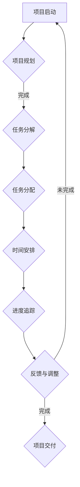
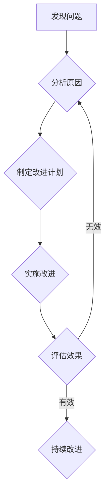
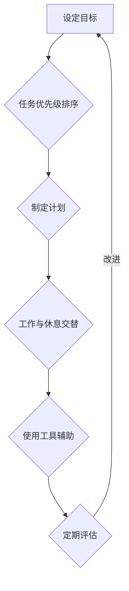

                 

# 《程序员如何进行时间管理》

> 关键词：时间管理、程序员、工作效率、任务管理、工作与生活平衡、Pomodoro 技法

> 摘要：本文将深入探讨程序员如何进行时间管理，以提高工作效率和生活质量。我们将从基本概念、核心原则、方法和技巧、实战应用以及持续改进等方面展开，结合实际案例，为程序员提供切实可行的建议和策略。

## 《程序员如何进行时间管理》目录大纲

### 第一部分：时间管理的基本概念

#### 第1章：时间管理的重要性

#### 1.1 时间管理的基本理念

#### 1.2 时间浪费的原因

#### 1.3 时间管理的目标

#### 1.4 时间管理的基本原则

### 第2章：时间管理的核心原则

#### 2.1 优先级排序原则

#### 2.2 资源整合原则

#### 2.3 持续改进原则

### 第二部分：时间管理的方法和技巧

#### 第3章：工作与生活平衡

#### 3.1 设定工作目标

#### 3.2 建立健康的生活习惯

#### 3.3 工作与生活平衡的实践案例

#### 第4章：任务管理与计划制定

#### 4.1 任务分类与优先级设定

#### 4.2 使用工具辅助任务管理

#### 4.3 高效计划制定方法

#### 第5章：时间管理技巧

#### 5.1 减少干扰的方法

#### 5.2 提高工作效率的技巧

#### 5.3 应对突发情况的策略

#### 第6章：时间管理工具与资源

#### 6.1 常用的时间管理工具

#### 6.2 优秀的时间管理资源推荐

#### 6.3 自我评估与改进

### 第三部分：时间管理的实战应用

#### 第7章：程序员的时间管理实践

#### 7.1 程序员的时间管理特点

#### 7.2 实战案例一：项目时间管理

#### 7.3 实战案例二：日常编程时间管理

#### 第8章：时间管理的持续改进

#### 8.1 持续改进的意义

#### 8.2 如何评估时间管理效果

#### 8.3 时间管理改进的途径

### 附录：时间管理资源与工具

#### 附录 A：常用时间管理工具使用指南

#### A.1 工具 A 的使用方法

#### A.2 工具 B 的使用方法

#### 附录 B：时间管理资源推荐

#### B.1 资源一：时间管理博客推荐

#### B.2 资源二：时间管理书籍推荐

#### B.3 资源三：时间管理在线课程推荐

## 1.1 时间管理的基本理念

时间管理是指通过规划和控制时间，以实现个人或组织的目标。在程序员的世界里，时间管理尤为重要。程序员的工作往往需要高度集中和长时间持续，而有效的时间管理可以帮助他们保持专注，提高工作效率，减少错误和重复工作。

时间管理的基本理念包括：

1. **设定目标**：明确自己的目标和任务，以驱动时间管理行为。
2. **优先级排序**：根据重要性和紧急性对任务进行排序，确保重要任务得到优先处理。
3. **任务分解**：将复杂任务分解为可管理的子任务，以便更好地规划和执行。
4. **计划制定**：制定详细的计划，包括任务的开始时间、结束时间和所需资源。
5. **持续反馈**：定期评估时间管理的效果，并根据反馈进行调整。

### 1.2 时间浪费的原因

程序员在工作中常常会面临时间浪费的问题，主要原因包括：

1. **任务切换**：频繁的任务切换会导致工作效率降低，因为每次切换都需要重新集中注意力。
2. **技术问题**：遇到难以解决的问题时，程序员可能会花费大量时间在错误的方向上。
3. **干扰**：电子邮件、社交媒体和其他外部干扰会打断程序员的工作流程。
4. **缺乏计划**：没有明确的计划和工作流程会导致时间浪费和效率低下。

### 1.3 时间管理的目标

时间管理的目标是：

1. **提高工作效率**：通过合理规划时间，提高完成任务的效率和速度。
2. **减少错误**：通过专注和减少干扰，降低错误率和代码缺陷。
3. **工作与生活平衡**：合理安排工作时间和休息时间，以保持身心健康。
4. **持续学习**：确保有足够的时间进行个人学习和技能提升。

## 2.1 优先级排序原则

优先级排序是时间管理的核心原则之一。在程序员的工作中，任务繁多且复杂，因此合理地分配时间和精力至关重要。

### 2.1.1 优先级排序的方法

优先级排序的方法包括：

1. **紧急-重要矩阵**：根据任务的紧急性和重要性将其分为四个象限。紧急且重要的任务应优先处理，不紧急但重要的任务也应尽量安排时间。

    
    
2. **关键路径法**：在项目管理中，关键路径法用于确定项目中任务的最长路径。关键路径上的任务具有最高的优先级。

3. **工作量评估**：根据任务的复杂程度和所需时间对任务进行工作量评估，并据此进行优先级排序。

### 2.1.2 优先级排序的伪代码

```python
# 伪代码：优先级排序

def priority_sort(tasks):
    # 初始化一个空列表，用于存储排序后的任务
    sorted_tasks = []

    # 遍历任务列表，根据优先级排序
    while tasks:
        max_priority = -1
        max_index = -1
        
        for i, task in enumerate(tasks):
            if task['priority'] > max_priority:
                max_priority = task['priority']
                max_index = i
                
        # 将优先级最高的任务添加到排序后的列表中
        sorted_tasks.append(tasks[max_index])
        
        # 从任务列表中删除已排序的任务
        tasks.pop(max_index)
        
    return sorted_tasks
```

### 2.1.3 优先级排序的实际案例

假设程序员小王有以下任务列表：

```python
tasks = [
    {'name': '修复bug', 'priority': 3},
    {'name': '编写文档', 'priority': 2},
    {'name': '开发新功能', 'priority': 4},
    {'name': '参加团队会议', 'priority': 1},
    {'name': '优化代码', 'priority': 3}
]
```

使用优先级排序方法，排序后的任务列表应为：

```python
[
    {'name': '参加团队会议', 'priority': 1},
    {'name': '开发新功能', 'priority': 4},
    {'name': '编写文档', 'priority': 2},
    {'name': '修复bug', 'priority': 3},
    {'name': '优化代码', 'priority': 3}
]
```

## 2.2 资源整合原则

资源整合原则强调在时间管理中合理利用各种资源，以最大化效率。对于程序员来说，资源包括但不限于：

1. **人力资源**：团队成员的技能和专长可以互补，提高团队的整体效率。
2. **技术资源**：包括开发工具、框架、库等，合理选择和使用这些资源可以节省时间和提高代码质量。
3. **信息资源**：包括文档、教程、博客、论坛等，这些资源可以帮助程序员快速解决问题和获取新知识。
4. **物理资源**：如工作站、网络、服务器等，确保这些资源的充足和稳定是高效工作的重要保障。

### 2.2.1 资源整合的方法

资源整合的方法包括：

1. **资源评估**：定期评估现有资源的利用情况，找出瓶颈和不足之处。
2. **资源共享**：鼓励团队成员共享资源，如代码、文档和技术知识。
3. **资源优化**：通过技术手段和管理策略优化资源的使用，如使用自动化工具进行代码测试和部署。

### 2.2.2 资源整合的实际案例

假设程序员小张所在的团队有以下资源：

- 人力资源：2名前端开发、3名后端开发、1名测试工程师。
- 技术资源：Vue.js、React、Django、PostgreSQL。
- 信息资源：内部知识库、GitHub、Stack Overflow。
- 物理资源：5台工作站、1个测试服务器。

为了提高资源整合效率，团队可以采取以下措施：

1. **明确分工**：根据团队成员的专长分配任务，确保每个人专注于自己最擅长的领域。
2. **代码库管理**：使用Git进行版本控制，确保代码库的整洁和易于维护。
3. **自动化测试**：使用自动化测试工具进行代码测试，减少人工测试的工作量。
4. **信息共享**：定期更新内部知识库，确保团队成员能够快速获取所需的信息。

### 2.2.3 资源整合的伪代码

```python
# 伪代码：资源整合

def resource_integration(team_members, tech_resources, info_resources, physical_resources):
    # 初始化资源整合计划
    integration_plan = {}

    # 根据团队成员的专长分配任务
    for member in team_members:
        integration_plan[member['name']] = member['skills']

    # 根据技术资源分配开发任务
    for resource in tech_resources:
        integration_plan[resource['name']] = resource['used_by']

    # 根据信息资源更新知识库
    integration_plan['knowledge_base'] = info_resources['latest']

    # 根据物理资源检查设备状态
    integration_plan['workstations'] = physical_resources['status']['workstations']
    integration_plan['test_server'] = physical_resources['status']['test_server']

    return integration_plan
```

## 2.3 持续改进原则

持续改进是时间管理的核心原则之一，它强调不断优化时间管理策略和实践。对于程序员来说，持续改进有助于提高工作效率、减少错误和提升生活质量。

### 2.3.1 持续改进的方法

持续改进的方法包括：

1. **定期评估**：定期评估时间管理策略和实际效果，找出问题和不足之处。
2. **反馈机制**：建立反馈机制，收集团队成员对时间管理策略的意见和建议。
3. **持续学习**：通过学习新的时间管理方法和工具，不断提升个人和团队的时间管理能力。
4. **优化流程**：根据评估和反馈，优化时间管理流程和工具，以提高效率和效果。

### 2.3.2 持续改进的实际案例

假设程序员小王所在团队已经使用了一段时间的时间管理工具，但发现仍然存在一些问题，如任务切换频繁、工作效率不高。为了持续改进，团队可以采取以下措施：

1. **评估现状**：通过数据分析，找出任务切换频繁的具体原因，如任务复杂度、任务量等。
2. **反馈收集**：通过问卷调查或团队讨论，收集团队成员对当前时间管理工具的意见和建议。
3. **学习新方法**：研究新的时间管理方法和工具，如Pomodoro技法和敏捷开发方法，了解其优点和应用场景。
4. **优化流程**：根据评估和反馈，调整任务分配和切换策略，引入Pomodoro技法和敏捷开发方法，以减少任务切换频率、提高工作效率。

### 2.3.3 持续改进的伪代码

```python
# 伪代码：持续改进

def continuous_improvement(time_management_strategy, feedback):
    # 初始化改进计划
    improvement_plan = {}

    # 评估当前时间管理策略
    assessment = assess_time_management(time_management_strategy)

    # 收集反馈
    feedback = collect_feedback(feedback)

    # 学习新方法
    new_methods = learn_new_methods()

    # 优化流程
    improvement_plan['new_strategy'] = optimize_time_management_strategy(assessment, feedback, new_methods)

    return improvement_plan
```

## 3.1 设定工作目标

设定工作目标是时间管理的第一步。明确的目标有助于程序员聚焦于重要任务，避免时间浪费，提高工作效率。以下是设定工作目标的方法：

### 3.1.1 目标设定的SMART原则

SMART原则是一种常用的目标设定方法，它要求目标具有以下特点：

1. **具体（Specific）**：目标要明确具体，避免模糊和抽象。
2. **可衡量（Measurable）**：目标要有量化指标，以便评估进度和效果。
3. **可实现（Achievable）**：目标要实际可行，避免设定过高或过低的目标。
4. **相关性（Relevant）**：目标要与个人或团队的整体目标相一致。
5. **时限性（Time-bound）**：目标要有明确的完成时限。

### 3.1.2 目标设定的伪代码

```python
# 伪代码：目标设定

def set_goals(goals, metrics, feasibility, relevance, deadline):
    # 初始化目标
    goal = {}

    # 设置目标具体性
    goal['specific'] = goals['specific']

    # 设置目标可衡量性
    goal['measurable'] = metrics

    # 设置目标可实现性
    goal['achievable'] = feasibility

    # 设置目标相关性
    goal['relevant'] = relevance

    # 设置目标时限性
    goal['deadline'] = deadline

    return goal
```

### 3.1.3 目标设定的实际案例

假设程序员小张要设定一个工作目标，以下是他的目标设定过程：

1. **具体性**：编写一个基于React的网页应用。
2. **可衡量性**：完成前端页面的设计和实现，包括用户注册、登录、个人信息管理等功能。
3. **可实现性**：已有React基础，且项目资源充足。
4. **相关性**：符合项目整体目标，提高用户体验。
5. **时限性**：两周内完成。

根据SMART原则，小张的工作目标应为：

```python
{
    'specific': '编写一个基于React的网页应用',
    'measurable': '完成前端页面的设计和实现，包括用户注册、登录、个人信息管理等功能',
    'achievable': '已有React基础，且项目资源充足',
    'relevant': '符合项目整体目标，提高用户体验',
    'deadline': '两周内完成'
}
```

## 3.2 建立健康的生活习惯

建立健康的生活习惯对于程序员来说至关重要。良好的生活习惯不仅有助于保持身体健康，还能提高工作效率，减少心理压力。以下是建立健康生活习惯的建议：

### 3.2.1 合理安排作息时间

合理安排作息时间是保持身心健康的基础。以下是一些建议：

1. **规律作息**：每天尽量保持固定的起床和睡觉时间，有助于调整生物钟，提高睡眠质量。
2. **充足睡眠**：确保每天有足够的睡眠时间，一般成年人需要7-9小时的睡眠。
3. **午休**：午饭后进行短暂的休息，有助于恢复体力和精力。

### 3.2.2 均衡饮食

均衡饮食有助于保持身体健康和大脑活力。以下是一些建议：

1. **多样化**：食物种类多样化，确保摄入各种营养素。
2. **适量**：控制食物摄入量，避免过量摄入导致健康问题。
3. **少油少盐**：减少油炸食品和盐分摄入，降低患病的风险。

### 3.2.3 适量运动

适量运动有助于保持身体健康和增强体质。以下是一些建议：

1. **定期运动**：每周至少进行3-5次运动，每次30-60分钟。
2. **多样化运动**：结合有氧运动和力量训练，提高身体素质。
3. **户外运动**：在户外进行运动，享受新鲜空气和自然光线，有助于放松身心。

### 3.2.4 减少电子设备使用

过度使用电子设备会对身体和心理健康产生负面影响。以下是一些建议：

1. **限定使用时间**：每天设定固定的电子设备使用时间，如晚上9点后不再使用手机和电脑。
2. **使用护眼模式**：开启护眼模式，减少蓝光对眼睛的伤害。
3. **定时休息**：长时间使用电子设备后，定时休息眼睛，避免视力疲劳。

### 3.2.5 保持社交活动

保持社交活动有助于缓解压力，提高生活质量。以下是一些建议：

1. **定期聚会**：与朋友和家人定期聚会，增进感情。
2. **参加社团活动**：加入兴趣社团，参与社交活动，结识新朋友。
3. **志愿服务**：参与志愿服务，帮助他人，同时提高自己的社交能力。

## 3.3 工作与生活平衡的实践案例

为了更好地理解如何实现工作与生活平衡，以下是一个实践案例：

### 案例背景

程序员小李是一名年轻的技术专家，在一家科技公司工作。他非常热爱编程和技术创新，但工作压力大，经常加班，导致生活质量下降。小李意识到需要改善这种情况，实现工作与生活平衡。

### 实践步骤

1. **设定工作目标**：小李首先设定了具体、可衡量、可实现、相关和时限性的工作目标，如每周完成3个关键任务，每天工作8小时。

2. **优化时间管理**：小李开始使用Pomodoro技法，将工作时间分为25分钟工作周期和5分钟休息周期，提高专注力和工作效率。

3. **健康生活习惯**：小李建立了健康的生活习惯，每天早上7点起床，保证充足的睡眠，定期锻炼身体，并控制饮食。

4. **减少干扰**：小李将工作场所与生活区域分开，减少工作时的干扰，并在工作时间内关闭社交媒体通知。

5. **社交活动**：小李每周安排固定的社交时间，与朋友和家人聚会，参加兴趣社团活动，以缓解工作压力。

### 实践效果

通过上述实践，小李实现了工作与生活平衡：

1. **工作效率提高**：使用Pomodoro技法，小李的工作效率显著提高，完成任务所需时间减少。

2. **生活质量改善**：小李通过建立健康的生活习惯，身体素质和精神状态得到改善，工作后的生活质量提高。

3. **工作与生活分离**：小李成功地将工作与生活分开，不再因工作而影响生活质量。

4. **社交关系增强**：小李通过定期社交活动，增强了与朋友和家人的关系，提升了生活满意度。

### 结论

小李的实践案例表明，通过合理的时间管理、健康的生活习惯和社交活动，程序员可以实现工作与生活平衡，提高工作效率和生活质量。

## 4.1 任务分类与优先级设定

在时间管理中，任务分类和优先级设定是至关重要的环节。对于程序员来说，合理地分类和优先级设定可以帮助他们更高效地处理任务，减少时间浪费，提高工作效率。

### 4.1.1 任务分类的方法

任务分类的方法可以根据任务的重要性和紧急性进行。以下是一种常用的分类方法：

1. **紧急且重要**：这类任务需要立即处理，如紧急修复的bug、重要会议等。这些任务对项目和团队的进展有直接影响，必须优先处理。

2. **重要但不紧急**：这类任务虽然不紧急，但对项目成功有重要影响，如文档编写、代码优化等。这些任务应该在紧急任务完成后处理，以避免影响项目进度。

3. **紧急但不重要**：这类任务可能需要立即处理，但对项目的影响较小，如处理邮件、回复社交媒体消息等。这些任务可以根据实际情况安排处理，但应尽量避免影响重要任务的进行。

4. **既不紧急也不重要**：这类任务对项目的影响较小，如浏览新闻、阅读社交媒体等。这些任务可以在特定时间进行，如午休时间，但应尽量避免影响工作进度。

### 4.1.2 优先级设定的伪代码

```python
# 伪代码：任务优先级设定

def set_priority(tasks):
    sorted_tasks = []

    for task in tasks:
        if task['importance'] == '紧急且重要':
            sorted_tasks.append(task)
        elif task['importance'] == '重要但不紧急':
            sorted_tasks.append(task)
        elif task['importance'] == '紧急但不重要':
            sorted_tasks.append(task)
        else:
            sorted_tasks.append(task)

    return sorted_tasks
```

### 4.1.3 任务分类与优先级设定的实际案例

假设程序员小王有以下任务列表：

```python
tasks = [
    {'name': '修复bug', 'importance': '紧急且重要'},
    {'name': '编写文档', 'importance': '重要但不紧急'},
    {'name': '处理邮件', 'importance': '紧急但不重要'},
    {'name': '学习新技术', 'importance': '既不紧急也不重要'}
]
```

根据任务分类和优先级设定方法，排序后的任务列表应为：

```python
[
    {'name': '修复bug', 'importance': '紧急且重要'},
    {'name': '编写文档', 'importance': '重要但不紧急'},
    {'name': '处理邮件', 'importance': '紧急但不重要'},
    {'name': '学习新技术', 'importance': '既不紧急也不重要'}
]
```

通过这种分类和优先级设定方法，程序员可以更清晰地了解哪些任务需要优先处理，从而更高效地完成工作。

## 4.2 使用工具辅助任务管理

在现代社会，程序员面临着大量的任务和项目。为了更好地管理这些任务，提高工作效率，使用合适的工具辅助任务管理变得至关重要。以下是一些常用的任务管理工具及其使用方法：

### 4.2.1 Trello

Trello是一款基于看板（Kanban）方法的任务管理工具。它通过创建卡片、列表和板来组织任务，使任务管理更加直观和高效。

1. **创建板**：首先创建一个板，每个板代表一个项目或任务集合。
2. **创建列表**：在板中创建列表，每个列表代表任务的某个阶段，如“待办”、“进行中”、“已完成”。
3. **创建卡片**：在列表中创建卡片，每张卡片代表一个具体的任务。
4. **分配任务**：为卡片添加标签、描述和成员，以明确任务的责任人和进度。
5. **调整优先级**：通过拖放卡片来调整任务的优先级。

### 4.2.2 Asana

Asana是一款功能强大的任务管理工具，适合团队协作。它提供了丰富的功能，如任务分配、进度追踪、报告生成等。

1. **创建项目**：创建一个项目，每个项目代表一个任务集合。
2. **添加任务**：在项目中添加任务，为任务设定名称、描述、优先级和截止日期。
3. **分配任务**：将任务分配给团队成员，并设置任务的依赖关系。
4. **跟踪进度**：使用甘特图或看板视图来跟踪任务进度。
5. **报告生成**：生成报告，以了解项目的整体进度和团队成员的工作情况。

### 4.2.3 Jira

Jira是一款广泛应用于敏捷开发的任务管理工具，具有强大的功能，如问题跟踪、敏捷板、报告生成等。

1. **创建项目**：创建一个项目，每个项目代表一个软件项目或任务集合。
2. **添加问题**：在项目中添加问题，为问题设定类型、优先级、标签和责任人。
3. **分配任务**：将问题分配给团队成员，并设置问题的依赖关系。
4. **敏捷板**：使用敏捷板来跟踪问题状态，如“待办”、“进行中”、“已完成”。
5. **报告生成**：生成报告，以了解项目的整体进度和团队成员的工作情况。

### 4.2.4 Todoist

Todoist是一款简单易用的任务管理工具，适合个人和团队。它提供了丰富的功能，如任务创建、任务分配、提醒设置等。

1. **创建任务**：创建任务，为任务设定名称、描述、优先级和截止日期。
2. **分配任务**：为任务分配给团队成员，并设置任务的依赖关系。
3. **设置提醒**：为任务设置提醒，以避免错过重要任务。
4. **分类任务**：根据任务类型或项目分类任务，以便更好地组织和管理任务。
5. **报告生成**：生成报告，以了解任务的完成情况和团队成员的工作情况。

通过使用这些任务管理工具，程序员可以更好地组织任务、跟踪进度、提高工作效率，从而实现高效的工作和生活。

## 4.3 高效计划制定方法

制定高效计划是时间管理的核心步骤之一，它有助于程序员明确目标、合理安排时间，并确保任务按计划完成。以下是几种高效的计划制定方法：

### 4.3.1 目标导向计划法

目标导向计划法是一种基于目标的计划方法，它强调设定明确的目标，并根据目标制定详细的计划。以下是目标导向计划法的步骤：

1. **设定目标**：根据个人或团队的整体目标，明确要达成的具体目标。
2. **分解目标**：将大目标分解为小目标，使每个小目标具有明确的目标和可衡量的指标。
3. **确定任务**：根据小目标，确定需要完成的任务，并分配给相应的责任人。
4. **设定时间**：为每个任务设定开始和结束时间，确保任务在规定时间内完成。
5. **制定计划**：将任务和责任人与时间安排结合起来，形成详细的计划。

### 4.3.2 罗盘计划法

罗盘计划法是一种基于优先级和关键路径的计划方法，它强调根据任务的优先级和关键路径安排工作。以下是罗盘计划法的步骤：

1. **确定优先级**：根据任务的重要性和紧急性，确定每个任务的优先级。
2. **绘制关键路径**：确定项目中的关键任务，并绘制关键路径。
3. **分配任务**：将任务分配给责任人，并确保关键任务有人负责。
4. **设定时间**：为每个任务设定开始和结束时间，确保关键任务在规定时间内完成。
5. **调整计划**：根据实际情况和反馈，及时调整计划，以确保项目按计划进行。

### 4.3.3 甘特图法

甘特图法是一种基于时间线的计划方法，它通过绘制时间线来展示任务进度和关键路径。以下是甘特图法的步骤：

1. **确定任务**：列出所有需要完成的任务，并确定每个任务的开始和结束时间。
2. **绘制时间线**：在时间线上绘制任务条，表示每个任务的持续时间。
3. **关键路径**：识别关键路径，并在时间线上标记关键任务。
4. **调整计划**：根据实际情况和反馈，调整时间线和任务安排，以确保项目按计划进行。
5. **跟踪进度**：定期检查任务进度，并根据进度调整计划。

### 4.3.4 实际案例

假设程序员小王要开发一款新软件，以下是他的计划制定过程：

1. **设定目标**：开发一款功能齐全、用户友好的软件，提高用户满意度。
2. **分解目标**：将目标分解为功能模块，如用户注册、登录、个人信息管理、数据展示等。
3. **确定任务**：为每个功能模块确定具体的任务，如前端页面设计、后端接口开发、数据库设计等。
4. **设定时间**：为每个任务设定开始和结束时间，确保任务在规定时间内完成。
5. **绘制时间线**：在时间线上绘制任务条，表示每个任务的持续时间，并识别关键路径。
6. **调整计划**：根据实际情况和反馈，调整时间线和任务安排，以确保项目按计划进行。

通过以上计划制定方法，小王可以确保项目有条不紊地进行，并在规定时间内完成。

## 5.1 减少干扰的方法

在编程工作中，干扰会显著影响程序员的工作效率和专注度。以下是一些减少干扰的方法，帮助程序员更好地集中精力，提高工作效率。

### 5.1.1 消除物理干扰

物理干扰包括噪音、办公环境和其他可能分散注意力的因素。以下是一些消除物理干扰的方法：

1. **封闭空间**：在独立的工作室或办公室中工作，减少外界噪音和干扰。
2. **耳机**：使用耳机，通过播放白噪声或音乐来屏蔽外部噪音。
3. **优化办公环境**：保持办公桌整洁，减少杂物，创造一个舒适、整洁的工作环境。

### 5.1.2 技术工具

使用技术工具可以帮助程序员减少干扰，以下是一些常用的工具：

1. **邮件和消息管理**：使用邮件过滤器和消息通知管理工具，如Mailbox或Boomerang，设置特定的时间查看邮件和消息，避免频繁中断。
2. **社交媒体管理**：使用应用程序如StayFocusd或Forest来限制社交媒体的使用时间，帮助提高专注力。
3. **屏幕时间跟踪**：使用屏幕时间跟踪工具，如RescueTime或SelfControl，监控和限制使用电脑的时间，减少不必要的干扰。

### 5.1.3 自我管理

自我管理是减少干扰的关键，以下是一些自我管理的方法：

1. **设定工作时间**：制定明确的工作时间表，设定工作时间，并在非工作时间避免处理工作事务。
2. **专注时间段**：使用Pomodoro技法，将工作时间分为25分钟的专注时间段，每个时间段后休息5分钟，帮助提高专注力。
3. **定期休息**：确保每隔一段时间进行短暂的休息，如每工作45分钟后休息10分钟，以缓解视觉疲劳和身体疲劳。

### 5.1.4 实际案例

假设程序员小李在一家开放式的办公室工作，经常受到同事谈话和外部噪音的干扰。为了提高工作效率，小李采取以下措施：

1. **封闭空间**：小李申请了一间独立办公室，减少外部干扰。
2. **耳机**：小李使用降噪耳机，通过播放白噪声屏蔽外部噪音。
3. **邮件和消息管理**：小李设置了邮件过滤器和消息通知管理工具，只在特定的时间查看邮件和消息，避免频繁中断。
4. **社交媒体管理**：小李使用StayFocusd应用程序限制社交媒体的使用时间，提高专注力。
5. **专注时间段**：小李使用Pomodoro技法，将工作时间分为25分钟的专注时间段，每个时间段后休息5分钟。

通过这些措施，小李显著提高了工作效率，减少了因干扰导致的时间浪费。

## 5.2 提高工作效率的技巧

在编程工作中，提高工作效率是每个程序员都追求的目标。以下是一些实用的技巧，可以帮助程序员更高效地完成任务，提高生产力。

### 5.2.1 代码复用

代码复用是提高工作效率的重要技巧之一。通过编写可重用的代码模块，程序员可以避免重复编写相同的代码，节省时间和精力。以下是一些实现代码复用的方法：

1. **函数和模块**：编写通用的函数和模块，以便在不同的项目中重复使用。
2. **类和对象**：使用面向对象编程，创建可重用的类和对象。
3. **库和框架**：利用现有的库和框架，减少代码开发和维护的工作量。

### 5.2.2 代码优化

代码优化是提高工作效率的另一个重要方面。通过优化代码，可以减少运行时间和资源消耗，提高系统的性能。以下是一些代码优化的技巧：

1. **算法优化**：选择更高效的算法和数据结构，以减少计算时间和空间消耗。
2. **循环优化**：减少循环的迭代次数，使用循环优化技巧，如使用循环展开、提前退出循环等。
3. **内存管理**：合理分配和释放内存，避免内存泄漏和浪费。

### 5.2.3 版本控制

版本控制是编程中必不可少的工具，通过使用版本控制系统，如Git，程序员可以更好地管理代码，提高协作效率。以下是一些版本控制的最佳实践：

1. **分支管理**：使用分支管理策略，如Git Flow，确保代码的整洁和可维护性。
2. **代码审查**：进行代码审查，确保代码的质量和一致性，减少缺陷和错误。
3. **持续集成**：使用持续集成工具，如Jenkins或Travis CI，自动化测试和部署，提高开发效率。

### 5.2.4 自动化

自动化是提高工作效率的关键，通过自动化工具和脚本，程序员可以减少重复性工作，专注于更有价值的事情。以下是一些自动化的方法：

1. **构建和部署**：使用自动化构建和部署工具，如Jenkins或Docker，自动化构建、测试和部署流程。
2. **测试**：使用自动化测试工具，如Selenium或JUnit，自动化测试代码，确保代码质量。
3. **文档生成**：使用自动化工具生成代码文档，如Doxygen或JSDoc，提高代码的可读性和可维护性。

### 5.2.5 实际案例

假设程序员小张正在开发一个复杂的Web应用程序，以下是他的工作效率提升实践：

1. **代码复用**：小张编写了多个可重用的函数和模块，用于处理常见的数据处理和UI操作，减少重复编写代码的工作量。
2. **代码优化**：小张使用优化算法和数据结构，如动态规划，优化关键功能的计算时间，提高了系统的性能。
3. **版本控制**：小张使用Git进行版本控制，通过分支管理和代码审查，确保代码的整洁和一致性，减少了错误和冲突。
4. **自动化**：小张使用Jenkins自动化构建和部署，通过配置脚本，自动化测试和部署流程，提高了开发效率。

通过这些实践，小张显著提高了工作效率，项目进展顺利，代码质量和用户体验也得到了提升。

## 5.3 应对突发情况的策略

在编程工作中，突发情况是不可避免的。有效应对突发情况可以帮助程序员保持工作稳定，避免项目进度延误。以下是一些应对突发情况的策略：

### 5.3.1 灵活调整计划

灵活调整计划是应对突发情况的关键。以下是一些方法：

1. **预留缓冲时间**：在计划中预留一定的缓冲时间，以应对突发情况。
2. **优先级调整**：根据突发情况的重要性和紧急性，调整任务的优先级，确保关键任务得到优先处理。
3. **灵活分工**：根据实际情况调整团队成员的分工，确保有足够的人力和资源应对突发情况。

### 5.3.2 通讯和协作

有效的通讯和协作是应对突发情况的关键。以下是一些方法：

1. **建立紧急通讯渠道**：建立快速响应的紧急通讯渠道，如即时通讯工具或电话会议，以便团队成员及时沟通。
2. **明确责任分工**：明确每个团队成员在突发情况中的责任和角色，确保每个人都清楚自己的任务。
3. **定期演练**：定期进行突发情况演练，提高团队的应急响应能力。

### 5.3.3 应急预案

制定应急预案是应对突发情况的重要步骤。以下是一些方法：

1. **风险评估**：对项目中的潜在风险进行评估，制定相应的应急预案。
2. **备份和恢复**：定期备份重要数据和代码，确保在突发情况下能够快速恢复。
3. **故障处理流程**：制定故障处理流程，确保在突发情况下能够快速定位问题并进行修复。

### 5.3.4 实际案例

假设程序员小张所在的项目团队遇到了一个突发情况：一名关键成员因病请假，导致项目进度受到严重影响。以下是团队应对这一突发情况的方法：

1. **灵活调整计划**：团队根据情况调整计划，将受影响的任务重新分配给其他成员，确保项目能够继续进行。
2. **通讯和协作**：团队建立了紧急通讯渠道，通过电话会议和即时通讯工具，保持紧密沟通，确保团队成员之间信息畅通。
3. **应急预案**：团队根据应急预案，快速备份和恢复关键数据，确保项目资源不受影响。
4. **任务优先级调整**：团队根据实际情况调整任务优先级，确保关键任务得到优先处理。

通过这些策略，团队成功应对了突发情况，项目进度未受严重影响，最终按时完成了项目。

## 6.1 常用的时间管理工具

在程序员的工作中，时间管理工具起着至关重要的作用。以下是一些常用的时间管理工具，以及它们的使用方法和特点：

### 6.1.1 Trello

Trello是一种基于看板（Kanban）方法的任务管理工具。它通过创建卡片、列表和板来组织任务，使任务管理更加直观和高效。

**使用方法**：

1. **创建板**：在Trello中创建一个板，每个板代表一个项目或任务集合。
2. **创建列表**：在板中创建列表，每个列表代表任务的某个阶段，如“待办”、“进行中”、“已完成”。
3. **创建卡片**：在列表中创建卡片，每张卡片代表一个具体的任务。
4. **分配任务**：为卡片添加标签、描述和成员，以明确任务的责任人和进度。

**特点**：

- **简单直观**：界面简单，易于上手。
- **灵活性强**：可以根据需要自定义列表和卡片。

### 6.1.2 Asana

Asana是一款功能强大的任务管理工具，适合团队协作。它提供了丰富的功能，如任务分配、进度追踪、报告生成等。

**使用方法**：

1. **创建项目**：在Asana中创建一个项目，每个项目代表一个任务集合。
2. **添加任务**：在项目中添加任务，为任务设定名称、描述、优先级和截止日期。
3. **分配任务**：将任务分配给团队成员，并设置任务的依赖关系。
4. **跟踪进度**：使用甘特图或看板视图来跟踪任务进度。
5. **报告生成**：生成报告，以了解项目的整体进度和团队成员的工作情况。

**特点**：

- **功能强大**：提供了多种视图和报告功能，方便团队协作。
- **集成度高**：可以与多个第三方工具集成。

### 6.1.3 Jira

Jira是一款广泛应用于敏捷开发的任务管理工具，具有强大的功能，如问题跟踪、敏捷板、报告生成等。

**使用方法**：

1. **创建项目**：在Jira中创建一个项目，每个项目代表一个软件项目或任务集合。
2. **添加问题**：在项目中添加问题，为问题设定类型、优先级、标签和责任人。
3. **分配任务**：将问题分配给团队成员，并设置问题的依赖关系。
4. **敏捷板**：使用敏捷板来跟踪问题状态，如“待办”、“进行中”、“已完成”。
5. **报告生成**：生成报告，以了解项目的整体进度和团队成员的工作情况。

**特点**：

- **灵活性强**：提供了多种敏捷开发模板，适用于不同类型的项目。
- **功能丰富**：支持自定义字段和视图。

### 6.1.4 Todoist

Todoist是一款简单易用的任务管理工具，适合个人和团队。它提供了丰富的功能，如任务创建、任务分配、提醒设置等。

**使用方法**：

1. **创建任务**：在Todoist中创建任务，为任务设定名称、描述、优先级和截止日期。
2. **分配任务**：为任务分配给团队成员，并设置任务的依赖关系。
3. **设置提醒**：为任务设置提醒，以避免错过重要任务。
4. **分类任务**：根据任务类型或项目分类任务，以便更好地组织和管理任务。
5. **报告生成**：生成报告，以了解任务的完成情况和团队成员的工作情况。

**特点**：

- **简洁易用**：界面简洁，功能直观。
- **跨平台支持**：支持多种平台和设备，方便同步和访问。

通过这些常用的时间管理工具，程序员可以更好地组织任务、跟踪进度、提高工作效率，从而实现高效的工作和生活。

## 6.2 优秀的时间管理资源推荐

为了帮助程序员更好地进行时间管理，以下推荐一些优秀的时间管理资源，包括博客、书籍和在线课程。

### 6.2.1 博客推荐

1. **HBR Blog Network**：哈佛商业评论博客网络提供了丰富的关于时间管理和工作效率的文章，涵盖了多个行业和领域。
2. **Lifehacker**：Lifehacker是一个专门讨论生活技巧和效率提升的博客，其中有很多关于时间管理的实用技巧和工具推荐。
3. **The Pomodoro Technique®**：这是关于Pomodoro技法的官方博客，提供了详细的理论和实践指导。

### 6.2.2 书籍推荐

1. **《高效能人士的七个习惯》**：史蒂芬·柯维的这本书介绍了如何通过习惯的养成来提高个人效率和生产力。
2. **《深度工作：如何有效利用每一点脑力》**：卡尔·纽波特在这本书中探讨了深度工作的重要性，并提供了一系列实用的方法和策略。
3. **《时间管理心理学》**：迈克尔·莱伯曼的这本书深入探讨了时间管理的心理学原理，帮助读者理解时间浪费的原因，并提供解决方案。

### 6.2.3 在线课程推荐

1. **Coursera**：Coursera提供了多个关于时间管理和工作效率的课程，包括《时间管理和生产力》等，由知名大学和专业机构提供。
2. **Udemy**：Udemy上有丰富的在线课程，涵盖了时间管理、Pomodoro技法、任务管理等各个方面。
3. **edX**：edX是另一个提供高质量在线课程的平台，其中有很多关于时间管理的课程，如《时间管理：提升效率的技巧》等。

通过这些资源，程序员可以系统地学习时间管理的理论和方法，结合实践不断提升个人工作效率。

## 6.3 自我评估与改进

自我评估是时间管理的重要组成部分，通过定期评估，程序员可以了解自己的时间管理效果，发现问题和不足，从而进行改进。以下是自我评估与改进的步骤和方法：

### 6.3.1 自我评估的步骤

1. **设定评估标准**：明确评估的标准和指标，如工作效率、任务完成率、时间利用率等。
2. **收集数据**：收集与评估标准相关的数据，如工作时长、任务完成情况、时间浪费情况等。
3. **分析数据**：对收集的数据进行分析，找出时间管理中的问题和不足之处。
4. **撰写评估报告**：根据分析结果，撰写评估报告，总结时间管理的效果和问题。

### 6.3.2 自我评估的方法

1. **工作日志法**：记录每天的工作内容、时间分配和任务完成情况，通过日志分析时间管理效果。
2. **时间跟踪工具**：使用时间跟踪工具，如RescueTime或Toggl，记录工作时间和任务进度，以便进行量化分析。
3. **自我反思**：定期进行自我反思，回顾自己的工作习惯和时间管理策略，思考如何改进。

### 6.3.3 改进的时间管理策略

1. **优化任务分配**：根据评估结果，重新分配任务，确保任务分配合理，避免任务过多或过少。
2. **调整工作时间表**：根据评估结果，调整工作时间表，确保工作时间更加合理，减少无效工作时间。
3. **引入新工具和方法**：根据评估结果，引入新的时间管理工具和方法，如Pomodoro技法、敏捷开发等。
4. **持续学习和培训**：参加时间管理的培训和学习，不断提升时间管理能力和技能。

通过自我评估和持续改进，程序员可以更好地掌握时间管理，提高工作效率，实现个人和职业目标。

## 7.1 程序员的时间管理特点

程序员的工作具有特殊性，这决定了他们在时间管理上需要采取独特的方法和策略。以下是程序员在时间管理方面的一些特点：

### 7.1.1 高度集中性

程序员的工作往往需要高度集中和长时间的持续，这要求他们能够有效管理时间，确保在关键时间段内保持专注。为了达到这个目标，程序员需要学会如何在工作时间内减少干扰，避免频繁的任务切换，以提高工作效率。

### 7.1.2 项目导向

程序员的工作通常围绕项目进行，项目目标明确、时间有限。这使得时间管理成为项目成功的关键因素。程序员需要能够根据项目进度和优先级，合理安排时间和资源，确保项目按计划完成。

### 7.1.3 技术复杂度

编程工作涉及大量的技术细节和复杂度，程序员在解决问题和编写代码时可能会遇到各种挑战。这要求他们不仅要有良好的时间管理技能，还需要具备快速学习和适应新技术的能力。

### 7.1.4 工作与生活平衡

程序员的工作压力通常较大，工作时间较长，这可能导致工作与生活平衡受到挑战。有效的时间管理可以帮助程序员在工作和生活之间找到平衡，确保身心健康。

### 7.1.5 持续学习

编程领域发展迅速，新技术和工具层出不穷。程序员需要不断学习和更新知识，以保持竞争力。时间管理在此过程中发挥着重要作用，帮助程序员合理安排学习和工作时间，确保持续学习和个人成长。

## 7.2 实战案例一：项目时间管理

### 案例背景

程序员小李所在的公司接到了一个重要的项目，需要在两个月内完成一个基于云计算的在线教育平台。该项目涉及多个功能模块，包括用户注册、课程管理、在线直播和互动等。为了确保项目按时完成，小李决定采用时间管理工具和方法进行项目时间管理。

### 实践步骤

1. **项目规划**：首先，小李与团队成员一起制定了详细的项目计划，明确了项目的目标、功能模块、时间线和里程碑。

2. **任务分解**：根据项目计划，小李将项目分解为多个可管理的子任务，并确定了每个任务的负责人和截止日期。

3. **使用工具**：小李选择了Jira作为任务管理工具，将所有任务和子任务都分配到Jira中，并设置了任务的优先级和状态。

4. **进度追踪**：小李定期查看Jira中的任务进度，通过甘特图和看板视图了解任务的状态和延迟情况。

5. **定期会议**：每周，小李组织团队进行一次项目进度会议，讨论任务完成情况和遇到的问题，制定解决方案。

6. **调整计划**：根据实际情况，小李和团队会定期调整项目计划，确保项目能够按计划进行。

### 实践效果

通过上述步骤，小李和团队成功在两个月内完成了项目，并达到了客户的要求。项目交付后，客户反馈良好，项目质量得到认可。此外，通过Jira的进度追踪和团队会议，小李和团队能够及时发现和解决问题，确保了项目的高效推进。

### 结论

该案例表明，有效的项目时间管理对于确保项目按时、按质完成至关重要。通过合理规划、任务分解、工具使用和团队协作，程序员可以更好地管理项目进度，提高工作效率。

## 7.3 实战案例二：日常编程时间管理

### 案例背景

程序员小张是一名资深软件工程师，每天需要处理多个任务和项目。为了提高工作效率，小张决定采用时间管理方法来管理日常编程工作。

### 实践步骤

1. **设定工作目标**：每天早上，小张会首先设定当天的工作目标，明确要完成的任务和优先级。

2. **使用Pomodoro技法**：小张采用Pomodoro技法，将工作时间分为25分钟的工作周期和5分钟的休息周期，以提高专注力和工作效率。

3. **任务优先级排序**：根据任务的紧急性和重要性，小张使用优先级排序原则对任务进行排序，确保重要任务优先处理。

4. **定期评估**：每隔一段时间，小张会评估自己的时间管理效果，包括任务完成情况和时间利用率。

5. **调整计划**：根据评估结果，小张会调整工作计划，优化时间管理策略，确保工作更加高效。

### 实践效果

通过上述步骤，小张的工作效率显著提高。他能够更好地集中注意力，减少任务切换带来的时间浪费，并在规定时间内完成更多任务。此外，通过定期评估和调整计划，小张能够不断优化自己的时间管理方法，使其更加适应实际情况。

### 结论

该案例表明，合理的时间管理对于提高程序员的工作效率至关重要。通过设定目标、使用Pomodoro技法、任务优先级排序和定期评估，程序员可以更好地管理自己的时间，提高工作效率，实现工作与生活的平衡。

## 8.1 持续改进的意义

持续改进是时间管理的重要组成部分，其意义在于通过不断的反思和调整，优化个人和团队的工作方式，从而实现更高的效率和更优的工作成果。对于程序员来说，持续改进具有以下几个方面的意义：

### 8.1.1 提高工作效率

通过持续改进，程序员可以识别和消除工作中的瓶颈和低效环节，从而提高工作效率。例如，通过分析代码审查过程中的耗时任务，可以优化审查流程，减少不必要的步骤，从而加快代码发布速度。

### 8.1.2 提升团队协作

持续改进有助于提升团队的协作效率和沟通质量。通过定期的评估和反馈，团队成员可以更好地理解彼此的工作方式和需求，从而在协作中减少误解和冲突，提高团队的整体效能。

### 8.1.3 促进个人成长

持续改进鼓励程序员不断学习和掌握新技能，提高个人能力。通过反思自己的工作方法，程序员可以发现自身的不足，并寻求改进途径，从而实现个人职业成长。

### 8.1.4 提升项目质量

持续改进可以帮助程序员在项目开发过程中不断优化代码和设计，减少缺陷和错误，提升项目的整体质量。例如，通过持续的技术评审和代码优化，可以确保项目在功能和性能上达到最佳状态。

### 8.1.5 增强适应能力

在快速变化的科技环境中，持续改进有助于程序员提高适应能力和灵活性。通过不断学习和实践，程序员可以更快地适应新技术和新工具，从而在竞争激烈的市场中保持领先地位。

### 8.1.6 提高生活质量

持续改进不仅有助于提升工作效率和项目质量，还能帮助程序员实现工作与生活的平衡，提高生活质量。通过优化工作方式，程序员可以减少工作压力，拥有更多的时间进行休闲和自我发展。

总之，持续改进是程序员提升工作效率、实现个人成长、提升团队协作能力和项目质量的重要途径。它不仅有助于提高程序员的工作质量，还能显著改善他们的生活质量。

## 8.2 如何评估时间管理效果

评估时间管理效果是确保时间管理策略有效性的关键步骤。以下是一些评估时间管理效果的方法和指标：

### 8.2.1 完成率

**完成率**是评估时间管理效果的最直接指标，它反映了在设定的时间内完成任务的比率。计算公式如下：

$$
完成率 = \frac{完成任务数}{总任务数}
$$

**示例**：如果程序员小张在一个月内设定了10个任务，实际完成了8个，则其完成率为80%。

### 8.2.2 工作效率

**工作效率**是衡量时间管理效果的重要指标，它反映了在特定时间内完成工作量的多少。计算公式如下：

$$
工作效率 = \frac{总工作量}{总工作时间}
$$

**示例**：如果小张在一个月内工作了160小时，完成了8个任务，每个任务的工作量为20小时，则其工作效率为：

$$
工作效率 = \frac{8 \times 20}{160} = 1
$$

这表示小张每小时能够完成1个任务。

### 8.2.3 任务延迟率

**任务延迟率**反映了任务完成时间与计划完成时间之间的差距，它是评估时间管理效果的一个重要指标。计算公式如下：

$$
任务延迟率 = \frac{延迟完成任务数}{总任务数}
$$

**示例**：如果小张有5个任务延迟完成，总任务数为10个，则其任务延迟率为50%。

### 8.2.4 时间浪费率

**时间浪费率**反映了在总工作时间中未被有效利用的时间比例，它是评估时间管理效果的一个重要指标。计算公式如下：

$$
时间浪费率 = \frac{浪费的时间}{总工作时间}
$$

**示例**：如果小张一个月的总工作时间为160小时，其中浪费了20小时，则其时间浪费率为：

$$
时间浪费率 = \frac{20}{160} = 12.5\%
$$

### 8.2.5 自我评估

除了量化指标，**自我评估**也是评估时间管理效果的重要方法。程序员可以通过自我反思，评估自己在时间管理方面的表现，包括：

- 是否能够按照计划完成任务？
- 在工作中是否能够保持专注，避免干扰？
- 是否能够合理安排工作与休息时间？
- 是否能够持续学习和优化时间管理策略？

通过这些评估方法，程序员可以全面了解自己的时间管理效果，发现存在的问题，并采取相应的改进措施。

## 8.3 时间管理改进的途径

为了持续改进时间管理，程序员可以采取以下策略和措施：

### 8.3.1 培养良好的时间管理习惯

- **设定明确的目标**：每天设定具体的工作目标和任务，确保工作有方向和重点。
- **合理安排工作时间**：制定合理的工作时间表，避免过度加班和疲劳工作。
- **定期休息和运动**：确保定期休息和进行适量的运动，保持身心健康。
- **避免多任务处理**：专注于单一任务，避免频繁的任务切换，以提高专注力和工作效率。

### 8.3.2 引入有效的工具和方法

- **使用时间管理工具**：如Trello、Asana、Jira等，帮助更好地组织和管理任务。
- **应用Pomodoro技法**：通过设定专注时间段和休息时间，提高工作效率。
- **引入敏捷开发方法**：如Scrum和Kanban，以提高团队的协作效率和响应能力。

### 8.3.3 定期评估和反馈

- **定期自我评估**：定期评估时间管理效果，识别存在的问题和改进空间。
- **寻求反馈**：向同事、领导或导师寻求反馈，获取外部视角和建议。
- **持续改进**：根据评估和反馈，不断优化时间管理策略和方法。

### 8.3.4 培训和学习

- **参加时间管理培训**：参加专业的时间管理培训课程，学习最新的时间管理技巧和工具。
- **阅读相关书籍**：阅读有关时间管理的经典书籍，如《高效能人士的七个习惯》、《深度工作》等，获取理论知识和实用方法。
- **在线学习资源**：利用在线课程和博客，学习时间管理的最佳实践和案例。

通过以上途径，程序员可以不断提升自己的时间管理能力，实现个人和团队的工作效率最大化。

## 附录：时间管理资源与工具

### 附录 A：常用时间管理工具使用指南

#### A.1 Trello的使用方法

1. **创建板和列表**：登录Trello，点击“新建板”，输入板名称，点击“创建”。然后，在板上创建列表，用于组织任务状态。
2. **添加卡片**：在列表中点击“添加卡片”，输入卡片标题和描述，点击“添加”。可以为卡片添加标签、成员和截止日期。
3. **移动卡片**：通过拖放卡片，可以调整任务的状态和优先级。
4. **查看详情**：点击卡片，可以查看详细信息，包括任务的进展、标签和成员。

#### A.2 Asana的使用方法

1. **创建项目**：登录Asana，点击“新建项目”，输入项目名称，点击“创建”。在项目中添加任务，设定任务名称、描述、优先级和截止日期。
2. **分配任务**：在任务详情页面，点击“分配给”，选择团队成员，将任务分配给指定成员。
3. **跟踪进度**：使用甘特图和看板视图，跟踪任务的进展和状态。
4. **报告生成**：在项目详情页面，点击“报告”，生成项目报告，了解项目的整体进度。

#### A.3 Jira的使用方法

1. **创建项目**：登录Jira，点击“新建项目”，选择项目模板，输入项目名称，点击“创建”。
2. **添加问题**：在项目中点击“新建问题”，选择问题类型，输入问题描述，设定优先级和状态。
3. **分配问题**：在问题详情页面，点击“分配给”，选择团队成员，将问题分配给指定成员。
4. **跟踪问题状态**：使用敏捷板，跟踪问题的状态，如“待办”、“进行中”、“已完成”。
5. **生成报告**：在项目详情页面，点击“报告”，生成问题报告，了解问题的整体进展。

#### A.4 Todoist的使用方法

1. **创建任务**：登录Todoist，点击“新建任务”，输入任务名称，点击“添加”。可以为任务添加标签、优先级和截止日期。
2. **分配任务**：在任务详情页面，点击“分配给”，选择团队成员，将任务分配给指定成员。
3. **设置提醒**：在任务详情页面，点击“提醒”，设置提醒时间，避免错过重要任务。
4. **分类任务**：使用项目或标签，对任务进行分类，方便管理和查找。

### 附录 B：时间管理资源推荐

#### B.1 资源一：时间管理博客推荐

- **HBR Blog Network**：提供关于时间管理和工作效率的文章，涵盖多个行业和领域。
- **Lifehacker**：分享实用的时间管理技巧和生活建议。

#### B.2 资源二：时间管理书籍推荐

- **《高效能人士的七个习惯》**：史蒂芬·柯维的这本经典书籍介绍了如何通过习惯的养成来提高个人效率和生产力。
- **《深度工作：如何有效利用每一点脑力》**：卡尔·纽波特在这本书中探讨了深度工作的重要性，并提供了一系列实用的方法和策略。
- **《时间管理心理学》**：迈克尔·莱伯曼的这本书深入探讨了时间管理的心理学原理，帮助读者理解时间浪费的原因，并提供解决方案。

#### B.3 资源三：时间管理在线课程推荐

- **Coursera**：提供多个关于时间管理和工作效率的课程，包括《时间管理和生产力》等，由知名大学和专业机构提供。
- **Udemy**：提供丰富的在线课程，涵盖时间管理、Pomodoro技法、任务管理等各个方面。
- **edX**：提供高质量在线课程，包括《时间管理：提升效率的技巧》等，适合不同层次的学习者。

通过这些资源，程序员可以系统地学习时间管理的理论和方法，结合实践不断提升个人工作效率。

## 附录 C：时间管理相关Mermaid流程图

### C.1 项目时间管理流程



### C.2 持续改进流程



### C.3 日常编程时间管理流程



这些流程图展示了时间管理在不同场景下的应用，有助于程序员理解和实践时间管理的核心步骤。通过合理应用这些流程，程序员可以更好地规划和管理自己的时间和工作。

