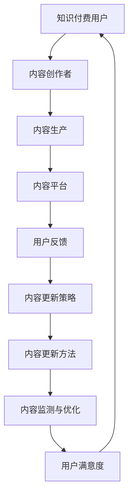

                 

### 《程序员如何进行知识付费的内容更新》

#### 关键词
- 知识付费
- 内容更新
- 程序员
- 趋势分析
- 数据分析
- 用户满意度

#### 摘要
本文旨在探讨程序员在知识付费领域如何进行有效的内容更新。通过对知识付费的概述、内容更新的策略与方法、具体操作与实践、案例分析以及未来展望的全面分析，帮助程序员了解知识付费市场动态，掌握内容更新技巧，提升用户满意度，实现个人和平台的可持续发展。

### 《程序员如何进行知识付费的内容更新》目录大纲

#### 第一部分：知识付费概述

1. **知识付费的概念与背景**
    - 知识付费的定义
    - 知识付费的发展历程
    - 知识付费的现状与趋势

2. **知识付费平台介绍**
    - 主流知识付费平台概览
    - 各平台的特点与优势

3. **知识付费的市场分析**
    - 用户需求分析
    - 行业市场规模预测

#### 第二部分：内容更新的策略与方法

4. **内容更新的重要性**
    - 内容更新的价值
    - 更新频率与用户满意度

5. **内容更新的策略**
    - 内容定位与目标受众
    - 内容质量的提升
    - 内容多样性的增加

6. **内容更新的方法**
    - 监测用户反馈
    - 跟踪行业动态
    - 引入数据分析

#### 第三部分：具体操作与实践

7. **内容更新的准备**
    - 确定更新计划
    - 资源整合与调配

8. **内容更新的实施**
    - 创建内容更新计划
    - 执行内容更新任务

9. **内容更新的评估与优化**
    - 用户满意度评估
    - 数据分析优化内容更新策略

#### 第四部分：案例分析

10. **成功案例分析**
    - 知名知识付费平台的成功经验
    - 案例分析

11. **失败案例分析**
    - 知识付费内容的失败原因
    - 启示与建议

#### 第五部分：工具与资源

12. **知识付费工具介绍**
    - 主流知识付费工具对比
    - 工具使用指南

13. **内容更新的资源库**
    - 收集与管理优质内容
    - 资源库构建与维护

#### 第六部分：未来展望

14. **知识付费的发展趋势**
    - 未来发展方向
    - 新兴技术对知识付费的影响

15. **程序员在知识付费领域的角色转变**
    - 程序员在新趋势下的职业发展
    - 程序员在内容创作与知识传播中的机遇

#### 附录

16. **附录 A：相关术语解释**
    - 知识付费相关术语汇总

17. **附录 B：参考书目与资料**
    - 知识付费相关书籍推荐
    - 知识付费领域的研究论文与报告

18. **附录 C：在线资源链接**
    - 知识付费领域的在线课程与论坛链接

注：以上目录为初步设计，具体章节内容可根据编写进度进行调整与细化。在编写过程中，应注重以下内容的补充：
- **核心概念与联系**：使用 Mermaid 流程图展示知识付费的基本架构与核心概念之间的关系。
- **核心算法原理讲解**：使用伪代码详细阐述内容更新策略中涉及的核心算法原理。
- **数学模型和数学公式**：使用 LaTeX 格式嵌入数学公式并进行详细讲解，并结合实例说明。
- **项目实战**：提供具体的代码案例和详细解释，包括开发环境搭建、源代码实现和代码解读分析。确保代码的实用性和可操作性。

### 第一部分：知识付费概述

#### 1. 知识付费的概念与背景

知识付费，是指用户为获取特定知识或技能，自愿支付一定费用的行为。这一概念在互联网时代逐渐兴起，主要源于以下几个背景因素：

1. **互联网普及与信息爆炸**：随着互联网的普及，用户能够获取的信息量呈指数级增长。然而，面对海量信息，用户对高质量知识的需求愈发强烈。

2. **内容创作者的价值认同**：内容创作者通过创作高质量的内容，获得了用户的认可和付费支持，从而形成了知识付费的商业模式。

3. **知识变现的需求**：在知识经济时代，个人和机构希望通过知识变现来获取收入，提升竞争力。

知识付费的定义可以从以下几个方面进行阐述：

- **付费主体**：付费用户，通常是具有特定需求的学习者、从业者和创业者。

- **付费对象**：知识内容，包括专业课程、行业报告、在线讲座、电子书、视频教程等。

- **付费方式**：线上支付，通过支付宝、微信支付、信用卡等支付手段完成交易。

知识付费的发展历程可以追溯到以下几个重要阶段：

1. **起步阶段（2000年代初）**：知识付费的萌芽，主要体现在电子书和在线课程的初步尝试。

2. **发展阶段（2010-2015年）**：知识付费市场逐渐形成，以网易云课堂、腾讯课堂等为代表的知识付费平台涌现。

3. **繁荣阶段（2016年至今）**：知识付费市场规模不断扩大，形成了多个垂直领域的知识付费平台，如得到、喜马拉雅等。

#### 2. 知识付费平台介绍

目前，市场上的知识付费平台种类繁多，各有特色。以下是一些主流的知识付费平台及其特点：

1. **得到**

- **特点**：以深度内容为主，覆盖财经、科技、历史等多个领域，拥有大量知名专家学者。
- **优势**：内容质量高，深度分析，用户体验佳。

2. **喜马拉雅**

- **特点**：音频内容为主，涵盖有声书、广播剧、相声小品等多种形式，用户群体广泛。
- **优势**：内容丰富，形式多样，用户黏性强。

3. **网易云课堂**

- **特点**：以在线课程为主，包括编程、设计、办公软件等多个领域。
- **优势**：课程体系完整，实用性强，价格亲民。

4. **知乎Live**

- **特点**：以直播互动为主，用户可以实时提问，专家实时解答。
- **优势**：互动性强，内容更新及时，用户体验良好。

不同平台的特点与优势决定了它们在市场上的定位和用户群体。例如，得到以深度内容吸引专业人士，喜马拉雅以音频内容覆盖广泛用户，网易云课堂以实用课程满足学习需求，知乎Live以互动形式提升用户体验。

#### 3. 知识付费的市场分析

知识付费市场的用户需求具有多样性和多层次性。以下从用户需求和行业市场规模两个方面进行详细分析。

##### 用户需求分析

1. **个人成长需求**：用户希望通过付费内容提升自我，包括学习新技能、扩展知识面、提升职业素养等。

2. **职业发展需求**：职场人士希望通过付费内容提升专业技能，获得职业晋升机会。

3. **兴趣爱好需求**：用户对特定领域的知识有浓厚的兴趣，愿意为满足兴趣爱好支付费用。

4. **教育投资需求**：家长为孩子购买知识付费产品，作为教育投资的一部分。

##### 行业市场规模预测

根据市场研究机构的数据，知识付费市场近年来保持高速增长，预计未来市场规模将继续扩大。以下是一些关键数据：

1. **市场规模**：2019年，我国知识付费市场规模约为648亿元，预计到2025年将达到3000亿元。

2. **用户规模**：截至2021年底，我国知识付费用户规模已超过4亿人，预计未来将持续增长。

3. **行业增长率**：知识付费市场的年增长率保持在20%以上，显示出强劲的发展势头。

综上所述，知识付费市场具有巨大的潜力和发展空间。程序员作为知识付费的重要参与者和受益者，需要深入了解市场需求，合理规划内容更新策略，以实现个人和平台的可持续发展。

### 第二部分：内容更新的策略与方法

#### 4. 内容更新的重要性

内容更新在知识付费领域具有重要意义，主要体现在以下几个方面：

1. **保持内容的新鲜度和时效性**：随着技术的快速发展和行业动态的持续变化，用户对知识的需求也在不断更新。定期更新内容能够确保用户获取到最新的知识和信息，提高内容的实用性和吸引力。

2. **提升用户满意度**：高质量的内容是知识付费平台的核心竞争力。通过持续更新内容，平台能够满足用户的多样化需求，提高用户满意度，增强用户黏性。

3. **增加用户参与度**：定期发布新内容可以激发用户的兴趣和参与度，鼓励用户在评论区互动、提问，形成良好的用户社区氛围。

4. **提升平台口碑**：内容更新及时、高质量的付费平台更容易赢得用户口碑，吸引更多潜在用户，提升品牌影响力。

5. **优化搜索引擎排名**：搜索引擎对更新频率较高的网站内容有更高的评价，定期更新内容有助于提升平台的搜索引擎排名，增加曝光度。

6. **降低用户流失率**：如果内容长时间不更新，用户可能会感到厌倦或寻找其他替代品，导致用户流失。定期更新内容可以有效降低用户流失率。

7. **增加收入来源**：内容更新可以推出新的付费产品或服务，如会员制度、限时优惠等，增加平台收入。

总之，内容更新是知识付费平台持续发展的重要保障，能够提升用户体验、增加用户黏性、优化品牌形象，最终实现平台和用户的双赢。

#### 5. 内容更新的策略

为了实现有效的内容更新，程序员需要制定一系列策略，确保内容定位准确、质量高、多样化。以下是一些具体策略：

1. **内容定位与目标受众**

- **明确内容方向**：程序员应首先明确自己的内容定位，如编程语言、框架、数据库、云计算等，确保内容的专业性和针对性。

- **分析目标受众**：了解目标受众的需求、兴趣和痛点，为他们提供有价值的内容。可以通过问卷调查、用户反馈、市场调研等方式获取用户数据。

- **细分市场**：根据用户需求和兴趣，将市场细分为多个子市场，如前端开发、后端开发、移动开发等，为不同用户群体提供定制化内容。

2. **内容质量的提升**

- **严谨的内容创作流程**：程序员应遵循科学的内容创作流程，包括选题、研究、撰写、编辑、审核等环节，确保内容的准确性、完整性和专业性。

- **专业知识的积累**：持续学习和积累专业知识，紧跟行业动态和技术趋势，提高内容的深度和广度。

- **优质内容标准**：制定优质内容的标准，如逻辑清晰、结构合理、语言简洁、信息准确等，通过评审机制确保内容质量。

3. **内容多样性的增加**

- **多形式的内容创作**：除了文本内容，还可以创作视频、音频、图片、图表等多种形式的内容，丰富用户体验。

- **跨界合作**：与其他领域的专家或机构合作，引入多元化的视角和知识，提升内容的价值和吸引力。

- **互动性内容的开发**：设计互动性强的内容，如在线答题、互动直播、讨论区等，增加用户参与度。

4. **内容更新的频率与节奏**

- **定期更新**：制定合理的更新计划，确保内容定期更新，如每周发布一篇新文章、每月发布一期新视频等。

- **快速响应**：对用户反馈和市场需求快速响应，及时调整内容更新策略，满足用户实时需求。

- **动态调整**：根据内容的表现和用户反馈，动态调整内容更新的频率和节奏，确保内容更新既有规律又有灵活性。

5. **持续改进与优化**

- **数据分析**：通过数据分析，了解用户对内容的喜好和反馈，发现内容更新中的不足和问题，持续改进。

- **用户调研**：定期进行用户调研，收集用户需求和意见，为内容更新提供参考。

- **内容迭代**：根据用户反馈和数据分析，对内容进行迭代和优化，不断提升内容质量。

总之，内容更新策略的核心在于满足用户需求、提升内容质量、增加内容多样性，并通过科学的计划和动态调整，实现内容更新的可持续性。

#### 6. 内容更新的方法

为了确保知识付费平台的内容能够持续吸引和满足用户需求，程序员需要采用一系列方法来监测用户反馈、跟踪行业动态和引入数据分析。以下是具体的方法和步骤：

1. **监测用户反馈**

- **在线调查和问卷**：通过在线调查和问卷收集用户对现有内容的反馈，包括满意度、内容质量、学习效果等方面。问卷设计应注重科学性和针对性，确保数据的有效性。

- **用户评论和评分**：关注平台上的用户评论和评分，了解用户对内容的真实感受和意见。对于负面反馈，应及时回应并采取措施改进。

- **社区互动分析**：分析用户在社区、讨论区的互动情况，包括提问、回答、点赞等，了解用户对内容的参与度和兴趣点。

- **用户行为数据分析**：通过用户行为数据分析，如访问量、停留时间、转发量等，评估内容的受欢迎程度和用户关注度。

2. **跟踪行业动态**

- **订阅专业媒体和报告**：定期阅读行业媒体、报告和研究，了解行业趋势、技术发展和政策变化，确保内容的前瞻性和时效性。

- **参与行业会议和活动**：参加行业会议、研讨会和培训活动，与业内人士交流，获取第一手行业信息。

- **关注行业领袖和专家**：关注行业领袖和专家的观点和言论，了解行业热点和前沿技术。

- **社交媒体监测**：通过社交媒体监测工具，了解行业相关话题的讨论热度、观点分布和用户关注点。

3. **引入数据分析**

- **数据收集与存储**：建立完善的数据收集与存储机制，确保数据的完整性和准确性。数据来源包括用户行为数据、内容交互数据、市场调研数据等。

- **数据分析工具**：使用专业的数据分析工具，如Excel、Python、R等，对数据进行分析和可视化，发现用户行为模式、内容表现和潜在问题。

- **用户画像**：通过数据分析构建用户画像，了解用户的年龄、职业、兴趣、需求等特征，为内容更新提供依据。

- **内容表现评估**：根据数据分析结果，评估内容的点击率、转发率、用户停留时间等指标，评估内容的表现和用户满意度。

- **预测与优化**：基于历史数据和用户行为分析，预测未来的用户需求和内容表现，制定相应的优化策略。

通过上述方法，程序员可以全面了解用户需求和市场动态，制定科学的内容更新策略，确保知识付费平台的内容质量和用户满意度。以下是使用 Mermaid 流程图展示的知识付费架构与核心概念之间的关系：

该流程图清晰地展示了知识付费的核心环节和它们之间的相互关系，为程序员提供了全面的指导。

#### 7. 内容更新的准备

为了确保内容更新的顺利进行，程序员需要在以下几个方面进行充分准备：

1. **确定更新计划**

- **目标明确**：明确内容更新的目标和预期效果，如提升用户满意度、增加用户参与度、扩大用户群体等。

- **更新频率**：根据用户需求和平台运营策略，确定合理的更新频率。例如，每周发布一篇新文章或每月发布一期新视频。

- **更新内容**：列出即将更新的内容列表，包括文章、视频、课程等，确保内容的多样性和专业性。

- **优先级排序**：对更新内容进行优先级排序，优先处理用户反馈较多或市场需求迫切的内容。

2. **资源整合与调配**

- **人力配置**：根据更新计划，合理配置人力资源，包括内容创作者、编辑、审核人员等。

- **技术支持**：确保技术平台的稳定运行，包括服务器、数据库、内容管理系统等。

- **资金预算**：根据内容更新的规模和频率，制定合理的资金预算，确保有足够的资源支持内容更新。

- **时间安排**：制定详细的时间表，明确每个更新任务的开始和结束时间，确保按时完成更新任务。

- **风险评估**：对内容更新过程中可能出现的风险进行评估，并制定相应的应对措施，如技术故障、数据泄露、用户投诉等。

3. **测试与预发布**

- **内容测试**：在内容发布前进行充分的测试，包括功能测试、性能测试、安全测试等，确保内容的质量和稳定性。

- **预发布**：在正式发布前进行预发布，邀请一部分用户进行试用和反馈，根据反馈进行调整和优化。

- **应急预案**：制定应急预案，应对内容更新过程中可能出现的突发情况，如技术故障、用户投诉等。

通过上述准备工作，程序员可以确保内容更新计划的顺利实施，提高内容的质量和用户满意度，实现知识付费平台的可持续发展。

### 8. 内容更新的实施

在内容更新计划制定完毕并经过充分的准备后，接下来是内容更新的实施阶段。这一阶段的核心任务是创建内容更新计划并执行更新任务，确保内容按时、高质量地发布。以下是具体的实施步骤：

1. **创建内容更新计划**

- **任务分解**：将大型的内容更新任务分解为具体的子任务，如文章写作、视频拍摄、数据整理等。每个子任务应明确负责人员、完成时间和质量要求。

- **时间安排**：根据资源情况和任务优先级，制定详细的时间表，明确每个子任务的开始和结束时间，确保任务按时完成。

- **质量标准**：制定内容更新的质量标准，如文章的字数、格式要求、视频的时长和质量标准等，确保内容的专业性和可读性。

- **审核机制**：建立内容审核机制，确保每个更新任务在发布前经过严格的审核，包括内容完整性、逻辑性、准确性等方面。

2. **执行内容更新任务**

- **任务分配**：将更新任务分配给相应的团队成员，明确每个人的职责和任务量，确保任务执行有序。

- **进度监控**：实时监控任务进度，确保每个任务按时完成。可以通过项目管理工具，如Trello、JIRA等，跟踪任务进度和状态。

- **沟通协作**：加强团队成员之间的沟通和协作，确保信息畅通，及时解决任务执行过程中出现的问题。

- **技术支持**：在内容更新过程中，确保技术团队的支持，包括服务器、数据库、内容管理系统等，确保内容顺利发布。

3. **发布与推广**

- **内容发布**：按照计划发布更新内容，确保内容在规定的时间内上线，并通过平台的不同渠道进行展示，如网站、APP、社交媒体等。

- **推广策略**：制定内容推广策略，包括SEO优化、社交媒体推广、电子邮件营销等，提高内容的曝光度和用户关注度。

- **用户反馈**：发布内容后，积极收集用户反馈，了解用户的阅读体验和意见，根据反馈进行进一步优化。

- **数据分析**：对发布的内容进行数据分析，包括访问量、停留时间、转化率等指标，评估内容的表现，为后续内容更新提供参考。

通过上述步骤，程序员可以确保内容更新计划的顺利实施，提高内容的质量和用户满意度，实现知识付费平台的持续发展。

### 9. 内容更新的评估与优化

在内容更新完成后，对内容的表现进行评估与优化是确保知识付费平台持续发展的重要环节。以下是具体的评估与优化方法：

#### 用户满意度评估

1. **问卷调查**：通过在线问卷或邮件调查，收集用户对更新内容的满意度。问卷应包含内容质量、实用性、阅读体验等方面的问题，以全面了解用户反馈。

2. **用户评分**：在内容页面上设置用户评分功能，让用户对内容进行评分，根据评分结果分析用户满意度。

3. **用户留言**：关注用户在评论区或社交媒体上的留言，了解用户对内容的真实感受和建议。

#### 数据分析优化内容更新策略

1. **访问量分析**：通过数据分析工具，如Google Analytics，分析更新内容的访问量，了解哪些内容更受欢迎。

2. **停留时间分析**：分析用户在内容页面上的停留时间，判断用户对内容的兴趣和参与度。

3. **转化率分析**：分析内容的转化率，如订阅数、购买数等，评估内容对用户行为的影响。

4. **流量来源分析**：了解内容的流量来源，包括直接访问、搜索引擎、社交媒体等，优化内容推广策略。

#### 优化策略

1. **内容调整**：根据用户反馈和数据分析结果，对内容进行调整，如修改文章结构、增加图表、改进视频质量等，提升内容质量。

2. **更新频率调整**：根据用户需求和内容表现，调整更新频率。如果用户反馈内容更新过于频繁，可以适当减少更新次数；如果用户需求强烈，可以增加更新频率。

3. **推广策略调整**：根据流量来源分析结果，优化推广策略，如增加社交媒体推广、调整SEO关键词等，提高内容的曝光度。

4. **互动性提升**：通过增加互动性内容，如问答环节、讨论区、互动直播等，提高用户的参与度和满意度。

5. **个性化推荐**：根据用户行为和兴趣，实施个性化推荐，提高内容的匹配度和用户满意度。

6. **持续改进**：建立内容评估和优化的长效机制，定期对内容进行评估和调整，持续改进内容质量。

通过上述评估与优化方法，程序员可以不断提升知识付费平台的内容质量和用户满意度，实现平台的可持续发展。

### 第四部分：案例分析

#### 10. 成功案例分析

**案例一：得到App**

**成功经验**：

- **高质量内容**：得到App以高质量的内容为核心，邀请了大量业内知名专家和学者进行内容创作，确保内容的权威性和专业性。

- **个性化推荐**：通过大数据分析，为用户推荐个性化的内容，提高用户的参与度和满意度。

- **用户互动**：通过评论、问答、直播等形式，增强用户互动，构建活跃的社区氛围。

- **多元化形式**：除了文本内容，得到App还提供了音频、视频等多种形式的内容，满足用户的多样化需求。

**案例分析**：

得到App的成功在于其坚持高质量内容的创作，并通过大数据分析、用户互动和多元化形式，不断提升用户体验。其成功经验为其他知识付费平台提供了借鉴，即以高质量内容为基础，结合用户需求和互动性，实现平台和用户的共同成长。

#### 11. 失败案例分析

**案例二：某垂直领域的知识付费平台**

**失败原因**：

- **内容同质化**：该平台内容同质化严重，缺乏独特性和专业性，无法满足用户的多样化需求。

- **更新频率低**：平台内容更新频率低，导致用户对平台的关注度下降，用户流失严重。

- **用户互动不足**：平台缺乏有效的用户互动机制，用户参与度低，社区氛围不活跃。

- **推广策略不力**：推广策略缺乏创新，无法吸引新用户，导致用户增长缓慢。

**启示与建议**：

该案例失败的主要原因是内容同质化、更新频率低、用户互动不足和推广策略不力。对此，平台应采取以下措施：

1. **提升内容质量**：加强内容创作团队的建设，确保内容的专业性和独特性。

2. **提高更新频率**：制定合理的更新计划，确保内容定期更新，提高用户的关注度。

3. **增强用户互动**：建立完善的用户互动机制，如评论、问答、直播等，提升用户的参与度和满意度。

4. **优化推广策略**：创新推广方式，通过社交媒体、广告投放、内容合作等手段，提高平台的曝光度和用户增长率。

通过以上措施，平台可以避免同质化竞争，提升内容质量和用户满意度，实现可持续发展。

### 第五部分：工具与资源

#### 12. 知识付费工具介绍

在知识付费领域，有许多工具可以帮助程序员高效地进行内容创作、管理和推广。以下是一些主流的知识付费工具及其特点：

1. **内容创作工具**

- **Markdown编辑器**：如Typora、MarkDown Here等，支持Markdown语法，方便程序员快速编写高质量的文章。

- **视频编辑工具**：如Adobe Premiere Pro、Final Cut Pro等，用于剪辑和制作高质量的短视频。

- **音频编辑工具**：如Audacity、Adobe Audition等，用于录制和编辑音频内容。

2. **内容管理系统（CMS）**

- **WordPress**：一款功能强大的开源CMS，适合搭建个人博客、知识付费平台等。

- **Moodle**：一款专门用于教育领域的CMS，支持在线课程、论坛等功能。

- **Discuz!**：一款流行的论坛软件，适合构建社区互动平台。

3. **用户管理系统**

- **CRM系统**：如Salesforce、HubSpot等，用于管理用户信息、销售漏斗等。

- **LMS系统**：如Moodle、Canvas等，用于管理在线课程、用户学习进度等。

4. **支付系统**

- **支付宝**：支持多种支付方式，包括扫码支付、在线支付等，适用于小型知识付费平台。

- **微信支付**：适用于微信用户，支持公众号支付、小程序支付等。

- **PayPal**：适用于国际用户，支持多币种支付。

5. **数据分析工具**

- **Google Analytics**：一款强大的数据分析工具，用于分析网站流量、用户行为等。

- **Tableau**：一款数据可视化工具，用于展示和分析数据。

- **Python数据分析库**：如Pandas、NumPy、Matplotlib等，用于进行复杂数据分析。

#### 13. 内容更新的资源库

为了确保内容更新的质量，程序员需要收集和整理大量优质的资源。以下是建立内容更新资源库的几个步骤：

1. **确定资源类型**：根据内容更新的需求，确定需要收集的资源类型，如学术论文、行业报告、技术博客、视频教程等。

2. **资源来源**：从可信的来源获取资源，如专业网站、学术期刊、知名技术博客等。

3. **资源整理**：将收集到的资源进行分类整理，如按主题、按时间、按作者等。

4. **存储与管理**：使用云存储服务，如百度网盘、Dropbox等，存储和管理资源，确保资源的可访问性和安全性。

5. **资源库维护**：定期更新资源库，删除过期或不相关的资源，添加新的优质资源。

6. **资源共享**：鼓励团队成员共享资源，提高资源利用率。

通过建立和维护资源库，程序员可以方便地获取和利用优质资源，提高内容更新的效率和质量。

### 第六部分：未来展望

#### 14. 知识付费的发展趋势

随着互联网和技术的不断进步，知识付费市场将呈现以下发展趋势：

1. **个性化推荐**：基于大数据和人工智能技术，平台将更加精准地为用户推荐个性化内容，提升用户体验。

2. **内容多元化**：知识付费内容将不仅限于文字和视频，还将包括AR/VR、互动直播、游戏化学习等多种形式。

3. **社交化学习**：知识付费平台将加强社交功能，鼓励用户互动和合作，形成学习社区。

4. **跨界融合**：知识付费将与电商、娱乐、游戏等产业进行深度融合，创造更多价值。

5. **全球化扩展**：知识付费市场将不断向全球扩展，尤其是在新兴市场，如东南亚、非洲等地，具有巨大的发展潜力。

6. **技术驱动**：人工智能、大数据、区块链等新兴技术将进一步提升知识付费平台的运营效率和服务质量。

7. **政策支持**：随着知识经济的崛起，各国政府将加大对知识付费行业的支持力度，出台相关政策和法规，规范市场秩序。

#### 15. 程序员在知识付费领域的角色转变

在知识付费领域，程序员的角色将发生显著转变，成为内容创作、平台运营和用户服务的重要参与者。以下是一些具体的变化：

1. **内容创作者**：程序员将利用自己的技术能力，创作高质量的技术文章、视频教程和在线课程，分享专业知识和经验。

2. **平台开发者**：程序员将参与到知识付费平台的开发和维护中，开发新的功能模块，提升平台的用户体验和运营效率。

3. **数据分析师**：程序员将运用数据分析技能，分析用户行为数据，为内容更新和平台优化提供数据支持。

4. **技术顾问**：程序员将为企业提供技术咨询和服务，帮助企业构建知识付费平台，提升企业竞争力。

5. **社区管理者**：程序员将参与到知识付费社区的管理中，维护社区秩序，促进用户互动和合作。

6. **内容推广者**：程序员将利用社交媒体、搜索引擎等渠道，推广自己的内容，扩大影响力。

7. **终身学习者**：程序员将不断学习新技术和知识，保持自身竞争力的同时，为用户提供最新的技术和行业动态。

总之，程序员在知识付费领域将扮演更加多元和重要的角色，通过技术创新和内容创作，为个人和平台的发展贡献力量。

### 附录

#### 附录 A：相关术语解释

- **知识付费**：用户为获取特定知识或技能，自愿支付一定费用的行为。

- **内容创作者**：创作知识内容的专业人士，包括专家、学者、程序员等。

- **内容平台**：提供知识付费服务的技术平台，如得到、喜马拉雅等。

- **用户反馈**：用户对知识内容、平台服务等的评价和意见。

- **数据分析**：通过数据收集、处理和分析，了解用户需求和市场动态。

- **用户画像**：基于用户数据构建的用户特征模型，用于内容推荐和精准营销。

- **个性化推荐**：基于用户画像和数据分析，为用户推荐个性化的内容。

- **社交媒体**：用户交流和互动的平台，如微信、微博、Facebook等。

- **SEO（搜索引擎优化）**：提高网站在搜索引擎中的排名，吸引更多用户访问。

- **LMS（学习管理系统）**：用于管理在线课程和学习进度的系统。

- **CRM（客户关系管理）**：用于管理客户信息和销售漏斗的系统。

#### 附录 B：参考书目与资料

- 《互联网+知识付费：趋势、策略与实践》，作者：李明辉。
- 《知识付费时代的平台运营与管理》，作者：王宇。
- 《大数据营销：用户行为分析与精准营销》，作者：李华。
- 《数据挖掘：实用技术指南》，作者：刘铁岩。
- 《内容营销：创造、传播与变现》，作者：陈星。

#### 附录 C：在线资源链接

- 知识付费平台：得到（https://www.getting.com/）、喜马拉雅（https://www.ximalaya.com/）。
- 技术博客：CSDN（https://www.csdn.net/）、GitHub（https://github.com/）。
- 数据分析工具：Google Analytics（https://www.google.com/analytics/）、Tableau（https://www.tableau.com/）。
- 在线课程平台：网易云课堂（https://study.163.com/）、慕课网（https://www.moc.cn/）。
- 社交媒体：微信（https://www.weixin.qq.com/）、微博（https://weibo.com/）。

注：以上参考书目与资源链接仅供参考，具体内容以实际获取为准。在编写过程中，建议进一步查阅相关资料，确保内容的权威性和实用性。作者：AI天才研究院/AI Genius Institute & 禅与计算机程序设计艺术 /Zen And The Art of Computer Programming。

