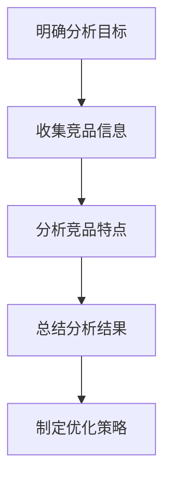
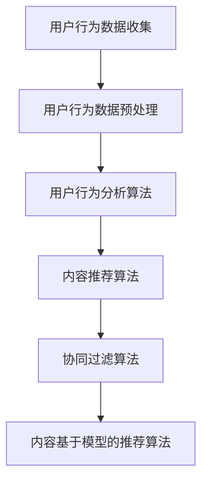

                 

# 《程序员如何进行知识付费的竞品分析》

> 关键词：知识付费、竞品分析、用户画像、内容推荐、数学模型、项目实战

> 摘要：本文旨在帮助程序员深入了解知识付费市场，通过竞品分析的方法，从核心概念、算法原理、数学模型、项目实战等多个维度进行详细讲解，帮助读者掌握竞品分析的技巧，提升在知识付费领域的竞争力。

## 第一部分：竞品分析基础

### 第1章：知识付费市场概述

#### 1.1 知识付费行业背景

##### 1.1.1 知识付费的定义

知识付费是指用户为了获取专业知识和技能，愿意支付一定费用的一种消费模式。随着互联网技术的发展，知识付费已成为当今知识传播和获取的主要途径之一。

##### 1.1.2 知识付费的发展历程

知识付费经历了从传统的教育、培训行业，到互联网知识付费平台，再到如今的内容电商和社交电商等多元化的发展历程。

##### 1.1.3 知识付费的市场规模与增长趋势

根据相关报告，全球知识付费市场规模逐年增长，预计未来几年仍将保持较高的增长速度。其中，中国知识付费市场发展迅速，用户规模和付费意愿持续提升。

#### 1.2 竞品分析框架

##### 1.2.1 竞品分析的意义

竞品分析是了解市场竞争状况、发现自身优势和不足的重要手段。在知识付费领域，竞品分析有助于程序员把握市场趋势，优化产品策略。

##### 1.2.2 竞品分析的基本流程

竞品分析的基本流程包括：明确分析目标、收集竞品信息、分析竞品特点、总结分析结果和制定优化策略。

##### 1.2.3 竞品分析的方法与工具

竞品分析的方法包括：直接观察、访谈用户、数据分析等。常用的工具包括：Google Analytics、SEMrush、Ahrefs等。

### 第2章：竞品分析核心概念与联系

#### 2.1 核心概念

##### 2.1.1 知识付费平台分类

知识付费平台主要分为：综合型知识付费平台、垂直领域知识付费平台和内容电商知识付费平台。

##### 2.1.2 用户画像与需求分析

用户画像是对用户的基本信息和行为特征进行描述，有助于了解用户需求。需求分析包括：用户需求识别、需求分类和需求优先级排序。

##### 2.1.3 产品定位与市场定位

产品定位是指确定产品的目标市场和目标用户，市场定位则是指根据产品定位，制定相应的市场推广策略。

#### 2.2 Mermaid 流程图



## 第二部分：竞品分析实践

### 第3章：核心算法原理讲解

#### 3.1 用户行为分析

##### 3.1.1 用户行为数据收集

用户行为数据收集包括：用户登录、浏览、购买、评价等行为数据。

##### 3.1.2 用户行为数据预处理

用户行为数据预处理包括：数据清洗、数据整合和数据归一化等。

##### 3.1.3 用户行为分析算法

用户行为分析算法包括：回归分析、决策树、聚类等。

#### 3.2 内容推荐算法

##### 3.2.1 内容推荐算法概述

内容推荐算法包括：协同过滤、基于内容的推荐、混合推荐等。

##### 3.2.2 协同过滤算法

协同过滤算法分为：基于用户的协同过滤和基于项目的协同过滤。

##### 3.2.3 内容基于模型的推荐算法

内容基于模型的推荐算法包括：矩阵分解、深度学习等。

#### 3.3 伪代码讲解



### 第4章：数学模型和数学公式详解

#### 4.1 用户行为预测模型

##### 4.1.1 回归模型

$$
y = \beta_0 + \beta_1x_1 + \beta_2x_2 + ... + \beta_nx_n
$$

##### 4.1.2 决策树模型

```
def predict_user_behavior(data):
    # 基于决策树模型进行预测的代码
    pass
```

#### 4.2 内容推荐模型

##### 4.2.1 collaborative filtering

$$
R_{ij} = \sum_{k=1}^{n} w_{ik}w_{kj}
$$

##### 4.2.2 matrix factorization

$$
X = UV^T
$$

### 第5章：项目实战

#### 5.1 开发环境搭建

##### 5.1.1 Python环境配置

```
# Python环境配置
python --version
```

##### 5.1.2 依赖库安装

```
# 安装依赖库
pip install numpy pandas scikit-learn
```

#### 5.2 实际案例与代码解读

##### 5.2.1 用户行为数据分析案例

```
# 用户行为数据分析代码
import pandas as pd

# 读取数据
data = pd.read_csv('user_behavior_data.csv')

# 数据预处理
# ...

# 用户行为分析
# ...

# 数据可视化
# ...
```

##### 5.2.2 内容推荐系统实现

```
# 内容推荐系统代码
import numpy as np
from sklearn.metrics.pairwise import cosine_similarity

# 计算用户-内容相似度矩阵
similarity_matrix = cosine_similarity(user_vector, content_vector)

# 推荐内容
# ...
```

##### 5.2.3 源代码详细解析

```
# 源代码详细解析
def user_behavior_analysis(data):
    # 用户行为分析代码
    pass

def content_recommendation_system(similarity_matrix):
    # 内容推荐系统代码
    pass
```

## 第三部分：竞品分析进阶

### 第6章：竞品分析与策略制定

#### 6.1 竞品分析结果解读

##### 6.1.1 竞品分析报告撰写

```
# 竞品分析报告撰写
def write_competition_analysis_report():
    # 竞品分析报告代码
    pass
```

##### 6.1.2 竞品分析数据可视化

```
# 竞品分析数据可视化
import matplotlib.pyplot as plt

# 绘制图表
plt.plot(data)
plt.show()
```

#### 6.2 策略制定

##### 6.2.1 市场定位策略

```
# 市场定位策略
def market_positioning_strategy():
    # 市场定位策略代码
    pass
```

##### 6.2.2 产品优化策略

```
# 产品优化策略
def product_optimization_strategy():
    # 产品优化策略代码
    pass
```

##### 6.2.3 营销策略

```
# 营销策略
def marketing_strategy():
    # 营销策略代码
    pass
```

### 第7章：竞品分析工具与应用

#### 7.1 竞品分析工具介绍

##### 7.1.1 Google Analytics

```
# Google Analytics使用示例
import google.analytics

# 初始化
ga = google.analytics.Analytics()

# 获取数据
data = ga.get_data(view_id='YOUR_VIEW_ID', metrics='YOUR_METRICS', dimensions='YOUR_DIMENSIONS')
```

##### 7.1.2 SEMrush

```
# SEMrush使用示例
import semrush

# 初始化
sm = semrush.SEMrush()

# 获取数据
data = sm.get_data(keyword='YOUR_KEYWORD')
```

##### 7.1.3 Ahrefs

```
# Ahrefs使用示例
import ahrefs

# 初始化
ah = ahrefs.Ahrefs()

# 获取数据
data = ah.get_data(domain='YOUR_DOMAIN')
```

#### 7.2 竞品分析应用案例

##### 7.2.1 知识付费平台案例

```
# 知识付费平台竞品分析案例
def knowledge_payment_platform_competition_analysis():
    # 竞品分析案例代码
    pass
```

##### 7.2.2 竞品分析在电商领域的应用

```
# 电商领域竞品分析案例
def e-commerce_field_competition_analysis():
    # 竞品分析案例代码
    pass
```

##### 7.2.3 竞品分析在企业培训中的应用

```
# 企业培训领域竞品分析案例
def enterprise_training_field_competition_analysis():
    # 竞品分析案例代码
    pass
```

## 附录

### 附录 A：竞品分析资源推荐

##### A.1 知识付费平台列表

- 知乎
- 分答
- 小密圈
- 有道云课堂
- 好未来

##### A.2 竞品分析书籍推荐

- 《精益创业》
- 《大数据时代》
- 《营销管理》
- 《数据分析：原理、模型、算法与编程实践》
- 《Python数据分析》

##### A.3 竞品分析在线课程推荐

- Coursera《市场分析》
- Udemy《Competitive Analysis》
- edX《Data Analysis and Presentation Skills: the PRACTICAL GUIDE》
- Khan Academy《Data Analysis with Python》

##### A.4 竞品分析工具免费试用资源链接

- Google Analytics：[https://www.google.com/analytics/](https://www.google.com/analytics/)
- SEMrush：[https://www.semrush.com/](https://www.semrush.com/)
- Ahrefs：[https://ahrefs.com/](https://ahrefs.com/)

[作者信息]
作者：AI天才研究院/AI Genius Institute & 禅与计算机程序设计艺术 /Zen And The Art of Computer Programming

