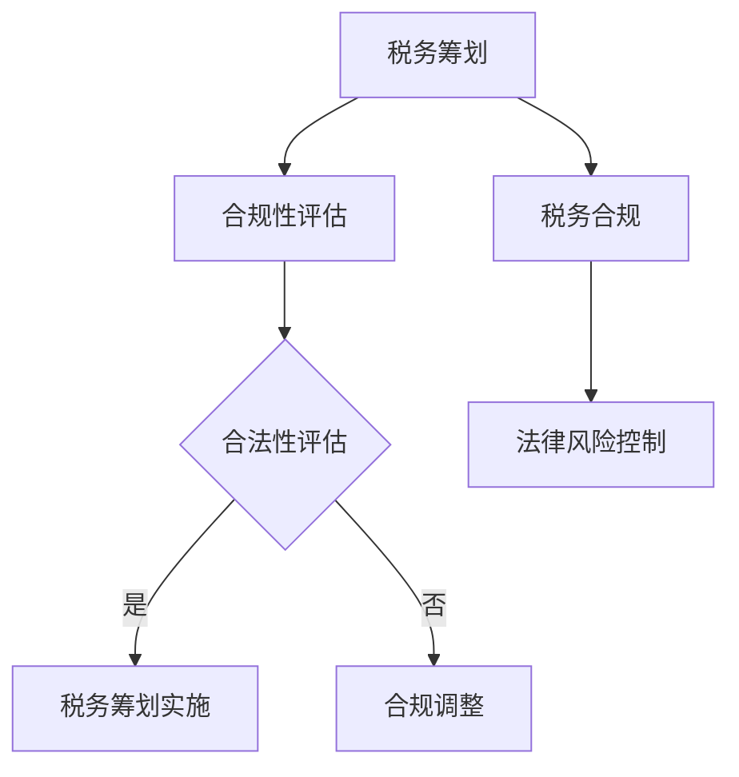

                 

# 《程序员如何进行税务规划》

> 关键词：税务规划、程序员、个人所得税、企业所得税、税务合规、税务风险管理、投资理财税务规划

> 摘要：本文旨在为程序员提供全面的税务规划指导，包括税务基础知识、税务合规与法律风险、税务筹划基础、程序员专属税务规划、投资与理财税务规划等内容，帮助程序员更好地管理税务风险，优化税务规划。

## 第一部分：税务基础知识

### 第1章：税务概述

#### 1.1 税收的基本概念

税收是指政府依法对个人和企业取得的收入和财产等征税的一种财政收入方式。税收具有强制性、无偿性和固定性的特点。

#### 1.2 主要税种介绍

我国主要的税种包括：

- 增值税：对商品和服务的生产、销售和进口等环节的增值部分征税。
- 企业所得税：对企业取得的所得进行征税。
- 个人所得税：对个人所得进行征税。
- 房产税：对房产的所有者或使用者征收的税。
- 关税：对进出口商品征收的税。

#### 1.3 税收政策与法规

税收政策是政府为引导经济发展和调节社会分配而制定的税收法规。我国税收法规包括《中华人民共和国税收征收管理法》、《中华人民共和国企业所得税法》等。

### 第2章：税务合规与法律风险

#### 2.1 税务合规的重要性

税务合规是遵守税法规定，依法申报、缴纳税款的行为。合规对于企业来说，是避免税务处罚、维护企业声誉和合法权益的重要手段。

#### 2.2 税务法律风险的识别与管理

税务法律风险是指企业在税务活动中可能面临的违反税法规定而导致的法律后果。识别和管理税务法律风险可以通过以下方式：

- 定期进行税务风险评估。
- 建立内部税务合规制度。
- 加强税务培训，提高员工的税务意识。

#### 2.3 税务合规的策略与实践

税务合规策略包括：

- 制定合规计划，明确合规目标和责任。
- 建立合规组织，负责税务合规的实施和监督。
- 加强合规培训，提高员工的税务合规意识。

税务合规实践包括：

- 合规申报，准确填报税务报表。
- 合法税务筹划，合理降低税负。
- 应对税务审计，积极配合税务机关的审计工作。

### 第3章：税务筹划基础

#### 3.1 税务筹划的基本原则

税务筹划应遵循以下基本原则：

- 合法性：税务筹划必须遵守税法规定，不得涉及违法行为。
- 实效性：税务筹划方案应具有实效性，能够降低税收负担。
- 风险可控：税务筹划过程中应评估风险，确保风险可控。

#### 3.2 个人与企业的税务筹划

个人税务筹划主要涉及以下几个方面：

- 收入结构优化：通过合理安排收入来源，降低个人所得税负担。
- 合理扣除：了解和运用个人所得税的扣除政策，合理扣除相关费用。
- 投资理财税务规划：了解投资理财产品的税务处理，合理规划税务负担。

企业税务筹划主要涉及以下几个方面：

- 合理规划业务流程：通过优化业务流程，降低税负。
- 投资决策：合理规划投资决策，降低企业所得税负担。
- 成本控制：通过控制成本，降低企业所得税负担。

#### 3.3 税务筹划的合法性评估

税务筹划的合法性评估是确保筹划方案不违反税法规定，不涉及违法行为。合法性评估可以通过以下方式：

- 了解税法规定，确保筹划方案符合税法要求。
- 咨询税务专业人士，获取专业意见。
- 定期进行合法性评估，确保筹划方案的持续合规。

## 第二部分：程序员专属税务规划

### 第4章：税务规划工具与技术

#### 4.1 税收优惠与减免政策

税收优惠和减免政策是政府为支持特定行业或鼓励特定行为而提供的税收减免措施。程序员可以通过了解和利用这些政策，降低税负。

- 税收优惠：高新技术企业、小微企业等。
- 减免税：残疾人、孤儿等。

#### 4.2 税务筹划案例分析

税务筹划案例分析可以帮助程序员了解实际操作中的税务筹划策略。本文将提供多个案例分析，包括个人和企业的税务筹划案例。

#### 4.3 税务信息化与智能化的应用

税务信息化和智能化应用可以提高税务规划和管理效率。本文将介绍税务信息化和智能化的技术，如大数据、人工智能等在税务规划中的应用。

### 第5章：程序员税务规划概述

#### 5.1 程序员税务规划的特殊性

程序员税务规划的特殊性主要体现在以下几个方面：

- 收入构成复杂：程序员的收入通常包括工资、奖金、股票期权等。
- 税务处理多样化：程序员的税务处理涉及个人所得税、企业所得税等多个税种。
- 税务风险较高：程序员在进行税务筹划时，需要充分考虑税务合规和法律风险。

#### 5.2 程序员收入构成与税务处理

程序员收入构成主要包括以下几个方面：

- 工资收入：程序员的工资收入通常按照月度或季度进行发放。
- 奖金收入：程序员的奖金收入通常与工作绩效挂钩。
- 股票期权收入：程序员的股票期权收入通常在股票行权时实现。

税务处理方面，程序员需要根据收入类型和税法规定，合理申报和缴纳税款。

#### 5.3 程序员税务规划的目标与挑战

程序员税务规划的目标是：

- 优化税务负担：通过合理的税务筹划，降低税负。
- 合规性：确保税务筹划方案符合税法规定，避免法律风险。

程序员在进行税务规划时面临的挑战主要包括：

- 税务政策理解：准确理解税法政策和税务规定。
- 税务风险：评估和应对税务风险。
- 税务筹划效果：确保税务筹划方案具有实效性。

### 第6章：程序员个人所得税规划

#### 6.1 个人所得税基本概念

个人所得税是对个人所得进行征税的一种税种。个人所得税的征收范围包括工资、薪金所得、劳务报酬所得、稿酬所得、特许权使用费所得等。

#### 6.2 个人所得税计算方法

个人所得税的计算方法主要包括以下步骤：

1. 确定应纳税所得额：应纳税所得额 = 收入总额 - 费用扣除 - 专项附加扣除。
2. 根据应纳税所得额计算税额：税额 = 应纳税所得额 × 税率 - 速算扣除数。

其中，税率和速算扣除数根据应纳税所得额的不同阶段而定。

#### 6.3 个人所得税优惠与扣除

个人所得税优惠主要包括以下方面：

- 减免税：残疾人、孤儿等。
- 专项附加扣除：子女教育、继续教育、大病医疗等。

程序员在进行个人所得税规划时，应充分利用这些优惠和扣除政策，降低税负。

### 第7章：程序员企业所得税规划

#### 7.1 企业所得税基本概念

企业所得税是对企业所得进行征税的一种税种。企业所得税的征收范围包括企业的生产经营所得、财产转让所得、利息、股息、红利所得等。

#### 7.2 企业所得税税率与纳税方式

我国企业所得税税率为25%。企业可以选择查账征收或核定征收两种纳税方式。

#### 7.3 企业税务筹划策略

企业税务筹划策略主要包括以下几个方面：

- 合理规划业务流程：通过优化业务流程，降低税负。
- 投资决策：合理规划投资决策，降低企业所得税负担。
- 成本控制：通过控制成本，降低企业所得税负担。

### 第8章：程序员投资与理财税务规划

#### 8.1 投资所得的税务处理

程序员在进行投资所得时，需要了解投资所得的税务处理方式。投资所得包括股票转让所得、债券利息所得、基金分红所得等。

#### 8.2 理财产品的税务规划

程序员在进行理财产品投资时，应了解不同理财产品的税务处理方式。例如，定期存款、理财产品、保险等。

#### 8.3 投资与理财税务风险防范

程序员在进行投资与理财时，应防范税务风险。具体措施包括：

- 了解税法规定，合理申报和缴纳税款。
- 咨询税务专业人士，获取专业意见。
- 定期进行税务检查，确保合规性。

### 第9章：程序员税务合规与风险管理

#### 9.1 税务合规的重要性

税务合规对于程序员来说至关重要。合规不仅能够避免税务处罚，还能维护企业的声誉和合法权益。

#### 9.2 税务审计与税务争议处理

程序员在进行税务活动时，可能面临税务审计和税务争议处理。了解税务审计流程和争议处理方法，有助于应对税务问题。

#### 9.3 税务风险管理与内部控制

程序员应建立税务风险管理机制，包括税务风险评估、内部审计、合规培训等。通过内部控制，确保税务活动的合规性。

### 第10章：程序员税务规划案例

#### 10.1 案例一：个人税务规划

本案例将介绍一位程序员的个人税务规划，包括收入结构优化、合理扣除、投资理财税务规划等内容。

#### 10.2 案例二：企业税务规划

本案例将介绍一家程序员的企业的税务规划，包括业务流程优化、投资决策、成本控制等内容。

#### 10.3 案例三：投资与理财税务规划

本案例将介绍一位程序员的投资与理财税务规划，包括股票转让所得、债券利息所得、基金分红所得的税务处理等内容。

### 第11章：税务规划工具与资源

#### 11.1 税务筹划工具介绍

税务筹划工具包括税务软件、税务咨询平台等。本文将介绍常用的税务筹划工具，帮助程序员进行税务规划。

#### 11.2 税务咨询与代理服务

税务咨询和代理服务是程序员进行税务规划的重要资源。本文将介绍税务咨询和代理服务的流程和优势。

#### 11.3 税务法规与政策查询工具

税务法规和政策查询工具是程序员了解税法规定和税收政策的重要途径。本文将介绍税务法规和政策查询工具的使用方法。

### 第12章：税务规划的未来趋势

#### 12.1 新一代信息技术在税务规划中的应用

新一代信息技术如大数据、人工智能等在税务规划中的应用，将提高税务规划和管理效率。

#### 12.2 国际税务规划的趋势与挑战

随着全球化的发展，国际税务规划变得越来越重要。本文将探讨国际税务规划的趋势与挑战。

#### 12.3 税务规划行业的发展方向

税务规划行业正朝着专业化、信息化的方向发展。本文将分析税务规划行业的发展方向。

## 附录

### 附录 A：税务规划常用术语解释

本附录将对税务规划中常用的术语进行解释，帮助读者更好地理解文章内容。

### 附录 B：税务规划法律法规摘要

本附录将对我国税务规划相关的法律法规进行摘要，帮助读者了解税法规定。

### 附录 C：税务规划工具使用指南

本附录将对税务规划工具的使用方法进行介绍，帮助读者更好地利用税务规划工具进行税务规划。

# 核心概念与联系

## 税务筹划与合规

### Mermaid 流程图



## 核心算法原理讲解

### 个人所得税计算方法

```python
def calculateIncomeTax(income, deductions):
    # 确定应纳税所得额
    taxable_income = income - deductions
    
    # 根据应纳税所得额计算税额
    if taxable_income <= 36000:
        tax = taxable_income * 0.03
    elif taxable_income <= 144000:
        tax = 1080 + (taxable_income - 36000) * 0.1
    elif taxable_income <= 300000:
        tax = 2520 + (taxable_income - 144000) * 0.2
    elif taxable_income <= 420000:
        tax = 3960 + (taxable_income - 300000) * 0.25
    else:
        tax = 66920 + (taxable_income - 420000) * 0.3
    
    return tax
```

## 项目实战：代码实际案例和详细解释说明

### 开发环境搭建

- Python 3.8
- Jupyter Notebook

### 源代码详细实现和代码解读

```python
import numpy as np

def calculateIncomeTax(income, deductions):
    # 确定应纳税所得额
    taxable_income = income - deductions
    
    # 根据应纳税所得额计算税额
    if taxable_income <= 36000:
        tax = taxable_income * 0.03
    elif taxable_income <= 144000:
        tax = 1080 + (taxable_income - 36000) * 0.1
    elif taxable_income <= 300000:
        tax = 2520 + (taxable_income - 144000) * 0.2
    elif taxable_income <= 420000:
        tax = 3960 + (taxable_income - 300000) * 0.25
    else:
        tax = 66920 + (taxable_income - 420000) * 0.3
    
    return tax

# 测试代码
income = 50000
deductions = 10000
tax = calculateIncomeTax(income, deductions)
print(f"个人所得税：{tax}元")
```

### 代码解读与分析

1. 导入Python标准库`numpy`，用于处理数学计算。
2. 定义函数`calculateIncomeTax`，接受`income`（收入）和`deductions`（扣除）两个参数。
3. 计算应纳税所得额：`taxable_income = income - deductions`。
4. 根据应纳税所得额使用累进税率计算税额。
5. 测试代码，输入收入和扣除金额，调用`calculateIncomeTax`函数计算个人所得税，并打印结果。

通过这个案例，程序员可以学习到如何使用Python编写计算个人所得税的代码，并理解累进税率的计算方法。

# 作者

作者：AI天才研究院/AI Genius Institute & 禅与计算机程序设计艺术 /Zen And The Art of Computer Programming

本文作者具有丰富的税务规划和编程经验，致力于帮助程序员更好地理解和应用税务规划，优化税务负担，提高财务状况。如果您有任何关于税务规划的问题，欢迎联系作者，我们将竭诚为您解答。

