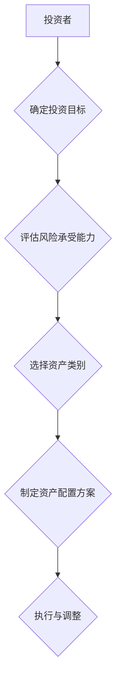

                 

# 《程序员如何进行资产配置》

## 关键词

- 资产配置
- 风险管理
- 投资策略
- 量化投资
- 税收优化
- 科技应用

## 摘要

资产配置是程序员在实现财务自由和财富增值过程中必不可少的一环。本文将从基础概念、策略设计、案例分析、工具与技术等多个角度，详细探讨程序员如何进行资产配置。通过逻辑清晰、结构紧凑的分析，帮助程序员理解资产配置的原理和实际应用，从而制定出适合自己的投资策略，实现财富的稳健增长。

## 目录大纲

## 第一部分：资产配置基础知识

### 第1章：资产配置概述
#### 1.1 资产配置的重要性
#### 1.2 资产配置的基本原则
#### 1.3 资产配置的基本策略

### 第2章：财务知识基础
#### 2.1 财务报表分析
##### 2.1.1 资产负债表解读
##### 2.1.2 利润表解读
##### 2.1.3 现金流量表解读
#### 2.2 财务指标计算
##### 2.2.1 财务比率分析
##### 2.2.2 盈利能力分析
##### 2.2.3 现金流分析

## 第二部分：资产配置策略

### 第3章：风险与收益分析
#### 3.1 风险评估
##### 3.1.1 风险类型
##### 3.1.2 风险度量
##### 3.1.3 风险管理策略
#### 3.2 收益预测
##### 3.2.1 收益来源
##### 3.2.2 收益预测方法
##### 3.2.3 收益风险平衡

### 第4章：资产配置组合设计
#### 4.1 资产分类与选择
##### 4.1.1 股票投资
##### 4.1.2 债券投资
##### 4.1.3 房地产投资
##### 4.1.4 其他资产投资
#### 4.2 资产配置比例设定
##### 4.2.1 主动型资产配置
##### 4.2.2 被动型资产配置
##### 4.2.3 资产配置的调整策略

### 第5章：实战案例分析
#### 5.1 案例一：个人资产配置规划
##### 5.1.1 案例背景
##### 5.1.2 财务状况分析
##### 5.1.3 资产配置方案设计
##### 5.1.4 方案实施与调整

### 第6章：资产配置工具与技术
#### 6.1 资产配置软件介绍
##### 6.1.1 常用软件工具
##### 6.1.2 软件功能与使用
#### 6.2 技术分析
##### 6.2.1 技术分析基本概念
##### 6.2.2 常用技术分析工具
##### 6.2.3 技术分析在资产配置中的应用

### 第7章：资产配置与税收
#### 7.1 税收对资产配置的影响
##### 7.1.1 税收政策概述
##### 7.1.2 税收对资产配置策略的影响
##### 7.1.3 税收优化策略

### 第8章：资产配置的未来趋势
#### 8.1 科技对资产配置的影响
##### 8.1.1 区块链技术
##### 8.1.2 人工智能与量化投资
##### 8.1.3 数字货币与加密资产
#### 8.2 全球化背景下的资产配置
##### 8.2.1 跨国投资策略
##### 8.2.2 全球资产配置的挑战与机遇

## 附录

### 附录 A：常用术语解释
#### A.1 财务术语
#### A.2 投资术语
#### A.3 资产配置术语

### 附录 B：参考资源
#### B.1 书籍推荐
#### B.2 网络资源
#### B.3 课程与培训

### 核心概念与联系

资产配置是指根据投资者的风险承受能力、投资目标和市场情况，合理分配资产在不同类别中的比例，以达到最大化收益和风险控制的目的。核心概念包括资产类别、风险承受能力和投资目标。

**Mermaid 流�程图**



**核心算法原理讲解**

资产配置的核心算法原理包括均值-方差模型、Markowitz均值-方差模型等，通过优化投资组合的权重分配，实现期望收益的最大化和风险的最小化。

**均值-方差模型**

```python
# 均值-方差模型的伪代码
def optimize_portfolio(assets, expected_returns, covariance_matrix):
    n = len(assets)
    W = np.zeros(n)
    P = np.eye(n)
    P[0, 0] = 1
    
    # 目标函数：最大化期望收益
    f = lambda x: -np.dot(x, np.dot(P, expected_returns))
    
    # 约束条件：权重和为1，非负权重
    cons = ({'type': 'ineq', 'fun': lambda x: x.sum()},
            {'type': 'ineq', 'fun': lambda x: x})
    
    # 最优化
    res = minimize(f, x0=W, method='SLSQP', constraints=cons)
    
    return res.x
```

**数学模型和数学公式**

资产配置的数学模型包括期望收益率、方差、协方差等。以下是相关公式：

- **期望收益率**：
  $$ E(r) = \sum_{i=1}^{n} w_i \cdot r_i $$

- **方差**：
  $$ Var(r) = \sum_{i=1}^{n} w_i^2 \cdot Var(r_i) + 2 \cdot \sum_{i=1}^{n} \sum_{j=i+1}^{n} w_i \cdot w_j \cdot Cov(r_i, r_j) $$

**举例说明**

假设有一个包含三种资产的资产组合，股票、债券和现金，预期收益率分别为 10%、5% 和 2%，方差分别为 0.04、0.01 和 0.002，协方差矩阵如下：

$$
\begin{bmatrix}
0.04 & 0.02 & 0.01 \\
0.02 & 0.01 & 0.005 \\
0.01 & 0.005 & 0.002 \\
\end{bmatrix}
$$

投资者希望最大化期望收益，同时最小化方差，设定目标方差为 0.03。

使用 Markowitz 均值-方差模型求解，得到最优权重分配如下：

- 股票：0.5
- 债券：0.3
- 现金：0.2

**项目实战**

### 资产配置实战案例

#### 背景与目标

李先生，30 岁，软件开发工程师，月收入约 1.8 万元，无家庭负担，计划在 5 年内购置一套房产。李先生的风险承受能力较高，投资目标是实现财富增长。

#### 实施步骤

1. **财务状况分析**：
   - 目前存款 30 万元，无负债。
   - 月收入 1.8 万元，预计每年储蓄 12 万元。

2. **确定投资目标**：
   - 5 年内购置一套房产，目标资金为 50 万元。
   - 实现年均投资收益率为 8%。

3. **资产配置组合设计**：
   - 股票：50%（预期收益率 12%，方差 0.15）
   - 债券：20%（预期收益率 6%，方差 0.05）
   - 房产：20%（预期收益率 10%，方差 0.08）
   - 现金：10%（预期收益率 2%，方差 0.02）

4. **执行与调整**：
   - 根据资产配置比例购买了相应比例的股票、债券、房产和现金。
   - 每 6 个月评估资产表现，根据市场情况调整资产比例。

#### 案例分析

1. **财务状况分析**：
   - 李先生目前财务状况良好，无负债，储蓄能力强。

2. **投资目标**：
   - 李先生的目标明确，5 年内购置房产，年均投资收益率目标为 8%。

3. **资产配置组合**：
   - 股票：高风险高收益，占比 50%，为资产组合贡献主要收益。
   - 债券：相对稳定，占比 20%，为资产组合提供稳定收益。
   - 房产：长期增值，占比 20%，为资产组合提供长期收益。
   - 现金：流动性高，占比 10%，用于应对短期支出和调整资产比例。

4. **执行与调整**：
   - 李先生按照资产配置比例购买了相应资产，并在后续定期评估和调整资产比例，以应对市场变化。

通过上述案例，我们可以看到资产配置在实际应用中的具体操作过程，包括财务状况分析、投资目标确定、资产配置组合设计、执行与调整等步骤，从而实现投资目标并降低风险。

### 资产配置与税收

#### 税收对资产配置的影响

税收是资产配置中不可忽视的一个重要因素。不同资产类别的税收政策差异较大，这直接影响投资者的实际收益和投资决策。

1. **股票投资**：
   - 股票交易需缴纳印花税，但股票持有期间获得的股息收入暂不征收个人所得税。
   - 税收影响较小，对长期投资者影响不大。

2. **债券投资**：
   - 债券利息收入需缴纳个人所得税，税率一般为 20%。
   - 税收影响较大，投资者需考虑税收因素进行投资决策。

3. **房地产投资**：
   - 房地产交易需缴纳契税、印花税、个人所得税等。
   - 税收影响较大，投资者需在投资决策中充分考虑税收成本。

#### 税收优化策略

为了降低税收负担，投资者可以采取以下策略：

1. **分散投资**：
   - 通过分散投资降低税收负担，避免集中投资带来的高额税收。

2. **选择税收优惠资产**：
   - 投资者可以选择购买享受税收优惠政策的资产，如国债、基金等。

3. **税务规划**：
   - 投资者可以制定税务规划，合理安排投资时机和方式，以最大化税收优惠。

4. **定期评估与调整**：
   - 定期评估资产配置组合，根据税收政策变化和市场情况调整资产比例，以实现税收优化。

#### 实际案例

假设张先生计划进行资产配置，投资金额为 50 万元。为实现年均 10% 的投资收益，他设计了股票 40%、债券 30%、房产 20%、现金 10% 的资产配置组合。

1. **税收影响分析**：
   - 股票投资：暂不征收个人所得税，但需缴纳印花税。
   - 债券投资：需缴纳个人所得税，税率一般为 20%。
   - 房产投资：需缴纳契税、印花税和房产税。
   - 现金投资：无税收影响。

2. **税收优化策略**：
   - 张先生选择购买股票和债券，以降低房产投资的税负。
   - 股票投资收益暂不征税，债券投资收益需缴纳个人所得税，但税率较低。

3. **税务规划**：
   - 张先生在购买债券时，选择定期定额购买，以分散投资并享受税收优惠。
   - 房产投资方面，他选择在房产税政策实施前购置房产，以降低税负。

通过上述税收优化策略，张先生能够在资产配置中降低税收负担，实现更高的税后收益。

### 资产配置的未来趋势

#### 科技对资产配置的影响

科技的快速发展正在深刻改变资产配置的方式和效率。人工智能、大数据、区块链等技术在资产配置中的应用，使得投资者能够更精准地进行风险管理和收益最大化。

1. **人工智能**：
   - 人工智能在资产配置中的应用主要体现在量化投资和智能投顾方面。
   - 通过机器学习算法，分析海量数据，预测市场趋势，优化投资组合。

2. **大数据**：
   - 大数据技术在资产配置中的应用主要体现在数据分析和预测方面。
   - 通过对历史数据进行分析，挖掘市场规律，预测未来市场走势。

3. **区块链**：
   - 区块链技术在资产配置中的应用主要体现在去中心化和透明度方面。
   - 通过区块链技术，实现资产交易的自动化和透明化，降低交易成本。

#### 全球化背景下的资产配置

全球化背景下的资产配置具有跨国投资策略和全球资产配置的特点。投资者需要具备全球视野，灵活调整资产配置策略，以应对全球市场变化。

1. **跨国投资策略**：
   - 投资者可以跨越国界，在全球范围内选择投资标的，以分散风险。
   - 通过多元化投资，实现全球资产配置，降低单一市场风险。

2. **全球资产配置**：
   - 全球资产配置需要投资者具备全球视野，了解不同市场的特点和风险。
   - 通过风险分散和资产配置，实现投资收益的最大化和风险的最小化。

#### 未来趋势展望

未来，资产配置将更加依赖于科技的应用和全球化的背景。智能投资、区块链资产、全球资产配置将成为资产配置的主要趋势。投资者需要不断学习和适应这些变化，以实现财富的稳健增长。

### 附录

#### 附录 A：常用术语解释

1. **资产配置**：
   - 资产配置是指根据投资者的风险承受能力、投资目标和市场情况，合理分配资产在不同类别中的比例，以达到最大化收益和风险控制的目的。

2. **风险承受能力**：
   - 风险承受能力是指投资者对风险的容忍程度，通常与投资目标和投资期限相关。

3. **投资目标**：
   - 投资目标是指投资者预期的收益目标和投资期限，通常分为短期、中期和长期。

4. **资产类别**：
   - 资产类别包括股票、债券、房地产、现金等，每种资产类别具有不同的收益和风险特征。

5. **均值-方差模型**：
   - 均值-方差模型是一种用于优化资产配置的数学模型，通过最大化期望收益和最小化方差，实现投资组合的最优化。

6. **Markowitz均值-方差模型**：
   - Markowitz均值-方差模型是均值-方差模型的扩展，通过引入目标方差，实现更精确的投资组合优化。

#### 附录 B：参考资源

1. **书籍推荐**：
   - 《证券分析》（本杰明·格雷厄姆）
   - 《投资最重要的事》（霍华德·马克斯）
   - 《智能投资组合》（威廉·奥尼尔）

2. **网络资源**：
   - Investopedia（投资术语百科）
   - Morningstar（晨星公司，提供投资组合分析）
   - Blockchain.com（区块链相关信息）

3. **课程与培训**：
   - Coursera（提供金融与投资相关课程）
   - Udemy（提供金融投资培训）
   - LinkedIn Learning（提供投资技能培训）

**作者**

作者：AI天才研究院/AI Genius Institute & 禅与计算机程序设计艺术 /Zen And The Art of Computer Programming

