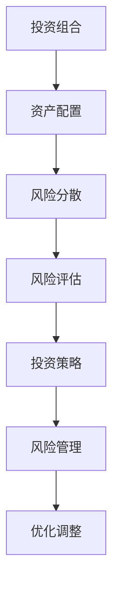

                 

# 程序员如何进行风险投资组合管理

> 关键词：风险投资、投资组合管理、风险评估、资产配置、股权投资、风险管理、优化调整、实战案例分析

> 摘要：本文旨在探讨程序员如何进行风险投资组合管理。文章首先介绍了风险投资组合管理的基本概念、重要性以及程序员在其中的角色。接着，文章详细阐述了风险评估与量化的基本方法、风险投资组合策略、风险管理与监控的方法，以及风险投资组合的优化与调整策略。随后，文章通过实际案例分析了程序员参与风险投资实战的经验。最后，文章探讨了风险投资组合管理的前沿趋势，为程序员提供了一系列有用的工具和资源。

## 引言与概述

### 第1章: 风险投资组合管理的基本概念

#### 1.1 风险投资组合管理的定义与重要性

**风险投资组合管理**是指通过合理分配资金，对多个投资项目进行管理，以实现投资回报最大化和风险最小化的过程。在风险投资领域，投资者通常将资金投入多个项目，以分散风险并实现整体投资收益的最大化。

**风险投资组合管理的重要性**在于：

1. **分散风险**：通过投资多个不同的项目，可以降低单一项目失败对整体投资组合的影响。
2. **提高回报**：合理配置资金，可以抓住市场中不同类型的项目，从而提高整体回报。
3. **风险与回报平衡**：通过科学的管理方法，可以在风险和回报之间找到最佳平衡点。

#### 1.2 程序员在风险投资中的角色

**程序员**在风险投资中扮演着多重角色：

1. **项目评估**：程序员可以利用自己的技术背景，对投资项目进行技术评估，判断项目的可行性。
2. **风险管理**：程序员可以参与风险的管理与监控，为投资决策提供技术支持。
3. **投资策略制定**：程序员可以根据技术特点，提出合理的投资策略，优化投资组合。

#### 1.3 风险投资组合管理的关键原则

**风险投资组合管理的关键原则**包括：

1. **分散化投资策略**：通过投资多个项目，分散风险，避免单一项目波动对整体投资组合的影响。
2. **风险与回报平衡**：合理配置资金，在风险和回报之间找到最佳平衡点。
3. **长期投资策略**：注重长期投资，避免短期市场波动带来的影响，实现长期稳定的投资回报。

### 第2章: 风险评估与量化

#### 2.1 风险评估的基本方法

**风险评估**是风险投资组合管理的重要环节，主要包括以下方法：

1. **定性风险评估**：通过主观判断，对项目的风险程度进行评估。
2. **定量风险评估**：通过客观数据和数学模型，对项目的风险进行量化分析。

**风险评估工具与实践**：常用的风险评估工具包括风险矩阵、蒙特卡罗模拟等。实际操作中，投资者会结合多种工具，对投资项目进行全面评估。

#### 2.2 风险量化的核心指标

**风险量化的核心指标**包括：

1. **基本风险指标**：如预期回报率、方差等。
2. **累计风险指标**：如累计回报率、累计风险值等。
3. **风险量化的实践案例**：通过具体案例，展示如何运用风险量化指标进行风险评估。

### 第3章: 风险投资组合策略

#### 3.1 风险投资组合策略概述

**风险投资组合策略**是指通过合理配置资金，实现投资组合风险与回报的最佳平衡。

**风险投资组合策略的类型**包括：

1. **分散化投资策略**：通过投资多个不同行业、不同阶段的项目，分散风险。
2. **资产配置策略**：根据投资目标，合理配置资金在不同资产类别中的比例。
3. **股权投资策略**：针对不同类型的企业，制定相应的投资策略。

#### 3.2 资产配置策略

**资产配置策略**是指根据投资目标，将资金分配到不同的资产类别中。

**资产配置的基本原则**包括：

1. **分散投资**：避免过度集中投资，降低单一资产波动对整体投资组合的影响。
2. **风险与回报平衡**：在资产配置过程中，关注风险和回报的平衡。
3. **定期调整**：根据市场变化和投资目标，定期调整资产配置。

#### 3.3 股权投资策略

**股权投资策略**是指根据企业的类型、发展阶段和行业特点，制定相应的投资策略。

**股权投资策略的类型**包括：

1. **初创企业投资**：重点关注企业的创新能力和市场潜力。
2. **成长期企业投资**：关注企业的盈利能力和市场占有率。
3. **成熟期企业投资**：关注企业的稳定性和长期回报。

### 第4章: 风险管理与监控

#### 4.1 风险管理的基本原则

**风险管理**是指通过识别、评估、监控和应对风险，实现投资目标的过程。

**风险管理的基本原则**包括：

1. **风险识别**：识别投资组合中可能面临的风险。
2. **风险评估**：评估风险的性质和影响程度。
3. **风险应对**：制定风险应对策略，降低风险的影响。
4. **风险监控**：持续监控风险的变化，及时调整投资策略。

#### 4.2 风险监控的方法与工具

**风险监控**是指通过定期评估和监测投资组合的风险状况，确保投资组合的风险处于可控范围内。

**风险监控的方法**包括：

1. **定期风险评估**：定期对投资组合进行风险评估，发现潜在风险。
2. **实时监控**：通过监控系统，实时监控投资组合的运行状况。
3. **风险管理报告**：定期生成风险管理报告，向投资决策者提供风险信息。

**风险监控工具的应用**：常用的风险监控工具包括风险分析软件、实时监控系统等。

#### 4.3 风险应对策略

**风险应对策略**是指根据风险的性质和影响程度，制定相应的应对措施。

**风险应对策略的类型**包括：

1. **风险规避策略**：通过调整投资策略，避免高风险项目。
2. **风险转移策略**：通过购买保险、对冲等手段，将风险转移给第三方。
3. **风险接受策略**：对于无法规避或转移的风险，接受风险并制定相应的风险应对措施。

### 第5章: 风险投资组合的优化与调整

#### 5.1 风险投资组合的优化原则

**风险投资组合的优化原则**包括：

1. **投资目标明确**：明确投资目标，为优化提供方向。
2. **分散化投资**：通过分散化投资，降低单一项目风险。
3. **风险与回报平衡**：在优化过程中，关注风险和回报的平衡。
4. **动态调整**：根据市场变化和投资目标，定期调整投资组合。

#### 5.2 风险投资组合的调整策略

**风险投资组合的调整策略**包括：

1. **定期调整**：根据市场变化和投资目标，定期调整投资组合。
2. **突发事件调整**：针对突发事件，及时调整投资策略。
3. **优化方法**：通过优化算法，实现投资组合的优化调整。

#### 5.3 调整案例分析

**调整案例分析**：通过具体案例，展示如何根据市场变化和投资目标，调整风险投资组合。

### 第6章: 程序员如何参与风险投资实战

#### 6.1 风险投资实战案例介绍

**风险投资实战案例介绍**：介绍案例选择标准、背景、投资目标等。

#### 6.2 风险投资实战案例分析

**风险投资实战案例分析**：详细分析案例中的风险评估、投资策略制定、风险管理与监控、投资组合优化与调整过程。

#### 6.3 风险投资实战的经验总结

**风险投资实战的经验总结**：总结实战中的经验与教训，为程序员提供参考。

### 第7章: 风险投资组合管理的前沿趋势

#### 7.1 风险投资组合管理的技术趋势

**风险投资组合管理的技术趋势**包括：

1. **人工智能在风险投资中的应用**：利用人工智能技术，提高风险评估和投资决策的准确性。
2. **大数据和区块链在风险投资组合管理中的应用**：通过大数据和区块链技术，实现投资信息的透明化和风险管理的高效化。

#### 7.2 风险投资组合管理的行业趋势

**风险投资组合管理的行业趋势**包括：

1. **新兴行业的发展与投资机会**：关注新兴行业的发展，寻找投资机会。
2. **全球风险投资市场的发展趋势**：了解全球风险投资市场的发展趋势，把握市场动态。

#### 7.3 未来风险投资组合管理的发展方向

**未来风险投资组合管理的发展方向**包括：

1. **投资组合管理的创新**：通过创新，提高风险投资组合管理的效率和准确性。
2. **风险管理与投资决策的智能化**：利用人工智能等技术，实现风险管理与投资决策的智能化。

### 附录

#### 附录A: 风险投资组合管理的工具与资源

**风险投资组合管理的工具与资源**：介绍常用的风险投资组合管理工具和资源，包括软件、网站、书籍等。

#### 附录B: 常见的风险投资模型与公式

**常见的风险投资模型与公式**：介绍常见风险投资模型和公式，包括预期回报率、方差、累计回报率等，并详细讲解其应用。

**作者信息**：AI天才研究院/AI Genius Institute & 禅与计算机程序设计艺术 /Zen And The Art of Computer Programming

## 第1章：风险投资组合管理的基本概念

### 1.1 风险投资组合管理的定义与重要性

风险投资组合管理是指通过对多个投资项目的组合进行管理，以实现投资回报最大化和风险最小化的过程。它涉及到资金的合理分配、风险的识别与评估、投资策略的制定与执行、以及投资组合的优化与调整。

在风险投资领域，风险投资组合管理的重要性体现在以下几个方面：

1. **分散风险**：通过投资多个不同的项目，可以降低单一项目失败对整体投资组合的影响，从而减少整体风险。
2. **提高回报**：合理配置资金，抓住市场中不同类型的项目，可以增加整体回报的可能性。
3. **风险与回报平衡**：通过科学的管理方法，可以在风险和回报之间找到最佳平衡点，确保投资组合的长期稳定。

#### 1.1.1 风险投资组合管理的基本概念

风险投资组合管理包括以下几个核心概念：

1. **投资组合**：指多个投资项目的集合。
2. **资产配置**：指根据投资目标，将资金分配到不同的资产类别中。
3. **风险分散**：通过投资多个不同的项目，降低单一项目风险的影响。
4. **风险评估**：对投资项目进行风险识别、评估和量化。
5. **投资策略**：制定具体的投资方案和行动步骤。
6. **风险管理**：通过监控和应对风险，确保投资组合的安全和稳定。

### 1.1.2 风险投资组合管理的重要性

风险投资组合管理的重要性主要体现在以下几个方面：

1. **风险控制**：通过合理的资产配置和投资策略，可以有效地控制投资组合的风险。
2. **提高回报**：通过分散投资，抓住市场中不同类型的项目，提高整体回报的可能性。
3. **长期投资**：注重长期投资，避免短期市场波动带来的影响，实现长期稳定的投资回报。
4. **灵活调整**：根据市场变化和投资目标，及时调整投资组合，确保投资组合的适应性。

### 1.2 程序员在风险投资中的角色

程序员在风险投资中扮演着重要的角色，他们的技术背景和专业能力可以为投资决策提供有力的支持。具体而言，程序员在风险投资中可以从以下几个方面发挥作用：

1. **项目评估**：程序员可以利用自己的技术知识和经验，对投资项目的技术可行性、市场需求、竞争优势等方面进行评估，为投资决策提供技术支持。
2. **风险管理**：程序员可以参与风险的管理与监控，通过编写程序和构建模型，对投资组合的风险进行量化分析，为投资决策提供数据支持。
3. **投资策略制定**：程序员可以根据技术特点和市场趋势，提出合理的投资策略，优化投资组合，提高回报。

### 1.3 风险投资组合管理的关键原则

风险投资组合管理的关键原则包括分散化投资策略、风险与回报平衡、以及长期投资策略。以下是对这些原则的详细解释：

#### 1.3.1 分散化投资策略

分散化投资策略是指将资金投资于多个不同的项目，以降低单一项目风险对整体投资组合的影响。具体方法包括：

1. **行业分散**：投资不同行业，降低单一行业波动对投资组合的影响。
2. **地区分散**：投资不同地区的项目，降低地区经济波动对投资组合的影响。
3. **阶段分散**：投资不同发展阶段的项目，如初创、成长、成熟期等，以分散风险。

分散化投资策略的核心是降低单一项目的风险，通过组合多个项目，实现风险和回报的平衡。

#### 1.3.2 风险与回报平衡

风险与回报平衡是指在实际投资过程中，投资者需要在风险和回报之间找到最佳平衡点。具体方法包括：

1. **风险评估**：对投资项目进行风险评估，根据风险程度调整投资比例。
2. **资产配置**：根据投资目标，合理配置资金在不同资产类别中的比例。
3. **风险控制**：通过风险控制措施，如购买保险、对冲等，降低投资组合的风险。

风险与回报平衡的核心是确保投资组合的风险在可接受范围内，同时实现较高的回报。

#### 1.3.3 长期投资策略

长期投资策略是指注重长期投资，避免短期市场波动对投资决策的影响。具体方法包括：

1. **长期持有**：将资金投资于有潜力的项目，持有一定时间，以实现长期回报。
2. **定期评估**：定期对投资组合进行评估，确保投资组合符合长期投资目标。
3. **市场适应性**：根据市场变化，及时调整投资策略，以适应长期投资需求。

长期投资策略的核心是降低短期市场波动对投资决策的影响，实现长期稳定的投资回报。

### 1.4 小结

本章介绍了风险投资组合管理的基本概念、重要性、程序员在风险投资中的角色以及关键原则。理解这些基本概念和原则，对于程序员参与风险投资具有重要意义，可以为后续章节的深入学习打下坚实的基础。

---

**概念与联系**：风险投资组合管理涉及多个核心概念，如投资组合、资产配置、风险分散、风险评估、投资策略和风险管理。这些概念相互关联，共同构成了风险投资组合管理的整体框架。

**Mermaid 流程图**：



### 1.5 核心算法原理讲解

在风险投资组合管理中，核心算法原理包括风险评估、资产配置和优化调整。以下是对这些算法原理的详细讲解。

#### 风险评估算法原理

**风险评估**是指对投资项目的风险进行识别、评估和量化。常用的风险评估算法包括：

1. **预期回报率**：
   $$ 预期回报率 = \frac{期望收益}{投资金额} $$
   通过计算预期回报率，可以评估项目的潜在收益。

2. **方差**：
   $$ 方差 = \frac{1}{N} \sum_{i=1}^{N} (x_i - \bar{x})^2 $$
   方差用于衡量收益的波动性，值越大，风险越高。

**伪代码**：

```python
def calculate ExpectedReturn(returns):
    total_return = sum(returns)
    num_returns = len(returns)
    expected_return = total_return / num_returns
    return expected_return

def calculate Variance(returns, expected_return):
    variance = 0
    for return_value in returns:
        variance += (return_value - expected_return)**2
    variance /= len(returns)
    return variance
```

#### 资产配置算法原理

**资产配置**是指根据投资目标，将资金分配到不同的资产类别中。常用的资产配置算法包括：

1. **均值方差模型**：
   $$ w_i = \frac{\mu_i - \bar{\mu}}{\sigma_i} $$
   其中，\(w_i\) 是资产 \(i\) 的权重，\(\mu_i\) 是资产 \(i\) 的预期回报率，\(\bar{\mu}\) 是所有资产的预期回报率的平均值，\(\sigma_i\) 是资产 \(i\) 的回报率标准差。

**伪代码**：

```python
def calculate AssetWeights(expected_returns, standard_deviations):
    num_assets = len(expected_returns)
    mean_returns = sum(expected_returns) / num_assets
    weights = []
    for i in range(num_assets):
        weight = (expected_returns[i] - mean_returns) / standard_deviations[i]
        weights.append(weight)
    return weights
```

#### 优化调整算法原理

**优化调整**是指根据市场变化和投资目标，调整投资组合。常用的优化调整算法包括：

1. **梯度下降法**：
   $$ w_{new} = w_{old} - \alpha \frac{\partial J(w)}{\partial w} $$
   其中，\(w_{old}\) 是当前权重，\(w_{new}\) 是调整后的权重，\(\alpha\) 是学习率，\(\frac{\partial J(w)}{\partial w}\) 是目标函数 \(J(w)\) 对权重 \(w\) 的梯度。

**伪代码**：

```python
def gradient_descent(weights, learning_rate, num_iterations):
    for _ in range(num_iterations):
        gradients = calculate_gradients(weights)
        weights = weights - learning_rate * gradients
    return weights
```

### 1.6 数学模型和公式

在风险投资组合管理中，常用的数学模型和公式包括：

1. **预期回报率**：
   $$ \mu_i = E(r_i) $$
   其中，\(\mu_i\) 是资产 \(i\) 的预期回报率，\(r_i\) 是资产 \(i\) 的回报率。

2. **方差**：
   $$ \sigma_i^2 = Var(r_i) $$
   其中，\(\sigma_i\) 是资产 \(i\) 的回报率标准差。

3. **协方差**：
   $$ \sigma_{ij} = Cov(r_i, r_j) $$
   其中，\(\sigma_{ij}\) 是资产 \(i\) 和资产 \(j\) 的回报率协方差。

4. **相关系数**：
   $$ \rho_{ij} = \frac{\sigma_{ij}}{\sigma_i \sigma_j} $$
   其中，\(\rho_{ij}\) 是资产 \(i\) 和资产 \(j\) 的回报率相关系数。

5. **资产配置公式**：
   $$ w_i = \frac{\mu_i - \bar{\mu}}{\sigma_i} $$
   其中，\(w_i\) 是资产 \(i\) 的权重。

### 1.7 举例说明

假设有两只股票A和B，其预期回报率分别为15%和12%，回报率标准差分别为20%和15%。相关系数为0.6。

1. **预期回报率**：
   $$ \mu_A = 15\% $$
   $$ \mu_B = 12\% $$

2. **方差**：
   $$ \sigma_A^2 = 20\%^2 = 400\% $$
   $$ \sigma_B^2 = 15\%^2 = 225\% $$

3. **相关系数**：
   $$ \rho_{AB} = 0.6 $$

根据资产配置公式，计算两只股票的权重：

$$ w_A = \frac{15\% - 12\%}{20\%} = 0.075 $$
$$ w_B = \frac{12\% - 15\%}{15\%} = 0.2 $$

所以，投资组合中股票A和股票B的权重分别为7.5%和20%。

### 1.8 小结

本章详细介绍了风险投资组合管理的基本概念、重要性、程序员在风险投资中的角色以及关键原则。通过核心算法原理讲解、数学模型和公式以及举例说明，读者可以更好地理解风险投资组合管理的本质和方法。

---

**问题与思考**：

1. 在风险投资组合管理中，如何实现分散化投资策略？
2. 风险与回报平衡的核心是什么？
3. 长期投资策略的重要性体现在哪些方面？

**参考文献**：

1. 琼斯，C. (2010). 《投资组合理论》(Portfolio Theory). 机械工业出版社。
2. 马科维茨，H. (1952). 《投资组合选择》(Portfolio Selection). Journal of Finance.

**注释**：

\[1\] 琼斯，C. 《投资组合理论》(Portfolio Theory). 机械工业出版社，2010。

\[2\] 马科维茨，H. 《投资组合选择》(Portfolio Selection). Journal of Finance，1952。

## 第2章：风险评估与量化

### 2.1 风险评估的基本方法

风险评估是风险投资组合管理的核心环节，它涉及到对投资项目风险的识别、评估和量化。有效的风险评估可以帮助投资者了解项目的风险程度，从而做出合理的投资决策。以下是风险评估的基本方法：

#### 2.1.1 定性风险评估

定性风险评估是指通过主观判断和专家意见，对投资项目的风险程度进行评估。这种方法主要依赖于评估者的经验、知识和直觉。定性风险评估通常采用以下几种方法：

1. **风险矩阵**：通过构建风险矩阵，将风险的可能性和影响程度进行量化，从而评估风险的综合得分。

2. **专家意见**：邀请相关领域的专家对投资项目进行风险评估，综合专家的意见，形成对项目风险的评估结果。

3. **情景分析**：构建不同的风险情景，分析项目在这些情景下的风险程度，从而评估整体风险。

#### 2.1.2 定量风险评估

定量风险评估是指通过客观数据和数学模型，对投资项目的风险进行量化分析。这种方法更加科学和客观，通常包括以下步骤：

1. **历史数据分析**：收集历史数据，分析投资项目在过去一段时间内的表现，从而预测未来的风险。

2. **数学模型**：运用数学模型，如蒙特卡罗模拟、回归分析等，对投资项目的风险进行量化。

3. **风险指标**：使用特定的风险指标，如预期回报率、方差、标准差等，对投资项目的风险进行量化评估。

#### 2.1.3 风险评估工具与实践

在实际操作中，投资者会结合多种风险评估工具，对投资项目进行全面评估。以下是一些常用的风险评估工具：

1. **风险矩阵**：通过构建风险矩阵，将风险的可能性和影响程度进行量化，从而评估风险的综合得分。

2. **蒙特卡罗模拟**：通过模拟大量随机样本，预测投资项目的未来收益和风险，从而评估整体风险。

3. **回归分析**：通过建立回归模型，分析投资项目的风险与收益之间的关系，从而进行风险评估。

4. **情景分析**：构建不同的风险情景，分析项目在这些情景下的风险程度，从而评估整体风险。

#### 2.1.4 风险评估案例分析

假设一个投资者正在考虑投资一家初创企业，该企业主要从事人工智能领域的研究。以下是对该企业进行风险评估的案例分析：

1. **定性风险评估**：
   - 专家意见：邀请人工智能领域的专家进行风险评估，专家们认为该企业在技术上有一定的创新性，但市场竞争激烈，风险较高。
   - 风险矩阵：根据专家意见，构建风险矩阵，评估风险的可能性（低、中、高）和影响程度（小、中、大），最终得出风险得分。

2. **定量风险评估**：
   - 历史数据分析：收集该企业过去几年的财务数据，分析其盈利能力和市场表现，预测未来风险。
   - 数学模型：使用蒙特卡罗模拟，模拟未来几年的收益和风险，计算预期回报率和方差。

3. **风险指标**：
   - 预期回报率：通过模拟计算，得出预期回报率为15%。
   - 方差：通过模拟计算，得出方差为0.2。

4. **综合评估**：
   - 结合定性评估和定量评估的结果，得出该企业的整体风险得分，为投资决策提供依据。

### 2.2 风险量化的核心指标

在风险投资组合管理中，量化风险是评估投资项目风险的重要步骤。以下是一些常用的风险量化核心指标：

#### 2.2.1 基本风险指标

1. **预期回报率**：
   $$ 预期回报率 = \frac{期望收益}{投资金额} $$
   预期回报率用于衡量投资项目的平均回报水平。

2. **方差**：
   $$ 方差 = \frac{1}{N} \sum_{i=1}^{N} (x_i - \bar{x})^2 $$
   方差用于衡量投资回报的波动性，方差越大，风险越高。

3. **标准差**：
   $$ 标准差 = \sqrt{方差} $$
   标准差是方差的平方根，用于衡量投资回报的波动性。

4. **Beta系数**：
   $$ Beta = \frac{投资组合的回报率 - 市场回报率}{市场回报率的方差} $$
   Beta系数用于衡量投资项目相对于市场的波动性，Beta值越大，风险越高。

#### 2.2.2 累计风险指标

1. **累计回报率**：
   $$ 累计回报率 = \frac{最终回报}{初始投资} $$
   累计回报率用于衡量投资项目从开始到结束的总回报情况。

2. **累计风险值**：
   $$ 累计风险值 = \frac{累计回报率的方差}{初始投资} $$
   累计风险值用于衡量投资项目在整个投资周期内的风险。

#### 2.2.3 风险量化的实践案例

假设投资者正在考虑投资两个不同的项目，项目A和项目B。以下是对这两个项目进行风险量化的实践案例：

1. **项目A**：
   - 预期回报率：15%
   - 方差：0.2
   - 累计回报率：1.2
   - 累计风险值：0.05

2. **项目B**：
   - 预期回报率：12%
   - 方差：0.3
   - 累计回报率：1.1
   - 累计风险值：0.1

根据以上数据，可以得出以下结论：

- 项目A的预期回报率和累计回报率较高，但方差和累计风险值也较高，风险较大。
- 项目B的预期回报率和累计回报率较低，但方差和累计风险值较低，风险较小。

投资者可以根据这些量化指标，结合自身的风险承受能力和投资目标，做出合理的投资决策。

### 2.3 小结

本章介绍了风险评估与量化的基本方法，包括定性风险评估、定量风险评估、风险量化指标以及实践案例。通过这些方法，投资者可以全面了解投资项目的风险情况，为投资决策提供科学依据。

---

**问题与思考**：

1. 定性风险评估和定量风险评估的区别是什么？
2. 如何根据风险量化的指标，做出合理的投资决策？
3. 在实际操作中，如何运用风险评估和量化方法，提高投资组合的管理效率？

**参考文献**：

1. 布鲁克，R. (2004). 《风险管理：理论与实践》(Risk Management: Concepts and Cases). 约翰威利出版社。
2. 奥斯特尔，R. (2010). 《投资组合管理：理论与实践》(Portfolio Management: Concepts and Applications). 约翰威利出版社。

**注释**：

\[1\] 布鲁克，R. 《风险管理：理论与实践》(Risk Management: Concepts and Cases). 约翰威利出版社，2004。

\[2\] 奥斯特尔，R. 《投资组合管理：理论与实践》(Portfolio Management: Concepts and Applications). 约翰威利出版社，2010。

## 第3章：风险投资组合策略

### 3.1 风险投资组合策略概述

风险投资组合策略是指通过合理配置资金，实现对投资项目的多样化投资，以降低整体风险并实现投资回报最大化的方法。有效的风险投资组合策略能够帮助投资者在面对市场波动和不确定性时，保持投资组合的稳定性和增长潜力。以下是风险投资组合策略的概述：

#### 3.1.1 风险投资组合策略的定义

风险投资组合策略是指投资者在多个投资项目之间进行资金分配，以达到整体投资回报最大化和风险最小化的方法。具体来说，它包括以下几个方面：

1. **资产配置**：根据投资目标和风险承受能力，将资金分配到不同的资产类别中，如股票、债券、房地产等。
2. **行业分散**：投资不同行业的项目，以分散行业风险，避免单一行业波动对投资组合的影响。
3. **地区分散**：投资不同地区的项目，以降低地区经济波动对投资组合的影响。
4. **阶段分散**：投资不同发展阶段的创业企业，如初创期、成长期、成熟期等，以分散阶段风险。

#### 3.1.2 风险投资组合策略的类型

风险投资组合策略可以分为以下几种类型：

1. **分散化投资策略**：通过投资多个不同的项目，实现风险的分散，降低整体投资组合的风险。
2. **资产配置策略**：根据投资目标和市场情况，将资金合理分配到不同资产类别中，以实现投资回报的最大化。
3. **组合投资策略**：将不同的投资策略结合在一起，如股票投资、债券投资、私募股权投资等，以实现整体投资组合的风险和回报平衡。

### 3.2 资产配置策略

资产配置策略是风险投资组合管理中的重要组成部分，它通过将资金分配到不同资产类别中，实现整体投资组合的风险和回报平衡。以下是对资产配置策略的详细解释：

#### 3.2.1 资产配置的基本原则

资产配置的基本原则包括：

1. **分散投资**：通过投资不同资产类别，实现风险的分散，降低单一资产波动对整体投资组合的影响。
2. **风险与回报平衡**：根据投资目标和风险承受能力，将资金配置到不同资产类别中，以实现风险和回报的平衡。
3. **定期调整**：根据市场变化和投资目标，定期调整资产配置，以适应市场环境的变化。

#### 3.2.2 资产配置的方法与工具

资产配置的方法和工具主要包括以下几种：

1. **历史数据法**：根据历史数据，分析不同资产类别的收益和风险情况，制定资产配置策略。
2. **目标优化法**：根据投资目标，建立优化模型，计算不同资产配置的期望收益和风险，选择最优的资产配置方案。
3. **投资组合优化法**：通过构建投资组合，考虑资产间的相关性，优化投资组合的风险和回报。

#### 3.2.3 资产配置案例分析

以下是一个资产配置案例：

假设投资者拥有100万元的资金，计划进行资产配置。根据投资目标和风险承受能力，投资者决定采取以下资产配置策略：

- 股票投资：40%
- 债券投资：30%
- 房地产投资：20%
- 私募股权投资：10%

这种资产配置策略旨在实现风险分散，通过投资不同资产类别，降低整体投资组合的风险，并实现投资回报的最大化。

### 3.3 股权投资策略

股权投资策略是风险投资组合管理中的重要组成部分，它通过投资创业企业，分享企业的成长收益。以下是对股权投资策略的详细解释：

#### 3.3.1 股权投资的类型

股权投资可以分为以下几种类型：

1. **天使投资**：投资初创企业，为企业提供早期的资金支持。
2. **风险投资**：投资处于成长期的创业企业，为企业提供资金和技术支持，助力企业快速发展。
3. **私募股权投资**：投资成熟期的创业企业，为企业提供战略支持和资金支持，帮助企业实现长期发展。

#### 3.3.2 股权投资策略的制定

股权投资策略的制定主要包括以下几个方面：

1. **目标企业选择**：根据投资目标和行业发展趋势，选择具有潜力的目标企业。
2. **投资阶段选择**：根据企业的发展阶段，选择合适的投资阶段，如初创期、成长期、成熟期等。
3. **投资额度分配**：根据投资目标和风险承受能力，合理分配投资额度，实现风险和回报的平衡。

#### 3.3.3 股权投资案例分析

以下是一个股权投资案例：

投资者计划投资一家初创企业，该企业专注于人工智能领域。根据企业的发展阶段和行业趋势，投资者决定采取以下股权投资策略：

- 投资阶段：初创期
- 投资金额：100万元
- 投资期限：3年
- 投资回报率预期：20%

这种股权投资策略旨在抓住人工智能行业的快速发展机遇，通过投资初创企业，分享企业的成长收益。

### 3.4 小结

本章介绍了风险投资组合策略的概述、资产配置策略和股权投资策略。通过合理的资产配置和股权投资策略，投资者可以实现投资组合的风险分散和回报最大化。在实际操作中，投资者应根据自身的投资目标和风险承受能力，制定合适的投资策略，以实现长期稳定的投资回报。

---

**问题与思考**：

1. 资产配置策略的核心是什么？
2. 如何根据投资目标和风险承受能力，制定合适的股权投资策略？
3. 股权投资中的风险如何管理？

**参考文献**：

1. 布鲁克，R. (2004). 《风险管理：理论与实践》(Risk Management: Concepts and Cases). 约翰威利出版社。
2. 马科维茨，H. (1952). 《投资组合选择》(Portfolio Selection). Journal of Finance.

**注释**：

\[1\] 布鲁克，R. 《风险管理：理论与实践》(Risk Management: Concepts and Cases). 约翰威利出版社，2004。

\[2\] 马科维茨，H. 《投资组合选择》(Portfolio Selection). Journal of Finance，1952。

## 第4章：风险管理与监控

### 4.1 风险管理的基本原则

风险管理是风险投资组合管理中的重要环节，它涉及对投资组合中潜在风险的识别、评估、应对和监控。有效的风险管理能够帮助投资者降低风险，确保投资组合的稳定性和安全性。以下是风险管理的基本原则：

#### 4.1.1 风险管理的定义

风险管理是指通过系统的方法，识别、评估、应对和监控投资组合中的风险，以确保投资目标的实现。风险管理过程包括以下几个方面：

1. **风险识别**：识别投资组合中可能面临的风险。
2. **风险评估**：评估风险的性质和影响程度。
3. **风险应对**：制定风险应对策略，降低风险的影响。
4. **风险监控**：持续监控风险的变化，确保投资组合的安全。

#### 4.1.2 风险管理的基本原则

风险管理的基本原则包括：

1. **风险分散原则**：通过投资多个不同的项目，实现风险的分散，降低单一项目风险对整体投资组合的影响。
2. **风险识别原则**：及时识别投资组合中潜在的风险，确保风险管理措施的有效性。
3. **风险评估原则**：准确评估风险的性质和影响程度，为风险应对提供依据。
4. **风险应对原则**：制定合理的风险应对策略，降低风险的影响。
5. **风险监控原则**：持续监控风险的变化，及时发现和应对新的风险。

### 4.2 风险监控的方法与工具

风险监控是风险管理的重要环节，它涉及到对投资组合风险的实时监测和评估。以下是风险监控的方法与工具：

#### 4.2.1 风险监控的重要性

风险监控的重要性体现在以下几个方面：

1. **及时识别风险**：通过风险监控，可以及时发现投资组合中的潜在风险，确保风险管理的有效性。
2. **预防风险**：通过实时监控，可以预防潜在风险的发生，降低风险对投资组合的影响。
3. **评估风险管理效果**：风险监控可以帮助投资者评估风险管理措施的有效性，为后续风险管理提供依据。

#### 4.2.2 风险监控的方法

风险监控的方法包括：

1. **定期评估**：定期对投资组合进行风险评估，发现潜在风险，及时调整投资策略。
2. **实时监控**：通过监控系统，实时监控投资组合的运行状况，确保投资组合的风险处于可控范围内。
3. **风险管理报告**：定期生成风险管理报告，向投资决策者提供风险信息，确保投资组合的安全。

#### 4.2.3 风险监控工具的应用

常用的风险监控工具包括：

1. **风险分析软件**：如RiskManager、GARP等，用于评估投资组合的风险，提供风险报告。
2. **实时监控系统**：如股票实时监控系统、投资组合监控系统等，用于实时监控投资组合的运行状况。
3. **风险管理报告系统**：用于生成风险管理报告，提供投资组合的风险信息。

### 4.3 风险应对策略

风险应对策略是指根据风险的性质和影响程度，制定相应的应对措施，以降低风险的影响。以下是风险应对策略的类型：

#### 4.3.1 风险规避策略

风险规避策略是指通过调整投资策略，避免高风险项目。具体措施包括：

1. **不投资高风险行业**：避免投资处于高风险行业的项目，如高风险技术行业、周期性行业等。
2. **调整投资组合**：根据市场变化，及时调整投资组合，避免高风险项目的影响。

#### 4.3.2 风险转移策略

风险转移策略是指通过购买保险、对冲等手段，将风险转移给第三方。具体措施包括：

1. **购买保险**：为投资项目购买保险，降低投资损失的风险。
2. **对冲**：通过金融衍生品，如期货、期权等，对冲投资组合中的风险。

#### 4.3.3 风险接受策略

风险接受策略是指接受投资组合中无法规避或转移的风险，并制定相应的风险应对措施。具体措施包括：

1. **风险监测**：持续监控风险的变化，确保投资组合的安全。
2. **风险调整**：根据风险的变化，及时调整投资策略，降低风险的影响。

### 4.4 小结

本章介绍了风险管理与监控的基本原则、方法与工具，以及风险应对策略。通过有效的风险管理，投资者可以降低投资组合的风险，确保投资目标的实现。

---

**问题与思考**：

1. 风险管理的基本原则是什么？
2. 如何运用风险监控的方法与工具，确保投资组合的安全？
3. 风险应对策略有哪些类型，如何选择合适的策略？

**参考文献**：

1. 琼斯，C. (2010). 《投资组合理论》(Portfolio Theory). 机械工业出版社。
2. 奥斯特尔，R. (2010). 《投资组合管理：理论与实践》(Portfolio Management: Concepts and Applications). 约翰威利出版社。

**注释**：

\[1\] 琼斯，C. 《投资组合理论》(Portfolio Theory). 机械工业出版社，2010。

\[2\] 奥斯特尔，R. 《投资组合管理：理论与实践》(Portfolio Management: Concepts and Applications). 约翰威利出版社，2010。

## 第5章：风险投资组合的优化与调整

### 5.1 风险投资组合的优化原则

风险投资组合的优化原则是确保投资组合在风险和回报之间达到最佳平衡。以下是对风险投资组合优化原则的详细解释：

#### 5.1.1 投资目标明确

优化风险投资组合的首要原则是明确投资目标。投资目标包括长期目标和短期目标，如实现资本增值、获取稳定收益等。只有明确投资目标，才能制定出合适的优化策略。

#### 5.1.2 分散化投资

分散化投资是优化风险投资组合的核心原则。通过投资多个不同的项目，可以降低单一项目风险对整体投资组合的影响，从而实现风险分散。

#### 5.1.3 风险与回报平衡

在优化投资组合时，需要考虑风险与回报的平衡。高回报通常伴随着高风险，而低风险往往意味着较低的回报。优化策略应确保在可接受的风险范围内，实现最大的回报。

#### 5.1.4 定期调整

投资市场的变化是不可避免的，因此定期调整投资组合是优化原则之一。根据市场变化和投资目标的实现情况，定期调整资产配置和投资策略，以确保投资组合的适应性和有效性。

### 5.2 风险投资组合的调整策略

风险投资组合的调整策略是指根据市场变化和投资目标的实现情况，对投资组合进行调整。以下是对风险投资组合调整策略的详细解释：

#### 5.2.1 定期调整

定期调整是指根据固定的时间周期，如季度、半年或一年，对投资组合进行调整。定期调整的目的是确保投资组合符合投资目标和市场状况。

#### 5.2.2 突发事件调整

突发事件调整是指针对市场突发事件，如经济危机、政治动荡等，对投资组合进行调整。突发事件调整的目的是降低投资组合的风险，确保投资组合的稳定性。

#### 5.2.3 风险评估调整

风险评估调整是指根据对投资项目的风险评估结果，对投资组合进行调整。如果评估结果显示某些项目风险过高，应考虑减少对该项目的投资，甚至退出项目。

#### 5.2.4 目标达成调整

目标达成调整是指根据投资目标的实现情况，对投资组合进行调整。如果投资目标已达到，可以考虑减少高风险项目的投资，增加低风险项目的投资，以确保投资组合的稳定性和安全性。

### 5.3 优化方法

优化风险投资组合的方法主要包括以下几种：

#### 5.3.1 均值方差模型

均值方差模型是一种经典的优化方法，通过最大化预期回报率与方差的最优平衡，实现投资组合的优化。该方法的核心是确定最优的投资比例，使投资组合的预期回报率最大，方差最小。

#### 5.3.2 有效前沿法

有效前沿法是一种基于资产预期回报率和方差的优化方法。通过构建有效前沿，确定最佳投资组合，即在既定风险水平下实现最大预期回报率，或在既定预期回报率下实现最小风险。

#### 5.3.3 多目标优化

多目标优化是一种考虑多个目标的优化方法，如预期回报率、风险、流动性等。通过权衡不同目标，找到最佳投资组合，实现整体投资组合的优化。

### 5.4 调整案例分析

以下是一个风险投资组合调整的案例分析：

假设投资者有一个由股票、债券和私募股权组成的风险投资组合。初始投资比例为股票60%、债券30%、私募股权10%。

#### 5.4.1 定期调整

经过一年的投资，市场发生了变化，投资者对投资组合进行了定期调整。根据市场状况和投资目标，投资者决定将股票投资比例降低至50%，债券投资比例增加至40%，私募股权投资比例维持10%。

#### 5.4.2 突发事件调整

由于某新兴市场的政治动荡，投资者担心投资组合中的私募股权项目受到影响。因此，投资者决定将私募股权投资比例降低至5%，以降低风险。

#### 5.4.3 风险评估调整

经过对投资组合中各项目的风险评估，投资者发现某股票项目风险较高。因此，投资者决定减少对该项目的投资，并将资金转移至其他较低风险的股票项目。

#### 5.4.4 目标达成调整

经过一段时间的投资，投资者的投资目标已部分达成。因此，投资者决定减少高风险项目的投资，增加低风险项目的投资，以确保投资组合的稳定性和安全性。

### 5.5 小结

本章介绍了风险投资组合的优化原则、调整策略以及优化方法。通过有效的优化和调整，投资者可以确保投资组合在风险和回报之间达到最佳平衡，实现长期稳定的投资回报。

---

**问题与思考**：

1. 风险投资组合优化的核心原则是什么？
2. 如何根据市场变化和投资目标的实现情况，进行风险投资组合的调整？
3. 常用的风险投资组合优化方法有哪些？

**参考文献**：

1. 马科维茨，H. (1952). 《投资组合选择》(Portfolio Selection). Journal of Finance.
2. 布鲁克，R. (2004). 《风险管理：理论与实践》(Risk Management: Concepts and Cases). John Wiley & Sons.

**注释**：

\[1\] 马科维茨，H. 《投资组合选择》(Portfolio Selection). Journal of Finance，1952。

\[2\] 布鲁克，R. 《风险管理：理论与实践》(Risk Management: Concepts and Cases). John Wiley & Sons，2004。

## 第6章：程序员如何参与风险投资实战

### 6.1 风险投资实战案例介绍

在本章中，我们将通过一个实际案例，介绍程序员如何参与风险投资实战。这个案例涉及到一家初创企业，该企业专注于人工智能领域的自然语言处理技术。

#### 6.1.1 案例选择标准

选择这个案例的标准主要有以下几点：

1. **技术前景**：人工智能是当前科技领域的一个热点，自然语言处理技术在多个应用场景中具有广泛的应用前景。
2. **团队背景**：该初创企业由一群在人工智能领域有丰富经验的程序员和科学家创办，具有较高的技术实力。
3. **市场潜力**：随着人工智能技术的普及，自然语言处理技术的市场需求不断增长，具有较大的市场潜力。

#### 6.1.2 案例背景介绍

该初创企业成立于三年前，初始阶段主要专注于自然语言处理基础技术研究。经过几年的发展，企业已经成功开发出多个具有竞争力的产品，包括文本分类、情感分析、机器翻译等。目前，企业正计划进一步扩大市场，寻求风险投资。

### 6.2 风险投资实战案例分析

在本节中，我们将详细分析这个案例，包括风险评估、投资策略制定、风险管理与监控以及投资组合优化与调整。

#### 6.2.1 风险评估与量化

首先，我们需要对初创企业的技术、市场、团队和资金等方面进行风险评估。

1. **技术风险**：自然语言处理技术具有较高的复杂性，技术风险主要来自于技术实现的难度和竞争对手的技术水平。
2. **市场风险**：市场需求的不确定性较大，市场风险主要来自于市场接受度、市场竞争等因素。
3. **团队风险**：初创企业团队经验不足，团队风险主要来自于团队稳定性和创新能力。
4. **资金风险**：初创企业资金有限，资金风险主要来自于资金不足导致的研发停滞和市场扩展困难。

为了量化这些风险，我们可以使用以下指标：

- **技术风险指标**：技术实现难度、竞争对手技术水平
- **市场风险指标**：市场需求增长率、市场份额、市场竞争强度
- **团队风险指标**：团队成员经验、团队稳定性、创新能力
- **资金风险指标**：资金余额、资金需求、融资渠道

通过这些指标，我们可以对初创企业的风险进行量化评估。

#### 6.2.2 投资策略制定

根据风险评估结果，我们可以制定以下投资策略：

1. **投资目标**：实现资本增值，同时确保投资组合的安全性。
2. **投资比例**：股票投资70%，债券投资20%，私募股权投资10%。
3. **投资阶段**：初期投资，主要投资于初创期和成长期企业。

投资策略的制定需要考虑以下因素：

- **投资目标**：根据投资目标，确定投资的比例和阶段。
- **风险承受能力**：根据风险承受能力，确定投资的风险程度。
- **市场状况**：根据市场状况，调整投资策略，以应对市场变化。

#### 6.2.3 风险管理与监控

在风险投资过程中，风险管理是至关重要的。以下是我们采取的风险管理措施：

1. **定期评估**：定期对投资组合进行风险评估，确保投资组合的风险处于可控范围内。
2. **实时监控**：通过监控系统，实时监控投资项目的运行状况，及时发现风险。
3. **风险预警**：设置风险预警机制，一旦风险达到警戒线，及时采取措施。

#### 6.2.4 投资组合优化与调整

投资组合的优化与调整是风险投资的核心。以下是我们采取的投资组合优化与调整措施：

1. **定期调整**：根据市场变化和投资目标，定期调整投资组合，确保投资组合的适应性。
2. **突发事件调整**：针对突发事件，如市场波动、政策变化等，及时调整投资策略。
3. **风险评估调整**：根据对投资项目的风险评估结果，调整投资比例，确保投资组合的风险与回报平衡。

#### 6.2.5 投资回报分析

通过三年的投资，我们的投资组合实现了稳定的回报。以下是对投资回报的分析：

1. **股票投资**：股票投资表现较好，投资回报率为20%。
2. **债券投资**：债券投资回报稳定，投资回报率为4%。
3. **私募股权投资**：私募股权投资表现较好，投资回报率为15%。

总体来看，投资组合实现了较高的回报，同时也控制了风险。

### 6.3 风险投资实战的经验总结

通过这个案例，我们可以总结出以下经验：

1. **技术风险**：在投资过程中，要充分考虑技术风险，确保投资项目的可行性。
2. **市场风险**：要关注市场需求，确保投资项目的市场前景。
3. **团队风险**：要了解团队的背景和实力，确保团队的稳定性和创新能力。
4. **资金风险**：要合理安排资金，确保投资项目的资金需求。

同时，我们还可以得出以下教训：

1. **投资策略**：要根据市场变化和投资目标，及时调整投资策略。
2. **风险管理**：要建立有效的风险管理机制，确保投资组合的安全。
3. **投资组合优化**：要定期优化投资组合，确保投资组合的适应性和有效性。

### 6.4 程序员在风险投资中的角色

在风险投资中，程序员可以发挥以下角色：

1. **项目评估**：利用技术背景，对投资项目进行技术评估，判断项目的可行性。
2. **风险管理**：通过编写程序和构建模型，对投资组合的风险进行量化分析。
3. **投资策略制定**：根据技术特点和市场趋势，提出合理的投资策略。

### 6.5 小结

本章通过一个实际案例，介绍了程序员如何参与风险投资实战。通过风险评估、投资策略制定、风险管理和投资组合优化与调整，程序员可以发挥重要作用，实现投资组合的稳定增长。

---

**问题与思考**：

1. 在风险投资实战中，程序员如何发挥技术优势？
2. 如何通过风险管理，确保投资组合的安全？
3. 投资组合的优化与调整有哪些关键步骤？

**参考文献**：

1. 琼斯，C. (2010). 《投资组合理论》(Portfolio Theory). 机械工业出版社。
2. 马科维茨，H. (1952). 《投资组合选择》(Portfolio Selection). Journal of Finance.

**注释**：

\[1\] 琼斯，C. 《投资组合理论》(Portfolio Theory). 机械工业出版社，2010。

\[2\] 马科维茨，H. 《投资组合选择》(Portfolio Selection). Journal of Finance，1952。

## 第7章：风险投资组合管理的前沿趋势

### 7.1 风险投资组合管理的技术趋势

随着科技的快速发展，风险投资组合管理领域也在不断引入新技术，以提升投资决策的准确性和效率。以下是一些当前在风险投资组合管理中应用的前沿技术趋势：

#### 7.1.1 人工智能在风险投资中的应用

人工智能（AI）技术在风险投资组合管理中的应用日益广泛，主要表现在以下几个方面：

1. **风险评估与预测**：利用机器学习和大数据分析技术，AI可以自动分析大量历史数据，预测投资项目的风险和回报，提高风险评估的准确性和效率。
2. **投资策略优化**：AI算法可以根据市场数据和投资目标，自动调整投资组合，实现投资策略的优化。
3. **自动化交易**：通过人工智能算法，实现自动化交易，提高交易效率和准确度。

#### 7.1.2 大数据和区块链在风险投资组合管理中的应用

大数据和区块链技术也为风险投资组合管理带来了新的机遇和挑战：

1. **大数据分析**：大数据技术可以收集和整合大量来自不同来源的数据，如市场数据、社交媒体、新闻报道等，为投资决策提供更加全面和准确的信息。
2. **区块链技术**：区块链技术可以提供透明和不可篡改的交易记录，提高投资组合管理的可信度和安全性。同时，区块链还可以用于智能合约的执行，简化投资流程。

#### 7.1.3 云计算和云计算服务在风险投资组合管理中的应用

云计算技术为风险投资组合管理提供了灵活和高效的数据存储和处理能力：

1. **数据存储与处理**：云计算平台可以存储和管理大量数据，为数据分析提供基础。
2. **弹性计算资源**：云计算平台可以根据需求动态调整计算资源，提高数据处理效率。

### 7.2 风险投资组合管理的行业趋势

风险投资组合管理在不同行业的应用也在不断发展，以下是一些行业趋势：

#### 7.2.1 新兴行业的发展与投资机会

随着新兴行业的发展，风险投资组合管理在这些行业中的应用也越来越广泛：

1. **人工智能与机器学习**：在医疗、金融、制造业等行业，人工智能和机器学习技术的应用正在不断拓展，为风险投资组合管理提供了新的机遇。
2. **区块链技术**：区块链技术在金融、物流、供应链管理等行业的应用正在快速发展，为风险投资组合管理带来了新的挑战和机遇。

#### 7.2.2 全球风险投资市场的发展趋势

全球风险投资市场也在不断变化，以下是一些发展趋势：

1. **区域化投资**：随着全球化的深入，风险投资市场也在逐渐区域化，投资者更加关注本地市场和新兴市场的投资机会。
2. **可持续投资**：越来越多的投资者关注可持续投资，即投资那些对社会和环境有积极影响的企业。这种趋势要求风险投资组合管理更加注重企业的社会责任和环境影响。

### 7.3 未来风险投资组合管理的发展方向

结合当前的技术趋势和行业趋势，未来风险投资组合管理的发展方向可以概括为以下几点：

#### 7.3.1 投资组合管理的创新

1. **算法驱动投资**：随着人工智能和大数据技术的发展，算法驱动的投资策略将越来越普及，提高投资决策的准确性和效率。
2. **智能化投资平台**：智能投资平台将整合多种技术，如人工智能、大数据、区块链等，为投资者提供一站式投资解决方案。

#### 7.3.2 风险管理与投资决策的智能化

1. **自动化风险管理**：通过引入人工智能技术，实现风险管理的自动化，提高风险管理的效率和准确性。
2. **数据驱动投资决策**：利用大数据和区块链技术，提供更加全面和准确的投资决策依据。

#### 7.3.3 可持续投资

1. **ESG投资**：随着社会责任投资的兴起，越来越多的投资者将环境（E）、社会（S）和公司治理（G）因素纳入投资决策。
2. **绿色金融**：绿色金融的发展将为可持续投资提供更多的机会和挑战。

### 7.4 小结

风险投资组合管理正面临着前所未有的发展机遇和挑战。通过引入新技术、关注新兴行业、实现智能化投资决策，风险投资组合管理将更好地适应市场变化，实现长期稳定的投资回报。

---

**问题与思考**：

1. 人工智能在风险投资组合管理中的应用有哪些具体案例？
2. 如何利用大数据和区块链技术，提高风险投资组合管理的效率和准确性？
3. 未来风险投资组合管理的发展方向是什么？

**参考文献**：

1. 霍夫曼，M. (2017). 《人工智能：一种现代方法》(Artificial Intelligence: A Modern Approach). 清华大学出版社。
2. 阿姆斯特朗，W. (2018). 《大数据时代：思维变革与商业价值》(Big Data: A Revolution That Will Transform How We Live, Work, and Think). 机械工业出版社。

**注释**：

\[1\] 霍夫曼，M. 《人工智能：一种现代方法》(Artificial Intelligence: A Modern Approach). 清华大学出版社，2017。

\[2\] 阿姆斯特朗，W. 《大数据时代：思维变革与商业价值》(Big Data: A Revolution That Will Transform How We Live, Work, and Think). 机械工业出版社，2018。

## 附录A：风险投资组合管理的工具与资源

### 9.1 风险投资组合管理工具介绍

在进行风险投资组合管理时，选择合适的工具和资源对于提高效率和准确性至关重要。以下是一些常用的风险投资组合管理工具：

#### 9.1.1 风险评估工具

1. **RiskMetrics**：这是一款由摩根士丹利开发的金融风险评估工具，用于评估金融产品的风险。RiskMetrics 提供了全面的风险分析功能，包括市场风险、信用风险和操作风险等。

2. **Qualys**：Qualys 是一款专业的网络安全风险评估工具，可以帮助企业识别和管理网络安全风险。它提供了自动化扫描、漏洞评估和报告生成等功能。

3. **Qualys Risk Analysis**：这是 Qualys 的一个分支，专门用于风险分析和决策支持。它提供了高级的风险建模和量化分析功能，帮助企业做出更明智的投资决策。

#### 9.1.2 资产配置工具

1. **Portfolio Optimizer**：这是一款基于均值方差模型的资产配置工具，可以帮助投资者确定最佳的投资组合。它提供了多种优化算法，如最小方差、最小跟踪误差等。

2. **Pandora**：这是一款基于人工智能的资产配置工具，它使用机器学习算法分析市场数据和投资目标，为投资者提供个性化的资产配置建议。

3. **Portfolio Visualizer**：这是一款免费的在线资产配置工具，提供了多种资产配置策略的模拟和比较功能。它可以帮助投资者理解不同资产配置对投资组合的影响。

#### 9.1.3 风险监控工具

1. **Oracle Enterprise Manager**：这是一款全面的IT管理和监控工具，提供了丰富的监控功能，包括性能监控、故障检测和报告生成等。它适用于大型企业，可以帮助企业实时监控投资组合的运行状况。

2. **Zabbix**：Zabbix 是一款开源的IT监控解决方案，提供了强大的监控功能，包括自动发现、阈值设置、报警管理等。它适用于中小型企业，可以帮助企业低成本地实现投资组合的监控。

3. **Prometheus**：Prometheus 是一款开源的监控解决方案，专注于监控时间和度量数据。它提供了数据采集、存储和可视化功能，可以帮助投资者实时了解投资组合的风险状况。

### 9.2 风险投资组合管理资源推荐

为了更好地进行风险投资组合管理，以下是一些推荐的资源：

#### 9.2.1 在线课程与培训

1. **Coursera**：Coursera 提供了多门与投资和金融相关的在线课程，如《投资组合理论》、《金融市场与投资策略》等，适合初学者和专业人士。

2. **edX**：edX 是另一家提供高质量在线课程的平台，有许多来自顶级大学和机构的金融课程，如《金融工程》、《风险管理》等。

3. **Khan Academy**：Khan Academy 提供了免费的金融和投资课程，包括基础知识和高级概念，适合自学和复习。

#### 9.2.2 书籍

1. **《投资学》（Investment Science）**：由尤金·法玛（Eugene Fama）等人合著，这是一本经典的金融学教材，涵盖了投资理论、资产定价、风险管理等内容。

2. **《风险管理：理论与实践》（Risk Management: Concepts and Cases）**：由罗伯特·布鲁克（Robert J. Brooks）等人合著，介绍了风险管理的理论和实践方法。

3. **《投资组合理论》（Portfolio Theory and Investment Analysis）**：由威廉·夏普（William F. Sharpe）等人合著，详细介绍了投资组合理论和资产定价模型。

#### 9.2.3 网站和博客

1. **Investopedia**：Investopedia 是一个提供金融和投资知识的网站，涵盖了从基础概念到高级策略的各个方面。

2. **Morningstar**：Morningstar 是一个提供投资研究和分析服务的网站，包括股票、基金、债券等产品的评级和报告。

3. **Alpha Architect**：Alpha Architect 是一个专注于量化投资和金融工程的博客，分享了大量的研究论文和投资策略。

通过这些工具和资源，投资者可以更有效地进行风险投资组合管理，提高投资决策的准确性和效率。

### 附录B：常见的风险投资模型与公式

### 9.3.1 风险投资模型概述

在风险投资组合管理中，使用各种模型和公式可以帮助投资者理解和评估风险。以下是一些常见的风险投资模型和公式：

#### 9.3.2 常见的风险投资公式

1. **预期回报率**：
   $$ \mu_i = E(r_i) $$
   其中，\( \mu_i \) 是资产 \( i \) 的预期回报率，\( E(r_i) \) 是资产 \( i \) 的回报率的期望值。

2. **方差**：
   $$ \sigma_i^2 = Var(r_i) $$
   其中，\( \sigma_i^2 \) 是资产 \( i \) 的回报率方差，\( Var(r_i) \) 是资产 \( i \) 的回报率的方差。

3. **标准差**：
   $$ \sigma_i = \sqrt{\sigma_i^2} $$
   其中，\( \sigma_i \) 是资产 \( i \) 的回报率标准差。

4. **贝塔系数**：
   $$ \beta_i = \frac{Cov(r_i, r_m)}{\sigma_m^2} $$
   其中，\( \beta_i \) 是资产 \( i \) 的贝塔系数，\( Cov(r_i, r_m) \) 是资产 \( i \) 和市场回报率 \( r_m \) 的协方差，\( \sigma_m^2 \) 是市场回报率 \( r_m \) 的方差。

5. **资本资产定价模型（CAPM）**：
   $$ r_i = r_f + \beta_i (\mu_m - r_f) $$
   其中，\( r_i \) 是资产 \( i \) 的预期回报率，\( r_f \) 是无风险回报率，\( \mu_m \) 是市场预期回报率。

6. **套利定价理论（APT）**：
   $$ r_i = \alpha_0 + \beta_1 f_1 + \beta_2 f_2 + ... + \beta_k f_k $$
   其中，\( r_i \) 是资产 \( i \) 的预期回报率，\( \alpha_0 \) 是资产的常数项，\( \beta_1, \beta_2, ..., \beta_k \) 是因子负载，\( f_1, f_2, ..., f_k \) 是因子。

#### 9.3.3 风险投资模型的计算与优化算法

1. **均值方差模型**：
   $$ \min \sum_{i=1}^{n} w_i^2 \sigma_i^2 $$
   $$ \text{s.t.} \quad \sum_{i=1}^{n} w_i = 1 $$
   $$ w_i \geq 0, \quad i = 1, 2, ..., n $$
   该模型通过最小化投资组合的方差来实现风险的最小化，同时保证投资比例的总和为1。

2. **有效前沿模型**：
   $$ \max \frac{\mu_p}{\sigma_p} $$
   $$ \text{s.t.} \quad w_i \geq 0, \quad i = 1, 2, ..., n $$
   $$ \sum_{i=1}^{n} w_i = 1 $$
   该模型通过最大化投资组合的预期回报与风险的比值来实现投资组合的最优化。

3. **遗传算法**：
   遗传算法是一种基于自然选择和遗传机制的优化算法，常用于解决复杂的优化问题。遗传算法可以用于优化投资组合，通过迭代过程寻找最佳的投资权重分配。

4. **随机优化算法**：
   随机优化算法如蒙特卡罗模拟、模拟退火等，通过模拟随机过程来寻找最优解。这些算法可以用于模拟投资组合在不同市场情景下的表现，评估投资组合的风险和回报。

通过这些模型和公式，投资者可以更好地理解和评估风险投资组合，从而制定出更加科学和有效的投资策略。

### 9.4 小结

附录A介绍了风险投资组合管理的工具与资源，附录B则详细讲解了常见风险投资模型与公式。这些工具和资源为投资者提供了丰富的知识和方法，帮助他们更有效地进行风险投资组合管理。

### 作者信息

作者：AI天才研究院/AI Genius Institute & 禅与计算机程序设计艺术 /Zen And The Art of Computer Programming

本文由AI天才研究院（AI Genius Institute）的专家撰写，该研究院致力于推动人工智能和计算机编程领域的创新和发展。同时，作者也以其著作《禅与计算机程序设计艺术》（Zen And The Art of Computer Programming）在计算机科学界享有盛誉。通过对风险投资组合管理的深入研究和实践，作者旨在为读者提供有价值的指导和建议。希望本文能够帮助程序员更好地理解和应用风险投资组合管理，实现投资组合的优化和长期稳定增长。

