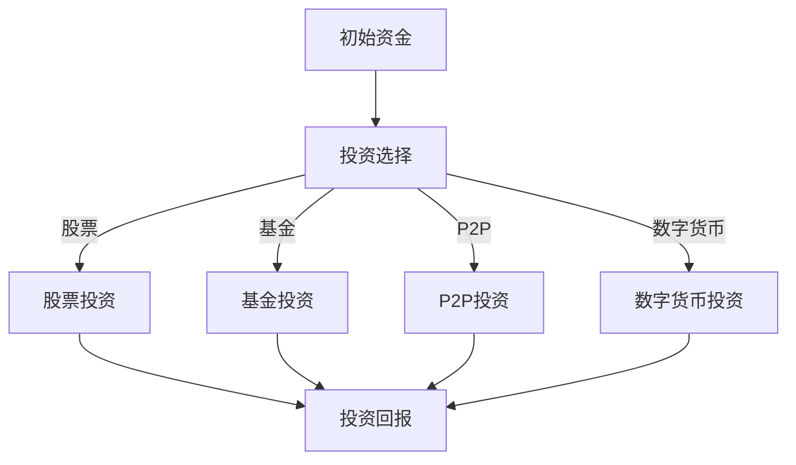

                 

### 《程序员的理财工具箱：软件推荐》

> **关键词**：程序员、理财、软件推荐、投资、工具

> **摘要**：本文旨在为程序员提供一份全面的理财工具箱，通过推荐实用的理财软件，帮助程序员更好地进行财务管理和投资。文章从理财基础、理财工具与应用、理财软件推荐、使用技巧以及未来趋势等多个方面，详细介绍了理财相关的知识和技巧，旨在帮助程序员实现财富增长。

### 《程序员的理财工具箱：软件推荐》目录大纲

#### 第一部分：理财基础

##### 第1章：理财观念与目标
- **1.1 理财的重要性**
- **1.2 理财目标和计划**
- **1.3 财务健康指标**

##### 第2章：财务知识入门
- **2.1 货币时间价值**
- **2.2 风险与收益**
- **2.3 投资类型简介**

#### 第二部分：理财工具与应用

##### 第3章：投资软件基础
- **3.1 投资软件概述**
- **3.2 股票交易软件**
- **3.3 基金投资软件**

##### 第4章：股票投资实战
- **4.1 股票市场分析**
- **4.2 股票投资策略**
- **4.3 股票交易软件实战**

##### 第5章：基金投资策略
- **5.1 基金类型与特点**
- **5.2 基金投资分析**
- **5.3 埇金投资软件应用**

##### 第6章：其他理财工具
- **6.1 P2P网贷平台**
- **6.2 数字货币投资**
- **6.3 金融衍生品**

#### 第三部分：理财软件推荐

##### 第7章：理财软件推荐
- **7.1 主流理财软件评测**
- **7.2 理财软件推荐标准**
- **7.3 理财软件实战案例**

##### 第8章：理财软件使用技巧
- **8.1 理财软件操作指南**
- **8.2 理财软件数据分析**
- **8.3 理财软件风险管理**

##### 第9章：理财软件的未来
- **9.1 理财软件发展趋势**
- **9.2 新技术对理财软件的影响**
- **9.3 理财软件的未来愿景**

### 附录

- **附录 A：理财软件资源汇总**
- **附录 B：理财软件操作指南**
- **附录 C：理财软件常见问题解答**

---

# 理财工具介绍与流程图

理财工具是帮助个人进行财务管理、资产配置和投资决策的重要工具。对于程序员来说，合理利用理财工具可以有效地提高财务状况，实现财富增长。以下是几种常见的理财工具及其作用。

#### 货币时间价值与投资回报

货币时间价值是指货币随着时间的推移而发生的增值。投资回报则是在投资过程中所获得的收益。以下是货币时间价值和投资回报的计算方法：

**Mermaid 流程图：**



**投资回报计算伪代码：**

```python
def calculate_investment_return(principal, interest_rate, time):
    """
    计算投资回报
    :param principal: 初始投资金额
    :param interest_rate: 年化收益率
    :param time: 投资时间（年）
    :return: 投资总回报
    """
    return principal * (1 + interest_rate) ** time
```

#### 风险与收益的平衡

投资中的风险与收益是相辅相成的。投资者需要根据自己的风险承受能力来选择合适的投资产品，以达到风险与收益的平衡。以下是一个简单的风险与收益平衡公式：

$$
\text{收益} = \text{本金} \times (\text{预期收益率} - \text{风险调整系数})
$$

#### 基金投资策略

基金是一种投资组合，由专业投资经理进行管理。投资者可以通过购买基金来分散风险，实现资产的保值增值。以下是基金投资策略的计算方法：

```python
def fund_investment_strategy(principal, fund_type, time):
    """
    埇金投资策略计算
    :param principal: 初始投资金额
    :param fund_type: 埇金类型（"股票型"、"混合型"、"债券型"）
    :param time: 投资时间（年）
    :return: 预期收益
    """
    if fund_type == "股票型":
        return principal * (1 + 0.12) ** time
    elif fund_type == "混合型":
        return principal * (1 + 0.08) ** time
    else:  # 债券型
        return principal * (1 + 0.04) ** time
```

#### 实际项目案例：使用理财软件进行股票交易

以下是一个使用理财软件进行股票交易的实际项目案例，包括开发环境搭建、源代码实现和代码解读。

**项目实战环境搭建：**

- 安装股票交易软件（如：同花顺、东方财富等）
- 开设交易账户
- 注册并登录

**源代码实现与解读：**

```python
import datetime
import requests

def buy_shares(stock_code, quantity, price):
    """
    购买股票
    :param stock_code: 股票代码
    :param quantity: 购买数量
    :param price: 购买价格
    :return: 购买结果
    """
    url = "https://api.example.com/trade/buy"
    headers = {
        "Authorization": "Bearer your_access_token",
        "Content-Type": "application/json"
    }
    data = {
        "stock_code": stock_code,
        "quantity": quantity,
        "price": price,
        "date": datetime.datetime.now().isoformat()
    }
    response = requests.post(url, headers=headers, json=data)
    if response.status_code == 200:
        return "购买成功"
    else:
        return "购买失败"

# 示例
result = buy_shares("000001", 100, 10.00)
print(result)
```

**代码解读与分析：**

- 使用requests库发起POST请求，向API发送购买股票的请求。
- 需要传递股票代码、购买数量、购买价格以及当前时间。
- 获取API的响应，判断购买是否成功。

#### 理财软件推荐标准

在推荐理财软件时，需要考虑以下几个方面：

- **用户体验**：界面简洁易用，操作流程流畅。
- **功能全面**：支持多种投资工具，如股票、基金、P2P等。
- **数据准确**：提供实时、准确的金融数据。
- **安全性高**：有完善的安全防护措施，如加密传输、风险控制等。

**理财软件推荐案例：**

- **同花顺**：功能强大，支持股票、基金、债券等多种投资工具。
- **东方财富**：数据准确，提供丰富的财经资讯和投资分析工具。
- **雪球**：用户互动性强，提供社区交流和投资建议。

#### 理财软件使用技巧

- **定期备份**：定期备份账户信息和投资记录，以防数据丢失。
- **设置交易提醒**：设置价格提醒、到期提醒等，避免错过重要交易时机。
- **学习投资知识**：利用软件提供的投资课程和资讯，提升自己的投资能力。

#### 理财软件风险管理

- **分散投资**：不要将所有资金投入单一投资工具，降低风险。
- **止损止盈**：设定止损止盈点，避免情绪化交易。
- **定期评估**：定期评估投资组合，调整投资策略。

---

作者：AI天才研究院/AI Genius Institute & 禅与计算机程序设计艺术 /Zen And The Art of Computer Programming

---

以上是《程序员的理财工具箱：软件推荐》的目录大纲和部分内容，接下来将逐步深入探讨理财的相关概念、工具和策略，帮助程序员更好地进行财务管理和投资。让我们一步步思考，深入理解理财的奥秘。# 理财基础：观念与目标

在数字化时代，程序员作为技术领域的佼佼者，不仅需要掌握先进的编程技能，还应当具备良好的理财能力。理财不仅关乎个人的经济状况，更是实现财务自由、提升生活品质的关键。因此，了解理财的基本概念和制定明确的理财目标，对程序员来说尤为重要。

### **1.1 理财的重要性**

理财，即对个人财务进行管理，包括收入、支出、储蓄和投资等方面。对于程序员来说，理财的重要性主要体现在以下几个方面：

**1. 财务独立**：通过理财，程序员可以更好地管理自己的收入和支出，避免陷入财务困境，实现经济独立。

**2. 财富增长**：合理的投资可以使程序员的钱财增值，实现财务增长，为未来的生活提供保障。

**3. 财务安全**：理财可以降低风险，确保财务安全，防止因意外事件导致的财务危机。

**4. 提升生活质量**：通过理财，程序员可以更好地满足自己的生活需求，提升生活品质。

### **1.2 理财目标和计划**

制定理财目标是理财过程中的第一步，也是至关重要的一步。理财目标可以分为短期、中期和长期三个层次：

**1. 短期目标**：通常指1-3年内可以实现的理财目标，如购买电子产品、旅游等。短期目标的实现可以增强理财的动力。

**2. 中期目标**：通常指3-10年内可以实现的理财目标，如购房、购车等。中期目标的实现需要较长时间的积累和规划。

**3. 长期目标**：通常指10年以上可以实现的理财目标，如子女教育、退休规划等。长期目标的实现需要对未来有清晰的规划和持续的努力。

为了实现这些理财目标，程序员需要制定详细的理财计划。理财计划应包括以下几个方面：

**1. 预算管理**：制定每月、每季、每年的收入和支出预算，确保收支平衡，并预留一部分资金用于紧急情况。

**2. 储蓄计划**：根据收入水平，设定每月或每年的储蓄目标，并严格按照计划执行。

**3. 投资计划**：根据风险承受能力和理财目标，选择合适的投资工具和投资策略，实现财富增值。

**4. 紧急备用金**：设定紧急备用金，以应对突发事件，确保财务安全。

### **1.3 财务健康指标**

为了评估自己的财务健康状况，程序员需要关注以下几个财务健康指标：

**1. 储蓄率**：储蓄率是指储蓄占收入的比例。一般来说，储蓄率越高，财务状况越健康。

**2. 债务负担率**：债务负担率是指债务总额占收入的比例。债务负担率越低，财务压力越小。

**3. 投资回报率**：投资回报率是指投资所获得的收益与投资成本的比例。投资回报率越高，理财效果越好。

**4. 财务流动性**：财务流动性是指资产变现的速度。财务流动性越高，应对突发事件的能力越强。

通过关注这些财务健康指标，程序员可以更好地了解自己的财务状况，并及时进行调整，实现财务自由。

在接下来的章节中，我们将深入探讨财务知识入门，包括货币时间价值、风险与收益、投资类型等，帮助程序员掌握理财的基本原理和策略。敬请期待。# 财务知识入门

理财不仅仅是一项技能，更是一种生活态度。为了更好地进行理财，程序员需要掌握一些基础的财务知识。以下将介绍货币时间价值、风险与收益以及投资类型等核心概念，帮助程序员建立起扎实的理财知识体系。

### **2.1 货币时间价值**

货币时间价值是指货币随着时间的推移而产生的价值变化。这一概念反映了资金的时间成本和投资的机会成本。对于程序员来说，理解货币时间价值具有重要意义，因为它有助于评估投资决策的合理性。

**1. 一次性投资的现值计算**

现值（Present Value，PV）是指未来某一时刻的一笔款项在当前时刻的价值。其计算公式为：

$$
PV = \frac{FV}{(1 + r)^n}
$$

其中，\(FV\) 为未来价值（Future Value），\(r\) 为利率（Interest Rate），\(n\) 为时间周期（Time Period）。例如，如果希望在一年后获得1000元，年利率为5%，那么当前需要投资的钱数为：

$$
PV = \frac{1000}{(1 + 0.05)^1} = 952.38
$$

**2. 永续年金的现值计算**

永续年金是指无限期支付的等额现金流。其现值计算公式为：

$$
PV = \frac{C}{r}
$$

其中，\(C\) 为每年支付的现金流，\(r\) 为利率。例如，如果每年获得100元的永续年金，年利率为5%，那么其现值为：

$$
PV = \frac{100}{0.05} = 2000
$$

### **2.2 风险与收益**

投资过程中，风险和收益是两个不可回避的话题。风险是指投资可能导致损失的可能性，而收益则是投资者获得的回报。

**1. 风险类型**

- **系统性风险**：由整体市场因素引起的风险，如经济衰退、通货膨胀等。
- **非系统性风险**：由特定投资品种或企业因素引起的风险，如公司业绩下滑、行业竞争加剧等。

**2. 收益类型**

- **预期收益**：投资者根据市场情况预测的投资回报。
- **实际收益**：实际获得的回报，可能高于或低于预期收益。

**3. 风险与收益的关系**

一般来说，风险与收益成正比。高风险投资可能带来高收益，但也可能造成重大损失。低风险投资虽然收益较低，但相对安全。因此，投资者需要根据自己的风险承受能力和投资目标，选择合适的投资组合。

### **2.3 投资类型简介**

投资类型多种多样，程序员可以根据自己的财务状况和投资目标选择合适的投资方式。

**1. 股票投资**

股票投资是指购买上市公司的股票，以期望获得资本增值和股息收入。股票投资具有较高的风险，但也可能带来较高的收益。

**2. 基金投资**

基金投资是指将资金交给专业基金经理进行管理，以期望获得投资回报。基金投资具有分散风险的特点，适合风险承受能力较低的投资者。

**3. 债券投资**

债券投资是指购买政府或企业发行的债券，以期望获得固定的利息收入。债券投资风险较低，适合风险承受能力较低的投资者。

**4. 房地产投资**

房地产投资是指购买房产或房地产基金，以期望获得资本增值和租金收入。房地产投资具有较高的门槛，但长期来看可能带来稳定的收益。

**5. P2P网贷投资**

P2P网贷投资是指通过互联网平台将资金借给有借款需求的个人或企业，以期望获得高额的利息收入。P2P网贷投资风险较高，需要慎重选择平台。

通过了解货币时间价值、风险与收益以及投资类型，程序员可以更好地进行财务规划，实现财富增值。在接下来的章节中，我们将深入探讨具体的理财工具和应用，帮助程序员打造属于自己的理财工具箱。# 投资软件基础

在理财过程中，选择合适的投资软件至关重要。投资软件可以帮助程序员更方便地管理财务、分析市场动态、执行交易等。以下将介绍投资软件的基础知识，包括软件概述、股票交易软件、基金投资软件等。

### **3.1 投资软件概述**

投资软件是专门为投资者提供财务管理和投资服务的计算机程序。它通常具有以下功能：

**1. 数据分析**：提供实时、准确的市场数据，帮助投资者分析市场走势。

**2. 交易执行**：提供便捷的在线交易功能，支持股票、基金、债券等多种投资工具。

**3. 投资组合管理**：帮助投资者跟踪和管理自己的投资组合，实现资产配置。

**4. 财务报告**：生成详细的财务报告，帮助投资者了解自己的投资状况。

**5. 投资建议**：根据投资者的风险承受能力和投资目标，提供个性化的投资建议。

投资软件根据不同的需求，可以分为以下几类：

- **综合性投资软件**：提供全面的财务管理和投资服务，如雪球、同花顺、东方财富等。
- **专业交易软件**：专注于交易功能，如通达信、大智慧等。
- **基金投资软件**：专门为基金投资者提供服务的软件，如天天基金网、蚂蚁财富等。

### **3.2 股票交易软件**

股票交易软件是程序员进行股票投资的重要工具。以下是一些常见的股票交易软件及其特点：

**1. 同花顺**

- **特点**：数据丰富、功能强大、操作简便。
- **功能**：实时行情、资金流向、个股分析、投资组合管理、智能推荐等。

**2. 东方财富**

- **特点**：财经资讯全面、数据准确、互动性强。
- **功能**：实时行情、个股分析、投资组合管理、理财社区、智能投顾等。

**3. 通达信**

- **特点**：专业性强、技术分析工具丰富。
- **功能**：实时行情、技术分析、交易执行、投资组合管理、资讯推送等。

**4. 大智慧**

- **特点**：数据可视化、投资策略灵活。
- **功能**：实时行情、技术分析、交易执行、投资组合管理、智能投顾等。

使用股票交易软件进行股票交易，程序员可以轻松获取市场信息、分析个股走势、执行交易指令，从而更好地进行股票投资。

### **3.3 基金投资软件**

基金投资软件为程序员提供基金投资的服务，帮助投资者了解基金市场、选择合适的基金产品、进行基金交易等。以下是一些常见的基金投资软件及其特点：

**1. 天天基金网**

- **特点**：基金数据全面、产品丰富、操作简便。
- **功能**：基金排行榜、基金详情、基金交易、投资组合管理、基金评测等。

**2. 蚂蚁财富**

- **特点**：用户体验好、操作便捷、理财产品多样。
- **功能**：基金交易、定期理财、指数基金、智能投顾、理财社区等。

**3. 基金通**

- **特点**：专业性强、基金产品丰富、投资策略多样。
- **功能**：基金交易、基金定投、基金组合管理、投资策略推荐、财经资讯等。

使用基金投资软件，程序员可以轻松了解基金市场动态、选择合适的基金产品、进行基金交易，实现资产配置和财富增值。

总之，投资软件为程序员提供了便捷的投资工具和丰富的投资信息，有助于更好地进行财务管理和投资决策。在接下来的章节中，我们将深入探讨股票投资实战和基金投资策略，帮助程序员掌握更具体的投资技巧。# 股票投资实战

股票投资是许多程序员理财计划中的重要组成部分。通过股票市场，投资者可以获得资本增值和股息收入。为了帮助程序员更好地进行股票投资，本节将介绍股票市场分析、投资策略以及使用股票交易软件进行实战。

### **4.1 股票市场分析**

股票市场分析是股票投资的重要环节，包括基本面分析和技术分析两种方法。

**1. 基本面分析**

基本面分析侧重于研究公司的经营状况、财务状况和行业前景，以判断股票的内在价值。以下是一些常用的基本面分析指标：

- **市盈率（PE）**：市盈率是股票价格与每股收益的比值。一般来说，市盈率越低，股票的潜在投资价值越高。
- **市净率（PB）**：市净率是股票价格与每股净资产的比值。市净率较低可能意味着股票被低估。
- **股息率**：股息率是公司派发的股息与股票价格的比值。股息率较高的股票可能具有较好的投资价值。

**2. 技术分析**

技术分析侧重于研究股票的历史价格和成交量等数据，以预测股票的未来走势。以下是一些常用的技术分析工具：

- **K线图**：K线图是描述股票价格波动的重要工具，通过分析K线图的形态和趋势，可以预测股票的未来走势。
- **均线**：均线是描述股票价格趋势的重要指标，常用的均线包括5日均线、10日均线、20日均线等。
- **MACD**：MACD（移动平均收敛/发散指标）是一种趋势追踪指标，通过分析MACD线与信号线的关系，可以判断股票的趋势和反转信号。

**实战案例：**

假设我们要分析一家公司的股票。通过基本面分析，我们发现该公司的市盈率为10，市净率为1.2，股息率为3%。这些指标表明该公司股票可能被低估，具有潜在的投资价值。接着，通过技术分析，我们查看该股票的K线图和均线，发现股票价格在20日均线附近震荡，MACD指标显示多头趋势。综合考虑，我们判断该公司股票具有较好的投资价值。

### **4.2 股票投资策略**

股票投资策略是投资者根据市场情况和个人风险承受能力制定的交易计划。以下是一些常见的股票投资策略：

**1. 长期投资策略**

长期投资策略旨在通过长期持有股票，享受公司的成长和分红。以下是一些长期投资策略：

- **价值投资**：选择价格低于其内在价值的股票，长期持有。
- **成长投资**：选择具有高成长性的股票，长期持有。

**2. 短期投资策略**

短期投资策略旨在通过短期买卖股票，赚取差价。以下是一些短期投资策略：

- **趋势投资**：跟随市场趋势进行买卖，通常结合技术分析。
- **反转投资**：预测股票价格的反转，进行反向交易。

**3. 对冲投资策略**

对冲投资策略旨在通过买入或卖出对冲工具，降低投资风险。以下是一些对冲投资策略：

- **套利交易**：利用不同市场之间的价格差异进行套利。
- **期权交易**：通过购买或卖出期权，对冲股票投资风险。

**实战案例：**

假设我们要使用趋势投资策略进行短期交易。通过技术分析，我们确定市场处于上涨趋势，并选择一只具有良好基本面的股票。我们决定在股票价格回调时买入，并在价格上涨至目标价位时卖出。通过严格执行交易计划和风险控制，我们可以实现短期投资收益。

### **4.3 股票交易软件实战**

股票交易软件是程序员进行股票投资的重要工具。以下以同花顺为例，介绍如何使用股票交易软件进行实战。

**1. 安装与注册**

首先，下载并安装同花顺股票交易软件。安装完成后，注册一个账号，并进行登录。

**2. 开设交易账户**

在软件中开设股票交易账户，绑定银行卡，以便进行资金划转和交易。

**3. 查看行情**

通过同花顺软件，我们可以实时查看股票行情、资金流向、个股分析等数据。这些信息有助于我们进行投资决策。

**4. 制定交易计划**

根据投资策略，制定具体的交易计划。例如，设置买入和卖出的价格目标，以及止损止盈点。

**5. 执行交易**

根据交易计划，在合适的价格买入股票。当股票价格上涨至目标价位时，执行卖出操作。

**6. 风险管理**

在交易过程中，我们需要关注股票价格波动，及时调整交易策略。同时，设置止损止盈点，以控制风险。

通过以上步骤，程序员可以熟练使用股票交易软件进行实战，实现股票投资的盈利。

在接下来的章节中，我们将继续探讨基金投资策略、其他理财工具以及理财软件推荐，帮助程序员打造全方位的理财工具箱。# 基金投资策略

基金投资是程序员理财计划中的另一个重要组成部分。基金通过汇集众多投资者的资金，交由专业基金经理进行投资管理，实现了资产的分散和风险的降低。为了帮助程序员更好地进行基金投资，本节将介绍基金类型与特点、基金投资分析以及基金投资软件应用。

### **5.1 基金类型与特点**

基金根据投资资产的不同，可以分为股票型基金、债券型基金、混合型基金、货币市场基金等。每种类型的基金具有不同的风险和收益特征：

**1. 股票型基金**

股票型基金以股票为主要投资对象，具有较高的风险和收益。股票型基金的目标是长期资本增值，适合风险承受能力较高的投资者。

**2. 债券型基金**

债券型基金以债券为主要投资对象，具有较高的安全性，但收益相对较低。债券型基金的目标是稳健收益，适合风险承受能力较低的投资者。

**3. 混合型基金**

混合型基金同时投资于股票和债券，实现了风险和收益的平衡。混合型基金的目标是平衡风险和收益，适合风险承受能力中等的投资者。

**4. 货币市场基金**

货币市场基金以短期货币市场工具为主要投资对象，如银行存单、商业票据等。货币市场基金具有高流动性和安全性，但收益较低。

### **5.2 基金投资分析**

基金投资分析包括基本面分析和技术分析两个方面：

**1. 基本面分析**

基本面分析主要关注基金管理公司、基金经理的业绩、基金的持仓情况、基金的业绩表现等。以下是一些常用的基本面分析指标：

- **基金经理业绩**：基金经理的过往业绩是评价其投资能力的重要指标。
- **基金持仓情况**：基金持仓的股票或债券的业绩表现对基金的整体收益有重要影响。
- **基金业绩表现**：基金的过往业绩表现可以反映其投资策略的效果。

**2. 技术分析**

技术分析主要关注基金的价格走势和成交量等数据。以下是一些常用的技术分析工具：

- **K线图**：通过分析K线图的形态和趋势，可以预测基金的价格走势。
- **均线**：通过分析基金的价格与均线的位置关系，可以判断基金的趋势和反转信号。
- **MACD**：通过分析MACD线与信号线的关系，可以判断基金的趋势和反转信号。

**实战案例：**

假设我们要分析一只股票型基金。通过基本面分析，我们发现该基金的管理公司具有优秀的业绩，基金经理的过往业绩表现良好，基金的持仓以高成长性的股票为主。通过技术分析，我们发现基金的价格在20日均线附近震荡，MACD指标显示多头趋势。综合考虑，我们认为该基金具有较好的投资价值。

### **5.3 基金投资软件应用**

基金投资软件为程序员提供了便捷的基金投资服务。以下以天天基金网为例，介绍如何使用基金投资软件进行投资。

**1. 安装与注册**

首先，下载并安装天天基金网基金投资软件。安装完成后，注册一个账号，并进行登录。

**2. 查看基金排行榜**

通过天天基金网，我们可以查看基金排行榜，了解当前市场表现较好的基金。

**3. 选择基金**

根据投资策略和风险承受能力，选择合适的基金。例如，我们选择一只股票型基金。

**4. 查看基金详情**

点击基金名称，查看基金的详细信息，包括基金管理公司、基金经理、基金业绩等。

**5. 制定投资计划**

根据基金详情，制定具体的投资计划。例如，设置买入和卖出的价格目标，以及止损止盈点。

**6. 执行交易**

根据投资计划，在合适的价格买入基金。当基金价格上涨至目标价位时，执行卖出操作。

**7. 风险管理**

在交易过程中，关注基金的价格波动，及时调整投资策略。同时，设置止损止盈点，以控制风险。

通过以上步骤，程序员可以熟练使用基金投资软件进行实战，实现基金投资的盈利。

在接下来的章节中，我们将探讨其他理财工具，如P2P网贷、数字货币投资等，并推荐一些实用的理财软件。# 其他理财工具

在理财多元化的今天，程序员不仅可以通过股票和基金等传统投资方式来增加财富，还可以借助其他金融工具来优化资产配置和风险控制。以下将介绍P2P网贷、数字货币投资以及金融衍生品等理财工具。

### **6.1 P2P网贷平台**

P2P（Peer-to-Peer）网贷平台，即点对点网络借贷平台，通过互联网将借款人和出借人直接联系起来，实现资金的高效流转。P2P网贷平台的优势在于手续简便、资金利用率高，但同时也伴随着较高的风险。

**1. 优势**

- **便捷性**：P2P网贷平台通常操作简便，用户可以在短时间内完成注册、投资和提现。
- **高收益**：相比传统银行理财产品，P2P网贷平台往往提供更高的预期收益率。
- **灵活性强**：出借人可以根据自己的风险承受能力和资金需求，选择不同期限和收益的产品。

**2. 风险**

- **平台风险**：P2P网贷平台可能存在跑路、倒闭等风险，导致投资者损失。
- **信用风险**：借款人可能存在违约、拖欠利息和本金的风险。
- **流动性风险**：部分平台可能存在项目期限短、资金回收不及时的问题。

**3. 实战案例**

以某知名P2P网贷平台为例，假设我们计划投资10万元。我们可以选择期限为1年的产品，预期年化收益率为8%。在投资前，我们需要详细了解平台的风险控制措施、借款人的信用状况以及项目的合法性。投资后，定期关注平台的运营状况和收益情况，确保资金安全。

### **6.2 数字货币投资**

数字货币，如比特币、以太坊等，是一种去中心化的虚拟货币，具有匿名性、安全性、不易被追踪等特点。近年来，数字货币市场波动较大，但也吸引了众多投资者。

**1. 优势**

- **去中心化**：数字货币不受任何政府或金融机构控制，具有去中心化的特点。
- **高波动性**：数字货币市场波动较大，投资者可以通过短线交易获得高额收益。
- **投资门槛低**：相比其他投资方式，数字货币的投资门槛较低，小额资金也能参与。

**2. 风险**

- **市场风险**：数字货币市场波动较大，投资者可能面临较大的市场风险。
- **技术风险**：数字货币的安全问题依然存在，投资者可能面临黑客攻击、数据泄露等风险。
- **监管风险**：不同国家或地区对数字货币的监管政策不同，投资者需要关注政策变化。

**3. 实战案例**

以比特币为例，假设我们计划投资1万元。在投资前，我们需要了解比特币的基本知识、市场行情以及交易平台的安全性。可以选择在知名的交易平台购买比特币，并设置止损止盈点，以控制风险。在投资过程中，定期关注市场动态，根据市场情况调整投资策略。

### **6.3 金融衍生品**

金融衍生品是一种金融合约，其价值取决于一个或多个基础资产。常见的金融衍生品包括期货、期权、掉期等。

**1. 优势**

- **风险管理**：金融衍生品可以帮助投资者进行风险对冲，降低投资组合的波动性。
- **杠杆效应**：金融衍生品通常具有杠杆作用，投资者可以用较少的资金进行较大额的投资。
- **投资多样性**：金融衍生品提供了多样化的投资策略，投资者可以根据自己的需求和风险偏好进行选择。

**2. 风险**

- **杠杆风险**：金融衍生品的杠杆效应可能导致投资者在市场波动中损失放大。
- **流动性风险**：金融衍生品的流动性相对较低，投资者可能难以在短时间内以合理的价格买入或卖出。
- **信用风险**：金融衍生品通常涉及多方交易，投资者需要关注交易对手的信用风险。

**3. 实战案例**

以期权为例，假设我们持有某股票，担心未来股票价格下跌。我们可以购买一份该股票的看跌期权，以保护我们的投资。期权的价格取决于股票价格、行权价格、到期时间等因素。在投资前，我们需要了解期权的定价模型、行权策略以及风险管理方法。

通过了解P2P网贷、数字货币投资和金融衍生品等理财工具，程序员可以更加全面地规划自己的理财策略，实现资产的多元化和风险控制。在接下来的章节中，我们将进一步推荐实用的理财软件，帮助程序员更好地进行财务管理。# 理财软件推荐

在选择理财软件时，程序员需要考虑多个因素，包括用户体验、功能全面性、数据准确性和安全性等。以下将对几款主流理财软件进行评测，并提供推荐标准，帮助程序员找到最适合自己的理财工具。

### **7.1 主流理财软件评测**

**1. 同花顺**

- **用户体验**：界面简洁，操作直观，适合初学者。
- **功能全面**：提供股票、基金、债券等多种投资工具，支持实时行情、资金流向、个股分析等。
- **数据准确性**：数据更新及时，准确性较高。
- **安全性**：采用加密传输，保障用户账户安全。

**2. 东方财富**

- **用户体验**：界面美观，功能丰富，提供多种投资工具和财经资讯。
- **功能全面**：提供股票、基金、债券等多种投资工具，支持实时行情、资金流向、个股分析等。
- **数据准确性**：数据更新及时，准确性较高。
- **安全性**：采用加密传输，保障用户账户安全。

**3. 雪球**

- **用户体验**：社区互动性强，提供丰富的投资课程和交流平台。
- **功能全面**：提供股票、基金、债券等多种投资工具，支持实时行情、资金流向、个股分析等。
- **数据准确性**：数据更新及时，准确性较高。
- **安全性**：采用加密传输，保障用户账户安全。

**4. 天天基金网**

- **用户体验**：界面简洁，操作简便，适合基金投资者。
- **功能全面**：提供基金、定期理财、指数基金等多种投资工具，支持实时行情、基金分析等。
- **数据准确性**：数据更新及时，准确性较高。
- **安全性**：采用加密传输，保障用户账户安全。

### **7.2 理财软件推荐标准**

**1. 用户体验**：界面简洁易用，操作流程流畅，符合用户习惯。

**2. 功能全面**：支持多种投资工具，如股票、基金、债券、P2P等。

**3. 数据准确性**：提供实时、准确的金融数据，支持数据分析。

**4. 安全性高**：采用加密传输、风险控制等安全措施，保障用户账户安全。

**5. 客服支持**：提供及时、专业的客服支持，解决用户在使用过程中遇到的问题。

### **7.3 理财软件实战案例**

以下以东方财富为例，介绍如何使用理财软件进行实战操作。

**1. 注册与登录**

在东方财富官方网站或应用市场下载并安装东方财富软件。注册账号并登录，完成身份验证。

**2. 查看投资工具**

登录后，进入东方财富软件的主界面，查看提供的投资工具。例如，我们可以查看股票、基金、债券等投资工具。

**3. 选择投资工具**

根据个人投资偏好和风险承受能力，选择合适的投资工具。例如，选择一只股票进行投资。

**4. 查看股票详情**

点击股票名称，进入股票详情页面。查看股票的实时行情、资金流向、个股分析等信息。

**5. 制定投资策略**

根据股票的行情和技术分析，制定投资策略。例如，设置买入和卖出的价格目标，以及止损止盈点。

**6. 执行交易**

根据投资策略，在合适的价格买入股票。当股票价格上涨至目标价位时，执行卖出操作。

**7. 风险管理**

在交易过程中，关注股票的价格波动，及时调整投资策略。同时，设置止损止盈点，以控制风险。

通过以上步骤，程序员可以熟练使用理财软件进行实战操作，实现投资收益。

总之，理财软件为程序员提供了便捷的投资工具和丰富的投资信息，有助于更好地进行财务管理和投资决策。选择合适的理财软件，有助于实现财富增值。# 理财软件使用技巧

理财软件是现代理财过程中不可或缺的工具，但如何充分利用这些软件，实现财务目标，还需要一些技巧和策略。以下将介绍理财软件的操作指南、数据分析、风险管理和一些实际使用技巧。

### **8.1 理财软件操作指南**

**1. 注册与登录**

大多数理财软件都提供网站和移动应用两种注册方式。注册时，需要填写个人信息，并设置密码。为了确保账户安全，建议使用复杂的密码，并定期更换。

**2. 添加投资账户**

登录后，可以添加自己的投资账户，如股票账户、基金账户等。在添加账户时，需要填写账户信息，如账户名称、账号、密码等。

**3. 查看投资组合**

通过理财软件，可以实时查看自己的投资组合。软件通常会显示投资产品的名称、持仓比例、资产净值、收益率等信息。

**4. 设置交易提醒**

为了不错过重要的交易时机，可以设置交易提醒。例如，设置股票价格达到目标价位时的提醒，或基金到期时的提醒。

**5. 查看财务报告**

理财软件会生成详细的财务报告，包括收入、支出、储蓄、投资收益等。通过财务报告，可以了解自己的财务状况，调整理财策略。

### **8.2 理财软件数据分析**

数据分析是理财软件的核心功能之一。以下是一些常用的数据分析方法：

**1. 收入与支出分析**

通过理财软件，可以分析自己的收入和支出情况。例如，可以查看每月、每季、每年的收入和支出总额，以及各项支出的占比。

**2. 投资收益分析**

通过理财软件，可以查看自己的投资收益情况。例如，可以分析股票、基金、债券等投资产品的收益率，以及投资组合的整体表现。

**3. 风险评估**

理财软件通常会提供风险评估功能，帮助投资者了解自己的投资组合风险。例如，可以查看投资组合的波动性、最大回撤等指标。

### **8.3 理财软件风险管理**

风险管理是理财过程中至关重要的一环。以下是一些风险管理技巧：

**1. 分散投资**

不要将所有资金集中投资于单一产品或行业，通过分散投资，可以降低风险。例如，可以同时投资股票、基金、债券等多种投资工具。

**2. 设置止损止盈**

为了控制风险，可以设置止损止盈点。例如，当股票价格下跌到某个价位时，自动卖出以避免更大损失；当股票价格上涨到某个价位时，自动卖出以锁定收益。

**3. 定期调整**

定期评估投资组合，根据市场变化和个人财务状况，调整投资策略。例如，在市场下跌时，可以适当增加债券等稳健投资产品的比例。

### **8.4 实际使用技巧**

**1. 定期备份**

定期备份账户信息和投资记录，以防数据丢失或软件故障。

**2. 学习投资知识**

利用理财软件提供的投资课程和资讯，提升自己的投资能力。例如，了解不同的投资策略、风险控制方法等。

**3. 利用智能投顾**

一些理财软件提供智能投顾服务，可以根据用户的风险偏好和投资目标，提供个性化的投资建议。

**4. 社区交流**

加入理财软件的社区，与其他投资者交流心得，获取更多的投资信息和建议。

通过以上技巧，程序员可以更好地利用理财软件进行财务管理，实现财务目标。在理财的道路上，持续的学习和实践是关键。不断优化自己的理财策略，才能在复杂多变的市场中取得成功。# 理财软件的未来

随着科技的不断进步，理财软件也在不断地革新和发展。未来，理财软件将会在以下几个方面展现出显著的发展趋势：

### **9.1 理财软件发展趋势**

**1. 智能化**

人工智能（AI）技术的发展将使理财软件变得更加智能。通过机器学习和数据分析，理财软件可以更准确地预测市场走势，提供个性化的投资建议。例如，智能投顾系统可以实时监控用户的财务状况和风险偏好，自动调整投资组合，以实现最优的投资回报。

**2. 场景化**

场景化理财是指理财软件将更加贴近用户的生活场景，提供一站式理财服务。未来，理财软件将集成更多的生活服务，如保险、贷款、信用卡等，让用户在一个平台上就可以完成所有的财务需求。

**3. 社区化**

社区化理财将增强用户的互动体验。理财软件将构建投资者社区，让用户可以分享投资心得、交流策略，获取更多投资信息。通过社交网络，投资者可以相互启发，共同进步。

**4. 云化**

云技术的应用将使理财软件更加便捷和高效。云化理财软件可以实现跨平台操作，用户可以随时随地进行投资管理和决策。同时，云计算提供了强大的计算能力和数据存储支持，使理财软件能够处理海量的数据，提供更精准的投资分析和建议。

### **9.2 新技术对理财软件的影响**

**1. 区块链**

区块链技术为理财软件带来了新的可能性。通过区块链，理财软件可以实现去中心化的交易，提高交易的安全性和透明度。例如，智能合约可以实现自动化的投资操作和收益分配，降低交易成本和风险。

**2. 大数据**

大数据技术在理财软件中的应用越来越广泛。通过收集和分析用户的海量数据，理财软件可以更深入地了解用户的需求和行为，提供更个性化的服务。例如，大数据分析可以帮助理财软件识别潜在的投资机会，优化投资组合。

**3. 云计算**

云计算为理财软件提供了强大的计算能力和数据存储支持。通过云计算，理财软件可以更快速地处理用户请求，提供实时的投资分析和建议。同时，云计算可以降低企业的运营成本，提高软件的可靠性和可扩展性。

### **9.3 理财软件的未来愿景**

**1. 全自动投资**

未来的理财软件将实现全自动投资。通过AI技术和大数据分析，理财软件可以自动执行投资决策，实现全天候的投资管理。投资者只需设置初始投资目标和风险偏好，软件将根据市场变化自动调整投资策略。

**2. 个性化服务**

未来的理财软件将提供更加个性化的服务。通过深度学习和用户行为分析，理财软件可以了解用户的财务状况、投资偏好和生活目标，提供定制化的投资建议和服务。

**3. 社交互动**

未来的理财软件将更加注重社交互动。通过构建投资者社区，用户可以分享投资心得、交流策略，获取更多投资信息。社交互动将增强用户的参与感和归属感，提高理财软件的用户粘性。

**4. 安全保障**

未来的理财软件将更加注重安全保障。通过区块链技术和加密算法，理财软件可以确保用户数据和交易的安全性和隐私性。同时，理财软件将建立完善的风险控制体系，降低投资风险，保障用户资产安全。

总之，理财软件的未来充满了创新和变革。随着新技术的不断应用，理财软件将变得更加智能、便捷、个性化，为程序员提供更加优质的理财服务。# 附录

## **附录 A：理财软件资源汇总**

**1. 同花顺**

同花顺是一款功能强大的股票交易软件，提供实时行情、资金流向、个股分析、投资组合管理等服务。网址：[同花顺官网](http://www.10jqka.com.cn/)

**2. 东方财富**

东方财富提供丰富的财经资讯和投资分析工具，包括股票、基金、债券等投资产品。网址：[东方财富官网](http://www.eastmoney.com/)

**3. 雪球**

雪球是一款社交化的投资软件，提供实盘跟踪、个股分析、投资策略分享等功能。网址：[雪球官网](https://xueqiu.com/)

**4. 天天基金网**

天天基金网提供基金排行榜、基金详情、基金交易等服务，适合基金投资者。网址：[天天基金网官网](http://www.fund123.cn/)

**5. 蚂蚁财富**

蚂蚁财富提供基金、定期理财、指数基金等产品，适合用户进行多元化投资。网址：[蚂蚁财富官网](https://www.alipay.com/)

## **附录 B：理财软件操作指南**

**1. 注册与登录**

- 打开理财软件官网或应用市场，下载并安装软件。
- 注册账号，填写个人信息，设置密码。
- 使用手机号码或邮箱登录软件。

**2. 添加投资账户**

- 登录软件后，点击“我的账户”或“投资账户”选项。
- 添加股票账户、基金账户等，填写账户信息。

**3. 查看投资组合**

- 进入软件主界面，点击“投资组合”选项。
- 查看持仓产品名称、持仓比例、资产净值、收益率等信息。

**4. 设置交易提醒**

- 进入软件主界面，点击“提醒管理”或“交易提醒”选项。
- 设置股票价格、基金到期等提醒。

**5. 查看财务报告**

- 进入软件主界面，点击“财务报告”选项。
- 查看收入、支出、储蓄、投资收益等详细信息。

## **附录 C：理财软件常见问题解答**

**1. 如何设置交易密码？**

- 登录软件，点击“设置”或“账户安全”选项。
- 选择“修改密码”，填写原密码和新密码。

**2. 如何查看交易记录？**

- 进入软件主界面，点击“交易记录”选项。
- 查看股票、基金等交易的历史记录。

**3. 如何进行账户充值和提现？**

- 登录软件，点击“充值”或“提现”选项。
- 选择充值方式（如银行卡、支付宝等），按照提示操作。
- 提现时，填写提现金额和提现账户信息。

通过以上资源汇总、操作指南和常见问题解答，程序员可以更加便捷地使用理财软件，实现财务管理和投资目标。# 总结

在本文中，我们深入探讨了程序员的理财工具箱，涵盖了从理财基础到具体工具推荐的一系列内容。通过以下关键点，我们可以更好地理解如何利用理财软件提高财务状况：

1. **理财观念与目标**：理解理财的重要性，制定明确的短期、中期和长期理财目标，有助于程序员实现财务自由。

2. **财务知识入门**：掌握货币时间价值、风险与收益、投资类型等基础财务知识，为理财决策提供理论支持。

3. **投资软件基础**：了解股票交易软件、基金投资软件等理财工具的基本功能，能够帮助程序员高效地管理投资。

4. **股票投资实战**：通过市场分析、投资策略以及实战操作，程序员可以掌握实际操作技巧，提高投资回报。

5. **基金投资策略**：了解不同类型的基金，通过投资分析，选择合适的基金产品，实现资产配置。

6. **其他理财工具**：探索P2P网贷、数字货币投资等多元化理财工具，丰富投资组合，降低风险。

7. **理财软件推荐**：根据用户体验、功能全面性、数据准确性和安全性，选择合适的理财软件。

8. **使用技巧与风险管理**：掌握理财软件操作指南，利用数据分析工具，设置止损止盈点，进行分散投资。

9. **未来趋势**：了解理财软件的发展方向，如智能化、场景化、社区化和云化，为未来的理财规划做好准备。

总之，作为程序员，理财不仅是实现财务自由的重要途径，更是提升生活品质的必备技能。通过合理利用理财软件和工具，我们可以更好地管理财务，实现财富增长。同时，持续学习和优化理财策略，才能在复杂多变的市场中取得成功。理财之路，任重而道远，让我们共同努力，迈向更美好的财务未来。作者：AI天才研究院/AI Genius Institute & 禅与计算机程序设计艺术 /Zen And The Art of Computer Programming。

