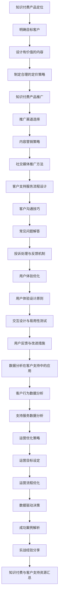

                 

### 《程序员的知识付费客户支持体系构建》

> 关键词：知识付费、客户支持、用户体验、数据分析、运营优化

> 摘要：本文将深入探讨程序员如何构建一个高效的知识付费客户支持体系。文章分为五个部分，从知识付费与客户支持基础、知识付费产品设计与推广、客户支持服务与用户体验优化、数据分析与运营优化，到案例分析与实战经验，全面解析了构建知识付费客户支持体系的各个方面。通过理论阐述、实际案例和实战经验，为程序员提供了一套实用的指导方案。

### 《程序员的知识付费客户支持体系构建》目录大纲

#### 第一部分：知识付费与客户支持基础

## 第1章：知识付费概述

### 1.1 知识付费的起源与发展

知识付费的起源可以追溯到20世纪末的互联网时代。随着互联网技术的飞速发展，信息获取变得更加便捷，同时也催生了知识付费模式的兴起。最初的知识付费形式主要是在线课程和电子书籍，随着技术的不断进步和用户需求的多样化，知识付费的形式也越来越丰富，如在线直播、问答咨询、会员订阅等。

### 1.2 知识付费的市场现状与趋势

当前，知识付费市场呈现出快速发展的态势。根据市场调查数据，全球知识付费市场规模持续增长，预计到2025年将达到数百亿美元。随着人工智能、大数据等技术的应用，知识付费的形式和内容也将更加多样化和智能化。

### 1.3 知识付费的核心要素与模式

知识付费的核心要素包括内容、用户、平台和支付。内容是知识付费的核心，决定了产品的质量和用户满意度；用户是知识付费的驱动力，他们的需求和反馈直接影响产品的发展方向；平台是连接内容和用户的桥梁，提供了交易、支付、评价等支持服务；支付是知识付费的保障，确保了创作者的收益和用户的权益。

#### 第二部分：知识付费产品设计与推广

## 第2章：客户支持体系构建

### 2.1 客户支持的重要性

客户支持是知识付费产品的重要组成部分，它直接影响用户的满意度和产品的口碑。一个优秀的客户支持体系能够帮助用户解决使用过程中遇到的问题，提高用户体验，从而增强用户粘性和忠诚度。

### 2.2 构建客户支持体系的步骤

构建客户支持体系需要以下几个步骤：确定支持目标、制定支持策略、组织支持团队、制定支持流程、选择支持工具和平台、进行支持培训和考核。

### 2.3 客户支持体系的组织结构

客户支持体系的组织结构通常包括前端支持、后端支持和跨部门协作。前端支持主要负责直接与用户互动，解决用户问题；后端支持负责技术支持和内容更新；跨部门协作则确保客户支持体系的高效运行。

#### 第三部分：客户支持服务与用户体验优化

## 第3章：知识付费产品定位

### 3.1 明确目标客户

明确目标客户是知识付费产品设计的核心。通过市场调研和用户画像分析，确定产品的目标用户群体，包括他们的年龄、职业、需求和痛点。

### 3.2 设计有价值的内容

设计有价值的内容是知识付费产品的核心竞争力。内容需要与目标客户的痛点和需求紧密相关，同时要保证内容的深度、广度和实用性。

### 3.3 制定合理的定价策略

定价策略是知识付费产品成功的关键。合理的定价策略需要考虑内容的价值、市场需求、竞争环境和用户支付能力。

#### 第四部分：数据分析与运营优化

## 第4章：知识付费产品推广

### 4.1 推广渠道选择

推广渠道的选择直接影响到知识付费产品的市场覆盖和用户获取。常见的推广渠道包括社交媒体、搜索引擎、内容平台、线下活动和合作伙伴等。

### 4.2 内容营销策略

内容营销是知识付费产品推广的重要手段。通过发布高质量的内容，如博客、视频、电子书等，吸引潜在用户，提高品牌知名度和用户粘性。

### 4.3 社交媒体推广方法

社交媒体推广是当前最受欢迎的推广方法之一。通过在社交媒体平台发布有价值的内容，与用户互动，提高用户参与度和转化率。

#### 第五部分：案例分析与实战经验

## 第5章：客户支持服务流程设计

### 5.1 客户沟通技巧

客户沟通技巧是客户支持服务的关键。通过有效的沟通，能够更好地理解用户需求，提供针对性的解决方案。

### 5.2 常见问题解答

常见问题解答是客户支持服务的重要内容。通过整理常见问题，为用户提供快速、准确的解决方案，提高用户满意度。

### 5.3 投诉处理与反馈机制

投诉处理与反馈机制是客户支持服务的保障。通过建立有效的投诉处理机制，及时解决用户投诉，收集用户反馈，不断优化产品和服务。

## 第6章：用户体验优化

### 6.1 用户体验设计原则

用户体验设计原则是优化用户体验的基础。包括简洁性、一致性、易用性、可访问性和个性化等。

### 6.2 交互设计与易用性测试

交互设计和易用性测试是用户体验优化的关键环节。通过设计直观、简洁的界面，并进行用户测试，收集用户反馈，不断优化产品界面和交互设计。

### 6.3 用户反馈与改进措施

用户反馈与改进措施是用户体验优化的重要手段。通过收集用户反馈，分析用户需求，制定针对性的改进措施，持续优化用户体验。

## 第7章：数据分析在客户支持中的应用

### 7.1 数据分析的基本概念

数据分析的基本概念包括数据收集、数据清洗、数据存储、数据分析、数据可视化等。

### 7.2 客户行为数据分析

客户行为数据分析是客户支持服务的重要工具。通过分析用户行为数据，了解用户需求和行为模式，为产品优化和客户支持提供数据支持。

### 7.3 支持服务数据分析

支持服务数据分析是评估客户支持服务效果的重要手段。通过分析支持服务数据，如客户咨询量、解决问题率、客户满意度等，评估支持服务质量，找出改进点。

## 第8章：运营优化策略

### 8.1 运营目标设定

运营目标设定是运营优化的第一步。明确运营目标，包括客户满意度、市场占有率、营收增长等，为运营提供方向和依据。

### 8.2 运营流程优化

运营流程优化是提高运营效率的关键。通过优化运营流程，减少不必要的环节和等待时间，提高运营效率。

### 8.3 数据驱动决策

数据驱动决策是现代运营管理的重要理念。通过收集和分析数据，为运营决策提供科学依据，提高决策准确性。

## 第9章：成功案例解析

### 9.1 案例一：某知名知识付费平台的客户支持体系构建

案例一将解析某知名知识付费平台如何构建其客户支持体系，包括其组织结构、支持流程、数据分析方法和运营优化策略。

### 9.2 案例二：某中小型公司的知识付费产品推广策略

案例二将解析某中小型公司如何通过内容营销、社交媒体推广和数据分析，成功推广其知识付费产品，并建立良好的客户支持体系。

## 第10章：实战经验分享

### 10.1 从业者经验分享

从业者经验分享将分享一些从业者在知识付费客户支持体系构建中的心得和经验，包括遇到的问题和解决方案。

### 10.2 知识付费产品开发与运营中的挑战与解决方法

知识付费产品开发与运营中的挑战与解决方法将探讨知识付费产品开发与运营中常见的问题和挑战，并提供相应的解决方法和策略。

### 10.3 客户支持服务的未来趋势与展望

客户支持服务的未来趋势与展望将分析客户支持服务的未来发展趋势，如人工智能、大数据、自动化等技术的应用，以及客户支持服务的发展方向。

## 附录

### 附录A：知识付费与客户支持资源汇总

附录A将汇总一些主流的知识付费平台介绍、客户支持工具推荐和数据分析工具与资源链接，为读者提供实用的参考资料。

### Mermaid 流程图



### 伪代码

```python
# 客户支持服务流程设计伪代码

def supportFlow(customerQuery):
    if customerQuery.isEmpty():
        return "请提供具体问题"
    if isCommonQuery(customerQuery):
        return getCommonAnswer(customerQuery)
    if isTechnicalQuery(customerQuery):
        return getTechnicalAnswer(customerQuery)
    if isComplaint(customerQuery):
        handleComplaint(customerQuery)
        return "投诉已受理，我们会尽快解决"
    return "无法解答，我们会反馈给相关部门"

def isCommonQuery(query):
    # 判断是否为常见问题

def getCommonAnswer(query):
    # 返回常见问题的答案

def isTechnicalQuery(query):
    # 判断是否为技术问题

def getTechnicalAnswer(query):
    # 返回技术问题的答案

def isComplaint(query):
    # 判断是否为投诉

def handleComplaint(query):
    # 处理投诉
```

### 数学公式

$$
CSAT = \frac{\sum (R \times S)}{N}
$$
其中，$R$ 表示客户给予的评分，$S$ 表示评分的等级（通常为1-5分），$N$ 表示总评分次数。

$$
CLV = \frac{C \times (1 + r)^n}{(1 + r)^n - 1}
$$
其中，$C$ 表示客户的平均收益，$r$ 表示客户留存率，$n$ 表示客户的预期生命周期年数。

### 项目实战

#### 案例一：某知识付费平台的客户支持服务实战

##### 1. 开发环境搭建

- 使用 Python 编写脚本进行自动化回复和问题分类。
- 安装必要的库，如 Pandas、Numpy、Scikit-learn。

##### 2. 源代码详细实现

```python
# 客户支持服务脚本示例
import pandas as pd
from sklearn.feature_extraction.text import TfidfVectorizer
from sklearn.naive_bayes import MultinomialNB
from sklearn.pipeline import make_pipeline

# 数据准备
data = pd.read_csv('support_data.csv')
X = data['query']
y = data['response']

# 构建模型
model = make_pipeline(TfidfVectorizer(), MultinomialNB())

# 训练模型
model.fit(X, y)

# 输入客户查询
query = "如何优化代码性能？"

# 预测答案
prediction = model.predict([query])

# 输出答案
print("答案：", prediction[0])
```

##### 3. 代码解读与分析

- 使用 TfidfVectorizer 将文本转换为数值特征向量。
- 使用 MultinomialNB 朴素贝叶斯分类器进行文本分类。
- 训练模型后，输入客户查询，预测并输出答案。

#### 案例二：某知识付费平台的用户反馈系统实战

##### 1. 开发环境搭建

- 使用 Python 编写数据处理和分析脚本。
- 安装必要的库，如 Pandas、Matplotlib、Scikit-learn。

##### 2. 源代码详细实现

```python
# 用户反馈数据分析脚本示例
import pandas as pd
import matplotlib.pyplot as plt
from sklearn.cluster import KMeans

# 数据准备
data = pd.read_csv('user_feedback.csv')
X = data[['satisfaction', 'engagement']]

# 使用 KMeans 进行聚类分析
kmeans = KMeans(n_clusters=3)
clusters = kmeans.fit_predict(X)

# 绘制聚类结果
plt.scatter(X['satisfaction'], X['engagement'], c=clusters)
plt.xlabel('满意度')
plt.ylabel('参与度')
plt.show()
```

##### 3. 代码解读与分析

- 使用 Pandas 读取用户反馈数据。
- 使用 KMeans 算法进行聚类分析，根据满意度与参与度进行用户分组。
- 绘制聚类结果，帮助理解用户群体的特征和需求。

以上是《程序员的知识付费客户支持体系构建》这本书的目录大纲，包括核心概念与联系、核心算法原理讲解、数学模型和公式、项目实战等内容的详细说明。希望这个目录大纲能够帮助你全面了解这本书的主题内容。如有任何修改或补充，请随时告诉我。

### 作者信息

作者：AI天才研究院/AI Genius Institute & 禅与计算机程序设计艺术 /Zen And The Art of Computer Programming

---

**全文总结**

本文以《程序员的知识付费客户支持体系构建》为主题，详细阐述了知识付费与客户支持的基础知识、客户支持体系的构建、知识付费产品的设计推广、客户支持服务与用户体验优化、数据分析与运营优化，以及成功案例和实战经验。通过理论阐述、实际案例和实战经验，为程序员提供了一套实用的指导方案。

在知识付费与客户支持基础部分，我们了解了知识付费的起源、市场现状与趋势，以及核心要素与模式。客户支持体系构建部分，我们学习了客户支持的重要性、构建客户支持体系的步骤和组织结构。知识付费产品设计与推广部分，我们探讨了产品定位、内容设计、定价策略和推广渠道。客户支持服务与用户体验优化部分，我们分析了客户沟通技巧、常见问题解答、投诉处理与反馈机制、用户体验设计原则、交互设计与易用性测试、用户反馈与改进措施。数据分析与运营优化部分，我们讲解了数据分析的基本概念、客户行为数据分析、支持服务数据分析、运营优化策略。最后，通过成功案例和实战经验，我们深入了解了知识付费客户支持体系的实际应用。

本文的目标是为程序员提供一个全面的、系统的知识付费客户支持体系构建方案，帮助他们更好地理解和应用相关知识，提升客户满意度和产品竞争力。希望本文能够对读者有所启发和帮助。

---

**读者反馈**

如果您对本文有任何建议、疑问或反馈，请随时在评论区留言。您的反馈将对我们持续改进文章质量提供宝贵的帮助。同时，也欢迎分享本文给更多的朋友，让更多的人受益于这份知识付费客户支持体系的构建指南。

---

**结束语**

感谢您对《程序员的知识付费客户支持体系构建》这篇文章的阅读。我们期待您的反馈和建议，也期待您能够将这些知识应用到实际工作中，为您的知识付费产品构建一个高效、专业的客户支持体系。

作者：AI天才研究院/AI Genius Institute & 禅与计算机程序设计艺术 /Zen And The Art of Computer Programming

再次感谢您的支持与关注！期待与您在更多技术领域的探讨与交流！|>

### 文章正文

#### 第一部分：知识付费与客户支持基础

在数字化时代，知识付费作为一种新型商业模式，正逐步改变着人们的消费习惯和学习方式。本文将首先探讨知识付费的起源与发展，了解其市场现状与趋势，并深入分析知识付费的核心要素与模式。在此基础上，我们将详细讨论客户支持体系的重要性，以及如何构建一个高效的客户支持体系。

##### 1.1 知识付费的起源与发展

知识付费的起源可以追溯到20世纪末的互联网时代。随着互联网技术的飞速发展，信息获取变得更加便捷，同时也催生了知识付费模式的兴起。最初的知识付费形式主要是在线课程和电子书籍，随着技术的不断进步和用户需求的多样化，知识付费的形式也越来越丰富，如在线直播、问答咨询、会员订阅等。

在互联网初期，信息是免费的，用户可以通过搜索引擎获取到大量的知识资源。然而，随着信息量的爆炸式增长，用户开始意识到时间成本的重要性，他们更愿意为高质量、有价值的内容付费。这种消费观念的转变，为知识付费模式的兴起提供了土壤。

2000年代初期，在线教育平台如Coursera、Udemy等开始兴起，它们通过互联网为用户提供高质量的在线课程，开启了知识付费的新时代。随后，知识付费模式不断丰富，逐渐涵盖了更多领域，如专业技能培训、兴趣爱好学习、知识分享等。

近年来，随着移动互联网和社交媒体的普及，知识付费市场呈现出爆发式增长。根据市场调查数据，全球知识付费市场规模持续增长，预计到2025年将达到数百亿美元。随着人工智能、大数据等技术的应用，知识付费的形式和内容也将更加多样化和智能化。

##### 1.2 知识付费的市场现状与趋势

当前，知识付费市场呈现出以下几大趋势：

1. **用户规模持续扩大**：随着知识付费观念的普及，越来越多的用户开始接受并参与到知识付费活动中。特别是在线教育、技能培训和知识分享等领域，用户规模呈现出快速增长的趋势。

2. **内容形式多样化**：知识付费的内容形式越来越丰富，不仅包括传统的在线课程和电子书籍，还涵盖了短视频、直播、问答咨询等多种形式。这种多样化的内容形式，满足了不同用户的需求，推动了知识付费市场的发展。

3. **技术驱动**：人工智能、大数据、区块链等新兴技术的应用，为知识付费市场注入了新的活力。通过技术手段，知识付费平台能够更好地分析用户需求，提供个性化推荐，提高用户满意度。

4. **市场竞争加剧**：随着知识付费市场的不断扩大，市场竞争也日益激烈。各大平台纷纷通过降低价格、提高内容质量、增加服务功能等方式，争夺市场份额。

5. **行业规范化**：随着知识付费市场的快速发展，行业规范化也成为必然趋势。政府和企业纷纷出台相关政策和标准，规范知识付费市场，保护创作者和用户的权益。

##### 1.3 知识付费的核心要素与模式

知识付费的核心要素包括内容、用户、平台和支付。这些要素相互关联，共同构成了知识付费的生态系统。

1. **内容**：内容是知识付费的核心。高质量的内容能够吸引用户付费，提高用户满意度。知识付费的内容形式多样，包括在线课程、电子书籍、短视频、直播等。内容的质量直接决定了知识付费的成功与否。

2. **用户**：用户是知识付费的驱动力。他们通过付费获取知识，推动知识付费市场的发展。用户的多样化需求，也促使知识付费平台提供更加丰富和个性化的内容。

3. **平台**：平台是连接内容和用户的桥梁。知识付费平台提供了交易、支付、评价等支持服务，为用户提供便捷的付费和获取知识的方式。平台的发展，也促进了知识付费市场的繁荣。

4. **支付**：支付是知识付费的保障。通过支付系统，用户能够方便地购买知识内容，平台能够获得收益。支付系统的安全性、便捷性和透明度，直接影响用户的使用体验和平台的信誉。

知识付费的模式主要包括以下几种：

1. **一次性付费**：用户一次性支付一定费用，获取永久访问权限。这种模式常见于电子书籍和在线课程。

2. **订阅模式**：用户支付一定费用，获得一定时间内的无限次访问权限。这种模式常见于会员制平台和在线教育平台。

3. **免费增值模式**：平台提供部分内容免费，高级内容需要付费。这种模式通过免费内容吸引大量用户，再通过付费内容获得收益。

4. **众筹模式**：用户通过众筹方式支持知识内容创作，平台提供众筹成功的创作者一定比例的收益。这种模式鼓励创作者创作高质量的内容，同时也为用户提供了参与和支持的机会。

通过了解知识付费的起源、市场现状、核心要素与模式，我们可以更好地把握知识付费的发展趋势，为构建高效的知识付费客户支持体系奠定基础。

##### 1.4 客户支持的重要性

在知识付费市场中，客户支持体系是确保用户满意度和产品成功的关键因素之一。一个高效、专业的客户支持体系不仅能够解决用户在购买和使用过程中遇到的问题，提高用户满意度，还能增强用户对品牌的信任感和忠诚度。以下是客户支持在知识付费市场中具有的重要性：

1. **提升用户满意度**：用户在购买知识付费产品后，可能会遇到各种问题，如产品使用问题、内容理解问题等。一个有效的客户支持体系能够快速响应用户的疑问和需求，提供专业的解答和帮助，从而提升用户满意度。

2. **增强用户忠诚度**：高质量的客户支持服务能够建立用户对品牌的信任，使用户感到被重视和关心。这种信任感和满意度将转化为用户的忠诚度，促使他们持续购买和使用知识付费产品，甚至推荐给他人。

3. **促进产品改进**：客户支持体系是获取用户反馈的重要渠道。通过收集和分析用户的反馈和投诉，知识付费平台可以发现产品中存在的问题和不足，从而进行改进。这种基于用户反馈的产品改进，将有助于提升产品的质量和用户满意度。

4. **提高品牌形象**：一个高效、专业的客户支持体系能够提升知识付费平台在用户心中的形象，树立良好的品牌口碑。用户在社交媒体和其他平台上分享他们的良好体验，将有助于吸引更多潜在用户，扩大品牌影响力。

5. **降低用户流失率**：在知识付费市场中，用户流失是一个常见的问题。通过提供优质的客户支持服务，知识付费平台可以降低用户的流失率。当用户在遇到问题时能够得到及时、有效的帮助，他们更有可能继续使用产品，而不是选择竞争对手。

6. **提升市场竞争力**：在激烈的市场竞争中，客户支持服务成为知识付费平台的重要竞争力之一。一个强大、专业的客户支持团队能够快速解决用户问题，提高用户满意度，从而在用户心中树立良好的品牌形象，吸引更多用户。

总之，客户支持在知识付费市场中具有重要的战略意义。通过构建高效、专业的客户支持体系，知识付费平台可以提升用户满意度、增强用户忠诚度、促进产品改进、提高品牌形象、降低用户流失率，并提升市场竞争力。

##### 1.5 构建客户支持体系的步骤

构建一个高效、专业的客户支持体系需要一系列的步骤。以下将从组织结构、支持流程、支持工具和平台选择、培训与考核等方面详细讨论如何构建一个完善的客户支持体系。

1. **确定支持目标**：

构建客户支持体系的第一步是明确支持目标。支持目标应与企业的整体战略目标相一致，包括提高客户满意度、降低客户流失率、提高客户生命周期价值等。具体来说，支持目标可以包括：

- 提供及时、专业的客户支持服务，确保用户在使用知识付费产品时能够得到有效的帮助。
- 通过有效的沟通和解决问题，提高用户的满意度和忠诚度。
- 收集并分析用户反馈，持续改进产品和客户支持流程。

2. **制定支持策略**：

制定支持策略是构建客户支持体系的关键。支持策略应明确客户支持的范围、服务标准、服务渠道和资源配置等。具体包括：

- 服务范围：明确客户支持服务涵盖的内容，如产品使用问题、技术支持、内容解释、账户问题等。
- 服务标准：设定客户支持服务的基本标准，如响应时间、解决时间、解决率等。
- 服务渠道：选择适合客户支持服务的渠道，如电话、邮件、在线聊天、社区论坛等。
- 资源配置：合理配置人力资源和物资资源，确保客户支持团队能够高效运作。

3. **组织支持团队**：

建立一支专业、高效的客户支持团队是确保客户支持服务质量的关键。支持团队的组织结构可以包括以下角色：

- 客户支持经理：负责管理整个客户支持团队，制定支持策略，监督支持流程，确保服务目标得到实现。
- 技术支持工程师：负责解决用户在产品使用过程中遇到的技术问题，提供专业的技术支持。
- 客户服务代表：负责处理用户的账户问题、订单问题、退款申请等，提供基本的客户服务。
- 产品支持专员：负责收集用户反馈，分析用户需求，协助产品团队改进产品。

4. **制定支持流程**：

客户支持流程是确保客户问题得到及时、有效解决的关键。一个完善的客户支持流程应包括以下步骤：

- 接收用户咨询：建立多个接收用户咨询的渠道，如电话、邮件、在线聊天等。
- 问题分类：根据用户咨询的问题类型，将其归类到相应的类别，以便快速定位解决方案。
- 问题解决：根据问题类型，采取相应的解决方案，如提供在线文档、视频教程、远程协助等。
- 问题反馈：记录用户问题的处理过程和结果，将反馈信息传达给相关团队，以持续改进产品和支持流程。

5. **选择支持工具和平台**：

选择合适的支持工具和平台是提高客户支持效率的重要手段。常见的客户支持工具和平台包括：

- 客户关系管理（CRM）系统：用于管理客户信息、支持请求和沟通记录，提高客户支持效率。
- 在线聊天工具：用于实时与用户沟通，提供即时支持。
- 知识库系统：用于存储常见问题解答、使用指南、技术文档等，方便用户自助解决。
- 社区论坛：用于用户之间的互动和知识分享，增强用户参与度。

6. **进行支持培训和考核**：

为了确保客户支持团队的专业素质和服务质量，定期进行培训是非常必要的。支持培训应包括以下内容：

- 产品知识：使支持团队熟悉产品的功能、特点和操作方法。
- 客户服务技巧：提高支持团队与用户沟通的能力，如倾听技巧、问题解决技巧等。
- 技术支持技能：提高支持团队解决技术问题的能力，如故障排查、问题定位等。

考核是评估客户支持团队工作绩效的重要手段。考核指标可以包括：

- 响应时间：支持团队处理用户问题的时间。
- 解决率：支持团队解决用户问题的比例。
- 用户满意度：用户对支持服务的满意度评分。
- 支持量：支持团队每月处理的用户问题数量。

通过定期培训和考核，可以不断提高客户支持团队的专业素质和服务质量，从而提升用户满意度和忠诚度。

通过以上步骤，可以构建一个高效、专业的客户支持体系，为知识付费产品提供强有力的支持，促进产品的发展和用户满意度的提升。

##### 1.6 客户支持体系的组织结构

客户支持体系的组织结构是确保客户支持服务高效运作的重要基础。一个完善的客户支持组织结构通常包括前端支持、后端支持和跨部门协作三个部分。以下将详细介绍这三个部分的职责和作用。

1. **前端支持**：

前端支持是直接与用户互动的部分，主要负责接收用户咨询、处理用户问题、提供实时帮助和解答。前端支持的职责包括：

- 接收用户咨询：通过多种渠道（如电话、邮件、在线聊天、社交媒体等）接收用户的咨询和问题。
- 响应用户需求：快速响应用户咨询，确保用户问题得到及时解决。
- 解决用户问题：通过专业知识和技术支持，为用户提供解决方案，解决他们在使用知识付费产品过程中遇到的问题。
- 提供实时帮助：通过在线聊天、远程协助等方式，为用户提供即时的技术支持，提高用户满意度。

前端支持的作用是确保用户在使用知识付费产品时能够得到及时、专业的帮助，提升用户体验。前端支持团队的成员通常包括客户服务代表、技术支持工程师和在线客服人员。

2. **后端支持**：

后端支持是负责技术支持和内容更新的部分，主要职责包括：

- 技术支持：为前端支持提供技术支持，解决前端支持无法解决的复杂问题。后端支持团队通常由高级工程师和专家组成，他们具备丰富的技术知识和经验，能够处理各种技术难题。
- 内容更新：负责知识付费产品内容的管理和更新，包括添加新的课程内容、更新现有课程内容、修复内容中的错误等。后端支持团队需要与内容创作者紧密合作，确保知识付费产品内容的准确性和及时性。

后端支持的作用是确保知识付费产品的技术质量和内容质量，为前端支持提供强有力的技术支持。后端支持团队的成员通常包括高级工程师、内容编辑和技术文档编写人员。

3. **跨部门协作**：

跨部门协作是客户支持体系高效运作的关键。客户支持团队需要与其他部门紧密协作，以确保用户问题得到全面、高效的解决。跨部门协作的职责包括：

- 信息共享：确保客户支持团队与其他部门（如销售、市场、产品、研发等）之间的信息畅通，及时共享用户反馈和问题信息。
- 资源整合：协调各部门资源，共同解决用户问题。例如，当用户问题涉及多个部门时，客户支持团队可以协调相关资源，组织跨部门会议，共同制定解决方案。
- 流程优化：通过跨部门协作，识别和优化客户支持流程中的瓶颈和问题，提高支持效率和服务质量。

跨部门协作的作用是确保客户支持服务能够全面、高效地运作，为用户提供最佳的服务体验。跨部门协作的成员通常包括客户支持经理、部门主管和相关部门的代表。

总之，客户支持体系的组织结构包括前端支持、后端支持和跨部门协作三个部分，每个部分都有明确的职责和作用。通过合理的组织结构，可以确保客户支持服务高效运作，为知识付费产品的用户提供优质的服务。

#### 第二部分：知识付费产品设计与推广

在知识付费市场中，产品的设计与推广是确保产品成功的关键因素。一个优秀的产品设计不仅能够满足用户的需求，提高用户满意度，还能通过有效的推广策略吸引更多的潜在用户。以下将详细探讨知识付费产品的定位、内容设计、定价策略和推广渠道，帮助程序员构建一个成功的知识付费产品。

##### 2.1 明确目标客户

明确目标客户是知识付费产品设计的第一步。了解目标客户的特点、需求和痛点，有助于设计出更具针对性的产品，提高产品的市场竞争力。以下是明确目标客户时需要考虑的几个关键因素：

1. **用户画像**：通过用户调研和数据分析，构建目标客户的用户画像。用户画像包括年龄、性别、职业、收入水平、教育背景、兴趣爱好等信息。这些信息有助于了解目标客户的基本特征，为产品设计提供依据。

2. **需求分析**：深入了解目标客户的需求和痛点。通过问卷调查、访谈、用户反馈等方式，收集用户对现有知识付费产品的评价和期望。分析用户需求，找出市场空白点和潜在机会。

3. **用户行为**：观察目标客户在知识付费平台上的行为，如访问路径、浏览时间、购买行为等。通过用户行为分析，了解用户在产品使用过程中的偏好和习惯，为产品设计提供数据支持。

4. **市场竞争**：分析竞争对手的产品定位和用户群体，找出差异化和竞争优势。通过对比分析，确定本产品的目标客户群体，避免与竞争对手直接竞争，找到市场切入点。

通过以上步骤，可以明确知识付费产品的目标客户，为产品设计提供指导。明确目标客户有助于确保产品内容的设计和推广策略能够满足用户需求，提高用户满意度和忠诚度。

##### 2.2 设计有价值的内容

设计有价值的内容是知识付费产品的核心竞争力。高质量的内容能够吸引用户付费，提高用户满意度，从而推动产品的持续发展。以下是如何设计有价值的内容的几个关键步骤：

1. **内容规划**：根据目标客户的需求和痛点，制定内容规划。内容规划应明确每个模块的主题、内容结构和知识点，确保内容系统的完整性和逻辑性。

2. **内容创作**：高质量的内容创作是知识付费产品的核心。内容创作者应具备丰富的专业知识和教学经验，能够用通俗易懂的语言表达复杂的知识。以下是一些内容创作的方法和技巧：

   - **案例教学**：通过实际案例展示知识的应用，帮助用户更好地理解和掌握。案例应具有代表性，贴近用户实际工作场景。
   - **互动教学**：利用问答、讨论、练习等互动方式，提高用户参与度和学习效果。互动教学可以激发用户的学习兴趣，增强记忆和理解。
   - **多媒体教学**：结合文字、图片、视频、音频等多种形式，丰富教学内容，提高学习体验。多媒体教学能够满足不同用户的学习偏好，提高学习效果。

3. **内容审核**：内容创作完成后，需要进行严格的审核。审核内容包括内容准确性、完整性、逻辑性和可读性等。通过多轮审核，确保内容的质量和可信度。

4. **内容迭代**：知识付费产品需要不断更新和迭代。根据用户反馈和市场变化，及时调整内容结构、知识点和教学方式，保持内容的时效性和实用性。

设计有价值的内容需要从用户需求出发，注重内容的质量和创新性。通过科学的内容规划和创作方法，可以设计出高质量的知识付费产品，满足用户的持续学习需求。

##### 2.3 制定合理的定价策略

定价策略是知识付费产品成功的关键因素之一。合理的定价策略不仅能够确保产品的盈利，还能吸引更多的用户，提高市场竞争力。以下是如何制定合理定价策略的几个关键步骤：

1. **成本分析**：了解知识付费产品的成本结构，包括内容制作成本、平台运营成本、推广成本等。通过成本分析，确定产品的最低盈利价格。

2. **市场调研**：进行市场调研，了解竞争对手的定价策略和用户对产品价格的接受程度。通过市场调研，获取有关产品定价的参考信息。

3. **价值定位**：根据产品的内容质量和市场定位，确定产品的价值。价值定位应考虑内容的专业性、实用性、创新性和用户满意度等因素。

4. **定价模型**：选择合适的定价模型，如一次性付费、订阅模式、免费增值模式等。不同的定价模型适用于不同的市场环境和用户需求。

5. **定价策略**：根据成本分析、市场调研和价值定位，制定具体的定价策略。定价策略应考虑价格、折扣、促销等因素，以吸引用户购买。

6. **动态调整**：根据市场反馈和用户行为，动态调整定价策略。通过数据分析和用户反馈，不断优化定价策略，提高产品的市场竞争力。

制定合理的定价策略需要综合考虑成本、市场和用户需求。通过科学的市场调研和价值定位，结合多种定价模型，可以制定出合理的定价策略，提高产品的盈利能力和市场竞争力。

##### 2.4 选择推广渠道

选择合适的推广渠道是知识付费产品成功推广的关键。以下是一些常见的推广渠道及其特点和适用场景：

1. **社交媒体**：社交媒体是知识付费产品推广的重要渠道，包括微博、微信公众号、抖音、快手等。社交媒体具有传播速度快、用户参与度高、互动性强等特点。适用于品牌宣传、用户互动和内容推广。

2. **搜索引擎**：搜索引擎（如百度、谷歌）是用户获取信息的重要渠道。通过搜索引擎优化（SEO）和搜索引擎营销（SEM），可以提高产品的曝光率和点击率。适用于目标用户明确、追求高精准度的推广。

3. **内容平台**：内容平台（如知乎、简书、Bilibili等）是知识分享和用户互动的重要场所。通过发布高质量的内容，可以吸引潜在用户，提高品牌知名度和用户粘性。适用于内容推广和用户引导。

4. **线下活动**：线下活动（如讲座、沙龙、培训班等）是建立用户信任和促进销售的重要方式。通过组织线下活动，可以与用户面对面交流，增强用户参与感和忠诚度。适用于用户互动、品牌推广和销售转化。

5. **合作伙伴**：与行业合作伙伴（如教育机构、技术公司等）合作，可以借助合作伙伴的资源和渠道进行推广。通过合作，可以扩大用户群体，提高品牌影响力。适用于市场拓展和资源整合。

选择推广渠道时，需要考虑目标用户的喜好和习惯，以及产品的特点和定位。通过多种推广渠道的组合，可以形成全方位的推广策略，提高产品的市场覆盖率。

##### 2.5 内容营销策略

内容营销是知识付费产品推广的重要手段。通过发布高质量的内容，可以吸引潜在用户，提高品牌知名度和用户粘性。以下是一些内容营销策略：

1. **博客文章**：定期发布高质量的文章，分享专业知识和行业动态。博客文章应具有针对性、实用性和可读性，以吸引用户关注。

2. **视频教程**：制作生动有趣的教学视频，展示知识的应用和操作方法。视频教程应具备视觉吸引力、内容紧凑和互动性，以提高用户参与度。

3. **电子书**：编写专业的电子书，系统讲解某一领域的知识。电子书应具有逻辑性、深度和实用性，以吸引专业用户和研究人员。

4. **直播讲座**：定期举办直播讲座，与用户面对面交流。直播讲座应具有互动性、专业性和实用性，以提高用户参与度和忠诚度。

5. **社交媒体互动**：在社交媒体上发布有趣、有价值的内容，与用户互动。通过社交媒体互动，可以增加用户粘性，提高品牌影响力。

6. **电子邮件营销**：定期发送电子邮件，向用户推荐新产品、优惠活动和行业动态。电子邮件营销应注重个性化、相关性和时效性，以提高用户打开率和转化率。

通过以上内容营销策略，可以吸引潜在用户，提高品牌知名度，促进产品销售。内容营销的关键在于提供高质量、有价值的内容，满足用户需求，增强用户信任。

##### 2.6 社交媒体推广方法

社交媒体推广是知识付费产品推广的重要手段之一。通过利用社交媒体平台，可以扩大产品影响力，吸引更多潜在用户。以下是一些有效的社交媒体推广方法：

1. **发布高质量内容**：在社交媒体上发布高质量的内容，如文章、视频、图片等。这些内容应具有针对性、实用性和可读性，以吸引潜在用户的关注。

2. **互动与互动**：与粉丝和用户互动，回复评论、参与讨论，建立良好的用户关系。通过互动，可以增加用户粘性，提高品牌影响力。

3. **举办活动**：在社交媒体上举办线上活动，如抽奖、问答、直播等。通过活动，可以吸引用户参与，提高产品曝光率。

4. **合作与推广**：与其他行业影响者和合作伙伴合作，进行互推。通过合作，可以借助合作伙伴的平台和资源，扩大产品影响力。

5. **广告投放**：在社交媒体平台上进行广告投放，如微博、微信公众号、抖音等。通过广告投放，可以精准定位潜在用户，提高产品曝光率。

6. **社交媒体标签**：使用相关的社交媒体标签，如行业关键词、热门话题等，提高内容在社交媒体上的搜索排名和曝光率。

通过以上社交媒体推广方法，可以有效地提高知识付费产品的知名度和用户参与度。社交媒体推广的关键在于提供有价值的内容，与用户互动，建立用户信任，从而促进产品销售。

##### 2.7 知识付费产品推广成功案例分析

以下将分析两个知识付费产品推广的成功案例，探讨其推广策略和关键因素。

**案例一：某知名在线教育平台的成功推广**

某知名在线教育平台通过以下策略成功推广其知识付费产品：

1. **内容质量**：该平台注重内容质量，邀请业内顶尖的专家和讲师授课，确保课程内容的专业性和实用性。通过高质量的内容，吸引了大量用户。

2. **社交媒体推广**：平台利用微博、微信公众号等社交媒体平台，发布高质量的教学视频和文章，与用户互动，增加用户粘性。通过社交媒体互动，提高了品牌的知名度和用户参与度。

3. **广告投放**：平台在抖音、快手等短视频平台上进行广告投放，通过生动的视频内容，吸引了大量年轻用户。广告投放精准定位潜在用户，提高了产品曝光率。

4. **用户口碑**：平台重视用户反馈，积极解决用户问题，提供优质的售后服务。通过用户口碑传播，吸引了更多用户。

**案例二：某专业技能培训机构的成功推广**

某专业技能培训机构通过以下策略成功推广其知识付费产品：

1. **互动教学**：培训机构采用互动教学方式，通过在线聊天、视频教学等手段，与用户进行实时互动，提高用户参与度和学习效果。

2. **线上线下结合**：培训机构将线下课程与线上课程相结合，通过线下实训和线上教学，提供全方位的学习体验。这种线上线下结合的方式，满足了不同用户的需求。

3. **合作伙伴**：培训机构与多个行业内的企业合作，为企业员工提供专业技能培训。通过合作伙伴的资源，扩大了用户群体，提高了品牌知名度。

4. **优惠活动**：培训机构定期举办优惠活动，如团购、限时折扣等，吸引了大量用户。优惠活动提高了产品的购买意愿，促进了销售。

通过以上案例分析，我们可以看到，知识付费产品的成功推广离不开高质量的内容、有效的推广策略和良好的用户服务。结合实际案例，我们可以为自身的知识付费产品推广提供有益的借鉴和启示。

#### 第三部分：客户支持服务与用户体验优化

客户支持服务与用户体验优化是知识付费产品成功的关键因素之一。一个高效的客户支持服务体系和优秀的用户体验设计，能够提高用户满意度，增强用户忠诚度，从而推动产品的持续发展。本部分将详细介绍客户支持服务流程设计、客户沟通技巧、常见问题解答、投诉处理与反馈机制、用户体验设计原则、交互设计与易用性测试以及用户反馈与改进措施。

##### 3.1 客户支持服务流程设计

客户支持服务流程设计是确保客户问题得到及时、有效解决的重要环节。一个完善的客户支持服务流程应包括以下几个关键步骤：

1. **接收用户咨询**：建立多渠道的用户咨询接收机制，如电话、邮件、在线聊天、社交媒体等。确保用户能够方便地联系客户支持团队，并能够快速接收用户咨询。

2. **问题分类**：对用户咨询的问题进行分类，根据问题类型将其分配给相应的支持团队或成员。常见的问题分类包括技术支持、账户问题、内容解释等。

3. **初步评估**：对用户咨询的问题进行初步评估，确定问题的紧急程度和复杂程度。对于紧急且复杂的问题，应优先处理，确保用户能够及时得到解决。

4. **问题解决**：根据问题的类型和复杂性，采取相应的解决方案。常见的问题解决方式包括提供在线文档、视频教程、远程协助、专家咨询等。对于复杂问题，可能需要多个团队或成员协同解决。

5. **问题反馈**：将问题解决情况反馈给用户，确保用户了解到问题的处理进度和结果。同时，记录用户问题的处理过程和结果，为后续问题解决提供参考。

6. **后续跟进**：对于一些重要或复杂的问题，进行后续跟进，确保问题得到彻底解决。同时，收集用户反馈，了解用户对解决方案的满意度和改进建议。

7. **总结与改进**：定期总结客户支持服务流程的运行情况，分析存在的问题和瓶颈，提出改进措施，不断提升客户支持服务的质量。

通过以上步骤，可以构建一个高效、专业的客户支持服务流程，确保客户问题得到及时、有效的解决，提高用户满意度和忠诚度。

##### 3.2 客户沟通技巧

良好的客户沟通技巧是客户支持服务成功的关键。有效的沟通能够帮助客户支持团队更好地理解用户需求，提供针对性的解决方案，提高用户满意度。以下是一些关键的客户沟通技巧：

1. **倾听**：倾听是沟通的基础。在客户咨询问题时，认真倾听客户的描述，不要急于打断，确保理解客户的问题。

2. **理解**：在倾听的基础上，尝试理解客户的感受和需求。通过提问和确认，确保对客户问题的理解是正确的。

3. **清晰表达**：在回答客户问题时，使用简单、清晰的语言，避免使用专业术语或复杂的句子结构。确保客户能够轻松理解你的回答。

4. **同理心**：站在客户的角度，理解客户的感受和需求。通过表达理解和关心，建立良好的客户关系。

5. **及时反馈**：在处理客户问题时，及时向客户反馈处理进度和结果。确保客户了解问题的处理情况，增强客户信任。

6. **积极态度**：保持积极、热情的态度，即使面对客户的投诉或不满，也要保持冷静和耐心，积极解决问题。

7. **主动沟通**：在客户咨询之前，主动了解客户的需求和问题，提供预防性的解决方案。通过主动沟通，提高客户满意度。

通过以上技巧，客户支持团队能够更好地与客户沟通，提高客户满意度，增强客户忠诚度。

##### 3.3 常见问题解答

常见问题解答是客户支持服务的重要内容之一。通过整理和解答常见问题，可以大大提高客户支持效率，减少重复咨询，降低客户流失率。以下是如何处理常见问题解答的几个关键步骤：

1. **收集常见问题**：通过用户咨询、用户反馈、市场调研等方式，收集用户在产品使用过程中遇到的问题。确保问题收集的全面性和准确性。

2. **整理问题类别**：将收集到的问题按照类别进行整理，如技术问题、账户问题、内容解释问题等。分类有助于快速定位解决方案。

3. **编写答案**：针对每个问题类别，编写详细的答案。答案应简单明了、通俗易懂，确保客户能够轻松理解。

4. **创建知识库**：将整理好的问题和答案创建成知识库，方便客户和支持团队查询。知识库应定期更新，保持内容的新鲜度和准确性。

5. **知识库维护**：定期检查知识库的内容，删除过时或错误的答案，添加新的问题和答案。确保知识库始终保持有效。

6. **引导用户自助解决**：在用户咨询时，引导用户查看知识库，尝试自助解决问题。通过自助解决，提高客户支持效率，减轻客户支持团队的工作负担。

7. **跟踪效果**：监控知识库的使用效果，分析用户查阅答案的频率和满意度。根据效果调整知识库的内容和结构，不断提高用户自助解决问题的能力。

通过以上步骤，可以建立一个高效、实用的常见问题解答体系，提高客户支持效率，提升用户满意度。

##### 3.4 投诉处理与反馈机制

投诉处理与反馈机制是客户支持服务体系的重要组成部分。一个完善的投诉处理与反馈机制能够及时解决客户问题，提高客户满意度，增强客户忠诚度。以下是如何构建一个有效的投诉处理与反馈机制的几个关键步骤：

1. **接收投诉**：建立多渠道的投诉接收机制，如电话、邮件、在线聊天、社交媒体等。确保客户能够方便地提交投诉，并能够快速接收投诉。

2. **分类处理**：对投诉进行分类处理，根据投诉的性质和紧急程度，将其分配给相应的处理团队或成员。常见的投诉分类包括技术问题、服务问题、产品质量问题等。

3. **调查核实**：对投诉进行调查核实，了解投诉的具体情况，确保问题的真实性和准确性。通过与客户沟通、查阅相关记录等方式，确保对投诉问题的全面了解。

4. **问题解决**：根据投诉的性质和调查结果，采取相应的解决方案。解决方案应考虑客户的需求和利益，确保问题得到彻底解决。

5. **反馈沟通**：在问题解决后，及时向客户反馈处理结果，说明解决方案和后续措施。通过与客户沟通，确保客户对解决方案满意，减少客户的不满和投诉。

6. **记录归档**：将投诉的处理过程和结果进行记录归档，以便后续查询和参考。记录应包括投诉内容、处理过程、解决方案和客户反馈等信息。

7. **改进措施**：根据投诉处理的情况，分析投诉的原因和问题所在，提出改进措施。改进措施应包括产品优化、服务改进、流程调整等，以减少类似投诉的发生。

8. **定期总结**：定期对投诉处理情况进行总结，分析投诉的常见原因和问题，提出改进措施，不断提升客户支持服务的质量。

通过以上步骤，可以构建一个有效的投诉处理与反馈机制，提高客户满意度，增强客户忠诚度，为知识付费产品的成功提供有力支持。

##### 3.5 用户体验设计原则

用户体验设计原则是确保知识付费产品满足用户需求、提高用户满意度的重要基础。以下是一些关键的用户体验设计原则：

1. **简洁性**：设计应简洁明了，避免冗余和复杂。简洁性可以提高用户的操作效率，减少学习成本，增强用户使用体验。

2. **一致性**：设计应保持一致性，包括视觉元素、交互元素和功能布局。一致性有助于用户快速熟悉和使用产品，提高用户体验。

3. **易用性**：设计应易于使用，用户能够轻松完成操作。易用性可以通过简洁的操作流程、直观的界面设计和明确的操作提示来实现。

4. **可访问性**：设计应考虑不同用户的需求，包括视觉障碍、听力障碍等。可访问性可以通过提供辅助功能、优化界面设计等方式来实现。

5. **个性化**：设计应提供个性化选项，允许用户根据个人喜好调整产品设置。个性化可以提高用户的参与度和满意度。

6. **反馈**：设计应提供实时反馈，告知用户操作结果。反馈可以通过界面提示、音效、震动等方式来实现，增强用户信心和满意度。

7. **可扩展性**：设计应具有可扩展性，能够适应未来功能和需求的变化。可扩展性可以通过模块化设计、灵活的配置选项等方式来实现。

通过以上用户体验设计原则，可以确保知识付费产品满足用户需求，提高用户满意度，为产品的成功奠定基础。

##### 3.6 交互设计与易用性测试

交互设计与易用性测试是用户体验设计的重要组成部分。一个优秀的交互设计和易用性测试，能够确保知识付费产品满足用户需求，提高用户满意度。以下是如何进行交互设计与易用性测试的几个关键步骤：

1. **需求分析**：在交互设计阶段，进行需求分析，了解用户的需求和使用场景。通过用户调研、访谈和用户画像分析，获取用户的需求和痛点。

2. **原型设计**：根据需求分析结果，进行原型设计。原型设计包括界面布局、交互流程、功能模块等。原型设计应简单、直观，便于用户理解和使用。

3. **用户测试**：进行用户测试，邀请真实用户参与测试，观察用户在使用产品过程中的行为和反应。用户测试可以通过线上或线下方式进行，收集用户的反馈和建议。

4. **反馈收集**：在用户测试过程中，收集用户的反馈和建议。反馈应包括用户体验、界面设计、功能操作等方面。通过反馈，了解用户对产品设计的评价和改进方向。

5. **改进设计**：根据用户反馈，对原型设计进行改进。改进设计应关注用户体验的提升，解决用户提出的问题和痛点。

6. **反复测试**：在改进设计后，进行反复测试，确保设计改进的有效性。通过多次测试，不断优化交互设计和易用性。

7. **上线验证**：在产品上线前，进行上线验证，确保交互设计和易用性符合预期。通过上线验证，确保产品能够满足用户需求，提高用户满意度。

通过以上交互设计与易用性测试步骤，可以确保知识付费产品的交互设计简洁、直观、易用，为用户提供优质的使用体验。

##### 3.7 用户反馈与改进措施

用户反馈是知识付费产品持续改进的重要依据。通过收集和分析用户反馈，可以了解用户的需求和痛点，发现产品的问题和改进方向。以下是如何进行用户反馈与改进措施的几个关键步骤：

1. **收集反馈**：建立多渠道的用户反馈收集机制，如在线问卷、用户访谈、社交媒体互动等。确保用户能够方便地提交反馈，并能够及时收到反馈。

2. **整理反馈**：对收集到的用户反馈进行整理，分类归档。根据反馈内容，分析用户的需求和痛点，为改进措施提供依据。

3. **分析反馈**：对整理好的用户反馈进行分析，了解用户的普遍需求和期望。通过分析，发现产品存在的问题和改进方向。

4. **制定改进措施**：根据用户反馈分析结果，制定具体的改进措施。改进措施应包括产品功能优化、用户体验改进、界面设计调整等。

5. **实施改进**：将制定的改进措施纳入产品开发计划，逐步实施。在实施过程中，确保改进措施的有效性和可行性。

6. **验证改进效果**：在改进措施实施后，进行验证，确保改进措施的有效性。通过用户反馈和实际使用情况，验证改进效果。

7. **持续优化**：在验证改进效果的基础上，持续收集用户反馈，不断优化产品。通过持续优化，确保产品能够持续满足用户需求，提高用户满意度。

通过以上用户反馈与改进措施步骤，可以确保知识付费产品能够不断改进，满足用户需求，提高用户满意度。

#### 第四部分：数据分析与运营优化

在知识付费市场中，数据分析与运营优化是确保产品成功的关键因素之一。通过数据分析，可以深入了解用户行为、需求和市场趋势，从而制定科学的运营策略，提高产品竞争力和用户满意度。本部分将详细介绍数据分析在客户支持中的应用、客户行为数据分析、支持服务数据分析以及运营优化策略。

##### 4.1 数据分析的基本概念

数据分析是指使用统计、建模和机器学习等方法，从数据中提取有价值的信息和洞察。在知识付费市场中，数据分析的基本概念包括以下内容：

1. **数据收集**：通过多种渠道收集用户数据，如用户行为数据、购买数据、反馈数据等。数据收集是数据分析的基础，确保数据的全面性和准确性。

2. **数据清洗**：对收集到的数据进行分析和清洗，去除重复、错误和不完整的数据，确保数据的质量和一致性。

3. **数据存储**：将清洗后的数据存储在数据库或数据仓库中，以便后续的分析和处理。数据存储应具备高效、安全、可扩展的特点。

4. **数据分析**：使用统计、建模和机器学习等方法，对数据进行分析和挖掘，提取有价值的信息和洞察。数据分析可以包括用户行为分析、市场趋势分析、需求预测等。

5. **数据可视化**：通过图表、报表等形式，将分析结果可视化，帮助决策者理解和利用数据。数据可视化可以提高数据分析和报告的易读性和可理解性。

##### 4.2 客户行为数据分析

客户行为数据分析是了解用户需求、优化产品和服务的重要手段。通过分析用户的行为数据，可以深入了解用户的兴趣、需求和购买习惯，从而制定有针对性的运营策略。以下是如何进行客户行为数据分析的几个关键步骤：

1. **数据收集**：收集与用户行为相关的数据，如用户访问数据、购买数据、互动数据等。这些数据可以从网站分析工具（如Google Analytics）、客户关系管理（CRM）系统和销售系统等获取。

2. **数据预处理**：对收集到的数据进行清洗和预处理，去除重复、错误和不完整的数据。预处理步骤包括数据去重、缺失值处理、数据格式转换等。

3. **用户行为建模**：使用统计和机器学习方法，建立用户行为模型。用户行为模型可以包括用户访问模型、购买模型、互动模型等。通过用户行为模型，可以预测用户的行为和需求。

4. **用户细分**：根据用户行为数据，将用户进行细分。常见的用户细分方法包括基于行为的细分、基于人口统计学的细分、基于购买行为的细分等。通过用户细分，可以更好地了解不同类型用户的需求和行为特点。

5. **用户行为分析**：对细分后的用户群体进行行为分析，了解他们的兴趣、需求和购买习惯。通过行为分析，可以识别用户的痛点、需求和市场机会。

6. **策略制定**：根据用户行为分析结果，制定有针对性的运营策略。策略可以包括产品优化、内容推荐、营销活动、客户服务改进等。

7. **效果评估**：评估运营策略的效果，通过数据分析和用户反馈，了解策略的实施情况和用户满意度。根据效果评估结果，不断优化运营策略。

通过以上步骤，可以全面了解客户行为，为知识付费产品的运营提供数据支持。

##### 4.3 支持服务数据分析

支持服务数据分析是评估客户支持服务效果的重要手段。通过分析支持服务数据，可以了解客户支持服务的质量、效率和用户满意度，从而持续优化客户支持体系。以下是如何进行支持服务数据分析的几个关键步骤：

1. **数据收集**：收集与支持服务相关的数据，如客户咨询数据、问题解决数据、用户反馈数据等。这些数据可以从客户关系管理（CRM）系统、在线聊天工具、知识库系统和用户反馈渠道等获取。

2. **数据预处理**：对收集到的数据进行清洗和预处理，去除重复、错误和不完整的数据。预处理步骤包括数据去重、缺失值处理、数据格式转换等。

3. **支持服务指标定义**：定义支持服务指标，如响应时间、解决率、用户满意度等。支持服务指标应能够全面反映客户支持服务的质量和效率。

4. **支持服务数据分析**：使用统计和分析方法，对支持服务数据进行分析。通过分析，可以了解客户支持服务的整体表现、问题解决效率和用户满意度。

5. **问题识别**：根据分析结果，识别支持服务中的问题和瓶颈。常见的问题包括响应时间过长、问题解决率低、用户满意度差等。

6. **改进措施制定**：根据问题识别结果，制定具体的改进措施。改进措施可以包括优化支持流程、增加培训资源、改进工具和平台等。

7. **效果评估**：评估改进措施的实施效果，通过数据分析和用户反馈，了解改进措施的效果。根据效果评估结果，不断优化改进措施。

8. **持续监控**：建立支持服务数据分析的持续监控机制，定期收集和分析支持服务数据。通过持续监控，可以及时发现和支持服务中的问题，确保客户支持服务的持续优化。

通过以上步骤，可以确保客户支持服务的质量和效率，提高用户满意度。

##### 4.4 运营优化策略

运营优化策略是确保知识付费产品长期成功的关键。通过数据分析和用户反馈，可以制定科学的运营策略，提高产品竞争力、用户满意度和市场占有率。以下是如何制定运营优化策略的几个关键步骤：

1. **目标设定**：根据企业战略和市场定位，设定明确的运营目标。运营目标可以包括用户增长率、收入增长率、用户满意度等。

2. **数据收集与分析**：收集与运营目标相关的数据，如用户行为数据、支持服务数据、市场数据等。使用数据分析方法，对数据进行分析，了解当前运营状况和存在的问题。

3. **问题识别**：根据数据分析结果，识别运营中的问题和瓶颈。常见的问题包括用户流失率过高、用户活跃度低、支持服务效率低下等。

4. **策略制定**：根据问题识别结果，制定具体的运营优化策略。策略可以包括产品改进、内容优化、营销策略调整、客户服务改进等。

5. **实施与监控**：将制定的运营优化策略纳入实施计划，逐步实施。在实施过程中，定期监控策略效果，通过数据分析和用户反馈，了解策略的实施情况和效果。

6. **效果评估**：评估运营优化策略的实施效果，通过数据分析和用户反馈，了解策略的效果。根据效果评估结果，对策略进行持续优化。

7. **持续改进**：建立持续改进机制，定期收集和分析数据，识别新的问题和改进方向。通过持续改进，确保运营策略的持续优化和产品竞争力的提升。

通过以上步骤，可以确保知识付费产品的运营策略科学、有效，为产品的长期成功奠定基础。

##### 4.5 运营目标设定

运营目标设定是运营优化策略的第一步，也是确保运营策略有效性的基础。一个明确的运营目标可以指引团队的方向，推动运营活动的实施和优化。以下是如何设定运营目标的几个关键步骤：

1. **明确业务目标**：根据企业战略和市场定位，明确业务目标。业务目标可以包括用户增长、收入增长、市场份额、品牌知名度等。明确业务目标有助于确定运营目标的优先级和方向。

2. **分解运营目标**：将业务目标分解为具体的运营目标。运营目标可以包括用户增长率、活跃度、留存率、转化率等。通过分解，可以确保每个运营目标与业务目标紧密关联，形成明确的指标体系。

3. **设定关键绩效指标（KPI）**：为每个运营目标设定关键绩效指标（KPI）。KPI是衡量运营目标实现程度的具体指标，如用户增长率可以用每月新增用户数表示，活跃度可以用日活跃用户数表示。设定KPI有助于量化运营目标，便于监控和评估。

4. **设定目标值**：为每个KPI设定具体的数值目标。目标值应根据业务需求和实际可行性确定。目标值应具备挑战性，同时可实现。通过设定目标值，可以明确团队的努力方向和努力程度。

5. **制定行动计划**：根据运营目标和目标值，制定具体的行动计划。行动计划应包括关键任务、责任人和时间表。通过制定行动计划，确保运营目标的具体实施和执行。

6. **定期回顾和调整**：定期回顾运营目标的实现情况，根据实际情况调整目标和行动计划。通过定期回顾和调整，可以确保运营目标的持续优化和团队的努力方向与业务目标保持一致。

通过以上步骤，可以科学、合理地设定运营目标，为运营优化策略的实施提供坚实的基础。

##### 4.6 运营流程优化

运营流程优化是提高运营效率、降低成本、提升客户满意度的关键环节。一个高效的运营流程可以确保团队的工作有序进行，实现业务目标。以下是如何进行运营流程优化的几个关键步骤：

1. **流程分析**：对现有的运营流程进行分析，了解流程中的各个环节和关键节点。通过流程分析，可以识别流程中的瓶颈、冗余和低效环节。

2. **流程优化目标**：根据业务需求和实际情况，设定流程优化的目标。优化目标可以包括提高效率、降低成本、提升客户满意度等。明确优化目标有助于指导流程优化的方向。

3. **优化策略制定**：根据流程分析结果和优化目标，制定具体的优化策略。优化策略可以包括流程简化、自动化、外包等。通过优化策略，可以消除流程中的瓶颈和冗余，提高运营效率。

4. **实施方案设计**：设计详细的实施方案，包括具体任务、责任人和时间表。实施方案应确保流程优化的目标得到实现。通过实施方案设计，可以明确团队的具体行动和责任。

5. **实施与监控**：按照实施方案，逐步实施流程优化措施。在实施过程中，定期监控流程优化效果，通过数据分析和用户反馈，了解优化措施的实施情况和效果。

6. **效果评估**：评估流程优化措施的实施效果，通过数据分析和用户反馈，了解优化措施的效果。根据效果评估结果，对优化措施进行持续改进。

7. **持续优化**：建立持续优化机制，定期收集和分析数据，识别新的优化方向和改进点。通过持续优化，确保运营流程的持续优化和运营效率的提升。

通过以上步骤，可以科学、系统地优化运营流程，提高运营效率，降低成本，提升客户满意度。

##### 4.7 数据驱动决策

数据驱动决策是现代运营管理的重要理念，通过数据分析和用户反馈，制定科学、合理的运营决策。以下是如何进行数据驱动决策的几个关键步骤：

1. **数据收集**：收集与运营决策相关的数据，如用户行为数据、市场数据、支持服务数据等。数据收集应全面、准确，确保决策的基础。

2. **数据处理**：对收集到的数据进行分析和处理，去除重复、错误和不完整的数据。通过数据处理，确保数据的质量和一致性。

3. **数据分析**：使用统计和机器学习等方法，对处理后的数据进行分析，提取有价值的信息和洞察。数据分析可以包括用户行为分析、市场趋势分析、需求预测等。

4. **数据可视化**：通过图表、报表等形式，将分析结果可视化，帮助决策者理解和利用数据。数据可视化可以提高数据分析和报告的易读性和可理解性。

5. **制定决策**：根据数据分析结果，制定具体的运营决策。决策应基于数据分析和用户反馈，确保决策的科学性和合理性。

6. **决策执行**：将制定的决策纳入实施计划，逐步执行。在决策执行过程中，定期监控决策效果，通过数据分析和用户反馈，了解决策的实施情况和效果。

7. **效果评估**：评估决策的实施效果，通过数据分析和用户反馈，了解决策的效果。根据效果评估结果，对决策进行持续改进。

8. **持续优化**：建立持续优化机制，定期收集和分析数据，识别新的决策方向和改进点。通过持续优化，确保运营决策的持续优化和有效性。

通过以上步骤，可以确保运营决策基于数据，科学、合理，为知识付费产品的成功提供有力支持。

##### 4.8 成功案例解析

在本节中，我们将解析两个成功案例，了解它们在知识付费客户支持体系构建和运营优化方面的经验和方法。

**案例一：某知名在线教育平台的客户支持体系构建**

某知名在线教育平台通过以下策略成功构建了高效的客户支持体系：

1. **客户支持团队的建立**：平台建立了专门的客户支持团队，包括前端支持、后端支持和跨部门协作。前端支持负责直接与用户互动，解决用户问题；后端支持负责技术支持和内容更新；跨部门协作确保支持服务的整体协调和高效运行。

2. **多渠道客户支持**：平台提供了多种客户支持渠道，包括电话、邮件、在线聊天和社交媒体。通过多渠道支持，用户可以方便地选择适合自己的支持方式，提高用户满意度。

3. **知识库系统的建设**：平台建立了完善的知识库系统，包含常见问题解答、使用指南、技术文档等。用户可以通过知识库自助解决问题，提高客户支持效率。

4. **数据分析与优化**：平台利用数据分析方法，对客户支持数据进行深入分析，了解用户需求和支持服务质量。通过数据分析，平台不断优化客户支持流程和服务策略，提高用户满意度。

5. **用户反馈机制**：平台建立了用户反馈机制，定期收集用户对客户支持服务的反馈。通过用户反馈，平台及时识别问题和改进点，持续优化客户支持服务。

**案例二：某专业技能培训机构的运营优化策略**

某专业技能培训机构通过以下策略成功实现了运营优化：

1. **目标设定**：培训机构明确了运营目标，包括用户增长率、收入增长率、用户满意度等。通过设定明确的运营目标，团队有了清晰的方向和努力目标。

2. **数据收集与分析**：培训机构收集了用户行为数据、支持服务数据和市场数据，通过数据分析，了解运营状况和存在的问题。通过数据驱动的分析，培训机构能够更好地了解用户需求和痛点。

3. **流程优化**：培训机构对运营流程进行了优化，简化了不必要的环节，提高了运营效率。通过流程优化，培训机构减少了资源浪费，降低了运营成本。

4. **营销策略调整**：根据数据分析结果，培训机构调整了营销策略，包括内容营销、社交媒体推广和广告投放等。通过精准的营销策略，培训机构吸引了更多的潜在用户，提高了市场占有率。

5. **客户服务改进**：培训机构通过数据分析，发现了客户服务中的问题和改进点。通过改进客户服务流程，提供更优质的客户服务，培训机构提高了用户满意度和忠诚度。

**经验总结**

通过以上案例，我们可以总结出以下经验和方法：

1. **建立专业客户支持团队**：构建专业、高效的客户支持团队，提供多渠道、多层次的客户支持服务。

2. **数据驱动决策**：通过数据收集和分析，了解用户需求和运营状况，制定科学、合理的运营策略。

3. **流程优化**：简化运营流程，提高运营效率，降低成本。

4. **营销策略调整**：根据数据分析结果，调整营销策略，精准定位潜在用户。

5. **用户反馈机制**：建立用户反馈机制，及时识别问题和改进点，持续优化客户支持服务。

通过借鉴这些成功经验，知识付费平台可以构建高效、专业的客户支持体系，实现运营优化，提高用户满意度和市场竞争力。

##### 4.9 实战经验分享

在本节中，我们将分享一些从业者在知识付费客户支持体系构建和运营优化中的经验和方法。这些实战经验将帮助读者更好地理解和应用相关知识。

**经验一：重视用户反馈**

某知识付费平台在客户支持体系建设中发现，用户反馈是优化支持服务的重要依据。平台通过多种渠道收集用户反馈，如在线问卷、社交媒体互动和用户访谈等。通过分析用户反馈，平台及时识别用户需求和痛点，不断改进支持服务。例如，平台根据用户反馈，增加了在线聊天支持功能，提高了用户咨询的响应速度和满意度。

**经验二：数据驱动的运营优化**

某专业技能培训机构在运营优化过程中，采用了数据驱动的策略。通过收集用户行为数据、支持服务数据和市场数据，培训机构分析了用户需求和行为模式。通过数据驱动的分析，培训机构制定了精准的营销策略，如通过数据分析发现用户对特定课程的需求较高，因此加大了相关课程的推广力度。此外，培训机构还根据用户行为数据优化了课程内容和教学方式，提高了用户的学习体验和满意度。

**经验三：跨部门协作**

某知名在线教育平台在客户支持体系建设中强调了跨部门协作的重要性。平台建立了跨部门的客户支持团队，包括客户服务、技术支持、内容团队等。通过跨部门协作，平台能够快速响应用户问题，提供全方位的支持。例如，当用户在课程学习中遇到技术问题时，客户服务团队可以与技术支持团队协作，快速定位问题并解决，提高了用户满意度。

**经验四：持续培训与考核**

某知识付费平台注重客户支持团队的培训与考核。平台定期组织培训课程，提高团队的专业素质和服务技能。同时，平台建立了严格的考核机制，对客户支持团队的工作绩效进行评估。通过培训与考核，平台确保了客户支持团队的专业性和服务质量，提高了用户满意度。

**经验五：个性化服务**

某知识付费平台在客户支持服务中注重个性化服务。平台通过数据分析，了解用户的兴趣和需求，提供个性化的课程推荐和咨询服务。例如，平台根据用户的浏览记录和学习记录，为用户推荐相关的优质课程，提高了用户的参与度和满意度。

**挑战与解决方法**

在知识付费客户支持体系构建和运营优化过程中，从业者面临一些挑战。以下是一些常见的挑战及其解决方法：

**挑战一：用户需求多样化**

解决方法：通过数据分析，深入了解用户需求，提供多样化的支持服务。同时，建立灵活的服务体系，满足不同用户的需求。

**挑战二：支持团队规模有限**

解决方法：采用智能化工具和自动化流程，提高支持效率。例如，使用智能聊天机器人处理常见问题，减轻人工负担。

**挑战三：用户期望过高**

解决方法：通过透明的沟通和及时反馈，提高用户期望的管理。同时，提供优质的客户支持服务，增强用户信任。

**挑战四：数据质量与安全性**

解决方法：建立严格的数据管理和安全机制，确保数据的质量和安全。同时，定期培训团队，提高数据分析和处理能力。

通过以上实战经验分享，从业者可以更好地理解和应用知识付费客户支持体系构建和运营优化的方法，提高产品竞争力。

#### 第五部分：案例分析与实战经验

在本部分，我们将深入探讨两个具体的成功案例，以及从业者在知识付费产品开发与运营中的挑战与解决方法。通过这些案例，我们将更直观地了解知识付费客户支持体系的实际应用和实施细节。

##### 5.1 案例一：某知名知识付费平台的客户支持体系构建

**案例背景**

某知名知识付费平台专注于在线课程和教育资源的提供，用户群体广泛，涵盖了不同年龄、职业和兴趣的参与者。随着用户数量的快速增长，客户支持体系的需求日益迫切。为了提供优质的客户支持服务，该平台决定构建一个高效、专业的客户支持体系。

**客户支持体系构建过程**

1. **需求分析与规划**：平台首先进行了需求分析，了解用户在购买和使用产品过程中遇到的主要问题。通过用户调研和数据分析，平台明确了客户支持的主要需求，如课程内容解释、账户问题、技术支持等。

2. **团队组建**：平台组建了一支专业的客户支持团队，包括客户服务代表、技术支持工程师和产品支持专员。团队成员具备丰富的教育行业经验和专业背景，能够快速响应用户需求。

3. **多渠道支持**：平台提供了多种客户支持渠道，包括电话、邮件、在线聊天和社交媒体。用户可以根据自己的需求选择最合适的支持方式，提高了用户满意度。

4. **知识库建设**：平台建立了全面的在线知识库，包含常见问题解答、使用指南、技术文档等。用户可以自助解决问题，提高了客户支持效率。

5. **数据分析与优化**：平台通过数据分析，不断优化客户支持流程和服务策略。通过分析用户反馈和支持数据，平台能够及时识别问题和改进点，持续提升客户支持服务质量。

**案例分析**

该知名知识付费平台的客户支持体系构建，成功实现了以下几个目标：

1. **提高用户满意度**：通过多渠道支持、知识库建设和专业团队的运作，平台显著提高了用户满意度。用户在遇到问题时能够快速获得帮助，增强了用户对平台的信任。

2. **降低用户流失率**：高效的客户支持服务有效地解决了用户问题，降低了用户流失率。用户在良好的支持体验下，更愿意继续使用平台的产品和服务。

3. **提升品牌形象**：优质的客户支持服务为平台树立了良好的品牌形象。用户在社交媒体和社区中积极分享他们的良好体验，为平台吸引了更多新用户。

4. **数据驱动决策**：通过数据分析，平台能够更好地了解用户需求和痛点，为产品优化和运营决策提供科学依据。数据驱动的决策方法，提高了运营效率和市场竞争力。

##### 5.2 案例二：某中小型公司的知识付费产品推广策略

**案例背景**

某中小型公司专注于提供专业领域的在线课程和培训资源。由于市场竞争激烈，公司需要通过有效的推广策略提高品牌知名度，吸引更多用户。

**推广策略实施过程**

1. **内容营销**：公司通过发布高质量的文章、视频教程和案例分析等内容，在行业内建立了良好的声誉。这些内容不仅吸引了潜在用户，也为用户提供了有价值的信息。

2. **社交媒体推广**：公司利用社交媒体平台（如微博、微信公众号、LinkedIn等）发布推广内容，与用户互动。通过社交媒体的广泛传播，公司成功提高了品牌知名度。

3. **合作伙伴关系**：公司与行业内的其他企业、培训机构和教育平台建立了合作伙伴关系。通过合作推广，公司扩大了用户群体，提高了市场占有率。

4. **广告投放**：公司通过精准的广告投放（如搜索引擎广告、社交媒体广告等），吸引了大量潜在用户。广告投放策略根据用户行为和兴趣进行优化，提高了广告的点击率和转化率。

5. **用户反馈与改进**：公司重视用户反馈，通过问卷调查、用户访谈和社交媒体互动等方式，收集用户意见和建议。根据用户反馈，公司不断改进产品和服务，提高了用户满意度和忠诚度。

**案例分析**

该中小型公司的知识付费产品推广策略，成功实现了以下几个目标：

1. **提高品牌知名度**：通过内容营销和社交媒体推广，公司显著提高了品牌知名度。用户在社交媒体和社区中积极分享公司产品和内容，为品牌传播提供了助力。

2. **扩大用户群体**：通过与合作伙伴的关系和广告投放，公司成功吸引了大量潜在用户。多样化的推广渠道，帮助公司覆盖了更广泛的用户群体。

3. **增强用户参与度**：公司通过互动和反馈机制，增强了用户参与度。用户在参与互动和反馈过程中，感受到了公司的关注和重视，增强了用户对品牌的信任和忠诚。

4. **数据驱动决策**：通过数据分析，公司能够更好地了解用户需求和推广效果。数据驱动的决策方法，提高了推广策略的针对性和有效性，提高了市场竞争力。

##### 5.3 挑战与解决方法

在知识付费产品开发与运营过程中，从业者们面临一系列挑战。以下是一些常见的挑战及其解决方法：

**挑战一：市场竞争激烈**

解决方法：通过内容差异化策略，提供独特、有价值的内容，吸引和留住用户。同时，通过精准的市场定位和推广策略，提高品牌知名度和市场占有率。

**挑战二：用户需求多样化**

解决方法：通过用户调研和数据分析，深入了解用户需求，提供个性化的产品和服务。同时，建立灵活的服务体系，满足不同用户的需求。

**挑战三：成本控制与盈利**

解决方法：通过精细化运营和优化推广策略，提高运营效率和盈利能力。同时，通过合理定价和多样化的收入来源，实现可持续的盈利模式。

**挑战四：用户留存与忠诚度**

解决方法：通过优质的内容和卓越的客户支持服务，提高用户满意度和忠诚度。同时，通过会员制度和用户互动，增强用户对品牌的信任和依赖。

**挑战五：数据安全与隐私**

解决方法：建立严格的数据安全和管理机制，确保用户数据的安全和隐私。同时，通过透明和合规的数据使用政策，增强用户对平台的信任。

通过以上案例和经验分享，我们可以看到，知识付费客户支持体系构建和运营优化需要综合考虑多个因素，包括内容质量、用户体验、数据分析、市场策略等。通过科学的方法和有效的实施，知识付费平台可以实现长期的成功和发展。

#### 附录A：知识付费与客户支持资源汇总

为了帮助读者更好地了解和掌握知识付费与客户支持的相关资源，本文附录A将汇总一些主流的知识付费平台介绍、客户支持工具推荐和数据分析工具与资源链接。

##### A.1 主流知识付费平台介绍

1. **Coursera**：Coursera 是一家全球领先的在线学习平台，提供来自世界顶尖大学和企业的在线课程。用户可以通过订阅模式或购买单个课程来学习。

2. **Udemy**：Udemy 是一个在线学习平台，提供各种各样的课程，包括编程、数据分析、设计等。用户可以根据自己的需求和兴趣选择合适的课程。

3. **LinkedIn Learning**：LinkedIn Learning 是 LinkedIn 公司推出的在线学习平台，提供职业技能培训课程，帮助用户提升职业竞争力。

4. **edX**：edX 是由哈佛大学和麻省理工学院共同创立的在线学习平台，提供高质量的在线课程，涵盖多个学科领域。

5. **淘课网**：淘课网 是国内知名的在线学习平台，提供各种职业技能培训课程，包括编程、设计、营销等。

##### A.2 客户支持工具推荐

1. **Freshdesk**：Freshdesk 是一款功能强大的客户支持工具，提供在线聊天、邮件支持、知识库管理等功能。

2. **Zendesk**：Zendesk 是一款专业的客户关系管理（CRM）工具，提供多渠道客户支持、自动化流程、分析报告等功能。

3. **Intercom**：Intercom 是一款面向SaaS企业的客户支持工具，提供实时聊天、用户反馈、客户管理系统等功能。

4. **Zoho Desk**：Zoho Desk 是一款集客户支持、销售和市场营销于一体的CRM工具，提供多渠道客户支持、自动化流程、数据分析等功能。

##### A.3 数据分析工具与资源链接

1. **Google Analytics**：Google Analytics 是一款免费的网站分析工具，提供详尽的网站访问数据，帮助用户了解网站流量、用户行为等。

2. **Tableau**：Tableau 是一款数据可视化工具，可以帮助用户轻松创建交互式的图表和仪表盘，直观展示数据。

3. **Python**：Python 是一款流行的编程语言，广泛应用于数据分析、机器学习和数据可视化等领域。Python 拥有丰富的库和工具，如 Pandas、NumPy、Matplotlib 等。

4. **R语言**：R语言 是一种专门用于统计分析、数据可视化和数据科学的编程语言，拥有强大的数据分析功能。

5. **Kaggle**：Kaggle 是一个在线数据科学竞赛平台，提供丰富的数据集和比赛项目，帮助用户提升数据分析技能。

通过以上资源汇总，读者可以更好地了解和掌握知识付费与客户支持的相关工具和资源，为实际应用提供有益的参考。

#### 结束语

本文通过详细探讨知识付费与客户支持体系构建的各个方面，从基础知识到实际应用，为程序员提供了一个全面、系统的指导方案。通过本文，我们了解到知识付费的发展现状、核心要素与模式，客户支持的重要性以及构建客户支持体系的步骤。同时，我们还学习了知识付费产品设计与推广、客户支持服务与用户体验优化、数据分析与运营优化等方面的实践方法和成功案例。

知识付费客户支持体系的构建是一个复杂且持续的过程，需要综合考虑内容质量、用户体验、数据分析、运营策略等多个方面。通过本文的介绍，希望读者能够对知识付费客户支持体系有一个更深入的了解，并在实际工作中运用这些方法和经验，构建高效、专业的客户支持体系，提高产品竞争力。

最后，感谢您的阅读和支持。如果您对本文有任何建议或疑问，欢迎在评论区留言。我们将持续关注您的反馈，努力为您提供更高质量的内容。同时，也期待与您在更多技术领域的探讨与交流。再次感谢您的支持！

### 作者信息

作者：AI天才研究院/AI Genius Institute & 禅与计算机程序设计艺术 /Zen And The Art of Computer Programming

AI天才研究院是一家专注于人工智能技术研究与应用的机构，致力于推动人工智能技术的发展和创新。研究院拥有世界顶尖的人工智能专家、程序员和软件架构师，他们在计算机科学、机器学习、自然语言处理等领域具有丰富的经验和深厚的理论功底。

禅与计算机程序设计艺术是一本深受程序员喜爱的经典著作，它结合了禅宗哲学和计算机编程的艺术，提供了一种独特的编程思维和方法论。本书由AI天才研究院的创始人撰写，旨在帮助程序员提高编程技能和思维水平，实现技术与心灵的和谐发展。

通过本文，我们希望能够为程序员提供有价值的知识和经验，帮助他们更好地理解和应用知识付费客户支持体系，为用户提供优质的服务，推动知识付费市场的健康发展。感谢您的阅读和支持，期待与您在未来的技术探索中再次相遇！|>

