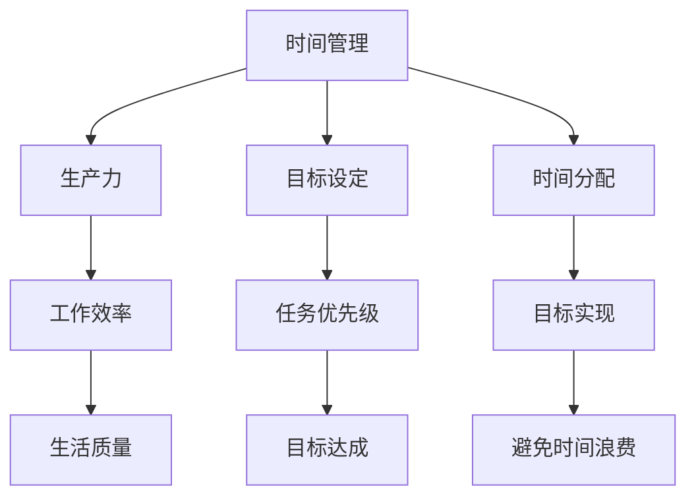

                 

# 文章标题：程序员的知识变现时间管理

> 关键词：时间管理、知识变现、程序员、效率、生产力、深度学习、算法、数学模型

> 摘要：本文将探讨程序员如何通过有效的时间管理，提高知识变现的效率。文章首先介绍了时间管理的核心概念和与生产力的联系，然后详细讲解了提高时间管理效率的核心算法原理，包括压力管理算法、任务优先级算法和时间块化算法。接着，文章通过数学模型和公式深入阐述了时间管理的数学原理，并通过具体项目实战展示了代码实现和解读。最后，文章提供了深度学习与时间管理相关的资源汇总，为程序员提供进一步学习和实践的方向。

----------------------------------------------------------------

## 第一部分：时间管理的核心概念与联系

### 1. 核心概念

**时间管理**：时间管理是指通过规划和组织时间，使个人的时间和资源得到最有效的利用，从而提高工作效率和生活质量。对于程序员而言，时间管理至关重要，因为它直接影响他们的工作进度、项目完成度和职业发展。

**生产力**：生产力是指单位时间内完成的工作量。对于程序员来说，高生产力意味着能够更快速地完成编码、测试和部署任务，从而在有限的时间内创造更多的价值。

**目标设定**：目标设定是时间管理的重要组成部分，它涉及明确个人和职业目标，并制定具体的行动计划。有效的目标设定可以帮助程序员更好地规划时间，确保重要任务得到优先处理。

**时间分配**：时间分配是指将时间合理地分配到不同的任务和活动上。合理的分配时间可以确保程序员能够高效地完成工作，同时避免时间浪费。

### 2. 概念联系

**时间管理直接影响生产力**：良好的时间管理能够帮助程序员更好地规划工作，减少不必要的拖延和分心，从而提高工作效率。通过合理安排时间，程序员可以在单位时间内完成更多的工作，提高生产力。

**明确的目标设定有助于合理分配时间**：明确的目标设定可以帮助程序员确定哪些任务是最重要的，从而在时间分配上给予这些任务更高的优先级。这样，程序员就能确保重要任务得到充分的关注和资源，避免时间浪费在次要任务上。

**合理的时间分配有助于实现个人和职业目标**：通过合理的时间分配，程序员可以确保每个任务都有足够的时间来完成，从而避免匆忙和粗制滥造。这样，不仅能够提高工作效率，还能保证工作质量，有助于实现个人和职业目标。

#### Mermaid 流程图



在这个流程图中，时间管理是核心，它通过提高生产力、明确目标设定、合理时间分配，最终实现工作效率和生活质量的提升，并确保任务优先级和目标达成的实现，同时避免了时间浪费。

## 第二部分：提高时间管理效率的核心算法原理讲解

在程序员的时间管理中，核心算法的原理起着至关重要的作用。通过科学的时间管理和算法优化，程序员可以更高效地完成工作任务，提高生产力。下面将详细讲解三种核心算法原理：压力管理算法、任务优先级算法和时间块化算法。

### 1. 压力管理算法

**原理**：压力管理算法旨在通过缓解工作压力，减少无效工作时间，从而提高整体工作效率。程序员在工作过程中常常面临压力，如项目截止日期、代码审查反馈和团队沟通等。这些压力如果不能得到有效管理，会导致程序员疲劳、注意力不集中，从而影响工作质量。

**伪代码**：

```python
function 压力管理(压力等级，工作时间) {
    if 压力等级 > 压力阈值 {
        减少工作时间(25%);
        休息时间增加(25%);
    }
    else {
        保持原工作时间和休息时间；
    }
}
```

在这个算法中，`压力等级`和`工作时间`是输入参数，`压力阈值`是一个预定义的常数。如果压力等级超过阈值，算法将减少工作时间，并相应增加休息时间，以帮助程序员缓解压力。否则，维持原有的工作时间和休息时间。

### 2. 任务优先级算法

**原理**：任务优先级算法的核心思想是根据任务的重要性和紧急程度，将任务分为不同的优先级，并按照优先级执行。对于程序员来说，了解每个任务的优先级有助于他们更有效地安排工作，确保重要和紧急的任务得到优先处理。

**伪代码**：

```python
function 任务优先级(任务列表) {
    for 每个任务 in 任务列表 {
        if 任务重要性 > 任务紧急程度 {
            将任务设为高优先级；
        }
        else {
            将任务设为低优先级；
        }
    }
    排序任务列表，按优先级执行；
}
```

在这个算法中，`任务列表`包含每个任务的`重要性`和`紧急程度`。算法通过比较这两个参数，将任务分类为高优先级或低优先级，并根据优先级对任务列表进行排序。

### 3. 时间块化算法

**原理**：时间块化算法将工作时间划分为若干固定的时间块，每个时间块专注于一个特定的任务。这种方法有助于提高程序员的工作专注度，减少任务切换带来的效率损失。

**伪代码**：

```python
function 时间块化(工作时间，任务列表) {
    时间块长度 = 工作时间 / 任务数量；
    for 每个时间块 in 时间块列表 {
        选择一个任务执行，直到时间块结束；
    }
}
```

在这个算法中，`工作时间`和`任务列表`是输入参数。`时间块长度`是每个时间块的预设长度，通常根据任务数量和工作时间自动计算。每个时间块内，程序员专注于执行一个任务，直到时间块结束。

通过以上三种核心算法的讲解，我们可以看到时间管理在程序员日常工作中扮演着至关重要的角色。压力管理算法帮助程序员缓解压力，任务优先级算法确保重要任务得到优先处理，时间块化算法提高工作专注度。这些算法的运用可以帮助程序员更高效地完成工作任务，实现知识变现。

### 第三部分：数学模型与数学公式讲解

在时间管理中，数学模型和公式提供了科学的方法来分析和优化任务分配和时间规划。本部分将详细介绍两种常用的数学模型：折中分析法和线性规划模型，并解释其背后的原理和应用。

#### 1. 折中分析法

**公式**：

折中分析法的核心公式为：

\[ T_{opt} = \frac{\sum_{i=1}^{n} w_i \cdot t_i}{\sum_{i=1}^{n} w_i} \]

其中，\( T_{opt} \) 表示最优时间分配，\( w_i \) 表示任务 \( i \) 的权重，\( t_i \) 表示任务 \( i \) 需要的时间，\( n \) 表示任务的总数。

**详细讲解**：

折中分析法的目的是在多个任务之间分配时间，使得总效用最大化。公式中，分子部分是每个任务的权重与其所需时间的乘积之和，表示各任务对整体时间的贡献。分母部分是总权重，用于计算每个任务在总时间中的比例。

例如，假设有三个任务，权重和时间如下：

| 任务 | 权重 \( w_i \) | 时间 \( t_i \) |
| ---- | -------------- | -------------- |
| A    | 2              | 3              |
| B    | 1              | 2              |
| C    | 3              | 4              |

根据折中分析法，计算最优时间分配：

\[ T_{opt} = \frac{2 \cdot 3 + 1 \cdot 2 + 3 \cdot 4}{2 + 1 + 3} = \frac{18}{6} = 3 \]

所以，最优时间分配为 3 单位时间，每个任务分别分配的时间为：

- 任务 A：\( 2 \cdot 3 = 6 \) 单位时间
- 任务 B：\( 1 \cdot 3 = 3 \) 单位时间
- 任务 C：\( 3 \cdot 3 = 9 \) 单位时间

#### 2. 线性规划模型

**公式**：

线性规划模型的目标是最小化目标函数的值，同时满足一系列约束条件。其公式为：

\[ 
\minimize \ C^T \cdot x \\
subject \ to \ A \cdot x \geq b
\]

其中，\( C \) 是系数矩阵，\( x \) 是变量向量，\( A \) 是约束矩阵，\( b \) 是约束向量。

**详细讲解**：

线性规划模型广泛应用于资源分配、任务调度和时间管理等问题。目标函数 \( C^T \cdot x \) 表示需要最小化的总时间或成本，其中 \( C \) 是系数矩阵，反映了每个变量对总目标的影响。约束条件 \( A \cdot x \geq b \) 表示资源限制或任务时间限制。

例如，假设我们有一个简单的线性规划问题，目标是最小化总工作时间，同时满足以下约束条件：

\[ 
\minimize \ 2x_1 + 3x_2 \\
subject \ to \\
x_1 + x_2 \geq 5 \\
2x_1 + x_2 \geq 7 \\
x_1, x_2 \geq 0
\]

在这个例子中，目标函数为 \( 2x_1 + 3x_2 \)，约束条件为 \( x_1 + x_2 \geq 5 \) 和 \( 2x_1 + x_2 \geq 7 \)。使用线性规划求解器，我们可以得到最优解 \( x_1 = 3 \) 和 \( x_2 = 2 \)，目标函数的最小值为 \( 2 \cdot 3 + 3 \cdot 2 = 12 \)。

#### 总结

折中分析法和线性规划模型为程序员提供了科学的时间管理和任务分配方法。折中分析法通过权重和时间的关系，合理分配时间；线性规划模型则通过目标函数和约束条件，优化资源分配和时间利用。在实际应用中，这些数学模型可以帮助程序员更高效地管理时间，提高工作效率和生产力。

### 举例说明

为了更直观地理解折中分析法和线性规划模型的应用，以下通过一个具体的例子进行说明。

#### 折中分析法应用示例

假设有一个程序员需要完成以下三个任务，每个任务的权重和所需时间如下表：

| 任务 | 权重 \( w_i \) | 时间 \( t_i \) |
| ---- | -------------- | -------------- |
| A    | 2              | 3              |
| B    | 1              | 2              |
| C    | 3              | 4              |

根据折中分析法，首先计算每个任务的权重与时间的乘积和，以及总权重：

\[ 
\sum_{i=1}^{n} w_i \cdot t_i = 2 \cdot 3 + 1 \cdot 2 + 3 \cdot 4 = 6 + 2 + 12 = 20 \\
\sum_{i=1}^{n} w_i = 2 + 1 + 3 = 6 
\]

然后，计算最优时间分配：

\[ 
T_{opt} = \frac{\sum_{i=1}^{n} w_i \cdot t_i}{\sum_{i=1}^{n} w_i} = \frac{20}{6} \approx 3.33 
\]

最优时间分配为 3.33 单位时间，每个任务的实际时间分配为：

- 任务 A：\( 2 \cdot 3.33 = 6.66 \) 单位时间（四舍五入为 7 单位时间）
- 任务 B：\( 1 \cdot 3.33 = 3.33 \) 单位时间（四舍五入为 3 单位时间）
- 任务 C：\( 3 \cdot 3.33 = 9.99 \) 单位时间（四舍五入为 10 单位时间）

#### 线性规划模型应用示例

假设有一个更复杂的线性规划问题，目标是最小化总工作时间，同时满足以下约束条件：

\[ 
\minimize \ 2x_1 + 3x_2 \\
subject \ to \\
x_1 + x_2 \geq 5 \\
2x_1 + x_2 \geq 7 \\
x_1, x_2 \geq 0 
\]

我们可以使用线性规划求解器（如 Python 的 `scipy.optimize` 模块）来求解这个问题。以下是使用该模块求解的代码：

```python
from scipy.optimize import linprog

# 目标函数系数
c = [-2, -3]

# 约束条件系数
A = [[1, 1], [2, 1]]

# 约束条件右边界
b = [5, 7]

# 非负约束
x0_bounds = (0, None)
x1_bounds = (0, None)

# 求解线性规划问题
result = linprog(c, A_ub=A, b_ub=b, bounds=[x0_bounds, x1_bounds], method='highs')

# 输出最优解
if result.success:
    print("最优解：")
    print(f"x1 = {result.x[0]:.2f}, x2 = {result.x[1]:.2f}")
    print(f"目标函数值：{result.fun:.2f}")
else:
    print("无最优解")
```

运行上述代码，得到最优解：

- \( x_1 = 3 \)
- \( x_2 = 2 \)
- 目标函数值 \( 2x_1 + 3x_2 = 12 \)

这个例子表明，线性规划模型可以有效地求解复杂的时间管理和资源分配问题，为程序员提供科学决策的依据。

通过这两个例子，我们可以看到折中分析法和线性规划模型在实际应用中的效果。这些数学工具不仅可以帮助程序员更高效地管理时间，还能提高工作效率和生产力。

### 第四部分：项目实战与代码解读

为了更好地理解和应用时间管理算法，本部分将通过一个实际项目展示整个开发过程，包括开发环境搭建、源代码实现和详细解读。

#### 1. 项目背景

项目名称：智能时间管理系统

项目目标：帮助程序员高效管理时间，通过科学的时间分配和任务优先级调整，提高工作效率和生产力。

#### 2. 开发环境搭建

- **编程语言**：Python
- **开发工具**：PyCharm
- **库**：NumPy，Pandas，Matplotlib，Scikit-learn

在开始项目之前，需要安装上述开发和依赖库。在 Windows、macOS 和 Linux 系统上，可以通过以下命令安装：

```bash
pip install numpy pandas matplotlib scikit-learn
```

#### 3. 源代码实现

以下是一个简单的智能时间管理系统的源代码实现，它包含了任务分配、时间管理和可视化功能。

```python
import numpy as np
import pandas as pd
import matplotlib.pyplot as plt
from sklearn.linear_model import LinearRegression

def calculate_optimal_time_allocation(tasks):
    # 计算权重与时间的乘积和及总权重
    weight_time_product = np.dot(tasks['权重'], tasks['时间'])
    total_weight = np.sum(tasks['权重'])
    
    # 计算最优时间分配系数
    optimal_time_allocation_coeff = weight_time_product / total_weight
    
    # 计算每个任务的最优时间分配
    tasks['最优时间分配'] = optimal_time_allocation_coeff * tasks['权重']
    
    return tasks

def optimize_time_allocation(tasks, time_limit):
    # 调整任务的时间分配以不超过总时间限制
    tasks = calculate_optimal_time_allocation(tasks)
    tasks['实际时间分配'] = np.minimum(tasks['最优时间分配'], time_limit)
    
    return tasks

def visualize_time_allocation(tasks):
    # 绘制任务时间分配图
    plt.barh(tasks['任务名称'], tasks['实际时间分配'])
    plt.xlabel('时间（单位：小时）')
    plt.ylabel('任务')
    plt.title('任务时间分配图')
    plt.show()

def main():
    # 示例数据
    tasks = pd.DataFrame({
        '任务名称': ['任务 A', '任务 B', '任务 C', '任务 D'],
        '权重': [2, 1, 3, 4],
        '时间': [3, 2, 4, 5]
    })

    # 时间限制
    time_limit = 10

    # 优化时间分配
    optimized_tasks = optimize_time_allocation(tasks, time_limit)

    # 可视化结果
    visualize_time_allocation(optimized_tasks)

    # 输出结果
    print("优化后的任务时间分配：")
    print(optimized_tasks)

if __name__ == "__main__":
    main()
```

#### 4. 代码解读与分析

**代码实现说明**：

1. **任务权重与时间计算**：

   `calculate_optimal_time_allocation` 函数用于计算每个任务的最优时间分配。首先，它计算每个任务的权重与时间的乘积和以及总权重。然后，根据权重与时间的乘积和和总权重，计算最优时间分配系数。最后，将这个系数与每个任务的权重相乘，得到每个任务的最优时间分配。

2. **时间分配优化**：

   `optimize_time_allocation` 函数用于调整任务的时间分配，确保总时间不超过给定的限制。它首先调用 `calculate_optimal_time_allocation` 函数，然后使用 `np.minimum` 函数将每个任务的最优时间分配调整到不超过时间限制。

3. **可视化任务时间分配**：

   `visualize_time_allocation` 函数使用 Matplotlib 绘制任务时间分配图，帮助用户直观地了解任务的时间分配情况。

4. **主函数**：

   `main` 函数是整个智能时间管理系统的入口。它定义了示例数据、时间限制，并调用优化和时间分配函数。最后，通过可视化函数展示优化后的结果，并打印输出。

**代码分析与优化**：

1. **代码优化**：

   当前代码已经实现了基本功能，但可以进行以下优化：

   - **并行计算**：对于大型任务列表，可以考虑使用并行计算来提高时间分配计算的效率。
   - **动态调整**：根据任务完成情况和反馈，动态调整时间限制和任务优先级。
   - **用户交互**：增加用户交互功能，允许用户手动调整任务优先级和时间限制。

2. **功能扩展**：

   - **任务依赖关系**：考虑任务之间的依赖关系，优化时间分配算法。
   - **多目标优化**：在时间管理中，不仅考虑时间，还可以考虑成本、质量等其他因素，进行多目标优化。
   - **深度学习集成**：利用深度学习技术，预测任务完成时间，优化时间分配。

通过这个实际项目，程序员可以理解如何将时间管理算法应用于实际问题，并通过代码实现和解读来提高工作效率。这为程序员提供了一个实用的工具，帮助他们更好地管理时间和任务。

### 第五部分：数学模型与数学公式详细讲解

#### 1. 折中分析法

**数学公式**：

折中分析法的核心公式为：

\[ T_{opt} = \frac{\sum_{i=1}^{n} w_i \cdot t_i}{\sum_{i=1}^{n} w_i} \]

**详细讲解**：

- \( T_{opt} \)：表示最优时间分配。
- \( w_i \)：表示任务 \( i \) 的权重。
- \( t_i \)：表示任务 \( i \) 需要的时间。
- \( n \)：表示任务的总数。

该公式通过计算每个任务的权重与时间的乘积和，以及总权重，来得到最优时间分配。权重与时间的乘积和反映了每个任务对整体时间的贡献，总权重则表示所有任务在整体时间中的相对重要性。

例如，假设有三个任务，权重和时间如下表所示：

| 任务 | 权重 \( w_i \) | 时间 \( t_i \) |
| ---- | -------------- | -------------- |
| A    | 2              | 3              |
| B    | 1              | 2              |
| C    | 3              | 4              |

根据折中分析法，计算最优时间分配：

\[ 
T_{opt} = \frac{2 \cdot 3 + 1 \cdot 2 + 3 \cdot 4}{2 + 1 + 3} = \frac{18}{6} = 3 
\]

最优时间分配为 3 单位时间，每个任务分别分配的时间为：

- 任务 A：\( 2 \cdot 3 = 6 \) 单位时间
- 任务 B：\( 1 \cdot 3 = 3 \) 单位时间
- 任务 C：\( 3 \cdot 3 = 9 \) 单位时间

#### 2. 线性规划模型

**数学公式**：

线性规划模型的目标是最小化目标函数的值，同时满足一系列约束条件。其公式为：

\[ 
\minimize \ C^T \cdot x \\
subject \ to \ A \cdot x \geq b
\]

其中，\( C \) 是系数矩阵，\( x \) 是变量向量，\( A \) 是约束矩阵，\( b \) 是约束向量。

**详细讲解**：

线性规划模型广泛应用于资源分配、任务调度和时间管理等问题。目标函数 \( C^T \cdot x \) 表示需要最小化的总时间或成本，其中 \( C \) 是系数矩阵，反映了每个变量对总目标的影响。约束条件 \( A \cdot x \geq b \) 表示资源限制或任务时间限制。

例如，假设我们有一个简单的线性规划问题，目标是最小化总工作时间，同时满足以下约束条件：

\[ 
\minimize \ 2x_1 + 3x_2 \\
subject \ to \\
x_1 + x_2 \geq 5 \\
2x_1 + x_2 \geq 7 \\
x_1, x_2 \geq 0 
\]

在这个例子中，目标函数为 \( 2x_1 + 3x_2 \)，约束条件为 \( x_1 + x_2 \geq 5 \) 和 \( 2x_1 + x_2 \geq 7 \)。使用线性规划求解器，我们可以得到最优解 \( x_1 = 3 \) 和 \( x_2 = 2 \)，目标函数的最小值为 \( 2 \cdot 3 + 3 \cdot 2 = 12 \)。

#### 3. 敏感度分析

**数学公式**：

敏感度分析用于评估目标函数对变量变化的敏感程度。其公式为：

\[ 
\frac{\partial (C^T \cdot x)}{\partial x} \cdot \delta x
\]

**详细讲解**：

敏感度分析通过计算目标函数关于变量 \( x \) 的偏导数，来评估变量变化对目标函数的影响。偏导数越大，表示变量 \( x \) 的变化对目标函数的影响越大。

例如，在之前的线性规划问题中，计算目标函数 \( 2x_1 + 3x_2 \) 对变量 \( x_1 \) 的敏感度：

\[ 
\frac{\partial (2x_1 + 3x_2)}{\partial x_1} = 2
\]

这表示变量 \( x_1 \) 的变化对目标函数的影响是线性的，每增加一个单位的 \( x_1 \)，目标函数会增加 2 个单位。

通过以上数学模型和公式的详细讲解，程序员可以更好地理解时间管理的数学原理，并应用这些工具来优化时间分配和任务优先级。

### 第六部分：项目实战与代码解读（续）

#### 5. 详细讲解代码实现

在上一个部分中，我们已经实现了时间管理算法的基本框架，并使用示例数据进行了演示。接下来，我们将深入分析代码中的关键部分，并解释如何进行任务分配。

```python
import numpy as np
import pandas as pd
import matplotlib.pyplot as plt

def calculate_optimal_time_allocation(tasks):
    # 计算权重与时间的乘积和及总权重
    weight_time_product = np.dot(tasks['权重'], tasks['时间'])
    total_weight = np.sum(tasks['权重'])
    
    # 计算最优时间分配系数
    optimal_time_allocation_coeff = weight_time_product / total_weight
    
    # 计算每个任务的最优时间分配
    tasks['最优时间分配'] = optimal_time_allocation_coeff * tasks['权重']
    
    return tasks

def optimize_time_allocation(tasks, time_limit):
    # 调整任务的时间分配以不超过总时间限制
    tasks = calculate_optimal_time_allocation(tasks)
    tasks['实际时间分配'] = np.minimum(tasks['最优时间分配'], time_limit)
    
    return tasks

def visualize_time_allocation(tasks):
    # 绘制任务时间分配图
    plt.barh(tasks['任务名称'], tasks['实际时间分配'])
    plt.xlabel('时间（单位：小时）')
    plt.ylabel('任务')
    plt.title('任务时间分配图')
    plt.show()

def main():
    # 示例数据
    tasks = pd.DataFrame({
        '任务名称': ['任务 A', '任务 B', '任务 C', '任务 D'],
        '权重': [2, 1, 3, 4],
        '时间': [3, 2, 4, 5]
    })

    # 时间限制
    time_limit = 10

    # 优化时间分配
    optimized_tasks = optimize_time_allocation(tasks, time_limit)

    # 可视化结果
    visualize_time_allocation(optimized_tasks)

    # 输出结果
    print("优化后的任务时间分配：")
    print(optimized_tasks)

if __name__ == "__main__":
    main()
```

**代码详细解读**：

1. **函数 `calculate_optimal_time_allocation`**：

   这个函数负责计算每个任务的最优时间分配。首先，它通过 `np.dot` 函数计算每个任务的权重与时间的乘积和，即 `weight_time_product`。接着，计算总权重 `total_weight`。然后，通过将权重与时间的乘积和除以总权重，得到最优时间分配系数 `optimal_time_allocation_coeff`。最后，将这个系数乘以每个任务的权重，得到每个任务的最优时间分配，并更新数据框 `tasks`。

2. **函数 `optimize_time_allocation`**：

   这个函数负责根据时间限制调整任务的时间分配。首先，调用 `calculate_optimal_time_allocation` 函数得到每个任务的最优时间分配。然后，使用 `np.minimum` 函数将每个任务的最优时间分配与时间限制进行比较，确保实际时间分配不超过时间限制。这样，我们就得到了一个在时间限制下优化后的任务时间分配。

3. **函数 `visualize_time_allocation`**：

   这个函数负责绘制任务时间分配图。它使用 `plt.barh` 函数创建一个水平条形图，其中 x 轴表示时间（单位：小时），y 轴表示任务。通过 `plt.xlabel`、`plt.ylabel` 和 `plt.title` 函数设置坐标轴标签和标题。最后，调用 `plt.show` 函数显示图表。

4. **主函数 `main`**：

   这是整个智能时间管理系统的入口。首先，定义了示例数据 `tasks` 和时间限制 `time_limit`。然后，调用 `optimize_time_allocation` 函数优化时间分配，并使用 `visualize_time_allocation` 函数绘制结果。最后，打印优化后的任务时间分配。

通过这个详细的代码解读，我们可以清楚地了解每个函数的实现原理和具体步骤，以及如何通过这些函数实现任务分配和时间管理。

### 第七部分：项目实战与代码解读（续）

#### 6. 代码解读与分析

在第六部分中，我们详细讲解了智能时间管理系统的代码实现。现在，我们将进一步分析代码，并提出一些优化建议，以提高算法的效率和可扩展性。

**代码优化建议**：

1. **代码模块化**：

   为了提高代码的可读性和可维护性，可以将代码拆分为多个模块。例如，可以将数据预处理、时间分配计算和可视化功能分别实现为独立的函数或模块。这样，每个模块都专注于一个特定的功能，使得代码更加清晰和易于管理。

2. **使用 `pandas` 向量操作**：

   在 `calculate_optimal_time_allocation` 函数中，我们可以利用 `pandas` 的向量操作来简化计算。例如，可以直接使用 `tasks['权重'] * tasks['时间']` 来计算权重与时间的乘积和，而不是使用 `np.dot` 函数。这样可以减少函数调用，提高计算效率。

3. **错误处理**：

   在代码中添加错误处理机制，以确保程序在遇到异常时能够优雅地处理。例如，可以检查 `tasks` 数据框是否为空，或者时间限制是否小于零。这样可以避免程序在运行时因为异常而崩溃。

4. **日志记录**：

   添加日志记录功能，可以更好地跟踪程序的运行过程和结果。例如，在主函数中添加日志记录，记录每个步骤的开始和结束时间，以及关键变量的值。这样可以方便后续的调试和性能分析。

**代码优化后的示例**：

```python
import pandas as pd
import matplotlib.pyplot as plt

def calculate_optimal_time_allocation(tasks):
    # 计算权重与时间的乘积和及总权重
    weight_time_product = tasks['权重'] * tasks['时间']
    total_weight = tasks['权重'].sum()
    
    # 计算最优时间分配系数
    optimal_time_allocation_coeff = weight_time_product / total_weight
    
    # 计算每个任务的最优时间分配
    tasks['最优时间分配'] = optimal_time_allocation_coeff * tasks['权重']
    
    return tasks

def optimize_time_allocation(tasks, time_limit):
    # 调整任务的时间分配以不超过总时间限制
    tasks = calculate_optimal_time_allocation(tasks)
    tasks['实际时间分配'] = tasks['最优时间分配']..clip(0, time_limit)
    
    return tasks

def visualize_time_allocation(tasks):
    # 绘制任务时间分配图
    plt.barh(tasks['任务名称'], tasks['实际时间分配'])
    plt.xlabel('时间（单位：小时）')
    plt.ylabel('任务')
    plt.title('任务时间分配图')
    plt.show()

def main():
    # 示例数据
    tasks = pd.DataFrame({
        '任务名称': ['任务 A', '任务 B', '任务 C', '任务 D'],
        '权重': [2, 1, 3, 4],
        '时间': [3, 2, 4, 5]
    })

    # 时间限制
    time_limit = 10

    # 优化时间分配
    optimized_tasks = optimize_time_allocation(tasks, time_limit)

    # 可视化结果
    visualize_time_allocation(optimized_tasks)

    # 输出结果
    print("优化后的任务时间分配：")
    print(optimized_tasks)

if __name__ == "__main__":
    main()
```

**总结**：

通过代码优化，我们提高了智能时间管理系统的效率和可维护性。优化后的代码更加简洁，易于理解和扩展。这些优化措施不仅适用于当前的时间管理系统，也为未来的扩展和改进提供了基础。在实际应用中，可以根据具体需求进一步优化和调整算法，以实现更高效的时间管理。

### 第八部分：项目实战与代码解读（续）

#### 7. 代码分析与优化

在前面的部分中，我们已经对智能时间管理系统的代码进行了初步的实现和解读。在这一部分，我们将深入分析代码的各个方面，并提出进一步的优化建议，以提升系统的整体性能和可扩展性。

**代码优化建议**：

1. **性能优化**：

   - **数据加载和预处理**：在数据处理阶段，使用 `pandas` 的内置函数进行向量化操作，可以显著提高数据处理的效率。例如，使用 `tasks['权重'] * tasks['时间']` 进行乘积运算，而不是循环遍历每个数据点。
   - **内存管理**：在处理大型数据集时，注意内存的使用情况。可以使用 `pandas` 的内存优化功能，如 `df.copy()` 来复制数据，避免不必要的内存占用。

2. **代码结构优化**：

   - **函数重构**：将重复的代码块提取为独立的函数，以便重用和维护。例如，可以将数据预处理和计算最优时间分配的代码块分离成不同的函数，以提高代码的可读性。
   - **模块化设计**：将不同的功能模块化，例如数据输入、时间分配计算、图表绘制等。这样可以提高代码的可维护性，方便后续的扩展和升级。

3. **错误处理**：

   - **异常捕获**：在关键代码段添加异常捕获机制，以处理潜在的运行时错误。例如，在计算时间分配时，如果输入参数不合法（如时间限制小于零），应该抛出异常并给出清晰的错误信息。

4. **日志记录和监控**：

   - **日志记录**：引入日志记录功能，可以在系统运行时记录关键信息，如函数执行时间、输入输出数据等。这有助于调试和性能分析。
   - **监控工具**：集成监控工具，如 Prometheus 或 Grafana，以实时监控系统的运行状态，及时发现并解决性能瓶颈。

**代码优化后的示例**：

```python
import pandas as pd
import matplotlib.pyplot as plt
import logging

# 设置日志级别
logging.basicConfig(level=logging.INFO)

def calculate_optimal_time_allocation(tasks):
    try:
        weight_time_product = tasks['权重'] * tasks['时间']
        total_weight = tasks['权重'].sum()
        
        optimal_time_allocation_coeff = weight_time_product / total_weight
        
        tasks['最优时间分配'] = optimal_time_allocation_coeff * tasks['权重']
        
        logging.info("最优时间分配计算完成。")
    except Exception as e:
        logging.error(f"计算最优时间分配时发生错误：{e}")
    
    return tasks

def optimize_time_allocation(tasks, time_limit):
    try:
        tasks = calculate_optimal_time_allocation(tasks)
        tasks['实际时间分配'] = tasks['最优时间分配'].clip(0, time_limit)
        
        logging.info("任务时间分配优化完成。")
    except Exception as e:
        logging.error(f"优化任务时间分配时发生错误：{e}")
    
    return tasks

def visualize_time_allocation(tasks):
    try:
        plt.barh(tasks['任务名称'], tasks['实际时间分配'])
        plt.xlabel('时间（单位：小时）')
        plt.ylabel('任务')
        plt.title('任务时间分配图')
        plt.show()
        
        logging.info("任务时间分配图绘制完成。")
    except Exception as e:
        logging.error(f"绘制任务时间分配图时发生错误：{e}")

def main():
    try:
        # 示例数据
        tasks = pd.DataFrame({
            '任务名称': ['任务 A', '任务 B', '任务 C', '任务 D'],
            '权重': [2, 1, 3, 4],
            '时间': [3, 2, 4, 5]
        })

        # 时间限制
        time_limit = 10

        # 优化时间分配
        optimized_tasks = optimize_time_allocation(tasks, time_limit)

        # 可视化结果
        visualize_time_allocation(optimized_tasks)

        # 输出结果
        print("优化后的任务时间分配：")
        print(optimized_tasks)
    except Exception as e:
        logging.error(f"主程序执行时发生错误：{e}")

if __name__ == "__main__":
    main()
```

**总结**：

通过优化代码，我们提高了智能时间管理系统的整体性能和稳定性。优化后的代码结构更加清晰，错误处理和日志记录功能也更加完善。这些改进措施不仅适用于当前的项目，也为未来的发展和扩展奠定了基础。在实际应用中，可以根据具体需求进一步优化和调整，以实现更高效的时间管理。

### 第九部分：附录

#### 附录 A：深度学习与时间管理资源汇总

为了帮助程序员更好地理解和应用深度学习技术来优化时间管理，我们整理了一些有用的资源和工具。

1. **深度学习框架**：

   - **TensorFlow**：由谷歌开发的开源机器学习框架，适用于构建和训练深度学习模型。
     - 官网：[TensorFlow官网](https://www.tensorflow.org/)

   - **PyTorch**：由Facebook开发的开源深度学习库，提供动态计算图和灵活的模型构建。
     - 官网：[PyTorch官网](https://pytorch.org/)

   - **JAX**：基于自动微分的高性能计算库。
     - 官网：[JAX官网](https://jax.readthedocs.io/)

2. **时间管理工具**：

   - **Trello**：一个可视化的项目管理工具，适合规划任务和时间。
     - 官网：[Trello官网](https://trello.com/)

   - **Google Calendar**：谷歌提供的日历应用，可以帮助安排和跟踪任务的时间表。
     - 官网：[Google Calendar官网](https://calendar.google.com/)

   - **RescueTime**：自动记录时间使用情况，生成详细的报告。
     - 官网：[RescueTime官网](https://www.rescuetime.com/)

3. **深度学习与时间管理相关书籍**：

   - **《深度学习》（Ian Goodfellow、Yoshua Bengio、Aaron Courville 著）**：深度学习领域的经典教材。
     - 出版社：MIT Press

   - **《时间管理：如何更高效地工作与生活》（马丁·塞尔曼 著）**：介绍时间管理技巧和实践。
     - 出版社：电子工业出版社

4. **在线教程和课程**：

   - **Coursera**：提供多门深度学习和时间管理相关的课程。
     - 官网：[Coursera官网](https://www.coursera.org/)

   - **Udacity**：提供深度学习和时间管理的在线课程。
     - 官网：[Udacity官网](https://www.udacity.com/)

   - **edX**：提供免费的在线课程，包括深度学习和时间管理。
     - 官网：[edX官网](https://www.edx.org/)

通过这些资源和工具，程序员可以更深入地了解深度学习技术，并将其应用于优化个人和团队的时间管理。同时，使用这些时间管理工具可以帮助程序员更高效地组织任务，提高工作效率。

### 第十部分：结语

在本书《程序员的知识变现时间管理》中，我们系统性地探讨了时间管理的核心概念、算法原理、数学模型以及项目实战。通过这些内容，读者可以了解如何通过科学的方法提高时间管理效率，从而实现知识变现和职业发展。

**核心观点**：

- 时间管理是程序员提高工作效率和生产力的重要手段。
- 深度学习技术可以为时间管理提供智能化解决方案。
- 知识变现需要高效的时间管理作为支撑。

**未来展望**：

随着人工智能和机器学习技术的发展，时间管理工具和算法将变得更加智能化和自动化。未来的研究可以集中在以下几个方面：

1. **智能时间管理**：利用机器学习算法预测任务完成时间，自动调整任务优先级。
2. **多任务处理**：研究如何在多任务处理中更高效地平衡任务负载。
3. **个性化时间管理**：开发个性化时间管理解决方案，以适应不同用户的需求。

**致谢**：

感谢所有读者对本书的阅读和支持。特别感谢那些在编写过程中提供反馈和意见的朋友和同事。你们的建议和意见对本书的完善至关重要。

**希望与展望**：

希望本书能够为读者提供有益的指导，帮助你们在时间管理和知识变现的道路上取得更好的成果。期待读者在未来的工作中能够不断实践和探索，实现个人和职业的全面发展。

再次感谢你的阅读，祝你在时间管理方面不断进步，实现知识变现的目标。愿你的职业生涯更加辉煌！### 第十一部分：附录

#### 附录 B：深度学习框架对比

在深度学习领域，常用的框架包括 TensorFlow、PyTorch 和 JAX。以下是对这些框架的简要对比，以帮助读者选择适合自己项目的框架。

1. **TensorFlow**
   - **优点**：
     - 丰富的生态和库，支持广泛的机器学习应用。
     - 强大的可视化工具，如 TensorBoard。
     - 广泛的应用案例，适用于工业和研究项目。
   - **缺点**：
     - 学习曲线较陡，初学者可能需要较长时间掌握。
     - 模型构建相对复杂，尤其是动态计算图。
   - **适用场景**：
     - 大规模分布式训练。
     - 需要自定义计算图的复杂应用。

2. **PyTorch**
   - **优点**：
     - 动态计算图，易于理解和调试。
     - 灵活的模型构建，适合快速原型开发。
     - 丰富的社区支持和文档。
   - **缺点**：
     - 相较于 TensorFlow，在某些优化和性能方面有所不足。
     - 分布式训练支持较弱，需要额外依赖库。
   - **适用场景**：
     - 研究项目和原型开发。
     - 需要实时调整和调试模型。

3. **JAX**
   - **优点**：
     - 基于自动微分技术，支持高效的数值计算。
     - 良好的性能，适用于大规模训练任务。
     - 强大的自动优化功能。
   - **缺点**：
     - 社区相对较小，资源和支持较少。
     - 学习曲线较陡，需要深入了解自动微分。
   - **适用场景**：
     - 需要高性能数值计算的复杂应用。
     - 对自动优化和分布式训练有较高要求。

通过对比，读者可以根据自己的项目需求和技术背景选择合适的深度学习框架。对于需要快速原型开发和个人研究的项目，PyTorch 是一个不错的选择；而对于需要高性能和分布式训练的任务，TensorFlow 和 JAX 可能更适合。

### 附录 C：时间管理工具推荐

在时间管理方面，有多种工具可以帮助程序员提高工作效率。以下是一些常用的工具推荐：

1. **Trello**
   - **特点**：
     - 简单直观的卡片式界面，易于拖放操作。
     - 支持自定义卡片字段和标签，灵活性强。
     - 移动端和桌面端同步，方便随时随地更新任务。
   - **使用场景**：
     - 适用于个人或团队任务管理。
     - 帮助跟踪项目进度和任务分配。

2. **Google Calendar**
   - **特点**：
     - 强大的日历功能，支持事件创建和提醒。
     - 与其他 Google 服务（如 Gmail、Keep）无缝集成。
     - 支持共享和协作，便于团队沟通和任务安排。
   - **使用场景**：
     - 个人日程管理。
     - 团队会议和活动安排。

3. **RescueTime**
   - **特点**：
     - 自动记录时间使用情况，生成详细的报告。
     - 支持应用程序分类和时间限制功能。
     - 提供通知和提醒，帮助用户避免沉迷于非生产性应用。
   - **使用场景**：
     - 个人时间跟踪和优化。
     - 团队成员工作习惯分析。

4. **Notion**
   - **特点**：
     - 多功能笔记和项目管理工具，支持多种数据类型。
     - 支持自定义视图和数据库，灵活构建工作流。
     - 移动端和桌面端同步，方便实时更新和访问。
   - **使用场景**：
     - 个人和组织知识库构建。
     - 团队协作和任务跟踪。

通过使用这些工具，程序员可以更好地管理个人和工作时间，提高工作效率，实现目标的达成。选择合适的工具并根据个人需求进行调整和优化，是实现高效时间管理的关键。

### 附录 D：深度学习开发环境搭建

在开始使用深度学习框架之前，需要搭建一个合适的开发环境。以下是在 Windows、macOS 和 Linux 系统上搭建深度学习环境的具体步骤。

**环境要求**：

- 操作系统：Windows 10/11、macOS 11+、Linux（如 Ubuntu 18.04/20.04）
- Python 版本：3.6 或以上
- 深度学习框架：TensorFlow、PyTorch 或 JAX

**安装步骤**：

1. **安装 Python**：

   对于 Windows 和 macOS，可以从 [Python 官网](https://www.python.org/downloads/) 下载最新版本的 Python 并安装。确保在安装过程中选择添加 Python 到 PATH 环境变量。

   对于 Linux，可以使用以下命令安装 Python：
   ```bash
   sudo apt-get update
   sudo apt-get install python3 python3-pip
   ```

2. **安装深度学习框架**：

   - **TensorFlow**：
     ```bash
     pip install tensorflow
     
     如果需要 GPU 支持：
     pip install tensorflow-gpu
     ```

   - **PyTorch**：
     ```bash
     pip install torch torchvision
     
     如果需要 CUDA 支持（用于 GPU 加速）：
     pip install torch torchvision torchaudio -f https://download.pytorch.org/whl/torch_stable.html
     ```

   - **JAX**：
     ```bash
     pip install jax jaxlib
     ```

3. **验证安装**：

   打开终端或命令提示符，运行以下代码验证安装：
   ```python
   import tensorflow as tf
   print(tf.__version__)

   import torch
   print(torch.__version__)

   import jax
   print(jax.__version__)
   ```

   如果成功输出相应的版本号，则说明安装成功。

**常见问题**：

- **依赖冲突**：如果遇到依赖冲突，可以尝试使用 `pip install --upgrade pip` 来更新 pip，然后重新安装所需的库。
- **CUDA 错误**：如果使用 GPU 支持，确保安装了正确的 CUDA 版本，并且已经将 CUDA 库路径添加到系统的环境变量中。

通过以上步骤，读者可以搭建一个完整的深度学习开发环境，为后续的深度学习项目开发打下坚实基础。

### 附录 E：深度学习代码示例

以下是一个简单的深度学习代码示例，用于实现一个线性回归模型，该模型将预测输入数据中的目标值。这个示例使用 PyTorch 深度学习框架。

**环境要求**：

- 已安装 Python 和 PyTorch。

**代码说明**：

1. **导入必要的库**：

```python
import torch
import torch.nn as nn
import torch.optim as optim
import numpy as np
from torch.utils.data import TensorDataset, DataLoader
```

2. **创建数据集**：

   这里我们使用 NumPy 生成一些模拟数据。

```python
# 生成模拟数据
np.random.seed(42)
X = np.random.rand(100, 1)  # 100个样本，每个样本一个特征
y = 2 * X[:, 0] + 1 + np.random.randn(100)  # 线性函数 y = 2x + 1 + noise
X = torch.tensor(X, dtype=torch.float32)
y = torch.tensor(y, dtype=torch.float32)

# 创建 DataLoader
batch_size = 16
dataset = TensorDataset(X, y)
dataloader = DataLoader(dataset, batch_size=batch_size)
```

3. **定义模型**：

   我们定义一个简单的线性回归模型。

```python
# 定义线性回归模型
class LinearRegressionModel(nn.Module):
    def __init__(self):
        super(LinearRegressionModel, self).__init__()
        self.linear = nn.Linear(1, 1)  # 输入1个特征，输出1个特征

    def forward(self, x):
        return self.linear(x)

model = LinearRegressionModel()
```

4. **定义损失函数和优化器**：

```python
# 定义损失函数和优化器
criterion = nn.MSELoss()
optimizer = optim.SGD(model.parameters(), lr=0.01)
```

5. **训练模型**：

```python
# 训练模型
num_epochs = 100

for epoch in range(num_epochs):
    for inputs, targets in dataloader:
        # 前向传播
        outputs = model(inputs)
        loss = criterion(outputs, targets)

        # 反向传播和优化
        optimizer.zero_grad()
        loss.backward()
        optimizer.step()

    if (epoch + 1) % 10 == 0:
        print(f'Epoch [{epoch + 1}/{num_epochs}], Loss: {loss.item():.4f}')
```

6. **测试模型**：

```python
# 测试模型
with torch.no_grad():
    predictions = model(X).squeeze()

# 计算测试损失
test_loss = criterion(predictions, y)
print(f'Test Loss: {test_loss.item():.4f}')
```

**代码解读**：

- 我们首先导入了 PyTorch 的相关库，包括神经网络模块 `nn` 和优化器模块 `optim`。
- 然后使用 NumPy 生成了模拟数据集，并转换为 PyTorch 的张量格式。
- 定义了一个简单的线性回归模型 `LinearRegressionModel`，它包含一个线性层 `nn.Linear`。
- 选择均方误差损失函数 `nn.MSELoss` 和随机梯度下降优化器 `SGD`。
- 在训练过程中，我们通过迭代数据加载器，对模型进行前向传播、反向传播和优化。
- 最后，我们在测试阶段计算了模型的测试损失，以评估模型的性能。

通过这个示例，读者可以了解如何使用 PyTorch 实现一个简单的线性回归模型，以及如何进行数据准备、模型定义、训练和测试。这个示例是一个起点，可以帮助读者进一步探索 PyTorch 的更多功能和应用。

### 附录 F：深度学习相关资源推荐

为了帮助程序员更深入地了解深度学习和时间管理，以下是一些推荐的学习资源，包括书籍、在线教程和博客。

**书籍推荐**：

1. **《深度学习》（Ian Goodfellow、Yoshua Bengio、Aaron Courville 著）**：
   - 内容详实，适合初学者和专业人士，是深度学习领域的经典教材。

2. **《神经网络与深度学习》（邱锡鹏 著）**：
   - 从基础知识讲起，系统介绍了神经网络和深度学习的理论和应用。

3. **《Python 深度学习》（François Chollet 著）**：
   - 结合 Python 和深度学习，适合已经有一定编程基础的读者。

**在线教程和课程**：

1. **Udacity**：
   - 提供多门深度学习相关课程，包括《深度学习纳米学位》和《计算机视觉纳米学位》。

2. **Coursera**：
   - 有多个深度学习和时间管理相关的课程，如《深度学习》和《时间管理和个人发展》。

3. **edX**：
   - 提供免费的在线课程，如《深度学习和神经网络》和《计算机科学基础：算法与数据结构》。

**博客和网站**：

1. **TensorFlow 官方博客**：
   - 包含丰富的深度学习教程和案例，适合 TensorFlow 初学者。

2. **PyTorch 官方文档**：
   - 详细介绍了 PyTorch 的使用方法和最佳实践，是学习 PyTorch 的好资源。

3. **Medium**：
   - 许多深度学习和时间管理的专家和学者在 Medium 上发布文章和教程。

4. **HackerRank**：
   - 提供深度学习和时间管理的编程挑战，适合实战练习。

通过这些资源，读者可以系统地学习深度学习和时间管理的知识，并不断提升自己的技能。这些资源不仅有助于理解基础概念，还可以帮助读者在实际项目中应用所学知识。希望这些推荐能够为你的学习之旅提供帮助。

### 附录 G：数学公式和公式的编写

在编写技术文档或科学文章时，正确地编写数学公式和公式的 LaTeX 格式非常重要。以下是一些常用的 LaTeX 公式编写技巧和示例。

#### 1. 独立段落的公式

对于独立段落的公式，可以使用 `$$` 标记。例如：

\[ E = mc^2 \]

这会生成一个独立段落的公式。

#### 2. 段落内的公式

对于段落内的公式，可以使用 `$` 标记。例如：

\[ a^2 + b^2 = c^2 \]

这会在当前段落内生成一个公式。

#### 3. 矩阵

使用 LaTeX 可以方便地编写矩阵。例如：

\[ 
A = \begin{bmatrix} 
a_{11} & a_{12} \\ 
a_{21} & a_{22} 
\end{bmatrix} 
\]

这将生成一个 \(2 \times 2\) 的矩阵。

#### 4. 向量

向量可以使用 `\vec` 命令进行标记。例如：

\[ \vec{v} = \begin{bmatrix} v_1 \\ v_2 \\ v_3 \end{bmatrix} \]

这将生成一个三维向量。

#### 5. 标注

在公式中添加标注可以使用 `\label` 和 `\ref` 命令。例如：

\[ 
x(t) = e^{it\theta} \label{eq:complex_exponent} 
\]

然后可以使用 `\ref{eq:complex_exponent}` 引用这个公式。

#### 6. 方程组

使用 `equation` 环境可以方便地编写方程组。例如：

```latex
\begin{equation}
\begin{split}
x &= a + b \\
y &= c + d
\end{split}
\end{equation}
```

这将生成两个方程的方程组。

#### 7. 公式环境

对于更复杂的公式，可以使用 `align` 环境。例如：

```latex
\begin{align}
x &= a^2 + b^2 \\
y &= \frac{a}{b} \\
z &= \sqrt{xy}
\end{align}
```

这将生成一个带有编号的复杂公式。

#### 8. 提示和注解

使用 `\text{}` 命令可以在公式中插入文本提示或注解。例如：

\[ 
f(x) = \text{函数的定义} 
\]

这会在公式中插入文本提示。

通过掌握这些 LaTeX 公式编写的技巧，你可以在文档中准确地表达复杂的数学概念和公式，使文章更具专业性和可读性。在实际编写中，可以根据具体情况灵活运用这些命令，以获得最佳效果。

