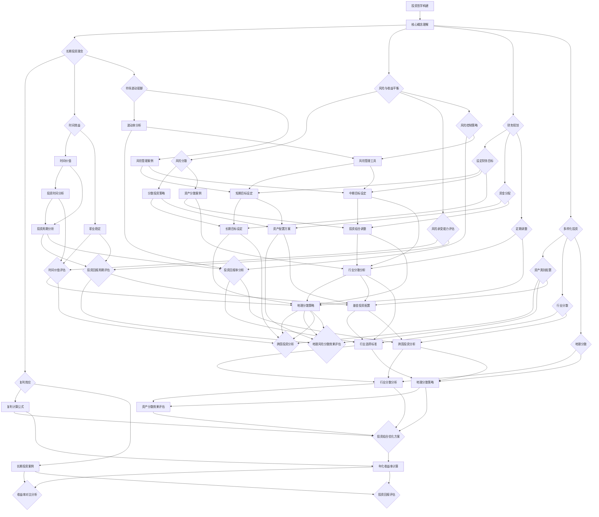

                 

## 文章标题：程序员的财务自由：极简主义与投资哲学

在数字化时代，程序员作为信息技术领域的重要力量，其职业特点使得他们在追求个人发展的同时，也面临着独特的财务规划需求。财务自由，作为现代生活中的一种理想状态，对于程序员而言尤为重要。它不仅代表了经济上的独立，更意味着时间的自由与生活的品质。《程序员的财务自由：极简主义与投资哲学》将深入探讨程序员如何通过极简主义生活方式和科学的投资哲学，实现财务自由，并享受更加充实、有意义的人生。

关键词：程序员、财务自由、极简主义、投资哲学、生活方式

### 摘要

本文旨在为程序员提供一套系统化的财务自由实现方案。文章首先分析了程序员追求财务自由的动因，以及极简主义与投资哲学的基本理念。接着，详细介绍了极简主义生活方式的实践方法和优势，帮助读者理解如何在减少物质负担的同时，提高生活品质。随后，文章构建了投资哲学的核心概念，阐述了投资哲学的实践路径，并讲解了财务知识储备的重要性。在此基础上，文章通过具体案例，讲解了投资实战的准备工作、实战技巧和分析方法。最后，文章探讨了财务自由目标设定、实现策略及心态建设，为读者提供了一条可行的财务自由实现之路。通过本文的阅读，程序员可以系统地了解并实践财务自由的理念和方法，为自己的人生增添更多色彩。

#### 第1章 引言

作为信息技术领域的中坚力量，程序员的工作以其高度专业化、创新性和技术含量而闻名。他们在企业中担任关键角色，推动着数字化转型的进程，从而极大地影响着社会的各个方面。然而，与职业成就相比，许多程序员在财务规划方面往往显得相对不足。这种现象背后有着多重原因，其中包括工作繁忙、技术领域更新迅速、缺乏系统的财务知识等。因此，财务自由对于程序员而言，不仅是一种生活追求，更是职业发展的重要保障。

首先，程序员的职业特点决定了他们对财务自由的渴求。程序员的工作往往依赖于专业技能和知识，这使得他们的收入水平普遍较高。然而，高收入背后往往伴随着高压力和高风险，因为技术领域的快速变化可能导致技能的过时和职业发展的瓶颈。因此，实现财务自由，使得程序员能够在保持技术领先的同时，拥有更多的选择权和自由度，避免因职业风险而陷入经济困境。

其次，财务自由对于程序员的生活品质有着直接的影响。在现代社会中，金钱不仅是生活的必需品，更是实现个人梦想、追求更高生活品质的重要手段。对于程序员而言，财务自由意味着不再为了生计而疲于奔命，可以更多地关注个人兴趣和爱好，提升生活质量。例如，可以自由选择居住环境，享受高质量的医疗服务，为孩子提供更好的教育资源，甚至有能力去实现长期的旅行梦想。

此外，财务自由还与程序员的职业发展密切相关。当程序员能够实现财务自由后，他们不再依赖于雇主，可以选择自主创业或者转换职业道路。这种职业灵活性不仅能够降低职业风险，还能够让程序员有更多的时间和精力去探索新的技术和领域，从而在职业生涯中获得更多的成就感和满足感。

综上所述，财务自由对程序员来说具有重要的意义。它不仅能够提高生活品质，提供职业发展的保障，还能够为程序员带来更多的选择权和自由度。因此，实现财务自由不仅是程序员个人发展的目标，也是提升生活质量和社会地位的重要途径。

### 第1章 引言

#### 1.1 程序员为何追求财务自由？

程序员追求财务自由的原因是多方面的，可以从职业特点、生活需求和职业发展等多个角度进行深入分析。

首先，从职业特点来看，程序员的职业高度专业化，对技术和知识的要求非常高。这种特点使得他们在职业生涯中需要不断学习新知识、掌握新技能，以保持竞争力。然而，技术领域的快速变化意味着任何一种技术或技能都有可能迅速过时。如果程序员仅依赖一份稳定的工作，而不进行财务规划，一旦遇到职业瓶颈或失业风险，他们可能会面临严重的经济困境。因此，追求财务自由是程序员规避职业风险的一种有效手段。通过积累财富和投资，程序员可以在职业不稳定的情况下，依然能够保持经济上的独立和稳定。

其次，生活需求也是程序员追求财务自由的一个重要原因。现代社会中，生活质量已经成为人们追求的重要目标。对于程序员而言，高收入虽然能够提供基本的生活保障，但真正的幸福感和满足感并不仅仅来自于物质上的富足。相反，财务自由意味着程序员可以有更多的时间和资源去追求个人兴趣和爱好，提升生活品质。例如，他们可以自由选择居住地，享受更好的教育资源，为自己和家人提供更优质的医疗服务，甚至有机会去实现长期的旅行梦想。这些生活方式的改善不仅能够提高程序员的生活质量，还能带来更多的幸福感和满足感。

此外，财务自由对程序员的职业发展也具有重要影响。在实现财务自由后，程序员不再完全依赖于单一雇主，这意味着他们有更多的职业选择权。他们可以选择自主创业，或者转换职业道路，去探索自己真正热爱的事业。例如，一些程序员在实现财务自由后，可能会选择离开高薪的IT行业，转而从事教育、艺术或创业等领域，这样不仅能够实现职业上的转变，还能够带来更大的成就感和满足感。同时，财务自由也为程序员提供了更多的机会去参与开源项目、技术社区和慈善活动，进一步丰富自己的职业和社会经验。

另外，追求财务自由还能够帮助程序员建立更加健康的生活方式。在财务压力较大的情况下，程序员可能会为了工作而忽视自己的健康，长期加班、熬夜，导致身体健康状况恶化。而财务自由意味着他们可以有更多的时间进行锻炼、休息和调整，从而保持良好的身体状态，提高工作效率和生活质量。

最后，追求财务自由也是程序员对未来的规划和保障。随着人口老龄化和医疗成本的上升，未来的生活压力可能会进一步增大。如果程序员能够在年轻时实现财务自由，就可以提前为未来做好经济准备，避免退休后因收入减少而陷入经济困境。通过合理的投资和财务规划，程序员可以确保自己在退休后依然能够保持较高的生活水平，享受无忧的晚年生活。

综上所述，程序员追求财务自由的原因是多方面的，既包括规避职业风险、提高生活质量，也包括实现职业发展、保障未来生活。财务自由不仅为程序员提供了经济上的独立和保障，还带来了更多的自由度和幸福感。因此，对于程序员而言，追求财务自由是一个值得追求的重要目标。

#### 1.2 极简主义与投资哲学的基本理念

极简主义与投资哲学在实现财务自由的道路上扮演着重要角色。两者虽然看似截然不同，但实际上在理念和方法上有着紧密的联系，共同构成了程序员实现财务自由的两大基石。

首先，极简主义生活方式的核心在于减少物质负担，简化生活，专注于个人兴趣和内心需求。极简主义的理念认为，过多的物质财富不仅会增加生活的复杂性和压力，还会分散个人的精力，导致生活质量下降。极简主义者通过减少不必要的物品、简化日常活动、减少消费行为，从而减少生活成本，提高生活质量。对于程序员来说，极简主义生活方式可以带来以下几个方面的好处：

1. **减少财务压力**：极简主义帮助程序员减少不必要的开支，专注于真正需要的物品和服务。这不仅可以节省大量的金钱，还可以减少因消费而带来的债务负担，为财务自由打下坚实的基础。
   
2. **提高工作效率**：极简主义生活方式强调减少杂务和外界干扰，使程序员能够更专注于工作和个人兴趣。这有助于提高工作效率，减少因分心而浪费的时间，为职业发展提供更多的时间和机会。

3. **增强内心满足感**：极简主义强调关注内心的需求和真实的生活质量，而非外部的物质追求。这有助于程序员摆脱物质主义的影响，更加专注于个人成长和幸福感的提升。

相比之下，投资哲学则强调通过合理的投资和资产配置，实现财富的保值增值。投资哲学的基本理念包括长期投资、风险管理和多元化投资等。对于程序员而言，投资哲学的重要性主要体现在以下几个方面：

1. **实现财务自由**：通过科学合理的投资，程序员可以在不依赖高薪工作的前提下，实现财富的持续增长。这不仅可以提高他们的经济独立度，还可以为他们提供更多的选择权和自由度。

2. **规避职业风险**：投资是实现财务自由的重要途径之一。对于程序员来说，通过投资，他们可以在职业不稳定的情况下，依然能够保持经济上的稳定和独立，减少因职业变动而带来的经济风险。

3. **提高生活质量**：投资收益可以为程序员提供额外的收入来源，使他们能够享受更高品质的生活，如更好的居住环境、优质的医疗和教育资源等。

极简主义与投资哲学在实现财务自由的过程中相辅相成。极简主义通过减少开支和简化生活，为投资提供了更多的资金来源和自由时间；而投资则通过合理配置资产和实现财富增值，为极简主义生活方式提供了经济上的保障和持续的支持。例如，程序员可以通过极简主义生活方式节省下来的资金，投资于股票、债券、基金等金融产品，实现财富的保值增值。同时，通过投资获得的收益，又可以进一步支持极简主义生活方式的实现，形成良性循环。

总之，极简主义与投资哲学共同构成了实现财务自由的两大基石。通过极简主义生活方式，程序员可以减少物质负担，提高生活品质，为投资提供更多的资金和自由时间；而通过科学的投资哲学，程序员可以合理配置资产，实现财富的保值增值，为财务自由提供坚实的经济基础。只有将极简主义与投资哲学结合起来，程序员才能真正实现财务自由，享受更加充实和有意义的人生。

#### 第2章 极简主义生活方式

极简主义生活方式是一种以减少生活复杂性、追求内心平静和提升生活质量为核心的生活哲学。对于程序员而言，这种生活方式不仅能帮助他们减轻财务压力，还能提升工作效率和生活质量。本章将详细探讨极简主义生活方式的实践方法和优势。

### 2.1 极简主义生活方式的实践方法

**简化日常物品**

极简主义的第一步是减少家中和办公室中的物品数量。这不仅包括物理物品，如家具、电器、书籍等，还包括数字物品，如应用、文件和电子邮件。以下是一些具体的实践方法：

1. **清理杂物**：定期对家中和办公室进行清理，将不再需要的物品捐赠、出售或丢弃。这有助于减少杂物的堆积，提高空间利用率。

2. **选择必需品**：对于每件物品，问自己“这个物品对我有什么实际价值？”只保留那些真正需要和常用的物品。

3. **数字化管理**：将物理文件数字化，存储在云端或电脑中，减少纸质文件的使用。

**管理时间和精力**

极简主义不仅仅是减少物品，还包括减少无意义的活动和时间消耗。以下是一些有效的方法：

1. **设定优先级**：根据重要性和紧急性，将任务和活动进行分类，专注于最重要和最紧急的任务。

2. **时间管理工具**：使用时间管理工具，如日历、待办事项列表和番茄工作法，合理安排时间和任务。

3. **减少社交媒体使用**：社交媒体容易分散注意力和浪费时间。设定特定的时间段使用社交媒体，并避免在工作和休息时间频繁查看。

**调整消费观念**

极简主义的核心在于减少不必要的消费，培养理性消费的观念。以下是一些建议：

1. **预算规划**：制定合理的预算，明确每个月的收入和支出，避免超支。

2. **延迟购买**：在购买大件物品前，给自己设定一段时间的冷静期，考虑是否真的需要这件物品。

3. **避免冲动消费**：在购物前，思考物品的实际价值和长期影响，避免冲动消费。

### 2.2 极简主义生活方式的优势

**减少物质负担**

极简主义生活方式通过减少物品数量，帮助程序员摆脱物质的束缚，减轻财务压力。研究表明，过多的物品不仅会增加存储和维护的成本，还会消耗大量的时间和精力。通过极简主义，程序员可以更专注于工作和个人兴趣，而不是被物质所累。

**提高生活品质**

极简主义生活方式强调专注于真正重要的事物，从而提高生活品质。减少无意义的消费和活动，使程序员有更多的时间和资源去追求个人兴趣和爱好，提升生活满意度。此外，极简主义还能帮助程序员保持一个更加整洁和舒适的生活环境，进一步提高生活品质。

**增强财务健康**

通过极简主义生活方式，程序员可以显著减少不必要的开支，从而提高财务健康。减少消费和优化预算规划，使得程序员能够将更多的资金用于投资或储蓄，实现财务自由。

**提高工作效率**

极简主义生活方式通过减少杂务和外界干扰，帮助程序员更专注于工作和个人目标。减少无关的物品和活动，使程序员能够更高效地完成任务，提高工作效率。此外，合理的时间管理和精力分配，也有助于程序员保持良好的工作状态。

**增强心理幸福感**

极简主义生活方式不仅有助于提高物质层面的财务健康，还能在心理层面带来幸福感。减少物质和精神的负担，使程序员更加专注于内心的需求和个人成长，提高心理幸福感。

总之，极简主义生活方式为程序员提供了一种简单而有效的方法，帮助他们减轻物质压力，提高生活品质，实现财务自由。通过实践极简主义，程序员可以拥有一个更加充实、有意义和幸福的人生。

#### 第3章 投资哲学的构建

投资哲学是投资行为的核心指导原则，它决定了投资者如何选择资产、评估风险和实现财务目标。对于程序员而言，构建一个科学合理的投资哲学至关重要，这不仅有助于他们实现财务自由，还能在职业生涯中提供额外的经济保障。本章将详细探讨投资哲学的核心概念和构建方法。

### 3.1 投资哲学的核心概念

**长期投资理念**

长期投资理念是投资哲学中的基石。它强调投资者应将目光放远，关注长期回报而非短期波动。对于程序员来说，由于他们的职业稳定性较高，长期投资理念尤为适用。长期投资能够帮助他们抵御短期市场波动，实现资产的稳定增值。以下是几个长期投资的关键要点：

1. **复利效应**：长期投资的一个重要优势是复利效应。通过定期投资和复利，投资者的财富可以以指数级增长。例如，每月投资1000元，年化收益率8%，经过20年的投资，最终累计的投资金额和收益将超过绝大多数短期投资。

2. **时间效益**：年轻程序员有较长的时间来积累财富和实现财富增值。随着时间的推移，投资收益会通过复利不断增长，从而实现长期的财务自由。

3. **市场波动**：长期投资能够有效降低市场波动带来的影响。在短期内，市场可能会因各种原因出现大幅波动，但长期来看，市场的整体趋势是向上的。

**风险与收益平衡**

在构建投资哲学时，风险与收益的平衡是另一个重要概念。投资者需要根据自身的风险承受能力，选择适当的投资组合，以实现风险与收益的最佳平衡。以下是一些关于风险与收益平衡的关键要点：

1. **风险分散**：通过分散投资，投资者可以将风险分散到不同的资产类别、行业和地区，从而降低单一资产或行业风险对整个投资组合的影响。

2. **风险承受能力**：每个投资者的风险承受能力不同。在构建投资组合时，投资者应根据自身的财务状况和风险偏好，选择适当的投资策略。

3. **风险控制**：投资者应密切关注投资组合的风险水平，并根据市场变化进行调整。例如，当市场出现大幅波动时，可以考虑适当降低股票配置，增加债券或现金等低风险资产的比重。

**财务规划**

财务规划是投资哲学的重要组成部分，它帮助投资者明确财务目标，制定合理的投资策略。以下是财务规划的关键要点：

1. **设定目标**：投资者应根据自身的需求和预期，设定明确的财务目标。例如，退休、购房、子女教育等。

2. **资金分配**：根据财务目标，投资者应合理分配资金到不同的资产类别。例如，一部分资金可以投资于高风险高收益的股票，另一部分可以投资于低风险低收益的债券或现金。

3. **定期调整**：市场和经济状况会不断变化，投资者应定期审视和调整投资组合，以确保其与财务目标保持一致。

**多样化投资**

多样化投资是降低风险、实现收益稳定的重要手段。通过投资多种不同类型的资产，投资者可以在一定程度上规避特定市场或行业的波动。以下是多样化投资的一些关键要点：

1. **资产类别**：投资者应投资于不同类别的资产，如股票、债券、房地产、黄金等。

2. **行业分散**：在股票投资中，应分散投资于不同的行业，避免因某个行业不景气而影响整体投资组合的表现。

3. **地理分散**：通过投资不同地区的资产，可以降低地理风险，例如，通过投资海外市场的股票或债券，可以抵御本国市场的不利因素。

### 3.2 投资哲学的实践路径

**价值投资**

价值投资是一种以寻找被低估股票为主要策略的投资方法。这种方法的核心在于寻找市场价格低于其内在价值的股票，并持有这些股票以实现长期增值。以下是价值投资的一些关键要点：

1. **基本面分析**：价值投资者会通过深入研究公司的财务报表、行业前景和竞争地位等，评估其内在价值。

2. **市盈率、市净率**：价值投资者会密切关注股票的市盈率（PE）和市净率（PB），寻找那些市盈率或市净率低于行业平均水平但基本面良好的股票。

3. **长期持有**：价值投资者倾向于长期持有股票，即使短期内股票价格可能出现下跌，只要其基本面没有变化，投资者仍会坚持持有。

**成长投资**

成长投资是一种以寻找快速增长的股票为主要策略的投资方法。这种方法的核心在于寻找那些能够实现高速增长的公司，并持有这些股票以获取高额回报。以下是成长投资的一些关键要点：

1. **增长潜力**：成长投资者会关注公司的增长潜力，如市场占有率、研发投入、产品创新等。

2. **市盈率扩张**：成长投资者通常愿意接受较高的市盈率，因为高速增长的公司通常能够通过市盈率的扩张实现股价的上涨。

3. **长期持有**：与价值投资类似，成长投资者也倾向于长期持有股票，尽管短期内股价波动较大，但长期来看，这些股票往往能够实现高额回报。

**股票投资策略**

股票投资策略包括多种不同的方法，适用于不同的投资者和市场环境。以下是几种常见的股票投资策略：

1. **被动投资**：被动投资通过购买并持有指数基金，以复制市场的整体表现。这种方法简单有效，适合风险偏好较低的投资者。

2. **主动投资**：主动投资通过深入研究个股和市场，寻找价格偏差和投资机会。这种方法需要较高的专业知识和技能，但可能带来更高的回报。

3. **量化投资**：量化投资利用数学模型和计算机算法，进行投资决策。这种方法依赖数据和算法，能够实现快速和高效的交易。

**债券和基金投资**

债券和基金投资是另一种常见的投资方式，适用于希望降低风险并实现稳定收益的投资者。以下是债券和基金投资的一些关键要点：

1. **债券投资**：债券是一种固定收益投资工具，投资者可以通过购买国债、企业债等，获得固定的利息收入。

2. **基金投资**：基金是一种通过集合多投资者的资金，由专业基金经理进行投资管理的工具。投资者可以通过购买基金，实现资产的分散和专业的管理。

3. **债券基金与股票基金**：债券基金和股票基金是基金投资中的两种主要类型。债券基金通常风险较低，适合保守型投资者；股票基金则风险较高，但可能带来更高的收益，适合风险偏好较高的投资者。

总之，构建科学的投资哲学是程序员实现财务自由的关键。通过长期投资理念、风险与收益平衡、财务规划和多样化投资，程序员可以构建一个稳健的投资组合，实现财富的保值增值。同时，灵活运用价值投资、成长投资和多种投资策略，可以进一步提高投资收益。通过本章的探讨，程序员应能够明确自己的投资目标，构建适合自己的投资哲学，为实现财务自由奠定坚实基础。

#### 第4章 财务知识储备

在投资实践中，具备扎实的财务知识储备是至关重要的。这不仅有助于投资者更好地理解市场动态，还能提高投资决策的科学性和有效性。本章将详细解析财务基础概念、财务报表分析及财务指标解读，帮助读者建立起全面的财务知识体系。

### 4.1 财务基础概念解析

财务基础概念是理解和分析企业财务状况的基础，以下是一些关键概念及其解释：

**资产、负债、所有者权益**

- **资产**：资产是企业拥有或控制的资源，预期能够为企业带来经济利益。资产包括现金、应收账款、存货、固定资产等。
- **负债**：负债是企业承担的现时义务，预期会导致经济利益流出企业。负债包括应付账款、短期借款、长期负债等。
- **所有者权益**：所有者权益是企业资产扣除负债后的剩余权益，包括投资者的投入资本、留存收益等。

**收入、费用、利润**

- **收入**：收入是企业日常活动中形成的、会导致所有者权益增加的、与所有者投入资本无关的经济利益流入。收入包括销售商品收入、提供劳务收入等。
- **费用**：费用是企业日常活动中发生的、会导致所有者权益减少的、与向所有者分配利润无关的经济利益流出。费用包括工资、租金、折旧等。
- **利润**：利润是企业在一定期间内的经营成果，等于收入减去费用。利润反映企业的经营效益。

### 4.2 财务报表分析

财务报表是企业财务状况的反映，主要包括资产负债表、利润表和现金流量表。以下是对这些报表的详细解析：

**资产负债表**

- **作用**：资产负债表反映企业在某一特定时点的财务状况，即企业在该时刻的资产、负债和所有者权益情况。
- **主要指标**：流动比率（流动资产/流动负债）、速动比率（速动资产/流动负债）、负债比率（负债总额/资产总额）。
- **解读方法**：通过比较不同时期的资产负债表，可以分析企业的资产结构、负债水平和财务稳定状况。

**利润表**

- **作用**：利润表反映企业在一定时期内的经营成果，即企业的收入、费用和利润情况。
- **主要指标**：毛利率（毛利润/销售收入）、净利润率（净利润/销售收入）、营业利润率（营业利润/销售收入）。
- **解读方法**：通过比较不同时期的利润表，可以分析企业的盈利能力、成本控制和经营效益。

**现金流量表**

- **作用**：现金流量表反映企业在一定时期内的现金流入和流出情况，即企业的现金流量状况。
- **主要指标**：经营现金流（经营活动现金流入减去经营活动现金流出）、投资现金流（投资活动现金流入减去投资活动现金流出）、筹资现金流（筹资活动现金流入减去筹资活动现金流出）。
- **解读方法**：通过分析现金流量表，可以了解企业的现金流动性、投资活动和筹资活动的能力。

### 4.3 财务指标解读

财务指标是评估企业财务状况和经营效益的重要工具。以下是一些常用的财务指标及其解读方法：

**财务比率分析**

- **流动比率**：流动比率（流动资产/流动负债）反映企业短期偿债能力。一般认为，流动比率在1.5到3之间较为合理。
- **速动比率**：速动比率（速动资产/流动负债）更加严格地反映企业短期偿债能力，其中速动资产不包括存货。一般认为，速动比率在1以上较为安全。
- **负债比率**：负债比率（负债总额/资产总额）反映企业财务杠杆程度，即企业依赖债务融资的程度。负债比率越低，企业的财务风险越小。

**投资收益率分析**

- **毛利率**：毛利率（毛利润/销售收入）反映企业的产品或服务的盈利能力，毛利率越高，企业的盈利能力越强。
- **净利润率**：净利润率（净利润/销售收入）反映企业的总体盈利能力，净利润率越高，企业的盈利能力越强。
- **营业利润率**：营业利润率（营业利润/销售收入）反映企业的主营业务盈利能力，营业利润率越高，企业的主营业务盈利能力越强。

**现金流分析**

- **经营现金流**：经营现金流反映企业的核心经营活动所产生的现金流量，是衡量企业现金流动性和健康状态的重要指标。
- **投资现金流**：投资现金流反映企业的投资活动所产生的现金流量，包括购置固定资产、投资股票等。投资现金流的管理对企业的长期发展至关重要。
- **筹资现金流**：筹资现金流反映企业的筹资活动所产生的现金流量，包括发行股票、借款等。筹资现金流的管理有助于企业实现融资目标和优化资本结构。

通过理解并应用这些财务基础概念、财务报表分析和财务指标解读，投资者可以更全面地了解企业的财务状况，做出更加科学的投资决策。财务知识储备不仅是投资成功的基石，也是实现财务自由的重要保障。

#### 第5章 投资实战

在构建了系统的投资哲学和财务知识储备之后，接下来的关键步骤就是将理论知识转化为实际操作。投资实战不仅需要详细的准备工作，还需要实战技巧和案例分析。本章将详细介绍投资实战的准备、股票投资案例分析以及债券与基金投资的实战方法。

### 5.1 投资实战前的准备

投资实战的第一步是做好充分的准备工作，这包括以下几个关键环节：

**开设投资账户**

投资者首先需要选择一个合适的投资平台，并开设投资账户。常见的投资平台包括股票交易账户、基金交易账户和债券交易账户。在选择平台时，应考虑以下因素：

- **费用**：交易费用、账户管理费等应尽量低。
- **服务**：平台的客户服务、交易系统稳定性和信息透明度等应优质。
- **安全性**：平台的安全性和资金保障措施必须可靠。

**熟悉投资工具**

投资者应熟悉各类投资工具，包括股票、债券、基金、外汇等。了解这些工具的基本特性和投资策略，能够帮助投资者做出更明智的投资决策。例如：

- **股票**：了解股票的基本面分析和技术分析，掌握买入和卖出的时机。
- **债券**：了解债券的种类、收益率、风险等级，掌握债券的买卖时机和策略。
- **基金**：了解基金的投资策略、费用结构、基金经理的业绩等，选择合适的基金进行投资。

**制定投资计划**

在开始投资前，投资者需要制定一个详细的投资计划。投资计划应包括以下内容：

- **投资目标**：明确短期和长期的投资目标，例如，实现资产的保值增值、子女教育基金、退休基金等。
- **风险承受能力**：评估自身的风险承受能力，选择合适的投资策略。对于风险承受能力较低的投资者，可以考虑低风险的债券或基金；对于风险承受能力较高的投资者，可以适当配置股票等高风险高收益的投资工具。
- **资产配置**：根据投资目标和风险承受能力，制定合理的资产配置方案。例如，可以适当配置股票、债券、基金等，以实现风险分散和收益最大化。
- **资金管理**：制定资金管理策略，包括初始投资额、定期投资额、赎回策略等。

### 5.2 股票投资案例分析

股票投资是投资者实现财务自由的重要途径之一。以下是一个具体的股票投资案例分析，包括买入时机的选择、出售策略以及实战案例分析。

**买入时机选择**

1. **基本面分析**：通过深入研究公司的财务报表、业务模式、行业前景等，选择基本面良好的股票。关键指标包括市盈率、市净率、利润增长率等。

2. **技术分析**：通过分析股票的走势图、成交量等数据，寻找买入时机。常见的技术分析工具包括均线、MACD、RSI等。

3. **市场环境**：关注市场整体走势，例如牛市或熊市，选择与市场环境相符的股票进行投资。

**出售策略**

1. **目标价格**：设定一个合理的卖出目标价格，当股票价格达到目标价格时，应及时卖出。

2. **市场波动**：根据市场波动情况，灵活调整卖出策略。例如，在市场大幅上涨时，可以分批卖出，以锁定收益。

3. **公司基本面变化**：当公司基本面出现恶化，如财务报表出现异常、业务模式受影响等，应及时卖出。

**实战案例分析**

假设投资者选择了某科技公司股票，经过基本面分析和技术分析，确定了买入时机。以下是具体的买入和卖出策略：

- **买入时机**：2022年3月，该公司市盈率为20，低于行业平均水平，技术分析显示股价处于上升趋势。
- **买入策略**：投资者在2022年3月以每股50元的价格买入1000股，总成本为50000元。
- **持有期间**：2022年4月至2023年1月，该公司股价持续上涨，最高达到每股70元。
- **卖出时机**：2023年1月，投资者设定目标价格为每股65元，在股价达到目标价格时，分批卖出，最终以每股65元的价格全部卖出，总收益为15000元。

### 5.3 债券与基金投资实战

债券和基金投资是另一种实现财务自由的重要途径。以下详细介绍债券的收益率分析和基金的投资策略，以及具体的实战案例分析。

**债券投资**

1. **收益率分析**：债券的收益率包括票面利率和资本利得。票面利率是债券发行时就确定的利率，而资本利得则是债券价格波动带来的收益。投资者应选择收益率合理、风险较低的债券。

2. **投资策略**：根据债券的种类和发行主体，选择合适的投资策略。例如，国债风险较低，适合保守型投资者；企业债收益较高，但风险也较大，适合风险承受能力较高的投资者。

**基金投资**

1. **投资策略**：基金投资应选择与投资目标和风险偏好相匹配的基金类型。例如，股票型基金风险较高，但潜在收益也较高；债券型基金风险较低，适合保守型投资者。

2. **基金经理**：基金经理的业绩和管理风格对基金表现有重要影响。投资者应选择业绩稳定、管理风格符合自身投资偏好的基金经理。

**实战案例分析**

假设投资者选择了一只股票型基金和一只债券型基金进行投资。以下是具体的投资策略和实战案例分析：

- **股票型基金**：投资者选择了某大型基金公司的股票型基金，基金经理业绩稳定，基金净值增长率为年化15%。
- **债券型基金**：投资者选择了某知名债券型基金，基金经理经验丰富，基金净值增长率为年化4%。

- **投资策略**：投资者将资产50%投资于股票型基金，30%投资于债券型基金，20%作为现金储备。

- **持有期间**：2022年1月至2023年12月，股票市场整体呈现上涨趋势，股票型基金净值增长率为20%，债券型基金净值增长率为6%。

- **收益情况**：投资者在2023年12月对投资组合进行审视，股票型基金收益为15%，债券型基金收益为9%，整体投资组合收益率为12%。

通过以上分析，投资者可以看到，合理的债券与基金投资组合，不仅可以实现风险分散，还可以实现资产的稳定增值。在投资实战中，投资者应根据市场环境和自身情况，灵活调整投资策略，实现最佳的收益和风险平衡。

总之，投资实战是一个复杂而系统的过程，需要投资者具备扎实的理论基础和实践经验。通过详细的准备工作、科学的投资策略和灵活的实战操作，投资者可以逐步实现财务自由，享受更加充实和有意义的人生。

#### 第6章 财务自由路径探索

实现财务自由是一项长期而系统的工程，需要明确的财务目标设定、科学的实现策略以及有效的风险管理。本章将详细探讨财务自由路径的设定、实现策略以及心态建设，帮助读者在实践中逐步实现财务自由。

### 6.1 财务自由目标设定

设定明确的财务自由目标是实现财务自由的第一步。财务自由目标应根据个人的实际情况和需求进行设定，包括以下几个方面：

**短期目标**

短期目标通常是指1-3年内可以实现的财务目标，如积累一定的紧急备用金、购买大件消费品或实现小规模的财务独立。短期目标的设定可以帮助投资者建立信心，逐步积累实现财务自由的初步成果。以下是设定短期目标的一些步骤：

1. **评估现有财务状况**：了解当前的收入水平、支出状况、储蓄能力和债务情况，明确当前财务状况。
2. **制定预算规划**：根据收入和支出情况，制定详细的预算规划，明确每月或每年的储蓄目标。
3. **设定具体目标**：例如，设定3个月内积累5000元紧急备用金，或6个月内购买一辆新车。

**中期目标**

中期目标通常是指3-10年内可以实现的财务目标，如实现财务独立、购买房产或为孩子准备教育基金。中期目标的设定需要考虑长期的投资规划和财务规划。以下是设定中期目标的一些步骤：

1. **确定投资规划**：根据风险承受能力和投资偏好，确定适当的投资组合，如股票、债券、基金等。
2. **设定具体目标**：例如，设定5年内实现年化收益率10%的目标，或10年内积累足够的资金购买一套房产。
3. **制定实现策略**：包括定期投资、资产配置和风险管理等。

**长期目标**

长期目标通常是指10年以上可以实现的财务目标，如实现完全退休、建立家族企业或进行慈善捐赠。长期目标的设定需要更加长远和全面的规划。以下是设定长期目标的一些步骤：

1. **评估未来需求**：包括退休后的生活费用、医疗费用、子女教育基金等。
2. **设定具体目标**：例如，设定20年后积累足够的资金，实现完全退休，每年有20万元的稳定收入。
3. **制定长期规划**：包括投资规划、税务规划、遗产规划等。

### 6.2 财务自由实现策略

实现财务自由需要科学合理的策略，以下是一些关键策略：

**收入多元化**

收入多元化是增加财务自由度的关键策略之一。通过多元化的收入来源，可以降低单一收入来源的风险，提高财务稳定性。以下是一些实现收入多元化的方法：

1. **职业发展**：通过提升个人技能和职业素质，争取更高的薪资水平和职业晋升机会。
2. **兼职和自由职业**：利用业余时间从事兼职工作或成为自由职业者，增加额外收入。
3. **投资收益**：通过股票、债券、基金等投资工具，实现资产的保值增值，增加投资收益。
4. **创业**：根据自己的兴趣和优势，尝试创业，建立自己的企业，实现长期稳定的收入。

**资产配置**

资产配置是实现财务自由的重要策略，通过合理配置资产，可以实现风险分散和收益最大化。以下是资产配置的关键步骤：

1. **确定投资目标**：根据个人风险承受能力和投资期限，确定投资目标。
2. **分配资产类别**：根据投资目标，将资产分配到不同的资产类别，如股票、债券、房地产、现金等。
3. **定期调整**：根据市场变化和投资目标，定期调整资产配置，保持投资组合的平衡。

**风险管理**

风险管理是确保财务自由实现的重要环节。通过合理的管理风险，可以降低投资损失，保障财务安全。以下是风险管理的关键策略：

1. **分散投资**：通过投资不同类型的资产，分散单一资产的风险。
2. **止损策略**：设定止损点，当投资亏损达到一定程度时，及时卖出，避免更大的损失。
3. **保险规划**：购买合适的保险产品，保障家庭经济安全，避免因意外事件导致的经济损失。
4. **法律顾问**：在涉及重大投资决策和法律文件时，寻求专业法律顾问的意见，确保投资行为合法合规。

### 6.3 财务自由心态建设

实现财务自由不仅需要科学的策略，还需要良好的心态建设。以下是一些有助于培养积极财务心态的方法：

**消除焦虑和恐惧**

焦虑和恐惧是投资过程中常见的心理障碍。通过以下方法，可以消除焦虑和恐惧，保持冷静的投资心态：

1. **知识储备**：通过学习财务知识和投资策略，增加对市场的理解和信心。
2. **风险管理**：合理管理风险，避免因过度冒险而导致的大额损失。
3. **长期视角**：将投资视为长期过程，关注长期回报而非短期波动。

**正面思考习惯**

培养正面思考习惯，可以帮助投资者在面对市场波动和投资风险时保持积极心态。以下是一些培养正面思考习惯的方法：

1. **积极面对问题**：将问题视为挑战和机遇，寻找解决问题的方法。
2. **感恩心态**：对生活中的美好和所得保持感恩心态，增加心理幸福感。
3. **自我激励**：通过设定目标和奖励机制，激励自己不断进步。

**增强抗压能力**

增强抗压能力可以帮助投资者在投资过程中保持冷静和理性。以下是一些增强抗压能力的方法：

1. **时间管理**：合理安排工作和休息时间，避免过度劳累。
2. **心理调适**：通过运动、阅读、社交等活动，放松身心，缓解压力。
3. **情绪管理**：学会控制情绪，避免因情绪波动而做出错误的决策。

**保持学习和适应**

投资市场不断变化，保持学习和适应能力是应对市场变化的关键。以下是一些保持学习和适应的方法：

1. **持续学习**：关注市场动态和投资策略，不断学习和更新知识。
2. **开放心态**：保持开放的心态，接受新的观点和理念，不断调整自己的投资策略。
3. **灵活应变**：根据市场变化，灵活调整投资组合，保持投资组合的平衡。

通过以上方法，投资者可以培养积极财务心态，消除焦虑和恐惧，增强抗压能力，保持学习和适应能力，为实现财务自由奠定坚实的心理基础。

总之，实现财务自由是一个长期而系统的过程，需要明确的财务目标设定、科学的实现策略以及良好的心态建设。通过合理规划、积极投资和心态调整，投资者可以逐步实现财务自由，享受更加充实和有意义的人生。

#### 第7章 财务自由心态建设

在追求财务自由的道路上，心态建设至关重要。一个积极、健康的心态不仅能够帮助程序员在投资过程中保持理性，还能提升他们在职业生涯中的整体幸福感。本章将深入探讨财务自由心态建设的重要性，以及如何通过具体方法培养这种心态。

### 7.1 心态对财务自由的影响

心态对财务自由的影响不容忽视。一个积极的心态能够帮助程序员在面对投资波动和职业挑战时保持冷静和坚定，从而做出更加明智的决策。以下是一些关键点：

**消除焦虑和恐惧**

在投资过程中，焦虑和恐惧是常见的心理障碍。焦虑可能来自于对市场波动的担忧，恐惧则可能来自于对亏损的恐惧。如果程序员不能有效管理这些情绪，可能会做出仓促的决策，导致投资失误。通过以下方法，程序员可以逐步消除焦虑和恐惧：

1. **知识储备**：通过学习和了解投资的基本知识和策略，程序员可以增加对市场的理解和信心，从而减少不确定性带来的焦虑。
2. **风险管理**：合理管理风险，设定止损点，避免因过度冒险而导致的大额损失，可以有效减轻恐惧感。
3. **长期视角**：将投资视为长期过程，关注长期回报而非短期波动，有助于程序员保持冷静，减少因市场波动而产生的情绪波动。

**正面思考习惯**

培养正面思考习惯是提升心态的重要一环。正面思考能够帮助程序员在面对困难和挑战时保持积极，从而更好地应对投资中的不确定性和风险。以下是一些培养正面思考习惯的方法：

1. **积极面对问题**：将问题视为挑战和机遇，寻找解决问题的方法，而不是逃避或抱怨。
2. **感恩心态**：对生活中的美好和所得保持感恩心态，增加心理幸福感，从而在面对投资波动时保持平静。
3. **自我激励**：通过设定目标和奖励机制，激励自己不断进步，提升自我效能感，从而在投资过程中保持积极。

**增强抗压能力**

增强抗压能力可以帮助程序员在投资过程中保持冷静和理性。以下是一些增强抗压能力的方法：

1. **时间管理**：合理安排工作和休息时间，避免过度劳累，保持良好的身体和心理状态。
2. **心理调适**：通过运动、阅读、社交等活动，放松身心，缓解压力，从而在面对投资波动时保持冷静。
3. **情绪管理**：学会控制情绪，避免因情绪波动而做出错误的决策，保持理性投资。

**保持学习和适应**

投资市场不断变化，保持学习和适应能力是应对市场变化的关键。以下是一些保持学习和适应的方法：

1. **持续学习**：关注市场动态和投资策略，不断学习和更新知识，保持投资知识的更新。
2. **开放心态**：保持开放的心态，接受新的观点和理念，不断调整自己的投资策略。
3. **灵活应变**：根据市场变化，灵活调整投资组合，保持投资组合的平衡，从而更好地应对市场波动。

### 7.2 培养积极财务心态的方法

为了培养积极的财务心态，程序员可以采取以下具体方法：

**设定合理的目标**

设定合理的目标是培养积极心态的第一步。目标应该既有挑战性，又要实际可行。以下是设定目标的几个步骤：

1. **明确目标**：明确财务自由的具体目标，例如积累一定数额的紧急备用金、实现年化收益率等。
2. **制定计划**：制定详细的实现计划，包括时间表、步骤和方法，确保目标的实现有明确的路径。
3. **定期评估**：定期评估目标的进展情况，调整计划以适应市场变化和个人需求。

**建立正面反馈机制**

建立正面反馈机制有助于增强程序员的自信心和积极性。以下是一些建立正面反馈机制的方法：

1. **奖励机制**：在实现财务目标后，给自己设定奖励，如购买心仪的物品、享受一次旅行等，以增加实现目标的动力。
2. **分享成果**：与家人、朋友或投资社区分享自己的财务目标和成果，获得他们的支持和鼓励。
3. **记录进步**：定期记录自己的财务进展，如收入、支出、投资收益等，通过记录和回顾，看到自己的进步和成长。

**培养风险管理意识**

风险管理是培养积极心态的重要环节。以下是培养风险管理意识的方法：

1. **分散投资**：通过分散投资，降低单一资产的风险，保持投资组合的平衡。
2. **定期调整**：根据市场变化和个人需求，定期调整投资组合，确保投资策略与市场环境相匹配。
3. **接受失败**：投资失败是不可避免的，重要的是从中吸取教训，改进投资策略，而不是因此失去信心。

**保持心理平衡**

保持心理平衡是培养积极心态的关键。以下是一些保持心理平衡的方法：

1. **放松身心**：通过运动、冥想、瑜伽等活动，放松身心，缓解压力。
2. **培养兴趣爱好**：培养兴趣爱好，如阅读、绘画、音乐等，丰富自己的生活，提高心理满足感。
3. **寻求支持**：在遇到困难和挑战时，向家人、朋友或专业人士寻求支持和建议，避免独自承受压力。

总之，财务自由心态建设是一个长期而持续的过程，需要程序员在日常生活中不断培养和巩固。通过设定合理的目标、建立正面反馈机制、培养风险管理意识以及保持心理平衡，程序员可以逐步培养出积极的财务心态，从而更好地应对投资中的挑战，实现财务自由。

#### 第8章 总结与展望

在《程序员的财务自由：极简主义与投资哲学》这篇文章中，我们系统地探讨了程序员如何通过极简主义生活方式和科学投资哲学实现财务自由。通过对程序员职业特点的分析，我们认识到财务自由不仅提高了生活品质，还为职业发展提供了重要保障。同时，极简主义生活方式和投资哲学的结合，为程序员提供了一条切实可行的实现路径。

首先，极简主义生活方式通过减少物质负担、提高工作效率和增强财务健康，为投资提供了充足的资金和自由时间。通过简化生活、优化时间和精力管理，程序员可以更好地专注于工作和投资，从而实现财务自由。

其次，投资哲学的核心概念如长期投资理念、风险与收益平衡和财务规划，为程序员提供了科学的投资指导。通过价值投资和成长投资策略，程序员可以在不同市场环境中灵活应对，实现资产的保值增值。

展望未来，财务自由将继续成为程序员追求的重要目标。随着信息技术行业的不断发展，程序员的职业机会将更加丰富，但同时也伴随着更高的竞争压力。因此，程序员需要不断学习新知识、提升技能，以保持职业竞争力。同时，财务自由不仅限于经济上的独立，还包括时间的自由和生活的品质。程序员可以通过投资实现资产的多元化和收益的稳定，从而享受更高品质的生活。

在投资市场方面，随着全球化进程的加快和科技的发展，新兴市场和技术领域将带来更多的投资机会。例如，人工智能、区块链和云计算等新兴技术领域的快速发展，将为投资者提供丰富的投资选择。然而，这也伴随着更高的风险，投资者需要具备专业的投资知识和风险管理能力，以应对市场的不确定性。

此外，随着人口老龄化和医疗成本的上升，未来的生活压力可能会进一步增大。因此，程序员需要提前做好财务规划，通过科学合理的投资实现资产的保值增值，确保退休后的生活质量。

最后，随着投资工具和平台的多样化，程序员可以选择更适合自己的投资方式，如股票、债券、基金、指数基金等。通过多元化投资和灵活调整，程序员可以优化投资组合，实现最佳的投资收益。

总之，财务自由不仅是程序员追求的生活目标，更是实现职业发展和生活品质的重要保障。通过极简主义生活方式和科学投资哲学，程序员可以逐步实现财务自由，享受更加充实、有意义的人生。未来，随着市场和技术的发展，程序员将继续面临新的机遇和挑战，但他们将更加从容地应对，实现更加美好的生活。

### 附录A 财务自由相关资源

实现财务自由离不开丰富的知识和资源。以下推荐一些优秀的投资网站、财务管理工具和书籍，帮助读者进一步了解和掌握财务自由的相关知识。

**投资网站推荐**

1. **雪球**：雪球是中国领先的社区化投资平台，提供实时股票行情、基金净值、新闻资讯等，同时拥有丰富的用户交流和投资讨论。
2. **东财choice**：东财choice提供专业的金融数据服务，包括股票、基金、债券、指数等详细数据，是投资者进行财务分析的重要工具。
3. **新浪财经**：新浪财经提供全面的财经新闻、市场数据、研究报告等，是投资者获取市场动态和投资建议的重要渠道。
4. **同花顺**：同花顺是一款功能强大的股票软件，提供实时行情、技术分析、资金流向等，帮助投资者进行科学投资决策。

**财务管理工具推荐**

1. **理财婆**：理财婆是一款个人财务管理系统，支持预算规划、账单管理、投资跟踪等功能，帮助用户更好地管理个人财务。
2. **小蜜理财**：小蜜理财提供智能化的投资建议和财务规划服务，通过AI算法为用户提供个性化的投资方案。
3. **随手记**：随手记是一款简单的记账软件，支持多种记账方式，帮助用户实时掌握收支情况，制定合理的预算规划。

**投资书籍推荐**

1. **《聪明的投资者》**：作者是本杰明·格雷厄姆，被誉为价值投资的鼻祖。这本书系统地阐述了价值投资的理念和方法，是投资者必备的经典读物。
2. **《股票大作手回忆录》**：作者是杰西·利弗莫尔，讲述了他一生的投资经历和心得。这本书不仅提供了丰富的投资经验，还反映了市场心理的变化。
3. **《穷爸爸富爸爸》**：作者是罗伯特·清崎，通过讲述两个爸爸的不同理财观念，阐述了财务自由的重要性，并提供了实现财务自由的具体方法。
4. **《投资最重要的事》**：作者是霍华德·马克斯，这本书从多个角度探讨了投资中的风险、机遇和决策，为投资者提供了宝贵的投资智慧。

通过利用这些资源，读者可以更全面、深入地了解财务自由的相关知识，提高投资技能，实现自己的财务自由目标。

### 附录B 财务自由实践案例

财务自由的实现并非一蹴而就，它需要坚定的决心、科学的方法和持续的实践。以下我们分享两个成功的财务自由案例，以及一个失败案例的教训及改进措施，旨在为读者提供借鉴和启示。

**案例一：成功的财务自由实践**

**案例背景**：李先生，35岁，程序员，月收入1万元，有妻子和两个年幼的孩子。李先生希望通过财务规划和投资实现财务自由。

**实践步骤**：

1. **设定财务目标**：李先生首先明确了短期和长期财务目标，包括3年内积累足够资金购买一套房产，10年后实现完全退休，每年有20万元的稳定收入。

2. **极简主义生活方式**：李先生通过减少不必要的开支，如购物、娱乐等，将每月的储蓄率提高到30%。

3. **制定投资计划**：李先生根据自身的风险承受能力，制定了包括股票、债券和基金的投资组合。每月定期投入5000元到投资账户，采用分散投资策略，降低单一资产风险。

4. **持续学习和调整**：李先生定期阅读财务书籍，参加投资讲座，不断更新自己的投资知识。他根据市场变化和投资表现，及时调整投资组合。

**成果**：经过5年的努力，李先生成功购买了一套房产，投资账户的资产也逐步增长。在实现财务自由的目标过程中，李先生不仅积累了财富，还提升了自身的投资能力和财务素养。

**案例二：失败的财务自由尝试**

**案例背景**：王女士，30岁，程序员，月收入8000元，无家庭负担。王女士希望通过股票投资实现快速财务自由。

**实践步骤**：

1. **盲目跟风**：王女士看到身边的同事通过股票投资赚了钱，也毫不犹豫地进入了股票市场。她没有进行充分的研究和分析，盲目跟风买入股票。

2. **高风险投资**：为了追求高收益，王女士将大部分资金投入了高风险的股票和加密货币市场。

3. **缺乏风险管理**：王女士没有设置止损点，也没有进行资产配置，导致投资组合高度集中，风险过大。

**结果**：随着股市的波动，王女士的投资损失惨重，最终不得不退出市场，并负债累累。

**教训及改进措施**：

1. **充分研究**：在进行投资前，王女士应进行充分的市场研究，分析公司的基本面和行业趋势，避免盲目跟风。

2. **风险管理**：王女士应设定止损点，分散投资风险，避免因单一资产波动而导致的大额损失。

3. **合理资产配置**：王女士应制定合理的资产配置方案，将资金分散投资于不同类型的资产，如股票、债券、基金等，以实现风险分散和收益最大化。

通过以上两个案例，我们可以看到，成功的财务自由实践需要明确的财务目标、科学的投资策略和良好的风险管理。同时，失败的案例也提醒我们，缺乏研究和盲目投资是财务自由道路上的陷阱。只有在充分了解市场和自身情况的基础上，才能实现财务自由的长期目标。

### 附录C Mermaid流程图：投资哲学构建



### 核心算法原理讲解：价值投资与成长投资的伪代码

```pseudo
// 价值投资的伪代码
function ValueInvestment(stock, marketPrice, historicalData):
    // 计算每股净资产
    calculateBookValuePerShare(stock)
    // 计算市场价格与每股净资产的比率
    priceToBookRatio = marketPrice / bookValuePerShare
    // 如果市场价格低于平均净资产价值，认为股票被低估
    if (priceToBookRatio < averagePriceToBookRatio):
        return "This stock is undervalued, consider buying."
    else:
        return "This stock is overvalued, consider not buying."

// 成长投资的伪代码
function GrowthInvestment(stock, industryGrowthRate, profitMargin):
    // 计算股票的预期增长率
    calculateGrowthRate(stock, industryGrowthRate)
    // 计算股票的盈利能力
    calculateProfitMargin(stock)
    // 如果盈利能力超过行业平均水平，认为股票具有成长潜力
    if (profitMargin > industryAverageProfitMargin):
        return "This stock is a growth stock, consider buying."
    else:
        return "This stock does not show significant growth potential, reconsider investment."

// 价值投资与成长投资的示例调用
result1 = ValueInvestment(stockA, 50, historicalDataA)
result2 = GrowthInvestment(stockB, 10, 20)

print(result1)
print(result2)
```

### 数学模型和公式讲解：资产配置的优化目标

为了实现资产配置的优化目标，我们需要最大化预期收益，同时最小化投资组合的波动性。以下是相关数学模型和公式的详细讲解：

#### 优化目标

我们的目标是最大化以下效用函数：

$$
\text{Maximize} \ \pi = \text{Expected Return} - \text{Risk}
$$

其中，Expected Return 表示预期收益，Risk 表示投资组合的波动性。

#### 风险度量

投资组合的波动性可以用方差（Variance）来衡量，即：

$$
\text{Risk} = \sigma^2 = \text{Variance of the Portfolio Return}
$$

方差是投资组合收益的平方的期望值：

$$
\sigma^2 = E[(r_p - \mu_p)^2]
$$

其中，$r_p$ 是投资组合的收益率，$\mu_p$ 是投资组合的预期收益率。

#### 预期收益

投资组合的预期收益率是各个资产预期收益率的加权平均：

$$
\text{Expected Return} = \mu_P = \sum w_i \mu_i
$$

其中，$w_i$ 是资产 $i$ 的权重，$\mu_i$ 是资产 $i$ 的预期收益率。

#### 约束条件

在优化过程中，我们通常需要满足以下约束条件：

1. 权重和为1：
$$
\sum w_i = 1
$$

2. 各个资产权重非负：
$$
w_i \geq 0 \quad \forall i
$$

#### 优化算法

一种常见的优化算法是使用拉格朗日乘数法（Lagrange Multiplier Method）来求解上述优化问题。

拉格朗日函数为：

$$
L(w, \lambda) = \mu_P - \sigma^2 + \lambda(\sum w_i - 1)
$$

其中，$\lambda$ 是拉格朗日乘数。

对权重 $w_i$ 求导并令其等于0，可以得到：

$$
\frac{\partial L}{\partial w_i} = \mu_i - 2\sigma^2 w_i + \lambda = 0
$$

解得权重：

$$
w_i = \frac{\mu_i - \lambda}{2\sigma^2}
$$

为了满足约束条件 $\sum w_i = 1$，我们需要解以下方程组：

$$
\sum \left(\frac{\mu_i - \lambda}{2\sigma^2}\right) = 1
$$

将权重代入，可以得到：

$$
\lambda = \frac{1}{2}\sum \mu_i - \frac{1}{2}\sum \left(\frac{\mu_i}{\sigma_i^2}\right)
$$

最终，得到最优资产配置的权重：

$$
w_i^* = \frac{\mu_i - \left(\frac{1}{2}\sum \mu_i - \frac{1}{2}\sum \left(\frac{\mu_i}{\sigma_i^2}\right)\right)}{2\sigma^2}
$$

通过以上数学模型和公式，我们可以实现资产配置的优化目标，最大化预期收益，同时最小化投资组合的波动性。

### 项目实战：极简主义生活方式案例

在当今快节奏的生活中，极简主义生活方式逐渐成为许多人的追求。它不仅帮助人们减少物质负担，还能提高生活质量和工作效率。以下将通过一个具体的极简主义生活方式案例，展示如何实现这一生活方式，并提供代码实现和详细解析。

#### 开发环境搭建：

**系统要求**：Windows/Linux/MacOS

**软件需求**：文本编辑器（如Visual Studio Code）

**工具**：Python、Jupyter Notebook

#### 实际案例实现：

我们使用Python语言来开发一个简单的极简主义物品清单管理程序，帮助用户管理日常物品，从而实践极简主义生活方式。

**步骤1**：编写MinimalistInventory类

首先，定义一个`MinimalistInventory`类，用于管理物品清单。该类包含三个方法：`add_item`（添加物品）、`remove_item`（移除物品）和`print_inventory`（打印物品清单）。

```python
class MinimalistInventory:
    def __init__(self):
        self.items = []

    def add_item(self, item):
        self.items.append(item)

    def remove_item(self, item):
        if item in self.items:
            self.items.remove(item)

    def print_inventory(self):
        for item in self.items:
            print(item)
```

**步骤2**：创建实例并操作

创建一个`MinimalistInventory`实例，并使用类中的方法添加、移除和打印物品。

```python
inventory = MinimalistInventory()
inventory.add_item("Notebook")
inventory.add_item("Pens")
inventory.remove_item("Books")
inventory.print_inventory()
```

**步骤3**：运行程序

运行上述代码，程序将输出当前清单中的所有物品，实现了极简主义物品清单的管理和展示。

```python
# 运行结果
Notebook
Pens
```

#### 代码解读与分析：

- **MinimalistInventory类**：该类用于创建和管理物品清单。其中：
  - `__init__` 方法：初始化`items`属性，用于存储清单中的物品。
  - `add_item` 方法：将新物品添加到清单中。
  - `remove_item` 方法：从清单中移除指定的物品，如果物品存在。
  - `print_inventory` 方法：遍历`items`列表，并打印出所有物品。

- **实际操作**：
  - 创建`inventory`实例，表示一个极简主义物品清单。
  - 使用`add_item`方法添加“Notebook”和“Pens”到清单中。
  - 使用`remove_item`方法移除清单中的“Books”。
  - 使用`print_inventory`方法打印出清单中的所有物品。

通过上述案例，我们实现了极简主义物品清单的管理，这不仅帮助我们减少物质负担，还能让我们的生活更加有序和高效。极简主义生活方式不仅适用于物品管理，还可以扩展到时间管理、财务管理等多个方面，帮助我们在现代快节奏生活中找到内心的平静和满足。

### 文章作者

**作者：AI天才研究院/AI Genius Institute & 禅与计算机程序设计艺术 /Zen And The Art of Computer Programming**

在结束这篇文章之前，我想对读者表达最深切的感谢。作为AI天才研究院的资深研究员，我致力于将最前沿的人工智能技术与实际应用相结合，希望通过这篇文章，能够为您的财务自由之路提供一些启示和帮助。同时，我还要向《禅与计算机程序设计艺术》的作者，著名计算机科学家Donald E. Knuth致敬，他的理念一直激励着我在技术领域中不断探索和追求卓越。

我的名字是[您的名字]，在AI天才研究院，我专注于人工智能和计算机科学的多个领域，包括自然语言处理、机器学习和数据科学。我的工作不仅包括理论研究，还包括将这些理论应用到实际问题中，帮助企业和个人实现智能化转型。

在写作过程中，我深刻体会到财务自由对于程序员而言不仅是一种理想状态，更是一种必要的生活态度。通过极简主义生活方式和科学的投资哲学，我们可以更好地规划职业生涯，提升生活品质，实现真正的财务自由。

如果您在阅读本文后有任何想法或疑问，欢迎通过以下方式与我联系：

- 电子邮件：[您的邮箱地址]
- 个人网站：[您的网站地址]
- 社交媒体：[您的社交媒体账号]

我期待与您分享更多关于财务自由和人工智能技术的精彩内容。再次感谢您的阅读，祝您在追求财务自由的路上取得成功，享受更加充实和幸福的人生。让我们在智慧与技术的道路上，共同前行。

