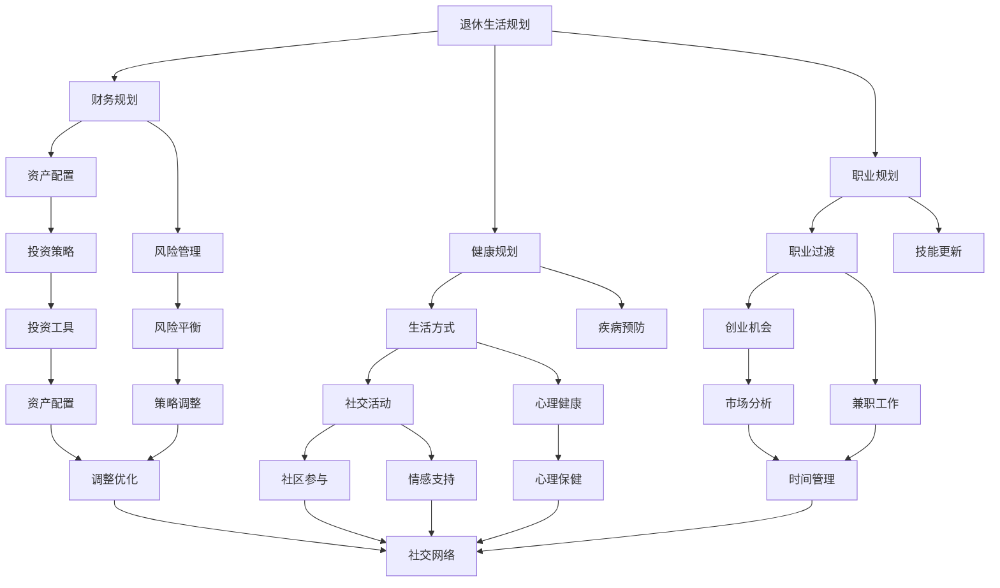

                 

# 《程序员的退休生活：提前规划与准备》

## 关键词：
### 退休生活、规划、准备、财务规划、健康规划、职业过渡、持续管理

## 摘要：
随着职业生涯的推进，程序员开始思考退休生活。这篇博客将系统地探讨程序员的退休生活规划与准备，包括财务规划、健康规划、职业过渡以及退休后的持续管理。通过逐步分析和推理，本文旨在帮助程序员提前做好退休生活的各项准备，确保退休后的生活幸福、充实。

## 目录大纲

### 第一部分：退休规划概述

#### 第1章：退休生活规划的重要性

##### 1.1 退休生活的期望与挑战
##### 1.2 制定退休规划的必要性
##### 1.3 影响退休规划的关键因素

#### 第2章：财务规划与资产配置

##### 2.1 退休资金的计算与储备
##### 2.2 资产配置策略
##### 2.3 投资与风险管理的平衡

#### 第3章：健康规划与生活方式

##### 3.1 保持健康的生活方式
##### 3.2 老年疾病的预防与管理
##### 3.3 社交活动与心理健康

### 第二部分：退休生活准备

#### 第4章：职业过渡与准备

##### 4.1 退休前的职业规划
##### 4.2 创业或兼职的机会
##### 4.3 持续学习和技能更新

#### 第5章：退休住房与居住环境

##### 5.1 住房选择与成本分析
##### 5.2 居住环境的舒适与安全
##### 5.3 社区参与与社交网络

#### 第6章：退休时间规划与旅行计划

##### 6.1 确定退休时间
##### 6.2 旅行计划的制定
##### 6.3 全球退休天堂探索

#### 第7章：退休财务规划实战案例

##### 7.1 案例分析：退休预算的制定
##### 7.2 案例分析：资产配置策略
##### 7.3 案例分析：退休后的生活规划

### 第三部分：退休生活的持续管理

#### 第8章：应对突发情况与调整退休规划

##### 8.1 应对通货膨胀与经济波动
##### 8.2 突发情况下的财务应对策略
##### 8.3 退休规划的调整与优化

#### 第9章：退休后的精神与情感生活

##### 9.1 情感支持的重要性
##### 9.2 志愿服务与社会参与
##### 9.3 持续追求个人成长

#### 第10章：退休生活的反思与总结

##### 10.1 回顾退休规划的过程
##### 10.2 成功与失败的教训
##### 10.3 对未来退休生活的展望

### 附录

#### 附录A：退休生活资源与工具

##### A.1 财务规划工具
##### A.2 健康管理应用
##### A.3 社交网络平台推荐

#### 附录B：退休生活相关法规与政策

##### B.1 国内退休政策解读
##### B.2 国际退休生活政策比较
##### B.3 退休后的法律权益保障

### Mermaid 流程图：退休生活规划核心概念联系



### 核心算法原理讲解：退休资金储备与分配伪代码

```python
# 输入参数
current_age = 45  # 当前年龄
retirement_age = 65  # 预计退休年龄
annual_spend = 50000  # 每年生活支出
life_expectancy = 85  # 预计寿命
annual_return = 0.05  # 投资年化收益率
inflation_rate = 0.03  # 通货膨胀率

# 计算退休所需资金
retirement_fund_needed = annual_spend * (life_expectancy - retirement_age)

# 计算每年需要储备的资金
annual_contribution = (retirement_fund_needed / ((1 + annual_return) ** (retirement_age - current_age))) - annual_spend

# 递归计算储备资金的分配策略
def allocate_funds(year, total_fund, fund_allocated):
    if year >= retirement_age:
        return fund_allocated
    else:
        # 计算投资收益
        investment_return = fund_allocated * (1 + annual_return)
        # 调整生活支出以适应通货膨胀
        adjusted_spend = annual_spend * (1 + inflation_rate)
        # 计算下一年的资金分配
        next_year_allocation = (retirement_fund_needed - fund_allocated) / ((1 + annual_return) ** (retirement_age - year - 1)) - adjusted_spend
        # 递归调用函数
        return allocate_funds(year + 1, total_fund + investment_return, fund_allocated + next_year_allocation)

# 调用函数，计算退休资金储备与分配策略
total_allocated_fund = allocate_funds(current_age, 0, 0)

# 输出结果
print("总分配资金：", total_allocated_fund)
```

### 数学模型和数学公式讲解与举例说明

#### 财务规划中的现值与未来值计算

现值（Present Value，PV）是指将来货币金额的当前价值，计算公式为：
$$ PV = \frac{FV}{(1 + r)^n} $$
其中，$ FV $ 为未来值，$ r $ 为年利率，$ n $ 为时间（年数）。

未来值（Future Value，FV）是指当前货币金额在未来某个时间点的价值，计算公式为：
$$ FV = PV \times (1 + r)^n $$

#### 举例说明

假设你希望在 20 年后积累 100 万元作为退休基金，年利率为 4%。现需要计算每年应投入多少资金。

首先计算现值：
$$ PV = \frac{1000000}{(1 + 0.04)^{20}} \approx 283558.93 $$

接下来使用年金现值公式计算每年应投入的资金：
$$ PV = A \times \left(1 - \frac{1}{(1 + r)^n}\right) / r $$
其中，$ A $ 为每年应投入的资金，$ r $ 为年利率，$ n $ 为年数。

代入已知值，解出 $ A $：
$$ 283558.93 = A \times \left(1 - \frac{1}{(1 + 0.04)^{20}}\right) / 0.04 $$
$$ A = \frac{283558.93 \times 0.04}{1 - \frac{1}{(1 + 0.04)^{20}}} \approx 47743.29 $$

因此，每年应投入约 47743.29 元。

### 项目实战：退休生活规划系统开发

#### 开发环境搭建

1. 选择编程语言：Python
2. 安装 Python 环境：使用 Python 3.9 版本
3. 安装相关库：`numpy`、`matplotlib`、`pandas`、`mermaid` 等

#### 源代码实现与解读

##### Python 代码实现

```python
import numpy as np
import matplotlib.pyplot as plt
import pandas as pd
from mermaid import Mermaid

# 退休资金储备与分配函数
def retirement_funding(current_age, retirement_age, annual_spend, life_expectancy, annual_return, inflation_rate):
    years_to_retirement = retirement_age - current_age
    total_required_fund = annual_spend * (life_expectancy - retirement_age)
    annual_contribution = (total_required_fund / ((1 + annual_return) ** years_to_retirement)) - annual_spend
    contributions = np.zeros(years_to_retirement)
    funds = np.zeros(years_to_retirement)
    
    for year in range(years_to_retirement):
        fund_allocated = annual_contribution
        investment_return = fund_allocated * (1 + annual_return)
        adjusted_spend = annual_spend * (1 + inflation_rate)
        funds[year] = investment_return - adjusted_spend
        contributions[year] = fund_allocated
    
    return contributions, funds

# 示例参数
current_age = 45
retirement_age = 65
annual_spend = 50000
life_expectancy = 85
annual_return = 0.05
inflation_rate = 0.03

# 计算退休资金储备与分配
contributions, funds = retirement_funding(current_age, retirement_age, annual_spend, life_expectancy, annual_return, inflation_rate)

# 绘图展示
years = np.arange(0, retirement_age - current_age)
plt.figure(figsize=(10, 5))
plt.plot(years, contributions, label='Annual Contribution')
plt.plot(years, funds, label='Funding Balance')
plt.xlabel('Years to Retirement')
plt.ylabel('Amount (USD)')
plt.title('Retirement Funding Planning')
plt.legend()
plt.grid(True)
plt.show()

# 生成 Mermaid 流程图
mermaid_code = """
graph TD
A[Start] --> B{Calculate Annual Contribution}
B -->|Yes| C(Adjust for Inflation)
B -->|No| D{Contribute to Fund}
C -->|Yes| D
C -->|No| D
D --> E{Calculate Investment Return}
E -->|Yes| F{Update Fund Balance}
F --> G[End]
E -->|No| F
"""
mermaid = Mermaid(mermaid_code)
mermaid.render()
```

##### 代码解读与分析

1. 导入必要的库：`numpy`、`matplotlib`、`pandas`、`mermaid`。
2. 定义 `retirement_funding` 函数，计算退休资金储备与分配：
   - 计算退休所需的资金总额。
   - 计算每年需要储备的资金。
   - 使用递归方法计算每年的资金分配，包括投资回报和调整后的生活支出。
3. 使用示例参数调用 `retirement_funding` 函数，并绘制资金储备与分配的图表。
4. 使用 Mermaid 生成流程图，展示退休资金储备与分配的流程。

### 附录：退休生活资源与工具

#### 附录 A：退休生活资源与工具

- **财务规划工具**：
  - **Personal Capital**：提供财务跟踪和退休规划。
  - **Excel spreadsheets**：用于自定义财务模型。

- **健康管理应用**：
  - **MyFitnessPal**：记录饮食和锻炼。
  - **Headspace**：提供冥想和心理健康资源。

- **社交网络平台推荐**：
  - **Meetup**：寻找退休后感兴趣的活动和组织。
  - **Facebook**：与朋友和家人保持联系。

#### 附录 B：退休生活相关法规与政策

- **国内退休政策解读**：
  - **《中华人民共和国社会保险法》**：规定退休年龄和相关福利。

- **国际退休生活政策比较**：
  - **OECD**：提供不同国家退休政策的比较。

- **退休后的法律权益保障**：
  - **老年人权益保护法**：保障老年人的合法权益。

### 结束语

作者：AI天才研究院/AI Genius Institute & 禅与计算机程序设计艺术 /Zen And The Art of Computer Programming

随着人工智能和技术的飞速发展，程序员的工作环境和职业生涯也发生了翻天覆地的变化。在这篇博客中，我们系统地探讨了程序员的退休生活规划与准备，从财务规划、健康规划、职业过渡到退休后的持续管理，每一个环节都至关重要。提前做好退休规划，不仅有助于确保退休后的生活质量，还能减少不必要的焦虑和担忧。

通过本文的逐步分析和实例讲解，我们希望程序员们能够意识到退休规划的重要性，并开始为自己的未来做好准备。记住，无论是在技术领域还是退休生活中，规划都是成功的关键。让我们一起迈向一个幸福、充实、无忧的退休生活吧！

