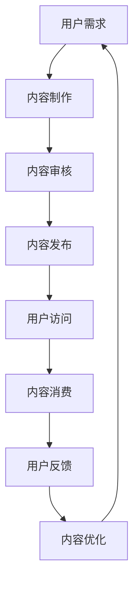
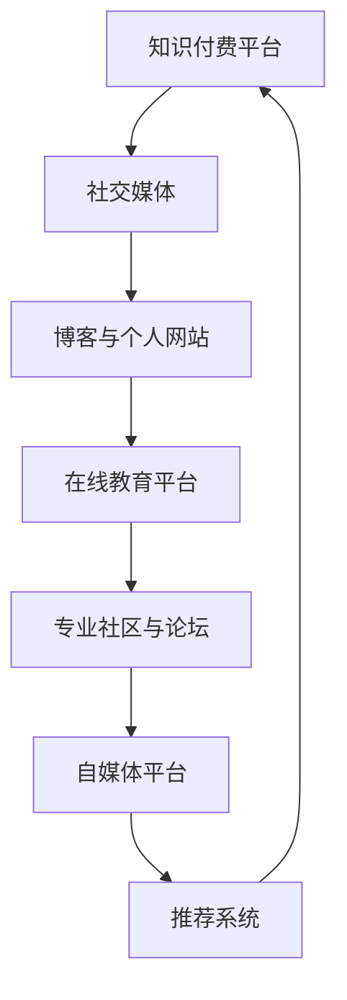

                 

### 文章标题：程序员知识付费的内容分发渠道多元化

> 关键词：知识付费、内容分发、社交媒体、在线教育、专业社区、自媒体、知识图谱、推荐系统、程序员

> 摘要：本文将深入探讨程序员知识付费领域的内容分发渠道多元化。通过分析知识付费与内容分发的概念，本文详细阐述了社交媒体、博客与个人网站、在线教育平台、专业社区与论坛、自媒体平台以及知识图谱与推荐系统的内容分发策略。结合成功案例分析，本文为程序员提供了实用的内容制作与分发指南，助力他们在知识付费市场中脱颖而出。

---

### 《程序员知识付费的内容分发渠道多元化》目录大纲

### 第一部分：知识付费与内容分发概述

#### 第1章：知识付费概述
1.1 知识付费的定义与现状
1.2 程序员知识付费的特点
1.3 知识付费的市场分析

#### 第2章：内容分发概述
2.1 内容分发的概念与类型
2.2 内容分发平台的发展趋势
2.3 程序员内容分发的需求与挑战

### 第二部分：多元化内容分发渠道

#### 第3章：社交媒体渠道
3.1 社交媒体渠道概述
3.2 微博、微信等平台的使用技巧
3.3 社交媒体渠道的推广策略

#### 第4章：博客与个人网站
4.1 博客的建立与维护
4.2 个人网站的搭建与优化
4.3 博客与网站的内容策略

#### 第5章：在线教育平台
5.1 在线教育平台概述
5.2 程序员知识付费课程的设计
5.3 在线教育平台的运营与管理

#### 第6章：专业社区与论坛
6.1 专业社区与论坛的作用
6.2 程序员专业社区的推荐
6.3 论坛内容的策划与推广

#### 第7章：自媒体平台
7.1 自媒体平台概述
7.2 程序员自媒体的运营策略
7.3 自媒体平台的内容创造与传播

#### 第8章：知识图谱与推荐系统
8.1 知识图谱的概念与应用
8.2 推荐系统的原理与实现
8.3 程序员知识付费中的推荐系统应用

### 第三部分：案例分析与实践指南

#### 第9章：成功案例分析
9.1 案例介绍
9.2 成功经验总结
9.3 案例启示与借鉴

#### 第10章：实践指南
10.1 内容制作与分发策略
10.2 用户体验与互动设计
10.3 数据分析与优化

### 附录

#### 附录A：推荐工具与资源
A.1 常用内容分发工具
A.2 知识付费平台推荐
A.3 自媒体运营资源

#### 附录B：Mermaid流程图
B.1 知识付费流程图
B.2 内容分发渠道关系图

#### 附录C：伪代码与数学公式
C.1 算法伪代码
C.2 数学公式解释与示例
C.3 公式推导与证明

---

接下来，我们将逐一深入探讨每一个章节的内容，通过逻辑清晰、结构紧凑、简单易懂的步骤，帮助程序员理解和掌握多元化的内容分发策略。

---

### 第1章：知识付费概述

#### 1.1 知识付费的定义与现状

知识付费是指用户为获取有价值的信息或知识，通过支付一定费用来购买相关服务或产品的一种商业模式。在互联网时代，知识付费成为一种新兴的盈利模式，涵盖了在线课程、专业咨询、电子书、音频讲座等多种形式。

当前，知识付费市场呈现出以下几个显著特点：

1. **市场规模不断扩大**：随着互联网普及和用户付费意识的提高，知识付费市场规模逐年攀升。据相关报告显示，2020年中国知识付费市场规模已达到1253亿元，预计未来还将保持高速增长。

2. **用户群体多样化**：知识付费用户不仅包括职场人士，还包括学生、创业者、自由职业者等各类人群。他们通过付费获取专业知识和技能，提升自我竞争力。

3. **内容形式多样化**：知识付费内容形式丰富多样，包括视频课程、直播讲座、音频教程、电子书、专业报告等。不同的内容形式满足了用户不同的学习需求。

4. **平台多元化**：知识付费平台种类繁多，包括传统的在线教育平台如网易云课堂、腾讯课堂，新兴的内容付费平台如得到、知乎Live等。各大平台纷纷通过优化用户体验、提升内容质量来吸引更多用户。

#### 1.2 程序员知识付费的特点

程序员作为知识付费市场的一个重要群体，具有以下几大特点：

1. **学习需求强烈**：程序员是技术驱动的职业，他们需要不断更新知识、掌握新技能，以适应快速变化的技术趋势。因此，程序员对于知识付费具有强烈的需求。

2. **专业性强**：程序员知识付费内容通常具有较强的专业性，涉及编程语言、框架、算法、数据库、前端技术、后端开发等多个方面。这使得程序员知识付费内容在市场上具有独特的竞争优势。

3. **互动性需求高**：程序员在学习过程中，不仅需要掌握理论知识，还需要解决实际问题。因此，他们更倾向于选择具有互动性的知识付费产品，如在线课程、问答社区等。

4. **付费意愿较高**：程序员具有较强的付费意愿，他们愿意为高质量的知识付费，以提升自身技能水平。这也是程序员知识付费市场快速增长的重要原因之一。

#### 1.3 知识付费的市场分析

1. **市场规模与增长潜力**：根据相关报告，全球知识付费市场规模已超过2000亿美元，并呈现持续增长趋势。未来，随着技术的不断进步和用户付费习惯的养成，知识付费市场将继续扩大。

2. **行业分布**：知识付费市场主要集中在在线教育、专业咨询、电子书、音频讲座等领域。其中，在线教育是知识付费市场的核心组成部分，占据了近70%的市场份额。

3. **用户行为分析**：知识付费用户呈现出以下行为特征：
   - **高粘性**：用户在购买知识付费产品后，具有较高的粘性，会持续关注和学习相关内容。
   - **碎片化学习**：用户倾向于利用碎片时间进行学习，如通勤、休息等。
   - **多平台使用**：用户通常会在多个平台进行知识付费，以获取更全面的内容和服务。

4. **市场竞争态势**：知识付费市场存在激烈的竞争，各大平台纷纷通过优化用户体验、提升内容质量、拓展服务范围等方式，争夺市场份额。同时，新兴平台和创业者也在不断涌入市场，带来新的机遇和挑战。

通过以上分析，我们可以看到，知识付费市场具有巨大的潜力和发展空间。作为程序员，了解知识付费市场的特点和发展趋势，有助于他们更好地把握市场机遇，实现内容分发和知识变现。

---

### 第2章：内容分发概述

#### 2.1 内容分发的概念与类型

内容分发（Content Distribution）是指将制作好的内容通过各种渠道和平台进行传播和推广，以吸引目标用户并实现商业价值的过程。在互联网时代，内容分发已经成为各种企业、个人和媒体获取流量和收入的重要手段。

内容分发的类型主要包括以下几种：

1. **推式分发**：推式分发是指通过主动推送的方式将内容传递给目标用户。这种方式适用于内容具有较强的时效性和针对性的场景，如新闻、热点事件等。常见的推式分发方式包括：
   - **邮件营销**：通过电子邮件向订阅用户发送内容。
   - **社交媒体推广**：在社交媒体平台上发布内容，并通过广告等方式进行推广。
   - **搜索引擎优化（SEO）**：通过优化网站内容和结构，提高在搜索引擎中的排名，吸引更多用户访问。

2. **拉式分发**：拉式分发是指用户主动获取内容的过程，这种方式主要依赖于用户的需求和兴趣。拉式分发适用于知识型、娱乐型等需要用户主动搜索的内容，如博客文章、电子书、视频等。常见的拉式分发方式包括：
   - **搜索引擎**：用户通过关键词搜索，找到并访问相关内容。
   - **社交媒体分享**：用户在社交媒体上分享内容，吸引其他用户关注和访问。
   - **推荐系统**：根据用户的兴趣和行为，自动推荐相关内容。

3. **渠道分发**：渠道分发是指通过多种渠道和平台进行内容传播，以实现更广泛的覆盖和影响。常见的渠道分发方式包括：
   - **官方网站**：企业或个人设立自己的官方网站，发布原创内容和信息。
   - **社交媒体**：在社交媒体平台上建立官方账号，发布内容并与用户互动。
   - **第三方平台**：在专业的内容分发平台（如YouTube、知乎、简书等）上发布内容，借助平台的流量和用户基础进行传播。

4. **社交分发**：社交分发是指通过社交关系网络进行内容传播，利用用户的社交行为和影响力扩大内容的传播范围。社交分发主要依赖于用户之间的互动和分享，如朋友圈、微信群等。

#### 2.2 内容分发平台的发展趋势

随着互联网技术的不断进步和用户需求的多样化，内容分发平台也在不断演变和进化。以下是当前内容分发平台的发展趋势：

1. **个性化推荐**：随着大数据和人工智能技术的发展，个性化推荐成为内容分发平台的核心竞争力。通过分析用户的兴趣和行为数据，平台可以精准地为用户提供感兴趣的内容，提高用户的粘性和满意度。

2. **多元化内容形式**：内容分发平台不再局限于传统的文本和图片，而是涵盖了视频、音频、直播等多种形式。多元化内容形式可以满足用户多样化的需求，提高用户的参与度和互动性。

3. **社交化传播**：内容分发平台逐渐重视社交化的传播方式，鼓励用户在平台上分享、评论和互动。通过社交化传播，平台可以扩大内容的传播范围，提高内容的曝光率。

4. **智能化管理**：内容分发平台通过智能化技术对内容进行管理和推荐，如自动审核、内容标签化、算法优化等。这些技术可以提高内容的质量和分发效率，降低人力成本。

5. **多元化变现方式**：内容分发平台通过多元化的变现方式，如广告、付费会员、知识付费等，实现商业价值的最大化。同时，平台也注重用户体验，通过优化产品设计和服务，提高用户的满意度和忠诚度。

#### 2.3 程序员内容分发的需求与挑战

程序员在进行内容分发时，面临着以下需求和挑战：

1. **内容专业性**：程序员内容具有较高的专业性，需要针对特定的技术领域和用户需求进行内容创作和分发。这就要求程序员具备扎实的技术功底和内容创作能力。

2. **受众群体精准**：程序员受众群体相对明确，主要集中在技术从业者、爱好者以及相关领域的专业人士。因此，程序员在内容分发时需要精准定位受众群体，提供有价值的内容。

3. **互动性需求高**：程序员在内容消费过程中，具有较强的互动需求，希望与同行交流、探讨技术问题。因此，程序员在内容分发时需要注重互动性，如开设问答社区、举办线上技术沙龙等。

4. **高质量内容**：程序员对内容质量有较高要求，希望获取高质量、实用性强、更新及时的技术知识。因此，程序员在内容创作和分发时需要注重内容的质量和实用性。

5. **技术挑战**：程序员在进行内容分发时，需要面对技术挑战，如内容平台的搭建、数据分析和处理、算法优化等。这要求程序员具备一定的技术能力和解决问题的能力。

总之，内容分发已经成为程序员获取流量和变现的重要手段。了解内容分发的概念、类型和发展趋势，以及满足程序员内容分发的需求与挑战，有助于程序员更好地进行内容创作和分发，实现个人和商业价值。

---

### 第3章：社交媒体渠道

#### 3.1 社交媒体渠道概述

社交媒体渠道是指通过社交媒体平台进行内容分发和互动的渠道，包括微博、微信、抖音、快手等。这些平台具有庞大的用户基础和高度的用户活跃度，成为程序员进行知识付费内容分发的重要渠道。

社交媒体渠道的特点如下：

1. **用户基数大**：社交媒体平台拥有数亿甚至数十亿的用户，覆盖各个年龄层、职业背景和地域，为程序员的内容分发提供了广阔的市场空间。

2. **互动性强**：社交媒体平台鼓励用户之间的互动和分享，程序员可以通过评论、私信、直播等方式与用户进行实时交流，增强内容的互动性和用户粘性。

3. **传播速度快**：社交媒体平台的用户活跃度高，内容传播速度快，程序员可以通过设置热门话题、参与讨论等方式，快速提升内容的曝光率和传播效果。

4. **形式多样**：社交媒体平台支持多种内容形式，包括文字、图片、视频、直播等，程序员可以根据不同的内容需求和用户喜好，选择合适的发布形式。

5. **数据丰富**：社交媒体平台提供丰富的数据分析工具，程序员可以通过数据分析了解用户行为、内容效果等，优化内容分发策略。

#### 3.2 微博、微信等平台的使用技巧

1. **微博平台的使用技巧**
   - **内容形式**：微博主要支持文字、图片、视频等多种内容形式。程序员可以根据自身内容特点选择合适的发布形式。例如，技术博客可以以文字和图片为主，技术视频可以以视频为主。
   - **话题标签**：微博支持话题标签，程序员可以利用热门话题标签提高内容的曝光率。例如，可以使用#编程技术#、#算法分享#等标签。
   - **互动互动**：程序员可以积极参与微博上的讨论和互动，与其他用户建立联系，扩大自身影响力。例如，可以回复评论、转发其他用户的微博等。
   - **微博营销**：微博支持微博营销，程序员可以通过设置微博广告、推广微博账号等方式，吸引更多用户关注和访问。

2. **微信平台的使用技巧**
   - **公众号运营**：微信支持公众号运营，程序员可以创建个人或企业公众号，发布技术文章、教程、案例等，为用户提供有价值的内容。
   - **微信群互动**：微信支持微信群互动，程序员可以创建技术微信群，邀请同行加入，进行技术交流和分享。例如，可以定期举办线上技术沙龙、讨论技术难题等。
   - **朋友圈推广**：微信朋友圈具有高度的用户粘性，程序员可以在朋友圈发布技术心得、案例分享等，吸引更多用户关注。
   - **小程序开发**：微信支持小程序开发，程序员可以开发技术类小程序，为用户提供便捷的服务，如在线编程练习、技术问答等。

#### 3.3 社交媒体渠道的推广策略

1. **内容质量优先**：社交媒体渠道的竞争激烈，程序员需要注重内容质量，提供有价值、有深度、有吸引力的内容，以吸引和留住用户。

2. **目标用户定位**：明确目标用户群体，了解他们的需求和兴趣，有针对性地创作和分发内容。例如，可以关注技术论坛、社群等，了解用户关注的热点话题和技术需求。

3. **互动互动互动**：积极参与社交媒体平台的互动，与其他用户建立联系，扩大自身影响力。例如，可以回复评论、私信用户、参与讨论等。

4. **合作推广**：与同行业或相关行业的公众号、博主等进行合作推广，互相推荐和分享内容，扩大内容传播范围。例如，可以邀请行业专家进行直播分享、合作撰写技术文章等。

5. **数据分析与优化**：利用社交媒体平台提供的数据分析工具，了解内容效果、用户行为等，不断优化内容分发策略。例如，可以根据用户喜好调整内容形式、发布时间等。

通过以上策略，程序员可以有效利用社交媒体渠道进行知识付费内容分发，提高内容曝光率和用户粘性，实现知识变现和商业价值。

---

### 第4章：博客与个人网站

#### 4.1 博客的建立与维护

博客（Blog）是一种以文本、图片、视频等形式表达个人观点、分享知识和经验的网络平台。对于程序员来说，博客不仅是展示个人技术能力的重要渠道，也是进行知识付费内容分发的重要途径。下面将介绍如何建立和维护一个博客。

1. **选择博客平台**

   常见的博客平台包括WordPress、Hexo、Jekyll、Typecho等。选择博客平台时，需要考虑以下几个因素：

   - **易用性**：选择一个易于操作和上手的博客平台，降低技术门槛。
   - **扩展性**：选择一个具有丰富插件和主题的博客平台，方便自定义和优化。
   - **性能和稳定性**：选择一个性能稳定、响应速度快的博客平台，提高用户体验。
   - **成本**：部分博客平台可能需要付费，需要根据自身预算进行选择。

2. **搭建博客网站**

   在选择博客平台后，按照以下步骤进行博客网站的搭建：

   - **购买域名和服务器**：购买一个适合自己的域名和云服务器，用于部署博客网站。
   - **安装博客平台**：根据所选平台的安装教程，安装博客系统并配置基本设置。
   - **选择主题和插件**：根据个人喜好和需求，选择合适的主题和插件，优化博客界面和功能。

3. **创建博客内容**

   创建博客内容是博客网站的核心，以下是一些建议：

   - **确定内容方向**：明确博客的主题和内容方向，例如编程技术、算法分析、项目实战等。
   - **撰写高质量文章**：撰写具有深度和实用性的技术文章，提供真实的技术经验和解决方案。
   - **合理使用标签和分类**：为文章添加合适的标签和分类，便于用户检索和阅读。
   - **定期更新内容**：保持博客内容的更新，吸引和维护读者群体。

4. **维护博客网站**

   博客网站需要定期维护，以下是一些建议：

   - **备份和恢复**：定期备份网站数据和文件，以防止数据丢失。
   - **更新和修复**：及时更新博客系统和插件，修复已知漏洞和错误。
   - **监控网站性能**：监控网站的访问速度、负载等性能指标，优化网站性能。
   - **互动和反馈**：积极回复读者评论和私信，建立良好的互动关系。

#### 4.2 个人网站的搭建与优化

个人网站是程序员展示个人品牌和技术实力的重要平台。一个优秀的个人网站不仅需要良好的视觉效果和用户体验，还需要在技术和内容方面进行优化。

1. **网站架构设计**

   - **明确网站目标**：在搭建个人网站之前，明确网站的目标和功能，例如展示技术博客、项目案例、个人简历等。
   - **规划网站结构**：根据网站目标，规划网站的结构和页面布局，确保网站的层次清晰、逻辑合理。

2. **前端设计与开发**

   - **选择合适的框架**：选择适合个人网站的前端开发框架，如React、Vue、Angular等。
   - **优化页面布局**：设计简洁、美观的页面布局，提高用户体验。
   - **响应式设计**：实现网站的响应式设计，适应不同设备和屏幕尺寸。

3. **后端开发与部署**

   - **选择合适的后端框架**：根据个人网站的需求，选择合适的后端框架，如Node.js、Django、Spring Boot等。
   - **数据库设计**：设计合理的数据库结构，确保数据的存储和管理高效。
   - **部署和运维**：选择合适的云服务器和部署方案，确保网站的稳定运行。

4. **SEO优化**

   - **关键词优化**：针对目标用户和关键词，进行网站内容的关键词优化。
   - **网站结构优化**：优化网站的导航结构、URL结构等，提高搜索引擎的友好度。
   - **外部链接建设**：建立外部链接，提高网站的权威性和权重。

5. **安全与性能优化**

   - **网站安全**：定期检查和修复网站的安全漏洞，防止恶意攻击和数据泄露。
   - **性能优化**：优化网站的加载速度和响应时间，提高用户体验。

#### 4.3 博客与网站的内容策略

1. **内容创作与发布**

   - **内容定位**：明确博客或网站的内容定位和受众群体，确保内容的针对性和专业性。
   - **内容规划**：制定内容发布计划，确保内容的连续性和更新频率。
   - **内容质量**：注重内容质量，提供有价值、有深度、有启发性的技术文章。

2. **互动与反馈**

   - **鼓励评论和互动**：在博客或网站上设置评论功能，鼓励读者发表意见和反馈。
   - **定期回复评论**：及时回复读者的评论和私信，建立良好的互动关系。
   - **举办活动**：举办线上活动，如技术分享、问答环节等，增加用户的参与度。

3. **内容推广**

   - **社交媒体推广**：利用社交媒体平台，如微博、微信、抖音等，推广博客或网站的内容。
   - **合作与互推**：与其他博客或网站进行合作，互相推广内容，扩大影响力。
   - **搜索引擎优化**：通过SEO优化，提高博客或网站在搜索引擎中的排名，吸引更多用户。

通过以上策略，程序员可以有效地建立和维护博客与个人网站，展示个人技术实力，进行知识付费内容分发，实现个人和商业价值的提升。

---

### 第5章：在线教育平台

#### 5.1 在线教育平台概述

在线教育平台是一种基于互联网的教育服务模式，通过线上课程、直播讲座、互动问答等方式，为学习者提供丰富的学习资源和互动体验。随着互联网技术的快速发展，在线教育平台已经成为教育行业的重要组成部分，吸引了大量用户和投资。

在线教育平台的特点如下：

1. **灵活性强**：在线教育平台不受时间和地点的限制，用户可以根据自己的需求和兴趣，灵活安排学习时间和方式。

2. **资源丰富**：在线教育平台提供了丰富的学习资源，包括视频课程、电子书、文档资料等，涵盖了各个领域和层次的知识。

3. **互动性强**：在线教育平台支持师生互动和学员之间的互动，通过直播、讨论区、问答等方式，促进学习者的积极参与和深入交流。

4. **个性化推荐**：通过大数据分析和人工智能技术，在线教育平台可以根据学习者的兴趣、行为和成绩，推荐适合的学习内容和课程。

5. **成本较低**：在线教育平台降低了学习成本，用户无需支付高昂的学费和住宿费用，即可享受到高质量的教育资源。

#### 5.2 程序员知识付费课程的设计

程序员知识付费课程的设计需要充分考虑程序员的职业特点和需求，以下是一些建议：

1. **课程内容定位**

   - **专业领域**：明确课程的专业领域，如前端开发、后端开发、数据库、算法等，确保课程内容的专业性和针对性。
   - **难度层次**：根据程序员的技能水平和学习需求，设计不同难度层次的课程，如基础课程、进阶课程、高级课程等。

2. **课程结构设计**

   - **模块化**：将课程内容分为多个模块，每个模块涵盖一个特定的知识点或技能，便于学习者逐步学习和掌握。
   - **实战案例**：结合实际项目案例，讲解知识点和技能的应用，提高学习者的实践能力和解决问题的能力。

3. **课程内容形式**

   - **视频课程**：视频课程是程序员知识付费课程的主要形式，通过清晰的讲解和生动的演示，帮助学习者更好地理解和掌握知识点。
   - **文档资料**：提供配套的文档资料，包括课程讲义、代码示例、项目指南等，便于学习者查阅和学习。
   - **互动环节**：设置互动环节，如问答、讨论、作业等，鼓励学习者积极参与，加深对知识点的理解和掌握。

4. **课程更新与维护**

   - **持续更新**：随着技术的发展和市场的变化，课程内容需要不断更新和优化，确保知识的时效性和实用性。
   - **学员反馈**：收集学员的反馈意见，根据学员的需求和建议，调整课程内容和教学方法。

#### 5.3 在线教育平台的运营与管理

在线教育平台的运营和管理是确保平台稳定运行和持续发展的重要环节，以下是一些建议：

1. **平台技术支持**

   - **稳定性**：确保平台系统的稳定性，提供高速、安全、稳定的访问体验。
   - **扩展性**：根据业务需求，平台应具备良好的扩展性，支持课程数量和用户规模的不断扩大。
   - **安全性**：加强平台的安全管理，防止黑客攻击和数据泄露，保障用户信息和课程的隐私安全。

2. **课程质量监控**

   - **课程评审**：建立课程评审机制，对课程的内容、形式和质量进行评估，确保课程的专业性和实用性。
   - **讲师管理**：对讲师进行严格的筛选和管理，确保讲师的专业能力和教学水平。
   - **学员反馈**：收集学员的反馈意见，对课程质量进行持续改进和优化。

3. **市场推广与运营**

   - **市场调研**：通过市场调研，了解用户需求和市场趋势，制定相应的市场推广策略。
   - **内容营销**：通过优质的内容营销，吸引潜在用户关注和加入平台。
   - **合作与联盟**：与其他在线教育平台、培训机构、企业等进行合作和联盟，扩大平台的影响力和市场份额。

4. **用户服务与支持**

   - **客服体系**：建立完善的客服体系，提供全天候、多渠道的用户服务与支持，解决用户在使用过程中遇到的问题。
   - **用户互动**：鼓励用户参与平台互动，如开设问答社区、举办线上活动等，增强用户粘性。
   - **用户反馈**：及时收集和反馈用户的意见和建议，不断优化平台的服务和体验。

通过以上措施，在线教育平台可以确保稳定运行和持续发展，为程序员提供高质量的知识付费课程和服务。

---

### 第6章：专业社区与论坛

#### 6.1 专业社区与论坛的作用

专业社区与论坛在程序员知识付费内容分发中发挥着重要作用，以下是其主要作用：

1. **知识分享与交流**：专业社区与论坛为程序员提供了一个开放、自由的交流平台，他们可以在这里分享自己的知识、经验和见解，与其他程序员交流技术问题，共同学习进步。

2. **技术支持与问题解决**：在专业社区与论坛中，程序员可以提出自己在工作中遇到的技术难题，获取其他程序员的帮助和建议，快速解决问题，提高工作效率。

3. **技能提升与学习资源**：专业社区与论坛提供了丰富的学习资源和教程，程序员可以通过阅读和讨论，了解最新的技术趋势和开发技巧，提升自身技能水平。

4. **职业发展机会**：专业社区与论坛是一个展示程序员技术实力和职业能力的平台，程序员可以通过积极参与讨论、分享优质内容，吸引潜在雇主和合作伙伴的关注，拓宽职业发展道路。

5. **建立人脉与社交网络**：专业社区与论坛为程序员提供了一个建立和维护社交网络的场所，他们可以结识同行、专家和行业领袖，拓展人脉资源，为未来的职业发展奠定基础。

#### 6.2 程序员专业社区的推荐

以下是一些值得推荐的程序员专业社区与论坛：

1. **Stack Overflow**：Stack Overflow 是全球最大的编程问答社区，程序员可以在这里提问、回答问题，分享技术心得。其独特的问答机制和高质量的内容使其成为程序员获取技术支持和解决问题的首选平台。

2. **GitHub**：GitHub 是一个基于 Git 的版本控制系统和开源代码托管平台，程序员可以在这里发现、贡献和分享开源项目。GitHub 上的项目讨论区提供了丰富的学习资源和交流机会。

3. **CSDN**：CSDN 是中国最大的 IT 技术社区和软件开发者交流学习平台，拥有海量的技术文章、博客和问答，涵盖了各个编程语言和技术领域。

4. **V2EX**：V2EX 是一个关于分享和探索的地方，主要关注互联网、技术、创意等领域的讨论。V2EX 的社区氛围活跃，程序员可以在这里发现有趣的项目和技术动态。

5. **InfoQ**：InfoQ 是一个专注于软件研发、架构设计、项目管理等领域的在线社区，提供高质量的技术文章、演讲视频和会议报道。

#### 6.3 论坛内容的策划与推广

为了有效地策划和推广专业社区与论坛的内容，可以采取以下策略：

1. **内容定位与主题明确**：明确社区或论坛的内容主题和定位，确保内容的专业性和针对性，吸引目标用户。

2. **优质内容创作**：创作高质量、有深度的技术文章和教程，提供实际案例和解决方案，满足程序员的学习和交流需求。

3. **互动与参与**：鼓励用户参与社区讨论，提供问题解答、技术分享、代码调试等互动服务，增强用户粘性。

4. **活动策划**：定期举办线上或线下活动，如技术沙龙、编程比赛、讲座等，吸引更多用户参与，提升社区活跃度。

5. **合作伙伴关系**：与其他专业社区、培训机构、企业等建立合作关系，共享资源和用户，扩大社区影响力。

6. **SEO优化**：通过搜索引擎优化，提高社区在搜索引擎中的排名，吸引更多潜在用户。

通过以上策略，专业社区与论坛可以有效地策划和推广内容，吸引和留住程序员用户，为知识付费内容分发提供有力支持。

---

### 第7章：自媒体平台

#### 7.1 自媒体平台概述

自媒体平台是指个人或小团队通过互联网创建和发布内容，与用户互动，实现信息传播和商业变现的网络平台。随着互联网技术的快速发展，自媒体已经成为一种重要的内容创作和分发方式，吸引了大量用户和创作者。

自媒体平台的特点如下：

1. **个性化强**：自媒体平台为用户提供了丰富的创作工具和形式，如文字、图片、视频、音频等，创作者可以根据自己的兴趣和专业领域，自由创作和表达。

2. **门槛低**：与传统媒体相比，自媒体平台的创作和发布门槛较低，创作者无需依赖传统媒体的渠道和资源，即可直接面向用户。

3. **互动性强**：自媒体平台鼓励用户互动和评论，创作者可以实时了解用户反馈，与用户建立更紧密的关系。

4. **传播范围广**：自媒体平台具有广泛的用户基础和传播渠道，创作者的内容可以快速传播，触达更多的目标用户。

5. **变现能力强**：自媒体平台提供了多种变现方式，如广告、知识付费、品牌合作等，创作者可以通过内容获得收益。

#### 7.2 程序员自媒体的运营策略

1. **内容定位与规划**

   - **明确目标受众**：明确自媒体的目标受众，如技术从业者、爱好者、学生等，确保内容的专业性和针对性。
   - **制定内容规划**：根据目标受众的需求和兴趣，制定内容发布计划，确保内容的持续性和连贯性。

2. **内容创作与形式**

   - **多样化内容形式**：结合自身优势，创作多样化的内容形式，如技术文章、视频教程、直播讲座等。
   - **高质量内容**：注重内容质量，提供有价值、有深度、有启发性的技术知识，提升用户满意度。
   - **互动与分享**：鼓励用户互动和分享，提高内容的传播效果和用户粘性。

3. **渠道拓展与传播**

   - **多平台运营**：在多个自媒体平台上开设账号，扩大内容传播范围，提高影响力。
   - **合作与互推**：与其他自媒体、技术社区、企业等进行合作，互相推广内容，吸引更多用户。

4. **品牌建设与定位**

   - **打造个人品牌**：通过持续创作高质量内容，树立个人技术权威形象，提高知名度。
   - **明确品牌定位**：根据自身特点和目标受众，明确自媒体的品牌定位，确保内容的统一性和专业性。

5. **数据分析与优化**

   - **数据监测**：利用数据分析工具，监测内容效果、用户行为等数据，了解用户需求和喜好。
   - **优化策略**：根据数据分析结果，调整内容策略，提高内容质量和传播效果。

#### 7.3 自媒体平台的内容创造与传播

1. **内容创作技巧**

   - **选题与策划**：根据目标受众的需求和兴趣，选择具有话题性、实用性和启发性的选题，制定详细的策划方案。
   - **结构清晰**：确保文章结构清晰、逻辑严密，便于用户理解和阅读。
   - **语言简练**：使用简洁、生动的语言，提高内容的可读性和吸引力。

2. **内容传播策略**

   - **社交媒体推广**：利用微博、微信、抖音等社交媒体平台，发布内容摘要、图片、视频等，提高内容曝光率。
   - **SEO优化**：通过搜索引擎优化，提高内容在搜索引擎中的排名，吸引更多用户访问。
   - **内容合作**：与其他自媒体、博主、大V等进行内容合作，互相推广，扩大传播范围。

3. **互动与反馈**

   - **鼓励互动**：在自媒体平台上设置互动功能，如评论、私信、问答等，鼓励用户参与讨论和互动。
   - **及时回复**：及时回复用户的评论和私信，建立良好的互动关系，提高用户满意度。

4. **内容更新与维护**

   - **定期更新**：保持内容的持续更新，确保用户持续关注和参与。
   - **内容优化**：根据用户反馈和数据分析，对内容进行优化和调整，提高内容质量和传播效果。

通过以上策略，程序员可以在自媒体平台上成功创造和传播内容，吸引和留住目标用户，实现个人和商业价值的提升。

---

### 第8章：知识图谱与推荐系统

#### 8.1 知识图谱的概念与应用

知识图谱（Knowledge Graph）是一种结构化的语义知识库，通过实体、属性和关系的网络结构，对现实世界中的知识和信息进行组织和表示。知识图谱的核心思想是将信息以图谱的形式呈现，使得计算机能够理解和处理复杂的关系和数据。

知识图谱的应用范围广泛，主要包括以下几个方面：

1. **搜索引擎优化**：通过知识图谱，搜索引擎可以更好地理解用户的查询意图，提供更精准的搜索结果。例如，当用户搜索“北京”时，搜索引擎不仅返回与地理位置相关的信息，还会返回与北京相关的新闻、文化、旅游景点等。

2. **推荐系统**：知识图谱可以用于构建推荐系统，通过实体和关系的分析，为用户提供个性化的推荐。例如，在电子商务平台上，知识图谱可以帮助推荐与用户兴趣相关的商品、服务或内容。

3. **知识管理**：知识图谱可以帮助企业和组织更好地管理和利用内部知识资源，通过实体和关系的关联，实现知识的共享和传递。

4. **智能问答**：知识图谱可以为智能问答系统提供丰富的语义信息，使得问答系统能够理解和回答更加复杂和灵活的问题。

5. **自然语言处理**：知识图谱可以用于自然语言处理任务，如文本分类、情感分析、实体识别等，通过图谱中的实体和关系，提高处理结果的准确性和效率。

#### 8.2 推荐系统的原理与实现

推荐系统（Recommendation System）是一种信息过滤技术，通过分析用户的兴趣、行为和偏好，为用户推荐可能感兴趣的内容、商品或服务。推荐系统可以分为基于内容的推荐（Content-based Recommendation）和协同过滤推荐（Collaborative Filtering）两种主要类型。

1. **基于内容的推荐**

   基于内容的推荐通过分析内容特征和用户兴趣，为用户推荐相似的内容。其基本原理如下：

   - **内容特征提取**：对内容进行特征提取，如文本、图片、音频等，构建内容特征向量。
   - **用户兴趣建模**：通过用户的历史行为数据，如浏览记录、购买记录等，构建用户兴趣模型。
   - **内容相似度计算**：计算内容特征向量之间的相似度，推荐与用户兴趣相似的内容。

2. **协同过滤推荐**

   协同过滤推荐通过分析用户之间的行为相似性，为用户推荐其他用户喜欢的内容。其基本原理如下：

   - **用户行为数据收集**：收集用户的行为数据，如浏览、购买、评价等。
   - **用户相似度计算**：计算用户之间的相似度，通常采用用户基于行为的数据进行计算。
   - **推荐生成**：根据用户相似度和内容相似度，生成推荐列表。

#### 8.3 程序员知识付费中的推荐系统应用

在程序员知识付费领域，推荐系统可以发挥重要作用，以下是一些应用场景：

1. **课程推荐**：根据程序员的兴趣、学习历史和技能水平，推荐适合的课程和教程，提高学习效果和课程转化率。

2. **内容推荐**：在博客、论坛等平台，根据程序员的浏览记录和关注内容，推荐相关的文章、讨论和资源，增加用户粘性。

3. **项目推荐**：在项目托管平台，根据程序员的技能和项目需求，推荐适合的项目，帮助程序员找到合适的工作机会。

4. **知识图谱构建**：通过分析程序员的技能图谱和知识结构，构建个人知识图谱，为用户提供个性化的学习路径和成长建议。

通过知识图谱和推荐系统的应用，程序员可以更好地了解用户需求，提供精准的内容和服务，提高用户满意度和参与度，实现知识付费业务的增长和可持续发展。

---

### 第9章：成功案例分析

#### 9.1 案例介绍

在本章节中，我们将分析两个成功案例：一位独立开发者通过博客进行知识付费，以及一家在线教育平台如何利用社交媒体和推荐系统实现快速增长。

#### 9.2 成功经验总结

1. **独立开发者的博客知识付费案例**

   - **内容创作策略**：该独立开发者专注于前端开发领域，撰写高质量的技术文章，包括教程、实战案例和代码解析。他定期更新博客，保持内容的新鲜度和专业性。
   - **社交媒体推广**：他在微博、微信公众号等社交媒体平台上积极推广自己的博客文章，利用热点话题和营销活动吸引流量。
   - **互动与反馈**：他鼓励读者在博客下方留言和评论，及时回复读者的问题和反馈，建立良好的互动关系。
   - **知识付费产品**：他推出了付费课程和电子书，通过内容的高质量和实用性，赢得了用户的信任和购买意愿。

2. **在线教育平台案例**

   - **内容质量**：该在线教育平台专注于编程和人工智能领域，邀请了多位行业专家和讲师，提供高质量的课程内容。
   - **社交媒体营销**：平台通过微博、抖音等社交媒体平台发布课程资讯和亮点，吸引潜在用户。
   - **推荐系统**：平台利用推荐系统，根据用户的学习历史和兴趣，推荐适合的课程，提高用户满意度和转化率。
   - **用户服务**：平台提供了完善的用户服务，包括课程答疑、作业批改等，提升了用户的学习体验。

#### 9.3 案例启示与借鉴

1. **内容质量是核心**：无论是博客知识付费还是在线教育平台，高质量的内容是吸引和留住用户的关键。内容应具有专业性和实用性，能够解决用户实际问题。

2. **社交媒体推广**：利用社交媒体平台，扩大内容的传播范围，吸引更多潜在用户。通过互动和反馈，建立良好的用户关系。

3. **个性化推荐**：推荐系统能够提高用户满意度和转化率，根据用户兴趣和行为，提供个性化的推荐。

4. **用户服务**：提供优质的用户服务，如课程答疑、作业批改等，提升用户的学习体验和满意度。

通过分析这些成功案例，程序员可以借鉴其经验，优化自己的内容创作和分发策略，实现知识付费业务的增长和成功。

---

### 第10章：实践指南

#### 10.1 内容制作与分发策略

1. **内容制作策略**

   - **明确目标受众**：在制作内容前，首先要明确目标受众，了解他们的需求和兴趣，确保内容的专业性和针对性。
   - **选题策划**：选择具有话题性、实用性和启发性的选题，确保内容的新鲜度和吸引力。
   - **内容结构**：确保文章结构清晰、逻辑严密，便于用户理解和阅读。使用标题党、列表、段落等元素，提高内容的可读性。
   - **内容形式多样化**：结合不同内容形式，如文字、图片、视频等，丰富内容表现形式，满足用户多样化的需求。

2. **内容分发策略**

   - **多渠道分发**：通过多个渠道和平台进行内容分发，如社交媒体、博客、论坛、在线教育平台等，扩大内容的传播范围。
   - **社交媒体推广**：利用社交媒体平台，如微博、微信、抖音等，发布内容摘要、图片、视频等，提高内容曝光率。
   - **合作与互推**：与其他自媒体、博主、大V等进行合作，互相推广内容，扩大传播范围。
   - **SEO优化**：通过搜索引擎优化，提高内容在搜索引擎中的排名，吸引更多用户访问。

#### 10.2 用户体验与互动设计

1. **用户体验优化**

   - **界面设计**：设计简洁、美观的界面，提高用户的使用体验。确保页面加载速度快、导航清晰。
   - **内容易读性**：使用简洁、生动的语言，提高内容的可读性。使用标题、段落、列表等元素，使内容结构清晰。
   - **适应性设计**：实现网站的响应式设计，适应不同设备和屏幕尺寸，提高用户的访问体验。

2. **互动设计**

   - **评论功能**：在博客、论坛等平台上设置评论功能，鼓励用户发表意见和反馈，增强用户参与感。
   - **问答环节**：开设问答社区或论坛，解答用户问题，提供技术支持，建立良好的互动关系。
   - **活动策划**：定期举办线上活动，如技术分享、问答环节等，提高用户参与度。

#### 10.3 数据分析与优化

1. **数据分析**

   - **用户行为分析**：通过数据分析工具，监测用户的行为数据，如访问量、点击率、转化率等，了解用户需求和兴趣。
   - **内容效果分析**：分析内容的效果，如阅读量、点赞量、评论量等，评估内容的质量和受欢迎程度。
   - **推荐效果分析**：对推荐系统的效果进行分析，如推荐准确率、用户满意度等，优化推荐策略。

2. **优化策略**

   - **内容优化**：根据用户反馈和数据分析，对内容进行优化和调整，提高内容质量和用户满意度。
   - **推荐系统优化**：通过数据分析，优化推荐算法和推荐策略，提高推荐准确率和用户满意度。
   - **用户体验优化**：根据用户反馈和数据分析，优化用户体验，提高用户访问量和留存率。

通过以上实践指南，程序员可以更好地进行内容制作和分发，优化用户体验和互动设计，实现数据分析和优化，提升知识付费业务的成果和效果。

---

### 附录A：推荐工具与资源

#### A.1 常用内容分发工具

1. **内容管理系统（CMS）**：
   - **WordPress**：一个广泛使用的开源CMS，适合建立个人博客和网站。
   - **Joomla**：一个功能强大的开源CMS，适合构建企业级网站。
   - **Drupal**：一个灵活的开源CMS，适合构建复杂和高度定制化的网站。

2. **社交媒体管理工具**：
   - **Hootsuite**：一个多平台社交媒体管理工具，帮助用户管理多个社交媒体账号。
   - **Buffer**：一个社交媒体内容发布和管理工具，帮助用户优化发布时间。

3. **数据分析工具**：
   - **Google Analytics**：一个免费的网站分析工具，提供详细的数据报告和用户行为分析。
   - **Mixpanel**：一个高级的数据分析工具，专注于用户行为分析和产品优化。

#### A.2 知识付费平台推荐

1. **网易云课堂**：一个国内知名的在线教育平台，提供丰富的编程和技术课程。
2. **知乎Live**：知乎推出的知识分享平台，涵盖多个领域，包括技术、职场、生活等。
3. **慕课网**：一个专注于编程和技术教育的在线学习平台，提供多种编程语言和技术的课程。

#### A.3 自媒体运营资源

1. **微信公众号**：一个广泛使用的自媒体平台，适合发布文字、图片、视频等多种形式的内容。
2. **知乎**：一个知识分享社区，适合发布高质量的技术文章和问答。
3. **简书**：一个文学和内容创作平台，适合发布散文、随笔等类型的内容。

通过以上工具和资源的推荐，程序员可以更加高效地制作、分发和管理内容，提升知识付费业务的效果和成果。

---

### 附录B：Mermaid流程图

#### B.1 知识付费流程图



#### B.2 内容分发渠道关系图



通过以上Mermaid流程图，我们可以清晰地看到知识付费从用户需求到内容消费的完整流程，以及不同内容分发渠道之间的关系。

---

### 附录C：伪代码与数学公式

#### C.1 算法伪代码

```plaintext
算法：推荐系统中的相似度计算

输入：用户U和物品I的特征向量
输出：相似度评分

function calculate_similarity(U, I):
    1. 计算用户U和物品I的特征向量点积：dot_product = dot(U, I)
    2. 计算用户U和物品I的特征向量长度：norm_U = norm(U), norm_I = norm(I)
    3. 计算相似度评分：similarity_score = dot_product / (norm_U * norm_I)
    4. 返回相似度评分
end function
```

#### C.2 数学公式解释与示例

1. **点积公式**：

   $$ \text{dot\_product} = \sum_{i=1}^{n} U_i \times I_i $$

   其中，$U_i$ 和 $I_i$ 分别表示用户 $U$ 和物品 $I$ 的第 $i$ 个特征值。

2. **余弦相似度公式**：

   $$ \text{cosine\_similarity} = \frac{\text{dot\_product}}{\|\text{U}\| \times \|\text{I}\|} $$

   其中，$\|\text{U}\|$ 和 $\|\text{I}\|$ 分别表示用户 $U$ 和物品 $I$ 的特征向量长度。

#### C.3 公式推导与证明

推导余弦相似度公式：

- 点积公式：

  $$ \text{dot\_product} = \sum_{i=1}^{n} U_i \times I_i $$

- 向量长度公式：

  $$ \|\text{U}\| = \sqrt{\sum_{i=1}^{n} U_i^2} $$
  $$ \|\text{I}\| = \sqrt{\sum_{i=1}^{n} I_i^2} $$

- 余弦相似度定义：

  $$ \text{cosine\_similarity} = \frac{\text{dot\_product}}{\|\text{U}\| \times \|\text{I}\|} $$

  将点积公式和向量长度公式代入余弦相似度定义中，得到：

  $$ \text{cosine\_similarity} = \frac{\sum_{i=1}^{n} U_i \times I_i}{\sqrt{\sum_{i=1}^{n} U_i^2} \times \sqrt{\sum_{i=1}^{n} I_i^2}} $$

  经过化简，得到余弦相似度公式：

  $$ \text{cosine\_similarity} = \frac{\text{dot\_product}}{\|\text{U}\| \times \|\text{I}\|} $$

通过以上推导，我们验证了余弦相似度公式的正确性。

---

在本文中，我们系统地探讨了程序员知识付费的内容分发渠道多元化。从知识付费的定义与现状，到内容分发的概念与类型，再到多元化内容分发渠道的具体策略，我们逐步分析了社交媒体、博客与个人网站、在线教育平台、专业社区与论坛、自媒体平台以及知识图谱与推荐系统的作用和实施方法。通过成功案例分析，我们总结了实践经验，为程序员提供了实用的内容制作与分发指南。

随着技术的不断进步和用户需求的多样化，知识付费市场将继续发展壮大。程序员需要紧跟市场趋势，灵活运用多元化的内容分发渠道，提高内容质量和用户体验，实现知识变现和商业价值的最大化。同时，数据分析和优化将成为关键，帮助程序员不断调整和优化内容分发策略，提升内容效果和用户满意度。

未来，随着人工智能、大数据等技术的深入应用，知识付费内容分发渠道将更加智能化和个性化。程序员应积极拥抱新技术，探索新的内容分发模式，为用户提供更加精准和高效的学习资源和体验。

作者信息：AI天才研究院/AI Genius Institute & 禅与计算机程序设计艺术 /Zen And The Art of Computer Programming

通过本文的深入分析和探讨，我们希望为程序员在知识付费领域的内容分发提供有益的参考和启示，助力他们在激烈的市场竞争中脱颖而出。

