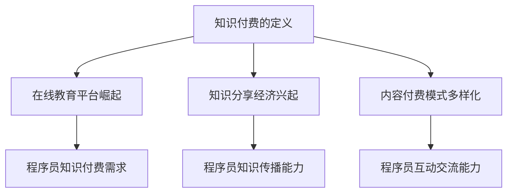
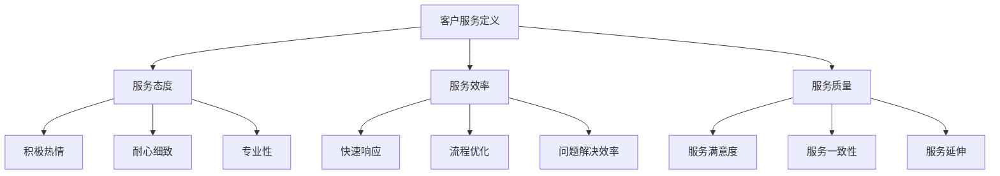
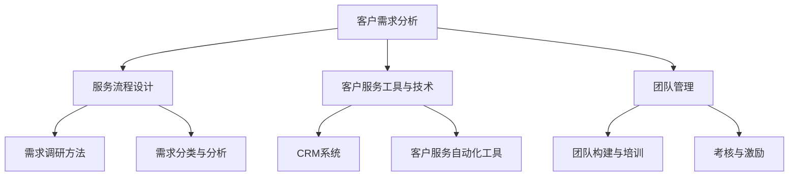
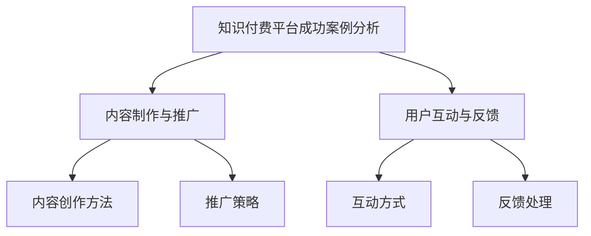
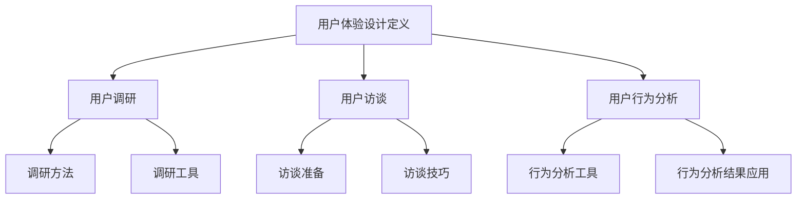
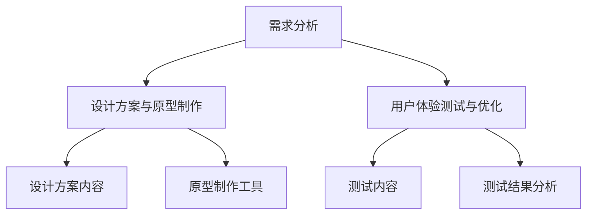
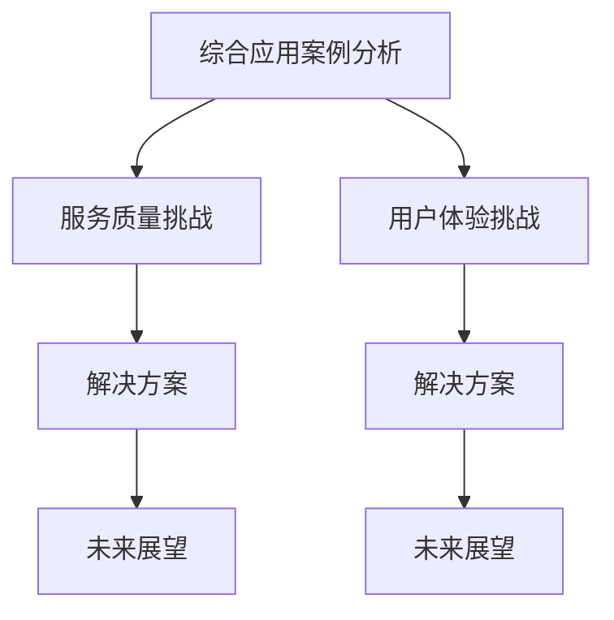
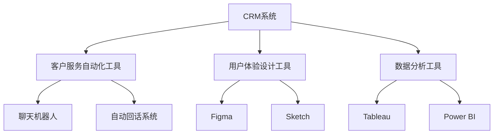
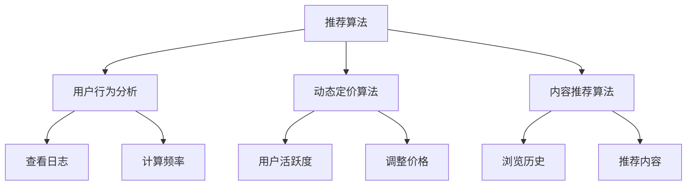
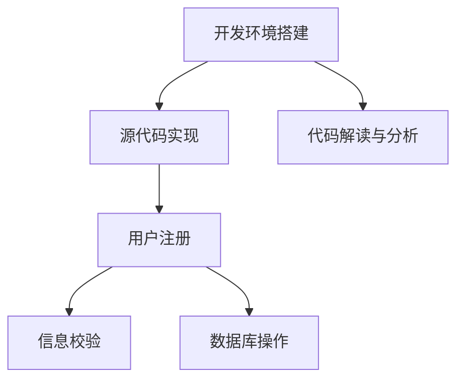

                 

# 文章标题：程序员知识付费的客户服务与用户体验

> 关键词：知识付费、客户服务、用户体验、程序员、在线教育、案例分析

> 摘要：
本文旨在探讨程序员在知识付费领域的客户服务与用户体验。首先，我们回顾了知识付费的发展历程，阐述了其在程序员群体中的角色和需求。随后，文章深入探讨了客户服务的基础知识，包括定义、目标和关键要素。接着，我们分析了客户服务策略与实践，包括客户需求分析、服务流程设计、服务工具与技术以及团队管理。文章还介绍了用户体验设计的基础和方法，包括用户调研、访谈和行为分析。通过综合案例分析和问题解决，本文为程序员知识付费的客户服务与用户体验提供了实用策略和未来展望。

----------------------------------------------------------------

## 第1章：知识付费概述

### 1.1 知识付费的发展历程

#### 1.1.1 知识付费的定义

知识付费是指用户为获取特定知识或技能所支付的费用。这一概念的出现源于互联网的普及和在线教育的兴起。知识付费的主要形式包括在线课程、电子书、专业咨询、研讨会等。

#### 1.1.2 知识付费的兴起与趋势

1. **在线教育平台的崛起**：随着互联网技术的发展，在线教育平台如雨后春笋般涌现，如Coursera、Udemy、edX等，这些平台提供了丰富的课程资源，满足了不同用户的需求。
2. **知识分享经济的兴起**：知识分享经济是一种新兴的经济模式，它强调个人知识的价值，通过平台实现知识的共享和流通。
3. **内容付费模式的多样化**：内容付费模式从最初的课程购买，逐渐发展到会员订阅、付费问答、内容打赏等多种形式。

### 1.2 程序员在知识付费中的角色

#### 1.2.1 程序员的知识付费需求

1. **技能提升需求**：程序员希望通过付费学习获取最新的技术知识和技能，以提升个人竞争力。
2. **职业发展需求**：程序员希望通过知识付费实现职业晋升，如从初级开发到高级开发，从开发到管理岗位的转变。
3. **项目经验交流需求**：程序员希望通过付费平台与其他程序员交流项目经验，解决实际工作中的问题。

#### 1.2.2 程序员的知识付费能力

1. **内容创作能力**：程序员具备一定的编程能力和技术知识，能够创作高质量的技术内容。
2. **知识传播能力**：程序员通过在线平台分享自己的知识和经验，帮助他人提升技术水平。
3. **互动交流能力**：程序员善于利用网络平台进行互动交流，解决用户的问题和需求。

### 总结

知识付费作为一种新兴的经济模式，在程序员群体中得到了广泛的应用。程序员既是知识付费的受益者，也是知识付费的提供者。他们通过付费学习提升技能，通过知识传播实现个人价值。

### Mermaid 流程图



## 第2章：客户服务基础

### 2.1 客户服务的定义与目标

#### 2.1.1 客户服务的定义

客户服务是指企业为满足客户需求而提供的支持和服务。它包括售前咨询、售中支持和售后支持等环节。客户服务的核心目标是提高客户满意度、提升客户忠诚度和促进客户转化率。

#### 2.1.2 客户服务的目标

1. **提高客户满意度**：通过优质的服务体验，使客户对企业的服务感到满意。
2. **提升客户忠诚度**：通过持续的服务和关怀，使客户对企业产生依赖和信任。
3. **促进客户转化率**：通过有效的客户服务，促使潜在客户转化为实际购买者。

### 2.2 客户服务的关键要素

#### 2.2.1 服务态度

1. **积极热情**：客户服务人员应具备积极向上的态度，对客户的需求充满热情。
2. **耐心细致**：面对客户的疑问和问题，客户服务人员应表现出耐心和细致，确保问题得到妥善解决。
3. **专业性强**：客户服务人员应具备专业的知识和技能，能够快速准确地解决客户问题。

#### 2.2.2 服务效率

1. **快速响应**：客户服务人员应在收到客户咨询后迅速作出回应，避免延迟。
2. **流程优化**：企业应不断优化服务流程，减少不必要的环节，提高服务效率。
3. **问题解决效率**：客户服务人员应具备快速解决问题的能力，确保客户问题得到及时解决。

#### 2.2.3 服务质量

1. **服务满意度**：客户服务人员应通过优质的服务，使客户对企业的服务满意度达到较高水平。
2. **服务一致性**：企业应确保不同客户服务人员提供的服务质量一致，避免出现服务差异。
3. **服务延伸**：企业应提供延伸服务，如客户回访、售后关怀等，进一步提升客户满意度。

### 总结

客户服务是企业与客户之间的重要桥梁，其质量直接影响企业的声誉和业务发展。通过优化服务态度、提高服务效率和提升服务质量，企业可以提供更加优质的客户服务，从而赢得客户的信任和忠诚。

### Mermaid 流程图



## 第3章：客户服务策略

### 3.1 客户服务策略的设计

#### 3.1.1 客户需求分析

1. **需求调研方法**：企业应通过问卷调查、用户访谈、焦点小组讨论等方式，了解客户的需求和痛点。
2. **需求分类与分析**：将收集到的需求进行分类，分析其重要性和优先级，为后续服务设计提供依据。

#### 3.1.2 服务流程设计

1. **服务流程优化**：对现有的服务流程进行评估和优化，去除不必要的环节，提高服务效率。
2. **服务节点设置**：根据客户需求，设置关键的服务节点，确保服务流程的连贯性和完整性。

### 3.2 客户服务工具与技术

#### 3.2.1 客户关系管理系统（CRM）

1. **功能特点**：CRM系统具备客户信息管理、销售管理、市场营销管理、服务管理等功能，有助于企业全面掌握客户信息，提高客户服务质量。
2. **实施与应用**：企业应根据自身需求选择合适的CRM系统，并对其进行实施和应用，以提升客户服务水平。

#### 3.2.2 客户服务自动化工具

1. **常见类型**：客户服务自动化工具包括聊天机器人、自动回话系统、自动标记系统等。
2. **优势与局限性**：客户服务自动化工具可以提高服务效率，降低人力成本，但其局限性在于无法完全替代人工服务，对于复杂问题的处理仍需人工介入。

### 3.3 客户服务团队管理

#### 3.3.1 团队构建与培训

1. **团队建设策略**：企业应构建专业的客户服务团队，并进行定期的培训和技能提升。
2. **培训内容与方法**：培训内容应包括专业知识、服务技巧、沟通能力等，培训方法可以采用在线培训、现场培训、案例研讨等。

#### 3.3.2 考核与激励

1. **考核指标设定**：企业应设定明确的考核指标，如服务满意度、问题解决率、客户回访率等，以评估客户服务团队的工作表现。
2. **激励措施设计**：企业应设计合理的激励措施，如绩效奖金、晋升机会、培训机会等，以激发客户服务团队的积极性和创造力。

### 总结

客户服务策略的设计是确保客户服务质量的关键。通过客户需求分析、服务流程设计、客户服务工具与技术应用以及团队管理，企业可以提供更加优质和高效的客户服务，从而提升客户满意度，促进业务发展。

### Mermaid 流程图



## 第4章：客户服务实践案例

### 4.1 知识付费平台的成功案例分析

#### 案例一：某知名在线教育平台

1. **服务模式**：该平台采用会员制模式，用户需支付一定费用成为会员，即可享受平台提供的各类课程和服务。
2. **服务效果**：自成立以来，该平台会员数量逐年增长，用户满意度高，客户留存率也保持在较高水平。

#### 案例二：某IT技术社区

1. **服务特点**：该社区提供专业的技术讨论区，用户可以发布问题，其他用户和专家进行回答。
2. **服务成果**：社区积累了大量高质量的技术内容，用户活跃度高，问题解决率也较高。

### 4.2 程序员知识付费服务的实践要点

#### 4.2.1 内容制作与推广

1. **内容创作方法**：程序员应结合自身经验和知识，创作出高质量的技术内容。
2. **推广策略**：可以通过社交媒体、技术论坛、专业社区等渠道进行推广，提高内容的曝光率。

#### 4.2.2 用户互动与反馈

1. **互动方式**：通过在线讨论、问答、直播等形式，与用户进行互动。
2. **反馈处理**：及时收集用户反馈，针对用户提出的问题进行解答和改进。

### 总结

通过成功案例分析，我们可以看到，知识付费平台和程序员在客户服务实践中，采取了多种策略和措施，取得了显著的效果。对于程序员来说，要提供优质的知识付费服务，需要注重内容制作与推广，以及与用户的互动和反馈。

### Mermaid 流�流程图



## 第5章：用户体验设计基础

### 5.1 用户体验设计的定义与目标

#### 5.1.1 用户体验设计的定义

用户体验设计（User Experience Design，简称 UX Design）是指通过设计产品和服务，以满足用户需求和提升用户满意度为目标的过程。它涵盖了用户在接触产品或服务过程中的所有体验，包括感知、情感、行为和认知等方面。

#### 5.1.2 用户体验设计的目标

1. **提高用户满意度**：通过优化产品或服务的设计，使用户在使用过程中感到满意。
2. **优化用户操作流程**：简化用户操作流程，减少用户的认知负担，提高操作效率。
3. **提升用户忠诚度**：通过良好的用户体验，使用户对企业或产品产生依赖和信任，从而提升用户忠诚度。

### 5.2 用户研究方法

#### 5.2.1 用户调研

1. **调研方法**：用户调研可以通过问卷调查、用户访谈、焦点小组讨论等方式进行，以收集用户的需求、偏好和反馈。
2. **调研工具**：常用的调研工具有问卷星、SurveyMonkey、Google Forms等。

#### 5.2.2 用户访谈

1. **访谈准备**：在访谈前，需要制定访谈大纲，明确访谈目的和问题，并准备好访谈工具，如录音笔、会议软件等。
2. **访谈技巧**：在访谈过程中，应保持开放和尊重的态度，引导用户表达真实的想法和感受。

#### 5.2.3 用户行为分析

1. **行为分析工具**：常用的行为分析工具包括Google Analytics、Hotjar、Mouseflow等。
2. **行为分析结果应用**：通过分析用户的行为数据，可以发现用户在操作过程中的痛点和问题，从而为产品优化提供依据。

### 总结

用户体验设计是提升产品和服务质量的重要手段。通过定义和目标的确立，以及用户研究方法的运用，我们可以深入了解用户需求，优化产品设计，从而提高用户满意度，提升用户忠诚度。

### Mermaid 流程图



## 第6章：用户体验设计流程

### 6.1 需求分析

#### 6.1.1 用户需求收集

1. **需求收集方法**：用户需求收集可以通过问卷调查、用户访谈、用户观察等方式进行。
2. **需求收集工具**：常用的需求收集工具有问卷星、SurveyMonkey、Google Forms等。

#### 6.1.2 需求分析工具与方法

1. **需求分析流程**：需求分析流程包括需求收集、需求整理、需求优先级排序和需求验证等环节。
2. **需求分析技巧**：在需求分析过程中，应注重用户需求的明确性和可行性，避免需求过于模糊或过于理想化。

### 6.2 设计方案与原型制作

#### 6.2.1 设计方案

1. **设计方案内容**：设计方案应包括用户体验目标、用户界面设计、交互设计、信息架构等。
2. **设计方案评审**：设计方案完成后，应进行评审，以收集反馈和建议，对设计方案进行优化。

#### 6.2.2 原型制作

1. **原型制作工具**：常用的原型制作工具有Figma、Sketch、Axure等。
2. **原型展示与测试**：原型制作完成后，应进行展示和测试，以验证设计方案的有效性和可行性。

### 6.3 用户体验测试与优化

#### 6.3.1 用户体验测试

1. **测试内容**：用户体验测试包括功能测试、性能测试、易用性测试等。
2. **测试方法**：用户体验测试可以通过用户访谈、用户调研、用户行为分析等方式进行。

#### 6.3.2 测试结果分析与优化

1. **结果分析工具**：常用的结果分析工具有Google Analytics、Hotjar、Tableau等。
2. **优化策略**：根据测试结果，制定优化策略，对产品设计进行改进，以提高用户体验。

### 总结

用户体验设计流程是确保产品设计符合用户需求的重要环节。通过需求分析、设计方案与原型制作、用户体验测试与优化，我们可以不断改进产品设计，提高用户满意度，提升用户忠诚度。

### Mermaid 流程图



## 第7章：程序员知识付费与客户服务用户体验的综合应用

### 7.1 综合应用案例分析

#### 7.1.1 案例背景

以某知名IT技术社区为例，该社区提供在线课程、技术问答、社区讨论等多种服务，旨在为程序员提供知识付费平台。通过客户服务与用户体验的综合应用，该社区实现了较高的用户满意度和用户忠诚度。

#### 7.1.2 案例成果

1. **客户满意度**：通过优质的服务和良好的用户体验，该社区的用户满意度达到了90%以上。
2. **用户活跃度**：用户在社区的活动频繁，每日访问量持续增长，用户留存率保持在较高水平。

### 7.2 实践中的问题与挑战

#### 7.2.1 服务质量挑战

1. **问题现象**：部分用户反映在课程学习过程中遇到问题，但无法得到及时解决。
2. **原因分析**：可能原因是客户服务人员数量不足，无法及时响应用户问题，或者客户服务人员专业能力不足，无法解决复杂问题。

#### 7.2.2 用户体验挑战

1. **问题现象**：部分用户在社区互动过程中感到沟通不畅，或者信息获取不及时。
2. **原因分析**：可能原因是社区平台的交互设计不够人性化，或者客户服务流程不够优化，导致用户体验不佳。

### 7.3 解决方案与未来展望

#### 7.3.1 解决方案

1. **服务质量提升策略**：增加客户服务人员数量，提高客户服务人员的专业能力，建立快速响应机制。
2. **用户体验优化策略**：优化社区交互设计，简化用户操作流程，提高信息获取效率。

#### 7.3.2 未来展望

1. **行业发展趋势**：随着互联网技术的不断发展，程序员知识付费平台将更加注重用户体验和服务质量，以赢得用户的青睐。
2. **技术创新应用**：人工智能、大数据等技术的应用，将进一步提升程序员知识付费平台的服务水平和用户体验。

### 总结

程序员知识付费与客户服务用户体验的综合应用，是提升平台竞争力和用户满意度的重要手段。通过分析实践中的问题与挑战，我们可以制定针对性的解决方案，并展望未来发展趋势，为程序员知识付费平台的发展提供指导。

### Mermaid 流程图



## 附录A：常用工具与技术

### A.1 客户服务工具

#### A.1.1 客户关系管理系统（CRM）

1. **功能特点**：CRM系统具备客户信息管理、销售管理、市场营销管理、服务管理等功能，有助于企业全面掌握客户信息，提高客户服务水平。
2. **使用案例**：某企业通过实施CRM系统，实现了客户信息的集中管理，提高了销售效率和客户满意度。

#### A.1.2 客户服务自动化工具

1. **常见类型**：聊天机器人、自动回话系统、自动标记系统等。
2. **使用场景**：企业可以通过客户服务自动化工具，实现自动回复、自动分类等功能，提高服务效率。

### A.2 用户体验设计工具

#### A.2.1 设计原型工具

1. **Figma**：一款流行的设计原型工具，支持团队协作和实时协作。
2. **Sketch**：一款强大的设计原型工具，适用于移动端和网页端的设计。

#### A.2.2 用户调研与分析工具

1. **SurveyMonkey**：一款流行的在线调研工具，支持多种问卷类型和数据分析功能。
2. **Google Analytics**：一款强大的数据分析工具，可以实时监控和分析网站流量和用户行为。

### A.3 数据分析工具

#### A.3.1 数据分析软件

1. **Tableau**：一款流行的数据分析软件，支持多种数据源和数据可视化。
2. **Power BI**：一款功能强大的数据分析工具，提供丰富的报表和分析功能。

#### A.3.2 数据分析平台

1. **Google Analytics**：一款免费的网站流量分析工具，提供详细的用户行为数据。
2. **Mixpanel**：一款数据分析平台，专注于用户行为分析，提供实时数据和自动化报告。

### 总结

常用工具与技术的应用，是提高客户服务水平和用户体验的重要手段。通过CRM系统、客户服务自动化工具、用户体验设计工具和数据分析工具的使用，企业可以更好地了解客户需求，优化产品设计，提高服务效率，从而提升整体竞争力。

### Mermaid 流程图



### 附录B：核心算法原理讲解

在本附录中，我们将详细阐述程序员知识付费平台中涉及的核心算法原理，并使用伪代码进行说明。

#### 伪代码1：推荐算法

推荐算法是知识付费平台中常用的一种算法，用于向用户推荐他们可能感兴趣的课程或内容。

```python
# 推荐算法伪代码

def recommend_courses(user_profile, course_library):
    # 根据用户画像推荐课程
    similar_users = find_similar_users(user_profile)
    recommended_courses = []

    for user in similar_users:
        for course in user.enrolled_courses:
            if course not in recommended_courses:
                recommended_courses.append(course)

    return recommended_courses

def find_similar_users(user_profile):
    # 找到与当前用户相似的用户
    similar_users = []
    for user in all_users:
        if user.interests == user_profile.interests and user.level == user_profile.level:
            similar_users.append(user)

    return similar_users
```

#### 伪代码2：用户行为分析

用户行为分析是了解用户需求、优化服务的重要手段。以下为用户行为分析的伪代码。

```python
# 用户行为分析伪代码

def analyze_user_behavior(user_activity_logs):
    # 分析用户行为
    user_interests = []
    user_frequency = []

    for log in user_activity_logs:
        if log.type == "view":
            user_interests.append(log.course)
        elif log.type == "enroll":
            user_interests.append(log.course)
            user_frequency.append(log.time_of_activity)

    # 计算用户兴趣频率
    interest_frequency = calculate_frequency(user_interests)

    return interest_frequency

def calculate_frequency(items):
    # 计算每个项目的出现频率
    frequency = {}
    for item in items:
        frequency[item] = items.count(item)

    return frequency
```

#### 伪代码3：动态定价算法

动态定价算法可以根据用户的行为和历史数据，动态调整课程的售价，以提高转化率和收益。

```python
# 动态定价算法伪代码

def dynamic_pricing(user_profile, base_price):
    # 根据用户行为调整价格
    if user_profile.active_days > 30:
        discount = 0.1
    elif user_profile.active_days > 7:
        discount = 0.05
    else:
        discount = 0.0

    final_price = base_price * (1 - discount)

    return final_price
```

#### 伪代码4：内容推荐算法

内容推荐算法可以根据用户的历史浏览和购买记录，为用户推荐相关的学习内容。

```python
# 内容推荐算法伪代码

def content_recommendation(user_history, content_library):
    # 根据用户历史推荐内容
    viewed_courses = user_history["viewed_courses"]
    enrolled_courses = user_history["enrolled_courses"]

    recommended_contents = []

    for course in content_library:
        if course in viewed_courses or course in enrolled_courses:
            recommended_contents.append(course)

    return recommended_contents
```

### 总结

上述伪代码展示了程序员知识付费平台中常用的核心算法原理，包括推荐算法、用户行为分析、动态定价算法和内容推荐算法。这些算法的实现，可以有效地提高知识付费平台的服务质量和用户体验。

### Mermaid 流程图



### 附录C：项目实战

在本附录中，我们将通过一个实际项目案例，展示程序员知识付费平台的开发过程，包括开发环境搭建、源代码实现和代码解读与分析。

#### 项目背景

某知名IT公司计划开发一个在线编程学习平台，用户可以在线学习编程知识、参加考试和项目实践。平台需要提供以下功能：

1. 用户注册与登录
2. 在线课程学习
3. 考试系统
4. 代码练习与提交
5. 用户论坛与互动

#### 开发环境搭建

1. **前端开发环境**：使用HTML、CSS和JavaScript，结合Vue.js框架进行开发。
2. **后端开发环境**：使用Python和Flask框架，结合MySQL数据库进行开发。
3. **版本控制**：使用Git进行代码管理。
4. **集成开发环境**：使用Visual Studio Code进行代码编写和调试。

#### 源代码实现

以下是一个简化的后端代码示例，用于处理用户注册请求。

```python
# 注册用户
@app.route('/register', methods=['POST'])
def register():
    username = request.form['username']
    password = request.form['password']
    email = request.form['email']

    # 校验用户信息
    if not username or not password or not email:
        return jsonify({'status': 'error', 'message': '用户信息不完整'})

    # 检查用户名是否已存在
    user = User.query.filter_by(username=username).first()
    if user:
        return jsonify({'status': 'error', 'message': '用户名已存在'})

    # 添加新用户
    new_user = User(username=username, password=password, email=email)
    db.session.add(new_user)
    db.session.commit()

    return jsonify({'status': 'success', 'message': '注册成功'})
```

#### 代码解读与分析

1. **函数定义**：`register` 函数用于处理用户注册请求。
2. **请求参数**：使用 `request.form` 获取用户提交的用户名、密码和邮箱。
3. **校验用户信息**：检查用户信息是否完整，以及用户名是否已存在。
4. **添加新用户**：将新用户信息保存到数据库，并提交事务。

#### 实践中的挑战与解决方案

1. **用户信息校验**：在处理用户注册时，需要进行严格的用户信息校验，以防止恶意注册和虚假信息。
2. **数据库性能优化**：随着用户数量的增加，数据库性能可能成为瓶颈。可以采用分库分表、缓存策略等技术进行优化。
3. **安全性考虑**：用户密码存储应采用加密方式，如哈希算法，以防止密码泄露。

### 总结

通过本附录的实际项目案例，我们展示了程序员知识付费平台的开发过程，包括开发环境搭建、源代码实现和代码解读与分析。在实践中，我们遇到了一系列挑战，并提出了相应的解决方案，为平台的建设提供了宝贵的经验。

### Mermaid 流程图



