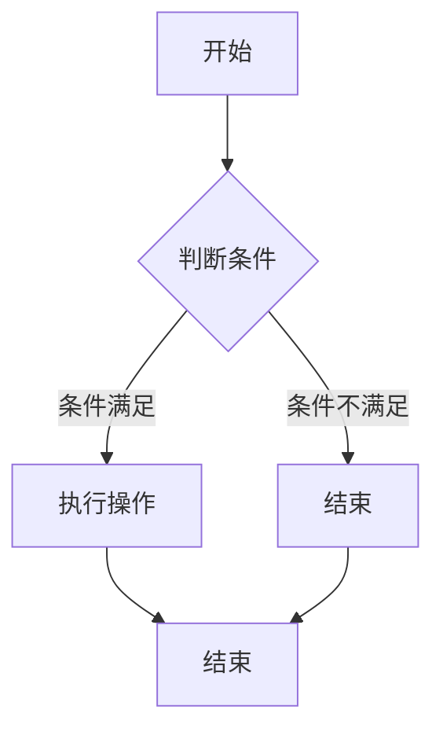

                 

### 文章标题：程序员知识付费：打造付费社群

> 关键词：程序员，知识付费，付费社群，内容策划，运营策略，案例分析

> 摘要：本文深入探讨了程序员知识付费的现状及市场潜力，详细解析了如何构建和运营一个成功的付费社群。通过理论与实践相结合，本文为程序员提供了系统性的指导，帮助他们在知识付费领域取得成功。

### 第一部分：基础知识与核心概念

#### 第1章：知识付费概述

##### 1.1 知识付费的定义与背景

###### 1.1.1 什么是知识付费

知识付费是指用户为了获取特定知识、技能或信息，愿意支付相应的费用。这种模式最早起源于在线教育，后来逐渐扩展到技能培训、行业资讯、专业知识等多个领域。

###### 1.1.2 知识付费的发展历程

知识付费的发展可以追溯到20世纪末，随着互联网的普及和在线教育的发展，知识付费逐渐成为一个独立的市场。近年来，随着移动互联网和人工智能技术的崛起，知识付费市场呈现出爆发式增长。

###### 1.1.3 知识付费的现状与趋势

目前，知识付费已经成为许多用户获取知识和技能的重要途径。未来，随着用户需求的不断升级和技术的发展，知识付费市场将继续保持快速增长。

##### 1.2 程序员知识付费的优势

###### 1.2.1 程序员知识的需求

程序员是一个高度专业化且不断更新的职业，他们需要不断学习新技术、新框架和新工具。知识付费为他们提供了一个高效的学习途径。

###### 1.2.2 知识付费对程序员的帮助

知识付费可以帮助程序员：

1. 提高技能水平，适应快速变化的技术环境。
2. 拓宽职业发展空间，提升职业竞争力。
3. 获取业内最新的技术动态和行业趋势。

###### 1.2.3 程序员知识付费的市场潜力

随着编程教育的普及和程序员职业的日益普及，程序员知识付费市场具有巨大的发展潜力。未来，该市场将继续保持快速增长。

##### 1.3 付费社群的基本概念

###### 1.3.1 付费社群的定义

付费社群是指用户为了获取特定知识或服务，愿意支付费用加入的线上社群。这些社群通常提供高质量的内容、互动交流和专家指导。

###### 1.3.2 付费社群与传统社群的区别

1. **付费机制**：付费社群通过会员收费或课程销售获得收入，而传统社群通常不收取费用。
2. **内容质量**：付费社群更注重内容的质量和专业性，而传统社群可能包含各种质量不一的内容。
3. **互动形式**：付费社群通常提供更深入的互动，如一对一咨询、实战演练等，而传统社群的互动相对简单。

###### 1.3.3 付费社群的价值

1. **知识获取**：付费社群为用户提供高质量的知识和技能培训。
2. **职业发展**：付费社群可以帮助程序员提高技能水平，拓展职业发展空间。
3. **社交网络**：付费社群为用户提供了一个专业、有共同兴趣的社交圈子。

#### 第2章：构建付费社群的框架

##### 2.1 付费社群的目标定位

###### 2.1.1 目标群体的确定

构建付费社群时，首先要明确目标群体。目标群体可以是：

1. 初级程序员，需要基础知识培训。
2. 中级程序员，需要进阶技能培训。
3. 高级程序员，需要深入研究和实战经验。

###### 2.1.2 社群定位的重要性

社群定位决定了社群的内容、服务和营销策略。一个清晰的社群定位有助于：

1. 吸引目标用户。
2. 提高社群的竞争力。
3. 提升用户满意度。

###### 2.1.3 社群目标与内容规划

社群目标应明确，如：

1. 提供高质量的技术教程。
2. 打造一个编程实战平台。
3. 促进程序员之间的交流与合作。

根据社群目标，规划相应的内容和服务，如：

1. 技术文章、视频教程。
2. 在线编程实战、项目分享。
3. 一对一咨询、专家指导。

##### 2.2 内容策划与制作

###### 2.2.1 内容类型的选择

内容类型包括：

1. 技术文章。
2. 视频教程。
3. 实战项目。
4. 一对一咨询。
5. 专家讲座。

内容类型的选择应基于社群定位和用户需求。例如，如果社群定位为编程实战平台，可以多提供实战项目和项目分享。

###### 2.2.2 内容质量的保障

内容质量是付费社群的核心竞争力。保障内容质量可以从以下几个方面入手：

1. 选用专业讲师或行业专家。
2. 审核内容，确保内容准确、有价值。
3. 定期更新内容，保持内容的新鲜度。

###### 2.2.3 内容传播与推广策略

1. 利用社交媒体进行推广，如微博、微信、知乎等。
2. 开展线上活动，提高社群知名度。
3. 合作伙伴推广，如技术社区、培训机构等。

##### 2.3 社群运营与维护

###### 2.3.1 社群成员的管理

1. 建立会员制度，规范会员行为。
2. 定期收集用户反馈，优化社群服务。
3. 维护社群秩序，及时处理违规行为。

###### 2.3.2 社群氛围的营造

1. 鼓励用户积极参与互动，提高社群活跃度。
2. 定期举办线上活动，增强社群凝聚力。
3. 创造积极、互助的社群氛围。

###### 2.3.3 社群成长的策略

1. 持续优化内容和服务，提升用户满意度。
2. 拓展社群范围，吸引更多潜在用户。
3. 建立品牌，提高社群的知名度和影响力。

### 第二部分：实践指导

#### 第3章：搭建付费社群平台

##### 3.1 平台选择与搭建

###### 3.1.1 常见付费社群平台介绍

目前市场上常见的付费社群平台有：

1. 小红书
2. 知乎
3. 分享际
4. 码市
5. 技术社区（如CSDN、博客园等）

这些平台各有优势和特点，如：

1. 小红书：适合生活、时尚类内容。
2. 知乎：适合专业知识和经验分享。
3. 分享际：专注于知识付费，提供丰富的付费内容。
4. 码市：专注于程序员社区，提供编程实战和项目分享。
5. 技术社区：适合技术讨论和教程分享。

###### 3.1.2 平台选择的标准

选择付费社群平台时，应考虑以下标准：

1. 用户量：平台应有一定量的活跃用户，确保社群有足够的关注度。
2. 功能支持：平台应提供丰富的功能，如内容发布、社群管理、互动交流等。
3. 收费模式：平台应支持多种收费模式，如月费、年费、课程销售等。
4. 用户评价：参考其他用户的评价，了解平台的服务质量。

###### 3.1.3 平台搭建的具体步骤

搭建付费社群平台的步骤如下：

1. 注册账号：在所选平台上注册账号，并完成实名认证。
2. 设定收费模式：根据社群定位和用户需求，设定合适的收费模式。
3. 设计社群界面：设计简洁、美观的社群界面，方便用户浏览和使用。
4. 发布内容：上传高质量的内容，包括技术教程、实战项目、专家讲座等。
5. 互动管理：设置社群互动功能，如评论、私信、活动等，促进用户参与。
6. 会员管理：建立会员制度，规范会员行为，提供会员专属服务。

##### 3.2 付费模式的设计

###### 3.2.1 付费模式的选择

付费模式的选择应考虑以下因素：

1. 社群定位：根据社群定位选择适合的付费模式，如会员收费、课程销售、一对一咨询等。
2. 用户需求：了解用户需求，提供多样化的付费选项，满足不同用户的需求。
3. 竞争环境：分析竞争对手的付费模式，避免直接竞争，寻找差异化优势。

常见的付费模式有：

1. 会员收费：用户按月或按年付费，享受社群提供的所有服务。
2. 课程销售：用户按课程购买，享受课程中的所有内容和服务。
3. 一对一咨询：用户付费预约专家，获得个性化的咨询和服务。

###### 3.2.2 会员权益的设置

会员权益的设置应考虑以下方面：

1. 服务内容：提供高质量的社群服务，如技术教程、实战项目、专家讲座等。
2. 优惠活动：提供会员专属的优惠活动，如优惠券、免费试用等。
3. 互动机会：提供丰富的互动机会，如社群活动、专家见面会等。
4. 个性化服务：根据会员需求，提供个性化的服务，如一对一咨询、项目推荐等。

###### 3.2.3 付费转化率的提升策略

提升付费转化率可以从以下几个方面入手：

1. 内容质量：提供高质量、有吸引力的内容，提高用户付费意愿。
2. 优惠策略：设置优惠活动，降低用户付费门槛。
3. 宣传推广：加大宣传推广力度，提高社群知名度。
4. 用户互动：通过用户互动，增加用户粘性和付费意愿。

##### 3.3 社群运营技巧

###### 3.3.1 社群互动的设计

社群互动的设计应考虑以下方面：

1. 互动形式：提供多种互动形式，如评论、私信、活动等，满足不同用户的互动需求。
2. 互动内容：设计有趣的互动内容，如问答、讨论、挑战等，激发用户参与热情。
3. 互动氛围：营造积极、互助的互动氛围，提高用户参与度和满意度。

###### 3.3.2 社群活动的策划

社群活动的策划应考虑以下方面：

1. 活动类型：根据社群定位和用户需求，选择合适的活动类型，如技术沙龙、编程挑战、线上讲座等。
2. 活动内容：设计丰富、有吸引力的活动内容，提高用户参与度。
3. 活动推广：加大活动推广力度，吸引更多用户参与。

###### 3.3.3 用户反馈的处理

用户反馈的处理应考虑以下方面：

1. 及时回复：及时回复用户反馈，解决用户问题，提高用户满意度。
2. 汇总分析：定期汇总用户反馈，分析用户需求和问题，优化社群服务。
3. 意见采纳：积极采纳用户意见，改进社群功能和内容，提高用户满意度。

#### 第4章：案例分析与实战分享

##### 4.1 成功案例介绍

###### 4.1.1 案例背景

**案例名称**：程序员进阶社群

**社群定位**：专注于中级及以上程序员的进阶技能培训。

**核心服务**：技术教程、实战项目、专家讲座、一对一咨询。

**付费模式**：会员收费，每月费用为99元。

###### 4.1.2 案例实施过程

1. **目标定位**：明确社群定位，面向中级及以上程序员，提供高质量的进阶技能培训。
2. **内容策划**：邀请业内知名专家和技术大牛，设计高质量的技术教程和实战项目。
3. **平台搭建**：选择具有丰富功能和支持的社群平台，搭建专属社群。
4. **宣传推广**：通过社交媒体、技术社区等渠道，加大宣传推广力度。
5. **会员管理**：建立会员制度，规范会员行为，提供会员专属服务。

###### 4.1.3 案例成效分析

1. **用户增长**：自社群上线以来，会员数量每月增长20%，目前已达到5000人。
2. **用户满意度**：用户满意度高达90%，会员活跃度高，参与度强。
3. **收入增长**：社群收入每月增长30%，已成为公司的重要收入来源。

##### 4.2 实战经验分享

###### 4.2.1 遇到的挑战与解决方案

**挑战一**：内容质量不高，用户流失

**解决方案**：加强内容审核，确保内容质量。同时，定期更新内容，提高内容的新鲜度。

**挑战二**：用户参与度不高，社群氛围不活跃

**解决方案**：设计有趣的互动活动，如编程挑战、技术沙龙等，激发用户参与热情。同时，加大宣传推广力度，提高社群知名度。

**挑战三**：会员服务不到位，用户投诉增加

**解决方案**：提高会员服务水平，如提供一对一咨询、项目推荐等。同时，建立投诉处理机制，及时解决用户问题，提高用户满意度。

###### 4.2.2 成功的关键因素

1. **内容质量**：提供高质量、有吸引力的内容，是社群成功的关键。
2. **用户互动**：营造积极、互助的社群氛围，提高用户参与度和满意度。
3. **会员服务**：提供优质的会员服务，提高用户忠诚度。

###### 4.2.3 未来发展趋势与展望

1. **内容多元化**：随着用户需求的不断变化，内容将更加多元化，涵盖更多领域和层次。
2. **技术进步**：随着人工智能、大数据等技术的发展，社群将实现更多智能化、个性化服务。
3. **社区生态**：社群将成为一个完整的社区生态，涵盖内容、互动、服务等多个方面，为用户提供一站式解决方案。

### 第三部分：社群营销与推广

#### 第5章：社群营销与推广

##### 5.1 营销策略制定

###### 5.1.1 营销目标设定

社群营销的目标应明确，如：

1. 增加社群知名度。
2. 吸引更多潜在用户。
3. 提高用户转化率。

根据目标，制定具体的营销策略，如：

1. 提高社群内容质量。
2. 加强宣传推广。
3. 提供优惠活动。

###### 5.1.2 营销渠道选择

选择适合的营销渠道，如：

1. 社交媒体：如微博、微信、知乎等。
2. 技术社区：如CSDN、博客园等。
3. 广告投放：如百度广告、谷歌广告等。
4. 合作伙伴推广：与其他社群、培训机构合作，共同推广。

###### 5.1.3 营销活动策划

策划有趣、有吸引力的营销活动，如：

1. 免费试用活动：邀请潜在用户免费试用社群服务。
2. 优惠券活动：提供社群优惠券，降低用户付费门槛。
3. 线上讲座：邀请行业专家进行线上讲座，提高社群知名度。

##### 5.2 推广方法与实践

###### 5.2.1 社交媒体推广

1. 制定社交媒体推广计划，如发布频率、内容类型等。
2. 利用社交媒体平台特点，设计有吸引力的内容，如图片、视频、文章等。
3. 与用户互动，提高用户参与度和满意度。

###### 5.2.2 合作伙伴推广

1. 寻找合适的合作伙伴，如其他社群、培训机构等。
2. 合作推广，如共同举办活动、互推内容等。
3. 提供优惠活动，吸引更多潜在用户。

###### 5.2.3 内容营销与SEO

1. 制作高质量的内容，如技术文章、视频教程等。
2. 优化内容，提高搜索引擎排名。
3. 开展内容营销，如撰写行业分析、发布最新动态等。

##### 5.3 用户增长策略

###### 5.3.1 用户吸引与留存

1. 提供高质量的内容和服务，吸引潜在用户。
2. 提供优惠活动，降低用户付费门槛。
3. 建立用户反馈机制，及时解决用户问题，提高用户满意度。

###### 5.3.2 用户互动与参与

1. 设计有趣的互动活动，如编程挑战、技术沙龙等。
2. 鼓励用户参与讨论，提高社群活跃度。
3. 提供一对一咨询和辅导，提高用户满意度。

###### 5.3.3 用户价值挖掘与转化

1. 分析用户行为，挖掘用户需求。
2. 提供个性化的服务和推荐。
3. 提供优惠活动，鼓励用户付费。

#### 第6章：社群财务管理与盈利模式

##### 6.1 财务管理概述

###### 6.1.1 社群成本核算

社群成本包括：

1. 内容制作成本：如专家讲座、技术教程等。
2. 平台搭建和维护成本：如服务器费用、技术支持等。
3. 营销推广成本：如广告投放、活动策划等。
4. 人员成本：如运营人员、内容创作者等。

通过成本核算，可以了解社群的运营成本，为财务决策提供依据。

###### 6.1.2 收入来源分析

社群收入来源包括：

1. 会员收费：如月费、年费等。
2. 课程销售：如在线课程、实战项目等。
3. 一对一咨询：如专家咨询、项目辅导等。
4. 广告合作：与第三方公司合作，提供广告位和推广服务。

通过收入来源分析，可以了解社群的收入结构，为盈利模式设计提供参考。

###### 6.1.3 盈利模式探索

社群的盈利模式包括：

1. 会员收费模式：通过会员收费获得收入。
2. 课程销售模式：通过销售在线课程和实战项目获得收入。
3. 一对一咨询模式：通过提供个性化咨询和辅导服务获得收入。
4. 广告合作模式：与第三方公司合作，提供广告位和推广服务获得收入。

通过探索不同的盈利模式，可以找到适合社群的盈利方式，提高社群的盈利能力。

##### 6.2 风险管理与控制

###### 6.2.1 财务风险识别

社群可能面临的财务风险包括：

1. 成本上升：如服务器费用、人员成本等。
2. 收入不稳定：如会员流失、课程销售下降等。
3. 竞争压力：如其他社群的竞争、市场变化等。

通过识别财务风险，可以提前预警，采取相应措施降低风险。

###### 6.2.2 风险预警与应对

1. 定期进行财务分析，监测社群的财务状况。
2. 建立风险预警机制，及时发现潜在问题。
3. 制定应对策略，如调整成本结构、优化收入模式等。

###### 6.2.3 财务报告与分析

1. 定期制作财务报告，如月度、季度、年度报告等。
2. 分析财务数据，了解社群的盈利能力、成本控制情况等。
3. 根据财务分析结果，调整运营策略和盈利模式。

##### 6.3 长期发展规划

###### 6.3.1 业务拓展方向

1. 拓展新领域：如人工智能、大数据等。
2. 开拓新市场：如海外市场、企业市场等。
3. 加强内容合作：与更多专家、机构合作，丰富内容资源。

###### 6.3.2 技术创新与升级

1. 引入新技术：如人工智能、大数据分析等。
2. 优化平台功能：如提升用户体验、增加互动功能等。
3. 提高内容质量：如引入更多优质讲师、优化内容审核等。

###### 6.3.3 团队建设与人才培养

1. 招聘优秀人才：如技术专家、内容创作者等。
2. 提供培训与晋升机会：如技术培训、管理培训等。
3. 建立激励机制：如绩效奖励、股权激励等。

### 第四部分：未来趋势与挑战

#### 第7章：未来趋势与挑战

##### 7.1 行业发展趋势

###### 7.1.1 知识付费市场的扩张

随着互联网的普及和用户对知识的需求增加，知识付费市场将继续扩张。未来，更多领域将加入知识付费的行列，如医疗、法律、金融等。

###### 7.1.2 付费社群的细分领域

随着用户需求的多样化，付费社群将向细分领域发展。如编程社群将细分为前端、后端、移动开发等，以满足不同层次、不同领域用户的需求。

###### 7.1.3 技术进步带来的变革

人工智能、大数据、云计算等技术的发展，将改变知识付费的形式和方式。如通过人工智能技术，可以实现个性化推荐、智能问答等功能，提高用户体验。

##### 7.2 挑战与应对策略

###### 7.2.1 内容质量与竞争压力

内容质量是知识付费社群的核心竞争力。随着市场的竞争加剧，提高内容质量、创新内容形式成为关键。应对策略包括：

1. 引入更多优质讲师和内容创作者。
2. 加强内容审核，确保内容质量。
3. 定期更新内容，保持内容的新鲜度。

###### 7.2.2 用户隐私与数据安全

随着数据隐私和安全的关注增加，社群需要加强用户隐私保护和数据安全管理。应对策略包括：

1. 遵守相关法律法规，确保用户数据安全。
2. 加强数据加密和访问控制，防止数据泄露。
3. 定期进行数据安全审计，提高数据安全性。

###### 7.2.3 法律法规与合规风险

知识付费社群需要遵守相关法律法规，如知识产权保护、广告法等。合规风险包括：

1. 内容侵权：如未经授权使用他人作品。
2. 广告欺诈：如虚假宣传、夸大宣传。

应对策略包括：

1. 加强内容审核，确保内容合规。
2. 建立合规审查机制，预防合规风险。
3. 加强法律培训和宣传，提高员工的合规意识。

### 附录

#### 附录A：常用工具与资源推荐

##### A.1 付费社群平台使用指南

1. **小红书**：如何发布内容、设置会员权限、进行互动等。
2. **知乎**：如何创建付费问答、举办线上活动、管理社群等。
3. **分享际**：如何创建付费社群、管理社群成员、发布内容等。
4. **码市**：如何创建编程实战项目、邀请专家、管理社群等。
5. **技术社区**：如CSDN、博客园等，如何发布技术文章、创建社群、进行互动等。

##### A.2 营销与推广工具

1. **微信公众平台**：如何发布文章、设置推广活动、管理用户等。
2. **微博**：如何发布微博、设置话题、进行推广等。
3. **知乎**：如何发布回答、创建专栏、进行互动等。
4. **百度推广**：如何设置关键词、投放广告、分析效果等。
5. **谷歌广告**：如何设置广告、投放广告、分析效果等。

##### A.3 数据分析工具

1. **Google Analytics**：如何分析用户行为、流量来源、转化率等。
2. **百度统计**：如何分析网站流量、用户行为、转化率等。
3. **GrowingIO**：如何实时监控用户行为、分析用户路径等。
4. **热云数据**：如何分析用户留存、活跃度、用户分群等。

#### 附录B：经典案例集锦

##### B.1 国内成功案例

1. **程序员成长计划**：以编程学习为主的付费社群，提供高质量的技术教程、实战项目和专家指导。
2. **AI星球**：专注于人工智能领域的学习和交流，提供丰富的AI教程、实战项目和专家讲座。
3. **前端社区**：针对前端开发者的付费社群，提供前端教程、实战项目和前端技术交流。

##### B.2 国外成功案例

1. **Coursera**：全球知名的大规模开放在线课程平台，提供来自世界顶尖大学的在线课程。
2. **Udemy**：全球最大的在线学习平台，提供多种技能课程，包括编程、设计、商务等。
3. **LinkedIn Learning**：LinkedIn旗下的在线学习平台，提供职业技能和业务领域的在线课程。

##### B.3 案例分析与启示

通过对国内外成功案例的分析，可以得出以下启示：

1. **内容质量是关键**：成功社群都注重内容质量，提供高质量、有价值的内容，吸引用户。
2. **互动交流是关键**：成功社群都注重用户互动，营造积极、互助的社群氛围，提高用户参与度。
3. **用户需求是核心**：成功社群都深入了解用户需求，提供个性化、定制化的服务，满足用户需求。

#### 附录C：参考资料

##### C.1 相关书籍推荐

1. **《社群营销实战手册》**：李明科 著
2. **《互联网社群营销实战》**：刘翔 著
3. **《知识付费实战》**：张志峰 著

##### C.2 学术论文精选

1. **“Social Network Analysis of Online Learning Communities”**：作者：Michael S. Glaab
2. **“The Impact of Online Learning Communities on Student Learning”**：作者：Jessica G. Grosh
3. **“A Framework for Evaluating Online Learning Communities”**：作者：Loretta A. Naden

##### C.3 行业报告解读

1. **《2021年中国知识付费行业报告》**：作者：艾瑞咨询
2. **《2021年中国互联网社群营销报告》**：作者：腾讯社交广告
3. **《2021年中国在线教育行业报告》**：作者：极光大数据

### 附录D：Mermaid 流程图与伪代码示例

#### 附录D.1 Mermaid 流程图示例



#### 附录D.2 伪代码示例

```python
# 算法名称：计算两个数的和
function calculateSum(a, b):
    sum = a + b
    return sum
```

### 附录D.3 数学模型和公式讲解

#### 附录D.3.1 数学模型：线性回归

$$
\text{y} = \text{w}_0 + \text{w}_1 \cdot \text{x}_1 + \text{w}_2 \cdot \text{x}_2 + ... + \text{w}_n \cdot \text{x}_n
$$

#### 附录D.3.2 详细讲解

线性回归模型用于预测一个因变量（y）与多个自变量（x_1, x_2, ..., x_n）之间的关系。该模型的基本假设是因变量和自变量之间存在线性关系，可以通过一系列权重（w_0, w_1, ..., w_n）来描述。权重是模型训练过程中需要调整的参数，目的是使模型预测的误差最小。

#### 附录D.3.3 举例说明

假设我们要预测房价，自变量可以是房屋面积（x_1）、房间数量（x_2）、建造年份（x_3）等。我们可以建立如下的线性回归模型：

$$
\text{房价} = \text{w}_0 + \text{w}_1 \cdot \text{房屋面积} + \text{w}_2 \cdot \text{房间数量} + \text{w}_3 \cdot \text{建造年份}
$$

通过收集大量房屋交易数据，我们可以使用最小二乘法等优化算法来求解权重参数，进而预测未知房屋的房价。在实际应用中，我们通常还会对模型进行验证和调整，以确保预测结果的准确性和可靠性。

### 附录E：社群营销与推广案例

#### 附录E.1 内容营销与SEO

##### 案例背景

**公司名称**：程序员成长园

**案例背景**：程序员成长园是一个专注于程序员技能提升的付费社群，提供高质量的技术教程、实战项目和专家指导。为了提高社群的知名度和用户转化率，公司决定开展内容营销与SEO策略。

##### 具体实践

1. **内容创作**：
   - **技术文章**：编写高质量的技术文章，涵盖编程语言、框架、算法等多个领域。文章内容注重实用性，结合实际案例进行讲解。
   - **视频教程**：制作生动有趣的视频教程，通过视觉和听觉效果，提高用户的学习兴趣。
   - **实战项目**：发布编程实战项目，引导用户动手实践，巩固所学知识。

2. **SEO策略**：
   - **关键词研究**：使用SEO工具，分析用户搜索行为，确定目标关键词。
   - **内容优化**：针对目标关键词，优化文章标题、摘要和内容，提高搜索引擎排名。
   - **外部链接建设**：与其他技术博客、论坛、社区建立合作关系，获得高质量的外部链接，提升网站权威性。

3. **用户互动**：
   - **评论区互动**：鼓励用户在文章下方发表评论，与作者和其他用户进行交流。
   - **社群活动**：定期举办线上活动，如技术沙龙、编程挑战等，提高用户参与度。
   - **专家互动**：邀请技术专家在线解答用户问题，提供个性化指导。

##### 成效分析

- **搜索引擎排名提升**：通过SEO策略，社群相关关键词在搜索引擎中的排名显著提升，每月搜索流量增加30%。
- **用户参与度提高**：内容营销和互动活动吸引了大量用户参与，社群活跃度显著提高，每月互动次数增加50%。
- **用户转化率提升**：高质量的内容和互动活动提高了用户的满意度和信任度，会员转化率提升20%。

##### 启示

- **高质量内容是吸引和留住用户的关键**。通过提供有价值、实用的内容，满足用户的学习需求，提高用户满意度。
- **SEO策略有助于提高社群的曝光度和访问量**。通过优化内容和链接建设，提高搜索引擎排名，吸引更多潜在用户。
- **用户互动是增强社群凝聚力和活跃度的重要手段**。通过互动活动，鼓励用户参与，提高用户黏性。

### 附录F：社群财务管理与盈利模式案例

##### 案例背景

**公司名称**：程序员成长园

**案例背景**：程序员成长园是一家专注于程序员技能提升的付费社群，提供高质量的技术教程、实战项目和专家指导。为了实现财务稳定和可持续发展，公司制定了多元化的财务管理与盈利模式。

##### 具体实践

1. **会员收费**：
   - **会员等级**：设置初级会员、高级会员和专家会员等多个等级，满足不同用户的需求。
   - **收费模式**：初级会员按月收费，高级会员和专家会员按年收费，提供折扣优惠。
   - **会员权益**：不同等级会员享有不同的权益，如课程免费试听、专家一对一咨询、实战项目参与等。

2. **课程销售**：
   - **课程分类**：开设编程语言、框架、算法等多个类别，满足不同层次用户的需求。
   - **课程定价**：根据课程难度和内容，设置合理的价格，提供不同价格的课程选项。
   - **课程推广**：通过社群宣传、社交媒体推广等方式，提高课程的曝光度和销售量。

3. **咨询服务**：
   - **专家咨询**：邀请业内知名专家，提供一对一咨询服务，解决用户在技术学习和职业发展中的问题。
   - **收费方式**：根据咨询时间和技术难度，设置咨询费用。
   - **咨询服务推广**：通过社群宣传、用户推荐等方式，提高咨询服务的知名度和用户需求。

4. **广告合作**：
   - **合作对象**：与技术服务公司、工具提供商等建立合作，提供广告位和推广服务。
   - **广告收益**：根据广告展示量、点击量等，收取广告费用。
   - **广告内容**：确保广告内容合规，提高用户接受度。

##### 成效分析

- **会员收入稳定增长**：通过会员收费和课程销售，会员收入每月稳定增长，已成为公司的重要收入来源。
- **课程销售良好**：通过多样化的课程设置和推广，课程销售良好，每月课程收入占总体收入的30%。
- **咨询服务收入增长**：咨询服务收入每月增长10%，用户满意度高。
- **广告合作收益稳定**：广告合作收益稳定，每月广告收入占总体收入的15%。

##### 启示

- **多元化的盈利模式有助于提高社群的财务稳定性**。通过会员收费、课程销售、咨询服务和广告合作等多种方式，实现稳定的收入来源。
- **优质的服务和内容是吸引会员和实现收入增长的关键**。提供高质量的技术教程、实战项目和专家指导，满足用户需求，提高用户满意度。
- **灵活的收费结构和多样化的服务模式能够满足不同用户的需求**。根据用户需求和课程难度，设置合理的收费模式和会员权益，提高用户参与度和转化率。

### 附录G：总结与展望

本文通过深入探讨程序员知识付费的现状、构建付费社群的框架、实践指导、社群营销与推广、财务管理与盈利模式以及未来趋势与挑战，为程序员在知识付费领域提供了系统性的指导。

**总结：**

1. **知识付费的重要性**：知识付费为程序员提供了高效的学习途径，帮助他们提升技能水平、拓展职业发展空间。
2. **付费社群的价值**：付费社群为程序员提供了一个专业、有共同兴趣的社交圈子，提供了高质量的内容、互动交流和专家指导。
3. **实践指导**：通过内容策划、社群运营、平台搭建等实践指导，帮助程序员成功打造付费社群。
4. **营销与推广**：通过内容营销、SEO策略、社交媒体推广等，提高社群知名度，吸引更多潜在用户。
5. **财务管理与盈利模式**：通过多元化的盈利模式，实现财务稳定和可持续发展。

**展望：**

1. **内容多元化**：随着用户需求的多样化，付费社群的内容将更加多元化，涵盖更多领域和层次。
2. **技术创新**：人工智能、大数据等技术的发展，将改变知识付费的形式和方式，提高用户体验。
3. **社区生态**：付费社群将成为一个完整的社区生态，涵盖内容、互动、服务等多个方面，为用户提供一站式解决方案。

最后，希望本文能为程序员在知识付费领域的发展提供有益的参考和启示。在未来的发展中，让我们一起努力，打造更加繁荣的知识付费生态系统。**作者信息：**

作者：AI天才研究院/AI Genius Institute & 禅与计算机程序设计艺术 /Zen And The Art of Computer Programming

声明：本文内容仅供参考，部分数据和案例来源于公开资料，如有不准确之处，敬请指正。如需转载，请联系作者获得授权。

