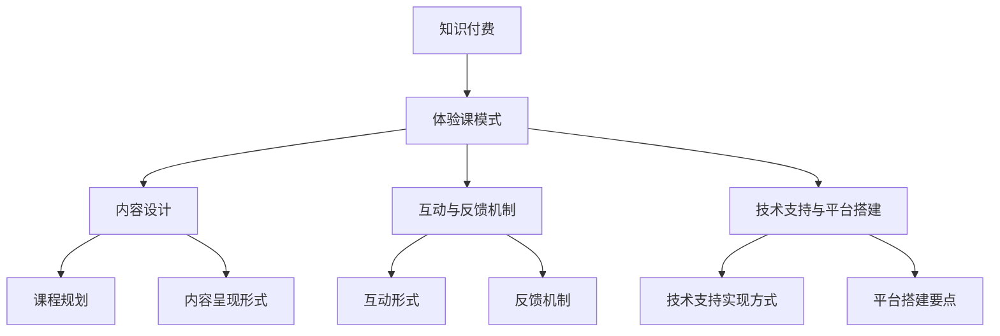

                 

# 《程序员知识付费：打造体验课模式》

## 关键词
知识付费、体验课模式、内容设计、互动与反馈机制、技术支持与平台搭建、实战案例、个人知识付费品牌、未来发展。

## 摘要
本文深入探讨了程序员知识付费的现象及其背后的体验课模式。通过概述知识付费的背景、市场现状和价值，本文详细介绍了体验课模式的特点和应用。随后，文章从内容设计、互动与反馈机制、技术支持与平台搭建等方面探讨了打造体验课模式的关键要素。通过实际案例解析，文章展示了如何构建个人知识付费品牌。最后，文章展望了程序员知识付费与体验课模式的未来发展，提出了相关挑战与应对策略。

---

### 第一部分：知识付费与体验课模式概述

#### 第1章：知识付费时代下的程序员

##### 1.1 程序员知识付费的兴起

**1.1.1 程序员知识付费的背景**

随着互联网技术的快速发展，知识传播的渠道变得更加丰富和便捷。尤其是在近年来，随着知识经济的兴起，知识付费逐渐成为一种趋势。程序员作为知识密集型职业群体，其知识付费的兴起有着以下几个方面的背景：

1. **互联网教育的普及**：在线教育的兴起为程序员提供了更多的学习机会和资源，使得他们可以更便捷地获取知识和技能。
2. **技术更新速度加快**：技术的快速发展使得程序员需要不断更新自己的知识体系，以适应不断变化的技术环境。
3. **个人品牌的重要性**：随着编程知识的普及，个人品牌对于程序员来说越来越重要，知识付费成为提升个人品牌的重要途径。

**1.1.2 程序员知识付费的市场现状**

程序员知识付费市场呈现出以下几个特点：

1. **市场规模不断扩大**：随着程序员对于知识付费的接受度提高，市场总体规模呈现出快速增长的趋势。
2. **内容形式多样化**：除了传统的书籍、视频教程外，程序员知识付费的内容形式还包括在线课程、直播讲座、编程实战项目等。
3. **用户需求多样化**：程序员的需求呈现出多样化和个性化的特点，不同阶段的程序员对于知识付费的内容和形式有不同的需求。

**1.1.3 程序员知识付费的价值**

程序员知识付费不仅对程序员个人有重要价值，也对市场和社会有积极影响：

1. **个人价值提升**：通过知识付费，程序员可以快速获取所需知识，提升自己的技能和职业竞争力。
2. **市场价值创造**：知识付费为内容创作者提供了新的收入来源，促进了知识经济的市场化。
3. **社会价值提升**：知识付费有助于提高整个社会的知识水平和技术创新能力，推动社会进步。

##### 1.2 体验课模式介绍

**1.2.1 体验课模式的特点**

体验课模式是一种以学员体验为核心的教学模式，具有以下几个显著特点：

1. **互动性强**：体验课强调师生互动和学员间的互动，通过多种互动形式提高学员的参与度。
2. **实战导向**：体验课注重实战操作，通过实际案例和项目让学员在实践中学习。
3. **课程设计灵活**：体验课模式可以根据学员的需求和进度灵活调整课程内容和形式。

**1.2.2 体验课模式与传统教学模式的比较**

体验课模式与传统教学模式在多个方面存在差异：

1. **教学目标**：传统教学模式以知识传授为主，而体验课模式更注重能力的培养和技能的提升。
2. **教学形式**：传统教学模式多以理论教学为主，而体验课模式则注重实践操作和项目实战。
3. **教学效果**：体验课模式通过实战操作和互动交流，学员的学习效果更为显著。

**1.2.3 体验课模式在程序员知识付费中的应用**

体验课模式在程序员知识付费中的应用具有重要意义：

1. **提高学员参与度**：通过互动和实战，提高学员的学习兴趣和参与度，提升学习效果。
2. **提升知识转化率**：实战项目使学员能够将所学知识迅速应用到实践中，提高知识转化率。
3. **增强课程吸引力**：丰富的互动和实战元素使课程更具吸引力，有利于课程的市场推广和学员转化。

---

### 第二部分：打造体验课模式的关键要素

#### 第2章：内容设计与课程规划

##### 2.1 内容设计原则

**2.1.1 内容设计的核心目标**

内容设计是体验课模式的核心环节，其核心目标包括：

1. **满足学员需求**：内容设计应紧密围绕学员的需求和兴趣，确保课程内容具有实际应用价值。
2. **提升学习效果**：通过科学的内容设计，提高学员的学习效率和学习成果。
3. **增强课程吸引力**：设计富有吸引力的课程内容，提升学员的参与度和满意度。

**2.1.2 如何选择合适的课程内容**

选择合适的课程内容是内容设计的关键，以下是一些建议：

1. **热点话题**：选择当前技术领域的热点话题，以吸引学员的关注。
2. **实战案例**：结合实际项目案例，让学员能够在实践中掌握知识和技能。
3. **知识体系**：构建完整的知识体系，确保课程内容系统化和条理化。
4. **学员反馈**：根据学员的反馈和需求，调整和优化课程内容。

**2.1.3 内容呈现形式的多样化**

为了提升学员的学习体验，内容呈现形式应多样化，包括：

1. **视频教学**：通过视频讲解，使课程内容更加生动和直观。
2. **文字教程**：提供详细的文字教程，帮助学员深入理解和掌握知识。
3. **实战项目**：通过实际项目操作，让学员将所学知识应用到实践中。
4. **互动交流**：利用论坛、直播等互动工具，促进学员间的交流和讨论。

##### 2.2 课程规划与结构

**2.2.1 课程规划的基本步骤**

课程规划是内容设计的重要组成部分，其基本步骤包括：

1. **需求分析**：了解学员的需求和目标，为课程规划提供依据。
2. **内容设计**：根据需求分析结果，设计课程内容和结构。
3. **教学策略**：制定合适的教学策略，包括教学方法、教学工具等。
4. **进度安排**：合理安排课程进度，确保学员能够在规定时间内完成学习。

**2.2.2 如何设计课程结构**

设计课程结构应遵循以下原则：

1. **系统性**：确保课程内容系统、完整，避免知识点遗漏。
2. **层次性**：按照知识点的难易程度和逻辑关系，合理安排课程结构。
3. **灵活性**：设计灵活的课程结构，适应不同学员的学习需求和进度。
4. **实战导向**：将实际项目融入课程结构，提高学员的实践能力。

**2.2.3 课程进度的合理安排**

合理安排课程进度对于提高学习效果至关重要，以下是一些建议：

1. **渐进式**：课程进度应逐步递增，避免学员在短时间内承受过大的学习压力。
2. **弹性**：课程进度应具备一定的弹性，允许学员根据自己的学习进度进行调整。
3. **实践结合**：在课程进度安排中，应确保理论与实践操作相结合，提高学员的实际操作能力。
4. **反馈机制**：建立及时的反馈机制，根据学员的学习进度和反馈，调整课程进度。

---

#### 第3章：互动与反馈机制

##### 3.1 互动形式设计

**3.1.1 互动形式的选择**

互动形式的设计对于提高学员的参与度和学习效果至关重要。以下是一些常见的互动形式：

1. **在线讨论**：通过论坛或聊天室，学员可以随时提问和交流。
2. **实时直播**：通过直播平台，教师可以实时解答学员的问题，并进行互动教学。
3. **小组讨论**：学员分组讨论，促进团队合作和知识共享。
4. **实战项目**：通过实际项目操作，学员可以在实践中学习和交流。

**3.1.2 如何激发学员的参与度**

激发学员的参与度是互动设计的关键，以下是一些建议：

1. **奖励机制**：设立参与奖励，如积分、证书等，激励学员积极参与。
2. **互动游戏**：设计互动游戏，增加课程的趣味性和参与度。
3. **角色扮演**：通过角色扮演，让学员在模拟环境中学习和交流。
4. **实时反馈**：教师应及时反馈学员的问题和进步，提高学员的参与感和成就感。

**3.1.3 互动环节的优化**

优化互动环节可以提高互动效果和学习体验，以下是一些建议：

1. **互动内容的设计**：确保互动内容与课程内容紧密结合，提高互动的实用性和价值。
2. **互动工具的选择**：选择合适的互动工具，如论坛、直播平台、在线问答等。
3. **互动时间的安排**：合理安排互动时间，确保学员有足够的时间参与互动。
4. **互动效果的评估**：定期评估互动效果，根据反馈进行调整和优化。

##### 3.2 反馈机制建立

**3.2.1 反馈的重要性**

反馈机制是互动与反馈机制的核心，其重要性体现在以下几个方面：

1. **学习效果的评估**：通过反馈，可以了解学员的学习效果和问题，为教学调整提供依据。
2. **教学质量提升**：教师可以根据反馈，改进教学方法和内容，提高教学质量。
3. **学员参与感增强**：及时的反馈可以提高学员的参与感和成就感，激发学习积极性。

**3.2.2 反馈机制的构建**

构建有效的反馈机制需要考虑以下几个方面：

1. **反馈渠道的多样化**：提供多种反馈渠道，如在线问卷、论坛讨论、实时反馈等。
2. **反馈内容的全面性**：确保反馈内容涵盖学习效果、教学质量、课程内容等多个方面。
3. **反馈的及时性**：及时收集和反馈学员的意见和问题，确保教学调整的及时性。
4. **反馈的隐私保护**：保护学员的隐私，确保反馈机制的公正性和可信度。

**3.2.3 反馈数据的分析与利用**

对反馈数据进行深入分析，可以挖掘出更深层次的教学问题和需求，以下是一些建议：

1. **数据收集与整理**：系统化收集和整理反馈数据，确保数据的完整性和准确性。
2. **数据分析与挖掘**：利用数据分析工具，对反馈数据进行分析和挖掘，找出潜在问题和改进点。
3. **反馈结果的利用**：将分析结果应用于教学调整和课程改进，提高教学效果。
4. **反馈反馈机制**：将改进措施和结果及时反馈给学员，形成良性循环。

---

#### 第4章：技术支持与平台搭建

##### 4.1 技术支持概述

**4.1.1 技术支持的重要性**

技术支持在体验课模式中起着至关重要的作用，其重要性体现在以下几个方面：

1. **保障教学过程的顺利进行**：技术支持确保教学过程的稳定性和连续性，提高教学效果。
2. **提供高效的互动工具**：技术支持提供了丰富的互动工具，如在线讨论区、实时直播平台等，增强学员的参与感和学习体验。
3. **支持个性化学习**：技术支持可以提供个性化的学习资源和学习路径，满足学员的个性化需求。
4. **提高教学管理效率**：技术支持提供了高效的教学管理工具，如课程管理平台、学习进度跟踪系统等，提高教学管理效率。

**4.1.2 技术支持的实现方式**

实现技术支持需要考虑以下几个方面：

1. **课程管理平台**：搭建一个集课程管理、学习进度跟踪、在线互动等功能于一体的平台。
2. **互动工具**：选择合适的互动工具，如在线讨论区、实时直播平台、问答系统等，促进学员间的互动和交流。
3. **学习资源库**：构建丰富的学习资源库，包括视频教程、文档资料、实战项目等，为学员提供全方位的学习支持。
4. **技术支持团队**：建立专业的技术支持团队，提供实时技术支持和问题解决服务，确保教学过程的顺利进行。

**4.1.3 技术支持的优化策略**

为了提高技术支持的效果，可以采取以下优化策略：

1. **定期更新和维护**：定期更新和维护技术支持系统，确保其稳定性和安全性。
2. **用户培训与指导**：为学员提供技术支持的培训和使用指导，提高学员的使用效率和体验。
3. **反馈与改进**：及时收集学员对技术支持的反馈，根据反馈进行改进和优化。
4. **个性化服务**：根据学员的需求和特点，提供个性化的技术支持服务，提高学员的满意度。

##### 4.2 平台搭建要点

**4.2.1 平台搭建的基本流程**

平台搭建的基本流程包括以下几个步骤：

1. **需求分析**：明确平台的功能需求和技术需求，为后续搭建提供依据。
2. **系统设计**：根据需求分析结果，进行系统设计，包括技术架构、模块划分、数据模型等。
3. **开发实施**：按照系统设计，进行开发实施，包括前端开发、后端开发、数据库搭建等。
4. **测试与优化**：进行系统测试，修复问题，优化性能，确保平台的稳定性和可用性。
5. **上线与运营**：平台上线后，进行运营和维护，持续优化用户体验。

**4.2.2 如何选择合适的平台工具**

选择合适的平台工具对于平台的成功搭建至关重要，以下是一些建议：

1. **功能需求匹配**：选择功能丰富、符合需求的技术工具，确保平台能够满足教学和互动需求。
2. **技术成熟度**：选择技术成熟、社区活跃的技术工具，降低技术风险。
3. **可扩展性和可维护性**：选择具有良好可扩展性和可维护性的技术工具，确保平台能够持续优化和升级。
4. **成本效益**：综合考虑成本效益，选择性价比高的技术工具。

**4.2.3 平台运营与维护**

平台运营与维护是确保平台长期稳定运行的关键，以下是一些建议：

1. **用户培训与支持**：为学员提供平台使用培训和技术支持，提高学员的使用体验。
2. **内容管理**：定期更新和优化平台内容，确保内容的质量和时效性。
3. **安全与隐私保护**：加强平台的安全和隐私保护措施，确保学员的信息安全。
4. **持续优化与升级**：根据用户反馈和技术发展，持续优化和升级平台功能。

---

#### 第三部分：实战案例分析

#### 第5章：程序员知识付费案例解析

##### 5.1 案例背景介绍

**5.1.1 案例企业的基本情况**

案例企业是一家专注于程序员知识付费的在线教育平台，名为“编程大师”。该平台成立于2010年，以提供高质量的编程课程和实战项目为核心业务，旨在帮助程序员提升技能和职业竞争力。

**5.1.2 案例企业的业务需求**

随着编程知识的不断更新和程序员对于知识付费的接受度提高，编程大师面临以下业务需求：

1. **提升课程质量**：通过改进课程内容和教学方式，提高课程的吸引力。
2. **优化用户体验**：通过技术支持和平台优化，提升学员的学习体验和满意度。
3. **扩大市场影响力**：通过品牌推广和课程销售，扩大市场占有率。

##### 5.2 案例实施过程

**5.2.1 内容设计与课程规划**

1. **课程内容设计**：编程大师结合行业热点和技术趋势，选择具有实际应用价值的编程语言和技术进行课程设计，确保课程内容紧贴实际需求。
2. **课程规划**：编程大师根据学员的学习进度和需求，将课程分为基础、进阶和高级三个层次，确保课程结构合理、层次分明。
3. **课程呈现形式**：编程大师采用视频教学、文档教程、实战项目等多种形式，丰富课程内容，提高学员的学习体验。

**5.2.2 互动与反馈机制的建立**

1. **互动形式设计**：编程大师采用在线讨论区、实时直播、问答系统等多种互动形式，促进学员间的交流和学习。
2. **反馈机制建立**：编程大师建立完善的反馈机制，包括学员评价、教师评价和互动反馈，确保教学质量和学员满意度。

**5.2.3 技术支持与平台搭建**

1. **技术支持**：编程大师建立专业的技术支持团队，提供实时在线技术支持和问题解决服务，确保教学过程顺利进行。
2. **平台搭建**：编程大师采用成熟的课程管理平台和互动工具，搭建稳定、高效的在线学习平台，确保学员能够顺利参与学习。

##### 5.3 案例效果评估

**5.3.1 效果评估指标**

编程大师从以下几个方面对案例效果进行评估：

1. **学员满意度**：通过学员评价和反馈，了解学员对课程和平台的满意度。
2. **学习效果**：通过学员的学习进度和成绩，评估学员的学习效果。
3. **市场表现**：通过课程销售和市场推广效果，评估案例的市场表现。

**5.3.2 案例的收益与不足**

**收益：**

1. **课程质量提升**：通过改进课程内容和教学方式，编程大师的课程质量得到了显著提升，学员满意度提高。
2. **市场影响力扩大**：通过品牌推广和课程销售，编程大师的市场影响力不断扩大，市场份额逐步提升。
3. **收入增加**：随着学员数量的增加和课程销售额的提升，编程大师的收入也实现了增长。

**不足：**

1. **平台优化需求**：虽然编程大师的平台功能较为完善，但仍需进一步优化，提高用户体验。
2. **教学内容更新速度**：随着技术更新速度的加快，编程大师需要加快课程内容的更新速度，确保课程内容的前沿性。
3. **技术支持团队扩展**：随着学员数量的增加，编程大师需要扩大技术支持团队，提高技术支持服务的质量。

**5.3.3 案例的启示与借鉴意义**

编程大师的案例为程序员知识付费提供了以下启示和借鉴意义：

1. **内容质量是关键**：提升课程质量是提高学员满意度和市场竞争力的重要途径。
2. **用户体验至上**：优化用户体验，提高学员的参与度和满意度，是平台成功的关键。
3. **技术支持不可或缺**：专业的技术支持团队和稳定的平台搭建是保障教学顺利进行的基础。
4. **持续优化与升级**：随着市场和技术的发展，持续优化和升级课程内容、平台功能和用户体验，是保持竞争力的关键。

---

#### 第四部分：未来展望

#### 第6章：程序员知识付费与体验课模式的未来发展

##### 6.1 行业发展趋势分析

**6.1.1 知识付费行业的趋势**

随着知识经济的不断发展，知识付费行业呈现出以下几个趋势：

1. **市场规模不断扩大**：随着人们对知识的需求不断增加，知识付费的市场规模将继续扩大。
2. **内容形式多样化**：知识付费的内容形式将更加多样化，包括视频教程、直播课程、互动问答等。
3. **个性化服务普及**：知识付费平台将更加注重个性化服务，通过大数据分析等技术，提供个性化的学习资源和课程推荐。
4. **行业细分领域拓展**：知识付费将在更多细分领域得到应用，如人工智能、大数据、区块链等。

**6.1.2 体验课模式的趋势**

体验课模式在程序员知识付费中的应用将呈现以下趋势：

1. **互动与实战结合**：体验课模式将更加注重互动与实战的结合，提高学员的学习效果。
2. **技术驱动创新**：随着技术的不断进步，体验课模式将采用更多先进的技术，如人工智能、虚拟现实等，提升学习体验。
3. **个性化教学**：体验课模式将更加注重个性化教学，根据学员的需求和特点，提供个性化的学习方案。
4. **跨平台融合**：体验课模式将在多个平台上融合应用，如移动端、PC端、VR/AR等，提供灵活的学习方式。

##### 6.2 技术创新带来的机遇

**6.2.1 人工智能技术在知识付费中的应用**

人工智能技术在知识付费中的应用将带来以下机遇：

1. **个性化推荐**：通过人工智能技术，可以实现对学员兴趣和需求的精准分析，提供个性化的课程推荐。
2. **智能问答**：利用人工智能技术，构建智能问答系统，提供实时、精准的问题解答。
3. **学习效果分析**：通过人工智能技术，对学员的学习行为和效果进行分析，为教学调整提供数据支持。

**6.2.2 虚拟现实与增强现实在体验课模式中的应用**

虚拟现实与增强现实技术在体验课模式中的应用将带来以下机遇：

1. **沉浸式学习体验**：通过虚拟现实和增强现实技术，为学员提供沉浸式的学习体验，提高学习效果。
2. **互动与协作**：虚拟现实和增强现实技术将促进学员间的互动和协作，提高学习氛围。
3. **实践操作**：通过虚拟现实和增强现实技术，可以实现实际操作场景的模拟，让学员在实践中学习。

##### 6.3 未来发展的挑战与应对

**6.3.1 挑战分析**

程序员知识付费与体验课模式在未来发展中将面临以下挑战：

1. **内容质量**：随着市场竞争的加剧，内容质量将变得至关重要，如何确保课程内容的高质量成为挑战。
2. **技术更新**：技术的快速发展要求知识付费平台不断更新和升级技术，以适应新的技术环境和需求。
3. **用户隐私**：随着数据隐私保护意识的提高，如何保护学员的隐私成为重要挑战。

**6.3.2 应对策略与建议**

为了应对上述挑战，可以采取以下策略和建议：

1. **加强内容审核**：建立严格的内容审核机制，确保课程内容的质量和合规性。
2. **持续技术更新**：投入资源进行技术研究和开发，确保平台的先进性和竞争力。
3. **数据安全与隐私保护**：加强数据安全与隐私保护措施，确保学员的数据安全和隐私保护。
4. **用户教育与引导**：通过用户教育和引导，提高用户对数据隐私和安全的认识，增强用户信任。

---

### 附录

#### 附录A：知识付费与体验课模式相关资源

**A.1 行业报告与研究报告**

1. **《2021年中国在线教育行业报告》**
2. **《2022年中国知识付费行业报告》**
3. **《2021年中国程序员职业发展报告》**

**A.2 相关书籍推荐**

1. **《知识付费：从内容创造到商业变现》**
2. **《体验式教学设计：理论与实践》**
3. **《在线教育平台运营与管理》**

**A.3 优秀知识付费平台与课程推荐**

1. **极客时间（Jikexueyuan）**：提供高质量的编程课程和实战项目
2. **慕课网（imooc）**：涵盖多个技术领域的在线课程
3. **网易云课堂（Yunet Classroom）**：提供丰富多样的编程和技术课程

#### 附录B：体验课模式设计工具与资源

**B.1 常用互动工具**

1. **知乎**：用于在线讨论和交流
2. **直播平台**：如斗鱼、虎牙等，用于实时互动教学
3. **问答系统**：如百度知道、知乎问答等，用于在线提问和解答

**B.2 课程设计与规划工具**

1. **Kahoot**：用于创建互动式测验和游戏
2. **Mentimeter**：用于实时投票和互动调查
3. **Google Forms**：用于收集学员反馈和学习进度

**B.3 平台搭建与运营工具**

1. **WordPress**：用于搭建个人网站和在线教育平台
2. **Moodle**：用于搭建在线学习管理系统
3. **Trello**：用于项目管理和进度跟踪

---

#### 核心概念与联系

以下是一个关于程序员知识付费与体验课模式核心概念和架构的Mermaid流程图：



---

#### 核心算法原理讲解

以下是一个关于内容设计原则的核心算法原理讲解的伪代码：

```plaintext
// 伪代码：内容设计原则算法

function contentDesignPrinciples(content, objectives) {
    // 初始化内容与目标
    let designedContent = [];
    let relevantContent = filterContentByObjectives(content, objectives);

    // 对筛选出的内容进行排序
    designedContent = sortContentByRelevance(relevantContent);

    // 添加课程结构
    designedContent = addCourseStructure(designedContent);

    // 返回设计后的内容
    return designedContent;
}

// 辅助函数：根据目标筛选内容
function filterContentByObjectives(content, objectives) {
    // 实现筛选逻辑
}

// 辅助函数：根据相关性排序内容
function sortContentByRelevance(content) {
    // 实现排序逻辑
}

// 辅助函数：添加课程结构
function addCourseStructure(content) {
    // 实现结构添加逻辑
}
```

---

#### 数学模型和数学公式讲解

以下是一个关于互动与反馈机制的数学模型讲解，使用latex格式：

```latex
\section{互动与反馈机制的数学模型}

互动与反馈机制的设计涉及多个数学模型，以下是一个简要的数学公式描述：

\[ I(t) = f(R(t), P(t), E(t)) \]

其中，\( I(t) \) 表示互动程度，\( R(t) \) 表示学员的参与度，\( P(t) \) 表示教师的参与度，\( E(t) \) 表示环境的支持度。

参与度 \( R(t) \) 的数学模型可以表示为：

\[ R(t) = \frac{A(t)}{B(t)} \]

其中，\( A(t) \) 表示学员在互动过程中产生的有效互动次数，\( B(t) \) 表示互动的总次数。

教师参与度 \( P(t) \) 的数学模型可以表示为：

\[ P(t) = \frac{C(t)}{D(t)} \]

其中，\( C(t) \) 表示教师提供的有效互动次数，\( D(t) \) 表示教师参与互动的总次数。

环境的支持度 \( E(t) \) 的数学模型可以表示为：

\[ E(t) = g(H(t)) \]

其中，\( H(t) \) 表示环境因素，如技术支持、课程平台等。

通过以上数学模型，可以实现对互动与反馈机制的综合评估，以优化课程设计和教学效果。
```

---

#### 项目实战

### 案例背景

某程序员李华想要通过构建个人知识付费品牌来分享他的编程知识和经验。他决定开设一系列的编程课程，并通过在线平台进行推广。

### 开发环境搭建

1. 安装并配置个人网站开发环境，如Node.js、Nginx等。
2. 安装内容管理系统（CMS），如WordPress，用于管理课程内容。
3. 集成支付系统，如PayPal或Stripe，用于处理学员的付费和退款。

### 源代码详细实现

以下是李华使用WordPress搭建个人知识付费平台的示例代码：

```php
// WordPress主题文件：functions.php

function custom_theme_support() {
    // 添加课程自定义类型
    add_theme_support('post-type', 'course', array(
        'labels' => array(
            'name' => '课程',
            'singular_name' => '课程',
            'add_new' => '添加课程',
            'add_new_item' => '添加新课程',
            // ...其他标签
        ),
        'public' => true,
        'has_archive' => true,
        // ...其他选项
    ));
}

add_action('after_setup_theme', 'custom_theme_support');

// 集成PayPal支付接口
function paypal_payment_button($course_id) {
    $course = get_course_by_id($course_id);
    $price = get_course_price($course_id);
    
    // PayPal支付按钮代码
    echo '
        <form action="https://www.paypal.com/cgi-bin/webscr" method="post" target="_top">
            <input type="hidden" name="cmd" value="_xclick">
            <input type="hidden" name="business" value="your_email@example.com">
            <input type="hidden" name="amount" value="' . $price . '">
            <input type="hidden" name="item_name" value="Course Name">
            <input type="hidden" name="return" value="' . get_site_url() . '/thank-you">
            <input type="hidden" name="cancel_return" value="' . get_site_url() . '/cancel">
            <input type="image" src="https://www.paypalobjects.com/webstatic/mktg/logo/AM_mc_vs_dc_ae.jpg" border="0" name="submit" alt="PayPal">
            
        </form>
    ';
}
```

### 代码解读与分析

1. `custom_theme_support()` 函数用于添加自定义课程类型，使得WordPress可以管理课程相关内容。
2. `paypal_payment_button()` 函数用于生成PayPal支付按钮，通过该按钮学员可以直接在网站上完成付费。
3. 支付按钮的各个字段含义如下：
   - `cmd`: 标识请求类型，此处为支付。
   - `business`: PayPal收款者的电子邮件地址。
   - `amount`: 商品的价格。
   - `item_name`: 商品名称，此处为课程名称。
   - `return`: 成功支付后的跳转页面。
   - `cancel_return`: 支付取消后的跳转页面。

通过以上代码实现，李华可以在个人网站上创建、发布和管理课程，并通过PayPal接收学员的付费，从而实现个人知识付费品牌的构建。

---

### 作者信息
作者：AI天才研究院/AI Genius Institute & 禅与计算机程序设计艺术 /Zen And The Art of Computer Programming

