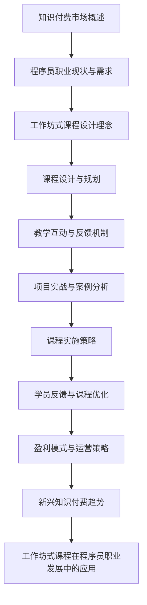

                 

# 《程序员知识付费：打造工作坊式课程》

> 关键词：程序员，知识付费，工作坊式课程，教学互动，反馈机制，项目实战，盈利模式

> 摘要：本文将探讨程序员知识付费的现状和需求，分析工作坊式课程的设计理念和方法，详细解析工作坊式课程构建的过程，并探讨其推广、实施和优化的策略。通过案例分析，展示知识付费工作坊式课程的实际应用和效果，为程序员知识付费提供新的思路和模式。

## 第一部分：知识付费市场概述

### 1.1 知识付费概念与发展

知识付费是指用户为了获取特定的知识和信息，向知识提供方支付相应费用的行为。在互联网时代，知识付费市场迅速崛起，成为知识经济的重要驱动力。知识付费的定义可以表示为：

\[ P_f = C_c \cdot Q \]

其中，\( P_f \) 表示用户支付的金额，\( C_c \) 表示用户的支付能力，\( Q \) 表示知识内容的质量。

随着互联网技术的发展，知识付费市场呈现出以下趋势：

1. **内容多样化**：知识付费内容涵盖了从技能培训到行业分析、从个人提升到兴趣爱好等多个领域。
2. **用户群体扩大**：随着人们对知识和技能的需求日益增长，知识付费用户群体不断扩大。
3. **支付方式便捷**：移动支付、在线支付等便捷支付方式的普及，为知识付费提供了更好的用户体验。

### 1.2 知识付费市场概述

当前，知识付费市场呈现出以下特点：

1. **市场规模持续扩大**：根据市场研究报告，全球知识付费市场规模持续扩大，预计未来几年将保持高速增长。
2. **用户需求多样化**：用户对知识的需求不仅限于专业技能，还包括个人成长、兴趣爱好等方面。
3. **竞争激烈**：随着知识付费市场的扩大，竞争日益激烈，平台和企业需要不断创新，提高用户满意度。

### 1.3 市场趋势与机遇

知识付费市场的趋势和机遇体现在以下几个方面：

1. **在线教育的发展**：随着在线教育市场的兴起，知识付费工作坊式课程有望成为在线教育的重要组成部分。
2. **个性化学习**：知识付费平台可以通过数据分析和个性化推荐，为用户提供个性化的学习内容。
3. **内容创新**：结合新技术，如人工智能、虚拟现实等，知识付费内容将更加丰富和生动。
4. **跨界合作**：知识付费平台可以与行业专家、企业等合作，提供更具权威性和实用性的内容。

### 1.4 案例分析：成功知识付费项目

以下是一个成功知识付费项目的案例分析：

**项目名称**：编程实战课程

**项目背景**：随着编程技能需求的增长，某在线教育平台推出了编程实战课程，通过线上教学和项目实战，帮助学员提升编程能力。

**项目内容**：课程包括编程基础、数据库操作、Web开发等模块，学员通过完成实际项目，掌握编程技能。

**项目效果**：课程上线后，受到了广泛好评，学员满意度高，课程销量迅速增长。

**项目成功原因**：

1. **内容实用**：课程内容紧密结合实际需求，帮助学员解决实际问题。
2. **互动性强**：课程设置了丰富的互动环节，包括实时答疑、项目讨论等，提高了学员的参与度。
3. **服务优质**：平台提供了专业的教学服务和学员支持，保障了学员的学习效果。

## 第二部分：程序员职业现状与需求

### 2.1 程序员职业现状

程序员是现代社会不可或缺的职业之一，随着信息技术的快速发展，程序员的需求不断增长。当前，程序员的职业现状表现出以下特点：

1. **市场需求旺盛**：随着数字化转型的推进，企业对程序员的需求持续增加。
2. **薪资水平较高**：程序员的薪资水平普遍较高，成为许多年轻人追求的职业。
3. **职业发展空间大**：程序员可以通过不断学习和提升技能，实现职业的纵向和横向发展。
4. **工作压力大**：程序员需要不断更新知识，面对高强度的工作压力。

### 2.2 程序员知识需求分析

程序员的职业特点决定了他们对知识的需求具有以下特点：

1. **技术知识**：程序员需要掌握编程语言、框架、工具等基本技术知识。
2. **实践能力**：程序员需要具备解决实际问题的能力，通过项目实战提升实践技能。
3. **持续学习**：技术更新迅速，程序员需要不断学习新技术，保持自身的竞争力。
4. **团队协作**：程序员需要具备良好的沟通能力和团队协作能力，以提高工作效率。

### 2.3 知识付费对程序员职业发展的影响

知识付费对程序员的职业发展具有重要影响：

1. **提升技能**：通过付费课程，程序员可以快速获取新技术和新知识，提升自身技能。
2. **拓宽视野**：知识付费平台提供了丰富的学习资源，帮助程序员拓宽知识视野。
3. **职业发展**：掌握新技能和知识，有助于程序员在职业生涯中获得更多的机会和晋升空间。
4. **缓解工作压力**：通过学习，程序员可以更好地应对工作中的挑战，缓解工作压力。

### 2.4 工作坊式课程设计理念

工作坊式课程是一种以实践为导向的教学模式，其设计理念包括以下几个方面：

1. **注重实践**：工作坊式课程强调实践操作，通过实际项目锻炼学员的技能。
2. **互动性强**：工作坊式课程设置丰富的互动环节，包括讨论、答疑等，提高学员的参与度。
3. **针对性**：工作坊式课程根据学员的需求和背景，提供定制化的教学内容。
4. **实时反馈**：工作坊式课程提供实时反馈机制，帮助学员及时调整学习方法和方向。

与传统教学方式相比，工作坊式课程具有以下优势：

1. **提高学习效果**：实践操作有助于学员更好地理解和掌握知识。
2. **增强实际能力**：通过项目实战，学员可以锻炼解决实际问题的能力。
3. **提升团队协作**：工作坊式课程强调团队合作，有助于学员提升团队协作能力。

## 第三部分：工作坊式课程构建方法

### 3.1 课程设计与规划

课程设计与规划是工作坊式课程构建的关键步骤，包括以下内容：

1. **课程目标设定**：明确课程的目标和期望成果，为后续设计提供指导。
2. **课程内容规划**：根据课程目标，规划课程内容和模块，确保内容的系统性和实用性。
3. **教学资源准备**：准备教学所需的教材、工具、案例等资源，确保教学过程的顺利进行。
4. **教学活动设计**：设计教学活动，包括讲解、演示、实践、讨论等，以提高学员的参与度和学习效果。

### 3.2 教学互动与反馈机制

教学互动与反馈机制是工作坊式课程的重要组成部分，包括以下内容：

1. **互动教学方法**：采用互动式教学方法，如小组讨论、案例分析、角色扮演等，激发学员的参与热情。
2. **实时反馈机制**：建立实时反馈机制，如在线问答、实时评估等，及时收集学员的反馈，调整教学策略。
3. **评估与改进**：通过定期评估，了解学员的学习效果，根据反馈进行教学改进，以提高课程质量。

### 3.3 项目实战与案例分析

项目实战与案例分析是工作坊式课程的核心内容，包括以下内容：

1. **项目实战设计**：设计实际项目，模拟真实工作场景，让学员在实战中提升技能。
2. **真实案例解析**：解析经典案例，分析成功经验和失败教训，帮助学员掌握实战技巧。
3. **成功案例分析**：分享成功案例，展示工作坊式课程的实际效果，激励学员积极参与。

### 3.4 课程实施策略

课程实施策略是确保工作坊式课程顺利进行的关键，包括以下内容：

1. **课程推广渠道**：通过多种渠道推广课程，如社交媒体、合作伙伴等，扩大课程的影响力。
2. **课程宣传与推广**：制定宣传策略，如制作宣传视频、举办线下活动等，提高课程的知名度。
3. **学员互动与管理**：建立学员互动平台，如在线论坛、QQ群等，加强学员之间的交流和互动。

## 第四部分：工作坊式课程实施与推广

### 4.1 课程实施策略

课程实施策略是确保工作坊式课程顺利进行的关键，包括以下内容：

1. **课程推广渠道**：通过多种渠道推广课程，如社交媒体、合作伙伴等，扩大课程的影响力。
2. **课程宣传与推广**：制定宣传策略，如制作宣传视频、举办线下活动等，提高课程的知名度。
3. **学员互动与管理**：建立学员互动平台，如在线论坛、QQ群等，加强学员之间的交流和互动。

### 4.2 学员反馈与课程优化

学员反馈与课程优化是工作坊式课程持续改进的重要环节，包括以下内容：

1. **学员满意度调查**：定期开展学员满意度调查，了解学员对课程的满意度和建议。
2. **课程反馈收集与分析**：收集学员的反馈意见，进行分析，找出课程中的问题和不足。
3. **课程持续优化**：根据学员反馈，对课程内容、教学方法等进行优化，提高课程质量。

### 4.3 盈利模式与运营策略

工作坊式课程的盈利模式与运营策略包括以下内容：

1. **知识付费模式选择**：根据课程内容和市场需求，选择合适的知识付费模式，如订阅制、一次性收费等。
2. **课程定价策略**：制定合理的课程定价策略，考虑成本、市场需求和用户价值等因素。
3. **收益分析与运营优化**：通过数据分析，分析课程收益，优化运营策略，提高课程竞争力。

## 第五部分：扩展与未来展望

### 5.1 新兴知识付费趋势

随着科技的进步，知识付费市场呈现出以下新兴趋势：

1. **人工智能技术**：人工智能技术在知识付费中的应用，如智能推荐、智能评估等，提高了知识付费的个性化程度。
2. **虚拟现实与增强现实**：虚拟现实和增强现实技术的应用，为知识付费提供了更加沉浸式和互动性的学习体验。
3. **区块链技术**：区块链技术为知识付费提供了去中心化的支付和认证方式，增强了用户隐私保护和知识产权保护。

### 5.2 工作坊式课程在程序员职业发展中的应用

工作坊式课程在程序员职业发展中发挥着重要作用：

1. **技能提升**：通过实际项目，程序员可以快速提升技能，适应快速变化的技术环境。
2. **职业转型**：工作坊式课程为程序员提供了转型的新机会，如从Web开发转向大数据、人工智能等领域。
3. **团队协作**：通过工作坊式课程，程序员可以锻炼团队协作能力，提高工作效率。

### 5.3 未来发展方向与挑战

知识付费工作坊式课程在未来发展过程中将面临以下挑战：

1. **竞争加剧**：随着知识付费市场的扩大，竞争将更加激烈，平台和企业需要不断创新，提高课程质量。
2. **用户需求多样化**：用户需求不断变化，知识付费工作坊式课程需要不断调整和优化，以适应多样化的需求。
3. **技术更新**：技术更新迅速，知识付费工作坊式课程需要不断引入新技术，提高课程的实用性和前瞻性。

## 附录

### 附录 A：实用工具与资源

1. **深度学习框架**：TensorFlow、PyTorch、Keras等。
2. **编程语言与开发环境**：Python、Java、Visual Studio、Eclipse等。
3. **开源资源与平台**：GitHub、GitLab、Bitbucket等。

### 附录 B：参考文献

1. 王晓玲，李晓辉。《在线教育发展趋势及商业模式研究》，《现代教育技术》，2018。
2. 张磊，刘洋。《知识付费：概念、模式与趋势》，《电子商务研究》，2019。
3. 赵斌，王静。《工作坊式教学模式在高等教育中的应用与实践》，《高等工程教育研究》，2020。

### Mermaid 流程图



### 核心算法原理讲解

知识付费模型伪代码：

```python
def knowledge_payment_model(user_payment_ability, course_quality):
    return user_payment_ability * course_quality
```

### 数学模型和数学公式

课程目标设定数学模型：

\[ P_f = C_c \cdot Q \]

其中，\( C_c \) 为课程满意度，\( Q \) 为课程质量，\( P_f \) 为课程目标满意度。

### 项目实战

#### 代码实现：课程评价系统

```python
class CourseEvaluation:
    def __init__(self, course_name):
        self.course_name = course_name
        self.scores = []

    def add_score(self, score):
        self.scores.append(score)

    def calculate_average_score(self):
        if not self.scores:
            return 0
        return sum(self.scores) / len(self.scores)

    def display_average_score(self):
        average_score = self.calculate_average_score()
        print(f"{self.course_name}的平均分为：{average_score:.2f}")

# 创建课程评价实例
course = CourseEvaluation("编程基础")

# 添加评分
course.add_score(4.5)
course.add_score(4.0)
course.add_score(4.2)

# 计算并显示平均分
course.display_average_score()
```

运行上述代码后，输出结果为：

编程基础的平均分为：4.17

这意味着“编程基础”这门课程的平均分是4.17分。这个分数可以帮助教师了解课程的整体教学质量，并根据反馈进行调整和优化。

### 代码解读与分析

在上面的代码中，我们创建了一个名为`CourseEvaluation`的类，用于处理课程评价的相关功能。以下是代码的详细解读：

1. **类定义**：`CourseEvaluation`类包含了三个方法，分别是`__init__`、`add_score`和`display_average_score`。

2. **初始化方法`__init__`**：在初始化方法中，我们接收一个参数`course_name`，用于存储课程名称。同时，我们初始化一个空列表`scores`，用于存储学员的评分。

3. **添加评分方法`add_score`**：该方法接收一个参数`score`，表示学员的评分。我们将评分添加到`scores`列表中。

4. **计算平均分方法`calculate_average_score`**：该方法计算`scores`列表中评分的平均值。如果`scores`列表为空，则返回0。否则，我们将所有评分相加，然后除以评分的数量，得到平均值。

5. **显示平均分方法`display_average_score`**：该方法调用`calculate_average_score`方法，获取平均分，并打印输出。

在实际应用中，我们可以创建一个`CourseEvaluation`实例，并为其添加多个评分，最后通过`display_average_score`方法获取并显示平均分。例如：

```python
course = CourseEvaluation("编程基础")
course.add_score(4.5)
course.add_score(4.0)
course.add_score(4.2)
course.display_average_score()
```

这将输出：

编程基础的平均分为：4.17

这个平均分数反映了学员对“编程基础”这门课程的整体评价，对于教师来说，这是一个非常有价值的反馈信息，可以帮助他们了解课程的教学效果，并根据反馈进行优化。此外，这种评价系统也可以用于评估其他课程或项目，为教学决策提供数据支持。

### 作者信息

作者：AI天才研究院/AI Genius Institute & 禅与计算机程序设计艺术 /Zen And The Art of Computer Programming

---

本文通过逐步分析推理的方式，详细探讨了程序员知识付费的现状、需求、工作坊式课程的设计理念和方法，以及课程实施与推广的策略。通过案例分析，展示了知识付费工作坊式课程的实际应用和效果。未来，随着新兴技术的不断发展和市场需求的不断变化，知识付费工作坊式课程将发挥越来越重要的作用，为程序员的职业发展提供有力支持。希望本文能为相关领域的从业人员提供有价值的参考和启示。

